**BASA GYÖRGY**

**A történelmi Délvidék híres szülöttei a vármegyék visszaállításától Trianonig**

*DÉLVIDÉKI ÉLETFA*

**Csóka, 2022**

TARTALOM:

A történelmi Délvidék híres szülöttei a vármegyék visszaállításától Trianonig - ABC sorrendben ……………………………………….3-12

Bevezetés…………………………………………………………...13-14

A-Á……………………………Z-Zs…………………………….. 15-420

ÉS MÉG ….A-Á………………Z-Zs…………………………….421-601

Fogalmak, rövidítések ……………………………………………603-604

Források…………………………………………………………..605-606

Rövid életrajz …………………………………………………………607

A történelmi Délvidék híres szülöttei a vármegyék visszaállításától Trianonig - ABC sorrendben

**A, Á**………………………………………………………………….15-31

Abafi *Aigner* Lajos, irodalomtörténész, lepkész, a magyarországi szabad-kőművesség történetírója.

Ábrahám Pál, zeneszerző.

Ágoston *Augenstein* Péter, jogtudós, egyetemi tanár, miniszter.

Ambrozovits Béla, közgazdasági és műszaki író.

András Sándor, katonatiszt, repülő vezérőrnagy.

Antalffy-Zsiross Dezső, orgonaművész, zeneszerző.

Asbóth János, író, újságíró, néprajzkutató, politikus, akadémikus.

Asbóth Jenő, atléta, sportszervező, földbirtokos.

Árkay Aladár, műépítész, iparművész, festő.

Árkosi Gyula, erdőmérnök.

Aszlányi *Ausländer* Károly, író, színműíró, újságíró.

Augustin Béla, gyógynövénykutató, egyetemi tanár.

**B**……………………………………………………………………..32-65

Báky József, filmrendező.

Ballenegger Róbert, agrogeológus, egyetemi tanár.

Balogh *Kessler* Edgár, publicista, egyetemi tanár.

Balogh István, *Balogh páter,* római katolikus pap, államtitkár.

Bánlaky *Breit* József, tábornok, hadtörténész.

Baranyai Aurél, gyógyszerész, tudománytörténész.

Bartók Béla, zeneszerző, zongoraművész, népzenekutató.

Bebrits Lajos, újságíró, miniszter.

Beck Salamon, dr. jogtudós, egyetemi tanár.

Berczik Árpád, novellista, színműíró, az MTA tagja.

Berecz János, nőgyógyász, egyetemi tanár.

Beregfy *Berger* Károly, honvédelmi miniszter.

Berényi Dénes, meteorológus, egyetemi tanár.

Berkes *Bittenbinder* József, sportoló olimpikon, jogász.

Bernátsky Jenő, botanikus.

Berzsenyi *Beusterien* Ralph, olimpiai ezüstérmes sportlövő, orvos.

Beszédes József, vízépítő mérnök.

Bezzegh László, tervezőmérnök.

Billnitzer Ernő, tüzér tiszt.

Birly Ede Flórián**,** orvos, egyetemi tanár.

Bisztray-Balku Sándor, gépészmérnök.

Bleyer Jakab, irodalomtörténész, egyetemi tanár, az MTA tagja.

Bogárdi *Bogner* János, vízépítő mérnök, hidrológus, egyetemi tanár.

Boldog Bogdánffy Szilárd, püspök, vértanú.

Bohn Alajos, építész.

Bohn Mihály, üzletember.

Bonitz Ferenc, újságíró, szerkesztő, miniszteri tanácsos.

Borbély Lajos, kohómérnök.

Brummer József, szobrász, műkereskedő.

Breuer György, ornitológus, szakíró.

Brocky Károly, festő.

**C-Cs-Cz**……………………………………………………………66**-**78

Cherrier Miklós, bölcselet- és hittudós.

Csalog *Csalogovits* József, régész, néprajzkutató.

Csáth *Brenner* Géza, író, orvos.

Báró Csávossy Elemér Béla*,* tanár, író, jezsuita tartományfőnök.

gróf Csekonics Iván, politikus, diplomata.

Csomortányi Lajos, 48-as honvédőrnagy.

Czekelius Aurél, hídépítő mérnök.

Czunft Vilmos, orvos.

**D**……………………………………………………………………..79-95

Dalnoki Béni, operaénekes.

Báró Dániel Ernő, ügyvéd, kereskedelemügyi miniszter.

Dániel László, honvéd huszártiszt.

Deák Leó, jogász, politikus.

Degré Alajos, ügyvéd, író, a márciusi ifjak egyike.

Dengl János, nyelvész, egyetemi tanár.

Déri Frigyes, gyáros, műgyűjtő.

Déri Miksa, gépészmérnök.

Dunyov István, honvédtiszt, az olasz hadsereg ezredese.

Dvořák Ede, építészmérnök.

Dvorák Hubert, mérnök, mozdonyszerkesztő.

**E-É**…………………………………………………………………96-105

Eisemann Mihály, zeneszerző, karmester.

Eisenhut Ferenc, festő.

Ember Győző, történész, levéltáros, akadémikus.

Endresz György, pilóta, repülőoktató.

Erdélyi *Ehling* Károly, piarista tanár.

Erdey Dezső, szobrász.

tinódi Erdey Ferenc*,* pap, filozófus, egyetemi tanár, eszperantista.

Erdős József, tanítóképzői igazgató, plébános.

simai Erdős Károly, református teológiatanár.

**F**…………………………………………………………………106-123

Farkas Károly,  szocialista politikus, munkásvezető.

Fasching Antal, földmérő mérnök.

Báró Feilitzsch Artúr, erdész, miniszter.

Fejes Teri, színésznő, énekesnő.

Fekete György, közlekedésmérnök.

Fellner Henrik, nagyiparos-bankár.

Fenyő Fried Emil, színész, filmrendező.

Fialovszky Lajos, geodéta, hadmérnök, egyetemi tanár.

Fitz József, könyvtáros, nyomdászattörténész.

Flatt Gastonné, Győrffy Gizella, opreaénekesnő-mezoszoprán.

Flórián Endre, bőrgyógyász, miko­lógus.

Foerk Ernő, építész.

Földes *Weisz* Béla, közgazdász-statisztikus, egyetemi tanár, az MTA tagja.

Fröhlich Pál, fizikus, egyetemi tanár.

Futtaki Wilhelm Gyula, újságíró.

Fülepp Kálmán, Budapest főpolgármestere.

Fülöp-Miller René, drámaíró, művelődéstörténész.

**G-GY**……………………………………………………………124-139

Gál Benő, szociáldemokrata funkcionárius.

Galetta Ferenc, színész, rendező, szövegkönyvíró.

Garas *Gänsler* Márton, színész, rendező, filmrendező.

Gáspár Gusztáv*,* hittanár.

Gáspárdy Sándor, festő, rajztanár.

Geleji *Greilinger* Sándor, kohómérnök, egyetemi tanár, az MTA tagja.

Geréb *Geiger* József, irodalomtörténész, tanár.

Gluzek Gyula, mezőgazda, jószágigazgató.

Gombos Károly*,* irodaigazgató.

Gombos Sándor, kardvívó, orvos.

Goriupp Alisz, könyvtáros, sajtótörténész, bibliográfus.

Görgényi *Göttche* Oszkár, orvos, egyetemi tanár.

Graenzenstein Béla, bánya- és kohómérnök.

Grandpierre K. Endre, történész, magyarságkutató.

Grecsák Károly, miniszter, jogi író.

Báró Gromon Dezső politikus, honvédelmi államtitkár.

Pálffy Jenőné Gulácsy Irén, írónő, költőnő.

Gunda Béla, etnográfus, a történelemtudományok doktora, az MTA tagja.

Bobdai Gyertyánffy Berta, festő- és zongoraművész.

**H**………………………………………………………………….140-163

Hajdu Gusztáv, állatorvos, egyetemi tanár.

Hajnal *Henlein* István, történész, egyetemi tanár, az MTA tagja.

Halmay Tibor, színész.

Hankó Géza, mérnök, egyetemi tanár.

Haubrich József, politikus, hadügyi népbiztos és hadügyminiszter.

Hauser Arnold, filozófus, művészettörténész, az MTA tagja.

Herczeg *Herzog* Ferenc, író, színműíró, az MTA tagja és másodelnöke.

Hermann Emil Gusztáv, bánya- és kohómérnök, akadémiai tanár.

Hofmann Károly, bányamérnök, műegyetemi tanár, az MTA tagja.

Hollósy Kornélia, opera-énekesnő.

Hollósy-Kuthy László, honvéd tábornok.

Horváth Attila, vak zongoraművész.

Horváth Elemér (gradeczi) a budapesti árú- és értéktözsde elnöke.

**I-J**…………………………………………………………………164-177

Illy Gusztáv, altábornagy.

Irmédi-Molnár László, térképész, egyetemi tanár.

Istványi *Krajnyák* Géza, irodalmár.

ivádi Ivády Béla, politikus, minister.

Jakabffy Elemér, politikus, jogász, publicista.

Jeges Ernő, festő, grafikus.

Jeszenszky Árpád, mezőgazdász, egyetemi tanár.

Juhász Kálmán, teológiai tanár, egyháztörténész, pápai prelátus.

**K**………………………………………………………………….178-229

Kádár János, politikus.

Kádár László, földrajztudós, egyetemi tanár, az MTA tagja.

Kadics *Kadič* Ottokár, geológus.

Kállai Ernő, művészeti író, kritikus.

Kálmán Oszkár, opera-énekes.

Kanitz Ágost**,** botanikus, egyetemi tanár, az MTA tagja.

Gróf Karátsonyi Jenő, császári és királyi kamarás, elismert műgyűjtő.

Kassay Vidor, színművész.

Kemény *Kohn* Ferenc, sportszervező, pedagógus.

Kenedi *Kaufmann* Géza, ügyvéd, író, újságíró, országgyűlési képviselő.

Kerényi Károly, klasszika-filológus, vallástörténész, egyetemi tanár, az MTA tagja.

Kerpel-Fronius Ödön, orvos, gyermekgyógyász, fiziológus, az MTA tagja.

lovag Kerpely Kálmán, agrármérnök.

Kislégi Nagy Dénes, filozófiai, statisztikai szakíró.

Kiss Ernő, honvéd altábornagy, az  aradi vértanúk egyike.

Vitéz nemeskéri Kiss István, honvéd altábornagy.

Klapka György, honvédtábornok.

Klúg Péter, gyógypedagógus.

Knoll István, gépészmérnök.

Koch Antal, geológus, mineralógus, paleontológus, az MTA tagja.

Kondor *Kohn* Bernát, szocialista agitator.

Konrád Jenő, válogatott labdarúgó, edző.

Konrád Kálmán, válogatott labdarúgó, edző.

Konrádyné Gálos Magda, irodalomtörténész, író.

Koszó János, irodalomtörténetíró.

Kosztolányi Dezső, író, költő, műfordító.

Kós *Kosch* Károly, építész, író, grafikus, könyvkiadó, tanár, politikus.

Báró Kövess Hermann, hadmérnök, cs. és kir. tábornagy.

Kövér Lajos, ügyvéd, színműíró.

Báró Kövess Hermann, hadmérnök, cs. és kir. tábornagy.

vitéz Kudar Lajos, csendőr alezredes.

Kunz Jenő, jogfilozófus, szociológus, közgazdász.

Kuzsinszky Bálint, régész, ókortörténész, muzeológus, az MTA tagja.

**L**…………………………………………………………………..230-251

Lajtos Árpád, honvéd vezérkari tiszt.

Lambrecht Kálmán, paleontológus, ornitológus, etnográfus.

Láng Nándor, régész, művészettörténész, az MTA tagja.

Lányi Zsigmond, újságíró.

Lasi János, az Osztrák-Magyar Monarchia hadirepülője.

László Mór, cs. és kir. sorhajó-orvos.

Latabár Kálmán Árpád, színész, rendező.

vitéz csíktaplóczai Lázár Károly, testőr altábornagy.

Lázár Mária, színésznő, érdemes és kiváló művész.

Lázár Vilmos, honvéd ezredes, az aradi vértanúk egyike.

Lengyel *Lőwy * Ernő, publicista.

Lengyel Pál Hugó, nyomdász, az eszperantó nyelvű lapkiadás úttörője.

Lénárd *Lehner* Ferenc, pszichológus.

Lénárd Imre, festő.

Lendl Adolf, műegyetemi magántanár, zoológus, az MTA tagja.

Léner Jenő, hegedűművész.

Lepold Antal, művészettörténész, római katolikus prelátus, az MTA tagja.

Lévai András, gépészmérnök, műegyetemi tanár, az MTA tagja.

Libényi János, szabósegéd, a bécsi merénylet elkövetője.

Ligeti Viktor, gyógyszerész.

Báró Lipthay Béla, rovartani kutazó.

Liska József, villamosmérnök, egyetemi tanár, az MTA tagja.

Vitéz Littay András, honvéd vezérezredes.

Lovászy Márton, politikus, újságíró, miniszter.

Lugosi Béla, színművész. Lukács Antal, közgazdasági író.

**M**………………………………………………………………….252-277

Madarász Emil, költő, író, újságíró.

Madas *Muck* András erdőmérnök, agrárpolitikus.

Maderspach Ferenc, 1848-as honvédtiszt.

Vitéz Magyarosy *Merkovits* Sándor, honvéd vezérezredes.

Majsai Mór János, OFM ferences szerzetes.

Mály Sándor, bányamérnök.

Maly Tivadar, hírszerző.

Manno Miltiades, grafikus és szobrászművész, sportember.

Marschall Ferenc, agrárpolitikus, földművelésügyi miniszter.

Martos Ferenc, bánya- és kohómérnök, az MTA tagja.

Mihailich Győző, hídépítő mérnök, műegyetemi tanár, az MTA tagja.

Mihalovics József, zágrábi bíboros-érsek.

Miklósi László, a KALOT országos ügyvezető főtitkára.

Milleker Rezső, földrajztudós, egyetemi tanár.

Mistéth Endre, hídépítő mérnök, miniszter.

Mohay *Mohaupt* Gyula, ügyvéd, Budapest főpolgármestere.

Molnár Erik, történész, egyetemi tanár, az MTA tagja.

Molnár Imre, zenetudós, énekpedagógus.

Muschong Jakab, nagytőkés.

**N**…………………………………………………………………..278-284

Nádor Mihály, színházi karnagy, zeneszerző.

Kislégi Nagy Dénes, közgazdasági, statisztikai szakíró.

Nagy Ernő, olimpiai bajnok vívó.

Nagy Töhötöm Sándor, jezsuita szerzetes, szabadkőműves, közíró.

Nagy Virgil, építészmérnök, műegyetemi tanár.

Vitéz Náray Antal, honvéd vezérőrnagy.

**O**………………………………………………………………….285-293

Odry Lehel, operaénekes, operarendező.

Ordass *Wolf* Lajos, evangélikus püspök, az Evangélikus Világszövetség alelnöke.

Orsós *Spindl* Ferenc, patológus, egyetemi tanár, az MTA tagja.

Ortutay Gyula, néprajzkutató, politikus, az MTA tagja.

Ortvay *Orthmayr* Tivadar, történész, régész, földrajztudós, az MTA tagja.

**P**…………………………………………………………………..294-312

Palánkay *Gausz* Tibor, SJ. lelki író.

Pálffy *Oesterreicher* György, katonatiszt, altábornagy.

Báró Pap Géza, ügyvéd, országgyűlési képviselő, pénzügyi szakember.

Pataki Ferenc, forradalmár.

Pesty Frigyes, történész, országgyűlési képviselő.

Petrovics Szvetiszláv, filmszínész.

Pikler Gyula, jogbölcsész, egyetemi tanár.

Pióker Ignác, lakatosgyalus, országgyűlési képviselő.

Vitéz Poltáry *Praksz* Vilmos, csendőr vezérőrnagy.

Preisz Hugó, állatorvos, bakteriológus, az [MTA](http://hu.wikipedia.org/wiki/Magyar_Tudom%C3%A1nyos_Akad%C3%A9mia) tagja.

Priszter Szaniszló, botanikus, a budapesti Füvészkert egykori igazgatója.

**R**…………………………………………………………………..313-336

Rácz Ilona, népzenekutató, zenetanár.

F. Rácz Kálmán, író, műfordító.

Radisics Jenő, művészeti író, az Iparművészeti Múzeum igazgatója.

Radó Sámuel, író.

Radocsay László, dr. ügyvéd, főispán, igazságügyi miniszter.

Raichle J. Ferenc, építész.

Rajki *Klein* Márton, ügyvéd, forradalmnár.

Rákosi *Rosenfeld* Mátyás, politikus.

Ranódy László, filmrendező.

Vitéz Rátz Jenő, katonatiszt, honvédelmi miniszter.

Rávnay Tamás, orvos, egyetemi tanár.

Révai Mátyás, nyelvész, egyetemi tanár.

Rudnai *Reinhardt* Ottó, orvos, egyetemi tanár.

Ruszkiczay-Rüdiger Imre, honvéd vezérezredes.

**S**…………………………………………………………………..337-352

Safranek János, orvos.

Sághelyi Lajos tanár, tankönyv- és pedagógiai szakíró.

Sándor István, sebész-főorvos.

Sántha Antal, színész.

Sántha Kálmán, orvos, egyetemi tanár, az MTA tagja.

Sárffy Andor, jogász, egyetemi tanár.

Sávoly Ferenc, meteorológus.

Schannen Ernő, műépítész.

Schlauch Lőrinc bíbornok, nagyváradi püspök.

Schenk Jakab, zoológus, ornitológus.

Schiffer Adolf, gordonkaművész-tanár.

Schmidt Ágoston, piarista rendi matematika-, fizika- és kémiatanár.

Schmidt Antal, entomológus, a Magyar Nemzeti Múzeum állattárának igazgatója.

Schmidt Eligius Róbert, bányamérnök, geológus, hidrogeológus.

Schmidt Henrik, nyelvész.

Schneider Antal, orvos.

Schnitzl Gusztáv, gyógypedagógus, zenetanár, karnagy. 

Schweidel József, honvéd vezérőrnagy.

Schwenszky Ármin, állatorvos.

Schwicker Alfréd, kémikus.

Schwicker János Henrik, bölcseleti doktor, országgyűlési képviselő.

Schütz Antal**,** piarista szerzetes, teológus.

Spelletich Bódog, 48-as kormánybiztos.

Stoczek József, fizikus, az MTA tagja.

Cs. Sebestyén Károly, etnográfus.

Sipos Vilmos, válogatott labdarúgó.

**Sz**…………………………………………………………………353-366

Szabó Ferenc, plébános, országgyűlési képviselő.

Szabó János, gépkocsivezető, forradalmár.

Szana Sándor, orvos, gyermekorvos.

Szarvady *Hirschl* Frigyes, hírlapíró.

Szatymazi Zsótér Bertalan, sportoló, katonatiszt.

Szarvas Gábor, nyelvész, az MTA tagja.

Szávay Gyula, költő, lapszerkesztő.

Szécsi Ferenc, színész, rendező.

Szegedy Rezső, irodalomtörténész.

Szekula Gyula, műfordító, szakíró.

Szende *Frummer* Béla, politikus, honvédelmi miniszter.

Szilágyi Virgil, ügyvéd, hírlapíró, országgyűlési képviselő.

Szentgyörgyi István, szobrász.

Szentiványi Lajos, politikus.

Szentkláray Jenő régész, irodalom- és műtörténész.

Szöllősi *Naszluhácz* Jenő, politikus.

Szörényi *Kreider* József, pedagógus, főiskolai tanár.

Sztójay *Sztojakovich* Döme, politikus, diplomata.

Szurmay Sándor, gyalogsági tábornok, honvédelmi miniszter.

**T**…………………………………………………………………..367-378

Tamkó Sirató Károly, költő, műfordító.

Tass Antal, csillagász.

Than Károly, kémikus, az MTA tagja.

Than Mór, festőművész.

Tomcsányi Móric, jogász, egyetemi tanár, az MTA tagja.

Tóth István, szobrász.

Tóth I. Zoltán, történész.

Törley József, pezsgőgyáros.

**U**…………………………………………………………………..379-383

Uhlyarik Albin, a soproni fegyház igazgatója.

Udvardi János, üveges-iparos, forradalmár.

Uitz Béla**,** festő, grafikus.

Unkelhäusser Károly, politikus.

**V**…………………………………………………………………..384-403

Váli Béla, közíró, színháztörténész.

Vándor József, vegyészmérnök.

Várady Imre, nyelvész, egyetemi tanár.

Várady Lipót Árpád, római katolikus püspök, kalocsai érsek.

vitéz Várady *Vrutnyák* Géza*,* tábori vezéresperes, c. apát, pápai prelátus.

Várdai *Weismann* Béla dr. irodalomtörténész, esztéta.

Varga Oszkár, vegyész, mikrobiológus, növényfiziológus.

Városy Gyula, kalocsai érsek.

Vásárhelyi Miklós, újságíró.

Vasvári Ferenc, gépészmérnök, a műszaki tudományok kandidátusa.

Vaszkó Erzsébet, festő és alkalmazott grafikus.

Veredy Gyula, könyvtáros.

Vértesi Károly, jogász, útirajzíró.

Vértesy *Vrábel* József, vízilabdázó, edző.

Vidákovits Kamilló, sebész, egyetemi tanár.

Vidats *Vidacs* János, mezőgazdasági gépgyáros, a márciusi ifjak egyike.

Vincze Jenő, válogatott labdarúgó.

Vitéz Vincze Lajos, honvéd vezérkari ezredes.

Vincze *Wiesz* Zsigmond, zeneszerző, karmester.

Vinkler László, festő, művészeti író.

Visky Károly, jogász, legfelsőbb bírósági tanácselnök.

Vízkelety Béla, festő, rajzoló.

Vizkelety Imre, festő.

Vojnich Oszkár, földrajzi író.

Vukovics Sebő, politikus, a Szemere-kormány igazságügyminisztere.

**W**…………………………………………………………………404-415

Wágner János, tanár, botanikus.

Wallisch Kálmán, kommunista forradalmár.

Wartha Vince, kémikus, műegyetemi tanár, az MTA tagja.

Wein János, bányamérnök, a budapesti vízművek első igazgatója.

Wekerle László, filozófiai író.

Werth Henrik, katonatiszt, a Magyar Királyi Honvédség vezérkari főnöke, vezérezredes.

Weisz Bernát Ferenc, nagykereskedő, bankár.

Winkler Pál, pap, könyvtáros, levéltáros.

Wodetzky József, csillagász, egyetemi tanár.

Wolafka Nándor, teológiai doktor, címzetes püspök.

Wolf Vilmos, ügyvéd, jogi szakíró, újságíró.

**Z, Zs**………………………………………………………………416-420

Zabik László Gyula, újságíró.

Zádor *Weisz *István, grafikus, festő.

Zambra Alajos, irodalomtörténész, egyetemi tanár.

Zathureczky Gyula Albert, író, újságíró.

Zimándi *Zilich* Pius István, irodalomtörténész, pedagógiai szakíró.

Zsák Hugó, mérnök.

Zselénszky Róbert gróf, nagybirtokos, közgazdasági író.

Zsigmondy *Zsivánovits* László, honvéd vezérkari ezredes.

zsitvateői Zsitvay Leó, jogi író.

**Bevezetés**

***A lexikonok a jelennek íródnak, de a jövőnek vetnek szilárd alapot***

***Habent sua fata libelli*** ***(latin) magyarul**:* ***A könyveknek megvan a ma-guk sorsa, története. Terentianus Maurus* *Carmen heroicumjából***

Mindennek megvan a maga oka. Van, akit a bosszúság ösztönöz a legjob-ban. Nos, engem erre a sysiphusi munkának is beillő több éves kutakodásra a jó néhány évvel ezelőtt lezajlott népszavazás eredménye ajzott fel. Több mint egy évtizede, hogy egy gyászos kimenetelű referendumot rendeztek Magyarországon arról, vajon a határokon kívül került nemzetrész tagjai megérdemlik-e az állampolgárság jogát.

Sok minden elhangzott abban az időben, okos és kevésbé okos dolgok is. A határon kívül rekedt magyar milliók lelkében súlyosabb sebet ejtett az akkori kormánypártok nemtelen okoskodása, az egyszerű magyar honpol-gárok gyalázatos ijesztgetése, a szavazás utáni időszak kínos vitái.

Gondoltam, utánanézek, kiktől is tagadták meg a legszentebb jogot – visz-szamenőleg is - az akkori hatalom döntnökei. Szerencsére a polcaimon megvoltak már a *Révai nagy lexikona* példányai, persze csak amolyan reprint kiadások, melyeket feleségemmel nem kis anyagi áldozatok árán sikerült megvásárolnunk.

Megkezdődhetett tehát a nagy kaland, kötetről kötetre, oldalról oldalra átfésülni a rengeteg címszót és bekezdést. Ahogy elkezdett gyarapodni az adattár, úgy vált nyilvánvalóvá az a hatalmas és rendkívüli érték, mely egé-szében szinte felbecsülhetetlen.

Az egyik ámulatból a másikba kergetett felbukkanó földieink életútja, hoz-zájárulásuk mértéke az egész nemzet felemelkedéséhez. Ekkor már nem sajnáltam sem a múló időt, sem pedig a befektetett évek sokaságát, ezt a munkát be kellett fejezni, nem is akárhogyan, de sikerrel és méltóan a ki-hívás nagyságához.

De nem csak létrehozni kell, hanem el is kell juttatni a magyar közön-séghez, hogy ne legyen többé se népszavazás, se pedig a fentebb felho-zotthoz hasonló szégyen!

***Sine ira et studio (latin) magyarul: harag és elfogultság nélkül. Tacitus Annalese-ből***

És ő ki volt? Tesszük föl az örök kérdést, ha egy kevésbé ismert, de érdek-lődésre érdemes személyről hallunk. Majd megdöbbenve állapítjuk meg, hogy az a valaki is honfitársunk, sőt földink volt! Manapság a kisebbségi lét és tudat foglyaiként kell valami múltból fakadó erő, amelyből merítve bátran szembenézhetünk a jövő kihívásaival.

Szerencsések vagyunk, csak le kell hajolnunk, mert a talpunk alóli rögből nőtt ki a mindenkori genius. Az örök kérdés, egy befejezett életpálya re-cenziójaként felvetődik, érdemes avagy érdemtelen az illető életműve?

E dilemmában nem akartam állást foglalni a kihagyás vagy vélemény-nyilvánítás eszközével. Az olvasó gondolkodó humanista szellemére bíz-tam annak eldöntését, hogy kit hova helyezzen a múló időben.

A névsor fő jellemzője, hogy igyekeztem a szereplők országos tevékenysé-gére és hatására fókuszálni. Így sajnos kimaradtak azok, akik helyi jellegű tevékenységükkel ugyan maradandót alkottak, viszont nem bírtak országos jelentőséggel. Ugyanúgy kimaradtak azok, akik Trianont követően elsza-kadtak a nemzeti fősodrattól, megannyi bácskai-erdélyi-partiumi-bánsági nagyság!

Persze voltak, akiket a történelem száműzött, mások pedig koruk törvény-szerű kihívásai által kerültek messzi országokba. Ők viszont helyet kaptak a névsorban, hiszen hazájukat vesztve, ki más is gondolna rájuk.

A válogatás nem egyéni meggyőződés eredménye, inkább az adott forrá-sokra való hű támaszkodás. A felsorolt személyek között nem tettem kü-lönbséget sem származása, sem pedig politikai állásfoglalása szerint.

Természetesen a felsoroltak címeiben sok az átfedés, hiszen lehetett valaki egyszerre pl. mérnök, orvos és egyetemi tanár, író és egyetemi tanár is, vagy egyházi személy, jogász-politikus és tudós.

A két világháború közötti csonka ország viszonylag gyors talpraállása, elképzelhetetlen lett volna a Délvidékről elszármazó katonák, tudósok, egyetemi tanárok, orvos-professzorok, múzeumszervezők, sportoló-olim-pikonok, zeneművészek, irodalmárok stb. nélkül.

A trianoni döntés egy épülő kultúrközösséget zúzott darabokra, e mű célja, hogy a feledés enyészetétől megmentse megannyi értékes ember emlékét.

A jelenleg Magyarországhoz tartozó rész kiválóságait nem tartalmazza a névsor.

Részletes életrajzok ABC sorrendben

**A, Á**

**Abafi** *Aigner* **Lajos** (Nagyjécsa, [1840](http://hu.wikipedia.org/wiki/1840). [február 11.](http://hu.wikipedia.org/wiki/Febru%C3%A1r_11.) - Budapest, 1909. június 19.) irodalom-történész, könyvkiadó, bibliográfus, lepkész, a magyar-országi szabadkőművesség történetírója.

A német anyanyelvű kislegény 1850-1853 között Te-mesvárott járt kereskedelmi iskolába, majd tanulmányai végeztével 1854-től 1868-ig könyvkereskedő segédként dolgozott. A kieggyezés második esztendeje már Pesten találja, hol 1896-ig önálló üzlete volt.

1859-től számos történeti, irodalomtörténeti és könyvé-szeti munkát írt. 1869-ben a *Kisfaludy Társaság* pályá-zatán díjat nyert *Az elégiáról* című művével. 1876-tól a *Petőfi Társaság* tagja. 1878-ban megalakította a Magyar Könyvkereskedők Országos Egyesületét, amelynek elnöke és hivatalos lapjának szerkesztője lett.

Szerkesztette a *Magyar Könyvészet*et (1869-1870), a *Magyar Könyves-ház*at (1875-1890), kiadta a *Nemzeti Könyvtár* (1878-1890) sorozatát. A *Figyelő* (1876-1890), a *Corvina* (1878-1894), a *Rovartani Lapok* (1895-1899) szerkesztője. 1884. januárban Aigner Lajos  a *Hazánk* című történel-mi folyóiratot a befolyásos hírlapíró Szokoly Viktorral közössen indította meg. Ez havi rendszerességgel meg is jelent, főbb kutatási területe az 1711-es szatmári békétől az 1867-es kieggyezésig terjedt. A folyóirat érté-kes cikket, emlékiratot, naplót közölt, különösen az 1848-49-es forradalmi eseményekről. Az MTA nem tartotta érdemesnek a folyóirat támogatását, így az 1889 májusában megszűnt.

A kiegyezés utáni politikai légköre kedvezően hatott a civil szervezetek megalapítására. Az elsők között alakult meg a skót rítusú *Corvin Mátyás* szabadkőműves páholy, mely létrehozását az emigrációból hazatérő sza-badkőművesek kezdeményezték. A páholy anyapáholyként funkcionált, tagjai segítségével alakultak meg a *Hunyady* páholy Temesváron, a *Hala-dás* páholy Kassán és más páholyok. Abafi Lajost 1870-ben vették fel a Corvin Mátyás páholyba. A millennium évében, 1896-ban a *Magyaror-szági Symbolikus Nagypáholy* szövetségtanácsának tagja lett. A magyaror-szági szabadkőművesség történetének feldolgozása alapvető forrásmunka volt ezen a területen*.* A művet a Festetics család dégi kastélyában őrzött dokumentumok alapján írta meg, németül és magyarul*.* Valószínűleg en-nek a következménye lett, hogy a mű megjelenésének évében kilépett a páholyból.

1901-ben a Magyar Nemzeti Múzeum természetrajzi osztályán vállalt la-boránsi állást. A *lepkészet története Magyarországon* című munkája az egyetlen, az addig ismert magyar vonatkozású lepkészeti tevékenységeket összefoglaló mű. Széles körű munkásságával hozzájárult a magyar műve-lődési élet sok lényeges anyagának megőrzéséhez. Egész vagyonát az iro-dalomra áldozta. Kedvenc mondása volt: *„az az én bajom, hogy nagyon szeretem a magyar nemzetet és az irodalmat*.” Fordítása - Vetter Antal emlékiratai-németből. Főbb művei: *Kazinczy Ferencz mint szabadkő-míves (1878), A szabadkőművesség története Magyarországon (1900), Az olaszországi magyar légió történetéhez, Magyarország lepkéi (1907)stb.* Forrás: Szinnyei József: *Magyar írók élete és munkái I.*  *Magyar életrajzi lexikon*

**Ábrahám Pál** (Apatin, 1892. november 2. **-** Hamburg, 1960. május 6.) zeneszerző, operett-komponista.

Nyolc éves korában már zongorista csodagyereknek te-kintették. Tizenhét éves korában miniszteri engedéllyel felvették a Zeneakadémia zeneszerző szakára. Tanára Reiner Frigyes, a későbbi híres karnagy nagy jövőt jósolt neki. Záróvizsgáján vonósnégyese elsőhegedű szólamát a később szintén világhírűvé vált karmester, Ormándy Jenő játszotta. 1924-ben barátaival, a kiváló műfordító Mohácsi Jenővel, valamint a híres drámaíró Bródy Sán-dorral operát kezdett írni, a címe *Lion Leá*ja lett volna. A család nyomására elvégezte a Kereskedelmi Akadémiát, és 1927-ig banktisztviselőként azaz pénzügyi alkuszként dolgozott, tehát brókerkedett. A zene varázsától még-sem tudott szabadulni, estéit színházakban töltötte, zsebpénzéből folytatta zeneakadémiai tanulmányait. A Kereskedelmi Akadémia elvégzése után a *Waldbauer-Kerepely vonósnégyes* bemutatta első kvartettjét.

Az akkoriban divatba jött amerikai zene, a jazz varázsának nem tudott ellenállni, bárzongoristaként dolgozott a híres pesti *Admiral* bárban.

Amikor Harmath Imre rábeszélésére megírta első jazzoperettjét, az 1928 márciusában bemutatott *"Zenebona"* címűt, a siker is bekopogott Ábrahám Pál ajtaján. Első operettje, *Az utolsó* *Verebély lány* már elismerté tette. A zenemű hatalmas sikerrel hódította meg az európai, sőt a New York-i kö-zönséget is. Az operett sikeréhez hozzájárult a pompás szereplő gárda is: a csodaszép naiva Gaál Franciska, a legnagyobb mulattató Kabos Gyula, a komika Fejes Teri, valamint a gyereksztár Eggerth Márti, aki felnőtt éne-kesként együtt filmezett Hollywood sztárjaival pl. Gene Kellyvel és Judy Garlanddal.

A hazai elismerés sem maradt el, a *Fővárosi Operettszínház* karmesternek és háziszerzőnek szerződtette. Növekvő hírnevének köszön-ve a *Magyar Színházhoz* szerződött, ahol a kor egyik legünnepeltebb szerzőjévé vált, népszerűsége Lehár, Zerkovitz stb. népszerűségével vetekedett.

A depresszió évében 1930-ban Berlinbe költözött, a német világvárosban csak úgy hemzsegtek a különböző országokból származó csillagok - köz-tük magyarok is szép számmal -, a *Viktória* című operettjével jelentős elis-merést aratott. A *Hawaii rózsája*, majd a *Bál a Savoyban* tovább novelték hírnevét. Hatalmas ráérzéssel eltalálta a német ízlésvilágot, a német szín-padok ünnepelt sztárjává lépett elő. Filmzenéi, valamint a gramofonlemez-re énekelt slágerei meghódították a német közönséget.

Ebben az időszakban született legkeresettebb darabjai: *Melodie* *des Her-zens* (1929), *Die singende Stadt* (1930), *Die Privatsekretärin* (1931), *Viktoria und ihr Husar* (1931) című filmek zenéi.

Magyarországon 1932 karácsonyán mutatják be a "Bál a Savoyban" ope-retjét a *Magyar Színházban*. Ezt a művét Heltai Jenő ültette át magyar szövegre, híres slágerét Törzs Jenő énekelte: "Tous jours, l'amour, egy hölgy és egy úr..." a női jazzkarmestert a német-magyar filmcsillag Rökk Marika operettprimadonna alakította. Sikereinek tetőpontján elhagyta Né-metországot (Hitler), és Bécsbe költözött. Pontosan nem tudni miért, de világsikerei ellenére az egyik előlegből a másikba tengette életét.

1937-ben újra Budapestre költözött, és filmek forgatásában működött köz-re, 30 filmnél is többhöz írt kísérőzenét. Itthon született a *Mese a Grand Hotelban*, a *Történnek még csodák*, a *3:1 a szerelem javára*, a *Júlia* című operettje, főszerepben Honthy Hannával. Több operettjét megfilmesítet-ték, ő maga több mint harminc filmhez írt zenét itthon és külföldön, a *Lila akác* címadó dalát milliók dúdolták. 17 operettje közül több világsiker lett. A háború kitörésekor előbb Párizsba, majd onnan is tovább az USA-ba emigrált, ahol filmzenéket komponált, Ábrahám pályafutása csúcsára ért. Az állandó szorongások közepette élt, majd a háború után visszatért Euró-pába. Hamburgban telepedett le, ahol a világtól elzártan, egy elmegyógy-intézetben várta a megváltó halált.

Magyar filmek zenéi: *Hotel Kikelet* (1937), *Pesti mese* (1937), *Mai lányok* (1937), *Családi pótlék* (1937), *Úri világ* (1938) Megfilmesítették a *3:1 a szerelem javára című* (1937) népszerű operettjét is.

Slágerei: *Lila akácok, Nem történt semmi (Good night), Ahol az ember, Halló baby, Kicsike vigyázzon, Hallod, te ló.*

Forrás: *A magyar muzsika könyve* (1936), Rátonyi Róbert: *Az operett csillagai I-II.* (1967)

**Ágoston** *Augenstein* **Péter** (Zsombolya, 1874. március 25. - Párizs, 1925. szeptember 6.) jogtudós, egyetemi tanár, miniszter, politikus.

Gazdag német katolikus családból származott. Szege-den és Selmecbányán fejezte be középiskoláit.

A budapesti tudományegyetemen végezte jogi tanul-mányait, hol 1896-ban jog- és államtudományi doktori oklevelet szerzett. A bírói szakvizsga letétele után 1899-től a kolozsvári Ferenc József Tudományegyete-men a magánjog tárgykörében szerzett magántanári ké-pesítést. 1903-tól az első világháború kitöréséig a ko-lozsvári egyetem magántanára lett.

Jogászi pályafutását a századfordulón Veszprémben törvényszéki jegyző-ként kezdte, majd Ipolyságon lett aljárásbíró. 1901-től került a Nagyváradi Jogakadémiára - tanítványa volt Ady Endre is -, itt működött egészen a világháború befejeztéig. Jogtudományi pályafutásának kezdetén szövetke-zeti joggal és zálogjoggal foglalkozott, első dolgozatai a Jogászegyletben tartott felolvasásai alapján készültek.

Már Veszprémben kapcsolatba került a szocialista eszmével, akadémiai tanárként 1905-ben tagja lett az MSZDP helyi szervezetének. Küldetéstu-data, az új üdvideológiához való kötődése ezután egész életét meghatároz-ta (szegények ingyenes jogi képviselete, napköziotthon szervezése stb.).

A Magyarországi Szociáldemokrata Párt  *Népszava* c. napilapjában, vala-mint a szintén *szocdem* a *Szocializmus* elméleti folyóiratban is közölt cik-keket. A Jászi Oszkár szerkesztette *Huszadik Század* társadalomtudományi folyóiratnak is munkatársa volt. Eszmei társa Somló Bódog kiállt mellette, amikor egy, a *Huszadik Század* c. folyóiratban megjelent cikkéért meghur-colták. Ugyanis az 1917-ben jelent meg *"A zsidók útja"* című könyve, melyben Ágoston kijelenti: a zsidókérdés megint égető kérdéssé lett ha-zánkban, s hogy az asszimilációt erősen gátolta, hogy a zsidóság egyetlen tömbként tagozódott be a magyar társadalomba.

Ágoston a magyarországi zsidókérdést faji és nemzetiségi vonatkozásai alapján tanulmányozta, végső konklúziója az volt, hogy a magyarországi zsidóságnak, ha nem akarja viselni a faji elkülönítés vádját, ha csakugyan egy test és vér akar lenni a magyarsággal, ha csakugyan a haladás útját akarja járni, tömegében be kell olvadnia a magyar keresztény társadalom-ba. Ez első lépés lehet egy új, világméretű kultúrvallás megteremtésének, s ennek az új vallásnak, akárcsak a korai kereszténységnek a zsidók le-hetnek az elindítói! Ez a véleménye máig felkorbácsolja a kérdéssel fog-lalkozókat, ellenzői szerint írásával legitimmé tette a szocialista mozga-lomban az antiszemitizmust.

Irásai főleg a választójog, a szekularizáció és a felekezetmentes ingyenes népoktatás tárgyában keletkeztek. Jelentős szerepet játszott a nagyváradi közéletben: részt vett a választói jog kiszélesítéséért és az általános válasz-tói jog kivívásáért elindított mozgalomban. Bárdos Imre ügyvéddel nép-hivatalt alapított a szegények jogvédelmére: az iroda díjtalan jogi tanáccsal és útbaigazítással szolgált, beadványt készített a rászorulóknak, képviselte őket rendőri, betegsegélyző pénztári és pereskedési ügyeikben.

Kezdeményezésére Nagyváradon is megalakult a *Társadalomtudományi Társaság*, s a *Szigligeti Társaságnak* is aktív tagja volt. Írásai egyre harcia-sabbak, antiklerikálisak lettek, különösen nagy vihart kavart *A szekularizá-ció* (1909) c. munkája. Ezek után Ágoston Péter ellen a személyeskedések-től sem mentes támadás indult a nagyváradi katolikus irányzatú politikai napilap a *Tiszántúl* részéről.

Az 1910-es évekre, a politikai küzdelmek hatására érdeklődése a kor szo-ciológiai eredményei felé fordult: vizsgálta az állam feladatainak átalaku-lását, az iparosítás, a modern várospolitika, az általános műveltség eme-lésének szociális kérdéseit, az alkoholizmus elleni küzdelemmel kapcso-latos teendőket. Radikális írásaiban elsők között próbálta meg alkalmazni a történelmi materializmus eredményeit, *A magyar világi nagybirtok törté-nete* (1913) az első történelmi materialista tudományos monográfia.

Az első világháborút megelőzően cikkeket írt a „szabadkőműves” *Világ* c. liberális lapban, a polgári radikális elit az „európai magyar” lapjában je-lentek meg. Ágoston Pétert 1908-tól lett szabadkőműves, ez év elején vet-ték fel a *László király páholy*ba, mely páholy nagymestere lett. 1912-től a páholy kettészakadása után a *Bihar páholy* nagymestere. Élére állt a sza-badkőművesség megújítására, radikalizálására irányuló törekvéseknek.

Az 1913-ban névtelenül kiadott írásában *A szabadkőművesség*, összefog-lalta a mozgalom legfontosabb feladatait: általános, egyenlő és titkos választójog; a felekezetektől független állami közigazgatás, a szekularizá-ció; a hitbizományok eltörlése; a progresszív adózás; az állam és az egyház teljes elválasztása; a sajtószabadság; az egyesülési és a gyülekezési jog; a liberális nemzetiségi és szociálpolitika; továbbá a küzdelem a feudalizmus, a klerikalizmus, a társadalmi előítéletek és az erőszakot szolgáló jogrend ellen. Ezek a programpontok erőteljesen hasonlítottak az MSZDP politikai elképzeléseihez, sőt Ágoston ki is fejtette, hogy ha olyan törvények meg-valósításáért küzdünk, amelynek célja a szinte elviselhetetlen nyomorúság, akkor tkp. szabadkőművesként cselekszünk!

A háborúba önként jelentkezett katonai szolgálatra, ott vált meggyőző-déses pacifistává. Egy esztendei frotnszolgálat után saját kérésére lesze-relték, majd ismét bevonult, az olasz harctéren megsebesült.

1917-ben a Magyarországi Symbolikus Nagypáholy megbízásából Német-országba látogatott, hol meg akarta nyerni a szabadkőműves páholyokat az áhított világbéke ügyének, kevés sikerrel. Az I. vh. idején, elsők között is-merte fel az Osztrák–Magyar Monarchia egyben tartásának lehetetlensé-gét, a nemzetek önrendelkezése, a szabad egyesülés és a szomszédos né-pekkel való megbékélés mellett foglalt állást, elsősorban a Monarchia után vélhetően kialakuló helyzetet vizsgálta. A magyar szerzők közül elsőként vetette fel egy egyesült Európa eszméjét: míg Friedrich Naumann  az akko-riban igen népszerű - a németek álltal vezetett - Mitteleuropa tervét hirdet-te, addig Ágoston Péter a nemzetek egyenjogúságára épülő demokratikus nemzetállamok európai halmazát képzelte el.

A *Huszadik Század* c. társadalomtudományi folyóirat és a körülötte cso-portosuló polgári radikalis irányzatú  *Társadalomtudományi Társaságnak* (1907-től) tagjaként, illetve a Társadalomtudományok Szabad Iskolája egyik vezetőjeként sokat tett a hazai tudományos és kulturális közgondol-kodás korszerűsítéséért. Habár azt állították, hogy "...Semmi közvetlen politikai céllal nem bírunk, sőt minden ilyen közvetlen politikai célt, ame-lyet bárminő párt működésévei vagy bárminő kormányrendszerrel vagy akár bárminő társadalmi osztály érdekével azonosítani lehetne, magunktól egyenesen megtagadunk...".

Az első világháború végén kitört őszirózsás forradalom, a mindent meg-váltóztatunk hangulatban, (1918. november 5-étől) az akkor megalakult nagyváradi és a Bihar vármegyei Nemzeti Tanács tagjaként, majd Nagy-várad és Bihar vármegye főispánjaként sikertelenül próbálta megszervezni a katonai ellenállást a románokkal szemben. Ekkor kiadott utolsó könyvé-ben *A háború okozói*, (1919) maga is az antant álláspontját képviselve, a világháborúért a központi hatalmakat tette felelőssé (sic!).

1919. februárjábaban került fel Budapestre, hol államtitkári rangban a sza-badkőműves-polgári radikális Berinkey-kormány Nagy Vince belügymi-nisztériumába osztotta be. Nemsokára bekerült a budapesti tudomány-egyetemenre, a magánjog és a bányajog ny. r. tanárának. A Károlyi Mihály által kezdeményezett földosztással szemben, a kommunisták álláspontját képviselve úgy tartotta, hogy a nagybirtokokat egy tömbben kell a paraszt-ság kezébe juttatni (kolhoz).

Az 1919 március 21-én kikiálltott Tanácsköztársaságot, az új hatalom kor-mányának számító   Forradalmi Kormányzótanács  tagjai a népbiztosok 

voltak. Ágoston Péter mint külügyi népbiztos Kun Béla helyettese lett. A tanácshatalomnak szüksége volt egy több nyelven beszélő, jogilag képzett de végtelenül elkötelezett szakemberre.

Ágostont külügyi népbiztosként, Bécsben és Budapesten is fontos diplo-máciai tárgyalásokat folytatott az antant hatalmak megbízottjaival. Nép-biztosként, Kun Bélával és Pogány Józseffel közössen képviselték a Ta-nácsköztársaság érdekeit.

A bukás után (augusztus 1.), kifejezetten az antant kérésére, az úgynevezett „szak-szervezeti kormánynak” a Peidl Gyula ve-zette ideiglenes kormány igazságügy-minisztereként még hivatalában marad-hatott. - *Kun Béla* és *Pogány József -*

Hamarosan mint a rablógyilkos rendszer eminens szereplőjét letartóz-tatták, a hajmáskéri gyűjtőtáborba internálták, majd halálra ítélték.

A Tanácsköztársaság bukása után az ellenforradalmi erőkben azonnal megfogalmazódott az igény a proletárdiktatúra egykori vezetőinek letar-tóztatására és felelősségre vonására. A számonkéréshez a jogalapot a Friedrich-kormány által 1919. augusztus 19-én kiadott, a gyorsított bűnvá-di eljárásról szóló 4039/1919. számú M.E. rendelete teremtette meg.

E rendelet értelmében gyorsított bűnvádi eljárást kellett alkalmazni a Tanácsköztársaság azon szervei, közegei és megbízottaival szemben, amelyek/akik hatósági jogkört „bitorolva" büntető törvénykönyvbe ütköző cselekményeket követtek el. A rendelet alapján 1919 őszéig a Tanács-köztársaság tíz volt népbiztosát, közöttük Ágoston Pétert kötelező jelleg-gel előzetes letartóztatásba helyezték és az államügyészség fogházába, majd később a Gyűjtőfogházba szállították. Dr. Lakatos Géza kirendelt védője szerint; Ágoston tisztában volt vele, hogy a proletárdiktatúra veszé-lyes, kockázatos lépés. Tudatosan ártott önmagának, hogy polgártársainak és lehetőleg a szocializmusnak szolgálatot tegyen. Elvét, hogy minden hozzáfordulót kiszabadítson Kun, Szamuely és Cserny hóhérainak karmai közül, következetesen keresztül vitte saját élete kockáztatásával.

A Rigában megkötött egyezmény eredményeként az 1920 decemberében halálra, illetőleg életfogytiglani fegyházra ítélt volt népbiztosokat kicserél-ték, a Szovjetunióban fogva tartott hadifogoly magyar tisztekre. Moszkvá-ban mint a munkaügyi népbiztosság munkatársa tevékenykedett. 1924-től a londoni munkássajtó iroda vezetője, hol tartózkodása idején előbb ju-goszláv, majd román állampolgárságért folyamodott: egyik kísérlete sem járt sikerrel. Emigrációjában, *Rab Pál* álnéven magyar nyelvre fordította; August Bebel, Friedrich Engels, Karl Kautsky és Franz Mehring  műveit. 1915-től 1919. októberéig naplót vezetett, amelyet a *Párttörténeti Intézet Archívuma* őrzött. Budapesten 1945-től a XVI. kerületben utcát neveztek el róla. Forrás: *Magyar életrajzi lexikon*

**András Sándor** (Lugos, 1899. július 01. - Eisenstadt-Kismarton, Ausztria, 1985. november 27.) katonatiszt, repülő vezérőrnagy.

Az állam szolgálata a családban hagyomány volt, édes-apja András József pénzügyőr felügyelő volt.

A Ludovika Akadémián tanult, majd a háború végén a budapesti 1. honvéd gyalogezred keretében az olasz fronton harcolt. A háború furcsa befejezését követően megmaradt a fegyveres szolgálatban, 1918-1922 között különböző hadifogolyfogadó bizottságoknál szolgált.

Ezt követően a székesfehérvári 2. vegyesdandár hírszer-ző és kémelhárító osztály győri kirendeltségén állt beosztotásban. 1925-től folytatta hadi tanulmányait, melynek eredményeként, 1929-ben elvégezte a Ludovika tiszti továbbképző tanfolyamot (Hadiakadémiát).

Vezérkari tisztként 1929-1934 között a debreceni 6. vegyesdandár pa-rancsnokságán szolgált. A repülés mindig is vonzotta. Miután átesett a kö-telező pilótakiképzésen, századosi rangban átkerült a titokban fejlesztésre kerülő *Légügyi Hivatal* állományába. A magyar hadirepülés fedő szervé-ben 1934-1937 között vezérkari tiszti beosztásokban szolgált.

Az akkori európai történések legizgalmasabb eseményének a spanyol pol-gárháborúnak nemcsak (1937-1939 között) szemtanúja, hanem aktív részt-vevője is volt. Burgosból, a spanyol nemzeti erők központjából tanulmá-nyozta a német és olasz repülők harci bevetéseit, sőt belépett a *Condor Légióba*, a spanyolországi német önkéntes légi hadtestbe. Hazatérése után az 1. Repülő-dandár vezérkari főnöke, részt vett (szemlélőként) az ún. Dél-olasz Repülő Tanfolyam kiképzésén.

A trianoni békediktátum megtiltotta a katonai repülést, a repülőgépeket megsemmisítette, a repülőgépgyárakat leszereltette, stb... Ezután a katonai repülés közel két évtizeden át csak fedőnevek alatt létezett. Csak az 1938. augusztus 22-én a jugoszláviai Bledben lezajlott kisantant-Magyarország tárgyaláson ismerték el Magyarország fegyverkezési egyenjogúságát. A szerződés aláírásával megszülethetett a törvényes Magyar Királyi Légierő.

Ennek eredményeként a vitéz Rátz Jenő a honvéd vezérkar főnöke a légi-erő részére 1000 repülőgép-vezető kiképzését kérte. Mivel ilyen nagy lét-számhoz nem álltak rendelkezésre a szükséges oktatók, kiszolgáló sze-mélyzet, repülőtér, repülőgépek stb… végül a késő tavaszi időszakban döntés született. Habár a németországi kiképzés minőségileg eredménye-sebbnek látszott, külpolitikai okokból az olaszországi kiképzés mellett döntöttek. Olaszország és Magyarország viszonya ezekben az években ki-mondottan jónak volt mondható, így sikerült elérni, hogy az olasz légierő elvállalta kétszáz magyar pilótanövendék kiképzését.

A pilóta-jelölteket 1938 tavaszán a "Hívom a magyar ifjúságot..." kor-mányzói szózattal és felhívással elindított toborzás útján válogatták ki. Érettségizett vagy négy polgárit végzett fiatalokat, akik 18. életévüket be-töltötték, a katonai repülő szolgálatra önként jelentkeztek. Több mint 4000 fő volt a jelentkezők száma. A szerződés szerint az olaszok vállalták a gyakorlati repülőgép-vezetői kiképzést, míg az általános katonai és szak-mai elméleti kiképzés a magyar oktatószemélyzetre hárult. A kétszáz főből kilencven főt bombázó, hatvan főt vadász, ötven főt felderítő kiképzésre terveztek. A kiképzés eredetileg tervezett helyszíne Perugia lett volna, azonban az olasz légügyi minisztérium ezt megváltoztatta és erre a célra Dél-Olaszországban, a Taranto városától 20 km-re fekvő Grottaglie repü-lőterét jelölte ki. Innen kapta az alakulat az elnevezését, "Dél-olasz Repü-lőtanfolyam". A tanfolyamon résztvevő magyar hadirepülő vadász- és bombázórepülő személyzetek célja volt, hogy a modern olasz gépekhez szokjanak. Ehhez a programhoz lehetőséget, és nem utolsó sorban kedvező hitelt, na meg jóminőségű gépeket szolgáltatott az olasz fél. Az elsőfokú kiképzés a Breda 25 típusú repülőgépen, míg a másodfokú kiképzés a Ro-meo 41 típusú egy- és kétüléses gépen folyt. Akit a kiválasztáson vadász repülőgépvezetőket a kétüléses Fiat CR 30-as és az együléses Fiat ***CR 32***-es vadászrepülőgéppel képezték.

Ez utóbbi 1935-ig a legjobb, és a Magyar Légierőben is rendszeresí-tett típus volt.

A bombázónövendékek a Caproni 310-es Libeccio típusú kétmotoros repülőgéppel repültek. A felderítők számára külön repülőgép nem volt, ők a repülőgép-vezetői képesítésüket a repült típusokon szerezték meg. Az DRT 1938. október 19-én kezdte meg működését és 1940 május végén fejezte be.

Aí olasz kapcsolatoknak hála, már 1938-ban megérkeztek az új CR 42-es vadászok, a savoya SM - 75-ős szállítógépek és amit a magyar hadvezetés leginkább várt, a gyors Caproni Ca -135 bis bombázók.

A kitörő világháború egyik vitatott eseménye, Kassa bombázása után egy nappal, 1941. június 27-én, hadiállapot állt be a Szovjetunióval. A Bár-dossy-kormány 1942 januárjában német kérésre hozzájárult a [2. magyar hadsereg](https://hu.wikipedia.org/wiki/2._magyar_hadsereg) felállításához és kiküldéséhez a keleti frontra. A 2. magyar had-sereg három hadtestből (9 könnyű hadosztályból), egy páncélos hadtestből és egy repülődandárból állt. A hadsereget német irányítás alá helyezték és a német Déli Hadseregcsoport (Heeresgruppe Süd) alárendeltségébe ke-rült.

András Sándor [1942](http://hu.wikipedia.org/wiki/1942). májusa és októbere között harctéri szolgálatot telje-sített a *Don-kanyarban,* a keleti hadszíntéren 1942. június 20. -október 15. között az 1. repülőcsoport parancsnoka, őt október 15-től [Fráter Tibor](https://hu.wikipedia.org/w/index.php?title=Fr%C3%A1ter_Tibor&action=edit&redlink=1) ez-

redes követte. A repülőcsoport a következő csapatrészekből állt; 1. Távol-felderítő-osztály, a német Heinkel 46-. Tipusú géppekkel. 1.Vadászrepülő-osztály az olasz Reggiane Re-2000 Falco vadászgéppekkel, és a 4. Bom-bázó-osztály, a szintén olasz gyártmányú Caproni 135-ös bombázókal.

Re-2000 Falco  (Héja)  géppel harcolt [Horthy István](https://hu.wikipedia.org/wiki/Horthy_Istv%C3%A1n_(korm%C3%A1nyz%C3%B3helyettes)) kormányzóhelyettes is, ki a repülőcsoportnál vadászpilótaként szolgált. András Sándor szemta-núja volt Horthy István (1942. au-gusztus 20.) repülő halálának, és ezt hadinaplójában le is írta.

*- A Magyar Királyi Honvéd Légi-erő (Héja) gyártmányú vadászgépe -* A 2. hadsereggel a hadszíntérre kivonuló 1. Repülőcsoport 1942 jú-niusától települtek Sztarij Oszkol és Ilovszkoje repülőtereire. 1942. október 15-én 2. Repülődandár megneve-zést kapott az 1. Repülőcsoport és Poltaván megkezdődött átképzése He-111 bombázó, Sztarij Oszkolban Me 109F 4B vadász típusokra.

András Sándort a keleti frontról visszatérve előléptették, és 1944 január-jáig ezredesi rangban a Légierő vezérkari főnöke beosztásában szolgált.

A vészterhes [1944](http://hu.wikipedia.org/wiki/1944)-es esztendőben elutasította a németek követelését, hogy a magyar repülőtereket biztosítsák a Luftwaffe rendelkezésére. Tehát men-nie kellett, lemondott, ezt követően a [Hadiakadémia](http://hu.wikipedia.org/wiki/Zr%C3%ADnyi_Mikl%C3%B3s_Nemzetv%C3%A9delmi_Egyetem) parancsnokának he-lyettese majd parancsnoka volt.

A német megszállást és a nyilas hatalomátvételt követően, mivel Horthy Miklós bizalmasai közé tartozott, 1944. október 29-én kivezényelték a harctérre. A kaposvári 10. gyaloghadosztály gyalogsági parancsnokaként harcolt, részt vett a Duna-Tisza közi harcokban, majd 1945. január 15-én látva a harc értelmetlenségét, szűkebb törzskarával megadta magát a szov-jet csapatoknak. Rövid fogvatartás után Debrecenben részt vett az új né-metellenes kormány létrehozásában, 1945. február 15-én vezérörnagyi rangban kinevezték az újjászervezett Magyar Honvédség vezérkari főnö-kének. Csak nehezen élte meg az új idők szavát, ugyanis egy ideig elhitte, hogy valóban egy új és demokratikus Magyarország fog létrejönni.

Azonban az ideiglenes kormányban kúlcspozíciókat betöltő kommunisták és a velük kolaboráló, volt tisztek (Pálffy György), a Katonapolitikai Osz-tály (Katpol) lértrehozásával ugyancsak idegen (bolsevik), szellemiséget hoztak be a hadseregbe.

A koalíciós években az [MKP](https://hu.wikipedia.org/wiki/Magyar_Kommunista_P%C3%A1rt) politikai ellenfelei közéletből való kiszo-rításának legfontosabb eszköze volt. András Sándor látva a Katpol álltal meghonosított erőszakos és törvénytelen módszereket, kérte a honvédelmi minisztert, hogy vonja felelősségre Pálffy Györgyöt, a HM Katonapolitikai Osztályának vezetőjét. Természetesen ő húzta a rövidebbet, előbb 1946. március 1-étől átmeneti viszonyba, majd nyugállományba helyezték.

Nem sokat vártak a letartóztatásával sem, 1946 decemberében a *Magyar Közösség per* negyedrendű vádlottjaként állították bíróság elé. A *Magyar Testvéri Közösség* a két világháború közötti hazafias társaság volt, a német befolyás növekedését nem támogadták, sőt a német megszállás alatt aktí-van ellenálltak. ***dr. Donáth  György*** képviselőt a [*Magyar Közösség*](https://hu.wikipedia.org/wiki/Magyar_K%C3%B6z%C3%B6ss%C3%A9g) vezetőjét, Veress Lajos nyugalom álományú vezérezredest és András Sándor vezérőrnagyot,  halálra, illetve életfogytig tartó börtönre, míg másokat meghatá-rozatlan idejű internálásra ítélték.

A közösség „leleplezése” ürügyként szolgált a Rákosi Mátyás vezette kommunistáknak, hogy leszámolyanak a legnagyobb kormánypárt, a [Független Kisgazdapárt](http://hu.wikipedia.org/wiki/F%C3%BCggetlen_Kisgazdap%C3%A1rt) politikusaival. [1947](https://hu.wikipedia.org/wiki/1947)-ben megkezdődött a legnagyobb kormánypárt, a  [Független Kisgazdapár-t](https://hu.wikipedia.org/wiki/F%C3%BCggetlen_Kisgazda-,_F%C3%B6ldmunk%C3%A1s-_%C3%A9s_Polg%C3%A1ri_P%C3%A1rt)i politikusok elleni hajsza. Ennek során Kovács Bélát a kisgazdák fő-titkárát az [NKVD](https://hu.wikipedia.org/wiki/NKVD) a mentelmi joga ellenére letartóztatta, a Szovjetunióba 

hurcolta, és kínzással terhelő vallomás tételére kényszerítette. Az ese-mények [Nagy Ferenc](https://hu.wikipedia.org/wiki/Nagy_Ferenc_(minisztereln%C3%B6k)) kisgazda miniszterelnök lemondásához és a kom-munisták hatalomátvételéhez vezettek.

András és Veress ítéletét később 10 évi kény-szermunkára, ill. 15 évi fegyházra változtatták. A "Rákosi diktatúra" által bebörtönzött politikai elítéltek 1956. október 27-én szabadult ki a Váci Fegyházból. András Sándor a forradalom és sza-badságharc leverése alatti zűrzavarban, nyugatra távozott. *-* *András Sándor, fegyenc -*

András Sándor a forradalom és szabadságharc leverése alatti zűrzavarban, nyugatra távozott.

Az internálás után Kanadába emigrált. 1978-ban tért vissza Európába, az ausztriai Eisenstadtban (Kismarton) telepedett le.

Forrás: *Magyar Életrajzi Lexikon 1000-1990; Szakály Sándor: A magyar katonai elit 1938-1945 (1987); Gosztonyi Péter: Tábornokok, politikusok, besúgók. Vitéz Szentiványi János - A Magyar Kir. Légierő Dél-Olasz repülő tanfolyama *

**Antalffy-Zsiross Dezső** (Nagybecskerek, [1885](http://hu.wikipedia.org/wiki/1885). [július 24.](http://hu.wikipedia.org/wiki/J%C3%BAlius_24.) - [Denville](http://hu.wikipedia.org/w/index.php?title=Denville&action=edit&redlink=1), [1945](http://hu.wikipedia.org/wiki/1945). [április 29.](http://hu.wikipedia.org/wiki/%C3%81prilis_29.)) orgonaművész, zeneszerző.

A nemes Antalffy-Zsiross család a 19. század közepén Torontálba. Dezső édesapja Antalffy-Zsiross Mihály Torontál vármegyei főszámvevő. A nagybecskereki pia-rista gimnáziumban érettségizett, majd 1903-tól a családi hagyományoknak megfelelően a budapesti egyetem jogi karán tanult. Mivel kiemelkedő zongora tehetségnek szá-mított, a joggal párhuzamosan a Zeneakadémián orgona- és zeneszerzés szakán, négy éven keresztül a nagyhírű 

Koessler János tanítványa volt. A kiváló pedagógus 1882-tól 1908-ig a zeneakadémia [orgona](https://hu.wikipedia.org/wiki/Orgona_(hangszer)) és zeneszerzés tanszakát vezette.

A zeneakadémiai évek után az 1906/7-es tanévben a berlini Zeneművésze-ti Főiskolán a magyar származású hegedűművészzeneszerzőtől,  a minden idők legjobb hegedűsének tartott [Joachim Józseftől](https://hu.wikipedia.org/wiki/Joachim_J%C3%B3zsef_(heged%C5%B1m%C5%B1v%C3%A9sz)) vett zeneszerzés órá-kat. A következő évadban a Kölni Operánál volt karmester, majd [1909](https://hu.wikipedia.org/wiki/1909)-ig Lipcsében tanult zeneszerzést, hol a modernizmus egyik előfutáránál, az orgonista [Max Reger](https://hu.wikipedia.org/wiki/Max_Reger) volt mestere. Az orgonista fellegvárnak számító Lip-cse híres Tamás-templomában (itt működött kántorként [Johann Sebastian Bach](https://hu.wikipedia.org/wiki/Johann_Sebastian_Bach)  1723-tól) a virtuóz [Karl Straubénál](https://hu.wikipedia.org/w/index.php?title=Karl_Straube&action=edit&redlink=1) tanult orgonajátékot. Lipcse ha-tása szinte az egész Antalffy-életművön kimutatható.

Innét Olaszországba vitte az útja, [Bolognában](https://hu.wikipedia.org/wiki/Bologna) fejlesztette tovább orgona játékát, hol a nagyhírű [Marco Enrico Bossi](https://hu.wikipedia.org/w/index.php?title=Marco_Enrico_Bossi&action=edit&redlink=1)-nál  interpretációt és metodikát tanult. 1909-ben tért haza, előbb rendkívüli, majd 1912-től rendes tanára lett a Zeneakadémiának, illetve az Országos Magyar Zeneművészeti Fő-iskola Orgona Tanszakán két évig rendkívüli illetve 1912-1921 és 1925-1926 között rendes tanár. A neves intézményben orgonát, majd 1919-től zeneszerzést is tanított. Első önálló budapesti hangversenyét 1911. január-jában tartotta óriási sikerrel, mikor a egy babérkoszorúval tüntették ki a fiatal virtuózt. Ebben az évben írta meg kétkötetes *Orgona-iskoláját,* a-mely mindmáig a legrészletesebb, legátfogóbb hazai tankönyv.

Az első világháború kitörésekor (1914) katonánaként [Nagyváradon](https://hu.wikipedia.org/wiki/Nagyv%C3%A1rad) szol-gált tartalékban, végül [1916](https://hu.wikipedia.org/wiki/1916)-tól számára célszerűbben jótékony célú ren-dezvényeken lépett fel szerte az országban. [1917](https://hu.wikipedia.org/wiki/1917)-ben sikerült az ország legnagyobb hangszeréhez jutnia, ugyanis a  [Szent István-bazilika](https://hu.wikipedia.org/wiki/Szent_Istv%C3%A1n-bazilika) főorgo-nistájaként az [1905](https://hu.wikipedia.org/wiki/1905)-ben épült [*Angster-orgona*](https://hu.wikipedia.org/wiki/Angster_orgona-_%C3%A9s_harm%C3%B3niumgy%C3%A1r) megszóltatója lett.

Antalffy-Zsiross Dezső korának egyik legjobb orgonistájává vált, az or-szág két legjobb orgonáját is megszólaltatta, a szegedi Dómban és a fő-városi Zeneművészeti Főiskola concerttermében emlékezetes orgona hangversenyeket tartott.

Az említett koncerteken elsősorban magyar zenekari műveket, zongora- és orgonaműveket adott elő. Zeneszerzéssel is próbálkozott, 1921-ben *Far-sangi kaland* címen írt egy vígoperát, valamint zeneelméleti könyveket is írt, ezen kívül a *Magyar Organológiai Társaság* elnökévé választották.

Antalffy-Zsiross Dezső 1921-ben kétéves Amerikai hangversenykörútra érkett. 1921. január 4-től [New York](http://hu.wikipedia.org/wiki/New_York)-ba, a *Capitol Theater* orgonistája lett. Koncertjei olyan kivállóan sikerültek, hogy a különben túlzásokra haj-lamos helyi sajtó az *„orgona [Dohnányija](http://hu.wikipedia.org/wiki/Dohn%C3%A1nyi_Ern%C5%91)*”-ként tisztelte és reklámozta.

Vonzotta a zenepedagógia, a [New York](http://hu.wikipedia.org/wiki/New_York_%28%C3%A1llam%29) állambeli rochesteri *Eastman Zeneakadémia* (Eastman School of Music) rendes tanára és karnagya let, előbb 1923-1925, majd később 1926-1935 között.

1924-ben hazatért, újra elfoglalta Zeneakadémiai tanári állását, azonban a Zeneakadémia orgonája átépítés miatt használhatatlanná vált, így újra az újvilág felé fordult. Antalffy-Zsiross Dezsőt [1924](https://hu.wikipedia.org/wiki/1924) februárjában Berlinben, [Kurt Vollmöller](https://hu.wikipedia.org/w/index.php?title=Kurt_Vollm%C3%B6ller&action=edit&redlink=1): *The Miracle* (A csoda) című,  [Max Reinhardt](https://hu.wikipedia.org/wiki/Max_Reinhardt) rendezé-sében bemutatott színdarabja után,  a három felvonásból álló produkciójá-nak zenei vezetői állására hívták meg.

Morris Gest amerikai producer meghívta New Yorkba, a *Miracle-pro-dukcióhoz* egy [amerikai](http://hu.wikipedia.org/wiki/Amerikai_Egyes%C3%BClt_%C3%81llamok) turnéra. A New York-i *Radio City Music Hall*  

zenszerzője és orgonistájaként a *New York-i Filharmonikusok* tagjává vált. 1929 elején Morris Gest ezúttal egy új produkcióhoz, a *Freiburg Passion Playhez* (Freiburgi passiójáték) keresett zeneszerző-karmestert. A passió-játék 1929. április-június között szerepelt az 5300 fős befogadóképességű a New York Hippodrome műsorán. Az [1930. tavaszán](http://hu.wikipedia.org/wiki/Nagy_gazdas%C3%A1gi_vil%C3%A1gv%C3%A1ls%C3%A1g) [Párizsban](http://hu.wikipedia.org/wiki/P%C3%A1rizs) a *Gau-mont* filmstúdió részére filmzenét írt a *Le Miracle des Loups* (A farkasok csodája) című filmhez.

Majd hazautazott Budapestre, és 3,5 év után ismét elfoglalta zeneakadé-miai tanári állását. 1931 végén újra áthajózott Amerikába, felkérték az új világcsodájának épűlt *Radio City Music Hall* 1932-es karácsonyi megnyi-tására szánt ünnepi oratórium megírása. A *Voices of Millions* (Milliók hangja) című *Antalffy-oratórium* lett a Radio City első világméretű rádió-közvetítése. Következő zeneműje, az *Onteora’s Bride* (Onteora menyasz-szonya) című operája a siker mellett elismerésként az *”Indian Associations of America”* tiszteletbeli törzsfőnökké választotta a zeneszerzőt. 1936-ban a *New York Philharmonic Orchestra* számára elkészítette [Vivaldi](http://hu.wikipedia.org/wiki/Antonio_Vivaldi)-[Bach](http://hu.wikipedia.org/wiki/Johann_Sebastian_Bach): d-moll concertójának zenekari átiratát, ezzel elnyerte [John Barbirolli](http://hu.wikipedia.org/w/index.php?title=John_Barbirolli&action=edit&redlink=1) kar-mester bizalmát, ki 1938-ban a zenekarhoz szerződtette. 1942-ben súlyos szívbetegsége állandó kórházi kezelésre szorult, végül 60 éves korában családjától távol, egy New York melletti ápolóotthonban hunyt el.

Forrás: [*Magyar Életrajzi Lexikon 1000-1990*](https://www.google.hu/url?sa=t&rct=j&q=&esrc=s&source=web&cd=2&cad=rja&uact=8&ved=0ahUKEwj1vaqXu9LXAhXPI1AKHYmWDgwQFggqMAE&url=http%3A%2F%2Fmek.oszk.hu%2F00300%2F00355%2Fhtml%2Ftoc%2F00004.html&usg=AOvVaw3vu_9_X4Um388niOlNKJCZ)

**Árkay Aladár** (Temesvár, [1868](http://hu.wikipedia.org/wiki/1868). [február 1.](http://hu.wikipedia.org/wiki/Febru%C3%A1r_1.) - [Budapest](http://hu.wikipedia.org/wiki/Budapest), [1932](http://hu.wikipedia.org/wiki/1932). [február 2.](http://hu.wikipedia.org/wiki/Febru%C3%A1r_2.)) [műépítész](http://hu.wikipedia.org/wiki/Magyar_%C3%A9p%C3%ADt%C3%A9szek_list%C3%A1ja), iparművész, [festő](http://hu.wikipedia.org/wiki/Magyar_fest%C5%91k_list%C3%A1ja).

Az iparművész család 1869-ben költözött Pest-Budára, ahol az apa Árkay Sándor a kor hazai kovácsművésze-tének egyik vezető képviselője lett.

Felsőfokú oklevelét a [Műegyetemen](http://hu.wikipedia.org/wiki/Budapesti_M%C5%B1szaki_%C3%A9s_Gazdas%C3%A1gtudom%C3%A1nyi_Egyetem) szerezte, rajzmes-tere [Balló Ede](http://hu.wikipedia.org/wiki/Ball%C3%B3_Ede) festőművész volt. Munkáját a bécsi épí-tészpáros Fellner és Helmer historizáló stílust szorgal-mazó cég építészirodájában kezdte.

Egészen fiatalon kacérkodott a festészettel is, de sze-rencsére a műépítészet felé fordult. [Hauszmann Alajos](http://hu.wikipedia.org/wiki/Hauszmann_Alajos) mellett a budavári királyi palota építkezésén dolgozott, mestere ugyanis [Ybl Miklós](https://hu.wikipedia.org/wiki/Ybl_Mikl%C3%B3s) halála után átvette a magyar királyi vár építésének vezetését.

Később apósával a *bohém* [Kallina Mórral](http://hu.wikipedia.org/w/index.php?title=Kallina_M%C3%B3r&action=edit&redlink=1) társult, közösen pályáztak az akkor épülő reprezentatív épületekre. Olyan projektek kerületek ki irodá-jukból, mint pl. a budai várban épülő a *Honvédelmi Főparancsnokságnak* épülete, a Corvin téren a [*Budai Vigadó*](http://hu.wikipedia.org/wiki/Budai_Vigad%C3%B3), valamint a [Gellért-hegy](http://hu.wikipedia.org/wiki/Gell%C3%A9rt-hegy) oldalában az 1904/05-ben megvalósult *Szent Gellért-emlékműve,* ezeket a pályá-zatokat meg is nyerték és az épületek is megépültek.

Első jelentős önálló épülete az 1905-ben megépült Andrássy út - Hősök tere sarkán álló, a megrendelő, Babo-csay Hermannról Babocsay-villának nevezett épülete a [*Babochay-villa*](http://hu.wikipedia.org/w/index.php?title=Babochay-villa&action=edit&redlink=1) (je-lenleg a [bauhausra](https://hu.wikipedia.org/wiki/Bauhaus) átépített jugoszláv-szerb nagykövetség). - *A villa még szecessziós formájában* -

Jelentős műve a [*Fasori református templom*](http://hu.wikipedia.org/wiki/Fasori_reform%C3%A1tus_templom), az 1928-ban elkészült *[Győr](http://hu.wikipedia.org/wiki/Gy%C5%91r)-gyárvárosi római katolikus templom,* melyért megkapta a [Kisfaludy Társaság](http://hu.wikipedia.org/wiki/Kisfaludy_T%C3%A1rsas%C3%A1g) [*Greguss-díját*](http://hu.wikipedia.org/w/index.php?title=Greguss-d%C3%ADj&action=edit&redlink=1). 1929-ben a *győri színház* tervét megvásárolták. 1930-ban a budapesti Erzsébet sugárút terv-pályázatán első díjat nyert. Közvetlenül halála előtt kezdte a *budapesti [városmajori római katolikus templom](http://hu.wikipedia.org/wiki/V%C3%A1rosmajori_J%C3%A9zus_Sz%C3%ADve_pl%C3%A9b%C3%A1niatemplom)* tervezését, a *Mohácsi fogadalmi templomét*, valamint az Aranyhegy keleti lejtőjébe tervezett *olimpiai sta-diont*, mely klasszikus, amfiteátrum-szerű kiképzéssel és 72.000 ülőhely-lyel redelkezett volna. Ezek terveit fia, [Árkay Bertalan](http://hu.wikipedia.org/wiki/%C3%81rkay_Bertalan) építész fejezte be.

Árkay Aladár stílusa az [eklektikától](http://hu.wikipedia.org/wiki/Eklektika) indult, de hamarosan hangadó épí-tészévé vált a magyaros [szecessziós](http://hu.wikipedia.org/wiki/Szecesszi%C3%B3) törekvéseknek. Épületei szerkezetileg, formailag számos új elemet hordoztak.

Forrás: *Modern építészeti lexicon*, *Magyar Életrajzi Lexikon 1000-1990;*

**Asbóth János** (Lugoskisfalu, [1845](http://hu.wikipedia.org/wiki/1845). [június 7.](http://hu.wikipedia.org/wiki/J%C3%BAnius_7.) - Videfalva, 1911. június 28.) író, újságíró, néprajzkutató, politikus, az MTA tagja.

Édesapja Asbóth Lajos mezőgazdász, a Georgikon igaz-gatója  1848-49-es honvéd tábornok volt.  Tanulmányait a pesti egyetemen kezdte, honnét mivel 1863-ban össze-esküvés gyanúja miatt haditörvényszék elé állították, el-tanácsolták. Ezek után került a Zürichbe, hol az ottani hí-res műegyetemen mérnöki címet szerzett.

1866-ban a porosz-osztrák háború idején Párizsban a *Klapka-légióba* lépett, de ez a kaland hamarosan békés véget ért. Ezek uztán haza tért és a Deák-párti Kemény Zsigmond lapjánál a *Pesti Naplónál* lett belső munkatárs. Ezután átmenetileg szűkebb pát-riájában, Krassó vármegyében lett közhivatalnok.

1870-től már a fogalmazó a pénzügyminisztériumban, két évre rá pedig a honvédelmi minisztériumban elnöki titkár. Nemsokára megvált hivatalá-tól, és a *Kelet Népe* főmunkatársaként a Sennyey Pál (a Magyar Királyi Helytartótanács elnöke) konzervativjait támogadta. Eközben rövid ideig Kolozsváron az *Ébredés* című politikai napilapot szerkesztette. Útja újra Pestre vezett, hol az egyesült ellenzék *Magyarország* című lapjának lett fő-munkatársa, de publikált a konzervatív katolikusok hetilpjában *Magyar Koronában* is. Az 1880-as években a Kállay Béni (később közös pénz-ügyminiszter és Bosznia-Hercegovina kormányzója) kormánya alatt a kü-lügyminisztérium osztálytanácsosa, míg végül belépve a Szabadelvű Párt-ba 1887-ben országgyűlési képviselője lett.

Az akkori idők egyik legforróbb belpolitikai vitájában a polgári házasság bevezetése kérdése miatt kilépett a Szabadelvű Pártból, így már nem jutott be többé a törvényhozásba. Folyamatosan kiutat keresve a közélet politikai megalkuvásaiból az angolszász liberális teoretikus Stuart Mill *On Liberty-*jének szellemében 1872-ben megírta *A szabadság* című, négyszáz oldalas társadalomelméleti művét. Irodalmi kritikájában ragaszkodott a történeti-séghez, valamint a világirodalmi és művészeti tényanyagra.

Évekig járta a külföldöt: 1880-ban Egyiptomban, 1884-ben Algériában, és több ízben Kállay Béni kormányzóságában Bosznia-Hercegovinában is megfordult. Az 1878-ban megjelent önéletrajzi regénye, az *Álmok álmodó-ja* (1878) kevés visszhangot kapott.

*Főbb művei: Egy bolyongó tárcájából (2 kötet, 1866),* *A szabadság (1872), Három nemzedék (1873),* *Magyar conservativ politika (1875),* *Új Magyar-ország (1880), A Zaharától az Arabáhig. Utazás Egyiptomban és Pales-tinában (1883) (Utazások Könyvtára),* *Bosznia-Hercegovina (2 köt. raj-zokkal,  1887) stb.* Forrás: *Magyar Életrajzi Lexikon 1000-1990;*

**Aszlányi** *Ausländer* **Károly** (Orsova, 1908. április 22. - Dorog, 1938. december 8.) író, színműíró, újságíró.

Aszlányi Károly Nagybecskereken tanult, majd gazdag sváb szülei jóvoltából (zenésznek szánták) Ausztriában, Dániában és Németországban is élt.

1927-ben Budapestre visszatérve a [*Nyugat*](http://hu.wikipedia.org/wiki/Nyugat_%28foly%C3%B3irat%29) novellapá-lyázatán indult. Leginkább ebben a liberális lapban je-lentek meg írásai, még húsz éves sem volt már Kodály *Háry Jánsáról* értekezett.

Többek között ő hívta fel az olvasók figyelmét az addik kevésbé ismert Berthold Brechtre. A *Sporthírlap* belső munkatársaként díjat nyert *A hóember* c. írásával.

A *Nemzeti Kamaraszínházban* bemutatták a *Szélhámos kerestetik* című darabját, a művet a kitűnő Uray Tivadar vitte sikerre. Műveiben haszno-sította az angol humor és az amerikai filmburleszk megoldásait, mégis azokat igazi pesti humoral vegyítette. Humoros írásaival min pl. *A kettévált milliomos,* *A tolvajkirály,* melyek a Rejtő könyvekkel rokoníthatóak is si-keres volt. A *Hét pofon* az *Aludni is tilos*, valamint a *Sok hűhó Emmiért* a legjobb írásai.

Ezek után a film világában is otthon érezte magát, a *Sok hűhó Emmiért* c. művéből készült filben a mai napig felejthetetlen alakításaikról csodálhat-juk meg a főszereplő párosban a gyönyörű Szeleczky Zitát és partnerét a szinészkirály Jávor Pált. *A hölgy egy kissé bogaras* c. vígjátéka a korszak legjobbjai közé tartozott. A háború előestéjén bemutatott *Amerikai komé-dia* c. szidarabja is jelentős sikert aratott.

Ifjúsági regényeivel mint pl. a *Kalandos vakáció, Az Északi park felfedezé-se* valamint *A rejtélyes konflis c.* az ifjúság kedvenc írói kőzé verekedte magát. Aszlányi a *romantikus sportregények* műfajának magyarországi megteremtője, *Egy boxbajnok szerelmei* c. művét  *Kirk van Hossum* álnév alatt írta 1933-ban.

Neves sportautó bolondként Dorog közelében a híres táti egyenesben, ahol autóversenyeket is szoktak rendezni érte a halálos balesetet. Aszlányi az elegáns autók és a száguldás szerelmeseként, igazi életművészként fél na-pokat töltött káváházakban, jóképű, a hölgyek nyelvén nagyon értő, saját korában népszerű szerző volt. A *Nyugat* is szívesen közölte írásait, de a könnyű műfaj és a sportújságírás volt az ő igazi területe. Ifjúsági regényei zseniálisak, és ma is szórakoztatóak.

Filmtémái, az említetteken kívül: *Beszállásolás* (1938), *Gyimesi vadvirág* (1939), *A tökéletes család* (1942).

Forrás: *Ki kicsoda a magyar irodalomban?*

**Augustin Béla** (Boksánbánya, 1877. október. 29. - Budapest, 1954. december 31.) gyógynövénykutató, egyetemi tanár.

1899-ben a Budapesti Tudományegyetemen szerzett gyógyszerészi oklevelet. Három évet töltött Bernben a neves svájci professzor, dr. Alexander Tschirch intézeté-ben. Hazatérését követően a budapesti egyetem Növény-tani Intézetében dr. Mágócsy Dietz Sándor professzor tanársegédje lett. 1905-1940 között az egyetem növény-tan és gyógyszerismeret tanára volt.

1915-ben a Földművelésügyi Minisztérium keretében, megalapította a *Gyógynövénykisérleti Állomást*, melyet 1938-ig vezetett. Ebben az intézetében és az ő közreműködésével dolgozták ki a mákból történő morfin-előállítás módszerét. 1919-től a gyógy- és ipari növény-termesztésről tartott előadásokat a budapesti Műegyetemen.

1921-1935 között a budapesti tudományegyetemi közgazdaságtudományi karon magántanár, majd 1935-1938 között a Műszaki és Gazdaságtudo-mányi Egyetem Mezőgazdasági és Állatorvosi Karán magántanárként oktatott. 1938 és 1945 között címzetes nyilvános rendkívüli tanárrá emel-ték. Végül 1945-től 1948-ig a Magyar Agrártudományi Egyetem Állat-orvostudományi Kar címzetes nyilvános rendkívüli tanára volt.

Az I. világháború alatt megszervezte a vadontermő gyógynövények gyűj-tését, megindította a nagybani illóolajlepárlást. Példamutató szakmaisá-gával európai szintre emelte a gyógynövényminősítést.

Tudományos munkásságáért 1934-ben megkapta a *Francia Becsületrend* lovagkeresztjét. A mezőgazdasági tudomány kandidátusa fokozatot 1954-ben nyerte el. 1977-ben a Magyar Gyógyszerészeti Társaság Gyógynövény Szakosztálya Augustin Béla-emlékérmet alapított az emlékére.

Jelentősebb művei: *Útmutatás a vadon termő gyógynövények gyűjtéséhez (1917), A gyógynövénymagvak megítélése magvizsgálati módszerek alap-ján (1920), A gyógy- és vegyiipari-növények termesztés (1921), Botanika (1929), A gyógynövények csíranövényei és csemetéi (1929), Magyar gyógynövények. I–II. Többekkel (1948). *

Forrás: *Magyar életrajzi lexikon.* Szmodits László: *Neves magyar gyógy-szerészek kegyeleti adattára. 2003*

**B**

**Báky József** *Josef von Báky* (Zombor, 1902. március 23 - München, 1996. július 28.) filmrendező.

Az 1920-as évek elején a József Műegyetem hallgatója volt, tanulmányait azonban nem fejezte be, a mozi job-ban vonzotta. Mozigépészként dolgozott, majd huszon-évesen az *Uránia mozi* (filmszinház) tulajdonosaként kapcsolatba került, az európai első német filmiparral.

Vállalkozása tönkremenetele után Abbáziában szál-lodaigazgató. 1927-től Berlinbe költözött, hol Bolváry Géza rendező asszisztenseként dolgozott.

A hatalmas UFA filmcégnél a harmincas évek közepétől már saját produk-ciókat is létrehozott, első filmjei, az *Intermezzo* (1936) és *A nagy és kis szerelem*, esetleg *Csodálatos szerelem* (1938) című zenés vígjátékok vol-tak. A sikert a kitűnő szereplőgárda - Jenny Jugo,  Gustav Fröhlich  -, stb… is garantálta. Uganakkor drámai szerelmes filmet is készített, *Asszony a válaszúton* (1938), itt a nagy Ewald Balser, valamint  Magda Schneider (Romy Schneider édesanyja) brillírozott.

Német és magyar (Hunnia filgyár) változatban is elkészítette nagysikerű filmjét, A varieté csillagait (1938-1939). Többször forgatott Budapesten is, hol szívesen alkalmazta az akkori magyar filmcsillagok legjavát pl. Já-vor Pál, [Páger Antal](http://hu.wikipedia.org/wiki/P%C3%A1ger_Antal), [Szeleczky Zita](http://hu.wikipedia.org/wiki/Szeleczky_Zita), [Mály Gerő](http://hu.wikipedia.org/wiki/M%C3%A1ly_Ger%C5%91) is szerepelt a produkciók-ban. A második világháború rettenetes éveiben elsősorban vígjá-tékokat rendezett. De az *Annelie* (1941) c. alkotása ettől eltérően drámai hangot ütött meg. Ezekből az időkből a legismertebb filmje a *Münchausen* (1943), hol Hans Albers az egyik legnépszerűbb német színész remekelt.

Az alkotást, habár Goebbels rendelte meg, a nagyszerűsége okán a háború után *rehabilitálták*. A háború alatt forgatott utolsó filmjét (1944) a *Via Malát* betiltották, és csak 1945 után mutathatták be.

A második világháború után saját filmgyártó céget alapított (Objectiv Film GmbH), és hamarosan a *Der Ruf* (A hívás) c. filmjével részt vehetett az 1949-es cannes-i filmfesztiválon. Ezek után egymást követték filmjei, mint pl. *A hívás* (1949), *Álmodó száj* (1952), *Dunja – A postamester* (1955), *Robinsonnak nem szabad meghalnia* (1957), *Az eszményi asszony* (1959), *Vihar egy pohár vízben* (1960), *A furcsa grófnő* (1961) stb... Régi alkotásai számos filmes iskolában tananyagnak számítanak. Manapság a legismer-tebb alkotásával az Erich Kästner gyerekregényéből 1950-ben készített *A két Lotti* c. filmével a halahatatlanok csarnokába tartozónak tekinthető.

Forrás: Ábel Péter: *Új Filmlexikon 1971.* *Magyar Filmlexikon. I. 2005.*

**Balás Árpád** (Oravicabánya, [1840](http://hu.wikipedia.org/wiki/1840). [szeptember 1.](http://hu.wikipedia.org/wiki/Szeptember_1.) - Budapest, 1905. május 3.) mezőgazdász, egyetemi tanár, szakíró.

Egyetemi tanulmányait Bécsben, majd a Magyaróvári Gazdasági Felsőbb Tanintézetben végezte, miközben Sel-mecbányán az Erdészeti Akadémiát is elvégezte.

Uradalmi gazdatisztként kezdte pályafutását, majd 1863-tól Magyaróváron segédtanárként erdészetet és juhte-nyésztést oktatott.

Két esztendő múlva Keszthelyre, az országos magyar ki-rályi gazdasági intézethez nevezték ki. Az akkor Péterffy József igazgatósága alatt megnyílt tanintézetben, a növénytermesztés kér-déseivel foglalkozott. A Georgikon gazdasági tanintézet Balás Árpád igaz-gatósága alatt izmosodott meg.

1884-ben a Magyaróvári, immáron akadémiai rangra emelt *Magyar Ki-rályi Gazdasági Akadémia* igazgatójává emelték, ahol a nemzetközileg is elismert tanári kar az *Óvári Nagy Tanári Kar* segítségével európai hírű intézményévé fejlesztette az iskolát. Az Akadémia vezetése alatt kialakí-totta az országos hatáskörrel rendelkező kutatóintézetek hálózatát, így le-hetővé vált a magyar agrárkutatás minőségi átalakulása.

Elsőrendű szakemberként ő gyűjtötte össze a millenniumi kiállítás mező-gazdasági anyagát, mely alkalomból összeállítása jelent meg a mezőgaz-dasági szakintézményekről. A munkatársival előkészített kiállítási anyaga ból később, a *Magyar Mezőgazdasági Múzeum* alapját képezte.

1897-től a *vajdahunyadvári Mezőgazdasági Múzeumnak* lett alapító igaz-gatója, és egészen 1903-ig vezette a múzeumot.  Az Alpár Ignác tervei alapján felépített várkastély a millenniumi kiállítás után bezárt, az elbon-tása hamarosan megkezdődhetett. Azonban a nagyközönség tiltakozására az Országos Magyar Gazdasági Egyesület kezdeményezte az épület meg-tartását, az új Magyar Mezőgazdasági Múzeum céljára. 

Balás Árpád fontos szerepet játszott a hazai agrárszakoktatás megrefor-málásában, tanulmányai hozzájárultak az oktatás megújításához. Igazga-tósága alatt élte a Magyaróvári Akadémia fénykorát. Mosonmagyaróvárott utca őrzi nevét.

1888-ban jelent meg Hensch Árpád közreműködésével az *Általános és különleges mezőgazdasági növénytermelés* című munkája, ebben a belter-jes gazdálkodás előnyei mellett foglalt állást.

Főbb művei: *Magyarországi fontosabb vadontermő és meghonosodott fák és cserjék rendszeres leírása (1870*), *Magyarország mezőgazdasági szak-oktatási intézményei (1896)* stb.

Forrás: *Magyar Életrajzi Lexikon 1000-1990*

**Ballenegger Róbert** (Temesvár, 1882. november 11. - Budapest, 1969. november 13.) agrogeológus, egyetemi tanár.

A budapesti tudományegyetemen folytatott tanulmányai (1900-1905) után az *Ampelológiai Intézetbe* -a magyar szőlészet-borászat filoxéra-vész utáni rekonstrukciója az akkor Európa legmodernebb kutatási központja-került. Ezt követően került Selmecbányára, hol a Bányászati és Erdészeti Főiskolán dolgozott tanársegédként.

1910-ben a Magyar Állami Földtani Intézet Agrogeo-lógiai Osztályára nevezték ki geológusnak, hol 1922-ig volt alkalmazásban. Az ott létrehozott a *Talajtani Intézetnek* igazgató helyettesé nevezték ki.  Itt vált az agrogeológia és talajtan nemzetközi elis-mert képviselőjévé. Az I. budapesti Nemzetközi Geológiai Konferencia résztvevője és megszervezője (1909). A konferencia határozata értelmében meginduló országos talajtani térképezés kezdeményezőjévé vált. Felvé-telei Magyarország ún. klimazonális talajtérképének alapját képezték.

1919-1931 között a József Nádor Műszaki és Gazdaságtudományi Egye-tem magántanára, a talajtan nyugalmazott rendkívüli tanára (1931-1944) és a Kertészeti Tanintézetben az életvegytan rendes tanára (1922-1940). A Magyar Agrártudományi Egyetem, illetve a *gödöllői Agrártudományi* *Egyetem Talajtani Tanszék* nyugalmazott rendes tanára és a tanszék veze-tője (1946-1949) lett, majd az MTA Talajtani és Agrokémiai Kutató Inté-zet alapító tudományos főmunkatársa (1949-1962) volt.

1949-1963 között a *budapesti tudományegyetem* meghívott előadója volt. **„**Nemzetközileg is kiemelkedőek talajvizsgálati és talajjavító módszerei.

Jelentős eredményeket ért el a talajjavító módszerek, és az ezzel összefüg-gő gyümölcsös-telepítések optimális talajviszonyainak kidolgozása terén. Feldolgozta a magyarországi talajtani kutatások történetét. Az agrogeo-lógiai szemléletet a részletes vegyi anyagvizsgálattal ötvözte eggyé, és ez a későbbiekben a magyar talajtan jellemzőjévé vált. Talajvizsgálati mód-szerkönyvei (1944, 1953, 1962) a talajvizsgálatoknak ma is vezérfonalai. Nemzetközi hírű tudósként vendégprofesszornak hívták meg az USA-ban és Franciaországban”. A *Magyarhoni Földtani Társulat* *Szabó József díját* 1918-ban nyerte el, a Kertészeti Egyetem *doctor honoris causa* címmel tüntette ki. A mezőgazdasági tudományok doktora (1959), Kossuth-díjas (1957). Fő művei: *A termőföld (1921), Talajművelés és talajjavítás (1924), Bevezetés a növények életvegytanába (1934), Talajvizsgálati módszer-könyv (1953), Talaj- és trágyavizsgálati módszerek (1962), A magyar talajtani kutatás története 1944-ig (1963).*

Forrás: *Magyar életrajzi lexikon*

**Balogh Edgár** (Temesvár, 1906.  szeptember 7. – [Kolozsvár](https://hu.wikipedia.org/wiki/Kolozsv%C3%A1r), 19[96](https://hu.wikipedia.org/wiki/1996). jú[nius 19.](https://hu.wikipedia.org/wiki/J%C3%BAnius_19.))  publicista, főszerkesztő, egyetemi tanár.

Szász-magyar családban *Kessler* néven született. Po-zsonyban reálgimnáziumot végzett, majd az összeom-lást követően a [prágai](https://hu.wikipedia.org/wiki/Pr%C3%A1ga) német egyetem filozófiai karára járt, etnográfusnak készült. Pozsonyi, majd prágai diákként, a német idealista filozófus Oswald Spengler (főműve, *A Nyugat alkonya*) hívének vallja magát.

Balogh Edgár 1922-ben a Scherer Lajos magyar–német szakos tanár álltal szerkesztett losonci, a magát cser-kész- és diák-folyóiratnak tartó *A Mi Lapunk*-ban publikálta első tanul-mányát (*A szűzgulyahajtás*). Balogh Edgár így a prágai *Szent György Kör* (főiskolás cserkészek) állandó munkatársa lett.

Az akkor kibontakozó regöscserkészet (a  Bárdos Lajos és Bartók Béla ze-neszerzők vezette magyar cserkészet népi hagyományokat ápoló és terjesz-tő csoportja), szellemi követői voltak. A  cserkészmozgalomból fejlődött ki a csehszlovákiai magyar ifjúsági *Sarló* mozgalma. A   mozgalomra nagy hatással voltak a 20. század első felének magyar írói: Szabó De-zső, Ady Endre és Móricz Zsigmond. Első szervezetük az 1925-ben ala-pított *Szent György Kör* volt, melynek központja Pozsonyban volt. 

A falujáró, úgynevezett regöscserkészet kérdéseinek megvitatására össze-hívott, gombaszögi táborukban. A szervezet vezető szerepre tett szert a csehszlovákiai magyar diákmozgalomban, ugyanakkor a sarlósok egy ré-sze bekapcsolódott és együttműködött a helyi kommunista párttal.

Balogh Edgár a húszas évek publicisztikai munkásságát a Prágai *Magyar Hírlap-*ban, a csehszlovákiai magyar ellenzéki pártok lapjában kezdte. A parasztság jelentőségére Szabó Dezső írásai hívják fel a figyelmét.

Balogh Edgár írásait 1927-ben az *Ethnographia-Népélet* közölte Buda-pesten. 1930-ban már hivatalos nyomásra szakítja meg a *Prágai Magyar Hírlap* a *Tíz nap szegényországban * című cikksorozatának közlését. Ba-

logh Edgár határozottan hitet tesz benne a szocialista mozgalom eszmei és morális igaza mellett. 1931-ben már a kommunista  mozgalom aktivistája-ként,  Fábry Zoltánnal  szerkesztette  *Az Út* című prágai művelődés-politi-kai folyóiratot. 1934-ben az ő szerkesztésében és fordításában jelent meg az antifasiszta népfront egyik első megnyilvánulása a magyar irodalom-ban, a Dimitrov-perről szóló  *Barna-könyv*.

Miután 1935-ben a csehszlovák hatóságok kiutasították (és a csonka ha-zában "Benes-ügynöknek" tartották), Kolozsvárt, majd Brassóban telepe-dett le. A *Corona* városban az 1919-es politikai emigránsok lapjának, a népfrontos *Korunk-*nak* *lett belső munkatársa.

Balogh Edgár itt otthon érezhette magát, hiszen a *Korunk* támogadta a népi írók álltal fellendülő falukutató-szociográfusi törekvéseket. Mint a Kurkó Gyárfás vezette *MADOSZ* ( Magyar Dolgozók Szövetsége)  vezetőségi tagja kezdeményezte a romániai magyar ifjúság 1937-es Vásárhelyi Talál-kozóját, hol kísérlet történt az ifjúság különböző világnézetet valló cso-portjai közötti ellentétek feloldására, valamiféle cselekvési egység megte-remtésére a nemzeti erők összefogása érdekében.

Balogh Edgár egyik elindítója volt a népfront jellegű *Erdélyi Enciklopédia* Könyvkiadónak. Itt jelent meg 1939-ben *Íratlan történelem* c. cikkgyűjte-ménye, a Duna-völgyi összehasonlító történelemszemléletéről.

1940-től (a bécsi döntések után) rövid ideig Kalotaszentkirályon tanítós-kodott. Hatósági eltávolítása után, 1941-ben Móricz Zsigmond lapjának a  *Kelet Népe* kolozsvári szerkesztője, majd a nagy író halálát követően a budapesti *Magyar Nemzet*, 1942-től pedig a budapesti *Kis Újság* munka-társa. Az 1943-as szárszói konferencia programjában legfőképpen a nem-zetiségi együttműködés programpontját hiányolta. József Attila halálának színhelyén 1943-ban rendezték meg a leghíresebb „szárszói konferenciát”, melynek témája magyarság helyzete, esélyei, jövője a világháború után. Balogh Edgár a szárszói konferencia programjában legfőképpen a nem-zetiségi együttműködés programpontját hiányolta.

Józsa Bélával együtt állította össze a *48-as Erdély *c. zsebkönyvet (1943).

Részt vett az észak-erdélyi antifasiszta mozgalomban, 1944. október 18-án (a szovjet-román bevonulást követően) [Balogh Edgár](https://hu.wikipedia.org/wiki/Balogh_Edg%C3%A1r) főszerkesztésé-ben jelent meg Kolozsvárt az  *El*[*lenzék* című napilap](https://hu.wikipedia.org/wiki/Ellenz%C3%A9k_(napilap)) felszereléseivel, a

*Világosság* c. napilap. Az újjáépítés eszméjének fő inpirátoraként vállalt közéleti-politikai feladatokat, a Magyar Népi Szövetség (MNSZ) alelnöke (1946-ig). 1945-ben Kelet-Európa másának, inspiráló modelljének nevezi Erdélyt; mely "egységbe szólítja" egész Kelet-Európát a szocialista esz-mék"a közös hazának" jegyében. Balogh Edgár a romániai magyar iroda-lom egyik vezető alakja volt, egyetemi tanárként, és a *Korunk* szerkesz-tőjeként, rendszeresen publikált, a "közös nemzetiségnek" fáradhatatlan (és reménytelen) hirdetője volt. Az 1848-as forradalom centenáriumára *Az igazi 1848* c. alatt kiadott rádióelőadásaiban  Kossuth és Bălcescu kézfo-gását népszerűsítette.

Az újra idított Bolyai Tudományegyetem tanára, majd rektora. 1949 őszén az MNSZ több más vezetőjével együtt a szocialista törvényesség meg-sértésével bebörtönözték, és csak 1956-ban rehabilitálták. A Babeș és Bo-lyai Egyetemek egyesítése után a magyar irodalomtörténeti tanszéken pub-licisztikát adott elő. 1957-től 1971-ig az újrainduló *Korunk *főszerkesztő-helyettese. Forrás: *Magyar nagylexikon*

**Balogh István**, *Balogh páter (*Stájerlakanina, 1894. március 30. – Buda-pest, 1976. július 20.) római katolikus pap, kisgazdapárti politikus.

Papi pájára készülve, Nagyszombatban tett érettségi vizs-gát, majd Temesvárott elvégezte a teológiát. Budapest és Szeged tudományegyetemein hallgatott filozófiát, ahol bölcsészdoktori címet is nyert.

Lelkészi működésének színhelye Szeged és környéke volt, a Szeged-Alsóközpont (Mórahalom) plébánosa lett.

Igen korán, már káplánként bekapcsolódott a város poli-tikai életébe, elkötelezett balodaliként több lapot is szer-kesztett: előbb a *Szegedi Katolikus Tudósító*t és a *Szegedi Hírlap*ot, majd a *Tanyai Újság*ot.

1944-ben tagja volt a Debrecenből Moszkvába utazó magyar fegyverszü-neti delegációnak. A debreceni ideiglenes nemzetgyűlés tagjaként, mint miniszterelnökségi államtitkár ő adta elő a fegyverszünetet kérő, egyben a náci Németországnak hadat üzenő javaslatot. Az új idők szavát megértve, társszerkesztője volt, a kommunista Erdei Ferenccel és Révai Józseffel az első koalíciós lap, a szegedi *Délmagyarország* baloldali napilapnak.

Rendkívül magas pozíciókat töltött be az FKgP országos vezetőségében. 1946 tavaszán már a párt főtitkáraka volt, mégis a következő esztandő nyarán kilépett a pártból.

Részt vett a kisgazda párt szétverésében, és Nagy Ferenc miniszterelnök lemondatásában. Rákosi Mátyással összejátszva megalakította a jobboldalt megosztó Független Magyar Demokrata Pártot, majd azt hamarosan „beolvasztotta” a későbbi hazafias népfrontba. 1949 és 1951 között tagja volt a Népköztársaság Elnöki Tanácsának.

1950-ben cselekvő részese volt a *papi békemozgalom* megalakításában (A *békepapság* a magyar kommunista rendszer által szervezett mozgalom volt az 1950-es évektől).

Mindszenty hercegprímás kétszer is (1948-ban és 1956-ban) kiközösítette a katolikus egyházból, hisz nyilvánvalóan a kommunisták álltal beépített ügynök volt. *Balogh páter* legfőbb feladata az volt, hogy belülről bom-lassza az elkötelezetten vallásos kisgazda pártot és nem utolsósorban a saját anyaszentegyházát. Ennek ellenére őt is elérte a kitelepítés (1951), melyből csak Rákosi bukása után szabadulhatot (1953).

Az 1960-as években a budapest belvárosi Szt. Mihály templom lelkésze-ként megkapta a címzetes apát címet.

Főbb művei: *Egyházi imák, énekek (1926), Velencei diplomaták Magyar-országon (1929).*

Forrás: *Magyar életrajzi lexikon*

**Bánlaky** *Breit* **József**, 1916-tól doberdói, (Lugos, 1863. február 14. - Üllő, 1945. október 12.) tábornok, hadtörténész.

Iskoláit Lugoson kezdte, majd egyetemistaként a Lu-dovika Akadémia egyéves önkéntesi tanfolyamát is el-végezte. A budapesti hivatásos felsőbb tiszti tanfolya-mát követően, 1889-1891 között a bécsi hadiiskolában tanult. Akkoriban a szakmai publikáció kötelező volt, így jelent meg 1892-ben első műve *Gedrängter ge-schichtlicher Abriss der Gegend Orsova - Ada Ka-leh. * 1891-től főhadnagyi rangban a vezérkarhoz került, majd 1904-ben a kassai honvéd kerületi parancsnokság vezérkari főnökévé nevezték ki. 1906-tól alezredesi rangban a honvéd törzstiszti tanfolyam tanára, ezek után 1911-től a miskolci 10. honvéd gyalogezred parancsnoka. A *Der russisch-japanische Krieg 1904-05, I-II. (1910-1911)* c. műve je-lentős sikert aratott a szakma köreiben.

Az I. világháború kitörésekor frontszolgálatot teljesített a 107. népfelkelő gyalogdandár parancsnokaként, miközben vezérőrnaggyá léptették elő. 1915 elején a 16. honvéd hegyidandár parancsnoka, majd csapattestével rész vett a második isonzói csatában. Breit József különösen kitűnt a Do-berdón vívott harcokban, így szerezte nemesi előnevét is. 1916-ban a kö-zös hadügyminisztériumban teljesített szolgálatot, majd ez év novembe-rétől az erdélyi fronton (az Úz-völgyében) harcoló m. kir. kassai 39. hon-véd gyaloghadosztály parancsnoka lett, ekkor altábornaggyá léptették elő. Az összeomlákor rövid időre a temesvári VII. hadtest parancsnoka lett, majd nyugállományba helyezték, a *Népköztársaság* nem tartott igényt a magyar katonákra.

Hadtörténészként elsősorban a magyar hadtörténelem foglalkoztatta, már az 1890-es években megírta az 1848-49-es szabadságharc katonai történe-tét. 1911-től haláláig segédtagja volt a *Magyar Tudományos Akadémia Hadtörténeti Bizottságának,* rendes tagja volt a *Magyar Történelmi Társu-latnak*. Alapító tagja lett az 1925-ben megalakult *Magyar Katonai Írók Körenek*. A huszonnégy kötetes *A* *magyar nemzet hadtörténelme* c. műve a magyar hadtörténetírás egyik legkiemelkedőbb teljesítménye.

Főbb művei: *Az 1870-71. évi német-francia háború története, I-III. (1896-1899), A magyar hadaknak Mária Terézia első háborúiban való közre-működésének története (1896),* *Magyarország 1848-49-ik évi független-ségi harcának katonai története (1897-98), Az egyetemes hadtörténelem vázlata, I-II. (1900).* *A magyarországi 1918-19. évi forradalmi mozgalmak és a vörös háború története, I-III. (1925-1929). stb.*

Forrás: *Új magyar életrajzi lexikon I. *

**Bartók Béla** (Nagyszentmiklós, 1881. március 25. - [New York](http://hu.wikipedia.org/wiki/New_York), [1945](http://hu.wikipedia.org/wiki/1945). [szeptember 26.](http://hu.wikipedia.org/wiki/Szeptember_26.)) [zongoraművész](http://hu.wikipedia.org/wiki/Zongora), [népzenekutató](http://hu.wikipedia.org/wiki/N%C3%A9pzene), a [Zeneakadémia](http://hu.wikipedia.org/wiki/Liszt_Ferenc_Zenem%C5%B1v%C3%A9szeti_Egyetem) tanára.

Édesapja id. [Bartók Béla](http://hu.wikipedia.org/wiki/Bart%C3%B3k_B%C3%A9la_%28iskolaigazgat%C3%B3%29) zongorán és csellón játszott, zenekart vezetett, komponált. Édesanyja Voit Paula ki tanítónő volt, maga is kiválóan zongorázott. Öt éves korában édesanyjától kezdett zongorázni tanulni, két év múlva megállapították, hogy abszolút hallása van.

Kilenc-tízévesen kezdett komponálni, első nyilvános fellépésére 1892-ben került sor, amikor saját szerzemé-nyét *(A Duna folyása)* játszotta.

Édesapja korai halála után Pozsonyban telepedhettek meg, ahol gimná-ziumi tanulmányai mellett rendszeresebb zenei képzésben részesült. Bar-tók itt Erkel Lászlónál a Nagy Erkel Ferenc fiánál folytatta zenei tanul-mányait, majd annak halálát követően Anton Hyrtlnél képezte tovább ma-gát. Az ugyancsak Pozsonyból származó, a nálánál négy évvel idősebb Dohnányi Ernő nyomdokaiba lépve a budapesti Királyi Zeneakadémián tanult. A zeneakadémián a Liszt-tanítvány Thomán István zongora -, és Hans Koessler zeneszerzés - tanítványa lett 1899 és 1903 között.

Bartók Béla az 1896-os millenniumi ünnepségek hatására zenéjét haza-fiasságának kifejezésére használta. Ebben az időben ismerkedett meg Richard Strauss merészen új zenéjével, ami nagy hatással volt pályafutá-sának korai szakaszára. Ezen hatások szép eredményei többek közt a *'Pósadalok'* 1902-ben, illetve a *Kossuth-szimfónia*. Első nagyszabású haza-fias kompozíciói megírását követően felfedezte a parasztzenét, és ezzel párhuzamosan elkezdett népi zenén alapuló modern kompozíciókat írni (*Tizennégy bagatell, 1. kvartett*).

1906-tól szoros együttműködés alakult ki közte és az ugyancsak zeneszer-ző és folklórkutató Kodály Zoltán (1882–1967) között. A népzene-kutatói terepmunka azonban 1918-ban, az Osztrák-Magyar Monarchia szétesése, és Magyarország jelentős területeinek az I. világháborút követő elvesztése miatt éppen a folklorisztikailag legfontosabb vidékeken vált lehetetlenné, és Bartók azt alkalmi gyűjtések kivételével nem folytathatta. *A magyar népdal* (1924) címmel pedig megjelentette a gazdag példatárat is tartal-mazó első tudományos igényű áttekintést a parasztság körében gyűjtött népzenei kincsről. A mintegy 13 000 dallamot számláló magyar népzenei anyag rendszerezésén, valamint részt vett a *Pátria lemezsorozathoz* hang-felvételek munkálataiban is.

Bartókot, különösen *A fából faragott királyfi* (1914-17) balett 1917-es és *A kékszakállú herceg vára opera* 1918-as sikeres bemutatásának köszön-hetően nemzedéke vezető komponistájának ismerték el.

Újabb zeneműveit a jelentős bécsi zeneműkiadó, az *Universal Edition* 1918-ban kezdte kiadni, és végre megnyílt Bartók számára a nemzetközi zongorista és zeneszerző pálya lehetősége.

Bartók zongoraművei, az *Allegro barbaro* (1911), vagy a *Szabadban* (1926), valamint pedagógiai sorozatai, a *Gyermekeknek* (1908-1911) és a *Mikrokosmos* (1932-39) zongorára, illetve a *Negyvennégy duó két hege-dűre* (1931) jelentős helyet foglalnak el a 20. századi zeneszerzés és kor-szerű zeneoktatás történetében. 1908 és 1939 között komponált hat vonós-négyese a műfaj történetében kiemelkedő eredménynek számít.

Több nagyszabású zenekari műve, különösen az 1923-ban komponált *Táncszvit* és a svájci karmester-mecénás Paul Sacher megrendelésére író-dott *Zene húros hangszerekre, ütőkre és cselesztára* (1936) vált első előa-dásait követően azonnal világhírűvé. A merész témaválasztása miatt kölni bemutatásakor botrányt kiváltott pantomimjében, *A csodálatos mandarin-ban* (a bemutató 1926-ban volt) jutott el zenei stílusában a legradikálisabb pontig. E művek kora két leghíresebb zenei újítója, Arnold Schönberg és Igor Stravinsky mellett jelölték ki helyét.

1919-ben, a Tanácsköztársaság idején - Kodállyal és Dohnányival együtt - a Zenei Direktórium tagja volt. A történelmi események folyamatosan hatással voltak Bartók életére, *A csodálatos mandarin* befejezése erre az időszakra tehető. 1920 elején rendszeresen koncertezett Párizsban, Lon-donban és Európa más zenei központjaiban. Az 1920-as évek második felében az Egyesült Államokban és a Szovjetunióban is nagyobb concert-körutat tett. Ausztria német megszállását követően elhagyta a háborús Európát. 1940-ben feleségével az Egyesült Államokba utazott.

Koncertezés mellett, elsősorban egyetemeken talált a maga számára elfo-gadható munkát, mindenekelőtt a Columbia Egyetemen, mely díszdok-torává avatta. Amerikai tartózkodása alatt igen hamar jelentkezett végzetes betegsége, a leukémia. Még így is megírhatott néhány mesterművet, a *zenekari Concertót*, a *szólóhegedű Szonátát* (Yehudi Menuhinnak, 1944-ben), és a feleségének szánt *3. zongoraversenyt.* Az utóbb kiegészítve köz-readott *Brácsaversenyét* már csak vázlatos formában hagyta hátra. A befe-jezetlen műveket később tanítványa, [Serly Tibor](http://hu.wikipedia.org/wiki/Serly_Tibor) fejezte be.

A [20. század](http://hu.wikipedia.org/wiki/20._sz%C3%A1zad) egyik legnagyobb [ének](http://hu.wikipedia.org/wiki/Zeneszerz%C5%91) földi maradványait 1988-ban két fia hozta ünnepélyes keretek között New Yorkból Budapestre, ahol a Farkas-réti Temetőben került végső nyughelyére.

Forrás: *Magyar életrajzi lexikon,* [Kovács Sándor](https://hu.wikipedia.org/w/index.php?title=Kov%C3%A1cs_S%C3%A1ndor_(zenet%C3%B6rt%C3%A9n%C3%A9sz)&action=edit&redlink=1): *Bartók Béla. A világ legnagyobb zeneszerzői* sorozat, [1995](https://hu.wikipedia.org/wiki/1995).

**Bebrits Lajos** (Teregova, 1891. december 14. - Budapest, 1963. augusztus 09.) újságíró, miniszter.

Vasutas családban született, Gimnáziumi érettségi vizs-gái után vasúti tisztképző tanfolyamot végzett. 1910-től a MÁV-nál forgalmi tiszt volt Szegeden, majd 1919-ig a MÁV temesvári vasútállomásán mérnökként szolgált. 1917-ben belépett a Magyarországi Szociáldemokrata Pártba, 1919-ben pedig a KMP-be.

Az első világháború befejezése után Romániában élt. 1919-től a Vasutas Szakszervezet bánáti, majd erdélyi szervezetének főtitkára. 1920-ban a bánáti vasutasszövetség titkára, 1922-ben az erdélyi és bánáti szakszervezeti tanács elnöke lett.

Illegális tevékenysége miatt több ízben letartóztatták, a román hatóságok másfél év börtönre ítélték.1923-ban a világmegváltó kültetése a Amerikai Egyesült Államokba szólította, ahol 1923 és 1932 között a kommunista párt magyar szekciójának vezetőjeként dolgozott, eközben az *Új Előré*-t szerkesztette. Újságcikkeit jó íráskészségét és agitációs erő jellemezte, egyben egysíkú, kommunista- szektás életszemléletét bizonyították.

A  [New York](https://hu.wikipedia.org/wiki/New_York)-i [Kossuth](https://hu.wikipedia.org/wiki/Kossuth_Lajos)-szobor felállítását például  [irredenta](https://hu.wikipedia.org/wiki/Irredentizmus) politikának látta. Az első magyar óceánrepülés propagandája olvasatában pedig „bi-tang, munkásellenes támadás” volt. 1930-ban az első Amerikaellenes tevé-kenységet vizsgáló bizottság kommunista tevékenysége miatt kiutasította az országból. A munkásság tiltakozó megmozdulásai miatt deportálására csak 1932-ben került sor, mikor különféle sajtóperek után az amerikai hatóságok kitoloncolták. 

Ezt követően 1932-től 1945-ig Moszkvában a Szovjetunióban élt. 1937-ig vasutasként, az egyik nagy vasútigazgatóságnál dolgozott, majd ipari szövetkezet élén állt. A Szovjetunióban amerikai tapasztalatait felhasznál-va az 1934-ben megjelent *„Tisztelt elvtárs”* című könyvében azt fejtegette, miért különb a szovjet élet a hanyatló amerikaival szemben. Dolgozott a Moszkvába emigrált magyar kommunista írók és újságírók *Sarló és Ka-lapács* c. folyóiratának*,* valamint annak utódfolyóirata, az *Új Hang* számá-ra is. Mindkét lapot Gergely Grünbaum Sándor szerkesztette, ki 1945-1951 között a Magyar Írószövetség elnöke volt.

A sztálini önkény törvénysértéseinek esett áldozatul a magyar emigráció színe-java, mint pl. az elméleti biológus Bauer Ervint, kit feleségével együtt lőttek agyon. Ugyancsak megölték Vörös Őrség volt parancsnokát Chlepkó Edét,  a volt hadügyi népbiztos Fiedler Rezsőt, a magyar Vörös Hadsereg politikai biztosát Jakab Józsefet, a volt közoktatásügyi népbiztos Szabados Sándort, a pénzügyi népbiztos Székely Bélát, a társadalomtudós Madzsar Józsefet, a szobrászművész Mészáros Lászlót (kinek szobrait ek-kor összetörték), a Vörös Őrség budapesti parancsnokát Seidler Ernőt, a belügyi népbiztos Vágó Bélát, a szociális termelés népbiztosát Kelen Jó-zsefet, a kereskedelmi népbiztos Haubrich Józsefet, a pénzügyi népbiztos Lengyel Gyulát, a külügyi és közoktatási népbiztos Pogány Józsefet és vé-gül a Magyarországi Tanácsköztársaság tényleges vezetőjét, Kun Bélát is kivégezték. Bebrits Lajost 1938-ban trockista összeesküvés és kémkedés vádjával letartóztatták. Közel két évet töltött Sztálin börtöneiben, 1939 őszi bírósági tárgyalásán az ügyész felmentését (!? ) kérte, és így szabadon bocsátották. 1941-től a moszkvai *Kossuth Rádió* szerkesztője, valamint a magyar hadifoglyok részére kiadott lap *Igaz Szó* szerkesztője lett

1945. márciusban hazatért, a debreceni ideiglenes kormány közlekedés-ügyi minisztérium miniszteri biztosa, a Kereskedelem- és Közlekedésügyi Minisztérium osztályfőnöke, majd 1945. december 1-jétől a közlekedés-ügyi minisztérium politikai államtitkára lett. 1948. február 18-ától 1956. október 29-ig közlekedésügyi, majd közlekedésügyi és postaügyi mi-niszter, 1949-tól 1952-ig a Népgazdasági Tanács tagja. 1954. május 30-ától az MDP Központi Vezetőség póttagja volt.

Bebrits Lajos 1949-56 között irányította a közlekedési tárcát. A miniszter úgy irányította a vasutat, mint egy terepasztalkezelő az általa épített terep-asztalt. Sohasem mérlegelte szavai súlyát, hirtelenharagú, impulzív sze-mélyiség volt. Sűrűn járt helyszíni szemlére és kifogyhatatlan energiával gyártotta az ún. figyelőcédulákat. A figyelőcédula egy A/5 méretű fejléces levélpapír volt, melyen Bebrits azonnali, gyors rendelkezéseit kiadta.

Az államhatalom működését több éves miniszteri pályafutása alatt sem ismerte ki. A párt tessék-lássék módon volt elégedett Bebritscsel, a mi-niszter rögtönzései nem kerülték el a pártapparátus figyelmét.

A miniszter néhány beosztottja feljegyzéseket, leveleket küldött a pártköz-pontba, hogyan akadályozza Bebrits a pártszervek határozatainak (tiszto-gatások) maradéktalan végrehajtását. 1954 után, de különösen 1955-56-ban Bebrits Lajos kézi vezérlésű irányítási módszere miatt tehertétellé vált a közlekedésügyi apparátus számára. A terrorisztikus napi politikai gya-korlat enyhülésével már nem, vagy kevésbé volt szükségük a miniszter nyújtotta látszólagos védelemre. 1957-59-ben Svédországban, Norvégiá-ban és Izlandban követ, 1959-től 1962-ig, nyugdíjazásáig az Országos Ide-genforgalmi Tanács főtitkára. 1956-ig országgyűlési képviselő.

Róla nevezték el a szegedi Bebrits Lajos Szakközépiskolát (ma: Gábor Dénes Gimnázium, Műszaki Szakközép-iskola és Kollégium).

Forrás: [*Új magyar lexikon*](http://hu.wikipedia.org/wiki/%C3%9Aj_magyar_lexikon) *I. (A–C).* 1960. [*Magyar életrajzi lexikon*](https://www.arcanum.hu/hu/online-kiadvanyok/Lexikonok-magyar-eletrajzi-lexikon-7428D/)

**Berczik Árpád** ([Temesvár](http://hu.wikipedia.org/wiki/Temesv%C3%A1r), [1842](http://hu.wikipedia.org/wiki/1842). [július 8.](http://hu.wikipedia.org/wiki/J%C3%BAlius_8.) - Budapest, 1919. július 16.) novellista, színműíró, az MTA tagja.

Jogi tudományait a buda-pesti egyetemen hallgatta. 1872-től a miniszterelnökség sajtóosztályában sajtóü-gyek vezetője volt 1904-ig, amikor nyugalomba vo-nult. Irodalmi működését igen korán kezdte, már 1859-ben írogatott az első magyar humoros időszaki lapba az *Üstökösbe*, majd a Hindy Árpád által kiadott *"Ibo-lyák"* című verskötetben jelent meg pár költeménye.

A hatvanas évek szépirodalmi lapjaiba írt cikkeket, tárcákat és elbeszéléseket. Különösen a korszak legfontosabb napilapjában a *Pesti Naplóban*, valamint az *Ellenőr* c. politikai napilapban megjelent tárcái tették nevét széles körben ismeretessé. Nem kevésbé emelték nép-szerűségét a *Borsszem Jankóban* *"Suttyomberki Dárius"* cím alatt közzétett humoros elmélkedései. A *Kisfaludy-társaság* 1873-ban, az Akadémia 1888-ban választotta tagjává.

Berczik Árpád jóízű, egészséges humorral, természetes magyarsággal, könnyed élőadásban megírt elbeszélései kedvelt olvasmányai voltak az olvasó közönségnek. Beszélyei (az elbeszélés tárgyát valamely adoma teszi) összegyűjtve először *"Víg órák"* cím alatt jelentek meg, 1888-ban.

A Kisfaludy-társaság adta ki elbeszéléseit *"Őszi hajtás" cím alatt"* (1907). 1909-ben *"A figyelmes férj",* *"Nyári feleség"* és *"Hogy születik a szere-lem?"* címmel jelent meg három beszélygyűjteménye.

Említésre méltók azok a nagyszámú ujságcikkei is, a melyeket a magyar nyelv tisztaságának megőrzése érdekében írt. 1912-ben *"A mi édes magyar nyelvünk"* címen adott ki egy hasonló munkát.

Első darabját, a *"Nincs mama"* című egy felvonásos vígjátékot, 1862-ben adták először a *Nemzeti színházban*. Darabjaiban a társadalom hóbortjait gúnyolta szelíd, jóízű humorral, igén szép sikert ért el *"Himfy dalai"* (1898) című vígjátékával. Nagy sikereket aratott népszínműveivel is, *"Az igmándi kispap"* (1882), *"A parasztkisasszony"* (1886), *"Postás Klári"* (1891) so-káig kedvelt darabjai voltak a *Népszínház*nak. Több drámáját jutalmazták, mint pl.: *"A székely földön"* című népszínművét 100 arannyal honorálta. A *"Mai divat"* vígjátékával elnyerte a Garai-féle 1500 forintos pályadíjat, *"A papa"* című vígjátékát pedig az Akadémia a Teleki-díjjal tüntette ki. Több vígjátékát lefordították németre, úgyszintén számos beszélye jelent meg német és francia fordításban. Nem kevésbé volt jeles műfordítóként is. Magyarra fordította Molière vígjátékát, *"A képzelt beteg"-*et, Dickens regé-nyét, *"Barnabi Rudge"-*t. Forrás: *Magyar életrajzi lexikon. Ki kicsoda a magyar irodalomban?* [Pintér Jenő](https://hu.wikipedia.org/wiki/Pint%C3%A9r_Jen%C5%91):* A magyar irodalom története.*

**Beregfy** *Berger* **Károly** (Cservenka, 1888. február 12. - Budapest, 1946. március 12.) gyalogsági tiszt, honvédelmi miniszter.

A bácskai sváb fiatalember elemi iskoláját Cservenkán, középiskoláit pedig Verbászon (német nyelven), és Ceg-léden (magyarul) végezte. Ezek után került a temesvári hadapródiskolába, majd annak elvégzése után a híres bécsújhelyi katonai akadémiára, 1910-ben avatták had-naggyá. Harcolt az I. világháborúban, ahol súlyosan megsebesült. 1917-ben elvégezte a laibachi (Ljubljana) vezérkari tanfolyamot.

Az összeomlás után újra szolgálatra jelentkezett, ezúttal a magyarországi vörös hadseregbe. 1919-ben Berger Károly századosi rangban a vörös hadsereg szegedi 6. hadosztályjának csongrád-csanádi gyalogezredében harcolt. A hadosztály elégtelen élőerővel megpróbálta feltartóztatni a ro-mán ármádiát, a Maros-Sebes-Kőrös szakaszon. 1919. április 29-én a 6. hadosztály a Szarvas-Mezőtúr-Turkeve vonalára vonult vissza, majd az ezeréves hazával egyetemben felbomlott.

A tanácshatalom bukása után a vörös hadsereg harcaiban részt vevő többi hivatássos tiszthez hasonlóan, át kellett esnie egy tisztázási procedúrán, és miután igazolta magát visszavették a honvédség keretébe. Az 1920/21-es tanévben a hadiiskolát pótló tanfolyamot elvégzve a vazérkarbahelyezték. A vezérkari tisztek az ő szolgálati elmétéből *A vezetés könyve* c. munkából szerezték evlméleti tudásukat.

Beregfy 1939-1941 között a Magyar Királyi Hadiakadémia parancsnokávé nevezték ki, szigorúsága miatt nem tartozott a népszerű parancsnokok közé. Úgy vélte, hogy a katona csak szigorú és kemény lehet, és csak a ki-fogástalan rendet, kötelességtudást valamint vasfegyelmet követelheti meg magától.

A második világháború kitörését követően csapatszolgálatot vállalt, altá-bornagyként a debreceni VI. hadtest parancsnoka, majd 1943 közepétől [Csatay Lajos](https://hu.wikipedia.org/wiki/Csatay_Lajos)t  (kit [június 12-én](https://hu.wikipedia.org/wiki/J%C3%BAnius_12.) honvédelmi miniszterréneveztek ki) váltva az addig a délvidéken lévő 3. magyar hadsereg parancsnoka lett.

Ezt a posztot egészen 1944. május 15-ig tölthette be, mikor is az 1. had-sereg parancsnokaként harctéri feladatokkal bízták meg. 1944 januárjában a Kárpátok védelmére a  [Magyarország](https://hu.wikipedia.org/wiki/Magyarorsz%C3%A1g) belseje felé futó völgyekben kié-pített *Árpád-vonalhoz* mozgósították, a [Náday István](https://hu.wikipedia.org/w/index.php?title=N%C3%A1day_Istv%C3%A1n&action=edit&redlink=1) vezérezredes pa-rancsnoksága alatt lévő sereget. Mivel a Kárpátok keleti lejtőin harcoló németek ereje fogytán volt, az új és németbarát Sztójay-kormány paran-csára az 1. magyar hadsereget [Galíciába](https://hu.wikipedia.org/wiki/Gal%C3%ADcia) küldték.

Ekkor Nádayt, mivel ragaszkodott Horthy kormányzó és legfelsőbb hadúr utasításához, miszerint a magyar haderő csak az ország védelmére alakal-mazható, felmentették. Végül a németek Dél-[Lengyelország](https://hu.wikipedia.org/wiki/Lengyelorsz%C3%A1g) védelmére akarták igénybe venni a magyar  alakulatokat, a töprengő Beregfyt levál-tották, az új parancsnok dálnoki  Miklós Béla vezérezredes vezetésével 1944 júliusában az 1. magyar hadsereg megkezdte visszavonulását a Kár-pátok előterében kiépített *Hunyadi-állásba*.

Beregfyt ekkor tartalékállományba helyezték és magbízták a *Póthadsereg* létrehozásával. A gyenge harcértékű jobbára idősebb évjáratokból álló pót-alakulatokatok a román átálláskor mozgósításották. Az  Erdélyben küzdő 

2. magyar hadsereg keretében, a IX. (kolozsvári) hadtest és a Székely Határvédelmi Erőkkel közösen néztek szembe a túlerőben lévő szovjet-román seregekkel. A román átálláskor a szovjet előörsök betörtek a székely havasok moldvai oldalán. Erre válaszul Horthy kormányzó lemondatta Sztójay Döme miniszterelnököt, és a hozzá hű Lakatos Géza vezérezredest kérte fel kormányalakításra. Romániának hadat üzenve, a támadó terv szerint le kellett zárni a Kárpátok déli átjáróit a támadők előtt.

A magyar seregek szeptember 12-én kezdték meg támadásukat, a 2. ma-gyar hadsereg Kolozsvár térségéből indított támadása indított elfoglalta a Marosig terjedő területeket. A tordai csata szeptember 13-án kezdődött és a Honvédség helytállásának köszönhetően megakadályozták, hogy a szovjet-román csapatok Kolozsvár térségében elvágják a Székelyföldet kiürítő magyar és német csapatok visszavonulását nyugati irányba.

Arad szeptember 19-től 22-éig volt újra magyar kézben, ekkor a beérkező szovjet főerők támadása miatt elrendelték az elfoglalt területek feladását. A gépesített szovjet csapatok 26-án már Makón jártak.

1944 szeptemberében a kormányzó végre döntött a szovjetekkel való fegy-verszünet magkötéséről, ennek értelmében küldték Moszkvába Faragho Gábor vezérezredest, aki október 11-én aláírta Magyarország nevében az előzetes fegyverszüneti egyezményt.  A németek nem várták meg a román átálláshoz hasonló eseményeket, döntés született Horthy félreállításáről, és Szálasi Ferencet a *[hungarista](https://hu.wikipedia.org/wiki/Hungarizmus) [párt](https://hu.wikipedia.org/wiki/P%C3%A1rt)* vezérét bízták meg a kormányalakítás-sal. Október 15-én a nyilas hatalomátvétel megtörtént, a  [Horthyhoz](https://hu.wikipedia.org/wiki/Horthy_Mikl%C3%B3s_(korm%C3%A1nyz%C3%B3)) hű parancsnokokat lefogták, megszállták a hidakat, a Rádiót, a postát.  

Az 1944. október 16-i nyilas hatalomátvételt követően Beregfy Károly ve-zérezredes élete legrosszabb döntését hozva elvállalta a honvédelmi mi-niszteri és a Honvéd Vezérkar főnöki megbízatást. Igy Magyarország német megszállása után a Magyar Királyi Honvédség főparancsnoka, és a *Kormányzótanács* néven kollektív államfői testület tagja lett.

Beregfy október 30-án kelt rendeletében Magyarországot hadműveleti területté nyilvánította, és elrendelte a 16-60 év közötti zsidó férfiak és a 16-40 év közötti zsidó nők bevonulását *"honvédelmi szolgálatra"*. Paran-csa értelmében végszükség esetén a teljes 10-70 év közötti férfilakosságot a német birodalom érdekei szerint igénybevehetik.

Nyolc hadosztályból álló új hadsereget tervezett felállítani, ehhez csatla-kozott kilencedikként az október 12-én alakult *Szent László gárda had-osztály*. Magyar parancsnoksággal (a németektől függetlenül) alakult vol-na meg négy ún. *hungarista honvédhadosztály*. Felhívást bocsátott ki a felállítandó magyar SS-alakulatokba történő jelentkezésre, így létrejött a XVII. SS-hadtestparancsnokság, ehhez szervezték előbb a magyar *1. (25.) SS Hunyadi*, majd ezt követően a szintén magyar *2. SS (26.) Hungária* gránátos hadosztály, és még kettőt szándékoztak létrtehozni.

*- Beregfy Károly magyar SS katonák között -*

Beregffy német mintára bevezette a 

[hungarista](https://hu.wikipedia.org/wiki/Hungarizmus) köszöntést, német terü-letre kellett telepíteni a magyar kato-naiskolákat is, valamint a szakembe-rekkel együtt az egész hazai straté-giai és hadfelszereléseket gyártó ipa-ri létesítmények mozgatható termelő részlegeit.

Miközben a kiugrási kisérletek folytak, egy szovjet hadseregcsoport 1944. október 6-án támadást indított, és a Délkelet-Alföld térségében áttörte a magyar 3. hadsereg védelmét, Szeged szeptember 11-én foglalták el.

Miután a német haderő zömét árcsoportosították a dél-dunántúli olajmezők védelmére, Budapest bekerítését immárom nem lehetett megakadályozni.

Budapest védelme kulcsfontosságúvá vált a harmadik birodalom számára, a pesti hídfő védelmére a magyar és német csapatok kialakították az *Attila-vonala.* A nyilas kormány az ostromra készülve megkezdte a kormány-szervek kitelepítése a fővárosból az ún. gyepüszállásokra. Erre a történelmi egyház vezetői, közöttük Serédy Jusztinián hercegprímás esztergomi érsek és Ravasz László, a református püspöki kar elnöke, valamint számos püs-pök felszólítoták Szálasit, hogy nyilvánítsa Budapestet nyílt várossá, és fejezze be a nemzet öngyilkosságát jelenthető kilátástalan harcot.

Beregfy Budapest mindenáron való megvédését hirdette, a főváros katonai parancsnokává Hindy Iván altábornagyot (kinek oroszlánrésze volt a  [há-borúból való kiugrás](https://hu.wikipedia.org/wiki/Horthy_Mikl%C3%B3s_1944._okt%C3%B3ber_15-ei_hadparancsa) elszabotálásában), a budapesti I. hadtest parancs-nokát nevezte ki.

A nyilas fővezérség 1944. november 3-án a front közeledése elől a Ba-kony-hegységben kialakított Farkasgyepüre települt. A Gyepű-I.-nek nevezett  főhadiszállásról hozták meg az egyre illuzórikusabb rendeleteit. Néhány hét után a nyilas párt- és államvezetésnek már ki települt, így jött létre a Gyepű-II.: Sopron -Kőszeg - Szombathely - Körmend térségében. A Führer a Dunántúl tartásához elengedhetetlennek tartotta a pesti hídfő védelmét, újra megtiltotta a kitörést, és a pesti hídfő utolsó töltényig tartó védelmét rendelte el. Beregffy meg sem próbált szembeszállni a német katonai vezetés akaratával, a Kőszegen berendezkedett kormánynak im-máron nemsok ráhatása lehetett a főváros további sorsát illetően.

A súlyos és kilátástalan pesti harcok okán, Budapest-erőd parancsnok-ságnak megújuló kérésére Hitler január16-án engedélyezte a pesti hídfő kiürítését, és miközben a Dunába robbantották a csodás hidakat, a harc-képes erők visszavonulthattak a budai oldalra. A golgotának végül Pfeffer-Wildenbruch [SS](https://hu.wikipedia.org/wiki/SS) obergruppenführer, a német csapatok főparancsnoka ve-tett véget, február 11-dikére elrendelte a német és magyar csapatok kitö-rését - ez azonban vérbe fulladt, a kitörők nagy része elesett vagy elfogták, más része eltűnt -*. *

Az ostrom alatt a Budapesten maradt zsidók ezreit gyilkolták meg a bu-dapesti [gettóban](https://hu.wikipedia.org/wiki/Gett%C3%B3), illetve a város egyéb (Duna-parton) pontjain. 

Beregfy a nyilas kormánnyal együtt 1945. március 28-29-én elhagyta Ma-gyarországot, az Ostmarkban létrehozotta Gyepű-III-ba települt, hol végül is társaival együtt 1945. áprilisában amerikai fogságba került.

Az amerikaiak kiadták az új magyar hatalomnak, így 1946 februárjában megkezdődhetett a tárgyalása. A [*Budapesti Nemzeti Bizottság*](https://hu.wikipedia.org/w/index.php?title=Budapesti_Nemzeti_Bizotts%C3%A1g&action=edit&redlink=1) már január végén döntött a Budapesti Népbíróság felállításáról. A népbíróságok bírói tanácsaiba a [*Magyar Nemzeti Függetlenségi Frontba*](https://hu.wikipedia.org/wiki/Magyar_Nemzeti_F%C3%BCggetlens%C3%A9gi_Front) tömörült öt politikai párt * (a [Független Kisgazdapárt](https://hu.wikipedia.org/wiki/F%C3%BCggetlen_Kisgazda-,_F%C3%B6ldmunk%C3%A1s-_%C3%A9s_Polg%C3%A1ri_P%C3%A1rt), a [Magyar Kommunista Párt](https://hu.wikipedia.org/wiki/Magyar_Kommunista_P%C3%A1rt), a [Magyar-országi Szociáldemokrata Párt](https://hu.wikipedia.org/wiki/Magyarorsz%C3%A1gi_Szoci%C3%A1ldemokrata_P%C3%A1rt), a  [Nemzeti Parasztpárt](https://hu.wikipedia.org/wiki/Nemzeti_Parasztp%C3%A1rt)  és a  [Polgári De-mokrata Párt](https://hu.wikipedia.org/wiki/Polg%C3%A1ri_Demokrata_P%C3%A1rt)) * delegálhatta a népbírókat. 

A fellebbezési fórum a *[Népbíróságok Országos Tanácsa](https://hu.wikipedia.org/wiki/N%C3%A9pb%C3%ADr%C3%B3s%C3%A1gok_Orsz%C3%A1gos_Tan%C3%A1csa) *volt, amelynek elnöke Major Ákos (később a kommunista diktatúra bírája) volt.

Beregfy a népbírósági per alatt végig tagadta bűnösségét, a  [Jankó Péter](https://hu.wikipedia.org/wiki/Jank%C3%B3_P%C3%A9ter) 

(később a kommunista diktatúra bírája) vezette népbíróság a védekezését nem fogadta el, és kötél általi halálra ítélte. 1946. március 12-én akasz-tották fel, egy napon Szálasival, Vajna Gábor belügy-, Rajniss Ferenc val-lás- és közoktatásügyi miniszterrel, illetve Gera József ideológussal.

[Forrás: *Magyar életrajzi lexikon, *](https://www.google.rs/url?sa=t&rct=j&q=&esrc=s&source=web&cd=19&ved=0ahUKEwiskd-CjbDcAhUD3qQKHXFYBjgQFghwMBI&url=https%3A%2F%2Fwww.arcanum.hu%2Fhu%2Fonline-kiadvanyok%2FLexikonok-magyar-eletrajzi-lexikon-7428D%2Fb-74700%2Fberegfy-karoly-berger-74B3D%2F&usg=AOvVaw3AHr7BTk6b4T2IGP1ALCI9)*dr. Révész István: Magyarország és a Magyar Királyi Honvédség… [Magyarország a második világháborúban Lexikon A-ZS](https://www.arcanum.hu/hu/online-kiadvanyok/Lexikonok-magyarorszag-a-masodik-vilaghaboruban-lexikon-a-zs-F062E/).*

**Bernátsky Jenő** (Versec, 1873. február 10. - Budapest, 1944. december 3.) botanikus.

Elemi és középiskoláit is Versecen végezte, majd a bu-dapesti Tudományegyetem Bölcsészeti Karán, termé-szetrajz-vegytan szakán szerzett oklevelet. 1896-tól na-pidíjasként az *Magyar Nemzeti Múzeum* növénytárában múzeumi segéd, majd 1899-ben, doktori védését köve-tően véglegesítették.

1907-ben a Budapesti Tudományegyetemen magánta-nára, az egyszikű növények rendszertana tárgyat taní-totta. 1905-1919 között osztályvezető a *Szőlészeti Kísérleti Állomáson*, 1919-ben megszervezte a *Gombászati Kísérleti Állomás-*t, mely intézetnek 1923-ig igazgatója volt.

Múzeumi évei alatt sokat gyűjtött az ország különböző részein, főleg Bu-dapest környékén és a déli megyékben, de botanizált a Magas-Tátrában és a horvát-magyar tengerparton is. 1899-ben elsőként mutatta ki, hogy az Alföld nem eredendően fátlan, sztyepp-klímájú terület, ezért propagálta annak fásítását.

Külföldi tanulmányutakon vett részt a Balti-tenger partvidékén, Szerbiá-ban és Romániában. 1923-ban a wageningeni nemzetközi növénykórtani kongresszuson nagysikerű előadást tartott. 1925-től 1940-ig a *Királyi Ma-gyar Természettudományi Társulat* választmányi tagja volt.

A vegetációkutatás egyik hazai úttörőjeként főleg az Alföld sziki és fás növényzetével, a Nyírséggel és a Bánsággal, de a vegetációkutatás mellett növénytársulásokkal, növényanatómiával és rendszertannal foglalkozott. Jelentős mezőgazdasági és tudománynépszerűsítő is volt. A különböző szaklapokban megjelent dolgozatai a szőlőtermesztés szinte minden rész-területét érintették, de a gyümölcs- és zöldségtermesztés, valamint a gom-bászat (mikologia) kérdéseivel is foglalkozott. Legétékesebbek anatómiai-rendszertani munkái (Asparagus, Iris).

A kezdők számára több, közérthető nyelvezetű könyvet írt: *"A veteményes kert" (1919, 1921, 1929), "Szőlőmívelés" (1920, 1926), "Az ehető gombák" (1921), "A mezőgazdaság alapelvei" (1923), "A gyümölcskertészet elemei" (1928) címmel.* Legjelentősebb tudományos értékű könyve a *"Bevezetés a növénykórtan elemeibe"* 1929-ben jelent meg. A magyar szakirodalomban ez az első olyan növénykórtani munka, amely a mezőgazdasági növények fontosabb betegségeit összefoglalva tárgyalja.

Egyéb művei: *A hazai Asparagus félék monográfiája (1907), A hazai Iris félék (1911), A csiperkegomba termelése (1920). *

Forrás: *Magyar Életrajzi Lexikon, Tudósnaptár*

**Beszédes József** (Magyarkanizsa, 1787. február 13. - Dunaföldvár, 1852. február 28.) vízépítő mérnök, az MTA levelező tagja.

Egerben teológiát, a pesti tudományegyetemen pedig filozófiát hallgatott. Jelentős ugrással 1813-ban a Mér-nöki Intézetben mérnöki oklevelet szerzett.

Gyakorlati tevékenységét 1811-ben a Sárvízi Nádor Csatorna Társulatnál kezdte, majd igazgató mérnökként résztvett a Sárvíz, Sió és Kapos szabályozási munká-lataiban. Ezt övetően, 1814-1816 között az Esterházy-család uradalmi mérnökeként Tolna, Veszprém Komá-rom, Pozsony és Nyitra vármegyékben végzett vízrendezési munkálatokat.

1820-1825 között megépítette a *Duna baja-bátai* szakaszának egységes árvédelmi töltéseit. A korában páratlan méretű munka 120 000 hold ármen-tesítését biztosította, egyben a Sárköz gazdasági felemelkedésének alapjá-vá vált. 1827-28-ban meghívták az ausztriai *linz-budweissi vasútvonal* kitűzésére és a környék vizeinek rendezésére.

Jelentős munkája a fehér-körösi *Nádor-malomcsatorna,* mely megépülé-sekor az első ipari csatorna volt az országban. Elsőként Beszédes József vetette fel a Duna-Tisza-csatorna építésének ötletét, mely megvalósításáért Széchenyi István kezdeményezésére 1840-ben az országgyűlés törvényt hozott. A mély bevágású, több célú Duna–Tisza-csatorna kivitelezésére részvénytársaság alakult, azonban a tervet ért támadások miatt a vállalkozó tőke megvonta támogatását, s a csatorna építése lekerült a napirendről.

A szabadságharc alatt a pest-szolnoki Magyar Központi Vasút igazgató-mérnöke lett, ekkor szervezte meg a vasút járműjavító műhelyét, a későbbi MÁVAG elődjét.

Számos terve közül jelentősebb még a Balaton vízszínének leszállítására, a Fertő és a Hanság vízrendezésére vonatkozó terve, valamint a Felső-Tisza-völgy árvédelmét szolgáló kerecsen-komorói átmetszés terve.

Beszédes József a vízierőhasznosítás és a mezőgazdasági vízépítés, az öntözés, lecsapolás, kopárfásítás stb., elismert szakértője. A magyar nyel-vű műszaki irodalom egyik megteremtője, a komplex vízgazdálkodás nem-zetközi viszonylatban is korai úttörője volt.

Nevét viseli a dunaföldvári híd, (ugyanott szobrot is kapott), valamint a magyarkanizsai Mezőgazdasági és Műszaki Iskolaközpont. Róla neveztek el Siófokon egy múzeumot, valamint egy Általános Iskolát. A bajai Eötvös József Főiskola Kollégiumát, [Székesfehérvárott](https://hu.wikipedia.org/wiki/Sz%C3%A9kesfeh%C3%A9rv%C3%A1r) a [Palotavárosban](https://hu.wikipedia.org/w/index.php?title=Palotav%C3%A1ros&action=edit&redlink=1) tér viseli nevét. Mellszobra áll Szarvason és szülővárosában Magyarkanizsán.

Forrás: *Magyar Életrajzi Lexikon 1000-1990.*

**Bezzegh László** (Lugos, [1917](https://hu.wikipedia.org/wiki/1917). [augusztus 19.](https://hu.wikipedia.org/wiki/Augusztus_19.) - Zalacsány, 1990. május 27.) tervezőmérnök, az MTA tagja.

Szombathelyen éretségizett, majd a József Nádor Mű-szaki és Gazdaságtudományi Egyetem soproni Erdő-mérnöki Karának halgatója lett. Tanulmányait azonban hamarosan megszakította a kitörő világháború, bevo-nult a honvédség légierejéhez. Leszerelését követően repülőgépvezető oktató a ferihegyi *Magyar Aero Szö-vetségnél*. Innét települt át Marosvásárhelyre, 1942-1944 között az erdélyi sportrepülés vezetője.

A szövetség feloszlása után újra behívták katonának, 1945. márciusában mikor Sopron környékén jártak dezertált, hazatértét megkönnyítette az a tény, hogy édesapja a helyi Széchenyi Gimnázium tanára volt.

A háborút követően folytathatta tanylmányait, 1948-ban a soproni Erdő-mérnöki Karon erdőmérnöki oklevelet szerzett. A következő esztendőben miután Svájcban fotogrammetriai szakmérnöki vizsgát tett, Budapesten az erdőközpont műszaki főosztályának előadója lett. Részt vett az *Erdészeti Tudományos Intézet* (ERTI) megalapításában, egyben az 1949-1950-es évadban az Erdőrendezési Osztály vezetője volt.

Innét került vissza a honvédség kötelékében, 1950-től 1953-ig hadmérnök őrnagyi rangfokozatban a *Honvéd Térképészeti Intézet Fotogrammetriai Osztályának* vezetője. 1953-ban új feladatot vállalt, 1957-ig a *Magyar Optikai és Finommechanikai Vállalat*, illetve az *Optikai Kutató Intézet Optikai és Finommechanikai Kutatólaboratóriumának* tudományos mun-katársaként dolgozott. 1953-1955 között a Budapesti Műszaki Egyetem *Hadmérnöki Karán* oktatott. 1963-ban visszakerült Sopronba, hol az Er-dészeti és Faipari Egyetem (EFE) Földméréstani Tanszék egyetem előa-dója docensi fokozattal.

A *Magyar Optikai Művek* (MOM) önálló konstruktőreként az 1958-as Brüsszeli Világkiállításon aranyéremmel jutalmazták a *Te–D1 teodolit* ne-vű műszer kifejlesztéséért.

„Mint a magyarországi *erdészeti fotogrammetriai térképezés* úttörője, elő-ször foglalkozott a fotogrammetria erdőrendezési felhasználásával. Az első összefoglaló magyar *fotogrammetriai és fototopográfiai* könyv szer-zője. Nemzetközileg is jelentős geodéziai műszerfejlesztő tevékenysége. Korszerű redukáló tachimétert és kördiagramtachimétert szerkesztett.

Kidolgozta a radiális ortoszkópiai kiértékelő eljárás elvét és a megvaló-sított műszer szerkezeti felépítésének tervét. Mellszobra a soproni egye-temi Botanikuskertjében áll”.

Forrás: *Kossuth-díjasok és Állami Díjasok almanachja 1948-1985. 1988.*

**Billnitzer Ernő** (Fiume 1889. június 17. – Budapest, 1976. december 16.) tüzértiszt.

A magyar Fiumében értelmiségi családban született, édesapja torpedógyári mérnük volt. Pozsonyban érett-ségizett, majd beíratkozott a Műegyetemre. Mégsem lett mérnök, bevonult katonának (tüzérnek) és érett-ségije okán tartalékos tisztképzésre küldték.

Leszerelését követően 1911-ben a miskolci 1. Tüzér-ezred hadnagya lett. Részt vett a világháborúban, majd a Monarchia összeomlása után az olasz frontról, száza-dosi rangban szerelt le. A zűrzavaros időkben a Nógrád megyei nemzetőr-séget szervezte, majd beállt a Vörös Hadseregbe. Részt vett a Felvidéki harcokban, majd a tanácshatalom bukását követően román fogságba került.

Ebből szabadulva visszatért a hadsereg kötelékébe, anya ezredénél a mis-kolci tüzéreknél szolgált. 1930-ban a várpalotai lőiskolába helyezték ki-képző tisztnek, itt szakcikkekeket közölt egy a gyalogságot támogató ön-járó ágyúról. A háború előestéjén az aszódi tüzérosztályhoz helyezték, majd 1942-ben ezredesi rangban a székesfehérvári II. hadtest tüzérparancs-noka lett. Innét vonult ki a Don kanyarba és itt ismerkedett meg közvetle-nül a német Stug. III. rohamlöveggel. 1942 végén tíz darab rövid csövű ro-hamlöveg került ideiglenesen a Donnál harcoló 1. páncélos hadosztály tu-lajdonába.

A jeges pokolból szerencsésen hazatérve, Billnitzer Ernő a hajmáskéri kiképzőtáborban megkapta az új csapatnem, a rohamtüzérosztályok felü-gyeletét. Részt vett Budapest védelmében, a Zrínyi rohamtarackokkal fel-szerelt egységével érzékeny veszteségeket okozott a szovjet támadóknak.

Billnitzer nemcsak saját katonái, de a többi magyar katona előtt is népszerű volt, sőt az egyszerű német katonák (ami ritkaságba ment) is felnéztek rá.

1945 februárjától a budapesti harcok során a róla elnevezett rohamtüzér-csoport parancsnoka volt. A Budáról kitörő csapatokkal az utat egyedüli tábornokként vállaló Billnitzer Ernő hadifogságba esett.

A szovjet hadifogságból 1948 nyarán szabadult. Hazatérése után letartóz-tatták, háborús bűntettért népbíróság elé állították. Először három évet ka-pott, majd ügyének újratárgyalásakor, 1950-ben Tutsek Gusztáv büntetőta-nácsa nyolc évet szabott ki rá, ugyanakkor vagyonelkobzásra ítélték.

Szabadulása után Budapesten élt, éjjeliőrként dolgozott.

2007-ben a Legfelsőbb Bíróság felülvizsgálati tanácsa hatályon kívül he-lyezte az 1950-ben született ítéletet.

Forrás: *Veszprém megyei Életrajzi lexicon, Billnitzer Ernő:Két világhábo-rú emlékei 2017.*

**Bisztray-Balku Sándor** (Nagyszentmiklós, 1905. augusztus 07. – Buda-pest, 1983. szeptember 26.) gépészmérnök.

1929-ben szerzett gépészmérnöki oklevelet a budapesti műegyetemen, hol egy éven keresztül az egyeteme gyakornoka volt. Miután a 1930-as évek elején a zseniális Carl Friedrich von Siemens cégének, a világhírű berlini Siemens alkalmazottja lett, lehetősége nyílott a röntgentechnika megisme-résére. 1932-ben létrejött a hatalmas és világpiacot uraló *„Siemens Reini-ger Werke A. G.”* a Bajorországi Erlagenben, Bisztray-Balku Sándor itt ta-nulmányozhatta a cég által gyártott röntgengépeket.

Ezt követően a cég külföldi üzemeiben: Bécsben, majd 1931-ben a romá-niai képviseleténél dolgozott, A romániai céget 1933-tól 1940-ig vezette, mikor áttelepült Magyarországra.

A Magyarországon is működő vállalat  (Budapest X. kerület Gyömrői út 122-128. *Kábel és Gépgyár*) főleg erősáramú rendszereket tervezett és épített. Részt vett továbbiakban a villamosításban, kábelek lefektetésében valamint orvosi műszerek gyártásával (*Magyar Siemens Reiniger Művek Rt, később Röntgen /Orvosi Műszergyár Rt.* Bp., VI., Nagyméző-utca 4.).

Bisztray-Balku Sándor 1940-ben átvette a *„Magyar Siemens Reiniger Mű-vek”* műszaki vezetését. A vállalatot 1942-től a *Magyar Siemens Művek Rt*. nevezték át.  A gyár a német anyavállalat, és annak osztrák fiókcégének dokumentációját használta a műszerek kivételével, melyek saját konstruk-cióban készültek. A második világháború idején a rádiógyártással is foglal-koztak, sőt lemezjátszóval ellátott készüléket is gyártottak.

A világháborút követően, az államosítás után a Siemens is jóvátétel címen a Szovjetuniónak dolgozott. Az államosítás után 1957-ig önálló röntgen- és orvosigép-szakértőként dolgozott. Ekkor a Kossuth-díjas Lévai András az *Erőmű Tervező Iroda* vezérigazgatója és egyben Bisztray-Balku Sándor földije, maga mellé vette mint tervezőmérnököt.

Részt vett az 1959-től üzemeltetett csillebérci kisérleti atomreaktor épí-tésében, itt a sugárvédelmet ellenőrizte. 1961-től az Országos *„Frédéric Joliot Curie”* *Sugárbiológiai és Sugáregészségügyi Kutató Intézet* főmun-katársaként a kobalt-besugárzó berendezések megtervezésében és kivitele-zésében vett részt.

Nevéhez fűződik röntgenintézményeink korszerű sugárvédelmének, a röntgen munkahelyeken dolgozó munkatársak oktatásának a megszer-vezése. Több szabadalmát, ill. találmányát fogadták el itthon és külföldön. Társszerzője volt *A sugárvédelem Magyarországon* c. műnek.

Fő műve: *Radiológiai munkák, sugárzás elleni védelem (1979).*

Forrás: *Magyar életrajzi lexikon*

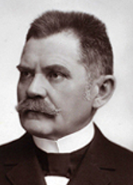**Bleyer Jakab** (Dunacséb, [1874](http://hu.wikipedia.org/wiki/1874). [január 25.](http://hu.wikipedia.org/wiki/Janu%C3%A1r_25.) - [Budapest](http://hu.wikipedia.org/wiki/Budapest), [1933](http://hu.wikipedia.org/wiki/1933). [december 5.](http://hu.wikipedia.org/wiki/December_5.)) irodalomtörténész, egyetemi tanár, miniszter, az MTA tagja.

Az újvidéki állami gimnázium után a kalocsai jezsuita gimnáziumban érettségizett. A budapesti tudománye-gyetemen magyar-német szakos középiskolai tanári és bölcsészdoktori oklevelet szerzett.

1897-től állt munkába előbb budapesti gimnáziumi, majd 1900-tól [soproni](https://hu.wikipedia.org/wiki/Sopron) főreáliskolai tanárként dolgozott.

A 20. század elején állami ösztöndíjjal a müncheni és a lipcsei egyetemen továbbképzésben vett részt, hol ger-manisztikát tanult. Hazatérve 1905-től a székesfővárosi tudományegye-temnek lett magántanára, de már 1908-ban meghívást kapott a [kolozsvár](https://hu.wikipedia.org/wiki/Kolozsv%C3%A1r)i Ferenc József Tudományegyetemre a német nyelv és irodalom tanárának.

1911-től a budapesti egyetem hívására, ny. r. tanárként visszatért egyetemi tanulmányai színhelyére. [Petz Gedeonnal](http://hu.wikipedia.org/wiki/Petz_Gedeon) a neves germán filológussal közösen megalapította az egyetem *[Germanisztikai Intézetet](http://hu.wikipedia.org/w/index.php?title=Germanisztikai_Int%C3%A9zetet&action=edit&redlink=1)ét.* Időközben a  [*Budapesti Philológiai Társaság*](https://hu.wikipedia.org/w/index.php?title=Budapesti_Philol%C3%B3giai_T%C3%A1rsas%C3%A1g&action=edit&redlink=1) titkári teendőit is ellátta.

A magyarországi németség érdekvédelmét már igen korán felkarolta, 1917-ben jelent meg programszerű tanulmánya *„A magyarországi német-ség”* *„Das ungarländische Deutschtum”* címmel. Az 1895-ben alapított *Katolikus Néppártban* kezdett politizálni, a konzervatív katolikus párt a nemzetiségi konfliktusokat és különösen az iskolaügyet, tárgyalásos úton, kompromisszumokkal kívánta megoldani. Bleyer nemzetiségpolitikai programjának alapja a német etnikum megőrzése és ápolása, valamint a magyarok melletti lojalitás képezte.

A magyar birodalom bukásának zűrzavarában, 1918. őszén Bleyer Jakab megalapította *Német-Magyar Néptanács* (*Volksrat der Deutsch-Ungarn*) nevű érdekvédelmi szervezetet, követőivel a kezdetektől az álltala szélhá-mosnak tartott a Károlyi Mihály vezette (*[őszirózsás forradalom](https://hu.wikipedia.org/wiki/%C5%90szir%C3%B3zs%C3%A1s_forradalom))* változás ellen foglaltak állást. Bleyert az 1919 tavaszától létrejövő kommunista ál-lamszervezet, egyetemi tanári katedrájától megfosztották, és még politi-kailag üldöztetésnek is ki volt téve. Az akarotos bácskai sváb azonban nem esett kétségbe, csatlakozott a magát [*Fehérház Bajtársi Egyesületnek*](https://hu.wikipedia.org/wiki/Feh%C3%A9rh%C3%A1z_Bajt%C3%A1rsi_Egyes%C3%BClet) ne-vező ellenforradalmi csoporthoz. Az egyesület fellépet az időközben meg-bukott *„proletárhatalmat”* váltó, szociáldemokrata [Peidl-kormány](https://hu.wikipedia.org/wiki/Peidl-korm%C3%A1ny) ellen.

A kalandos életű [Friedrich István](https://hu.wikipedia.org/wiki/Friedrich_Istv%C3%A1n) vezetésével, valamint a magszálló antant hatalmak jóváhagyásával [1919](https://hu.wikipedia.org/wiki/1919).  [augusztus 6](https://hu.wikipedia.org/wiki/Augusztus_6.)-án letartóztatták  az önjelölt miniszterelnököt és kormányát. Bleyer Jakabot, Friedrich István kor-mányában 1919. augusztus 15-én tárca nélküli kisebbségi miniszterré ne-vezték ki.

Bleyer felfogása szerint csak a magyar nemzet létezett, tehát a nemzet kisebbségek érdekeit alárendelte a nemzeti-magyar identitásnak, küzdött a nyugat-magyarországi németlakta területek Ausztriához csatolása ellen. A már 1917-ben kinyilvánított *"német-magyar ideológiájában"* alapelve *a németség és a magyarság közötti oszthatatlan harmónia*, és ezt csak a magyar állam szavatolhatta.

Az [1920](https://hu.wikipedia.org/wiki/1920). [december 16-áig](https://hu.wikipedia.org/wiki/December_16.)  tartó kormányzati szerepe, a nemzeti kisebb-ségek tárca nélküli minisztereként egyaráént tagja volt volt a [Huszár-](https://hu.wikipedia.org/wiki/Husz%C3%A1r-korm%C3%A1ny), a [Simonyi-Semadam-](https://hu.wikipedia.org/wiki/Simonyi-Semadam-korm%C3%A1ny) és az [első Teleki-kormányn](https://hu.wikipedia.org/wiki/Els%C5%91_Teleki-korm%C3%A1ny)ak. A konszolidáció év-tizedében 12 esztendeig a Pázmány Péter Tudományegyetemen a *Német Irodalomtörténeti Intézet* igazgatója volt. Bleyer a magyar nemzeti kon-zervatív elit képviselőjeként támogatta Horthy Miklóst, és 1919. őszétől abban reményben, hogy a "német-magyarok" törekvései egyebevágnak a jövendő magyar etnopolitikával.

A párizsi békekonferencia határozatai álltal felkorbácsolt nemzeti elé-gedetlenség hangulatában Bleyer 1920. novemberében bejelentette lemon-dását. Az 1920. júliusától miniszterelnök gróf Teleki Pál arra kérte, hogy az Ausztriával való határtárgyalások idejére térjen vissza, tehát Bleyer egyenlőre maradt. Azonban ez év december 16-án bekövetkezett kormány-átalakításkor már nem jelölték miniszternek.

Bleyer az 1921-ben általa alapított *Sonntagsblatt für das deutsche Volk in Ungarn* c. folyóiratában a falusi sváb népességet a patrióta és revíziós Tria-non ellenes nevelésben részesítette. 1924. nyarán részt vett a Magyaror-szági Németek Népművelési Egyesülete *"Ungarländischer Deutscher Volksbildungsverein"* (UDV) szervezetet megalapításában, melynek 1933-ig ügyvezetője volt. A szervezet az anyanyelvű oktatás teljes körű létre-jöttét tekintették legfőbb céljuknak, azonban még a hatalommal szorosan együttműködő Bleyer sem talált megoldást az iskolakérdésre, noha ez volt leginkább a szívügye.

A németországi események valószínüleg hozzájárultak ahhoz, hogy a nevezetes 1933-as esztendő május 9-ei országgyűlési ülésén Bleyer Jakab keresztény konzervatív képviselőként a magyarországi német kisebbség érdekeiért szólalt fel, mellyel a kivívta a magyar irredenta körök (Bajcsy-Zsilinsky Endre kardpárbajra hívta ki) és a budapesti egyetemisták viha-rosan megnyilvánuló ellenszenvét. Gratz Gusztáv a *Magyarországi Néme-tek Népművelési Egyesülete* elnöke, addigi harcostársa is elhatárolódott tőle, és maga a Berlinből delegált budapesti német nagykövet is felszólí-totta Bleyert arra, hogy a továbbiakban ne "zavarja" Berlin külpolitikai együttműködését a magyar kormányzattal.

Bleyer Jakab ezek után teljesen megtörve, visszavonultan és mindenkitől elzárkózva halt meg 1933. december 5-én Budapesten.A [müncheni](http://hu.wikipedia.org/wiki/M%C3%BCnchen) *Német Akadémia tanácsának*, valamint a *[tübingai](http://hu.wikipedia.org/wiki/T%C3%BCbinga) egyetemi* tanácsnak tiszteletbeli tagja. [Nevét viseli a budaörsi *Bleyer Jakab Német Nemzetiségi Általános Iskola*.](https://www.budaors.hu/?module=news&action=show&nid=45762) Fontosabb művei: *A magyar-hun monda germán elemei* (1906), *Gottsched hazánkban* (1909), *Hazánk és a német philologia a 19. sz. elején* (1910), *A hazai németség* (1917).

[Forrás: *Magyar életrajzi lexikon.*](https://www.google.rs/url?sa=t&rct=j&q=&esrc=s&source=web&cd=19&ved=0ahUKEwiskd-CjbDcAhUD3qQKHXFYBjgQFghwMBI&url=https%3A%2F%2Fwww.arcanum.hu%2Fhu%2Fonline-kiadvanyok%2FLexikonok-magyar-eletrajzi-lexikon-7428D%2Fb-74700%2Fberegfy-karoly-berger-74B3D%2F&usg=AOvVaw3AHr7BTk6b4T2IGP1ALCI9) Fata Márta: *Bleyer Jakab nemzetiségi koncepciója és politikája (1917-1933)* Gerhard Seewann: *A „német-magyarok” szószólója Jakob Bleyer*

**Bogárdi** *Bogner* **János** (Torontáltorda, 1909. június 11. - Budapest, 1998. november 18.) vízépítő mérnök, egyetemi tanár, az MTA tagja.

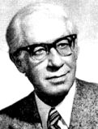Középiskolai tanulmányait az akkor már a Szerb-Horvát-Szlovén Királyságban lévő Nagybecskereken fejezte be 1927-ben. Ezt követően a királyi József nádor Műegyetem (a mai Budapesti Műszaki Egyetem) mér-nöki osztályán szerzett - évfolyamából elsőként - építőmérnöki oklevelet. Mérnökhallgatóként részt vett a Rábán épülő nicki duzzasztómű tervezésében.

1932-ben magánvállalati mérnökként a Hanság-főcsa-torna kotrásán dolgozott, majd 1933-ban a folyammérnöki hivatalnál hlyezkedett el. Katonai szolgálata idején 1934-ben változtatta nevét Bo-gárdira. Ezt követően, egészen 1940-ig az *Állami Vízügyi Szolgálat* kere-tében, valamint a nyíregyházi (hol ármentesítési, belvízrendezési kérdé-sekkel), és a győri (hol a kisvízszabályozási feladatokkal) *Vízügyi Szolgá-lat*nál dolgozott. 1937-ben a kecskeméti Jogakadémián felsőfokú közgaz-dasági és jogi tanulmányokat is folytatott, sőt a magyaróvári Gazdasági Akadémián 1939-ben gazdasági szakvizsgát tett. Egy kis kitérővel 1937-1938-ban amerikai ösztöndíjasként az Iowai Egyetemen képezte tovább magát, hol *Master of Science* fokozatot szerzett.

Hazatérve a második világháború idején a Vízrajzi Intézet főmérnöke volt. 1940-41 telén részt vett a dunai árvédekezésben, majd a Duna Budapest-Paks közti szakaszának általános szabályozási tervét készítette el.

A háborút követően kinevezték az *Országos Vízjelző Szolgálat* vezetőjévé.

A Vízrajzi Intézetnek 1945-től 1995-ig igazgatójaként, ezt követően 1962-ig az álltala alapított kísérleti osztály és a hidraulikai laboratórium veze-tőjeként a VITUKI-ban (Vízgazdálkodási Tudományos Kutatóintézetben) dolgozott. 1946-tól óraadója, illetve megbízott előadója az I. sz. Vízépítés-tani tanszéknek.

1947-ben a Műegyetemen egyetemi magántanári képesítést szerzett. 1962-től egészen 1979-es nyugdíjazásáig a Műegyetem Vízépítési tanszékén a hidromechanika, a hidraulika tárgyából tartott előadásokat.

Pályája során (szakmai tekintélye, angol, német, szerb és orosz nyelv-tudása) több külföldi egyetemen megfordult vendégprofesszorként: 1964–1965-ben az egyesült államokbeli Iowai, Utahi és Coloradói Egyetemeken, 1966 és 1978 között a Padovai Egyetemen volt vendégprofesszor, emellett a belgrádi, a bécsi, és a karlsruhei műszaki egyetemeken is előadott.

Rendszeresen előadott az UNESCO égisze alatt működő budapesti és pa-dovai nemzetközi hidrológiai posztgraduális tanfolyamokon. Az Élelme-zésügyi és Mezőgazdasági Világszervezet (FAO) szakértőjeként több külföldi tanulmányúton (Belgrádban és Rómában) is részt vett.

Hazai és nemzetközi közéleti tevékenysége igen kiterjedt volt. Az MTA *Vízgazdálkodástudományi Bizottságának elnöke*. A *Meteorológiai Világ-szervezet* (WMO) Európai Tagozata Hidrológiai Munkabizottságának el-nöke és szakcsoport vezetője. A *Nemzetközi Öntözési és Belvízlevezetési Bizottság* (ICID) alelnöke, valamint a Magyar Nemzeti Bizottságának el-nöke (1965-69), a Nemzetközi Hidraulikai Kutatási Szövetség (IAHR) vezetőségi tagja (1971-77), alelnöke (1973-77) stb.

Nevéhez fűződik a magyarországi folyóvizek hordalékszállítását mérő or-szágos törzshálózat megszervezése. Behatóan tanulmányozta a belvízren-dezéshez elengedhetetlen lefolyási tényezőket, a levezetendő vízmennyi-ség függvényében kidolgozta a fajlagos vízhozam [korrelációszámítási](https://hu.wikipedia.org/wiki/Korrel%C3%A1ci%C3%B3) el-járását, amely a felszíni vízelvezető csatornák tervezése és telepítése során alkalmazható. A [talajvíz](https://hu.wikipedia.org/wiki/Talajv%C3%ADz) változásának, dinamikájának törvényszerűségeit vizsgálva egyebek mellett felismerte a [meteorológiai](https://hu.wikipedia.org/wiki/Meteorol%C3%B3gia) tényezők és a talaj-víztükör összefüggéseit.

Szakkönyvei mellett jelentős tevékenységet fejtett ki az egyetemi jegyzet- és tankönyvírás, valamint a tudománynépszerűsítés területén (hidraulika, hidromechanika, vízgazdálkodás stb.). 1947-től 1955-ig a *Magyar Vízrajzi Intézet Tanulmányai* című kiadványsorozat szerkesztője volt.

1993-ban Széchenyi-díjat kapott a folyami hidraulika és a vízmérnöki tudományok terén kifejtett életművéért.

Főbb magyar nyelvű művei: *Vízfolyások hordalékmérései* (1947)*, A buda-pesti Duna-hidak vízduzzasztása* (1947)*, Korrelációszámítás és alkal-mazása a hidrológiában* (1952)*, A hordalékmozgás elmélete* (1955)*, A vízfolyások hordalékszállítása* (1971)*, Környezetvédelem-vízgazdálkodás* (1975)*, Kutatási jelentések a vízgazdálkodásban (1980) stb.*

Források: *Új magyar életrajzi lexikon I. Ki kicsoda: Életrajzi lexikon. * *Ma-gyar nagylexikon.  *

**Bogdánffy Szilárd** ([Feketetó](https://hu.wikipedia.org/wiki/Feketet%C3%B3), [1911](https://hu.wikipedia.org/wiki/1911). [február 21.](https://hu.wikipedia.org/wiki/Febru%C3%A1r_21.) – Nagyenyed, 1953. ok-

tóber 2.) püspök, vértanú.

Az örmény származású Bogdánffy családban született, a gimnáziumot a Temesvári piaristáknál végezte, 1929-ben érettségizett. Teológiai tanulmányait a nagyváradi Teológiai Akadémián, majd a  budapesti  Központi Papnevelő Intézetbe  került. Budapesten hamarosan fel-figyeltek a “komoly lelki életéről és elmélyült biblikus érdeklődéséről” is tanúságot tevő fiatal teológusra.

1934 nyarán tért vissza Nagyváradra, ahol felszentelése évében a szatmári 

papnevelő intézetben kezdte meg szolgálatát helyettes tanárként, majd egy évvel később a nagyváradi Szent József Intézet hittanára és lelkésze volt. 1938-tól az Orsolya-rend által vezetett Tanítóképző Intézetben is elvállalta a lelkivezetői és hittanári feladatot. E sokrétű munkája következtében kap-csolatba került szinte az egész város fiatalságával, és nagy népszerűségre tett szert körükben. Életének következő másfél évtizedét a katolikus ifjúság oktatásának és lelki nevelésének szentelte. A tanulóifjúság körében hamar népszerűvé vált fiatal papot 1939 noveberében a román hatóságok koholt vád alapján letartóztatták, megkínozták, majd állampolgárságától megfosztva kitoloncolták Magyarországra.

1940 szeptemberében a magyar hadsereget követve visszatért Nagyvárara, ahol Márton Áron gyulafehérvári püspök kinevezte teológiai tanárnak a nagyváradi Papnevelő Intézetbe a papi szeminárium lelki vezetésével. A budapesti Pázmány Péter Egyetem Hittudományi Karán 1943-ban meg-védte *A szinoptikus apokalipszis* című doktori értekezését. A nyilas hata-lomátvételt követően részt vett az üldözöttek mentésében.

1945 őszén az Orsolya-rend lelki vezető nélkül maradt növendékei számá-ra pápai jóváhagyással megalapította a *Merici Szent Angéla* harmadrendet. 1947 tavaszán Scheffler János püspök kérésére tanári működését félbe-szakítva Szatmárra költözött, ahol a püspök bizalmasaként a bukaresti apostoli nunciatúra összekötője volt. A kommunista Romániában egyre fo-kozódó keresztényüldözés közepette G. P. O’Hara nunciaturai régens 1949. február 14-én titkos püspökké szentelte.

Alig két hónappal később letartóztatták, és négy éven keresztül minden jogalap nélkül tartották fogva. 1953. október 2-án a nagyenyedi börtönben belehalt az elszenvedett kínzásokba. Sírhelye ismeretlen, ugyanis holttes-tét egy rabtemetőbe temették, melynek helyét később beépítették.

2010. október 30-án avatták boldoggá a nagyváradi székesegyházban.

Források: *Isten szolgája Dr. Bogdánffy Szilárd rövid életrajza*

**Bohn Alajos** (Újarad, [1879](https://hu.wikipedia.org/wiki/1879). november 16. – [Baden bei Wien](https://hu.wikipedia.org/wiki/Baden_bei_Wien), [1937](https://hu.wikipedia.org/wiki/1937). janu-ár 7.) építész.

Édesapja a német anyanyelvű Alois Johann Bohn Csatádról nősült felesége szülővárosába, Újaradra. Bohn az iskolában főleg rajzolásban jeleskedett, és élete e kezdeti szakaszában nyert néhány díjat is.

1898-tól 1901 márciusa végéig elvégezte a budapesti Műegyetem négy téli félévét. Ezután néhány építésszel dolgozott együtt, 1894-től 1897-ig gyakornokként és rajzolóként az aradi szerb építésznél, Tabakovits Emil-nél dolgozott. Keresztnevét ettől kezdve magyarul, Alajosként írta alá.

1897. július 1-jétől 1905. február 15-ig ezután a híres budapesti építész, 

[Alpár Ignác](https://hu.wikipedia.org/wiki/Alp%C3%A1r_Ign%C3%A1c) irodájában dolgozott, aki többek között őt bízta meg a város-ligeti [Magyar Mezőgazdasági Múzeum](https://hu.wikipedia.org/wiki/Magyar_Mez%C5%91gazdas%C3%A1gi_M%C3%BAzeum) építésének művezetésével. Fellner és Helmer bécsi közös irodát fenntartó építészek Alpár ajánlatára 1904-ben őt kérték fel a *Kolozsvári Nemzeti Színház *építésének vezetésével, melyet 1906-ra sikeresen teljesített. Nagyon gyümölcsöző volt tevékeny-sége a Fellner és Helmernél, amely a monarchia határain túl is jól ismert volt. Fontos szerepet játszott néhány műemléki épület tervezésében, és felügyelte építésüket művezetőként, különösen Kolozsvárott.

1910–11-ben a híres *szentesi városháza* Bohn tervei szerint és az ő irányí-tása alatt épült. 1910–11-ben Szentesen felépítette a figyelemre méltó kendergyárat és a kenyérgyárat az ún. Huszártorony alatt. *A szentesi pol-gári leányiskola* eklektikus stílusú épülete az ő tervei alapján készült, 1912–13-ban. 1914-ben a *Petőfi Sándor Általános Iskola* eklektikus épüle-tét tervei szerint építették. A szigetvári városháza tervpályázatán is részt vett. A Szatmári Iparosifjak Otthona részére emelendő épület tervpályá-zatán a 400 koronás első díjat Tóásó Pál, a 200 koronás második díjat Bohn építőművész kapta. A vajdahunyadi városi székház tervpályázatán az első díjat ifj. Opaterny Flórissal nyerte el. 1903-tól a Magyar Iparművészeti Társulat tagja volt.

1907-ben Baden bei Wienbe költözött, ahol építészstúdiót nyitott. Hama-rosan számos megrendelést kapott házak és villák építésére. A *Badeni Vá-rosi Színház* építésvezetői állását is megszerezte. 1913-ban a *Central mozi* építését irányította. Az első világháború kitörésekor [Temesváron](https://hu.wikipedia.org/wiki/Temesv%C3%A1r) szolgált, ahol a műszaki tanácsadó testületben az egészségügyi bizottság katonai testületét is vezette. Badenben 1926-ban létrehozott egy  [Ausztria](https://hu.wikipedia.org/wiki/Ausztria) hatá-rain túl is ismert termálfürdőt. A fürdő megépítése évében világszenzá-ciónak számított, mert akkoriban máshol még nem létezett ilyen létesít-mény, és számos ország szakértői látogatták meg.

Forrás: [*Bohn Alajos az oszk.hu-n*](http://mek.oszk.hu/17300/17349/17349.pdf)

**Bohn Mihály** (Szenthubert, 1864. - Menton 1930. decembere) nagy-vállalkozó.

A Bohn család tagjai tégla és tetőcserépgyártással fog-lalkoztak, téglagyáruk volt Nagykikindán, Szenthuber-ten, Károlyligeten és Zsombolyán.

Sógoraival, a szintén sváb téglagyáros Muschong Ja-kabbal és Schaaf Jakabbal, a nagykikindai és zsom-bolyai gyárak egyesítésével, *Bohn M. és társai* néven, zsombolyai központtal konszernt alapított. A társaság hamarosan terjeszkedésbe kezd, a 20. század elején tég-lagyárat alapítottak Krassó-Szörény vármegye székhelyén Lugoson is.

Bohn Mihály 1907-ben Békéscsaba délnyugati felén a téglagyártáshoz kedvező földterületet vett, itt épült meg (jaminai üzem) 1909-re a *Bohn M. és Tsa Gőztéglagyár*. [1910-ben](http://bekeswiki.bmk.hu/index.php/1910) megvásárolta az óbudai *Victoria* üzemet. Bohn Mihály megújjította a cserépgyártást, a hagyományos cserépformák mellett új típusokat vezetett be. [1911-ben](http://bekeswiki.bmk.hu/index.php/1911) hozták forgalomba a *„253-as Bohn Patent”* nevű cseréptípust, melyeket egy oroszlánnal és a Bohn feli-rattal jelölték. Vállalatának további fejlődését az első világháború kitörése akadályozta meg, a tapasztalt szakmunkások katonai behívókat kaptak. [1918](http://bekeswiki.bmk.hu/index.php/1918) végére az antant megszállás hatására a határon kívül került gyárai beszüntették a működésüket.

A Tanácsköztársaság idején a gyárak irányítását a termelési biztosok vet-ték át. [1920](http://bekeswiki.bmk.hu/index.php?title=1920&action=edit&redlink=1) őszére helyreállt a *maradék ország* működése (Horthy Miklós) és a termelés is újra indult. A nehéz helyzetre való tekintettel Bohn Mihály munkáskonyhát hozott létre és munkáslakásokat építtetett.

Bohn Mihály igazi régi vágású tőkés volt, nemcsak a péncsináláshoz értett de a szakmájához is konyított. A cserép és téglagyártáshoz kötődő szaba-dalmak sokaságát alkotta meg, sőt anyagtisztító gépét a Párizs és Berlinben is méltatták.

Békéscsabán [1926-ban](http://bekeswiki.bmk.hu/index.php/1926) téglagyára keretében megalapította, a Bohn SC labdarúgócsapatát. A fekete-fehér tizenegy az 1929/30-as terület bajnok-ságot veretlenül, 105-9-es gólkülömbséggel nyerte, így bekerültek az or-szágos amatőrbajnokság döntőjébe, 1930. július 27-én a Budapest bajnok Törekvés (vasutasok) volt az ellenfelük, kik 4-1-re legyőzték a fekete-fehéreket. Az 1931. évi amatőr bajnokságon viszont a csapat aranyérmet szerzett a Győri ETO ellen. Bohn Mihály ezt már nem érhette meg, miután a vállalat vezetését fiára bízta, Bohn Dél-Franciaországban Mentonban kezeltette magát. Ott hunyt el [1930](http://bekeswiki.bmk.hu/index.php/1930) decemberében. [1994](http://bekeswiki.bmk.hu/index.php/1994) óta emléktábla tiszteleg az általa épített zsombolyai templom falán.

Forrás: Csobai László: *Bohnék híres téglagyára.*

**Bonitz Ferenc** (Fehértemplom, 1868. augusztus 01. - Budapest, 1936, február 11.), újságíró, szerkesztő, miniszteri tanácsos.

Középiskoláit Fehértemplomban végezte, majd bölcsészhallgató Buda-pesten. 1888-ban Steiner Fülöp teológiai doktor a *Szent István Társulat *el-nöke, valamint 10 egyetemista ifjú közöttük (Bonitz ferenc és Zichy János gróf) megalapította a *Szt Imre Önképző Egylet-et* . C élul tűzték ki az egye-temi polgárok katolikus elméleti és gyakorlati képzését, katolikus öntudat-ra ébresztését és nevelését. A *Szent Imre Kör*, azaz a *Katolikus Egyetemi és Főiskolai Hallgatók Szent Imre Köre*, 1888. január 28. és 1946 között működött. Első tanárelnöke  [Breznay](http://lexikon.katolikus.hu/B/Breznay.html) Béla egyetemi tanár - a teológiai kar dékánja - volt, jelszava: *Vallás, haza, tudomány*. Vallásos jellege éven-kénti lelkigyakorlatokban, a *Szent Imre*-nap megünneplésében mutatkozott meg. Tagjai testületileg vettek részt az Egyház hazafias megmozdulásain.

Bonitz Ferenc újságíróként kezde pályafutását, 1891-től az ellenzéki egy-házpolitikai napilap, a sokrétű Lonkay Antal szerkesztésében  megjelent *Magyar Állam* belső munkatársa lett. 1894-től rövid ideig a *Fejérmegyei Napló-*nál is dolgozott*.* 1895-96-tól rövid megszkítással 1906-ig a dualista állam politikáját és a kormányzó *Szabadelvű Pártot* támogató politikai és közgazdasági napilap, az *Alkotmány* szerkesztője. Újraindítását követően 1896 után, konzervatív keresztény lapként tartották számon, az első való-ban politikai jellegű katolikus lap volt.

1896-ban Bernardin Freimuth *A zsidó vérgyilkosságok története napjain-kig* c. művének lefordításáért felekezeti izgatás címén perbe fogták.

1906-tól a miniszterelnökségi sajtóiroda munkatársa, 1918-ban minister-elnökségi titkár. 1914-1918 között irányította a vidéki hírszolgálatot.

1919-ben a német kisebbségi minisztériumban miniszteri tanácsos, majd ez év novemberétől a Huszár-kormány megalakulásakor a miniszterelnök-ségi sajtóiroda vezetője, e tisztét a Simony-Semadam-kormányban is meg-tartotta.

1920 augusztusában megvált hivatalától és az *Otthon Kör* alelnöke lett. 1921-ben rövid ideig szerkesztette a kőnyomatos *Dunapostát*. Pesti levele-zője volt a bécsi *Politische Korrespondenzblattnak*. A *Katolikus Népszö-vetség* számos német nyelvű kiadványát, naptárát szerkesztette, felelelős szerkesztője a *Christliches Volksblattnak*. 1921-1922 között a *Nemzeti Újság*, 1927-től a *Neues Politisches Volksblatt* szerkesztője. A *Délmagyar-országi Közlönybe* írt számos vezércikket a dákoromanizmus ellen s egy délvidéki magyar kulturegyesület érdekében.

Önálló művei: *Jön a tatár! Vagyis közelednek a követválasztások. A haza józan polgárainak nyújtotta egy néppárti (1896).* *Gróf Zichy Nándor élet- és jellemrajz (1912).* Forrás: [*Magyar Katolikus Lexikon*](http://lexikon.katolikus.hu/)

**Borbély Lajos** (Csóka, 1843. december 1. - Budapest, 1923. szeptember 29.) kohómérnök.

A csókai Marczibányi-uradalomban *(Réti major)* szü-letett. Az akkoriban megjelenő mezőgazdasági technika elbűvölte, így előbb a pozsonyi, majd a budai reálisko-lában végezte középfokú tanulmányait. Ez után követ-kezhetett a Bányászati és Erdészeti Főiskola Selmec-bányán, hol 1866-ban kohómérnöki oklevelet szerzett.

Abban az időben a külföldi tövábbképzés bevett szokás volt, így került a csehországi pribrami bányászati aka-démiára, majd ismereteit 1870-1872 között osztrák és német vasgyárakban tökéletesítette.

1867-ben állt szolgálatba, előbb a pénzügyminisztérium tisztviselője volt, majd elfogadta a *Diósgyőri Vas- és Acélgyár* mérnöki állását. Miután az 1870-es évek elején Andrássy Manó a *Vasgróf* létrehozta a Sajómenti vasműveket, átlépett a *Salgótarjáni Vasfinomító Társulat*-hoz, hol előbb üzemvezető mérnöke, majd műszaki igazgatója lett a vállalatnak. Az 1881-ben létrejött az ózdi és a salgótarjáni vállalat egyesüléséből a *„Rima”,* azaz a *Rimamurány-Salgótarjáni Vasmű Rt*., 1881-től egészen 1910-ig műszaki vezérigazgatója lett. Az *RMST* a századfordulón az ország harmadik leg-nagyobb vállalatává vállt! A részvénytársaság elnökének 1892-ben [Tisza István](https://hu.wikipedia.org/wiki/Tisza_Istv%C3%A1n)t választották, ki 1910 elején megalapította a Nemzeti Munkapár-tot.  Borbély Lajos is belépett a pártba és 1910-tól 1918-ig, az összeom-lásig volt az országgyűlés tagja a Borsod megyei Dédes választó kerü-letben.

1872-ben elsőként ismertette a regeneratív tüzelésű kemencéket, és Salgó-tarjánban építtetett is egyet. Ugyanott alkalmazta először az általa szer-kesztett kettős munkaterű, regeneratív tüzelésű kavarókemencét, mely a szakemberek előtt nevét külföldön is ismertté tette. A kohászat moderni-zációja mellett nevéhez fűződik a magyarországi bányászati szakoktatás kidolgozása, a salgótarjáni Iparostanonc Iskola megszervezése (1889). Az Országos Magyar Bányászati és Kohászati Egyesületnek 1892 és 1902 között alelnöke volt. Az MTA Wahrmann Mór-díját 1915-ben nyerte el.

Nevét őrzi a salgótarjáni *Borbély Lajos Szakközépiskola,* ugyanott utcát neveztek el róla. Szülőhelyén Csókán, hol a katolikus temetőben számos rokona nyugszik, iskolát alapított saját költségen. Borbély Lajos nevét emléktábla hirdette az általa épített iskola falán, de a hatvanas években ennek nyoma veszett (állítólag egy honpolgár megörzésében van).

Forrás: Dr. Vajda Pál: *Nagy magyar feltalálók, Magyar Életrajzi Lexikon,* *Cs. Simon István: Virulsz-e még, szülőföldem?*

**Breuer György** (Stájerlakanina, 1887. október 10. - Lovászi, 1955. június 11.) ornitológus, szakíró.

Szegeden érettségizett, majd a kereskedelmi akadémián végzett. A kor szokásának megfelelően kereskedelmi gyakornoknak Németországba  ment. Első állása egy Hessen környéki (Benrathban) bányavállalatnál volt.

Önkéntesi katonai évét, majd további kiképzési idejét  a krassói Karán-sebesen és a hunyadi Hátszegen  töltötte, végül tartalékos hadnagyi rendfokozattal szerelték le. A vonzódást a természet és az *ornitológia* iránt unoka-bátyja Barthos Gyula erdőmérnöktől örökölte, aki a *Retyezáton *(a Déli-Kárpátok  Hátszegi szakasza) egy erdőgondnokság vezetője volt.

1912-ben került Brennberbányára, lakása a nagykiterjedésű soproni erdő-ség mellett épült, a közelben volt a vízimadár paradicsom a Fertő tó. A ma-dárvonulásokat megfigyelte és észrevételeit publikálta, híve volt a *madár-védelem* gondolatának.

Az első világháború első esztendejét a soproni 18. gyalogezredben had-nagyként harcolta végig. 1915 januárjában orosz fogságba esett, a szibériai [Omszkba](https://hu.wikipedia.org/wiki/Omszk)n volt hadifokságban. Ernő nevű öccsével a [szibériai](https://hu.wikipedia.org/wiki/Szib%C3%A9ria) [Irkutszk-ba](https://hu.wikipedia.org/wiki/Irkutszk) kerültek, a fogolytábor az [Irtis](https://hu.wikipedia.org/wiki/Irtis) folyó mellett volt, így alkalma nyílott rá hogy élvezze Szibéria vad faunáját (a tisztekkel meglehetősen jól bántak). A fogolytábor laboratóriumba alkalmazták, ott szabadidejében és unal-mában madarakat és bogarakat preparált.

1918-ban az orosz forradalom zűrzavarában jutott végül haza. Brennberg-bányán, régi szolgálati munkakörében dolgozott tovább. Amikor [1927](https://hu.wikipedia.org/wiki/1927)-ben megalakult a [*Magyar Ornithológusok Szövetsége*](https://hu.wikipedia.org/w/index.php?title=Magyar_Ornithol%C3%B3gusok_Sz%C3%B6vets%C3%A9ge&action=edit&redlink=1), azonnal megszervezte a soproni tagozatot. A  fertői madárvárta Breuer György és a földbirtokos Esterházy Pál herceg együttműködésével jött létre. Tudományos munkás-sága alatt ornitológiai kutatásokat végzett, megfigyelte a madárvonulásokt, gyűrűzéseket hajtott végre és *elsőként épített madárvártát a Fertőn.*

A huszadik zázad ezúttal is kisértette, 1945 elején a nyilas uralom vég-óráiban házában szállásolták el Szálasi Ferenc nemzetveztőt. Breuert és feleségét Sopronkőhidáról az időközben bevonuló vöröskatonák szabadí-tották ki. A „svábok" kitelepítésekor két fiát, és két unokája Passauban hagyva kalandos úton visszatért hazájába. 1949-től a zalai Lovásziban a Bányászati Kutatóintézet ügyintézőjeként élt. Nagykanizsai éveiben visz-szatért a madártanhoz, majd az ornitológiának egy speciális ága foglalta le, a madárparaziták, elsősorban a tollatkák. Nevét egy Mallophaga-faj viseli: *Brüelia breueri Balát,* valamint a Nyugat-magyarországi Egyetem fertő-rákosi kutatóbázisa. Forrás: *Erdészportrék 4. *

**Brocky Károly** ([Temesvár](http://hu.wikipedia.org/wiki/Temesv%C3%A1r), [1807](http://hu.wikipedia.org/wiki/1807). [május 22.](http://hu.wikipedia.org/wiki/M%C3%A1jus_22.) – London, 1855. július 8.) festő.

A korán árvaságra jutó kis temesvári borbélyinast a város akkori polgármester felkarolta és az ottani rajz-iskolába járatta. A kis Brocky inkább a verseci Melegh Gáborhoz szegődött, kitől az olajfestés technikáját ta-nulta el. Weldin Ferenc temesvári polgármester az ifjú rokont továbbképzés végett Bécsbe küldte, talán vala-milyen műszaki tanulmány reményében.

1823 novemberében mégis a bécsi festészeti akadé-mián kötött ki, hol meseszerű szegénységben töltött el tíz esztendőt. A császárváros Képzőművészeti Akadémiáján az ifjabb Joseph Redl, Johann Ender és a felkapott portréfestő Karl Gsellhofer voltak a mesterei.

Érzékelhető hatást gyakorolt rá Leopold Kupelwieser is a neves oltárkép festő. Bécsben nagysokára felismerték tehetségét, kiállíthatott és maga a császári család is több ízben vette igénybe művészetét. Nagy segítségére volt a biedermeier mestere Moritz Michael Daffinger, kinek jóvoltából megrendelésekre tehetett szert, legalább többé nem kellett nélkülöznie. 1832-ben *Krisztus, Mária és Szent József* fejét, 1833-ban a temesvári *Wel-din család* három tagjának arcképét festette meg.

1835 tavaszán olaszföldre indult tanulmányútra, Rómában, azután Firen-zében, végre Velencében a nagy mesterek képeit másolta. Ezek eladásaiból tartotta fenn magát, sőt jutott pénz a vásárlásra is. Itt az olasz reneszánsz mesterek hatása alá került, hatásuk mitológiai tárgyú kompozícióin, akt-festményein ez a korszak munkássága végéig nyomon követhető.

Egyik legjelentősebb eklektikus stílusú műve (*Krisztus és a samáriai asz-szony*), a római reneszánsz mesterek hatását tükröző oltárképe a Felvidéki Eperjesi evangélikus templomának hagyományozott.

1836-ban tért vissza Bécsbe, ott sikerült berendeznie egy műtermet, ahol a hírnevet és elismerést szerzett a *Montleart hercegnőről* festett miniatú-rájával. Bécsben ezúttal csak röviden időzött, Párizsba tette át működé-sének színhelyét, hol főként a Louvre régi festményeinek másolásával foglalkozott, így tökéletesítve festői technikáját.

1836 őszén ismerkedett meg az angol romantika talán legnagyobb kép-viselőjével William Turnerrel, valamint álltala a neves brit irodalmár és műértővel H. A. Johnstone Munroval, aki miután látta Brockyt, hogy mi-lyen hitelesen másolta a 16. századi Velence festő fejedelmének Paolo Veronesenek egyik alkotását, a kiváló arisztokrata művészetbarát London-ba invitálta a magyar festőtehetségnek.

Később elkísérte pártfogóját annak skóciai birtokára is, ott miután meg-ihlette a skót táj kies szépsége jónehány gyönyörű, melankolikus hangulatú tájképet festett. 1838-ban Londonba költözött, hol Munro palotájában műtermet rendezett be, Brocky Károlynak, ki így a főnemesség keresett portréfestőjévé vált (*Viktória királynő és Albert herceg* portréja, 1841).

Az 1839-es a *Royal Academy-*n *tartott* tárlaton több műve lett kiállítva, míg a 19. század elején alapított, és rangot jelentő *British Insitution* magán szalonban 1840-ben állított ki először. Itt készítette illuminált (a Nap által történő megvilágosodás) krétarajzait; rajzolt tanulmányfejeket, festett szentképeket és tájképeket, mitológiát és nagyon sok arcképet.

Az angliai sikerit megalapozta az ismert műkersekedő és galériatulajdonos D. C. Colnaghival kötött barátsága, ez megnyitotta Brocky számára a brit arisztokrácia tagjaival való kapcsoltatteremtés lehetőségét. A Hamilton család megrendelésére megfestette lady *Charlotte Talbot*, majd pedig *Miss Liddel* udvarhölgy arcképét.

Akvarelljeivel sikereket aratott, ennek eredménye-ként [1854](https://hu.wikipedia.org/wiki/1854)-ben a *Brit Akvarellfestők Királyi Akadé-miája* [1854](https://hu.wikipedia.org/wiki/1854)-ben tagjává választotta. *- önarckép -*

Sikere azonban nem tartott sokáig, nyers szókimon-dásának köszönve, átmenetileg kikerült az arisztokrácia kegyeiből.

Állítólag nem akarta megfesteni a gyermek trónörökös (a későbbi VII. Edward) képmását. Más vélemény szerint a mitológiai képein megfestett aktokkal szembeni prüdéria okozta kegyvesztését.

A váratlanul kialakult súlyos betegségéből már nem tudott felépülni, halála előtt a *Kánai menyegző* című festményét, habárt azt maga Viktória király-nő akart megvenni, a magyar hazára hagyta. Ezentúl szintén szülőhazájára hagyta az ebédlőjében függő legkedvesebb képét, a *Vénusz és Kupidó* cí-műt. Barabás Miklós 1843-ban kereste fel Brockyt Londonban, az ő révén jutott Magyarország először annak a tudatára, hogy milyen nagy művész hazánkfia él Londonban.

Foglalkozott magyar tárgyú festményekkel is, az 1848-49-es szabadság-harc után Angliába menekülő magyarok közül megfestette *Kmety György* és *Mészáros* arcképét, mely arcképek csak az abszolútizmus  bukása után jutottak a *Magyar Nemzeti Múzeum Történelmi Képcsarnokának* birtoká-ba. Magyarországon neve csak az 1896. évi millenáris kiállítás óta vált ismerté, amikor a jórészt arcképekből álló 29 festményét állították ki.

A 20. század elején báró Hatvany Ferenc jóvoltából a Wilkinson-hagya-tékból szerencsésen hazakerült vázlatgyűjteménye.

A művészettörténészek szerint *„ A festőművészetnek bár minden válfajá-ban otthonos volt, mégis az arcképfestés volt az ő igazi zakmája. Brocky Károly Európának is egyik elsőrangú festőművésze volt.“*

Több munkája brit magángyűjteményekben, a londoni *British Museum-ban*, a *Viktoria And Albert Múzeumban* található. A Magyar *Nemzeti Galé-ria* örzi mitológiai jeleneteit (*Vénus és Ámor*, 1850.), a Paolo Veronese festménye nyomán készítette *Krisztus és a szamáriai asszony* című akva-relljét (1840). Műveit még a *Magyar Nemzeti Múzeum* és a *Herman Ottó Múzeum *is örzi.

Forrás: Szentkláray Jenő: *Brocky Károly festőművész élete* 1907. Nyáry S.: *Brocky Károly festőművész élete és művei* 1910. *Magyar művészeti kislexikon. 2002. *

**Brummer József** ([Zombor](https://hu.wikipedia.org/wiki/Zombor), [1883](https://hu.wikipedia.org/wiki/1883). [október 22.](https://hu.wikipedia.org/wiki/Okt%C3%B3ber_22.) - New York, 1945.  április 14.) szobrász, műkereskedő.

1899-ben a budapesti Iparművészeti Iskola növen-déke lett, az iskola elvégzése után 1904-ben Mün-chenben, majd Párizsban folytatta tanulmányait.

1905 tavaszán Brummer a  [nagybányai művésztelep-re](https://hu.wikipedia.org/wiki/Nagyb%C3%A1nyai_m%C5%B1v%C3%A9sztelep) került, Réti István tanítványa a nagybányai sza-badiskolában.

Budapesten és Szegeden is dolgozott, itt modern szobrászati törekvéseit nem értették meg. 1907-ben barátjával, Cs. Joachim Ferenccel visszatért Párizsba, hol Rodin tanítványa lett, a mester új szellemű plasztikái voltak nagy hatással voltak rá.

Műkereskedő hírnevét egy egzotikus tárgyakat árusító ház létesítésével alapozza meg. Meggazdagodva, pazar műtermet rendezett be, szobraival rendszeresen szerepelt a párizsi tárlatokon. A szobrászattal egyidőben gra-fikai stúdiumokat folytatott Matisse magánakadémiáján.

Kapcsolata a párizsi művészekkel egyre jobban kiszélesedett, miután mű-kereskedését az első világháború után New Yorkba tette át. Az újvilágban jelentős kiállításokat rendezett, elsősorban az álltala ismert francia tehet-ségeknek, mint pl. Maillolnak, Brancusinak és Matisse-nak. Czóbel Béla festményeit New Yorkban a *Brummer Galéria* állította ki. Brummer József dúsgazdag üzletemberként is fontosnak tartotta, hogy Budapestnek ajándé-kakozza Despiau-nak *női portréját* mely mű a *Szépművészeti Múzeumba* került. 1911-ben pedig Munkácsy Mihály *A főpap* című festményét ado-mányozta a szegedi *Móra Ferenc Múzeumnak*. Haláláig birtokolta a világ legdrágább műtárgyát, a *Guennol-oroszlán-*t.

Forrás: *Szelesi Zoltán:* *Szeged képzőművészete című tanulmánya*

**C, Cs, Cz**

**Cherrier Miklós** ([Nagyősz](http://hu.wikipedia.org/wiki/Nagy%C5%91sz), [1790](http://hu.wikipedia.org/wiki/1790). [június 8.](http://hu.wikipedia.org/wiki/J%C3%BAnius_8.) - [Pozsony](http://hu.wikipedia.org/wiki/Pozsony), [1862](http://hu.wikipedia.org/wiki/1862). [december 18.](http://hu.wikipedia.org/wiki/December_18.)) bölcselet- és hittudós.

A Bánságba egykor nagyszámú francia család telepedett be, a 18. század-ban a Habsburg uralom alatt lévő lotaringiai emigráns családban született.

A gimnáziumi évek után a csanádi egyházmegye növendékeként, a pesti [magyar](https://hu.wikipedia.org/wiki/Magyarorsz%C3%A1g)  királyi egyetemen hittudományt hallgatott. 1813-ban végzett ta-nulmányaival, mikor hittudori rangot nyert. A *szent rendek* fölvétele után 

visszatért egyházmegyéjébe, hol a sváb lakosságú [Zsombolyára](https://hu.wikipedia.org/wiki/Zsombolya) került se-gédlelkésznek. [1814](https://hu.wikipedia.org/wiki/1814) októberében  érkezett Temesvárra, az ott székelő és a magyar nemzeti ügyet pártoló [Kőszeghy László](https://hu.wikipedia.org/wiki/K%C5%91szeghy_L%C3%A1szl%C3%B3)  [csanádi püspök](https://hu.wikipedia.org/wiki/Csan%C3%A1di_p%C3%BCsp%C3%B6ks%C3%A9g)höz, aki maga mellé vette levéltárnoknak. Mint püspöki szertartó az ünnepélyes szertartásokat szervezte, egyben az egyházi rendszabálynak megfelelően szentszéki jegyzőként hat évig intézte a püspökség peres ügyeit.

Az 1819-es esztendőben az esztergomi főegyházmegyébe került át. A [Rad-nay Sándor](https://hu.wikipedia.org/w/index.php?title=Radnay_S%C3%A1ndor&action=edit&redlink=1) hercegprímás álltal patronált [nagyszombati](http://hu.wikipedia.org/wiki/Nagyszombat) [érseki](http://hu.wikipedia.org/wiki/%C3%89rsek) líceum mennyiségtan tanárává nevezték ki. Különben a hercegprímás volt az aki Nagyszombatból Esztergomba helyezte vissza Magyarország egyházi köz-pontját. Cherrier Miklós évtizedeket töltött el a tanintézetben, míg elő-léptették az egyházi jog és történet tanszékére.

Cherriert a hercegérsek [1840](https://hu.wikipedia.org/wiki/1840)–[1841](https://hu.wikipedia.org/wiki/1841)-ben nyugati tanulmányi körútra küldte, [Bajor](https://hu.wikipedia.org/wiki/Bajororsz%C3%A1g) és Poroszországban, [Svájc](https://hu.wikipedia.org/wiki/Sv%C3%A1jc)ban,  [Belgium](https://hu.wikipedia.org/wiki/Belgium)ban, és Franciaországban is végzett tanulmányokat. Londonban [Anglia](https://hu.wikipedia.org/wiki/Anglia) fővárosában a felekezetileg vegyes házasságok ügyét kutatta.

Hazatérte után [1843](http://hu.wikipedia.org/wiki/1843) [májusában](http://hu.wikipedia.org/wiki/M%C3%A1jus_13.) pozsonyi kanonokká, majd [1846](http://hu.wikipedia.org/wiki/1846)-ban a pozsonyi tankerület főigazgatójává és királyi tanácsossá nevezték ki.

A reformkor utolsóm 184[7](http://hu.wikipedia.org/wiki/1848)-1848. évi pozsonyi országgyűlésen mint [káp-talani](http://hu.wikipedia.org/wiki/K%C3%A1ptalan) követ vett részt. A forradalom és szabadságharc idején 1848-49-ben hű maradt a Habsburg-házhoz, így elkerülték azok a megtorlások, melyek a nemzeti ügy mellett felsorakozó katolikus egyházi személyeket étintette.

Cherrier történetíróiként ellene volt a forradalmi változásoknak, a refor-mkori politikát az egyház szemszégéből ítelte meg és azt rendkívül veszé-lyesnek tartotta. Irásaiból kitűnik, hogy minden változást veszélyesnek tartótt, konzervativ felfogása a katolikus egyház érdekeinek és kiváltsá-gainak a minden eszközzel való megörzését szolgálta. Az 1856-ban kiadott *magyar egyháztörténeti monográfiájában* az 1848-as forradalmat nemzeti szerencsétlenségnek, híveit lázadóknak minősítette. Művei németül, lati-nul és magyarul jelentette meg. Forrás: *[Magyar Katolikus Lexikon](http://lexikon.katolikus.hu/).* [Sziny-nyei József](https://hu.wikipedia.org/wiki/Szinnyei_J%C3%B3zsef_(bibliogr%C3%A1fus)): [*Magyar írók élete és munkái II.*](http://mek.oszk.hu/03600/03630/html/toc/c.htm)1893.

**Csalog** *Csalogovits* **József**, (Pancsova, 1908. márdius 13. - Budapest, 1978. május 06.) régész, néprajzkutató.

A [pécsi](http://hu.wikipedia.org/wiki/P%C3%A9cs) [Erzsébet Tudományegyetem](http://hu.wikipedia.org/wiki/Erzs%C3%A9bet_Tudom%C3%A1nyegyetem) történelem-föld-rajz szakos hallgatója, majd 1930-ban a [Pázmány Péter Tudományegyetemen](http://hu.wikipedia.org/wiki/P%C3%A1zm%C3%A1ny_P%C3%A9ter_Tudom%C3%A1nyegyetem) bölcsészdoktori oklevelet szerzett archeológiából, földrajzból és az ókori népek történe-téből.

Már egyetemi hallgatóként 1928-1930 között [önkéntes](http://hu.wikipedia.org/wiki/%C3%96nk%C3%A9ntes_munka) gyakornokként dolgozott a [*Magyar Nemzeti Múzeum*](http://hu.wikipedia.org/wiki/Magyar_Nemzeti_M%C3%BAzeum) régészeti osztályán. Igy számos érdekes hazai és kül-földi ásatás részese lehetett, közreműködött a híres-neves ősrégész Ger-hard Bersu *goldbergi* (Nördlin-völgy) feltárásán.

1931-1932 között a berlini [*Collegium Hungaricum*](http://hu.wikipedia.org/w/index.php?title=Collegium_Hungaricum_%28Berlin%29&action=edit&redlink=1) ösztöndíjasaként a *Museum für Vor- und Frühgeschichte* (a keretében van a szintén világhírű Pergamon-múzium) vendégkutatója lehetett. Ezt követően 1936-ig Görög-országban végezhetett régészeti kutatásokat.

Első hazai állása a szekszárdi vármegyei múzeumban volt, ahol 1932-től régész munkatársaként dolgozott. Ennek az intézményben 1933-1946 között az igazgatói feladatokat is ellátta. A Szekszárdon eltöltött években ásatásokat folytatott, a *dunaföldvári mamutlelet* és a kányai kocsiurna megmentése kötődik a nevéhez. Feltárta az *Őcsény-tótvölgyi avar temető*t, valamint az 1550-es években a törökök kezétől megsemmisült apátsággal rendelkező Ete (*Ette város*) területén végzett ásatások.

Foglalkozott a Tolna megyei Sárköz őshonos népművészetével is, tanul-mányozta a helyi építkezési illetve temetkezési szokásokat. Múziumában új leltározási rendszert vezetett be, korszerűsítette a kiállítások régi tárlóit, ezekből 1936-ban új néprajzi állandó kiállítást rendezett be. Az elsők között foglalkozott a mohácsi busójárással is.

Szekszárd után az ország több múzeumában is dolgozott: 1946-1948 kö-zött a *pécsi városi múzeumban*, 1949-1951 között a keszthelyi *Balatoni Múzeum*, 1951-1954 között a jászberényi *Jász Múzeumot* vezette.

A *Jász Múzeum* munkatársaként jelentős terepbejárásokat végzett az el-pusztult Ágó és Boldogháza falvak térségében, vizsgálta a jákóhalmi kelta temetőt, ásatást végzett többek között Borsóhalmán.

A néprajzi gyűjtések szorgalmazásán túl a műemlékvédelemre is nagy gondot fordított. Szentesen is részt vett a múzeum néprajzi és régészeti anyagának feldolgozásában, emellett jelentős neolitikus ásatások vezetője is volt.

1954-1964 között pedig a szentesi múzeum igazgatója letté hol élete végéig a *szentesi múzeum* régészeti, néprajzi és képző-művészeti anyagát rendezte és dolgozta fel. Jelentős neolitikus ásatások résztvevője, 1956-tól az Európa hírű *Szegvár-Tűzköves* feltárója volt.

Elsősorban ősrégészettel foglalkozott, igen jelentős a magyarországi neoli-tikum és rézkor kutatása terén végzett tevékenysége, különösen a kor-szakok technológiai és vallástörténeti kérdéseit dolgozta fel. Új elméletet dolgozott ki a magyarországi neolitikum időrendjére vonatkozólag.

Főbb művei: *Földrajzi tényezők hatása Magyarország neolitikus kultú-ráinak kialakulására és elterjedésére (1930), Népi építkezés emlékei a tolnamegyei Sárközben* (1935), *A Tolna megyei Sárköz népi halászata* (1940), *A magyarországi újabb kőkori agyagművesség bükki és tiszai csoportja (*1941*), Bronzkori temető és újabb kőkori lakótelepnyomok Bonyhád határában (*1943*), Die anthropomorphen Gefässe und Idolplas-tiken von Szegvár-Tűzköves* (1958), *Az újkőkorszak embere* (1968).

Írásai elsősorban az [*Archaeológiai Értesítő*](http://hu.wikipedia.org/wiki/Archaeol%C3%B3giai_%C3%89rtes%C3%ADt%C5%91) (1930-tól), a [*Néprajzi Értesítő*](http://hu.wikipedia.org/wiki/N%C3%A9prajzi_%C3%89rtes%C3%ADt%C5%91) (1925-től), az *[Ethnográfia](http://hu.wikipedia.org/w/index.php?title=Ethnogr%C3%A1fia&action=edit&redlink=1)* (1936-tól), az [*Acta Archaeologica*](http://hu.wikipedia.org/w/index.php?title=Acta_Archaeologica&action=edit&redlink=1) (1958-tól) című lapokban jelentek meg.

Forrás: *[Magyar életrajzi lexikon](https://www.arcanum.hu/hu/online-kiadvanyok/Lexikonok-magyar-eletrajzi-lexikon-7428D/), [Magyar nagylexikon](https://hu.wikipedia.org/wiki/Magyar_nagylexikon), [Révai új lexikona](https://hu.wikipedia.org/wiki/R%C3%A9vai_%C3%BAj_lexikona) *

**Csáth** *Brenner* **Géza** (Szabadka, 1887. február 13. - Szabadka közelében, 1919. szeptember 11.) író, orvos.

Kiemelkedő tehetségű gyermekként: hegedült, rajzolt, festett, már 14 éves korában zenekritikát írt a *Bácskai Hírlap*ban. Az 1904-ben megírt *A kályha *című novellája elnyerte a* [Jövendő](https://hu.wikipedia.org/wiki/J%C3%B6vend%C5%91_(foly%C3%B3irat,_1903%E2%80%931906)) *című hetilap neves drámaírójának és publicistájának Bródy Sándornak az elismerését.

Sikertelen zeneakadémiai felvételi után beiratkozott a budapesti orvosi karra. Miközben az orvosi egyetemre járt, unokabátyja Kosztolányi Dezső ösztönzésére a *Bu-dapesti Napló*ba írt tárcákat. Emellett a *Nyugat*nak is munkatársa volt, hol rendszeresen közölhette elbeszéléseit és zenekritikáit.

1909-ben diplomált ideggyógyász tanársegédként, a Füvészkert szom-szédságában éppen felépült *Moravcsik-féle* ideggyógyászati klinikán dol-gozott. Ekkor vállt a morfium rabjává! Mivel munkadója állását nem vég-legesítette, 1910 áprilisától egy rossz orvosi diagnózis, valamint az állan-dósult egzisztenciális félelmek okán morfiumot kezdett szedni.

Habár többször megpróbálkozott az elvonókúrával, a sikertelenség miatt még növelte is morfiumadagját.

1910-1914 között Ótátrafüreden szanatóriumi fürdőorvos, nyaranta fürdő-orvos Stószon, Stubnyafürdőn és a szülővárosa meletti Palicson.

Az első világháború előestéjén 1914-15-ben a székelyföldi Előpatakon körorvos, a község mellesleg [Erdély](https://hu.wikipedia.org/wiki/Erd%C3%A9ly) egyik legszebb fürdőhelye volt.

Időközben kitört a világháború, 1914-1915 között a szerb és az orosz fronton teljesített szolgálatot, persze szakmájában szolgált. Egészségi és idegállapota miatt előbb Trencsénben majd Budapesten volt tartalékban, egyévi szabadságot kapva 1915 őszétől Földesen lett a körorvos.

Magyarország osszeomlásával együtt 1919 januárjában Csáth Géza is idegileg összeomlott, április- májusban a bajai kórház elmeosztályán ke-zelték. Megszökött és hazagyalogolt Regőcére. Július 22-én lelőtte fele-ségét, majd öngyilkosságot kísérelt meg, de megmentették, visszavitték a bajai kórházba. Hozzátartozói kérésére a szabadkai kórházba került, 1919 júliusában itt megölte feleségét, majd öngyilkosságba akart menekülni. Tettét túlélte és miután a szabadkai kórházból is megszökött és elindult Budapest felé. Az új államhatáron feltartóztatták, Szeptember 11-én Kele-biánál, a demarkációs vonalnál a szerb katonák elfogták, és ő immáron végzetesen megmérgezte magát.

„Irodalmi munkásságát a modern lélektan eredményeinek szelleme hatotta át, írásaival a századelő magyar prózájának megújítói közé tartozik. Novel-láiban az idegbeteg emberek zilált, zaklatott világatárul fel. Elbeszélésein a kezdeti alkotói korszakában a francia *„diabolikus”* (Alphonse Louis Constant, Pierre-Jules Renard) írók hatása érződött. Kosztolányi írta róla: Csáth Géza orvos. Pszichiáter, aki az emberi lélek új tájait térképezte fel, legjobb elbeszéléseivel, keményre fogott, szuggesztív írásaival a századelő magyar prózájának megújítói közé tartozik*”.*

Emléktáblája a Semmelweis Orvostudományi Egyetem Pszichiátriai és Pszichoterápiás Klinikájának udvarán áll, abban a sarokban került elhe-lyezésre, amely felett Csáth Géza szobája volt, és amely alatt a vizsgálatra beküldött agyvelejének maradványait eltemették.

Fontosabb művei: *A varázsló kertje* (1908), *Az albíróék* (1909), *Janika* (1911), *Délutáni álom* (1911), *Zeneszerző portrék* (1911), *Schmith mézes-kalácsos* (1912), *Muzsikusok* (1913). Naplóját 1992-ben jelentették meg. A *Hamvazószerda* című egyfelvonásosa kiadaltan.

Forrás: Kosztolányi Dezső: *Csáth betegségéről és haláláról*. 1919. Németh László: *Csáth Géza*. *Tanu* 1933. Bóka László: *Csáth Géza no-vellái*. 1937. Galsai Pongrác: *Csáth Géza*. *Társtalanok*. 1957. Czére Béla: *A kétarcú varázsló.* [Vigilia 1971/6](https://www.google.rs/url?sa=t&rct=j&q=&esrc=s&source=web&cd=9&cad=rja&uact=8&ved=2ahUKEwi17bjl9MvcAhXSDOwKHYoCD98QFjAIegQIBxAC&url=https%3A%2F%2Fvigilia.hu%2Fnode%2FVigilia_1971_06_facsimile.pdf&usg=AOvVaw1IbQxoEELPa2Suwo1f1swo)

Báró **Csávossy** **Elemér Béla*,*** SJ (Bobda, 1883. október 24. – Pannon-halma, 1972. október 22.) tanár, író, tartományfőnök.

A Csávossy család Torontál vármegye leggazdagabb családai közé tartozott. Az édesapa Csávossy Gyula szerezte meg a magyar bárói rangot, amivel főrendi házi tagság is járt.

Az ifjú Elemér báró középiskoláit Kalocsán a jezsuita *Stefaneum*ban kezdte, talán ott is fejezte volna azt be, ha nem árt neki a város egészség-telen időjárása. 1903-ban egészségügyi okokra hivatkozva került a Bécs meletti Kalksburgba, hol tanulmányát be is végezte. A karintiai St. Andräban lé-pett a *Jézus Társaság* rendjébe. Majd az immáron félárván maradt fia-talembert Innsbruckban küldték teológiátt tanulni. Tanulmányai befejezve 1911-ben Budapesten szentelték pappá, ugyanis közben 1909-től már létezett a magyar jezsuita rendtartomány.

A belgiumi Drongenben a helyi jezsuta kolostorban töltötte 3. próbaévét. Hazatérve a budapesti egyetemen két tanév alatt szerzett tanári oklevelet természettudományból. 1916-tól Kalocsán főgimnáziumi tanár, egyben a filozófia oktatója. Utolsó fogadalmát 1920-ban tette le, majd missziós feladatul kapta az elcsatolt Délvidék (SzHSz királyság) jezsuita misz-szióinak felmérését.

A csonka hazába visszatérve 1924-37 között a magyar rendtartomány fel-vigyázója (provizora) volt. [1927](https://hu.wikipedia.org/wiki/1927)-ben vezetője lett a budapesti Zugliget-ben  létrehozott (részben Csávossy Elemér örökségéből) Manrézának.

A *Manréza* (lelkigyakorlatos ház) és *noviciátus* (próbaidős szerzetes-közösség) képezte a jezsuiták budai házát.

Része volt a *kínai misszió* fölvirágoztatásában, a tamingi (Csinan tarto-mány) magyar jezsuita misszió 1926-tól 1950-ig működött. A *vizitációs rend* magyarországi megtelepítésében is tevékenyen részt vett.

1937-38-ban megalapította a szemlélődő és tevékeny életformát egyesítő [*Unum Testvérek*](http://lexikon.katolikus.hu/U/Unum%20Testv%C3%A9rek.html) társulatát. Közben Szegeden a retorika tanára, Kalocsán egyszerre tanár, rektor és gimnáziumi igazgató. Budán pedig továbbra is a Manréza vezetője. 1937-38-ban megalapította a szemlélődő és tevékeny életformát egyesítő [*Unum Testvérek*](http://lexikon.katolikus.hu/U/Unum%20Testv%C3%A9rek.html) társulatát. Majd a visszatért Kassán lelkipásztorkodott.

A második világháborút követően alapjaiban változott meg a társadalmi rend és az egyházakhoz való viszonyulás. Csávossy Elemér 1949 őszétől ismét a hazai jezsuta rendtartomány főnöke (provinciálisa).

A kommunista hatalomátvétel után, 1950-ben feloszlatták a rendet. A rendfőnök a tanácsok ellenére nem hagyta el az országot, a Törökvész úton  (Budapest II. kerület) élt egy átalakított mosókonyhában. 1951 ápri-lisában országjárásra indult, hogy felmérje a jezsuita atyák helyzetét. Ez a hatalomnak már sok volt, 1951. májusában letartóztatták, a Markó utcá-ban tarották fogva, itt halgatták ki és kínozták az ÁVÓ-s pribékek.

Összeesküvés vádjával hét és fél évre, teljes vagyonelkobzásra és tíz évig terjedő politikai jogoktól való megfosztásra ítélték. A bírói tanács elnöke, a *rákosi korszak* igazi képviselője dr. Jónás Béla, az ítélet kihirdetése után nagyon elégedetten megjegyezte: „Jól elbántam a jezsuita provinciálissal!” 1956 októberében szabadult a váci fegyházból, haza nem térhetett ugyanis a budapesti tartózkodástól eltiltották. 1961 tavaszától a pannonhalmi szociális otthonban talált menedéket, itt élt és itt írta meg emlékiratait. Sokat tett Bogner Mária Margit boldoggá avatásáért.

Elindította *Kaszap* István, *Batthyány-Strattmann* László és *Apor* Vilmos boldoggá avatását. Az egyik legtermékenyebb újkori magyar jezsuita író.

Alapvető munkát írt a *Jézus Szíve-tiszteletről* és a *Szt Ignác-i lelkigyakor-latokról*, *Szűz Máriáról*, az *Oltárisztségről*, a *keresztségről* stb. *Életem története* önélatrajzi mű.

Forrás: *Magyar katolikus lexikon, [Magyar életrajzi lexikon](https://www.arcanum.hu/en/online-kiadvanyok/Lexikonok-magyar-eletrajzi-lexikon-7428D/).*

Gróf **Csekonics Iván** ([Zsombolya](http://hu.wikipedia.org/wiki/Zsombolya), [1876](http://hu.wikipedia.org/wiki/1876). [december 31.](http://hu.wikipedia.org/wiki/December_31.) - [1951](http://hu.wikipedia.org/wiki/1951)) politikus, diplomata.

A zsombolyai Csekonics család Torontál vármegye, és egyben az egész Délvidék legnagyobb birtokosa volt.

Édesapja [zsombolyai](https://hu.wikipedia.org/wiki/Zsombolya)  és  [janovai](https://hu.wikipedia.org/wiki/Temesjen%C5%91)  gróf  Csekonics End-re politikus, édesanyja, gróf Cziráky Konstancia.

Csekonics Iván a századfordulón doktorált [Budapesti Tudományegyet](https://hu.wikipedia.org/wiki/E%C3%B6tv%C3%B6s_Lor%C3%A1nd_Tudom%C3%A1nyegyetem) állam- és jogtudományi karán.

Azonnal a nemzetközi diplomácia útjára lépve, az  [Oszt-rák-Magyar Monarchia](https://hu.wikipedia.org/wiki/Osztr%C3%A1k%E2%80%93Magyar_Monarchia) vatikáni követségi attaséjaként kezdte pályafutását. Ezek után egymást érték megbizatásai, 1905-1908 között Szentpéterváron, majd [párizsi](https://hu.wikipedia.org/wiki/P%C3%A1rizs), [londoni](https://hu.wikipedia.org/wiki/London),  [washingtoni](https://hu.wikipedia.org/wiki/Washington_(f%C5%91v%C3%A1ros)), stockholmi és végül 1913-ban a [berlini](https://hu.wikipedia.org/wiki/Berlin)  követségi titkára volt.

A világháború előestéjén követségi tanácsossá léptették elő, előbb  [Buka-restben](https://hu.wikipedia.org/wiki/Bukarest), majd a varsói főkonzulátuson. 1914 – 1918 között az isztanbuli 

nagykövetségen szolgálta a dualista monarchia érdekeit. A háború utolsú pillanataiban a központi hatalmak megszállása alatt lévő Varsóban kiren-deltségvezető, és a kapituláció után felszólamlási biztos.

Az orosz birodalom szétesését kihasználva újjáalakult a történelmi lengyel állam, 1919-ben ő hozta létre Magyarország varsói követségét, és lett [Magyarország első varsói követe.](https://hu.wikipedia.org/wiki/Magyarorsz%C3%A1g_vars%C3%B3i_nagyk%C3%B6vets%C3%A9ge) Ez azért is volt fontos, mert a trianoni diktátum aláírása előtt Magyarországnak alig volt lehetősége külföldi kép-viseletek felállítására, hiszen az utódállamok a lehető legellenségesebben viszonyultak a magyarokhoz.

A magyarországi zűrzavarokat kihasználva 1921 márciusa és októbere között [IV. Károly](https://hu.wikipedia.org/wiki/IV._K%C3%A1roly_magyar_kir%C3%A1ly) király két alkalommal is visszatért, hogy visszaszerezze hatalmát. Annak ellenére, hogy a magyar *legitimisták *támogatását teljes mértékben élvezte, kisérletei megbuktak. Csekonics Iván grófot legitimista magatartása miatt, tehát nem ismerte el Horthy Miklós hatalomhoz való jogát, 1922-ben rendelkezési állományba helyezték,  majd ezt követően nyugdíjazták.

A legitimista körök politikai alapeve az úgynevezett *királykérdés* volt, hívő katolikus meggyőződésük voltán elutasították a jobboldali szélsősé-geket és ellenségnek tekintették a nemzetiszocializmust*. *A legitimisták fő fészke az [1920](https://hu.wikipedia.org/wiki/1920)-as években a dunántúli [Zalaegerszeg](https://hu.wikipedia.org/wiki/Zalaegerszeg) lett,  hol a helyi plébános és esperes [Pehm József](https://hu.wikipedia.org/wiki/Mindszenty_J%C3%B3zsef) (Mindszenty József), a legitimista kariz-matikus vezetőjévé vált. A legitimisták legjelentősebb képviselői között komoly szerepet töltött be gróf Csekonics Iván melett [ifj. gróf Andrássy Gyula](https://hu.wikipedia.org/wiki/Andr%C3%A1ssy_Gyula_(politikus,_1860%E2%80%931929)) belügyminiszter, gróf  [Bethlen István](https://hu.wikipedia.org/wiki/Bethlen_Istv%C3%A1n_(politikus)) miniszterelnök és gróf Appo-nyi Albert volt miniszter is.

A magyar legitimisták a kormánynak és a kormánypártnak, a  [Nemzeti Egységes Párt-jának](https://hu.wikipedia.org/wiki/Egys%C3%A9ges_P%C3%A1rt) (NEP), és magának a kormányzónak Horthy Miklós-nak is egyaránt ellenfelei és bírálóia voltak. Az [1920](https://hu.wikipedia.org/wiki/1920)-as és  [1930](https://hu.wikipedia.org/wiki/1930)-as évtizedekben a [Horthy Miklós](https://hu.wikipedia.org/wiki/Horthy_Mikl%C3%B3s_(korm%C3%A1nyz%C3%B3)) kormányzót támogató kormánypárt mögött folyamatosan a legitimisták szerezték meg a legtöbb szavazatot.

A legitimisták fontosabb politikai pártjai közé tartoztak a gróf Andrássy Gyula vezette *Keresztény Nemzeti Földmíves és Polgári Párt,* a gróf Zichy János vezette *Keresztény Nemzeti Gazdasági Párt,  Keresztény* később *Gazdasági és Szociális Párt* majd *Egyesült Keresztény Párt*, a Griger Miklós [római katolikus](https://hu.wikipedia.org/wiki/R%C3%B3mai_katolikus) pap, nemzetgyűlési képviselő vezette *Nemzeti (Legitimista) Néppárt* stb. voltak.

A legitimisták egyszerre álltak szemben szemben a baloldali radikaliz-mussal, éppúgy mint az akkoriban inkább veszélyesnek tartott a szélső-jobboldallal, így érthető hogy a későbbi zsidótörvényeket sem szavazták meg. A legimizmust támogatói között volt a *Magyar Nők Szentkorona* *Szövetsége*, valamint a *Magyar Férfiak Szentkorona Szövetsége* is.

Mindkét egyesületet az első náci megszállást követően megalakuló ([1944](https://hu.wikipedia.org/wiki/1944). 

[március 22-én.](https://hu.wikipedia.org/wiki/%C3%81prilis_15.)) [Sztójay-kormány](https://hu.wikipedia.org/wiki/Szt%C3%B3jay-korm%C3%A1ny) tiltotta be.

[Csekonics Iván](https://hu.wikipedia.org/wiki/Csekonics_Iv%C3%A1n) gróf a két világháború között a pártokon felül álló *legi-timista mozgalom* egyik vezető személyiségeként, aktívan részt vett a kü-lönféle, leginkább igen romantikus szervezetekben, mint pl. a *Turáni Vadászok Társaságában*. [1931](https://hu.wikipedia.org/wiki/1931) és [1935](https://hu.wikipedia.org/wiki/1935) között [Szombathely](https://hu.wikipedia.org/wiki/Szombathely) országgyűlési képviselője volt a [gróf](https://hu.wikipedia.org/wiki/Gr%C3%B3f)  Zichy János  féle [keresztényszocialista](https://hu.wikipedia.org/wiki/Kereszt%C3%A9nyszocializmus) és legiti-mista (KGSZP) *Keresztény Gazdasági és Szociális Párt*nak. 

A [keresztény-szocialista](https://hu.wikipedia.org/wiki/Kereszt%C3%A9nyszocializmus) párt kapcsolatot tartott a Csekonics Iván vezette *Turáni Vadászok Társaságá-*val és más egyesületekkel, így sikerült az 1930-as években a harmadik legerősseb parlamenti frakciót létrehozniuk. A pártszövetség szociális programját ötvözte a nácizmus és a diktatúra elutasításával, valamint a legitimizmussal.

[1937](https://hu.wikipedia.org/wiki/1937) és [1944](https://hu.wikipedia.org/wiki/1944) között az örökös jogú főrendi családok küldötteként a Felső-háznak is tagja volt. Ezen kívül Csekonics Iván még a *Magyar-Lengyel Kereskedelmi Kamara* elnöke, a *Magyar Külügyi Társaság* tarselnöke is volt. A gróf Bethlen István volt miniszterelnök álltal létrehözött *Society of the Hungarian Quarterly* ügyvezető alelnöke volt.

A szines és minőségi kiadvány feladatául tűzte, a magyar ügy képviseletét, melynek alapjául szolgált a trianoni diktátum elutasítása. Ehezz a fela-dathoz mozgósították a nemzetileg elkötelezett hazai irodalom és politika legjobbjait, valamint a magyarbarát angolszász (angol amerikai) közvé-lemény formálókat.

A gróf később a *Központi Sajtóvállalatnak* a két világháború közötti leg-jelentősebb katolikus fórumának végrehajtóbizottságának elnöke volt.

A második világháború alatt a legitimisták feladatuknak tekintették a nyugati diplomatákkal való kapcsolat fentartását. Céljuk volt a háborúból való kiugrás, így reményük szerint Magyarország semlegessé válva megő-rizheti alkotmányos berendezkedését.

Támogatták Horthy Miklóst a kiugrás megtervezésében, egyben kapcso-latot tartottak a polgári ellenzék vezetőivel. Amikor 1944. márciusában bekövetkezett a német megszállás, és a kormányzó valamint hívei teljes csődőt mondtak, a legtöbb polgári ellenzékit valamint legitimista vezetőt letartóztatták és Mauthausenbe hurcolták.

Közülük hónapokig itt raboskodott; Andorka Rudolf honvéd vezérőrnagy, Rassay Károly liberális pártvezér és országgyűlési képviselő, gróf Ap-ponyi György és az egykori külügyminiszter, politikus, és történetíró Gratz Gusztáv, a németellenes politikai író Lajos Iván stb. és természetesen gróf Csekonics Iván is.

Kiszabadulásáról és további életéről alig, illetve nincs megbízható adat.

Fő műve: *Ottó (ui. Habsburg Ottó). Az ifjú király élete.*

Forrás: *Révai Új Lexikona.* [Ormos Mária](https://hu.wikipedia.org/wiki/Ormos_M%C3%A1ria):* „Soha, amíg élek!” *

**Csomortányi Lajos** (Sztáncsova, [1822](https://hu.wikipedia.org/wiki/1822). [május 15.](https://hu.wikipedia.org/wiki/M%C3%A1jus_15.) - [San Francisco](https://hu.wikipedia.org/wiki/San_Francisco_(Kalifornia)), [Kalifornia](https://hu.wikipedia.org/wiki/Kalifornia), [1869](https://hu.wikipedia.org/wiki/1869). [július](https://hu.wikipedia.org/wiki/J%C3%BAlius)) honvédőrnagy.

Apja nemes Csomortányi István a Csomortányi család egri ágából származott, kik még az 1700-as évek elején szakadtak ki a csíki Csomortányiak közül. Lajos testvére volt a nála két évvel fiatalabb, Temesrékason született a talán még kalandosabb életű Cs. Alajos huszár kapitány. A két testvér nevének hangzásbeli hasonlósága miatt a neveket, és így a személyeket is gyakran összekeverték. 16 éves korában önkéntesként lépett be a 3. *Ferdinánd-*huszárezredbe, majd 1842-ben tizedesi rangban átlépett a 12. *Nádor*-huszárezredbe.

1847-ben a császári hadseregből szolgálati szabadságra távozik, majd a svájci Luzernben magánszemélyként indít lovaglóiskolát a helyi rendőrség számára. Az iskola teljes közmegelégedettséggel működött, ezért a luzer-niek hadnagyi rangra emelték Lajost.

1847-ben kitört Svájcban az úgynevezett *Sonderbund-háború* (Sonder-bundskrieg) az ország egyesítő polgárháború. A rövid és nem túl véres harc véget vetett a kantonok korábbi függetlenségének és azt szövetségi állammá alakította. Csomortány Lajos lovassági kikőpző tisztként (lovag-lómesterként) vett részt a szeparatisták elleni háborúban.

Az 1848-as forradalom évében visszatérve a svájci kalandból, hadnagyi rangban belépett az Egerben állomásozó 6. Wrbna-könnyű (*svalizsér*) lovasezredben. Az akkor megalakuló magyar honvédsereg igényt tartott minden hazafias szellemiségű hivatásos katonatisztre, ezért Csomortányi Lajos a Jászkun kerületi nemzetőrséghez lép át főhadnagyi rangban.

A Jászkun-kerületi nemzetőrséggel a véres harcok dúlta Délvidékre kerül, hol a Ferenc-csatorna melletti Szenttamás körül foglalt állást.

Az 1848-as esztendő forró nyara és ősze megkövetelte a magyar huszárság kialakítását (mivel a 12 magyar sorozású huszárezred külhonban állomá-sozott. Igy létrejöttek a 13-tól 18-ig számlált honvéd huszárezredek; *[13. Hunyadi-huszárezred](https://tudasbazis.sulinet.hu/hu/tarsadalomtudomanyok/tortenelem/huszartortenelem/2/1848-1849-honved-lovassag/13-hunyadi-huszarezred), [14. Lehel huszárezred](https://tudasbazis.sulinet.hu/hu/tarsadalomtudomanyok/tortenelem/huszartortenelem/1848-1849-honved-lovassag/14-lehel-huszarezred), [15. Mátyás huszárezred](https://tudasbazis.sulinet.hu/hu/tarsadalomtudomanyok/tortenelem/huszartortenelem/2/1848-1849-honved-lovassag/15-matyas-huszarezred), [16. Károlyi huszárezred](https://tudasbazis.sulinet.hu/hu/tarsadalomtudomanyok/tortenelem/huszartortenelem/2/1848-1849-honved-lovassag/16-karolyi-huszarezred), [17. Bocskai huszárezred](https://tudasbazis.sulinet.hu/hu/tarsadalomtudomanyok/tortenelem/huszartortenelem/2/1848-1849-honved-lovassag/17-bocskai-huszarezred), [18. Attila-huszárezred](https://tudasbazis.sulinet.hu/hu/tarsadalomtudomanyok/tortenelem/huszartortenelem/2/1848-1849-honved-lovassag/18-attila-huszarezred). *

Az őszi-téli hadjáratokban részt vevő Csomortányi Lajos októberben már századkapitányi rangban harcol a 14. Lehel huszárezred 5. századának pa-rancsnokaként. A december közepétől zajló és nem túl sikeres téli had-járatban századával az I. Felső-tiszai hadtest keretében vitézkedik, [Pulszky Sándor](https://hu.wikipedia.org/w/index.php?title=Pulszky_S%C3%A1ndor&action=edit&redlink=1) ezredes, majd [Mészáros Lázár](https://hu.wikipedia.org/wiki/M%C3%A9sz%C3%A1ros_L%C3%A1z%C3%A1r) altábornagy vezérlete alatt.

1849. tavaszán már az [Aulich Lajos](https://hu.wikipedia.org/wiki/Aulich_Lajos) vezérőrnagy vezette II. Drávai hadtest hadmozdulaltaiban vett részt.

A Lehel-huszárokkal részt vett a szolnoki, majd az [1848-49-es szabad-ságharc](https://hu.wikipedia.org/wiki/1848%E2%80%9349-es_forradalom_%C3%A9s_szabads%C3%A1gharc) tavaszi hadjáratának kezdetén [Tápióbicskénél](https://hu.wikipedia.org/wiki/T%C3%A1pi%C3%B3bicske) az [1849](https://hu.wikipedia.org/wiki/1849). április 4-ei győztes ütközetében, hol [Klapka](https://hu.wikipedia.org/wiki/Klapka_Gy%C3%B6rgy_(t%C3%A1bornok))  és [Damjanich](https://hu.wikipedia.org/wiki/Damjanich_J%C3%A1nos)  honvédei vereséget mér-tek [Josip Jelačić](https://hu.wikipedia.org/wiki/Josip_Jela%C4%8Di%C4%87) császári csapataira. A II. hadtest a győzedelmes tavaszi hadjárat lezárásaként részt vett Buda vára visszafoglalásában.

*- Lehel huszár -*

Az 1849. júniusi orosz katonai beavatkozás ha-mar eldőntötte a magyar szabadságharc sorsát, augusztus 13-án az Aradhoz közeli Világosnál a honvéd sereg zöme letette a fegyvert. Ennek elle-nére a péterváradi erőd és a körbezárt komáromi sereg még tovább folytatta a harcot. Cs. Lajos őrnagyi rangban a komáromi várőrség mozgó hadosztályának kötelékében lévő, osztállyá egé-szült Lehel huszárokkal. 1849. szeptember 5-én a komáromi erőd melletti Heténynél zajlott le a magyar függetlenségi háború utolsó lovassági összecsapása, melynek során a 14. Lehel-huszárezred három százada csal-ta lépre a rájuk törő kozákokat, kiket a jászkunok alaposan megleckéz-tettek. Öccse, Cs. Alajos századosi rangban Világosnál kapitulált, a fog-ságból megszökve emigrál az Amerikai Egyesült Államokba. Kalandos élete Ausztráliában ért véget, hol családot alapítva hunyt el.

A körülzárt Komárom egy hónapig még ellenállt a túlerőnek, de végül is [1849](https://hu.wikipedia.org/wiki/1849). szeptember 27-én Klapka György aláírta a vár átadását és a védők szabad elvonulását biztosító megállapodást. Szeptember 5-én és 10-én a honvédek kisebb erőkkel hajtottak végre erőszakos felderítéseket, amelyek arról győzték meg Klapkát, hogy az erődöt jelentős erőkkel zárolta az ellenség.

Cs. Lajos 1849. szeptember 27-én, Komárom feladásakor emigrál, előbb rövid ideig az emigránsok első gyülekező helyén Törökországban tar-tózkodik. Konstantinápolyból 1851. májusában, a Márvány-tenger partján lévő Gömleken keresztül a *Sultan* nevű gőzösön többedmagával Angliába távozik. Utitársai voltak a Kossuth közvetlen társaságából az anatoliai Kutahyából érkező magyar emigráns társaival együtt (közöttük öccse Cs. Alajossal) indult Angliába. Kalandos Földközi-tengeri hajóútjuk során érintik Máltát, majd Gibraltárt, végül a portugál fővárost Lisszabont érint-ve érkeznek meg az angliai Southhamptonba. Az angol kormány kelle-metlen vitába keveredve az osztrák diplomáciával, inkább hajót bérel a magyar emigránsoknak, így azok elhagyhatják Erópát!

Csomortányi Lajos 1851. augusztus elején érkezik meg az Amerikai Egyesült Államokba. Cs. Lajos nem sokáig maradt nyugton, már szep-tember közepén több emigráns bajtársával együtt, a volt honvéd had-mérnök Asbóth Sándor által alapított puskaport előállító gyárban kapott munkát és így kenyeret. 1852-ben a New York közelében, a lengyel szár-mazású gróf [Dembinszki Tivadar](https://hu.wikipedia.org/wiki/Teodor_Dembi%C5%84ski) honvéd őrnagy (Dembinszky Henrik testvéröccse) farmján létrehozott, és Asbóth Sándor segítségével létesített hadiüzemben (katonai szíjgyártóüzemben) vállalt feladatot.

Magyarország függetlenségének reménye tovább élt a külföldre menekült politikusok és katonák lelkében. A hadiüzem katonai őrparancsnokságával Cs. Lajos őrnagyot bízták meg. A hadiszergyár sok magyar emigránsnak adott munkát, de 1853. májusában kénytelen bezárni, az alkalmazottak a helyi szokásoknak megfelelően mehettek ahová akartak. Rövid időre el-szegődött a New Yorkban működő *Panama Rail Company*-hoz, hol egy-szerű munkásként (kocsisinas) dolgozott.

A cég a Keleti Part és Kalifornia között fuvarozott, álltalában az ott kiter-melt aranyat (1848. elején tört ki az aranyláz) is ők szállították. Csomor-tányi Lajos és öccse Alajos 1853. júliusában immáron Kaliforniába tették át működésük színhelyét. Magyar honfitársaink, a volt honvédmérnökök ekkor már sikeresen foglalkoztak aranyolvasztással és pénzveréssel.

Itt ismerkedett meg a szintén kalandos életű Haraszthy Ágostonnal, aki az *Eureka* aranycég résztulajdonosa-ként maga is érdekelt volt az arany kitermelésében és forgalmazában. Haraszthy már [1840](https://hu.wikipedia.org/wiki/1840)-ben családjával együtt kivándorolt az Egyesült Államokba és a mára világhírű kaliforniai szőlőtermesztés és borászat meg-alapítója lett. *- Haraszthy Ágoston -*

A Csomortányi család odahaza Egerben is ezer szállal kötődött a szőlő- és borkultúrához. Talán nem meglepő, hogy pénzhez jutva 1859-ben kb. 200 hektárnyi földet vásárol Sonomában, és az elsők között volt ki szőlővel kezdtek foglalkozni. Sajnos az 1860-as évek nem kedveztek a szőlészetnek, így 1866-ban már csak munkavezetője az általa *Tokay Vineyardnak* elnevezett szőlészetben. Haraszthy is anyagi gondjait mérsékelve vállik meg a *Buena Vista Borászati Társaságától*.

Csomortányi Lajosnak végül el kellett adnia birtokát, farmját később a *California Wine Associationn-től* [Jack London](https://hu.wikipedia.org/wiki/Jack_London) vásárolta meg, aki sok jeles alkotását ott írta. Csomortányi Lajos huszár honvédőrnagy, 1869. Júliusá-ban idegen földön, 47 évesen, vagyontalanul hal meg San Franciscoban.

Forrás: Bona Gábor: *Tábornokok és törzstisztek a szabadságharcban 1848-49. 1983.*

**Czekelius Aurél** (Csiklovabánya, [1844](http://hu.wikipedia.org/wiki/1844). [október 5.](http://hu.wikipedia.org/wiki/Okt%C3%B3ber_5.) - [Budapest](http://hu.wikipedia.org/wiki/Budapest), [1927](http://hu.wikipedia.org/wiki/1927). [november 14.](http://hu.wikipedia.org/wiki/November_14.)) hídépítő mérnök.

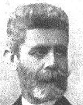Édesapja Czekelius Dániel, Temesvár főmérnöke volt. A Temesvári Piarista Főgimnáziumban éretségizett, ezután a székesfővárosi műegyetemen szerzett mérnö-ki oklevelet. Friss dipkomásként az ország legnagyobb vállalatánál a MÁV-nál helyezkedett el.

Segédmérnöki rangban vett részt a [Felső-Tisza-vidé-ken épülő máramarossziget-aknaszlatinai vasútépí-tésén.](https://hu.wikipedia.org/wiki/Fels%C5%91-Tisza-vid%C3%A9k) 1873-tól a *Margit híd* építésénél dolgozott.

A hazai ipar akkor még nem volt képes megfelelő minőségű vasszerke-zeteket előállítani, így a nagy multú francia ipar (mint pl. az Eiffel & Cie) segítségére is szükség volt. 1881-ben tanácsosként minisztériumi tisztséget töltött be a Közmunka és Közlekedésügyi Minisztérium Műszaki Taná-csánánál. Ezt a pozíciót 1889-ig töltötte be, itt a hídépítési szabvány-terveken dolgozott.

Czekelius közben 1885-tól 1889-ig középítési felügyelő, majd 1889-től a szerkesztési osztály, 1894-től 1904-ig pedig az átnevezett Kereskedelem-ügyi Minisztérium Duna-híd szakosztályának vezetője. Ennek az osz-tálynak köszönhető, hogy a dualizmus korában olyan sok híd épült, és hogy Budapest modern világvárossá fejlődött. Nevéhez kötődik Budapest leg-rövidebb hídja, a *Ferenc József híd* építése is. Első nagy vidéki hídja az 1892-ben elkészült komáromi Erzsébet-híd, majd ez után sorra épültek Czekelius Aurélnak köszönhető a nagy folyóink hídjai. Igy épülhetett meg a *pozsonyi Ferenc József*, a *tiszaújlaki Tisza*-, Erdélyben a *marosújvári Maros*- és a Felvidéken a *puchói Vág-híd* is. Czekelius Aurél irányítása alatt készültek az *Erzsébet híd kiviteli tervei,* a híd láncaihoz használt martinacél és láncszerkezet ötletes megoldásai is tőle származnak és az ő vezetése alatt dolgoztak ki a minisztériumban szabványterveket. 

A híd vasszerkezetét a Magyar Királyi Államvasutak Gépgyára ([MÁ-VAG](https://hu.wikipedia.org/wiki/Magyar_Kir%C3%A1lyi_%C3%81llami_Vas-,_Ac%C3%A9l-_%C3%A9s_G%C3%A9pgy%C3%A1rak)), a láncokat a [diósgyőri állami vasgyár](https://hu.wikipedia.org/wiki/Di%C3%B3sgy%C5%91ri_Ac%C3%A9lm%C5%B1vek) készítette. A híd amely telyes egészében hazai tervezésű és hazai gyártású volt, a maga 290 méteres nyílásával a világ legnagyobb nyílású lánchídjaként szerzett dicsődséget a magyar mérnöki tudásnak és az egyre izmosodó hazai nehéziparnak egya-ránt.

Kiváló tervezőként, nagy gyakorlati érzékkel és munkabírással irányította a hídépítéseket, legkedvesebb munkaterülete az anyagvizsgálat volt, rendkívül fontosnak tartotta a nagy teherbírású vasbeton hidak tervezését. 1910-14-ben elvállalta a *Magyar Anyagvizsgálók Egyesületének* elnöki tisztét. Forrás: [*Magyar Életrajzi Lexikon 1000-1990*](https://www.google.hu/url?sa=t&rct=j&q=&esrc=s&source=web&cd=2&cad=rja&uact=8&ved=0ahUKEwjvp8f7tLnZAhUBECwKHVZ1BaQQFggrMAE&url=http%3A%2F%2Fmek.oszk.hu%2F00300%2F00355%2Fhtml%2FABC02469%2F02945.htm&usg=AOvVaw1VcZcgUbUwpp7KfXLStkml)

**Czunft Vilmos** (Temesvár, 1897. január 4. - Budapest, 1945. július 16.) orvos.

1921-ben szerezte meg oklevelét a budapesti tudo-mányegyetem orvostudományi karán.

1917-1931 között a *Központi Röntgenintézetben* dolgo-zott sugármérési és sugárzással történő gyógyító eljá-rásokkal. Bevezette a sugárméréshez a hordókamrát, a filmes dozimetriát. 1931-ben a röntgengyógykezelés és röntgensugárzásmérés tárgykörben egyetemi magánta-nárrá habilitálták.

1931-36-ban a budapesti Rókus Kórháznak, 1936-45-ben a fővárosi Eöt-vös Loránd Rádium és Röntgen Intézetnek a sugaras gyógyítási, majd vezető főorvosa volt. A Budapesten 1936-ban megnyílt intézet „A fizikai gyógyítás háza” európai színvonalon tudta a magyar irodalom óriása, Ba-bits Mihály kezelését elvégezni.

Mivel 1938-ban a sugárfizikai tudós-radiológus Czunft Vilmos az intézet-ben a klinikai osztályok mellett egy sugárfizikai laboratóriumot is léte-sített, a kezelést ő maga végezte el rádiumágyúval. Bevezette a hordókam-rát és a doziométert.

1944-ben a front közelsége miatt intézetének nagyértékű felszerelését Né-metorszgba kezdték áttelepíteni, Czunft élete kockáztatásával megmen-tette az intézet tulajdonában levő 1500 milligrammnyi rádiumot. A mentés során, a rádiumtól halálosan megbetegdett, emiatt öngyilkosságot követett el. Főbb művei*: Elektromos balesetek röntgen képeknél* (1926.) *A gerinc-oszlop mereve­déseiről* (1926.) *Az elektromos feszültség mérése röntgen-készülékeken* (1926.) *Rossz­indulatú daganatok szőlőcukorinjekciókkal kombinált röntgenkezelése* (1930.) *A rosszindulatú daganatok rádium-moulage-theraphiájának és telecurietherapiájának alapelemei* (1943) stb.

Forrás: *Magyar Orvoséletrajzi Lexikon*

**D**

**Dalnoki Béni** ([Szabadka](http://hu.wikipedia.org/wiki/Szabadka), [1838](http://hu.wikipedia.org/wiki/1838). [május 3.](http://hu.wikipedia.org/wiki/M%C3%A1jus_3.) - [Budapest](http://hu.wikipedia.org/wiki/Budapest), [1914](http://hu.wikipedia.org/wiki/1914). [január 29.](http://hu.wikipedia.org/wiki/Janu%C3%A1r_29.)) opera-énekes (tenor).

Már korai karénekesi korában rendkívüli tehetségnek tartották. Első komoly megmérettetése 1857-ben szülő-városában történt. Ekkor érkezett Szabadkára a Hegedűs Lajos és Havi Mihály operatársulata, melynél próbaé-neklésre jelentkezett Dalnoki Béni, a bemutatkozás oly-annyira sikerült, hogy 3 havi próbaidőre szerződtették. 1860-ban Reszler István a *Pécsi Színház* igazgatója első lírai tenornak szerződtette, első nagy tenor szerepe *Lyonel* volt, a [19. szá-zad](https://hu.wikipedia.org/wiki/19._sz%C3%A1zad) egyik legsikeresebb zeneművében, [Friedrich von Flotow](https://hu.wikipedia.org/wiki/Friedrich_von_Flotow) : *Márta, avagy a richmondi vásár* c. négyfelvonásos operájában.

1861-ben Bécsben a nagyhírű énektanárnál Lewy Richárdnál tanult, majd hatalmas megtiszteltetés érte, a kor meghatározó zeneművésze Franz von Suppé meghívta a bécsi *[Theater an der Wien](https://hu.wikipedia.org/w/index.php?title=Theater_an_der_Wien&action=edit&redlink=1)be*. Dalnoki Béni (manapság ezt sokan nem értenék) mégis visszatért Magyarországra, és negyed év-századon keresztül a vidéki színpadok ünnepelt sztárjaként énekelte a leg-jobb szerepeket. Az 1863-as rövid a berlini udvari színházban történt kitérőt követően szerződtette Kolozsvárra a kalandos életű Follinusz János, hol két alkalommal is, 1862-66 és 1876-78 között szerepelt.

Időközben fellépett Arad, Debrecen, Nagyvárad és Kassa szinpadain is, hol lírai tenorként gyönörködtette a közönséget. 1880-ban kapott szerző-dést a *Nemzeti Színháztól*, azután négy sikeres évadot követően átszerző-dött az akkor megnyíló *Magyar Királyi Operaházhoz*.

[1884](https://hu.wikipedia.org/wiki/1884). [szeptember 27-én](https://hu.wikipedia.org/wiki/Szeptember_27.) került sor  a nyitó díszelőadásra, ezen ünnepi alka-lomra bemutatták a [*Bánk bán*](https://hu.wikipedia.org/wiki/B%C3%A1nk_b%C3%A1n_(opera)) első felvonását, a [*Hunyadi László*](https://hu.wikipedia.org/wiki/Hunyadi_L%C3%A1szl%C3%B3_(opera)) nyitányát és a [*Lohengrin*](https://hu.wikipedia.org/wiki/Lohengrin_(opera)) első felvonását, [Erkel Ferenc](https://hu.wikipedia.org/wiki/Erkel_Ferenc) vezényletével. Az ünnepség fényét emelte az uralkodó [I. Ferenc József](https://hu.wikipedia.org/wiki/I._Ferenc_J%C3%B3zsef_magyar_kir%C3%A1ly)  jelenléte.

Az operaház és társulata 1888-1891 között élte első „aranykorát”, amikor az intézmény igazgatója a cseh-osztrák [zeneszerző](https://hu.wikipedia.org/wiki/Zeneszerz%C5%91) és [karmester](https://hu.wikipedia.org/wiki/Karmester) a mára már kultusszá nemesedő [Gustav Mahler](https://hu.wikipedia.org/wiki/Gustav_Mahler) lett. Dalnoki Béni sok nagyszerű évad után 1904-ben tiszteletbeli tagként vonult vissza.

Kedvenc jellemformái voltak *Almaviva* szerepe, Rossini: *A szevillai borbély* c. művében, valamint *Faust* szerepe, Gounod: *Faust* c. operájában. Fia, Dalnoki Viktor szintén énekes lett.

Forrás: *[Magyar Színházművészeti Lexikon](http://vmek.niif.hu/02100/02139/html/sz05/14.html).* *Magyar életrajzi lexikon*

Báró **Dániel Ernő**  (Elemér, [1843](http://hu.wikipedia.org/wiki/1843). [május 3.](http://hu.wikipedia.org/wiki/M%C3%A1jus_3.) - [Balatonfüred](http://hu.wikipedia.org/wiki/Balatonf%C3%BCred), [1923](http://hu.wikipedia.org/wiki/1923). [július 24.](http://hu.wikipedia.org/wiki/J%C3%BAlius_24.)) ügyvéd, miniszter.

[Édesapja szamosujvári és némethi Dániel](https://www.geni.com/people/D%C3%A1niel-J%C3%A1nos/6000000017088806035) János ország-gyűlési képviselő, Torontál vármegye alispánja, édes-anyja [Kiss Auguszta](https://www.geni.com/people/Kiss-Auguszta/6000000025722454148) eleméri és ittebei  Kiss Ernő  hon-véd altábornagynak, az [aradi vértanúk](https://hu.wikipedia.org/wiki/Aradi_v%C3%A9rtan%C3%BAk) egyikének leánya. Gimnáziumi tanulmányait  [a temesvári](http://hu.wikipedia.org/wiki/Temesv%C3%A1r) Piarista Főgim-náziumban végezte. A [budapesti](http://hu.wikipedia.org/wiki/Budapest) egyetemen jogi karán folytatta tanulmányait, majd [1867](http://hu.wikipedia.org/wiki/1867)-ben a kiegyezést kö-vetően odahaza, [Torontál vármegyében](http://hu.wikipedia.org/wiki/Toront%C3%A1l_v%C3%A1rmegye) szolgabíróvá nevezték ki. A következő esztendőben ügyvédi vizsgát téve törvényszéki ülnökké (törvényszéki elnök helyettes) választották.

[1867](https://hu.wikipedia.org/wiki/1867) elején [Deák Ferenc](https://hu.wikipedia.org/wiki/De%C3%A1k_Ferenc_(igazs%C3%A1g%C3%BCgy-miniszter))nek sikerült elérnie - Ausztria sorozatos katonai és nemzetközi politikai kudarcait kihasználva - Ausztria és Magyarország közös viszonyainak rendezését. A haza bölcse Magyarországnak kiharcol-ta a lehető legnagyobb fokú önállóságot, cserébe bizonyos 48-as követelé-sek feladásáért, vagy csak részleges teljesüléséért, illetve a [passzív rezisz-tencia](https://hu.wikipedia.org/wiki/Bach-korszak#Passz%C3%ADv_ellen%C3%A1ll%C3%A1s) felhagyásáért. A [kiegyezés](https://hu.wikipedia.org/wiki/Kiegyez%C3%A9s) fényében újraszerveződtek a politika résztvevői, létrejött egy kiegyezéspárt, azaz a 67-es és egy azt elutasító párt, azaz a 48-as párt.

A kiegyezés utáni első, [1869-es választásokat](https://hu.wikipedia.org/wiki/1869-es_v%C3%A1laszt%C3%A1sok) a *Deák-pártiak* nyerték, Dá-niel Ernő  a  [bégaszentgyörgyi](http://hu.wikipedia.org/wiki/B%C3%A9gaszentgy%C3%B6rgy)  kerületben győzve, [kormánypárti](http://hu.wikipedia.org/wiki/De%C3%A1k-p%C3%A1rt) képvise-lője lett az [1870](http://hu.wikipedia.org/wiki/1870)-es országgyűlésnek. A *[Deák Párt](https://hu.wikipedia.org/wiki/De%C3%A1k_P%C3%A1rt)nak nevezett* kormány-párt 1875. március 1-jén egyesült az addig ellenzéki, de 67-es alapokon álló [*Balközép Párttal*](https://hu.wikipedia.org/wiki/Balk%C3%B6z%C3%A9p_P%C3%A1rt) és megalakították a [*Szabadelvű Pártot*](https://hu.wikipedia.org/wiki/Szabadelv%C5%B1_P%C3%A1rt).

Dániel Ernő  [1878](http://hu.wikipedia.org/wiki/1878)-tól immáron Torontál vármegye székhelyén nyert vá-lasztást, és lett [Nagybecskerek](http://hu.wikipedia.org/wiki/Nagybecskerek)  város választókerületének  [kormánypárti](http://hu.wikipedia.org/wiki/Szabadelv%C5%B1_P%C3%A1rt) 

képviselője. A  [*Szabadelvű Párt*](https://hu.wikipedia.org/wiki/Szabadelv%C5%B1_P%C3%A1rt) egyébként az [1905-ös választási veresé-géig](https://hu.wikipedia.org/wiki/1905%E2%80%931906-os_magyarorsz%C3%A1gi_belpolitikai_v%C3%A1ls%C3%A1g)  minden politikai megmérettetést fölényesen megnyert.

Dániel Ernő  egy évvel túlélte pártját, hiszen [1884](http://hu.wikipedia.org/wiki/1884)-től egészen [1906](http://hu.wikipedia.org/wiki/1906)-ig a 

[pancsovai](http://hu.wikipedia.org/wiki/Pancsova)  választó kerületet képviselte. A [*Szabadelvű Párt*](https://hu.wikipedia.org/wiki/Szabadelv%C5%B1_P%C3%A1rt)  történetének második legnagyobb arányú győzelmét hozó  [1896-os választásokat](https://hu.wikipedia.org/wiki/1896-os_v%C3%A1laszt%C3%A1sok) köve-tően [báró](https://hu.wikipedia.org/wiki/B%C3%A1nffy_Dezs%C5%91_(minisztereln%C3%B6k))  Bánffy Dezső vezetésével alakult meg az új kormány.

Dániel Ernő [1895](http://hu.wikipedia.org/wiki/1895) és [1899](http://hu.wikipedia.org/wiki/1899) között a  [Bánffy-kormány](http://hu.wikipedia.org/wiki/B%C3%A1nffy-korm%C3%A1ny)  kereskedelemügyi minisztere, és pártjának pénzügyi és gazdasági szakértője volt. Érdemei vannak az iparoktatás, a munkásügyek rendezése és a közlekedésügyünk fejlesztésében is. A keleti tengeri hajózási részvénytársaság az ő közre-működésével alakult meg, és fiumei kikötőnk is az ő messzeható politi-kájának köszöni nagy emelkedését.

Az ezredéves kiállítás nagy sikere az ő nevéhez is fűződik, ugyanis a kiál-lítás országos bizottságának elnöke volt. A király 1896. május közepén szentesítette a honfoglalás ezredik évfordulójának törvénybe iktatását, a magyar pártharcok hevességére jellemzően a pártok vezetői 1896-ra  [*treu-ga Deit*](https://hu.wikipedia.org/wiki/Treuga_Dei)  (Isteni Fegyvernyugvás) hirdetett. A millenniumi ünnepségso-rozat országszerte 1896. május 2. és október 31. között zajlott le. A meg-nyitó ünnepségen először [Dániel Ernő](https://hu.wikipedia.org/wiki/D%C3%A1niel_Ern%C5%91_(politikus)), kereskedelmi miniszter, majd a ki-rály mondott beszédet.

Miután Dániel Ernő befejezte a *Vaskapu szabályozását* szeptember 27-én megnyitották a [*Vaskapu-szoros*](https://hu.wikipedia.org/wiki/Vaskapu-szoros)t hajózhatová tevő csatornát. Az ünnep-ségeken részt vett a vendéglátó Ferenc József magyar király mellett Károly román király, és Sándor szerb király is.

A pártok közti béke is csak az őszi választásokig tartott, amelyeken Bánffy kíméletlen erőszakkal óriási többséget szerzett a *Szabadelvű Párt* számára a képviselőházban. A választást követő parlamenti tárgyalásokon folya-modott először az ellenzék az agyonbeszélés (obstrukció) módszeréhez. [1910](https://hu.wikipedia.org/wiki/1910)-ben *nemzeti munkapárti* programmal ismét országgyűlési képvise-lővé választották, egyben [1906](http://hu.wikipedia.org/wiki/1906)-[1910](http://hu.wikipedia.org/wiki/1910) között a [főrendiház](http://hu.wikipedia.org/wiki/F%C5%91rendih%C3%A1z) tagja volt. 

Forrás: *Magyar életrajzi lexikon *

**Dániel Béla** (Gyér, [1828.](http://hu.wikipedia.org/wiki/1843) július 29. – Arad, 1882. április 3.) honvéd hu-szártiszt.

Torontál vármegye két híres örmény-magyar (a Szamos-újvári és némethi Dániel-Gyertyánffy) családi egyesü-lésének a gyümölcseként született. A családi és a ma-gyar nemesi hagyományokhoz híven kezdte meg a joggyakornoki pályafutását, az 1848. tavaszi pesti zson-gásban.

A békés *revolució* hamarosan igazi szabadságharccá te-rebélyesedik, Dániel Béla tudta hol a helye, ez év szep-temberében jelentkezett a Pesten szerveződő 13. kiképző-tartalék honvéd-zászlóaljhoz. A honvédség szervezését illettő döntés Batthyány Lajos kormányfő vezette 1848. május 15-iki minisztertanácsi ülésen született. Ennek előzménye az a hír volt, hogy a határőrvidéken lévő Karlócán meg-kezdett szerb nemzeti kongresszuson nemcsak a hazai szerbek gyüle-keznek fegyveresen, hanem a szomszédos Szerbiából is érkeznek felfegy-verzett önkéntesek. A fenyegető veszély miatt elrendelték a Délvidék határán lévő Szegeden egy katonai tábort létesítsenek.

Dániel Béla 1849. február 14-én hadnaggyá előléptetve átkerült a Hajdú kerületben alakuló 17. Bocskai huszárezredhez.

Az ezred a különben a galíciai Stanislau városban állomásozó 6. Würt-temberg huszárokból alakult, kik elsőként tértek vissza a haza védelmére.

A Bocskai huszárezred osztályokra bontva részt vett az Aulich Lajos hon-véd tábornok vezette II. hadtest keretében a győzedelmes tavaszi hadjárat-ban. Dániel Béla ezredének egyik osztályával a IX. felső-magyarországi hadtesthez került, a seregtestett parancsnoka a lengyel származású gróf Dembinszky Henrik altábornagy volt. Dániel Bélát helytállása eredmé-nyeként 1849. májusában főhadnaggyá léptették elő.

A honvéd sereg tavaszi didalát követően, Ferenc József császár 1849. május 1-jén segítségért fordult I. Miklós orosz cárhoz, az úgymond magyar lázadás elfojtásához. 1849. június közepén több hadoszlopban közel 200 000 fős orosz hadsereg tört Magyarországra. A császári és cári meg-eggyezését követően a Felvidékre is betörtek az orosz csapatok. A *Bocs-kai-huszárok* folyamatos utóvéd harcokban lassították az orosz előrenyo-mulást, összemérve a magyar huszárok szakmai tudását a híres orosz hu-szárokkal és kozákokkal.

A válságos helyzetben Dembinszky Henrik főparancsnok [Arad](https://hu.wikipedia.org/wiki/Arad_(Rom%C3%A1nia))-[Temes-vár](https://hu.wikipedia.org/wiki/Temesv%C3%A1r) környékén összevonta az egész magyar haderőt, és itt döntő csatát ví-vott az időközben egyesülő császári és cári haderővel. Dániel László is ott volt a reménytelen és gyászos kimenetelű augusztus 9-i temesvári ütközet-ben. A szabadságharc egész idején végigkisérte életútját rokona és sors-társa a Dániel család temesi ágához tartozó Dániel László huszárfőhad-nagy, aki szintén a Bocskai huszárezredben vitézkedett.

A szabadságharc leverése után Dániel Bélát büntetés gyanánt 1850. feb-ruárjában közlegényként besorozták a császári hadsereg 40. lengyel gali-ciában sorozott gyalogezredéhez, és gyorsított menetben az akkor még for-rongó Itáliába küldték. Ezek a katonák valamint a császári ezredekbe köz-katonaként besorozott korábbi honvédtisztek, a hadsereg igencsak megbíz-hatalan elemét képezték. Ezért 1851. október 2-án a császár elrendelte a hadsereg törzstiszti létszámának (leginkább anyagi okoból) csökkentését és egyes ezredek feloszlatását.

Dániel Bélát 1851. áprilisában bocsájtották el. Az egykori vitéz huszártiszt a a biztosítási szakmában találta meg a megélhetést. Húsz éven át volt az 1857-ben alakult és a pénz és hitelezés szakemberének számító [Lónyay Menyhért](https://hu.wikipedia.org/wiki/L%C3%B3nyay_Menyh%C3%A9rt) által elnökölt *Első Magyar Altalános Biztosító Társaság* hivatal-noka. A biztosító magyar jellege már önmagában is kihívást jelenetett az akkori elnyomó rendszer (Bach-korszak) gépezetének. Dániel Béla élete végéig a biztosító aradi kirendeltségének vezetője volt, emellett az Aradi *'48-as Honvédegylet* elnökeként ápolta a szabadságharc emlékét.

Forrás: [Bona Gábor: *Az 1848/49-es szabadságharc tisztikara*](https://www.arcanum.hu/hu/online-kiadvanyok/Bona-bona-tabornokok-torzstisztek-1/)

**Deák Leó** ([Kúla](https://hu.wikipedia.org/wiki/K%C3%BAla), [1888](https://hu.wikipedia.org/wiki/1888). [január 14.](https://hu.wikipedia.org/wiki/Janu%C3%A1r_14.) - [Újvidék](https://hu.wikipedia.org/wiki/%C3%9Ajvid%C3%A9k), [1945](https://hu.wikipedia.org/wiki/1945). [november 16.](https://hu.wikipedia.org/wiki/November_16.)) [jogász](https://hu.wikipedia.org/wiki/Jog%C3%A1sz), [politikus](https://hu.wikipedia.org/wiki/Politika).

Miután [Budapesten elvégezte a Kereskedelmi Akadé-mi](https://hu.wikipedia.org/wiki/Budapesti_Gazdas%C3%A1gi_F%C5%91iskola)át, a Királyi Magyar Tudományegyetem jogi karán doktori oklevelet és [ügyvédi](https://hu.wikipedia.org/wiki/%C3%9Cgyv%C3%A9d) képesítést szerzett. Az [első világháború](https://hu.wikipedia.org/wiki/Els%C5%91_vil%C3%A1gh%C3%A1bor%C3%BA)t hadnagyként szolgálta végig.

A trianoni döntést követően ügyvédi irodát nyitott Zomborban. Az újonnan létrejött délszláv királyság-ban részt vett az 1922. szeptemberi Zentán megalaku-ló *Országos Magyar Párt* programjának kidolgozá-sában, egyben a párt alelnöki feladatát is ellátta. A magyar érdekvédő párt nemcsak a duna tisza közén, hanem az új állam - a [Szerb-Horvát-Szlovén](https://hu.wikipedia.org/wiki/Jugoszl%C3%A1via) Királyság - egész területén kívánt tevékenykedni. Ennek az elszánt akarat-nak köszönve a harmincas évek elején létrejött a [belgrádi](https://hu.wikipedia.org/wiki/Belgr%C3%A1d) állami tanító-képző részeként a magyar tagozat.

A Délvidéki magyarság tájékoztatását a szivén viselve alapítója volt a *Hír-lap* című [szabadkai](https://hu.wikipedia.org/wiki/Szabadka)  és a *Friss Újság* című  zombori napilapnak, illet-ve a *[Bácskai](https://hu.wikipedia.org/wiki/B%C3%A1cska) Újság* című  hetilapnak. Ugyancsak elsőrangú fontosságot tulaj-donított a nemzeti kissebbségi jogok képviseletének. Mivel 1921 nyarától egy népszövetségi döntés értelmében a *Népszövetség* köteles volt magán-személyek által benyújtott panaszokat is elfogadott, az addig a kisebb-ségvédelmi szerződést csak kínos huzavonás után elfogadó SzHSz Király-ság ellen többször lépet föl a magyar kisebbség ügyét képviselve.

A húszas években az európai kisebbségek nemzetiségenként ún. *Népszö-vetségi Ligákat* alakítottak. Ezek a kissebbségi németek támogatásával 1925-ben megalakították az *Európai Nemzetiségek Kongresszusát*.

Az első genfi ülésükön Deák Leó képviselte a Délvidéki magyarságot, itt vette föl a kapcsolatot Jakabfy Elemérrel, a romániai [*Országos Magyar Párt*](https://hu.wikipedia.org/wiki/Orsz%C3%A1gos_Magyar_P%C3%A1rt)  alelnökével. Az 1926-os genfi konferencián a kisebbségek választó-jogáról fejtette ki véleményét, míg végül az 1928-as, negyedik kongresz-szuson utoljára képviselte a jugoszláviai magyarokat. A kisebbségi kong-resszusokon való további részvételének az 1929-ben bevezetett királyi diktatúra vetett véget.

Deák Leó a politikai közéletben is részt vett, a húszas évek végén *Bácskai Tartományi Gyűlés* képviselője volt. Az úgynevezett január 6-iki idején a gyülekezési tilalom megsértése miatt rövid időre börtönbe került.

Az 1934-es királygyilkosság utáni enyhülés időszakában sikerült elérnie, hogy a délszláv kormány engedélyezte a magyar közművelődési egyesü-letek alapszabályait, végre megszűnt a megalázó - és rasszista - a beisko-lázás előtti gyerekek kötelező névelemzése.

A magyar-jugoszláv államközi viszonyok rendezése (1940) oda vezetett, hogy megengedték a magyar szülőknek az oktatási nyelv megvállasztását.

1941. április 6-án a náci Németország hadüzenet nélkül megtámadta a Jugoszláv Királyságot, a magyar kormány átengedte a támadókat, sőt a délszláv állam szétesését kihasználva maga is fegyveressen lépett föl.

A Délvidék viszonylagos gyors és vértelen visszatérését követően a kato-nai közigazgatást felválthatta a polgári közigazgatás. A magyar kormány-nak szüksége volt helyi ismerettel rendelkező, tapasztalt és megbízható vezetőkre. Deák Leó [Bács-Bodrog vármegye](https://hu.wikipedia.org/wiki/B%C3%A1cs-Bodrog_v%C3%A1rmegye) és Zombor, majd Újvidék fő[ispánja](https://hu.wikipedia.org/wiki/Isp%C3%A1n), egyben a magyarországi országgyűlés felsőházának tagja lett. Törvénykövető politikusként fellépett a szerb telepesek felé megnyílvá-nuló indulatok ellen, de a német volksbundisták  magyar ellenes hangos-kodását is féken tartotta.

Az [1941](https://hu.wikipedia.org/wiki/1941) tavasza óta visszafoglalt  [Bácskában](https://hu.wikipedia.org/wiki/B%C3%A1cska) állandósult a csetnik (szerb félkatonai szervezet) veszély, a magyar biztonsági hatóságok ezért eleve éberebben reagáltak minden terror gyanús eseményre. A helyzet csak bo-nyolódott miután 1941. június 22-én a kommunista Szovjetúnió is belépett a II. világháborúba. A Délvidék visszacsatolásakor nagyszámú illegális kommunista került a magyar közigazgatási területre. A helyzetet még az is bonyolította, hogy ezek többsége magyar nemzetiségű illetve magyar kul-túrájú fanatikus pártaktivista volt. [1941](https://hu.wikipedia.org/wiki/1941) novemberétől a moszkvai csata fordulópontján a felbátorodott kommunista vezetésű [partizánok](https://hu.wikipedia.org/wiki/Partiz%C3%A1n), az ún. 

[Sajkásvidéken](https://hu.wikipedia.org/wiki/Sajk%C3%A1svid%C3%A9k) magyar [csendőri](https://hu.wikipedia.org/wiki/Csend%C5%91rs%C3%A9g) és katonai alakulatokra támadtak. A fegy-veres összecsapások mindkét oldalon halálos áldozatokat követeltek, egy [1942](https://hu.wikipedia.org/wiki/1942) januári tűzharc nyomán 10 magyar katona és csendőr halt meg.

A partizánokat persze fölszámolták, ennek ellenére [1942](https://hu.wikipedia.org/wiki/1942). [január 12.](https://hu.wikipedia.org/wiki/Janu%C3%A1r_12.) és [15](https://hu.wikipedia.org/wiki/Janu%C3%A1r_15.). között katonai és csendőri alakulatok razziát tartottak.

A területet megszálló szegedi V. hadtest parancsnoka [Feketehalmy-Czeyd-ner Ferenc](https://hu.wikipedia.org/wiki/Feketehalmy-Czeydner_Ferenc)  [altábornagy](https://hu.wikipedia.org/wiki/Alt%C3%A1bornagy) [etnikai](https://hu.wikipedia.org/wiki/Etnikum) (szerbek) és vallási (zsidók) alapon jelől-ték ki a [tömeggyilkosságok](https://hu.wikipedia.org/wiki/T%C3%B6meggyilkoss%C3%A1g) elszenvedőit, ennek eredményeként a terrornak körül-belül 3300-3800 fő [polgári](https://hu.wikipedia.org/w/index.php?title=Polg%C3%A1ri_lakoss%C3%A1g&action=edit&redlink=1) személy esett áldozatul.  Az áldozatokat a mínusz 20-30 fokos hidegben a Duna jegén robbantott lékeken keresztül a folyóba lökték.  Deák Leó dr. Palásthy Ödöntől zombori ügyvédtársától és barátjától szerzett tudomást az újvidéki vérengzésről. A főispán hiva-tásához híven igyekezett  tájékoztatni a kormányt a magyar hagyomá-nyokhoz nem illő eseményekről. Deák beavatkozásának eredményeként Szombathelyi Ferens és [Keresztes-Fischer Ferenc](https://hu.wikipedia.org/wiki/Keresztes-Fischer_Ferenc) leállítatták a razziát. A parlament alsóházában azonban a náci sikerektől megittasodott jobboldali szélsőségesek, nem az elkövetőket vonták volna felelősségre, hanem [Bács-Bodrog vármegye](https://hu.wikipedia.org/wiki/B%C3%A1cs-Bodrog_v%C3%A1rmegye) főispánját, Deák Leót támadták.

Az újvidéki razzia híre nem maradt visszhang nélkül az Ország­gyűlésben sem. A képviselőházban többek között Popovics Milán szerb származású délvidéki képviselő és Bajcsy-Zsilinszky Endre interpellációi, illetve a miniszterelnökhöz és a kormányzóhoz írott memorandumai hatására és az 1942 áprilisában ügyészi nyomozó eljárás kezdődött. A katonai ügyészség Feketehalmy-Czeydner elleni későbbi vádirata 3309 áldozatot ismert el.

1944. [március 19-én](https://hu.wikipedia.org/wiki/M%C3%A1rcius_19.) a németek megszállták Magyarországot (Margare-the hadművelet), az új németbarát Sztójay kormány főispáni kinevezését visszavonta, a [Gestapo](https://hu.wikipedia.org/wiki/Gestapo) letartóztatta a hazai svábok szemében német-ellenesnek tekintett Deák Leót. Budapesten hetekig vallatták, majd inter-nálták.

A [második világháború](https://hu.wikipedia.org/wiki/M%C3%A1sodik_vil%C3%A1gh%C3%A1bor%C3%BA) befejezését követően Budapesten jelentkezett a szovjet katonai hatóságoknál, de azok nem voltak érdekeltek, de való-színűleg értesítették (esetleg mások?) a „baráti” Jugoszláv hatóságokat. A [Debrecenben](https://hu.wikipedia.org/wiki/Debrecen) (1944. december 22-én) felállított  *[Ideiglenes Nemzeti Kormány](https://hu.wikipedia.org/wiki/Ideiglenes_Nemzeti_Korm%C3%A1ny) * már [1944](https://hu.wikipedia.org/wiki/1944).  [december 22-én](https://hu.wikipedia.org/wiki/December_22.) nyilatkozatban vállalta, hogy bíró-ság elé állítja a háborús és népellenes bűnösöket, illetve ha bűneiket más országban követték el, akkor kiadja őket.  A Délvidéken már „rendet tevő” (kb 25-30.000 megyilkolt magyar) partizán hatalom, eleddig ismeretlen körülmények között budapesti lakhelyéről elrabolta és átvitte az ország-határon. Az idieglenes magyar kormány külügyminisztere a kisgazda Gyöngyösi János sem tartotta fontosnak, hogy honfitársa után érdeklődjön, „*úgymond kellemetlen lenne a hős Titót ilyen üggyel hírbe hozni az anti-fasiszta hatalmak előtt”*(bravó!)

Deák Leót nemsokára Újvidéken a helyi törvényszék előtt állhatott, telje-sen kiszolgáltatva és előre sejthető ítéletnek nézehetett szembe. A bíróság kínosan ügyelt, hogy a lehető legtöbb a vádat képviselő szakember (dr.Ko-vács Kálmán, dr.Gyetvay Péter, dr.Varga Péter stb..) magyar származású legyen. Az ügyészség a valódi elkövetők és a szerencsétlen Szombathelyi Ferenccel egyetemben Deák Leót is megvádolta; *hogy értelmi szerzői voltak az elkövetett bűncselekményeknek, megszervezői és előkészítői a vérengzéseknek, amelyeknek tízezrek voltak áldozatai. …*

Feketehalmy-Czeydner Ferencet a sajkásvidéki Zsablyán, Grassyt pedig Zöldyvel együtt Újvidéken [akasztották](https://hu.wikipedia.org/wiki/Akaszt%C3%A1s) fel. Minhármójukat nyilvánossan végezték ki. Deák Leót 1945. november 1-én golyó általi halálra ítélték.

Temetése és sírja ismeretlen. Halála ügyében perújrafelvétel azóta sem történt, élete és becsülete senkinek sem fontos. Forrás: [A. Sajti Enikő](https://hu.wikipedia.org/wiki/A._Sajti_Enik%C5%91): *Délvidék 1941-1944.* Mészáros Sándor: *„Holttá nyilvánítva”.* Domokos László: *Elfelejtett magyarok: az ember, aki segíteni akart - Deák Leó* 

**Degré Alajos** (Lippa, [1819](http://hu.wikipedia.org/wiki/1819). [január 6.](http://hu.wikipedia.org/wiki/Janu%C3%A1r_6.) - [Budapest](http://hu.wikipedia.org/wiki/Budapest), [1896](http://hu.wikipedia.org/wiki/1896). [november 1.](http://hu.wikipedia.org/wiki/November_1.)) ügyvéd, író, a [márciusi ifjak](http://hu.wikipedia.org/wiki/M%C3%A1rciusi_ifjak) egyike.

Édesapja a Temes vármegyébe költözött francia eredetű, Degré családba tartozó Degré Péter megyei főorvos volt. Felesége és Alajos édesanyja (Rácz Anna) magyar leány volt. Degré Alajos a családban, de az aradi és a szegedi iskoláiban is elkötelezett magyar nevelést kapott.

A jogot [1838](https://hu.wikipedia.org/wiki/1838) és 18[40](https://hu.wikipedia.org/wiki/1840) között a [nagyváradi](https://hu.wikipedia.org/wiki/Nagyv%C3%A1rad) jogi akadémián végezte. Nagyváradi tanulmányai után érkezett jogyakor-noknak érkezett Pestre, ahol szinte azonnal Kossuth Lajos bűvkörébe került.

1841 első napjaiban megjelenik a Kossuth szerkesztette  [*Pesti Hírlap*](http://adtplus.arcanum.hu/hu/collection/PestiHirlap/), az ifjúság és főleg a jog-végzett ügyvédgyakornokok (jurátusok) oly annyira lelkesednek a reform gondolatokért, hogy 1841. június 27-én fáklyászenét adnak Kossuth tiszteletére. Degré Alajos ekkor tűnik ki a pesti ifjak sorá-ból, ugyanis a [Kossuth Lajosnak](https://hu.wikipedia.org/wiki/Kossuth_Lajos) rendezett fáklyásmenet végén - melynek fő szervezője volt - ő mondta a Kossuthot köszöntő beszédet. 

A *Márciusi ifjak* a *Pilvax* kávéházban a „közvélemény asztala” körül gyü-lekező fiatal radikális jogászok, írók és költők. A márciusi ifjak közül általában Vasvári Pált, Irányi Dánielt, Irinyi Józsefet stb. szokták megem-líteni, azonban a kortárs és kolléga a későbbi nagy író Jókai Mórt szerint Degré Alajos is közéjük tartozott. [1843](https://hu.wikipedia.org/wiki/1843)-ban letette ügyvédi vizsgáit, majd a [pozsonyi](https://hu.wikipedia.org/wiki/Pozsony) országgyűlésen mint királyi táblai jegyző tevékenykedett.

Az ifjúság körében vezérszerepet játszott, amelyre írói elhivatottsága és jelleme okán is hivatott volt. Jókai szerint senkitől sem tudott megtagadni egy kis szivességet, hja a Bánátiak! A jurátusok szónokaként nem egy poli-tikai demonstrációt szervezett és folyamatosan vezérelte a fiatal de annál elkötelezetebb *revolúcionárokat.*

Az 1848-as márciusi békés forradalom győzelme után a ’48-as márciusi párt képviselőjeként választotta meg Vác az országgyűlésbe. Magyar-ország első felelős kormánya, 1848. március 23-án alakult meg Batthyány Lajos gróf vezetésével. Pesten már 1848. március 15-én megalakult a *Köz-csendi Bizottmány*, Degré Alajos a forradalom irányító szervének jegyző-jévé választották. A bizottmány feladata volt a nemzetőrség kiállítása is. Degré Alajos az első felelős magyar kormányban Szemere Bertalan bel-ügyminiszter titkára lett.

Már 1848. nyarán beállt honvédnek, jelentkezett a kalandos életű Földváry Károly szegedi 3. honvédzászlóaljába -a híres fehér tollas zászlóaljba- főhadnagyi rang-ban harcolt a véres [bánsági](https://hu.wikipedia.org/wiki/B%C3%A1ns%C3%A1g) csatákban a szerbek ellen.

1848. szeptemberétől belépett a 16. Károlyi huszárezredbe, mely lovas egység Pest vármegye főispánjának, gróf Károlyi Istvánnak hazafias felajánlása nyomán alakut meg. A huszáezred negyedik osztálya százados kapitányaként részt vett az 1849. július 20-ikai turai csatában, hol az orosz lovassággal vívott heves harcban több sebet is kapott. A csatában kapott sebei miatt a nagyváradi fürdőben gyógykezeltette magát, itt jutott el hozzá a [világosi](https://hu.wikipedia.org/wiki/Vil%C3%A1gos) fegyverletétel híre. Ezután a békési pusztákon bujdosott, majd 1849 végén a hazai tájra a Délvidékre menekült.

Az első amnesztiára 1854. április 24-én, Ferenc József és Erzsébet csá-szárné házasságát követően került sor.  Az amnesztia hírére visszatért Pest-re, azonban Aradra internálták (György nevű bátyja, előbb Arad vármegye csendbiztosa volt). Internálása után végleg visszatért a fővárosba.

Utazásokat tett [Németországban](https://hu.wikipedia.org/wiki/N%C3%A9metorsz%C3%A1g), [Belgiumban](https://hu.wikipedia.org/wiki/Belgium), Franciaországban és Ang-liában.  Kossuth híveként 1856-ban sorra látogatta a magyar emigráció nyugati központjait. A kiegyezés után ellenzéki programmal választották meg Vác képviselőjének. Itt hozták létre az első 1848-as honvéd emlék-művet, ezt 1868-ban Degré Alajos kezdeményezésére alkották.

„Degré Alajos az elnyomás korszakának egyik legkedveltebb írója volt, választékos, költőies stílusával, a kor olvasóközönségének megfelelő mó-don tudta kifejezni érzéseit. Drámairással kezdte írói működését a könnyed *francia szalonregény*eknek irodalmunkban ő a meghonosítója. Kiemel-kedően értékes műve a *"Visszaemlékezéseim"* című memoárja, mely a korabeli politikai, társadalmi és irodalmi viszonyokra sok értékes feljegy-zést tartalmaz. [1867](https://hu.wikipedia.org/wiki/1867)-ben a  [*Kisfaludy Társaság*](https://hu.wikipedia.org/wiki/Kisfaludy_T%C3%A1rsas%C3%A1g)  rendes tagjává választotta.

Születésének 200. évfordulóján, január 6-án emléktáblát kapott az Arad megyei Lippán. Vácott pedig utca viseli a nevét”.

Főbb művei: *Kedélyrajzok, novellák, [1847](https://hu.wikipedia.org/wiki/1847). Két év egy ügyvéd életéből, regény, [1853](https://hu.wikipedia.org/wiki/1853). Kalandornő, regény, 1854. Salvator Rosa, történeti regény, [1855](https://hu.wikipedia.org/wiki/1855). A sors keze, regény, [1856](https://hu.wikipedia.org/wiki/1856).* *Rendkívüli előadás, vígjáték 1857. Az ör-dög emlékiratai, [1860](https://hu.wikipedia.org/wiki/1860). A száműzött leánya, regény, [1865](https://hu.wikipedia.org/wiki/1865). A kék vér, re-gény, [1870](https://hu.wikipedia.org/wiki/1870). Itthon, regény. [1877](https://hu.wikipedia.org/wiki/1877).* *Az elzárt gyámleány, víg elbeszélés, [1878](https://hu.wikipedia.org/wiki/1878).* *Bőkezű uzsorás*, *[1882](https://hu.wikipedia.org/wiki/1882).* *Így van jól! Víg regény, [1887](https://hu.wikipedia.org/wiki/1887).stb.*

Több színdarabját bemutatta a Nemzeti Színház: *Férj és jegyes, vígj. 3 felv. (1846), Segítsünk egymásnak, vígj. 1 felv. (1848?), Bál előtt, alatt, után, vígj. 1 felv. (1851), Az anya szöktet, vígj. 1 felv. (1853), Megjelent a Szik-szói Enyhlapokban), Salvator Rosa, melodráma (1855), Rendkívüli előa-dás, vígj. 1 felv. (1856), Két hatalom, vígj. 1 felv. (1858), Kalandornő, dráma 5 felv. (186.), Divatos beteg, vígj. 3 felv. (1864).*

Forrás: [Szinnyei József](https://hu.wikipedia.org/wiki/Szinnyei_J%C3%B3zsef_(bibliogr%C3%A1fus)) - *[Magyar írók élete és munkái II.](http://mek.oszk.hu/03600/03630/html/d/d03839.htm) 1893. Magyar életrajzi lexikon 1000-1990*. *Magyar Katolikus Lexikon.*

**Dengl János** (Orczyfalva, 1882. január 11. - Budapest, 1940. február 02.) nyelvész, a kereskedelmi szakoktatás és a gyorsírás művelője, egyetemi tanár.

A budapesti egyetemen végezte felsőbb tanulmányait, hol 1907-ben szerzett bölcsész-doktori oklevelet. 1906-tól a Kereskedelmi Akadémián tanított, hol a kereskedelmi szakoktatás keretében a gyorsírás és a német nyelvű levelezés tanára volt.

A kereskedelmi akadémia kalandos megszűnése, majd 1920-tól a pesti tudomány-egyetemi közgazdaságtudományi karaként való újjászületését követően, a német kereskedelmi nyelv rendkívüli tanára, illetve 1924-től nyilvános rendes tanáraként működött. Ezzel együtt 1923-tól a Felső Kereskedelmi Iskolai Tanárképző Intézet igazgatója, egyben az Iskolai Tanárjelöltek Kollágiumának megszervezője.

Dengl János a tanítás melett elvállalta a *Kereskedelmi Szakiskolai Tanárok Országos Egyesületének*, valamint a Budapesti *Középiskolai Tanárvizs-gáló Bizottság* (1925) alnökségét.

1934-ben a magyar kormány szükségét látta, hogy a felsőoktatás reform-tervezete és annak integrációs céljai keretében létrehozza a Magyar Királyi József Nádor Műszaki és Gazdaságtudományi Egyetemet.

Az új intézmény a tanrendjébe iktatta a *„Magyar nyelvhelyesség és stílus”* tantárgyát, amely a Közgazdaságtudományi Kar és a Gazdasági Szaktanár-képző Intézet hallgatói számára kötelező stúdium volt. A tárgy előadásával az egyetem Dengl Jánost mint egyetemi nyilvános és rendes tanárt bízta meg. A döntés összhangban volt azokkal a magyar nyelvészeti törekvések-kel, amelyek a harmincas években a magyar nyelvhelyesség művelését kívánták erősíteni.

Dengl János felkészültségével, és már-már legendás határozottsággal és kellő szigorral vezette a tárgyat. A tárgy tervezése során eldöntötte, hogy tankönyvet ír a tárgyhoz. Így született meg 1937-ben *Magyar nyelvhelyes-ség és magyar stílus* című félezer oldalas oldalas műve. E mellett német nyelvkönyveket és gyorsírási tankönyveket írt, illetve a kereskedelmi szak-oktatás kérdéseivel foglalkozott.

Fő művei: *Az orczyfalvi német nyelvjárás hangtana. (1907),* *A népszerű gyorsírás és a Gabelsberger-Markovits rendszerű reformgyorsírás (1920), A hazai felsőfokú kereskedelmi oktatás múltja és jelen állapota (1925.), Bevezetés a kereskedelem tudományába és gyakorlatába (1928), A gazdasági szaktanárképzés (1937), A magyar nyelvhelyesség és magyar stílus* (*1937), A magyar nyelvhelyesség és a magyar stílus néhány részlet-kérdése (1938).*

Forrás: [*Magyar életrajzi lexikon*](https://www.arcanum.hu/en/online-kiadvanyok/Lexikonok-magyar-eletrajzi-lexikon-7428D/)

**Déri Frigyes** (Bács, 1852. december 10. - Bécs, 1924. október 27.) gyáros, műgyűjtő.

A család eredetileg a Bácskában élt, a gyerekek zöme (hét testvér) is született. Déri Frigyes és testvérei a nyolcvanas évek második felében tértek át a római katolikus hitre, és ekkor vették fel a Déri családnevet.

Az apa nagy hangsúlyt fektetett gyermekei oktatására, Frigyes testvérei között találjuk a festőművész Kálmánt, és a mérnök Miksát. Déri Frigyes a kereskedelmi pályát választotta, 1873-ban a bécsi textilipari szakiskolában végzett, és a itteni textilgyárakban lett tapasztalt szakemberré.

1878-ben Németországba ment tanulmányútra, itt szerzett tapasztalatokat később a hazai (Osztrák-Magyar Monarchia) textilgyáraiban tudta kama-toztatni. A belé vetett bizalomra jellemző, hogy az osztrák kereskedelmi és iparkamara őt delegálta az 1878-as párizsi világkiállításra. A következő esztendőben pedig a magyar kereskedelmi miniszter kérte föl, hogy szak-véleményezze a magyarországi selyemgyártást.

Az 1880-as években Morvaországban Carl Theodore Liebermann német vegyész tanácsaival a kettős monarchia legprosperálóbb selyemiparát te-remtette meg. A családi nevelés az akkor dívó angol liberális polgáresz-ményeket ültette belé: ”*takarékosságot, szorgalmat, jótékonykodást, pol-gári öntudatot és honpolgári hűséget”. *

Az időközben jelentősen megnövekedett vagyonát a művelődés iránti igé-nyeire fordította, ami főleg a műtárgyak gyűjtésében mutatkozott meg.

Pénzét szivesen adta jótékony és hasznos dolgokra, támogatásával épült meg a bajai közművelődési könyvtár, miután 1916-ban megvásárolta a ferencesek 5 holdas parkját. 1920-ban nagyértékű régészeti, képzőművé-szeti, numizmatikai stb. gyűjteményét is Bajának akarta adományozni, de az végül Debrecenbe került. Ugyancsak támogadta az 1920-ban elhúnyt nagy festőművész Benczúr Gyula emlékére szervezett [műcsarnokbeli](https://hu.wikipedia.org/wiki/M%C5%B1csarnok) kiál-lítást, valamint egy *Benczúr album* kiadatását. 1921-ben a háború utáni pénzhiányt pótolva jelentős adományából fejezték be az írófejedelem *Jó-kai Mór-szobrának* a felállítását ([VI. kerület](https://www.kozterkep.hu/budapesti-keruletek/megtekintes/6/vi-kerulet), Jókai tér).

Déri Frigyes a műtárgyak világában és a műkereskedelemben nem volt amatőr, gyűjteménye mindig a szakemberek véleményére támaszkodva gyarapodott. Felesége, Brix Lujza 1910-ben bekövetkezett váratlan halála után megvált műtárgyai többségétől. 1912-ben kezdett újra gyűjteni, 1916-ra viszonylag gyorsan, a gyűjtemé-nyében lévő műtárgyak értéke elérte a negyedmillió koronát, a tárgyak száma pedig leszámítva a könyveket, kéziratokat, metszeteket és érmeket az 5000 darabot.  

1920 végén a magyar államnak ajándékozta gyűjteményét azzal a meg-kötéssel, hogy elhelyezésére Debrecenben emeljenek egy épületet.

Debrecenre azért esett válsztása, mert a városban időközben létrejött a Tisza Istvánról elnevezett tudományegyetem, másrészt az addigi reginális központ Nagyvárad a trianoni döntéssel haráron túl került.

Másrészt Debrecen feladata az lett, hogy a város a „színmagyar vidéken kulturális gócpont legyen”.  Déri maga is a hazája iránti szeretete és hálája, valamint hűsége jelének tekintette az adományozást: „amit cselekedtem, az nem más mint kötelességteljesítés, és örömöm abban telik, hogy édes szép hazánk és szeretett nemzetünknek evvel a szerény alapítvánnyal nyíl-váníthattam rendületlen hűségemet”. Déri Frigyes nem érte meg a múzeum felépítését. 1924. október 27-én bécsi otthonában váratlanul elhunyt.

Gyűjteményének hazaszállítását csak 1925 tavaszán engedélyezte az osztrák állam. Ezen nemes tetteiért Debrecen díszpolgárává választották. A múzeum új épületére szánt pénzt a korona-pengő váltás gyorsan elérték-telenítette, így a *Déri Múzeumot* az állam beavatkozásával végül 1930. május 25-én országos jelentőségű ünnepség keretében Gróf Klebelsberg Kuno vallás- és közoktatásügyi miniszter nyitotta meg. Déri Frigyes saját szavaival fogalmazta meg, miszerint dományaival a nemzetét akarta szolgálni: *„A magyarság iránti igaz szeretettel és jóakarattal adom át az ideiglenes lajstromot a nyilvánosságnak”.*

Baján a róla elnevezett Déri-kertben mellszobor áll.

Forrás: [*Magyar életrajzi lexikon *](https://www.google.rs/url?sa=t&rct=j&q=&esrc=s&source=web&cd=4&cad=rja&uact=8&ved=0ahUKEwiFv7GIyvXaAhUC2CwKHZfqAecQFgg4MAM&url=https%3A%2F%2Fwww.arcanum.hu%2Fhu%2Fonline-kiadvanyok%2FLexikonok-magyar-eletrajzi-lexikon-7428D%2Fd-750BB%2Fderi-frigyes-751A9%2F&usg=AOvVaw32Aqi0P4FUgZ7iOjRhkD1I)

**Déri Miksa** ([Bács](http://hu.wikipedia.org/wiki/B%C3%A1cs), [1854](http://hu.wikipedia.org/wiki/1854). [október 24.](http://hu.wikipedia.org/wiki/Okt%C3%B3ber_24.) - [Merano](http://hu.wikipedia.org/w/index.php?title=Merano&action=edit&redlink=1), [Olaszország](http://hu.wikipedia.org/wiki/Olaszorsz%C3%A1g), [1938](http://hu.wikipedia.org/wiki/1938). [már-cius 3.](http://hu.wikipedia.org/wiki/M%C3%A1rcius_3.)) gépészmérnök, tiszteletbeli műszaki doktor, az elektrotechnika egyik jelentős magyar úttörője.

Műszaki tanulmányait előbb a [budapesti](https://hu.wikipedia.org/wiki/Budapest)  Műegyetem Mérnöki karán, majd Bécsi Műegyetemen folytatott, hol 1877-ben vízépítő-mérnöki oklevelet szerzett. Friss diplomásként négy éven keresztül a Duna és a Tisza szabályozási tervein dolgozot.

Mivel időközben elektrotechnikai képesítést szerzett, 1882-től a [Mechwart András](https://hu.wikipedia.org/wiki/Mechwart_Andr%C3%A1s)  álltal alapította meg a Ganz-gyár elektromos osztályára alkalmazták mérnökként. Déri Miksa miközben rövid ideig visszatért Bécsbe hol a Ganz-gyár villamos osztá-lyának ausztriai képviselõje volt,  [Zipernowsky Károly](https://hu.wikipedia.org/wiki/Zipernowsky_K%C3%A1roly)lyal közösen kidol-gozott egy *öngerjesztésű váltakozó áramú generátort*.

A nagy hármas harmadik tagja, [Bláthy Ottó Titusz](https://hu.wikipedia.org/wiki/Bl%C3%A1thy_Ott%C3%B3_Titusz) 1883-tól csatlakozott a Ganz-gyár mérnöki karához.

Az [1885](https://hu.wikipedia.org/wiki/1885)-ben megvalósult [Zipernowsky](https://hu.wikipedia.org/wiki/Zipernowsky_K%C3%A1roly)  - [Déri](https://hu.wikipedia.org/wiki/D%C3%A9ri_Miksa)  -  [Bláthy](https://hu.wikipedia.org/wiki/Bl%C3%A1thy_Ott%C3%B3_Titusz)  szabadalom, az energiaelosztási és átviteli rendszer rövid időn belül világhírnevet szerzett alkotóinak. A szakirodalom szerint megoldást találtak a zárt vasmagú transzformátorok párhuzamos kapcsolásán alapuló villamoserőátviteli elosztó rendszeréhez. Azaz a “*[transzformátoron](https://hu.wikipedia.org/wiki/Transzform%C3%A1tor) alapuló [villamosenergia-elosztás](https://hu.wikipedia.org/w/index.php?title=Villamosenergia-eloszt%C3%A1s&action=edit&redlink=1) s [energiaátvitel](https://hu.wikipedia.org/w/index.php?title=Energia%C3%A1tvitel&action=edit&redlink=1)lel lehetővé tette a fogyasztóhelyek függetlenítését egymástól”.*

Ezt a szerkezetet ZBD néven hódította meg a világot. Ez a példány amely egy 100 V fölötti transzformátor volt, az 1896-os párizsi világkiállításon is nagy sikert aratott. Az elektromos szerkezet kiváló 98%-os hatásfokon működött, így végre lehetségessá vált az elektromos áram nagy távolságra történő szállítása. A munkák oroszlánrészét Déri végezte.

[Zipernowsky Károly](https://hu.wikipedia.org/wiki/Zipernowsky_K%C3%A1roly)lyal további közös találmányokon dolgoztak, kol-légája ötlete nyomán kidolgozta és szabadalmaztatta a *párhuzamos kap-csolást*, majd pedig az *öngerjesztésű kompaundált szinkrongépet*. A két feltaláló első közös munkája egy SW típusú [generátorként](https://hu.wikipedia.org/wiki/Gener%C3%A1tor) és motorként is üzemeltethető, [öngerjesztésű](https://hu.wikipedia.org/w/index.php?title=%C3%96ngerjeszt%C3%A9s%C5%B1&action=edit&redlink=1) [váltakozó áramú gép](https://hu.wikipedia.org/w/index.php?title=V%C3%A1ltakoz%C3%B3_%C3%A1ram%C3%BA_g%C3%A9p&action=edit&redlink=1) volt, amelyet [1883](https://hu.wikipedia.org/wiki/1883)-ban kezdtek el gyártani. Végül 1902-ben a létreehozták egy *kompenzált egyen-áramú gépet*.

[Mechwart Andrással](https://hu.wikipedia.org/wiki/Mechwart_Andr%C3%A1s) is dolgozott, akivel együtt alkották meg azt a motort, ami a Keleti pályaudvar világítását szolgálta. Mivel az [1889](https://hu.wikipedia.org/wiki/1889)-es kiírt bécsi világítás koncesszióját a Ganz nyerte el, Déri Miksa megszervezte és berendezte a bécsi villamos erőművet (Internationale Elektrizitäts-Gesell-schaft), sőt a cég igazgatói állását is betöltötte. Ehhez járult még az 1900-as [párizs](https://hu.wikipedia.org/wiki/P%C3%A1rizs)i Grand prix díj.

A tervezői munkával sem állt le, 1898-ban megtervezett egy  [egyfázis](http://www.vilaglex.hu/Fizika/Html/EgyfazRe.htm)ú felvonó[motor](http://www.vilaglex.hu/Lexikon/Html/VilMotor.htm)t, majd 1903-1904-ben kidolgozta a két[kefe](http://www.vilaglex.hu/Lexikon/Html/Kefe.htm)rendszerű [egy-fázis](http://www.vilaglex.hu/Fizika/Html/EgyfazRe.htm)ú repulziós [motor](http://www.vilaglex.hu/Lexikon/Html/VilMotor.htm)t. A Déri-féle repulziós motor nagy hiányt töltött be, a felvonókat ugyanis csak a keferendszerű motorjával tudták biztonsá-gosan üzemeltetni. Déri motorját világszerte gyártották és használták. 1906-ban megalakult a Ganz Villamossági Gyár, közismert nevén a Vil-lanygyár. Déri Miksa az óriáscég igazgatójaként dolgozott egészen 1923-ig.

Budapesten utcát neveztek el róla, több iskola is viseli a nevét, az egyik legismertebb a szegedi [Déri Miksa Ipari Szakközépiskola.](https://hu.wikipedia.org/w/index.php?title=D%C3%A9ri_Miksa_Ipari_Szakk%C3%B6z%C3%A9piskola_(Szeged)&action=edit&redlink=1) Emlékezetére a *Magyar Elektrotechnikai Egyesület* 1960-ban létrehozta a „Déri-díj”-at.

Forrás: Aztalos Péter: *Magyar tudóslexikon* *A-tól Zs-ig.* Sitkei Gyula: *A magyar elektrotechnika nagy alakjai*. Vajda Pál: *Nagy magyar feltalálók (1959).*

**Dunyov István** (Vinga, [1816](http://hu.wikipedia.org/wiki/1816). [július 28.](http://hu.wikipedia.org/wiki/J%C3%BAlius_28.) - [Pistoia](http://hu.wikipedia.org/w/index.php?title=Pistoia&action=edit&redlink=1), [Olaszország](http://hu.wikipedia.org/wiki/Olaszorsz%C3%A1g), [1889](http://hu.wikipedia.org/wiki/1889). [augusztus 29.](http://hu.wikipedia.org/wiki/Augusztus_29.)) honvédtiszt, az olasz hadsereg ezredese.

A bolgár katolikusoktól lakott Vinga községben szü-letett, majd a Pesten folytatott jogi tanulmányokat kö-vetően 1843-ban szerzett ügyvédi diplomát.

Aradon, a Maros-parti városban törvényszéki ügyvéd-ként kezdte pályafutását, hol a helyi radikális mozgalom egyik vezetőjévé vált. [1848](http://hu.wikipedia.org/wiki/1848) júliusától Arad város önkéntes mozgó nemzetőrségével részt vett a legendás, és a szabadságharc utoló csatájában halálos sebet kapott Gál László honvéd ezredes aradi nemzetőrparancsnok oldalán.

Dunyov István 1848. októberétől a nemzetőrség őrnagyaként részt vett az Arad és Zaránd megyéi lázadó románok leverésében. 1849. februárjától a szerb felkelők ellen harcolt a [Délvidéken](http://hu.wikipedia.org/wiki/D%C3%A9lvid%C3%A9k), a szegedi hadosztály keretében részt vett Szabadka megvédésében a kaponya csárdai ütközetben. Perczel Mór tábornok IV. bácskai hadteste március végén támadást intézett a szer-bek szenttamási erőssége ellen. Dunyov Istvánt a harcok köben átvezé-nyelték a 14. (Lehel) huszárezredhez, az [1849](https://hu.wikipedia.org/wiki/1849). április 3-án lezajlott győz-tes [szenttamási ütközetben](http://hu.wikipedia.org/w/index.php?title=Szenttam%C3%A1si_%C3%BCtk%C3%B6zet&action=edit&redlink=1) megsebesült.

Az orosz beavatkozás a honvéd hadsereg bekerítésével fenyegetett, ezt megátolni igyekezett [Perczel Mór](https://hu.wikipedia.org/wiki/Perczel_M%C3%B3r) vezette tiszai hadserege az [1849](http://hu.wikipedia.org/wiki/1849). [július 20-ikai](http://hu.wikipedia.org/wiki/J%C3%BAlius_20.) [turai ütközetben](http://hu.wikipedia.org/w/index.php?title=Turai_%C3%BCtk%C3%B6zet&action=edit&redlink=1).A véres találkozó ütközetben a Tolsztoj tábornok vezette [orosz](https://hu.wikipedia.org/wiki/Orosz_Birodalom) erőkkel, a heves lovassági harc következtében ismételten, de ezúttal súlyosan megsebesült. A szabadságharc ütközeteiben ezután már nem vett részt.

A világosi fegyverletétel idején az aradi várban esett fogságba, hosszú tárgyalások után az osztrák hadbíróság halálra ítélte, de büntetését kegye-lemből tízéves várfogságra változtatták.

Dunyov 1859-ben szabadult a cseh josefstadti várbörtönből, először Buka-restbe, majd Itáliába utazott, ahol a *Risorgimento* - Olaszországot egye-sítéső - küzdelmeiben Giuseppe Garibaldihoz csatlakozott. Hasonlóan más Itáliában gyülekező emigránsokhoz - pl. Frigyesi Gusztáv, Türr István, Tüköry Lajos stb. - Dunyov Istvánt is az itáliai sikerek segítségével az a szándék vezérelte, hogy újralobbantsák a magyarok Habsburgok elleni küzdelmét. [1860](https://hu.wikipedia.org/wiki/1860)-ban belépett a magyar legénységű önkéntes zászlóaljba, hol azonnal kitűnt önfeláldozásával.

A háború kirobbanása után rögtön csatlakozott Garibaldi vörösingeseihez, részt vett a Szicília és Dél-Itália területén folytatott harcokban. Rövid idő alatt a magyar garibaldisták egyik legkiemelkedőbb képviselőjévé vált.

Garibaldi a *Risorgimento* hősének Nino Bixio álltal vezette hadosztály egyik ezredének parancsnokává nevezte ki. Dunyov István hősiességét később Garibaldi azzal ismerte el, hogy volt ezredét róla nevezte el.

[Garibaldi](https://hu.frwiki.wiki/wiki/Giuseppe_Garibaldi_(homme_politique)) egyesítő harcának egyik katonai vezetőjeként részt vett *az Ezer expedícióban* (Spedizione dei Mille ), amely [a Két Szicília királyságának](https://hu.frwiki.wiki/wiki/Royaume_des_Deux-Siciles) 

meghódítására irányúlt. Az [1860](http://hu.wikipedia.org/wiki/1860). [október 1-jén](http://hu.wikipedia.org/wiki/Okt%C3%B3ber_1.) vívott [*vulturnói csatában*](http://hu.wikipedia.org/w/index.php?title=Vulturn%C3%B3i_csata&action=edit&redlink=1), hol Garibaldi tappasztalatlan de a hazafias lendülettől vezetett csapatai, a Nápolyi Királyság legjobb seregét (gárda, svájciak, németek) nyílt csatá-ban legyőzték. Garibaldi csapatainak középső hadsorát önkénteseivel Türr István vezette. A csatában részt vett Scheiter őrnagy magyar lovassága is.

E csatában részt vett a Darbay őrnagy vezénylete magyar huszárok, és a magyar légiós gyalogság is. A nápolyi hadsereg főcsapása a Dunyov álltal védett folyó mögötti hadállása ellen irányult és a kialakult véres harcban ő is súlyosan megsebesült. Életét csak egyik lábának amputálásával lehetett megmenteni.

Bár az Arad megyében köztiszteletben álló katona a kiegyezés után haza-térhetett volna, szülőhelyén Vingán országgyűlési képviselőnek jelölték, de ő ezt nem fogadta el. Nem fogadta el a kiegyezést sem, és Kossuthoz hasonlóan annak a magyarok és a nemzetiségek örökös szemebenállását jósolta meg.

Élete végéig Olaszországban maradt, következetesen kitartva Garibaldi republikánus céljai mellett. Emiatt ellentétbe került az olasz monarchiára támaszkodó emigrációs vezetéssel és 1868-ig megszakadtak a kapcsolatai Kossuth Lajossal is. Hátralévő éveit olasz állami nyugdíjasként Tosca-nában, Pistoia városában töltötte, ahol földrajzi és nemzetgazdasági témájú műveket írt, és fordított olaszból.

1889 augusztusában, 73 éves korában érte utol a halál, itt katonai pompával temették el. A *Risorgimento* harcai során tanúsított hősiességéért Dunyov István élete során a legmagasabb olasz állami kitüntetésekben részesült – például a *Savoyai Katonai Érdemrend*, *Szent Móric és Lázár Rend lovagkeresztjének* birtokosa lett.

Budapesten a XIII. kerület, Dunyov István és Kassák Lajos utca keresz-teződésénél lévő parkban, a kerületi önkormányzat szobrot állított neki.

Önálló műve: *A föld és fokozatos meghódítás., A földrajz és kereskedelem története 24 előadásban* (1872).

Forrás: *Lukács Lajos: Garibaldi magyar önkéntesei és Kossuth 1860-61-ben (1962); Magyarország hadtörténete két kötetben (1985), [Új magyar életrajzi lexikon](https://hu.wikipedia.org/wiki/%C3%9Aj_magyar_%C3%A9letrajzi_lexikon) (2001).*

**Dvořák Ede** (Oravicabánya, [1861](https://hu.wikipedia.org/wiki/1861). [október 19.](https://hu.wikipedia.org/wiki/Okt%C3%B3ber_19.) - [Budapest](https://hu.wikipedia.org/wiki/Budapest), [1920](https://hu.wikipedia.org/wiki/1920). [au-gusztus 23.](https://hu.wikipedia.org/wiki/Augusztus_23.)) építészmérnök. Ikertestvére [Dvorák Hubert](https://hu.wikipedia.org/wiki/Dvor%C3%A1k_Hubert) mozdonyszer-kesztő.

A Dvorak ikrek édesapja Dvořák (Dvorzsák) József Csehországból szár-mazott és vasúti szakemberként működött az ország külömböző vidékein. Miután a család Pécsre költözött, Ede itt a Pécsi Magyar Királyi Állami Főreáltanodában érettségizett. Ezt követően bécsben folytatatta felsőfokú tanulmányait, hol a helyi műszaki egyetemen építész oklevelet szerzett.

A friss diplomás Budapesten a székesfővárosi mérnöki hivatalban lévő [Czigler Győző](https://hu.wikipedia.org/wiki/Czigler_Gy%C5%91z%C5%91) műegyetemi tanár építész irodájában kezdte építészmér-nöki pályafutását.

A mesterrel annak 1905-ben bekövetkezett haláláig együtt dolgozott, és a legtöbb, Cziglernek tulajdonított épület tervezésében részt vett. 1888-tól Czigler tanársegédje volt a [Magyar Királyi József Műegyetemen](https://hu.wikipedia.org/wiki/Budapesti_M%C5%B1szaki_%C3%A9s_Gazdas%C3%A1gtudom%C3%A1nyi_Egyetem), az ókori építészeti tanszéken. 1900-ban miután honosíttatta az oklevelét, egyetemi adjunktussá nevezték ki.

Főnöke halála után átvette az egykori Czigler iroda irányítását, továbbá fél évig az ókori építéstan oktatást a műegyetemen. A Műegyetemen Czigler utódja, [Nagy Virgil](https://hu.wikipedia.org/wiki/Nagy_Virgil) mellett is rövid ideig még oktatott, majd 1908-tól teljes idejét a tervezésre fordította.

Első önálló éveiben az egykori főnöke által elkezdett épületek befejezésé-vel foglalkozott, melyek közül a legfontosabb a  [*Széchenyi gyógyfürdő*](https://hu.wikipedia.org/wiki/Sz%C3%A9chenyi_gy%C3%B3gyf%C3%BCrd%C5%91) 

volt, amelynek végső terveit [Gerster Kálmánnal](https://hu.wikipedia.org/wiki/Gerster_K%C3%A1lm%C3%A1n) közösen készítette el.

Tagja volt az [Ybl Miklós](https://hu.wikipedia.org/wiki/Ybl_Mikl%C3%B3s) és [Schulek Frigyes](https://hu.wikipedia.org/wiki/Schulek_Frigyes) melletti legjelentősebb építé-sze Steindl Imre életművét ápoló [*Steindl céhnek*](https://hu.wikipedia.org/w/index.php?title=Steindl_c%C3%A9h&action=edit&redlink=1) és az [*Országos Magyar Iparművészeti Társulatnak*](https://hu.wikipedia.org/wiki/Orsz%C3%A1gos_Magyar_Iparm%C5%B1v%C3%A9szeti_T%C3%A1rsulat).

Legjelentősebb munkái: *Lelencház pályaterve*, Budapest. *Vereckei határ-emlékkő*. (Jelenleg az Ópusztaszeri Nemzeti Történeti Emlékparkban található.) A Keleti pályaudvar előtti  *[Baross Gábor](https://hu.wikipedia.org/wiki/Baross_G%C3%A1bor_(politikus)) szobor* talapzatának tervezési munkája. *Római katolikus plébániatemplom*, Munkács. *József Szanatórium*, Gyula. *Savaria Múzeum*, Szombathely. *Római katolikus plé-bániatemplom*, átépítés-bővítés, Sátoraljaújhely. *Községi fürdő,* Szerencs. A *Sztehlo és a Saxlehner villák*, Budapest. *Haggenmacher Oszkár lakó-háza*, Budapest. *A Fővárosi X. Ker. Sörfőző Rt. épületei*, (Szivattyú-ház, kazánház, szénsiló, kerítés.)

Halála után a *Magyar Mérnök és Építész Egyesület* róla elnevezett emlék-érmet alapított.

Forrás: [*Magyar életrajzi lexikon*](https://www.arcanum.hu/hu/online-kiadvanyok/Lexikonok-magyar-eletrajzi-lexikon-7428D/)

**Dvorák Hubert** (Oravicabánya, [1861](http://hu.wikipedia.org/wiki/1861). [október 19.](http://hu.wikipedia.org/wiki/Okt%C3%B3ber_19.) - [Budapest](http://hu.wikipedia.org/wiki/Budapest), [1927](http://hu.wikipedia.org/wiki/1927). [szep-tember 25.](http://hu.wikipedia.org/wiki/Szeptember_25.)) mérnök, mozdonyszerkesztő. Ikertestvére [Dvorák Ede](https://hu.wikipedia.org/wiki/Dvor%C3%A1k_Hubert) épí-tészmérnök.

Középiskoláit [Pécsett](http://hu.wikipedia.org/wiki/P%C3%A9cs) végezte, míg egyetemi diplomáját [a bécs](http://hu.wikipedia.org/wiki/B%C3%A9cs)i műszaki egyetemen szerezte. [1883](http://hu.wikipedia.org/wiki/1883)-ban lépett a [MÁV Gépgyár](http://hu.wikipedia.org/wiki/Magyar_Kir%C3%A1lyi_%C3%81llami_Vas-,_Ac%C3%A9l-_%C3%A9s_G%C3%A9pgy%C3%A1rak) szolgálatába, mégpedik a gyár mozdony-szerkesztési osztályán. [Kordina Zsigmond](http://hu.wikipedia.org/wiki/Kordina_Zsigmond) a neves moz-donykonstruktőr hatása alatt kitűnő mozdonyszerkesz-tővé vált. A mozdonyzerkesztési osztály főnöke volt mi-kor elkészült az *Atlantic* típusú gőzmozdony, mely szer-kezet az [1900](http://hu.wikipedia.org/wiki/1900)-as [párizsi](http://hu.wikipedia.org/wiki/P%C3%A1rizs) világkiállítás Grand Prix-díját nyerte el. Dvorák Hubert irányította a MÁV nemzetközi hírűvé vált új mozdonytípusainak (*Atlanticnak, Pacificnak* stb.) tervezését. Ekkor kez-dődött a magyar mozdonygyártás fénykora, az elegáns, jellegzetesen „ma-gyar stílusú” [601-es sorozat](http://hu.wikipedia.org/wiki/M%C3%81V_601_sorozat) Európába legnagyobb méretű és teljesítményű mozdonya volt.

A századfordulón a gyár hídosztálya fejlődött látványosan. [1903](https://hu.wikipedia.org/wiki/1903)-ban az [Erzsébet királynéról](https://hu.wikipedia.org/wiki/Wittelsbach_Erzs%C3%A9bet_magyar_kir%C3%A1lyn%C3%A9) elnevezett  acélszerkezetű lánchíd,  átadását követően csaknem negyed századig rendszerében világrekorder, és az egyetlen olyan híd, amely a folyót 290 m-es középnyílásával mederpillér nélkül ívelte át. A híd acélszerkezeteit a [MÁV Gépgyár](http://hu.wikipedia.org/wiki/Magyar_Kir%C3%A1lyi_%C3%81llami_Vas-,_Ac%C3%A9l-_%C3%A9s_G%C3%A9pgy%C3%A1rak) készítette.  A hídosztály ekkor ké-szítette többek között a [Baja–Bátaszék](https://hu.wikipedia.org/wiki/T%C3%BCrr_Istv%C3%A1n_h%C3%ADd), a komáromi vasúti és a gombo-si Duna-hidakat. Az I. világháború alatt az addigi igazgató Róth Pál halálát követően, Dvorák Hubert a gyár igazgatóhelyetteseként vezette a hatalmas üzemet. A világháború alatt a gyár a mozdonyok mellett hadianyagot is gyártott. 

A háborút követő nehéz években Dvorák Hubert lett a MÁVAG (Magyar Állami Vas-, Acél- és Gépgyár) vezérigazgatója. Fő feladatának tartotta a gyár stabilizálását és nyereségessé tételét. Ebben hihetetlen de a “győz-teseknek” háborús kártérítésként juttatott nagyszámú mozdony szállítása is segített. [1924](https://hu.wikipedia.org/wiki/1924)-re készült el a gyár háború után első új gőzmozdonytípusa, el a magyar gőzmozdonygyártás talán legismertebb sorozata, a később európai hírnévre szert tett [424-es](https://hu.wikipedia.org/wiki/M%C3%81V_424_sorozat) első példánya. 

[1925](https://hu.wikipedia.org/wiki/1925)-ben a budapesti és diósgyőri vasgyárakat összevonták a győri Ágyú-gyárral és a vállalat új neve Magyar Királyi Állami Vas-, Acél- és Gépgyá-rak, röviden: MÁVAG lett. Ebben az időszakban a hídosztály két jelentő-sebb hidat: a dunaföldvári Duna-hidat és a [Horthy Miklós](https://hu.wikipedia.org/wiki/Horthy_Mikl%C3%B3s_(korm%C3%A1nyz%C3%B3)) (ma Petőfi) hi-dat. A cégóriás mezőgazdasági gépek gyártásával is foglalkozott, a két háború között pl. 405 db traktort készítettek.

Forrás: *Magyar Életrajzi Lexikon *

**E-É**

**Eisemann Mihály** ([Paripás](http://hu.wikipedia.org/wiki/Parip%C3%A1s), [1898](http://hu.wikipedia.org/wiki/1898). [június 19.](http://hu.wikipedia.org/wiki/J%C3%BAnius_19.) - [Budapest](http://hu.wikipedia.org/wiki/Budapest), [1966](http://hu.wikipedia.org/wiki/1966). [február 15.](http://hu.wikipedia.org/wiki/Febru%C3%A1r_15.)) zeneszerző, karmester.

Az első világháború alatt a budai [Zeneakadémián](https://hu.wikipedia.org/wiki/Liszt_Ferenc_Zenem%C5%B1v%C3%A9szeti_Egyetem) tanító Varga Vilma zongoraművész növendéke lesz. Az aka-démián a zeneelméletetet Kodály Zoltántól, a zene-történetet Siklós Albertől, míg a zeneszerzést Weiner Leótol tanulja. A Zeneakadémiával egyidejűleg jogi tanulmányokat is folytatott, azonban ezeket soha nem fejezte be, ugyanis néhány professzora tehetségtelen ze-neszerzőnek tartotta, a joghoz pedig nem volt kedve.

Kisebb kitérők után mégis megtalálta szerencséjét, 1923-ban bárzongorista lett a Stefánia úti *Admirál bárban*. Itt ismerkedett meg a szövegíró Har-math Imrével, kapcsulatuk hamarosan slágerek formájában teljesedik ki. Így született meg 1927-ben a *Szeret-e még*? valamint a *Lesz maga juszt is az enyém* című örökzöld. A Szilágyi László költővel és librettóíróval kötött barátság terméke a nagy sikerű *Miss Amerika* című közös operettjük, me-lyet 1929. elején mutattott be a Fővárosi Operettszínház.

Eisemann Mihály tehetsége még Amerikát is meghódította, az ő dallamaira táncoltak New Yorkban a híres Ziegfeld-lányok. 1931-ben már betétdal-lokat írt a második magyar hangos film részére az óriási sikert hozó és azóta is örökzöld *a Hyppolit, a lakáj* című filmvígjátéknak.

A következő években a *Magyar Színház*-ban mutatták be a slágerekkel teletűzdelt műveit, olyan nagyságok közreműködésével mint Honthy Han-na, Törzs Jenő, Kabos Gyula, Gózon Gyula... Sikere már nemzetközi szin-vonalú, német és francia filmekhez is komponált zenét.

1934. legnagyobb szenzációját *A cirkusz csillagai* című operett bemutatója hozta, olyan csillagokkal, mint a műlovarnőt alakító Rökk Marika a lég-tornászt játszó Jávor Pál, ki az akrobatikus jelenetekben dublőr nélkül dol-gozott, míg a zenekart maga Eisemann Mihály dirigálta.

1934 karácsonyán *Az Én és a kisöcsém* slágerét már az egész ország dú-dolta. Eisemann operettjeinek is köszönhető pl. Honthy Hanna, Latabár Kálmán vagy Bársony Rózsi hallatlan népszerűsége, kik jutalomjátékként élték meg a nagysikerű benutatókat. A *Jaj, de jó a habos sütemény* című örökzöld betétdalát a legnépszerűbb *mellékszereplő* Kiss Manyi előadásá-ban máig feledhetetlen élmény.

A második világháború alatt dalai segítettek kicsit eltávolodni a szomorú valóságtól, a *Holdvilágos éjszakán, miről álmodik a lány című dalt* - 1943-ban a közönség együtt énekelte az előadóművésznő Kelemen Évával.

A második világháború után a kommunista kultúrpolitika az operettet a giccsént bélyegezte meg, így csak néha-néha engedélyeztek egy-egy darab felújítását. Jelentős munkát nem kaphatott, új bemutatókra nem volt szük-ség, a néhány évvel korábban még ünnepelt szerző kávéházi zongorázással tartotta fönn életét. Az 1956-os forradalom egyik érdekes utóhatásaként 1958-ban bemutatták utolsó, *Bástyasétány 77* című operettjét. Mivel maga Kádár János is kedvelte a műfajt, így zöld utat kapott a felújítás. A Fővá-rosi Operettszínházban a korszak nagyságai, mint Rátonyi Róbert és Zen-tay Anna főszereplésével a fülbemászó dallamok hatalmas sikert arattak. Ezek közül is *“A vén budai hársfák békésen suttognak”* című dal örökzöld sláger lett. Eisemannról valahogy mégis megfeledkeztek, csak a szűk szak-ma ismeri a nevét, műveit.

Ezután habár korábbi műveit játszották nem foglalkoztatták, legfeljebb dalai csendültek fel összeállításokban, lemezeken. A magyar-jugoszláv viszony enyhülésének eredményeként 1965. tavaszán a szabadkai szín-házban díszelőadást rendeztek tiszteletére. Dalai ma már önálló életet él-nek, operettjeit ma is játsszák a fővárosi és a vidéki színházak.

Legismertebb operettjei: *Miss Amerika -1929. Alvinczi huszárok - 1930. Egy csók és más semmi -1932. Én és a kisöcsém -1934. A cirkusz csillaga -1934. Meseáruház - 1936. Kávé habbal -1938. Fiatalság-bolondság. XIV. René - 1940. Tokaji aszú - 1940. Handa Banda - jazzoperett, 1940. Fekete Péter - 1943. Egy boldog pesti nyár - 1943. Leány a talpán -1942. Bástya-sétány 77 1958…*Legismertebb slágerei: *A vén budai hársfák, Lecsó, Negyvenhatos sárga villamoson, Holdas éj a Dunán, Május van, az orgona virágzik, Vasárnap délután, Jó volna boldog lenni teveled, Én minden rosszat, Minek is van szerelem, Mia bella szinyorina, János legyen fenn a János hegyen, A szívemben egy szoba kiadó, Kié vagy, mondd, Mért vagy a másé? Szerelmes lettem magába, Jaj, de jó a habos sütemény, Bőg a tehén, Köszönöm, hogy imádott, Pá, kis aranyom, Rózsa, rózsa bazsa-rózsa, Csa-csa-csak egy cseppet ittam, Egy csók és más semmi, Hallod-e Rozika te, Jöjjön ki Óbudára, Egy kis édes félhomályban, A pénz beszél, Száll a hinta…*

Filmzenéi: *Hyppolit a lakáj (1931), Vadrózsa (1939), A Miniszter barátja (1939) Egy csók és más semmi (1940), Tokaji aszú (1940), Édes ellenfél (1941), Heten, mint a gonoszok (1942), Családunk szégyene (1943), Makrancos hölgy (1943), valamint a Die Schwebende Jungfrau (1931), Es flüstert die Liebe / Szerelemmel vádollak (1935). Német/Magyar film…*

Forrás: *Magyar Színházművészeti Lexikon 1994. Rátonyi Róbert: Operett I.-II. 1984.*

**Eisenhut Ferenc** (Palánka, [1857](http://hu.wikipedia.org/wiki/1857). [január 26.](http://hu.wikipedia.org/wiki/Janu%C3%A1r_26.) - [München](http://hu.wikipedia.org/wiki/M%C3%BCnchen), [1903](http://hu.wikipedia.org/wiki/1903). [június 2.](http://hu.wikipedia.org/wiki/J%C3%BAnius_2.)) [festő](http://hu.wikipedia.org/wiki/Fest%C5%91).

[Telepy Károly](http://hu.wikipedia.org/wiki/Telepy_K%C3%A1roly) festő a *Képzőművészeti Társulat* titkára fedezte fel a fiatalember tehetségét. A tanuláshoz akkor is pénz kellett, így az öntudatos és tehetős palánkai pol-gárok anyagi segítséget nyújtottak családjának.

Ennek eredményeként [Budapesten](http://hu.wikipedia.org/wiki/Budapest) az [Országos *Magyar Királyi Mintarajziskola és Rajztanárképzőben*](http://hu.wikipedia.org/w/index.php?title=Orsz%C3%A1gos_Magyar_Kir%C3%A1lyi_Mintarajziskola_%C3%A9s_Rajztan%C3%A1rk%C3%A9pz%C5%91&action=edit&redlink=1) kezdhet-te meg képzését. [Székely Bertalan](http://hu.wikipedia.org/wiki/Sz%C3%A9kely_Bertalan) és [Greguss János](http://hu.wikipedia.org/wiki/Greguss_J%C3%A1nos) tanítványa volt. Nemsokára a világhírű müncheni *Ki-rályi Művészeti Akadémián* (Akademie der Bildenden Künste) folytat-hatta festői tanulmányait. Ott többek között a nagyhírű honfitárs és mester [Benczúr Gyula](http://hu.wikipedia.org/wiki/Bencz%C3%BAr_Gyula) tanítványa lehetett.

Münchenben tagja volt a *„Luitpold-Gruppe"* nevű tekintélyes művészcso-portnak, talán hatásukra vált az orientalista festészet rabjává. A keleti tárgyú képei közül megemlíthető *„A korán általi gyógyítás" vagy a* *„Kai-rói gyermekiskola"* mely festményével nemzetközi elismerést (Berlin, Párizs) szerzett nevének.

Az Akadémia befejezése után többször is az Orosz Birodalomhoz tartozó a [Kaukázus vidékére](http://hu.wikipedia.org/wiki/Kauk%C3%A1zus) utazott. A müncheni, [párizsi](https://hu.wikipedia.org/wiki/P%C3%A1rizs) és [madridi](https://hu.wikipedia.org/wiki/Madrid) kiállításokon voltak láthatók keleti tárgyú alkotásai. Festményei autentikusan mutatták meg kelet világát, s a leghíresebb alkotásai lettek.

Már az 1880-as évek közepétől kiállításon szerepelt képeivel a *Budapesti Képzőművészeti Társulat* kiállításain, a [*Gül baba halála*](https://hu.wikipedia.org/wiki/G%C3%BCl_Baba_t%C3%BCrb%C3%A9je) című festménye 1886-ban állami aranyérmet nyert. Részt vett Budapesten a millenniumi kiállításon (1896), hol megfestette a *milleniumi díszfelvonulást* körkép formájában. A [*zentai csata*](https://hu.wikipedia.org/wiki/Zentai_csata) című festménye ma [Zomborban](https://hu.wikipedia.org/wiki/Zombor), a volt megye-házán látható. A *Magyar Nemzeti Galéria* gyűjteményében, valamint több külföldi múzeumban is megtalálhatók egzotikus tárgyú képei. Közülük az *Álom* (1891) c. képe a *Magyar Nemzeti Múzeumban* található, míg Buda-pesten a  [New York Palota](https://hu.wikipedia.org/wiki/New_York_Palota) földszinti kávéházának *mennyezeti freskóját* ([1894](https://hu.wikipedia.org/wiki/1894),) [Magyar-Mannheimer Gusztávval](https://hu.wikipedia.org/wiki/Magyar_Mannheimer_Guszt%C3%A1v) közösen készítették.

A [XIX. század második felében](http://hu.wikipedia.org/wiki/XIX._sz%C3%A1zad) az [Osztrák-Magyar Monarchia](http://hu.wikipedia.org/wiki/Osztr%C3%A1k-Magyar_Monarchia) egyik leg-jelesebb akadémikus festője volt. „…Azok közül a művészek közül való volt, akik alkotásaikban a vonalak és a színek harmóniájának teljes egyen-jogúságát dokumentálták. Keleti tárgyú festményein, azt a jellemző vonást is kiemelhetjük, hogy az ő fantáziáját (….) annak a csodálatos világnak misztikus filozófiája, s a kelet népének egzotikus lélektana ragadta meg, amelynek nem egy érdekes problémáját próbálta vásznain megoldani.”

Forrás: [*Magyar életrajzi lexikon *](https://www.google.rs/url?sa=t&rct=j&q=&esrc=s&source=web&cd=4&cad=rja&uact=8&ved=0ahUKEwiFv7GIyvXaAhUC2CwKHZfqAecQFgg4MAM&url=https%3A%2F%2Fwww.arcanum.hu%2Fhu%2Fonline-kiadvanyok%2FLexikonok-magyar-eletrajzi-lexikon-7428D%2Fd-750BB%2Fderi-frigyes-751A9%2F&usg=AOvVaw32Aqi0P4FUgZ7iOjRhkD1I)

**Ember Győző** (Stájerlakanina, [1909](http://hu.wikipedia.org/wiki/1909). [április 17.](http://hu.wikipedia.org/wiki/%C3%81prilis_17.) - [Budapest](http://hu.wikipedia.org/wiki/Budapest), [1993](http://hu.wikipedia.org/wiki/1993). [de-cember 1.](http://hu.wikipedia.org/wiki/December_1.)) történész, levéltáros, az MTA tagja.

A budapesti Barcsay utcai Állami Gimnáziumban (ma Madách Imre Gimnázium) érettségizett, majd a Páz-mány Péter Tudományegyetemen szerzett történelem-latin szakos tanári diplomát. Bölcsész doktori címét [Szekfű Gyula](http://hu.wikipedia.org/wiki/Szekf%C5%B1_Gyula) tanítványaként védte meg, témáját az új-kori magyar történelemből választotta.

A friss diplomás nagyszerű lehetőséget kapva, az 1933-1934-es évfolyamban a volt császárvárosban lévő *Bécsi Magyar Történeti Intézet* ösztöndíjasaként végzett levéltári kutatásokat.

A *Magyar Országos Levéltár* munkatársaként élte le szinte az egész életét. Szakmai munkáját 1934 őszétől itt végezte, végigjárta a levéltárosi sza-márlétra szokott útját: a gyakornoktól, majd a levéltári segédőrön keresz-tül, az allevéltárnoki majd végül a levéltárnoki állásig mindent kipróbált.

1942-ben Szekfű Gyula maga mellé vette az egyetemre, hol magántanár-ként tanított, majd 1946-tól miután mestere a politika világába kalandozott (moszkvai nagykövenek nevezték ki), az övé lett az újkori magyar történel-mi tanszék.

A Magyar Országos Levéltárnak sem fordított hátat, sőt, 1949. tavaszától mint megbízott főigazgató tevékenykedett, és az intézménynek 1978-ban történt nyugdíjazásáig, azaz 29 éven keresztül volt főigazgatója. Igazgató-sága alatt sem hanyagolta el a szakmáját, folyamatossan kutatott a levéltári elméletitudományokban. Levéltárosként a nagytudású akadémikus Herzog József méltó követője volt. Eközben az egyetemi levéltáros képzésben is részt vett, valamint szerkesztette az 1923. óta megjelenő a *Magyar Or-szágos Levéltár* folyóiratát, a Levéltári Közleményeket.

Hosszú vezetői tevékenysége idején valósult meg a levéltári anyag egy-séges rendszerének kialakítása, elkészítették az alapleltárakat, valamint az intézmény iratállományát az ún. középszintű rendezéssel vált áttekint-hetővé. Valószínüleg a mai levéltári kutató munka az ő rendszerezési tevé-kenysége (rendezési és segédletkészítés) nélkül szinte lehetetlen lenne. Történészként az újkori magyar közigazgatás történetével, illetve gazda-ság- és társadalomtörténettel foglalkozott. Betöltötte 1967-től 1976-ig a *Magyar Történelmi Társulat* elnökének tisztét, tagja volt a társult *Századok* c. folyóirata szerkesztőbizottságának is.

Számos kitüntetése közül kiemelkedik az 1949-ben számára odaítélt [Kossuth-díj](https://hu.wikipedia.org/wiki/Kossuth-d%C3%ADj).

Forrás: *Kortárs magyar írók 1941-1994*

**Endresz György** ([Perjámos](http://hu.wikipedia.org/wiki/Perj%C3%A1mos), [1893](http://hu.wikipedia.org/wiki/1893). [január 6.](http://hu.wikipedia.org/wiki/Janu%C3%A1r_6.) - [Róma](http://hu.wikipedia.org/wiki/R%C3%B3ma), [1932](http://hu.wikipedia.org/wiki/1932). [május 21.](http://hu.wikipedia.org/wiki/M%C3%A1jus_21.)) pilóta, repülőoktató.

Az [Aranka-patak](https://hu.wikipedia.org/wiki/Aranka_(foly%C3%B3)) parti nagy svább községben igen kevés magyar élt, így akkori szokásnak megfelelően *csere-gyerekként* került Szegedre, és ott tanulta meg a magyar nyelvet. A katonai pályát vállasztotta, és mint végzett zászlóst, 1913-ban a magyar sorozású de a Júliai-Alpok-ban, Tolmeinban lévő (ma Tolmin Szlovénia) császári és királyi 19. gyalogezrednél kapott beosztást.

A háború kitörésekor ezredét az orosz frontra vezényel-ték (a szomszédos olaszok még szövetségesek), hol a súlyos harcokban főhadnagyi rangban 1915 őszén hadifogságba esik. A merész és vállalkozó kedvű fiatal tiszt megszökik a fogságból, majd az akkor legtöbb kalandot nyújtó fegyvernemhez, a légierőhöz kéri magát. A háború hátramaradt éveiben mint vadászpilóta harcol, és 4 igazolt légi győzelmet szerzett, és tőbb kitüntetést kapott, mint pl a hősességért kapható II. osztályú katonai érdemkeresztet.

A [Tanácsköztársaság](https://hu.wikipedia.org/wiki/Tan%C3%A1csk%C3%B6zt%C3%A1rsas%C3%A1g) kikiáltása után [1919](https://hu.wikipedia.org/wiki/1919). júniusában csatlakozott a [Sze-geden](https://hu.wikipedia.org/wiki/Szeged) létrejött és leszerelt tisztekből valamint altisztekből szervezett [Nem-zeti Hadsereghez.](https://hu.wikipedia.org/wiki/Nemzeti_Hadsereg) 1921-ben részese volt a Prónay Pál vezette (Rongyos Gárda) [nyugat-magyarországi felkelés](https://hu.wikipedia.org/wiki/Nyugat-magyarorsz%C3%A1gi_felkel%C3%A9s)ben. A felkelők fegyveresen meg-akadályozták az [osztrák](https://hu.wikipedia.org/wiki/Osztr%C3%A1kok)  [karhatalmi alakulatok](https://hu.wikipedia.org/wiki/Csend%C5%91rs%C3%A9g) bevonulását a magyar ha-tóság által kiürített Sopronba. A felkelés kényszerítette ki az antant ha-talmaktól a  [soproni népszavazás](https://hu.wikipedia.org/wiki/Soproni_n%C3%A9pszavaz%C3%A1s) kiírását.

A trianoni diktátum többek között a magyarországi repülőgépgyártás tilal-ma mellett, magát a légiközlekedést is tiltotta. Ennek a tiltásnak az 1923-as felodását követően alakult meg az *Aeroexpressz Rt. *légiközlekedési vállalat, hol Endresz György mint volt kiváló hadipilóta azonnal alkal-mazást kapott. A magyar-német vegyes tulajdonú társaság [Junkers F 13](https://hu.wikipedia.org/wiki/Junkers_F_13) 

típusú utasszállító repülőgéppel látta el a [Budapest](https://hu.wikipedia.org/wiki/Budapest)-[Zágráb](https://hu.wikipedia.org/wiki/Z%C3%A1gr%C3%A1b)-[Prága](https://hu.wikipedia.org/wiki/Pr%C3%A1ga)-[Bukarest](https://hu.wikipedia.org/wiki/Bukarest) vonalon kőzlekedő pilótáit. [1925](https://hu.wikipedia.org/wiki/1925)-től a járatok bővültek a [Bécs](https://hu.wikipedia.org/wiki/B%C3%A9cs) és Budapest közötti repülésekkel, melyek naponta többször is közlekedtek. A húszas évek végén kitört villággazdasági válság a társaságot gazdaságtalanná tette, így [1930](https://hu.wikipedia.org/wiki/1930). január 1-jével a légitevékenységet megszüntette.

[Endresz György](https://hu.wikipedia.org/wiki/Endresz_Gy%C3%B6rgy) rövid ideig a *Műegyetemi Sportrepülő Egyesületnek (MSrE)* oktatótisztje lett. És azután jött a nagy kaland, ugyanis 1927-ben az amerikai Charles Lindbergh egyedül átrepült New Yorkból Párizsba. Az Atlanti-óceán magyarok általi átrepülését az 1926-ban Kanadába kivándorolt és az első világháborúban kitüntetett katonai pilóta, majd postarepülő Magyar Sándor vetette fel.

Ezen nemes gondolatnak anyagi hátterét a Kanadában és az Egyesült Álla-mokban élő magyarok Detroitban felállított *American-Hungarian Trans-atlantic Committee* (Amerikai Magyar Transzatlanti Bizottság) teremtette meg. 1931 nyaráig a tengerentúlon összegyüjtött 5000 dollár a gép meg-rendeléséhez kevés volt. A siker akkor vált elérhetővé, amikor az USA-ban élő Szalay Emil 25 ezer dollárt ajánlott fel, amivel már komolyan el-kezdődhettek az előkészületek. A kísérlethez egy Lockheed-Sirius A8 tipusú repülőgépet megvásároltak, érdekesség hogy magának a nagy Lind-berghnek kérésére tervezett kétüléses, egyfedelű alsószárnyas típus 460 lóerős motorjával korának egyik legsikeresebb, hosszú távú repülésre is alkalmas gépe volt.

A repülőn az Atlanti-óceán átrepülése érdekében a tervezésében résztvevé Magyar Sándor mellett a pilótának felkért Endresz György és a szakértő repülőgép-tervező Bánhidi Antal mellett, Szapáry Jenő és Grosschmid István segítették. A magyar pilóták számos változtatást hajtottak végre a járművön, növelték az üzemanyagtartályok számát, módosítottak a futó-művön és a függőleges vezérsíkon. A magyar területi revíziót támogató angol sajtómágnás, Sidney Harold Harmsworth  lord Rothermere, ki Ang-lia harmadik leggazdagabb emberének számított, 2000 (akkori) font ster-ling ( mintegy 10000 dollár) díjat ajánlott fel a pilótáknak e nemes célra.

Javaslatára keresztelték a gépet a *Justice for Hungary* (Igazságot Magyar-országnak) névre. A magyar repülő páros 1931. július 15-én, délután 5 óra 20 perckor szállt fel a Kanadában lévő Conception-öbölbeli Harbour Graceből. A választás azárt esett erre a helyszínre, mert ez az Európához legközelebb lévő repülőtér. ***-a Justice for Hungary-*** A korabeli tudósítás szerint; “Eleinte vakon, felhőben, később sötétben repültek, iránytűvel tájékozódva, rá-diókapcsolatot csak nyolc órával később tudtak terem-teni egy norvég gőzössel”.

Ezután rendszeresen érkeztek a hírek Budapestre, és másnap tódult a kö-zönség a Mátyásföldre tervezett ünnepélyes fogadásra. A sors iróniája, hogy a több mint ötezer kilométeren át kifogástalanul működő motor a magyar légtérbe lépve akadozni kezdett, végül teljesen leállt az üzem-anyagellátás. A pilóták Bicske közelében, Felcsút és Csákvár között sikló-repülésben landoltak, a göröngyös talajon a gép megbillent, előrebukott, majd balra dőlt, a balszárny megsérült, a légcsavar elgörbült.

A két magyar pilóta 5770 kilométert tett meg az óceánon és az európai kontinensen keresztül repülve, és mindezt 26 óra és 20 perc alatt, miközben három világrekordot is felállított. A mostoha időjárási viszonyok ellenére, magán az Atlanti-óceánon 13 óra 50 perc alatt, átlagban óránkénti 250 kilométeres sebességet tarva ők tették meg leggyorsabban az Amerikából Európába tartó utat. És nem utolsósorban ők repültek legtovább (kb. 5800 km) egyhuzamban az európai pilóták versenyében.

A székesfőváros megható és látványos ünneplésben részesítette a repülős hősöket, Endreszt és Magyart július 20-án hatalmas tömeg várta a Hősök terén. Ezt követően Horthy Miklós kormányzó a Várban fogadta őket, mindkettőjüket kitüntettve és előléptetve. Endresz Györgyöt szolgálaton kívüli őrnaggyá, Magyar Sándort pedig szolgálaton kívüli századossá lép-tette elő, ez utóbbi hamarosan visszatért az Újvilágba, hol a repülőiparban helyezkedett el. Endresz György 1932. május 21-én Bittay Gyula rádió-távírász navigátorral az óceánrepülők római kongresszusára tartott, hova azokat a pilótákat hívták meg, kik átrepülték az Atlanti-óceánt.

A magyarok május 21-én 15 órakor érték el Róma Littorio repülőterét, azonban a leszállás előtt a gép szárnya megbillent, a nehéz gép lezuhant, és eltűnt a nézők szeme elől. Mire autókkal odaszáguldottak, már késő volt. A gép lángba borult és elégett, a pilóták szörnyethaltak. A szörnyű baleset sokkot okozott a kongresszusra készülő ünneplők között, Endresz György helyét a kongresszuson üresen hagyták.

Halálalukat egész Magyarország gyászolta, Endresz Györgyről több utcát neveztek el, pl. Budapesten a XIX. Kerületben lévő utca. A Déli pálya-udvar előtti teret is róla nevezték el, azonban 1945. után a XII. kerületi tér [*Magyar jakobinusok tere*](https://hu.wikipedia.org/w/index.php?title=Magyar_jakobinusok_tere&action=edit&redlink=1) lett. Nevét Bicske határában emlékoszlop, és egy sportrepülő egyesület őrzi. Miskolcon, Egerben, Pécsett és Fonyód-ligeten is utca őrzi a nevét. Endresz György nevét viseli a [felcsúti](https://hu.wikipedia.org/wiki/Felcs%C3%BAt) általános iskola, valamint a budaörsi Sportrepülő Egyesület.

A pilóták bravúros teljesítményéről évtizedekig szó sem eshetett. 1981-ben aztán a Magyar Repülő Szövetség megemlékezett az út 50. évfor-dulójáról, még emlékkövet is állítottak a leszállás helyszínén. A kiadvá-nyokon és a plaketteken azonban csak a gép jobb oldala látszódhatott, mert a bal oldalra volt felfestve a *Justice For Hungary* felirat.

1992-ben a római nagykövetség kertjében felavatták Endresz és Bittay em-lékkövét, 2006-ban, az óceánrepülés 75. évfordulóján emlékművet állítot-tak azon a mezőn, ahol annak idején a kényszerleszállást végrehajtották. A felcsúti általános iskola 2005 óta viseli Endresz György nevét. 1991-ben róla nevezték el a budaörsi repülőtéren üzemelő sportrepülő egyesületet.

Forrás: *[Magyar életrajzi lexikon](https://www.arcanum.hu/en/online-kiadvanyok/Lexikonok-magyar-eletrajzi-lexikon-7428D/) , Magyar Életrajzi Lexikon 1000-1990*

**Erdey Dezső** (Istvánfölde, 1902. augusztus 22. - Budapest, 1957. május 25.) szobrász.

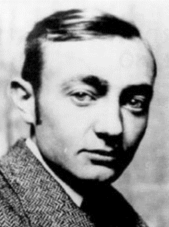1920-1928 között a budapesti Képzőművészeti Főisko-lán tanult, ahol  tehetségével és szorgalmával elérte, hogy mestere Szentgyörgyi István asszisztense lett. Már 1922-től állított ki műveiből, 1923-ban megkapta Ma-gyar Képzőművészeti Főiskola az első jelentős Magyar szobrászról elnevezett Ferenczy István szobrászati-dí-ját. Első műalkotásával 1924-ben a később a Város-ligetben felállított *Vízhordó fiú* c. szobrával, 1925-ben pedig a *Műcsarnok* Akt kiállításán az *Országos Magyar Képzőművészeti Társulat* Barta Károly-díját nyerte el. 1925-től műveivel minden jelen-tősebb hazai csoportos kiállításon szerepelt. 1926-ban a *Narcissus,* *Női akt gyertyával* c. munkáival nyert díjat. Eközben 1925-ben állami ösztöndíjjal [Párizsba](https://hu.wikipedia.org/wiki/P%C3%A1rizs)n, majd 1929-1930-ban a szobrászat mekkájának számító [Rómá-ban](https://hu.wikipedia.org/wiki/R%C3%B3ma) tanulhatta és szemlélhette meg, a hajdani nagy mesterek technikáját.

1943-tól 1948-ig az Iparművészeti Főskolában oktatott, ezután a  *[Szépmű-vészeti Múzeum](https://hu.wikipedia.org/wiki/Sz%C3%A9pm%C5%B1v%C3%A9szeti_M%C3%BAzeum) *restaurátoraként dolgozott 1953-ig.

Művei klasszicizáló kisplasztikák, emlékművek és reneszánsz ihletésű érmék. A *Nemzeti Színház* Kamaraszínpadán 1939-ben bemutatott *Az em-ber tragédiája* c. színmű szcenikai beállításán is dolgozott. Az 1940-es évektől porcelánnal is foglalkozott, több művét elkészítette a Herendi Por-celángyár. Ugyancsak a negyvenes évek elején készült a *Szűz Mária-osz-lop* (kő, 1942, Budapest, V. ker. Martinelli tér), valamint a híres *Szt. Antal-kút* (1944, Szeged). Tagja volt a második világháborúig működő KÉVÉ-nek (Magyar Képzőművészek és Iparművészek Egyesülete).

Az 1950-es években a kisplasztikák kerültek nála előtérbe, klasszicizáló stílusú szobrait nagyszerű technikai felkészültség jellemzi. Portrékat (*Cso-konai,* *Munkácsy, Zrínyi, Erkel, Bartók* stb.), mellszobrokat (*Liszt Ferenc* 1952. Budapest Városliget, áthelyezve 1966. Budapest Margitsziget), (*Csokonai Vitéz Mihály* 1953. Budapest, Városliget, áthelyezve 1966. Bu-dapest Margitsziget), valamint síremlékeket (*dr. Konthy Gyula* 1929. Nyír-egyháza), a budapesti Kerepesi úti temetőben és Bicske, Baracska, Vác, Sóskút, Kenderes hadiemlékművei stb készített.

Köztéri szobrokat ([*Varkocs György*](https://hu.wikipedia.org/wiki/Varkocs_Gy%C3%B6rgy) 1938. Székesfehérvár), (*Szt. Imre* 1938. Veszprém), valamint épületplasztikákat (*Balassi Bálint*-emléktábla 1954. Budapest, Balassi u. 1.) alkotott. Ezen kívül érmeket, plaketteket és reliefeket (domborműveket) is készített. Utolsó műve a László Péterrel közösen mintázott és a Népstadionban csak halála után felállított a bronz-ból készült *Stafétafutók c.* műalkotása volt.

A modern anyagok is érdekelték, alumíniumból készült a (*Vízhordó lány* 1956. áthelyezve 1988. Várpalota), (*Bakugrók* 1961. Tatabánya), valamint a (*Jókai-mellszobor* 1964. Budapest, XII. ker. Hollós u. 5.)

Klasszicizáló stílusú szobrait nagyszerű technikai felkészültség jellemzi. Stílusát Szentgyörgyi István neoklasszicizmusa inspirálta és az *itáliai quattrocento* hagyományaival gazdagodva teljesedett ki.

Forrás: [*Magyar életrajzi lexikon*](https://www.arcanum.hu/hu/online-kiadvanyok/Lexikonok-magyar-eletrajzi-lexikon-7428D/). *Magyar művészet 1919-1945* 1985.

tinódi **Erdey** **Ferenc** (Módos, 1895. május 13. - Budapest, 1966. december 31.) pap, filozófus, egyetemi tanár, eszperantista.

Az újvidéki gimnáziumot követően papnövendék volt Kalocsán. 1913-19 között a svájci Fribourgban filozófiát és teológiát tanult, miután 1918-ban doktorált, a kalocsai egyházmegye pappá szentelte. Két éven keressztül Svájcban; a champexi fürdőben, majd a fribourgi Szent János plébánián volt lelkész. 1920-ban a svájci gyermeknyaraltatási akció megbízásából az ott nyaraló magyar gyermekek lelki gondozója.

Visszatérve a kalocsai egyházmegyébe jánoshalmán [káplán](https://hu.wikipedia.org/wiki/K%C3%A1pl%C3%A1n), majd 1921-től szentszéki jegyző, érseki szertartó Kalocsán. 1923-25 között az érseki hittudományi főiskolán a filozófia tanára. 1926-tól szerkesztette a helyi *Árpád Könyveket*, 1926-1932 között pedig a kalocsai *Diáknaptár* első négy évfolyamának szerkesztője volt. Az *Árpád-könyvek* 1926-1937 kiadott könyvsorozatvolt, célul tűzték ki a katolikus hívek irodalmi, honismereti és társadalmi ismereteinek gyarapítását, valamint a vallásos és hazafias ér-zés ápolását. 1926 -1939 között az általa újjászervezett érseki tanítók háza igazgatója, a tanítóképző és a polgári iskola hittanára. 1928-tól zsinati bíró, 1929-ben a [Szent István Akadémia](https://hu.wikipedia.org/wiki/Szent_Istv%C3%A1n_Akad%C3%A9mia) tagja. 1931-től a budapesti egyetem magántanára 1935-től pedig c. ny. rk. tanár a budapesti egyetemen. 1939-től a budapesti Központi Papnevelő Intézet lelki igazgatója, egyben 1942-től szerkesztette a budapesti [*Jézus Szíve Hirnö*két](https://hu.wikipedia.org/w/index.php?title=J%C3%A9zus_Sz%C3%ADve_Hirn%C3%B6ke&action=edit&redlink=1).

1946. szeptemberétől az egyetem hittudományi karának, 1953-tól pedig a Hittudományi Akadémia filozófiai tanszékének tanára. Munkásságának fő területe [Aquinói Szent Tamás](https://hu.wikipedia.org/wiki/Aquin%C3%B3i_Szent_Tam%C3%A1s) *Summájá-*nak feldolgozása a keresztény bölcselet, elsősorban metafizikai és kozmológiai szempontból, továbbá a középkor bölcseleti irányzatainak bírálata volt.

Az Országos Magyar Esperanto Egyesületnek az elnöke volt. A [világszö-vetség](http://lexikon.katolikus.hu/E/Eszperant%C3%B3%20Vil%C3%A1gsz%C3%B6vets%C3%A9g.html)ben a budapesti kirendeltség megbízottjaként 1938-ban megszer-vezte az 1. Eucharisztikus Eszperantó Világtalálkozót.

Főbb művei: *A cserkészpedagógia alapelve Aquinói Sz. Tamás elmé-letének világánál (1924), Új utak erkölcstanításunk rendszerében (1926.) Kant valláserkölcsi világnézete (1929), Mi irányítsa a modern gondol-kodást? (1929), Egy fejezet a középkori sportetika történetéből. A sport kérdése Aquinói Szt. Tamásnál (1930), Szellemi kultúrélet a 13. sz.-ban és Szent Tamás (1930), A 13. sz. bölcseletének válsága és Aquinói Szt. Tamás (1930), A bölcselet válsága a középkorban (1944.) stb. *

Forrás: [*Magyar Katolikus Lexikon*](http://lexikon.katolikus.hu/)

simai **Erdős Károly** (Ujsóvé, 1887. július 17. - Debrecen, 1971. június 6.) református teológiatanár.

Édesapja Erdős József egyetemi tanár volt az 1912-ben alakult Debreceni Magyar Királyi Tudományegyetemen. 1921-ben az egyetem felvette az egykori miniszterelnök gróf [Tisza István](https://hu.wikipedia.org/wiki/Tisza_Istv%C3%A1n) nevét. Erdős Károly Debrecenben a Református Hittudományi Karon  tanult, hol 1909-ben *kollégiumi seniornak* azaz a diákság elnökének választot-ták. Teológiai és nyelvi tudását tökéletesítendő, két éven keresztül sorra járta a híres külföldi (Berlin, Cambridge és Zürich) tanintézményeket.

1911-ben hazatérve rövid segédlelkészi (Nagybánya, Debrecen) szolgálat után teológia magántanári képesítést szerzett. 1913 februárjában a Deb-receni Lelkészképző Intézetben kollégiumi docens, illetve egészen 1929-ig tanított az intézetben, 1917-1919 között az intézet igazgatói állását is betöltötte. 1914-ben a bécsi egyetemen megszerezte a *teológia licenciátusi* fokozatot is, majd 1919-ben doktori fokozatot is megszerezte.

Erdős Károly 1919-1950 között a *Református Hittudományi Kar Újszö-vetségi Tanszékén* az újszövetségi *exegézis* (szentírás-magyarázat) és segédtudományai nyílvános rendes tanáraként oktatott. A kommunista át-szervezés eredményeként 1950-1954 között az újonnan szervezett refor-mátus teológiai akadémia tanára. Szerkesztésébem jelent meg a debreceni *hittanszaki önképző társulat Közlönye* (1909-1910), a *Debreceni Pro-testáns Lap* (1926-1925), majd a *Lelkészegyesület* (1926-1935).

Főbb művei: *Bullinger Henrik és Fejértóy János levelezése (1913), A három első századbeli keresztény irodalom áttekintése (1916), A keresz-tyénség történetének egyes főbb mozzanatai a reformációig (1916), A Di-dache kora (1916), Antiochiai Ignatius levelei (1925), Pál apostol athéni beszéde (1927), Újszövetségi bevezetés (1934), A magyar református presbyter jogai, kötelességei és felelőssége (1934), Kálvin „Commentarius in harmoniam evangelicam” munkája és a görög szöveg (1936), Az Új-szövetség magyar fordításai a reformáció óta (1937) Az Újszövetség debreceni kiadásai (1943) stb. *

Forrás: [*Magyar életrajzi lexikon *](https://www.google.rs/url?sa=t&rct=j&q=&esrc=s&source=web&cd=4&cad=rja&uact=8&ved=0ahUKEwiFv7GIyvXaAhUC2CwKHZfqAecQFgg4MAM&url=https%3A%2F%2Fwww.arcanum.hu%2Fhu%2Fonline-kiadvanyok%2FLexikonok-magyar-eletrajzi-lexikon-7428D%2Fd-750BB%2Fderi-frigyes-751A9%2F&usg=AOvVaw32Aqi0P4FUgZ7iOjRhkD1I)

**F**

**Farkas Károly** ([Resicabánya](https://hu.wikipedia.org/wiki/Resicab%C3%A1nya), [1842](https://hu.wikipedia.org/wiki/1842). [augusztus 12.](https://hu.wikipedia.org/wiki/Augusztus_12.) – Budapest, [1907](https://hu.wikipedia.org/wiki/1907). [február 16.](https://hu.wikipedia.org/wiki/Febru%C3%A1r_16.)) vasmunkás, szocialista politikus.

Tanuló éveit Svájcban töltötte, ott ismerte meg a nem-zetközi munkásmozgalom vezetőit. Az Internacionálé I. kongresszusának (Genf, 1866. szeptember 3–8.) hatá-rozatai nagy hatást gyakoroltak Farkasra. A kongresz-szus Marx Károly javaslatai közül határozatként elfo-gadta, az erőfeszítések nemzetközi egyesítéséről, a munkanap korlátozásáról, a gyermek- és női munkáról, a szövetkezeti munkáról, a szakszervezetekről stb. szó-lót. Farkas Károly hazatérve a temesvári munkásegyletben létrehozta az I. *Internacionálé* szekcióját. Miután az Internacionálé Főtanácsa kinevezte magyarországi főmegbízottjának, Pestre költözött, ahol 1870-ben megala-kította a *Pest-Budai Munkásképző Egyletet-*et. A *Pest-Budai Munkás-képző Egylet* Farkas Károly tevékenységének eredményeképpen, szocia-lista szervezetté válva egyesült az *Általános Munkás Egylet*-tel.

A forradalmi demokrata Táncsics Mihály 1869 januárjában indította meg 

*Arany Trombita* című hetilapját, a lap megszűntével az *Általános Munkás Egylet* sajtóorgánumot nélkülözött. Lapjuk az *Általános Munkás-Újság*, az I. Internacionálé politikai irányvonalának megfelelően foglalkozott a mun-kásosztály és más társadalmi osztályok, rétegek viszonyának kérdésével. 

A lap munkatársai közé tartozott Külföldi Viktor szerkesztő, Politzer Zsig-mond stb., de cikkeket írt a lapba Táncsics Mihály is.

A szocialista világmozgalom nagy napja a  [porosz–francia háborúban](https://hu.wikipedia.org/wiki/Porosz%E2%80%93francia_h%C3%A1bor%C3%BA) el-szenvedett francia vereség, a francia császárság katonai összeomlásakor jött el. Ennek következtében 1870 szeptember közepén [Párizs](https://hu.wikipedia.org/wiki/P%C3%A1rizs) porosz ost-romgyűrűbe került.  Párizsban kormányválság alakult ki, a [blanqui](https://hu.wikipedia.org/wiki/Louis_Auguste_Blanqui)–proud-honi [szocialista](https://hu.wikipedia.org/wiki/Szocializmus) radikális erők létrehozták a Párizsi Kommünt (párizsi köz-ségtanács. A kommünárok azt követelték, hogy a párizsi helyőrség foly-tassa a harcot a porosz csapatok ellen.

A párizsi kommünnel rokonszenvezők 1871. június 11-i, pesti tűntetése után a szocialista mozgalom számos vezetőjét és résztvevőjét letartóz-tatták. Azzal vádolták őket, hogy a [monarchia](http://www.kislexikon.hu/index.php?f=monarchia) megdöntésére és a kommün bevezetésére törekedtek, s mindezek érdekében kapcsolatban voltak az I. Internacionáléval és Marxszal, 1872. április 22-30 között hűtlenségi pert indítottak ellenük. A hűtlenségi per ismertebb vádlottai: [Eisel Károly](https://hu.wikipedia.org/wiki/Eisel_K%C3%A1roly), [Essl András](https://hu.wikipedia.org/wiki/Essl_Andr%C3%A1s), [Szvoboda Lajos](https://hu.wikipedia.org/wiki/Szvoboda_Lajos), [Rauchmaul Károly](https://hu.wikipedia.org/wiki/Rauchmaul_K%C3%A1roly) és [Farkas Károly](https://hu.wikipedia.org/wiki/Farkas_K%C3%A1roly_(szocialista)).

Farkas a lefolytatott hűtlenségi per egyik fővádlottja volt, az ismertebb vádlottak közül egy - *Farkas Károly -* kivétellel, az összes vádlottat fel-mentették. Miután kiszabadult az ismert internacionalista harcos, Frankel Leó fő segítőtársa volt a *Magyarországi Általános Munkáspárt* megszer-vezésében. Ő képviselte Magyarországot az 1872 szeptemberében megtar-tott II. *Internacionálé* hágai V. kongresszusán. Amikor a kongresszus el-fogadta Marx javaslatait, kizárta a szervezetből Bakunyint és követőit.

A szellemi vezérek ellentéte a [Párizsi Kommün](https://no-regime.com/ru-hu/wiki/Paris_Commune) előző év júniusi kudar-cának különböző értelmezésében rejlett. Ekkor Marx kijelentette, hogy a proletariátusnak át kell vennie az állam irányítását, ez ellen anarchisták tiltakoztak. 

A Magyarországi Munkáspárt feloszlatása után Farkas Károly és Ihrlinger Antal 1872 decemberében bejelentették a hatóságoknak, hogy 1873 januá-rjától kezdve hetenként megjelenő magyar és német nyelvű újságot akar-nak kiadni *Munkás Heti-Krónika,* illetőleg *Arbeiter Wochen-Chronik* cím-mel. Gyakorlatilag a lap szerkesztősége irányította a szocialista mozgal-mat. A munkáslapot 1877-től Frankel Leó szerkesztette, de 1880-ban, a Magyarországi Általános Munkáspárt megalakulásakor, megszünt, évfo-lyamszámozását a Népszava folytatta. A lapot, mint „társadalom és gaz-dászati” tartalmú közlönyt jelentették be, mert a politikai lapok indítását a sajtótörvény csak magas kaució ellenében engedélyezte.

Természetesen a szerkesztők a sajtótörvény megkerülésével, maguk is politikai tartalmú lap létrehozására gondoltak. Az újság fő feladata az volt, hogy a munkáspárt megteremtésének szükségességét hirdesse. Ihrlinger Antallal közösen a *Munkás Heti Krónika* című lapon keresztül folytatta to-vább kérlelhetetlen osztályharcát.

A hetvenes évek folyamán a továbbiakban viszont érezhető volt a párizsi kommün leverésének, a Magyarországon is megmutatkozó hatósági elnyo-másnak a hatása. Az 1873. gazdasági válság következményei is megne-hezítették a munkásmozgalom fejlődését. A *Munkás Heti-Krónika* rend-szeresen beszámolt az akkori idők munkásmozgalmának politikai jogokat követelő népgyűlésekről, valamint a szórványos sztrájkmozgalmakról.

Farkas Károly tevékenyen részt vett az 1878 áprilisában létrejövő első munkáspárt megalakításában, azonban ennek működését a kormány nem engedélyezte. Az [1890-es években mikor megalakult a Magyarországi Szociáldemokrata Párt (MSZDP),](https://hu.wikipedia.org/wiki/1890-es_%C3%A9vek)  a frakcióharcokban [Engelmann Pál](https://hu.wikipedia.org/wiki/Engelmann_P%C3%A1l) tá-mogatója volt. Később az általa létrehozott munkásbiztosító pénztár fej-lesztésében vállalt szerepet.

Forrás: *Magyar Életrajzi Lexikon. Új magyar életrajzi lexikon. Lexikon - Kislexikon*

**Fasching Antal** ([Temesvár](http://hu.wikipedia.org/wiki/Temesv%C3%A1r), [1879](http://hu.wikipedia.org/wiki/1879). [június 6.](http://hu.wikipedia.org/wiki/J%C3%BAnius_6.) - [Budapest](http://hu.wikipedia.org/wiki/Budapest), [1931](http://hu.wikipedia.org/wiki/1931). [október 14.](http://hu.wikipedia.org/wiki/Okt%C3%B3ber_14.)) [földmérő](http://hu.wikipedia.org/wiki/Geod%C3%A9zia) mérnök.

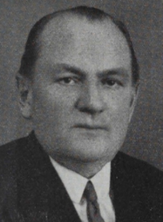A temesvári cipészmester fia korán árvaságra jutott, így csak állami ösztöndíjasként tudott tovább tanulni.

A Királyi József Műegyetemre íratkozott, hol a sikeres tanévek után [1902](https://hu.wikipedia.org/wiki/1902)-ben mérnöki oklevelet szerzett. 

[1902](https://hu.wikipedia.org/wiki/1902)-[1905](https://hu.wikipedia.org/wiki/1905) között a műegyetem  [geodézia tanszé](https://hu.wikipedia.org/wiki/Geod%C3%A9zia)kékn tanársegédi állásában volt, majd az intézet adjunktusa lett. [1906](https://hu.wikipedia.org/wiki/1906)-ban elsőként az országban a geodézia tárgykö-réből szerezte meg műszaki doktori oklevelét.

Még ugyanabban az évben állt munkába az akkor a Pénzügyminisztérium-hoz tartozó, az ország kataszteri felmérésére hivatott [Állami Háromszöge-lő Hivatalban](https://hu.wikipedia.org/w/index.php?title=%C3%81llami_H%C3%A1romsz%C3%B6gel%C5%91_Hivatal&action=edit&redlink=1). Fasching Antal 1906-ban dolgozta ki a magyarországi ferdetengelyű szögtartó hengervetület érintő elhelyezésű rendszert, melyet 1908-tól vezették be a magyar topokartográfiában történő felméréseknél.

1909-ben a fent említett tudományos munkájáért azaz országos új henger-vetület megalkotásáért, elnyerte a Magyar Mérnök és Építész Egylet a-ranyérmét, majd az egylet első elnökéről elnevezett [Hollán Ernő-díjat](https://hu.wikipedia.org/w/index.php?title=Holl%C3%A1n-d%C3%ADj&action=edit&redlink=1)  ka-pott háromkötetes geodéziai kézikönyvéért.

1912-től a műegyetemen magántanárként az „országos felmérés” tantár-gyának meghívott előadója. A tanítás mellett a pénz[ügyminisztérium](https://hu.wikipedia.org/wiki/P%C3%A9nz%C3%BCgyminiszt%C3%A9rium) köz-ponti felmérési felügyelőjeként is működött. A [Tanácsköztársaság](https://hu.wikipedia.org/wiki/Tan%C3%A1csk%C3%B6zt%C3%A1rsas%C3%A1g) bukása után, mivel a kommunista uralom alatt is aktív maradt minisztériumi vizs-gálatot folytattak le ellene. Habár az ellene megfogalmazott vádpontokban felmentették, a sértett ember [1920](https://hu.wikipedia.org/wiki/1920)-ban nyugdíjazását kérte.

Mégsem tudott munkája nélkül meglenni, nemzetközi híre a [Szerb-Horvát-Szlovén Királyság](https://hu.wikipedia.org/wiki/Szerb-Horv%C3%A1t-Szlov%C3%A9n_Kir%C3%A1lys%C3%A1g)  meghívását eredményezte. 1921-1923 között két évre az új állam fővárosában,  [Belgrádban](https://hu.wikipedia.org/wiki/Belgr%C3%A1d) vállalt állást, majd [1923](https://hu.wikipedia.org/wiki/1923)-tól négy évig a [zágrábi](https://hu.wikipedia.org/wiki/Z%C3%A1gr%C3%A1b) műegyetemen lett a geodézia előadója. A délszláv állam a kiemelt személyektől megkövetelte az állampolgárság szükségességét, azonban ez a magyar állampolgárság elvesztésével járt volna, így lemon-dott katedrájáról és hazatért.

[1927](https://hu.wikipedia.org/wiki/1927). decemberétől újra régi-új szlogálati helyén a *Háromszögelő Hi-vatalba* kapott állást. Hamarosan az Állami Térképészet néven szereplő *Honvéd Térképészeti Intézet* munkatársa lett, hol haláláig dolgozott.

“ Az elsők között ismerte fel és propagálta az Eötvös-féle ingamérések geodéziai jelentőségét. Újjászervezte a magyarországi geodéziai felmérést, kidolgozta a kataszteri felmérés új hengervetületi módszerét, több új földmérési műszert szerkesztett. Hivatali szabályzatokat, szakkönyveket írt, előadásokat tartott országszerte.”

Emlékére és kiemelkedő szakmai tudásának elismerésül alapították [1969](https://hu.wikipedia.org/wiki/1969)-ben a *[Fasching Antal-díj](https://hu.wikipedia.org/wiki/Fasching_Antal-d%C3%ADj)at,* melyet március 15-e alkalmából ítélnek oda  a 

[földmérés](https://hu.wikipedia.org/wiki/Geod%C3%A9zia), a  [földügy](https://hu.wikipedia.org/w/index.php?title=F%C3%B6ld%C3%BCgy&action=edit&redlink=1)  és a  [térképészet](https://hu.wikipedia.org/wiki/T%C3%A9rk%C3%A9p%C3%A9szet) terén kiemelkedő elméleti, gyakor-lati és tudományos tevékenység elismeréséül. [1982](https://hu.wikipedia.org/wiki/1982)-ben avatták fel *bronz mellszobrát* az Agrárminisztérium Kossuth-téri árkádja alatt.

Művei: *Javaslat a magyar országos felmérések újjászervezésére vonatko-zólag (1906), A magyar országos háromszögelések és részletes felmérések új vetületi rendszere (1909), A földméréstan kézikönyve (I-III., 1912-1913), Az új geodézia (1926).*

Forrás: *Magyar műszaki alkotók. Magyar életrajzi lexicon. Tudósnaptár*

Báró **Feilitzsch Artúr** (Törökkanizsa, 1859. február 18. - Nagyernye, 1925. június 15.) erdész, miniszter. Báró Feilitzsch Berthold, jogász, po-litikus bátyja.

Az édesapa, Feilitzsch Feodor Lázár annak ellenére, hogy az osztrák hadseregben szolgált, fiait magyar szellemben neveltette. Feilitzsch Artúr a selmecbányai erdészeti tanulmányai alatt küzdött a német befolyás ellen, az akadémiai ifjúság magyar társaságának volt az elnöke.

1879-ben erdőgyakornokként lépett állami szolgálatba a máramarosszigeti jószágigazgatóságnál. 1881-ben tette le Budapesten a felsőbb erdészeti ál-lamvizsgát. A földművelésügyi minisztérium után a budapesti és a kolozs-vári erdőigazgatóságnál teljesített szolgálatot. 1890-ben Kolozsvárt erdő-felügyelő, 1895-ben erdőigazgató. Az (EKE) Erdélyrészi Kárpátegyesület elnöke (1989-1906) volt. 1899-ben Kolozsvár második kerületének képvi-selőjévé választották szabadelvű párti programmal.

Politikusként szoros kapcsolatok fűzték a Tisza családhoz, Tisza István csoportjához csatlakozott. Nem véletlenül hiszen [Tisza Kálmán](https://hu.wikipedia.org/wiki/Tisza_K%C3%A1lm%C3%A1n) - volt mi-niszterelnök - testvéröccse Tisza Lajos gróf [1875](https://hu.wikipedia.org/wiki/1875) és [1898](https://hu.wikipedia.org/wiki/1898) között (haláláig) az *Országos Erdészeti Egyesület *elnöke volt.

Feilitzsch Artúr az [1905](https://hu.wikipedia.org/wiki/1905). [június 18](https://hu.wikipedia.org/wiki/J%C3%BAnius_18.)-án megalakult Fejérváry-kormány „ún. darabontkormány”  földművelésügyi minisztere lett.

A kormány földművelésügyi minisztereként leginkább a külkereskedelmi szerződések, és  állategészségügyi egyezmények megkötésével fejtett ki eredményes működést. A Fejérváry-kormányt fennállása alatt nem támo-gatta egyetlen párt sem, így az ellenzék által szervezett „nemzeti ellenál-lás” gyakorlatilag teljesen cselekvésképtelenné tette. Feilitsch a kormány lemondása után visszavonult a politikai élettől.

Forrás: *Magyar életrajzi lexikon*

**Fejes Teri** (Torontáltorda, [1902](https://hu.wikipedia.org/wiki/1902). [szeptember 21.](https://hu.wikipedia.org/wiki/Szeptember_21.) - [Budapest](https://hu.wikipedia.org/wiki/Budapest), [1994](https://hu.wikipedia.org/wiki/1994). [decem-ber 18.](https://hu.wikipedia.org/wiki/December_18.)) színésznő, énekesnő.

Fejes János és Tapadó Etelka foldműves szülők gyermeke. 1920-ban vég-zett az Országos Színészegyesület színiiskolájában, majd [Győrben](https://hu.wikipedia.org/wiki/Gy%C5%91r) kezdte pályafutását. Ezután 1921-ben [Pécsett](https://hu.wikipedia.org/wiki/P%C3%A9cs), 1922-ben [Makón](https://hu.wikipedia.org/wiki/Mak%C3%B3), majd Budapesten a főváros legszínvonalasabb mulatóhelyén a *Royal Orfeumban* játszott.

1923 és 1930 között az *Operettszínházban* szerepelt, egyébként 16 évig volt [Kabos Gyula](https://hu.wikipedia.org/wiki/Kabos_Gyula) állandó színpadi partnere volt. Kiemelkedően emlé-kezetes fellépésük az 1928-as Fővárosi opertettsziházi Ábrahám darabban a *Zenebona* c. zenés darabban volt. Ábrahám Pál darabjai mellett állandó szereplője volt a kor másik könnyűzenei zsenijének Eisemann Mihály pro-dukcióinak.

1929-ben a [*Budapesti Színház*](https://hu.wikipedia.org/w/index.php?title=Budapesti_Sz%C3%ADnh%C3%A1z&action=edit&redlink=1), 1931-32-ben a [*Király Színház*](https://hu.wikipedia.org/wiki/Kir%C3%A1ly_Sz%C3%ADnh%C3%A1z), 1932-ben és 1935-ben a [*Budai Színkör*](https://hu.wikipedia.org/wiki/Budai_Sz%C3%ADnk%C3%B6r), 1935-ben a [*Kamara Színház*](https://hu.wikipedia.org/w/index.php?title=Kamara_Sz%C3%ADnh%C3%A1z&action=edit&redlink=1), 1936-37-ben a [*Városi Színház*](https://hu.wikipedia.org/wiki/Erkel_Sz%C3%ADnh%C3%A1z) művésze volt. 1937-től 1944-ig az [*Erzsébetvárosi Színház-ban*](https://hu.wikipedia.org/w/index.php?title=Erzs%C3%A9betv%C3%A1rosi_Sz%C3%ADnh%C3%A1z&action=edit&redlink=1) lépett fel.

1939-ben emlékezetes ala-kításával volt méltó part-nere a zseniális ***Latabár Kálmán, Latabár Árpád*** testvérpárnak, Erdélyi Mi-hály: *Sárgarigófészek* c. operettjében.

A [második világháború](https://hu.wikipedia.org/wiki/M%C3%A1sodik_vil%C3%A1gh%C3%A1bor%C3%BA) után még a [*Vígszínház*ban](https://hu.wikipedia.org/wiki/V%C3%ADgsz%C3%ADnh%C3%A1z), a [*Magyar Színház*ban](https://hu.wikipedia.org/wiki/Pesti_Magyar_Sz%C3%ADnh%C3%A1z), a [*Pesti Színház*ban](https://hu.wikipedia.org/wiki/Pesti_Sz%C3%ADnh%C3%A1z) és a [*Vidám Színház*ban](https://hu.wikipedia.org/w/index.php?title=Vid%C3%A1m_Sz%C3%ADnh%C3%A1z&action=edit&redlink=1) is sze-repelt. Fejes Teri a háború utáni egyik legemlékezetesebb alakítását nyúj-totta az ifjú Pécsi Sándorral az oldalán, a *Művész Színház*, Szilágyi László-Zerkovitz Béla *Csókos asszony* című operett 1947-es előadásában. 1949 és 1955 között a [*Budapesti Operettszínház*](https://hu.wikipedia.org/wiki/Budapesti_Operettsz%C3%ADnh%C3%A1z) foglalkoztatta.

“Fejes Teri az 1930-as évek legnépszerűbb szubrettje volt: jó humorral, kitűnő színészi játékkal, pikáns bájjal, kivételes tánctudással a sablon-figurákat is élettel töltötte meg. Tehetségét jellemszerepekben is kamatoz-tatta. ”

Főbb szerepei:  *Riquette (Ábrahám P.: Viktória);  Bessie  (Ábrahám P.: Hawai rózsája);  Sarah (Jacobi V.: Sybill);  Joli (Buday D.: Csárdás);  *

*Rica Maca  (Zerkovitz B.: Csókos asszony);  Manci  (Heltai J.: Naftalin);  *

*Róza  (Katajev: Bolond vasárnap).*

Filmszerepei: *Kacagó asszony* (1930), *A tettes ismeretlen* (1957).

Forrás: *Magyar Színházművészeti Lexikon*

**Fekete György** (Törökbecse, 1919. június 7. - Budapest 1996. szeptember 1.) közlekedés-mérnök.

Az Állami Reálgimnáziumot [Szabadkán](https://hu.wikipedia.org/wiki/Szabadka) végezte, majd a [Zágrábi Egye-tem](https://hu.wikipedia.org/w/index.php?title=Z%C3%A1gr%C3%A1bi_Egyetem&action=edit&redlink=1) Műszaki Fakultásán, az Építőmérnöki Karon 1937 és 1941 között folytatott tanulmányokat. Mint Abs.Ing. (végzett mérnök) az akkori [József Nádor Műszaki és Gazdaságtudományi Egyetemen](https://hu.wikipedia.org/wiki/J%C3%B3zsef_N%C3%A1dor_M%C5%B1szaki_%C3%A9s_Gazdas%C3%A1gtudom%C3%A1nyi_Egyetem) néhány különbözeti vizsga, majd 9 szemeszteres tantervnek megfelelően lehallgatott kilen-cedik félév után 1943. február 25-én nyerte el mérnöki oklevelét.

Két esztendős frontszolgálat után, 1945-től a Budapesti Államépítészeti Hivatal segédmérnöke, mérnöke, a JNMGE oktatója, a Közlekedéstudo-mányi Kar vizsgabizottságának elnöke.

1945-1955 között a Kereskedelmi és Közlekedési Minisztérium mérnöke, 1955-től 1960-ig a Közlekedési és Postaügyi Minisztérium (KPM) Hajó-zási Főosztálya, illetve a Mahart Vezérigazgatósága építési csoportve-zetője, a Hajófejlesztési és Nemzetközi Csoport vezetője. 1966-tól 1971-ig a drezdai Friedrich List Közlekedéstudományi Főiskola vendégpro-fesszora. 1977-től a BME c. egyetem tanára.

„Fekete György jelentős szerepet játszott a II. vh. után a magyar kikötők és hajóműhelyek helyreállítási munkálataiban. Kutatóként elsősorban a folyami és a tengeri hajózás üzemi és gazdasági kérdéseivel foglalkozott. Kidolgozta a Budapest-Csepeli Nemzeti és Szabadkikötő távlati fejlesztési terveit. Döntő szerepe volt a magyarországi hajózható víziutak, a folyam-szabályozás tervezési irányelveinek kialakításában”.

Az MTA Közlekedéstudományi Főbizottság Hajózási Szakbizottságának tagja. A Gépipari Tudományos Egyesület (GTE) társelnöke. A Közleke-dési- és Közlekedésépítéstudományi Egyesület (KKTE) Közlekedési Szakosztályának vezetőségi tagja, a Központi Választmány tagja és a Hajóipari Szakosztály alelnöke. Kitüntetései: *Bánki Donát-díj, Jáky-díj, Friedrich List-érem, Széchenyi-díj* (1996.) stb.

Főbb magyar nyelvű művei: *A magyar hajózás története (1955), A magyar belvízi hajózás kialakulása és fejlesztésének kérdései. Magyarország szerepe a nemzetközi hajózásban (1957), A tengerhajózás jelentősége és magyar vonatkozásai (1959), A víziközlekedés technikája (1962), A dunai nemzetközi víziút jelentősége a regionális fejlesztés szempontjából. (1965), Az európai transzkontinentális víziutak és a konténerforgalom (1974), A Duna-Majna-Rajna víziút közlekedéspolitikai jelentősége a gazdasági együttműködés területén (1978), A Duna menti államok együttműködése a hajózásban (1984), A Duna-Majna-Rajna-víziút megnyitását megelőzően szükséges nemzetközi teendők (1991)*. stb.

Forrás: *Természettudományos és műszaki ki kicsoda? (1988.)*

**Fellner Henrik** ([Újvidék](https://hu.wikipedia.org/wiki/%C3%9Ajvid%C3%A9k), [1859](https://hu.wikipedia.org/wiki/1859). [szeptember 28.](https://hu.wikipedia.org/wiki/Szeptember_28.) - [Budapest](https://hu.wikipedia.org/wiki/Budapest), [1932](https://hu.wikipedia.org/wiki/1932). [június 23.](https://hu.wikipedia.org/wiki/J%C3%BAnius_23.)) nagyiparos-bankár.

Fellner Albert kereskedő és Róth Regina fia. Iskolai tanul-mányait a kereskedelmi Akadémián végezte. [1887](https://hu.wikipedia.org/wiki/1887)-ben lé-pett a kiemelkedő bankár tehetség Lánczy Leó Pesti Ma-gyar Kereskedelmi Bankjának kötelékébe. [Magyarország](https://hu.wikipedia.org/wiki/Magyarorsz%C3%A1g) 

első modern vett bankja  alapítói között volt - a [Roth-schild-bankház](https://hu.wikipedia.org/wiki/Rothschild_csal%C3%A1d) mellett - számos tekintélyes budapesti [zsi-dó](https://hu.wikipedia.org/wiki/Zsid%C3%B3k) kereskedő (pl. Ullmann Móric) mellett Széchenyi Ist-ván is. Fellner Henrik [1892](https://hu.wikipedia.org/wiki/1892)-től [1911](https://hu.wikipedia.org/wiki/1911)-ig ügyvezető igazga-tója volt a banknak. A bank érdekeltségbe tartozott számtalan nagyvállalat (pl. *Tungsram, [Marx és Mérei](https://hu.wikipedia.org/wiki/Marx_%C3%A9s_M%C3%A9rei_Tudom%C3%A1nyos_M%C5%B1szerek_Gy%C3%A1ra), [Engel Károly Alkatrészgyár](https://hu.wikipedia.org/wiki/Engel_K%C3%A1roly_Alkatr%C3%A9szgy%C3%A1r_N._V._M%C5%B1szergy%C3%A1ra), Budapesti Telefonhálózat, Schlick gyár, Budapesti Városi Villamos Vasút Rt., Buda-pesti Közúti Vaspálya Rt., a [MARTA gépkocsigyár](https://hu.wikipedia.org/wiki/Magyar_Automobil_R%C3%A9szv%C3%A9nyt%C3%A1rsas%C3%A1g,_Arad)*, stb.).

Ezeken felül számtalan banki szolgáltatást is nyújtott cégeknek, legyen az betét, hitel vagy egyéb művelet (pl. A [Weiss Művek](https://hu.wikipedia.org/wiki/Weiss_Manfr%C3%A9d_Ac%C3%A9l-_%C3%A9s_F%C3%A9mm%C5%B1vek)).

Felesége Leipziger Matild Margit volt, Leipziger Vilmos nagyiparos és Deutsch Jenny lánya, akivel 1892. március 29-én Budapesten kötött há-zasságot. Egy lányuk és négy fiuk született; Fellner Lucia Regina, Fellner Pál gyáros, országgyűlési képviselő, Fellner Alfréd bankigazgató, Fellner György és [Fellner Vilmos](https://hu.wikipedia.org/wiki/Fellner_Vilmos) közgazdász, egyetemi tanár.

Fellner Henrik házasságával együtt átvette a [Leipziger Vilmos Szesz- és Cukorgyár](https://hu.wikipedia.org/wiki/Leipziger_Vilmos_Szesz-_%C3%A9s_Cukorgy%C3%A1r) vezetését és attól fogva tevékenységét a gyáriparnak szentelte, amelynek európai hírű reprezentánsa lett. Igazgatósági tagja volt az ország legnagyobb ipari vállalatainak. A magyar iparbárók hét legkimagaslóbb tagja közé tartozott, ezek Fellneren kívül Lánczy Leó, Hatvany Deutsch Sándor és unokaöccse, Hatvany Deutsch József, Kornfeld Zsigmond, Ullmann Adolf valamint Weisz Manfréd voltak. [1927](https://hu.wikipedia.org/wiki/1927)-től felsőházi tagnak választotta. - A *GYOSZ *

*elnöksége 1928-ban -*

[Chorin Ferenc](https://hu.wikipedia.org/wiki/Chorin_Ferenc_(%C3%BCzletember))et váltva a  

[Gyáriparosok Országos Szövetségé](https://hu.wikipedia.org/wiki/Gy%C3%A1riparosok_Orsz%C3%A1gos_Sz%C3%B6vets%C3%A9ge)nek elnöke lett.

Fellner Henrik a *Pesti Ma-gyar Kereskedelmi Bank* ve-zetőjeként [1925](https://hu.wikipedia.org/wiki/1925)-ben bele-keveredett egy 24 millió koronás csalásba. Georges Dève francia állam-polgár összesen 24 millió [magyar koronát](https://hu.wikipedia.org/wiki/Magyar_korona) csalt ki a bank pénzéből [Fellner Henrik](https://hu.wikipedia.org/wiki/Fellner_Henrik) vezérigazgatón keresztül.

Forrás: *Magyar zsidó lexikon. [Magyar életrajzi lexikon ](https://www.google.rs/url?sa=t&rct=j&q=&esrc=s&source=web&cd=4&cad=rja&uact=8&ved=0ahUKEwiFv7GIyvXaAhUC2CwKHZfqAecQFgg4MAM&url=https%3A%2F%2Fwww.arcanum.hu%2Fhu%2Fonline-kiadvanyok%2FLexikonok-magyar-eletrajzi-lexikon-7428D%2Fd-750BB%2Fderi-frigyes-751A9%2F&usg=AOvVaw32Aqi0P4FUgZ7iOjRhkD1I)*

**Fenyő** *Fried* **Emil** ([Magyarkanizsa](http://hu.wikipedia.org/wiki/Magyarkanizsa), [1889](http://hu.wikipedia.org/wiki/1889). [március 18.](http://hu.wikipedia.org/wiki/M%C3%A1rcius_18.) - [Budapest](http://hu.wikipedia.org/wiki/Budapest), [1980](http://hu.wikipedia.org/wiki/1980). [augusztus 15.](http://hu.wikipedia.org/wiki/Augusztus_15.)) színész, filmrendező.

Az Országos Színészegyesület színiiskoláját 1909-ben végezte el, első színpadi fellépéseit vidéki szinhá-zakban [Nagyváradon](http://hu.wikipedia.org/wiki/Nagyv%C3%A1rad), [Szabadkán](http://hu.wikipedia.org/wiki/Szabadka) és [Pozsonyban](http://hu.wikipedia.org/wiki/Pozsony) kezd-te. A filmezés hamar elcsábította, már 1912-ben le-forgatta első némafiljmét (Nővérek). 1917-től a fővár-osi *Vígszínházba* szerződött, majd 1921-től a *Royal Orfeumban* lépett színpadra.

Ezután külföldi filmszerepeket vállalt, forgatott Berlin-ben, hol a német *Emelka* filmgyár alkalmazta. Párizsban még rendezést is vállalt. A harmincas években hazatérve előbb a [*Kamara-színház*](http://hu.wikipedia.org/w/index.php?title=Kamarasz%C3%ADnh%C3%A1z&action=edit&redlink=1), 1934-től a [*Fővárosi Operett-színház*](http://hu.wikipedia.org/w/index.php?title=F%C5%91v%C3%A1rosi_Operettszz%C3%ADnh%C3%A1z&action=edit&redlink=1) társulatának volt tagja. 1936-1938 között a [*Belvárosi Színház*](http://hu.wikipedia.org/wiki/Katona_J%C3%B3zsef_Sz%C3%ADnh%C3%A1z_%28Budapest%29) és a [*Művész Színház*](http://hu.wikipedia.org/w/index.php?title=M%C5%B1v%C3%A9sz_Sz%C3%ADnh%C3%A1z_%28Budapest%29&action=edit&redlink=1) tagja lett.

1938-tól a zsidótörvények miatt nem léphetett fel, a színészkamarának nem lehetett tagja, csak az -*Országos Magyar Izraelita Közművelődési Egyesület* (*OMIKE*)- művészakció keretében működhetett.

A második világháborút követően újra szinpadra léphetett, 1945-1947 kö-zött a [*Vígszínházban*](http://hu.wikipedia.org/wiki/V%C3%ADgsz%C3%ADnh%C3%A1z) és a [Pesti Magyar Színházban](http://hu.wikipedia.org/wiki/Pesti_Magyar_Sz%C3%ADnh%C3%A1z), később a [*Modern Színházban*](http://hu.wikipedia.org/w/index.php?title=Modern_Sz%C3%ADnh%C3%A1z&action=edit&redlink=1) valamint a [*Művész Színházban*](http://hu.wikipedia.org/w/index.php?title=M%C5%B1v%C3%A9sz_Sz%C3%ADnh%C3%A1z_%28Budapest%29&action=edit&redlink=1) játszott, míg végül 1950-1964 között a [*Nemzeti Színház*](http://hu.wikipedia.org/wiki/Nemzeti_Sz%C3%ADnh%C3%A1z) szerződtette.

Jó megjelenése, szép hangja, jól érvényesült drámai hősök szerepében. Később karakter- és epizódszerepeket formált meg.

Nyugalomba vonulása után szerepelt a Magyar Rádióban és a Magyar Televízióban is*.* A némafilmkorszak elegáns megjelenésű színésze volt.

Sorra játszott filmfőszerepeket: *[Mire megvénülünk](https://hu.wikipedia.org/w/index.php?title=Mire_megv%C3%A9n%C3%BCl%C3%BCnk_(film)&action=edit&redlink=1) (1917), [A bánya titka](https://hu.wikipedia.org/w/index.php?title=A_b%C3%A1nya_titka&action=edit&redlink=1) (1918), [Páris királya](https://hu.wikipedia.org/w/index.php?title=P%C3%A1ris_kir%C3%A1lya&action=edit&redlink=1) (1918), [Az aranyborjú](https://hu.wikipedia.org/w/index.php?title=Az_aranyborj%C3%BA&action=edit&redlink=1) (1918), [A hazugság](https://hu.wikipedia.org/w/index.php?title=A_hazugs%C3%A1g&action=edit&redlink=1) (1918), [Éj és virradat](https://hu.wikipedia.org/w/index.php?title=%C3%89j_%C3%A9s_virradat&action=edit&redlink=1) (1919), [A tizenegyedik](https://hu.wikipedia.org/w/index.php?title=A_tizenegyedik&action=edit&redlink=1) (1920), [A szerelem mindent legyőz](https://hu.wikipedia.org/w/index.php?title=A_szerelem_mindent_legy%C5%91z&action=edit&redlink=1) (1920) [Leánybecsület](https://hu.wikipedia.org/w/index.php?title=Le%C3%A1nybecs%C3%BClet&action=edit&redlink=1) (1923), [Az ördög mátkája](https://hu.wikipedia.org/w/index.php?title=Az_%C3%B6rd%C3%B6g_m%C3%A1tk%C3%A1ja&action=edit&redlink=1) (1926) stb.*

Hangos filmjei*: [Rákóczi induló](https://hu.wikipedia.org/w/index.php?title=R%C3%A1k%C3%B3czi_indul%C3%B3&action=edit&redlink=1) (1933), [Egy éj Velencében](https://hu.wikipedia.org/wiki/Egy_%C3%A9j_Velenc%C3%A9ben) (1934), [Helyet az öregeknek](https://hu.wikipedia.org/wiki/Helyet_az_%C3%B6regeknek) (1934), [Barátságos arcot kérek](https://hu.wikipedia.org/w/index.php?title=Bar%C3%A1ts%C3%A1gos_arcot_k%C3%A9rek&action=edit&redlink=1) (1936), [Hetenként egyszer láthatom](https://hu.wikipedia.org/w/index.php?title=Hetenk%C3%A9nt_egyszer_l%C3%A1thatom&action=edit&redlink=1) (1937), [Úrilány szobát keres](https://hu.wikipedia.org/w/index.php?title=%C3%9Aril%C3%A1ny_szob%C3%A1t_keres&action=edit&redlink=1) (1937) [A 111-es](https://hu.wikipedia.org/w/index.php?title=A_111-es&action=edit&redlink=1) (1938) [Tanítónő](https://hu.wikipedia.org/w/index.php?title=Tan%C3%ADt%C3%B3n%C5%91&action=edit&redlink=1) (1945), [Dalolva szép az élet](https://hu.wikipedia.org/w/index.php?title=Dalolva_sz%C3%A9p_az_%C3%A9let&action=edit&redlink=1) (1950), [Becsület és dicsőség](https://hu.wikipedia.org/w/index.php?title=Becs%C3%BClet_%C3%A9s_dics%C5%91s%C3%A9g&action=edit&redlink=1) (1951.) [Déryné](https://hu.wikipedia.org/w/index.php?title=D%C3%A9ryn%C3%A9_(film)&action=edit&redlink=1) (1951.) [Katonazene](https://hu.wikipedia.org/w/index.php?title=Katonazene&action=edit&redlink=1) (1961), [Két félidő a pokolban](https://hu.wikipedia.org/w/index.php?title=K%C3%A9t_f%C3%A9lid%C5%91_a_pokolban&action=edit&redlink=1) (1963), [Rab Ráby](https://hu.wikipedia.org/w/index.php?title=Rab_R%C3%A1by&action=edit&redlink=1) (1964), [A kőszívű ember fiai](https://hu.wikipedia.org/wiki/A_k%C5%91sz%C3%ADv%C5%B1_ember_fiai_(film)) I.-II. (1964-1965.) stb…*

Forrás: *Magyar Hangosfilm Lexikon.* [*Magyar színházművészeti lexikon*](http://mek.oszk.hu/02100/02139/html/sz07/186.html)

**Fiala János** Antal (Temesvár, 1822. január 26. - San Francisco, 1911. de-cember 8.) honvéd és federációs tiszt.

Fiala Antal katonai hivatalnok fia, a gimnáziumot szü-lőhelyén végezte, majd a grazi katonaiskolába adták. Őrmesteri rangban a 39. gyalogezredben szolgált, ké-sőbb a Bánsági Főhadparancsnokságnál (Temesvár) irodai gyakornok. Ezt követően kilépett a hadseregből és civil mérnökként folytatta pályafutását.

Az 1848-as szabadságharc idején a bánsági szerb fel-kelők ellen harcolva részt vett Versec és Fehértemp-lom megvédésében. 1849 januárjától a 9. honvédzászlóaljban százados, kitünteti magát a március 5-kei szolnoki csatában. Az áprilisi hadjáratban vitézi helytállásáért kitüntetik, majd májusban őrnagyi rangban a Komá-romban alakuló 98. zászlóalj parancsnoka. Június közepén Vetter Antal al-tábornagy törzstisztje a Délvidéki hadseregnél.

A [világosi fegyverletétel](https://hu.wikipedia.org/wiki/Vil%C3%A1gosi_fegyverlet%C3%A9tel)  után  [Bem József](https://hu.wikipedia.org/wiki/Bem_J%C3%B3zsef)  tábornokkal Törökországba emigrált. A török pasává vált szabadságharcossal a szíriai [Aleppóba](https://hu.wikipedia.org/wiki/Alepp%C3%B3)n a lá-zadó beduin törzsek ellen harcolt. Bem halálát kovetően előbb Francia-országban élt, majd [III. Napóleon](https://hu.wikipedia.org/wiki/III._Nap%C3%B3leon_francia_cs%C3%A1sz%C3%A1r) államcsínye után, 1851-ben az [Amerikai Egyesült Államokba](https://hu.wikipedia.org/wiki/Amerikai_Egyes%C3%BClt_%C3%81llamok) hajózott.

Az újvilágban St. Louisban telepedett le, hol mérnökként a [csendes-óceá-ni](https://hu.wikipedia.org/wiki/Csendes-%C3%B3ce%C3%A1n) vasútvonal építésén dolgozott. Miután kitűnő [topográfussá](https://hu.wikipedia.org/wiki/Topogr%C3%A1fia) és földmérő-vé képezte magát, elkészítette [Missouri állam](https://hu.wikipedia.org/wiki/Missouri_(%C3%A1llam)) és a [Mississippi-folyó](https://hu.wikipedia.org/wiki/Mississippi_(foly%C3%B3)) és a Csendes-óceán közti területek első szelvénymetszeti topográfiai térképét. A közben kettészakadt állam polgárháborújában az unionisták oldalán vett részt a véres harcokban. Ezredesi rangban Frémont tábornok törzsé-ben, a hadmérnökkar parancsnokaként szolgált.

Fiala vezette a [Saint Louisban](https://hu.wikipedia.org/wiki/Saint_Louis_(Missouri)) emelt erődítmények építését, valamint elké-szítette [Missouri állam](https://hu.wikipedia.org/wiki/Missouri_(%C3%A1llam)) első nagy térképét. 1863-ban súlyos betegségbe esett, de végül is szerencséssen felgyógyult.

A polgárháború után 1868-ban feleségével, Rombauer Tivadar magyar emigráns leányával, [Kaliforniába](https://hu.wikipedia.org/wiki/Kalifornia) költözött. Alamedában majd [San Fran-ciscóban](https://hu.wikipedia.org/wiki/San_Francisco_(Kalifornia)) éltek, hol műszaki rajzolóként dolgozott. Fiala alapította San Franciscóban a magyar társas- és kölcsönös segélyegyletet.

Cikkeket írt az amerikai lapokba, különösen a bostoni *Pionoeer*-ba Bem utolsó éveiről, és a törökkisázsiai tartományok állapotáról.

Források: *[Magyar életrajzi lexikon](http://mek.oszk.hu/00300/00355/html/ABC03975/04445.htm). [Bona Gábor: Az 1848/49-es szabad-ságharc tisztikara](https://www.arcanum.hu/hu/online-kiadvanyok/Bona-bona-tabornokok-torzstisztek-1/).*

**Fialovszky Lajos** ([Nagybecskerek](https://hu.wikipedia.org/wiki/Nagybecskerek), [1898](https://hu.wikipedia.org/wiki/1898). [november 18.](https://hu.wikipedia.org/wiki/November_18.) - [Budapest](https://hu.wikipedia.org/wiki/Budapest), [1987](https://hu.wikipedia.org/wiki/1987). [március 17.](https://hu.wikipedia.org/wiki/M%C3%A1rcius_17.)) geodéta, hadmérnök, egyetemi tanár, az MTA tagja.

 A Soproni Honvéd Főreál Iskola után a budapesti [Ludovika Akadémián](https://hu.wikipedia.org/wiki/Magyar_Kir%C3%A1lyi_Honv%C3%A9d_Ludovika_Akad%C3%A9mia) folytatta tanulmányait. Az első világháborúban két fiútestvérével egyetemben har-colt, hol vitézi helytállásáért kitüntették.

A háború és az azt követő felfordulások csillapodá-sával, 1921-től a *Haditechnikai Intézet Ballisztika Osztályán* csoportvezetőként, majd szakelőadóként dolgozott egészen 1937-ig.

Többször járt külfüldön, hol szakmai tudását tökéletesítette. Igy 1922-ben a Zürichi, 1925-ben pedig a Párizsi Műszaki Egyetem vendége volt. 1932-ben szerzett a [Budapesti Műszaki Egyetemen](https://hu.wikipedia.org/wiki/Budapesti_M%C5%B1szaki_%C3%A9s_Gazdas%C3%A1gtudom%C3%A1nyi_Egyetem) hadmérnöki oklevelet, ennek következményeként hadiipari törzstisztté lett kinevezve. 1937-40-ig az Iparügyi Minisztérium osztályvezetője.

A második világháború felpörgette a hadiipari fejlesztéseket, a *Precíziós Szerszám- és Gépgyárban* hol 1937-től mérnökként dolgozott, 1941-ben műszaki igazgatóvá lett kinevezve, alezredesi rangban. 1943-44-ig a zug-lói Danuvia Gépgyár mérnökigazgatója volt, az első világháború után létrejött [lőfegyvereket](https://hu.wikipedia.org/wiki/L%C5%91fegyver)  és  [szerszámgépeke](https://hu.wikipedia.org/wiki/Szersz%C3%A1mg%C3%A9p)t gyártó modern cég több kül-földi, elsősorban svájci és német fegyver gyártási jogát vásárolta meg, melyeket a Danuviánál gyártottak. Itt dolgozott a nemzetközi hírnévnek örvendő Király Pál fegyverkonstruktőr is, kinek találmányai nem egy híres fegyverben nyomokövethető.

A [második világháború](https://hu.wikipedia.org/wiki/M%C3%A1sodik_vil%C3%A1gh%C3%A1bor%C3%BA) után ezredessé léptették elő. Előbb a Honvédelmi Minisztérium Ipari Osztályának vezetője (1945-46), majd a *Haditechnikai Intézet* igazgatóhelyettese és az Intézet parancsnokhelyettese (1947-49).

1949-től, több, mint 20 éven át főmérnökként a [*Gamma Optikai Művekben*](https://hu.wikipedia.org/wiki/Gamma_%28gy%C3%A1r%29) az Optikai Kutatócsoport vezetője, majd 1961-től a *Magyar Optikai Művek* (MOM) tudományos főmunkatársa. A [MOM-ban](https://hu.wikipedia.org/wiki/Magyar_Optikai_M%C5%B1vek) töltött évek alatt újra elindította és modernizálta a geodéziai műszerek tervezését és gyártását. A Geodéziai Műszerfejlesztő Munkabizottság elnökeként és egyetemi tanár-ként több geodéziai műszertalálmányát, - pl. a *koordináta-teodolitot* - szabadalmazták Magyarországon és külföldön egyaránt.

Eközben az 1950-es évek második felében a Soproni Földmérőmérnöki Karon és a [Budapesti Műszaki Egyetem](https://hu.wikipedia.org/wiki/Budapesti_M%C5%B1szaki_%C3%A9s_Gazdas%C3%A1gtudom%C3%A1nyi_Egyetem) Geodézia Tanszékén is tanított. Ő vezette be a Geodéziai Műszertan egyetemi oktatását a földmérőmérnök képzésben. A *Geodéziai és Kartográfiai Egyesület* egyik megalapítója.

1951-ben a Műegyetemen doktorált a műszaki [fizika](https://hu.wikipedia.org/wiki/Fizika), [geodézia](https://hu.wikipedia.org/wiki/Geod%C3%A9zia) és [mate-matika](https://hu.wikipedia.org/wiki/Matematika) tárgyakból.

1968-ban címzetes egyetemi tanárrá nevezték ki a Budapesti Műszaki Egyetemen. Habár 72 éves korában nyugdíjba vonult, mégis folytatta tudo-mányos munkáját, a *BME Geodéziai Intézetében* és az *[ELTE](https://hu.wikipedia.org/wiki/E%C3%B6tv%C3%B6s_Lor%C3%A1nd_Tudom%C3%A1nyegyetem) Asztronómia Tanszékén* 85 éves koráig dolgozott tudományos tanácsadóként. *Geodéziai Műszerek* könyvét (1979) megjelenése óta  alapirodalomként használják a hazai egyetemeken. A könyv kibővített változata angolul is *megjelent “Surveying Instruments and their Operational Principles"* címen Oxford-ban 1991-ben. Azóta a világ minden kontinensén lévő egyetemek a mai napig használják az egyetemi oktatásban.

Forrás: *Magyar életrajzi lexicon. Természettudományi lexikon. História - Tudósnaptár*

**Fitz József** (Oravicabánya, 1888. március 31. - Budapest, 1964. Szeptem-ber 12.) könyvtáros, nyomdászattörténész.

Felsőfokú tanulmányait a Budapesti és külföldi (Mün-chenben, Párizsban, Lausanneban) egyetemeken vé-gezte. Ezt követően az újságírás magasiskolájában a párizsi *École du Journalisme-*ben csiszolta tehetségét.

Hazatérve előbb Budapesten joghallgató, 1913-ban szerzett bölcsészdoktori oklevelet. 

A budapesti Egyetemi-Könyvtár tisztviselőjeként a húszas években feldolgozta a magyar könyvtárak ős-nyomtatványait. A harmincas években a pécsi Egyetemi Könyvtár veze-tője, 1932-ban a helyi egytemen magántanári képesítést szerzett. 

1941-től cimzetes nyilvános rendkívüli tanár. Eközben 1934-1945 között az OSZK (Országos Széchényi Könyvtár) főigazgatója volt, egészen 1946-os nyugdíjazásáig. A Nemzeti Bibliográfia újjászervezőjeként tartják szá-mon. Nyugdíjasként a *Balkáni Intézet* könyvtárosa, valamint az *Országos Könyvtári Központ* szaktanácsadója volt.

Művelődéstörténészként a nyomda- és könyvtörténeti kutatások melett, az *ősnyom-tatványok* nemzetközileg is elismert szakértője volt. *A magyar nyomdászat, könyvkiadás és könyvkereskedelem története (I–II. 1959);* a magyarországi könyvtörténet alapműve.

1989 óta kerül kiosztásra a *Fitz József-könyvdíj,* amelyet a könyvtáros szakma által legértékesebbnek, legszebbnek tartott könyveknek ítélnek.

Főbb művei: *A könyv története (1930), A pécsi püspöki könyvtár egy eltűnt kódexe (1932), [Gutenberg](http://hu.wikipedia.org/wiki/Johannes_Gutenberg) (1940), A könyv sorsa Erdélyben (1941), A könyv és a könyvtárak története (1951), A magyar könyv története 1711-ig (1959-67).* Forrás: *Magyar Életrajzi Lexikon 1000-1990*

**Foerk Ernő** (Temesvár, 1868. febr. 3. - Budapest, 1934. jan. 26.) építész.

A budapesti Iparművészeti Iskolában elvégezte a szob-rász képzést. Tanárainak tanácsára fordult érdeklődése az építészet felé. 1888-ban a kor híres építőmesterének Pucher József irodájának alkalmazásában ismertkedett az építőművészet tudományával.

Tehettsége révén királyi ösztöndíjat nyert, így beíratkoz-hatott a bécsi Képzőművészeti Akadémia építészeti mes-teriskolájába. A császárvárosban a  kiváló templomépítő mester Friedrich von Schmidt tanítványa volt. Tőle örökölte elkötelezett-ségét a neoromán és neogótikus stílus iránt. A bécsi akadémia pályázatain többször is díjat nyert, például neogótikus templomterve illetve egy fürdő terveivel.

Az építészképzés elvégzése után vissztért a magyar fővárosba, hol közel két évtizedre (1892-1910 között) elkötelezte magát a korszak ([Ybl Miklós](https://hu.wikipedia.org/wiki/Ybl_Mikl%C3%B3s) és [Schulek Frigyes](https://hu.wikipedia.org/wiki/Schulek_Frigyes) mellett) egyik legjelentősebb építésze, Steindl Imre műegyetemi tanár irodájához. Foerk Ernő részt vett a mester álltal épített Országház belső terveinek kidolgozásában, sőt a nagy építész maga mellé vette az egyetemre is, így lett tanársegéd a Műegyetemen. [1898](http://hu.wikipedia.org/wiki/1898)-ban a budapesti Magyar Királyi Állami Felső Építő Ipariskola tanáraként tanítványaival az iskolai szünidőkben járta az országot, felmérve a [ma-gyarországi](http://hu.wikipedia.org/wiki/Magyarorsz%C3%A1g) műemlékek állapotát.

Az ország műemlékekről készített felvételeit a Felső Építő Ipariskola 6 dolgozatban kiadta. E sorozat részeként részletes felmérési rajzokat adott közre például a szepességi műemlékekről, vagy az erdélyi szászok erőd-templomairól, sőt a magyarországon még fellelhető törökkori műemlé-kekről. [1920](http://hu.wikipedia.org/wiki/1920)-tól igazgatója lett az intézménynek, és az is maradt nyuga-lomba vonulásáig.

Mintegy félszáz temploma és középülete közül legkiemelkedőbb alkotásai a [zágrábi](http://hu.wikipedia.org/wiki/Z%C3%A1gr%C3%A1b) postaépület (1903), amelyet [Sándy Gyulával](http://hu.wikipedia.org/wiki/S%C3%A1ndy_Gyula) tervezett, a [nagy-kőrösi](http://hu.wikipedia.org/wiki/Nagyk%C5%91r%C3%B6s) református templom tornyainak 1907-es évre esedékes megma-gosítása is Foerk és Sándy együttes tervei alapján épült meg.

Kiemelkedő munkái közé tartozik még a diószentpáli (ma Horvátország) Tüköry-kastély (1904) is. 1907-1911 között Foerk restaurálta és bővítette a kalocsai székesegyházat, az ő tervei alapján készült el ott az új főoltár és az érseki sírbolt is. 1908-ban a gödöllői kastély-kápolna műemléki fel-mérését és az óbudai római kori emlékek dokumentálásában is segéd-kezett. 1912-ben megbízták a temesvári emléktemplom, a püspöki palota és a [szeminárium](http://hu.wikipedia.org/wiki/Szemin%C3%A1rium_%28papnevel%C5%91_int%C3%A9zet%29) megépítésével.

Munkásságának a világháború előtti utolsó állomását jelentette [Nagy-szombat](http://hu.wikipedia.org/wiki/Nagyszombat), ahol a gimnázium épületének tervei (1914) fűződnek nevéhez.

1922-1924 között restaurálta az ócsai román kori templomot, majd Foerk tervei alapján készült el 1929-ben az akkori Állami Fa- és Fémipari Szak-iskola [Újpest](http://hu.wikipedia.org/wiki/Budapest_IV._ker%C3%BClete)en, továbbá a budapesti [domonkosok](http://hu.wikipedia.org/wiki/Domonkos-rend) temploma, valamint a szatmár[vállaji](http://hu.wikipedia.org/wiki/V%C3%A1llaj) római katolikus templom.

Petrovácz Gyulával közösen tervezték az 1928. október 28-án felszentelt Törökőri Lisieux-i Kis Szent Teréz plébániatemplomot és az 1929-ben épült Budapest-Angyalföldi Szent László plébániatemplomot. Szintén Foerk Ernő tervezőasztalán készültek továbbá az 1930. szeptember 21-én felszentelt, neoromán stílusformákat mutató angyalföldi lévő Szent Mi-hály-templom tervei is.

A Szombathelyen felépült a [Szent Kvirinus](http://hu.wikipedia.org/wiki/Szent_Quirinus) vértanú püspök emlékének szentelt szalezianus templom is az ő tervező tehetségét dicséri (1932-1933). Szegeden a Magyarok Nagyasszonya  fogadalmi templom építését (1913-1930) azzal a kikötéssel vállalta el a városi vezetéstől, hogy Schulek Frigyes eredeti tervein módosíthat (olcsóbbá teszi).

Foerk Ernő a részletformákat módosította Schulek tervein. A templom kőburkolat helyett téglaburkolatot kapott, és tornyainak magassága 76 méterről 93 méterre módosult. A Dóm tér kialakítására kiírt tervpályázatot azonban már nem ő, hanem Rerrich Béla építész és kerttervező művész nyerte el. Foerk Ernő így írt önéletírásában a szegedi Fogadalmi templom koncepciójáról: „A templom felső olaszországi - lombardiai- tégla archi-tektúrából indul ki a részletek szabad - egyéni - kiképzésével. Egyéni a fél-kupolák világítókoszorúja is, mely rokonságot mutat bizánci kupolák vilá-gítósémájával. Bizánci példákra utal a homlokzat és az apsziskupolák üvegmozaikdísze is.”

Tagja volt az *Építőművészek Szövetségének, a Magyar Mérnök és Építész Egyletnek, a Képzőművészeti Társulatnak, a Műemlékek Országos Bizott-ságának és az Iparművészeti Társulatnak* is. Kuzsinszky Bálint aquincumi feltárásakor őt bízta meg a leletek felmérési munkálatainak vezetésével. Szakirodalmi munkássága közül kiemelkedik az *„Árpádkori templomaink típusa”* - című dolgozata, amelyért kapta a [Hollán Ernő-díjat](http://hu.wikipedia.org/w/index.php?title=Holl%C3%A1n_Ern%C5%91-d%C3%ADj&action=edit&redlink=1) 1927-ben, valamint a Magyar Mérnök- és Építész Egylet szakmai díja a [Corvin-ko-szorú](http://hu.wikipedia.org/wiki/Corvin-koszor%C3%BA) (1930). Tevékenysége az iparművészet, az építészet, a műemlék-védelem és helyreállítás, illetve az építészetpedagógia területét is felölelte. Építészeti stílusára jellemző volt a [historizmus](http://hu.wikipedia.org/wiki/Historizmus), [eklektikus](http://hu.wikipedia.org/wiki/Eklektika) épületein elő-szeretettel alkalmazott középkori román és [gótikus](http://hu.wikipedia.org/wiki/G%C3%B3tika) formaelemeket.

Forrás: *Magyar életrajzi lexikon.[ ](http://mek.oszk.hu/00300/00355/html/ABC03975/04562.htm) [Új magyar életrajzi lexikon](https://hu.wikipedia.org/wiki/%C3%9Aj_magyar_%C3%A9letrajzi_lexikon)*

**Földes** *Weisz* **Béla** (Lugos, 1848. szeptember 25. - Budapesten, 1945. ja-nuár 18.) közgazdász és statisztikus, egyetemi tanár, az [MTA](http://hu.wikipedia.org/wiki/MTA) tagja.

A gimnáziumot Temesváron és Pesten végezte. Bécs-ben és Lipcsében joghallgatóként kezdett a nemzet-gazdaságtannal foglalkozni. Miután hazatért, 1872-ben a fővárosi statistikai hivatal igazgatóhelyettesévé ne-vezték ki, ugyanakkor jog- és államtudományi doktori oklevelet szerzett. 1873-ban szervezték a budapesti ke-reskedelmi akadémián kereskedelmi történetnek tan-székét melynek főelőadója lett.

1877-ben ő dolgozta ki az Ausztriával megkötött kereskedelmi és vámszer-ződés alkalmával az akkori kereskedelmi miniszter részére szolgáló szak-véleményt. 1879-ben kinevezték a nagyváradi jogakadémiához tanárnak. A következő esztendőben a budapesti Kereskedelmi Akadémián a nemzet-gazdaság- és pénzügytan rendes tanára lett. Ezzel egyidejűleg a budapesti egyetem 1882-től a statisztika nyílvános rendkívüli, 1889-től rendes tan-árává nevezteték ki, melyet tíz éven kresztül vezetett.

1892-ben Kautz Gyula helyére - az osztrák-magyar bank főkormányzója lett -, a nemzetgazdaság és pénzügytan tanszékére helyezték át. A jogi ka-ron is tanított, itt két ízben a kar dékánja, 1917-ben pedig az egyetem rektora volt. Nemzetközi tekintélyét bizonyítja, hogy az *Institut Internatio-nal de Statistique* (Nemzetközi Statisztikai Intézet) 1885-ben, a *British Economic Association* (Brit Közgazdasági Társaság) pedig 1891-ben vá-lasztja tagjává.

1906 és 1918 között a [*Függetlenségi Párt*](https://hu.wikipedia.org/wiki/F%C3%BCggetlens%C3%A9gi_%C3%A9s_Negyvennyolcas_P%C3%A1rt) országgyűlési képviselője, így egyedi esetként 1917. augustusától 1918. májusáig az ellenzéki párt kép-viselőjeként a harmadik Wekerle-kormány gazdasági tárca nélküli mi-niszter lett. 1920 után visszavonult a közélettől, de továbbra is folyama-tosan jelentek meg tanulmányai, cikkei. Közgazdasági munkáin a *német történeti iskola* erősen nyomon követhető. 1893-1894-ben jelent meg alap-vető munkája, a *Társadalmi gazdaságtan* két kötete. Tanulmányaiban az adó- és a pénzügy, valamint a szociálpolitikai kérdésekkel foglalkozott, kiállt az önálló magyar jegybank felállítása mellett. A történeti statisztika egyik első hazai képviselője volt. 1945. január 18-án, a [budapesti gettó-ban](https://hu.wikipedia.org/wiki/Budapesti_gett%C3%B3)  - annak felszabadulásakor - halt éhen. Főbb művei: *Bevezetés a gaz-daság történetébe (1878), Takarékpénztáraink reformja (1879), A nemzet-gazdaságtan és pénzügytan vezérfonala (1900), Az államháztartástan (1900), Ricardo, különös tekintettel a háborús közgazdaság kérdéseire (1919), A szociális igazság felé (1936) stb.*

Forrás: *[Magyar zsidó lexikon](https://hu.wikipedia.org/wiki/Magyar_zsid%C3%B3_lexikon). Magyar életrajzi lexikon 1967.*

**Fröhlich Pál** ([Torzsa](http://hu.wikipedia.org/wiki/Torzsa), [1889](http://hu.wikipedia.org/wiki/1889). [december 6.](http://hu.wikipedia.org/wiki/December_6.) - [Szeged](http://hu.wikipedia.org/wiki/Szeged), [1949](http://hu.wikipedia.org/wiki/1949). [október 15.](http://hu.wikipedia.org/wiki/Okt%C3%B3ber_15.)) fi-zikus, egyetemi tanár.

A budapesti tudományegyetem matematika-fizika ta-nári szakát végezte. 1912-ben Eötvös Loránd meg-hívására ötödéves hallgatóként részt vett a balatoni és erdélyi geofizikai kutatásokban. 1914-től a budapesti református gimnáziumban tanított. Az I. világháború harcaiban megsebesült, így csak a háború végén 1918-ban, felépülése után doktorált.

1923-tól a budapesti egyetem magántanára, miután a *kísérleti és elméleti fénytan *tárgykörből habilitálták. 1924. szepemberétől a szegedi egyetem kísérleti fizikai tanszékén nyilvános rendkivüli, 1926. októberétől nyilvános rendes tanára. 1928-ban a szegedi új Kísé*rleti Fizi-kai Kutató Intézet* megszervezésével bízták meg, s e célból állami kikülde-tésben a német egyetemek fizikai intézeteit tanulmányozta.

Fröhlich Pál tudományos munkásságának első információja a *Mathema-tikai és Physikai Lapok* 1924-es évfolyamában jelenik meg a fénytörés geometriai törvényeinek érvényességi határáról írt értekezése. Tudomá-nyos érdeklődése a klasszikus optikai kutatásai mellett a kolloidfoszforok felé fordult, szakmai fejlődésének jelentős állomásaként 1925-ben egy évet töltött Baltimore-ban, a Johns Hopkins egyetemen. A *Rokeferrel-ösztön-ndíj* lehetővé tette számára, hogy a világhírű kutató bázison jelentős több-lettudásra tegyen szert. Fröhlich Pál a baltimore-i egyetemen után a chica-gói egyetemen folytatta kutatását, így szakterületének legkiválóbbjai közé került. Hazatérve figyelme azokra a fényjelenségekre irányul, amelyek molekuláris hatásokkal kapcsolatosak. Elsősorban a foszforeszcencia je-lenségét vizsgálta, de továbbra is foglalkozotta a lumineszcenciával, ne-véhez fűződik a polarizációs színkép fogalmának kialakítása.

1937-ben Gyulai Zoltánnal közösen a szekunder-foszforeszcencia jelen-ségét tanulmányozta. Fröhlich később a forgó mágneses térnek a zselatin-foszfor-lapocskákra kifejtett hatását vizsgálta, megmérve a forgatóhatás függését a festékkoncentrációtól.

A fizikai intézeteknek nagy károkat okoztak az 1944. tavaszán hozott kiü-rítési rendelkezések is, az egyetemet a németországi Halle-ba kívánták telepíteni. Fröhlich professzor az értékesebb műszereket és könyveket az egyetem egyik alagsori laboratóriumába rejtették el. A háború alatt elül-dözött vagy hadifogságban levő oktatók 1945 tavaszán visszavette az inté-zet vezetését, minden idejét és energiáját az oktatás megszervezése kötötte le. Tudományos közleményeit német és angol nyelven publikálta hazai és külföldi szaklapokban. Forrás: *Magyar életrajzi lexikon*

**Futtaki** *Wilhelm* **Gyula** (Futak, [1850](https://hu.wikipedia.org/wiki/1850). [december 25.](https://hu.wikipedia.org/wiki/December_25.) - [Budapest](https://hu.wikipedia.org/wiki/Budapest), [1895](https://hu.wikipedia.org/wiki/1895). [decembr 10.](https://hu.wikipedia.org/wiki/December_10.)) újságíró.

Jómódú zsidó kereskedőcsaládban született, ennek ellenére szüksége volt [Bende Imre](https://hu.wikipedia.org/wiki/Bende_Imre) újfuttaki (későbbi besztercebányai és nyitrai püspök) plébános pártfogására. A közeli [Újvidéken](https://hu.wikipedia.org/wiki/%C3%9Ajvid%C3%A9k) a szerb gimnáziumban (mivel a magyar nyelvet még nem bírta) fejezte be az első három tanévet, majd atyja a ma-gyar nyelv tökéletesítése okán [Kalocsára](https://hu.wikipedia.org/wiki/Kalocsa) a jezsuitákhoz íratta át. Az érettségit a pesti piaristáknál tette le.

Fiatalon lett családfentartó, 1869-ben atyja meghalt, anyját és kisebb két testvérét gyámolítandó nevelői állást vállalt. Minden gondja mellett még a jogi akadémiát is elvégezve a kor divatos szakmáját vállasztva hírlapíró lett. Első közírói próbálkozásaihoz segítséget nyújtott a volt piarista tanára Berecz Antal, kinek *Természet* című folyóiratában jelentek meg írásai. 1870-ban lépett be a [Deák-párti](https://hu.wikipedia.org/wiki/De%C3%A1k-p%C3%A1rt) irányt támogató jeles hazafi és közéleti nagyság Rákosi Jenő *Reform* c. lapjához. A lap köré egy sor fiatal tehet-séges tárcaíró csoportosult pl.: Márkus István vagy [Toldy István. Ebben a társaságban](https://hu.wikipedia.org/wiki/Toldy_Istv%C3%A1n) hamar bizonyította közírói tehetségét, kitüntetésül mint or-szággyűlési tudósítót alkalmazták.

Miután átment Magyarország legjelentősebb politikai napilapjához a *Pesti Naplóhoz*, bekerült a *Deák-körbe*, Deák Ferenc személyesen vezette be a legbelsőbb politikai körökbe. Igazi úttöröje volt a modern újságírásnak, ő vezette be a “nemhivatalos” vagy “kormányközeli” fogalmakat, tehát poli-tikai hírszerzéssel foglalkozott.

Politikai sugalmazó híreit a *Pesti Naplóban* és a *Pester Lloydban* (a pesti német nyelvűek lapja) tette közhirré. A hazai politikai élet is igencsak lázba jött, mikor beharangozták a kormánypárt ([Felirati Párt](https://hu.wikipedia.org/wiki/Felirati_P%C3%A1rt)) fuzióját az ellenzék legerősebb (Balközép) parlamenti csoportjával. [1875](https://hu.wikipedia.org/wiki/1875). március 1-jén alakult meg a Tisza kálmán vezette Szabadelvű Párt, Futtaky kezdetben a *Pesti Naplóban* és a *Pester Lloydban* kezdetben a készülődő fúzió ellen írt cikkeket. 1875 elején viszont már a fúzió szükségét hangsúlyozta, a nap nap után írt cikkeiben, melyek nagy feltűnést keltettek.

A dualizmus kezdeti szakaszában a magyar közvéleményt a külföldi ese-ményekről a bécsi forrásokat használva a pesti *Pester Correspondenz* tájé-koztatta. A magyar politika elvárta egy lojálisabb forrás létrehozását, így jött létre [1875](https://hu.wikipedia.org/wiki/1875) karácsonyán a Futtaki Gyula alapította német nyelvű *Buda-pester Correspondenz*, valamint a magyar nyelvű megfelelője a *Budapesti Tudósító* című lap. A két lap a magyar kormány félhivatalos szócsövének számítva, valóságos hatalommá nőtte ki magát.

A tehetséges és benfentes Futtaky irányítása alatt nemcsak belföldön, hanem külföldön is nagy tekintélynek örvendett. Az 1875-1878-as orosz-török háborúról, a berlini kongresszusról, a magyar és osztrák kormány közt évről-évre folyt tárgyalásairól szóló tudósításai a világ jelentős lapjai is átvették. Futtaki Gyula megfordult Rudolf trónörökös bizalmas köreiben is, gyakran írt a trónörökös véleményét tükröző sugalmazott cikkeket.

Egyesek szerint része volt abban is, hogy a trónörökös a „*magyar kormányt tekintette a birodalom központosításának legfőbb kerékkötőjének*.“

Egyetlen könyve jelent meg: *Magyarország címere* (1891).

Források: *[Magyar zsidó lexikon](https://hu.wikipedia.org/wiki/Magyar_zsid%C3%B3_lexikon).* *Szinnyei József - [Magyar írók élete és munkái ](https://www.google.rs/url?sa=t&rct=j&q=&esrc=s&source=web&cd=2&cad=rja&uact=8&ved=2ahUKEwiyzvaGr6vdAhXLYlAKHaC5D9IQFjABegQIBhAB&url=https%3A%2F%2Fwww.arcanum.hu%2Fhu%2Fonline-kiadvanyok%2FLexikonok-magyar-irok-elete-es-munkai-szinnyei-jozsef-7891B%2Ff-82EA0%2Ffuttaky-gyula-854B4%2F&usg=AOvVaw0jW9Y4BAJ_LuYoJRmb9sIy)*

**Fülepp Kálmán** (Ruszkabánya, [1851](https://hu.wikipedia.org/wiki/1851). [április 10.](https://hu.wikipedia.org/wiki/%C3%81prilis_10.) - [Budapest](https://hu.wikipedia.org/wiki/Budapest), [1919](https://hu.wikipedia.org/wiki/1919). [szep-tember 17.](https://hu.wikipedia.org/wiki/Szeptember_17.)) Budapest főpolgármestere.

Édesapja Fülepp Lipót 48-as kormánybiztos. Jogi ta-nulmányait Pesten fejezte be, hol hamarosan ügyvédi irodát nyitott. A főváros alkalmazásában előbb tiszti főügyéssz, majd a [koalíciós kormány idején](https://hu.wikipedia.org/wiki/M%C3%A1sodik_Wekerle-korm%C3%A1ny), 1906-ban főpolgármesterré választották. Ennek előzménye a kö-vetkező volt, az 1905-ös országgyűlési választásokon megbukott a több évtizede kormányzó Szabadelvű Párt az ellenzéki koalícióval szemben.

Az uralkodó nem szándékozta a *Kossuthi ellenzéket* hatalomba emelni, így az alkotmány megsértésével bizalmi emberét, Fejérváry Géza táborszer-nagyot nevezte ki miniszterelnöknek. A törvénytelenség ellen mind a megyékben, mind a városokban széles körű nemzeti ellenállás bontakozott ki, melynek a főváros állt élére. Fülepp ekkor főügyészként az ellenállás jogát képviselte. A politikai válság hamar megoldódott, a Fejérváry-kor-mány 1906 áprilisában lemondott. Ekkor került Fülepp Kálmán neve előtérbe, mint akiben egyaránt megbíznak a pártok és az uralkodóbizalmát is élvezi. Főpolgármesteri programjában jelentős újítás volt, hogy a nyere-ségesen működő közüzemeket a főváros kezelésébe szerette volna venni, megígérte az elavult fővárosi törvény reformját és a városi adminisztráció észszerűsítését. 1912-ben, amikor hatéves mandátuma lejárt, önként le-mondott tisztségéről.

Szenvedélyes evező volt, a *[Nemzeti Hajós Egyletbe](https://hu.wikipedia.org/w/index.php?title=Nemzeti_Haj%C3%B3s_Egylet&action=edit&redlink=1)n* űzte ezt a kiváló spor-tot élete végéig. A magyar evezőssport felvirágoztatóját tartják számon, az egyletének igazgatója, majd elnöke volt. A kortársak jellemzése szerint csendes, halk szavú, igazi úriember volt, "a legangolabb" magyar.

Forrás: *Magyar Életrajzi Lexikon 1000-1990; [Magyar életrajzi lexikon](https://www.arcanum.hu/en/online-kiadvanyok/Lexikonok-magyar-eletrajzi-lexikon-7428D/)*

**Fülöp-MillerRené** (Karánsebes, [1891](https://hu.wikipedia.org/wiki/1891). [március17.](https://hu.wikipedia.org/wiki/M%C3%A1rcius_17.)–Hanover, USA, 1963.

[május 7.](https://hu.wikipedia.org/wiki/M%C3%A1jus_7.)) drámaíró, művelődéstörténész.

Gyógyszerészcsaládban született, édesanyja az előkelő szerb Brankovič családból származott. A kolozsvári, a bécsi, a lausanne-i és a párizsi egyetemen folytatott or-vosi, pszichiátriai, gyógyszerészeti, vegyészeti és filozó-fiai tanulmányokat. Tanárai között volt Freud, Forel, Babinski. Tanulmánya után édesapja gyógyszertárában dolgozott, de nem maradt sokáig.

Az első világháború alatt (1914–1918) az orosz fronton szolgált. A világháború után több magyar lap tudósítója volt [Bécsből](https://hu.wikipedia.org/wiki/B%C3%A9cs), Ber-linből és [Párizsból](https://hu.wikipedia.org/wiki/P%C3%A1rizs). Az 1930-as években Amerikában önálló száműzetésbe vonult. 1939-ben Hollywoodban telepedett le. 1943-ban amerikai állam-polgár lett. 1950–1954 között orosz kultúrát és szociológiát tanított a New Hampshire-i Hannoverben, a Dartmouth College-ban. 1954-ben a New York-i Hunter College-ba költözött. 1962 őszén visszatért előadóként a Dartmouth College-ba.

Miután beutazta Afrikát és [Ázsiát](https://hu.wikipedia.org/wiki/%C3%81zsia), két évet a Szovjetunióban töltött, ahol 

[Tolsztoj](https://hu.wikipedia.org/wiki/Tolsztoj) és Dosztojevszkij kéziratait tanulmányozta. Német és francia művelődéstörténeti munkáit, útirajzait több nyelvre lefordították.

Számos színművet is írt. Tagja volt a londoni szerzők, írók és színműírók társaságának, a berlini Schopenhauer társaságnak és a német írók szövet-ségének. Első sikere szerzőként az eredetileg német nyelven 1926-ban megjelent A bolsevizmus elméje és arca: *A szovjet orosz kulturális élet vizsgálata* (Geist *und Gesicht des Bolschewismus) című könyvben szüle-tett.* Legsikeresebb könyve* A jezsuiták hatalma és titka *(Macht und Ge-heimnis der Jesuiten; 1929), amelyet 1945 után is újranyomtattak.

Európában tett utazásainak, valamint a német nyelvterületen elismert új-ságokban és rádióban végzett munkájának köszönhetően elismert szerzővé vált a weimari köztársaság idején. Az "amerikanizmust" a hitvilág ellen-tétes kulturális szellemeként határozta meg.

Első szépirodalmi műve a *Katzenmusik* "Caterwauling", egy szatirikus mese egy négy éves zenei csodagyerekről. Későbbi fikciója az *Idő éjszaká-ja* és az *Ezüst Bacchanal*, két szürreális mese Drohitz kitalált városában játszódik. Magyarul megjelent műve: *Az ismeretlen Tolsztoj* (sajtó alá rendezte németül; fordította: [Benedek Marcell](https://hu.wikipedia.org/wiki/Benedek_Marcell) és Havas József, [Budapest](https://hu.wikipedia.org/wiki/Budapest), 1929). Forrás: *Magyar életrajzi lexikon IV: 1978–1991 (A–Z)*

**G**

**Galetta Ferenc** ([Temesvár](http://hu.wikipedia.org/wiki/Temesv%C3%A1r), [1889](http://hu.wikipedia.org/wiki/1889). [március 12.](http://hu.wikipedia.org/wiki/M%C3%A1rcius_12.) - [Budapest](http://hu.wikipedia.org/wiki/Budapest), [1974](http://hu.wikipedia.org/wiki/1974). [október 21.](http://hu.wikipedia.org/wiki/Okt%C3%B3ber_21.)) színész, rendező, szövegkönyvíró.

Színi pályáját 1910-ben a színész, színigazgató [Fehér Károly](http://hu.wikipedia.org/w/index.php?title=Feh%C3%A9r_K%C3%A1roly&action=edit&redlink=1) társulatánál [Sepsiszentgyörgyőn](https://hu.wikipedia.org/wiki/Sepsiszentgy%C3%B6rgy) állomásozó 

társulatánál kezdte. A nyarat vádorlással töltötték, be-járván a környező székely községeket, az úgynevezett erdélyrészi II. színikerületet.

A következő 1911-12-es évadot már az ország másik végében Halász Alfréd dunántúli társulatánál töltötte. Ezután megállás nélkül vándorolt városról-városra, 1912-től 1914-ig Pécsett, 1914-1915-ben már Szegeden játszott.

Végre 1915-ben bemutatkozhatott a fővárosi nagyérdemű előtt, 1915-1917 kö­­zött Komjáthy János buda-temesvári társulatába szerződött a bonvivám szerepére, illetve mikor az előbbi megnyitotta *Budai Színkört,* Sebes­tyén Géza igazgatósága alatt folytatta az ingázást a főváros és a bánsági metropolis között. 1917-1919 között már végleg a bu­da­pesti közönségnek játszott, mégpedig a *Vígszínházban*, a *Városi Színházban*, nyaranta a *Budai Színkör* fából készült padsorai előtt lépett fel. A *Vígszínház* deszkáin ope-rettszerű dalműben aratta első emlékezetes sikerét.

Az 1918-19-es forradalmak idején stílszerűen munkásmatinék szereplője. 1920-1921-ben a *Revü szinházban*, Bródy István és Wertheimer Elemér igazgatósága alatt énekelhette az operettek fűlbemászó dallamait.

A szinház szinte évadról-évadra (1921-ben *Scala*, 1921-22-ben a *Blaha Lujza*) váltóztatta nevét, miközben ugyanott lépett fel. Állandó partnere a korszak egyik ünnepelt primadonnája bájos Péchy Erzsi volt.

1921-22-ben Nagyváradra hívja [Parlagi Lajos](http://hu.wikipedia.org/w/index.php?title=Parlagi_Lajos&action=edit&redlink=1), aki magyar érzelmei miatt irredentizmus gyanúba került, és aki 1944-ben a visszakerült Váradról deportálva, [Auschwitz](https://hu.wikipedia.org/wiki/O%C5%9Bwi%C4%99cim)ban hal meg! 1922-1924 között a nehézsorsú (Cseh-szlovákia!) pozsonyi társulat fő­rendezője volt, a színitársulatnak nemcsak az épületvesztéssel, de azzal a váddal is meg kellett küzdenie, hogy a ma-gyar irredentizmus céljait szolgálja.

Galetta Ferenc két felemelő de nehéz évad után visszaszerződött a magyar székvárosba, 1924-től 1926-ig a budapesti *Városi Színházban*, a híres Se-bestyén dinasztia egyik tagja, Sebestyén Géza lett az igazgatója. Ezekben az évadokban vendégszereplőként fellépett a *Király Színház*, a *Theater an der Wien*, és a *Budai Színkör* nyári előadásain. Az 1926-27-es évadra a *Régi Apol­­­lóhoz* (Apolló Kabaré) szerződött. 1927-ben haza szerződött, rö­­vid ideig Temesvárott Fekete Mihály társula­tában játszott.

Innét átszerződött a legendás Szendrey Mihály aradi magyar színitársu-lathoz. A nagy válság idehén visszatért *kismagyarországba,* a nehéz 1930-as évek elején saját társulatot szervezett, 1931-32-ben és 1933-34-ben Pé-csett rendezett és játszott.

Azután újra a határon túl szerepel, az 1930-as években Szabadkay József szatmári-temesvári színtársulatával, majd Róna Dezső csapatával illetve az Ihász-Fekete színházi együttessel Románia magyar városait járta.

“Főrendezője és bonvivánja volt Róna Dezső Nagybányán játszó együttes-ének, vérbeli „színházi mindenes­ként” nemcsak színészként, rende­ző­ként és szerzőként kamatoztatta tehetségét, hanem több operett szövegkönyvét írta, dolgozta át és „magyarította”.

1936-ban a szegedi születésű színész, színházigazgató, színpadi szerző, rendező és balettmester stb. Erdélyi Mihály vezette *Erzsé­betvárosi Szín-házban* ját­szott Willy Engel­ber­ger *A cirkusz leánya* című há­rom felvonásos operettjében, amely­nek librettóját ő maga írta.

Több operettet is írt; a *Masa* című operettjét 1923-ban mutatta be az aradi színház. Ugyanitt került színre *Görlvásár* című revüje (1929) és *A szerelem rózsája* című operettje (1931). A korszak nagy kalandja a mozifilm őt is elcsábította, szerepet kapott a Zilahy La­jos *Süt a nap* című darabjából készült, 1938-ben Kal­már László rendezte filmben. A következő filmje az 1938-ban forgatott Keleti Márton rendezte *Borcsa Amerikában* volt. 1938-39-ben ismét a *Városi Színházban* lépett színpadra, majd még néhány film-ben kisebb szerepek jöttek, kevés gázsival.

A második világháborút követően 1950-51-ben és 1957-től 1962-ig a Nemzeti Színház tagja volt, ahol epizódistaként kapott szerepeket. Utóljára 1951-ben állt a felvevő gép elé, kisebb szerepe volt a *Dé­ry­né* című zenés filmben. Behízelgő tenor hangját nemcsak a filmek, hanem a gramofon-lemezeken lévő felvételek (nóta- és sláger) is őrzik.

Főbb színpadi szerepei: *Sz. Cigányprímás (Kálmán I.); Clausen tanácsos (Hauptmann: Naplemente előtt); Ottokár (ifj. J. Strauss: A cigánybáró)...* Filmszerepei: *[Váljunk el!](https://www.hangosfilm.hu/filmografia/valjunk-el) (1916), Az anyaszív (1917), [Selim Nuno, a börzecézár](https://www.hangosfilm.hu/filmografia/selim-nuno-a-borzecezar) (1918) Kártyavár (1919), A harapós férj (1937) Pillanatnyi pénzzavar (1938), Az örök titok (1938), Cifra nyomorúság (1938), Borcsa Amerikában (1938), Péntek Rézi (1938), A piros bugyelláris (1938), A leányvári boszorkány (1938), A pusztai királykisasszony (1938) János vitéz (1938), [Süt a nap](https://www.hangosfilm.hu/filmografia/sut-a-nap) (1938), Fehérvári huszárok (1938), [Magyar feltá-madás](https://www.hangosfilm.hu/filmografia/magyar-feltamadas) (1938-39), Bors István (1938-39), Toprini nász (1939), Szervusz, Péter! (1939), [Pénz áll a házhoz](https://www.hangosfilm.hu/filmografia/penz-all-a-hazhoz) (1939). *

Forrás: *[Magyar életrajzi lexikon.](https://www.google.rs/url?sa=t&rct=j&q=&esrc=s&source=web&cd=4&cad=rja&uact=8&ved=0ahUKEwiFv7GIyvXaAhUC2CwKHZfqAecQFgg4MAM&url=https%3A%2F%2Fwww.arcanum.hu%2Fhu%2Fonline-kiadvanyok%2FLexikonok-magyar-eletrajzi-lexikon-7428D%2Fd-750BB%2Fderi-frigyes-751A9%2F&usg=AOvVaw32Aqi0P4FUgZ7iOjRhkD1I) [Magyar színházművészeti lexikon](http://mek.oszk.hu/02100/02139/html/sz07/186.html)*

**Garas** *Gänsler* **Márton** ([Újvidék](http://hu.wikipedia.org/wiki/%C3%9Ajvid%C3%A9k), [1881](http://hu.wikipedia.org/wiki/1881). [május 18.](http://hu.wikipedia.org/wiki/M%C3%A1jus_18.) - [Budapest](http://hu.wikipedia.org/wiki/Budapest), [1930](http://hu.wikipedia.org/wiki/1930). [jú-nius 26.](http://hu.wikipedia.org/wiki/J%C3%BAnius_26.)) [színész](http://hu.wikipedia.org/wiki/Sz%C3%ADn%C3%A9sz), [rendező](http://hu.wikipedia.org/wiki/Rendez%C5%91), [filmrendező](http://hu.wikipedia.org/wiki/Filmrendez%C5%91), a magyar [némafilmgyártás](http://hu.wikipedia.org/wiki/N%C3%A9mafilm) hős-korának kimagasló alakja.

1906-ban végezte a színiakadémiát, 1907-től már a ma-gán szinházként működő [*Magyar Színházba*](https://hu.wikipedia.org/wiki/Pesti_Magyar_Sz%C3%ADnh%C3%A1z) szerződött, hol olyan tehetségekkel játszhatott; mint a híres drámai színésznő, Gombaszögi Frida. A kizárólag drámai szín-házként működő teátrum rendezői [Márkus László](https://hu.wikipedia.org/wiki/M%C3%A1rkus_L%C3%A1szl%C3%B3_(rendez%C5%91)) és Vaj-

da [László](https://hu.wikipedia.org/wiki/M%C3%A1rkus_L%C3%A1szl%C3%B3_(rendez%C5%91))  voltak, a színház magyar és külföldi szerző darabjait egyaránt műsorra tűzte.

A szinház és a részvényesek viszálya Garast távozásra ösztönözte, 1911-ben Németországba utazott. A birodalom metropolisában a *Pathe Berlin* neves filmrendezője, illetve operatőre a debreceni születésű [Illés Jenő](https://hu.wikipedia.org/wiki/Ill%C3%A9s_Jen%C5%91_(filmrendez%C5%91)) (Nemeskürthy István későbbi apósa) lett a mestere. A filmes munkái köz-ben sem hanyagolta el a színházat, a rendező fenomén [Max Reinhardt](https://hu.wikipedia.org/wiki/Max_Reinhardt) ber-lini társulatánál, a  *Deutsches Theaterben* játszott.

1912-ben visszatért Budapestre, hol a Bárdos Artúr rendező és Révész Béla író álltal létrehozott, *[Új Színpad](https://hu.wikipedia.org/w/index.php?title=%C3%9Aj_Sz%C3%ADnpad&action=edit&redlink=1)hoz* csatlakozott. A magánvállalkozás azonban pár hónap alatt csődbe jutott, Garas Márton újra Berlinbe szer-ződött. Itt készült 1915-ben  első filmje *Der Spieler* címmel, a honfitárs színész rendező Alexander von Antalffyval (Altalffy Sándor) és a démoni szépsé-gű Erna Morenával (Ernestine Maria Fuchs) a főszerepekben.

1915-ben Janovics Jenő kolozsvári filmstúdiójához szerződött, itt a ma-gyar filmgyártás egyik úttörőjével, az 1916- 1921 között működő *Corvin filmgyárban* rendezett. Ez utóbbi filmgyár a magyar filmgyártás egyik leg-jelentősebb vállalata volt, olyan rendezők emelték a magasba mint: *Korda Sándor, Pásztory M. Miklós, Antalffy Sándor és Garas Márton.*

Megalakulásakor hazai filmek gyártását vette programjába, a maga idején Európa egyik legmodernebb filmműterme volt.

Az I. világháború után a Corvin működése hanyatlani kezdett. Az amerikai filmek dömpingje miatt a *Corvin filmgyár* 1926-ban csődbe ment. Garas Márton 1916-tól 1921-ig nemcsak a kincses városban, hanem [Budapes-ten](https://hu.wikipedia.org/wiki/Budapest) az *Astra*, az *Uher*, és a *Hungaria* filmgyárban is rendezett.

A trianoni katasztrófa a magyar filmgyártást is válságba sodorta, emiatt 1921-től újfent [Németországba](https://hu.wikipedia.org/wiki/N%C3%A9metorsz%C3%A1g) költözött. Németországban színészként és filmrendezőként dolgozva készítette néma (*Die Lebende Mumie*, 1923; *Christoph Columbus* 1923.) filmalkotásaival. [Németországi](https://hu.wikipedia.org/wiki/N%C3%A9metorsz%C3%A1g) működése idején 35 némafilmet rendezett. Előszeretettel vitt filmre irodalmi alko-tásokat.

A Németországban készült filmjeiben sorra szerepeket kaptak az ott ven-dégmunkáskodó magyar színészek pl. a későbbi [Oscar](https://hu.wikipedia.org/wiki/Oscar-d%C3%ADj)- és [Golden Globe-díjas](https://hu.wikipedia.org/wiki/Golden_Globe-d%C3%ADj) Lukács Pál, a röhögőbajnok Dénes Oszkár, az [Operaház](https://hu.wikipedia.org/wiki/Magyar_%C3%81llami_Operah%C3%A1z) híres bari-tonistájának [Ódry Lehel](https://hu.wikipedia.org/wiki/%C3%93dry_Lehel)nek a fia Ódry Árpád, a herkules-fürdői gyermek-szinész Szécsi Ferkó stb. A húszas évek második felében már Németor-szágban sem kapott több lehetőséget. Súlyosan megbetegedett, végül a budapesti izraelita hitközség hazahozatta Garas Mártont meghalni. Csak néhány régi barátja kísérte utolsó útjára.

Filmjei: *Tetemrehívás (1915), Havasi Magdolna (1915), Az elítélt (1916), Elnémult harangok (1916), Vergődő szívek (1916), A gyanú (1917), Három hét (1917), Anna Karenina (1918), Barbárok (1918), Nőstény-farkas (1918), Twist Oliver (1919), Sapphó (1919), A lélekidomár (1919), A legnagyobb bűn (1919), Névtelen vár (1920), Little fox (1920) A keresztes vitézek (1921), Farsangi mámor (1921) stb. *

Forrás: *[Magyar életrajzi lexikon.](https://www.google.rs/url?sa=t&rct=j&q=&esrc=s&source=web&cd=4&cad=rja&uact=8&ved=0ahUKEwiFv7GIyvXaAhUC2CwKHZfqAecQFgg4MAM&url=https%3A%2F%2Fwww.arcanum.hu%2Fhu%2Fonline-kiadvanyok%2FLexikonok-magyar-eletrajzi-lexikon-7428D%2Fd-750BB%2Fderi-frigyes-751A9%2F&usg=AOvVaw32Aqi0P4FUgZ7iOjRhkD1I) [Magyar színházművészeti lexikon](http://mek.oszk.hu/02100/02139/html/sz07/186.html)*

**Geleji** *Greilinger* **Sándor** ([Nagykikinda](https://hu.wikipedia.org/wiki/Nagykikinda), [1898](https://hu.wikipedia.org/wiki/1898). [május 17.](https://hu.wikipedia.org/wiki/M%C3%A1jus_17.) - [Budapest](https://hu.wikipedia.org/wiki/Budapest), [1967](https://hu.wikipedia.org/wiki/1967). [november 3.](https://hu.wikipedia.org/wiki/November_3.)) kohómérnök, egyetemi tanár, az [MTA](https://hu.wikipedia.org/wiki/Magyar_Tudom%C3%A1nyos_Akad%C3%A9mia) tagja.

Evangélikus német-magyar családban született. Miu-tán Sopronba költöztek a helyi Állami Főreáliskolában érettségizett. Még középiskolás korában, egy saját ter-vezésű biztonsági áramkapcsolót készített, ennek leí-rását levélben elküldte az Egyesült Államokba a zse-niális T. A. Edisonnak.

Az első világháború idején és az azt követő években, a család - mint általában a magyar értelmiségi családok - nagyon nehéz anyagi körülmények közé jutott. Geleji Sándor felsőfokú tanulmányait a budapesti József Nádor Műszaki és Gazdaságtudományi Egyetemen gépészmérnöki karán kezdte meg (1917-1919), de a fent emlí-tettek miatt kénytelen volt tanulmányait megszakítva munkát vállalnia. Szerencsére Fehér Dániel - később a modern talajbiológia világhírű tudó-sává vált - aki 1920-tól a  [Sopronba](https://hu.wikipedia.org/wiki/Sopron)  áttelepített bánya- és erdőmérnöki fő-iskolán oktatott,  átvette a saját tanintézményébe.

Az ifjú tehetség megragadta a szerencséjét, 1926-ban kitűnő minősítéssel szerzett vaskohómérnöki oklevelet.A Budapest-Angyalföldi Magyar Réz-hengerművek Rt. Üzemmérnökeként kapott állást, itt egy évtizedet töltött el. Első tanulmányát A *Bányászati és Kohászati Lapok* közölte 1928-ban: *A hengerlésnél elméletileg fellépő erők és az elméleti munka* címmel.

Mivel németül *apanyelvi* szinten tudott, nem okozott számára nehézséget a német szaknyelven történő publikálás sem.

A patinás *Stahl und Eisen* 1931-ben közli *a hengerlés elméleti és gya-korlati munkaszükségletének meghatározását* taglaló tanulmányát. 1934-ben *summa cum laude* minősítéssel megszerezte a kohászati tudományok doktora címet. A következő évben a hazai fémipar óriása a csepeli Weiss Manfréd Acél- és Fémművek Rt. üzemmérnöke lett. Ezt az állást 1939-ig töltötte be, mikor főmérnökké, majd 1946-tól a fémművek műszaki igazga-tójává nevezik ki. Eközben *a hengerművek tervezésének elméleti alapjai* tárgykörben magántanári képesítést szerzett. 1939-1946 között a *Műszaki Egyetem* soproni *Bánya-, Kohó- és Erdőmérnöki Karának* magántanára-ként oktatott; a hengerművek tervezésének témakörében tartotta előadá-sait. 1946-ban a soproni bánya- és kohómérnöki karon a kohógéptan tan-székére egyetemi nyilvános rendes, majd 1950-1952 között tanszékvezető tanárrá nevezik ki. Sopronban kezdeményezte a fémalakító kohásztech-nológus szak létesítését, ami aztán Miskolcon valósult meg.

A soproni Kohógéptani Tanszék 1952-ben költözött [Miskolcra](https://hu.wikipedia.org/wiki/Miskolc) (Rákosi Mátyás Nehézipari Műszaki Egyetem), Geleji itt tanított a „legendás idők-ben” (1952-1959), mint tanszékvezető egyetemi tanár. Az új tanszék tan-terveit, programját ő maga dolgozta ki.

1949-ben jelenik meg szerkesztésében az *Alumínium Kézikönyv*, amely az alumíniumipar teljes vertikumát átfogta. 1950-ben jelenik meg *Kohógép-tan* című egyetemi tankönyve, amely nemzetközi viszonylatban is legelső volt a kovácsoló, sajtoló, hengerlő és húzó üzemek gépi berendezései leírá-sának. Számos tudományos közösség elismert tagja volt pl. Az *Országos Magyar Bányászati és Kohászati Egyesület* (OMBKE *International Union of Theoretical and Applied Mechanics* magyar nemzeti bizottságának elnöke, az *International Institution for Production Engineering Research* tagja. 1965-ben a freibergi Bergakademie doktorává, 1966-ban a Lengyel Tudományos Akadémia tiszteletbeli tagjává fogadta. Szobrát a Miskolci Egyetem parkjában állították fel.

Főbb művei: *A hengerlés erőszükségleteinek kiszámítása* (1934), *A hen-gerművek szilárdsági méretezésének alapelvei* (1937), *Nehéz és könnyű fémlemezek hengerlése* (1941), *A fémek képlékeny alakításánál fellépő erők és erőszükséglet meghatározása számítás útján* (1948), *Hengerdei görgősorok erőszükséglete* (1949), *Az alumínium és alumínium-öntvények képlékeny alakítása* (1949), *A színesfémek képlékeny alakítása* (1952), *A nagy alakváltozásokat létrehozó képlékeny fémalakítás mechanikájának továbbfejlesztése.* Akadémiai székfoglaló (1955), *A fémek képlékeny alakításának elmélete: képlékenységtan 1-2.* (1964) stb.

Forrás: *[Magyar életrajzi lexikon](https://www.arcanum.hu/en/online-kiadvanyok/Lexikonok-magyar-eletrajzi-lexikon-7428D/).* Kiss Ervin: *Geleji Sándor.* *A múlt magyar tudósai, 1971*

**Gluzek Gyula** (Lovrin, 1847 - Budapest, 1894), mezőgazda, jószágigaz-gató.

Születésétől közel állt hozzá a gazdálkodás, hiszen édesapja szülőhelyén Lovrinban a [Nagyszentmiklós](https://hu.wikipedia.org/wiki/Nagyszentmikl%C3%B3s)hoz közeli szín sváb községben lévő br. Lipthay uradalom jogtanácsosa volt. Középiskolába Pestre a hatosztályos magyar tannyelvű főreáliskolába (reáltanoda - ma Eöt-vös József Gimnázium) járt, majd érettségije után a bu-dai József Műegyetem hallgatója lett.

Az 1863/64-es tanév után azonban már Magyaróvárott a Gazdasági Felsőbb Tanintézetben folytatta tanulmányait. Az európai hír-névre szert tett magyaróvári gazdasági akadémán megszerzett diplomája után Gluzek Gyula, gyakornoki idejét az akkor hazatért volt Klapka-légiós gróf  Ká-rolyi István [nagykárolyi](https://hu.wikipedia.org/wiki/Nagyk%C3%A1roly) Károlyi-uradalmában töltötte.

1869-ben fogalmazói beosztásba került a Földművelés-, Ipar- és Kereske-delemügyi Minisztériumba. Ebben az esztendőben sikerült Gorove István miniszternek és a magyar lótenyésztés atyjának, Kozma Ferencnek a kato-nai méneseket (Mezőhegyes, Bábolna, Kisbér), valamint a méntelepeket a magyar állam részére átvennie. A kiegyezés után (1867) a katonai ménesek és így Mezőhegyes is rendkívül elhanyagolt állapotban volt, az osztrák katonai kormányzat külterjes gazdálkodásától a csőd szélére jutott.

A mezőhegyesi ménesbirtok jövedelmezőségének fokozása és a gazdál-kodás korszerű átszervezése érdekében 1875-ben a földművelési-, ipari- és kereskedelemügyi Simonyi Lajos a rövid életű [Wenckheim-kormány](https://hu.wikipedia.org/wiki/Wenckheim_B%C3%A9la) mi-nisztere a ménesbirtok fejlesztésére versenypályázatot hirdetett. A pályá-zatot Gluzek Gyula, a minisztérium 28 éves fogalmazója nyerte meg, mi-kor egy személyes meghallgatás után a miniszter megbízta terve végre-hajtásával. Igy került Mezőhegyesre, ahol a Magyar Királyi Állami Ménes-birtok jószágkormányzója lett.

Gluzek azt tervezte, hogy a kincstári nagybirtoknak belterjes üzemmódra kell átállnia, így fokozva a kitűnő mezőhegyesi föld jövedelmezőségét. A gazdaságot a ménes kiszolgálása melett más állattenyésztési ágak támo-gatásával, pl. az apaállatok köztenyésztési célra történő nevelésével, vala-mint a mezőgazdasági feldolgózó ipar létrehozásával kell fejleszteni.

Az első és nélkülözhetettlen feladata a talajművelés javítása volt, erre legalkalmasabbnak egy új ipari növény, a cukorrépa termesztése tünt.

Nélkülözhetelen volt a kor szellemének megfelelően a gépesítés fejlesz-tése, 1882-ben vásárolta a meg az első gőzekéket, majd számos korszerű talajművelő és betakarítógépet a legnehezebb munkák elvégzéséhez.

Végül a ménesbirtok villamos energia szükségletének előállítására is gőz-gépeket használtak. A jövedelmezőség emelésének érdekében egyre több ipari növényt termeltek, és megkezdődött ezek helyszínen történő feldol-gozását is. Létrejött a cukorgyár, a kendergyár és a rostfeldolgozó üzem, illetve a kukorica kifőzéséhez szeszgyárak is épültek.  

A cukorrépa termesztéséhez és feldolgozásához nélkülözhetelen volt a nagy mennyiségű ipari víz, tehát meg kellett építeni az Arad és Nagylak közötti Maros-csatornát. A csatorna építést 1889-ben hat hónap alatt be is fejezték, a 92 km hosszú csatornából 23 km-es szakasz esett Mezőhe-gyesre.

Az 1888-ban megépűlt a takarmány tárolására alkalmas elevátormagtár, a 300 vagonos raktérrel rendeklkező hat emelet magas épületet saját maga tervezte. A gazdasági épület meghozta számára a nemzetközi elismertséget is, - miután világszabadalomként bejegyezték - két hasonlót Franciaor-szágban is felépítették.

A Gluzek Gyula tervezte gazdasági nagyüzemnek nélkülözhetetlenül szüksége volt a nagy mennyiségű termék elszállítására. Ennek érdekében mindent megmozgatott, hogy Mezőhegyesnek is legyen vasútja. 1883. má-jusába megnyílt az Arad-Csanádi Egyesült Vasutak helyi vonala.

Gluzek Gyulának a mezőhegyesi birtokot sikerült Európa egyik legna-gyobb és legszebb mezőgazdasági nagyüzemévé fejlesztenie. Eredmé-nyeit a szarvasmarhaállomány importált anyaggal való felfrissítésével, a megcsappant talajerő megújításával, üzemek létesítésével, a kor színvo-nalán álló gépesítéssel, iparvasúti hálózat kiépítésével s a birtoknak az országos vasúthálózatba, való bekapcsolásával érte el.

„Gluzek Gyula 1876. és 1892. között jószágigazgatóként tevékenykedett a birtokon, amelynek gazdálkodását új alapokra helyezve Közép-Európa akkori időkhöz mért legkorszerűbb állami nagybirtokát szervezte meg. Belterjessé tett gazdálkodására jellemző, hogy működése idején a birtokán termelt búza termésátlaga több mint kétszeresére emelkedett. Munkásságát 1885-ben érdemkereszt adományozásával ismerték le.

A megfeszített munka 1892 végére aláásta egészségét, idegrendszere ösz-szeomlott, és gyógykezeltetésre tartós szabadságra ment. Egy budai szanatóriumban több mint egy éves szenvedés után 1894. április 23-án el-hunyt.” Mezőhegyesen lakótelep viseli a nevét.

Főbb munkái: *A mezőhegyesi m. kir. Ménesbirtok igazgatóságának jelen-tése az 1888. évben kifejtett mőködésérıl (1889); Mezőhegyesi magyar királyi állami Ménesbirtok rövid leírása az 1891. évben (1891).*

Forrás: [*Magyar életrajzi lexikon*](https://www.arcanum.hu/hu/online-kiadvanyok/Lexikonok-magyar-eletrajzi-lexikon-7428D/). *Biographiae Óvárienses*

**Gombos Sándor** ([Zombor](http://hu.wikipedia.org/wiki/Zombor), [1895](http://hu.wikipedia.org/wiki/1895). [december 4.](http://hu.wikipedia.org/wiki/December_4.) - [Budapest](http://hu.wikipedia.org/wiki/Budapest), [1968](http://hu.wikipedia.org/wiki/1968). [január 27.](http://hu.wikipedia.org/wiki/Janu%C3%A1r_27.)) olimpiai bajnok kardvívó, orvos.

Iskolás korában ismerkedett meg a vívással, 1912-től a MAC-ban ([Magyar Atlétikai Club](http://hu.wikipedia.org/wiki/Magyar_Atl%C3%A9tikai_Club)) versenyzett. Az első világháborús harcok után, csak 1921-ben tudott orvosi oklevelet szerezni a budapesti egyetemen.

Már praktizáló orvosként kezdett el újra vívni, azonban az 1924-es Párizsi olimpiai csapatba nem került be. A bizonyítás vágyától fűtve látogatta  a  [MAC](https://hu.wikipedia.org/wiki/Magyar_AC) vívómes-terének, az olasz vívómester, Italo Santelli termét.

1925-től a [Tisza István Vívó Club](http://hu.wikipedia.org/w/index.php?title=Tisza_Istv%C3%A1n_V%C3%ADv%C3%B3_Club&action=edit&redlink=1) tagja lett, ezt követően a gyors és kötél idegzetű vívó az 1926-ban Magyarországon megrendezett Európa-bajnok-ságot veretlenül megnyerte. Majd az 1927-es évben a Franciaországi Vichyben rendezett Európa-bajnokságon megvédte bajnoki címét.

Az [1928. évi nyári](http://hu.wikipedia.org/wiki/1928._%C3%A9vi_ny%C3%A1ri_olimpiai_j%C3%A1t%C3%A9kok) amszterdami olimpián már a vívó csapat tagjaként, Petschauer Attilával együtt hét győzelmet aratva verték meg a döntőben a régi rivális olaszokat. 1929-től a [Nemzeti Vívó Club](http://hu.wikipedia.org/w/index.php?title=Nemzeti_V%C3%ADv%C3%B3_Club&action=edit&redlink=1) kardvívójaként további két Európa-bajnokságon, Liegeben és Bécsben erősítette a győztes magyar csapatot.

1931-ben visszavonult az aktív sportolástól, harmincegyszer szerepelt a magyar kardvívó válogatottban. A második világháború után elvállalata a magyar Vívószövetség ügyvezető elnökének tisztségét.

Egyéb sporteredményei: *négyszeres Európa-bajnok, négyszeres magyar bajnok. 1997-ben a Zsidó Sporthírességek Csarnoka tagjává választották.* Forrás: *[Magyar életrajzi lexikon](https://www.google.rs/url?sa=t&rct=j&q=&esrc=s&source=web&cd=4&cad=rja&uact=8&ved=0ahUKEwiFv7GIyvXaAhUC2CwKHZfqAecQFgg4MAM&url=https%3A%2F%2Fwww.arcanum.hu%2Fhu%2Fonline-kiadvanyok%2FLexikonok-magyar-eletrajzi-lexikon-7428D%2Fd-750BB%2Fderi-frigyes-751A9%2F&usg=AOvVaw32Aqi0P4FUgZ7iOjRhkD1I).* *Magyar aranyérmes olim-pikonok *

**Goriupp Alisz** (Buziásfürdő, 1894.08.18. - Budapest, 1979.02.04.) könyv-táros, sajtótörténész, bibliográfus.

Félárván nőtt fel miután édesanyját korán elvesztette, 

német anyanyelvű nagyanyja nevelte fel. A Temesvári Piarista Gimnáziumban  érettségizett, hol magyar anya-nyelvén kívül [németül](https://hu.wikipedia.org/wiki/N%C3%A9met_nyelv), [angolul](https://hu.wikipedia.org/wiki/Angol_nyelv) és [franciául](https://hu.wikipedia.org/wiki/Francia_nyelv) is kitűnően megtanult. A [Kolozsvári Ferenc József Tudomány-egyetemen](https://hu.wikipedia.org/wiki/Kolozsv%C3%A1ri_Magyar_Kir%C3%A1lyi_Ferenc_J%C3%B3zsef_Tudom%C3%A1nyegyetem) tanulva, előbb 1916-ban bölcsészdoktori, majd 1917-ben magyar-német szakos tanári oklevelet szerzett. Doktori disszertációját  [Zolnai Gyula](https://hu.wikipedia.org/wiki/Zolnai_Gyula)  javasla-tára - a [19. században](https://hu.wikipedia.org/wiki/19._sz%C3%A1zad) élt Döbrentei Gábor [nyelvújításáról](https://hu.wikipedia.org/wiki/Nyelv%C3%BAj%C3%ADt%C3%A1s) írt - ki az egye-tem magyar nyelvtudomány és az összehasonlító  [finnugor](https://hu.wikipedia.org/wiki/Finnugor)  nyelvésze ny.

r. tanáraként működött.

Eközben 1916-1917-ben egy-egy féléven át ösztöndíjasként a lipcsei, majd a berlini egyetemen tanulta a német filológiát. Az 1917-1918-as tanévben állt munkába, a kolozsvári egyetem alklamazta német nyelvi lektornak, egyben a *Marianum Női Felsőkereskedelmi Iskolában* óraadó tanár. Mivel eldöntötte, hogy a pedagógusi pálya helyett a kutatásnak szenteli életét, a [*Magyar Nemzeti Múzeum Könyvtárába*](https://hu.wikipedia.org/wiki/Orsz%C3%A1gos_Sz%C3%A9ch%C3%A9nyi_K%C3%B6nyvt%C3%A1r) kért felvételt.

A patinás intézménybe 1918 végén  [Melich János](https://hu.wikipedia.org/wiki/Melich_J%C3%A1nos) nyelvész, egyetemi ta-nár, akadémikus, támogatásával került. Melich a budapesti egyetem szláv [filológiai](https://hu.wikipedia.org/wiki/Filol%C3%B3gia) tanszékén tanított. 1918-1922 között a *Magyar Nemzeti Múzeum Könyvtára*, ill. az *Országos Széchényi Könyvtár (OSZK) Hír-laptára* gyakornokaként dolgozott. [Melich János](https://hu.wikipedia.org/wiki/Melich_J%C3%A1nos) igazgatósága alatt tökéle-tesítette a szakmai tudását. Ez igen nehéz időszak volt, a forradalmak és az országvesztés időszakában egy évig státusz nélkül dolgozott a hírlap-tárban, majd 1919. decemberétől gyakornokká léptették elő, azonban ak-kor is fizetés nélkül. Végül az *Országos Széchényi Könyvtár* (OSZK) *Hír-laptárában* sikerült rendes fizetéssel járó állásba jutnia, 1922-től segéd-őre, majd alkönyvtárnoka lett az intézménynek egészen 1934-ig.

A *Hírlaptárban* dolgozva 1923-ra elkészítette a hírlapok katalogizálási szabályzatát, az [1920-as években](https://hu.wikipedia.org/wiki/1920-as_%C3%A9vek)  született nyelvtudományi recenzióit a 

*[Magyar Nyelv](https://hu.wikipedia.org/wiki/Magyar_Nyelv_(foly%C3%B3irat))  és a  Kőrösi Csoma Archívum*  közölte. Sajtótörténeti tanul-mányai, bibliográfiái a [*Magyar Könyvszemlében*](https://hu.wikipedia.org/wiki/Magyar_K%C3%B6nyvszemle) és a *Könyvbarátok Lap-jában* láttak napvilágot. 1925-1926 folyamán  [Ausztriában](https://hu.wikipedia.org/wiki/Ausztria), majd 1935-ben  [Németországban](https://hu.wikipedia.org/wiki/N%C3%A9metorsz%C3%A1g) tett hosszabb tanulmányutat. 1927-től szerkesztette az *[Irodalomtörténeti Közlemények](https://hu.wikipedia.org/wiki/Irodalomt%C3%B6rt%C3%A9neti_K%C3%B6zlem%C3%A9nyek) Irodalomtörténeti Repertóriumát és a *

*Revue des Études Hongroises* bibliográfiai szemléjét *Les récents études bibliographiques* címen.

Miközben 1934-1946 között a N*yomtatványtár* őreként tevékenykedett, 1936-ban a kor színvonalán oldotta meg a könyvek katalógusainak több-szörözött készítését, bevezette a könyvek katalogizálásának és raktári nyíl-vántartásának reformját, az *Egyetemes Tizedes Osztályozáson* (ETO) ala-puló szakkatalógust. Bevezette a könyvtárban az egyetemes tizedes osztá-lyozást. Részt vett a [*Magyar Könyvtárosok és Levéltárosok Egyesülete*](https://hu.wikipedia.org/wiki/Magyar_K%C3%B6nyvt%C3%A1rosok_Egyes%C3%BClete) 

1937-es és 1938-as felsőfokú szaktanfolyamának megszervezésében.

Budapest 1944-1945-ös ostromát az intézmény épületében vészelte át. Ez időben megszervezte a gyűjtemények és katalógusok biztonsága érdeké-ben elrendelt helyi költöztetéseket. Az általa kidolgozott ún. *rekatalo-gizálási program* majd negyedmillió könyv újrafeldolgozását jelentette.

A [háború](https://hu.wikipedia.org/wiki/M%C3%A1sodik_vil%C3%A1gh%C3%A1bor%C3%BA) befejeztével a nemzeti könyvtár helyreállításának és újjászer-vezésének irányítójaként 1946-1948 között az OSZK megbízott igazga-tója.

1948-1953 között a  [katalógus](https://hu.wikipedia.org/wiki/K%C3%B6nyvt%C3%A1ri_katal%C3%B3gus) és  [bibliográfia szerkesztés](https://hu.wikipedia.org/wiki/Bibliogr%C3%A1fia)  megbízott előa-dója a budapesti tudományegyetemen. 1946-tól 1954-ig a [*Magyar Nemzeti Bibliográfia*](https://hu.wikipedia.org/w/index.php?title=Magyar_Nemzeti_Bibliogr%C3%A1fia&action=edit&redlink=1) alapító szerkesztője, 1952-ben az első magyar címleírási szabvány szerkesztője. Kezdettől fogva tagja volt a  [Magyar Tudományos Akadémia](https://hu.wikipedia.org/wiki/Magyar_Tudom%C3%A1nyos_Akad%C3%A9mia) által 1953-ban létrehozott *Könyvtártudományi Főbizottságnak*. 1957-től betöltötte az *[Országos Könyvtárügyi Tanács](https://hu.wikipedia.org/w/index.php?title=Orsz%C3%A1gos_K%C3%B6nyvt%C3%A1r%C3%BCgyi_Tan%C3%A1cs&action=edit&redlink=1) Katalogizálási Szakbizottságának* elnöki tisztségét. 1948-tól 1959-ig tudományos munka-társként, 1959-1960-ban főosztályvezetőként, 1960-1969 között nyugdí-jas főtanácsadóként működött intézményében.

Nevéhez fűződik a [18. századi](https://hu.wikipedia.org/wiki/18._sz%C3%A1zad), az [1848-1849-es](https://hu.wikipedia.org/wiki/1848%E2%80%9349-es_forradalom_%C3%A9s_szabads%C3%A1gharc), valamint a Magyarorszá-gi Tanácsköztársaság ideje alatt megjelent és az emigráns lapok feldol-gozása, különgyűjteményeinek létrehozása. Művelődéstörténészként első-sorban a 18-19. századi sajtótörténettel foglalkozott, több bibliográfiát is összeállított. Munkásságát kiegészítette oktatói tevékenysége: a *Könyv-feldolgozó Osztály* az OSZK belső továbbképzésének műhelyévé vált, a könyvtárba kerülő fiatal bölcsészek itt tanulták meg a könyvtárosi és a levéltárosi kutató munka alapjait.

1953-ban Munka Érdemrenddel tüntették ki. “A magyar könyvtártörténeti szakirodalom a legjelentősebb bibliográfus szakemberek között tartja számon, az első modern magyar katalogizálási szakember, évtizedekig a munkaterület első szaktekintélye volt. Működése alatt a nyomtatványtár a Széchényi Könyvtárban a szakképzésnek valóságos házi gyakorlóosztálya lett.”Főbb művei: *Döbrentei Gábor nyelvújítása (1916), Az első magyar újság előfizetői (1925), Adalék az 1848/49-I, hírlapok bibliográfiájához. (1925), Adalék a külföldi magyar sajtó bibliográfiájához (1926), Az 1925-ik évről (1925), Irodalomtörténeti repertóriu. 1925–1926. (1926–1927), A stockholmi Királyi Könyvtár magyar történelmi vonatkozású feljegyzése A Magyar Nemzeti Múzeum Hírlaposztálya fennállásának első fél évszá-zadában. 1884-1934. (1934), A katalógus-sokszorosítás problémái (1937), A magyar vonatkozású könyvek könyvtári problémája (1938), Néhány adat a magyar és német könyvtárak személyzeti állapotáról (1940), Statisztikai adatok az Országos Széchényi Könyvtár öt évi címfelvétel sokszoro-sításáról (1941), A kormányzat sajtópolitikája és a magyar hírlapok a XVIII. század fordulóján (1944), Az Országos Széchényi Könyvtár Nyom-tatványtára a háború utolsó éveiben és az ostrom után (1946), Biblio-gráfiai ismeretek 4. éves könyvtártudomány szakos hallgatók részére (1951), Bibliográfiák és szerkesztésük (1951), Katalógusok szerkesztése, különös tekintettel az olvasókatalógusra (1953), Az egységes címleírás kérdéséhez (1956).* Források: *Magyar életrajzi lexikon IV.: [Magyar nagy-lexikon](https://hu.wikipedia.org/wiki/Magyar_nagylexikon) VIII. [Révai új lexikona](https://hu.wikipedia.org/wiki/R%C3%A9vai_nagy_lexikona) VIII.*

**Grecsák Károly** ([Versec](https://hu.wikipedia.org/wiki/Versec), [1854](https://hu.wikipedia.org/wiki/1854). [november 15.](https://hu.wikipedia.org/wiki/November_15.) - [Budapest](https://hu.wikipedia.org/wiki/Budapest), [1924](https://hu.wikipedia.org/wiki/1924). decem-ber 17.) politikus, jogász, országgyűlési képviselő.

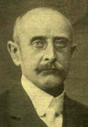Versecen volt ügyvéd, mikor elindult az országgyűlési választásokon. Miután megnyerte kerületét, 1881-1891 között a Mérsékelt Ellenzék (később Nemzet Párt) or-szággyűlési képviselője volt. A fővárosba kerülve mega-lapította és szerkesztette az első német nyelvű (*[Buda-pester Tageblatt](https://hu.wikipedia.org/w/index.php?title=Budapester_Tageblatt&action=edit&redlink=1))* ellenzéki napilapot.

1891-től   [Szegeden](https://hu.wikipedia.org/wiki/Szeged) ítélőtáblai, 1901-től pedig [Budapes-ten](https://hu.wikipedia.org/wiki/Budapest) kúriai bíró, majd 1913-1917 között kúriai tanácselnök volt. 1907. szeptember 22-én, Szegeden bírókongresszust tartottak, itt döntötték el, hogy érdekeik védelmében egyesületet hoznak létre. Az *Or-szágos Bírói és Ügyészi Egyesület* első elnökének Grecsák Károly kúriai bírát választották. Törekvéseiket a *Jogállam* című folyóiratban tették köz-zé. [1917](https://hu.wikipedia.org/wiki/1917). június-augusztus között az  [Igazságügyi Minisztérium](https://hu.wikipedia.org/wiki/Igazs%C3%A1g%C3%BCgyi_Miniszt%C3%A9rium) államtit-kára, majd [1917](https://hu.wikipedia.org/wiki/1917). augusztusától [1918](https://hu.wikipedia.org/wiki/1918). januárjáig igazságügy-miniszter az *Esterházy és a Wekerle-kormányban*.

Az első világháború idején, míg minden harcoló országban szigorúan el-lenőrízték (cenzúra) a sajtót, addig Magyarországon a sajtószabadság mindent felülírt. A lapok pártállásukra való tekintettel jelentették meg a néha lázító, sőt államérdekbe ütköző írásaikat. Miután a *Népszava* az 1917. december 28-ai számában megjelent *Trockij a proletárságról és a had-seregről* című írás*,* melyben a hírhedt bolsevik a forradalom kirobbantásá-ról értekezik, szükségessé vált a hazai sajtó megregulázása. Grecsák Ká-roly belügyminiszter és Vázsonyi Vilmos [tárca nélküli miniszter](https://hu.wikipedia.org/wiki/T%C3%A1rca_n%C3%A9lk%C3%BCli_miniszter) erőssen kikeltek a bolsevik agitáció ellen, és a kiadói jog megvonását helyezték kilátásba. Persze hiába, jött 1918 októbere és a minisztereket nyúgdíjazták.

A zűrzavarok után [Budapesten](https://hu.wikipedia.org/wiki/Budapest) ügyvéd, 1920-1922 között a [Magyar Rend-párt](https://hu.wikipedia.org/w/index.php?title=Magyar_Rendp%C3%A1rt&action=edit&redlink=1) alapítója és elnöke volt, a párt 1922-ben gróf Bethlen István mi-niszterelnök hatalmon lévő Egységes Pártjához csatlakozott.

Jogi szakirodalmi tevékenysége főként a kereskedelmi jog, a váltójog és a csődjog területén bontakozott ki. 1904-től 1916-ig szerkesztője a *Magyar Döntvénytár* 21 kötetének, 1911-ben főszerkesztője a *Codex Hungari-cus* című magyar törvények tízkötetes gyűjteményének. 1912-től 1916-ig az *Új Döntvénytár* kereskedelmi jogi köteteit is szerkesztette. 1914-től egyik alapítója, szerkesztője, majd főszerkesztője lett a *Kereskedelmi Jog* 

című szakfolyóiratnak.

Számos cikke és tanulmánya jelent meg - saját szerkesztésű folyóiratán kívül - folyóiratokban és különböző napilapokban is.

Forrás: *Magyar életrajzi lexikon*

Báró  **Gromon Dezső** (Vajszka, [1838](https://hu.wikipedia.org/wiki/1838). [február 2.](https://hu.wikipedia.org/wiki/Febru%C3%A1r_2.) – [Budapest](https://hu.wikipedia.org/wiki/Budapest), [1912](https://hu.wikipedia.org/wiki/1912). [július 25.](https://hu.wikipedia.org/wiki/J%C3%BAlius_25.)) politikus, képviselő, honvédelmi államtitkár.

Dédatyja, a francia eredetű Gromon Zsigmond, a ma-gyar nemestestőrség tagja telepedett meg Bács-megyé-ben, a vajszkai és bogyáni uradalomban.

Külföldön és végül a [Magyaróvári Császári és Királyi Gazdasági Felsőbb Tanintézetet](https://hu.wikipedia.org/wiki/Magyar%C3%B3v%C3%A1ri_Cs%C3%A1sz%C3%A1ri_%C3%A9s_Kir%C3%A1lyi_Gazdas%C3%A1gi_Fels%C5%91bb_Tanint%C3%A9zet)  végezte tanulmányait. 1861-ben átvette birtokát és a provizó-rium alatt Bács-Bodrog vármegye politikai küzdelmei-ben részt véve az ellenzéknek lett a vezére. A kiegyezést követően, a megyei balközéppárt (Tisza Kálmán pártja) elnökének 1869-től a hódsági kerületben képviselőnek választották. Az 1872-75. évi országgyűlésen nem vett részt, s ezen évek legnagyobb részét külföl­dön töltötte.

1875-ben a bácsi kerü­letben választatott meg képviselővé és ezt képviselte, ki­véve azt az időt, melyet főispáni állásában töltött el, mikor 1875-től Bács-Bodrog vármegye, Zombor és Szabadka főispánjává választották. A főren­diháznak is tagja és jegyzője volt, a delegációban úgy is mint a képvi­selőház, s úgy is mint a főrendi­ház választottja részt vett.

1876-ban, a bács megyei rendkí­vüli árvizek alkalmából, kormánybiztos-ként szervezte a védekezést. 1880-ban lemondott a főispánságról, így újra képviselőnek választották. A Szabadelvű Párt tagjaként részt vett a Tisza (Kálmán)-kormány munkájában. A kormány egy sor jelentős döntést ho-zott; kiírták a tervpályázatot egy parlament megépítésére (a mai [Ország-ház](https://hu.wikipedia.org/wiki/Orsz%C3%A1gh%C3%A1z)), elfogadták a csendőrség felállítását, két-két vármegye egyesítésével ([Abaúj-Torna](https://hu.wikipedia.org/wiki/Aba%C3%BAj-Torna_v%C3%A1rmegye) és [Krassó-Szörény)](https://hu.wikipedia.org/wiki/Krass%C3%B3-Sz%C3%B6r%C3%A9ny_v%C3%A1rmegye), kialakították a monarchia bukásáig fennálló 63 vármegyéből, valamint a [magyar tengermellékből](https://hu.wikipedia.org/wiki/Magyar_tengermell%C3%A9k) ([Fiume](https://hu.wikipedia.org/wiki/Fiume)) álló közigazgatási rendszert. Mint báró Fejérváry báró honvédelmi miniszter államtitkáraként évtizededen át szolgálta a honvédelmi minisztériumot.

Az 1898-1899. évben épült a 6. honvéd gyalogezred kaszárnyája, Gromon Dezső honvédelmi államtitkár nevét kapta. Zombor városa a főispáni ál-lástól történt megválásakor a törvényhatóság érdeké­ben szerzett érdemei elismeréséül egyik utcáját ő róla nevezte el: úgy Pancsova városa is hason-ló módon fejezte ki kormánybiztosi működése iránti elismerését.

1882 őszén kormánybiztosi minőségben Pancsovára külde­tett ki a csán-gók visszatelepítésének vezetésére és egyúttal a pancsova-kubini ármen-tesítési és vízszabályozási társulat kormánybiztosságával bízatott meg. A Bukovinába szakadt székelyek visszatelepítéséért mozgalom indult, mely-nek egyik vezetője a főváros nagyhatású közéleti személyisége, Rákosi Jenő volt. Gromon Dezső, Nagy György al-dunai kormánybiztossal együtt vezette a bukovinai csángók visszatelepítésének művét.

1883-ban az Al-Dunához telepítették a  [bukovinai](https://hu.wikipedia.org/wiki/Bukovina_(r%C3%A9gi%C3%B3))  [székelyek](https://hu.wikipedia.org/wiki/Sz%C3%A9kelyek) egy részét. Thomka Károly [református](https://hu.wikipedia.org/wiki/Reform%C3%A1tus) lelkész vezetésével mintegy 400 lélek érke-zett, a német-szlovák lakósú Marienfeld nevű telepre. A falu magyar ne-vét Hertelendy Józsefről, [Torontál vármegye](https://hu.wikipedia.org/wiki/Toront%C3%A1l_v%C3%A1rmegye) [főispánjáról](https://hu.wikipedia.org/wiki/F%C5%91isp%C3%A1n) kapta.

Egy másik bukovinai székely csoport (katolikusok, összesen mintegy 2000 telepes) [1883](https://hu.wikipedia.org/wiki/1883)-ban érkeztek Gyurgyevo faluba, melynek lakói az árvizek miatt hamarosan átköltöztek Rádayfalvára, a mai Székelykeve területére. A német-bolgár lakosságú Nagygyörgyfalvára 1883 és 1886 között 800 bukovinai székely telepes érkezett, ezt követően nevezték el a községet Sándoregyházának. [1894](https://hu.wikipedia.org/wiki/1894). [november 10](https://hu.wikipedia.org/wiki/November_10.)-én valóságos belső titkos taná-csosi rangot kapott. 1906-ban a Fővárosi Közmunkák Tanácsának alelnöke lett, egyszersmind a bárói rangot is elnyerte.

Forrás: [*Pallas nagy lexikona*](http://mek.oszk.hu/00000/00060/html/042/pc004266.html)

Pálffy Jenőné **Gulácsy Irén** ([Lázárföld](https://hu.wikipedia.org/wiki/L%C3%A1z%C3%A1rf%C3%B6ld), [1894](https://hu.wikipedia.org/wiki/1894). [szeptember 9.](https://hu.wikipedia.org/wiki/Szeptember_9.) – [Budapest](https://hu.wikipedia.org/wiki/Budapest), 

[1945](https://hu.wikipedia.org/wiki/1945). január 2.) írónő, költőnő.

Szegeden a felső leányiskolában és a tanítónőképzőben tanult. [1910](https://hu.wikipedia.org/wiki/1910)-ben, 16 éves korában férjhez ment unoka-bátyjához, erdődi Pálffy Jenőhöz, az Esterházy-uradal-mak akkori mérnökéhez. Férjével az évek során megis-merte a Hanság pusztáin élők világát, amikor rendsze-resen elkísérte a külső (vasútépítő, vízszabályozó) mun-kákhoz. Közben zenét és festészetet tanult.

Az [I. világháború](https://hu.wikipedia.org/wiki/Els%C5%91_vil%C3%A1gh%C3%A1bor%C3%BA) kitörése után [1914](https://hu.wikipedia.org/wiki/1914)-ben Nagyváradra költöztek, férje a római katolikus káptalan főmérnöke lett. Gulácsy itt kezdett írni a Váradon meginduló *Magyar Szóban*, ahol első novellája a *Félre az útból* címmel jelent meg. Később a *Tavasz *című folyóiratba is küldött írást. Ezek voltak az első megszólalásai. [1919](https://hu.wikipedia.org/wiki/1919)-ben a *Nagyvárad *című napilap belső munka-társa lett. A marosvásárhelyi *Zord Idő* lapvállalat pályázatára nyújtotta be első, *Förgeteg* című regényét, amellyel pályadíjat nyert.

Ettől kezdve novellákat, regényeket, színdarabokat is írt. A *Hamueső* cí-mű műve volt az *Erdélyi Szépmíves Céh* első kiadott regénye Kós Ká-roly illusztrációival. A Romániában működő Országos Magyar Párt alel-nökeként, a nehézsorsú [romániai magyarság](https://hu.wikipedia.org/wiki/Rom%C3%A1niai_magyars%C3%A1g) egészét akarta képviselni.

Férje megrokkant, munkaképtelenné vált, így a család fenntartása a fiatal írónőre hárult. Atyai módon pártfogolta őket Benedek Elek, akihez számos levelet írt, s ebből kirajzolódik az írónő mindennapjainak nehéz küzdelme: fő műve, a [*Fekete vőlegények*](https://hu.wikipedia.org/wiki/Fekete_v%C5%91leg%C3%A9nyek) ilyen körülmények között született.

„Gulácsy komolyan vette regényírói feladatát. Részletes előtanulmányokat végzett.

Több mint húsz (!) kötetnyi jegyzetanyag tanúsítja szorgalmát, s ezt a korra vonatkozó történelmi szakirodalomból való hatalmas ismeret-anyagot mind beötvözte regényébe.”  [1927](https://hu.wikipedia.org/wiki/1927). február 25-én férje elhunyt, s Gulácsy átköltözött Kolozsvárra, majd Magyarországra települt. Budapesten a *Magyarság*, a *Pesti Hírlap* és az *Új Idők* munkatársa volt.

[1928](https://hu.wikipedia.org/wiki/1928) végén részt vett Budapesten a Helikon-írók estélyén a Zeneakadé-mia nagytermében, Kemény János,  [Bánffy Miklós](https://hu.wikipedia.org/wiki/B%C3%A1nffy_Mikl%C3%B3s_(%C3%ADr%C3%B3)), [Tamási Áron](https://hu.wikipedia.org/wiki/Tam%C3%A1si_%C3%81ron),  [Kós Károly](https://hu.wikipedia.org/wiki/K%C3%B3s_K%C3%A1roly_(%C3%A9p%C3%ADt%C3%A9sz)), Bárd Oszkár, [Reményik Sándor](https://hu.wikipedia.org/wiki/Rem%C3%A9nyik_S%C3%A1ndor), Áprily Lajos  stb. mellett.

Gulácsy Irén Magyarországon is folytatta történelmi tárgyú műveinek so-rozatát, s e regényes korrajzok nagy közönségsikert arattak. Méltatói sze-rint: „Gulácsy Irén szereti a nyelvi ékesítettséget, mely a metaforákban, különböző alakzatok halmozásában nyilvánul meg, szereti az archaikus, tájszavak használatát, gyakoriak a regényben az indázó szecessziós szerke-zetek és motívumok. Németh László barokkos költőnek tartja Gulácsy Irént, de - mint mondja - barokkossága nem akadémikus jellegű.”

1939-ben [Aba-Novák Vilmos](https://hu.wikipedia.org/wiki/Aba-Nov%C3%A1k_Vilmos) festővel és [Mécs László](https://hu.wikipedia.org/wiki/M%C3%A9cs_L%C3%A1szl%C3%B3_(k%C3%B6lt%C5%91)) költővel [*Corvin-koszorú*](https://hu.wikipedia.org/wiki/Corvin-koszor%C3%BA) kitüntetésben részesült.

Gulácsy Irén a [főváros ostromának](https://hu.wikipedia.org/wiki/Budapest_ostroma) esett áldozatul, amikor 1945. január 2-án lakását bombatalálat érte. Bronz dombormű emléktábláját 1992-ben avatta fel Budapesten a Bem rakparton, II. ker. Vitéz utca 2. alatt. A *Fekete Vőlegények,* a *Ragyogó Kovács István* és a *Hamueső* című regényei [Han-goskönyvként](https://hu.wikipedia.org/wiki/Hangosk%C3%B6nyv) is megjelentek. [2005](https://hu.wikipedia.org/wiki/2005)-ben a *Magyar Asszonyok Szövetsége* szónokverseny számára díjat nevezett el róla.

Források: *[Katolikus lexikon](http://lexikon.katolikus.hu/G/Gul%C3%A1csy.html),* [*A magyar irodalom története*](http://www.elib.hu/02200/02228/html/06/96.html)

**Gunda Béla** ([Temesfüves](http://hu.wikipedia.org/wiki/Temesf%C3%BCves), [1911](http://hu.wikipedia.org/wiki/1911). [december 25.](http://hu.wikipedia.org/wiki/December_25.) - [Debrecen](http://hu.wikipedia.org/wiki/Debrecen), [1994](http://hu.wikipedia.org/wiki/1994). [július 30.](http://hu.wikipedia.org/wiki/J%C3%BAlius_30.)) [etnográfus](http://hu.wikipedia.org/wiki/N%C3%A9prajz), a történelemtudományok doktora, az [MTA](http://hu.wikipedia.org/wiki/Magyar_Tudom%C3%A1nyos_Akad%C3%A9mia) tagja.

Édesapja a helyi (Temesfüves) gróf Wimpffen Siegfried uradalom gazdasági ügyintézője volt. A trianoni döntést követően költöztek a csonka hazába, itt a Műszaki és Gazdaságtudományi Egyetemen a földrajz-kémia szako-kat hallgatta. 1936-ban a Pázmány Péter Tudomány-egyetemen szerzett gazdaságföldrajzból bölcsészdoktori oklevelet, melyben az *Ormánság etnogeográfiai problé-máiról* írt. Gunda Béla egyebek melett, szlavisztikát, nyelvészetet és néprajzot is tanult. Itt a neves nyelvész és szláv  [filológus](https://hu.wikipedia.org/wiki/Filol%C3%B3gia) [Melich János](https://hu.wikipedia.org/wiki/Melich_J%C3%A1nos), és  különösen a [néprajzkutató](https://hu.wikipedia.org/wiki/N%C3%A9prajz) [Györffy István](https://hu.wikipedia.org/wiki/Gy%C3%B6rffy_Istv%C3%A1n_(n%C3%A9prajzkutat%C3%B3)) és a gróf [Tele-ki Pál](https://hu.wikipedia.org/wiki/Teleki_P%C3%A1l_(politikus)) álltal tartott szemináriumi gyakorlat keltett benne mély benyomást. 1934-1939 között a Pázmány Péter Tudományegyetem néprajzi tanszékén [Györffy István](https://hu.wikipedia.org/wiki/Gy%C3%B6rffy_Istv%C3%A1n_(n%C3%A9prajzkutat%C3%B3)) mellett tanársegéd.

Az új délszláv államban tett első tanulmányútja során tanulmányozta az ottlévő múzeumokat. 1937-ben a [berlini](https://hu.wikipedia.org/wiki/Berlin) nemzetközi vadászati kiállítás magyar néprajzi részlegét rendezte. 1938/1939-ben [svéd](http://hu.wikipedia.org/wiki/Sv%C3%A9dorsz%C3%A1g) állami ösztön-díjjal a [stockholmi](http://hu.wikipedia.org/wiki/Stockholm) egyetemen tanult.

1939-tól 1943-ig a [*Néprajzi Múzeum*](http://hu.wikipedia.org/wiki/N%C3%A9prajzi_M%C3%BAzeum) tudományos munkatársa volt. Új-jászervezte a múzeum *Ethnológiai Adattárát*. Gyűjtő- és kutatóutakat tett Észak-[Erdélyben](http://hu.wikipedia.org/wiki/Erd%C3%A9ly) és az Észak-keleti [Kárpátokban](http://hu.wikipedia.org/wiki/K%C3%A1rp%C3%A1tok). 1941-ben a [szegedi](http://hu.wikipedia.org/wiki/Szeged) egyetemen *Összehasonlító néprajz, különös tekintettel a [balkáni](http://hu.wikipedia.org/wiki/Balk%C3%A1n) népekre* tárgykörből magántanári képesítést szerzett. 1943-ban nyilvános rendes tanárrá nevezték ki a [kolozsvári egyetem](http://hu.wikipedia.org/wiki/Babe%C5%9F%E2%80%93Bolyai_Tudom%C3%A1nyegyetem) néprajzi tanszékére, itt kezdte meg a [Kárpátok](http://hu.wikipedia.org/wiki/K%C3%A1rp%C3%A1tok), és a *[moldvai](http://hu.wikipedia.org/wiki/Moldva) magyarság népi műveltségének kutatását*. 1943 őszén megindította az [*Erdélyi Néprajzi Tanulmányok*](http://hu.wikipedia.org/wiki/Erd%C3%A9lyi_N%C3%A9prajzi_Tanulm%C3%A1nyok) kiadvány-sorozatot. 1947-től 1948-ig [Stockholmban](http://hu.wikipedia.org/wiki/Stockholm) *[Sigurd Erixon](http://hu.wikipedia.org/w/index.php?title=Sigurd_Erixon&action=edit&redlink=1) néprajzi inté-zetében* dolgozott. 1948-ban a román hatóságok megszüntették állását, így települt át a civisvárosba.

[1949](http://hu.wikipedia.org/wiki/1949)-től a [*Debreceni Kossuth Lajos Tudományegyetem*](http://hu.wikipedia.org/wiki/Debreceni_Egyetem) újonnan szervezett néprajzi tanszékének tanára, majd tanszékvezetője volt haláláig. 1951-1954 között a *Bölcsészettudományi Kar dékánja* volt. A *Néprajzi Tan-széken* [1965](http://hu.wikipedia.org/wiki/1965)-ben az akkor alakult budapesti *Néprajzi Kutatócsoport* osztá-lyaként Akadémiai Kutatócsoportot szerveztek, ezt szintén Gunda Béla vezette. Életmód és műveltség című disszertációjával elnyerte a tudo-mányok doktora fokozatot. Ford-ösztöndíjjal [Kaliforniában](http://hu.wikipedia.org/wiki/Kalifornia) kutató pro-fesszora volt a Berkeley Universitynek. [1965](http://hu.wikipedia.org/wiki/1965) és [1966](http://hu.wikipedia.org/wiki/1966) folyamán [Arizo-nában](http://hu.wikipedia.org/wiki/Arizona) az [indiánok](http://hu.wikipedia.org/wiki/Indi%C3%A1nok) körében végzett kutatásokat. Pályafutása során megte-remtette Közép- és Kelet-Európa néprajzi vizsgálatának összehasonlító etnológiai műhelyét. Kezdeményezője és aktív résztvevője volt számos nagy jelentőségű gyűjteményes munka, sorozat megjelentetésének.

Nevéhez fűződik a *Magyar Néprajzi Múzeum* (MNM) Etnológiai Adat-tárának megszervezése. Nevét viseli az általa alapított Gunda Béla-díj”.

Díjai-tagságai: *[1970](https://hu.wikipedia.org/wiki/1970) - Finn Oroszlán Lovagrend I. fokozata. [1971](https://hu.wikipedia.org/wiki/1971) – Györf-fy István  emlékérem. [1978](https://hu.wikipedia.org/wiki/1978) -[Herder-díj](https://hu.wikipedia.org/wiki/Herder-d%C3%ADj). [1988](https://hu.wikipedia.org/wiki/1988) Pitré-aranyérem.* Osztrák, Antropológiai Társaság tiszteletbeli tagja, - Svéd Kir. Gusztáv Adolf Aka-démia tiszteletbeli tagja, Finn Archeológiai Társaság levelező tagja, Német Őstörténeti Társaság levelező tagja.

Művei: *A gyűjtögető gazdálkodás. (1939), A magyar gyűjtögető és zsákmá-nyoló gazdálkodás kutatása (1948), Néprajzi gyűjtőúton (1956), Ethno-graphica Carpathica (1966), Ethnographica Carpatho-Balcanica (1979), [Hagyomány és európaiság](http://real-eod.mtak.hu/3471/) (1994) stb.* Gunda Béla domborművét 2012-ben avatták fel a székesfehérvári *Szent István Király Múzeum* homlokza-tán. Forrás: [*Magyar néprajzi lexikon II.*](http://mek.oszk.hu/02100/02115/html/2-730.html)

Bobdai **Gyertyánffy Berta** (Tolvád, [1819](https://hu.wikipedia.org/wiki/1819). [március 13.](https://hu.wikipedia.org/wiki/M%C3%A1rcius_13.) - [Nagyszent-miklós](https://hu.wikipedia.org/wiki/Nagyszentmikl%C3%B3s), [1882](https://hu.wikipedia.org/wiki/1882). [december 22.](https://hu.wikipedia.org/wiki/December_22.)) festő- és zongoraművész.

A neves és kiválló magyar-örmény eredetű bobdai [Gyertyánffy család](https://hu.wikipedia.org/wiki/Gyerty%C3%A1nffy_csal%C3%A1d) sarja. Felnőtté válválva a tolvádi Gyertyánffy-kúriában tartózkodó Friedrich Baudri ván-dorfestőtől nem csak az olajfestés technikáját tanulta, hanem beleszeretett (de a papa megtiltotta!) a tőle tíz évvel idősebb festőbe.

Nemsokára vigasztalódott, hiszen a nagybecskereki megyebálon megismerkedett a tőle három évvel fiata-labb gróf [Nákó Kálmán](https://hu.wikipedia.org/wiki/N%C3%A1k%C3%B3_K%C3%A1lm%C3%A1n)nal (később udvarhű politikus, valamint császári és királyi kamarás), aki 1842-ben némi huzavona után nőül vette Bertát. Ezt követően hol a bécsi palotájukban (a későbbi Dorotheum épülete), hol a schwarzaui kastélyukban is éltek.

Bécsben tökéletesíthette festői tudását, olyan mesterektől vett órákat, mint Ignaz Raffal vagy [Friedrich von Amerling](https://hu.wikipedia.org/wiki/Friedrich_von_Amerling). Amerling mester 1855-ben olajfestményt készített róla, a mű ma a *Szépművészeti Múzeum* tulajdona.

Az egzotikus szépség modellt állt, a többi helyi mesternek is, mint pl: Jo-sep Neugebauernek, valamint a három Franznak, úgymint Adamnak, Len-bachnak és Schortzbergnek. Festőként leginkább portrékat szeretett alkot-ni, jelenleg a *Magyar Nemzeti Galéria* a *Cigánylány* (a Bécsi Műtörténeti Múzeumban volt kiállítva) és *Pirkó* című képeit őrzi.

A festői tehettségen kívül a zongorázás tehetségével is megáldotta a sors, jótékonysági hangversenyek során lépett fel, kedvenc cigányzenészekből álló kíséretével. Fellépéseivel beutazta a fél világot, olyan helyeken is megfordult, mint Egyiptom, Franciaország, vagy a Bayreuthi Ünnepi Já-tékok.

Gyertyánffy Bertát 1867-ben palotahölggyé nevezte ki [Erzsébet király-né](https://hu.wikipedia.org/wiki/Wittelsbach_Erzs%C3%A9bet_magyar_kir%C3%A1lyn%C3%A9) olyan nagyasszonyok társaságában, mint [Andrássy Gyula](https://hu.wikipedia.org/wiki/Andr%C3%A1ssy_Gyula_(politikus,_1823%E2%80%931890)) felesége a gyönyörű [Kendeffy Katinka](https://hu.wikipedia.org/wiki/Kendeffy_Katinka)  és Andrássy Manó felesége a szintén szép-séges Pálffy Gabriella. Nákó Kálmán 1862-1864 között építette szeretett feleségének a nagyszentmiklósi Nákó-kastélyt, itt Nagyszentmiklóson. 1882-ben karácsony előtt két nappal, váratlanul szívhűdésben elhunyt Gyertyánffy Berta. Emlékét őrzi a férje álltal megalapított nagyszentmik-lósi Berta Közkórház. 2016-ban Nagyszentmiklóson kiállítottak egy helyi szobrászművész által alkotott, őt és férjét ábrázoló életnagyságú szobrot, mely Aurel Gheorghe Ardeleanu alkotása.

Forrás: *Magyar festők,* Gudenus János József: *Örmény eredetű magyar nemesi családok genealógiája.  2010,* Borovszky Samu: *Magyarország vármegyéi és városai. Torontál vármegye. 1911.*

**H**

**Hajdu Gusztáv** (Temesvár, 1911. október 13. - Debrecen, 1976. június 01.) állatorvos, egyetemi tanár.

A budapesti Magyar Királyi Állatorvosi Főiskolán 1934-ben szerzett állatorvosi oklevelet. Doktori disszer-tációjának kidolgozását a szülészeti klinikán kezdte, té-mája miatt azonban az Országos Állategészségügyi Inté-zetben folytatta. Itt figyelt fel rá Manninger Rezső az in-tézet alapító igazgatója, [állatorvos](https://hu.wikipedia.org/wiki/%C3%81llatorvos) és egyetemi tanár.

Miután Hajdu Gusztáv állatorvos-doktori oklevelet szerzett; Manninger professzor meghívására a járvány-tani tanszék gyakornoka, majd tanársegéde lett. Az állatorvosi tiszti vizsgát 1938-ban tette le, a nagykunsági Kisújszálláson 1939-1944 között járási állatorvos, majd 1949-ig főállatorvos volt.

1949-ben az Országos Állategészségügyi Intézet keretében dolgozott, majd néhány hónap után az újonnan létesült Debreceni Állategészségügyi Intézet igazgatójává nevezték ki. Az intézettet 1971-ig vezett, közben öt éven keresztül egészen 1962-ig a Debreceni Mezőgazdasági Akadémia, illetve a tudományegyetem Állatjárványtani Tanszékének előadó tanára.

Az állatbonctani, - élettani és - egészségtani tanszék megbízott tanszékve-zető egyetemi docense volt 1962-1966 között, míg az Állatorvostudomá-nyi Egyetemen címzetes tanszékvezető egyetemi tanárként 1966-tól 1976-ban bekövetkezett haláláig oktatott.

“Kutatásaiban a vírusos elvetélés, az enterotoxaemia, az actinobacillosis, az enzootiás tüdőadenomatosis első hazai megállapítása, illetve kórjelzé-sének kialakítása fűződik nevéhez. A ló babesiosissal kapcsolatos megálla-pításai is jelentősek. Munkásságának elismeréseként 1972- ben a megkapta a Hutÿra Ferenc-emlékérmet.”

Özvegye létrehozta a Hajdú Gusztáv-alapítványt a DATE Mezőgazdaság-tudományi Kara legkiemelkedőbb teljesítményt elért hallgatói számára. A Debreceni Állategészségügyi Intézet alapításának 50. évfordulóján, az Intézet földszinti előterében bronz emléktábláját leplezték le.

Főbb művei: *Vizsgálatok a patkánybartonellosis kórtana köréből (1937), A tyúkok coligranulomájáról néhányeset kapcsán. Buza Lászlóval, Temesi Zoltánnal (1958), Penész- és sarjadzógombák okozta elvetélések a szarvasmarha-állományokban. Áldásy Pállal (1961), (1963), A juhok enzootiás tüdőadenomatosisa és szaglónyálkahártyájának fertőző adeno-papillomatosisa. (1968) stb.*

Forrás: *Magyar Állatorvosi Panteon, Magyar életrajzi lexikon*

**Hajnal** *Henlein* **István** ([Nagykikinda](http://hu.wikipedia.org/wiki/Nagykikinda), [1892](http://hu.wikipedia.org/wiki/1892). [július 3.](http://hu.wikipedia.org/wiki/J%C3%BAlius_3.) - [Budapest](http://hu.wikipedia.org/wiki/Budapest), [1956](http://hu.wikipedia.org/wiki/1956). [június 16.](http://hu.wikipedia.org/wiki/J%C3%BAnius_16.)) történész, egyetemi tanár, az [MTA](http://hu.wikipedia.org/wiki/Magyar_Tudom%C3%A1nyos_Akad%C3%A9mia) tagja.

Családja Elzász-Lotharigiából vándorolt be a Bánságba. Az elemi iskolát a szülőhelyén kezdte, majd állatorvos édesapja munkahelyi alkalmazása helyszínein (Mezőhe-gyes, Kaposvár) folytatta iskoláit. [1910](http://hu.wikipedia.org/wiki/1910)-ben a budapesti egyetem történelem-földrajz szakára iratkozott be.

A Tudományegyetemen Hajnal Istvánra legnagyobb ha-tással [Marczali Henrik](http://hu.wikipedia.org/wiki/Marczali_Henrik), az  [Árpád-kori](https://hu.wikipedia.org/wiki/%C3%81rp%C3%A1d-kor)  magyar történet kutatója, valamint  [Fejérpataky László](http://hu.wikipedia.org/wiki/Fej%C3%A9rpataky_L%C3%A1szl%C3%B3) a történeti segéd-tudományok egyik magyarországi megteremtője voltak.

A pesti történész társadalom kitűnő kapcsolatot ápolt a lipcsei egyetem kiválóságaival, közöttük Karl Gotthard Lamprechtel ki a német művészet és gazdaság történetével foglalkozott, és 1913-tól volt a [Magyar Tudo-mányos Akadémia](https://hu.wikipedia.org/wiki/Magyar_Tudom%C3%A1nyos_Akad%C3%A9mia) [tagja](https://hu.wikipedia.org/wiki/A_Magyar_Tudom%C3%A1nyos_Akad%C3%A9mia_tagjainak_list%C3%A1ja_(L%E2%80%93R)) volt, valamint Hans Chiliannal, ki [1908](https://hu.wikipedia.org/wiki/1908)-ban írt [Cillei Borbála](https://hu.wikipedia.org/wiki/Cillei_Borb%C3%A1la) királynéról.

Hajnal István tanulmányai befejeztével pedagógusi életének első állomása a budapesti Kereskedelmi Akadémia volt, hol a kereskedelem és a bank-világ szakembereit képezték. Ezt követte a kiemelt szakmai szíhely a bécsi Theresianum (Theresianische Akademie), itt az egyik magyar prefektus lett. Az intézmény valójában polgári reálgimnázium volt, amely a Monar-chia főtisztviselői utánpótlásának nevelésére szolgált.

Az [első világháború](http://hu.wikipedia.org/wiki/Els%C5%91_vil%C3%A1gh%C3%A1bor%C3%BA) idején katonai szolgálatba lépett, majd annak befe-jeztével [Klebelsberg Kuno](http://hu.wikipedia.org/wiki/Klebelsberg_Kuno) vallás- és közoktatásügyi miniszter megbízá-sából részt vett, a bécsi levéltárban lévő, a Kossuth-emigráció törökországi történetéhez kapcsolódó anyag rendezésében. Később az [Esterházy család](http://hu.wikipedia.org/wiki/Esterh%C3%A1zy_csal%C3%A1d) felkéréséből rendezte annak felbecsülhetetlenül értékes dokumentumait.

[1931](https://hu.wikipedia.org/wiki/1931)-től újabb elismerő megbizatása a  *Századok * című folyóirat a  [Ma-gyar Történelmi Társulat](https://hu.wikipedia.org/wiki/Magyar_T%C3%B6rt%C3%A9nelmi_T%C3%A1rsulat) időlegesen megjelenő folyóiratának a szerkesz-tését válalta el. A gazdasági nehézségek miatt [Klebelsberg Kuno](https://hu.wikipedia.org/wiki/Klebelsberg_Kuno) vezette kultuszminisztérium a folyóiratot minden középiskola számára előfizette. [1928](https://hu.wikipedia.org/wiki/1928)-ban a  [Magyar Tudományos Akadémia](https://hu.wikipedia.org/wiki/Magyar_Tudom%C3%A1nyos_Akad%C3%A9mia) levelező tagjává, majd [1939](https://hu.wikipedia.org/wiki/1939)-től rendes tagjává választották. 

[1930](http://hu.wikipedia.org/wiki/1930)-tól a budapesti egyetem újkori egyetemes történeti tanszékén tanított, megbízást kapott *Az újkor története* (1936) megírására. Legfontosabb munkájában a „nyugati” fejlődés világtörténelmi helyét, sajátosságait, mozgatórugóit vizsgálta. 1931-től 1942-ig a kor legfontosabb történész folyóiratának, a *Századoknak* a szerkesztője volt.

Ezt követően, mintegy válaszként e kihívásra dolgozta ki sajátos, egyéni történetfelfogását, amelyhez azután élete végéig ragaszkodott. “A Német-országból importált "Geistesgeschichte" (szellemi történelem) helyett egy alapvetően materialista, az anyagi formák, struktúrák összehasonlításával dolgozó, a történelemben általános összefüggéseket, fejlődéstörvényeket kereső társadalom-történet elméletét és gyakorlatát állította szembe.

Munkáiban főleg az összehasonlító írástörténet problémáival, a technikai fejlődés társadalmi összefüggéseivel, szociológia és történettudomány kapcsolataival és a magyar politikatörténet egyes kérdéseivel európai ösz-szefüggésben foglalkozott.”

A kiváló gondolkodónak az újjabb rendszerváltással 1945 után még ke-vesebb babér termett, a szellemtörténet helyét egy dogmatikus és vulgari-zált marxista felfogás foglalta el. A régi gárda tudósai ha nem vettek részt a politikai nihilizmus szajkózásában, ellenségekké és elimináltakká váltak. 1949-ben az ő cikke volt az egyik ürügy az Illyés Gyula által szerkesztett *Válasz* című folyóirat megszüntetésére. Ezután nyugdíjazták, akadémia tagságától megfosztották, de még a következő években is dolgozott és fontos munkát publikált franciául a középkori írásbeliségről. 

[1949](http://hu.wikipedia.org/wiki/1949)-ben több más hasonló polgári gondolkodóval együtt kizárták az aka-démia tagjai közül, majd megfosztották katedrájától és [1950](http://hu.wikipedia.org/wiki/1950)-ben pedig nyugdíjazták. A vulgármarxista felfogás szerint a tudósra jellemző "közép-kor-imádat" olyan vád volt, amely alapul szolgált a tudományos életből való eltávolításához. [1990](https://hu.wikipedia.org/wiki/1990)-ben posztumusz Széchenyi-díjat kapott.

“Hajnal István a​ 20. század egyik legeredetibb gondolkodású magyar történésze volt, aki a részletproblémákat is mindig invenciózus módon, rendkívül széles nemzetközi tájékozódás alapján közelítette meg. A tör-ténelmi haladást a tömegek aprómunkája eredményének tekinti, nem pedig a nagy szervezetek, tettek és gondolatok művének. Hajnal István az euro-pai szintű világtörténész, aki nem emigrált nyugatra, nem hagyta el hazáját, és végül méltatlan körülmények közé kényszerítettek, attól időszerű - írta Nyíri Kristóf Hajnal születésének századik évfordulóján a *Világosság*-ban - hogy a történettudományi munkássága mögött meghúzódó filozófiai gondolatokat a korszellem immár képes befogadni”.

Művei: *[IV. Béla](https://hu.wikipedia.org/wiki/IV._B%C3%A9la_magyar_kir%C3%A1ly) király kancelláriájáról (1914), Írástörténet és az írás-beliség felújulása korából (1921), A Kossuth emigráció Törökországban (1927), Egy magyar herceg ifjúkora Napoleon idején (1927), Metternich és Esterházy Pál (1927), [Esterházy Miklós nádor lemondása](http://real-eod.mtak.hu/2777/) (1929), [Az újkor története](http://mek.niif.hu/07100/07139/html/0001/0004-d6.html) (1936), Történelem és szociológia; (1939), A kis nemzetek történetírásának munkaközösségéről (1942), A Batthyány-kormány külpo-litikája (1957)* stb. Forrás: *Magyar életrajzi lexikon *

**Halmay Tibor** (Nagyszentmiklós, 1894. december 20. - Budapest, 1944. november 3.) színész.

Katona családban született, [Nagyváradon](https://hu.wikipedia.org/wiki/Nagyv%C3%A1rad) járt hadapród-iskolába. 1913-ban avatták tiszté, egy év múlva már hu-szártisztként küzdött az első világháborúban.

A kommün idején lépett a színipályára, Rákosi Szidi ma-gániskolájában évfolyamtársa volt a mulattató Bilicsi Ti-vadar, Seress Rezső (a *Szomorú vasárnap* című dal szer-zője) és a híres Vaszary família leánytagja Vaszary Piri.

Már pályája kezdetén eljegyezte magát az operettel, tán-coskomikusként játszott 1919-től, az Ábrányi Emil vezette *Városi Színház-ban* (volt Népopera), onnan 1922-ben a Beöthy László vezette *Király Szín-ház* következett. Az akkor (1922-ben) megnyílt *Fővárosi Operett Szín-házban*, 1922-ben és 1924-1925 között lépett fel, nem kisebb sztárral mint a tökéletes Honthy Hanna.

1926-ban vállalkozó lett, a *Casino* mulatót bérelte, de még ebben az esz-tendőben Bécsbe szerződött. 1928-ban és 1930-ban fellépett Max Rein-hardt *[Deutsches Theater](https://hu.wikipedia.org/w/index.php?title=Deutsches_Theater_Berlin&action=edit&redlink=1)* berlini színházában, itt a híres színirendezőnél partnere a *pozsonyi magyar lány* Bulla Elma volt, és ott volt a zseniális Latabár testvérpár, Árpád és Kálmán. Bécsben és Berlinben számos film komikus szerepét játszotta. Az 1930-as években Budapesten magyar és német nyelvű hangosfilmek kedvelt jellemkomikusa volt.

Kivételes, akrobatikus tánctudása jó színészi képességekkel párosult. A budapesti színházakban csak alkalmanként lépett fel, így 1933-ban a *Pesti Színházban* (a Vígszínház kamaraszínháza), majd 1935-ben [Bárdos Artúr](https://hu.wikipedia.org/wiki/B%C3%A1rdos_Art%C3%BAr) *Andrássy úti Színházában*, azután 1936-ban rövid ideig újra Föld Aurél alkalmi társulatával a *Városi Színházban* vendégszerepelt, a röhögő bajnok Dénes Oszkárral, és a fiatal Feleki Kamillal.

Végül 1941-től a *Fővárosi Operettszínházban* töltötte legemlékezeteseb évadjait. Itt olyan partnerei voltak, mint a szöszi szubrett Csikós Rózsi, és a legnépszerűbb magyar énekes-színész Sárdy János. 1944 októberében katonai szolgálatra jelentkezett, majd a fronton megbetegedett és elhunyt.

Magyar filmjei: *Mindent a nőért* (1933), *Rákóczi induló* (1933), *Helyet az öregeknek!* (1934), *Mária nővér* (1936), *3 : 1 a szerelem javára* (1937), *Kísértés* (1941), *Egy szív megáll (1942), Pista tekintetes úr (1942), Családunk szégyene (1942), Egy bolond százat csinál (1942), Tilos a szerelem (1943), Makacs Kata (1943), Nemes Rózsa (1943), A színház szerelmese (1944).*

Forrás: *[Magyar színházművészeti lexikon](http://mek.oszk.hu/02100/02139/html/sz10/45.html). [Magyar színművészeti lexikon](http://mek.oszk.hu/08700/08756/html/II/szin_II.0238.pdf)*

**Hankó Géza** (Temesvár, 1895. július 27. - Budapest, 1973. január 19.) mérnök, egyetemi tanár.

A pécsi reáliskolai érettségit, világháborús frontszolgálatot és orosz hadi-fogságot (1915-1920) a főváros műegyetemének oklevele követte.

Mérnöki oklevelével a József Műegyetem Geodéziai Tanszékén tanár-segéd lett. Majd 1923-tól az akkor létrejött *A Honvéd Térképészeti Intézet Geodéziai Csoportjának* műszaki tisztje (1940-ig).

A II. világháború idején a Fotogrammetriai Csoport vezetője, majd a há-ború végén az intézet kitelepítésével amerikai hadifogságba került.

Hazatérése után, 1946-1949 között magánmérnökként a Zimonyi és Szabó cég birtokrendezői tervezőirodájában dolgozott.

Ezt követően a Fővárosi Tervező Iroda városmérő mérnöke lett, majd a budapesti Vasútépítő Vállalat felmérő és kitűző mérnöke (1949-1951).

1952-ben a Soproni Műszaki Egyetem Földmérőmérnöki Karán a foto-grammetria és az ÉKME-n a földi és légi fotogrammetria előadója, cím-zetes egyetemi docens (1952-től), a műszaki (geofizikai) tudományok kandidátusa (1958).

A Geodéziai és Kartográfiai Intézet, illetve a Budapesti Geodéziai és Tér-képészeti Vállalat Fotogrammetriai Csoportjának vezetője (1954-1956), az Állami Földmérési és Térképészeti Hivatal Fotogrammetriai Osztályának alapító vezetője (1956-tól).

Rédey Istvánnal együtt bevezette az akkor új térképészeti eljárást, a foto-grammetriát a topográfiai térképészetbe. Ennek keretében számos techno-lógiai eljárást dolgozott ki és elméleti kutatást is folytatott.

Földméréstérképészeti kutatásai kiterjedtek a fotogrammetria legkülön-bözőbb alkalmazási területeire: gáz- és olajkutatás, vasútépítés, városren-dezés, telepítés, vízrendezés, erdészet stb. Kísérletei alapján készült el egy új magyar légi háromszögelő készülék modellje.

A II. világháború után jelentős szerepet játszott a főváros újjáépítését szol-gáló földmérési feladatok megszervezésében, továbbá a földreformmal kapcsolatos fotogrammetriai munkák elindításában és irányításában.

Nevéhez fűződik a légi és földi fényképezés egyetemi szintű oktatásának kidolgozása, az első tanrendek, tananyagok és egyéb oktatási segédletek összeállítása.

Főbb művei: *Fotogrammetria és alkalmazása (1942), A fotogrammetria jelentősége a mérnöki gyakorlatban (1955), Fotogrammetria I-II. (1952-1964.), A légi fényképek alkalmazása topográfiai és egyéb felméréseknél (1956), Geodéziai kézikönyv (1960).*

Forrás: Magyar életrajzi lexikon 

**Haubrich József** (Detta, [1883](http://hu.wikipedia.org/wiki/1883). [november 9.](http://hu.wikipedia.org/wiki/November_9.)  -  [Szovjetunió](http://hu.wikipedia.org/wiki/Szovjetuni%C3%B3), [1939](http://hu.wikipedia.org/wiki/1939).) munkás, szociáldemokrata politikus.

Vasöntő mukásként 1906-ban belépett a [Magyarországi Szociáldemokrata Pártba](http://hu.wikipedia.org/wiki/Magyarorsz%C3%A1gi_Szoci%C3%A1ldemokrata_P%C3%A1rt), majd pártbizalmiként a [buda-pesti](http://hu.wikipedia.org/wiki/Budapest) Munkásbiztosító Pénztár tisztviselője lett.

Míg az [első világháború](https://hu.wikipedia.org/wiki/Els%C5%91_vil%C3%A1gh%C3%A1bor%C3%BA) kitörése előtt  háborúellenes po-litikát hangoztatott, [1917](https://hu.wikipedia.org/wiki/1917)-ben már üdvözölte az orosz forradalmi radikalizmust, és most már a magyarországi forradalommal kacérkodott. Haubrich József pártja az 

[őszirózsás forradalom](https://hu.wikipedia.org/wiki/%C5%90szir%C3%B3zs%C3%A1s_forradalom) kitörésekor, 1918 októberében koalícióra lépett a forradalomat óhajtó polgári radikálisokkal. Majd, miután ez zsákutcát jelenetett, az akkor gyűjtőfogházban lévő forradalmi-szocialistákkal, azaz a [kommunista](https://hu.wikipedia.org/wiki/Kommunist%C3%A1k_Magyarorsz%C3%A1gi_P%C3%A1rtja) vezetőkkel szövetkeztek. Nélkülük és segítségük nélkül a szovjethatalom soha nem jött volna létre. A két párt [1919](https://hu.wikipedia.org/wiki/1919). [március 21-én](https://hu.wikipedia.org/wiki/M%C3%A1rcius_21.) egyesült, és kikiáltották a [Tanácsköztársaságot](https://hu.wikipedia.org/wiki/Magyarorsz%C3%A1gi_Tan%C3%A1csk%C3%B6zt%C3%A1rsas%C3%A1g).

Az egyesülést nem támogatta a párt vezetői közül; [Garami Ernő](https://hu.wikipedia.org/wiki/Garami_Ern%C5%91), [Peidl Gyula](https://hu.wikipedia.org/wiki/Peidl_Gyula),  stb., mások viszont mint Ágoston Péter, Garbai Sándor, Haubrich József, stb. és részben a nagytekintélyű szakszervezeti vezér Peyer Károly támogadták a proletárdiktatúrát. 

A „proletárhatalom” szovjet mintára  [munkástanács](https://hu.wikipedia.org/w/index.php?title=Munk%C3%A1stan%C3%A1cs&action=edit&redlink=1)igazgatást vezettek be az üzemekben, köztulajdonba vették a lakóházakat, szállodákat, oktatási intézményeket, üzleteket, végül pedig a nagybirtokok felosztásáról jelent meg rendelet. A tanácsköztársaság 133 napja alatt megkezdte a földek és üzemek állami tulajdonba vételét, osztályharcot hírdettek a „régi rend”, főként a nemesség, a gazdag polgárság, parasztság és az egyházak ellen.

A szovjetorosz mintára létrehozott terrorkülönítmények (Lenin fiúk) a ma-gyar vidéket járva gyilkoltak és erőszakoskodtak a békés lakosságon.

A  [Tanácsköztársaság](https://hu.wikipedia.org/wiki/Magyarorsz%C3%A1gi_Tan%C3%A1csk%C3%B6zt%C3%A1rsas%C3%A1g)  vezető szervének a Forradalmi Kormányzótanács-nak  az elnöke  [Garbai Sándor](https://hu.wikipedia.org/wiki/Garbai_S%C3%A1ndor) volt, míg a kereskedelemügyi népbiztos [Landler Jenő](https://hu.wikipedia.org/wiki/Landler_Jen%C5%91) helyettesei [Rákosi Mátyás](https://hu.wikipedia.org/wiki/R%C3%A1kosi_M%C3%A1ty%C3%A1s) és Haubrich József voltak. A kor-mányzótanács április 3-án átszerveződött, Haubrich József Budapest kato-nai parancsnoka lett! Ilyen minőségében tudomást szerzett június 24-i puccskísérletről. Az úgynevezett „monitorlázadást” szervezői valójában országos méretű jeladásnak szánták, melyel a proletárdiktatúra elleni felkelést szerette volna kirobbantani. Az ellenforradalomnak központjai a Ludovika Akadémia és az angyalföldi Engels tüzérlaktanya (korábban Vilmos laktanya) voltak. Az ellenforradalom június 24-én tört ki, a felke-lők azt remélték, hogy melléjük áll Haubrich József is, így őt is beavatták a tervekbe. Haubrich azonban tájékoztatta Korvin Ottót, a Belügyi Nép-biztosság Politikai Osztályának vezetőjét. 

Ezután még négy napon át zajlott a tűzharc, az ellenforradalmat végül a Haubrich irányítása alatt lévő 32-es gyalogezred és a Vörös Örség június 28-án leverték. A Tanácsköztársaság valós veszélyt jelentett a győztes antantra, a magyar Vörös Hadsereg [északi hadjárat](https://hu.wikipedia.org/wiki/%C3%89szaki_hadj%C3%A1rat_(Magyarorsz%C3%A1g))ának sikerei után  [Cle-menceau](https://hu.wikipedia.org/wiki/Georges_Clemenceau) francia miniszterelnök fenyegetésére [Kun Béla](https://hu.wikipedia.org/wiki/Kun_B%C3%A9la_(n%C3%A9pbiztos))  visszarendelte a csapatokat az elfoglalt területekről. Ez demoralizálta a Vörös Hadsereget, a több irányból szorongató túlerővel szemben végül [július 31-én](https://hu.wikipedia.org/wiki/J%C3%BAlius_31.)  össze-omlott a 133 napig tartó tanácshatalom. Ekkor Böhm Vilmos hadügyi népbiztos, Bécsben felvette az ottani antant miszszióval a kapcsolatot. A megállapodás szerint, az antant megszünteti gazdasági blokádot, és az előrenyomuló román csapatokat megállítja, ha egy átmeneti szociálde-mokrata jöjjön kormány létre. - *A Peidl-kormány tagjai - Ülő sor: balról jobbra: Haubrich József, Ágoston Péter, Peidl Gyula, Garbai Sándor, Knaller Győző -*

A Peidl-kormány [1919](https://hu.wikipedia.org/wiki/1919). augusztus 1-én alakult meg, és már 6[-án](https://hu.wikipedia.org/wiki/Augusztus_6.) le is mondott. A „szakszervezeti kor-mánynak” is nevezett kabinet nem élvezte sem a magyar társadalom, sem pedig az antant bizalmát.

Haubrich József a Peidl-kormány hadügyminisztereként erélyes fellépésével lefegyverezte a Vörös Őrsé-get. A román csapatok augusztus 4-én elfoglalták Budapestet, a Szegeden megalakult nemzeti hadsereg pedig megkezdte a Dunántúl elfoglalását, kezdetét vette az úgynevezett “fehér-terror”. 1919. augusztus 6-án egy ellenforradalmi csoport Friedrich István vezetésével, és a helyi antant megbizottak jóváhagyásával lemondatta az éppen ülésező kormányt.

A tanácshatalom vezetői elleni büntető eljárást még a Friedrich-kormány indította meg. A vád szerint az általuk felállított forradalmi törvényszékek hozták a halálos büntetéseket, vagyis az ő beleegyezésükkel, hozták és haj-tották végre az ítéleteket. A Tanácsköztársaság vezetői ellen indított bünte-tőperben a Budapesti Királyi Büntetőtörvényszék 1920. december 28-án hozott ítéletével Vántus Károly, Bokányi Dezső, dr. Ágoston Péter, Haubrich József vádlottakat halálra ítélte.

Az 1920. július 5-én kezdődött tárgyalást élénk nemzetközi tiltakozás kísérte. Az Amszterdamban székelő *Nemzetközi Szállítómunkás Szövetség* vasúti és postai bojkottal sújtotta Magyarországot. Ezt követően a szovjet külügyi népbiztos tiltakozását fejezte ki a népbiztosok ügyével kapcso-latban.

„Csicserin kijelentette, hogy a népbiztosok Szovjet-Oroszország védelme alatt állnak, és parancsot adtak 1000 magyar hadifogoly tiszt internálására, akik közül tízet túsznak nyilvánítottak”.

Az ítélethirdetés előtt egy nemzetközi kiáltvány jelent a bécsi *Világosság* című szociáldemokrata lapban. Amelyben a baloldali politikusa mellett, számos közéleti szereplő - többek között G. B. Shaw, H. G. Wells, Romain Rolland, Sigmund Freud, Heinrich Mann, Henri Barbusse, Amedeo Mo-digliani, Karl Renner, Albert Einstein - álltak a népbiztosok ügye mellé.

A per költségeinek fedezéséhez szükséges pénzt az Osztrák Szociáldemok-rata Párt gyűjtötte össze. Az ítéletetet 1920. december 28-án hirdették ki, az augusztusi szovjet táviratra a magyar kormány az ítélethirdetés napján válaszolt, melyben felajánlotta, hogy az összes magyar hadifogolyért cse-rébe kiengedik Szovjetunióba a népbiztosokat.

A kicserélt egykori népbiztosok közül többen - Bajáki Ferenc, Bokányi Dezső, Haubrich József, Kelen József és Szabados Sándor - a Szovjet-unióban a sztálini tisztogatás áldozatává váltak a '30-as években. Haubrich József a Szovjetunióban vasgyári munkásként élt, míg 1938. február 27-én kémkedés vádjával letartóztatták, 1938. május 8-án halálraítélték, s június 8-án végrehajtották az ítéletet. 1956. október 17-én rehabilitálták.

Forrás: *Magyar Nagylexikon. 1993. Révai Új Lexikona. 1996. *

**Hauser Arnold** (Temesvár, [1892](http://hu.wikipedia.org/wiki/1892). [május 8.](http://hu.wikipedia.org/wiki/M%C3%A1jus_8.) - [Budapest](http://hu.wikipedia.org/wiki/Budapest), [1978](http://hu.wikipedia.org/wiki/1978). [január 29.](http://hu.wikipedia.org/wiki/Janu%C3%A1r_29.)) filozófus, művészettörténész, az [MTA](http://hu.wikipedia.org/wiki/Magyar_Tudom%C3%A1nyos_Akad%C3%A9mia) tagja.

A temesvári Állami Főreáliskolában érettségizett, ezt követően, ki tudja miért a budapesti színiakadémiára felvételezett. Egyetemi tanulmányai idején rendszeresen tudósította a liberális *Temesvári Hírlap*ot.

Szerencsére 1910-ban átíratkozott a budapesti tudo-mányegyetemre, hol a filozófia- francia-német szakon folytatta tanulmányait.

Közben megismerkedett Mannheim Károllyal, kivel a magyar polgári liberális és radikális szellemi élet fő erejének számító 

“[Galilei Kör](https://hu.wikipedia.org/wiki/Galilei_K%C3%B6r)” előadásait látogatta, itt alakult ki a művészettörténethez való vonzódása. Diplomája megszerzése után 1915-ben házitanító, majd tanár Budapesten. Az Alexander Bernát vezette “Filozófiai Társaságba” be-lépve, szellemi fejlődésére elsősorban Zalai Béla filozófiai-módszertani írásai vannak hatással. 1916-ban csatlakozik a Lukács György és Balázs Béla körül kialakult “Vasárnapi Körhöz”. E kör tagjai szervezik 1917-ben az *Előadások a szellemi tudományok köréből* című sorozatot, melyben Hauser Arnold a Kant utáni esztétika problémáiról tart több előadást.

1918-ban *A művészi dilettantizmus* címmel hirdeti meg előadásait. „A Vasárnapi Kör” (Sonntagskreis) tagjai hozták létre [1917](https://hu.wikipedia.org/wiki/1917) elején a *Szel-lemi Tudományok Szabad Iskoláját*, ahol megismerkedik a Lukács György és Fülep Lajos álltal szerkesztett *Szellem* című filozófiai folyóirat körül csoportosult filozófusok gondolataival.

1918-ban szerez doktori címet a budapesti tudományegyetemen, *Az eszté-tikai rendszerezés problémája* c. disszertációjával. A Tanácsköztársaság alatt ő is „a mindent előröl kezdünk és mindent jobban csinálunk”, han-gulata alá került. A Közoktatásügyi Népbiztosság előadójaként, a mű-vészeti oktatás reformjával foglalkozik.

A tanácshatalom bukását követően 1921-től Berlinben élt, hol Adolph Goldschmidt művészettörténeti előadásait halgatta. A berlini tartózkodása lényegében kialakította későbbi eszmeiségét, különösen Ernst Troeltsch 

[vallásfilozófus](https://hu.wikipedia.org/wiki/Vall%C3%A1sfiloz%C3%B3fia) és történetfilozófus nagyhatású előadásának a hatása alá került. A svájci [művészettörténész](https://hu.wikipedia.org/wiki/M%C5%B1v%C3%A9szett%C3%B6rt%C3%A9net) [Heinrich Wölfflin](https://hu.wikipedia.org/wiki/Heinrich_W%C3%B6lfflin) (Wölfflini forma-lizmus) stílustörténeti módszerét összekapcsolt a művészettörténet szocio-lógiai vonatkozásainak kutatásával. Ebben a szellemben írta korszakalkotó művét *A művészet és az irodalom társadalom-története* címmel (az eredetit német nyelven írta Sozialgeschichte der Kunst und der Literatur).

1924-ben Bécsbe költözött, ahol állást vállalt egy filmtársaságnál, a megél-hetés gondjai háttérbe szorították tudományos munkásságát. 1938-ig Bécsben élt, majd a nácizmus elől (Anschluss) Angliába emigrált, ezt kö-vetően Angliába végzi jelentős művészetszociológiai kutatásait. Megbíz-zák egy művészetszociológiáról szóló kötet megírásával. Ez a könyv, a-mely csak 1951-ben jelenik meg, Hausernek nemzetközi elismerést szer-zett.

Hauser Arnold 1951-től 1957-ig a Leeds-i Egyetem művészettörténetet tanára. 1957-1959 között, majd 1966-1967-ben Amerikában vendégpro-fesszor. 1977 nyarán Magyarországon telepedik le, de nagyarányú tudo-mányos terveinek valóra váltását súlyosbodó betegsége meghiúsította.

Főbb munkái: *The Social History of Art (1951), magyarul: A művészet és az irodalom társadalomtörténete I-II. (1980), Philosophie der Kunst-geschichte (1958), új címmel Methoden moderner Kunstbetrachtung, (1970), Der Manierismus. Die Krise der Renaissance und der Ursprung der moderner Kunst (1964), Die Entwicklung des Manierismus seit der Krise der Renaissance (1973), Soziologie der Kunst (1974), A művészet-történet filozófiája (1978).*

Forrás: *Művészeti lexikon I–IV. 1981-1983. Magyar életrajzi lexikon I. 1967.*

Vitéz báró **Heim Géza** (Nagyszentmiklós, [1888](https://hu.wikipedia.org/wiki/1888). [április 20.](https://hu.wikipedia.org/wiki/%C3%81prilis_20.) - Budapest 1942. március 3.) honvéd katonatiszt.

A szegedi piaristáknál érettségizett, katonai pályája a Ludovika Akadémián kezdődött. 1909-ben a szabadkai 86. közös gyalogezredben hadnagy, majd főhadnagyi rangban a szegedi 46. közös gyalogezredben szolgált. Heim Géza 1916 tavaszán a doberdói fennsíkon San Martino község előtt az olaszok aknát építettek állásaik alá. Aknaharc folyt a a Doberdón „Egész arcvonalamon valóságos vakondháború… Mindenütt aknafúrások, s nemsokára az állások kölcsönös légberepítése is meg fog kezdődni” – írja József főherceg 1916. április 15-én a naplójába. A Doberdót védő VII. hadtest parancsnoka által említett furcsa háborúra a frontvonalak megme-revedése és a védelmi rendszer tervszerű kiépítése miatt került sor.

Az 1916. március 13–18. között zajlott [ötödik isonzói csata](http://nagyhaboru.blog.hu/2016/04/07/_agyagemberek)  első napján San Martinónál a Templomdombot az olaszok hat alkalommal rohamozták meg, majd egy éjszakai támadásra is sor került. Az itt védekező [császári és királyi szegedi 46-os gyalogezred](http://nagyhaboru.blog.hu/2013/03/06/a_szegedi_46-osok_hadiutja_a_vakondhaboruig) mindannyiszor visszaverte ezeket a támadásokat. Heim Géza százada három nappal később megkezdte az ellenakna építését, amelynek az olasz akna alatt kellett haladni.  Két nap múlva már az olasz állás alá értek, Heim főhadnagy végrehajtotta az olasz állásba való betörést, és a keletkezett tölcsért megszállta, feladata az volt, hogy  századával a robbantás után  az olasz állásban keletkezendő tölcsért addig tartsa, amíg a megrongálódót saját állásaikat rendbe nem hozzák. Ekkor megkapta a parancsot József királyi hercegtől az állás feladására. Ám erre Heim Géza erre nem volt hajlandó. A királyi herceg erre a hely-színen győződött meg arról, hogy helyesen cselekedett a főhadnagy.  

József főherceg javasolta a sebesüléséből felépülő Heim Gézának, hogy folyamodjon a Katonai Mária Terézia-rendért. A rend káptalanja a kitün-tetést megítélte és a renddel együtt nemességet és magyar bárói címet ka-pott "san martino del carsoi" előnévvel.

A háború után 1925-től őrnagyi rangban a magyar királyi 9. honvéd gya-logezrednél szolgált. 1928–1934 között báró Heim Géza ezredesi rangban a Ludovika Akadémia tereptan tanára  volt. 1936-tól ezredesi rangban a kaposvári 6. magyar királyi "Nagy Lajos király" gyalogezred parancsnoka lett. A 1940-től vezérőrnagyként budapesti 2. gyalogdandár parancsnoka-ként részt vett az 1941-es délvidéki bevonulásban.

Forrás: *[Az Osztrák-Magyar Monarchia katonái az első világháborúban](https://hu.wikipedia.org/wiki/Kateg%C3%B3ria:Az_Osztr%C3%A1k%E2%80%93Magyar_Monarchia_katon%C3%A1i_az_els%C5%91_vil%C3%A1gh%C3%A1bor%C3%BAban). [A Vitézi Rend tagjai](https://hu.wikipedia.org/wiki/Kateg%C3%B3ria:A_Vit%C3%A9zi_Rend_tagjai). Pintér Tamás-Rózsafi János-Stencinger Norbert: Magyar ezredek a Doberdó-fennsík védelmében *

**Heim Péter** ([Nagyszentmiklós](http://hu.wikipedia.org/wiki/Nagyszentmikl%C3%B3s), [1834](http://hu.wikipedia.org/wiki/1834). [augusztus 4.](http://hu.wikipedia.org/wiki/Augusztus_4.) - [Budapest](http://hu.wikipedia.org/wiki/Budapest), [1904](http://hu.wikipedia.org/wiki/1904). [július 20.](http://hu.wikipedia.org/wiki/J%C3%BAlius_20.)) a [hazai postahálózat](http://hu.wikipedia.org/wiki/Magyar_Posta_Zrt.) megszervezője, miniszteri tanácsos, postafő-igazgató. [Heim Pál](https://hu.wikipedia.org/wiki/Heim_P%C3%A1l) édesapja.

Textilfestő iparos családban született. A gimnáziumot [Németországban](http://hu.wikipedia.org/wiki/N%C3%A9metorsz%C3%A1g) kezdte, de [Nagyváradon](http://hu.wikipedia.org/wiki/Nagyv%C3%A1rad), az ottani pre-montrei gimnáziumban érettségizett 1858-ban.

Közben, 1854-ben a postai pályára lépett mint kiadó (expeditor) a nagykomlósi postahivatalnál.

Jogi tanulmányait [a budapesten](http://hu.wikipedia.org/wiki/Budapest) egyetemen végezte, emellett a királyi tábla joggyakornoka is volt.

Első munkahelyén a [temesvári](http://hu.wikipedia.org/wiki/Temesv%C3%A1r) postaigazgatóságnál lett fogalmazó. Innét került [1867](http://hu.wikipedia.org/wiki/1867)-ben, a fővárosba, hol miniszteri fogalmazóvá nevezték ki.

Tevékeny részt vett 1867 márciusában az osztrák minisztériummal, a ma-gyar postának az osztráktól való elválasztása ügyében folytatott tárgyalá-sokban. Az ő érdeme, hogy [1888](http://hu.wikipedia.org/wiki/1888)-ban [Ausztriával](http://hu.wikipedia.org/wiki/Ausztria) új posta- és távírda-egyezmény jött létre.

1871-ben Németországban valamint [Svájcban](https://hu.wikipedia.org/wiki/Sv%C3%A1jc)  hosszabb tanulmányutat tett. [Bernben](https://hu.wikipedia.org/wiki/Bern) 1874-es az első, majd az 1880-ban [Párizsban](https://hu.wikipedia.org/wiki/P%C3%A1rizs) megtartott kö-vetkező nemzetközi postakongresszuson képviselte a magyar kormányt.

Önállóbb működésre nyílt tere, amikor Baross Gábor 1887-ben a [távírót](https://hu.wikipedia.org/wiki/T%C3%A1v%C3%ADr%C3%B3) a postával egyesítette és az összes magyarországi posta, távíró és távbeszélő ügyek vezetését rábízta, [1888](https://hu.wikipedia.org/wiki/1888)-ban pedig kinevezte miniszteri tanácsossá. 1892-1895 között postafőigazgató volt.

Nevéhez fűződik az önálló magyar posta szervezetének kiépítése, a posta, [távíró](http://hu.wikipedia.org/wiki/T%C3%A1v%C3%ADr%C3%B3) és [telefon](http://hu.wikipedia.org/wiki/Telefonh%C3%A1l%C3%B3zat) egyesített intézményének műszaki fejlesztése, rendezte a postai belszolgálat teljes újjáalakítását; az elavult és sok írással járó, bo-nyolult ügykezelést egyszerűbbé tette.

Vezetése alatt teremtették meg a városközi telefonösszeköttetést (1890-93), szervezték meg a levélgyűjtést és a kézbesítést, és egységesítették a postatarifákat.

Irodalmi működésének nagy része a postai és távírói ügykezelést illeti; írt utasításokat és kezelési szabályokat; ezenkívül szakmabeli cikkeket a hírlapokba s folyóiratokba; a legelsők közé tartozott, akik a postatakarék-pénztárak behozataláról értekeztek a bel- és külföldi lapokban.

Önálló művei: *A postatakarékpénztári kérdés hazánkban (1880), Budapest posta-intézményei és forgalmuk a jelenkorban (1881), A postatakarék-pénztár (1897).*

Forrás: *Magyar életrajzi lexikon I-II. (1967-1969), [Révai nagy lexikona](https://hu.wikipedia.org/wiki/R%C3%A9vai_nagy_lexikona). 1911.* [Szinnyei József](https://hu.wikipedia.org/wiki/Szinnyei_J%C3%B3zsef_(bibliogr%C3%A1fus)): [*Magyar írók élete és munkái IV.*](http://mek.oszk.hu/03600/03630/html/h/h07964.htm)

**Herczeg** *Herzog* **Ferenc** ([Versec](https://hu.wikipedia.org/wiki/Versec), [1863](https://hu.wikipedia.org/wiki/1863). [szeptember 22.](https://hu.wikipedia.org/wiki/Szeptember_22.) - [Budapest](https://hu.wikipedia.org/wiki/Budapest), [1954](https://hu.wikipedia.org/wiki/1954). [február 24.](https://hu.wikipedia.org/wiki/Febru%C3%A1r_24.)) író, színműíró, az [MTA](https://hu.wikipedia.org/wiki/Magyar_Tudom%C3%A1nyos_Akad%C3%A9mia) tagja és másodelnöke.

A többségében németek lakta Versec városának pol-gármestere, Franz Joseph Herzog volt az édesapja.

Középiskoláit Temesvárott, Szegeden és Fehértemplo-mon végezte. Budapesten jogot hallgatott, de már korán az irodalom vonzotta.

Neve 1890-ben lett országosan ismertté, amikor első regénye, a *Fenn és lenn* az Egyetemes regénytár pályá-zatán díjat nyert. 1891-ben a *Mutamur* című első elbe-szélésgyűjteményéről Gyulai Pál a *Budapesti Szemlében* elismeréssel írt. 1893-ban a Nemzeti Színház bemutatta *A dolovni nábob leánya* című színművét. A darab zajos sikerét követően még ez évben választotta tagjai sorába a „Kisfaludy Társaság”.

1891-ben a konzervatív, nemzeti érzelmű Rákosi Jenő *Budapesti Hírlap-*jánál kezdett újságíróként dolgozni. Az 1894-ben megindult *Új Idők* című hetenként megjelenő irodalmi folyóirat főszerkesztője volt egészen 1944-ig. Az *Új Idők* sikeréhez számtalan híres és tehetséges író, költő járult hozzá: Jókai Mór, Gárdonyi Géza, Mikszáth Kálmán, Bródy Sándor, Mol-nár Ferenc, Radnóti Miklós, Kosztolányi Dezső, Ady Endre ...

Főszerkesztőként nem tűrte meg az irodalmat megosztó politikát az újság-jában. Pártállástól és világnézettől függetlenül bárki bekerülhetett az új-ságba. Egyetlen kritériumnak kellett megfelelni: tehetségesnek kellett len-ni.

1893-ban jelent meg a *Gyurkovics lányok* című regénye, 1894-ben a *Simon Zsuzsa* és [1895](http://hu.wikipedia.org/wiki/1895)-ben jelent meg *A Gyurkovics fiúk* című regénye. 1896-ban jelent meg a Gyurkovics lányok színpadi változata, majd 1899-ben a *Gyurka és Sándor* című elbeszélés.

1901-ben mutatta be a *Vígszínház* az *Ocskay brigadérost*, e történeti dráma már az első évadban 100 előadást ért meg. 1901-ben kezdett a *Pogányok* című nagyszabású regényébe, amellyel Horváth János megállapítása sze-rint "új életre keltette irodalmunkban a történeti regény műfaját". E regény az Akadémia Péczely-díját nyerte el.

1903-ban jelent meg szatírikus regénye, az *Andor és András* című "buda-pesti történet". 1904-ben került bemutatásra a *Bizánc* című tragédia. Már bemutatóján tisztában volt mindenki a mű szimbolikus jelentésével: az osztrák-magyar monarchia összeomlását jósolta meg benne. 1903-ban a „Petőfi Társaság” másodelnökévé, 1904-ben pedig, Jókai Mór halála után, elnökké választotta.

A politikuskörök érdeklődését is magára vonta, 1896-ban szabadelvű programmal képviselőnek lépett fel szülővárosában, és 1901-ig Versecet, 1904-től 1918-ig a pécskai kerületet képviselte. Gróf Tisza István ösztön-zésére, 1910-től kezdve buzgóbban foglalkozott politikával.

A magyar közéletben ebben az időben egyre erősödtek a romboló áram-latok, ezért alapította meg a *Magyar Figyelő* című politikai szemlét, mely-nek egyben a felelős szerkesztője volt.

Lapjában elszántan szembehelyezkedett az uralkodó áramlatokkal, erő-teljesen hirdette "a vallásosság, a történelmi múlt tisztelete, az erős nemzeti értés, erkölcsi fegyelmezettség" követelményét.

Az MTA 1899-ben levelező, 1910-ben rendes, 1914-ben tiszteleti taggá választotta. A háború kitörése után Tisza a hadsegélyző hivatal élére állí-totta, 1916-ban pedig IV. Károly király koronázása alkalmából a *Pro literis et artibus* rendjellel tüntette ki.

1916-ban *Az arany hegedű, A hét sváb, Magdaléna két élete*, 1917-ben *Árva László király*, *Tűz a pusztában* és *Kék róka* című művei jelentek meg. Csiky Gergely után Herczeg Ferenc a magyar színpadok koronázatlan ki-rálya volt, majd csak a századforduló után kell megosztania ezt a rangot Molnár Ferenccel.

A háborút követően 1919-ben írta *Az élet kapuját*, a regény megrendítő tömörséggel érzékelteti a magyarság tragikus európai helyzetét. Ugyan-ebben az esztendőben került színre *A fekete lovas*, és ez évben az MTA há-rom évre másodelnökévé, majd 1922-ben igazgatóságának tagjává válasz-totta. Legérettebb alkotásainak sorát 1922-ben *A költő és a halál* kezdte, ezt követte 1925-ben *A híd*, 1930-ban a *Szendrey Júlia*, 1931-ben *A Vár-hegy*. 1933-ban jelent meg *A Nap fia*, 1936-ban a *Pro libertate* folytatta.

1925-ben ünnepelte a nemzet írói munkásságának 40 éves jubileumát, a budapesti egyetem ekkor díszdoktorrá avatta. A magyar egyetemek iro-dalomtörténeti tanárai 1925-ben a Nobel-díjra ajánlották. Majd a korabeli magyar Nobel-bizottság: 1926-ban és 1927-ben is, mindhárom alkalom-mal *Az élet kapuja* című regényéért.

Debrecen és Nagycenk díszpolgárrá választották, Szeged közönsége arany tollal tüntette ki, kiadója pedig 30 kötetben kiadta összes Műveinek Jubi-láris Díszkiadását, ezt 1929-ben még 10 kötet követte. A *Pesti Hírlap*ban megjelent cikkeinek egy része 1937-ben *Napkelte előtt* címmel kötetben is megjelent.

A Magyar Revíziós Liga megalakulásakor, 1927-ben őt választotta elnö-kévé - alelnöke Eckhardt Tibor kisgazdapárti politikus lett. A Magyar Revíziós Liga arra törekedett, hogy felhívja a figyelmet a trianoni béke igazságtalanságaira, és azzal elősegítse a revízió sikerét.

Színművei közül különösen a *Gyurkovics lányok, a Bizánc, a Tilla, a Kék róka* stb. bejárták az egész világot. Művei megjelentek cseh, dán, finn, francia, hollandi, lengyel, német, olasz, spanyol, svéd, szerbhorvát nyel-ven. A Kormányzó 1927-ben a Felsőház tagjává nevezte ki, 1930-ban a magyar Corvin lánccal, 1933-ban az I. osztályú érdemkereszttel tüntette ki, 1936-ban magyar királyi titkos tanácsos lett. Budapest székesfőváros 1933-ban díszpolgárrá választotta.

Idős korában még megérte a bolsevista terrort. A második világháború után már nem publikált, a hatóságok a hortobágyi munkatáborba telepítették. Innen 1953-ban szabadult, de már nem élt sokáig, a következő évben el-hunyt. A szocialista érában művei indexen voltak.

Alapvetően magyar nemzeti érzelmű volt, noha liberálisnak indult. Aligha volt még egy idegen anyanyelvű ember, aki olyan jól megtanult volna ma-gyarul, mint Herczeg Ferenc, aki mestere lett az elegánsan hűvös magyar elbeszélő stílusnak.

Források: *[Magyar katolikus lexikon](http://lexikon.katolikus.hu/H/Herczeg.html), [Szinnyei József](https://hu.wikipedia.org/wiki/Szinnyei_J%C3%B3zsef_(bibliogr%C3%A1fus)): Magyar írók élete és munkái., [Herczeg Ferenc élete és munkássága](http://www.literatura.hu/irok/xxszazad/euproza/herczeg_ferenc.htm)*

**Herman Lipót** (Nagyszentmiklós, 1884. április 24. - Budapest, 1972. július 1.) festő, grafikus.

1901-től Budapesten, majd 1905-ben Anton  Azbénál, a híres müncheni magániskolai mesternél képezte ma-gát. 1908-tól ismét a Mintarajziskola növendéke lett, itt Balló Ede, Hegedűs László és Zemplényi Tivadar vol-tak a tanárai.

Már első éves növendékként karikatúrákat rajzolt a *Kakas Márton és a Borsszem Jankó* című élclapok szá-mára. Karikaturistaként a *Harag* álnevet használta. Az 1910-es években a *Vasárnapi Újság*, az 1930-as években a *Pesti Napló* rajzolója volt, ugyan itt közölte művészeti írásait.

1909-1910 között Berlinben dolgozott, ott Falus Elekkel plakátokat terve-zett és könyvillusztrációkat készített. Majd hazatérve a kecskeméti mű-vésztelep alapítói között találjuk.

Már 1903-tól szerepelt alkotásaival a jelentős országos kiállításokon, sőt a magyar művészetet bemutató reprezentatív külföldi tárlatokon. „Portrékat, tájképeket, csendéleteket, mitológiai és allegorikus jeleneteket, tájképi környezetben ábrázolt aktokat festett.” Ebben az időszakban odahaza Nagyszentmiklóson édesanyjáról (1905) és 1910-ben nagyanyjáról (1910) alkotott portrékat.

1911-ben Párizsban a „[Montparnasse](https://hu.wikipedia.org/wiki/Montparnasse) hercege”-nél Jules Pascin avantgárd szabadiskolájában alkotott. Nagyon is valószinű, hogy a párizsi *Dóm ká-véház* mintájára, és annak szellemiségében hozták létre hasonelvű bará-taival a budapesti *Japán Kávéház* művészasztalát. Herman Lipót bará-taival; Lechner Ödönnel, Szinyei Merse Pállal, Ferenczy Károllyal, Fényes Adolffal, Pólya Tiborral és Csontváry Kosztka Tivadarral, végleg leszá-moltak az akadémikus szemlélettel, és megalkották a *Magyar Impresz-szionisták és Naturalisták Körét.*

1914-ben Kecskeméti (itt kezdett tájképeket festeni) alkotói munkáját megszakította a világháború kirobbanása, mozgósították, ámde csak hadi-festőnek. 1919 tavaszán Tanácsköztársaság idején a *Képzőművészek és Iparművészek Szakszervezetének* elnökéve választották; a Tanácsköztársa-ság bukása után, 1920-ban írta naplójában: *„Jogtalanságnak tartom úgy a proletárok, mint a reakció diktatúráját.”* 

A háború után az időközben elhunyt Szinyei emlékére megalapították a *Szinyei Társaságot,* amely elsődlegesen a fiatal tehetségek támogatását tűzte ki célul maga elé. 1921-től az *Országos Magyar Izraelita Közművelő-dési Egyesület* szabadiskolájában tanított. 1921-ben Németországban; Münchenben és Nürnbergben járt tanulmányúton, eközben dolgozott is.

A 20-as évek elejétől megváltozott stílusa. „*Festésmódja oldottabb, kön-ynyedebb lett, a színek kivilágosodtak. Ábrázolásának eszközei az impresz-szionizmus előtti hagyományokra utalmak.” *

1924 az újabb gyűjteményes kiállítás éve volt. A sikert az 1929-es esz-tendő hozta meg számára, a barcelonai kiállításon aranyérmet nyert. 1923-tól rendszeresen festett a Balatonnál. 1929-ben a szentendrei szabad-iskolában tanított. 1928-tól 1946-ig számos kiállítást rendezett.

1925-ben Hollandiában, 1931-ben Olaszországban járt tanulmányúton. 1930-ban Párizsban és Münchenben tartózkodott. 1928-1946 között a *Szinyei Társaság* kiállításait, Ernst Lajos halála után az *Ernst Múzeum* tárlatait rendezte. A 30-as években romantikus tájképeket, idilli jeleneteket festett. 1945 után korábbi témái mellett számos arcképet alkotott művés-ztársairól, közéleti személyiségekről. Ekkor több helyen alkotott, így Zsen-nyén, Szolnokon is.

Herman nemcsak ecsettel, hanem tollal is terjesztette az igazi művészet eszméjét. 1958-ban jelent meg a „Művészasztal” címen kiadott kis köny-ve, amelyben Herman egyéni hangú visszaemlékezést írt a XX. század hajnalának kávéházi világáról.Emlékkiállítását 1974-ben rendezte meg az Magyar *Nemzeti Galériában*. A művész halála után hagyatékát özvegye Gyöngyös (a hatvani *Integrált Könyvtár és Muzeális Gyűjtemény)* város-nak ajándékozta 1980-ban. Forrás: *Művészeti Lexikon*

**Hofmann Károly** (Ruszkabánya, [1839](http://hu.wikipedia.org/wiki/1839). [november 27.](http://hu.wikipedia.org/wiki/November_27.) - [Budapest](http://hu.wikipedia.org/wiki/Budapest), [1891](http://hu.wikipedia.org/wiki/1891). [február 21.](http://hu.wikipedia.org/wiki/Febru%C3%A1r_21.)) bányamérnök, [geológus](http://hu.wikipedia.org/wiki/Geol%C3%B3gus), műegyetemi tanár.

Temesvárott kereskedelmi iskolát végzett, majd [bécsi](http://hu.wikipedia.org/wiki/B%C3%A9cs) főreáliskolákban tanult. 1856-tól a  [bécsi](https://hu.wikipedia.org/wiki/B%C3%A9cs)  műegyetem hallgatója, majd tanulmányait Németországban a [karls-ruhei](https://hu.wikipedia.org/wiki/Karlsruhe) mechanikai technikai iskolában folytatta, hol fi-zikát és kémiát tanult. Később bányászati és természet-tudományi tárgyakat hallgatott F[reiberg](http://hu.wikipedia.org/wiki/Freiberg)ben és a [hei-delbergi egyetemen](http://hu.wikipedia.org/wiki/Heidelbergi_egyetem), 1863-ban avatták bölcsészeti dok-torrá. Heidelbergben világhírű tanárai voltak [Robert (Wilhelm Bunsen](http://hu.wikipedia.org/wiki/Robert_Wilhelm_Bunsen), [Gustav Robert Kirchhoff](http://hu.wikipedia.org/wiki/Gustav_Robert_Kirchhoff)), utóbbi doktoranduszaként végezte el a Nap színképével kapcsolatos konkrét méréseket.

Hazatérését követően 1863-ban a Geologische Reichsanstalt önkéntese-ként a [Vág](https://hu.wikipedia.org/wiki/V%C3%A1g_(foly%C3%B3)) völgyét térképezte a neves geológus, F. R. von Hauer és Guido Strache paleontológus társaságában. Ezt követően a [*Magyarhoni Földtani Társulat*](http://hu.wikipedia.org/w/index.php?title=Magyarhoni_F%C3%B6ldtani_T%C3%A1rsulat&action=edit&redlink=1) megbízásából a zsilvölgyi szénmedencét vizsgálta.

1864-től a [budapesti](http://hu.wikipedia.org/wiki/Budapest) [József Politechnikum](http://hu.wikipedia.org/wiki/Budapesti_M%C5%B1szaki_%C3%A9s_Gazdas%C3%A1gtudom%C3%A1nyi_Egyetem) [ásvány](http://hu.wikipedia.org/wiki/%C3%81sv%C3%A1nytan)- és [földtani](http://hu.wikipedia.org/wiki/Geol%C3%B3gia) tanszékének tanszékvezető tanárává nevezték ki. 1868-tól mint a Magyar Királyi Föld-tani Osztály munkatársa, Gorove István miniszter hívására vállalta el a Földtani Intézet geológusi feladatait. Első munkája a főváros és környéke ([Duna](http://hu.wikipedia.org/wiki/Duna) jobbparti részéről) geológiai felmérése volt. 1869-ben az akkor szervezett *Földtani Intézet* főgeológusává nevezték ki, az intézet egyik térképező osztályát is vezette.

„Nagy érdemei vannak Magyarország részletes geológiai felvételezésében és a földtani térképezés területén. Tudományos szempontból elsősorban a nyugat-magyarországi kövületes devon-rögök földtani viszonyaira, vala-mint a déli Bakony bazaltjaira vonatkozó vizsgálatai és megállapításai je-lentősek. Úttörő munkát végzett Erdély északi részének földtani feltérké-pezésével, a Budai-hegység korszerű földtani szerkezeti modelljének meg-alkotásával. Megfigyeléseinek pontosságával és részletességével szak-mai körökben kiérdemelte a „primus inter pares" azaz első az egyenlők között, megtisztelő rangot”. Szépszámú szakirodalmi munkássága mellett a [Természettudományi Közlöny](http://hu.wikipedia.org/wiki/Term%C3%A9szettudom%C3%A1nyi_K%C3%B6zl%C3%B6ny) ásvány- és földtani közleményeinek rova-tát is vezette”. A róla készült festményt a Magyar Állami Földtani Intézet-ben őrzik. A *Magyarhoni Földtani Társulat tagja* (1864) és a választmány tagja (1866-1891). A *Magyar Természettudományi Társulat* tagja (1864) és a választmány tagja (1872-től). A *Magyar Mérnök és Építész Egylet* tagja (1881). Az Erdélyi Természettudományi Egyesület tagja (1869). A bécsi *Geologische Reichsanstalt* tagja (1863). A *Corona d’Italia* lovagja (1870). Forrás: *Magyar életrajzi lexikon[ I.](http://mek.oszk.hu/00300/00355/html/ABC05727/06391.htm)* 1967.

**Hollósy Kornélia** (Gertenyes, 1827. április 23. - Dombegyháza, 1890. február 10.) operaénekesnő (szoprán).

Apja miután özvegysége után újranősült, a 11 éves leányát beíratta a te-mesvári apácák zárdaiskolájába. Bár a tanulás minden ágában kitűnő volt, az ének- és zongoraórákat különösen kedvelte. Ének- és zongorára Zim-mermann a bécsi operaház kiérdemesült tenoristája oktatta. A jó hangú Hollósy lány hamarosan annyira magára vonta az énekmester figyelmét azt ajánlotta hogy, taníttassák, képeztessék tovább a hangját. Habár Hollósy Bogdán hallani sem akart arról, hogy leánya színésznő legyen, a biztatás annál inkább hatott Kornéliára, aki 15 éves korára befejezte tanulmányait és ő maga is azzal a kéréssel fordult apjához, hogy továbbképzése érdeké-ben engedje külföldi tanulmányútra. Ez az elszántság végül is engedékeny-ségre bírta az apát és teljesítette leánya kívánságát.

Először Bécsbe ment, és Matteo Salvinál, az udvari opera későbbi igaz-gatójánál jelentkezett kiképzésre. 1843 őszén Bécsből Milánóba utazott Lampertihez. Két évig volt a mester növendéke, s tanulmányai befejeztével először Corfuban lépett fel nyilvánosan; Verdi *Ernani* c. operájának Elvira szerepét énekelte. Kéthónapi corfui szereplés után Torinóba hívták. Itt fi-gyelt föl rá Henriette Carl asszony, a híres német származású énekesnő, aki éppen egy alkalmi társulatot szervezett bukaresti vendégjátékokra. Tervének Hollósy Kornéliát is megnyerte. 

1846. június 4-én, magyar színpadon először Temesvárott lépett föl elő-ször, a Gyárvárosi kisdedóvó javára, Bellini: *Alvajáró* c. operájában. Néhány nap múlva Bellini *Normájában* énekelt, telt ház előtt és hatalmas sikerrel.

- *Hollósy Kornélia, [Kovács Mihály](https://hu.wikipedia.org/wiki/Kov%C3%A1cs_Mih%C3%A1ly_(fest%C5%91)) festményén* -

Hollósy Kornéliát 1846. augusztus 24-én szerződ-tették Pestre, szerződtetésével lüktetőbb élet kez-dődött a *Nemzeti Színházban.* 1848-ban, amikor országos gyűjtés indult meg a honvédség felszere-lésére és az önálló Nemzeti Bank megalapítására, nemcsak évi fizetésének 3 százalékát ajánlotta fel, miként a színház minden tagja, hanem még külön adománnyal is gyarapította a gyűjtés összegét.

Pesti szalonja vendégei közé tartozott Irinyi József, Vas Gereben, Szig-ligeti Ede, Laborfalvi Róza, a nagy drámai színésznő férjével, Jókai Mórral és Hollósy Kornélia vendége volt pesti tartózkodásai alatt Liszt Ferenc is.

Hollósy Kornélia hamarosan mégis búcsút vett a *Nemzeti Színháztól*. Az egyik ok a férjhezmenési szándéka, a másik a szabadságharcban részt vett József bátyjának elítéltetése.

1851. szeptember 17-én lépett a művésznő újra a pesti közönség elé Do-nizetti *Lindájában*. Lonovics József és Hollósy Kornélia 1852. április 21-én kötöttek házasságot az aradi minoriták templomában.

A *Nemzeti Színház* 1862. július 29-re tűzte ki Hollósy Kornélia búcsú-fellépését a *Bánk Bán Melinda* szerepében. A színpad egykori királynője az önmagának tett fogadalmat, hogy befejezte pályáját, kivételt csak e-gyetlen esetben tett, amikor a *Pest-budai Hangászegylet* - amelynek ala-pító tagja volt - 1865. augusztus 15. és 20. között, nagy ünnepséget rendez-tek, amelyre Liszt Ferencet is meghívták, s ekkor és itt mutatták be leg-először *Szent Erzsébet* című oratóriumát.

Az Európában elterjedt influenza járvány 1889 késő őszén először maga a családfő betegedett meg, majd az alig hat éves unoka, Kornélia kapta meg e fertőző betegséget, s míg nagyanyja önfeláldozóan ápolta, maga is meg-betegedett és 1890. február 10-én, hétfőn este 6 órakor meghalt. A váratlan haláleset gyászba borította az egész országot.

Forrás: *Magyar színházművészeti lexikon 1994*.

Vitéz gertenyesi **Hollósy-Kuthy László** (Buziásfürdő, [1896](https://hu.wikipedia.org/wiki/1896). [augusztus 23.](https://hu.wikipedia.org/wiki/Augusztus_23.) - [Székesfehérvár](https://hu.wikipedia.org/wiki/Sz%C3%A9kesfeh%C3%A9rv%C3%A1r), [1979](https://hu.wikipedia.org/wiki/1979)-. [július 25.](https://hu.wikipedia.org/wiki/J%C3%BAlius_25.)) honvéd tábornok, a II. világháború egyik legkiválóbb magyar parancsnoka.

Az örménymagyar családból származó László édesapja korán elhunyt, így Lászlót katonának adták. Az al- és főreál iskolák után a mödlingi császári és királyi Műszaki Katonai Akadémiára kerül. Minden iskoláját jelesen végezte el.

1915 márciusi 15-én avatták hadnaggyá, ezután az olasz fronton szolgált, majd áthelyezik a román frontra összesen 30 hónapot szolgált a harctéren. A háború végén 1918-ban visszahelyezték az olasz frontra, a harcokban súlyosan megsebesült, a há-ború végén hadifogolytáborba került. A világháborúban tanúsított bátor magatartása miatt megkapta a *Bronz Katonai Érdemérmet* hadiszalagon a kardokkal és a Károly csapatkeresztet.

A hadifogsából hazatérve különböző műszaki beosztásokban a [Nemzeti Hadseregben](http://hu.wikipedia.org/wiki/Nemzeti_Hadsereg) teljesített szolgálatot. Az 1920-as években került a székes-fehérvári vegyesdandár parancsnokságára. A Hadiakadémián vezérkari képesítést kap, majd a vezérkari iskola elvégzése után vezérkari és műszaki beosztásokban tevékenykedett.

A második világháború kitörésekor Budapestre helyezik a Honvédelmi Minisztériumba. 1942-ben a keleti frontra történő mozgósításkor vezérőr-nagyi rangban a 2. magyar hadseregben teljesített szolgálatot.

Hollósy-Kuthy László a 13. (kecskeméti) könnyű hadosztály parancsno-kaként, Grassi József vezérőrnagyot váltva került 1942. november 23-án a Don-kanyarban állomásozó hadosztályhoz. A Csatay Lajos, majd Hesz-lényi József altábornagyok vezette IV. hadtest heretében harcoló 10. 12. és 13. könnyű hadosztályok a Don mentén, Korotojak városánál voltak védelemben. Ez a frontszakasz viszonylag a legbizonságosabbnak tűnt az egész 2. hadsereg helyzetét tekintve, ugyanis az 1942 nyári és őszi harcok során a korotojaki hídfőt sikerül felszámolni.

A 2. hadsereg alakulatai a folyamatos harcok, de a korán beköszöntő rossz idő okán (raszputyica) védőállásaikat nem tudták kellőképpen megerősí-teni és berendezni. Az 1942. november 22-én Sztálingrád térségében indított szovjet offenzíva másnap áttörte a 4. román hadsereg állásait. 23-án bezárult a gyűrű a 300 ezer katona körül.

A szovjet támadás kezdete, az alábbi megfogalmazásban került be a 2. hadsereg pa-rancsnokság naplójába 1943. január 12-én: *„Az Uryw-i hídfőből várt orosz támadás 9.45-kor kezdődő heves tü-zérségi és Sztálin-orgona tűz előkészítés után 10.30-kor megindult.”*Az 1943. januári szovjet offenzíva alatt a tar-talék vádővonalak hiánya miatt kellett, a végsőkig ra-gaszkodni az első vonalak megtartásához, és a harci körülmények között folyó *visszavonulás* ezért járt olyan nagy veszteségekkel.

A szovjet támadás két sikeres áttörése, és az azt követő átkaroló had-mozdulatok következtében az urivi és scsucsjei betörés közé eső doni arc-vonalszakasz, a 10. és 13. könnyű hadosztályok állásainak védelme véd-hetetlenné vált. Mindkét seregtest a napokon át vívott súlyos harcok után adta fel eredeti védőállását, és Osztrogozsszk város (fontos vasúti csomó-pont) körzetébe vonult vissza. A 10. könnyű hadosztály zömének sikerült még a gyűrű bezárulása előtt elhagynia a várost. A hősiessen kitartó, és rendezetten visszavonuló 13. könnyű hadosztály 7. (kecskeméti) és 31. (budapesti) gyalogezrede, valamint a szintén Osztrogozsszkba visszavo-nult német 168. hadosztály erőivel megerősítve körvédelemre rendezked-nek be.

A körülzárt városban egyre reménytelenebbé vállt a helyzet, ezért a ma-gyar parancsnok kérte a nyugati irányban történő kitörés engedélyezését.

Végül a jóváhagyás megérkeztével és mivel a szovjet gyűrű még elég héza-gos volt, január 18-án a sötétség beálltával áttörték a gyűrűt. A 120 kilo-méteres menetben, állandó ellenséges támadások közepette harcolva, és újra meg újra a bezáruló gyűrűkből kirörő honvédek teljesítették a legne-hezebb háborús feladatukat. Az 1943. januári-februári súlyos elhárító, il-letve utóvédharcokat követően a 2. magyar hadsereg elvesztett mintegy 100-120 ezer embert, anyagi veszteségét 70 százalékban, ezen belül a ne-hézfegyverzetét csaknem 100 százalékban állapították meg.

[1944](https://hu.wikipedia.org/wiki/1944). augusztus 23-án [Románia](https://hu.wikipedia.org/wiki/Rom%C3%A1nia) elárulva [tengelyhatalmi](https://hu.wikipedia.org/wiki/Tengelyhatalmak) [szövetségeseit, átállt](https://hu.wikipedia.org/wiki/Sz%C3%B6vets%C3%A9ges_hatalmak_a_m%C3%A1sodik_vil%C3%A1gh%C3%A1bor%C3%BAban) a szovjetek oldalára. A [Vörös Hadsereg](https://hu.wikipedia.org/wiki/Munk%C3%A1s-paraszt_V%C3%B6r%C3%B6s_Hadsereg) néhány nappal később már a [Székelyföld](https://hu.wikipedia.org/wiki/Sz%C3%A9kelyf%C3%B6ld) moldvai határán állt. [Vörös János](https://hu.wikipedia.org/wiki/V%C3%B6r%C3%B6s_J%C3%A1nos_(vez%C3%A9rezredes)) vezérkari főnök tehát kidolgozta a Románia elleni hadműveletet, egyben segítséget kért a német szövetségesktől. A dél-erdélyi szorosok birtokbavétele stratégiailag nélkü-lözhetetlen volt, így meg lehetett volna akadályozni a szovjet csapatok Magyarországba történő betörését.

[Hollósy-Kuthy László](https://hu.wikipedia.org/wiki/Holl%C3%B3sy-Kuthy_L%C3%A1szl%C3%B3)  majd egy éves háborús szünetet követően, 1944 au-gusztusában kinevezték a 25. gyaloghadosztály veztésével. Az Erdélyben harcoló dálnoki [Veress Lajos](https://hu.wikipedia.org/wiki/Veress_Lajos) vezérezredes parancsnoklása alatt lévő 2. magyar hadsereget alkotó seregtestek közül, a vitéz nemeskéri Kiss Ist-ván altábornagy vezette II. hadtesthez tartozó a 25. gyaloghadosztály és a 2. páncéloshadosztály viselte a harcok súlyát.

A 25. gyaloghadosztály parancsnokaként Tordánál az Aranyos patak men-tén foglalt harcállást. A támadás szeptember 5-én indult, a magyar hadse-reg visszaszorította a román csapatokat, azonban a szovjetek ekkor már átlépték Erdély deli határait. A szeptember 12-ikei újabb magyar táma-dásnak most már a Maros folyó vonalának biztosítása volt a célja. A ma-gyar egységek ekkor elfoglalták Tordát és [Aranyosgyérest](https://hu.wikipedia.org/wiki/Aranyosgy%C3%A9res), majd [Maros-újvárnál](https://hu.wikipedia.org/wiki/Maros%C3%BAjv%C3%A1r) elérték a kitűzött célt. Az időközben beérkező szovjet páncélosok arra kényszerítették a magyar haderőt, hogy Tordán és környékén véde-kező állást foglaljanak.  A harcok napokig váltakozó sikerrel folytak, míg szeptember 22-én Tordától nyugatra szovjet és román hadosztályok törtek be. *[Bozsoki János](https://hu.wikipedia.org/w/index.php?title=Bozsoki_J%C3%A1nos&action=edit&redlink=1) *zászlós 6 db  [Zrínyi-II rohamtarackja](https://hu.wikipedia.org/wiki/Zr%C3%ADnyi_(rohaml%C3%B6veg))  18 db [T-34](https://hu.wikipedia.org/wiki/T-34)-est tett harcképtelenné a sósfürdői völgyben.

Szeptember 24-én szovjet lövész- és román gyaloghadosztályok átkelltek a Gyalui-havasok vízválasztó északi oldalára, és már csak 10 km-re vol-tak [Kolozsvártól](https://hu.wikipedia.org/wiki/Kolozsv%C3%A1r). Október 8-án [Veress Lajos](https://hu.wikipedia.org/wiki/Veress_Lajos) vezérezredes a 2. hadsereg parancsnoka elrendelte a visszavonulást, a tordai csata befejeződött.

Kolozsvárt a magyar csapatok október 10-én hagyták el. A magyarok visz-szavonulása után a szovjetek harc nélkül elfoglalták egész [Észak-Erdélyt](https://hu.wikipedia.org/wiki/%C3%89szak-Erd%C3%A9ly), innen továbbnyomulva pedig folytatták hadműveleteiket [Budapest](https://hu.wikipedia.org/wiki/Budapest) felé.

Október 8-án Hollósy-Kuthy Lászlót altábornaggyá  léptették elő, majd át-vezényelték a dálnoki Miklós Béla vezette 1. magyar hadsereghez tartozó III. hadtesthez. Hollósy-Kuthy László a seregtest parancsnokaként Ungvár védelmét látta volna el. A magyar 1. hadsereg feladata október közepéig az Uzsoki- és a Vereckei-hágók megvédése volt. A III. hadtest október 15-én este megkezdte az Árpád-vonalra való hátratelepülést.

Horthy Miklós kormányzónak és szűkebb környezetének háborúból való kiugrási kísérlete (ugyancsak október 15-dikén) sikertelenül végződött. Miklós Béla vezérezredes, illetve vezérkari főnöke, Kéri Kálmán vezérkari ezredes átment a szovjet csapatokhoz. A fővárosban a nyilas hatalomát-vétellel az 1944. X. törvénycikk 5. paragrafusa értelmében Szálasi Fe-rencet illette meg a kormányzói jogkörben foglalt összes jog. A nyilasok a Horthyhoz hű tabornokot letartóztatták, Csatay Lajos vezérezredes fele-ségével együtt november 18-án az öngyilkosságba menekült, Vörös János vezérezredes pedig átszökött a szovjet csapatokhoz.

Hollósy-Kuthy László a védővonal megszállása közben értesült arról, hogy a tőle délre védő V. hadtest védelme összeomlott, ezért több lépcsőben igyekszik visszavonulni. Német nyomásra a felettes magyar szervek elein-te megtagadják a visszavonulási kérést, de később belátják, hogy értel-metlen a teljes hadtest feláldozása német kérésre, így hozzájárulnak a visszavonuláshoz. Október 18-án az 1. “kárpáti hadsereg” csapatai vissza-vonulhattak a Tisza folyó-Ungvár-Vihorlát hegység vonalra.

A német vezetés nem tolerálta a magyar hadtest parancsnokának vissza-vonulásra tett intézkedéseit, ezért Hollósy-Kuthy Lászlót német nyomásra leváltják a hadtest parancsnoki tisztségéből. A háború végén családjával Német-országba került, ott amerikai hadifogságba esett, több tábort és fegyházat megjárt. 1945 végén aztán repülőn Budapestre szállították, ahol kihallgatták és mivel nem találtatott bűnösnek, két hét után szabadlábra helyezték. Mint sok sorstársa, ő sem vehetett részt az új (nép) hadsereg munkájában. A megalázásnak még nem vége, hamarosan kitelepítették Csanádapácára, onnét csak 1953-ban, Nagy Imre hatalomra jutása után hagyhatta el kényszerlakhelyét. Ezt követően Székesfehérvárra költözött, hol csak segédmunkásként tudott elhelyezkedni. Megírja emlékiratait, amit csak a rendszerváltás után adnak ki; Hollósy-Kuthy László – *Élmé-nyeim a második világháború alatt 1919-1945* címmel.

Forrás: Szabó Péter:* Don-kanyar A magyar királyi 2. honvéd hadsereg története (1942-1943), 1994.*

**Horváth Attila** (Nustár. 1862 augusztus 11-én - Budapest, 1921 november 4-én) vak zongoraművész.

Régi nemesi családból származott. Horváth Antal, a művész atyja, hon-védtisztként vett részt a szabadságharcban, amiért többévi sáncmunkára ítélték. Kiszabadulása után a Khuen-Héderváryak szlavóniai birtokait igazgatta. Itt a Szerém megyei Nustár községben született fia, Attila, ki egy éves korában himlő következtében megvakult.

A kis Attilát nyolc éves korában, 1870 október 11-én atyja fölhozta Pestre és beadta a *Vakok intézetébe*. Ekkor a család már Nagykőrösön lakott, Mihályik Szidor dr. az intézet igazgatója a kis Horváth Attilában hamar fölfedezte a rendkívüli zenei tehetséget. 1878 májusában Mihályik dr. a 16 éves Horváth Attilát bemutatta Erkel Ferencnek és Liszt Ferencnek. Erkel a legmelegebben nyilatkozott zongorajátékáról, Liszt pedig a legnagyobb kitüntetésben részesítette, homlokon csókolta.

Mihályik igazgató állami ösztöndíjat eszközölt ki Horváth Attila számára a minisztériumtól tanulmányainak folytatására. Igy jutott a fiatal művész 1883-ban Bécsbe a szintén vak Labor József nagyhírű orgonaművész és zeneszerző vezetése alá, míg zongoratanulmányait Leschetitzkynél foly-tatta. A császárvárosban megismerkedett J.Brahms-szal és E. Mandy-czewskyvel, kiktől a német alaposságot, és a stilus tisztaságát tanulta el. A német romantikus irány, főleg R. Schumann és F. Mendelssohn művein keresztül hatott első műveire. Mindazonáltal magyarosan pezsdülő ritmi-kája mindvégig megóvta a német nehézkességtől.

Csáky Albin gróf közoktatásügyi miniszter 1889-ben az utolsó 400 forintos ösztöndíjat csak azzal a föltétellel engedélyezte Horváth számára, ha „tanulmányai befejeztével tehetségét és ismereteit nem külföldön, hanem honában fogja érvényesíteni. És miutát a magyar kormány fölszó-lítja, azonnal rendelkezésre bocsájtja magát, hogy az *Országos Budapesti Vakok Intézetében* tanári állást betöltsön.“

Első bécsi hangversenyén rendkívül nagy sikert aratott és ennek hatása alatt meghívást kapott nagy külföldi hangversenykörútra. Berlinben, Drez-dában, Strassburgban, stb. saját műveinek előadásával szerzett dicsőséget a magyar névnek. Technikai készsége Horváthot vaksága ellenére is a zongora szuverén urává teszi.

A minisztérium 1889 október 22-én a vakok királyi intézete tanárává ne-vezte ki, de híre túlment az intézet falain és nem egy kiváló magántanít-ványa volt. Az Orsz. M. Kir. Zene- és Színművészeti Akadémia azzal ismerte el képességeit, hogy az akadémiai évfolyamok elvégzésének mel-lőzésével egyenesen tanári vizsgára bocsájtotta és 1893 junius 22-én álta-lános kitűnő osztályozással kiadta neki a zenetanári oklevelet.

Egy hangversenye alkalmával a kritika szinte égig magasztalta nagy tehet-ségét, „melyet a világtalanság nem hogy elnémított volna, de fokozott tevékenységre buzdított és mint a régi idők bárdjaiban a melódiák gazdag forrását fakasztotta benne.“ Szerzeményeit Horváth egy-egy meghitt barát-jának, vagy képzettebb tanítványának mondta tollba. Zongoradarabjaira a zenetanárok hallás után tanítják vak növendékeiket. Síknyomásban kiadott műveinek legnagyobb része Németországban jelent meg. Horváth Attila a magyar történelemből merít ihletet egyik legnagyobb művéhez, a filhar-monikusok által előadott *„Zrínyi Ilona nyitányhoz“* s a magyar hazafi fájdalmát zokogják az *„Irredenta bakanóták“,* a „Csonka-magyarország“. Legtermékenyebben a zongorairodalom terén működött. A *Virágrege, Lidércfény, Idyll, Szegedi búvirágok, Lovagjáték, Allegro appassionato, Silhouetten, Fünf Klavierstücke, Drei Klavierstücke, Ábrándképek, Baba-táncok, Három zenemű zongorára, Trió zongora, hegedű és gordonkára, Pásztordal és sellő* - című zongoradarabjai részben kiadásra is kerültek. Megjelent a millénium évében királydíjat nyert zongoraszonátája és egy hegedűszonátája is.

Egyszerű, magyar, bensőséges volt a művészete, kamarazeneműveinek hangulata egyaránt a tiszta és nemes házizenét szolgálja. Horváth Attila ki-váló zenepedagógus volt, alapos tudást nyújtott tanítványainak, kik szere-tettel, hálával viseltetnek irányában. Viszont nagyon szigorúan bírálta el vak növendékeinek zenei tehetségét, csak három vak növendéke jutott köz-vetlenül az ő kezéből a M. Kir. Zeneművészeti Főiskolára: Kabos Ilona, Mathész Károly és Vanyóczky György, kik közül az első kettő nyert zenetanári oklevelet. 1931 dec. 12-én ünnepiesen leleplezték Horváth Attila domború képmásával ellátott emléktábláját.

Forrás: *Siketnémák és vakok oktatásügye 1931.*

gradeczi **Horváth Elemér** (Klopodia, 1858. - Budapest, 1930.) a budapesti árú- és értéktözsde elnöke.

Jogi tanulmányai befejeztével (1880-ban) pénzügyi állam szolgálatba lé-pett, ahol miniszteri tanácsosi rangig vitte. 1895-ben elhagyta a közszol-gálatot, az akkor létrehozott Magyar Folyam- és Tengerhajózási Társaság (MFTR)  üzletvezető elnökévé választotta. A vállalatalapítást 10 millió fo-rint alaptőkével ( fele részvény, fele elsőbbségi kötvény ) a Rothschild-csoport felügyelte Magyar Általános Hitelbank (a magyar állam nagyobb pénzügyi műveleteit a bank és csoportja hajtottak végre)  és a [bécsi](https://hu.wikipedia.org/wiki/B%C3%A9cs) Escom-pte-Gesellschaft által felügyelt Magyar Leszámítoló és Pénzváltó Bank fi-nanszírozta. 

Horváth Elemér 1900 és 1904 között az Osztrák-Magyar Bank alkor-mányzó-helyettese volt. A dualista birodalom központi bankjának létre-hozott (jegybank, pénzkibocsájtás) Osztrák–Magyar Bank élén a főkor-mányzó állt. Kautz Gyula (1892–1900)  kormányzói tisztsége idején vezet-ték be a magyar szöveg és címer alkalmazása a bankjegyeken.

A főkormányzót az osztrák és a magyar pénzügyminiszterek javaslatára nevezett ki és iktatott be az uralkodó. A banknak két igazgatósága volt, az egyik Bécsben, a másik Budapesten, melyek élén egy-egy alkormányzó állt, akiket az osztrák és a magyar pénzügyminiszterek neveztek ki,

1904-ben átkerült a kiegyezés évében létrehozott Magyar Általános Hitel-bank igazgatóságába. A Magyar Általános Hitelbank a monarchia egyik legjelentékenyebb pénzintézete volt, kiváló pozicióját nemcsak a rendel-kezésére álló jelentékeny tőkének köszönheti, hanem annak is, hogy egye-düli magyarországi tagja volt Közép-Európa leghatalmasabb pénzügyi csoportjának, a Rothschild-hitelintézeti bankár-csoportnak.

1909. végén az elhúnyt Kornfeld Zsigmondot követve Horváth Elemért megválasztották a tözsde elnökévé. Az első magyar tőzsde 1864. január 18-án kezdte meg működését Pesten, a [Pesti Lloyd Társulat](https://hu.wikipedia.org/w/index.php?title=Pesti_Lloyd_T%C3%A1rsulat&action=edit&redlink=1) Duna-parti székházában. Az intézmény négy évvel később magába olvasztotta a ga-bonakereskedelem központját, a [Gabona-csarnokot](https://hu.wikipedia.org/w/index.php?title=Gabonacsarnok&action=edit&redlink=1), felvette a Budapesti Áru- és Értéktőzsde (BÁÉT) nevet. 

Az [első világháború](https://hu.wikipedia.org/wiki/Els%C5%91_vil%C3%A1gh%C3%A1bor%C3%BA) alatt Magyarországon is bezárt a tőzsde, ám ez a kereskedésnek nem vethetett gátat. Az [alkuszok](https://hu.wikipedia.org/w/index.php?title=Alkusz&action=edit&redlink=1) a háború alatt is folytatták az üzletelést, a részvényárak pedig 1914-től masszív emelkedést mutattak. 1918 szeptemberének utolsó napjaira a pesti tőzsde beárazta az első világ-háború elvesztését.  Horváth Elemér a tanács tagjaival együtt megjelent a tőzsdeteremben, s közölte, hogy Wekerle arról tájékotatja a tőzsdét és a nyilvánosságot, hogy a „harctérről nem kedvező híreket kaptunk.” 

A kormányfő nyilatkozata után megindult a kereskedés, de Wekerle szavai nem nyugtatták mg a tőzsdét. „Már az első pillanatban látni lehetett, hogy az árfolyamok a múltkor megállapított minimális árfolyamok alá esnek és minthogy a bankok, bár erre a célra szindikátust alakították, nem elegendő mennyiségben vették fel a piacra kerülő papírokat, az árfolyamok 30—50—80 koronával estek a múltkori minimális árfolyamok alá.” 

A rosszabbnál rosszabb hírek hamarosan nemcsak a tőzsdét ejtették pánik-ba, hanem a politikusokat és az ország lakosságát is – a Monarchia össze-omlása vészesen közeledett, és a tőzsde első reakciója volt helyes, nem pe-dig a Wekerle-féle nyugtatgatása.

Horváth Elemér 1918 legvégén pozícióját Végh Károlynak adta át.

Forrás: *Huszadik század* *Lexikon :: - Kislexikon*

**I**

**Illy Gusztáv** (Zombor, 1909. június 8. – Budapest, 1950. augusztus 19.) 

altábornagy.

Későbbi sorstársaival, Pálffy Györgyel és Sólyom Lász-lóval közösen végezték el a Ludovika Akadémiát. 1933-ban avatták tüzértisztté, majd a Hadiakadémián folytatta tanulmányait. A második világháború közeledtével a honvédségben is felerősödtek a faji jellegű előítéletek.

Illy zsidó származású felesége miatt - Pálffy Györgyhöz hasonlóan - kénytelen volt feladni a katonatiszti pályát, vézérkari ezredesi rangban nyugálományba (sic) vonult. Hasonló sorsú bajtársai (Pálffy György, Sólyom László…) révén kapcsolatba került az illegális kommunista mozgalommal. 1944-ben a német megszállás, vala-mint a nyilas hatalom átvétel után mint katonaszökevény illegalitásban élt. Benne és az említett sorstársaiban is nagymérvű elkötelezettség és bizalom támadt a kommunista eszmeiség iránt.

1945 elején az új hatalom reaktiválta, a debreceni kormánnyal érkezett Budapestre. Az MKP-é be való belépést követően Pálffy Györggyel és Só-lyom Lászlóval együtt a honvédelmi minisztériumba került. Osztály-vezetői beosztásához járt a Farkas Mihály vezette Katonai Bizottság bizal-mi tagsága. Mint kiképzési csoportfőnöknek döntő része volt a *demokrati-kus honvédség* megalakításában és a szovjet hadsereg oldalán küzdő új ma-gyar katonai egységek megszervezésében.

A volt Ludovikások feladatul kapták az új honvédség megszervezését, azonban hamarosan rá kellett dőbbeniük, hogy a döntéseket a megbízható *moszkoviták*, a hadseregen belüli politikai irányítás és ellenőrzés eszköze a politikai tiszti intézmény volt. A politikai tisztek elöljáró szerve a politikai főcsoportfőnökség volt, élén a miniszter első helyettesével, a volt partizán Nógrádi Sándor altábornaggyal. 

Illy Gusztávot 1949-ben altábornaggyá nevezték ki, és a honvédelmi mi-nisztérium személyügyi főcsoportfőnőke lett, egyben a honvédség legfőbb szemlélője lett. Parancsnoksága alatt zajlott le a demokratrikus hadsereg első dísszemléje.

Magyar Filmhíradó 1949 - Május 1. ünneplése - A pirkadó nap fénye ün-nepi díszbe borítja a Hősök terét az ötödik szabad május 1-én.

A világ dolgozóinak nagy ünnepén itt sorakoznak fel a honvédség dísz-alakulatai. Vágtatva érkezik a térre *Illy Gusztáv* altábornagy. Jelentést tesz Pálffy György altábornagynak, a honvédség felügyelőjének. A honvédség felügyelője üdvözli a díszalakulatokat.

Jó reggelt bajtársak! Erőt, egészséget! Hajrá! Hajrá! A szemle után Farkas Mihály honvédelmi miniszter szól a honvédekhez: „ A magyar munkás-osztály, dolgozó népünk az idei május elsejét népi demokráciánk újabb fényes győzelmének jegyében ün-nepli meg. Igen, és mi ezt büszkén jelentjük ki, erősödik, izmosodik, terebélyesedik a magyar demokrá-cia politikailag, gazdaságilag és hadd tegyem hozzá, katonailag is.”

- *Illy Gusztáv jelentést tesz Pálffy György altábornagynak -*

1950 áprilisában koholt vádakkal letartóztatták, a tábornokok pere (Sólyom-per) során 66 katonai, rendőri, illetve polgári személyt vettek őrizetbe és ítéltek el.

[Szabó István](https://hu.wikipedia.org/wiki/Szab%C3%B3_Istv%C3%A1n_(politikus,_1906%E2%80%931974)) altábornagy szakértői véleménye szerint Sólyom László és társai „reakciós, fasiszta” tiszteket vettek vissza az állományba. A honvéd tisztikar összetételéről készített jelentése szerint a törzstiszteknek több mint 90%-a régi horthysta tiszt, és körülbelül 20%-a nyugatos. A kémke-dés, a demokratikus államrend megdöntésére szőtt állítólagos összeeskü-vés bizonyítéka csak a korábbi koncepciós perekben elítéltek, illetve a vádlottak kényszer hatása alatt egymás ellen tett terhelő vallomása volt. 

Dr. [Jávor Iván](https://hu.wikipedia.org/w/index.php?title=J%C3%A1vor_Iv%C3%A1n&action=edit&redlink=1) hadbíró ezredes sokallta a [halálos ítéletek](https://hu.wikipedia.org/wiki/Hal%C3%A1lb%C3%BCntet%C3%A9s) számát, Farkas Mihályhoz fordult, aki közölte: a párt álláspontját tartalmazza a lista. Az előre meghatározott ítéletek alapján első fokon 12 személyt ítéltek halálra, ebből másodfokon 5 ítéletet életfogytig tartó börtönre változtattak.

Az [ítéleteket](https://hu.wikipedia.org/wiki/Hal%C3%A1lb%C3%BCntet%C3%A9s) [1950](https://hu.wikipedia.org/wiki/1950). [augusztus 19](https://hu.wikipedia.org/wiki/Augusztus_19.)-én hajnalban, a Margit körúti Katonai Törvényszék és Börtön udvarán hajtották végre, az áruló katonák esetében szokásos és megalázó kötél általi kivégzést választva. A kivégzettek között volt [Illy Gusztáv](https://hu.wikipedia.org/w/index.php?title=Illy_Guszt%C3%A1v&action=edit&redlink=1)on kívül [Sólyom László](https://hu.wikipedia.org/wiki/S%C3%B3lyom_L%C3%A1szl%C3%B3_(katonatiszt)) altábornagy, [Révay Kálmán](https://hu.wikipedia.org/w/index.php?title=R%C3%A9vay_K%C3%A1lm%C3%A1n&action=edit&redlink=1) ve-zérőrnagy, [Beleznay István](https://hu.wikipedia.org/wiki/Beleznay_Istv%C3%A1n_(t%C3%A1bornok)) vezérőrnagy, [Dr. Merényi Gusztáv](https://hu.wikipedia.org/wiki/Mer%C3%A9nyi_Guszt%C3%A1v) orvos-vezérőrnagy, [Pórffy György](https://hu.wikipedia.org/w/index.php?title=P%C3%B3rffy_Gy%C3%B6rgy&action=edit&redlink=1)  vezérőrnagy és [Lőrincz Sándor](https://hu.wikipedia.org/w/index.php?title=L%C5%91rincz_S%C3%A1ndor_(katonatiszt)&action=edit&redlink=1) ezredes.

A per célja az volt, hogy a két világháború között katonai végzettséget szerzett (többnyire [ludovikás](https://hu.wikipedia.org/wiki/Magyar_Kir%C3%A1lyi_Honv%C3%A9d_Ludovika_Akad%C3%A9mia)) katonákat eltávolítsák a Ma[gyar Honvéd-ség](https://hu.wikipedia.org/wiki/Magyar_Honv%C3%A9ds%C3%A9g#T%C3%B6rt%C3%A9nete) vezetéséből. A megüresedett helyekre fiatal, párthű, egyben képzett-len katonákat helyeztek.

Illy Gusztávot 1956-ban rehabilitálták, majd 1956. október 13-án a többi kivégzett főtiszttel együtt ünnepélyesen újratemették. 1990. október 1-jén a Legfelsőbb Bíróság hatályon kívül helyezte az ítéletét.

Források: *Magyar Életrajzi Lexikon 1000-1990, [Magyar életrajzi lexikon](https://www.arcanum.com/hu/online-kiadvanyok/Lexikonok-magyar-eletrajzi-lexikon-7428D/),* *1956-os Intézet*

**Irmédi-Molnár László** (Temerin, 1895. október 17. - Budapest, 1971. augusztus 22.) térképész, egyetemi tanár.

1915-ben [Budapesten](https://hu.wikipedia.org/wiki/Budapest) érettségizett. Az I. világhábo-rúban harcolt, orosz hadifogságba esve Szibériába ke-rült egy tiszti fogolytáborba. Fogolytársai a pozsonyi Klipp Alajos valamint a zalaegerszegi Illés István mérnökök álltal vezetett geodéziai tanfolyamon vett részt.

A háború után Budapesten, 1921-1922 között az egy-etem Közgazdaságtudományi Karán tanult; itt  [Sziny-nyei József](https://hu.wikipedia.org/wiki/Szinnyei_J%C3%B3zsef), Doma[novszky Sándor](https://hu.wikipedia.org/wiki/Domanovszky_S%C3%A1ndor) és Cholnoky Jenő oktatta. Eközben a Pázmány Péter Tudományegyetemen földrajz-történelem szakos középis-kolai tanári és bölcsészdoktori oklevelet szerzett. Itt [Ballagi Aladár](https://hu.wikipedia.org/wiki/Ballagi_Alad%C3%A1r), [Hó-man Bálint](https://hu.wikipedia.org/wiki/H%C3%B3man_B%C3%A1lint),  [Papp Károly](https://hu.wikipedia.org/wiki/Papp_K%C3%A1roly_(geol%C3%B3gus)), Lóczy Lajos stb. voltak tanárai. Ugyanebben az esztendőben avatták bölcsészdoktorrá.

A huszas évek közepén, 1923-1927 között térképtervezőként dolgozott a *Magyar Földrajzi Intézetben*, ezután 1927-1930 között tanársegéd volt a szegedi egyetem földrajzi tanszékén. 1931-ben került a budai *Honvéd Térképészeti Intézetbe*, ahol térképészeti tanfolyamot végzett (1933), majd az intézet térképésze és műszaki főtisztviselője.

1938-1945 között a *Magyar Földrajzi Társaság* helynév bizottságának tagja volt. 1939-1940 között a kiállítást rendezett az *Állami Térképészeti Intézet* 20. évfordulójára. A második világháborúban, 1942-ben őrnaggyá léptették elő, 1943-ban alezredesi rangban részt vett az új oktatótáblák megszerkesztésében és terjesztésében.

Az újabb hadifogságát követően, és a jászberényi gyűjtőtáborból szaba-dulva, 1946-ban a [*Szent István Akadémia*](https://hu.wikipedia.org/wiki/Szent_Istv%C3%A1n_Akad%C3%A9mia) tagja lett. Majd 1951-ig az *Állami Térképészeti Intézet Tudományos Osztályának* munkatársa volt.

1947-ben ezredessé léptették elő, 1947-1949 között bekapcsolódott az 

[egyetem](https://hu.wikipedia.org/wiki/P%C3%A1zm%C3%A1ny_P%C3%A9ter_Tudom%C3%A1nyegyetem)i térképészet oktatásába. 1948-1950 között szerkesztette a *Térké-pészeti Közlönyt*. Egy tanév erejéig, 1950-1951 között [Sopronban](https://hu.wikipedia.org/wiki/Sopron) volt meghívott előadó. 1951-1953 között a [budapesti](https://hu.wikipedia.org/wiki/Budapest) műszaki egyetem had-mérnök karán volt egyetemi tanár, 1952-től docens. 1952-ben megvált a Néphadseregtől, és 1953-1966 között az ELTE TTK vezetője volt.

Kartográfiai alapkutatásokat is végzett, miközben térképek tervezésével, katonai és polgári térképészettel, és fizikai földrajzzal foglalkozott.

A Térképészeti Közlöny szerkesztése közben kutatta a csaknem elfeledett egykori magyar térképészek (Tóth Ágoston, Lázár deák, Mikoviny Sámuel stb.) munkásságát. A „Lázár deák” érem (1964) tulajdonosa volt. Halála előtt a földrajz-tudományok kandidátusa címet nyerte (1969).

A *Geodéziai és Kartográfiai Egyesület tiszteletbeli* elnökségi tagja. Nevé-hez fűződik az egyetemi szintű polgári térképészképzés programjának kidolgozása. Főbb művei: *[Mikovinyi Sámuel](https://hu.wikipedia.org/w/index.php?title=Mikovinyi_S%C3%A1muel&action=edit&redlink=1) térképfelvételi módszere. A Mikovinyi-féle térképek jegyzéke (1930), Erdély kézirati térképe a 18. sz. közepéről (1935),* *A Monarchia III. katonai felvétele és az új magyar felvétel közötti különbség (1935),* *Térképtudományi tanulmányok (1958), Geodéziai kézikönyv (III. k. 2. rész, 1960); The earliest known map of Hungary, 1528 (1964), Térképalkotás (1970) stb. *

Forrás: *[Magyar életrajzi lexikon](https://www.google.rs/url?sa=t&rct=j&q=&esrc=s&source=web&cd=16&cad=rja&uact=8&ved=0ahUKEwjYiOKKo5zcAhUpM-wKHU44CwwQFghZMA8&url=https%3A%2F%2Fwww.arcanum.hu%2Fhu%2Fonline-kiadvanyok%2FLexikonok-magyar-eletrajzi-lexikon-7428D%2Fh-75B54%2Fhorvath-bela-75E5E%2F&usg=AOvVaw3tRz580T4k_TM_CcSTl-Ek).* *Magyar tudós lexikon. *

**Istványi** *Krajnyák* **Géza** (Zombor, 1913. március 15. - Budapest, 1943. április 26.) irodalmár, az Országos Levéltár Segédőre.

Családja az első világháborút követő években költözött át Magyarországra.

A Budapesti Evangélikus Gimnáziumban az 1929/30. tanévben tanul-mányi ösztöndíjasaként érettségizett. 1930-tól a budapesti királyi Pázmány Péter Tudományegyetem Bölcsészettudományi Karán folytatta tanulmá-nyait. Kiemelkedő tanulmányi eredménnyel - a Magyar Tudományos Akadémia történettudományi könyvjutalomban részesítette - 1934. októ-berében szerzett bölcsészdoktorátust. Családnevét ebben az évben magya-rosította Istványira.

Az egyetem elvégzése után ÁDOB-osként (Állástalan Diplomások Orszá-gos Bizottsága) a budapesti tudományegyetemen főiskolai képesítésű gyakornokként foglalkoztatták. Már az egyik egyetemi szemináriumi mun-kájával feltűnést keltett a tudomány világában (*A magyar nyelvűírásbeli-ség kialakulása, 1934*).

Középiskolai tanári oklevelét 1935-ben szerezte, 1936 szeptemberéig az egyetemhez tartozó *Magyar Királyi Középiskolai Tanítóképző Intézet* ta-nára volt, ahol történelem szakos hallgatók számára tartott előadásokat és gyakorlatokat *a magyarországi középkori latinság* témaköréből.

1936-ban a berlini *Collegium Hungaricum* (CHB) ösztöndíjasaként a berli-ni egyetemen középlatin filológiát tanult. A berlini kollégium fő feladata a tehetséges, fiatal magyar kutatók támogatása volt, akik a német fővárosban folytatták tudományos továbbképzést. A berlini tanulmányai befejeztével 1936. szeptember 15-én került az *Országos Levéltárba*, azonban ez év október 5-től 1937. szeptember 20-ig a *Magyar Királyi Központi Híradó Iskolánál* teljesített önkéntes katonai szolgálatot.

A levéltárba visszakerülve azonnal kitünt tehetségével és tudományos megalapozottságával. Ekkor rendezési munkákat végzett, így részese volt az 1790-1791-i országgyűlés által kiküldött bizottságok anyagának rende-zésének is.

Levéltári gyakornokként ő végezte el kollégájával, Ila Bálint allevéltáros-sal a berkeszi gróf Vay László családi levéltárában található nagyértékű középkori okleveles anyag *Országos Levéltár* részére történő befény-képezését is 1938 júliusában. 1938-tól 1941-ig a *Magyar Nemzeti Múzeum* őrizetére bízott, de az Országos Levéltárban őrzött családi levéltárak és nemesi ügyek rendezéséért felelős munkacsoporthoz osztották be.

Istványit 1939. augusztus 27-én behívták rendkívüli fegyvergyakorlatra, majd. május 23-ától a 102. gépkocsizó rádiós felderítő századnál teljesített katonai szolgálatot. Szeptember 23-án az Országos Levéltár kérte, hogy Istványit bocsássák vissza az intézmény kötelékébe.

A levéltárba visszatérve 1940. december 30-án előléptették, és kinevezték levéltári I. oszt. segédőrnek. A második világháború közepén, 1943 tava-szán mint tartalékos híradózászlóst kivezényelték a keleti frontra. Az ott szerzett súlyos betegsége (paratífusz) 31 éves korában halálát okozta.

Hajnal István egyik legismertebb tanítványaként történészi irányultságát tekintve az úgynevezett neopozitivistákhoz tartozott. Tanulmányainak jelentős része az Országos Levéltár kiadatlan okleveles anyaga alapján készült. Emellett a *Magyar Heraldikai és Genealógiai Társaság* igazgató-választmányának is tagja volt, valamint rendszeresen publikált a *Levéltári Közlemények*ben, a *Századok*ban és a *Turul*ban.

Levéltári tevékenységének utolsó nagyszabású 1941 tavaszán részt vett az addig a kutatás számára hozzáférhetetlen nagy kormányhatósági levéltári anyag - azaz a magyar királyi és erdélyi udvari kancelláriai anyag ismer-tetőleltárának - elkészítésére. A munkát Wellmann Imre és Istványi Géza végezte, emellett szintén rá várt az erdélyi udvari kancellária hivataltörté-netének megírása is. Elsőosztályú segédőrként kutatásainak központi té-mája a korai magyar nyelvű írásbeliség története.

A hazai középlatin filológia kérdéseit a nyugati fejlődésbe való beépülés szempontjából vizsgálta (*A középlatin filológia problémái Magyarorszá-gon, Századok, 1940*). A Domanovszky Sándor nevével fémjelzett, ötkö-tetes *Magyar művelődéstörténetben,* a török hódoltság korát tárgyaló har-madik könyvben (*A kereszténység védőbástyája*) ő írta az egyik tanul-mányt *A három országrész társadalma* címmel.

Főbb munkái: *A XIV. századbeli megyei oklevéladáshoz (1936), A görög levéltárak (1937), A megyei írásbeliség első korszaka (1937), Az Egye-temes Történet új kötetei. A legújabb kor (1937) XIII. századi följegyzés IV. Bélának 1246-ban a tatárokhoz küldött követségéről (1938), Szellem-történet, neopozitivizmus, új történelmi realizmus (1938), Az új magyar történetszemlélet alakulásához (1938), A harmincas évek történe-írása (1940)…*Forrás: [*Magyar Nemzeti Levéltár*](http://mnl.gov.hu/)

Ivádi  **Ivády Béla**  (Fólya, [1873](https://hu.wikipedia.org/wiki/1873). [november 14.](https://hu.wikipedia.org/wiki/November_14.) - [Budapest](https://hu.wikipedia.org/wiki/Budapest), [1962](https://hu.wikipedia.org/wiki/1962). [március 19.](https://hu.wikipedia.org/wiki/M%C3%A1rcius_19.)) politikus, miniszter.

A politikus Ivády Bélának a dúsgazdag örmény lánnyal, az erzsébetvárosi Csiky Jozefával való házasságából született. 1896-ban a lépett a földművelésügyi minisz-térium szolgálatába, mint fogalmazó-gyakornok.

Az [első világháború](https://hu.wikipedia.org/wiki/Els%C5%91_vil%C3%A1gh%C3%A1bor%C3%BA) alatt az  [*Országos Gazdasági Bi-zottság*](https://hu.wikipedia.org/w/index.php?title=Orsz%C3%A1gos_Gazdas%C3%A1gi_Bizotts%C3%A1g&action=edit&redlink=1)  helyettes vezetőjévé, majd a [*Közélelmezési Hi-vatal*](https://hu.wikipedia.org/w/index.php?title=K%C3%B6z%C3%A9lelmez%C3%A9si_Hivatal&action=edit&redlink=1) osztályfőnökévé nevezték ki. 1916-tól Pest-Szol-nok és Bács vármegye közélelmezési kormánybiztosa-ként dolgozott. Az első világháború végén szülőhelyével együtt birtokait is elvesztette. 1922-től *egységes párti* programmal nemzetgyűlési, ezt követően a pásztói került országgyűlési képviselőjeként működött. [Bethlen István](https://hu.wikipedia.org/wiki/Bethlen_Istv%C3%A1n_(politikus)) miniszterelnököt az első világháború utáni politikai zűrzavarok arra késztették, hogy a kormányon levő KNEP mellé a Nagyatádi-Szabó Ist-ván  vezette  [Országos Kisgazda- és Földműves Párt](https://hu.wikipedia.org/wiki/F%C3%BCggetlen_Kisgazda-,_F%C3%B6ldmunk%C3%A1s-_%C3%A9s_Polg%C3%A1ri_P%C3%A1rt)tal egy erős kormány-pártot hozzon létre. Az így jött létre az új párt (Egységes Párt), amely [gyűjtőpárttá](https://hu.wikipedia.org/wiki/Gy%C5%B1jt%C5%91p%C3%A1rt) válva megnyerte az [1922-es választásokat](https://hu.wikipedia.org/wiki/1922-es_v%C3%A1laszt%C3%A1sok). Bethlen és vele együtt az Egységes Párt bukását végül az 1929-ben kezdődött világ[gaz-dasági válság](https://hu.wikipedia.org/wiki/Gazdas%C3%A1gi_vil%C3%A1gv%C3%A1ls%C3%A1g) okozta.

Ivády Béla  [1931](https://hu.wikipedia.org/wiki/1931). [augusztus 24-étől](https://hu.wikipedia.org/wiki/Augusztus_24.) [1932](https://hu.wikipedia.org/wiki/1932). február [4-éig](https://hu.wikipedia.org/wiki/Febru%C3%A1r_4.) volt földművelés-ügyi miniszter [Károlyi Gyula](https://hu.wikipedia.org/wiki/K%C3%A1rolyi_Gyula_(politikus,_1871%E2%80%931947)) kormányában. Károlyi [Bethlen konszoli-dációját](https://hu.wikipedia.org/wiki/Bethleni_konszolid%C3%A1ci%C3%B3) kívánta folytatni, erre azonban nem sok remény volt, hiszen a gazdasági válságot követően szaporodtak a tüntetések, sztrájkok és erő-södtek a szélsőséges ([kommunisták](https://hu.wikipedia.org/wiki/Kommunist%C3%A1k_Magyarorsz%C3%A1gi_P%C3%A1rtja),  [kaszáskeresztesek](https://hu.wikipedia.org/wiki/Magyar_Nemzeti_Szocialista_P%C3%A1rt)) szervezetek. A kormány számára egyfajta megoldást kínált a [statárium](https://hu.wikipedia.org/wiki/Stat%C3%A1rium) bevezetése, mely-re a biatorbágyi merénylet szolgáltatott ürügyet.

[Károlyi Gyula-kormány](https://hu.wikipedia.org/wiki/K%C3%A1rolyi_Gyula-korm%C3%A1ny) sem tudott úrrá lenni a gazdasági világválság o-kozta problémákon, ezért át kellett adnia a hatalmat a válságból kiutat ígé-rő [Gömbös-kormánynak](https://hu.wikipedia.org/wiki/G%C3%B6mb%C3%B6s-korm%C3%A1ny). Ivády Béla  ezután 1933-ban elnöke lett az *Árelemző és Kartell Bizottságnak*, illetve betöltötte a [*Nemzeti Egység Pártja*](https://hu.wikipedia.org/wiki/Egys%C3%A9ges_P%C3%A1rt#Nemzeti_Egys%C3%A9g_P%C3%A1rtja) (NEP) ügyvezető elnöki tisztjét is.

A Magyar Népköztársaság belső rendjéért felelős hatóságok kitelepítettek Budapestről 21 volt horthysta minisztert (közöttük Ivádyt), 25 volt ál-lamtitkárt, 190 horthysta tábornokot, 1012 horthysta törzstisztet, 274 régi rendőrtörzstisztet, 88 csendőrtisztet, 812 vezető horthysta államhivatalno-kot, 176 gyárost, 157 bankárt, 391 nagykereskedőt, 292 nagybirtokost, 347 kapitalista vállalati igazgatót stb. A kitelepítettek között volt 9 herceg, 163 gróf, 121 báró, 8 lovag, 195 vitéz*. Szabad Nép, 1951. augusztus 7. nyomán.*

Forrás: [*Magyar életrajzi lexikon*](http://mek.oszk.hu/00300/00355/html/ABC06707/06841.htm)

**J**

**Jakabffy Elemér** (Lugos, 1881. máj. 17. – Szatmárnémeti, 1963. máj. 19.) politikus, közíró, az MTA kültagja (1938–49).

Módos földbirtokos családban született. A Budapesti Tudományegyetem jogi karán 1903-ban államtudomány-ból, majd 1905-ben jogtudományból szerzett diplomát. Miután 1908-ban ügyvédi vizsgát tett, szülővárosában 1908–1919 között ügyvédi irodát működtetett.

Fiatalon adta fejét a politizálásra, 1910-től a Magyar Or-szággyűlésben Boksánbánya a Nemzeti Munkapárt prog-ramjával a németbogsáni (Boksánbánya) választókerület országyűlési képviselője volt. Politikusként a nemzetiségek jogegyen-lőségére koncentrált, de a művelődési és gazdasági fejlődés kérdése is fog-lalkoztatta. A demokratizáció lelkes híveként kiállt a szavazati jog kitá-gítása mellett, támogatta a nők választójogát (ezt támasztja alá az 1918-ban *A választójogi bizottság tagjai a nők választójogáról *címmel közölt tanulmánya is).

Az őszirózsás forradalom eseményeit csak a háttérből figyelte, az utolsó, 1918-as országgyűlést (melyen ő is részt vett Bécsben) a Monarchia teme-téseként, valamint Magyarország bukásaként látta.

Az impériumváltást követően hazatért lugosi birtokára, szülőföldje Romá-niához csatolása után közíróként tevékenykedett. Jelentős szerepet játszott a romániai politikai és a romániai magyar közéletben. Kisebbségi politi-kusként, 1922-ben megindította a *Magyar Kisebbség* c. politikai szemlét, melynek szerkesztője volt a lap megszűntéig, 1942-ig.

A *Bánsági és Erdélyországi Füzetek*, majd *Délerdélyi és Bánsági Tudo-mányos Füzetek* címmel szociológiai és politikai, valamint művelődés- és helytörténeti sorozatként jelentette meg.

Az Országos Magyar Pártban (OMP) a bánsági tagozat elnöke volt, kép-viselő lett a román parlamentben, ahol 1927–1937 között tevékenykedett. 1928-ban Háromszék, majd két cikluson át Szatmár megye választotta képviselőjévé. 1925-1937 között tevékenykedő nemzeti kisebbségek genfi kongresszusain. Ott kitűnő kapcsolatot létesített a felvidéki magyarságot képviselő Flachbarth Ernővel és Szüllő Gézaval, valamint a Délvidéket kpviselő Deák Leóval és Várady Imrével.

A *Magyar Párt* feloszlatása után (1938), a *Romániai Magyar Népközösség* 1939. február 11-én Kolozsvárott tartotta meg alakuló ülését Bánffy Miklós vezetésével. A román hatalommal való kiegyezés folytán tagjai kizárólag kulturális, gazdasági és szociális tevékenységet fejthettek ki.

A [második bécsi döntés](https://hu.wikipedia.org/wiki/M%C3%A1sodik_b%C3%A9csi_d%C3%B6nt%C3%A9s), illetve Észak-Erdély Magyarországhoz történő visszacsatolása után a Népközösség tevékenysége visszaszorult. Jakabffy Elemér  1943-tól a Romániai Magyar Népközösség munkáját segítette.

Akárcsak jó barátja, a kisebbségtudományi munkát folytató Mikó Imre, ő is megszenvedte 1944 eseményeit, nemzetiségi túszként internálták Bu-karestbe, ahol nyolc hónapot töltött, majd Hátszeget jelölték ki új lak-helyéül. Hátszegi kényszertartózkodásának csak 1954-ben lett vége.

Az MTA 1938-ban kültagjává választotta, majd a “népi kormány” tagságát 1949-ben felfüggesztette.

Főbb művei: *A románok hazánkban és a Román Királyságban.* (1918), *Emlékirat a lugosi magyarság sérelmeiről.* (1921), *Erdély statisztikája* (1923), *Adatok a magyarországi románság történetéhez a magyar uralom alatt.* (1931), *A bánsági magyarság húsz éve Romániában* (1939), *Krassó-Szörény vármegye története, különös tekintettel a nemzetiségi kérdésre.* (1940) stb. [Források: *,* *Névpont 2021,* *2016. *](https://www.nevpont.hu/palyakep/jakabffy-elemer-c7c46) *Ma-gyar Nagylexikon. [Romániai magyar irodalmi lexikon](https://hu.wikipedia.org/wiki/Rom%C3%A1niai_magyar_irodalmi_lexikon).*

**Jancsuskó Gábor**, dr. (Titel, 1911. november 6. - Budapest, 1996. szep-tember 14.) ügyvéd, politikus.

Jancsuskó Gábor belgrádi egyetemen szerzett jogi doktorátust, majd ügyvédjelöltként dolgozott Újvidé-ken. A két háború között ismert dalköltő volt, 27 dala önálló füzetben is megjelent. Több operettjét, népszín-művét adták elő a műkedvelő színpadokon.

1941-ben már a *Nyilaskeresztes Párt* újvidéki szer-vezetének vezetője. Szálasi Ferenc 1944. október 15-én német segédlettel, puccsal magához ragadta a hatal-mat. Amikor a nyilas kormány 1944. december 11-én elhagyta a fővárost, a gettóba zárt zsidóság számára elszabadult a pokol. A városban maradt felfegyverzett nyilasok a gettókba zárt zsidók ellen vérengzéseket követtek el. A Duna partján tartották kivégzéseiket, melyek során mintegy 3-4 ezer zsidót öltek meg. A [*Fegyveres Nemzetszolgálat*](https://hu.wikipedia.org/w/index.php?title=Fegyveres_Nemzetszolg%C3%A1lat&action=edit&redlink=1) tagjai által elkövetett gyil-kosságok Szálasit arra ösztönözték, hogy felfüggessze annak működé-sét. Ugyanekkor kinevezte Jancsuskó Gábort a párt irányítójává, azzal bíz-ta meg a nemzetvezető, hogy számolja fel a törvénytetelenségeket.

Jancsuskó korábban is nyíltan beszélt ezekről a szélsőséges kilengésekről. [Jancsuskó Gábor](https://hu.wikipedia.org/w/index.php?title=Jancsusk%C3%B3_G%C3%A1bor&action=edit&redlink=1) Szálasi kíséretében maradt az utolsó pillanatig kitartott mellette: együtt is tartóztatták le őket az amerikai katonai hatóságok, majd kiszolgáltatták Magyarországnak. A Népbíróság Jancsuskót 15 évi fegy-házra ítélte.

A váci fegyházban töltötte büntetését, 1956 nyarán szabadult. Jogászként nem kaphatott állást, de mivel hat nyelvet beszélt, előbb az IBUSZ, később pedig a magánidegenforgalmi irodák alkalmazták. *Jancsó Gábor* néven a nótaszerzéshez is visszatért, ismert rádióénekesek énekelték dalait. Ezek nyomtatásban is megjelentek; az *Álmodunk csöndben, Visszajössz még hozzám, Balatoni naplemente, Hervadtrózsák, Virágos kiskertemben csalogánydal zeng* című nótái egyidőben népszerűek voltak, de szerzőjüket nem élték túl. Forrás: Paksa Rudolf: *Szálasi Ferenc és a hungarizmus.* Kalapis Zoltán: *Életrajzi kalauz*

**Jeges Ernő** ([Torontálvásárhely](http://hu.wikipedia.org/wiki/Toront%C3%A1lv%C3%A1s%C3%A1rhely), [1898](http://hu.wikipedia.org/wiki/1898). [január 12.](http://hu.wikipedia.org/wiki/Janu%C3%A1r_12.) - [Budapest](http://hu.wikipedia.org/wiki/Budapest), [1956](http://hu.wikipedia.org/wiki/1956). [no-vember 12.](http://hu.wikipedia.org/wiki/November_12.)) festő, grafikus.

Felsőfokú tanulmányait 1917-ben a [*Magyar Iparművészeti Főiskolán*](http://hu.wikipedia.org/wiki/Magyar_Iparm%C5%B1v%C3%A9szeti_F%C5%91iskola) kezdte, maja azokat 1918-tól a [*Képzőművészeti Főiskolán folytatta*](http://hu.wikipedia.org/wiki/K%C3%A9pz%C5%91m%C5%B1v%C3%A9szeti_F%C5%91iskola), ahol [Réti István](http://hu.wikipedia.org/wiki/R%C3%A9ti_Istv%C3%A1n_%28fest%C5%91%29) volt a mestere. Illusztrált könyvet (például [Ady Endre](http://hu.wikipedia.org/wiki/Ady_Endre): *Halottak élén* c. verseskötetének címoldalát), újságot; tervezett bélyeget, csomago-lópapírt, utcatáblát. Kedvelték [fametszeteit](http://hu.wikipedia.org/wiki/Fametszet) és [rézkarcait](http://hu.wikipedia.org/wiki/R%C3%A9zkarc). Grafikusi tehet-sége miatt több plakát megrendelése volt az ő nevéhez fűződik a *Nem! Nem! Soha!* feliratú plakát. 1921- ben a gróf [Batthyány Gyula](https://hu.wikipedia.org/wiki/Batthy%C3%A1ny_Gyula) (festő-művész) alapította bicskei művésztelepre kapott meghívást, több kortár-sával ([Deli Antallal](https://hu.wikipedia.org/wiki/Deli_Antal),  [Pándy Lajossal](https://hu.wikipedia.org/w/index.php?title=P%C3%A1ndy_Lajos_(fest%C5%91m%C5%B1v%C3%A9sz)&action=edit&redlink=1)  és  [Parobek Alajossal](https://hu.wikipedia.org/w/index.php?title=Parobek_Alajos&action=edit&redlink=1)) együtt. Bics-kén festette *Szent Jeromos* c. képét, amellyel *Ernst Lajos díját* nyerte el.

1922-től a [párizsi](https://hu.wikipedia.org/wiki/P%C3%A1rizs) [*Julian Akadémián*](https://hu.wikipedia.org/wiki/Julian_Akad%C3%A9mia) (festészeti és szobrászati magániskola) folytatott tanulmányo-kat, magyar festőtársával [Onódi Bélával](https://hu.wikipedia.org/wiki/On%C3%B3di_B%C3%A9la_(fest%C5%91)) a méltán híres [barbizon](https://hu.wikipedia.org/wiki/Barbizon) festőiskolába is ellátogatott.

A festőiskola tagjai a természetben készítették el vázlataikat, s a végleges képeket a műteremben festették. - *[Önarckép](https://hu.wikipedia.org/wiki/%C3%96narck%C3%A9p) vörös kalappal -*

1924-ben érkezett haza Párizsból Szentendrére, 1927-ben felvették a [*Paál László Társaságba*](https://hu.wikipedia.org/wiki/Pa%C3%A1l_L%C3%A1szl%C3%B3_T%C3%A1rsas%C3%A1g), majd csatlakozott a [*Római iskoláho*z](https://hu.wikipedia.org/wiki/R%C3%B3mai_iskola) és 1928-ban az egyik alapítója lett a *[Szentendrei Festők Társaságának](https://hu.wikipedia.org/wiki/Szentendrei_Fest%C5%91k_T%C3%A1rsas%C3%A1ga) *és a rákövetkező évben létrejött [szent-endrei művésztelepnek](https://hu.wikipedia.org/wiki/Szentendrei_m%C5%B1v%C3%A9sztelep). 1931-34 között magyar állami ösztöndíjasként a római [Collegium Hungaricumban](https://hu.wikipedia.org/wiki/Collegium_Hungaricum_(R%C3%B3ma)) dolgozott.

Célja volt a magyar történeti festészet megújítása, számos történelmi képet festett, főleg katolikus templomok falára. Mind a figurális, mind a [táj-ábrázolásnak](https://hu.wikipedia.org/wiki/T%C3%A1jk%C3%A9p) jeles mestereként működött. Ahol csak járt, mindenütt meg-festette a tájakat, később ezek szolgáltak háttérnek bibliai és történeti témá-jú freskóihoz vagy éppen [olajjal](https://hu.wikipedia.org/wiki/Olajfest%C3%A9k) vászonra festett kompozícióihoz.

Nevezetes kiállításokon mutatta be képeit, 1922-ben  az [*Ernst Múzeum-ban*](https://hu.wikipedia.org/wiki/Ernst_M%C3%BAzeum) szerepelt egy nagyobb kollekcióval. 1925-ben elnyerte  *Danaé *c. képével a *[Szinyei Merse Pál Társaság](https://hu.wikipedia.org/wiki/Szinyei_Merse_P%C3%A1l_T%C3%A1rsas%C3%A1g) [Nemes Marcell ösztöndíját](https://hu.wikipedia.org/wiki/Nemes_Marcell_%C3%B6szt%C3%B6nd%C3%ADj)*. 1927-ben a [*Paál László Társaság*](https://hu.wikipedia.org/wiki/Pa%C3%A1l_L%C3%A1szl%C3%B3_T%C3%A1rsas%C3%A1g) tagjaival állított ki, 1928-ban a [*Munkácsy Céh*](https://hu.wikipedia.org/wiki/Munk%C3%A1csy_C%C3%A9h) első kiállításán szerepelt. 1938-ban részt vett a [velencei biennálén](https://hu.wikipedia.org/wiki/Velencei_bienn%C3%A1l%C3%A9). 1946 után sehol sem kapott állami megbízást, sőt 1947-ben elvették tőle szentendrei műtermét. Szerencsére sok megrendelést kapott katolikus egy-házművészeti alkotásokra. Számos [bibliai](https://hu.wikipedia.org/wiki/Biblia) és történeti témájú freskót alko-tott (*[Szent István](https://hu.wikipedia.org/wiki/I._Istv%C3%A1n_magyar_kir%C3%A1ly) építi Székesfehérvárt* c. [freskója](https://hu.wikipedia.org/wiki/Fresk%C3%B3), [Bakonysárkány](https://hu.wikipedia.org/wiki/Bakonys%C3%A1rk%C3%A1ny), római katolikus templom, 1952). [Gerevich László](https://hu.wikipedia.org/wiki/Gerevich_L%C3%A1szl%C3%B3)  és  [Dercsényi Dezső](https://hu.wikipedia.org/wiki/Dercs%C3%A9nyi_Dezs%C5%91) foglal-koztatta kiállítások készítésekor (Visegrád, Halászbástya Kőtár). 1948-ban a VAOSZ kiállításon szerepelt a *Károlyi Képtárban*. Műveit jeles köz-gyűjtemények őrzik, köztük a budapesti [*Magyar Nemzeti Galéria*](http://hu.wikipedia.org/wiki/Magyar_Nemzeti_Gal%C3%A9ria), a szent-endrei [*Ferenczy Múzeum*](http://hu.wikipedia.org/wiki/Ferenczy_M%C3%BAzeum), az [esztergomi](http://hu.wikipedia.org/wiki/Esztergom) [*Keresztény Múzeum*](http://hu.wikipedia.org/wiki/Kereszt%C3%A9ny_M%C3%BAzeum).

Műveiből: *[Önarckép](https://hu.wikipedia.org/wiki/%C3%96narck%C3%A9p) vörös kalappal (1922; [Magyar Nemzeti Galéria](https://hu.wikipedia.org/wiki/Magyar_Nemzeti_Gal%C3%A9ria)), Európa elrablása (1923; magántulajdonban), Strandvendéglő előtt (1928; [Ferenczy Múzeum](https://hu.wikipedia.org/wiki/Ferenczy_M%C3%BAzeum), Szentendre), Pohárköszöntő (1928-30; magántulaj-donban), Szentendrei részlet (1929; Ferenczy Múzeum, Szentendre), Szentendrei városkép (c. 1930; Ferenczy Múzeum, Szentendre), Cirkuszi sátor ([1930-as évek](https://hu.wikipedia.org/wiki/1930-as_%C3%A9vek)), Majális Rómában : társaság a szabadban (1934)…*

Forrás: *Kortárs magyar művészeti lexikon. 2. köt. 2000. *

nagyjeszeni **Jeszenszky Árpád** ([Nagykikinda](http://hu.wikipedia.org/wiki/Nagykikinda), [1896](http://hu.wikipedia.org/wiki/1896). [május 20.](http://hu.wikipedia.org/wiki/M%C3%A1jus_20.) – [Buda-pest](http://hu.wikipedia.org/wiki/Budapest), [1988](http://hu.wikipedia.org/wiki/1988). [július 11.](http://hu.wikipedia.org/wiki/J%C3%BAlius_11.)) [mezőgazdász](http://hu.wikipedia.org/w/index.php?title=Mez%C5%91gazd%C3%A1sz&action=edit&redlink=1), [egyetemi tanár](http://hu.wikipedia.org/wiki/Egyetemi_tan%C3%A1r).

Édesapja nagyjeszeni Jeszenszky Ignác evangélikus lelkész és a nagykikindai egyházközség vezetője volt. 1912-ben az erdélyi Tordán lévő állami faiskolában lett kertészgyakornok. Részt vett az első világháborúban, ahol orosz hadifogságba került.

Szabadulása után a budapesti [Kertészeti Tanintézetben](http://hu.wikipedia.org/w/index.php?title=Kert%C3%A9szeti_Tanint%C3%A9zet&action=edit&redlink=1) kertészeti oklevelet, a budapesti tudományegyetemen államtudományi doktori, a budapesti [Kertészeti Akadé-mián](http://hu.wikipedia.org/w/index.php?title=Kert%C3%A9szeti_Akad%C3%A9mia&action=edit&redlink=1) kertészeti tanári oklevelet szerzett. [1919](http://hu.wikipedia.org/wiki/1919)-ben a budapesti Kertészeti Tanintézet gondnoka. [1921](http://hu.wikipedia.org/wiki/1921)-[1923](http://hu.wikipedia.org/wiki/1923)-ban az [Országos Selyemtenyésztési Felügyelőség](http://hu.wikipedia.org/w/index.php?title=Orsz%C3%A1gos_Selyemteny%C3%A9szt%C3%A9si_Fel%C3%BCgyel%C5%91s%C3%A9g&action=edit&redlink=1) selyemtenyésztési felügyelője. 1923-ban a Pázmány Péter Tudományegyetemen a kertészek közül elsőként, államtudományi doktori oklevelet szerzett. 1923-ban a Fölművelésügyi Minisztériumba került, ahol [1923](http://hu.wikipedia.org/wiki/1923)-[1947](http://hu.wikipedia.org/wiki/1947) között a [Földművelésügyi Minisztérium](http://hu.wikipedia.org/w/index.php?title=F%C3%B6ldm%C5%B1vel%C3%A9s%C3%BCgyi_Miniszt%C3%A9rium&action=edit&redlink=1) [Selyemtenyész-tési Igazgatóságának](http://hu.wikipedia.org/w/index.php?title=Selyemteny%C3%A9szt%C3%A9si_Igazgat%C3%B3s%C3%A1ga&action=edit&redlink=1) főfelügyelője, a kertészet-méhészet, selyemtenyész-tési, majd a kertészeti ügyosztály vezetője.

[1927](http://hu.wikipedia.org/wiki/1927)-[1933](http://hu.wikipedia.org/wiki/1933)-ban a [*Kertészet*](http://hu.wikipedia.org/w/index.php?title=Kert%C3%A9szet&action=edit&redlink=1) cimű szakfolyóirat szerkesztője, [1934](http://hu.wikipedia.org/wiki/1934)-[1944](http://hu.wikipedia.org/wiki/1944) között a [*Magyar Gyümölcs*](http://hu.wikipedia.org/w/index.php?title=Magyar_Gy%C3%BCm%C3%B6lcs&action=edit&redlink=1) című szaklap felelős szerkesztője.

1945-ben a Kertészeti és Szőlészeti főiskolán doktorrá avatták. [1947](http://hu.wikipedia.org/wiki/1947)-[1949](http://hu.wikipedia.org/wiki/1949)-ben az [Agrártudományi Egyetem](http://hu.wikipedia.org/w/index.php?title=Agr%C3%A1rtudom%C3%A1nyi_Egyetem&action=edit&redlink=1) [Keszthelyi](http://hu.wikipedia.org/wiki/Keszthely) Osztályán a kertészeti tanszék vezetője, [1949](http://hu.wikipedia.org/wiki/1949)-[1957](http://hu.wikipedia.org/wiki/1957) között a keszthelyi Nyugat-dunántúli Mezőgazdasági Kísérleti Intézet osztályvezetője. [1957](http://hu.wikipedia.org/wiki/1957)-től mint nyugdíjas a Keszthelyi Mezőgazdasági Akadémia megbízott előadója és tanszékvezetője volt.

“1960-tól kertészeti tanfolyamokat szervezett, országszerte több száz előa-dást tartott. Az állami elismerésben részesített fajtái közül a „keszthelyi fehér” csemegepaprika és a „korai rezista” paradicsom a legjobb fajtának számított. A biológiai növényvédelem egyik magyarországi úttörőjeként megszervezte az eperfa pajzstetű és más növényeket károsító tetvek elleni országos védekezést fürkészekkel, valamint nevéhez fűződik a  selyem-hernyó-mészkórbetegség magyarországi megszüntetése.”

Munkásságáért 1977-ben Entz Ferenc emlékéremmel, 1981-ben a Munka Érdemrend arany fokozatával tüntették ki, életművét 1985-ben az MTA mezőgazdasági tudományok doktori fokozatával jutalmazta.

Főbb művei: *Gyümölcsfák metszése (1942), Gyümölcs-fák ápolása (1943), Kertjeink védelmében (1953), Zöldségfélék korai termesztése (1955), Déli gyümölcsfélék termesztése hazánkban (1957), A gyümölcsfák metszése képekben. (1958), Zöldségtermesztés képekben (1963), A magyar kertészet története (1986) A magyar kertészet története ahogyan megéltem (1995).*

Forrás: Magyar életrajzi lexikon I–IV. 1967-1994.

**Jolánkai Gyula** (Ószivác, 1906. november 15. - Budapest 1976. október 20.) vízépítő mérnök.

Édesapja Jolánkai Vilmos, a *Ferencz Csatorna Társaság* főmérnöke volt, középiskoláit Zomborban és Budapesten végezte. 1925-ben a budapesti Lónyay utcai Református Főgimnáziumban érettségizett.

1929-ben a József Nádor Műszaki Egyetemen mérnöki oklevelet szerzett. Később a mosonmagyaróvári Mezőgazdasági Akadémián mezőgazdasági mérnöki és kultúrmérnöki szakvizsgát tett.

1929-1934 között első munkahelye a Kikötői Kormánybiztosság, ill. a Soroksári Dunaág Munkálatainak Kirendeltségén (SDMK) beosztott mér-nök. Részt vett a Soroksári Dunaág rendezési munkálataiban.

Ezt követően két esztendeig a szolnoki Folyammérnöki Hivatal, ill. a miskolci Kultúrmérnöki Hivatal folyamszabályozási és árvízmentesítési tervezője, vezetője. 1936-1938 között a borsodi árvízmentesítő munkák főépítés-vezetője, és az SDMK Vízmester Iskola építésvezetője.

1934-1937 között részt vett a Tisza középső szakasza folyószabályozási és ármentesítési munkálataiban, majd a Tisza középső szakasza mentén a folyószabályozási és ármentesítési munkálatokat irányította. 1938-ban került a Földművelésügyi Minisztériumba, hol a Vízügyi-műszaki Főosz-tálya tervezőmérnökeként 1945-ig működött.

A világháborút követően a Duna-Tisza-csatorna felelős építésvezetője, 1950-ig az Országos Vízgazdálkodási Hivatal (OVH) Tervezési és Építési Osztálya osztályvezető-helyettese.

Az 1950-es években az Állami Mélyépítéstudományi Tervező Intézet, ill. a Mélyépítési Tervező Vállalat (Mélyépterv) főosztályvezetője, a Külön-leges Tervezési Osztály vezetője és a vállalat létesítményi főmérnöke, a Tervellenőrzési Osztály vezetője, ill. a Mélyépterv irodavezetője.

1959-től 1963-ig a Vízügyi Tervező Vállalat irányító tervezője, kiemelt mérnöke, valamint a VITUKI (Vízgazdálkodási Tudományos Kutató Inté-zet) tudományos főmunkatársa és a Vízügyi Műszaki Tájékoztató Iroda megszervezője és vezetője.

A hatvanas években az aszály sújtotta afrikai országoknak nyújtott ENSZ segélyprogram keretében az ENSZ Élelmezési és Mezőgazdasági Szer-vezete (FAO) szakértője, Ghána vízkészlet-gazdálkodási és mezőgaz-dasági területhasznosítási keretterve hidrológiai előkészítésének és kidol-gozásának irányítója, Dél-Jemen vízgazdálkodási fejlesztési tervének ki-dolgozója, Szomália vízgazdálkodási tervezési munkálatainak irányítója. Hazatérése után 1970-1976 között a VITUKI osztályvezetője, tudományos tanácsadója.

Az Országos Vízgazdálkodási Hivatal (OVH) megbízásából a Kiskörei Vízlépcső és Öntöző-rendszerei beruházásának központi vezetője.

„A csatornaépítés és a vízerőhasznosítás kérdéseivel foglalkozott. Jelen-tős szerepet játszott a vízitársulatok által készített és jóváhagyásra felter-jesztett tervdokumentációk véleményezésében (tkp. valamennyi vízitársu-lati építkezésben részt vett). Több tervet készített a magyar–csehszlovák Duna szakasz kétlépcsős vízerőhasznosítására.

Az MTA Hidrológiai és Vízgazdálkodási Főbizottsága tagja. A Hidro-lógiai Társaság elnökségi tagja.

Főbb művei: *Vízi létesítményi tervei 1948–1962 között: Duna-Tisza csa-torna; Tiszalöki Vízlépcső és a Keleti Főcsatorna általános tervei; az Ajkai, Tiszapalkonyai, Pécsi és Oroszlányi Hőerőmű vízellátása; a Mohács-Pécs vízvezeték; a Mura-Balaton csatorna; a Mohácsi Farost-lemezgyár kikötője; a Budapest-Csepeli Nemzeti és Szabadkikötő fejlesz-tése; a Dunai Vasmű és a Lenin Kohászati Művek szivattyútelepe. *

Forrás*: [Magyar életrajzi lexikon](https://www.arcanum.hu/hu/online-kiadvanyok/Lexikonok-magyar-eletrajzi-lexikon-7428D/)*

**Juba Adolf** ([Újvidék](https://hu.wikipedia.org/wiki/%C3%9Ajvid%C3%A9k), [1864](https://hu.wikipedia.org/wiki/1864). [június 22.](https://hu.wikipedia.org/wiki/J%C3%BAnius_22.) – [Budapest](https://hu.wikipedia.org/wiki/Budapest),  [1928](https://hu.wikipedia.org/wiki/1928). [április 10.](https://hu.wikipedia.org/wiki/%C3%81prilis_10.)) or-

vos, az iskola-egészségügy egyik neves úttörője, Juba Adolf ideg-elme-szakorvos apja.

Gazdag családban született, édesapja id. Juba Adolf szappangyáros volt. Középiskoláit az újvidéki királyi katolikus magyar főgimnáziumban vé-gezte. A budapesti és bécsi  egyetemeken tanult. A budapesti tudomány-egyetemen 1886-ban szerzett orvosdoktori oklevelet, majd ezt követően orvos a fő- és székvárosban.

1885-ben Szerbiában járt hosszabb tanulmányúton. Hazatérve évtizedekig külömböző budapesti egészségügyi iskolákban az egészségügy r. tanára.

1910-ben magántanári képesítést szerzett az iskola-egészségügy, különös tekintettel a fejlődő kor higiénéjére tárgykörben.

Ezt követően 1910–1928 között a budapesti tudományegyetem magán-tanára. A modern higiénés kutatások egyik magyarországi megindító-jaként alapvetően új eredményeket ért el a magyarországi polgári iskolai tanulók egészségügyi és higiéniai viszonyainak feltárása terén.

Részt vett az első magyar testnevelési kongresszuson (1909. dec. 27-én), ahol nagy feltűnést keltő előadást tartott a tanulóifjúság gyenge testi fej-lődéséről, s az állam harcképessége szempontjából fontosnak gondolta a 

testgyakorlat rendszeres végzését, beleértve a táncot és a katonai kikép-zést. Andor Endrével közösen javasolta egy országos testedzési alap létre-hozását az iskolai és az iskolán kívüli testnevelés fejlesztésére és a két tevékenység összehangolására. Kezdeményezte a hazai iskolaorvosi szol-gálat fejlesztését, valamint a középiskolai orvosi hálózat kiterjesztését az állami elemi népiskolákra.

Úgy vélte, hogy a nemi betegségek ellen elsősorban korszerű egészségtani ismeretekkel és a korai nemi felvilágosítással lehet hatékonyan fellépni: s ezekre a feladatokra az iskolaorvos lehet a legalkalmasabb. Elsőként okta-tott korszerű nemi felvilágosítási ismereteket magyar középiskolákban, valamint csecsemő- és gyermekgondozástant különböző népoktatási intéz-ményekben. Számos népszerű egészségügyi felvilágosító munka szerzője és szerkesztője. Több orvos- és neveléstörténeti dolgozatot is jegyzett.

Művei: *A szerb hadsereg egészségügye. (Az 1885. szerb-bolgár háború-ban). 1886. A belső bajok klinikai kórisméje. Bakteriologiai, vegyi és mikroskopiai vizsgálati módszerek segélyével (1891), Előadások a gyer-mekek betegségeiről (1893), Az iskolai egészségügy reformja (1896),*

*Az ember élet- és egészségtana polgári és felsőbb leányiskolák számá-ra (1909), A tanulók foghygienéje (1912), A középiskolai reform (1913) stb.* Forrás: [Szinnyei József](https://hu.wikipedia.org/wiki/Szinnyei_J%C3%B3zsef_(bibliogr%C3%A1fus)): *Magyar írók élete és munkái V. Hornyánszky. 1897.* *Pedagógiai Lexikon. I–III. köt. 1997.*

**Juhász Kálmán** (Alibunár, 1892. augusztus 25. - Szeged, 1966. szep-tember 29.) teológiai tanár, egyháztörténész, pápai prelátus.

1908-ban lett a csanádi egyházmegye papnövendéke. 1910 és 1914 között Bécsben a *Pazmaneum* növendéke-ként tanult teológiát. Ezután Módoson szolgált hitoktató-ként, később 1915-16 között az Augustineumban képezte magát, 1915 októberétől két félévet a bécsi egyetem böl-csészkarán történelmet tanult, itt doktori címet nyert.

Később történelem-latin szakos középiskolai tanári ok-levelet szerzett. 1915. március 8-án szentelte pappá, Glattfelder Gyula püspök. 1916 novemberétől tábori lelkész volt. A keleti fronton a 33. sz. cs. kir. gyalogezredben, majd a csóti táborban kórházi lelkész. A tábor az 1915 és 1918 közötti harcokban fogságba esett orosz, lengyel, olasz nemzetiségű katonák őrzésére szolgált, majd 1918-1919 során a királyi román hadsereg elől menekülők gyűjtőtábora lett. 1918-20 között Budapesten kórházi lelkész.

Az impériumváltáskor a Temesközben maradt, 1921-től Temesvárt püs-pöki szertartó és szentszéki jegyző. 1923 júliusától Nagyszentpéter plé-bánosa. 1936 szeptemberétől került Kübekházára plébánosnak, ekkor települt át Romániából Magyarországra.

1950-ben XII. Pius pápai kamarássá nevezte ki, ugyanettől az évtől teo-lógiai tanár Szegeden. 1954-től kanonok volt, a székeskáptalan vezetője. 1953 szeptemberéig plébános Kübekházán, végül 1958-ban ment nyug-díjba. A községben írta meg *A csanádi püspökség története* című könyv-sorozatának köteteit, valamint annak 1030 és 1699 közötti históriáját nyolc kötetben írta meg. Lelkipásztori tevékenysége mellett főként a Bánát római katolikus egyháztörténetével foglalkozott.

1964-ben szélütés érte, a Szegedi Püspöki Székesegyház kanonoki krip-tájába temették el.

Főbb művei: *St. Koloman (1916), A verseci esperség betöltése 1743-ban (1916), A licenciátusok jogai és kötelességei (1918), A temesi bánsági püspökség terve a XVIII. században (1920), A licenciátusi intézmény Magyarországon (1921), A temesi bánsági püspökség terve a XVIII. században (1920), Die Stifte der Tschanader Diözese im Mittelalter (1928), A csanádi püspökség története alapításától a tatárjárásig (1930), Das Tschanad-Temeswarer Bistum im frühen Mittelalter (1930), Jesuiten im Banat 1718–1773 (1958), Egy délalföldi hiteleshely kiadványai (1962). *

Forrás: *[Magyar Katolikus Lexikon](http://lexikon.katolikus.hu/). Magyar életrajzi lexikon.*

**K**

**Kádár János** ([Fiume](https://hu.wikipedia.org/wiki/Fiume), [1912](https://hu.wikipedia.org/wiki/1912). [május 26.](https://hu.wikipedia.org/wiki/M%C3%A1jus_26.) - [Budapest](https://hu.wikipedia.org/wiki/Budapest), [1989](https://hu.wikipedia.org/wiki/1989). [július 6.](https://hu.wikipedia.org/wiki/J%C3%BAlius_6.)) [kommunista](https://hu.wikipedia.org/wiki/Kommunizmus) politikus.

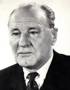Kádár János édesanyja Czermanik Borbála,  cselédként dolgozott Abbáziaban, a gyermeket a [fiumei](https://hu.wikipedia.org/wiki/Fiume) Santo Spi-rito (Szentlélek) kórházban szülte meg. A kicsit (szere-lemgyerek) Czermanik János József néven jegyezték be a [katolikus](https://hu.wikipedia.org/wiki/Katolicizmus) anyakönyvbe. Miután állásából elbocsáj-tották, fiát a Somogy megyei Kapolyra adta nevelő-szülőkhöz. 1918-ban együtt Budapestre költöztek ahol édesanyja mosó- és takarítónőként dolgozott.

Az immáron Csermanek Jánosnak nevezett fiatalember Budapesten fejezte be a polgári iskolát, majd írógépműszerész-tanonc lett.

A munkásosztály harcos részével való kapcsolata előre megjósolható volt, már 17 évesen belépett a Vasas Szakszervezet ifjúsági csoportjába. Kádár János imádta a focit, gyerekkorában a Vasas ifjúsági csapatában játszott. Ugyanakkor az illegális kommunista mozgalommal is kapcsolatot talált.

A KMP [1922](https://hu.wikipedia.org/wiki/1922)-ben illegálisan újjászerveződött, fedőnéven [Magyarországi Szocialista Munkáspárt](https://hu.wikipedia.org/wiki/Magyarorsz%C3%A1gi_Szocialista_Munk%C3%A1sp%C3%A1rt) (MSZMP) alapítottak törvényes pártot, de nem-sokára lebuktak, így az [MSZMP](https://hu.wikipedia.org/wiki/Magyarorsz%C3%A1gi_Szocialista_Munk%C3%A1sp%C3%A1rt)-t [1928](https://hu.wikipedia.org/wiki/1928)-ban betiltották. Az 1929/32 között lezajló gazdasági világválság okozta társadalmi-politikai feszültség ala-posan megmozgatta az üdvtanokért oly annyira rajongó társadalmi csopor-tokat. A kommunisták is előbújtak az illegalitásból, Kádár János agitár-tonként vett részt a megmozdulásokban, így az 1930. [szeptember 1-je](https://hu.wikipedia.org/wiki/Szeptember_1.) i budapesti tömegtüntetésen is, majd miután felvették a [Kommunista Ifjú-munkások Magyarországi Szövetség](https://hu.wikipedia.org/wiki/Kommunista_Ifj%C3%BAmunk%C3%A1sok_Magyarorsz%C3%A1gi_Sz%C3%B6vets%C3%A9ge)ébe (KIMSZ) és a [Kommunisták Magyarországi Pártjának](https://hu.wikipedia.org/wiki/Kommunist%C3%A1k_Magyarorsz%C3%A1gi_P%C3%A1rtja) (KMP) is tagja lett.

A kitűnően működő rendőrség azonnal lecsapott rá és 1931 novemberében letartóztatták, azonban mivel jogállam volt (esetleg vallott!?) bizonyí-tékok hiányában elengedték. Az illegális mozgalomban *Barna János* fedő-név alatt már vezetői funkcióval is megbízták, mégis újfent lebukott. A KIMSZ Titkárságának egyik ülésén letartóztatták, és 1933 októberében két év [fegyházra](https://hu.wikipedia.org/wiki/Fegyh%C3%A1z) ítélték.

1934-ben a Gyűjtőfogházban részt vett a börtönben szervezett [éhség-sztrájkban](https://hu.wikipedia.org/w/index.php?title=%C3%89hs%C3%A9gsztr%C3%A1jk&action=edit&redlink=1). Kádár élete újra fordulóponthoz ért, átszállították a szigorúbb szegedi [*Csillag börtönbe*](https://hu.wikipedia.org/wiki/Szegedi_Fegyh%C3%A1z_%C3%A9s_B%C3%B6rt%C3%B6n), a börtön nemcsak a köztörvényeseknek hanem a politikaiaknak is remek tövábbképzési lehetőségeket nyújtott. A szegedi fegyházban igazi nehézsúlyú politikaiak raboskodtak, itt ismeretkedik össze a Csillag nemzetközi sztár rabjával, [Rákosi Mátyással](https://hu.wikipedia.org/wiki/R%C3%A1kosi_M%C3%A1ty%C3%A1s).

Szabadulása után segédmunkásként is dolgozott, a KMP utasítására belé-pett az [Magyarországi Szociáldemokrata Párt](https://hu.wikipedia.org/wiki/Magyarorsz%C3%A1gi_Szoci%C3%A1ldemokrata_P%C3%A1rt)ba, ez a kommusták szokása volt, ugyanis alvó ügynököket ültettek be a külömböző pártokba.

1941. október 6-án, az aradi vértanúk emléknapján sor került az első anti-fasiszta tüntetésre is, a Batthyány-örökmécsesnél megjelentek az SZDP és a polgári ellenzék képviselői is. Egységfrontba tömörültek a polgári politi-kusok mint Bajcsy-Zsilinszky Endre és Szekfű Gyula, a szociáldemokrata Szakasits Árpád, a népi író Darvas József és immáron a kommunista Kállai Gyulát is elfogadták.

Habár a Horthy-rendszer elitje maga is németellenes volt és tudott a szer-vezkedésről, a kommunistáknak mégsem kegyelmezett. A KMP vezetői közül elfogták és kivégezték Rózsa Ferencet a KB titkárát,és a *Szabad Nép* című illegális pártlap szerkesztőjét és Schönherz Zoltánt. A kommunista mozgalom élére új arcok kerültek, mint Demény Pál és Kádár János.

A második világháború éveiben Kádár János 1942 decemberétől előbb a KB titkára, majd 1943 februárjától vezető titkár lett. Ekkor kapta új moz-galmi nevét, ezentúl Kádár Jánosnak kelett szólítani a mozgalomba.

A Kommunista Internacionálé 1943 júniusában feloszlatta a KMP-t és megszervezte a *Békepártot*, így a [német megszállás](https://hu.wikipedia.org/wiki/Margarethe_hadm%C5%B1velet) ([1944](https://hu.wikipedia.org/wiki/1944). [március 19](https://hu.wikipedia.org/wiki/M%C3%A1rcius_19.)-ikétől [1945](https://hu.wikipedia.org/wiki/1945). [április 4](https://hu.wikipedia.org/wiki/%C3%81prilis_4.)-ikéig tartott) ideje alatt az illegalitásba szorult magyar pártok és vallási szervezetek, 1944 májusában létrehozták a *Magyar Front* nevű náciellenes szövetkezést. Az antifasiszta politikai erőkből létrejött a [*Békepárt*](https://hu.wikipedia.org/wiki/B%C3%A9kep%C3%A1rt_(1943))ban a Kommunista Párt (KP), a [Magyarországi Szociáldemokrata Párt](https://hu.wikipedia.org/wiki/Magyarorsz%C3%A1gi_Szoci%C3%A1ldemokrata_P%C3%A1rt) (MSZDP), a [Független Kisgazda-, Földmunkás- és Polgári Párt](https://hu.wikipedia.org/wiki/F%C3%BCggetlen_Kisgazda-,_F%C3%B6ldmunk%C3%A1s-_%C3%A9s_Polg%C3%A1ri_P%C3%A1rt) (FKgP) és a [Nemzeti Parasztpárt](https://hu.wikipedia.org/wiki/Nemzeti_Parasztp%C3%A1rt) (NP) hoztak létre náci ellenes koalíciót.

A szervezet vezetői tárgyaltak [Horthy Miklóssal](https://hu.wikipedia.org/wiki/Horthy_Mikl%C3%B3s_(korm%C3%A1nyz%C3%B3)) a háborúból való kiugrás lehetőségérő, azonban a nyilasok felfedték a szervezkedést és a gestapo segítségével letartóztatták annak vezetőit, közülük Bajcsy-Zsilinszky End-rét és [Kiss János altábornagyot](https://hu.wikipedia.org/wiki/Kiss_J%C3%A1nos_(alt%C3%A1bornagy)) kivégezték.

Kádár Jánost a párt 1944 áprilisában Jugoszláviába küldte volna, de már a határon elfogták. Ügyesen katonaszökevénynek adta ki magát, így csak börtönbe zárták. 1944 novemberében a Németországba való kiszállítá-sakor a menetoszlopból sikerült megszöknie és visszatért a budapesti ille-galitásába. A főváros több hónapos ostromát sikeresen átvészelte, és 1945 tavasza számára is meghozta a felszabadulást.

A kommunisták igen gyorsan a hatalom birtokosaivá váltak, ezt meg is tehették a megszálló vörös hadsereg oltalmában. Kádár János megkapta a lehető legbizalmibb állást, Budapest rendőrfőnökének a helyettesévé nevezték ki. Ezekután szembe nézhetett az addig őt üldöző rendszerrel, a legkicsinyesebb bosszú sem állt távol tőle.

1945 januárjában megérkeztek a fővárosba a moszkovita elvtársak, Gerő Ernő átvette tőle a KB titkári tisztet. Kárpótlásul egy csomó kevésbé fontos párttisztséget kapott, hol gyakorlatilag csak aszisztálhatott a nagyhatalmú Rákosi klikknek. 1946-tól az 1951-es letartóztatásáig a párt főtitkárhe-lyettese volt, Rákosiéknak ugyanis szükségük volt egy helyi, jó képű, jó hangú munkáskáder kinézetű vezetői figurára.

Eljött Kádár János ideje, egyéb pozíciói melett 1946-ban a kommunista párt felkarolta a Vasas Sport Klubot. Kádár révén az angyalföldiek kiemelt támogatáshoz jutottak, sikerült megszerezniük olyan klasszisokat; mint Kubala László vagy Lóránt Gyula. A pénz nem számított, a munkás klub bekerült a szűk elitbe, pl. az 1948-as bajnokság végén másodikakok lettek.

Kádár János helyzetének romlásában minden bizonnyal szerepet játszott a két sztárjátékos disszidálása, (Kubalának sikerült-Barcelona, Lórántnak nem-majdnem akasztófa).

1948 és 1950 júniusa között belügyminiszterként jelentős szerepe volt a polgári és az egyházi ellenzék megtörésében, ebbéli feladatait minden lelkiismeretfurdalás nélkül végrehajtotta. Ezekben a sorsdöntő években vették át Kelet-Európa szerte a hatalmat, eszközökben természetesen nem válogatva. A [Magyar Kommunista Párt](https://hu.wikipedia.org/wiki/Magyar_Kommunista_P%C3%A1rt) [1948](https://hu.wikipedia.org/wiki/1948)-ban egyesült a [szociál-demokrata párttal](https://hu.wikipedia.org/wiki/Magyarorsz%C3%A1gi_Szoci%C3%A1ldemokrata_P%C3%A1rt) és így létrejüt a [Magyar Dolgozók Párt](https://hu.wikipedia.org/wiki/Magyar_Dolgoz%C3%B3k_P%C3%A1rtja) nevű állampárt. Az osztályharc megszállottai permanensen keresték, és meg is találták a belső (elhajlók, kémek…) és a külső (imperialista ügynökök, klerikálisok, horthysta-fasiszták…) ellenségeket. Ekkor kezdődtek a koncepciós perek, melyekben Kádár telyes odaadással vett részt. A Magyar-Amerikai Olaj-ipari Részvénytársaság elleni, valamint a Mindszenty-per lebonyolításá-ban is része volt.

[1949](https://hu.wikipedia.org/wiki/1949) [májusában](https://hu.wikipedia.org/wiki/M%C3%A1jus_30.) [Rákosi Mátyás](https://hu.wikipedia.org/wiki/R%C3%A1kosi_M%C3%A1ty%C3%A1s) és köre megindították az első belső kon-cepciós pert (Rajk-per), melynek álldozatai Rajk László volt bel és külügyminiszter, valamint [Szőnyi Tibor](https://hu.wikipedia.org/wiki/Sz%C5%91nyi_Tibor) volt Sz.B. titkár és [Szalai András](https://hu.wikipedia.org/wiki/Szalai_Andr%C3%A1s_(politikus)) az [MDP](https://hu.wikipedia.org/wiki/Magyar_Kommunista_P%C3%A1rt) központi káderosztályának lett helyettes vezetője voltak, kiket jugoszlávoknak való kémkedés vádjával kivégeztek. A vallató elvtársak, [Kádár János](https://hu.wikipedia.org/wiki/K%C3%A1d%C3%A1r_J%C3%A1nos_(politikus)) belügy- és Farkas Mihály honvédelmi miniszter voltak, persze a munka véres dandárját ezúttal is Péter Gábor az [ÁVH](https://hu.wikipedia.org/wiki/%C3%81llamv%C3%A9delmi_Hat%C3%B3s%C3%A1g) vezetője végezte el.

Kádár Jánost 1950 májusától az MDP KV Szervező Bizottság tagjává, valamint a Párt- és Tömegszervezeti Osztályának vezetőjévé nevezték ki.

A Rákosi-klikk azonban végleg le akart számolni, a nem moszkovita hátterű pártvezetőkkel, így Kádárt 1951 tavaszán letartóztatták és minden pozíciójától megfosztották. Azzal vádolták, hogy első letartóztatása után a Horthysta rendőrség és később a nyilasokkal is együttműködő besúgó volt.

Az ellene folytatott vizsgálatot személyesen Farkas Mihály honvédelmi miniszter vezette, ki a rettegett Péter Gábor hathatós közreműködésével hamar rábírta a vádlottat az ellene felhozott vádak önkritikus beismerésére. Kádár Jánost a már bevált önkkritikus belátó és mindent elfogadó takti-kához nyúlt, hiszen pontosan tudta a koncepciós perek játék szabályait.

Úgy gondolta hogy így talán sikerül túlélnie. 1952 decemberében a Leg-felsőbb Bíróság életfogytiglani fegyházra ítélte.

Kádárnak azonban szerencséje volt, mert Sztálin 1953 március 5-kei halá-lával enyhülés következett be a belpolitikai életben. Gerő Ernőnek jutott a hálátlan feladat, hogy felülvizsgálja a koncepciós ügyeket. Ennek ered-ményeként Kádár János visszakapta tisztségeit, és a Magyar Dolgozók Pártja miután 1954 júliusában szabadon bocsátotta és még kárpótlásban is részesítette. - *Kádár János, Rákosi Mátyás, Gerő Ernő, Nagy Imre -*

Sztálin halálának következménye-ként az új szovjet vezetés arra szólította fel Rákosit, hogy ossza meg hatalmát és a miniszterelnöki posztot adja át Nagy Imrének.

Nagy Imre reformjai Rákosi ott gáncsolt ahol tudta, erre Nagy Imre ott indított támadást Rákosi ellen, ahol leginkább lehetett, a kommunistákat sújtó koncepciós pereknél.

Sorra vizsgálták felül a pereket, így Kádárét is. Kádár János vissatérhetett szeretett Angyalföldjére, hol rendkívüli népszerűségnek örvendett a prolik között. Az MDP XIII. kerületi pártbizottság titkára lett, ez pesten a leg-fontosabb stratégiai helyszíne volt a kommunista tömegbázisnak. 1955 szeptemberétől az ugyancsak stratégiailag fontos Pest Megyei MDP Párt-bizottság első titkára lett. Az 1956-tal beköszöntő új esztendőben élete döntő fordulatához fog érni.

1956 j[únius 28-án a](https://hu.wikipedia.org/wiki/J%C3%BAnius_28.) [lengyelországi](https://hu.wikipedia.org/wiki/Lengyel_N%C3%A9pk%C3%B6zt%C3%A1rsas%C3%A1g) [Poznańban](https://hu.wikipedia.org/wiki/Pozna%C5%84) munkások tízezrei vonultak az utcára, jobb életet és szabad választásokat követelve. Ezalatt Kádárt az MDP KV plénuma megválasztotta a PB tagjának, valamint a KV másod-titkárának, tehát a pártállam tovább élte öntörvényű hétköznapjait. Buda-pesten mégis elkezdődött valami, [október 6](https://hu.wikipedia.org/wiki/Okt%C3%B3ber_6.)-kára meghirdették a koncep-ciós perek kommunista áldozatainak nyílvános temetését. Miközben le-zajlott [Rajk László](https://hu.wikipedia.org/wiki/Rajk_L%C3%A1szl%C3%B3_(politikus)) és társai [ünnepélyes temetése](https://hu.wikipedia.org/wiki/Rajk-%C3%BAjratemet%C3%A9s), [Budapesten](https://hu.wikipedia.org/wiki/Budapest) és más egye-temi központokban az elégedetlén értelmiség és a lengyelekkel szinpa-tizáló pogárok már követelésekkeél léptek fel a párt elittel szemben.

A forradalom előestéjén az új direktívákért Moszkvába utazótt a magyar párt küldötsége Gerő Ernő és Kádár János vezetésével. A világproleta-riátus fővárosában megbeszélések fő témája a magyarországi helyzet ala-kulása volt.

Az 1956-os forradalom kitörésekor (október 23.) a tüntető diákok egyik követelése Nagy Imrének a kormányba való visszatérése volt. Másnap, [ok-tóber 24-én](https://hu.wikipedia.org/wiki/Okt%C3%B3ber_24.) megjelennek az első szovjet harckocsik [Budapest](https://hu.wikipedia.org/wiki/Budapest) utcáin, meg-kezdődik a fegyveres harc. Dobi István (volt kisgazda) az Elnöki Tanács 

elnökeként még aznap beiktatta a [második Nagy Imre-kormányt](https://hu.wikipedia.org/wiki/M%C3%A1sodik_Nagy_Imre-korm%C3%A1ny).

Kádár Nagy Imrét támogadta, Gerő leváltásával került a hatalom legfonto-sabb pozíciójába, ugyanis [október 25](https://hu.wikipedia.org/wiki/Okt%C3%B3ber_25.)-én délelőtt a PB [Gerő Ernőt](https://hu.wikipedia.org/wiki/Ger%C5%91_Ern%C5%91) (a Központi Vezetőség első titkára) leváltotta, az MDP első titkárának Kádár Jánost választották. A pártelnökség azonnal döntést hozott a tűzszünet ki-hirdetéséről, míg Nagy Imre és Kádár János hosszasan tárgyalt erről Miko-jánnal és Szuszlovval a szovjet nagykövetségen.

A miniszterelnők rádióbeszédben közölte, hogy a rend helyreállítását kö-vetően megkezdik tárgyalásaikat a szovjet csapatok kivonásáról. O[któber 26](https://hu.wikipedia.org/wiki/Okt%C3%B3ber_26.)-án délelőtt a kormány összetétele véglegesen eldőlt, számos MDP-tag miniszter szerepelt benne, sőt  a Kisgazdapárt korábbi vezetői, [Tildy Zol-tán](https://hu.wikipedia.org/wiki/Tildy_Zolt%C3%A1n_(politikus)) egykori államfő és Kovács Béla is helyet kaptak a kabinetben.

Az első változás a pártvezetésben történt, létrejött az MDP KV Rendkívüli Bizottsága (Direktórium) melynek Kádár és leghűbb bajtársa Münnich Ferenc belügyminiszter is tagja lett. A Rákosi tábor sem ült ölbe tett kézzel, Hegedűs András a Minisztertanács volt elnöke (miniszerelnök) október 28-án aláírta a szovjet hadsereg segítségül hívásáról szóló kérelmet.

Kádár János október 28-án az MDP hattagú elnökségének az elnöke lett, majd néhány nappal később az [MDP](https://hu.wikipedia.org/wiki/Magyar_Dolgoz%C3%B3k_P%C3%A1rtja) utódjaként megalakuló [MSZMP](https://hu.wikipedia.org/wiki/Magyar_Szocialista_Munk%C3%A1sp%C3%A1rt) Intéző Bizottság tagja lett. Október 30-án a Kormány Kabinet tagjává és Nagy Imre nemzeti kormányának államminiszterévé nevezték ki, ilyen minőségében tárgyalásokat folytatott a szovjetekkel. Kádár november 1-jei rádióbeszédében a "Rákosi uralmát lerázó dicsőséges népfelkelés"- ről beszélt, és kijelentette hogy az MSZMP mindenkivel szemben meg fogja védeni Magyarország függetlenségét és a nemzet becsületét. A beszéd elhangzásakor már nem volt Magyarországon, a szovjet nagykövetségről Münnich Ferenccel titokban Moszkvába utazott.

Kádár Jánost az SZKP KB elnöksége kinevezte a Moszkvában létrehozott ellenkormány vezetőjévé. Még aznap este szovjet katonai repülőgéppel Szolnokra érkezett, és mint a szolnokon megalakult Forradalmi Munkás-Paraszt Kormány vezetője mondott rádió beszédet. A törvénytelen hata-lomátvételt az ellenforradalmárok terrorjával magyarázta.

November 7-én a szovjet páncélosokkal érkezett Budapestre, hol az új hatalomhoz hű Elnöki Tanács elnöke, Dobi István kinevezte a Miniszter-tanács elnökévé. Előbb az MSZMP IIB tagjává, míg 1957. február 26-ától az MSZMP IKB elnökévé választották. Megkezdődött a megtorlás idő-szaka (pufajkások), sortüzek, valamint több száz halálos ítélet és ezernyi börtönbüntetés jellemezte azt a tisztogatást, amit Kádár rendezett a forra-dalom vérbefolytását követően.

Kádár gesztusokat is képes volt tenni, Rákosit lényegében száműzte, az [ÁVH](https://hu.wikipedia.org/wiki/%C3%81llamv%C3%A9delmi_Hat%C3%B3s%C3%A1g)-t nem szervezték újjá, arra viszont megvolt a lehetőség, hogy egy-kori tagjait a kultúrába, illetve az új fegyveres testületekbe helyezze el. A rendszer félelmét a forradalom megismétlődésétől igazolja a kiterjedt besúgó hálózat és [titkosszolgálati](https://hu.wikipedia.org/wiki/Bel%C3%BCgyminiszt%C3%A9rium_III/III._Csoportf%C5%91n%C3%B6ks%C3%A9g) megfigyelés. A Kádári-konszolidáció alapját a szovjet (Hruscsov) támogatás, valamint a párt és az erőszakszer-vezetek újjáépítése képezte. Az 1957-ben megalakult [Kommunista Ifjúsági Szövetség](https://hu.wikipedia.org/wiki/Magyar_Kommunista_Ifj%C3%BAs%C3%A1gi_Sz%C3%B6vets%C3%A9g) (KISZ), a párt ifjúsági szervezeteként felügyelte az ifjúság ne-velését. Az ENSz követelésére két lépcsőben [1960](https://hu.wikipedia.org/wiki/1960)-ban, majd [1963](https://hu.wikipedia.org/wiki/1963)-ban az elitéltek nagy többségét (kb. 3000 politikai foglyot) kiengedték. Igy a hatvanas évek meghozták a rendszer stabilitását, 1961-re befejeződött a téeszesítés, sőt egy kisebb földdarabon engedélyezték a háztáji gazdasá-gokat. Az intézkedéseknek köszönhetően megszünt az élelem hiány és valamelyest emelkedett az életszinvonal is.

A polgári életmód újra értékes tulajdonság lett, a korabeli filmszinház egyaránt propagálhatta a szolíd humánus értékeket. A nagyobb magánéleti szabadság és a karrierlehetőségekért cserébe az értelmiság java része társutassá vált. Népszerű akcióival (zenei rendezvények, televíziós műso-rok…) jelentős befolyással bírt az egyébként népszerűtlen rendszer elfo-gadására. A gulyáskommunizmusnak, vagy kádárizmusnak nevezett ideo-lógia alapeszméje az volt, hogy egy bizonyos jólét biztosításáért cserében a magyar lakósság elfogadta a fennálló politikai helyzetet („aki nincs el-lenünk, az velünk van”).

Hasonló elgondolást fedezhető föl az Aczél György által irányított kultúr-politikában is, mely a tiltott-tűrt-támogatot hármast szintén a rendszerrel kötött kompromisszumok függvényében alkalmazta. A rendszer fő média támogatói a pesti kabaréban a volt ÁVH-s Komlós János [Mikroszkóp Színpad](https://hu.wikipedia.org/wiki/Mikroszk%C3%B3p_Sz%C3%ADnpad)ja és annak fő sztárja a ‘’szókimondó’’Hofi Géza voltak.

Ugyancsak jelentős tömegbefolyással bírtak a népszerű TV politikai mű-sorok szakértői mint pl. a szintén volt ÁVH-s Ipper Pál és Pálfy József.

A rendszer másik tömegbázisát a (SZOT) [Szakszervezetek Országos Ta-nácsa](https://hu.wikipedia.org/wiki/Szakszervezetek_Orsz%C3%A1gos_Tan%C3%A1csa) képviselte, mely szervezet nem érdekképviseletként működött, ha-nem a párt utasításait követte.

A Hazafias Népfront (HNF) sajátos [társadalmi szervezet](https://hu.wikipedia.org/wiki/T%C3%A1rsadalmi_szervezet)ként, mintegy szelep szerepét betöltve gyűjtötte maga köré a polgári-nemzeti gondola-kodás maradványait, kiknek a napilapja a [*Magyar Nemzet*](https://hu.wikipedia.org/wiki/Magyar_Nemzet) volt.

A legnagyobb társadalmi törést hozó “56-os eseményeket” Kádár János és rendszere végig ellenforradalomnak tartotta, és tilos volt róla beszélni.

Habár az 1968-tól Nyers Rezső vezetésével megkísérelt „új gazdasági mechanizmus”, végül kudarcba fulladt, mégis Magyarország vált a szocia-lista blokk „legvidámabb barakkjává”, mivel kiemelkedő életszínvonalat mutatott fel a KGST országai között. Azonban az 1970-es évek során bekövetkező olajárrobbanás, és az energiahordozók áremelkedésének kö-vetkezményeként, nevéhez kötődnek a külföldről felvett hitelek, és az ország nagymértékű eladósítása. - *Népszerűsége csúcsán, egy majálison -*

Külpolitájában is változás tör-tént, [1968](http://hu.wikipedia.org/wiki/1968) [augusztusában](http://hu.wikipedia.org/wiki/Augusztus) bele-egyezett a „prágai tavasz” el-fojtására küldött [Varsói Szer-ződés](http://hu.wikipedia.org/wiki/Vars%C3%B3i_Szerz%C5%91d%C3%A9s) csapataiban való rész-vételbe. 1981-ben viszont, a-mikor a szovjet pártvezetés a Lengyelországba való bevonu-lást eröltette, Kádár semmiféle katonai segítséget nem nyújtott a Varsói Szerződés csapatainak.

Kádár János megítéléséhez hozzátartozik, hogy a közvélemény nagyobb része sokáig árulónak és szovjet helytartónak gondolta. A 60-as évektől, mikor a "legvidámabb barakknak" tartották a szocialista országok közt, javult megítélése. A megítélésének pozitív változásához hozzá tartozott a teljes foglalkoztatás, valamint az erős szociális háló megszervezése.

A viszonylagos jólét biztonságérzetet adott az embereknek, de az szocia-lista nagyipar és az ellenőrizhetetlen (már akkor független!?) bankárvilág, akarva-akaratlanul mindennek eladósította az országot! Hogy a rengeteg felvett kölcsönt hova költötték el a “kiváló bankárkülkeresek”?

A politikus 1989. július 6-án hunyt el, éppen azon a napon, melyen Nagy Imrét és ’56-os társait rehabilitálták, halálával rendszere is összeomlott.

Kádár János országlásának idején alakultak ki azok a társadalmi csoportok, melyek a mai napig meghatározzák Magyarország sorsát.

A 60-as évektől szocializálódott magyarok, a televízió, a színház és a hihetetlenül felvirágzott filmgyártás váltak nemzeti elkötelezetté, karrier-kommunistává vagy nyugatimádó kozmopolitává!

Forrás: *Magyar életrajzi lexikon. Huszár Tibor: Kádár János politikai életrajza 1912-1989. I-II.*

**Kádár László** (Ósóvé, 1908. január 22. - Debrecen, 1989. május 6.) földrajztudós, egyetemi tanár, az MTA tagja.

A budapesti Tudományegyetemen 1930-ban bölcsész-doktori, 1932-ben pedig földrajz-természetrajz szakos középiskolai tanári, 1938. pedig magántanári képesítést szerzett. Fodor Ferenc, Cholnoky Jenő és Teleki Pál tanítványa volt. 1931-től a Közgazdaságtudományi Kar Földrajzi Tanszékén intézeti tanár, majd 1938-ban egyetemi magántanárrá habilitálták.

1933-ban az Almásy László által a líbiai sivatagban vezetett expedíció magyar résztvevője volt. Erről az expedícióról készült *Az angol beteg* c. film. 1938-1942 között a *Magyar Táj- és Népkutató Intézetben* Teleki Pál munkatársaként földrajzi vezető, majd igazgató. 1942 őszén az akkor visszakerült Délvidék első felsőfokú tanintézmé-nyében az újvidéki *Keleti Kereskedelmi Főiskolának* rendes tanárává és a főiskola Kőrösi Csoma Sándor diákotthonának igazgatójává nevezték ki. A *Györffy-kollégium* tanárelnöki teendőit is ellátta.

Az [1930-as években](https://hu.wikipedia.org/wiki/1930-as_%C3%A9vek) született meg a [népi írók](https://hu.wikipedia.org/wiki/N%C3%A9pi_%C3%ADr%C3%B3k), falukutatók ([Németh Lász-ló](https://hu.wikipedia.org/wiki/N%C3%A9meth_L%C3%A1szl%C3%B3_(%C3%ADr%C3%B3)),  [Darvas József](https://hu.wikipedia.org/wiki/Darvas_J%C3%B3zsef_(%C3%ADr%C3%B3)), [Veres Péter](https://hu.wikipedia.org/wiki/Veres_P%C3%A9ter_(%C3%ADr%C3%B3))…) között a népi kollégiumi eszme, mely bentlakásos internátus létesítésével meg akarták teremteni a tanulás, az értelmiségivé válás esélyét a szegény sorsú, paraszti származású gyerekek-nek. 1939-re a *Turul* nevű diákszervezet támogatásával létrejött a *Bolyai Kollégium*, (1942-től Györffy István néprajzkutatórol elnevezett) amely a Budapestre egyetemre kerülő fiataloknak biztosított lakást és közösséget.

A vesztett világháború után 1945-ben a debreceni tudományegyetem *Föld-rajzi Intézetének* vezetője, a tanszékvezető professzora, a Bölcsészettu-dományi Kar prodékánja, a Természettudományi Kar dékánja, végül pedig az egyetem rektora. A *Magyar Földrajzi Társaságban* 1956-1973 között elnökölt, az MTA Földrajzi Főbizottsága alapító tagja.

*„*A folyóvíz és a szél munkájának sokoldalú tanulmányozása alapján a paleoklimatológiai vizsgálatokhoz kapcsolódva még a 60-as években kidolgozta a földi légkörzés új modelljét. 1971-ben jelent meg az a szin-tézise, amely a folyóvíz által létrehozott formák teljes genetikus rendszerét adta. A jégkorszakok által létrehozott hegységképződések, valamint a Föld őséghajlati viszonyainak tanulmányozása, a hideg földkeletkezési és a Föld tágulás elméletét dolgozta fel tudományos munkáiban.” Az NDK és Lengyelország Földrajzi Társaságainak tb. tagja. Kiemelkedő szerepe volt a magyarországi tájak, elsősorban az Alföld kutatásában.

Fő munkája: *Biogeográfia. A Föld és a földi élet (1965).*

Forrás: *Magyar életrajzi lexikon*

**Kadics** *Kadič* **Ottokár** (Opazova, 1876. július 29. - Budapest, 1957. február 28.) geológus.

A horvát származású fiatalember az édesanyja ösztön-zésére vált, a magyar tudomány nagságává.

A zágrábi éretségijét követően, egyetemi tanulmányait München-ben végezte. Budapestre költözve, 1904-től a Földtani Intézet munkatársa lett. 1902 tavaszán Temes és Hunyad vármegyék harmad- és negyedkori dombvidé-kein kutatott.

1906-ban a Bükk hegységi Szeleta-barlangban végzett ásatásával vette kezdetét a rendszeres hazai ősrégészeti kutatás. Lóczy Lajosnak, az egyetemes földrajzi tanszék tanárának javaslatára 1910-ben a Földtani Társulaton belül barlangkutató bizottságot szervezett, és ennek keretében megindította a *Barlangkutatás* c. folyóiratot. Egyedi föltárási módszerével 1911-ben Tübingenben megtartott ősrégészeti konferencián bebizonyította a szeletai ún. babérlevél-hegy eredetiségét. 1916-ban a budapesti egyetem a karsztföldtan mtanárává képesítette. 

1911-18 között a horvát karsztban, 1922-23-ban a tolnai dombvidéken térképezett és őslényanyagot gyűjtött. Rendezte a gerinces őslénytárat, elkészítette leltárát, hozzákezdett az anyag rendszeres földolgozásához.

1928-tól a karsztgeológiai és a gerincesek őslénytana tárgykör c. ny. rk. tanára a budapesti egyetemen. Jelentős ásatásokat folytatott a bükki bar-langokban. Két évtized alatt közel száz barlangban végzett felmérést, szá-mos publikációja jelent meg. Szorgalmazta, hogy a barlangokat rendezzék és kapcsolják be az idegenforgalomba.

A budai várbeli ún. „Török pincék” feltárását is ő irányította; itt egyi-dejűleg létrehozta az első hazai barlang-múzeumot.

A magyar barlangi ősemberkutatás megalapítója. 1928-tól a Szent István Akadémia tagja. Létrtehozta és hosszú időn át vezette a *Magyar Barlang-kutató Társulatot*.

1953-ban elnyerte a föld- és ásványtani tudományok kandidátusa címet. Róla nevezték el a Szemlőhegyi-barlangot. Kaán Károly alapvető termé-szetvédelmi munkájához ő írta a barlangok ismertetését.

Főbb művei: *Mesocetus Hungaricus *(1907), * A Balaton vidékének fosszilis emlősmaradványai* (1910), * A Szeleta-barlang kutatásának eredményei* *(1915), A jégkor embere Magyarországon (1934), A cserépfalvi barlang (Subalyuk) monográfiája (1938).*

Forrás: *[Magyar életrajzi lexikon](https://www.arcanum.hu/en/online-kiadvanyok/Lexikonok-magyar-eletrajzi-lexikon-7428D/), [Magyar Katolikus Lexikon](http://lexikon.katolikus.hu/)*

**Kállai Ernő** (Szakálháza, 1890. november 09. - Budapest, 1954. novem-ber 28.) művészeti író, kritikus.

A Pesti Polgári Iskolai Tanítóképzőben 1916-ban dip-lomázott. 1915-ben a *Magyar Pedagógia* című lapnál dolgozott. Ekkoriban ismerkedett meg Kassák Lajos-sal a *Ma* kiállítótermében.

Az [1920-as években](https://hu.wikipedia.org/wiki/1920-as_%C3%A9vek) Angliába költözött, a [*British Múzeumban*](https://hu.wikipedia.org/wiki/British_Museum)  és a  [*National Gallery*](https://hu.wikipedia.org/wiki/National_Gallery_(London))-ben is dolgozott.

[1929](https://hu.wikipedia.org/wiki/1929)-től Berlinben a *Deutsche Kunst und Dekora-tion* c. folyóiratot szerkesztette. A *Jahrbuch der jun-gen Kunst* folyóiratban, El Liszickijről, Moholy-Nagyról jelentek meg írásai. Kassákkal és [Moholy-Nagy Lászlóval](https://hu.wikipedia.org/wiki/Moholy-Nagy_L%C3%A1szl%C3%B3) egyaránt jó barátságban volt, mindhárman szorosan követték a modern művészeti irányzatokat, a *Ma* folyóirat szellemi és képi arculatát ők határozták meg, a folyóirat mű-vészelméleti teoretikusa Kállai volt. Érdeklődése fókuszában a konstruk-tivizmus művészetmegújító ereje és társadalomformáló eszméje állt.

1926-ban az *Új magyar piktúra* című könyvét egyszerre adták ki Buda-pesten és Lipcsében (Neue Malerei in Ungarn), amely a magyar művészet jelenlétét emelte ki az európai művészet összefüggésében. 1928 körül a *Bauhaus* folyóirat szerkesztőjeként a hazai *Tér és Forma*, valamint a *Mun-ka* című lapokban rendszeresen tudósított a Bauhaus tevékenységéről. Az 1930-as években a nonfiguratív szürrealizmus felé fordult (J. Miró, H. Arp), amely számára a válságkorszak szorongásának kifejezője volt.

1935-ben a nemzeti szocializmus elől hazaköltözik, művészeti írója 1937-1942 között [*Az Ország Útja*](https://hu.wikipedia.org/wiki/Az_Orsz%C3%A1g_%C3%9Atja) c. folyóiratnak. Képzőművészeti kritikusként dolgozott a [*Jelenkornál*](https://hu.wikipedia.org/wiki/Jelenkor_(id%C5%91szaki_lap)), majd a  [P*ester Lloyd*](https://hu.wikipedia.org/wiki/Pester_Lloyd)  című Budapesten megjelenő német nyelvű hetilap művészeti rovatvezetője volt. 1941-ben [Baumgarten-díj](https://hu.wikipedia.org/wiki/Baumgarten-d%C3%ADj)jal jutalmazták. Irásai jelentek meg a *Szép Szó* (szer-kesztő: József Attila), a *Magyar Csillag* (szerkesztő: Illyés Gyula), című lapokban.

A világháború után, 1945 májusában megnyitotta a Rózsa Miklós emlék-kiállítását. Ebben az időben csatlakozott az *Európai Iskolához*, megala-pította a "Galéria a 4 világtájhoz" nevű kiállítótermet, amelyet az *Új Világ-kép* című kiállítás avatott fel. A tárlat a modern technika felhasználásának lehetőségeit kutatta és mutatta be a művészetben. Esztétikát tanított a Ma-gyar Iparművészeti Főiskolán, de a Képzőművészeti Szaktanács újkon-zervatív nézetei ellen való felszólalása miatt 1948-ban megfosztották a katedrától. Emlékezetére [1989](https://hu.wikipedia.org/wiki/1989)-ben a magyar művészeti írók megalakí-tották Budapesten a [*Kállai Ernő Kört*](https://hu.wikipedia.org/wiki/K%C3%A1llai_Ern%C5%91_K%C3%B6r).  [2004](https://hu.wikipedia.org/wiki/2004)-ben egykori lakhelyének falán emléktáblát avattak.

Forrás: *Új magyar irodalmi lexikon II. 1994.* 

**Kálmán Oszkár** (Kisszentpéter, 1887. június 19. - Budapest, 1971. szep-tember 17.) operaénekes (basszus).

Lugoson járt Felsőkereskedelmi iskolába, ahol érettsé-gijét követően hivatalnokként dolgozott. Magánúton tanult zenét és a helyi műkedvelő kórusban énekelt. Egy ideig a Zeneakadémia hallgatója volt, majd külföldi ta-nulmányútra ment, hangját [Münchenben](https://hu.wikipedia.org/wiki/M%C3%BCnchen) képezte.

1913-ban előéneklés után szerződtette az [Operaház](https://hu.wikipedia.org/wiki/Magyar_%C3%81llami_Operah%C3%A1z), a-hol először Thomas *Hamlet*jének szellemhangját éne-kelhette. Első jelentős fellépése egy beugrás volt, a megbetegedett nagy basszus Venczell Béla helyett énekelte Mozart  *A varázsfuvola* c. operájában Sarastro szerepét. 1918-ban ő alakította a *Kék-szakállú herceg* szerepét Bartók operájának ősbemutatóján (a közönség értetlenül fogadta az új művet), majd ugyanebben az évben Bartók zon-gorakíséretével énekelt dalokat Kodály szerzői estjén, a *Megkésett meló-diák* c. dalciklusát. A következő öt évben elénekelhette az operairodalom nagy basszus szerepeit, mint pl.  *A hugenották*ban, Leporellót, Kaspart *A bűvös vadász*ban, Markét és Gurnemanzot, a *Faust* Mefisztóját  és a *Così fan tutte* Guglielmóját, valamint a Ring basszus-szerepeit.

1927-ben [Otto Klemperer](https://hu.wikipedia.org/wiki/Otto_Klemperer) a berlini *die Krolloperhez* szerződtette, hol sze-repelt [Paul Hindemith](http://hu.wikipedia.org/wiki/Paul_Hindemith) *Napi hírek* c. operája (1929. június 8.) ősbemu-tatójában. 1929-ig nagy sikerrel vendégszerepelt Spanyolországban is.

Opera- és oratóriuménekesként Németországi, bécsi, prágai és barcelonai vendégszereplései során is sikereket aratott. Kitűnt oratóriumokban, Bach-passiók Jézus-szerepeiben.

1929 őszén visszaszerződtette a budapesti Opera, ahol 1940-ig, a második zsidótörvényig maradhatott. Ez után csak az [OMIKE](https://hu.wikipedia.org/wiki/Orsz%C3%A1gos_Magyar_Izraelita_K%C3%B6zm%C5%B1vel%C5%91d%C3%A9si_Egyes%C3%BClet) előadásain léphetett fel. Az embertelenkorszak embertelen törvényei számos művésztársával együtt leparancsolták a színpadról, ez után csak az [OMIKE](https://hu.wikipedia.org/wiki/Orsz%C3%A1gos_Magyar_Izraelita_K%C3%B6zm%C5%B1vel%C5%91d%C3%A9si_Egyes%C3%BClet) Síp utcai szín-háztermében (Goldmark-terem) előadásain léphetett fel.

1945-től 1954-es nyugdíjazásáig újra az Operaház énekese lett. 1947-ben *Borisz Godunov*-premierre került sor az Operaházban. A címszerep-ben Székely Mihály, Pimen szerepében pedig Kálmán Oszkár

Évtizedeken keresztül szinte hetente lépett fel oratóriumkoncerteken is. Szerepköre az operairodalom teljes basszus repertoárját felölelte. Számos kortárs mű - Stravinsky- és Hindemith-művek, Kodály-dalok és a *Buda-vári Te Deum* - ősbemutatója fűződik nevéhez. Kevés megmaradt felvéte-le közt találjuk Petur bordalát is.

Forrás: *Magyar Színházművészeti Lexikon *

**Kanitz Ágost** (Lugos, 1843. ápilis 25. - Kolozsvár, 1896. július 12.) bota-nikus, egyetemi tanár, az  [MTA](https://hu.wikipedia.org/wiki/Magyar_Tudom%C3%A1nyos_Akad%C3%A9mia) tagja. 

Édesapja Kanitz Simon körorvos a botanikus Heuffel János is páciensei között tudta, így Ágost már gyer-mekkorában betekintést nyert a növénytan világába.

A gimnáziumot Nagykőrösön és Temesváron végezte, majd a bécsi egyetem orvoskarán [August Neilreich](https://hu.wikipedia.org/w/index.php?title=August_Neilreich&action=edit&redlink=1) 

ösztönzésére, hozzáfogott egy magyar botanikatörténet megírásához.

Az 1864-es [szlavóniai](https://hu.wikipedia.org/wiki/Szlav%C3%B3nia) botanikai gyűjtőútját követően, az 1865-ben meg-jelent Hunfalvy-féle *A magyar birodalom természeti viszonyainak leírása* számára ő írta meg a növény-földrajzi részt.

Ezt követően Európa nagyhírű botanikai intézményeiben végzett tanul-mányokat. 1869-ben érkezett Magyaróvárra a felsőbb gazdasági tanin-tézethez, ahol ő tanította először magyarul a természetrajz tárgyat.

1870-től Németországba megbízták, a Távol-Keleten gyűjtött növények meghatározásával és rendszerzésével.

1872-ben kinevezték az akkor alapított  kolozsvári egyetemhez, hol a nö-vénytan tanára. A kincses városban berendezte a tanszéket, megalapította az egyetemi növénykertet. Könyvtárát a kolozsvári botanikai tanszéknek ajándékozta. Az egyetem matematikai és természettudományi karának dé-kánja, majd rektora volt. Nevéhez fűződik az  [*Erdélyi Múzeum-Egylet*](https://hu.wikipedia.org/wiki/Erd%C3%A9lyi_M%C3%BAzeum-Egyes%C3%BClet) 

herbáriumának tudományos igényű rendezése is.

Tudós csapattal 1877-ben a balkáni országok flórájának áttekintését állí-totta össze. 1880-ban a gróf Széchenyi Béla álltal Közép-Ázsiában gyűjtött növények feldolgozását vállalta magára. Elindította és szerkesztette az magyar botanikai folyóiratot, a *Magyar Növénytani Lapok*at.

Jelentős érdemeket szerzett a korabeli Magyarország, valamint [Délkelet-Európa](https://hu.wikipedia.org/wiki/D%C3%A9lkelet-Eur%C3%B3pa) területén végzett  [florisztikai](https://hu.wikipedia.org/wiki/Florisztika)  kutatásaival és botanikai leírásaival.

Művei a külföld elismerését is kivívták, a tübingai egyetem doktornak pro-moveálta (előléptette). Tagja volt ezenkívül több külföldi szaktársaságnak, így 1872-ben a római *Academia dei Lincei* levelező tagjai közé fogadta s később rendes tagnak választotta. Az MTA 1880 májusában levelező tag-jai sorába választotta. Főbb művei: *Reliquiae Kitaibelianae* (1862-1863), *Geschichte der Botanik in Ungarn* (1863), *A magyar tartományok növény-tani viszonyai* (1866), *A természetes növényrendszer áttekintése* (1874), *Plantae Rumaniae* (3 kötet, 1879-81) stb.

Forrás: *[Szinnyei József](https://hu.wikipedia.org/wiki/Szinnyei_J%C3%B3zsef_(bibliogr%C3%A1fus)): [Magyar írók élete és munkái V.](http://mek.oszk.hu/03600/03630/html/k/k10184.htm) 1897. Magyar életrajzi lexikon [I.](http://mek.oszk.hu/00300/00355/html/ABC07165/07334.htm) 1967. *

**Kapussy György** ([Torontálkeresztes](http://hu.wikipedia.org/wiki/Toront%C3%A1lkeresztes), [1903](http://hu.wikipedia.org/wiki/1903). [november 6.](http://hu.wikipedia.org/wiki/November_6.) - [Budapest](http://hu.wikipedia.org/wiki/Budapest), [1986](http://hu.wikipedia.org/wiki/1986). [január 6.](http://hu.wikipedia.org/wiki/Janu%C3%A1r_6.)?) festőművész.

Egyszerű családban született, tizenhét évesen a járási székhelyen, a közeli Módoson kezdett foglalkozni festészettel, első mestere az aradi szerb szentképfestő Alexits István volt.

1921-ben került, a Képzőművészeti Főiskolára, két évig volt Glatz Oszkár növendéke. Az Akadémián a reneszánsz kor festészete bűvölte el, annak ellenére, hogy ott ekkor az uralkodó irányzatok az impresszionizmus, és más modern irányzatok voltak.

1925-ben [Gyulán](https://hu.wikipedia.org/wiki/Gyula_(telep%C3%BCl%C3%A9s)), [Hódmezővásárhelyen](https://hu.wikipedia.org/wiki/H%C3%B3dmez%C5%91v%C3%A1s%C3%A1rhely) és [Győrött](https://hu.wikipedia.org/wiki/Gy%C5%91r) voltak kiállításai. *Pietája* díjat nyert 1925-ben a Benczur pályázaton, ennek köszönve ösztö-ndíjjal másfél éves tanulmányútra Firenzébe utazhatott. Közben látogatást tett a [római](http://hu.wikipedia.org/wiki/R%C3%B3ma) és [velencei](http://hu.wikipedia.org/wiki/Velence_%28Olaszorsz%C3%A1g%29) akadémián is.

Hazatérve tagja lett a *Spirituális Művészek Szövetségének*, szervezésükben sok kiállításon vett részt. A  szövetsége1925-ben alakult, amelyet azon korabeli művészek hoztak létre, akik szerint a művészet célja nem a forma-nyelv keresése, sőt hajszolása, hanem emberi lélek ábrázolása, hogy „az embert erkölcsi magasságokba emelje, s híd legyen ég és föld között”.

Kapussy György szerepelt a [*Nemzeti Szalon*](http://hu.wikipedia.org/wiki/Nemzeti_Szalon) és a *[Műcsarnok](http://hu.wikipedia.org/wiki/M%C5%B1csarnok)* tárlatain is. A *Csavargó piktor* című kompozíciójával a *Nemzeti Szalon* legnagyobb ki-tüntetését a „Mansions Honorabl”-t nyerte el.

Karakteres portrékat, táj- és városrészleteket, történelmi és mitológiai tár-gyú kompozíciókat festett realista felfogásban. Többek között megfestette [*Pallavicini Antal*](http://hu.wikipedia.org/wiki/Pallavicini_Antal) őrgróf, *[Mihályffy Ákos](http://hu.wikipedia.org/w/index.php?title=Mih%C3%A1lyffy_%C3%81kos&action=edit&redlink=1)* egyetemi tanár arcképét, valamint az *amerikai követ és a kutyája* portréját, háttérben a Parlamenttel.

Mitológiai tematikájú táblaképei mellett ismertek *[Dózsa](http://hu.wikipedia.org/wiki/D%C3%B3zsa_Gy%C3%B6rgy)-sorozatai*, mely-ből *Dózsa kivégzése* a ceglédi városházán található.

1943-ban [Sopronban](https://hu.wikipedia.org/wiki/Sopron) volt kiállítása, majd 1947-ben nagy gyűjteményes kiállítást rendezett a *Szalmássy Galériában*. Néhány hónappal később, 1947. augusztus 29-én összeesküvés vádjával börtönbüntetésre ítélték 45 társával együtt. Kapussy Györgyöt a dél-budai internálótáborba vitték, to-vábbi sorsa ismeretlen.

“A Magyar Közösség ügyében Péter Gábor által vezetett ÁVO és a Pálffy György által vezetett ún. Katonapolitikai Osztály a legkíméletlenebb esz-közökkel, veréssel, magánzárkával, éheztetéssel, az alvás megakadályozá-sával igyekezett vallomásra bírni a szerencsétleneket.

”Az [*Angyalföldi József Attila Művelődési Központ*](https://hu.wikipedia.org/wiki/J%C3%B3zsef_Attila_M%C5%B1vel%C5%91d%C3%A9si_K%C3%B6zpont_(Budapest)) rendezte meg posztu-musz kiállítását 1986-ban.

Forrás: [*Magyar életrajzi lexikon*](http://mek.oszk.hu/00300/00355/html/ABC07165/07381.htm). *Kortárs magyar művészeti lexikon II. 2000.* 

Gróf **Karátsonyi Jenő** ([Beodra](https://hu.wikipedia.org/wiki/Beodra),  [1861](https://hu.wikipedia.org/wiki/1861). [augusztus 5.](https://hu.wikipedia.org/wiki/Augusztus_5.) – [Solymár](https://hu.wikipedia.org/wiki/Solym%C3%A1r), [1933](https://hu.wikipedia.org/wiki/1933). [ok-tóber 21.](https://hu.wikipedia.org/wiki/Okt%C3%B3ber_21.)) mágnás, műgyűjtő,  a [Magyar Máltai Lovagok Szövetségének](https://hu.wikipedia.org/wiki/A_m%C3%A1ltai_lovagrend_Magyarorsz%C3%A1gon#A_Magyar_M%C3%A1ltai_Lovagok_Sz%C3%B6vets%C3%A9ge) 

alapítója.

[A híres magyar-örmény](https://hu.wikipedia.org/w/index.php?title=Magyar%C3%B6rm%C3%A9ny&action=edit&redlink=1) Karátsonyi családban szüle-tett. Édesapja gróf Karátsonyi Guido fia volt, édes-anyja Puchói és Csókai Marczibányi Anna-Mária volt. 

Jogot hallgatott a belgiumi [leuveni](https://hu.wikipedia.org/wiki/Leuven) egyetemen tanult. 

Hazatérve, hogy jelentős torontál-temesi birtokait min-tagazdasággá fejlessze a mosonmagyaróvári gazdasá-gi akadémián folytatta tanulmányait.

A kiterjedt bánsági birtokait mintagazdasággá fejlesztette: A Beodrán és Bánlakon lévő a szeszfőzdéheihez szükséges gépeket Hollandiából sze-rezte be, a Dentához tartozó Topolya-pusztán háromemeletes rizshántoló-malmot működtetett és  280 holdas halgazdaságot telepített.

[1869](https://hu.wikipedia.org/wiki/1869)-ben az országgyűlés felsőházában a szabadelvű párthoz csatlakozott. Vagyonához járt a Császári és királyi kamarási és a valóságos belső titkos tanácsosi cím, valamint a főrendiház örökös jogú tagsága.

Az első világháború alatt ő az első parancsnoka Auguszta főhercegnő kórházvonatának. 1900-tól a máltai lovagrend tiszteleti tagja az osztrák nagyperjelségben; 1925-től 1932-ig a lovagrend első magyarországi köve-te és meghatalmazott minisztere. Megszervezte az önálló [*Magyar Máltai Lovagok Szövetségé*t](https://hu.wikipedia.org/wiki/A_m%C3%A1ltai_lovagrend_Magyarorsz%C3%A1gon#A_Magyar_M%C3%A1ltai_Lovagok_Sz%C3%B6vets%C3%A9ge), amely 1928-ban első közgyűlését a budai Karátsonyi palotában tartotta. Harminc éven keresztül a Budapesti Önkéntes Mentő Egyesület elnöke.

A trianoni tragédia után és a sikertelen ún. optáns perek következtében, de emberi gyarlóságok és tragédiák folytán, a lehetőségeit meghaladó, fényű-ző életmódot folytatva, apránként teljesen elveszítette megmaradt birto-kait, vagyonát. Az apa halála után a családi hitbizományt, birtokokat és a palotát is. A családi vagyont ekkor már súlyos jelzálog terhelte.

A Karátsonyi család fiú utód nélkül maradt; kastélyaik többsége is az enyészeté lett. Gróf Karátsonyi Jenő egy szerény kis pilisvörösvári házi-kóban éldegélt. Az utolsó Karátsonyi gróf 1967-ben egy budapesti kórház-ban koldusszegényen halt meg.

A Karátsonyi család birtokaihoz tartozó három [Pest megyei](https://hu.wikipedia.org/wiki/Pest-Pilis-Solt-Kiskun_v%C3%A1rmegye) településén édesapja, gróf Karátsonyi Guido vetette meg az alapjait a rózsaesküvők szokásának. A rózsaesküvő egy egyházi jellegű rendezvény volt, azt a célt szolgálta, hogy megjutalmazza az erényes életükért egy-egy szegény sorú fiatal leányt és legényt. 

Források: *Fogarasy Attila A Karátsonyi család története. Borovszky Samu: Magyarország vármegyéi és városai*

**Kassai Vidor** (Kossitzki Vidor) (Gyála,  [1840](https://hu.wikipedia.org/wiki/1840).  [február 16.](https://hu.wikipedia.org/wiki/Febru%C3%A1r_16.)  –  [Vác](https://hu.wikipedia.org/wiki/V%C3%A1c), [1928](https://hu.wikipedia.org/wiki/1928). 

[július 30.](https://hu.wikipedia.org/wiki/J%C3%BAlius_30.)) színész, [Jászai Mari](https://hu.wikipedia.org/wiki/J%C3%A1szai_Mari) férje.

Középiskoláit [Makón](https://hu.wikipedia.org/wiki/Mak%C3%B3) járta. A színészkedés előtt volt könyvkötősegéd, kereskedő, szoba- és templomfestő. 

[1861](https://hu.wikipedia.org/wiki/1861)-ben lett színész, ekkor változtatta nevét Kassaira.

A [*Budai Népszínház*ban](https://hu.wikipedia.org/wiki/Budai_N%C3%A9psz%C3%ADnh%C3%A1z), [Molnár György](https://hu.wikipedia.org/wiki/Moln%C3%A1r_Gy%C3%B6rgy_(sz%C3%ADnm%C5%B1v%C3%A9sz)) társulatában indult pályája.   A [Mátyás király](https://hu.wikipedia.org/wiki/I._M%C3%A1ty%C3%A1s_magyar_kir%C3%A1ly) egykori lovardájából átalakított színházban [operetteket](https://hu.wikipedia.org/wiki/Operett)  és [népszínműveket](https://hu.wikipedia.org/wiki/N%C3%A9psz%C3%ADnm%C5%B1) 

játszottak, [Szigligeti Ede](https://hu.wikipedia.org/wiki/Szigligeti_Ede), [Berczik Árpád](https://hu.wikipedia.org/wiki/Berczik_%C3%81rp%C3%A1d_(%C3%ADr%C3%B3)) és színész-rendező [Feleky Miklós](https://hu.wikipedia.org/wiki/Feleky_Mikl%C3%B3s) darabjaiban. Az eladósodott színház 1864-ben [csődbe](https://hu.wikipedia.org/wiki/Cs%C5%91d) ment, így be kellett zárni.

[1864](https://hu.wikipedia.org/wiki/1864) és [1867](https://hu.wikipedia.org/wiki/1867) között vidéki társulatoknál lépett fel, 1864-ben [Szabadkán](https://hu.wikipedia.org/wiki/Szabadka), 1865-ben [Pécsett](https://hu.wikipedia.org/wiki/P%C3%A9cs), 1866–1867 között pedig [Sopronban](https://hu.wikipedia.org/wiki/Sopron) és [Kaposváron](https://hu.wikipedia.org/wiki/Kaposv%C3%A1r). 

1867-ben, három éves szünet után újra megnyitott a színház, Kassai Vi-dor  ekkor újra visszatért a *Budai Népszínházba*. Olyan fiatal színészte-hetségekkel lépett fel, mint [Blaha Lujza](https://hu.wikipedia.org/wiki/Blaha_Lujza), [Náday Ferenc](https://hu.wikipedia.org/wiki/N%C3%A1day_Ferenc), [Rákosi Szidi](https://hu.wikipedia.org/wiki/R%C3%A1kosi_Szidi), stb. vagy [Vízvári Gyula](https://hu.wikipedia.org/wiki/V%C3%ADzv%C3%A1ri_Gyula).

A *Budai Népszínházba*n figyelt fel a 17 éves [Jászai Marira](https://hu.wikipedia.org/wiki/J%C3%A1szai_Mari), kivel [1869](https://hu.wikipedia.org/wiki/1869)-ben házasságot kötöttek. Mikor a színház  végleg bezárt és épületét lebontot-ták, a Kassai házaspár 1869-ben a* [Kolozsvári Nemzeti Színházhoz](https://hu.wikipedia.org/w/index.php?title=Farkas_utcai_sz%C3%ADnz%C3%A1z&action=edit&redlink=1)* szerző-dött. De csak ő maradt itt (két év házasság után elváltak) 1880-ig. Közben, 1872-ben az *István téri Színházban* lépett fel, majd [Arad](https://hu.wikipedia.org/wiki/Arad_(Rom%C3%A1nia)), 1873-tól Lo-sonc és  [Rozsnyó](https://hu.wikipedia.org/wiki/Rozsny%C3%B3) voltak az állomásai. 

Az 1875. október 15-i ünnepélyesen megnyitott pesti *Népszínház a Nem-zeti színház*zal megállapodott abban, hogy Pesten három évig csak az új színház ad elő népszínműveket. Kassai Vidor a népszínművek szakavatott és ismert alakja nemsokára a társulathoz szegődött. [1880](https://hu.wikipedia.org/wiki/1880) és [1898](https://hu.wikipedia.org/wiki/1898) között játszott a pesti *Népszínházban*. Emlékezetes szerepe volt [Tóth Ede](https://hu.wikipedia.org/wiki/T%C3%B3th_Ede_(sz%C3%ADnm%C5%B1%C3%ADr%C3%B3)): *[A falu rossza](https://hu.wikipedia.org/wiki/A_falu_rossza) *című népszínművében, Gonosz Pista megformálása. 

Kis termete, karakteres arca, hajlott orra a komikus szerepkörre utalta, amelyben kiválóan megállta a helyét. Éles megfigyelő volt, eredeti és sziporkázó ötletekkel jellemezte a figurát. Játékában mindig volt valami meghökkentő, komor elem, ami tragikomikussá tette az alakot. [1899](https://hu.wikipedia.org/wiki/1899)-ben vonult nyugdíjba. Több mint negyven pályatársáról festett portrét. [Vácon](https://hu.wikipedia.org/wiki/V%C3%A1c), egykori lakóháza falán emléktáblát helyeztek el. 2005. július 29-én avatták fel mellszobrát a váci Művelődési Központ udvarán. 

Könyvei: *A bankban (1889), Hullámok (1890), Furcsaságok (1927)*.

Források: *[Magyar színházművészeti lexikon.](http://mek.oszk.hu/02100/02139/html/sz13/144.html) 1994.  [Magyar életrajzi lexikon](http://mek.oszk.hu/00300/00355/html/ABC07165/07504.htm), [Szinnyei József](https://hu.wikipedia.org/wiki/Szinnyei_J%C3%B3zsef_(bibliogr%C3%A1fus)): Magyar írók élete és munkái.*

**Kemény** *Kohn* **Ferenc** ([Nagybecskerek](http://hu.wikipedia.org/wiki/Nagybecskerek), [1860](http://hu.wikipedia.org/wiki/1860). [július 17.](http://hu.wikipedia.org/wiki/J%C3%BAlius_17.) - [Budapest](http://hu.wikipedia.org/wiki/Budapest), [1944](http://hu.wikipedia.org/wiki/1944). [november 21.](http://hu.wikipedia.org/wiki/November_21.)) sportszervező, pedagógus.

A [Budapesti Tudományegyetemen](http://hu.wikipedia.org/wiki/Budapesti_Tudom%C3%A1nyegyetem) [1883](http://hu.wikipedia.org/wiki/1883)-ban matematika-fizika szakos diplomát szerzett. [1884](http://hu.wikipedia.org/wiki/1884)-[1885](http://hu.wikipedia.org/wiki/1885)-ben [Párizsban](http://hu.wikipedia.org/wiki/P%C3%A1rizs) a *[Collège de France](http://hu.wikipedia.org/w/index.php?title=Coll%C3%A8ge_de_France&action=edit&redlink=1)-*on és a [Sorbonne](http://hu.wikipedia.org/wiki/Sorbonne) egyetemen képezte tovább magát. [1888](http://hu.wikipedia.org/wiki/1888)-ban német-francia nyelv és irodalom szakos tanári diplomát szerzett. Pedagógusi pályáját [1885](http://hu.wikipedia.org/wiki/1885)-[1887](http://hu.wikipedia.org/wiki/1887) között a [kőszegi](http://hu.wikipedia.org/wiki/K%C5%91szeg) cs. és kir. katonai alreáliskolában kezdte, majd [Brassóban](http://hu.wikipedia.org/wiki/Brass%C3%B3) helyettes és rendes tanár a helyi realiskolában.

1890-ben került Egerbe, ahol a tanítás mellett az állami reáliskola igazga-tóhelyettese, majd [1894](http://hu.wikipedia.org/wiki/1894)-ig a tanintézmény igazgatója. Ezen év őszétől, [1894](http://hu.wikipedia.org/wiki/1894)-[1920](http://hu.wikipedia.org/wiki/1920) között a [budapesti](http://hu.wikipedia.org/wiki/Budapest) VI. Kerületi állami főreáliskola tanára, később címzetes tankerleti főigazgató. 1903-ban a [*Magyar Paedagogiai Társaság*](http://hu.wikipedia.org/wiki/Magyar_Paedagogiai_T%C3%A1rsas%C3%A1g) rendes tagja, 1935-ben a tiszteleti tagja lett. A pedagógiai szakla-pok mellett rangos társadalomtudományi tanulmányai az *Athenaeum*ban is megjelentek. Szerkesztője volt az *Ungarische Pädagogische Revue*-nek (1901-1906), ugyancsak szerkesztette az 1934-ben, majd az 1936-ban megjelent *Pedagógiai lexikon* két kötetét. Kutató és nevelő tevékenysége, az idegen nyelvek tanítására és a testnevelés általános kérdéseinek vizs-gálatára egyaránt kiterjedt. Jelentős szerepet vállalt a külföldi oktatás-nevelésügy eredményeinek hazai népszerűsítésében.

Kemény Ferenc a Nemzetközi Olimpiai Bizottság magyar alapító tagja. Párizsi évei alatt kötött szoros barátságot Pierre de Coubertin báróval, s amikor Coubertin a Sorbonne-on 1894. június 16. és 23. között tartott alapító nemzetközi kongresszuson meghirdette az ókori olimpiai játékok felújítását, és életre hívta a Nemzetközi Olimpiai Bizottságot, Kemény Fe-rencet is bevette az alapító atyák közé.

Kemény Ferenc mint a [Nemzeti Torna Egylet](https://hu.wikipedia.org/wiki/Nemzeti_Torna_Egylet) tagja, kezdeményezője volt a [*Magyar Olimpiai Bizottság* létrehozásának](http://hu.wikipedia.org/wiki/Magyar_Olimpiai_Bizotts%C3%A1g), mely testület titkárának választották meg. A [nemzeti olimpiai bizottságok](https://hu.wikipedia.org/wiki/Nemzeti_olimpiai_bizotts%C3%A1g) között hatodikként (a francia, görög, amerikai, német és ausztrál után), 1895. december 19-én 

alapították. A MOB első elnöke Berzeviczy Albert akkori vallás- és köz-oktatásügyi miniszter, társelnöke dr. [Gerendai György](https://hu.wikipedia.org/w/index.php?title=Gerendai_Gy%C3%B6rgy&action=edit&redlink=1), a [MAC](https://hu.wikipedia.org/wiki/Magyar_AC) - a magyar középosztály legrégibb és legelőkelőbb egyesülete - képviselője lett.

Kemény Ferenc az [athéni stadionban](https://hu.wikipedia.org/wiki/Olimpiai_Stadion_(Ath%C3%A9n)) mondott franciául beszédet a külföldi delegáció nevében, az első újkori olimpiai játékok megnyitóján a felújítást finanszírozó görög Jeórjosz Avérof szobrának leleplezésekor. Kemény Ferenc [1906-ban Athénban rendezett jubileumi versenyek](https://hu.wikipedia.org/wiki/1906._%C3%A9vi_ny%C3%A1ri_olimpiai_j%C3%A1t%C3%A9kok) körüli viták nyomán lemondott a [NOB](https://hu.wikipedia.org/wiki/Nemzetk%C3%B6zi_Olimpiai_Bizotts%C3%A1g)- és  [MOB](https://hu.wikipedia.org/wiki/Magyar_Olimpiai_Bizotts%C3%A1g)-tagságáról.

Az alkotóereje teljében lévő ember a további évtizedekben nem kapott teret az olimpiai mozgalomban való tevékenységre.

Élete tragikusan végződött. A nyilas hatalomátvétel után gettóba zárták, és ő, feleségével együtt, a fokozódó embertelenségek elől a halálba menekült.

[1995](https://hu.wikipedia.org/wiki/1995)-ben a Magyar Olimpiai Bizottság megalapításának centenáriumát a *Magyar Posta* három bélyegből álló sorozattal köszöntötte.

Az egri Kemény Ferenc uszoda és sportiskola is felvette a nevét, a Megye-háza belső udvarán [1997](https://hu.wikipedia.org/wiki/1997)-ben állították fel mellszobrát. A [Testnevelési Főiskola](https://hu.wikipedia.org/wiki/Testnevel%C3%A9si_F%C5%91iskola)  épületének kertjében lévő [Olimpiai ligetben](https://hu.wikipedia.org/w/index.php?title=Olimpiai_liget&action=edit&redlink=1) [1988](https://hu.wikipedia.org/wiki/1988)-ban avatták fel szobrát. Szülőhelyén, [Nagybecskereken](https://hu.wikipedia.org/wiki/Nagybecskerek), a városi parkban mellszobra áll. [Kemény Ferenc-díjat](https://hu.wikipedia.org/w/index.php?title=Kem%C3%A9ny_Ferenc-d%C3%ADj&action=edit&redlink=1) alapított az [Ifjúsági és Sportminisztérium](https://hu.wikipedia.org/w/index.php?title=Ifj%C3%BAs%C3%A1gi_%C3%A9s_Sportminiszt%C3%A9rium&action=edit&redlink=1) a kie-melkedő sportteljesítmények elismerésére.

A pedagógiai szaklapok mellett rangos társadalomtudományi tanulmányai az *Athenaeum*ban is megjelentek.

Főbb művei: *A békemozgalom paedagogiai jelentősége (1906), A háború philosophiája (1909), Magyar testnevelési rendszer!  (1914), Magyar Pestalozzi-bibliográfia (1927), Technika és pedagógia. I. II. (1929), Pedagógiai Lexikon I–II. (1936), A népjellem a nevelés- és oktatásügyben (1936).*

Forrás: [*Magyar életrajzi lexikon*](https://www.arcanum.hu/hu/online-kiadvanyok/Lexikonok-magyar-eletrajzi-lexikon-7428D/). *[Magyar zsidó lexikon](https://hu.wikipedia.org/wiki/Magyar_zsid%C3%B3_lexikon). 1929. [A MOB története](http://www.mob.hu/a-mob-tortenete)*

**Kenedi** *Kaufmann* **Géza** ([Magyarpadé](http://hu.wikipedia.org/wiki/Pad%C3%A9), [1853](http://hu.wikipedia.org/wiki/1853). [november 25.](http://hu.wikipedia.org/wiki/November_25.) - [Budapest](http://hu.wikipedia.org/wiki/Budapest), [1935](http://hu.wikipedia.org/wiki/1935). [május 25.](http://hu.wikipedia.org/wiki/M%C3%A1jus_25.)) ügyvéd, író, újságíró, országgyűlési képviselő. Kaufman Ernő testvérbátyja.

A gimnáziumot [Szegeden](http://hu.wikipedia.org/wiki/Szeged) és [Pécsett](http://hu.wikipedia.org/wiki/P%C3%A9cs) végezte. Kaufman családi nevét 1874-ben változtatta Kenedire (Kenedyre). Pécsett kezdte jogi tanulmányait, majd a budapesti egyetemen 1877-ben államtudományi, 1880-ban jogi doktor lett. Joggyakorlatát [Pest megye](http://hu.wikipedia.org/wiki/Pest_megye) árvaszékénél töl-tötte.

1878-ban mint önkéntes altiszt végigharcolta a boszniai hadjáratot. Visszatérve újságíróként működött, közben folytatta jog-gyakorlatát Pest megyénél, melynek később tiszteletbeli alügyésze volt. 1881-ben ügyvédi oklevelet szerzett, 1888-tól Budapesten ügyvédi gya-korlatot folytatott. 1911-ben ő védte Bajcsy Zsilinszky Endrét az Áchim Ándrás ellen elkövetetett gyilkossági ügyben. Az 1880-as évek elejétől a sajtóperekre szakosodott ügyvédként, illetve tekintélyes vezércikk- és tárcaíróként.

Költeményei először 1870-ben Pécsett jelentek meg. A budapesti egye-temen 1875-ben megnyerte a Toldy Ferenc emlékezetére kitűzött irodalmi pályázatot. Pécsett 1876-ban *Pannónia *címen dr. Karay Lajossal lapot indított. Miután az megszűnt, végleg Budapesten telepedett le és itt 1877-től 1880-ig a Lukács Béla által szerkesztett *Közvélemény* című mérsékelt ellenzéki lap munkatársa volt (a háborúban töltött nyolc hónap alatt is).

[Borostyáni Nándor](http://hu.wikipedia.org/wiki/Borosty%C3%A1ni_N%C3%A1ndor) és [Mikszáth Kálmán](http://hu.wikipedia.org/wiki/Miksz%C3%A1th_K%C3%A1lm%C3%A1n) társaságában belépett a [*Pesti Hírlap*](http://hu.wikipedia.org/wiki/Pesti_H%C3%ADrlap) munkatársai közé, ennek a lapnak már 1881-től, 28 éves korától kezdve felelős szerkesztője lett, s több mint húsz évig állt az élén.

Ugyanott számos szociológiai és erkölcs-filozófiai tárcacikket publikált, jobbára Quintus, Tubero vagy Geicha álnevek alatt. Mint jogtudományi író a *Jogtudományi Közlöny* (1889-1897), az *Ügyvédek Lapja* és a *Jog* című lapokba írt. 1896-1897-ben az igazságügy-miniszter megbízásából részt vett a bűnvádi eljárás és sajtójog kodifikációjában. 1902-ben megvált a *Pesti Hírlaptól* és *Az Ujság* főmunkatársa lett. 1902-től, már ismert és tekintélyes publicista, vezércikkíró, az *Est* című újság főmunkatársa.

Élesen szembefordult Ady költészetével, az összeütközés egyik örökös témája a nemeztiségi kérdés volt. Tagja lett az Tisza István által 1906-ban megalapított Nemzeti Munkapártnak, 1910 és 1918 között pedig e kor-mánypárt országgyűlési képviselője is.

A Tanácsköztársaság után is több lap munkatársaként dolgozott. A buda-pesti újságírók egyesületének alelnöke, 1921-től a szegedi  [Dugonics Társaságnak](https://hu.wikipedia.org/wiki/Dugonics_T%C3%A1rsas%C3%A1g)  és a  [Kisfaludy Társaságnak](https://hu.wikipedia.org/wiki/Kisfaludy_T%C3%A1rsas%C3%A1g) is tagja volt. Élete utolsó évei-ben tagja volt a lengyel-magyar kapcsolatok ápolását célul tűző [Magyar Mickiewicz Társaságnak](https://hu.wikipedia.org/wiki/Magyar_Mickiewicz_T%C3%A1rsas%C3%A1g). 1926-ban, 73 éves korában a *Budapesti Hírlap-hoz* szegődött.

Az [1920-as években](http://hu.wikipedia.org/wiki/1920-as_%C3%A9vek) a [revizionista](http://hu.wikipedia.org/w/index.php?title=Ter%C3%BCleti_revizionizmus&action=edit&redlink=1) mozgalom egyik élharcosa volt, a nem-zetet és a törvényességet védte mind a [radikális baloldal](http://hu.wikipedia.org/w/index.php?title=Radik%C3%A1lis_baloldal&action=edit&redlink=1) mind a [radikális jobboldallal](http://hu.wikipedia.org/w/index.php?title=Radik%C3%A1lis_jobboldal&action=edit&redlink=1) szemben. Létkérdésnek tartotta a [trianoni](http://hu.wikipedia.org/wiki/Trianoni_b%C3%A9keszerz%C5%91d%C3%A9s) határok megvál-toztatását.

Munkái: *A Quarnero, Fiume és Abbazia (1884), A Dunától a Quarneróig (1890), A világ vége. [Flammarion Camille](https://hu.wikipedia.org/wiki/Camille_Flammarion) után fordította. (1894), Gyarlóságok (1898), Problémák (1899), Három elbeszélés (1901), Krimi-nális történetek (1902), A magyar szerzői jog, az 1884 : XVI. törvénycikk rendszeres magyarázata (1908), Az élet könyve (1909), Szociológiai nyomozások (1910), Száz eset az életből (1911), Feminista tanulmányok 1912 Anekdóták a magyar közéletből (1912), Írások és tanulmányok (1916), A hodsa meséi (1924).*

Forrás: *[Szinnyei József](https://hu.wikipedia.org/wiki/Szinnyei_J%C3%B3zsef_(bibliogr%C3%A1fus)): [Magyar írók élete és munkái VI.](http://mek.oszk.hu/03600/03630/html/k/k10796) 1899. *

**Kerényi Károly** ([Temesvár](http://hu.wikipedia.org/wiki/Temesv%C3%A1r), [1897](http://hu.wikipedia.org/wiki/1897). [január 15.](http://hu.wikipedia.org/wiki/Janu%C3%A1r_15.) - [Ascona](http://hu.wikipedia.org/wiki/Ascona), [1973](http://hu.wikipedia.org/wiki/1973). [április 10.](http://hu.wikipedia.org/wiki/%C3%81prilis_10.)) [klasszika-filológus](http://hu.wikipedia.org/wiki/Klasszika-filol%C3%B3gia), vallástörténész, egyetemi tanár, az [MTA](http://hu.wikipedia.org/wiki/Magyar_Tudom%C3%A1nyos_Akad%C3%A9mia) tagja.

A [Pázmány Péter Tudomány-egyetemen](https://hu.wikipedia.org/wiki/P%C3%A1zm%C3%A1ny_P%C3%A9ter_Tudom%C3%A1nyegyetem) tanult, 1919-1921-ben szerezte meg latin-görög szakos tanári okle-velét és doktorátusát. Magántanári képesítést szerzett és néhány évi középiskolai tanítást követően, 1926-ban kapott egyetemi magántanári állást.

Megindította és szerkesztette a *Sziget* c. folyóiratot, va-lamint a *Kétnyelvű klasszikusok* c. könyvsorozatot.

1924-1934 között szerkesztette az *Egyetemes Philo-logiai Közlönyt*, később a *Műhely* és a *Pannónia Könyvtár* c. sorozatokat.

1929-ben Görögországban találkozott Walter Friedrich Ottóval a német filhellénizmus követőjével, akinek vallástörténeti munkássága jelentős ha-tást gyakorolt fejlődésére. W. F. Otto a római és a görög vallástörténet kutatásai nyomán a *„Geist der Antike”* 1923-ban megjelenő művében, arra a Nietzsche álltal megfogalmazott gondolatig jutott, hogy az antik világ férfias, arisztokratikus és alkotó, addig a  [zsidó](https://hu.wikipedia.org/wiki/Zsid%C3%B3_vall%C3%A1s)  és ezzel együtt a keresz-tény vallás is, nőies, beteg, plebejus és nihilista irányú.

Otto professzor szerint a görög hit az objektív felismerés vallása lett, és ennek a vallásnak tulajdonította a legfőbb kultúrateremtő képességet a görögség életében. A német professzor hatására eredeti elképzelést fejtett ki a [mitológia](http://hu.wikipedia.org/wiki/Mitol%C3%B3gia) antropológiai és egzisztenciális vonatkozásairól. A har-mincas évek végére az antik vallástörténet területén elért eredményei nem-zetközileg is ismertté tették nevét.

1936-tól a [pécsi egyetemen](http://hu.wikipedia.org/wiki/P%C3%A9csi_Tudom%C3%A1nyegyetem) a klasszika-filológia nyilvános és az ókori történelmet rendes tanára. 1941-1943 között a szegedi és a budapesti tudo-mányegyetem magántanára volt.

1943-ban Svájcba távozott, 1944-1947 között a bázeli egyetemen a ma-gyar nyelv és irodalom vendégtanára, 1948-1966 között pedig a zürichi C. G. Jung Intézet kutatásainak irányítója. Kerényi munkásságára erősen hatott a [Jung-féle](https://hu.wikipedia.org/wiki/Carl_Gustav_Jung) pszichoanalitikai irányzat. Több közös publikációja szü-letett Junggal: az isteni gyermekről és az isteni leányról szóló tanulmány német kiadása együtt jelent meg a mitologéma Jung által készített feldol-gozásával.

1941-ben ugyanilyen módon két oldalról világították meg a mitológia alap-vonásait *Einführung in das Wesen der Mythologie* című (Zürich, 1942) művükben. Kerényi és Jung együtt alapították a zürichi *C. G. Jung In-tézetet*, ahol Kerényi Károly gyakran tartott előadást.

Hazatérését gátolta a tőle tehettségtelenebb [Lukács György](http://hu.wikipedia.org/wiki/Luk%C3%A1cs_Gy%C3%B6rgy_%28filoz%C3%B3fus%29) summás, és a bolsevikokra oly annyira jellemző leegyszerűsítő ítélete, miszerint Kerényi Károly a “fasizmus szekértolója”. Ezzel szemben a magyar klasszika-filológus, az ókortudomány és a vallástörténet nemzetközi hírű művelője volt.

A *József-tetralógiát* író [Thomas Mannal](https://hu.wikipedia.org/wiki/Thomas_Mann_(%C3%ADr%C3%B3)) folytatott levelezése a mítoszról magyarul is olvasható (Budapest, 1947). Az 1955-56-os téli szemeszterben a bonni, 1960-ban oslói és római, 1961-ben a zürichi, 1964-ben a genovai egyetemeknek volt vendégtanára. 1961-től rendes tagja volt a Norvég Tudományos Akdémiának. 1963-ban a svédországi uppsalai egyetem teo-lógiai fakultása díszdoktorává avatta. Tagja volt a *Rowohlt Deutsche Enzy-klopädie* tudományos bizottságának.

Habár 1947-ben a Schöpflin Aladár vezette kuratóriumtól megkapta (8000-10000 akkori forint) a Baumgarten-díjat, hazatérését gátolta a tőle tehettségtelenebb [Lukács György](http://hu.wikipedia.org/wiki/Luk%C3%A1cs_Gy%C3%B6rgy_%28filoz%C3%B3fus%29) summás, és a bolsevikokra oly annyira jellemző leegyszerűsítő ítélete, miszerint Kerényi Károly a “fasizmus szekértolója”.

Ezzel szemben a magyar klasszika-filológus, az ókortudomány és a vallás-történet nemzetközi hírű művelője volt. A rendszerváltást követően 1990-ben, [posztumusz](http://hu.wikipedia.org/wiki/Posztumusz) [Széchenyi-díjat](http://hu.wikipedia.org/wiki/Sz%C3%A9chenyi-d%C3%ADj) kapott a görög mitológiai és vallástör-téneti kutatásaiért. Az [ELTE](http://hu.wikipedia.org/wiki/E%C3%B6tv%C3%B6s_Lor%C3%A1nd_Tudom%C3%A1nyegyetem) bölcsészkarának Múzeum körúti F épületében 2009 óta az ő nevét viseli a korábbi [Buzágh Aladár](http://hu.wikipedia.org/wiki/Buz%C3%A1gh_Alad%C3%A1r) terem.

[Szerb Antal](http://hu.wikipedia.org/wiki/Szerb_Antal) róla mintázta az [Utas és holdvilág](http://hu.wikipedia.org/wiki/Utas_%C3%A9s_holdvil%C3%A1g) című regényének Rudi Waldheim professzorát. Számos hazai és külföldi tudományos, akadémiai testület tagja, az [uppsalai](http://hu.wikipedia.org/wiki/Uppsala) egyetem teológiai karának tiszteletbeli doktora.

Mitológiai tárgyú könyvei számos nyelven jelentek meg, *Görög mitológia* c. művét 10 nyelvre fordították le.

Főbb magyar nyelvű művei: *Az ókor története (1935), Gondolatok Dio-nysosról (1935), Római ókortudományunk a háború után (1936), Hora-tius-Horatianizmus  (1936), Humanizmus és hellénizmus (1936), Vallás-lélektan és antik vallás  (1936), Korfu és Odysseia. (1937), Gondolatok a bűnvallomásról  (1938), Napleányok. Elmélkedések Héliosról és a görög istenekről. (A klasszikus versidézeteket fordította: Devecseri Gábor) 1948, Görög mitológia/Ford. Kerényi Grácia, Szilágyi János György közre-működésével (1977), Halhatatlanság és Apollón-vallás 1918-1943. 1984. Hermés a lélekvezető. Az élet férfi eredetének mitológiája. (Hermes der Seelenführer) Ford. Tatár György. 1984. Mi a mitológia? Tanulmányok a homérosi himnuszokhoz. 1988. *

Forrás: *Új magyar irodalmi lexikon II. 1994.*

**Kerpel-Fronius Ödön** (Versec, [1906](http://hu.wikipedia.org/wiki/1906). [január14.](http://hu.wikipedia.org/wiki/Janu%C3%A1r_14.) - [Nyugat-Berlin](http://hu.wikipedia.org/wiki/Nyugat-Berlin), [1984](http://hu.wikipedia.org/wiki/1984). [április 22.](http://hu.wikipedia.org/wiki/%C3%81prilis_22.)) orvos, gyermekgyógyász, fiziológus, az [MTA](http://hu.wikipedia.org/wiki/Magyar_Tudom%C3%A1nyos_Akad%C3%A9mia) tagja.

A budapesti [Pázmány Péter Tudományegyetem](http://hu.wikipedia.org/wiki/E%C3%B6tv%C3%B6s_Lor%C3%A1nd_Tudom%C3%A1nyegyetem) orvosi karán tanult. 1928-tól [Heim Pál](http://hu.wikipedia.org/wiki/Heim_P%C3%A1l) maga mellé vette a budapesti egyetem élettani intézetébe díjtalan gyakor-noknak, időközben 1929-ben orvosi oklevelét is meg-szerezte. 1933-tól 1934-ig [Rockefeller-ösztöndíjasként](http://hu.wikipedia.org/w/index.php?title=Rockefeller-%C3%B6szt%C3%B6nd%C3%ADj&action=edit&redlink=1) a [Harvard Egyetem](http://hu.wikipedia.org/wiki/Harvard_Egyetem) gyermekklinikáján, a híres [James L. Gamble](http://hu.wikipedia.org/w/index.php?title=James_L._Gamble&action=edit&redlink=1) laboratóriumában folytatott az emberi szerve-zet folyadékháztartására vonatkozó kutatásokat.

Hazatérését követően 1936-ban gyermekgyógyász szakorvosi vizsgát tett, és tanársegédként továbbra is az élettani intézetben folytatott oktató-tevékenységet. 1945-től adjunktusként és a csecsemőélettan magántaná-raként dolgozott az egyetemi élettani intézetben. 1946-ban a pécsi [Erzsébet Egyetem](http://hu.wikipedia.org/wiki/P%C3%A9csi_Tudom%C3%A1nyegyetem) orvostudományi karára nevezték ki a gyermekgyógyászat nyilvá-nos rendes tanárává, valamint a gyermekgyógyászati klinika igazgatójává.

1951-től az önállósult [Pécsi Orvostudományi Egyetemen](http://hu.wikipedia.org/wiki/P%C3%A9csi_Tudom%C3%A1nyegyetem) általa szervezett és alapított gyermekgyógyászati tanszék tanszékvezető egyetemi tanára-ként tevékenykedett. 1967-ben a budapesti [Semmelweis Orvostudományi Egyetem](http://hu.wikipedia.org/wiki/Semmelweis_Egyetem) II. számú gyermekklinikájának igazgatója, tanszékvezető egyete-mi tanári címmel. 1970-1976 között az [Országos Csecsemő- és Gyermek-egészségügyi Intézet](http://hu.wikipedia.org/w/index.php?title=Orsz%C3%A1gos_Csecsem%C5%91-_%C3%A9s_Gyermek-eg%C3%A9szs%C3%A9g%C3%BCgyi_Int%C3%A9zet&action=edit&redlink=1) igazgatói feladatait is ellátta. 1976 után tanácsadó-ként segítette az utóbbi intézményben folyó munkát.

“A [20. századi](http://hu.wikipedia.org/wiki/20._sz%C3%A1zad) magyarországi [gyermekgyógyászat](http://hu.wikipedia.org/w/index.php?title=Gyermekgy%C3%B3gy%C3%A1szat&action=edit&redlink=1) kiemelkedő jelentő-ségű, világszerte elismert alakja volt. Klinikai kutatásai során a gyermeki szervezet [folyadékháztartásában](http://hu.wikipedia.org/wiki/Folyad%C3%A9kh%C3%A1ztart%C3%A1s) fellépő [élettani](http://hu.wikipedia.org/wiki/%C3%89lettan) zavarok [patológiai](http://hu.wikipedia.org/wiki/Patol%C3%B3gia) vizs-gálatával hozzájárult a [csecsemőkori atrófia](http://hu.wikipedia.org/w/index.php?title=Csecsem%C5%91kori_atr%C3%B3fia&action=edit&redlink=1) (sorvadás) megelőzéséhez és gyógyításához. A gyermekkori sorvadás kórélettanáról szóló monográfiája élete utolsó nagy munkájaként, 1983-ban jelent meg angolul.

Először 1969-ben megjelent, 1977-ig három kiadást megért,  *Gyermek-gyógyászat *című összefoglaló műve évtizedekig a gyermekgyógyászkép-zés alapvető kézikönyvének számított. A [*Magyar Gyermekorvosok Társa-ságának*](http://hu.wikipedia.org/w/index.php?title=Magyar_Gyermekorvosok_T%C3%A1rsas%C3%A1ga&action=edit&redlink=1) örökös díszelnökévé választották. Számos nemzetközi és külföldi tudományos társaság meghívta tagjai sorába.”

Az 1970-es években az Egészségügyi Világszervezet (WHO) munkatársa volt, táplálkozástudományi szaktanácsadóként. Számos nemzetközi Gyer-mekgyógyászati társaság felvette a tagjai közé. A Baranya Megyei Kerpel-Fronius Ödön gyermekkórház 1993-ban vette fel a nevét.

Díjai: Francia Akadémia Pálma-díja (1976) Kossuth-díj (1951).

Forrás: *[Magyar nagylexikon](https://hu.wikipedia.org/wiki/Magyar_nagylexikon) X. [Új magyar életrajzi lexikon](https://hu.wikipedia.org/wiki/%C3%9Aj_magyar_%C3%A9letrajzi_lexikon) III. 2002*.

**Kerpely Kálmán** (Oravicabánya, [1864](https://hu.wikipedia.org/wiki/1864). [október 11.](https://hu.wikipedia.org/wiki/Okt%C3%B3ber_11.)  - [Budapest](https://hu.wikipedia.org/wiki/Budapest), 1940. jú-

[nius 24.](https://hu.wikipedia.org/wiki/J%C3%BAnius_24.)) agrármérnök, agrokémikus, növénynemesítő.

Édesapja id. Kerpely Antal, kohómérnök, testvére ifj Kerpely Antal, kohómérnök. Tanulmányait a keszt-helyi gazdasági tanintézetben, valamint Földművelés-ügyi Minisztérium ösztöndíjasaként a halle-witember-gi egyetemen végezte.

Ezután 1889-ig a mezőhegyesi és kisbéri ménes-birtokon dolgozott, majd a keszthelyi gazdasági tanin-tézet tanára lett. Növénytani szaktárgyakat tanított.

1893-tól a debreceni gazdasági tanintézetben a növénytermesztés tanára, 1899-től igazgatója volt. 1898-tól vezette a debreceni dohánykísérleti állomást is.

1907-től a magyaróvári gazdasági akadémia igazgatója, 1920-1935 között a budapesti közgazdasági, illetve József Nádor Műszaki és Gazdaság-tudományi Egyetemen a növénytermesztéstan ny. r. tanára volt.

Fő munkaterülete a dohánytermesztés fejlesztése volt. Nagy eredményeket ért el a csillagfürt-termesztés, a zöldtrágyázás, valamint a seprűcirok-termesztés terén. Nevéhez fűződik a bővebben termő rozsok elterjesztése, valamint a magyarországi búzaélettani kutatások megindítása.

Nagyarányú kísérleteket végzett és kiváló érdemeket szerzett a műtrágyák és műtrágyázás megismertetésével, elterjesztésével kapcsolatban.

Kezdeményezője volt a sortrágyázásnak, az 1900-as évek elején a dohány permet-trágyázásával is foglalkozott. Jelentős eredményeket ért el a  do-

hányfajták nemesítésében. A debreceni dohánykísérleti állomás alapítója-ként alapvető munkásságot fejtett ki a hazai korszerű dohánytermesztés és -feldolgozás megterem-ésében. 

A növény műtrágyázási kísérleti eredményeit *„Dohánytermesztési kísér-letek”* címmel adta közre. A növénytermesztésével kapcsolatban szerzett tapasztalatait *„A jó dohánykertész”* című munkájában foglalta össze. Igen sok tanulmányt írt, a *Haladó Gazda* szerkesztőjeként. A *Köztelek*  nö-vénytermelési rovatának vezetője (1894-1938). 

Főbb művei: *A cukorrépa, mint iparnövény (1890), Műveleti növényeink gyökélete (1897), Dohánymag-termesztés (1907), Díszdohányok termesz-tése (1909), Az okszerű talajmívelés a szárazság elleni küzdelemben (1910), A műtrágyák helyes alkalmazása (1910).*

Forrás: *Magyar életrajzi lexikon I. (A–K).*  1967. *Mezőgazdasági lexikon I.* 1982.

**Kiss Ernő** (Temesvár, [1799](http://hu.wikipedia.org/wiki/1799). június 13. - [Arad](http://hu.wikipedia.org/wiki/Arad), [1849](http://hu.wikipedia.org/wiki/1849). október 6.) honvéd altábornagy, az  [aradi vértanúk](http://hu.wikipedia.org/wiki/Aradi_v%C3%A9rtan%C3%BAk) egyike.

Rendkívül gazdag [örmény](https://hu.wikipedia.org/wiki/%C3%96rm%C3%A9nyek) eredetű családban született.

Katonai pályafutását a bécsi *Theresianum *elvégzése után, [1818](https://hu.wikipedia.org/wiki/1818)-ban a császári hadsereg dzsidásezredében kezdte, 1824-től főhadnagy a lengyel (galiciai) soro-zású 3. (ulánus) dzsidásezrednél. 1826-ban kilépett a szolgálatból. Miután 1828-ban reaktiválják a német sorozású 6. vértesezredhez került, itt 1829-ben száza-dos, 1836-ban őrnagy és 1838-ban már alezredes.

1839-ben áthelyezik a 10. Vilmos huszárezredhez, majd 1845-ben ezredesi ranggal együtt megkapja az Ernő Ágost, Hannover király álltal tulajdonolt, a magyar (erdélyi) sorozású 2. Hannover huszárezred parancsnokságát, parancsnoksága alatt szolgált  [Nagysándor József](https://hu.wikipedia.org/wiki/Nagys%C3%A1ndor_J%C3%B3zsef)  és [Vécsey Károly](https://hu.wikipedia.org/wiki/V%C3%A9csey_K%C3%A1roly)  is. A forradalom kezdetén Kiss Ernő  a Temesben (Újpécs) állomásozó ezre-dével, már 1848 tavaszán szembekerült a szerb felkelőkkel.

Kiss Ernő  ezredével 1848. májusában a magyar hadügyminisztérium fen-nhatósága alá helyezi magát és ezredét, majd júniustól részt vesz a szerb felkelők elleni harcokban, a Szenttamás ellen intézett első támadás során estek át a tűzkeresztségen. Miután megbízták a nagybecskereki dandár vezetésével, 1848. szeptember 2-án elfoglalta a felkelők perlaszi táborát. A délvidéki szerbek és a Szerb Fejedelemségből az osztrákok által to-borzott “*szerviánusok”* nyíltan hadat viseltek Magyarországgal szemben. 

A [Batthyány-kormány](https://hu.wikipedia.org/wiki/Batthy%C3%A1ny-korm%C3%A1ny)  által kinevezett [Bechtold Fülöp](https://hu.wikipedia.org/wiki/Bechtold_F%C3%BCl%C3%B6p) (később [Hay-nau](https://hu.wikipedia.org/wiki/Julius_Jacob_von_Haynau) [lovashadosztályának](https://hu.wikipedia.org/wiki/Hadoszt%C3%A1ly) parancsnoka) [altábornagy](https://hu.wikipedia.org/wiki/Alt%C3%A1bornagy), a [szerb](https://hu.wikipedia.org/wiki/Szerbek) felkelők ellen nagyon kevés lelkesedéssel végezte feladatát. A vezetése alatt álló sereg passzivitása miatt a szerbek gyakorlatilag korlátlanul pusztították a délvi-déki falvakat. Bechtold végül lemondott, ennek hírére Kiss Ernő és

Vet[ter Antal](https://hu.wikipedia.org/wiki/Vetter_Antal)  megrohanták a torontáli szerbek a perlaszi táborát.

A tábort 4000 “szerviánus” védte. A körülbelül 3600 főt kitevő honvéd se-reg rohamát, rendkívül véres hosszú kézitusa követte, mely után a szerbek fokozatosan visszaszorultak, majd menekülésre szánták magukat. A per-laszi csatában esett el Szemere Pál ([Szemere Bertalan](https://hu.wikipedia.org/wiki/Szemere_Bertalan) rokona) örnagy a 10. honvédzászlóalj parancsnoka. E győzelmeinek köszönve a Pákozd mellett szeptember 29-én megvívott ütközet főparancsnoki posztjára Kiss Ernő lett a legesélyesebb jelölt, ám az addig tétovázó Móga János mégis el-válalta hogy csatát vív a másik (Jellačićcsal) császári hadvezérrel. Kiss Ernő ezért csak megfigyelőként vett részt a csatában. A honvédsereg tisztjei közül elsőként, 1848. október 12-én vezérőrnaggyá léptették elő.

Miután megbízták a bánsági hadtest vezetésével, két hónappal később pedig altábornagyi rangot szerzett. A Délvidéken dúló háborúban előbb október 12 - 14. csapatai visszaverték a szerbek Óbecse, Törökbecse és Nagykikinda ellen intézett támadását. A perlaszi csata után feloszlott a 

[jarkováci](https://hu.wikipedia.org/wiki/%C3%81rkod) szerb tábor, ezért a szerbek a szerb fejedelemséggől erősítésül érkezett Stevan Petrović *Knicsanin* “szerviánus vajda” vezérletével Ta-máslaka (Tomasevác) községben ütöttek tábort.

[Kiss Ernő](https://hu.wikipedia.org/wiki/Kiss_Ern%C5%91_(alt%C3%A1bornagy))  december 5-én a község ellen támadást intézett, [Damjanics-csal](https://hu.wikipedia.org/wiki/Damjanich_J%C3%A1nos) egyesülve a honvéd seregek december 14-én este felvonultak Toma-sevác előtt, a szerbek csapatai és a község (szerb) lakossága éjjel titkon elhagyta a sáncokat és elme-nekült.

Kiss Ernő ezután 1849. január 2-án, megtámadta a szerb-császári hadak utolsó erősségének, és a német-bánáti határőrök 3. ezredének székhelyét Pancsovát. Azonban a város feletti parancsnokságot ekkor átvette Ferdi-nand Mayerhofer osztrák altábornagy szerbiai konzul, aki a török felü-gyelte [Belgrádból](https://hu.wikipedia.org/wiki/Belgr%C3%A1d) szervezte a Délvidékre érkező szerb önkénteseket. A Pancsova előtti két órás heves csata következtében Kiss Ernő támadását visszaverték, mire a magyar sereg Nagybecskerekre vonult vissza.

A közben létrejött honvéd vezérkar (honvédtáborkar) vezetésével Vetter Antalt (Anton Vetter von Doggenfeld) bízták meg, aki Klapka György és Maximillian Freiherr von Stein segítségével létrehozta, a később győze-delmes honvéd hadsereget. Kiss Ernő a [pancsovai ütközet](https://hu.wikipedia.org/w/index.php?title=Pancsovai_%C3%BCtk%C3%B6zet&action=edit&redlink=1) után lemondott, és  [január 9-én](https://hu.wikipedia.org/wiki/Janu%C3%A1r_9.) átadta a hadtest parancsnokságát Damjanich Jánosnak. A továbbiakban a Debrecenben felállított *Országos Főhadparancsnokság* elnökeként adminisztratív munkát végzett.

[Március 9-én](https://hu.wikipedia.org/wiki/M%C3%A1rcius_9.) megkapta a Magyar Katonai Érdemrend II. osztályát, ezután már nem tért vissza a harctérre. Az 1849. augusztus 13-i fegyverletétel során Kiss Ernő is orosz fogságba esett, és Paszkievics herceg átadta őt a császári hadseregnek. Az altábornagy sorsáról ezalatt döntött a Haynau által vezetett katonai törvényszék, mely a „lázadó” tisztet kötél általi halál-ra ítélte, kivégzése napját pedig a bécsi forradalom megtorlásául éppen ok-tóber 6-ra tűzte ki. Mivel Kiss közvetlenül nem vett részt a császári csapa-tok elleni küzdelemben ítéletét golyó általi kivégzésre „enyhítették.” A golyó által kivégzettek négyes csoportjában ő volt a harmadik.

A kivégzést követően tisztiszolgája hantolta ki és álnéven eltemette az aradi temetőben. Ma már az eleméri katolikus templomban nyugossza örök álmát. Kiss Ernőnek 1906-ban szobrot állítottak Nagybecskereken, a szobrot a szerb hatósságok 1919. VI. 26. éjjelén fölrobbantották. 

Forrás: *[Magyar életrajzi lexikon](http://mek.oszk.hu/00300/00355/html/ABC07165/07975.htm).* Katona Tamás (szerk.). *[Az aradi vérta-núk](http://mek.oszk.hu/06100/06162/html/index.htm). (1983).*

Vitéz nemeskéri **Kiss István** ([Nagyszentmiklós](https://hu.wikipedia.org/wiki/Nagyszentmikl%C3%B3s), [1894](https://hu.wikipedia.org/wiki/1894). [április 8.](https://hu.wikipedia.org/wiki/%C3%81prilis_8.) – [Ba-latonszepezd](https://hu.wikipedia.org/wiki/Balatonszepezd), [1967](https://hu.wikipedia.org/wiki/1967). [február 10.](https://hu.wikipedia.org/wiki/Febru%C3%A1r_10.)) honvéd altábornagy.

A [nemeskéri Kiss család](https://hu.wikipedia.org/wiki/Nemesk%C3%A9ri_Kiss_csal%C3%A1d) sarja. Édesapja nemeskéri Kiss Endre okleveles gazdász, hadnagy, édesanyja nagyjeszeni Jeszenszky Kornélia, egyetlen gyermek volt.

Középiskolai tanulmányai befejezése után a [Ludovika Akadémián](https://hu.wikipedia.org/wiki/Magyar_Kir%C3%A1lyi_Honv%C3%A9d_Ludovika_Akad%C3%A9mia) tiszti képzésben részesült, [1915](https://hu.wikipedia.org/wiki/1915)-ben végzett. [1915](https://hu.wikipedia.org/wiki/1915). [május 18](https://hu.wikipedia.org/wiki/M%C3%A1jus_18.)-án veszítette el édesapját, aki Galiciában esett el a fronton. Az első világháborúban 26 hónapos frontszolgálatot teljesített, majd a vezérkarhoz került.

A második világháború alatt, a felvidéki bevonuláskor a miskolci vegyes dandár vezérkari főnökeként szolgált. [1942](https://hu.wikipedia.org/wiki/1942) tavaszán a keleti frontra kive-zényelt 2. hadsereg keretébe sorolt VII. hadtest kassai 23. könnyű had-osztály parancsnoka, vezérőrnagyi rangban. A kiszállítása június 18-tól kezdődött. A hadsereg VII. hadteste május-június során érkezett ki a had-műveleti területre, a német gyorscsapatok felváltására a Don folyó mentén kiépített védelmi állásba. A Don mögé visszavonuló szovjet csapatok 1942 augusztusától erőteljes támadásokat indítottak, hogy a folyó nyugati part-ján hídfőállásokat foglaljanak el a Don-szeglet, Scsucsje, Korotojak és Kosztyenki települések környékén.

A Scsucsje–Perejeshaja csata egész augusztusban dúlt, a túlparton lévő szovjet tűzerő minden támadást visszavert. Kiss István vezérőrnagyot 1942. szeptember. 9-én Vargyassy Gyula vezérőrnagy váltotta fel a had-osztály élén. [1943](https://hu.wikipedia.org/wiki/1943)-ban, a miskolci VII. hadtest, később [1944](https://hu.wikipedia.org/wiki/1944)-ben a székes-fehérvári II. hadtest parancsnokának nevezték ki.

1944. augusztus 28-án az Erdélyben gyülekező magyar 2. hadsereg táma-dást intézett az ott lévő román-szovjet erők ellen, a feladata a Déli-Kárpá-tok hágóinak birtokbavétele volt. A szeptember 5-én megindított támadás-kor II. hadtest a Maroson és Kis-Küküllőn átkelt, azonban a dél-erdélyi szovjet előretörés miatt szeptember 8-tól az Aranyos és a Maros mögé visszavonva, védelembe rendelték. A védelem súlyát a tordai csatában a II. hadtest viselte, amely október 8-ig tartott ki állásaiban, ahonnan a szovjet főerők alföldi előretörése miatt október 11-én Kolozsvárt feladva, seregtesteivel Tokaj és Polgár között átkelt a Tiszán. [1944](https://hu.wikipedia.org/wiki/1944). [október 15](https://hu.wikipedia.org/wiki/Okt%C3%B3ber_15.)-étől a háború végéig katonai közigazgatási feladatokat látott el.

A magas katonatiszti körökben nagy presztízst szerzett magának, azonban a háborút követően visszavonult és nyugdíj nélkül, a legnagyobb sze-génységben hunyt el.

Forrás: Szabó Péter:  *A magyar királyi 2. honvéd hadsereg története (1942-1943)  2001*

**Klapka György** ([Temesvár](http://hu.wikipedia.org/wiki/Temesv%C3%A1r), [1820](http://hu.wikipedia.org/wiki/1820). [április 7.](http://hu.wikipedia.org/wiki/%C3%81prilis_7.) - [Budapest](http://hu.wikipedia.org/wiki/Budapest), [1892](http://hu.wikipedia.org/wiki/1892). [május 17.](http://hu.wikipedia.org/wiki/M%C3%A1jus_17.)) honvédtábornok, helyettes hadügyminiszter.

Édesapja, [Klapka József](http://hu.wikipedia.org/wiki/Klapka_J%C3%B3zsef) 1819-1833 között [Temesvár](http://hu.wikipedia.org/wiki/Temesv%C3%A1r) polgármestere, ezen felül nyomdatulajdonos, és könyv-táralapító. Miután édesanyját (Kehrer Julianna) nagyon korán, 4 éves korában elveszítette, tizenegy évesen apja testvére [Klapka Frigyes](http://hu.wikipedia.org/w/index.php?title=Klapka_Frigyes&action=edit&redlink=1) és neje Deák Krisztina vette magához és taníttatta, nevelte [Kecskeméten](http://hu.wikipedia.org/wiki/Kecskem%C3%A9t).

Tanulmányait szülővárosában a temesvári [piaristáknál](http://hu.wikipedia.org/wiki/Piarist%C3%A1k), majd [Kecskeméten](http://hu.wikipedia.org/wiki/Kecskem%C3%A9t), később a [szegedi piaristáknál](http://hu.wikipedia.org/wiki/Dugonics_Andr%C3%A1s_Piarista_Gimn%C3%A1zium_%28Szeged%29) vé-gezte. 1838-ban a [karánsebesi](http://hu.wikipedia.org/wiki/Kar%C3%A1nsebes) katonai iskolába került. 1838 májusában lépett hadapródként az 5. (Bervaldo) tüzérezredbe. 1842-ben először a [magyar királyi nemesi testőrségbe](http://hu.wikipedia.org/w/index.php?title=Magyar_kir%C3%A1lyi_nemesi_test%C5%91rs%C3%A9g&action=edit&redlink=1), végül a [bécsi gárdába](http://hu.wikipedia.org/w/index.php?title=B%C3%A9csi_g%C3%A1rda&action=edit&redlink=1) sikerült bejutnia. A gárdában ismerkedett meg Görgey Artúrral, akivel ettől kezdve szoros barátság kötötte össze.

1847-ben főhadnagyi rangja megtartása mellett leszerelt. 1848. május 19-én Batthyány miniszterelnök megbízásából Gál Sándorral, és Hajnik Károly kiséretében körutat tesz Kolozsváron és a Székelyföldön, az unió támogatottságának, és a [székely](http://hu.wikipedia.org/wiki/Sz%C3%A9kelyek) katonaság mozgósítására.

Visszatérése után, június 13-ától a Veszprémben megalakuló 6. honvéd-zászlóalj századosaként részt vett a Délvidéki harcokban. Szeptember 26-án [Batthyány Lajos](http://hu.wikipedia.org/wiki/Batthy%C3%A1ny_Lajos) kinevezte [Komárom várának](http://hu.wikipedia.org/wiki/Kom%C3%A1romi_er%C5%91drendszer) erődítési és tüzérségi parancsnokának. Az ősz folyamán táborkari (vezérkari) őrnagy, erődítési munkálatok vezetője Pozsonyban, illetve a Nagyszombatban összevont nemzetőrség parancsnokaként közreműködik a Morvaországból betört Simunich-hadtest elleni hadműveletekben. Windisch-Grätz 1848 végi tá-madásakor már újra a [bánsági](http://hu.wikipedia.org/wiki/B%C3%A1ns%C3%A1g) hadtestnél tartózkodik, a főparancsnok Wetter Antal vezérkari főnőke őrnagyi rangban.

Vetter tábornokkal közösen tervet dolgoz ki a Bánságban levő ellenséges erők felszámolására. December végétől a hadügyminisztérium Táborkari osztályán szolgál. Főnökével, Vetter Antal tábornokkal tervet készít a honvédsereg főerőinek Tisza mögött történő összpontosítására. 

Január 9-én ezredessé léptették elő és [Mészáros Lázár](http://hu.wikipedia.org/wiki/M%C3%A9sz%C3%A1ros_L%C3%A1z%C3%A1r) utódaként a felső-tiszai hadsereg parancsnokának nevezték ki. Klapka jó szervezőnek bizonyult, rövid idő alatt Tokaj központtal újjászervezi a csapatokat, majd megállítja a császári Schlik hadtest támadását a [január 22-én](http://hu.wikipedia.org/wiki/Janu%C3%A1r_22.) a [tarcali](http://hu.wikipedia.org/wiki/Tarcal_%28telep%C3%BCl%C3%A9s%29) ütközetben, [23](http://hu.wikipedia.org/wiki/Janu%C3%A1r_23.)-án a [bodrogkeresztúri](http://hu.wikipedia.org/wiki/Bodrogkereszt%C3%BAr) ütközetben, majd [31](http://hu.wikipedia.org/wiki/Janu%C3%A1r_31.)-én a [tokaji ütközetben](http://hu.wikipedia.org/w/index.php?title=Tokaji_%C3%BCtk%C3%B6zet&action=edit&redlink=1) legyőzte Schlik tábornok hadtestét.

Hadtestével ezek után a Feldunai hadsereg kötelékében, Dembiński altá-bornagy alárendeltségébe került.

A Kossuth kedvelte lengyel tábornok kinevezése azonban nem volt sze-rencsés választás. Dembiński lobbanékony természete nem nyerte el a magyar hadtestparancsnokok rokonszenvét, összeveszett  [Perczellel](https://hu.wikipedia.org/wiki/Perczel_M%C3%B3r), fel-jelentette  [Klapkát](https://hu.wikipedia.org/wiki/Klapka_Gy%C3%B6rgy_(t%C3%A1bornok)), majd  [Görgeivel](https://hu.wikipedia.org/wiki/G%C3%B6rgei_Art%C3%BAr) keveredett szóváltásba. Mindig ra-gaszkodott eredeti tervéhez, amikor Klapka február 24-én váratlanul rajta akart ütni Schlik hadtestén, Dembiński a tervéhez híven az egyik sereg-részt visszarendelte, így a siker elmaradt.

Az 1849. február 26-27-kei a Dembinszki vezette kápolnai csatában, (talán az ellenszenv miatt)  a Görgei-hadtest „nem tudott” beavatkozni, [Klap-ka](https://hu.wikipedia.org/wiki/Klapka_Gy%C3%B6rgy_(t%C3%A1bornok)) pedig nem biztosította a Siroki-völgyet, (a közelben lévő Kmety Györ-gy honvédtábornok sem avatkozott be), így a visszavonulás elkerülhe-tetlen volt. Klapka a „*vereség*” miatti zendülésben Görgeit támogatta.

[Március 28-án](http://hu.wikipedia.org/wiki/M%C3%A1rcius_28.) [Kossuth](http://hu.wikipedia.org/wiki/Kossuth_Lajos) tábornokká léptette elő és és kinevezte a hadsereg ideiglenes vezérkari főnökének. Április elején a Feldunai hadsereg az ál-tala készített haditerv alapján lendül támadásba. Gáspár András VII. had-teste Hatvan irányába arctámadást intéz, miközben a három másik hadtest dél felé kanyarodva próbál a Gödöllőnél feltételezett császári főerők olda-lába jutni. Az utóbbi élén menetelő Klapka I. hadteste a Tápióbicskénél április 4-én lezajló ütközetben [Klapka György](https://hu.wikipedia.org/wiki/Klapka_Gy%C3%B6rgy_(t%C3%A1bornok)) és Damjanich János ve-reséget mért [Josip Jelačić](https://hu.wikipedia.org/wiki/Josip_Jela%C4%8Di%C4%87) erőire. Két nap múlva az isaszegi csatában 1849. április 6-án, a tét mind a két hadsereg számára nagy volt. Ha a magyarok győznek, a [császári hadsereg](https://hu.wikipedia.org/wiki/Cs._kir._hadsereg_1848-ban) [Budára](https://hu.wikipedia.org/wiki/Buda_(t%C3%B6rt%C3%A9nelmi_telep%C3%BCl%C3%A9s))  szorul vissza, és ezzel befejeződik a  [Duna-Tisza köze](https://hu.wikipedia.org/wiki/Duna%E2%80%93Tisza_k%C3%B6ze)  felszabadítása.

A [Windisch-Grätz](https://hu.wikipedia.org/wiki/Alfred_Candidus_Ferdinand_zu_Windisch-Gr%C3%A4tz) fővezér vezette császári sereg körülbelül 55 000 főt számlált, míg a [Görgei Artúr](https://hu.wikipedia.org/wiki/G%C3%B6rgei_Art%C3%BAr) vezette magyar sereg összlétszáma körülbelül 47 000 fő volt. A magyar haditerv l ényege az volt, hogy [Gáspár András](https://hu.wikipedia.org/wiki/G%C3%A1sp%C3%A1r_Andr%C3%A1s_(vez%C3%A9r%C5%91rnagy)) 

[vezérőrnagy](https://hu.wikipedia.org/wiki/Rendfokozat) VII. hadteste [Hatvannál](https://hu.wikipedia.org/wiki/Hatvan) magára vonja a császáriak tüzét, ad-dig három másik hadtest (Klapka György I., Aulich Lajos II., Damjanich János  III.) délnyugati kerülővel az ellenség hátába kerül.

A magyar támadást Zákó István őrnagy és [Bobich János](https://hu.wikipedia.org/w/index.php?title=Bobich_J%C3%A1nos&action=edit&redlink=1) alezredes  (vitéz) [zombori](https://hu.wikipedia.org/wiki/Zombor) dandára kezdte. Mivel azonban a magyar csapatok összhang-nélkül avatkoztak a küzdelembe, a fővezér erre lóra pattant, és [Vukovics Sebő](https://hu.wikipedia.org/wiki/Vukovics_Seb%C5%91) kormánybiztos szavait idézve „elrobbant a csatatérre”. Görgei a csatamezőn felismerte, hogy a győzelem Damjanich kitartásán és Klapka elszántságán múlik, végül Klapka és Aulich csapatai újra támadtak.

„Windisch-Grätz, aki este 7 óra tájban még azt hitte, hogy megnyerte a csatát, 9 órakor már kénytelen volt visszavonulni.” Klapka Györgyöt a tavaszi hadjáratban való részvételéért kitüntették *a Magyar Katonai Érdemrend II.* osztályával.

Az isaszegi didalt követte [1849](https://hu.wikipedia.org/wiki/1849). [április 19](https://hu.wikipedia.org/wiki/%C3%81prilis_19.)-én a Nagysallói csata,  a ma-gyar fősereg a császáriakat üldözve elérte a [Garamot](https://hu.wikipedia.org/wiki/Garam), és hozzákezdett a partváltáshoz. A fürkésző huszárok jelentették Klapkának, hogy az ellen-ség erejének egy részével megszállta Nagysallót (hogy biztosítsa a Garam hídját), míg a zöme visszavonulásba kezdett. A hídfő ellenállását a honvéd lovasdandárának Garam felőli oldalba támádása törte meg, így megnyílt az út a komáromi erőd felé. [Klapka György](https://hu.wikipedia.org/wiki/Klapka_Gy%C3%B6rgy_(t%C3%A1bornok)) vezetésével megérkezett a városba a felmentő sereg is, az [április 26-ára](https://hu.wikipedia.org/wiki/%C3%81prilis_26.) virradó éjszakán rajtaütés-szerű támadásban [honvédség](https://hu.wikipedia.org/wiki/1848%E2%80%9349-es_honv%C3%A9dsereg) áttörte az ostromgyűrűt.

A győzelem után a kormány [május 28-án](https://hu.wikipedia.org/wiki/M%C3%A1jus_28.) Klapka Györgyöt nevezte ki várparancsnokká. Az ő parancsára elkezdődött a [Monostori-erőd](https://hu.wikipedia.org/wiki/Kom%C3%A1romi_er%C5%91drendszer) építése, ennek megépültével elkészült a körvédelem.

A [cári orosz](https://hu.wikipedia.org/wiki/Orosz_Birodalom)  hadsereggel megtámogatott osztrák sereg, [1849](https://hu.wikipedia.org/wiki/1849). [július 2-án](https://hu.wikipedia.org/wiki/J%C3%BAlius_2.) 

Julius Jacob von Haynau  táborszernagy vezetésével, megpróbálta elfog-lalni a várat. A reggel 5 órakor meginduló küzdelemben a magyar zöm parancsnokságát Görgey, a bal szárnyét Klapka vette át. Klapka délután 5 órakor Ószőny ellen indított támadást, a császáriak két visszavert támadás után, a harmadiknak már nem tudtak ellenállni. Ezalatt középen a lovasság [Poeltenberg Ernő](https://hu.wikipedia.org/wiki/Poeltenberg_Ern%C5%91) és Görgey Artúr vezetésével támadásba lendült, roham-mal visszaszorította az osztrákokat. A támadást ágyú tüzzel akasztotta meg Haynau, Görgey mialatt rohamot vezényelt, megsebesült.

A július 6-i haditanácsban a vezényletet Görgey szolgálatképtelensége miatt Klapka vette át. A magyar kormány július elején összes haderejét a 

[Maros](https://hu.wikipedia.org/wiki/Maros) környékére rendelte, ennek alapján [július11-én](https://hu.wikipedia.org/wiki/J%C3%BAlius_11.) a magyar seregek megkísérelték áttörni az ostromgyűrűt. A magyar sereg délelőtt 11 órakor kezdte meg a táma-dást. A jobb szárnyon órákon át tartó véres kézitusa alakult ki, majd az egy óráig tartó ágyúzás és a megújuló lovasrohamok után sem sikerült az áttörés. A csata délu-tán 5 órakor ért véget, a harmadik komáromi csata lett a magyar szabadságharc legvéresebb csatája.

- *Klapka György, ahogyan a földije Sterio Károly megfestette -*

Görgey [július 12-én](https://hu.wikipedia.org/wiki/J%C3%BAlius_12.) csapataival elhagyta Komáromot, a városban Klapka György maradt. A tábornok megszervezte a vár védelmét, majd rajtaütéses akcióban megtámadták a császáriakat.  A legfontosabb kitörésre [augusztus 3-án](https://hu.wikipedia.org/wiki/Augusztus_3.) került sor. A védők támadása szétverte a Komáromnál hátrahagyott ostromzárat, [Pozsonyig](http://hu.wikipedia.org/wiki/Pozsony) visszaszorította a császári csapatokat. Klapkának közben tudomására jutott, hogy a szabadságharc ügye elbukott. A fegy-verletétel híre után a várőrség zöme az [amnesztia](https://hu.wikipedia.org/wiki/Amnesztia) fejében hajlandó volt a vár átadására.

Klapka György a komáromi vár feladása után Londonban, Párizsban és Lipcsében élt, majd Genfben telepedett le. 1855-ben miután svájci ál-lampolgárságot kapott, 1856-tól a svájci nemzetgyűlés tagja lett.

A *Magyar Nemzeti Igazgatóság* tagjaként, részt vett a 48-as magyar emigráció politikai és katonai tevékenységében*.* Az [osztrák-olasz-francia háború](https://hu.wikipedia.org/wiki/Sz%C3%A1rd%E2%80%93francia%E2%80%93osztr%C3%A1k_h%C3%A1bor%C3%BA) előestéjén, [1859](https://hu.wikipedia.org/wiki/1859). [május 6-án](https://hu.wikipedia.org/wiki/M%C3%A1jus_6.)  [Párizsban](https://hu.wikipedia.org/wiki/P%C3%A1rizs) alapított társaságban - ami az emigráns magyar kormány szerepét hivatott betölteni - [Kossuth Lajos](https://hu.wikipedia.org/wiki/Kossuth_Lajos) felelt a diplomáciáért; a katonai ügyeket és a román fejedelemségekben tervezett akció előkészítését Klapka György vállalta, míg Teleki Lászlónak jutott a hazai titkos szervezettel való kapcsolattartás.

A *Magyar Nemzeti Igazgatóság* megindította a [*Magyar Légió*](https://hu.wikipedia.org/w/index.php?title=Magyar_L%C3%A9gi%C3%B3&action=edit&redlink=1) szervezését. A szárd-francia-osztrák háború végül is [1859](https://hu.wikipedia.org/wiki/1859) áprilisában robbant ki, a szárd királyi hadsereghez csatlakozott a magyar légió is. 1859 májusában 

[Klapka ](https://www.youtube.com/watch?v=EfswBffx6HI)főparancsnokságával Genovában megalakult, és mintegy három és félezres sereg azonban nem került ki a harctérre, ugyanis a háborút lezáró villafrancai békekötés, ezt lehetettlenné tette.

A császári-királyi itáliai haderő zömét főképp a kényszersorozott [magya-rok](https://hu.wikipedia.org/wiki/Magyarok) adták (az [Osztrák Császárság](https://hu.wikipedia.org/wiki/Habsburg_Birodalom) [1849](https://hu.wikipedia.org/wiki/1849) utáni háborúiban több magyar katona veszítette életét, mint az [1848-49-es szabadságharc](https://hu.wikipedia.org/wiki/1848%E2%80%9349-es_forradalom_%C3%A9s_szabads%C3%A1gharc) során).

Klapka György a villafrancai békekötést megelőző tárgyalások hatására 1859. május 30-án lemondott a *Magyar Nemzeti Igazgatóságban* viselt tagságáról. Annál inkább harcoltak a Garibaldi toborzott magyarok, és ott volt Garibaldi vörösingesei között megjelent *magyar légió* is!

1866-ban újra ébredt a remény arra, hogy újra lehet tenni valamit a hazáért! Olasz-porosz szövetség jön létre Bécs ellen. Az 1866-os porosz-olasz osztrák háború alatt, Klapka megállapodott Bismarck porosz kancellárral egy *magyar légió* felállításáról.

A mintegy ezerötszáz fős *Klapka-légió* parancsnokságát 1866. július 26-án vette át, akkor amikor a porosz-osztrák háború lényegében már befe-jeződött. Ennek ellenére a légió 1866. augusztus 3-án Magyarország terü-letére lépett a Jablonka hágón keresztül, de már néhány nap múlva kény-telen volt visszavonulni porosz területre. Klapka lemondott a parancsnok-ságról.

A kiegyezés után nemzeti hősként térhetett haza, a *Deák-párt* tagjaként Illava, majd Temesvár országgyűlési képviselője volt. 1868-ban a *honvéd-egyletek* elnökévé választották. Tiszteletére és emlékének megőrzésére a [Magyar Honvédség](http://hu.wikipedia.org/wiki/Magyar_Honv%C3%A9ds%C3%A9g) [tatai](http://hu.wikipedia.org/wiki/Tata) lövészdandára névadójának választotta.

A Klapka-induló zenéjét és szövegét Egressy Béni írta, 1849-ben.

Forrás: [Bona Gábor: *Az 1848/49-es szabadságharc tisztikara*](https://www.arcanum.hu/hu/online-kiadvanyok/Bona-bona-tabornokok-torzstisztek-1/)*. Magyar-ország hadtörténete két kötetben. 1985. *

**Klúg Péter** (Lovrin 1876. március 8. - 1970. ? Szeged) gyógypedagógus. Alapfokú iskoláit Lovrinban és Szegeden végezte, majd a Dévai Állami Tanítóképzőben szerzett oklevelet.

A gyógypedagógia számos ágát érintő tanfolyamot végzett, szakvizsgákat tett. 1895-től elemi iskolákban tanított Hertelendyfalván, Gyertyámoson, Temesvárott.

1898-tól 1901-ig dolgozott a Siketnémák Budapesti Állami Iskolájában. Ezután nevezték ki a *Siketnémák és Vakok Államilag segélyezett Szegedi Intézete* élére, mint igazgató-tanárt. A siketnéma ügyet ismertető és terjesztő cikkeket írt a *Szegedi Naplóba* és a *Szegedi Híradóba*. Előadásokat tartott a Szegedi Katolikus Tanítóképzőben a gyógypedagógia ágairól. Szerepet játszott a Vakok Intézete és az Állami Kisegítőiskola létrejöttében.

A *Gyógypedagógiai Szemle* című szaklap munkatársa volt, publikált a *Magyar Nemzetben*. A *Pallas Nagy Lexikona* köteteiben írt szakcikkeket, *Révai Nagy Lexikonának* volt belső munkatársa.

Több országos egyesületben szerepelt aktív tagként: *Szeretet Egyesület, Vakokat Gyámolító Országos Egyesület, Fehér Kereszt Országos Egye-sület, Siketnéma Intézeti Tanárok Országos Egyesülete*.

1925-től igazgatói munkájával párhuzamosan ellátta a Gyógypedagógiai Intézetek Országos Szakfelügyelői teendőit is, majd e funkciójában 1929-ben Budapestre helyezték.

Ebben a korszakban emelkedett a gyógypedagógiai intézetek száma 34-ről 52-re. Elkészült az intézmények egységes szervezeti szabályzata, sor került a tantervek revíziójára, az új tantervek megalkotására. Ezekben az években lett erőteljesebb a gyakorlati irányú nevelés, szaporodtak a tan-könyvek.

A *Beszédhibák Javítására Szolgáló Állami Intézet* újjászervezése, az *Állami Tanácsadó és Pályaválasztási Iroda* létrehozása, az intézeti felvé-telhez kapcsolódó orvosi, illetve pedagógiai vizsgálatok átalakítása szintén Klúg Péter munkájának eredménye.

A siketek oktatásügyében legnagyobb érdeme, hogy segítségével válhatott valóra a *Bárczi-féle osztályok* megszervezése. Később kormányfőtanácsos volt nyugdíjba vonulásáig.

Szegeden a Bécsi krt. 38. szám alatt működik a *„Klúg Péter Óvoda, Általános Iskola, Klúg Péter Óvoda, Általános Iskola, Szakiskola, és Diákotthon a Kozmutza Flóra Általános Iskola, Szakiskola Tanintézmé-nye”.* Forrás: *www.siketek.szeged.hu*

bodrogi **Koch Antal** ([Zombor](http://hu.wikipedia.org/wiki/Zombor), [1843](http://hu.wikipedia.org/wiki/1843). [január 7.](http://hu.wikipedia.org/wiki/Janu%C3%A1r_7.) - [Budapest](http://hu.wikipedia.org/wiki/Budapest), [1927](http://hu.wikipedia.org/wiki/1927). [február 8.](http://hu.wikipedia.org/wiki/Febru%C3%A1r_8.)) geológus, mineralógus, paleontológus, az [MTA](http://hu.wikipedia.org/wiki/Magyar_Tudom%C3%A1nyos_Akad%C3%A9mia) tagja.

1861-től a  [Pesti Tudományegyetem](https://hu.wikipedia.org/wiki/E%C3%B6tv%C3%B6s_Lor%C3%A1nd_Tudom%C3%A1nyegyetem)en tanult, 1864-ben bölcsészdoktori, 1865-ben pedig tanári oklevelet szer-zett. 1865-ben az eperjesi római katolikus főgimnázium tanára lett, hol barátságot kötött a kiemelkedő késmárki Hazslinszky Frigyes Ákos botanikussal.

1867-től a budapesti V. kerületi gimnáziumban tanított, egyidejűleg a József Nádor Műegyetemen az állat- és növénytan és az áruismeret szakon a kiváló zoológus Kriesch János professzor tanársegédje lett. 1868-ban [Szabó József](https://hu.wikipedia.org/wiki/Szab%C3%B3_J%C3%B3zsef_(geol%C3%B3gus)), a Pesti Tudományegyetem *ásványföldtani intézetének* vezetője vette maga mellé tanársegédnek. 1869-1870 között állami ösztöndíjjal a bécsi és a bonni tudományegyetem hallgatója, ugyanakkor a *Magyar Királyi Földtani Intézet* kutatógeológusa. 1870-1872 között a budai római katolikus gimná-ziumban a természetrajz tanára.

1892-től 1895-ig a kolozsvári Ferenc József Tudományegyetemen az ás-vány- és földtan ny. r. tanára, a Matematikai és Természettudományi Kar dékánja, végül az egyetem rektora. Megszervezte az egyetem ásványtani és földtani intézetét, amelynek első igazgatója lett.

1895-ben tért vissza a fővárosba, a [Budapesti Tudományegyetem](http://hu.wikipedia.org/wiki/E%C3%B6tv%C3%B6s_Lor%C3%A1nd_Tudom%C3%A1nyegyetem) össze-vont földtani-őslénytani tanszék vezetőjévé nevezték ki. Itt működött 1913-as nyugdíjazásáig. Szakmunkáit az ásványtan, kőzettan, földtan és őslénytan legkülönbözőbb ágaira terjesztette ki. Első önálló megbizatását 1869-ben kapta a *Magyar Királyi Földtani Intézettől*, Szentendre-Viseg-rádi hegység földtani átkutatását vizsgállta. Ugyanebben az évben a Vérte-sen és Bakonyban végzett földtani munkálatokat. Még [Szabó József](https://hu.wikipedia.org/wiki/Szab%C3%B3_J%C3%B3zsef_(geol%C3%B3gus))  tanár-segédjeként m[ikroszkópos](https://hu.wikipedia.org/wiki/Mikroszk%C3%B3p) kőzettani vizsgálatokkal *(a hipersztén egyik változatát, a mesterélőlől nevezte el- szabóitot)* kezdett foglalkozni.

1904-1910 között a [*Magyarhoni Földtani Társulat*](http://hu.wikipedia.org/w/index.php?title=Magyarhoni_F%C3%B6ldtani_T%C3%A1rsulat&action=edit&redlink=1) elnöki tisztét is betöl-tötte. 1904-ben a londoni *Földtani Társaság* (Geological Society) tisztelet-beli tagja lett. Tudományos és oktatói tevékenysége elismeréséül nyuga-lomba vonulásakor magyar nemesi címet kapott *bodrogi* nemesi elő-nevvel. Emlékére és tiszteletére 1969-ben megalapították a [*Koch Antal-emlékérmet*](http://hu.wikipedia.org/w/index.php?title=Koch_Antal-eml%C3%A9k%C3%A9rem&action=edit&redlink=1).

Legfontosabb művében  *Az erdélyrészi medencze harmadkori képződmé-nyei *(I–II.1894-1900) huszonötéves kutatómunkájának eredményeit fog-lalta össze. *„A górcső a kőzettanban”* és *„Gorcsövi kőzetvizsgálatok*” cí-mű munkái a magyar kőzetvizsgálatoknak új irányt szabtak.

Forrás: *Magyar tudóslexikon A-tól Zs-ig. Magyar életrajzi lexicon*

**Kondor** *Kohn* **Bernát** ([Zimony](https://hu.wikipedia.org/wiki/Zimony), [1884](https://hu.wikipedia.org/wiki/1884). [augusztus 27.](https://hu.wikipedia.org/wiki/Augusztus_27.) – [Budapest](https://hu.wikipedia.org/wiki/Budapest), [1942](https://hu.wikipedia.org/wiki/1942). [május 29.](https://hu.wikipedia.org/wiki/M%C3%A1jus_29.)) [szocialista](https://hu.wikipedia.org/wiki/Szocializmus) agitátor, nyomdász.

Mielőtt az Általános Fogyasztási Szövetkezet titkára lett volna, a *[Népszava](https://hu.wikipedia.org/wiki/N%C3%A9pszava)* tisztviselőjeként dolgozott. A szövet-kezeti mozgalmat a társadalom természetes reakciója volt a tőkés fejlődés igazságtalanságaiból adódó nega-tívumok orvoslására. Magyarországon már a XIX. szá-zad közepén kezdenek kialakulni a szövetkezeti szövet-ségek.

A hazai munkásszövetkezeti mozgalom kezdeménye-zője Erdélyi Mór álltal [1904](https://hu.wikipedia.org/wiki/1904)-ben alapított [*Általános Fogyasztási Szö-vetkezet*nek](https://hu.wikipedia.org/w/index.php?title=%C3%81ltal%C3%A1nos_Fogyaszt%C3%A1si_Sz%C3%B6vetkezet&action=edit&redlink=1) (ÁFOSZ) fontos szerepet töltött be Magyarország kisipari szövetkezeteinek kialakulásában. Ugyanis a hazai ipar túlnyomóan kisipari jellegű volt, jelentős létszámmal és az ipari termelésben való részesedéssel. Az 1904-ben alapított (ÁFOSZ) mindig igyekezett a szövetkezeti eszmei-séget a mozgalmi jellegel egybekötni. A legjelentősebb szövetkezeti intézmény az 1898-ban létrehozott „Hangya” Szövetkezeti Központ volt.

Kondor Bernát a [Magyarországi Tanácsköztársaság](https://hu.wikipedia.org/wiki/Magyarorsz%C3%A1gi_Tan%C3%A1csk%C3%B6zt%C3%A1rsas%C3%A1g) alatt 1919, áprilisában [Illés Artúr](https://hu.wikipedia.org/wiki/Ill%C3%A9s_Art%C3%BAr) (szintén az [Általános Fogyasztási Szövetkezet](https://hu.wikipedia.org/w/index.php?title=%C3%81ltal%C3%A1nos_Fogyaszt%C3%A1si_Sz%C3%B6vetkezet&action=edit&redlink=1) tagja, és a  Ma-

[gántisztviselők Országos Szövetségének](https://hu.wikipedia.org/w/index.php?title=Mag%C3%A1ntisztvisel%C5%91k_Orsz%C3%A1gos_Sz%C3%B6vets%C3%A9g&action=edit&redlink=1) egyik alapítója), valamint [Erdélyi Mór](https://hu.wikipedia.org/wiki/Erd%C3%A9lyi_M%C3%B3r_(politikus)) mellett közélelmezési, majd április 5-től közellátási [népbiztos](https://hu.wikipedia.org/wiki/N%C3%A9pbiztos) (a szov-jet rendszerekben a kormány miniszteri rangú tisztségviselője) volt.

A kommün alatti szerepe miatt 1919. augusztusában Bécsbe emigrált, hol 1920-ban [Vincze Sándorral](https://hu.wikipedia.org/wiki/Vincze_S%C3%A1ndor) (a Fővárosi Népbiztosság vezetője) közösen bíráló levelet írtak [Lukács Györgynek](https://hu.wikipedia.org/wiki/Luk%C3%A1cs_Gy%C3%B6rgy_(filoz%C3%B3fus)), a [Tanácsköztársaság](https://hu.wikipedia.org/wiki/Magyarorsz%C3%A1gi_Tan%C3%A1csk%C3%B6zt%C3%A1rsas%C3%A1g) volt köz-oktatásügyi népbiztosának, ki szintén az emigrációt választotta.

Később Váry Albert ügyész az emigránsok hazatérésének elősegítésén dolgozva, Nagy Emil és Pesthy Pál  igazságügy-minisztereknél közbenjárt értük. Révész Bélával  közössen [(a Tanácsköztársaság](https://hu.wikipedia.org/wiki/Magyarorsz%C3%A1gi_Tan%C3%A1csk%C3%B6zt%C3%A1rsas%C3%A1g) idején az [írói direk-tórium](https://hu.wikipedia.org/wiki/Direkt%C3%B3riumok_(1919)#%C3%8Dr%C3%B3direkt%C3%B3rium) tagja) Kondor Bernát ennek köszönve 1922-ben visszatérhetett Magyarországra. A hazában több pere volt, amelyekben többek közt izga-tással és emberöléssel vádolták. Miután tisztázta magát a munkásság biztosító intézetének, a *Corviniána*k lett igazgatója.

Mivel az időközben bevezetett úgynevezett zsidótörvény leparancsolta a politikai élet színteréről, a *Politika oh! (saját kiadás, 1939)* című könyvben politikai emlékeit róta papírra.

Fő műve: *Agitátor élmények, Garami Ernő előszavával Szoc.dem. (1928*), *Politika oh! (alcím: megtörtént események, saját kiadás, 1939). *

Források: [*Magyar zsidó lexikon*](https://hu.wikipedia.org/wiki/Magyar_zsid%C3%B3_lexikon). [Váry Albert](https://hu.wikipedia.org/wiki/V%C3%A1ry_Albert): *A vörös uralom áldozatai Magyarországon /* 1993.

**Konrád Jenő**, *a sportsajtóban Konrád I* (Palánka, [1894](http://hu.wikipedia.org/wiki/1894). [augusztus 13.](http://hu.wikipedia.org/wiki/Augusztus_13.) - [New York](http://hu.wikipedia.org/wiki/New_York), [1978](http://hu.wikipedia.org/wiki/1978). [július 15.](http://hu.wikipedia.org/wiki/J%C3%BAlius_15.)) válogatott labdarúgó, fedezet, edző.

A Konrád fivérek hamar felkerültek Budapestre. Jenő alig múlt 14 éves, már első osztályú mérközést játszott az MTK-ból kiszakadt BAK (kék-fekete) szineiben. 1909-1911 között a [VI. kerületi](https://hu.wikipedia.org/wiki/Budapest_VI._ker%C3%BClete)-terézvárosi zsidó pol-gárság egyesületében rúgta a labdát.

Az 1912-es idénytől már az MTK-ban játszott, az ifjú fedezet (esetleg csatár) kevés lehetőséget kapott (a 12. hivatalos bajnokságot a Ferencváros nyerte).

A MAC elleni kupadöntőn balszélsőt játszva két gólt lőve góllal járult csapata győzelméhez. Az 1913-14-es bajnokságot viszont az [MTK](https://hu.wikipedia.org/wiki/MTK_Budapest_FC) ve-retlenül nyerte, Konrád Jenő 7 mérközésen játszott, a válogatott Hlavay tartalékaként. 1915 tavaszán a világháború miatt Liga-bajnokságot ren-deztek tizennégy csapat részvételével, a Ferencváros nyerte meg a baj-nokságot az MTK előtt. 1915. május 30-án egy alkalommal szerepelt a magyar válogatottban, Bécsben Ausztria ellen. A magyar nemzeti tizenegy 2:1-re győzőtt a sógorok ellen. Az MTK csapatának edzője, az  [angol](https://hu.wikipedia.org/wiki/Angolok)-[ír származású](https://hu.wikipedia.org/wiki/%C3%8Drek)  Jimmy Hogan-nek az ún. Duna-menti iskola kialakulásában kulcsszerepe volt.

Konrád Jenő 1915 őszén a 29. temesvári gyalogezred főhadnagyaként az orosz frontra került. Több kitüntetést is szerzett, majd két esztendeig hadi-fogságban volt, és csak 1919-ben tért vissza csapatába.

Az 1919-es tavaszi idényt követően, a tanácsuralom idején a kék-fehérek német-svájci túrán vettek részt. A remek győzelmeket beárnyékolta, hogy Schaffer, Szabó Péter és a Konrád testvérek nem tértek haza, külföldön folytatták pályafutásukat. Konrád Jenő fivérével a nagytehetségű Kálmán-nal Bécsben maradt, Hugo Meisl az osztrák csodaedző az Amateure (Austria) csapatához igazolta a két Konrádot. A fivérek kiválló sporttelje-sítménnyel segítették az osztrák főváros lila-fehér csapatát. A két magyar iskolát teremtett a lapos passzos, sok csellel ötletes húzásokkal játékstí-lusukkal, 1924-ben bajnokságot nyertek csapatukkal. A bajnokcsapatot immáron a „futballkirály” (és volt MTK-s csapattárs) Schaffer Alfred játékos-edzőként vezette.

A Konrád fivérek a konkurrens I. Vienna-hoz szerződtek 1924 őszén. Jenő 1925 tavaszán porcsérülést szenvedett és felhagyott az aktív játékkal.

Az 1925-26-os idényben a fivérek visszatértek (Schaffer Prágába távozott) a lila-fehérekhez. Az idősebbik Jenő az Amateure edzője lett, csapata a karmester Konrád Kálmán és a fiatal zseni Matthias Sindelar vezetésével megnyerte az osztrák kupát.

Az 1926-27-os idényben az idősebbik Konrád fivér Temesvárott a (szintén lila-fehér) Kinizsiben (Chinezul) folytatta edzői pályafutását. A legjobb határon túli magyar csapattal 1927-ben (egymás után hatodszor) meg-nyerte a ro-mán bajnoki döntőt (2:2 - 3:2), a brassói Coltea ellen.

A következő idényeben Konrád I előbb újra Bécsben tevékenykedett a Wiener AC kispadján, az első idényben a vörös-feketéket sikerült bent-tartania az első osztályban, a következő évben már a kupadöbtőben is beverekedték magukat. 1930 és 1932 között Németországba tette át tevé-kenységét, hol az 1. FC Nürnberg csapatával a bajnoki második helyet érte el a Bayern mögött.

Edzői útja újra Temesvárra vezetett, a Ripensia (a profi Kinizsi) veretlenül megnyerte az 1933-as 7 csapatos román “szuper bajnokságot”. A bánáti csapatban Zombory kapuson kívül már játszott; Raffinsky, Kovács I. és Dobay is, ez utóbbi 16 góljával elnyerte a gólkirályi címet. Egy kis kitérőt tett Brnoba, hol a cseh Zidenice Brno csapatát a kieső helyről a közép-mezőnybe vezette. Az 1935-ös közép-európai kupában a második fordu-lóig jutottak, itt a ”fradi” már túl erősnek bizonyult számukra.

Ezt követően az 1935-36-os idényben újra bécsben edző, hol az Austriaval kupát nyert. Csapatával a Közép-Európa kupa elődöntőjéig jutott, ott azonban a híres Ferencváros ellen vesztettek. Ezek után újra Temesvár (immáron harmadszor) következett, a Ripensia edzője volt egy rövid ideig. A siker most sem maradt el, a kupadöntőn 5:1-re lehengerelték a bukaresti Unireat. Majd következett a korszak igazi szakmai kihívásának tekinthető „calcio”, azaz az olasz első osztály. Az olasz Triestina edzője volt az 1936-37-es idényben, a kiesésre álló csapatot sikerült bent tartania az első osz-tályban. Az 1937-38-as idényben az Adria-parti piros-fehérek a kiváló 6. helyet érték el a világbajnoki mezőnyben.

Mondani sem kell, ezt követően újra Temesvár következett. A Ripensia 1938-as csapatában játszott Marcu-azaz Marosvári Béla, a későbbi csepeli sztár. És eljött a nagy pillanat, 1938. június 21-ikén a Közép-Európa kupa mérközésén Bukarestben a Venus-stadionban Ripensia – Milan 3: 0 (a visszavágón 1:3), kiverték a világbajnok olasz foci büszkeségét!

A világháború előestéjén, 1939-ben a francia Lille csapatát a Francia Kupa döntőjébe jutatta, hol a párizsi Racing ellen 2:1-es vereséget szenvedtek. A háború kitörése után három hónapig Lissabonban edzősködik, hol a fővárosi „oroszlánokkal” a Sporting CP-vel, a 2. helyet sikerült megsze-reznie. A háborús időkben az USA-ba települt, a Singer varrógépgyár Newark-i ügynökeként dolgozott.

Forrás: *[Hoffer József](https://hu.wikipedia.org/wiki/Hoffer_J%C3%B3zsef_(labdar%C3%BAg%C3%B3)):* *Alberttől Zsákig*

**Konrád Kálmán**, *a sportsajtóban Konrád II* (Palánka [1896](http://hu.wikipedia.org/wiki/1896). [május 26.](http://hu.wikipedia.org/wiki/M%C3%A1jus_26.) - [Stockholm](http://hu.wikipedia.org/wiki/Stockholm), [1980](http://hu.wikipedia.org/wiki/1980). [május 10.](http://hu.wikipedia.org/wiki/M%C3%A1jus_10.)) [válogatott labdarúgó](http://hu.wikipedia.org/wiki/Magyar_labdar%C3%BAg%C3%B3-v%C3%A1logatott), csa-tár, edző.

1913-ban került az MTK első csapathoz. Az 1913-14-es bajnokságot veretlenül az [MTK](https://hu.wikipedia.org/wiki/MTK_Budapest_FC) nyerte, Konrád II. 8 mérközésen játszott. A világháború kitörése miatt két évig hadibajnokságokat rendeztek, 1915 tavaszán Liga-bajnokságot rendeztek tizennégy csapat részvételével, ebben a Ferencváros nyert az MTK előtt.

1915 őszén tizenkét csapatos hadibajnokságot rendez-tek, az MTK két pontot vesztve újra dialamaskodott, Konrád II. centerben mind a 11 mérközésen játszott. Konrád Kálmán 1916-ban kölcsönben, a MAC-ban is játszott.

1916 őszén újra a Hungária körúton játszott, az új edző, az angol [Jimmy Hogan](https://www.wikiwand.com/hu/Jimmy_Hogan)  munkája nyomán, nemcsak Magyarország, de Európa egyik leg-jobb csapatát hozta létre! Ebben a szezonban szerződött a korszak leg-nagyobb focistája, [Schlosser Imre](https://www.wikiwand.com/hu/Schlosser_Imre) a Ferencvárostól rivális MTK-hoz. Az MTK egyetlen vereségével, nyolc pont előnnyel, 97-es gólkülönbséggel nyerte meg az 1916-17-es labdarugó bajnokságot. A gólkirály Schlosser Imre lett, 22 mérközésen 38 gólt szerezve. Konrád II. 17 mérközésen ját-szott. 1917-18-ban ismét az MTK lett a bajnok. Az MTK 147 góljából a két gólerős csatára, Schlosser Imre és [Schaffer Alfréd](https://hu.wikipedia.org/wiki/Schaffer_Alfr%C3%A9d) (gólkirály), 41 illetve 46 gólt lőttek. A két fenti játékos mellett tizenhét éves [Orth György](https://hu.wikipedia.org/wiki/Orth_Gy%C3%B6rgy) is a csapat erőssége volt. Konrád II. 14 mérközésen játszott.

Az 1918-19-es bajnokságot újfent az MTK nyerte. Pedig az őszi idényt még a Ferencváros fejezte be az első helyen, és tavasszal is fej-fej mellett volt a két csapat. Csak a júniusi rangadón dőlt el az elsőség sorsa. Ez a mérkőzés 2:0-s MTK vezetésnél félbeszakadt a sorozatos botrányok miatt. Konrád II. 20 mérközésen játszott, a gólkirály [Schaffer Alfréd](https://hu.wikipedia.org/wiki/Schaffer_Alfr%C3%A9d) lett, 22 mérközésen 41 gólt szerezve. A két gólvágó mellett a csapat erősségének számított a Braun - Konrád II. jobbszárny.

Konrád II. Kálmán az MTK szineiben négyszeres bajnok lett, 1917-1919 között 94 mérkőzésen 88 gólt szerzett az MTK-ban. 1914-1928 között 13 mérközést játszott a magyar válogatottban, és 2 gólt szerzett a vörös-bordó mezben. Az első mérközése Bécsben; [1914](https://hu.wikipedia.org/wiki/1914). [november 8.](https://hu.wikipedia.org/wiki/November_8.) Ausztria – Ma-gyarország 1:2. Az utolsó [1928](https://hu.wikipedia.org/wiki/1928). [május 6.](https://hu.wikipedia.org/wiki/M%C3%A1jus_6.) a Budapesten, a Hungária kö-rúton szintén Ausztriával 5:5. 1919 nyarán került fivérével Bécsbe, hol hét éven át az Amateur-ban (Austria) játszott, két bajnokságot és három kupát nyert csapatával. A két Konrád „iskolát teremtett” Bécsben, az Ama-ture egy laposs passzos „skót játékstílust” hozott létre, az addig angolos rohamfocit művelő sógoroknál!

A helyi lapokban akkoriban így jellemezték játékát „Ő az egyetlen Bécs-ben, aki tökéletes futballt játszik”. A Konrád fivérek az SV Amateurnál eltöltött hét idényük alatt 1921 és 1924-ben megnyerték a Bécsi-kupát, és ez mellé 1924-ben a bajnoki címet is, két ponttal megelőzve a helyi [I. Vienna FC](https://en.wikipedia.org/wiki/First_Vienna_FC)-t. Az osztrák bajnoki címmel a tarsolyában 1926 augusztu-sában, a [Brooklyn Wanderers](https://hu.wikipedia.org/w/index.php?title=Brooklyn_Wanderers&action=edit&redlink=1) (New York) tulajdonosától Nathan "Nat" Agartől elnemutasítható ajánlatott kapott. A bécsi Hakoah (az 1925-ös bajnokcsapat) játékosaival - a volt kispesti Eisenhoffer József és a volt ferencvárosi Nemes Sándor a [Brooklyn Wanderers](https://en.wikipedia.org/wiki/Brooklyn_Wanderers)be, míg a volt ferenc-városi Schwarz Ernő és a volt MTK-ás válogatott Guttmann Béla, [a New York Giants](https://en.wikipedia.org/wiki/New_York_Giants_(soccer))be igazolt - az amerikai profi ligába szerződött.  

Konrád „Csámi” 1927-28 visszatért Budapestre és a Hungáriában (MTK) 13 mérközésen 7 gólt lőve (a fradi mögött) megszerezte a bajnoki 2. helyet. 1928-ban újra tagja lett a magyar tizenegynek, 1928. március 25-én, az 

[Olaszország elleni találkozón (3:4)](https://www.magyarfutball.hu/hu/merkozesek/1928-03-25/olaszorszag-magyarorszag) nyújtotta legemlékezetesebb váloga-tottbeli játékát.

Miután befejezte a játékos karrierjét, az edzősködést a délnémet bajnok Bayernnél kezdte, azonban a bajnoki elődöntőt elvesztették, így Zürich, majd Berlin következhettek, kevés sikerrel. A második világháború elött világhírű Slavia Prágával viszont 1932 után háromszor is bajnok lett.

1936 februárjában Bukarestbe szerződött a nagy csapattá formálódó CFR-hez (Rapid), a bordó-fehérekkel kétszer; az 1936-37-es és az 1937-38-as idényben ezüstérmesek lettek. A román kupát viszont mindkét idényben sikerült megszerezniük. Román szövetségi edzőként 1936-37-ben 5 mér-közésen vezette a „tricolor”-okat, mérlege 3 győzelem, 1-1 döntetlen és vereség. A vészjósló 1938-as esztendőben a brnoi cseh Zidenicet edzette, majd a háború kitörésekor Svédországba ment ahol végleg megtelepedett. Edzőként 1947-1951 között két bajnoki címet nyert a Malmö FF csa-pattával, a világos-kékek nem kevesebb mint 8 játékost adtak az 1950-es svéd világbajnoki keretbe.

* *„Csámi" a legkiválóbb magyar labdarúgók közé tartozott. Fizikuma, moz-gékonysága és gyorsasága ugyan nem érte el a legmagasabb színv-nalat, de labdakezelése a zsonglőrökével vetekedett, ötletekben gazdag, váratlan húzásai, meglepő cselei, tökéletesen pontos, okos átadásai és példás önzet-lensége játékának értékét olyan magas szintre emelték, mint feledhetetlen társaiét: Orthét, [Schafferét](https://www.magyarfutball.hu/hu/szemelyek/adatlap/888/schaffer_alfred) és Schlosserét. A befejezéshez, a gólszerzéshez is értett, de azt többnyire átengedte „gólkirály" társainak, Schlossernek és Schaffernek. Általában a jobbösszekötő és középcsatár helyén szerepelt”.

Forrás: *[Hoffer József](https://hu.wikipedia.org/wiki/Hoffer_J%C3%B3zsef_(labdar%C3%BAg%C3%B3)):* *Alberttől Zsákig*

**Kós** *Kosch* **Károly** ([Temesvár](https://hu.wikipedia.org/wiki/Temesv%C3%A1r), [1883](https://hu.wikipedia.org/wiki/1883).  [december 16.](https://hu.wikipedia.org/wiki/December_16.)  –  [Kolozsvár](https://hu.wikipedia.org/wiki/Kolozsv%C3%A1r), [1977](https://hu.wikipedia.org/wiki/1977). 

[augusztus 24.](https://hu.wikipedia.org/wiki/Augusztus_24.)) magyar népies stílusú építész, író, grafi-kus, könyvtervező, szerkesztő, könyvkiadó, tanár, politikus.

Középiskolai tanulmányait a kolozsvári református kol-légiumban  végezte, ezután a  [budapesti József Nádor Műegyetem](https://hu.wikipedia.org/wiki/Budapesti_M%C5%B1szaki_%C3%A9s_Gazdas%C3%A1gtudom%C3%A1nyi_Egyetem) mérnöki szakára jelentkezett. Két év múlva átiratkozott az építész szakra, ahol 1907-ben szerzett dip-lomát. Kezdő építészként [Pogány Móric](https://hu.wikipedia.org/wiki/Pog%C3%A1ny_M%C3%B3ric), Maróti Géza, majd Györgyi Dénes építészeti irodáiban dolgozott.

Első műve az [Óbudai](https://hu.wikipedia.org/wiki/%C3%93buda_(v%C3%A1rosr%C3%A9sz)) református parókia ([1908](https://hu.wikipedia.org/wiki/1908)–[1909](https://hu.wikipedia.org/wiki/1909)), majd ezt követte a [Jánszky Bélával](https://hu.wikipedia.org/wiki/J%C3%A1nszky_B%C3%A9la) közösen tervezett [zebegény](https://hu.wikipedia.org/wiki/Zebeg%C3%A9ny)i római katolikus templom (1908–1909). Részt vett [Zrumeczky Dezsővel](https://hu.wikipedia.org/wiki/Zrumeczky_Dezs%C5%91) közösen az Állatkert pavilonjainak (például Madárház), építésében.

A fővárosi munkái közé tartoznak Városmajor utcai iskola, (1910–1912) [Györgyi Dénessel](https://hu.wikipedia.org/wiki/Gy%C3%B6rgyi_D%C3%A9nes), és a „Wekerle” Munkás és Tisztviselőtelep központ-ja (Kós Károly tér), (1912–1913). Vidéken keze nyomát viseli a szadán megépülő Vécsey-kúria (1911).

Miközben a Székelyföld építészetét tanulmányozta (Székely Nemzeti Múzeum, Sepsiszentgyörgy (1911–1912), tervezői munkájában elsősor-ban a kalotaszegi népi architektúra, az erdélyi népművészet és történelmi építészeti emlékek motívumait igyekezett felhasználni. 1910-ben földet vásárolt a kalotaszegi Sztá[nán](https://hu.wikipedia.org/wiki/Szt%C3%A1na), itt felépítette későbbi lakóházát is.

A Kolozsvár, monostori úti református templom ("Kakasos templom") 1912–1913 között épült meg. 1912 telén Sztánán *Kalotaszeg *címmel lapot indított, ugyanekkor a *Régi Kalotaszeg* c. illusztrált építészeti tanulmányát a [Magyar Mérnök- és Építész-Egylet](https://hu.wikipedia.org/wiki/Magyar_M%C3%A9rn%C3%B6k-_%C3%A9s_%C3%89p%C3%ADt%C3%A9sz-Egylet) Czigler-érmével tüntették ki.

1916-ban őt bízták meg [IV. Károly király](https://hu.wikipedia.org/wiki/IV._K%C3%A1roly_magyar_kir%C3%A1ly) koronázási ünnepsége díszletei-nek tervezésével, a sikeres munkája fejében megkapta a Ferenc József-rend Lovagkeresztjét.

Az országvesztés hangulatában 1919-ben Sztánán (Kolozs vm.) a wilsoni békepontok megvalósítására megalakította a Kalotaszegi Köztársaságot. Ugyanis 1918. December elején a gyulafehérvári oláh népgyűlés egyol-dalúan kimondta Erdély Romániával való egyesülését. Erre válaszul  Kós Károly és társai szervezkedni kezdtek, Bánffyhunyadon bejelentették a Kalotaszegi Köztársaság megalakítását. Kalotaszegi Köztársaság zászló-ját, pénznemét és bélyegét Kós Károly tervezte. Az államalakulat elnöké-nek Albrecht Lajos bánffyhunyadi ügyvédet, a későbbi Magyar Néppárt vezetőjét választották meg. Felvették a kapcsolatot a “győztes” Nagysze-benben székelő oláh Kormányzótanáccsal.

A küldöttség tagjai azzal a javaslattal érkeztek, hogy a közigazgatást Er-dély magyar többségű területénén magyar, az románon roman, míg a ve-gyeslakosságú területen vegyes legyen. Az antant támogatta Kormányzó-tanács egyből elutasította javaslatukat, így a már a csalódottan Kolozsvárra visszatért küldöttség Apáthy Istvánt, a Magyar kormány főkormánybiz-tosát már a börtönben találta, Erdély is elveszett.

Trianon után tudatossan vállalva döntését, miszerint új otthona-hazája Er-dély. A romániai magyar kultúra szervezését, intézményeinek kialakítását Bánffy Miklóssal közösen vállalta. Alapító tagja volt az Erdélyi Nép-pártnak és 1922-ben *Vasárnap* címmel képes politikai újságot indított és szerkesztett. A bukaresti parlamentben képviselőként is hatásos szószólója volt a magyar érdekeknek.

1924-ben Bánffyval együtt ő hozza létre az *Erdélyi Helikon* című magas színvonalú folyóiratot, amely céljűul tűzte ki, hogy szervezi és egybefogja az ottani magyar írókat, költőket. Ugyanakkor írótársaival megalapította az erdélyi írók önálló könyvkiadó vállalatát, az *Erdélyi Szépmíves Céh*et, amelynek megszűnéséig, 1944-ig tagja volt. Egyik alapító tagja volt az 1926-ban alakult helikoni közösségnek, amelynek folyóiratát, az *Erdélyi Helik*ont 1931-től ő szerkesztette. 1948–49-ben a *Világosság *c. kolozsvári lap belső munkatársa volt.

Az elszakított nemzetrésznek szüksége van a jó magyar irodalmi művekre, így születnek meg a kitűnő regények, versek, novellák, drámák. 1924-ben jelenik meg *Varjúnemzetség* című regénye, amelyet a kritika nemcsak otthonában, hanem Magyarországon is lelkesen fogadja, és az olvasók is széles körökben felfigyelnek rá. Következnek az enyhén régies stílusban íródott kisregényei és elbeszélő művei, melyek történelmi hátterűek, nagy hangsúllyal a korábrázolás hitelessége. A legfontosabb ezek között a Budai Nagy Antalról és a XV. század erdélyi huszita felkeléséről szóló, krónikás hangú kisregénye. Legjelentősebb szépirodalmi műve az 1934-ben megje-lent regénye  

*Az országépítő*, mely művéért [1938](https://hu.wikipedia.org/wiki/1938)-ban [Baumgarten-díjat](https://hu.wikipedia.org/wiki/Baumgarten-d%C3%ADj) kapott. Majd ezt követi a harmincas évek derekán a *Budai Nagy Antal* című drámája. Ezt a művet 1937-ben a budapesti Vígszínház is bemutatja (az Erdélyből éppen akkor Budapestre került 33 éves Greguss Zoltán felejthetetlen alakítá-sával). 1940-től a kolozsvári Mezőgazdasági Főiskolán mezőgazdasági építészetet tanított. 1945-től a Főiskola dékánja, majd 1953-ig tanára volt.

Majd a rövid időre visszakerült országrészben újra épít, hozzá fűződik a Gyimesi határőrlaktanya, valamint a Kolozsvárott megépült Műcsarnok, és [Mátyás király szülőházának](https://hu.wikipedia.org/wiki/M%C3%A1ty%C3%A1s_kir%C3%A1ly_sz%C3%BCl%C5%91h%C3%A1za) részbeni restaurálása. [1940](https://hu.wikipedia.org/wiki/1940)-ben az erdélyi magyarságért végzett munkájáért Corvin-koszorúval tüntették ki.

[1944](https://hu.wikipedia.org/wiki/1944)-bena [Magyar Mérnök és Építész Egyesület](https://hu.wikipedia.org/w/index.php?title=Magyar_M%C3%A9rn%C3%B6k_%C3%A9s_%C3%89p%C3%ADt%C3%A9sz_Egyes%C3%BClet&action=edit&redlink=1)  [Czigler-éremmel](https://hu.wikipedia.org/w/index.php?title=Czigler-%C3%A9rem&action=edit&redlink=1) tün-tette ki. A második világháború után, a demokratikus átalakulásban re-ménykedve, újra politikai szerepet vállalt és a [Magyar Népi Szövetség](https://hu.wikipedia.org/wiki/Magyar_N%C3%A9pi_Sz%C3%B6vets%C3%A9g) 

Kolozs megyei elnöki tisztségét töltötte be, majd 1946–1948 között nem-zetgyűlési képviselő volt.

A népi demikráciák a nemzetek megbékélésének jegyében kitüntetésekkel halmozták el. [1958](https://hu.wikipedia.org/wiki/1958)-ban irodalmi és közéleti tevékenységéért a  [Románia](https://hu.wikipedia.org/wiki/Rom%C3%A1nia) 

Nagy Nemzetgyűlésének Elnöksége a Munka Érdemrend I. fokozatával tüntette ki. [1966](https://hu.wikipedia.org/wiki/1966)-ban a Budapesti Műszaki Egyetem díszdoktorává avatta. [1968](https://hu.wikipedia.org/wiki/1968)-ban az  Ál[lamtanács](https://hu.wikipedia.org/w/index.php?title=%C3%81llamtan%C3%A1cs&action=edit&redlink=1) a Kulturális Érdemrend I. fokozatával tüntette ki. [1973](https://hu.wikipedia.org/wiki/1973)-ban a [Román Szocialista Köztársaság](https://hu.wikipedia.org/wiki/Rom%C3%A1nia) Államtanácsa az „Augusz-tus 23” érdemrenddel, a  Ma[gyar Népköztársaság Elnöki Tanácsa](https://hu.wikipedia.org/wiki/A_N%C3%A9pk%C3%B6zt%C3%A1rsas%C3%A1g_Eln%C3%B6ki_Tan%C3%A1csa) pedig a gyémántokkal ékesített Zászlórend I. fokozatával tüntette ki.

[2010](https://hu.wikipedia.org/wiki/2010)-ben posztumusz Ybl Miklós-díjban részesült.

“94 évet élt jó egészségben a 20. század egyik legnagyobb magyarja, ami-hez nyúlt, ott szépet és hasznosat alkotott, összhangot és feladattudatot adott mindenkinek (….) A sok műfajú írott, festett, épített, művészettörté-nettől néprajzig, kultúrtörténettől kultúrpolitikáig terjedő teljesítmény-áradatból, századunk magyar irodalmának egyik klasszikusaként sorolja múlhatatlan emlékeink közé”.

Emlékét őrzi [Budapest XIV. kerületében](https://hu.wikipedia.org/wiki/Budapest_XIV._ker%C3%BClete) a Kós Károly sétány, [Budapest XIX. kerületében](https://hu.wikipedia.org/wiki/Budapest_XIX._ker%C3%BClete) a Kós Károly tér, temesvári szülőházának oldalfalán pedig egy emléktábla és még számos emléktábla a Kárpát-medencében. Nevét országszerte több iskola viseli. Emlékezetét ápolja a Kós Károly Egyesülés, illetve a Kós Károly Alapítvány. [1999](https://hu.wikipedia.org/wiki/1999) óta minden év december 16-án, a Kós Károly-díj bizottság előterjesztése alapján Kós Károly-dí-jat adományoz a településvédelem és településszépítés területén végzett kimagasló, eredményes egyéni és csoportos munkáért.

Egyéb irodalmi művei: *Erdélyország népének építése* (1908), *Atila királ-ról. Ének*; ballada (1909), saját kézi szedés, nyomás, fűzés, kötés, linómet-szetekkel *Testamentum és agrikultura* (1915), saját kézi szedés, nyomás, fűzés, kötés, linometszetekkel *Sztambul. Várostörténet és architektura*; (1918), *Gálok* – kisregény (1919), *Kiáltó szó* – röpirat (1921) *Varjú-nemzetség* (1925), *Erdély. Kultúrtörténeti vázlat*; (1929), *István király* – színmű (1942) *A székely népi építészet*; (1944), *Erdély. Kultúrtörténeti vázlat*; (1944), *Falusi építészet*; (1945), *A kollektív gazdaság üzemi épületberendezése* (1954) *Mezőgazdasági építészet*; (1957) stb.

Források: *[Romániai magyar irodalmi lexikon](https://hu.wikipedia.org/wiki/Rom%C3%A1niai_magyar_irodalmi_lexikon): Szépirodalom, közírás, tudományos irodalom, művelődés III. (Kh–M).  Új magyar irodalmi lexi-kon II.*

**Kosztolányi Dezső** ([Szabadka](http://hu.wikipedia.org/wiki/Szabadka), [1885](http://hu.wikipedia.org/wiki/1885). [március 29.](http://hu.wikipedia.org/wiki/M%C3%A1rcius_29.) - [Budapest](http://hu.wikipedia.org/wiki/Budapest), [1936](http://hu.wikipedia.org/wiki/1936). [november 3.](http://hu.wikipedia.org/wiki/November_3.)) író, költő, műfordító, kritikus, esszéista, újságíró.

Édesapja Kosztolányi Árpád a helyi gimnázium mate-matika-fizika  tanára, iskolaigazgató. Családja apai ágon felvidéki származású, ősei nyitra megyei katolikus ne-mesek.  A gimnáziumot Szabadkán kezdi,  kitűnő tehet-ségű diáknak tartják, különösen feltűnt nagy nyelvér-zékével. Nyolcadik osztályos korában az egyik tanárával szemben neveletlenül viselkedik, tanárai kizárják az iskolából. Miután kicsapják, Szegeden tesz érettségit, jeles eredménnyel. Kosztolányi már szabadkai gimnazistaként írt verseket, melyek közül az első tizenhat éves, hetedikes gimnazista korában a *Buda-pesti Naplóban* jelent meg.

1903-ban Budapesten a [Pázmány Péter Tudományegyetem](https://hu.wikipedia.org/wiki/E%C3%B6tv%C3%B6s_Lor%C3%A1nd_Tudom%C3%A1nyegyetem) bölcsészka-rának magyar-német szakára íratkozik. Négyesy professzor stílusgyakorlat szemináriumait kedveli, de hatással vannak rá a kortárs Zalai Béla filo-zófiai munkái is. Itt ismerkedett meg Babits Mihállyal és Juhász Gyulával. Ugyancsak az egyetemen barátkozott össze a matematika-fizika szakra járó Karinthyval és a jogra járó, de közben kereskedelmi iskolai tanárnak készülő Füst Milánnal.

Rövid ideig 1904-ben a bécsi egyetem bölcsészkarán is tanult, hol Emil Reich filozófiai és Wilhelm Jerusalem lélektani előadásait hallgatta. Tanári oklevelet azonban nem szerzett, írói becsvágya elvonta az iskolai pályától.

1905-ben hazatér, de nem megy vissza az egyetemre.

Újságíró lesz: (*Szeged és Vidéke, Bácskai Hírlap*); 1906-ban a *Pesti Nap-ló* kéri fel munkatársnak Ady helyére, aki Párizsból küldi tudósításait.

1907-ben jelenik meg első verseskötete a *Négy fal között*, elismerő a fogadtatás, egyedül Ady bírálja. A *Nyugatot* szervező Ignotus Pál erre a kötetre figyelt fel, így lett Kosztolányi a lap indulásától, annak vezető munkatársa. A fiatal bölcsészekből, Kosztolányi baráti köréből kerül majd ki az a gárda, akikkel a *Nyugat* megindul az új irodalom felé.

A szerkesztőségekben és az irodalmi kávéházakban megismerkedik a nevesebb írókkal, de nem kerül az Ady-rajongók sodrába, a *dekadensek-ről* és Adyról nagyon rossz a véleménye. *“A dekadensek -írja Babits Mihálynak - azon embereim közé tartoznak, akiket lelkem mélyéből gyűlö-lök. Az urakat in corpore vetem meg, de szenvedélyesen, úgy, hogy minde-gyiknek jut dühömből egy emberséges porció. Még a nagy Baudelaire-nak is. Pokolba velük! Elrontják az ember szépérzékét, megfeketítik világné-zetét egy rím miatt, mert ők a disznóságokon kívül főleg a rímeket szeretik. *

*Milyen kis emberek ezek, ha levetik bohócruhájukat, mi véznák és köl-tőietlenek! Egyszer és mindenkorra nem kell olvasni többet ilyenfajta verseket. E kacskaringós úton járó emberiségrontók nem látják be, hogy célunk fáradságos haládás az ideál felé, s könnyebb egyenes úton odajutni, mint görbe sikátorokon.” *

Adyról ugyancsak Babits Mihálynak: *«A modern irodalom trónusába egy kiállhatatlan és üres pozőrt ültettek: Ady Endrét. S nem mások, mint azok, akik arra aspirálnak, hogy rossz, modoros és affektáltan zűrzavaros ver-seiket a Budapesti Napló tárcarovatában közöljék…”* 

Kosztolányi korai költészetében a pesti izgalmas irodalmi, filozófia és esztétika légkör, valamint a világirodalomban divatos szimbolizmus és pesszimista dekadencia hatása érezhető. Művei megírásában nem politikai meggyőződései irányították, hisz polgári kényelme fontosabb volt számára a társadalmi harcoknál, írói célkitűzései jobban izgatták, mint a közéleti torzsalkodások.

Első jelentős irodalmi sikerét az 1910-ben megjelenő verseskötete a *Sze-gény kisgyermek panaszai* címmel aratotta. Még ebben az estendőben kötelező utazást tett francia és Olaszországban. Már fiatal korától renge-teget fordított, különösen az angol klasszikusok. Műfordításainak leg-nagyobb összefoglalása az 1913-ban megjelent *Modern költők* című fordí-táskötetében jelent meg.

Az első világháború kitörését követően a háború borzalma foglalkoztatta, folyamatosan fellépett annak embertelensége ellen. 1916-ban belépett a budapesti *Világ* című szabadkőműves páholyba.

1917-ben az *Est* lapokhoz tartozó baloldali elkötelezettségű *Pesti Napló* belső munkatársaként szerkesztette az *Esztendő* című szépirodalmi folyó-iratot. Ez utóbbi lapnál munkatársai voltak Hatvany Lajos, Karinthy Frigyes és Tóth Árpád. Alapító tagja lett a *Vörösmarty Akadémiának*.

Az [őszirózsás forradalom](https://hu.wikipedia.org/wiki/%C5%90szir%C3%B3zs%C3%A1s_forradalom) napjaiban 1918. októberében [Hatvany Lajos](https://hu.wikipedia.org/wiki/Hatvany_Lajos) kezde-ményezte az irodalmi társaság felállítását, amely a konzervatív szem-léletű irodalmárokat tömörítő [*Petőfi Társasággal*](https://hu.wikipedia.org/wiki/Pet%C5%91fi_T%C3%A1rsas%C3%A1g) szemben a 20. század irodalmi stíluseszményeit képviselő írókat fogta egybe. A szerve-zők közül többek - például [Szép Ernő](https://hu.wikipedia.org/wiki/Sz%C3%A9p_Ern%C5%91) és [Kosztolányi Dezső](https://hu.wikipedia.org/wiki/Kosztol%C3%A1nyi_Dezs%C5%91) is - korábban jelentkeztek a *Petőfi Társaságba* is, felvételüket azonban elutasították.

A tanácsköztársaság idején (1919 tavasza) a Közoktatásügyi Népbizottság megbízta, hogy csatlakozzon Marx Károly *A tőke* című munkájának lefor-dításával próbálkozó csapathoz. Kosztolányi ki előbb az őszirózsás forra-dalmat lelkesen fogadta, a Tanácsköztársaság embertelenségét viszont nyíltan elítélte. A politikus és radikális Adyval szemben Kosztolányi, a tel-jes politikai el nem kötelezettség híve és szószólója.

Lelkesedik az őszirózsás forradalom igéreteiért, azonban a hazavesztés gyorsan kijózanítja. Később maga is kemény hangot üt meg az elmúlt forradalmakkal szemben. Barátai sem kifejezetten baloldaliak (talán csak [Juhász Gyula](http://www.literatura.hu/irok/xxszazad/eulira/juhasz.htm) az), együtt élik át Trianon szörnyűségét, és írnak költeményt az elutasításáért (Juhász Gyula is). 1919 őszén támogatta az ellenforradal-mat, és annak lapjában az *Új Nemzedék* című nemzeti politikai, irodalmi, közgazdasági hetilapban írt. Kosztolányi ennek ellenére részvétet érzett minden emberi szenvedés iránt. Hamarosan kivállt az *Új Nemzedék* szer-kesztőségéből, és Légrády Ottó konzervatív *Pesti Hírlap-*jának munkatár-sa lett, ahol haláláig dolgozott.

1920 utáni költészetében az emberségesség költőjévé emelkedik, és ebben az időben keletkeztek kitűnő novelláskönyvei (*Tengerszem, Esti Kornél*). És ekkor születnek regényei, melyek elsősorban lélektani regények, mint a *Néró, a véres költő*, valamint az *Édes Anna*. A *Nérórol* szóló művéért a Magyar Tudományos Akadémia Péczely-díjjal jutalmazta.

A vidéki kisvárosi életről szóló híres kettősregény a *Pacsirta*, és az *Arany-sárkány*. Műveiben kitűnően írt az emberi lélek rezdüléseiről, és lényeges társadalmi igazságokra tudott rávilágítani. 1924-ben újra Olaszországba utazott, ahol XI. Pius pápa magánkihallgatáson fogadta.

1930-ban a Kisfaludy Társaság tagjai közé választotta, a székfoglaló ülé-sen az *Életre-halálra* és az *Európa* című verseit szavalta el. Amikor a *Magyar Pen Klub* elnökévé választották Németországban meglátogatta Thomas Mannt.

Majd London következett, hol fogadta a magyar reviziót támogató lord Rothermere sajtóbáró is, aki ezer angol fontot ajánlott föl az 1931-ben megjelent legjobb magyar mű szerzőjének. Kosztolányi, Krúdy és Móricz között osztja meg a díjat. 1932-ben francia becsületrenddel tüntetik ki.

1933-ban ínyén a rák első tünetét fedezték föl, megoperálták, majd Stock-holmba utazott, ahol rádiumbesugárzással kezelték. 1936. november 3-án 11 órakor halt meg Szent János Kórházban.

*„Kosztolányi Dezső a magyar szimbolizmus, valamint a polgári gondol-kodás és életforma egyik legkitűnőbb művészi kifejezője és összefog-lalójaként vált ismertté. Szimbolista és dekadens, az impresszionista köl-tészet és az új magyar próza remeklő művésze. Versei, elbeszélései, elmél-kedései, lelkének minden megmozdulása, nyelvének valamennyi fordulata az ihletett küldetésű író különös egyéniségét tükrözik.”*

*Édes Anna, Pacsirta, Aranysárkány* című regényeit filmre vitték. Verseit, elbeszéléseit és regényeit több idegen nyelvre is lefordították.

Forrás: *Magyar irodalomtörténet*

Báró  **Kövess Hermann** (Temesvár, 1854. március 30. – Bécs, 1924. szep-tember 22.) osztrák-magyar tábornagy (k.u.k. Feldmarschall).

A köveskállai [Kövess család](https://hu.wikipedia.org/wiki/K%C3%B6vess_csal%C3%A1d) régi, dunántúli eredetű ma-gyar nemesi családból származótt. Tanulmányait  Buko-vinában és a bu[dapesti](https://hu.wikipedia.org/wiki/Budapest) reáliskolákban végezte. [1865](https://hu.wikipedia.org/wiki/1865)-ben beíratták a hainburgi hadapródiskolába (hadmérnöki aka-démia), valamint tanult a dél-[morvaországi](https://hu.wikipedia.org/wiki/Morvaorsz%C3%A1g) Znaim  mellet-ti Klosterbruckban. Ezt követően átíratkozott a bécsi Ka-tonai Műszaki Akadémiára, a hadmérnöki karra.

1872-ben avatták hadmérnökkari hadnaggyá. 1876–78 kö-zött a bécsi vezérkari iskola (Kriegsschule) tanulója, melyet jó eredmény-nyel végzett el. 1878 szeptemberétől a [Nagyszebenben](https://hu.wikipedia.org/wiki/Nagyszeben) állomásozó cs. és kir. 16. gyaloghadosztály, majd a 12. lovasdandár vezérkari osztályán szol-gált. Kiváló szolgálataiért [1879](https://hu.wikipedia.org/wiki/1879) novemberében rendkívüli előléptetéssel századosi rangot kapott. 1880 májusában a bosznia-hercegovinai Szaraje-vóban székelő cs. és kir. Főhadparancsnokság vezérkari osztályára került.

Az 1878-ban a monarchiához került Bosznia-Hercegovina muzulmán és szerb lakói nem tudtak az új helyzettel megbékülni, fegyveres lázadást in-dítottak az új hatóságok ellen. Kövess Hermann [1882](https://hu.wikipedia.org/wiki/1882)-ben részt vett a dél-dalmáciai (hercegovinai) hadjáratban, amely a lázadók gyors és alapos leverésével zárult. A lázadók a monarchia hatóságától amnesztiát kaptak, míg a szomszédos Montenegroba menekülteket az ottani hatóságok inter-nálták. A hadműveletben nyújtott teljesítménye okán megkapta a *Signum Laudis* érdemérem bronz fokozatát.

1884-től a bécsi 38. gyalogezred 6. századának parancsnoka. 1886. no-vemberétől a galíciai [Lembergben](https://hu.wikipedia.org/wiki/Lviv) (Lwów, Lviv) állomásozó XI. hadtest vezérkarának tagja. 1890 májusában rendkívüli őrnagyi előléptetést kapott és a magyar többségű esztergomi 26. gyalogezred zászlóalj parancsnoka lett. Ezt követte [1894](https://hu.wikipedia.org/wiki/1894). május 1-jei előléptetése alezredessé a pozsonyi 72. gyalogezredbe, majd [1896](https://hu.wikipedia.org/wiki/1896). novemberében ismét rendkívüli ezredesi elő-léptetés a pécsi 52. gyalogezredbe. 

[1898](https://hu.wikipedia.org/wiki/1898) márciusában kinevezték a bécsi 23. gyalogezred parancsnokává. Kövess Hermann ezredes a bécsi helyőrség jól ismert személyiségévé vált. Különleges egyéniség volt: az egész k.u.k. hadsereg legfiatalabb ezredese, aki ráadásul protestáns vallású (később ő lett a [Monarchia](https://hu.wikipedia.org/wiki/Osztr%C3%A1k%E2%80%93Magyar_Monarchia) egyetlen protes-táns vallású tábornagya). [1900](https://hu.wikipedia.org/wiki/1900) –1908 között kitüntették a [szerb](https://hu.wikipedia.org/wiki/Szerbia) Takovo Érdemrend 2. fokozatával, a 3. osztályú [Vaskorona-renddel](https://hu.wikipedia.org/wiki/Osztr%C3%A1k_Cs%C3%A1sz%C3%A1ri_Vaskorona-rend), a [Lipót-rend](https://hu.wikipedia.org/wiki/Osztr%C3%A1k_Cs%C3%A1sz%C3%A1ri_Lip%C3%B3t-rend) 

lovagkeresztjével stb. tüntették ki. 

1902 novemberében vezérőrnaggyá léptették elő, és 1906 novemberéig az innsbrucki hadtesttisztiiskola parancsnoka volt. 

[1906](https://hu.wikipedia.org/wiki/1906) novemberétől 1910 áprilisáig az [innsbrucki](https://hu.wikipedia.org/wiki/Innsbruck)  8. gyalogsági hadosz-tály parancsnoka. 1907. májusában altábornaggyá léptették elő. 1911 júniusában a nagyszebeni XII. hadtest parancsnokává nevezték ki, e minő-ségében [Erdély](https://hu.wikipedia.org/wiki/Erd%C3%A9ly) katonai parancsnoka lett. 1911-től gyalogsági tábornok, egyben császári és királyi (ezentúl megszólítása Nagyságos volt) titkos ta-nácsos. Az 1. osztályú [Vaskorona-rendet](https://hu.wikipedia.org/wiki/Osztr%C3%A1k_Cs%C3%A1sz%C3%A1ri_Vaskorona-rend)  [1914](https://hu.wikipedia.org/wiki/1914). [március 7-én](https://hu.wikipedia.org/wiki/M%C3%A1rcius_7.) kapta meg.

[1914](https://hu.wikipedia.org/wiki/1914) júliusában, a [világháború](https://hu.wikipedia.org/wiki/Els%C5%91_vil%C3%A1gh%C3%A1bor%C3%BA) kitörésekor az 57 éves Kövess gyalogsági tabornok, a XII. hadtest parancsnoka már a nyugállományba vonulás előtt állt. A hadműveletek kezdetben az orosz fronton, Galíciára összponto-sultak, az osztrák–magyar hadvezetés 1914. augusztus 23-án támadást kezdett. Ebben a támadó hadjáratban a 3. és a 2. osztrák–magyar hadsereg vett részt, azok katonái csak lassan és részben jutottak oda (Szerbiából kellett átszállítani a hadsereg egy részét ). A [galíciai](https://hu.wikipedia.org/wiki/Gal%C3%ADcia) fronton Kövess had-teste egyedül szállt szembe Ruzszkij tábornok 3. orosz hadseregével, a XII. hadtestet e harcokban súlyos veszteségek érték.

Galícia keleti és középső része, valamint Bukovina nagy része az oroszok kezére került. Fordulópontot a limanovai csata hozott, melynek során az osztrák–magyar egységek megállították az oroszokat. Az 1915. január 26-án megindult orosz támadás, a betörés az Uzsoki hágótól nyugatra fekvő vármegyei részeket sújtotta. 1915. március 22-én az oroszok bevették Przemyśl erődjét, több mint 120000 ember esett fogságba.

[1915](https://hu.wikipedia.org/wiki/1915) elején a XII. hadtestet feltöltötték, így létrejött a Kövess-hadsereg-csoport (Armeegruppe Kövess). Kövess a 1915. május 2-ai gorlicei át-törés  során rohammal bevette a Visztula-folyón lévő  [ivangorodi](https://hu.wikipedia.org/wiki/Ivangorod) orosz erődítményt. A gorlicei áttörés bár sikeres volt, nem hozta meg a várt ered-ményt, mivel Olaszország az [antant](https://hu.wikipedia.org/wiki/Antant) mellé állt. A [központi hatalmak](https://hu.wikipedia.org/wiki/K%C3%B6zponti_hatalmak)  vi-szont meggyőzték Bulgáriát, hogy az ő oldalukon lépjen be a háborúba.

[1915](https://hu.wikipedia.org/wiki/1915) szeptemberében Kövess átvette a Szerbia leronására kőszülő újjá-szervezett 3. hadsereg parancsnokságát. A német  [August von Mackensen](https://hu.wikipedia.org/wiki/August_von_Mackensen) 

tábornagy által vezetett hadseregcsoport 1915 őszén egy három hadse-regből álló csoportosítástásból állt: a német 11. német, a 3. osztrák–ma-gyar és az 1. [bolgár](https://hu.wikipedia.org/wiki/Bulg%C3%A1ria) hadsereget. A támadás október 7-én indult meg, a Du-nán való átkelésre legnehezeb szakasza a 3. hadseregnak volt.

A 11. hadsereg átkelése nagyobb áldozatok nélkül történt, a 3. hadseregnek viszont csak nagy áldozatok és véres harcok árán, és a dunai monitorok segítségével sikerült az átkelés. 1915. október 9-én a Kövess által vezetett 3. hadsereg elfoglalta [Belgrádot](https://hu.wikipedia.org/wiki/Belgr%C3%A1d). Közben október 14-én Bulgária hadat üzent Szerbiának, és a bolgár csapatok október 23-án egyesültek a német hadsereggel. Szerbiát legyőzték, november végére a központi hatalmak hadseregei az egész országot megszállták.

Kövess tábornok az 1915. évi sikeres hadvezéri szerepléséért számos elis-merésben részesült: augusz[tusban](https://hu.wikipedia.org/wiki/Augusztus_3.) a [Lipót-rend](https://hu.wikipedia.org/wiki/Osztr%C3%A1k_Cs%C3%A1sz%C3%A1ri_Lip%C3%B3t-rend) nagykeresztjét, és novem-berben az 1. osztályú  [Katonai Érdemkeresztet](https://hu.wikipedia.org/wiki/Katonai_%C3%89rdemkereszt), a németek a 2. osztályú 

[Vaskereszttel](https://hu.wikipedia.org/wiki/Vaskereszt), majd az 1.osztályú [Vaskereszttel](https://hu.wikipedia.org/wiki/Vaskereszt), végül  a [*Pour le Mérite*](https://hu.wikipedia.org/wiki/Pour_le_M%C3%A9rite) 

érdemrenddel tüntették ki.

Ezután Kövesst [Szarajevóba](https://hu.wikipedia.org/wiki/Szarajev%C3%B3) vezényelték a [montenegrói](https://hu.wikipedia.org/wiki/Montenegr%C3%B3) elleni támadás parancsnokául. Montenegró hadereje nem volt számottevő, de a Lovćen hegycsúcsról a Monarchia Cattaroban lévő flottabázisát sakkban lehetett tartani. [1916](https://hu.wikipedia.org/wiki/1916). január 11-én a flotta egységeinek támogatásával a 47. dalmát gyaloghadosztály katonái elfoglalták a Lovćent, majd ezt követően az osztrák–magyar erők bevonultak a fővárosba, Cetinjébe.  Kövesst a harcok folytatására, utasították, így az előrenyomulás folytatódott az albán ha-tárok felé. A következő hetekben a 3. hadsereg egységei elfoglalták Szku-ta[rit](https://hu.wikipedia.org/wiki/Shkodra) (Shkodra) és megszállták Albánia nagy részét. A sikeres akcióért Kövess tábornokot 1916 januárjában megkapta az ezüst *Signum Laudis*t a háborús szalaggal.

A montenegrói hadsereg fegyverletételét követően, a győztes hadvezért 1916. január 16-án kinevezték az állam katonai kormányzójának. [1916](https://hu.wikipedia.org/wiki/1916). február 26-án Kövess gyalogsági tábornokot vezérezredessé léptették elő. 1916. március 17-én Kövess 3. hadseregét Cattaróból a délnyugati (olasz) hadszíntérre szállították át. Jenő főherceg új hadseregcsoportját Kövess 3. hadseregéből és Dankl vezérezredes 11. hadseregéből szervezték meg.

Kövess hadserege a támadás balszárnyát képezte. A nehéz terepen a mo-narchia 1916. május 14-én indította meg a támadást, amely sikeresen indult, különösen Kövess frontszakaszán, de a támadást le kellett állítani, a keleti fronton bekövetkezett orosz támadás (a [Bruszilov-offenzíva](https://hu.wikipedia.org/wiki/Bruszilov-offenz%C3%ADva)) és az [Erdély](https://hu.wikipedia.org/wiki/Erd%C3%A9ly) elleni [román](https://hu.wikipedia.org/wiki/Rom%C3%A1nia) támadás miatt.

Az 1916 júniusában indított Bruszilov-offenzíva feltartóztatására Kövess vezérezredest hadseregével együtt a keleti frontra rendelték. Bruszilov rövid, de hatékony tüzérségi előkészítés után egy 480 kilométeres arc-vonalon indult meg a meglepetésszerű orosz támadás (későbbi szovjet taktika). Az orosz támadás áttörte az osztrák-magyar vonalakat és mélyen behatolt Galíciába, emiatt elkerülhetetlenné vált a visszavonulás. Az át-törés elreteszelésére odavezényelt 3. hadsereg (Kövess), hogy teljesítse feladatát, súlyos veszteségeket szenvedett. A központi hatalmaknak csak 1916 szeptemberére sikerült stabilizálni a frontvonalakat.

Az offenzíva több következménnyel is járt, a németeknek le kellett állítani Verdun ostromát, és az orosz sikeren felbátorodva Románia is belépett a háborúba. A románokat leginkább területszerzési vágyaik befolyásolták.

1916. október 15-én  Kövess átvette a 7. hadsereg parancsnokságát, ke-mény védelmi harcokban megakadályozta, hogy az oroszok elérjék a ma-gyar határt, sőt megszállt területeket sikerült október közepére visszafog-lalni. Kövesst 1916. december 10-én kitüntették a Nagy Katonai Érdem-éremmel (a Nagy Signum Laudisszal), emellett megkapta a Német Lovag-rend Mária-keresztjét, a [bolgár](https://hu.wikipedia.org/wiki/Bulg%C3%A1ria) Szent Sándor-rendet, a kardokkal stb. végül az Oszmán Nagy Arany Liakat-Rendet.

A románokat elképzeléseik támogatásra találtak az antant szövetségesek-nél is és így augusztus 27-én a román hadsereg megkezdte támadását. A gyenge erőkből álló osztrák-magyar 1. hadsereg sikeres védekezett, majd segítség is érkezett, szeptember 15-én Erich von Falkenhayn vezetésével megalakult a német osztrák-magyar 9. hadsereg. Falkenhayn támadása megkerülte a románok balszárnyát, és elfoglalták a Vörös-torony-szorost. A románok sorsa megpecsételődött, az október 7-én kezdődő brassói csatá-ban már az első napon áttörték a románok védelmet. Ennek következtében a románok Erdély teljes területéről kivonultak. A november elejére meg-szervezett Duna-hadsereg az osztrák-magyar utászok és a dunai flottilla segítségével november 23-án Szvistovnál átkelt a Dunán. A demoralizált román erők visszavonultak vagy megadták magukat, a román fővárost kiürítették. A születésnapját éppen aznap ünneplő Mackensen december 6-án vonult be Bukarestbe.

Az oroszoknál az elszenvedett súlyos veszteségek, a rossz ellátás és a hát-országban uralkodó éhezés miatt, végül március 10-én (az ortodox naptár szerint február 27-én) Pétervárott kitört a forradalom. Az Ideiglenes Kor-mány, és [Kerenszkij](http://www.bibl.u-szeged.hu/bibl/mil/ww1/who/kerenszkij.html) hadügyminiszter úgy vélte, egy sikeres támadás visz-szaadná a katonák hitét. A Kerenszkij-offenzíva 1917. július 1–18. között zajlott le, a védelem azonban kitarott, az oroszok rengeteg embert veszí-tettek, a katonák egyre többet lázadoztak. Az oroszok támadása 11-én kifulladt, az oroszok helyzetét súlyosbította, hogy egységeik körében meg-indult a bomlás folyamata.

[1917](https://hu.wikipedia.org/wiki/1917) tavaszán és kora nyarán Kö-vess előkészítette Bukovina vissza-foglalásának hadműveletét. 1917. augusztus elejére visszafoglalta Bu-

[Bukovina](https://hu.wikipedia.org/wiki/Bukovina_(r%C3%A9gi%C3%B3)) nagy részét. - *[IV. Károly magyar király](https://hu.wikipedia.org/wiki/IV._K%C3%A1roly_magyar_kir%C3%A1ly) és Kövess Hermann Czernowitzban, 1917. augusztus 6-án. -* 1917. augusztus 6-án [II. Vilmos német császár](https://hu.wikipedia.org/wiki/II._Vilmos_n%C3%A9met_cs%C3%A1sz%C3%A1r) látogatást tett a fel-szabadított Czernowitzban, és átadta neki a tábornagyi (Feldmarschall) 

előléptetési javasolatot.

Kövessnek a [Katonai Mária Terézia-rend](https://hu.wikipedia.org/wiki/Katonai_M%C3%A1ria_Ter%C3%A9zia-rend) parancsnoki fokozatát adomá-nyozták. [1917](https://hu.wikipedia.org/wiki/1917). augusztus 17-én a király magyar bárói rangra emelte. [1918](https://hu.wikipedia.org/wiki/1918). január 16-án  Kövess tábornagy [Kolozsváron](https://hu.wikipedia.org/wiki/Kolozsv%C3%A1r) átvette az úgynevezett Kö-vess-haderőcsoportosítás (Heeresfront Kövess) parancsnokságát.

A [breszt-litovszki](https://hu.wikipedia.org/wiki/Breszt-litovszki_b%C3%A9ke) és [bukaresti](https://hu.wikipedia.org/wiki/Bukarest) békeszerződések megkötésével Oroszor-szág és Románia kiváltak a háborúból, így a haderőcsoportosítást 1918. április 5-én feloszlatták. Kövess [Bécsbe](https://hu.wikipedia.org/wiki/B%C3%A9cs) utazott, ahol 1918. március 26-án megkapta a [Szent István-rend](https://hu.wikipedia.org/wiki/Magyar_Kir%C3%A1lyi_Szent_Istv%C3%A1n-rend) nagykeresztjét.

1918-ban egyre nyomasztóbbá vált az antant fölénye a balkáni arcvonalon. Bulgáriában egyre nagyobb teret kaptak a háborúellenes hangok. Miután a nyugati fronton a németek hátrálni kezdtek, az antant szövetség csapatai szeptember 15-én indultak meg. A bolgárok feladták a harcot, így a német és az osztrák-magyar alakulatoknak nagy nehézségek árán vissza kellett vonulniuk. A Monarchia és Németország csapatai a Duna és a Száva vo-nalán próbáltak védelmi állásokat kialakítani. [1918](https://hu.wikipedia.org/wiki/1918). [október 1-jén](https://hu.wikipedia.org/wiki/Okt%C3%B3ber_1.) Kövess tábornagyot visszarendelték aktív szolgálatba, és kinevezték a megalakuló balkáni hadseregcsoport (Heeresgruppe am Balkan) parancsnokává.

Feladata lett a Monarchia határának védelmezése az Ad-

[ria](https://hu.wikipedia.org/wiki/Adriai-tenger) és a [Duna](https://hu.wikipedia.org/wiki/Duna) közötti vonalon. Amikor azonban Kövess október 4-én megérkezett belgrádi főhadiszállására, a hadseregcsoportjához átvezényelt alakulatok döntő többsége még úton volt. Október közepén az antant csapatok elérték Niš városát, erre Kövess parancsot a-dott a csapatainak, hogy vonuljanak vissza a Duna–Száva–Drina folyók mögé. Itt akart berendezkedni a védelemre, azonban a feladata teljsítésére már nem állt rendelkezésére kellő katonai erő. A róla elnevezett, rosszul felszerelt, létszámbeli hátrány-ban lévő (dezertálások) hadseregcsoport parancsnokaként kísérletet tett a balkáni antant haderők feltartóztatására Magyarország délnyugati hatá-rán. Ezen okoknál fogva azonban egyértelművé vált, hogy a jól felszerelt és túlerőben lévő balkáni antant erőkkel szemben nem lehetséges egy új balkáni frontvonal kialakítása, és a Monarchia belső bomlása miatt október végére Kövess ottartózkodása is értelmetlenné vált.

Helyére [Habsburg József](https://hu.wikipedia.org/wiki/Habsburg_J%C3%B3zsef_magyar_korm%C3%A1nyz%C3%B3) főherceg került, míg Kövesst a tiroli hadsereg-csoport parancsnokává nevezték ki. Az új pozíciójának átvétele miatt Belgrádból visszatért [Újvidékre](https://hu.wikipedia.org/wiki/%C3%9Ajvid%C3%A9k), ahonnan gőzhajón [Budapestre](https://hu.wikipedia.org/wiki/Budapest), majd Bécsbe utazott. Útközben táviratot kapott [Károly királytól](https://hu.wikipedia.org/wiki/IV._K%C3%A1roly_magyar_kir%C3%A1ly), melyben az uralkodó tájékoztatta Kövesst, hogy lemondása előtt kiadott egyik utolsó rendeletével [1918](https://hu.wikipedia.org/wiki/1918). november 2-ától a tábornagyot nevezte ki maga helyett az osztrák–magyar fegyveres erők főparancsnokává.

Ugyanezen a napon Károly fegyverszünetet kért az [antant](https://hu.wikipedia.org/wiki/Antant) hatalmaktól, elismerte az október 31-én kikiáltott [Magyar Köztársaság](https://hu.wikipedia.org/wiki/Magyar_N%C3%A9pk%C3%B6zt%C3%A1rsas%C3%A1g_(1918%E2%80%931919)) függetlenségét, elfogadta az utódállamok nemzeti hadseregeinek megalakulását.

Amikor november 1-én híre érkezett a budapesti forradalomnak, és ezzel együtt a fegyerletételre vonatkozó parancsnak. A csapatok azonnal fel-bomlottak, a katonák elindultak haza, a háború véget ért. Kövess december 20-áig maradt e tisztségében, igyekezett fékezni a hadsereg bomlását, szervezni a katonák hazaszállítását. Miközben folyamatos konfliktusban állt az új köztársasági hatalom képviselőivel. [1918](https://hu.wikipedia.org/wiki/1918) végén Kövess Hermann visszavonult az aktív szolgálattól. Nyugdíjas polgárként élt budapesti és bécsi lakásaiban. 

[1919](https://hu.wikipedia.org/wiki/1919) kora tavaszán magyar katonatisztek csoportja felkérte, vállalja el a „vörös republikánusok” (azaz a [Károlyi-kormány](https://hu.wikipedia.org/wiki/K%C3%A1rolyi_Mih%C3%A1ly-korm%C3%A1ny)) ellen készülő „fehér” 

katonai szervezkedés parancsnokságát. Kövess visszautasította a felkérést. Indoklásul azt hozta fel, hogy nem akar politikai ügyekbe keveredni, és nem is tud jól magyarul (!). Itt kell megjegyezni, hogy az [erdélyi szász](https://hu.wikipedia.org/wiki/Erd%C3%A9lyi_sz%C3%A1szok) csa-ládból származó, német anyanyelvű Kövess tábornok szolgálati lapján magyar nyelvtudását „a szolgálat ellátásához elégséges mértékűnek” („zum Dienstgebrauch genügend”-nek) minősítették.

Fia visszaemlékezése szerint „1918 és 1924 között is maradt, aki mindig is volt, császárhű, svarcgelb k. u. k. tiszt, egyszerre osztrák és magyar, aki az egész 1918-ban elsüllyedt és felosztott Habsburg Birodalmat hazájának tekintette. A következő években a  [Mária Terézia Katonai Érdemrend](https://hu.wikipedia.org/wiki/Katonai_M%C3%A1ria_Ter%C3%A9zia-rend) 

(MMThO) Kamarai Bizottságának munkájában, ennek vezetője is lett.

Gyakori vendég volt az osztrák és magyar veteránok találkozóin. A tábor-nagy 70 éves korában hunyt el Bécsben.

Halála hírét fegyvertársa és jó barátja, vitéz Szurmay Sándor tábornok így fogadta: „Egyik legjobb barátomat vesztettem el az elhunytban. Körülbelül húsz évvel ezelőtt ismerkedtem meg vele, és azóta csak becsülni tudtam őt… Egyik legjellemesebb és legderekabb fia volt hazájának, s minden ma-gyar ember büszke lehet arra, hogy Kövess Hermann báró magyarnak született.”

Kövess Hermann báró testét Budapestre szállították, ahol állami és katonai tiszteletadás mellett temették el, a  [Kerepesi temetőben](https://hu.wikipedia.org/wiki/Fiumei_%C3%9Ati_S%C3%ADrkert).

Sírhelyét a  [Nemzeti Örökség Intézete](https://hu.wikipedia.org/wiki/Nemzeti_%C3%96r%C3%B6ks%C3%A9g_Int%C3%A9zete) 2001-ben védett nemzeti sírhely-lyé nyilvánította.

Források: *Balla Tibor: A Nagy Háború osztrák–Magyar tábornokai.  *

*2010.  Galántai József: Az első világháború 1980 Manfried Rauchen-steiner: Az első világháború és a Habsburg Monarchia bukása. 2017.*

Vitéz **Kudar Lajos** (Vinga, [1895](https://hu.wikipedia.org/wiki/1895). [november 19.](https://hu.wikipedia.org/wiki/November_19.) - [Budapest](https://hu.wikipedia.org/wiki/Budapest), [1945](https://hu.wikipedia.org/wiki/1945). feb-ruár 11.) csendőr alezredes.

A bolgár katolikusoktól lakott temesi nagyközségben, református magyar családban született. Kudar Lajos az első világháborúban a 2. honvéd gyalogezred köteléké-ben küzdött mint tartalékos hadnagy. 1916-ban az orosz és a román frontot is megjárta, a harctereken muta-tott hősiességét többek között 1. és 2. osztályú *Ezüst Vitéz-ségi Éremmel* és *Bronz Katonai Érdemérem*mel ismerték el. A világháborús vereség, az Osztrák-Magyar Monar-chia széthullása, a Kommün és a vörösterror rendkívül elkeserítette, cse-lekedni akart, tehát 1919-ben beállt a *Nemzeti Hadseregbe*. Kudar Lajos  a [Szegeden](https://hu.wikipedia.org/wiki/Szeged) [1919](https://hu.wikipedia.org/wiki/1919). júniusban a Prónay Pál százados álltal, leszerelt tisztekből és altisztekből szervezett különítményében teljesített szolgálatot.

Kudar Lajost 1921. november 1-jei hatállyal főhadnaggyá léptették elő. 1923-tól került át a Magyar Királyi Csendőrség állományába. 1928. június 17-én [Horthy Miklós](https://hu.wikipedia.org/wiki/Horthy_Mikl%C3%B3s_(korm%C3%A1nyz%C3%B3)) kormányzó az első világháború hadszínterein nyúj-tott kimagasló szolgálatairt vitézzé avatta.

Kudar Lajos 1936-ban került a fővárosba, ahol a csendőrségi nyomozó osztály helyettes vezetőjeként tevékenykedett. 1939-től őrnagyi rangban a központi nyomozó parancsnokság előállítási osztályának vezetője, majd a nyomozó osztály törzsalosztályának parancsnoka lett.

Ugyanebben az évben került kapcsolatba a [Teleki Pál](http://hu.wikipedia.org/wiki/Teleki_P%C3%A1l) miniszterelnök által megbízott [Szent-Iványi Domokos](http://hu.wikipedia.org/wiki/Szent-Iv%C3%A1nyi_Domokos) körül szerveződő [*Magyar Függetlenségi Mozgalommal*](http://hu.wikipedia.org/w/index.php?title=Magyar_F%C3%BCggetlens%C3%A9gi_Mozgalom&action=edit&redlink=1), amelynek egyik alapembere lett.

1939. szeptember 1-jén kitört a második világháború, a hősiesen harcoló lengyelek végül is menekülni kényszerültek a náci gőzhenger elöl. A Ma-gyar Királyság mindent elkövetett a lengyel menekültek sorsának rende-zésére, idősebb Antall József  [menekültügyi kormánybiztos](https://hu.wikipedia.org/w/index.php?title=Menek%C3%BClt%C3%BCgyi_korm%C3%A1nybiztos&action=edit&redlink=1) Varga Béla kisgazdapárti politikussal közösen voltak megbízva, a több tízezer lengyel menekültről való gondoskodás megszervezéséről.

Az 1941-es háborúba való belépéssel az ország helyzete rendkívül bonyo-lúltá vált. Ujszászy István vezérőrnagyot [1942. június 26-án](https://hu.wikipedia.org/wiki/J%C3%BAnius_26.) meg-bízták a belső biztonság csúcsszervének számító ÁVK (Államvédelmi Központ) irányításával. Az 1942. április 1-jével alezredessé előléptetett Kudar Lajos

az Államvédelmi Központ parancsnok-helyetteseként a belügyminiszter, Keresztes-Fischer Ferenc bizalmi embereként tartották számon. Az *Állam-védelmi Központ* munkatársaként a kommunista, de a német ügynökök felderítése is cél volt. Személyi segédtisztként még ebben az esztendőben mellé osztották be Korondi Béla csendőr századost.

Korondi Béla valamint Nyerges Pál csendőr százados és Siket István szakaszvezető a későbbiekben Kudar leghűségesebb, legjobb beosztottai, sőt barátai lettek, és kulcsszerepet játszottak a különböző titkos küldetések sikerében. Az egyik ilyen akcióra közvetlenül a német megszállás előtt, 1944. március 18-án került sor. Kudar, Korondi és Siket majdnem Belg-rádig kísért egy angol és egy lengyel tisztet, biztosították átjutásukat a ju-goszláv partizánokhoz, valamint Kudar egy rádióadóvevő beszerzésével lehetővé tette, hogy az angolok és a lengyelek fenntarthassák az összeköt-tetést a saját központjaikkal, többek között így menekült meg a gestapotol a brit hírszerzés és az *Armia Krajowa* (lengyel Honi Hadsereg) Magyar-országi képviselője.

A visszaúton azonban nem tudták kikerülni a Magyarország megszállására felvonult német csapatokat. A német megszállás nehéz helyzetbe hozta az ÁVK tevékenységét. Munkatársaival a tervezett letartóztatásokról és ház-kutatásokról szóltó névsorokat-iratokat csempésztek ki a Gestapo buda-pesti központjából (sokan ennek köszönhetik életüket). 1944 szeptem-berétől Kudar Lajos feladatává vált a fegyverszünet lehetőségéről tárgyaló delegáció útjának biztosítása. ifj. Horthy Miklós, a „kiugrási iroda” veze-tője őt bízta meg a Faragho Gábor csendőr altábornagy vezette küldöttség Moszkvába juttatásával. Az 1944. október 15-i sikertelen kiugrási kísérlet, a német segítséggel végrehajtott nyilas hatalomátvétel megakadályozta a fegyverszünetet. Kudar ekkor telefont és távírót biztosított a *Magyar Függetlenségi Mozgalom* számára, ezenfelül több száz embert látott el hamis okmányokkal. Többször fegyveres erővel akadályozta meg, hogy a nyilasok zsidókat hurcoljanak el a védett házakból. 1944. december 4-én a Gestapo letartóztatta Korondi és Nyerges századosokat, egy nappal később pedig Kudar Lajost. Kezdetben a Pestvidéki Királyi Törvényszék Fő utcai börtönében raboskodtak. Felesége a Fő utcai börtönben egy alkalommal még meglátogathatta Kudart. Ekkor látták egymást utoljára. Amikor a foglyokat a szovjet csapatok közeledése miatt átkísérték a Markó utcai fogházba, Korondinak sikerült megszöknie, Kudarnak azonban nem.

Kudar fogságáról hiteles dokumentumok nem állnak rendelkezésre, és halálának pontos körülményei sem ismertek. Holtteste soha nem került elő. Kudar Lajost 1947-ben posztumusz a Magyar Szabadság Érdemrend leg-magasabb (ezüst) fokozatával tüntették ki. Csendőr múltját azonban a kommunisták nem tudták megbocsájtani: 1948-ban Rákosiék közölték öz-vegyével, hogy *„férje tevékenysége nem meríti ki az ellenállás tényét”.* Közeli munkatársa, Varga Béla atya a II. világháború egyik legnagyobb láthatatlan hősének nevezte. Forrás: [*Magyarország a második világhábo-rúban • Lexikon A-ZS*](https://www.arcanum.hu/hu/online-kiadvanyok/Lexikonok-magyarorszag-a-masodik-vilaghaboruban-lexikon-a-zs-F062E/). [*Magyar csendőrök*](https://hu.wikipedia.org/wiki/Kateg%C3%B3ria:Magyar_csend%C5%91r%C3%B6k)

**Kuncz Jenő** (Temesvár, 1844. október 29. - Budapest, 1926. szeptember 25.) jogfilozófus, szociológus, közgazdász.

Kuncz Ignác jogtudós öccse, Kuncz Ödön jogász, köz-gazdász és Kuncz Aladár író, lapszerkesztő nagybátyja. A pesti piarista gimnázium elvégzése után jogi tanulmá-nyokat a pesti Királyi Magyar Tudományegyetem jogi fakultásán folytatott. Tanulmányai befejeztével a kincs-tári jogügyi igazgatóságnál dolgozott, majd ezt követően bírósági szolgálatba lépett.

1871 és 1895 között Budapesten jelentős hírnévnek ör-vendő ügyvédi irodát működtetett. Számos korabeli nagyvállalat jogtaná-csosaként, illetve igazgatósági tagjaként tevékenykedett. Említésre érde-mes, hogy többek között a *Győr-Sopron-Ebenfurti Vasút* igazgató-elnöke, *a Magyar Országos Központi Takarékpénztár* és a kőbányai *Első Magyar Részvény*-serfőzde elnöke (1895-1926) volt.

Tagja volt továbbá az Ügyvédvizsgáló, valamint a székesfőváros törvény-hatósági bizottságának. Évtizedeken keresztül ellátta Spanyolország tisz-teletbeli budapesti konzulja feladatát.

[Társadalomfilozófiai](http://hu.wikipedia.org/w/index.php?title=T%C3%A1rsadalomfiloz%C3%B3fia&action=edit&redlink=1) műve az 1901-ben *A munka* címen megjelent mono-gráfiájának köszönhetően a magyarországi [szociológia](http://hu.wikipedia.org/wiki/Szociol%C3%B3gia) úttörő alakjai kö-zött tartják számon. Pályája során [közgazdaságtannal](http://hu.wikipedia.org/wiki/K%C3%B6zgazdas%C3%A1gtan) is foglalkozott, mi-nisztériumi felkérésre az 1900-as években az ő vezetésével állították össze [Budapest](http://hu.wikipedia.org/wiki/Budapest) székesfőváros gazdasági tevékenységének [eredménykimutatását](http://hu.wikipedia.org/wiki/Eredm%C3%A9nykimutat%C3%A1s) és [számviteli mérlegét](http://hu.wikipedia.org/wiki/M%C3%A9rleg_%28sz%C3%A1mvitel%29).

Pályája során [közgazdaságtannal](http://hu.wikipedia.org/wiki/K%C3%B6zgazdas%C3%A1gtan) is foglalkozott, minisztériumi felkérésre az 1900-as években összeállította [Budapest](http://hu.wikipedia.org/wiki/Budapest) székesfőváros gazdasági tevé-kenységének [eredménykimutatását](http://hu.wikipedia.org/wiki/Eredm%C3%A9nykimutat%C3%A1s) és [számviteli mérlegét](http://hu.wikipedia.org/wiki/M%C3%A9rleg_%28sz%C3%A1mvitel%29).

“[Pozitivista](http://hu.wikipedia.org/wiki/Pozitivizmus) szemléletű [jogelméleti](http://hu.wikipedia.org/wiki/Jogfiloz%C3%B3fia) műveiben [jog](http://hu.wikipedia.org/wiki/Jog) és [igazságosság](http://hu.wikipedia.org/wiki/Igazs%C3%A1g_%28filoz%C3%B3fia%29) viszony-rendszerével, az ún. [helyes jog](http://hu.wikipedia.org/w/index.php?title=Helyes_jog&action=edit&redlink=1) értelmezésével foglalkozott. A jog fogal-mát az [erkölcsi](http://hu.wikipedia.org/wiki/Erk%C3%B6lcs), a [vallási](http://hu.wikipedia.org/wiki/Vall%C3%A1s), a személyes [érzelmi](http://hu.wikipedia.org/wiki/%C3%89rzelem) kötelékek diktálta paran-csokkal egyenértékű [viselkedési](http://hu.wikipedia.org/wiki/Viselked%C3%A9s), cselekvési parancsként tételezte.”

Moór Gyula jogtudós szerint *Kunz a dualizmus kori Magyarország „egyik legkitűnőbb jogásza” és „hírneves ügyvédje” volt. *

Tudományos eredményei elismeréseként 1903-ban a [Magyar Tudományos Akadémia](http://hu.wikipedia.org/wiki/Magyar_Tudom%C3%A1nyos_Akad%C3%A9mia) levelező tagjává választották.

Főbb művei: *A traditio, mint a dologbani jogok szerzési módja (1872), A munka (1901), Fővárosunk háztartásáról  (1902), Gabonaelővételek és árúuzsora  (1903), [Az igazságos jog](http://real-eod.mtak.hu/2567/) (1908).*

Forrás: *Magyar életrajzi lexikon I. (A–K).  1967. Magyar Tudomány*

**Kuzsinszky Bálint** ([Szabadka](http://hu.wikipedia.org/wiki/Szabadka), [1864](http://hu.wikipedia.org/wiki/1864). [november 6.](http://hu.wikipedia.org/wiki/November_6.) - [Budapest](http://hu.wikipedia.org/wiki/Budapest), [1938](http://hu.wikipedia.org/wiki/1938). [au-gusztus 23.](http://hu.wikipedia.org/wiki/Augusztus_23.)) régész, ókortörténész, numizmatikus, muzeológus, az [MTA](http://hu.wikipedia.org/wiki/Magyar_Tudom%C3%A1nyos_Akad%C3%A9mia) rendes tagja.

A [Budapesti Tudományegyetemen](http://hu.wikipedia.org/wiki/E%C3%B6tv%C3%B6s_Lor%C3%A1nd_Tudom%C3%A1nyegyetem) 1888-ban szerezte bölcsészdoktori (régészi) oklevelét, ehhez megszerezte a görög-latin szakos tanári oklevelét is. Már 1887-től a [Magyar Nemzeti Múzeum](http://hu.wikipedia.org/wiki/Magyar_Nemzeti_M%C3%BAzeum) régiség- és éremtárában gyakornokként alkalmazták. Lassan emelkedett a rang-létrán, segédőrként majd múzeumőri minőségben dol-gozott a gyűjteményben. Ezzel párhuzamosan 1892-ben magántanári képesítést szerzett a Budapesti Tudományegyetemen az ókori művelődéstörténet tárgyköréből.

1894-1937 között az *[Aquincumi Múzeum](http://hu.wikipedia.org/wiki/Aquincumi_M%C3%BAzeum),* 1921-1934 között pedig a [*Fő-városi Múzeum*](http://hu.wikipedia.org/wiki/Budapesti_T%C3%B6rt%C3%A9neti_M%C3%BAzeum) (ma Budapesti Történeti Múzeum) alapító igazgatója volt. 1901-től az ókori egyetemes történelem tanára lett, ezt követően került az összevont régészeti tanszék élére. Az érem- és régiségtan nyilvános rendes tanáraként oktatott 1930-as nyugdíjba vonulásáig.

1923-1924-ben a bölcsészettudományi kar dékáni feladatait is ellátta. Szó-cikkíróként közreműködött a [Pecz Vilmos](http://hu.wikipedia.org/wiki/Pecz_Vilmos) szerkesztette *Ókori lexikon* (1902-1904) munkálataiban. 1919-ben az [*Országos Magyar Régészeti Társulat*](http://hu.wikipedia.org/w/index.php?title=Magyar_R%C3%A9g%C3%A9szeti_%C3%A9s_M%C5%B1v%C3%A9szett%C3%B6rt%C3%A9neti_T%C3%A1rsas%C3%A1g&action=edit&redlink=1) elnökévé választották, melynek 1933-tól örökös elnöke volt.

Tudományos érdeklődése elsősorban a [római kori](http://hu.wikipedia.org/wiki/R%C3%B3mai_Birodalom) [Pannonia](http://hu.wikipedia.org/wiki/Pannonia_%28provincia%29) és [Dacia](http://hu.wikipedia.org/wiki/Dacia_%28r%C3%B3mai_provincia%29) pro-vinciák [régészet](http://hu.wikipedia.org/wiki/R%C3%A9g%C3%A9szet)i emlékeire fókuszált. Ezenkívül foglalkozott a [pannoniai limes-](http://hu.wikipedia.org/wiki/A_r%C3%B3mai_limes_magyarorsz%C3%A1gi_szakaszai) és [castrumrendszerrel](http://hu.wikipedia.org/wiki/Castrum), valamint a római kori [feliratok](http://hu.wikipedia.org/w/index.php?title=Epigr%C3%A1fia&action=edit&redlink=1) és [edény-művesség](http://hu.wikipedia.org/wiki/Fazekass%C3%A1g) emlékeit tanulmányozta. A görög és római kori érmék [numiz-matikai](http://hu.wikipedia.org/wiki/Numizmatika) kutatása terén is jelentős eredményeket ért el. Egyik legjelentősebb munkája a [leányfalui](http://hu.wikipedia.org/wiki/Le%C3%A1nyfalu) római castrum 1915-ös feltárása volt.

Szakmailag legkiemelkedőbb eredménye az [án](http://hu.wikipedia.org/wiki/%C3%93buda_%28v%C3%A1rosr%C3%A9sz%29) lévő [aquincumi](http://hu.wikipedia.org/wiki/Aquincum) polgárvá-ros és a polgári [amfiteátrum](http://hu.wikipedia.org/wiki/Amfite%C3%A1trum) rendszeres régészeti feltárása volt. 1894-ben Kuzsinszky Bálint szervezőmunkájának köszönhetően nyílhatott meg az [*Aquincumi Múzeum*](http://hu.wikipedia.org/wiki/Aquincumi_M%C3%BAzeum) és az azt övező romkert.

1941-ben a [Magyar Régészeti és Művészettörténeti Társaság](http://hu.wikipedia.org/w/index.php?title=Magyar_R%C3%A9g%C3%A9szeti_%C3%A9s_M%C5%B1v%C3%A9szett%C3%B6rt%C3%A9neti_T%C3%A1rsas%C3%A1g&action=edit&redlink=1) [Kuzsinszky Bálint-emlékérmet](http://hu.wikipedia.org/w/index.php?title=Kuzsinszky_B%C3%A1lint-eml%C3%A9k%C3%A9rem&action=edit&redlink=1) alapított. Főbb művei: *Aquincum és romjai* (1890), *Pannonia római jogú városai* (1892-1893), *Die Ausgrabungen zu Aquin-cum (1879-18919,* 1892 *Pannonia és Dacia* (1895), *Aquincum és az óbudai ásatások* (1900), *Római kőemlékek az aquincumi múzeumban* (1901), *Aquincumi ásatások és a múzeum ismertetése* (1908), *A legrégibb terra sigillata edények Pannoniában (*1923-1926), *A gázgyári római faze-kastelep Aquincumban (*19329.

Forrás: *[Új magyar életrajzi lexikon](https://hu.wikipedia.org/wiki/%C3%9Aj_magyar_%C3%A9letrajzi_lexikon). Magyar életrajzi lexikon*

**L **

szentmáriai **Lajtos Árpád** (Pancsova, [1910](http://hu.wikipedia.org/wiki/1910). [november 22.](http://hu.wikipedia.org/wiki/November_22.) - [Budapest](http://hu.wikipedia.org/wiki/Budapest), [1986](http://hu.wikipedia.org/wiki/1986). [május 25.](http://hu.wikipedia.org/wiki/M%C3%A1jus_25.)) honvéd vezérkari tiszt.

Katonacsaládban született, 1928-ban felvették a Ludovi-ka Akadémiára, 1932. augusztas 20-án avatták hadnagy-gyá. Első szolgálati helye a budapesti 2. honvéd gyalog-ezredben volt. 1935 novemberében főhadnaggyá léptet-ték elő, majd 1936-ban felvették a vezérkari tiszteket képző Hadiakadémiára.

A 30 hónapos kiképzést követően, próbaszolgálatra je-lentkezett a Stomm Marcell tábornok vezette szegedi 14. gyalogdandárnál. 1940. decemberétől immáron századosi rangban a deb-receni 17. honvéd gyalogezred vezérkari tisztje. 1941-ben kinevezték, a szintén debreceni VI. hadtest vezérkari osztályának vezetőjévé.

1942 átvezényelték a fronton harcoló 2. magyar hadsereg hadműveleti osz-tályára, ez év szeptemberében a hadsereg álapotjáról személyesen is meg-győződve, a következőket jelentette; “1942. szeptember végével leharcolt, létszám és anyag tekintetében erősen megfogyatkozott, önbizalmában megrendült magyar hadsereg állt a Don partján (….) 1943 januárjában a hídfőállásokból várta a „nagy erőkkel" történő támadás megindulását, te-kintettel arra, hogy a védőállásnak nincs „mélysége, nem lehet maradék-talanul kivédeni." Lajtos Árpád még január 11-én is berepült a szovjet csapatok körletei fölé, de csak az urivi hídfőt teljesen elfedő mesterséges köd- és füstfüggönyt érzékelte, konkrét csapatmozgást nem látott. Az ál-cázás ténye azonban nyilvánvalóan a közelgő támadás biztos előjele volt.

A német hadsereg minden erőforrást Sztálingrád környékére összponto-sított, így a mintegy 90 ezernyi harcoló létszámmal bíró 2. magyar had-seregnek irreálisan hosszú, kétszáz kilométeres szakaszt kellett védenie.

Téli felszerelést nem kaptak, a németek sem hadi felszerelést, sem szállító-kapacitást nem bocsátottak rendelkezésükre. Lajtos Árpád visszaemlé-kezésében azt írja: „A doni magyar hadsereg mindinkább úgy érezte, hogy otthon már „leírták”. A tél küszöbén áll, de az ehhez szükséges segítségből eddig semmit nem látott. Mindenki a váltást várja.”

Lajtos Árpád az egyik vezérkari tiszttársával már január 12-én fontolgatták a hadsereg önhatalmú visszavételét. Elvetették azonban a gondolatot, mert mint írja: „cselekvésünket olyan megtorlás is követhetné német részről, hogy megszüntetik ellátásunkat."A visszavonulás önhatalmú elrendelése 200 km-es rést nyitott volna a fronton, aminek következtében az egész né-met védelmi rendszer felborul.

Lajtos Árpád visszaemlékezése szerint: „Január 12-én a szovjet erők az urivi és a sztorozsevojei hídfőnél erős harckocsi támogatással kitörtek, s a magyar védvonalakat néhány nap alatt több ponton is áttörték (….). A magyar egységek kitartva, s helyenként ellentámadást indítva - fedezték a motorizált német egységek visszavonulását, akik helyenként ezt brutálisan kihasználták. “

A doni katasztrófát túlélve, rövid pihenő után kineveztek a német főhadi-szállásra! A Kelet-Poroszországban épült Wolfschanze (Farkasodú)-ba 

összekötő tisztnek. Itt magával a führer környezetével került szóváltás-ba, mikor azok lekicsinylőleg nyilatkoztak a 2. magyar hadsereg teljesít-ményéről. Ezt követően a [Vezérkari Főnökség](http://hu.wikipedia.org/w/index.php?title=Vez%C3%A9rkari_F%C5%91n%C3%B6ks%C3%A9g&action=edit&redlink=1) 1. (hadműveleti) osztályára helyezték át. [1943](http://hu.wikipedia.org/wiki/1943). [július 1-jétől](http://hu.wikipedia.org/wiki/J%C3%BAlius_1.) a [3. magyar hadsereg](http://hu.wikipedia.org/wiki/3._magyar_hadsereg), azután az ungvári [24. gyaloghadosztály](http://hu.wikipedia.org/w/index.php?title=24._gyaloghadoszt%C3%A1ly&action=edit&redlink=1) vezérkari főnöke volt [1944](http://hu.wikipedia.org/wiki/1944) [június 8-áig](http://hu.wikipedia.org/wiki/J%C3%BAnius_8.). [1944](http://hu.wikipedia.org/wiki/1944) júliu-sától a Hadiakadémián harcászatot oktatott.

Az [1944](http://hu.wikipedia.org/wiki/1944). [október 15-én](http://hu.wikipedia.org/wiki/Okt%C3%B3ber_15.) megalakult [*Szent László* hadosztály](http://hu.wikipedia.org/wiki/Szent_L%C3%A1szl%C3%B3_hadoszt%C3%A1ly) vezérkari fő-nökévé nevezték ki, immár vezérkari őrnagyként. Az első nagyobb beve-tésére [1944](https://hu.wikipedia.org/wiki/1944) decemberében került sor a [Garam](https://hu.wikipedia.org/wiki/Garam) folyó átkelőinél fedezték a német visszavonulást. Ezekben a kíméletlen csatákban a hadosztály jelen-tős része elveszett. A súlyos harcok után a hadosztályt (német parancs elle-nére) [Lajtos Árpád](https://hu.wikipedia.org/wiki/Lajtos_%C3%81rp%C3%A1d) kivonta a tűzvonalból, és Ausztria felé vonult vissza. A háború európai befejezése után, sikerült a hadosztály megmaradt részeinek a zömét az Alpok nehéz hegyi útjain az angol megszállási övezetbe vezet-ni. Bajtársai így emlékeztek rá,” -*Lajtos Árpád kitűnően képzett, hajlítha-tatlan jellemű, vonzóan intelligens katonatiszt volt”-. *

[1945](https://hu.wikipedia.org/wiki/1945). május 10-11-én tették le a fegyvert a brit hadsereg előtt azért, mégis az angolok kiadták őket, így a [Szovjetunióba](http://hu.wikipedia.org/wiki/Szovjetuni%C3%B3) került. [1948](http://hu.wikipedia.org/wiki/1948) szeptemberében tért haza, azonban a [Honvédelmi Minisztérium](http://hu.wikipedia.org/w/index.php?title=Honv%C3%A9delmi_Miniszt%C3%A9rium&action=edit&redlink=1) [Igazoló Bizottsága](http://hu.wikipedia.org/w/index.php?title=Igazol%C3%B3_Bizotts%C3%A1g&action=edit&redlink=1) elbocsá-totta a tisztikarból. 1949. augusztus 30-án [kémkedés](http://hu.wikipedia.org/wiki/K%C3%A9mked%C3%A9s) koholt vádjával 7 évi [fegyházbüntetésre](http://hu.wikipedia.org/wiki/Fegyh%C3%A1z) ítélték. 1956 augusztusában szabadult. Sokáig alkalmi fizikai munkákból élt (ablakmosás), utóbb felfedezték az idegennylev tu-dását, így már műszaki fordítói munkát végezhetett. Nagy visszavonúlt-ságban, fiatalkori szerelmével és akkor már feleségével, a hallatlanul bájos és népszerű Dajka Margittal éldegélt. [Sára Sándor filmrendezőnek](http://hu.wikipedia.org/wiki/S%C3%A1ra_S%C3%A1ndor), végül is sikerült szóra bírnia őt [*Pergőtűz*](http://hu.wikipedia.org/w/index.php?title=Perg%C5%91t%C5%B1z&action=edit&redlink=1) című, 1981-ben bemutatott monumen-tális dokumentum-filmjében, mely a doni katasztrófával foglalkozik.

Felesége, [Dajka Margit](http://hu.wikipedia.org/wiki/Dajka_Margit) 1986. május 25-én bekövetkezett halála után meg-mérgezte magát.

Forrás: *Magyar Életrajzi Lexikon 1000-1990. [Magyar életrajzi lexikon](https://www.arcanum.hu/hu/online-kiadvanyok/Lexikonok-magyar-eletrajzi-lexikon-7428D/)*

**Lambrecht Kálmán** (Pancsova, 1889. május 1. - Pécs, 1936. janus 7.) paleontológus, ornitológus, etnográfus.

Középiskoláit Pancsován végezte. A budapesti Tudo-mányegyetem Bölcsészeti Karán természetrajz-vegytan szakos középiskolai tanári oklevelet szerzett. 1909-ben Herman Ottó előterjesztésére az *Ornithológiai Központ* ideiglenes gyakornokává nevezték ki.

1912-ben II. asszisztenssé léptették elő, 1913-ban böl-csész doktorátust szerzett (doktori értekezésének tárgya: *A borsodi Bükk fosszilis madarai és Magyarország fosszilis madarai*). 1917-ben a M. Kir. *Földtani Intézethez* osztották be, 1918 őszén a *Természettudományi Szövetség* egyik alapító tagja és a szö-vetség titkára lett.

A Tanácsköztársaság kikiáltása után a *Természettudományi Közlöny* szer-kesztője, egyben a *Marx-Engels Munkásegyetem* egyik alapítója. A bukás után felfüggesztették a földtani intézetben betöltött állásából, majd 1923-ban nyugállományba helyezték. 1920-tól a *Magyarság* című napilap tudo-mányos rovatának vezetője lett. 1926-ban a *földtani intézet* akkori igaz-gatója, Nopcsa Ferenc báró előterjesztésére, az intézet könyvtárának veze-tői megbízását nyerte el.

1928-ban a Földművelési Minisztérium költségén tanulmányozta Európa minden jelentősebb őslénytani múzeumát, hogy adatokat gyűjtsön az ősmadártani kézikönyvéhez. Egyidejűleg az általa felújított Miethe-Born-féle ibolyántúli sugarakkal folyó paleoosteológiai kutatási módszert ismer-tette. 1934-ben a *Magyar Nemzeti Múzeumhoz* nevezték ki könyvtárnok-nak, s egyúttal megbízták a pécsi tudományegyetemen a néprajz előadá-sával rk. tanári címmel. 1935-től haláláig szerkesztette a *Búvár* című nép-szerű természettudományos folyóiratot.

Mestere, Herman Ottó szellemében végzett néprajzi kutatásai, számos külföldi tudományos társaság választotta tagjai sorába. „Munkásságának központjában az ősmadártan állott, e tudomány területén mai napig is ma-radandó eredményeket mutatott fel. Kutatásainak kiindulópontja a fosszilis és recens madárszervezet egysége volt, s e célból állította fel a madártani intézet összehasonlító csonttani gyűjteményét, amely Közép-Európában a legnagyobb ilyen jellegű gyűjtemény volt”.

Főbb művei: *A magyar malmok könyve (1920), Herman Ottó: Az utolsó magyar polihisztor élete és kora (1920), Fossilium Catalogus (1921) Az őslények világa (1923), Az ősember (1926), Az ősállatok (1931), Hand-buch der Paleoornithologie (1933), Az ősvilági élet (1935). *

Forrás: *Magyar életrajzi lexikon*

**Láng Nándor** (Deliblát, [1871](http://hu.wikipedia.org/wiki/1871). [január 3.](http://hu.wikipedia.org/wiki/Janu%C3%A1r_3.) - [Budapest](http://hu.wikipedia.org/wiki/Budapest), [1952](http://hu.wikipedia.org/wiki/1952). [március 17.](http://hu.wikipedia.org/wiki/M%C3%A1rcius_17.)) ré-gész, művészettörténész, klasszika-filológus, az [MTA](http://hu.wikipedia.org/wiki/Magyar_Tudom%C3%A1nyos_Akad%C3%A9mia) rendes tagja.

[Fehértemplomban](http://hu.wikipedia.org/wiki/Feh%C3%A9rtemplom) végezte el a gimnáziumot. 1888-tól a [Budapesti Tudományegyetemen](http://hu.wikipedia.org/wiki/E%C3%B6tv%C3%B6s_Lor%C3%A1nd_Tudom%C3%A1nyegyetem) tanulmányokat. 1892-ben művészettörténetből bölcsészdoktori képesítést, 1894-ben pedig latin-görög szakos tanári oklevelet szer-zett. 1893-1894-ben helyettes tanárként a [nagyszebeni](http://hu.wikipedia.org/wiki/Nagyszeben) főgimnáziumban oktatott.

1894-1895-ben ösztöndíjjal régészeti tanulmányúton járt [Párizsban](http://hu.wikipedia.org/wiki/P%C3%A1rizs), emellett [angliai](http://hu.wikipedia.org/wiki/Anglia), [belgiumi](http://hu.wikipedia.org/wiki/Belgium) és [németorszá-gi](http://hu.wikipedia.org/wiki/N%C3%A9metorsz%C3%A1g) múzeumokat is felkeresett. 1908-ban a Budapesti Tudományegyetemen a görög archeológia magántanárává habilitált.

1914-ben a [Debreceni Tudományegyetemre](http://hu.wikipedia.org/wiki/Debreceni_Egyetem) nevezték ki a latin klasszika-filológia nyilvános rendes tanárává, illetve az archeológia szakelőadójává, ahol 1932-es nyugdíjazásáig tanított. 1915-1916-ban a bölcsészet-, nyelv- és történettudományi kar dékánja, 1916-1917-ben pedig a debreceni egye-tem rektori tisztségét is ellátta.

Több bizottsági tisztséget viselt az Akadémián: 1917-től 1945-ig a keleti bizottság tagja, 1933-tól 1937-ig az archeológiai bizottság előadója, majd 1938-tól 1949-ig elnöke, 1932 és 1944 között a római magyar történeti intézeti bizottság tagja volt.

1916-ban a [*Szent István Akadémia*](https://hu.wikipedia.org/wiki/Szent_Istv%C3%A1n_Akad%C3%A9mia) rendes, 1951-ben tiszteleti tagjává választották. 1940-ig a [*Budapesti Filológiai Társaság*](http://hu.wikipedia.org/w/index.php?title=Budapesti_Filol%C3%B3giai_T%C3%A1rsas%C3%A1g&action=edit&redlink=1) elnöki tisztét töltötte be, 1941-ben pedig a társaság tiszteleti tagja lett. A magyar tudományos-ságot képviselte több külföldi társaságban is, így például 1927-ben a *Német Régészeti Intézet* rendes tagja, illetve a belgrádi *Régészeti Intézet* levelező tagja lett.

Klasszika-archeológiai munkásságáért 1942-ben elsőként kapta meg a Ma-gyar Régészeti és Művészettörténeti Társulat [Rómer Flóris-emlékérmét](http://hu.wikipedia.org/w/index.php?title=R%C3%B3mer_Fl%C3%B3ris-eml%C3%A9k%C3%A9rem&action=edit&redlink=1). 1922-ben a [Padovai Tudományegyetem](http://hu.wikipedia.org/w/index.php?title=Padovai_Tudom%C3%A1nyegyetem&action=edit&redlink=1) díszdoktorává avatták.

Százhét szócikket írt a [Pecz Vilmos](http://hu.wikipedia.org/wiki/Pecz_Vilmos) szerkesztette [*Ókori lexikon*](http://hu.wikipedia.org/w/index.php?title=%C3%93kori_lexikon&action=edit&redlink=1)ba (1902-1904). 1905-től 1914-ig szerkesztette az [*Egyetemes Philologiai Közlöny*](http://hu.wikipedia.org/wiki/Egyetemes_Philologiai_K%C3%B6zl%C3%B6ny)t, 1946-tól 1948-ig pedig az *[Archaeologiai Értesítő](http://hu.wikipedia.org/wiki/Archaeologiai_%C3%89rtes%C3%ADt%C5%91)t.*

Régészeti, művészettörténeti és klasszika-filológiai tanulmányai szak-folyóiratokban jelentek meg. Főbb művei: *A görög művészet története (A művészetek története a legrégibb időktől a XIX. sz. végéig (1905), Egy pannóniai föliratról (1946).*

Forrás: Szinnyei József - [Magyar írók élete és munkái,](https://www.arcanum.hu/hu/online-kiadvanyok/Lexikonok-magyar-irok-elete-es-munkai-szinnyei-jozsef-7891B/) *Magyar életrajzi lexikon[ II. (L–Z).](http://mek.oszk.hu/00300/00355/html/ABC09006/09164.htm)* 1969. *Új magyar irodalmi lexikon II.* (H–Ö).  2000.

*[Új magyar életrajzi lexikon](https://hu.wikipedia.org/wiki/%C3%9Aj_magyar_%C3%A9letrajzi_lexikon) IV.* 2002.

vitéz csíktaplóczai **Lázár Károly** (Széphely-Zsebely, [1890](http://hu.wikipedia.org/wiki/1890). [október 20.](http://hu.wikipedia.org/wiki/Okt%C3%B3ber_20.) - [Budapest](http://hu.wikipedia.org/wiki/Budapest), [1969](http://hu.wikipedia.org/wiki/1969). [április 7.](http://hu.wikipedia.org/wiki/%C3%81prilis_7.)) testőr altábornagy.

Felmenői között megtalálhatók Erdély nagynevű nemesi famíliái. Lázár Károly a kassai katonai alreáliskolában, majd a kőszegi hadapródiskolában tanult. 1911-ben avatták hadnaggyá. Az I. világháború kezdetén az orosz fronton a legveszélyesebb, az ellenséges vonalak mögött tevékenykedő tá-volfelderítő feladatával volt megbízva. 1916-ban a temesvári cs. és kir. 14. huszárezred főhadnagyaként az Olton átkelve a román erőket oldalba támadta és szétszórta őket. Ezért a hőstettért IV. Károly királytól megkapta a Tiszti Arany Vitézségi Érmet. Lázár Károly a hazáért mindenkivel kész volt megverekedni, a [Tanácsköztársaság](http://hu.wikipedia.org/wiki/Tan%C3%A1csk%C3%B6zt%C3%A1rsas%C3%A1g) idején sem tette le a fegyvert, a [Vörös Hadseregben](http://hu.wikipedia.org/wiki/V%C3%B6r%C3%B6s_Hadsereg_%28magyar%29) szolgált. *- Lázár Károly a Magyar Királyi Testőrség díszegyenruhájában -* [1920](http://hu.wikipedia.org/wiki/1920) -[1927](http://hu.wikipedia.org/wiki/1927) között a nyíregyházi m. kir. 4. huszárezredben teljesített szolgálatot, majd [1935](http://hu.wikipedia.org/wiki/1935)-[1936](http://hu.wikipedia.org/wiki/1936)-ban a lovastestőrség parancsnoka lett.

[1937](http://hu.wikipedia.org/wiki/1937)-től [1944](http://hu.wikipedia.org/wiki/1944)-ig a a testőrség parancsnoka volt. [1942](http://hu.wikipedia.org/wiki/1942)-ben vezérőrnaggyá, [1944](http://hu.wikipedia.org/wiki/1944)-ben altábornaggyá léptették elő. Állandó tagja volt a kormányzó díszkíséretének. Mint a biztonságért felelős személy, minden fontos eseményen ott volt. Így részt vett a [kormányzó](http://hu.wikipedia.org/wiki/Horthy_Mikl%C3%B3s) vidéki utazásain a Turán különvonaton.

Budapest karhatalmi parancsnokaként megakadályozta a fővárosi zsidóság elhurcolását. A kiugrási csoporthoz tartozva támogadta Náday István  ve-zérezredest abban, hogy 1944. szeptember 22-én titokban az olaszországi Casertába repüljön, a nyugati szövetségesekkel tárgyalni.

1944. október 15-én a kormányzó utasítására intézkedik az un. csendőr-puccs leverésére. Mindhalálig kész volt a kormányzó és Vár védelmére, Veesenmayer német főmegbízott követelésére sem számolta fel a vár ka-puját biztosító aknazárat. Heves tűzharcban visszaverte a különlegesen kiképzett SS Skorzeny-kommandó támadását - a királyigrisek az aknazár miatt nem tudtak mozogni - a testőrség önfeláldozó ellenállása miatt a né-metek veszteségekkel kénytelenk voltak visszavonulni. Lázár Károly csak a kormányzó tüzet szüntess parancsára teszi le a fegyvert. Szálasi nemzet-vezetőre nem volt hajlandó felesküdni, ezért a Gestapo a többi politikai fogollyal letartóztatja Mauthausenbe deportálta.

1945 júniusában tért haza, a túlélő zsidóság nem felejtette el, ennek elle-nére 1946-ban B-listázzák, majd 1951-ben kitelepítik családjával együtt. 1992-ben a Magyar Köztársasági elnöke posztumusz vezérezredessé ne-vezi ki. Forrás: [*Magyar életrajzi lexikon*](https://www.arcanum.hu/hu/online-kiadvanyok/Lexikonok-magyar-eletrajzi-lexikon-7428D/)

**Lázár Vilmos** ([Nagybecskerek](http://hu.wikipedia.org/wiki/Nagybecskerek), [1817](http://hu.wikipedia.org/wiki/1817). [október 24.](http://hu.wikipedia.org/wiki/Okt%C3%B3ber_24.)  [Arad](http://hu.wikipedia.org/wiki/Arad), [1849](http://hu.wikipedia.org/wiki/1849). [október 6.](http://hu.wikipedia.org/wiki/Okt%C3%B3ber_6.)) honvéd ezredes, az [aradi vértanúk](http://hu.wikipedia.org/wiki/Aradi_v%C3%A9rtan%C3%BAk) egyike.

Torontáli örmény-magyar családban született, édes-apja a 9. huszárezredben szolgált. Egészen fiatalon állt be a császári 61. gyalogezredbe, majd 1834-től Kne-zich Károly  (szintén [aradi vértanú](https://hu.wikipedia.org/wiki/Aradi_v%C3%A9rtan%C3%BAk)) alakulatában, a 34. gyalogezredben szolgált. Végül a Ferdinánd császár 1. huszárezredben nyert hadnagyi kinevezést.

Megnősült, így otthagyta a katonai pályát, 1844-ben visszavonult Zempléni birtokára, gazdálkodni.

Az 1848. márciusi események őt is megmozgatták, belépett a honvéd se-regbe. Azonnal főhadnagyi rangra emelve megkapta 39. győri honvéd-zászlóalj vezetését. 1848. november 13-tól az első utászzászlóalj száza-dosaként szolgált a fel dunai hadseregben, részt vett az utászkar szerve-zésében. [1849](https://hu.wikipedia.org/wiki/1849) januárjában [Perczel Mór](https://hu.wikipedia.org/wiki/Perczel_M%C3%B3r) hadtestében teljesített szolgálatot, részt vett Szolnok elfoglalásában, majd [január 25-](https://hu.wikipedia.org/wiki/Janu%C3%A1r_25.) [Ceglédről](https://hu.wikipedia.org/wiki/Cegl%C3%A9d) verték ki bá-ró [Ottinger Ferenc](https://hu.wikipedia.org/wiki/Ottinger_Ferenc) lovassági tábornok dandárát. 

F[ebruár 1-jétől](https://hu.wikipedia.org/wiki/Febru%C3%A1r_1.), őrnagyi rendfokozatban február elején a [Perczel Mór](https://hu.wikipedia.org/wiki/Perczel_M%C3%B3r) le-mondása után a Perczel hadtestének parancsnokságát átvevő [Répásy Mi-hály](https://hu.wikipedia.org/wiki/R%C3%A9p%C3%A1sy_Mih%C3%A1ly) tábornok segédtisztje volt. A dunántúli hadjáratban, 1849 április 3.-án (a kápolnai vereség után) jelen volt tábornokát képviselve azon a tisza-füredi gyűlésen, amikor Görgey lemondásra kényszerítette Dembinskit.

Ezek után a Zemplénben állomásozó dandárparancsnoki feladatát látta el április 5-től. Feladata pedig Galícia határának biztosítása, május végén hadosztály-parancsnok lett. Június 17. és 19.-e között Duklai-hágón át be-törő cári hadak ellen harcol, kisebb sikereket elérve, július 16-án alezre-dessé léptették elő sikerei miatt.

Kiválóan szerepel az augusztusi 5-i Szőregi és az augusztusi 9-i temesvári csatában, helytállása és bátorsága kiválóan mutatja, mennyire fontosnak érzi a magyarság győzelmét. Sikerei hatására Bem József ezredessé lépteti elő augusztus 12-én, és megbízza a felső-magyarországi hadtest marad-ványaiból és még a hozzájuk csatlakozott hadtestek - Dessewffy Arisztid vezérőrnagynak a magyar főerők lovassági főparancsnokának egységei - egyesüléséből alakult IX. hadtest parancsnokává.

Ezek után elhagyta a katonaszerencse, csapataival Lugos irányába vonul vissza. Karánsebesnél elválik Dessewffy Arisztidtől és a Hunyad vár-megyei [Hátszeg](https://hu.wikipedia.org/wiki/H%C3%A1tszeg) felé vette az irányt. Azonban elvágták az útjukat, így [au-gusztus 19-én](https://hu.wikipedia.org/wiki/Augusztus_19.) hadteste mintegy 4600 főnyi maradványával kénytelen volt a császári csapatok előtt letenni a fegyvert.

Miután a magyar csapatok 1849. augusztus 13-án Világosnál kapituláltak, a megmaradt csapatok tábornokait Aradra vitték. Noha csak ezredesi rendfokozatot viselt, mint önálló hadtestparancsnokot a szabadságharc tábornokaival együtt állították az aradi hadbíróság elé. Haynau a hadbíró-ság felterjesztése alapján négy halálra ítélt (Gróf Dessewffy Arisztid, Kiss Ernő, Schweidel József, Lázár Vilmos) büntetését különleges kegyelemből a katonához méltó golyó- és lőpor általira változtatta. Az [aradi vértanúk](https://hu.wikipedia.org/wiki/Aradi_v%C3%A9rtan%C3%BAk) 

Között őt végezték ki elsőként. Földi maradványait csak 1913-ban találták meg az aradi vár sáncában. Most az emlékoszlop kriptájában nyugszik.

Forrás: *Magyar Életrajzi Lexikon*

**Léner Jenő** (Szabadka, 1894. június 23. - New York, 1948. november 29.) hegedűművész.

A budapesti Zeneakadémián tanult, hol művészdiplomája megszerzése után az Operaház zenekarába került. Az Opera-ház zenekarának tagjaival 1919-ben triót alakított, majd Róth Sándor bevonásával vonósnégyessé bővített. *- A Léner vonós-négyes; Léner Jenő (I. hegedű), Smilovits József (II. hegedű), Róth Sándor (brácsa) és Hartmann Imre (gordonka) -* A Léner vonósnégyes Weiner Leó vezető irányításának köszönve, kiválló képességű quartette formálódott.

1919-ben Szegeden megtörtént a nagysikerű bemutatkozás, egy évvel ké-sőbb, bécsi fellépésükön Maurice Ravelt annyira lenyűgözte a fiatal ma-gyar vonósok játéka, hogy azonnal Párizsba invtálta őket. Ezzel kezdetét vette a húszas-harmincas évek sikersorozata.

1923-ban a vonósnégyes Angliában telepedett le, és innen indultak euró-pai, majd később tengerentúli turnéikra. Londonban számos hanglemez-felvételt is készítettek, amelyek rangos szakmai díjakat nyertek, és több-százezer példányban keltek el.

Vonósnégyesük egyike volt kora legkiválóbb vonósnégyes-társaságainak. Játékuk jellegzetessége a homogén hangzás és a briliáns technika volt.

Az együttes elismertségét jelzi, hogy Respighi, Milhaud és Malipiero is a Léner-kvartettnek ajánlotta egy-egy vonósnégyesét. 1941-ben érkeztek Mexikóba, ahol a vonósnégyes 1942-ben feloszlott.

Léner 1935-ben, Londonban megjelent, *A vonósnégyes-játék technikája* (The Technique of String Quartet Playing) című metodikai írását évtize-deken át tanították a legjelentősebb egyetemeken.

Forrás: *Magyar életrajzi lexikon*

**Lénárd** *Lehner* **Ferenc** ([Fiume](http://hu.wikipedia.org/wiki/Fiume), [1911](http://hu.wikipedia.org/wiki/1911). [október 1.](http://hu.wikipedia.org/wiki/Okt%C3%B3ber_1.) - [Budapest](http://hu.wikipedia.org/wiki/Budapest), [1988](http://hu.wikipedia.org/wiki/1988). [április 8.](http://hu.wikipedia.org/wiki/%C3%81prilis_8.)) pszichológus, a [pedagógiai pszichológia](http://hu.wikipedia.org/wiki/Pedag%C3%B3giai_pszichol%C3%B3gia) egyik jelentős személyisége.

1933-ban, a Pázmány Péter Tudományegyetemen szer-zett matematika-filozófia szakos középiskolai tanári diplomát. Az 1940-es évek elején a gondolkodás filo-zófiai, logikai, majd több évtizeden át, pszichológiai vonatkozásai foglalkoztatták.

1945-től egyetemi magántanár 1945-48 között oktatott a Műegyetem Közgazdaságtudományi Karán, majd 1949-1954 között a Gazdasági és Műszaki Akadémiá-nak is tanára volt. Pályája során dolgozott a Filozófiai Intézet könyvtárá-ban, a Pedagógiai Tudományos Intézetben (PTI), valamint az MTA Pszi-chológiai Intézetében. 1972-1977-ig, nyugdíjba vonulásáig az Országos Pedagógiai Intézetbe (OPI) főiskolai tanár és tudományos tanácsadó is volt. [1962](http://hu.wikipedia.org/wiki/1962)-től az [MTA](http://hu.wikipedia.org/wiki/Magyar_Tudom%C3%A1nyos_Akad%C3%A9mia) Pszichológiai Intézetben tevékenykedett.

Több cikluson keresztül volt tagja az MTA Pszichológiai Bizottságának és a Tudományos Minősítő Bizottság (TMB) Pszichológiai Szakbizottsá-gának. Alapító tagja és szervezője volt a *Magyar Pszichológiai Társaság-nak* és elnöke a társaság Pedagógiai Pszichológiai szekciójának A [*Magyar Pszichológiai Szemle*](https://hu.wikipedia.org/wiki/Magyar_Pszichol%C3%B3giai_Szemle) szerkesztője (1968−1973) volt.

[1963](http://hu.wikipedia.org/wiki/1963)-tól folytatott kísérleteivel megszervezte az MTA Pszichológiai Inté-zete kísérleti iskoláját, a [budai](http://hu.wikipedia.org/wiki/Buda_%28v%C3%A1rosr%C3%A9sz%29) Arany János 12 évfolyamos kísérleti iskolát. Ez a tanintézmény [európai](http://hu.wikipedia.org/wiki/Eur%C3%B3pa) viszonylatban is az elsők között volt. Lénárd Ferenc jelentős eredményeket ért el a gondolkodás kutatásában és fejlesz-tésében: variációs tanulási rendszerét több száz iskola sikerrel alkalmazta.

Kutatói tevékenységének nagy területét képezte a pszichológia eredmé-nyeinek és alkalmazásának vizsgálata iskolai (tanítási) körülmények kö-zött. Nevéhez fűződött a gondolkodás makro- és mikrostruktúrájának hatá-rozott elkülönítése.

A *lélektan útjai* és A *problémamegoldó gondolkodás* című alapművek, valamint további több száz, pszichológiai elemző és gyakorlati alkalmazást bemutató munka szerzője. Jelentős műve az európai kitekintést is adó *A lélektan útjai* című [pszichológiatörténeti](http://hu.wikipedia.org/wiki/A_pszichol%C3%B3gia_t%C3%B6rt%C3%A9nete) munkája (1946). [Lénárd Ferenc emléktáblája, II. kerület, Pengő utca 5. sz. alatt](https://hu.wikipedia.org/wiki/Eml%C3%A9kt%C3%A1bl%C3%A1k_Budapest_II._ker%C3%BClet%C3%A9ben).

Legfontosabb művei: *Emberismeret* (1948), *Tanulmányok a megértés lélektanából* (1959), *A képességek fejlesztése a tanítási órán* (1979, 1982, 1987), *A közoktatás fejlesztése és a pszichológia* (1979), *Emberismeret a pedagógiai munkában* (1981), *Kísérletek az iskolában* (1983), *A nevelés gyakorlata a tanítási órán* (1990, szerzőtárs Demeter Katalin) stb.

Forrás: *[Magyar életrajzi lexikon (1000–1990](http://mek.oszk.hu/00300/00355/html/index.html))*

**Lendl Adolf** ([Orczyfalva](http://hu.wikipedia.org/wiki/Orczyfalva), [1862](http://hu.wikipedia.org/wiki/1862). [május 6.](http://hu.wikipedia.org/wiki/M%C3%A1jus_6.) - [Keszthely](http://hu.wikipedia.org/wiki/Keszthely), [1943](http://hu.wikipedia.org/wiki/1943). [szeptember 25.](http://hu.wikipedia.org/wiki/Szeptember_25.)) műegyetemi magántanár, zoológus, az MTA tagja.

A temesvári reáliskolában érettségizett. Az egyetemet és műegyetemet (1879-től) [Budapesten](http://hu.wikipedia.org/wiki/Budapest) végezte. 1884-ben nyert tanári, 1887-ben doktori oklevelet; 1888-tól műe-gyetemi magántanár volt az állattani szakban.

1886-ban a *Rovartani Lapokat* szerkesztette, 1898-1908 között társ-szerkesztője volt a *Természet* c. folyóiratnak.

1889-ben külföldi tanulmányi utazást tett.

1890-től 1894-ig múzeumi segédőr volt az állattárnál; ezen állásáról 1894-ben lemondott és nyilvános állattani laboratoriumot és tanszerkészítő intézetet alapított, melynek tulajdonosa s ezen a réven [Jó-zsef főherceg](http://hu.wikipedia.org/wiki/Habsburg%E2%80%93Lotaringiai_J%C3%B3zsef_K%C3%A1roly_f%C5%91herceg) udvari szállítója lett.

1901-ben országgyűlési képviselővé választották. 1906-ban Kisázsiába vezett expedíciót, elsősorban az [Anatóliai-fennsíkon](http://hu.wikipedia.org/w/index.php?title=Anat%C3%B3liai-fenns%C3%ADk&action=edit&redlink=1) és a Taurus (Toros) hegységben gyűjtött, majd 1907-ben meghívta a [La Plata](http://hu.wikipedia.org/w/index.php?title=La_Plata&action=edit&redlink=1)-i és a [Buenos Aires](http://hu.wikipedia.org/wiki/Buenos_Aires)-i múzeum. Útjai során a [Kordillerákban](http://hu.wikipedia.org/w/index.php?title=Kordiller%C3%A1k&action=edit&redlink=1) folytatott gyűjtést, útját egyetlen kísérővel, gyalog tette meg.

Utazásai alkalmával az MNM számára is sok anyagok gyűjtött. Miután hazatért, kivette részét a [Budapesti Állat- és Növénykert](http://hu.wikipedia.org/wiki/Budapesti_%C3%81llat-_%C3%A9s_N%C3%B6v%C3%A9nykert) újjászervezé-sében, 1911-29 között a *budapesti Állat- és Növénykert igazgatói* tisztségét töltötte be. Ezalatt az idő alatt megalapította az ország legnagyobb pál-maházát és akváriumát.

A párizsi világkiállításon az általa rendezett természettári magyar rész első díjat nyert. Az argentin főváros akváriumának megépítésére is megbízást kapott. 1932-ben visszavonult a tudományos élettől és átköltözött [Keszt-helyre](http://hu.wikipedia.org/wiki/Keszthely), ott társaival szinte az egész Dunántúlt bebarangolta.

Egyik művét - A *Természettudományok temploma* című díszesen illusztrált kéziratát - a Balatoni Múzeumra hagyta.

Munkásságában főként a pókok, elsősorban a kaszáspókok származás-, alak-, szövet- és bonctanával foglalkozott. Eredményekben gazdag élete során rengeteg tanulmánya, cikke, beszámolója jelent meg hazai és kül-földi tudományos folyóiratokban, számos hazai és külföldi kitüntetést ka-pott.

Főbb művei: *Adatok a pókok bonc- és fejlődéstanához* (1886), *A magyar-országi Tetragnatho-félékről* (1886), *A virágok és a rovarok* (1887), *A pókok különösen a kerek-hálós pókok természetes osztályozása* (1888).

Forrás: *[Magyar életrajzi lexikon.](http://mek.oszk.hu/00300/00355/html/index.html)* [Szinnyei József](https://hu.wikipedia.org/wiki/Szinnyei_J%C3%B3zsef_(bibliogr%C3%A1fus)): *Magyar írók élete és munkái I.*

**Lepold Antal** (Szentfülöp, 1880. január 22. - Bécs, 1971. május 3.) mű-vészettörténész, római katolikus prelátus, az MTA tagja.

A teológiát a budapesti egyetemen végezte, hol teo-lógiai doktori oklevelet szerzett. Miután Kalocsán pappá szentelték, 1904-1906 között Zentán, majd Horgoson segédlelkész. 1906-ban Kalocsára rendel-ték, hol az érseki hivatal udvari papja, majd 1913-tól Csernoch János esztergomi érsek-hercegprímás titká-ra lett. Mint a bíboros kísérője ott volt 1914-ben a konklávén, amely XV. Benedek pápát választotta.

Az Osztrák-Magyar Monarchia felbomlásakor, személyes kapcsolatba került a Magyarország történelmét irányító személyiségek nagy részével. 1920-ban a Párizs környéki béketárgyalásokon a magyar küldöttségben a katolikus egyházi ügyek szakértője.

1921-1932 között az esztergomi főszékesegyház plébánosaként működött, majd 1938-ig a római katolikus iskolák főegyházmegyei főtanfelügyelő-ségét látta el. 1929-1946 között az esztergomi Főegyházmegyei Könyvtár, a Főkáptalani Levéltár és a Keresztény Múzeum prefektusa volt.

1943-ban apostoli protonotáriussá nevezték ki (az esztergomi főszegyház-megyei káptalan tényleges kanonokjainak rangja). 1946-tól haláláig a bécsi Pázmáneum rektora és a magyar szeminárium tanára. 1951-ben a magyar hatóságok „engedély nélküli külföldi tartózkodás” miatt megfosz-tották magyar állampolgárságától. Rehabilitációjára 1989. május 9-én ke-rült sor, a Vármúzeumban emléktáblát szeneltek emlékezetére.

Tudományos munkássága során elsősorban Esztergom régészeti emlékeit, valamint Szent István király ikonográfiáját kutatta. A Magyar Katolikus Almanach szerkesztésében vett is vállalt.

1934-ben felfedezte és Gerevich Tiborral közreműködve részben kiásatta a magyar királyok egykori palotáját. Újrarendezte a Főszékesegyházi Kincstárat, irányította az 1938-as Szent István-emlékév esztergomi esemé-nyeit. A Magyar Tudományos Akadémia 1936 májusában választotta levelező tagjává, székfoglaló előadását *Szent István király születéshelye* címmel tartotta. Főbb művei: *Adatok az esztergomi főszékesegyházi kincs-tár történetéhez (1929), Az esztergomi Keresztény Múzeum kegyérmei és történelmi érméi (1930), Az Árpádok esztergomi palotája (1935), Szent István király ikonográfiája. olaszul: (1938), Az esztergomi főszékesegy-házi kincstár katalógusa (1942), Az Esztergomi Főszékesegyházi Kincstár Árpád-kori körmeneti keresztje (1943), Csernoch János. Emlékezés Nagymagyarország utolsó hercegprímására (1963). *

Forrás: [*Magyar Katolikus Lexikon*](http://lexikon.katolikus.hu/K/Kov%C3%A1cs.html)

**Lévai András** (Oravicabánya, 1908. december 22. - Budapest, 2003. áp-rilis 23.) gépészmérnök, műegyetemi tanár, az MTA tagja.

A temesvári piaristáknál végezte el a gimnáziumot, míg felső iskoláit a grazi és a bécsi műegyetemeken fejezte be. Gépészmérnökként a Weiss Manfred Rt.-nél helyez-kedett el, ahol megtervezte a csepeli erőmű rekonstruk-cióját.

A II. világháború után évekig a Nehézipari Központ cégvezetőjeként megszervezte az erőművek háború utá-ni helyreállítását. 1950-ben vezérigazgatója lett az általa létrehozott *Erőmű Tervező Irodá-*nak, amelyet vezérigazgatói minőségben másfél évtizedig irányított. A Kádári konszolidáció korában, 1962-67 kö-zött nehézipari miniszterhelyettesként irányította és tervezte a hazai erő-művek építését, és nemzetközi összeköttetésének létrehozását.

1953 és 1976 között a [Budapesti Műszaki Egyetem](https://hu.wikipedia.org/wiki/Budapesti_M%C5%B1szaki_%C3%A9s_Gazdas%C3%A1gtudom%C3%A1nyi_Egyetem) (BME) hőerőművi tanszékének alapító tanszékvezető tanára. 1976-tól 1978-as nyugdíjazá-sáig egyetemi tanár, egyidejűleg 1969-től 1972-ig a BME tudományos rektorhelyettesi feladatait is ellátta. 1999-től haláláig a műegyetem pro-fessor emeritusa volt.

Lévai András eközben oktatott a *Műegyetem villamosmérnöki és* *gépész-mérnöki karain,* majd az általa 1953-ban megalapított *Hőerőművek Tan-székét* negyedszázadon keresztül, nyugdíjazásáig vezetett. 1962-től 1967-ig Magyarország nehézipari miniszterhelyettese. Irányítása alatt épült meg az ország valamennyi szénerőműve, egyben döntő érdemei voltak az atom-energiaprogram elindításában. Előkészítette a *Paksi Atomerőmű* építésére vonatkozó magyar-szovjet államközi szerződést.

A második világháború utáni magyarországi [villamosenergia-rendszer](https://hu.wikipedia.org/wiki/Magyarorsz%C3%A1g_villamosenergia-%C3%A1tviteli_h%C3%A1l%C3%B3zata) – 

[hő](https://hu.wikipedia.org/wiki/H%C5%91er%C5%91m%C5%B1)-, [víz](https://hu.wikipedia.org/wiki/V%C3%ADzer%C5%91m%C5%B1)- és [atomerőművek](https://hu.wikipedia.org/wiki/Atomer%C5%91m%C5%B1), [transzformátor állomások](https://hu.wikipedia.org/w/index.php?title=Transzform%C3%A1tor_%C3%A1llom%C3%A1s&action=edit&redlink=1) és [főelosztó háló-zatok](https://hu.wikipedia.org/wiki/Eloszt%C3%B3_h%C3%A1l%C3%B3zat) stb. – műszaki és környezetvédelmi korszerűsítésének, tervezésének és létesítésének, a [műegyetemi](https://hu.wikipedia.org/wiki/Budapesti_M%C5%B1szaki_%C3%A9s_Gazdas%C3%A1gtudom%C3%A1nyi_Egyetem) energetikai oktatás megteremtésének egyik vezéralakja volt. Az MTA Műszaki Tudományok Osztálya elnökhelyet-teseként és elnökeként döntő hatással bírt a kor energiapolitikájának for-málására. Kiemelkedő tudományos szervezőtevékenysége egyaránt kifeje-ződött a MTA Áramlás- és Hőtechnikai Bizottságában illetve Energetikai Bizottság elnökeként.

Főbb művei: *Gazdaságossági kérdések egységes megítélésének szem-pontjai erőművek tervezésénél (1951), Hőerőművek I–II. (1951), Atomerő-művek (1956), Elméleti reaktortechnika I–III. (1960–19639, Hőerőművek (1961. Reaktorszerkezetek (1961), Atomtechnika I–IV. (1964). *

Forrás: *Magyar Tudományos Akadémia tagjai 1825–2002 II. *

Báró **Lipthay Béla** (Lovrin,  [1892](https://hu.wikipedia.org/wiki/1892). [május 28.](https://hu.wikipedia.org/wiki/M%C3%A1jus_28.) - [Szécsény](https://hu.wikipedia.org/wiki/Sz%C3%A9cs%C3%A9ny), [1974](https://hu.wikipedia.org/wiki/1974). [március 16.](https://hu.wikipedia.org/wiki/M%C3%A1rcius_16.)) lepidopterológus, entomológus, [muzeológus](https://hu.wikipedia.org/wiki/Muzeol%C3%B3gus), [ősbotanikus](https://hu.wikipedia.org/w/index.php?title=%C5%90sbotanikus&action=edit&redlink=1).

Mivel főnemesi családból származott, magántanítók oktatták. A gimnáziumot [Bécsben](https://hu.wikipedia.org/wiki/B%C3%A9cs), a bentlakásos elit tanintézményben, a Theresiánumban végezte.Tanulmá-nyait egy év után abbahagyta, betegeskedései miatt a szülei kivették az iskolából.

Lovrinba hazatérve magántanulóként tanult tovább, a budapesti [Ferenc József Nevelőintézetben](https://hu.wikipedia.org/w/index.php?title=Ferenc_J%C3%B3zsef_Nevel%C5%91int%C3%A9zet&action=edit&redlink=1) érettségizett. Lipthay Bélát a [zürichi](https://hu.wikipedia.org/wiki/Z%C3%BCrich) Műszaki Egyetem Technikai Karán kezdte meg felsőbb tanulmányait. Ám mivel gyermekkora óta in-kább vonzódott a növény- és az állattanhoz, átiratkozik a Természettudo-mányi Karra. Már kisiskolás korában cincéreket gyüjtött és preparált, később alapító tagja lett az [*Országos Erdészeti Egyesületnek*](https://hu.wikipedia.org/w/index.php?title=Orsz%C3%A1gos_Erd%C3%A9szeti_Egyes%C3%BClet&action=edit&redlink=1).

Egészen fiatalon részt vett és felszólalt az 1912. január 19. és 20. között Budapesten megtartott [M*agyar Szőlősgazdák Országos Egyesülete*](https://hu.wikipedia.org/w/index.php?title=Magyar_Sz%C5%91l%C5%91sgazd%C3%A1k_Orsz%C3%A1gos_Egyes%C3%BClete&action=edit&redlink=1) Szőlő-moly kongresszusán, ahol a [szőlőmolyok](https://hu.wikipedia.org/w/index.php?title=Sz%C5%91l%C5%91moly&action=edit&redlink=1) elleni osztrák és francia kutatá-sokról számolt be.

”Öccsével, Antallal bejárta a Bánátot, [lepkéket](https://hu.wikipedia.org/wiki/Lepk%C3%A9k) és egyéb rovarokat gyűj-tött. A Lovrini kastélyuk udvarán, egy harminc méter magas fémvázás tor-nyot építettek, tetején kis terasszal, esténként a gázlámpa fényénél várták és gyűjtötték a lepkéket. A kastély egy nagy szobáját pedig rovartani labo-ratóriumnak rendezték be, ahol a hernyóként gyűjtött fajokat nevelték. 

[Herkulesfürdőn](https://hu.wikipedia.org/wiki/Herkulesf%C3%BCrd%C5%91) a magyar lepkészet egyik központjában, gyakran tartóz-kodott. A Kovács-villában lakott, melynek toronyszobájában egész éjsza-ka nyitva voltak az ablakok és a villanylámpa fényre becsalt lepkéket várta, melyek közül számos fajt a [Kárpát-medencéből](https://hu.wikipedia.org/wiki/K%C3%A1rp%C3%A1t-medence), elsőként ő mutatott ki. Nappal a környező hegyeket mászta, ahonnan a déli-Kárpátok [endemikus nappali lepkéit](https://hu.wikipedia.org/w/index.php?title=Endemikus_nappali_lepke&action=edit&redlink=1) gyűjtötte”.

Tanulmányait újfent meg kellett szakítania, ugyanis [1913](https://hu.wikipedia.org/wiki/1913)-ban önkéntes katonai szolgálatra vonult be, ahol tartalékos zászlósi rendfokozatot szer-zett. Az [első világháború](https://hu.wikipedia.org/wiki/Els%C5%91_vil%C3%A1gh%C3%A1bor%C3%BA) kitörését követően a 13. közös jász-kun [“Vil-mos” császári és királyi huszárezredbe vonult be](https://hu.wikipedia.org/w/index.php?title=XIII._k%C3%B6z%C3%B6s_cs%C3%A1sz%C3%A1ri_%C3%A9s_kir%C3%A1lyi_husz%C3%A1rezred&action=edit&redlink=1).

A háború alatt egy sor magas kitüntetésben részesült, megkapta a; Bronz- és Ezüst Katonai Érdemérmet, Nagyezüst Vitézségi Érmet, valamint Károly Csapat-keresztet.

A háború befejeztével Lovrinba tért haza, a sváb község előbb [szerb](https://hu.wikipedia.org/wiki/Szerbia), ké-sőbb [román](https://hu.wikipedia.org/wiki/Rom%C3%A1n) megszállás alá került. A román földreform lecsökkentette birtokát, azonban ez nem szegte kedvét, lótenyésztésbe fogott, majd kemé-nyítő és konzervgyárat hozott létre.

A békés egymás melett élés a magyar főúr és a román nemzetállamot építő hatóságok között nem tartott sokáig. A folytonos zaklatások miatt, 1927-1929 között a “Cunard Line” tengerhajózási társaság egyik kanadai irodá-jában vállalt állást. 1929-ben végül is vállalta a sanyarú kissebbségi létet úgy döntött, hogy családjával végleg Lovrinban maradnak.

Az 1930-as években az egyre kilátástalanabbá vált a helyzete, a háború kitörése után Lipthay Bélát katonai szolgálatra hívták be. Rengeteg után-járással sikerült elintézni a leszerelését, eladta vagyonát. 1944 húsvétján Magyarországra, a Nógrád megyei Szécsénybe költöztek, a 40.000 darabos lepke gyűjteménnyel együtt.

A szécsényi Forgách kastélyban rendezkedtek be,  a békét azonban nem találhatták meg, ugyanis a városkát elérte a háború. Ahol tudott ott segített a helybélieken, és az odaérkező menekülteken egyaránt. A megszálló Vö-

rös Hadsereg meglepetésre barátságosan viselkedett a főúri családdal, így a szécsényi 80 holdas kis birtokán kertészeti gazdálkodásba fogott, a kas-tély pincéjében gombatermesztésbe kezdett.

Az államosítás után megélhetésük nagyon nehézzé vált, adókkal súljtották, ezért elkellett adniuk műtárgyakat és könyveiket. 1949-ben Lipthay Béla részmunkaidős előbb állást kapott, a balassagyarmati [*Palóc Múzeumban*](https://hu.wikipedia.org/wiki/Pal%C3%B3c_M%C3%BAzeum), majd főállású muzeológusa lett a [Nógrád megye](https://hu.wikipedia.org/wiki/N%C3%B3gr%C3%A1d_megye)i múzeumnak. A [Rákosi-korszakban](https://hu.wikipedia.org/wiki/R%C3%A1kosi-korszak) is tovább zaklatták a családot, folyamatos házkutatásban, sőt felfüggesztett börtönbüntetésben volt része.

“Főleg [nagylepkéket](https://hu.wikipedia.org/wiki/Nagylepk%C3%A9k), kisebb mértékben [molylepkéket](https://hu.wikipedia.org/wiki/Molylepk%C3%A9k), [hártyásszárnyúa-kat](https://hu.wikipedia.org/wiki/H%C3%A1rty%C3%A1ssz%C3%A1rny%C3%BAak), [kétszárnyúakat](https://hu.wikipedia.org/wiki/K%C3%A9tsz%C3%A1rny%C3%BAak) és [cincérféléket](https://hu.wikipedia.org/wiki/Cinc%C3%A9rf%C3%A9l%C3%A9k) is gyűjtött, melyeknek számos példá-nya megtalálható a Magyarországi és a londoni [*British Museum*](https://hu.wikipedia.org/wiki/British_Museum)-ban ([Na-tural History Museum](https://hu.wikipedia.org/wiki/Natural_History_Museum)), valamint a [marosvásárhelyi](https://hu.wikipedia.org/wiki/Marosv%C3%A1s%C3%A1rhely) [*Székely Nemzeti Mú-zeumban*](https://hu.wikipedia.org/wiki/Sz%C3%A9kely_Nemzeti_M%C3%BAzeum)”. Az 1920-as években Nopcsa Ferenc őslénytani ásatásaiban és kutatásaiban vett részt. A magyar őslénytannak az egyik legszorgalmasabb amatőr gyűjtője volt. Gyűjteménye, mely nemzetközileg is kiemelkedő jelentőségű, jelenleg a gyöngyösi *Mátra Múzeum* őslénytani kiállításán őrzik.”

1969-ben megkapta a *[Magyar Rovartani Társaságtól](https://hu.wikipedia.org/w/index.php?title=Magyar_Rovartani_T%C3%A1rsas%C3%A1g&action=edit&redlink=1) * a Frivaldszky Im-re emlékplakett ezüst fokozatát. A 60.000 darabos lepkegyűjteménye, Budapestre, a Természettudományi Múzeum Állattárába került, ahol ma-napság is szolgálják a magyar és nemzetközi tudományt. Egy új fajt, *Loni-cera lipthayana* róla neveztek el. Szécsényben utca evét viseli a nevét, valamint a szécsényi Lipthay Béla Mezőgazdasági és Élelmiszeripari Szakgimnázium, Szakközépiskola és Kollégium.

Forrás: Baron János J. Gudenus: *Magyar Történelmi Családok Egyesülete, 2008.*

**Liska József** ([Resicabánya](http://hu.wikipedia.org/wiki/Resicab%C3%A1nya), [1883](http://hu.wikipedia.org/wiki/1883). [április 6.](http://hu.wikipedia.org/wiki/%C3%81prilis_6.) - [Budapest](http://hu.wikipedia.org/wiki/Budapest), [1967](http://hu.wikipedia.org/wiki/1967). [mácius 20.](http://hu.wikipedia.org/wiki/M%C3%A1rcius_20.)) villamosmérnök, egyetemi tanár, az MTA tagja.

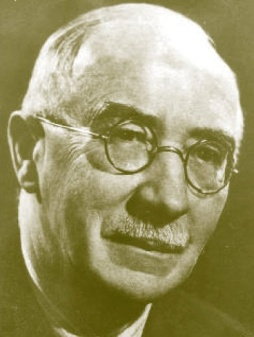Tanulmányait a [fehértemplomi](http://hu.wikipedia.org/wiki/Feh%C3%A9rtemplom) [gimnáziumba](http://hu.wikipedia.org/wiki/Gimn%C3%A1zium)n kezdte, majd műszaki tanulmányait a [bécsi](http://hu.wikipedia.org/wiki/B%C3%A9cs) műegyetemen foly-tatta. A [Budapesti](http://hu.wikipedia.org/wiki/Budapest) [Műegyetemen](http://hu.wikipedia.org/wiki/M%C5%B1egyetem) [gépészmérnöki](http://hu.wikipedia.org/w/index.php?title=G%C3%A9p%C3%A9szm%C3%A9rn%C3%B6k&action=edit&redlink=1) dip-lomát szerzett, ezt követően [Karlsruheban](http://hu.wikipedia.org/wiki/Karlsruhe) elektrotech-nikát tanult. Az I. világháború küszöbén mérnökként a [Ganz Villamossági Rt](http://hu.wikipedia.org/wiki/Ganz_v%C3%A1llalatok).ban helyezkedett el, közben dok-tori oklevelet szerzett, és [1914](http://hu.wikipedia.org/wiki/1914)-től a [műegyetem](http://hu.wikipedia.org/wiki/Budapesti_M%C5%B1szaki_Egyetem) magán-tanára lett. Munkáját az [első világháború](http://hu.wikipedia.org/wiki/Els%C5%91_vil%C3%A1gh%C3%A1bor%C3%BA) szakította meg, a háború végéig katonaként szolgálta a hazát.

A két világháború között igazgatóként irányította a [Villamossági és Mű-szaki Rt](http://hu.wikipedia.org/w/index.php?title=Villamoss%C3%A1gi_%C3%A9s_M%C5%B1szaki_Rt&action=edit&redlink=1). ahol a [transzformátor](http://hu.wikipedia.org/wiki/Transzform%C3%A1tor) gyártást szervezte meg. A [Villamossági és Ipari Rt](http://hu.wikipedia.org/w/index.php?title=Villamoss%C3%A1gi_%C3%A9s_Ipari_Rt&action=edit&redlink=1).ban tervezett transzformátorállomásokat és elosztóhálózatokat közép- és kisfeszültségre. Műszaki irányításával cége részt vett a [Buda-pest-Hegyeshalom vasútvonal](https://hu.wikipedia.org/wiki/Budapest%E2%80%93Hegyeshalom%E2%80%93Rajka-vas%C3%BAtvonal) villamosításában.

[1939](http://hu.wikipedia.org/wiki/1939)-ben nyilvános rendes tanári megbízatásával a *Műegyetem* egyetemi [professzoraként](http://hu.wikipedia.org/wiki/Professzor) a [Villamos gépek és mérések tanszék](http://hu.wikipedia.org/w/index.php?title=Villamos_g%C3%A9pek_%C3%A9s_m%C3%A9r%C3%A9sek_tansz%C3%A9k&action=edit&redlink=1) vezetője lett. A Vil-lamosmérnöki Kar első [dékánjaként](https://hu.wikipedia.org/wiki/D%C3%A9k%C3%A1n_(fels%C5%91oktat%C3%A1s)) megvetette a modern elektrotechnikai oktatás alapjait. A MTA 1951-ben a „műszaki tudományok doktorává” nyilvánította, miközben az Akadémia Erősáramú Villamos Bizottságának elnöki tisztét is betöltötte.

A [Műegyetem](http://hu.wikipedia.org/wiki/M%C5%B1egyetem) 1955-ben aranydiplomával ismerte el munkásságát, majd nyugdíjba vonulásakor [díszdoktorrá](http://hu.wikipedia.org/w/index.php?title=D%C3%ADszdoktor&action=edit&redlink=1) avatta. A [Villamosmérnöki kar](http://hu.wikipedia.org/w/index.php?title=Villamosm%C3%A9rn%C3%B6ki_kar&action=edit&redlink=1) első [dékánjaként](http://hu.wikipedia.org/w/index.php?title=D%C3%A9k%C3%A1n&action=edit&redlink=1) megvetette a modern elektrotechnikai oktatás alapjait. A ma-gyar tudományos élet, az erősáramú elektrotechnika és ipar, a felsőok-tatás és sok-sok tanítványa hálával emlékezik rá.

Tudományos cikkei a szinkron- és [egyenáramú](http://hu.wikipedia.org/wiki/Egyen%C3%A1ram) gépek, valamint a [fék-mágnesek](http://hu.wikipedia.org/w/index.php?title=F%C3%A9km%C3%A1gnes&action=edit&redlink=1) témáját őlelték fel. Jelentős szakirodalmi tevékenysége folytán szerkesztette az *Elektrotechnika* c. lapot, miközben egész élete folyamán az [*Elektrotechnikai Egyesületnek*](http://hu.wikipedia.org/w/index.php?title=Elektrotechnikai_Egyes%C3%BClet&action=edit&redlink=1) egyek fő ihletője és vezetője volt.

Tankönyvei a villamos gépek felépítésének, működésének és a tervezési módszerek alapjainak máig a legjobb hazai összefoglalói. A [jászberényi](https://hu.wikipedia.org/wiki/J%C3%A1szber%C3%A9ny) Erősáramú Szakközépiskola viseli a nevét.

Főbb művei: *Nagyfeszültségű egyenáramú motorok nagyvasúti lokomo-tívokban való alkalmazása (Elektrotechnika, 1913), Villamosgépek vektor-ábrái (1945), Váltakozó áramok elmélete (Retter Gyulával, 1953), Villa-mosgépek (I–V. 1948-60).*

Forrás: *Magyar Életrajzi Lexikon 1000-1990;* Sitkei Gyula: A *magyar elektrotechnika nagy alakjai. (Energetikai Kiadó Kht. 2005)*

Vitéz **Littay** *Lichtenecker * **András** ([Szabadka](http://hu.wikipedia.org/wiki/Szabadka), [1884](http://hu.wikipedia.org/wiki/1884). [augusztus 15.](http://hu.wikipedia.org/wiki/Augusztus_15.) – [Mel-bourne](http://hu.wikipedia.org/wiki/Melbourne), [1967](http://hu.wikipedia.org/wiki/1967). [július 21.](http://hu.wikipedia.org/wiki/J%C3%BAlius_21.)) honvéd vezérezredes.

A [Ludovika Akadémián](http://hu.wikipedia.org/wiki/Magyar_Kir%C3%A1lyi_Honv%C3%A9d_Ludovika_Akad%C3%A9mia) valamint a [bécsi](http://hu.wikipedia.org/wiki/B%C3%A9cs) Kriegsschu-lében végezte tanulmányait. [1905](http://hu.wikipedia.org/wiki/1905)-ben hadnagyi rang-ban a debreceni 3. honvéd gyalogezredhez került.

1910-ben főhadnagyként a bécsi Hadiiskola hallgatója lett. 1914-ben a nagykanizsai 20. honvéd gyalogez-redben vezérkari tiszt. 1915-ben előléptetik századossá.

A fronton megsebesült, gyógyulása után különböző alakulatok vezérkari tisztje. [IV. Károly király](https://hu.wikipedia.org/wiki/IV._K%C3%A1roly_magyar_kir%C3%A1ly) 1918 novemberi lemondását követően az ideiglenes törvényhozói hatalmat gya-korló [Magyar Nemzeti Tanács](https://hu.wikipedia.org/wiki/Magyar_Nemzeti_Tan%C3%A1cs) november 16-án kikiáltotta a köztársaságot. [Linder Béla](https://hu.wikipedia.org/wiki/Linder_B%C3%A9la) az új hadügyminiszter november 8-án, az új magyar hadsereg felállításáról rendelkezett. 

Littay András 1918 decemberétől a Hadügyminisztérium szolgálatába lépett, majd a Tanácsköztársaság idején Hadügyi Népbiztosság vezérkari tiszje. A proletárdiktaúra bukásának napján, 1919. augusztus 1-jétől őr-nagyi rangban az állandó tanulmányi bizottság előadója.

1922. január 1-jétől a HM VI. Főcsoportjának (Vezérkar) VI-6 osztályhoz osztják be, majd [1922](http://hu.wikipedia.org/wiki/1922)-[1926](http://hu.wikipedia.org/wiki/1926) között ezredesi rangban a Hadiakadémia taná-ra, egyben parancsnoka volt. Littay András 1930-31 között a 2. (budapesti) honvéd gyalogezred parancsnoka, majd a 3. (szombathelyi), illetve a 4. (pécsi) vegyesdandár parancsnoka.

1934-ben tábornokká léptették elő, 1935-36 között újfent a Hadiakadémia parancsnoka. A Hadiakadémián bevezette, hogy a felvételi vizsgán meg-felelt fiatal tiszteket akadémiai tanulmányaik megkezdése előtt egy éves csapatszolgálatra idegen hadsereghez vezényelték.

1936. május 1-jétől a HM kiképzési osztályának vezetőjévé, illetve a mis-kolci 7. vegyesdandár parancsnokává nevezték ki. 1937-től altábornagy-ként a miskolci VII. hadtest parancsnokává nevezték ki. Az első bécsi döntéssel 1938. november 2-án a [Trianonban](https://hu.wikipedia.org/wiki/Trianoni_b%C3%A9keszerz%C5%91d%C3%A9s) elcsatolt felvidéki területek juttatott vissza Magyarországnak. Vitéz Littay András vezette a [Kelet-Felvidék felszabadítását](http://hu.wikipedia.org/wiki/Magyar%E2%80%93szlov%C3%A1k_kis_h%C3%A1bor%C3%BA), és a [Kassára](http://hu.wikipedia.org/wiki/Kassa) történő bevonulást.

[1940](http://hu.wikipedia.org/wiki/1940). [március 1](http://hu.wikipedia.org/wiki/M%C3%A1rcius_1.)-jétől a Honvédség vezérkari főnökének helyettese, [szep-temberben](http://hu.wikipedia.org/wiki/Szeptember_1.) pedig gyalogsági tábornokká léptették elő. [1941](http://hu.wikipedia.org/wiki/1941). [februárjában](http://hu.wikipedia.org/wiki/Febru%C3%A1r_14.) a Honvédelmi Minisztérium légügyi főcsoportfőnökévé nevezték ki. [1941](http://hu.wikipedia.org/wiki/1941)-[1943](http://hu.wikipedia.org/wiki/1943) között nyugállományba vonulásáig a honvédelmi miniszter helyet-tese volt. [1944](http://hu.wikipedia.org/wiki/1944)-ben [Németországba](http://hu.wikipedia.org/wiki/Nyugat-N%C3%A9metorsz%C3%A1g) távozott, majd [1950](http://hu.wikipedia.org/wiki/1950)-ben [Ausztráliába](http://hu.wikipedia.org/wiki/Ausztr%C3%A1lia_%28orsz%C3%A1g%29) emigrált. Fő műve: *Az erkölcsi erők szerepe a háborúban.*

Forrás: *Magyarok a II. világháborúban*

**Lovászy Márton** (Zenta, 1864. november 6. - Budapest, 1927. augusztus 21.) politikus, újságíró, miniszter.

A Budapesten elvégzett jogi tanulmányai után, árvaszéki ülnökként Bács-Bodrog vármegye szolgálatába állt, majd a millénium évig Ada főjegyzője volt.

1896-ban Budapestre a *Magyarország* című ellenzéki napilaphoz került, előbb felelős, később főszerkesztői pozícióba. A lap 1910 után az újság Károlyi Mihály poli-tikai szócsöve lett. Lovászy Mártont harcias ellenzéki-sége hamar kiemelte, így 1901-től a magyarkanizsai kerü-letből függetlenségi párti képviselő lett. Ahhoz az úgynevezett „szél-sőbal” csoportosuláshoz tartozott, amely az Ausztriával való viszonyt kizá-rólag a perszonális unió alapjára kívánta helyezni. A lap hasábjain szor-galmazta az ellenzék egyesülését, a «koalició» szükségszerűségét.

A parlamentben uralkodó ellenséges állapotok és a [közvélemény](https://hu.wikipedia.org/wiki/K%C3%B6zv%C3%A9lem%C3%A9ny) végletes polarizálódása miatt [1905](https://hu.wikipedia.org/wiki/1905). [január 3-án](https://hu.wikipedia.org/wiki/Janu%C3%A1r_3.) a király feloszlatta az országgyűlést, és új választásokat írt ki. Ezen az addig harminc éven keresztül verhetetlen [Szabadelvű Párt](https://hu.wikipedia.org/wiki/Szabadelv%C5%B1_P%C3%A1rt) vereséget szenvedett az egyesült ellenzékkel szemben. A koalíció, melynek többségét a [Függetlenségi és Negyvennyolcas Párt](https://hu.wikipedia.org/wiki/F%C3%BCggetlens%C3%A9gi_%C3%A9s_Negyvennyolcas_P%C3%A1rt) adta, az [1848](https://hu.wikipedia.org/wiki/1848)-as célokat kívánta megvalósítani, így önálló magyar hadsereget és külügyminisztériumot kivánt létrehozni. Ez lényegében a [Magyar Király-ság](https://hu.wikipedia.org/wiki/Magyar_Kir%C3%A1lys%C3%A1g) kiválását jelentette volna a dualista államszövetségből. [I. Ferenc József](https://hu.wikipedia.org/wiki/I._Ferenc_J%C3%B3zsef_magyar_kir%C3%A1ly) király a parlamenti többséget nemvéve figyelembe, ideiglenesen báró [Fejérváry Géza](https://hu.wikipedia.org/wiki/Fej%C3%A9rv%C3%A1ry_G%C3%A9za) táborszernagyot nevezte ki miniszterelnökké.

A [szövetkezett ellenzék](https://hu.wikipedia.org/wiki/Sz%C3%B6vetkezett_ellenz%C3%A9k) végül engedett a 48-ból, és a királyhoz lojális [We-kerle Sándort](https://hu.wikipedia.org/wiki/Wekerle_S%C3%A1ndor_(minisztereln%C3%B6k)) támogava megalakíthatta kormányát, a *Magyarország* és benne Lovászy Márton is immáron kormányt támogató lappá vált. Habár az új kormányt az [1906-os választások](https://hu.wikipedia.org/wiki/1906-os_v%C3%A1laszt%C3%A1sok) újfent megerősítették (61,26%) pozíciójában a [második Wekerle-kormányt](https://hu.wikipedia.org/wiki/M%C3%A1sodik_Wekerle-korm%C3%A1ny) a szövetség belső ellentétei annyira meggyengítették, hogy semilyen fontos célkitűzését sem sikerült elérnie. Az önálló [*Magyar Nemzeti Bank*](https://hu.wikipedia.org/wiki/Magyar_Nemzeti_Bank) felállításának kérdése körül kibontakozott vita hatására megkezdődött a koalíció szétesése. A [második Wekerle-kormány](https://hu.wikipedia.org/wiki/M%C3%A1sodik_Wekerle-korm%C3%A1ny) mandátumának lejártával, az [1910-es választásokon](https://hu.wikipedia.org/wiki/1910-es_v%C3%A1laszt%C3%A1sok) ve-reséget szenvedett a [Szabadelvű Párt](https://hu.wikipedia.org/wiki/Szabadelv%C5%B1_P%C3%A1rt) egykori tagjaiból alakult Tisza István vezette [Nemzeti Munkapárt](https://hu.wikipedia.org/wiki/Nemzeti_Munkap%C3%A1rt). A parlamentben azonban tovább folytak az ádáz presztizs csaták, [Tisza István](https://hu.wikipedia.org/wiki/Tisza_Istv%C3%A1n) gróf házelnökként azonban letörte az el-lenzék álltal oly annyira kedvelt, és a tisztelet ház munkáját megbénító [obstrukciót](https://hu.wikipedia.org/wiki/Obstrukci%C3%B3_(politika)). A felajzott ellenzék egyik *Justh-párti* képviselője [Kovács Gyula](https://hu.wikipedia.org/wiki/Kov%C3%A1cs_Gyula_(politikus)) a képviselőházi ülésen háromszor rálőtt Tiszára, de a merénylet-kísérlet sikertelen maradt.

A szarajevói merénylet (1914. [június 28-án](https://hu.wikipedia.org/wiki/J%C3%BAnius_28.) [Ferenc Ferdinánd](https://hu.wikipedia.org/wiki/Habsburg%E2%80%93Lotaringiai_Ferenc_Ferdin%C3%A1nd_f%C5%91herceg) trónörököst egy szerb merénylő meggyilkolta) után egy hónappal 1914. július 28-án az Osztrák–Magyar Monarchia hadat üzent Szerbiának, ezzel kitört a háború. Lovászy Márton az első világháború kitörésekor nyíltan hangoztatta paci-fista-háborúellenes nézeteit, sőt a német szövetség ellen foglalt állást.

A harmadik éve folyó véres és kilátástalan küzdelem, egyre inkább kiáb-rándította a tömegeket, ráadásul az félévszázada uralkodó Ferenc József [1916](https://hu.wikipedia.org/wiki/1916). [november 21-én](https://hu.wikipedia.org/wiki/November_21.) elhunyt. IV. Károlyt [1916](https://hu.wikipedia.org/wiki/1916). [december 30-án](https://hu.wikipedia.org/wiki/December_30.) koro-názták meg [Budapesten](https://hu.wikipedia.org/wiki/Budapest), ő már [1917](https://hu.wikipedia.org/wiki/1917) tavaszán a különbékéről tárgyalt. Az antantnak azonban nem volt érdeke a Monarchia kiválása a háborúból.

[Károlyi Mihály](http://multunk.com/index.php?title=K%C3%A1rolyi_Mih%C3%A1ly_gr%C3%B3f) ekkor létrehozta a nyíltan antant barát Egyesült Független-ségi és 48-as ([Károlyi](http://multunk.com/index.php?title=K%C3%A1rolyi_Mih%C3%A1ly_gr%C3%B3f)) Pártot. A párt a háború előtti állapotbani megegye-zéses béke érdekében lépett fel. IV. Károly trónra lépve egyik első intéz-kedése volt, hogy lemondatta gróf [Tisza István](https://hu.wikipedia.org/wiki/Tisza_Istv%C3%A1n)t, minek következtében kép-viselőházban a Károly-párt képviselői vérszemet kapva élesen bírálták a kormány minden intézkedését. Lovászy Márton ki 1917 őszén lapjában, a *Magyarországban* lelkesen üdvözölte az oroszországi szocialista forra-dalom kitörését, odáig ment provokációjában, hogy a [Károlyit](http://multunk.com/index.php?title=K%C3%A1rolyi_Mih%C3%A1ly_gr%C3%B3f) antantbarát-sággal vádoló [Tisza](http://multunk.com/index.php?title=Tisza_Istv%C3%A1n)-párti képviselőknek odavágta: *„Vegyék tudomásul, mi antantbarátok vagyunk”.* *- Lovászy Márton szónókol az [Országház téren](https://hu.wikipedia.org/w/index.php?title=Orsz%C3%A1gh%C3%A1z_t%C3%A9r&action=edit&redlink=1) -*

Az összeomlás előtt 1918 őszén IV. Károly a nemzetiségeknek adott en-gedményekkel próbálta egyben tartani a monarchiát. Az uralkodó 1918 októ-berében bejelentette, hogy a birodal-mat egyenrangú államok szövetségévé (föderáció) fogja átszervezni.

Azonban ez már illúzió volt, a nemze-tiségek már saját nemzetállamaikban gondolkodtak. A [Károlyi-párt](https://hu.wikipedia.org/w/index.php?title=K%C3%A1rolyi-p%C3%A1rt&action=edit&redlink=1) [1918](https://hu.wikipedia.org/wiki/1918). [október 24-én](https://hu.wikipedia.org/wiki/Okt%C3%B3ber_24.) alakította meg a *Ma-gyar Nemzeti Tanácsot*, a követeléseiket 12 pontban foglalták össze, ezek közül a fontosabbak: általános, egyenlő, és titkos választójog, a parasztok földhöz juttatása, a [területi integritás](https://hu.wikipedia.org/w/index.php?title=Ter%C3%BCleti_integrit%C3%A1s&action=edit&redlink=1) fenntartása, de nem erőszakkal (!), Magyarország teljes függetlensége, a magyarországi katonai egységek ha-zahívása a frontokról, általános [amnesztia](https://hu.wikipedia.org/wiki/Amnesztia) a [politikai elítélteknek](https://hu.wikipedia.org/w/index.php?title=Politikai_el%C3%ADt%C3%A9lt&action=edit&redlink=1) stb.

Lovászy Márton az 1918. októberi *őszirózsás forradalom* idején a Nemzeti Tanács egyik vezető tagja, 1918 októberében ő tűzött először őszirózsát a gomblyukába. A Nemzeti Tanács [október 27-én](https://hu.wikipedia.org/wiki/Okt%C3%B3ber_27.) hatalmas tömeggyűlést tartott az [Országház téren](https://hu.wikipedia.org/w/index.php?title=Orsz%C3%A1gh%C3%A1z_t%C3%A9r&action=edit&redlink=1). A fővárosban elszabadultak az indulatok, [ok-tóber 28-án](https://hu.wikipedia.org/wiki/Okt%C3%B3ber_28.) a Lánchíd pesti hídfőjénél a rendőrök a tömeg közé lőttek.

Közben aláírták a (november 3.) fegyverszüneti okmányt, így a Monarchia befejezte részvételét az I. világháborúban! Átmenetileg kis hiba csúszott a hatalom megragadásának menetrendjébe, [Károlyi Mihály](https://hu.wikipedia.org/wiki/K%C3%A1rolyi_Mih%C3%A1ly_(minisztereln%C3%B6k)) helyett [Hadik János](https://hu.wikipedia.org/wiki/Hadik_J%C3%A1nos)t kapott miniszterelnöki megbízatást. Az új kormány azonban még fel sem állt, az [őszirózsás forradalom](https://hu.wikipedia.org/wiki/%C5%90szir%C3%B3zs%C3%A1s_forradalom) [október 31](https://hu.wikipedia.org/wiki/Okt%C3%B3ber_31.)-én már meg is buktatta. Már előző nap, tehát [október 30-án](https://hu.wikipedia.org/wiki/Okt%C3%B3ber_30.) a [Magyar Nemzeti Tanács](https://hu.wikipedia.org/wiki/Magyar_Nemzeti_Tan%C3%A1cs) utasítására, [Csernyák Imre](https://hu.wikipedia.org/w/index.php?title=Cserny%C3%A1k_Imre&action=edit&redlink=1) repülőszázados vezetésével a Katonatanács egységei elfog-lalták [Budapest](https://hu.wikipedia.org/wiki/Budapest) [stratégiai pontjait](https://hu.wikipedia.org/w/index.php?title=Strat%C3%A9giai_pont&action=edit&redlink=1). Budapesten aznap este a hartérre való indulásra váró menetszázadok fellázadtak és a sapkarózsáik helyére őszi-rózsát tűztek.

[Október 31-én](https://hu.wikipedia.org/wiki/Okt%C3%B3ber_31.) reggel [József főherceg](https://hu.wikipedia.org/wiki/Habsburg_J%C3%B3zsef_magyar_korm%C3%A1nyz%C3%B3) [kormányzó](https://hu.wikipedia.org/wiki/Korm%C3%A1nyz%C3%B3) a király nevében mi-niszterelnöknek nevezte ki [Károlyi Mihályt](https://hu.wikipedia.org/wiki/K%C3%A1rolyi_Mih%C3%A1ly_(minisztereln%C3%B6k)). Károlyi egy úgynevezett „népkormányt” alakított a Magyar Nemzeti Tanács három pártjának képvi-selőiből. A kormány [miniszterelnök](https://hu.wikipedia.org/wiki/Magyarorsz%C3%A1g_korm%C3%A1nyf%C5%91inek_list%C3%A1ja)e és [külügyminiszter](https://hu.wikipedia.org/wiki/Magyarorsz%C3%A1g_k%C3%BCl%C3%BCgyminisztereinek_list%C3%A1ja)e [Károlyi Mihály](https://hu.wikipedia.org/wiki/K%C3%A1rolyi_Mih%C3%A1ly_(minisztereln%C3%B6k)), [belügyminiszter](https://hu.wikipedia.org/wiki/Magyarorsz%C3%A1g_bel%C3%BCgyminisztereinek_list%C3%A1ja)e [Batthyány Tivadar](https://hu.wikipedia.org/wiki/Batthy%C3%A1ny_Tivadar) a [Függetlenségi és Negyvennyolcas Párt](https://hu.wikipedia.org/wiki/F%C3%BCggetlens%C3%A9gi_%C3%A9s_Negyvennyolcas_P%C3%A1rt)ból, [pénzügyminiszter](https://hu.wikipedia.org/wiki/Magyarorsz%C3%A1g_p%C3%A9nz%C3%BCgyminisztereinek_list%C3%A1ja)e [Szende Pál](https://hu.wikipedia.org/wiki/Szende_P%C3%A1l), [igazságügy miniszter](https://hu.wikipedia.org/wiki/Magyarorsz%C3%A1g_igazs%C3%A1g%C3%BCgy-minisztereinek_list%C3%A1ja)e [Berinkey Dénes](https://hu.wikipedia.org/wiki/Berinkey_D%C3%A9nes) mindketten a [Polgári Radikális Párt](https://hu.wikipedia.org/wiki/Polg%C3%A1ri_Radik%C3%A1lis_P%C3%A1rt)ból, míg a [honvédelmi miniszter](https://hu.wikipedia.org/wiki/Magyarorsz%C3%A1g_honv%C3%A9delmi_minisztereinek_list%C3%A1ja) a pártonkívüli [Linder Béla](https://hu.wikipedia.org/wiki/Linder_B%C3%A9la) stb. lett. Lovászy a *Károlyi-kormány* vallás- és közoktatásügyi minisztere lett, mely pozícióját október 31-től december 23-ig töltötte be.

A Károlyi-kormány törvénybe iktatta a sajtó-, az egyesülési és gyülekezési szabadságot, egyben szociális reformokat vezettek be pl: munkanélkülise-gélyt, adóhátralék elengedése, béremelés, végkielégítést adtak a leszerelt kato-náknak stb. [Október 31-én](https://hu.wikipedia.org/wiki/Okt%C3%B3ber_31.), az őszirózsás forradalom utolsó napján, a Károlyiék által feltüzelt katonai különítmény, a minden baj okozójaként a régi rendszer vezetőjeként és a „felesleges” háborút megkezdőjének rá-galmazott gróf [Tisza István](https://hu.wikipedia.org/wiki/Tisza_Istv%C3%A1n)t volt magyar miniszterelnököt meggyilkolták.

Az Osztrák-Magyar Monarchia november 3-án Padovában alá írta a fegy-verszüneti egyezményt. Az egyezmény a felek közötti demarkációs vona-lat, a dualista állam határain jelölte ki. A magyar kormány nevében Linder Béla, november 13-án Belgrádban Louis-Félix Franchet d'Esperey francia tábornok követelésére aláírta azt a megállapodást, amely mélyen a törté-nelmi Magyarország határain belül jelölt ki egy új demarkációs vonalat.

Károlyi kormánya az [antantbarátság](https://hu.wikipedia.org/wiki/Antant)gal és a nemzetiségek egyenjogúsítá-sának politikájával kisérelt meg szembenézni az ország területi veszte-ségeivel. Az [országtól](https://hu.wikipedia.org/wiki/Magyarorsz%C3%A1g) elszakadni akaró nemzetiségek oda sem figyeltek a [Jászi Oszkár](https://hu.wikipedia.org/wiki/J%C3%A1szi_Oszk%C3%A1r) nemzetiségügyi miniszter által felajánlott - „Keleti Svájc” - elképzelésére. A győztes [antanthatalmak](https://hu.wikipedia.org/wiki/Antant) szövetségesei a [szerb](https://hu.wikipedia.org/wiki/Szerbia), a [román](https://hu.wikipedia.org/wiki/Rom%C3%A1nia) illetve a [cseh](https://hu.wikipedia.org/wiki/Csehorsz%C3%A1g)[szlovák](https://hu.wikipedia.org/wiki/Szlov%C3%A1kia) katonai erők, [a belgrádi katonai konvenciót](https://hu.wikipedia.org/wiki/A_belgr%C3%A1di_katonai_konvenci%C3%B3) felrúgva lassan elfoglalták a [Délvidéket](https://hu.wikipedia.org/wiki/D%C3%A9lvid%C3%A9k), [Erdélyt](https://hu.wikipedia.org/wiki/Erd%C3%A9ly), illetve a [Felvidéket](https://hu.wikipedia.org/wiki/Felvid%C3%A9k).

Károlyi a konvenció megsértése miatt ismételten tiltakozott, de az antant jóindulatában és az etnikai határok [Thomas Woodrow Wilson](https://hu.wikipedia.org/wiki/Thomas_Woodrow_Wilson) amerikai elnök által meghirdetett elvében bízva, a határok fegyveres védelmére nem adott utasítást. A kormány önmaga számolta fel az ország mevédésének lehetőségét, rendelettel szüntették meg például a vezérkart, egyben nyug-állományba helyezték az összes tábornokot és ezredest.

1918. november 9-én Linder Bélát *Bartha Albert*  (ki nemsokkal ezelőtt a [Bánáti Köztársaság](https://hu.wikipedia.org/wiki/B%C3%A1n%C3%A1ti_K%C3%B6zt%C3%A1rsas%C3%A1g) (!) fegyveres erejét irányította), váltotta a hadügy-miniszteri poszton. Az új miniszter megkezdte a hadsereg szervezését, megpróbálta fenntartani a bomlófélben lévő fegyelmet, azonban a pacifista demagógitól fegyelmezhetetlen erőkkel lehetetlen volt bármit is kezdeni. A katonatanácsok pedig politikai okokból teljesen elszabotálták intézke-déseit, az 1918. december 12-dikei tüntetésóüket követően, Bartha le-mondott hadügyminiszteri tisztéről.

A Károlyi-párt jobbszárnyának képviselői [Bartha Albert](http://multunk.com/index.php?title=Bartha_Albert), [Batthyány Tiva-dar](http://multunk.com/index.php?title=Batthy%C3%A1ny_Tivadar) és Lovászy Márton leginkább a külpolitikát kifogásolták, ugyanis fo-lyamatban volt az ország területének ellenállás nélküli feladása. 1918 novembere és 1919 januárja között a Szent István-i magyar államterület-nek már majdnem kétharmada idegen megszállás alá került. Mikor Károlyi lemondatta hadügyminiszterét, ekkor [Batthyány](http://multunk.com/index.php?title=Batthy%C3%A1ny_Tivadar) is beadta lemondását.

Lovászy december 23-án lemondott miniszteri tárcájáról, erre a független-ségi párt Lovászyt támogató többsége egy polgári (radikálisok nélküli) kormány létrehozása mellett volt, és őt magát jelölte leendő miniszterel-nöknek. Lovászy 1919. január 1-jén megalakította a *Polgárszövetséget,* programja magába foglalta a területi integritás helyreállítását, január 5-én este megjelent az [Antant](http://www.kislexikon.hu/index.php?f=Antant) budapesti képviselőjéről, Ferdinand Vix francia alezredesnél. [Vixnél](http://multunk.com/index.php?title=Fernand_Vix) a francia katonaság közreműködését kérte, hogy az új polgári kormány harcot indítson a bolsevizmus ellen, [Vix](http://multunk.com/index.php?title=Fernand_Vix) azonban Lová-szy kérését elutasította.

[1919](https://hu.wikipedia.org/wiki/1919). [január 19-én](https://hu.wikipedia.org/wiki/Janu%C3%A1r_19.) [Károlyi Mihály](https://hu.wikipedia.org/wiki/K%C3%A1rolyi_Mih%C3%A1ly_(minisztereln%C3%B6k))t megválasztották köztársasági elnök-nek, mire [Berinkey Dénes](https://hu.wikipedia.org/wiki/Berinkey_D%C3%A9nes) a kormány igazságügyminisztere alakíthatta meg kormányát. A Berinkey-kormányt az (Országos) Polgári Radikális Párt főként radikális szabadkőművesekből állt, fő ideológusuk [Jászi Osz-kár](https://hu.wikipedia.org/wiki/J%C3%A1szi_Oszk%C3%A1r) vezetésével. Lovászy a jobboldali fordulat érdekében a polgárságot ellenállásra szólította fel. Az 1919. január 25-i pártértekezleten Károlyi támogatói kisebbségben maradtak, a Lovászy-féle Függetlenségi Párt tehát a többség, az ellenzékkel kereste a kapcsolatot.

A jobboldali pártok kiket a balodaliak, rájuk jellemző gyűlölködéssel *„feketeblokk”-*nak, demagógnak és reakciósnak tituláltak, megpróbálták a hazafias erőket egy eljövendő választásra összefogni.

1919 március közepére a burjánzó „választási” hangulatban (balodali terror) mindinkább kiszorult az utcákról a [Bethlen](http://multunk.com/index.php?title=Bethlen_Istv%C3%A1n_minisztereln%C3%B6k)-Lovászy-[Heinrich](http://multunk.com/index.php?title=Heinrich_Ferenc)-féle jobbol-dali blokk. A polgári oldal megosztott és cselekvésképtelen lett, Károlyi Mihályban a szocializmus iránt érzett szimpátia meggyőzdéssé változott, Lovászy viszont mindvégig kitartott a polgári demokrácia mel-lett.

1919. március 20-án az [Antant](http://www.kislexikon.hu/index.php?f=Antant) teljesíthetetlen területi követeléseket tartal-mazó felszólítást adott át a Károlyi-kormányzatnak. A Fernand Vix-ről elnevezett jegyzék azt a követelést tartalmazta, hogy a magyar alakulatokat vonják vissza majdnem a Tisza vonaláig, s a kiürítendő terület egy részét a román királyi hadsereg szállja meg. Március 20-án az államelnök ismer-tette az antant ultimátumát a Berinkey-kormány ülésén. „A párizsi béke-konferencia nem ismeri el a wilsoni elveket, ezért új orientációra van szük-ség, bel- és külpolitikában. Koalíciós kabinet többé nem kormányozhat, a termelés rendjét sem tudja biztosítani a rendszer. Menekülést egyedül az nyújthat, ha a szocialisták egyedül veszik át a kormányt, új külpolitikai orientációra nyílik lehetőség.”

A [Berinkey-kormány](https://hu.wikipedia.org/wiki/Berinkey-korm%C3%A1ny) [március 21-én](https://hu.wikipedia.org/wiki/M%C3%A1rcius_21.) a [Vix-jegyzék](https://hu.wikipedia.org/wiki/Vix-jegyz%C3%A9k) hatására mivel azt sem elfogadni sem pedig elutasítani nem tudta, lemondott. A hatalmat átvevő szociáldemokraták, minthogy ők egyedül nem vállalták a kormányzás fele-lősségét, megegyeztek a kommunistákkal a hatalom megosztásáról.

Károlyi a hatalmat önként átadta a „[proletariátus](https://hu.wikipedia.org/wiki/Proletari%C3%A1tus)” pártjainak, majd ezek után visszavonult, és szabad utat engedett a proletárdiktatúra bevezetésé-hez. [Március 21-én](https://hu.wikipedia.org/wiki/M%C3%A1rcius_21.) [Garbai Sándor](https://hu.wikipedia.org/wiki/Garbai_S%C3%A1ndor) szociáldemokrata és Kun Béla kom-munista vezetők kikiáltották a [Tanácsköztársaságot](https://hu.wikipedia.org/wiki/Tan%C3%A1csk%C3%B6zt%C3%A1rsas%C3%A1g). A forradalom első napjaiban a radikális párt, a Lovászy-párt valamint a [Károlyi](http://multunk.com/index.php?title=K%C3%A1rolyi_Mih%C3%A1ly_gr%C3%B3f)-párt vezető-sége feloszlatta saját pártját. Ennek ellenére a tanácshatalom április 19-én a polgári ellenzék köreiben túszok szedését rendelte el. Közel félezer em-bert szállítottak a [Gyűjtőfogházba](http://multunk.com/index.php?title=Budapest), köztük a [Károlyi](http://multunk.com/index.php?title=K%C3%A1rolyi_Mih%C3%A1ly_gr%C3%B3f)-párt jobbszárnyához tartozó néhány volt minisztert, így Lovászy Mártont is.

Habár a társadalom józan többsége eleve elutasította az irreális politikai megoldásokat, a fővárosi szubkultúra eldöntötte az ország sorsát, ez vezet-hetett el a Tanácsköztársaság 133 napjáig. A tanácshatalom összeomlás a nyár közepére bekövetkezett, [július 23-án](https://hu.wikipedia.org/wiki/J%C3%BAlius_23.) Bécsbe érkezett Böhm Vilmos hadügyi népbiztos, ahol megegyezett az antanttal a tanácskormány eltá-volításáról. A dicstelen bukást követően a mérsékelt szociáldemokrata politikusokból álló [Peidl-kormány](https://hu.wikipedia.org/wiki/Peidl-korm%C3%A1ny) vette át a vezetést. Lovászy Márton érdekes módon ugyancsak Bécsnek vette az irányt, miközben az Antant tiszti különítményei megérkeztek Budapestre.

*A* Friedrich-kormány akkor alakult meg, mikor [augusztus 6-án](https://hu.wikipedia.org/wiki/Augusztus_6.), a [*Fehérház Bajtársi Egyesület*](https://hu.wikipedia.org/wiki/Feh%C3%A9rh%C3%A1z_Bajt%C3%A1rsi_Egyes%C3%BClet) ellenforradalmi csoport lemondatta és letartóztatta a [Peidl-kormányt](https://hu.wikipedia.org/wiki/Peidl-korm%C3%A1ny). Vezetőjük [Friedrich István](https://hu.wikipedia.org/wiki/Friedrich_Istv%C3%A1n) [átvette a kormányzást](https://hu.wikipedia.org/wiki/Friedrich-korm%C3%A1ny), csatla-kozásra kérte fel a még mindig nagytekintélyű Lovászy Mártont. Lovászy nem egészen egy hónapon keresztül próbálta, a külügyminiszteri pozíció-ban illegitim kormányát képviselni. Az [antant](https://hu.wikipedia.org/wiki/Antant) és a román megszálló csa-patok nyomására a kormány [1919](https://hu.wikipedia.org/wiki/1919). [november 24](https://hu.wikipedia.org/wiki/November_24.)-én lemondott. Helyét a [Huszár-kormány](https://hu.wikipedia.org/wiki/Husz%C3%A1r-korm%C3%A1ny) vette át. A [Clerk-misszió](https://hu.wikipedia.org/w/index.php?title=Clerk-misszi%C3%B3&action=edit&redlink=1) eredményeként [1919](https://hu.wikipedia.org/wiki/1919). [novem-ber 16-án](https://hu.wikipedia.org/wiki/November_16.), miután a [román](https://hu.wikipedia.org/wiki/Rom%C3%A1nia) hadsereg távozott a kifosztott [Budapestről](https://hu.wikipedia.org/wiki/Budapest), a nemzeti haderő Horthy Miklós vezetésével bevonult a fővárosba.

Lovászy mivel nem értett egyet Horthyék politikájával, Jugoszláviába emigrált, onnét 1920 decemberében a szerb megszállás alatt levő Bara-nyába utazott. Minden alkalmat megragadott, hogy a legélesebben támadja a “Horthy-uralmat”. 1921-ben Garami Ernővel immáron újra Bécsben a fehérterrort leleplező baloldali *Jövő* c. napilapot szerkesztette.

1926-ban azzal a feltétellel térhetett vissza a már megcsonkított Magyar-országra, hogy tartózkodni fog a politikai megnyílvánulásoktól.

Forrás: *Új magyar életrajzi lexikon. Magyar politikai lexikon*

**Lugosi Béla** (Lugos, [1882](https://hu.wikipedia.org/wiki/1882). [október 20.](https://hu.wikipedia.org/wiki/Okt%C3%B3ber_20.) - [Los Angeles](https://hu.wikipedia.org/wiki/Los_Angeles), [1956](https://hu.wikipedia.org/wiki/1956). [augusztus 16.](https://hu.wikipedia.org/wiki/Augusztus_16.)) [színművész](https://hu.wikipedia.org/wiki/Sz%C3%ADn%C3%A9sz).

Blaskó Béla néven született egy bankárcsalád negye-dik gyermekeként. Már 12 esztendős korában elszö-kött otthonról, és a színpadon próbált szerencsét, első közönségsikerét Szabadkán aratta.

1910-ben a *Szegedi Nemzeti Színház* szerződtette, 1913-ban már a fővárosi *Nemzeti Színház* tagja.

Az I. világháború kitörését követően önkéntes szol-gálatra jelentkezett az orosz frontra, ahol megsebe-sült majd kitüntették és leszerelték, ezek után - Olt Arisztid művésznéven - több filmben is szerepet kapott. Blaskó Béla a tanácsköztársaság idején aktív szerepet vállalt a színészek szakszervezetében, ezért a kommün bu-kása után emigrációba kényszerült. Előbb Bécsben majd Németországban élt, ahol újra lehetőséget kapott arra, hogy a filmvásznon szerepeljen. Itt elsősorban Karl May regényeinek filmadaptációiban játszott, azonban a jobb megélhetés reményében hama-rosan elhagyta Európát. 

Blaskó Béla egy kereskedőhajón gépészeként dolgozva jutott el 1920 decemberében New Orleans városába. Innét jutott a bevándorlók megszo-kott helyszínére, a New York közelében fekvő Ellis-szigetre (karantén).

Miután megfelelt az egészségügyi vizsgálatoknak, megkapta a letelepedési engedélyt. Az Amerikai Egyesült Államokban folytathatta pályafutását, ahol saját társulatot alakított emigráns magyar művészekell. Néhány hó-nappal azután, hogy Blaskó – elsőként az Egyesült Államokban – szín-padra vitte Az *ember tragédiáját*, szerepajánlatot kapott a New York-i Broadway-n, *A pipacs* (1922) című darabban. Egy évvel ezután a művész – *A néma parancs* (1923) című filmben – az amerikai mozik közönsége előtt is debütált; ekkor vette fel a Lugosi Béla művésznevet, melyet néhány éven belül az egész világ megismert.Miután színpadra vitte *Az ember tragédiáját*, ajánlatot kapott hogy a Broadway-n, szerepelyen.

1927 nyarán robbant be a csillagok közé, amikor Bram Stoker *Drakula* című rémtörténetében különös hang-hordozásával és félelmet keltő játékával.

Nemsokára a mozik közönsége is (Bela Lugosi mű-vésznéven) Hollywood felfedezte magának Lugosi Bélát: a *Universal Pictures* szerződésével a zsebében 1931-ben a filmvásznon is bemutatkozva évtizedekre meghatározta ***Drakula*** karakterét. A színész robusztus alkatával, mély hangjával és jellegzetes akcentusával valósággal megigézte közönségét. A rémísztő alakításnak köszönve a horror műfajának ünnepelt csillagává vált. Lugosi Béla évről évre kapta hagyományosszerepeit, míg végül 1939-ben kitört a skatulyából, hiszen az isteni Greta Garbo mellett szerepelhetett a *Ninocska* című klasszikusban.

Habár 1949-ben a televízióban is bemutatkozhatott, karrierje hanyatlásnak indult, ugyanis a morfium rabjává vált.

30 éves pályafutása alatt szinte csak horrorfilmekben szerepelt. Ilyenek voltak az első zombi filmként jegyzett [*A fehér zombi*](https://www.mafab.hu/movies/a-feher-zombi-33945.html) (1932), a *[Fantom-hajó](https://www.mafab.hu/movies/the-mystery-of-the-marie-celeste-34005.html) *(1935) vagy a Bud Abbott és Lou Costello találkozik *Frankenstein-nel* (1948).

A háborús sérülések miatt folyamatosan fájdalomcsillapítókon élt, ame-lynek hatására 1956. augusztus 16-án szívrohamban meghalt.

Kaliforniában helyezték örök nyugalomba a legendássá vált *Drakula jel-mezében.* Művészetének elismerése, hogy egyike azon magyaroknak, akik csillagot kaptak a [Hollywoodi hírességek sétányán](https://hu.wikipedia.org/wiki/Hollywood_Walk_of_Fame).

A Városligeti Széchenyi szigeten a Mezőgazdasági Múzeum DK-i sarkán lévő szoborfülkében áll Lugosi Béla mellszobra.

Forrás: *[Magyar színházművészeti lexikon.](http://mek.oszk.hu/02100/02139/html/sz14/253.html) 1994.*

**M**

**Madarász** *Vogel* **Emil** (Nagyszentmiklós, 1884. november 12. - Budapest, 1962. február 18.) költő, író, újságíró.

Tanítóképzőt végzett, a főváros egyik magániskolájá-ban tanított.  Előbb a Szocialista Diákok Egyesületé-nek, majd 1908-tól az MSZDP lett tagja.

A  [Magyarországi Szociáldemokrata Párt](https://hu.wikipedia.org/wiki/Magyarorsz%C3%A1gi_Szoci%C3%A1ldemokrata_P%C3%A1rt) (MSZDP) lap-ja a  *Népszava* közölte első verseit, hol 1910-ig dolgo-zott. Ezután a bulvárhírekre alapozó *Friss Újság* munka-társa volt.

1914-ben főhadnagyként került frontra, a háború végén 1918-ban a gödöllői katonatanács tagjaként a város katonai parancsnoka lett. 1919-ben belépett a KMP-be, fegyveresen vett részt a proletárdikta-túra védelmében, egyebn a *Vörös katona* című lap politikai biztosa volt.

A Tanácsköztársaság bukása után a népbiztosoknak menedékjogot adó Ausztria, ő volt a népbiztosokat (közöttük Kun Béla, Landler Jenő, Ham-burger Jenő, Lukács György, Vágó Béla, Varga Jenő, Pogány József, Rákosi Mátyás stb.,  illetve több orosz, osztrák, román és lengyel szárma-zású szélsőbaloldali aktivista, valamint családtagjai) Ausztriába vivő vonat parancsnoka.

A kormányon lévő osztrák szociáldemokraták előbb a karlsteini várba in-ternálták a népbiztosokat, hogy megvédjék őket az esetleges merénylettől. Itt Prónay Pál és különítménye megpróbálta meggyilkolni őket, ám tervük lelepleződött, és ezután a népbiztosokat a steinhofi elmeklinikára zárták. 

Bécsben bekapcsolódott a *Proletár* című lap munkájába.

1923-tól 1946-ig a Szovjetunióban élt, ott a *Sarló és Kalapács,* valamint az *Új Hang* munkatársa volt. A II. világháború idején Alma Atában az *Irodalmi Alap* vezetője volt. A második világháború végén hazatérve az *Új Szó,* majd a *Népszava* munkatársa lett. Fagyejev, Polevoj, Virta, Szerafi-movics és más szovjet írók munkáit fordította magyarra.

Első versei a század elején a *Népszavában* jelentek meg. „A harmincas években jelennek meg magyarul és oroszul a forradalom eseményeiről és egyszerű hőseiről szóló romantikus ihletésű elbeszélései. Ezek közül is kiemelkedik legerőteljesebb műve, a  *Csihajda *(1934–35).

1945 után öntötte versbe a proletárforradalomra készülő munkások hősi elszántságát (*A dohányszínruhás*). Utolsó nagyobb művében, *A* *kék ház* cí-

mű regényében (1958) mind témában, mind pedig hangvételben a század-eleji naturalista hagyományhoz tér vissza”.

Forrás: *Magyar irodalmi lexikon. 1963-1965*

**Madas** *Muck* **András** ([Újszentes](https://hu.wikipedia.org/wiki/%C3%9Ajszentes), [1917](https://hu.wikipedia.org/wiki/1917). [július 19.](https://hu.wikipedia.org/wiki/J%C3%BAlius_19.) – [Sopron](https://hu.wikipedia.org/wiki/Sopron) [2009](https://hu.wikipedia.org/wiki/2009). [június 30.](https://hu.wikipedia.org/wiki/J%C3%BAnius_30.)) erdőmérnök, agrárpolitikus, agrármérnök, az MTA doktora, címzetes egyetemi tanár, miniszterhelyettes.

1935-ben érettségizett [Sopronban](https://hu.wikipedia.org/wiki/Sopron), majd az agrártudo-mányi egyetemen szerzett mezőgazdasági mérnöki ok-levelet. 1940-ben, a József Nádor Műszaki és Gaz-daságtudományi Egyetem soproni Bánya-, Kohó- és Erdőmérnöki Karán erdőmérnöki oklevelet.

1940-ben a [soproni](https://hu.wikipedia.org/wiki/Sopron) Műegyetem tanársegéde. 1940–1944 között Kárpátalján a bustyaházai erdőigazgatóság építésvezetője, majd a szinevéri erdőhivatal vezetője volt. 1944–1947 között fogoly volt az Urálban.

1947-ben hazatért, a Magyar Állami Erdőgazdaság (MÁLLERD) Köz-ponti Igazgatóság Műszaki Főosztálya beosztott mérnöke lett, majd a Zalaegerszegi Állami Erdőigazgatóság műszaki osztályvezetője. 1948-től a MÁLLERD Központi Igazgatóság műszaki főosztály vezetője.

1949-ben kinevezték az Országos Tervhivatalhoz, az Erdészeti Osztály alapító vezetője 1952-ig, majd a Mezőgazdasági Főosztály helyettes veze-tője 1953-1961-ben, főosztályvezető 1961 és 1972 között; mezőgazdasági és élelmezésügyi miniszterhelyettesként 1972-től 1975-ig dolgozott. 

1954-től az Európai Gazdasági Bizottság Fabizottságának tagja, alelnöke 1969-1974-ben, elnöke 1974-1976-ban volt, a magyar delegáció vezetője 1954 és 1976 között. Az ENSZ Mezőgazdasági és Élelmezésügyi Szerve-zete (FAO) tagja és a magyar delegáció helyettes vezetője 1967-től.

Nevéhez fűződik az 1972. évi VII. Erdészeti Világkongresszuson (Buenos Aires) az erdők hármas funkciójának megfogalmazása és világrangra eme-lése. A mezőgazdasági (erdészeti) tudományok kandidátusa 1961-ben, doktora 1971-ben lett.

1940-től, 69 (!) éven keresztül volt tagja az Országos Erdészeti Egyesü-letnek, 1956-1979 között, 23 évig az OEE elnöke. Az Egyesület felvi-rágoztatásáért 1980-ban Bedő Albert emlékéremmel tüntették ki. 1985-től tiszteletbeli tagja az Egyesületnek, eddig egyedüliként megkapta a Tisz-teletbeli Örökös Elnök címet. A Széchenyi-díj kitüntetettje, az Országos Erdészeti Egyesület elnöke 1956-1979 között, az Egyesület tiszteletbeli tagja, örökös tiszteletbeli elnöke. Vasokleveles, Bedő-díjas erdőmérnök,

Főbb munkái: *A világ fafogyasztása, trendek és prognózisok (1974), Er-dészeti politika (1978), Ésszerű környezetgazdálkodás a mezőgazda-ságban (1985), Erdészeti politika a piacgazdaság viszonyai között (1999).*

Forrás: *Erdész panteon*

**Maderspach Károly** (Oravicabánya, 1791. augusztus 3. - Ruszkabánya, 1849. augusztus 23.) kohómérnök, Maderspach Ferenc honvéd alezredes bátyja.

Felsőfokú tanulmányait a Selmecbányán végezte, majd Oravicán vegyészként kezdett dolgozni. Maderspach Ká-roly a Hoffmann Testvérek ruszkabányai Bánya- és Vasmű Társulat társtulajdonosa lett, ahol érdeklődni kezdett a vas-hidak gyártása iránt. A helyi [márvány](https://hu.wikipedia.org/wiki/M%C3%A1rv%C3%A1ny)t kutatva jutott oda a hires szobrász Ferenczy István, ki úgy tűnik a nagyasszony-ról (Buchwald Franciskáról) szobrot készített.

Maderspach Károlyt elképzeléseiben nagy segítséget kapott feleségétől Buchwald Franciskától, kinek anyagi támogatásával építtette meg első műtárgyát a lugosi vashidat. Hamarosan megépült a második hídja is a Cserna folyó fölött Herkulesfürdőnnél, Mehádia községben.

Legsikeresebb alkotása a Karánsebesi Temes felett átívelő vashídja volt legsikeresebb alkotása. A Maderspach-féle *íven függő vonórudas vashíd* nemzetközi viszonylatban is jelentős találmánya volt. Maderspach Károly lelkesen képviselte a magyar ügyet, így az 1848-as szabadságharc keztetén kitűzte a nemzetiszínű lobogót vasgyárának tetejére. Széchenyi naplója szerint Maderspach Károly így vélekedett a magyarságáról *"Igen, a ma-gyar nyelv* *használata, az tesz magyarrá…"* A szabadságharc idején vas-gyára lövegekkel és ágyúgolyókkal látta el a honvéd sereget.

Maderspach Károly és felesége a vereség után is kitartott a nemzet ügye mellett. A temesvári csatavesztés után 1849 augusztusában, a menekü-lésben segítették Bem Józsefet, Kmety Györgyöt és másokat is.

A császári csapatok 1849. augusztusában bevonultak Ruszkabányára, és koholt vád alapján - Haynau parancsára - Buchwald Franciskát elfogatták, és a falu főterén nyilvánosan megvesszőztették. Maderspach Károly nem tudta elviselni a gyalázatot, öngyilkos lett.

Itt Maderspach Károly öngyilkosságának színhelyén, Ruszkabányán, a Mozsár he-gyen, 1909. október 10-én emlékművet emeltettek gyermekei, és ünnepség kereté-ben felállították édesanyjuknak erre az ün-nepségre újraöntött bronz mellszobrát.

A mellszobor a későbbiekben eltűnt, és az emlékművet is áthelyezték, de a talapzata még ma is látható Ruszka-bányán. Buchwald Franciskáról nevezték el Budapest XI. kerületében a  *Maderspach Károlyné utcát*. Forrás: *Magyar Életrajzi Lexikon 1000-1990;* Vajda Pál: *Nagy magyar feltalálók (1958).*

Vitéz **Magyarosy** *Merkovits* **Sándor** (Óbecse, 1891. október 13. – Cle-veland, 1972. augusztus 17.) honvéd vezérezredes.

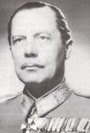[1921](https://hu.wikipedia.org/wiki/1921)-[1926](https://hu.wikipedia.org/wiki/1926) között Magyarország Kormányzója Katonai Irodájának beosztottja. [1932](https://hu.wikipedia.org/wiki/1932)-[34](https://hu.wikipedia.org/wiki/1934)-ig az I. vegyesdandár helyettes vezérkari főnöke volt, majd [1936](https://hu.wikipedia.org/wiki/1936)-tól tényleges vezérkari főnöke lett. [1938](https://hu.wikipedia.org/wiki/1938)-[1940](https://hu.wikipedia.org/wiki/1940) között a 2. határvadász dandár parancsnoka, [1940](https://hu.wikipedia.org/wiki/1940)-ben a Vezérkar Főnök Kikép-zési csoportfőnöke, egyúttal országos levente parancsnok.

A légierők parancsnoki posztján 1941 nyarán váltotta Kenese Waldemár altábornagyot. Magyarosy Sándor a Honvédelmi Minisztérium légügyi főcsoportfőnöke 1941. október 01-től 1943. augusztus 01-ig, míg a Légierő parancsnoka illetve légügyi főcso-portfőnöke 1943. augusztus 01-től 1944. augusztus 01-ig.

Mikor 1939. szeptember 1-jén Németország megtámadta Lengyelországot, Magyarország semleges maradt. Szeptember közepétől a lengyel hadsereg vereségét követően egyre nagyobb számban érkeztek lengyel repülőgépek külföldre, elsősorban a Romániába repültek. Magyarországra három gép szállt le, ezek pilótáit a hagyományos lengyel-magyar barátság szellemé-ben Franciaországba juttatták, míg a gépek a Magyar Királyi Légierőhöz kerültek. A Romániába repült gépek a román légierőt erősítették, ez azért volt fontos mert a levegőben lógott egy magyar-román háború lehetősége.

A magyar hadi eszközök gyártása és beszerzése nemrég még tiltó listán (trianon) szerepeltek. A románok viszont a “kisantant” részeként jelentős, és viszonylag korszerű haderővel rendelkeztek, különösen a repülők és a páncélos járművek terén volt nyomasztó a fölényük! A németek az 1940-es esztendőben már a Szovjetúnió elleni háborúra gondolva, semmiképpen nem engedthették meg a román-magyar viszony elmérgesedését, így az eggyik félnek sem szállítottak hadi eszközöket!

A magyar páncélos erő lényegében ekkor még nem létezett, a magyar légierő 1940 nyarán kizárólag olasz gyártmányú vadász- és bombázó századokkal rendelkezett; FIAT CR-32, CR-42-es vadász- és Caproni Ca-310-es könnyű, Caproni Ca135 bis, a közepes bombázókkal. Ezeket erő-sítette a németek álltal már nem használt, de még igen hatékony Junkers Ju-86 K-2 típusú nehézbonbázó repülőgép. A németek álltal kikény-szerített második bécsi döntés, 1940. augusztus 30-án megoldotta a területi vitát, [Észak-Erdélyt](https://hu.wikipedia.org/wiki/%C3%89szak-Erd%C3%A9ly)  Magyarországnak juttatta.

A Magyar Királyi Honvéd Légierő és a légoltalom, háborús bevetésére mé-gis hamarosan sor került. Ugyanis a német-jugoszláv barátsági szerződést, a délszláv államban történő angolbarát fordulat során a Jugoszláv Király-ság új kormánya, egyoldalúan felbontotta.

A német bosszú nem maradt el, a magyar állam területét felvonulásukra igénybe akarták venni, némi területi kárpótlással ezt meghálálva. A széteső délszláv hadsereg csak szimboikus ellenállást tanúsított, mégis légiereje 1941 áprilisában Szegedet, Pécset, stb. támadta. A magyar légvédelem több támadó jugoszláv repülőgépet lelőtt, miközben maga is támadta a ju-goszláv katonai célpontokat.

Magyarosy Sándor és a honi légierő előtt hamarosan a lehető legnagyobb események tornyosultak, Magyarország belekeveredett a világháborúba. 1941. június 22-én Németország hadüzenet nélkül megtámadták a Szov-jetuniót, ekkor a reggeli órákban a Magyar Légierők Parancsnoksága ké-szültséget rendelt el. Június 25-én azonosíthatatlan gépek többször bere-pültek Magyarország légterébe. 26-án, déli 12 órakor a Rahó-Budapest között közlekedő gyorsvonatot szovjet vadászgéppek alacsonytámadással géppuskázták, majd 13 órakor három, felségjelzés nélküli bombázógép bombákat dobott Kassára. Miután a bombatámadásba többtucatnyian meg-haltak, a magyar kormány hadbaállónak nyílvánította az országot.

Ezt követően a németek gyors harci sikereinek következtében megszűntek a további bombázások, 1942 nyaráig nem repültek be ellenséges gépek az ország légterébe. “1944. március 19-én, röviddel pirkadat után Ju 52 szál-lítórepülőgépeikkel az 500. SS-ejtőernyős-zászlóalj leszállt a ferihegyi re-pülőtéren, Magyarországot megszállták a németek”!

Ezek után az ország ipari-közlekedési csomópontjait folyamatosan bom-

bázni kezdte az angol-amerikai légierő. 1944. április 3-án a fővárosi repü-lőgépgyárakat támadták, közülük is a [szigetszentmiklós](https://hu.wikipedia.org/wiki/Szigetszentmikl%C3%B3s)i Dunai Repülő-gépgyár Rt.-t érte a legnagyobb csapás. Az amerikai kötelékekkel szem-ben, csak egy erős vadászrepülő-osztály tudott ellenállni. Igy jött létre a 101. hadrendi számmal ellátott Heppes Aladár őrnagy parancsnoksága alatt. 1944. szeptember 30- és 1945. március 30. között összesen 66 beve-tést hajtottak végre, és 129 nyilvántartott légi győzelmet arattak.

1944. június 2. Debrecen, Szolnok, Szeged, Miskolc, Nagyvárad, Kolozs-vár stb. vasútállomásait szőnyegbombázták az amerikaiak. A legnagyobb személyi és anyagi veszteségek Debrecenben -1900 fő és Miskolcon -626 fő voltak.

Magyarosy Sándor [1944](https://hu.wikipedia.org/wiki/1944) közepén nyugdíjba ment, majd az 1944. október 19-iki [nyilas puccsot](https://hu.wikipedia.org/wiki/Nyilas_puccs) követően újra szolgálatba állt, ekkor vezérezredessé léptették elő. Feketehalmy-Czeydner vezérezredes novemberében a ma-gyar kormány nevében írásbeli megállapodást kötött a német kormánnyal. miszerint a magyar kormány a már kiürített és még birtokában lévő terü-letek férfi lakosságából új felállítások céljaira Németországba küldi, a 21-33 éves, tényleges katonai szolgálatra kötelezett ifjakat.

A 24-35 éves, katonailag ki nem képzetteket csapatfelállítások céljaira, 100 000 fő 34 éven felüli férfit segédszolgálat céljaira, a 18-23 éveseket kiegészítésként csapatcélokra, a 15-17 éves serdülőket, kik a „Hitlerju-gend”-del együtt, velük azonos kiképzést és alkalmazás kapnak, míg a legfiatalabb 15 évesek pedig „világnézeti” oktatásban részesülnek. Az így kikerült, csapatszolgálatra alkalmas emberanyagból 4 magyar honvéd had-osztály és 4 magyar SS-hadosztály állítódik fel.

A kihelyezés kormánybiztosává vitéz Magyarossy Sándor  vezérezredes 

lett kijelölve. Az ő feladata volt a kihelyezést irányítani mind katonai, mind polgári vonalon. Az „Allgemeines Heeres-Amt”-tal (AHA) kívánság volt, hogy a magyar honvéd tegyen „hűségfogadalmat” Hitler Adolfra.

Magyarossy Sándor [1945](https://hu.wikipedia.org/wiki/1945). [január 28-áig](https://hu.wikipedia.org/wiki/Janu%C3%A1r_28.) a németországi magyar kormány-biztos lett, majd ezt követően a háború végéig „vezetői tartalék”. A szov-jetek elől [Németországba](https://hu.wikipedia.org/wiki/N%C3%A9metorsz%C3%A1g) ment, de amerikai fogságba esett, akik kiadták Magyarországnak. [1945](https://hu.wikipedia.org/wiki/1945) nyarán lefokozták és kizárták a honvédségből, a népbíróság azonban felmentette. Ennek ellenére Kistarcsára internálták, majd az újabb tárgyaláson 2 évre ítélték. 1948-ban szabadulva Argentínába emigrált, később az [Amerikai Egyesült Államokba](https://hu.wikipedia.org/wiki/Amerikai_Egyes%C3%BClt_%C3%81llamok) telepedett le.

Forrás: *Magyarok a II. világháborúban*. *[Magyarország a második világ-háborúban Lexikon A-ZS](https://www.arcanum.hu/hu/online-kiadvanyok/Lexikonok-magyarorszag-a-masodik-vilaghaboruban-lexikon-a-zs-F062E/).*

**Majsai Mór** (János P.) OFM (Péterréve, 1891. október 25. - Budapest, 1987. január 23.) ferences szerzetes.

A teológiát Budapesten végezte miközben a Kapisztrán Szent Jánosról ne-vezett ferences rend tagja volt. Miután 1915-ben pappá szentelték Mária-radnán és Budapesten szolgállt, majd a szolnoki és végül 1927-től a buda-pesti rendházban élt. Rendje magyarországi megbízottjaként hétszer járt Palesztínában, innen hozta magával a *Magyar Szentföld* (Szentföldi Mú-zeum) alapításának gondolatát. A *palesztinai Szentföld* ferences intéz-ményeinek ismertetésére, havi lapot adott ki, *Magyar Szentföld* címmel.

Az OFM (Ferences rend) kezdeményezésére 1936 augusztusában a szent-földi biztosi hivatal villát vásárolt a budapesti Hűvösvölgyben. A Heinrich István-féle alapítvány telkét és épületeit vették meg, annak feladatával együtt um. 15 árva gyermek elhelyezése és nevelése.

Az egyik épületben múzeumot rendezett be szentföldről hozott leletanyag-gal, mellette kis nyomdát is létesített. A kápolnává átalakított épület búcsú-járó helyévé lett a budapesti és a környékbeli híveknek. A hűvösvölgyi építkezés a tervek szerint 1949 karácsonyára be is fejeződött volna, de a Mindszenty-per miatt a terv meghiúsult.

1942-ben a Szentföld 22 kegyhelyének művészi, hű másolatát tervezte kialakítani egy ovális alakú kupolás templom oldalfalai mentén. 1951-ig a templom oldalfalai és kilenc kegykápolna lett készen. 1951 nyarán azon-ban abba kellett hagynia az építkezést.

1951. május első hetében az Államvédelmi Hatóság emberei szállták meg az épületeket, letartóztatták az atyákat. Majsai Mór atya sem úszhatta meg koncepciós per nélkül, 1951. tízévi szabadságvesztésre ítélték, három tár-sát pedig négy év hat hónaptól nyolc évig terjedő börtönbüntetéssel sújtot-ták. Szabadulása után Pasaréten kapott beosztást. Az örökmozgó atya itt fogott hozzá a *mariológia* (a teológiának Szűz Máriával foglalkozó ága) tanulmányozásához, nemzetközi hírű professzor lett, de útlevelet csak 1971-ben, a zágrábi mariológiai kongresszusra kapott. Évtizedeken át volt a magyarorsági megbízottja a *palesztinai Szentföld* ferences intézmé-nyeinek (Commissarius Terrae Sanctae).

Az utolsó éveiben írta a magyar Mária- tiszteletről szóló, történelmi távlatú művét: *Boldogasszony Anyánk* (Bp., 1982). Művei: *Biztatások a szebb világba.* 1926. - *P. Szt Antal missziós naptára.* 1935. - *Reggeli virágszedés azoknak, akik még maguk is fakadó rügyek.* Franciából fordított; Hainiss Elemérné. 1935. - *Szentföldi Múzeumunk kalauza.* Szabados Anzelmmel.

A „Magyar Szent-föld” egy ellipszis alakú templom köré épített 21 kápolnában mutatta volna be Jé-zus földi életének főbb helyszíneit. Mór atya a megvalósítás érdekében mozgal-mat indított és a be-folyt adományokból el is kezdte az építkezést, amely még a háború alatt, sőt az azt követő években is folytatódott. A templom mellé kolostor és múzeum is épült.

A Magyar Szentföld-templom sorsa azonban meg volt pecsételve. A temp-lom építési munkáit 1949-ben leállíttatták, a tetőszerkezet már elkészült részeit is visszabontatták. 1951-ben az Államvédelmi Hatóság az ott élő szerzeteseket letartóztatta, az épületekre pedig lakat került.

A monumentális épület ma csonkként áll, évtizedekig levéltárként hasz-nálták, 2013 óta ismét a ferencesek tulajdona. Egyszer talán mégis meg-valósulhat Majsai Mór álma.

Forrás: *[Magyar Életrajzi Lexikon 1000-1990](https://www.google.rs/url?sa=t&rct=j&q=&esrc=s&source=web&cd=1&cad=rja&uact=8&ved=0ahUKEwjWx5mzp57cAhUNyKQKHWagAh8QFggpMAA&url=http%3A%2F%2Fmek.oszk.hu%2F00300%2F00355%2Fhtml%2FABC09006%2F09619.htm&usg=AOvVaw0l7wV8kNvqHx0-3DRVHT6K). [Magyar Katolikus Lexikon](http://lexikon.katolikus.hu/K/Kov%C3%A1cs.html)*

**Maly Tivadar,** *Theodore Maly* (Temesvár 1894 - 1938. szeptember 20.) világhírű [szovjet ](https://en-m-wikipedia-org.translate.goog/wiki/Soviet_Union?_x_tr_sl=en&_x_tr_tl=hu&_x_tr_hl=hu&_x_tr_pto=ajax,sc,elem,se)[hírszerző tiszt](https://en-m-wikipedia-org.translate.goog/wiki/Intelligence_officer?_x_tr_sl=en&_x_tr_tl=hu&_x_tr_hl=hu&_x_tr_pto=ajax,sc,elem,se).

Középosztálybeli családban született, édesapja pénzügy-minisztériumi tisztviselő volt. Állítólag szerzetes szere-tett volna lenni, ezért teológiát és filozófiát tanult. 1915 decemberében érettségizett, ekkor a katonai akadémiára jelentkezett.

Az [első világháború](https://en-m-wikipedia-org.translate.goog/wiki/World_War_I?_x_tr_sl=en&_x_tr_tl=hu&_x_tr_hl=hu&_x_tr_pto=ajax,sc,elem,se) kitörésekor bevonult az [Osztrák-Magyar Hadseregbe](https://en-m-wikipedia-org.translate.goog/wiki/Austro-Hungarian_Army?_x_tr_sl=en&_x_tr_tl=hu&_x_tr_hl=hu&_x_tr_pto=ajax,sc,elem,se). A háború alatt segédplébános volt, éppen pappá szentelték, mikor a Kárpátokban orosz fog-ságba esett. Egyik fogolytáborból a másikba került, hol igencsak mostoha körülmények között tartották a hadifoglyokat, hiszen az orosz lakósság is éhezett. A hadifogolytábor viszontagságai megingadták az istenbe vetett hitét, és amikor kitört a forradalom, csatlakozott a bolsevikokhoz.  1918-

ban önkéntesként beállt a Vörös hadseregbe, majd 1920-ban belépett az [Orosz Kommunista (bolsevik) Pártba](https://en-m-wikipedia-org.translate.goog/wiki/Communist_Party_of_the_Soviet_Union?_x_tr_sl=en&_x_tr_tl=hu&_x_tr_hl=hu&_x_tr_pto=ajax,sc,elem,se). Teljesen szakított a múltal, már nem volt sem magyar, sem keresztény, kommunista lett, és mindig is az maradt. 

A szovjetek felismerték Maly sokoldalú képességeit, igen hamar a szovjet titkosrendőrség, a Cseka (Összoroszországi Rendkívüli Bizottság) állo-mányába került. A szervezet (Cseka, GPU, OGPU) Felix Dzerzsinszkij irányítása alatt félelmetesen hatékony és egyben kegyetlen szervezetté alakult, mely méltán tekinthette magát a bolsevik rendszer védőbástyájá-nak. Vjacseszláv [Menzsinszkij](https://hu.wikipedia.org/w/index.php?title=Vjacseszlav_Rudolfovics_Menzsinszkij&action=edit&redlink=1), majd halála után [Genrih Jagoda](https://hu.wikipedia.org/wiki/Genrih_Grigorjevics_Jagoda) az im-máron NKVD-nek átkeresztelt céget, világméretű hálózattá kívánták fej-leszteni. Itt találta meg igazi helyét a több nyelven beszélő, európer maní-rokkal rendelkező Maly Tivadar.

1932-ben felvette Paul Hardt, egy közép-európai értelmiség személyét, (másik identitás, amelyet Angliában használt, Mr. Peters osztrák volt, aki egy kolostorból elszökve lett az orosz lovasság kapitánya) [Angliába](https://en-m-wikipedia-org.translate.goog/wiki/England?_x_tr_sl=en&_x_tr_tl=hu&_x_tr_hl=hu&_x_tr_pto=ajax,sc,elem,se) uta-zott,  hogy beépítse a brit  [külügyminisztérium](https://en-m-wikipedia-org.translate.goog/wiki/Foreign_Office?_x_tr_sl=en&_x_tr_tl=hu&_x_tr_hl=hu&_x_tr_pto=ajax,sc,elem,se)ban  dolgozó [John Herbert Kinget](https://en-m-wikipedia-org.translate.goog/wiki/John_Herbert_King?_x_tr_sl=en&_x_tr_tl=hu&_x_tr_hl=hu&_x_tr_pto=ajax,sc,elem,se) és [Ernest Holloway Oldhamet](https://en-m-wikipedia-org.translate.goog/wiki/Ernest_Holloway_Oldham?_x_tr_sl=en&_x_tr_tl=hu&_x_tr_hl=hu&_x_tr_pto=ajax,sc,elem,se). Londonban ezeknél sokkal fajsú-lyosabb „halak” kerültek kémhálójába, mégpedig az elhíresült Cambridge-i Ötök. A Cambridge-i Ötök (Cambridge Five)  név szerint; [Kim Phil-by](https://hu.wikipedia.org/wiki/Kim_Philby) fedőneve: „Stan-ley”; [Donald Duart Maclean](https://hu.wikipedia.org/w/index.php?title=Donald_Maclean&action=edit&redlink=1) fedőneve „Homer”, [Guy Burgess](https://hu.wikipedia.org/w/index.php?title=Guy_Burgess&action=edit&redlink=1) fedőneve „Hicks, [Anthony Blunt](https://hu.wikipedia.org/w/index.php?title=Anthony_Blunt&action=edit&redlink=1) fedőneve „Johnson”, és [John Cairncross](https://hu.wikipedia.org/w/index.php?title=John_Cairncross&action=edit&redlink=1) fedőneve „Apostol”, 1934 körül a [Cambridge-i Egyetem](https://hu.wikipedia.org/wiki/Cambridge-i_Egyetem) Tri-nity College-ában végeztek és akkoriban [ideológiai](https://hu.wikipedia.org/wiki/Ideol%C3%B3gia) alapon, azaz az egye-temen kialakult [kommunista](https://hu.wikipedia.org/wiki/Kommunizmus) meggyőződésük következtében együttműkö-dést vállaltak a szovjet hírszerzéssel.

Maly csak közvetve irányította a Cambridge-i fiúkat, fő közvetítőjének be-szervezte [Arthur Wynn-t](https://en-m-wikipedia-org.translate.goog/wiki/Arthur_Wynn?_x_tr_sl=en&_x_tr_tl=hu&_x_tr_hl=hu&_x_tr_pto=ajax,sc,elem,se), a már jól működő oxfordi kémháló alapítóját is. Összekötőjének a bécsi-zsidó születésű elkötelezett kommunista fotómű-vésznőt, [Edith Tudor-Hart-ot (Suschitzky) alkalmazta.](https://en-m-wikipedia-org.translate.goog/wiki/Edith_Tudor-Hart?_x_tr_sl=en&_x_tr_tl=hu&_x_tr_hl=hu&_x_tr_pto=ajax,sc,elem,se)

Angliában kapcsolatban állt az ír [Brian Goold-Verschoyle-val,](https://en-m-wikipedia-org.translate.goog/wiki/Brian_Goold-Verschoyle?_x_tr_sl=en&_x_tr_tl=hu&_x_tr_hl=hu&_x_tr_pto=ajax,sc,elem,se) aki a kül-ügyminisztériumtól [John Herbert King](https://en-m-wikipedia-org.translate.goog/wiki/John_Herbert_King?_x_tr_sl=en&_x_tr_tl=hu&_x_tr_hl=hu&_x_tr_pto=ajax,sc,elem,se) által átadott dokumentumokat jut-

[tatott el Malynak](https://en-m-wikipedia-org.translate.goog/wiki/Brian_Goold-Verschoyle?_x_tr_sl=en&_x_tr_tl=hu&_x_tr_hl=hu&_x_tr_pto=ajax,sc,elem,se). 1937-ben kirobbant a Woolwich Arsenal kémügy, mikor letartóztatták Percy Eded Glading-et, [Nagy-Britannia Kommunista Párt-jának](https://en-m-wikipedia-org.translate.goog/wiki/Communist_Party_of_Great_Britain?_x_tr_sl=en&_x_tr_tl=hu&_x_tr_hl=hu&_x_tr_pto=ajax,sc,elem,se) (CPGB) társalapítóját. 

A neves szakszervezeti aktivista Nagy-Britannia ellen és a [Szovjetunió](https://en-m-wikipedia-org.translate.goog/wiki/Soviet_Union?_x_tr_sl=en&_x_tr_tl=hu&_x_tr_hl=hu&_x_tr_pto=ajax,sc,elem,se) részére való kémkedés  vádjával elítélték és bebörtönözték. Maly Tódor érezte, hogy a kémje vallhat, így Paul Hardt esettleg Mr. Peters gyorsan reagált, és hamis útlevéllel elhagyta Angliát.

1937 júniusban Maly utasítást kapott [Moszkvától](https://en-m-wikipedia-org.translate.goog/wiki/Moscow?_x_tr_sl=en&_x_tr_tl=hu&_x_tr_hl=hu&_x_tr_pto=ajax,sc,elem,se) a visszatérésre, habár tudta, hogy az akkori moszkvai légkör különösen veszélyessé tette hely-zetét. A  [Joszif Visszarionovics Sztálin](https://hu.wikipedia.org/wiki/Joszif_Visszarionovics_Szt%C3%A1lin) által kezdeményezett nagy tiszto-gatás, újabb és egyben legintenzívebb időszaka az 1937-1938-as években zajlott le. Ez az úgynevezett Jezsovscsina tartja, amely az [NKVD](https://hu.wikipedia.org/wiki/NKVD) korabeli vezetőjéről, [Nyikolaj Jezsovról](https://hu.wikipedia.org/wiki/Nyikolaj_Ivanovics_Jezsov) kapta nevét.

A tisztogatás a bolsevik pártnak a Sztálintól nem kedvelt [kommunista párt](https://hu.wikipedia.org/wiki/SZKP)vezetőktől való megtisztítására irányult. Amikor a [sztálini](https://en-m-wikipedia-org.translate.goog/wiki/Stalinist?_x_tr_sl=en&_x_tr_tl=hu&_x_tr_hl=hu&_x_tr_pto=ajax,sc,elem,se) terror elha-talmasodott, a külföldön dolgozó szovjet hírszerzők sokasága a gyanúsítás elsődleges célpontjává vált, és visszarendelték őket a Szovjetunióba.

Volt aki ezt megtagadta, mit a svájcban működő mesterkém Ignace Reiss, őt rövid úton eltették láb alól. Két másik nagyágyúnak, Walter Krivitsky-nek és Alekszandr Orlovnak  sikerült egér utat nyerniük, és később fel-becsülhetettlen szolgálatott tettek a kémtársaik lebuktatásánál.

Maly a baljós jelek ellenére visszatért Moszkvába, átmenetileg megnyu-godhatott, hiszen a hirhedt terrorközpontban (NKVD központ) a [Lubj-ankában](https://en-m-wikipedia-org.translate.goog/wiki/Lubyanka_(KGB)?_x_tr_sl=en&_x_tr_tl=hu&_x_tr_hl=hu&_x_tr_pto=ajax,sc,elem,se) dolgozhatott.  Maly még 1938. május 23-án ott dolgozott, majd nyoma veszett.  Kihallgatása alatt, az ilyen ügyekben tapasztalt Maly ter-mészetesen bevallott mindent, még azt is hogy [német](https://en-m-wikipedia-org.translate.goog/wiki/Germans?_x_tr_sl=en&_x_tr_tl=hu&_x_tr_hl=hu&_x_tr_pto=ajax,sc,elem,se) ügynök. 

1938. szeptember 20-án a törvényszék Malyt  halálra ítélte, és nem sokkal később kivégezték. A [szovjet kormány](https://en-m-wikipedia-org.translate.goog/wiki/Soviet_government?_x_tr_sl=en&_x_tr_tl=hu&_x_tr_hl=hu&_x_tr_pto=ajax,sc,elem,se) 1956. április 14-én rehabilitálta Maly Tódort. 

Források: Christopher Andrew*. "A birodalom védelme Az MI5 enge-délyezett története". (2009). *William E. Duff. *[A kémek ideje: Theodore Stephanovich Mally és a nagy illegálisok korszaka](https://translate.google.com/website?sl=en&tl=hu&ajax=1&prev=search&elem=1&se=1&u=https://archive.org/details/timeforspiestheo00duff) (1999).* 

**Manno Miltiades** (Pancsova, 1880. március 3. - Budapest, 1935. február 16.)  grafikus és szobrászművész, sportember.

A pancsovai gazdag kereskedő görög diaszpórában szü-letett, fivére Leonidas szintén neves sportember volt.

Már középiskolásként magával ragadta az akkoriban ki-bontakozott sportmánia. Szinte mindent kipróbált és lé-nyegében mindenben sikerei voltak.

Az [1893](https://hu.wikipedia.org/wiki/1893)-ban alakult Magyar Úszó Egyesület (MÚE) tagjaként vett részt országos versenyeken. Első sportsi-kerét kerékpáron aratta, az 1898-ban megrendezett Sió-fok - Budapest közötti kerékpár versenyt meggyőző fölénnyel nyerte meg.

Röviddel ezt követően már futóbajnok, de hamarosan elragadta "fociláz", labdarugó lett. Az ország első futballcsapatában a Budapesti Torna Club-ban (BTC), golkirály és a foci első sztárja. A piros-fehér-fekete csapat 1901-ben megnyerte a legelső magyar bajnokságot (100%-os teljesítmény-nyel). A következő idényben duplázott, 1901-ben 17 gólt lőtt 6 mérkő-zésen, ami azóta is megdöntetlen rekord. Kétszeres golkirályként helyet kapott az első, és második (nem hivatalos) magyar labdarugó válogatott csapatban. Az 1903-as magyar labdarúgóbajnokság a harmadik bajnok-ságban a [Ferencváros](https://hu.wikipedia.org/wiki/Ferencv%C3%A1rosi_TC_(labdar%C3%BAg%C3%A1s)) lett az első, a bajnok [BTC](https://hu.wikipedia.org/wiki/Budapesti_TC) 2. helyet érte el.

Ezt az idényt követően Manno felhagyott a focival, már az első magyar gyorskorcsolyázó bajnokságon, az 1900-as “Nemzeti Bajnokság”-on (a BKE színeiben) is részt vett. 1903-ban Krisztiániában (Oslo) megrendezett Európa-bajnokságon a nemzeti szineket képviselve második helyezést ért el, sőt a szentpétervári világbajnokságon bronzérmet nyert. Majd végül 1905-ben a davosi gyorskorcsolyázó Európa-bajnokságon ismét ezüst-érmet nyert.

1902-től a Pannonia Evezős Egyletben evezett. „Egypárevezős hajóban 1906-ig 11 magyar bajnokságot nyert, 1906-ban a Molsey-regattán két hajóhosszal megverte az Európa legjobbjának elismert Fitzgeraldot. 1912-ben a stockholmi olimpiai játékokon a magyar evezős-nyolcas tagja volt. Győzőtt Bécsben a Duna-bajnokság skiff versenyében”.

Közben letöltötte a kötelező egyéves önkéntes katonai szolgálatát a brassói 2. huszárezrednél. 1909. január 1-én tartalékos huszár hadnaggyá léptették elő. „Miltit” a sport mellett vonzotta a képzőművészet is, a Képzőmű-vészeti Főiskolát követően 1905-től Münchenben a Képzőművészeti Aka-démián is tanult. Alkotásainak legkedveltebb témája a sport volt.

Évtizedeken keresztül a *Magyarság* című újság szerkesztőségéhez tarto-zott. Karikaturistaként dolgozott a korabeli élclapokban, a karikatúrák világában „Manno”-ként szignálta rajzait.

Egy sikeres karrier csúcsán kitört a világháború. Népfelkelő huszár had-nagyként önként jelentkezett harctéri szolgálatra. A budapesti 1. honvéd huszárezred törzsének állományába került. Huszártisztként végigharcolta az első világháborút. Többször megsebesült, huszárezrede az 5. lovas-hadosztály keretében részt vett a tragikus gorodnoki csatában. Az 5. lovas-hadosztály az orosz tüzérség és géppuskák tüzében 24 tisztjét, 450 huszár-ját és 650 lovát elveszítette.

A lovasrohamban parancs továbbítása során géppuska lövedéktől a bokáján megsérült. 1915. március 1-én léptették elő népfelkelő huszár fő-hadnaggyá, majd később századossá. Manno Miltiades terve alapján min-tázta később Nemes György azt a lovasrohamot ábrázoló, bronzból öntött emléktáblát amelyet végül is a Kerepesi úti huszárlaktanya bejáratánál he-lyeztek el. Manno kitüntetésektől szépen kidekorálva, végül épségben ha-zatért a világégésből.

„A békés évtizedekben teljesen a művészet felé fordult, egészalakos ké-peket festett, plakátjai, reklámlapjai kifejezőek és hatásosak voltak. A vö-rös uralmat bemutató grafikáiban, megörökítette a bolsevista terror ször-nyűségeit. Az 1919-20-ban festett plakátjai korának legjobbjai közé tar-toznak, dinamizmusukban is szuggesztívek. Jó festőként portrékat, egész alakos figurákat festett, és szobrai, ma már felbecsülhetetlen értéknek szá-mítanak, maradandó alkotásoknak bizonyúltak. Plakátjai, reklámlapjai a korra jellemző tematikájú, ugyanakkor igényes, jól megkomponált, kifeje-ző, és hatásos, vagyis az utca művészetének remek alkotásai”.

1928-ban Manno Miltiades megtervezte a Ferencvárosi Torna Club lab-darúgó-szakosztályának hivatalos (turulmadaras) jelvényét. 1932-ben Los Angelesben az olimpia szellemi versenyén ért el hatalmas sikert: a művé-szeti versenyek szobrászati kategóriájában *„Birkózók”* című alkotásával kiérdemelte az ezüstérmet.

Ebben az esztendőben készítette el a debreceni Hajdu, 16-os huszárok em-lékére készült domborművet. 1935-ben hasonló emlékművet állítottak a pápai 7-es huszárok tiszteletére, melyet szintén Manno készített.

Manno tagadhatatlanul az ún. Horthy-rendszer első és legkiválóbb plakát-tervező propagandistája volt. Plakátjai igényesek, jól megkomponáltak voltak, üzenetük erősen kommunista ellenes és nemzeti jellegű!

A [kommün](https://hu.wikipedia.org/wiki/Magyarorsz%C3%A1gi_Tan%C3%A1csk%C3%B6zt%C3%A1rsas%C3%A1g)t negatívan bemutató, szókimondó plakátjai, rajzai miatt a szocialista érában, mint afféle horthysta polgári művész lett elkönyvelve, munkásságáról alig-alig jelent meg méltató cikk, személye -a bolsevik igényeknek megfelelően- feledésbe merült.

Forrás: [*Magyar életrajzi lexikon*](https://www.arcanum.hu/hu/online-kiadvanyok/Lexikonok-magyar-eletrajzi-lexikon-7428D/)

**Marschall Ferenc** (Temesvár, 1887. október 02. - Budapest, 1970. január 23.) agrárpolitikus, földművelésügyi miniszter.

A temesvári piarista gimnáziumban érettségizett. A bu-dapesti tudományegyetemen jogi és államtudományi ka-rán végezén, doktorrá avatták.

1905-ben az *Országos Széchenyi Szövetség* egyik alapí-tójaként részt vett abban a szellemi munkában, amely a Szövetséget ezentúl jellemezte. Céljuk a szociális és nép-művelő tevékenységükkel ellensúlyozni az ifjúság köré-ben hódító kozmopolita törekvéseket!

Ugyanis a *Galilei Körben* szervezkedő radikális-szabadkőműves ifjúság nagy befolyásra tett szert, a Jászi Oszkár rendezte előadások mágnesként vonzották az egyetemi ifjúságot. A *Huszadik Század* szerkesztőjeként je-lentős szerepet játszott, a destruktív szellemi mozgalmak megjelenítésében és terjesztésében. Az idegen műveltség befolyása ellen szerveződött tehát meg a *Széchenyi Szövetség.* „Az egyetemi és főiskolai hallgatók Országos Széchenyi Szövetsége alakuló közgyűlését 1905. november 25-én tartotta.

Schandl Károly nyitó beszédében kifejtette, hogy az ifjúság újjászületését jelenti az a tette, amelyben a magyar nép sanyarú helyzetben lévő alsó osztályaival való érintkezésre és szociális munkára egyesül… Azért indí-totta meg az ifjúság ezt a mozgalmát, mert nem engedheti, hogy önvérét, a magyar népet idegen bujtogatók szipolyozzák.”…

A Szövetség propagandája csakhamar a vidéki főiskolai ifjúság körében is híveket szerzett az általa hirdetett eszméknek. Gyors egymásutánban ala-kultak a vidéki Széchenyi Szövetségek, elsőnek 1907 őszén a Délvidéki Széchenyi Szövetség Temesváron, majd ezt követőleg december havában a Dunántúli Széchenyi Szövetség Pécsett, és az Alföldi Széchenyi Szövet-ség Kecskeméten.

Marschall Ferenc 1905-1907 között a konzervatív szellemiségű *Magyar Állam* című napilap politikai rovatvezetője, egyben a *Szövetkezés* és a *Magyar Gazdák Szemléje* munkatársa volt. 1911-ig a *Magyar Gazdaszö-vetségben* a szövetkezeti szervezést irányította. A *Magyar Gazdaszövet-ség* (később „Hangya” Szövetkezet) 1896 januárjában alakult azzal a cél-lal, a középbirtokos nemesség és a középbirtokos parasztok érdekvédelmét képviselje a nagybankok uzsorakamatja, valamint a szocialisztikus eszme-áramlatokkal szemben. A szervezet létrehozója gróf Károlyi Sándor volt, a földbirtokosok agrárius csoportjának vezéralakja. „Célja az erős birtokos parasztság kialakítása, amely eredményesen képes szembeszállni a föl-forgató törekvésekkel. A földnélkülieket és a törpebirtokosokat kisbérletes telepítéssel akarta segíteni.

A pénz- és a kereskedelmi tőke korlátozását kívánták, egyben kialakították a mezőgazdasági hitelszervezet. Az idegen áruk behozatalát vámokkal kor-látozva akarta védeni a kisiparosokat és a kisbirtokosokat; szorgalmazta az értékesítési és fogyasztási szövetkezeteket…”.Marschall Ferenc ezt követően a Földművelésügyi Minisztérium tisztviselőjeként vonult be az I. világháborúba. A szerb és az orosz harctéren harcolt.

A Tanácsköztársaság bukása után, 1919-1920 között Rubinek Gyula kis-gazda miniszter mellett a földművelésügyi miniszterelnöki tanácsosa. Ké-sőbb a *Faluszövetség* igazgatója, majd 1923-1924 között az Országos Mezőgazdasági Kamara helyettes igazgatója. Az újságírással sem hagyott fel, 1920-1931 között Bodor Antallal közösen szerkesztette a magyar falu-kutatás egyik úttörőjével, *A Falu* c. lapot. 1928-1944 között a *Mezőgaz-dasági Közlöny* felelős szerkesztője.

Politikusként 1922-1939 között a *Keresztény, Kisgazda, Földműves és Polgári Párt*, majd a *Nemzeti Egység Pártja* listáján a jánoshalmi kerüle-tének nemzetgyűlési és később országgyűlési képviselője. 1934-től 1938-ig földművelésügyi minisztériumi államtitkár, 1938. március 9-től a Da-rányi-kormány  földművelésügyi minisztere volt. A Darányi kormány több szociális intézkedés bevezetésével óhajtotta a felgyülemlő nehézségeket orvosolni. „Magyarországon súlyos gondot jelentett az értelmiségi „túl-termelés”, amelynek következtében számtalan diplomás nem talált állást. Hóman Bálint [Vallás- és közoktatásügyi miniszter](https://hu.wikipedia.org/wiki/Magyarorsz%C3%A1g_oktat%C3%A1s%C3%BCgyi_minisztereinek_list%C3%A1ja) ezért csökkenteni kí-vánta a felsőoktatási intézmények és azon belül a tanszékek számát, de az érintett városok tiltakozásán ez a javaslat megbukott. 1937 nyarán Darányi létrehozta a *Nemzeti Önállósítási Alapot*, amely a frissen diplomázottak pályakezdését kölcsönsegéllyel kívánta elősegíteni. Az *Állástalan Diplo-mások Országos Bizottsága* (ÁDOB) támogatása is tovább folyt, ám mind-ezen intézkedések csak a felszínt kapargatták, így a szélsőséges pártok az egyetemekről kikerülő ifjúságban komoly táptalajra találtak”.

Darányi [1938](https://hu.wikipedia.org/wiki/1938). [március 5-én](https://hu.wikipedia.org/wiki/M%C3%A1rcius_5.) [Győrben](https://hu.wikipedia.org/wiki/Gy%C5%91r) hirdette meg az egymilliárd pengős fegyverkezési programmot.  Amelynek célja egyaránt szolgálta az addig tiltott sorozott haderő létrehozását, másfelöl a gazdaságba történt pénzügyi befektetések jelentősen javították a munkaerőpiac lehetőségeit.

A *Darányi-kormány* (1938. május 14.) távozása után (miután elvesztette a kormányzó bizalmát) Marschall Ferenc visszavonult a politikai életből. A *Magyar Gazdaságkutató Intézet* elnöki tanácsának tagja, 1938-tól 1943-ig Fővárosi Malomegyesesülés, valamint az Első Budapesti Gőzmalom Rt. ügyvezető elnöke volt. Fő művei: *Széchenyi István gróf és a magyar közép-osztály* (1909), *A falu gondozása* (1921), *Szociális gondolat és való-ságszemlélet* (1942). Forrás: *[Magyar Katolikus Lexikon](http://lexikon.katolikus.hu/) *

**Martos Ferenc** (Temesvár, 1918. március 27. - Budapest, 1989. november 14.) bánya- és kohómérnök, az MTA tagja.

A [Temesvári Piarista Gimnázium](https://hu.wikipedia.org/wiki/Temesv%C3%A1ri_Piarista_Gimn%C3%A1zium) elvégzését követően egyetemi tanulmányait a [Bukaresti Műszaki Egye-tem](https://hu.wikipedia.org/w/index.php?title=Bukaresti_M%C5%B1szaki_Egyetem&action=edit&redlink=1) (PBU) építészmérnöki karán kezdte meg 1937-ben, majd 1938-tól 1942-ig a [Temesvári Műszaki Egye-tem](https://hu.wikipedia.org/w/index.php?title=Temesv%C3%A1ri_M%C5%B1szaki_Egyetem&action=edit&redlink=1) bánya- és kohómérnöki karának hallgatója volt.

Egyetemi évei alatt a Petrozsényi Román Kőszénbánya Rt. alkalmazásában Zsil völgyében, a petrillai szénelő-készítőműben szerzett gyakorlatot.

1943-ban szerzett mérnöki diplomát, majd ez év nyarán a román katonai szolgálat elől a Magyarországhoz került Észak-Erdélybe menekült. A Szilágysági Szénbányák Rt. sármasági bányarészlegénél helyezkedett el, a lignit kitermelését irányította. A főváros ostroma alatt Budapesten 1945 tavaszán fogságába esett, megjárta a hírhedt [foksányi](https://hu.wikipedia.org/wiki/Foks%C3%A1ny) hadifogolytábort.

1945-ben Krasznogorszkba került, ahol lakatosként és műszaki rajzoló-ként foglalkoztatták. A Szovjetunió beli hadifogságból 1947 decembe-rében tért haza.

1948-ban a Magyar Állami Szénbánya Rt. (MÁSZ) központjában kezdte újra mérnöki munkáját. Hamarosan a Nehézipari Minisztériumba került, a tervosztályon csoportvezető, a szénbányászati főosztályon főmérnök. 1951-től Bóday Gábor mellett a Szénbányászati Ipari Központ Kutatólabo-ratóriumában részt vett az első üzemgazdasági osztály megszervezésében. Később a *Bányászati Kutató Intézetben* volt tudományos kutató, 1964-től a bányászati főosztály vezetőhelyettese, 1966-tól az intézet vezetője, 1979-től a Központi Bányászati Fejlesztési Intézet vezérigazgató helyettese.

1959 után a Miskolci Egyetemen a bányaművelés és a műszaki földtan tanára volt, majd 1961 után bányakártant -1963-tól címzetes docensként- tanított. Részt vett az *Internationales Büro für Gebirgsmechanik* alapításá-ban (1958) és munkájában. 1988-tól t. tagja a *Bányászati Világkongresz-szusokat Szervező Nemzetközi Szervezetnek*, 1949-től a *Magyar Bányászati és* *Kohászati Egyesületnek*. 1976-1985 között *elnöke az MTA Föld- és Bányászat* *Tudományos osztályának*.

“Fő kutatási területe a [bányaműveléstan](https://hu.wikipedia.org/wiki/B%C3%A1ny%C3%A1szat) volt, behatóan foglalkozott a fej-tési módok és technológiák rendszerezésével, fejlesztésével. A fejtési eljárások, különösen az [aláfejtés](https://hu.wikipedia.org/w/index.php?title=Al%C3%A1fejt%C3%A9s&action=edit&redlink=1) [kőzetmechanikai](https://hu.wikipedia.org/w/index.php?title=K%C5%91zetmechanika&action=edit&redlink=1) és biztosítási vonatko-zásait tanulmányozva, kidolgozta a külszíni kőzettartományok elmozdu-lásának meghatározására alkalmazható [matematikai](https://hu.wikipedia.org/wiki/Matematika) és [geometriai](https://hu.wikipedia.org/wiki/Geometria) alapú számítást. Bevezette a [süllyedési teknő](https://hu.wikipedia.org/w/index.php?title=S%C3%BCllyed%C3%A9si_tekn%C5%91&action=edit&redlink=1) *Martos-féle számítási egyenletét*.

A fejtési eljárások területén közreműködött a [frontfejtés](https://hu.wikipedia.org/w/index.php?title=Frontfejt%C3%A9s&action=edit&redlink=1), a föld alatti nagy-robbantások,a [rétegrepesztéses](https://hu.wikipedia.org/w/index.php?title=R%C3%A9tegrepeszt%C3%A9s&action=edit&redlink=1) [kőolajbányászat](https://hu.wikipedia.org/wiki/K%C5%91olaj) korszerűsítésében, nevé-hez fűződik a bányabiztonságot szolgáló fejtési [páncélpajzsok](https://hu.wikipedia.org/w/index.php?title=F%C3%BAr%C3%B3pajzs&action=edit&redlink=1) elméleti alapjainak kidolgozása és gyakorlati megvalósítása…”

Főszerkesztője volt az *Acta Geodaetica,* a *Geophisica et Montanistica* c. folyóiratoknak. Kitüntették a *Mikoviny-emlékéremme*l, *a MTESZ-díjjal*, a *Kammer der Technik-díjjal* (Berlin), a *Krupinszki-díjjal* (Varsó).

Főbb művei: *Bányászati műveletek külszíni hatásának közelítő meghatáro-zása (1959); A telepsík dőlésszögének befolyása a külszín elmodulására (1955); Bányászati fejtésmódok (Bese Józseffel és Panthó Dénessel, 1963); Vízveszély és vízgazdálkodás a bányászatban (1975) stb.*

Forrás: [*Magyar életrajzi lexikon*](https://www.arcanum.hu/hu/online-kiadvanyok/Lexikonok-magyar-eletrajzi-lexikon-7428D/)

**Matuska Szilveszter** (Csantavér, 1892. január 29. – ? / eltűnt 1945-ben) kereskedő, a biatorbágyi merénylet elkövetője.

Kántortanító szeretett volna lenni, így a kalocsai érseki tanítóképzőben tanult. 1913 októberében önként vonult be a szabadkai 6. honvéd gyalogezredhez. Az első világhá-ború harcaiban a szerb harctéren megsebesült, 1915 végén az orosz harctérre vezényelték.

A pécsi 19. honvédezreddel Erdélyben harcolt, főhadnagyi rangot kapott, ezüst vitézségi éremmel és bronz katonai érdeméremmel (Signum Laudis) tüntették ki. A háború végén hazatérve újból elfoglalta a tanítói állást.

A szerbek bevonulásakor megszervezte a polgárőrséget (a magyar kor-mány viszont megtiltotta az ellenállást). 1922 júliusában családjával Buda-pestre költözött, majd 1928 májusában Bécsben telepedett le.

***A biatorbágyi merénylet -*** Tettét 1931. szeptember 12-éről 13-ára virradó éjjel 0 óra 20 perckor vitte véghez. A tragédiának 22 halálos áldozata és 17 sebesültje volt. A nyomozás során kiderült, hogy Matuska Szilveszter követte el a bűncselekményt. Az osztrák bíróság 6 évi fegyházra, a magyar törvényszék pedig halálra ítélte, de mivel nem volt halálbüntetés Auszt-riában, az ottani büntetésének letöltése után kiadták Magyarországnak, hol életfogytiglani fegyházra ítélték.

1944 végén, amikor a szovjet csapatok Vácra érkeztek, a börtön néhány órára gazdátlan maradt, Matuska Szilveszter megszökött. Utoljára szülő-falujában, Csantavéren látták. Két nagyjátékfilm is készült a merény-letéről, az első 1959-ben *Merénylet*, a második 1982-ben *Viadukt* címmel [magyar](https://hu.wikipedia.org/wiki/Magyarorsz%C3%A1g)–[amerikai](https://hu.wikipedia.org/wiki/Amerikai_Egyes%C3%BClt_%C3%81llamok)–[NSZK](https://hu.wikipedia.org/wiki/Nyugat-N%C3%A9metorsz%C3%A1g) koprodukcióban készült film címmel.

Forrás: *György István: Biatorbágy - 1931. *

**Mihailich Győző** ([Temesrékas](http://hu.wikipedia.org/wiki/Temesr%C3%A9kas), [1877](http://hu.wikipedia.org/wiki/1877). [október 14.](http://hu.wikipedia.org/wiki/Okt%C3%B3ber_14.) - [Budapest](http://hu.wikipedia.org/wiki/Budapest), [1966](http://hu.wikipedia.org/wiki/1966). [már-cius 18.](http://hu.wikipedia.org/wiki/M%C3%A1rcius_18.)) hídépítő mérnök, műegyetemi tanár, az MTA tagja.

A budapesti József Műegyetemen szerzett 1899-ben általános mérnöki oklevelet. A neves hídépítő mérnök-tanár Kherndl Antal tanítványa volt, aki mellett tanár-segéd, majd a professzor munkatársává fogadta.

1906-ban az elsők között nyújtott be a budapesti Műe-gyetemen doktori disszertációt. Témája a rácsos tartók merev csomópontjaiban fellépő mellékfeszültségek meghatározása volt.

Az 1909-es évben magántanárrá habilitálták és meghívták előadónak a *vasbetonszerkezetek* című tárgy előadására. 1916-ban rendkívüli tanári kinevezést szerzett, 1920-1949 között az újonnan alapított II. sz. hídépítés-tani tanszék tanára. A Hídépítéstani Tanszéknek 1949-1951 között ny. r. tanára, 1951-1957 között egyetemi tanára, egyben a tanszék vezetője volt. Az 1922-ben írt *vasbetonszerkezetek* c. könyve évtizedeken át szolgálta és átdolgozva ma is szolgálja a mérnökképzést és a műszaki gyakorlatot.

1930-ban a nyilvános rendes tanári kinevezését; ekkor az újonnan alakított II. sz. hídépítési tanszék professzora lett. Ebben az esztendőben szervezte meg a tanszék mellett működő vasbetonvizsgálati laboratóriumot, melynek 1931-1957 között vezetője.

A Műegyetem egykori mérnöki és építészeti osztályának dékáni tisztét az 1928/29-es valamint az 1929/30-as tanévekben viselte. A műegyetem rektora volt az 1942-1943-as valamint az 1949-1950-es tanévben.

Tanszékét 1957-ig, nyugállományba vonulásáig vezette. A Mérnöki To-vábbképző Intézetet (első igazgatója volt) létrehozója, ezen intézet 1940-től Európa első mérnöktovábbképző intézete volt. Az 1945 után újjáalakult Akadémia külön osztályává szerveződött Műszaki Tudományok Osztá-lyának első elnöke, az ezen belül alakult *Építéstudományi Bizottságnak* megszervezője és elnöke volt.

Számos kiemelkedő műszaki alkotást tervezett; Legelső műve volt a Te-mesvárott [1908](https://hu.wikipedia.org/wiki/1908)-ban átadott *Liget úti híd.* Mely 38,4 méteres középső tá-maszközével a kor legnagyobb vasbeton gerendahídja volt. Ezt követte a szolnoki közúti *Tisza-híd* (1912), a vasbetonépítés újabb lehetőségeit csepeli gabonatárház (1922), a Szabó József úti autóbuszgarázs (1930).

Kimagasló munkája volt a budapesti Margit-híd erősítési és szélesítési terveinek elkészítése (1929), és az új szegedi közúti *Tisza-híd* acélszer-kezetének tervezése (1947-48).

A budapesti Duna-hidak terv-pályázatain az óbudai híd tervéért - Kossalka Jánossal - első, a Boráros téri híd pályázatán második díjat nyert.

„Mihailich evéhez fűződik a magyar vasbetonépítés elméleti és gyakorlati megalapozása, fejlesztése. Mihailich mint a vasbeton-szerkezettan tanára különösen sokat tett a vasbeton szerkezetek elterjesztése terén. 

[1906](https://hu.wikipedia.org/wiki/1906)-[1914](https://hu.wikipedia.org/wiki/1914) között Magyarországon 16 különböző, harminc méternél na-gyobb támaszközű vasbeton gerendahíd épült. Tanácsadói és szakértői minőségben úgyszólván minden nevezetes hazai híd- és csarnokszerkezet megvalósításában részt vett”. Tevékenyen részt vett a szervezett tudo-mányos továbbképzés, az aspiránsképzés alapjainak lerakásában, de kie-melkedő szerepe volt a Nemzetközi Híd- és Magasépítési Egyesület (IVBH, Zürich) 1931-ben történt megalapításában is. Az egyesületnek mindvégig vezető egyénisége, a magyar nemzeti csoport elnöke volt.

1949. november 29. - 1953. május 30. között az MTA VI. Osztálya elnöke, 1949-1957 között az *Építéstudományi Bizottság* elnöke. A *Mérnöki Kama-ra*, valamint a *Magyar Anyagvizsgálók Egyesülete* elnöke. Munkája elis-meréséül az elsők között (1948) kapott Kossuth-díjat.

A Budapesti Műszaki Egyetem 1948-ban, a Drezdai Műszaki Egyetem 1954-ben választotta tiszteletbeli doktorai sorába. Szobra az egyetem kert-jében áll. Elméleti és gyakorlati munkájának eredményeit a hazai és külföldi szaksajtóban számos tanulmányban ismertette. Tankönyv- és szakírói tevékenysége is számottevő volt. Főbb művei: *Vasbetonszerke-zetek (1922), XIX. és XX. századbeli magyar hídépítés története (1960), A vasbetonépítés kezdete és első létesítményei Magyarországon (1966).*

Forrás: [*Magyar életrajzi lexikon*](https://www.arcanum.hu/hu/online-kiadvanyok/Lexikonok-magyar-eletrajzi-lexikon-7428D/)

**Mihalovics József** (Torontáltorda, [1814](https://hu.wikipedia.org/wiki/1814). [január 16.](https://hu.wikipedia.org/wiki/Janu%C3%A1r_16.) - [Zágráb](https://hu.wikipedia.org/wiki/Z%C3%A1gr%C3%A1b), [1891](https://hu.wikipedia.org/wiki/1891). feb-ruár 19.)  zágrábi bíborosérsek.

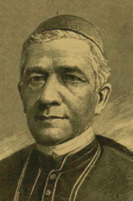Édesapja Mihalovich István uradalmi tiszttartó és Toron-tálmegye albirája volt. Középiskoláit Temesvárt és Sze-geden, a teológiát a temesvári papnevelőben végezte. 1836-ban ugyanitt belvárosi segédlelkész, egyházmegyei iktató. 1837-ben a püspöki szertartó és szentszéki jegy-zővé nevezték ki. 1841-ben Lonovics csanádi püspök tit-kára, szentszéki ülnök, majd püspöki irodaigazgató lett.

Ez időben a püspök titkáraként a korszakos három (1839-40, 1843-44, 1847-48) reformkori országgyűlésen. A Lonovics püspök mellett eltöltött 15 évi szolgálat alatt vált a haza és haladás eszméjének elkötelezett hívévé. Az országgyűléseken mélyítette el szónoki tehetségét, a temes-megyei közgyűlésén már 1841-ben felszólalt a haladás képvise-lőjeként. 1848-ban Ferdinánd király kanonoknak nevezte ki.

A szabadságharc alatt, a magyar kormánytól kinevezett püspöki másod-helyettesként teljesítette kötelességét. 1849-ben pedig a csanádi egyház-megyének a magyar hadsereg felügyelete alatt álló részein, egyházi és hazafiú kötelességének megfelelőleg, ügyességgel és tapintattal, valamint példás önfeláldozással működött.

Ezért a szabadságharc leverése után Temesvárt hadbíróság elé állították, megfosztották hivatalától, címeitől és vagyonától, és 4 évi várfogságra ítélték, melyből 1,5 évet Lipótvárban le is töltött. Deportálása előtt három hónapig együtt volt elcsukva, a temesvári vár kazamatáiban Murányi János temesmegyei főispán, Szlávy József miniszter, Ormos Zsigmond alispán és más forradalmár társaságában. 1852-ben kegyelmet kapott, a kormány rendeletére szülőhelyén, a torontáli Tordán lett segédlelkész. 1855-ben Csanády Sándor püspök Németbesenyőre plébános-helyettesnek, majd 1859-ben kerületi esperes- és tanfelügyelő, majd 1861. májusában a király visszaadta kanonokságát.

Ezek után a temevári közgyűlés temesvár-gyárvárosi lelkészének, később képviselőjének választotta meg. Ez időtől kezdve élénken részt vett a város egyházi, köz- és kultúrális ügyeiben, különösen a magyar közoktatás terén vannak nagy érdemei. A szegénysorsú magyar gyermekek nevelésére nyíl-vános gyűjtésekből és saját áldozatából egy 5000 frt értékben iskolát és tanítói lakot építtetett és a tanító fizetéséről gondoskodott; a következő év-ben Temesvárt felállítandó reáliskolára 3000 forintot ajándékozott, kiesz-közölte, hogy a temesvári első hazai takarékpénztár, melynek ő volt elnö-ke, szintén néhány ezer forintot felajánlott. Egyéb jótékony célokra, vala-mint a szegényeknek mindenkor bőkezűleg adakozott.

Több évig működött mint kerületi esperes, tanfelügyelő és a lugosi gim-názium mellett mint püspöki biztos. Érdemei elismeréseül 1868-ban vas-kaszentmártoni (Somogy megye) apáttá nevezteték ki.

1870-ben a király dulmi püspökké, majd ugyanez év június havában *zág-rábi érsekké* nevezte ki. Később a bibornoki kalapot is elnyerte. 1868-ban a Lipót-rend nagy keresztjét, 1877-ben a szent István-rend nagy keresztjét nyerte, azonfelül valóságos belső titkos tanácsossá neveztetett ki. 1881-ben le akart mondani érseki székéről és a tihanyi kolostorba akart vissza-voulni, de a király kérésére továbbra is megtartotta állását, egész haláláig. Az érsek a Zágrábban való hosszas tartózkodása alatt sem vesztett semmit magyarságából; a horvátok között személyzetét is közülük válogatta.

Számos egyházi és országgyűlési beszédet tartott, melyek a korabeli lapok-ban jelentek meg.

Forrás: [*Magyar Katolikus Lexikon*](http://lexikon.katolikus.hu/K/Kov%C3%A1cs.html). *Szinnyei József -Magyar írók élete és munkái *

**Mistéth Endre** (Buziásfürdő, [1912](https://hu.wikipedia.org/wiki/1912). [szeptember 10.](https://hu.wikipedia.org/wiki/Szeptember_10.) - [2006](https://hu.wikipedia.org/wiki/2006). [július 12.](https://hu.wikipedia.org/wiki/J%C3%BAlius_12.)) 

hídépítő mérnök, miniszter.

Apai ágon francia, anyai ágon szerb-görög eredetű csa-ládban született; apja vasúti tisztviselő volt. A család 1922-ben települt át Magyarországra. A kőszegi Hu-nyadi Mátyás katonai alreál, majd a budapesti Bocskai István Katonai Főreáliskola növendéke volt.

Kőszegen [Ottlik Géza](https://hu.wikipedia.org/wiki/Ottlik_G%C3%A9za) osztálytársa volt, az író vélhe-tően róla mintázta Bónis Feri alakját az  -*Iskola a ha-táron - *című regényében.

A Magyar Királyi József Műegyetemen folytatta tanulmányait; 1935-ben építőmérnöki oklevelet szerzett. Első munkahelye a Ganz Vagongyár volt, majd vízvezeték-tervezéssel foglalkozott az Országos Közegészségügyi Intézetben. Ezután híd-tervező mérnökként bekapcsolódott a Székesfehér-vár-Graz közötti autóút építésébe. Rövid ideig tisztviselő volt a Közleke-dési Minisztériumban, majd 1938-tól egy tervezőiroda munkatársa. 1940-ben tanársegéd a Műegyetemen, ekkor nyitott önálló irodát. Ugyancsak [1940](https://hu.wikipedia.org/wiki/1940)-ben építette a [szolnoki](https://hu.wikipedia.org/wiki/Szolnok) merevítőgerendás ívhídat, amelynek nyílása a legnagyobb volt a korabeli Európában.

1942-ben csatlakozott a *Magyar Testvéri Közösséghez*. 1944-ben részt vett a fegyveres ellenállási mozgalomban, októberben, miután behívták kato-nának, illegalitásba vonult. A nyilas puccs után igyekezett megakadályozni az ipari üzemek Németországba szállítását.

1945 elején a szovjet hidász alakulatok tanácsadójaként részt vett a Déli összekötő vasúti híd helyreállításában. A Duna két partját 1945-ben egy ideiglenes hajóhíd (pontonhíd) kötötte össze, a *Manci híd* a [második világ-háborúban](https://hu.wikipedia.org/wiki/M%C3%A1sodik_vil%C3%A1gh%C3%A1bor%C3%BA) lerombolt [Margit híd](https://hu.wikipedia.org/wiki/Margit_h%C3%ADd) mellett épült. A híd [1946](https://hu.wikipedia.org/wiki/1946) májusára ké-szült el, a hidat a néphumor a Margit név becézése alapján Mancinak ne-vezte el. Tervezője Mistéth Endre volt.

Ő tervezte a főváros első állandó hídját, a Kossuth hidat is. A Kossuth híd a [második világháborúban](https://hu.wikipedia.org/wiki/M%C3%A1sodik_vil%C3%A1gh%C3%A1bor%C3%BA) felrobbantott [budapesti](https://hu.wikipedia.org/wiki/Budapest) [Duna](https://hu.wikipedia.org/wiki/Duna)-hidak pótlá-sára felépített, úgynevezett félállandó híd volt. [1946](https://hu.wikipedia.org/wiki/1946)-tól [1956](https://hu.wikipedia.org/wiki/1956)-ig működött, majd 1960-ban lebontották.

Kővágó József felkérésére belépett a Független Kisgazdapártba. 1945. november 23-án az Iparügyi Minisztérium politikai államtitkára lett. 1946. július 21-én kinevezték az Újjáépítési (október 12-től Építési és Köz-munkaügyi) Minisztérium élére. A Magyar Közösség-ügyben koholt vá-dak alapján letartóztatták és a per fő vádlottjaként 1947. augusztus 29-én első fokon három és fél évi börtönre ítélték.

Ezt követően másodfokon 1948. március 4-én hatévi kényszermunkára ítélték. Büntetését később két év három hónappal meghosszabbították, és csak 1955 áprilisában nyerte vissza a szabadságát.

Szabadulása után három és fél évig még rendőri felügyelet alatt állt. A joghátrányoktól 1958. december 28-án mentesítették, ekkor a Vízügyi Tervező Vállalatnál helyezkedett el mérnökként. Később szakági főmér-nök, főstatikus lett; részt vett az *Erzsébet híd*, a kiskörei és a bős-nagy-marosi vízlépcső tervezésében.

Többek között dolgozott a Közel-Keleten - *Orontész-völgyhíd ([Szíria](https://hu.wikipedia.org/wiki/Sz%C3%ADria)), Garmat-híd ([Irak](https://hu.wikipedia.org/wiki/Irak)) -*illetve Egyiptomban *-Heluáni Nílus-híd-* , valamint a romániai Máramarosban felépült Tisza-híd is.

1963-ban egyetemi doktori, 1969-ben kandidátusi, 1978-ban akadémiai doktori címet szerzett, 1983-ban a Budapesti Műszaki Egyetem címzetes egyetemi tanára lett. Kutatási területe a szerkezetek méretezéselmélete, illetve komplex gazdasági optimálása 1996-ban tevékenységét *Széchenyi-díjjal* jutalmazták.

Főbb írásai: *Erőtani méretezés valószínűségelméleti alapon; 1974. A víz-építési kockázatvállalás néhány alkalmazása; 1975. Építőmérnöki szer-kezetek tervezésének néhány kérdése; 1982. Méretezés-elmélet; 2001.* Forrás: *[Magyar hídépítő mérnökök](https://hu.wikipedia.org/wiki/Kateg%C3%B3ria:Magyar_h%C3%ADd%C3%A9p%C3%ADt%C5%91_m%C3%A9rn%C3%B6k%C3%B6k).* *História - Tudósnaptár*

**Mohay** *Mohaupt* **Gyula**  (Nagyszentmiklós, [1894](https://hu.wikipedia.org/wiki/1894). [szeptember 15.](https://hu.wikipedia.org/wiki/Szeptember_15.) – 

[1952](https://hu.wikipedia.org/wiki/1952). [szeptember 15.](https://hu.wikipedia.org/wiki/Szeptember_15.)), ügyvéd, tisztviselő, [Budapest főpolgármestere](https://hu.wikipedia.org/wiki/Budapest_f%C5%91polg%C3%A1rmestere).

[1921](https://hu.wikipedia.org/wiki/1921) és [1944](https://hu.wikipedia.org/wiki/1944) között a Földhitelintézetek Országos Szövetségének tiszt-viselője volt. [1939](https://hu.wikipedia.org/wiki/1939)-ben belépett a Nyilaskeresztes Pártba. Budapest tör-vényhatósági bizottságában a nyilasok csoportvezetője lett, [1944](https://hu.wikipedia.org/wiki/1944). október 15-ig a Legfőbb Pártfegyelmi Bizottság elnökeként tevékenykedett.

Az első német megszállás után Homonnay Tivadar - korábbi - és Szendy Károly akkori polgármesterrel együtt tiltakozásul lemondott. A Sztójay-kormány idején Keledy Tibort  (Kolozsvár akkori polgármesterét) 1944. április 20-án (a megszállás másnapján) nevezték ki belügyminiszteri ren-delettel főpolgármesternek. Keledy amíg lehetett, együttműködött az új rezsimmel, megpróbálta meggátolni -sikerrel -, a fővárosi gettó kiürítését.

A második német megszállás és a nyilasok hatalom átvétele után Keledy is lemondott. A főváros is az ország sorsára jutva, teljesen ki lett szolgál-tatva a nácik és a hazai kiszolgálóik kénye-kedvének.

A főváros teljhatalmú főpolgármestere, [Szálasi Ferenc](https://hu.wikipedia.org/wiki/Sz%C3%A1lasi_Ferenc) Mohayt és [Hindy Ivánt](https://hu.wikipedia.org/wiki/Hindy_Iv%C3%A1n_(katonatiszt)) (a főváros katonai parancsnoka) a legszélesebb jogkörrel és "Buda-pest székesfőváros területén magyar vonatkozásban teljhatalommal" ru-házta fel. 

A gettóbetörések, fosztogatások és nemritkán rablógyilkosságok miatt, december 15-én Mohay (Mohaupt) Gyula és Lőcsey István rendőr őrnagy - a zsidóügyekért felelős, újonnan kinevezett miniszteri tanácsos – intéz-kedést tettek annak érdekében, hogy megakadályozza illetéktelen szemé-lyek belépését a gettó területére. Hogy a nyilas túlkapásokat megakadá-lyozza, Lőcsey december 17-én úgy döntött, hogy a gettó körzetét rend-őrökből és nyilasokból álló vegyes járőrök ellenőrizzék.

Mohay 1945-ben nyugatra menekült, hol amerikai fogságba esett, kik kiadták Magyarországnak. Kihallgatása során felelősként Beregfy Ká-rolyt nevezte meg: „Beregffy a bűnös, ő a bűnös mindenért, engem hagy-janak ki mindenből, én egyszerű öregember vagyok”.

Mohay Gyula kihallgatás közben 1945 - Elmondta továbbá, hogy az [SS-esek](https://hu.wikipedia.org/wiki/Waffen-SS) semmibe vették őt, hiába volt főpolgármester, semmi tekintélye nem volt. Mohay felelősnek érezte magát azért, hogy Budapest élelmiszerrak-tárait és közszükségleti raktárait a nyilasokkal elszállíttatta, mert a nyilas pártszolgálatosok teljesen kirabolták azokat és nem azzal törődtek, hogy az elszállítandó árut minél hamarabb biztonságba helyezzék, hanem, hogy minél többet lophassanak. Elpanaszolta, hogy Németországban az SS-ek kíméletlenül kirabolták őt is és elvették kocsiját.

„Ekkor kezdett világos lenni előttem, hogy a németek semmibe sem vesznek minket és én hiába voltam Bu-dapest főpolgármestere, semmi tekintélyem nem volt előttük”. - *Mohay Gyula Budapest nyilas főpolgár-mesterének átvétele a repülőtéren. A gép mellett amerikai tisztek -*

A népbíróság először halálra ítélte Mohayt, kit egyér-telmű felelősság terhelte, a megszálló nácik kiszol-gálásában, valamint magyar állampolgárok tömegeinek kiszolgálltatásá-ban. Ennek ellenére [Ries István](https://hu.wikipedia.org/wiki/Ries_Istv%C3%A1n)  igazságügyi miniszter javaslatára, Tildy Zoltán köztársasági elnök az ítéletet életfogytiglani kényszermunkára vál-toztatta.

A kegyelemhez az is hozzájárult, hogy habár nyilas főpolgármesterként kiszolgálta a nácikat, állandó kapcsolatot tartott fenn Born és Weyermann Nemzetközi Vöröskeresztes delegátusokkal. Alkalmanként élelmet szállít-tatott az éhező gettóba a főváros készleteiből és költségére.

Mohay a Mosonyi utcai rabkórházban halt meg 58. születésnapján, 1952. szeptember 15-én.

Forrás: *Sipos András: Mohay Gyula. Budapest főpolgármesterei és pol-gármesterei 1873-1950. [Holokauszt Emlékközpont életrajz](http://www.hdke.hu/tudastar/enciklopedia/mohay-mohaupt-gyula)*

**Molnár Erik** ([Újvidék](https://hu.wikipedia.org/wiki/%C3%9Ajvid%C3%A9k), [1894](https://hu.wikipedia.org/wiki/1894). [december 16.](https://hu.wikipedia.org/wiki/December_16.) - [Budapest](https://hu.wikipedia.org/wiki/Budapest), [1966](https://hu.wikipedia.org/wiki/1966). [augusztus 8.](https://hu.wikipedia.org/wiki/Augusztus_8.)) történész, politikus, egyetemi tanár, az [MTA](https://hu.wikipedia.org/wiki/Magyar_Tudom%C3%A1nyos_Akad%C3%A9mia) tagja.

Református családba született. Édesapja Molnár Ala-dárt [1912](https://hu.wikipedia.org/wiki/1912)-ben áthelyezték [Fiumébe](https://hu.wikipedia.org/wiki/Fiume), ezután Molnár Erik a helyi gimnáziumban érettségizett.

Habár felsőfokú tanulmányait, a katonai pályát jelentő [Ludovika Akadémián](https://hu.wikipedia.org/wiki/Magyar_Kir%C3%A1lyi_Honv%C3%A9d_Ludovika_Akad%C3%A9mia) kezdte, a számára testhezállób jogi egyetem hallgatója lett.  [1915](https://hu.wikipedia.org/wiki/1915) végén besorozták a nagykanizsai  20. honvéd gyalogezredbe, zászlósként küzdött az orosz fronton míg [1916](https://hu.wikipedia.org/wiki/1916)-ban hadifogságba esett. A háború végéig a szibériai [Vlagyivosztokban](https://hu.wikipedia.org/wiki/Vlagyivosztok) egy tiszti táborban raboskodott, hol saját bevallása szerint „a hadifogság lényegében átalakító hatással volt rá”: megszabadult a „még megmaradt úri vonásoktól”.

A háború után visszatért a tengerparti városba, ám mint kommunista gya-núst (a forradalmi Oroszorszgból jött) kiutasították Fiumeból. Családjával Magyarországra lett áttoloncolva, végül [Kecskeméten](https://hu.wikipedia.org/wiki/Kecskem%C3%A9t) húzták meg magu-kat. Kecskeméten való letelepedése után folytatta jogi tanulmányait, [1922](https://hu.wikipedia.org/wiki/1922)-ben jogi doktorrá avatták. Miután letette az ügyvédi és a bírói vizsgát, [1924](https://hu.wikipedia.org/wiki/1924)-ben [a hírös városban](https://www.google.com/search?sxsrf=ACYBGNRsq7wF7SIOdfbUSkioo02bgMO9-w:1578610501907&q=a+h%C3%ADr%C3%B6s+v%C3%A1rosban&spell=1&sa=X&ved=2ahUKEwiArNGxzvfmAhWQAxAIHcSHDMgQkeECKAB6BAgMECk) ügyvédi irodát nyitott. Majd az [Egyetemes Re-formátus Jogakadémián](https://hu.wikipedia.org/w/index.php?title=Egyetemes_Reform%C3%A1tus_Jogakad%C3%A9mia&action=edit&redlink=1) (ma a [Károli Gáspár Református Egyetem](https://hu.wikipedia.org/wiki/K%C3%A1roli_G%C3%A1sp%C3%A1r_Reform%C3%A1tus_Egyetem) Állam és Jogtudományi Kara) tanított.

Csatlakozott a szociáldemokraták helyi szervezetéhez, amelynek vezetését is átvette. [1928](https://hu.wikipedia.org/wiki/1928)-ban - abban az évben, amikor a [Magyarországi Szociálde-mokrata Párt](https://hu.wikipedia.org/wiki/Magyarorsz%C3%A1gi_Szoci%C3%A1ldemokrata_P%C3%A1rt) színeiben a városi törvényhatósági bizottság tagja lett - René öccse ösztönzésére - az illegális [kommunista pártba](https://hu.wikipedia.org/wiki/Kommunist%C3%A1k_Magyarorsz%C3%A1gi_P%C3%A1rtja) is belépett. Első írásai elvtársa, a szintén szocdem kriptokommunista dr. [Madzsar József](https://hu.wikipedia.org/wiki/Madzsar_J%C3%B3zsef) „erősen szocialista irányú” *Társadalmi lexikonjában* ([1928](https://hu.wikipedia.org/wiki/1928)-ban jelent meg a *Nép-szava Könyvkereskedés* kiadásában) jelentek meg. [1929](https://hu.wikipedia.org/wiki/1929)-től a [nagy gazda-sági világválság](https://hu.wikipedia.org/wiki/Nagy_gazdas%C3%A1gi_vil%C3%A1gv%C3%A1ls%C3%A1g) idején tanulmányok sorát publikálta az agrárkérdésről és a munkásmozgalom problémáiról. Szakdolgozatait a *[100%](https://hu.wikipedia.org/wiki/100%25_%28foly%C3%B3irat%29),* a [*Társadalmi Szemle*](https://hu.wikipedia.org/wiki/T%C3%A1rsadalmi_Szemle), a [*Gondolat*](https://hu.wikipedia.org/w/index.php?title=Gondolat_%28foly%C3%B3irat%29&action=edit&redlink=1) és a [kolozsvári](https://hu.wikipedia.org/wiki/Kolozsv%C3%A1r) *[Korunk](https://hu.wikipedia.org/wiki/Korunk)* hasábjain jelentette meg.

Leggyakrabban *Jeszenszky Erik*, *Pálfai István* vagy *Szentmiklósy Lajos* álnéven, saját pénzből adta ki műveit. Igy jelent meg a *Magyar őstörténet* című írása is.

Az 1930-as években visszahúzzódó életet élve, öccse praxisának átvételé-vel a szegények és kommunisták ügyvédjeként szerzett megának rangot a magyar baloldalon. Majd a történelemmel újra találkozva, megjelent *A feudalizmus kialakulása Magyarországon* c. kiadványa, valamint *Az Ár-pádkori társadalom* két kötete. Az utóbbi szakmunkáról a korszak kiemel-kedő szaktekintélye [Hóman Bálint is dicsérőleg](http://mek.niif.hu/07100/07139/html/0011/0007/0004-40f.html) nyilatkozott.

Molnár Eriket az ország [német megszállásáig](https://hu.wikipedia.org/wiki/Margarethe_hadm%C5%B1velet) nem érte bántódás, azonban az 1944 márciusában bekövetkezett [német megszállásakor](https://hu.wikipedia.org/wiki/Margarethe_hadm%C5%B1velet) rövid időre letartóztatták. Az őt kedvelő kecskemétiek azonban kiszabadították, és a vészkorszak idején a városban bújtatták. A „felszabadító” szovjetek érke-zése után, [1944](https://hu.wikipedia.org/wiki/1944) végén fél esztendeig Kecskemét alpolgármestere volt.

Amikor Debrecent és vele együtt az ország keleti felét megszállta a [Vörös Hadsereg](https://hu.wikipedia.org/wiki/Munk%C3%A1s-paraszt_V%C3%B6r%C3%B6s_Hadsereg), 1944. [december 22-én](https://hu.wikipedia.org/wiki/December_22.) a városban megalakult az *Ideiglenes Nemzeti Kormány*. A [Debrecenben](https://hu.wikipedia.org/wiki/Debrecen) összeült [Ideiglenes Nemzetgyűlés](https://hu.wikipedia.org/wiki/Ideiglenes_Nemzetgy%C5%B1l%C3%A9s)ben

[Pest-Pilis-Solt-Kiskun vármegye](https://hu.wikipedia.org/wiki/Pest-Pilis-Solt-Kiskun_v%C3%A1rmegye) küldöttjeként vett részt. Amikor szóba került az új kormány összetétele, a Moszkvából nemrég visszatért kom-munista [Rákosi Mátyás](https://hu.wikipedia.org/wiki/R%C3%A1kosi_M%C3%A1ty%C3%A1s) javaslatára (pártonkívüliként?!) megkapta a nép-jóléti tárcát, dálnoki [Miklós Béla](https://hu.wikipedia.org/wiki/Mikl%C3%B3s_B%C3%A9la) kormányában.

Ezt az inkább propagandisztikus posztot a következő; a [Tildy Zoltán](https://hu.wikipedia.org/wiki/Tildy_Zolt%C3%A1n_(politikus)), a [Nagy Ferenc](https://hu.wikipedia.org/wiki/Nagy_Ferenc_(minisztereln%C3%B6k)), majd néhány hónapig a [Dinnyés Lajos](https://hu.wikipedia.org/wiki/Dinny%C3%A9s_Lajos) vezette kormányok-ban is betöltötte. [1947](https://hu.wikipedia.org/wiki/1947). [szeptember 24-től](https://hu.wikipedia.org/wiki/Szeptember_24.) a [kisgazdapárti](https://hu.wikipedia.org/wiki/F%C3%BCggetlen_Kisgazda-,_F%C3%B6ldmunk%C3%A1s-_%C3%A9s_Polg%C3%A1ri_P%C3%A1rt) [Mihályfi Ernő (szintén kriptokommunista) helyett - aki a köztársasági elnöki hivatal ve-zetője lett - megkapta](https://hu.wikipedia.org/wiki/Mih%C3%A1lyfi_Ern%C5%91) a [külügyminiszteri](https://hu.wikipedia.org/wiki/Magyarorsz%C3%A1g_k%C3%BCl%C3%BCgyminisztereinek_list%C3%A1ja) és a tárcát.

Molnár Eriket 1948. [augusztus 5-én](https://hu.wikipedia.org/wiki/Augusztus_5.) rendkívüli és meghatalmazott nagy-követté nevezték ki, majd  [1948. szeptember 10-étől](https://hu.wikipedia.org/wiki/Szeptember_10.)  [Szekfű Gyulát](https://hu.wikipedia.org/wiki/Szekf%C5%B1_Gyula)ól át-vette a stratégialag legfontosabb [moszkvai](https://hu.wikipedia.org/wiki/Moszkva) nagykövetséget - egyben hel-szinkii is -, amit [1949](https://hu.wikipedia.org/wiki/1949). [szeptember 26-áig](https://hu.wikipedia.org/wiki/Szeptember_26.) töltött be. 1948-[1956](https://hu.wikipedia.org/wiki/1956)  között a 

[Magyar Dolgozók Pártja](https://hu.wikipedia.org/wiki/Magyar_Dolgoz%C3%B3k_P%C3%A1rtja) Központi Vezetőségébe is beválasztották. 

1949-ben névleg a *Történettudományi Intézetet* is vezette, majd ez év ő-szén a Magyar Tudományos Akadémiának előbb rendes, majd elnökségi tagjává választották.

[1950](https://hu.wikipedia.org/wiki/1950). [július 17-én](https://hu.wikipedia.org/wiki/J%C3%BAlius_17.) Ries Istvánt (miután letartóztatták, majd a börtönben agyonverték) váltotta az [igazságügy-miniszteri](https://hu.wikipedia.org/wiki/Magyarorsz%C3%A1g_igazs%C3%A1g%C3%BCgy-minisztereinek_list%C3%A1ja) székben. Ezt, a diktatúrák-ra olyannyira emblematikus pozíciót a “legendás” években (1950-1952) töltötte be, valószínűleg Rákosíék legnagyobb megelégedésére töltötte azt be. [1952](https://hu.wikipedia.org/wiki/1952). november 14-én ismételten külügyminiszter, majd [1953](https://hu.wikipedia.org/wiki/1953) júliusa és [1954](https://hu.wikipedia.org/wiki/1956) októbere között a Legfelsőbb Bíróság elnöke.

[Molnár Erik](https://hu.wikipedia.org/wiki/Moln%C3%A1r_Erik) [1954](https://hu.wikipedia.org/wiki/1954). október 30-ától az első Nagy Imre kormányban újra igazságügy-miniszterré lett kinevezve. Miniszterként részt vett a koncep-ciós perek felülvizsgálatában, az elítéltek rehabilitációjában. 1956 már-ciusában a [Farkas Mihály](https://hu.wikipedia.org/wiki/Farkas_Mih%C3%A1ly_(politikus)) “tetteit” kivizsgáló bizottság tagja, végül már a nagy és bölcs vezért, magát Rákosi Mátyást is bátran megbírálta!

Az [1956-os forradalom](https://hu.wikipedia.org/wiki/1956-os_forradalom)ban nem találta a helyét, a Kádár-korszak elején ki-szorult a központi pártvezetésből. A Rákosi-rendszert bíráló és 1956-ot felkelésnek nevező előadása miatt is vezekelnie kellett. Habár az orsszág-gyűlésnek tagja maradt, a közvetlen politizálástól visszavonult.

Valószínűleg fájdalomdíj fejében átvehette a *Történettudományi Intézet* vezetését. Molnár Erik hűséges pártszolgálata és marxista beállítottsága ellenére sem volt a Rákosi-korszak meghatározó történésze. A korszak ideológiai, tudománypolitikai és személyi kérdéseiben [Révai József](https://hu.wikipedia.org/wiki/R%C3%A9vai_J%C3%B3zsef_(politikus)) és An-

[dics Erzsébet](https://hu.wikipedia.org/wiki/Andics_Erzs%C3%A9bet)  döntött. Fő történész ellenfele, a nála a pártban sokkal job-ban beágyazódott Mód Aladár volt. Az ő történelem szemléletével szem-ben, a forradalom  okait és ideológiai gyökereit keresve, annak okát a ma-gyar nacionalizmusban találta meg!

Molnár Eriknek történészként a [Szajánok](https://hu.wikipedia.org/wiki/Szaj%C3%A1nok) vidékére helyezte a finnugor őshazát és a magyarok honfoglalás előtti társadalmát kommunisztikus pásztortársadalomként láttatta. Vélemény szerint a nemzetből kizárt pa-rasztokra a haza fogalma nem terjedt ki. Amikor II. Ulászló a nemeseket Dózsa parasztserege ellen harcba szólította, azzal hívta őket fegyverbe, hogy »bátran, erős kezekkel induljanak a haza védelmére«. A haza itt a nemesek hazája, a »feudális haza«, amelyet meg kell védeni a parasztok támadásától.” “Molnár emellett a függetlenségi harcok, a magyar törté-nelem korábban egyöntetűen pozitívnak és a marxista történészek által is haladónak tartott eseményei (Rákóczi-szabadságharc, 1848) fontosságát és progresszív jellegét is tagadta”. „A történélem szemlélete kifejezetten nélkülözte a nemzeti elkötelezettséget.

[1958](https://hu.wikipedia.org/wiki/1958) után háromszor választották meg a [*Magyar Történelmi Társulat*](https://hu.wikipedia.org/wiki/Magyar_T%C3%B6rt%C3%A9nelmi_T%C3%A1rsulat) elnö-kévé. Az *Acta Historica* főszerkesztője, valamint [1957](https://hu.wikipedia.org/wiki/1957) és [1962](https://hu.wikipedia.org/wiki/1962) között a [*Századok*](https://hu.wikipedia.org/wiki/Sz%C3%A1zadok_%28foly%C3%B3irat%29) szerkesztőbizottságának elnöke volt. Szentmiklósy Lajos néven közölt *Magyar őstörténet* c. munkája a téma első marxista szintézisének számított, mely tévedései és pontatlanságai ellenére évtizedekig éreztette a hatását. [1958](https://hu.wikipedia.org/wiki/1958)-tól az  *Acta Historica*  főszerkesztője,  [1957](https://hu.wikipedia.org/wiki/1957)-[1962](https://hu.wikipedia.org/wiki/1962)  között a  [*Századok*](https://hu.wikipedia.org/wiki/Sz%C3%A1zadok_(foly%C3%B3irat)) szerkesztő bizottságának elnöke volt.

Kétszer kapta meg a [Kossuth-díjat](https://hu.wikipedia.org/wiki/Kossuth-d%C3%ADj). [1964](https://hu.wikipedia.org/wiki/1964)-ben az Eötvös Loránd Tudo-mányegyetem és a [krakkói](https://hu.wikipedia.org/wiki/Krakk%C3%B3) [Jagelló Egyetem](https://hu.wikipedia.org/wiki/Jagell%C3%B3_Egyetem) is tiszteletbeli doktorai közé fogadta. A [*Magyar Történelmi Társulat*](https://hu.wikipedia.org/wiki/Magyar_T%C3%B6rt%C3%A9nelmi_T%C3%A1rsulat) 1967 és 1986 között osztotta ki a róla elnevezett emlékérmet.

Főbb művei: *A magyar agrárkérdéshez (1937), Magyar őstörténet (1942), A feudalizmus kialakulása Magyarországon (1942), Az árpádkori társa-dalom (1943), Szent István (1945), A magyar társadalom története az ős-kortól az Árpádkorig (1945), A magyar társadalom története az Árpád-kortól Mohácsig (1949), A feudalizmus kialakulása Magyarországon. Az Árpádok kora (1952), A magyar nép őstörténete (1953. 1954) stb.*

Forrás: *[Magyar életrajzi lexikon 1000-1990.](http://mek.oszk.hu/00300/00355/html/ABC09732/10695.htm)  2001, [Magyar nagyle-xikon](https://hu.wikipedia.org/wiki/Magyar_nagylexikon) XIII. 2001, Magyar Nagylexikon. [Új magyar életrajzi lexikon](https://hu.wikipedia.org/wiki/%C3%9Aj_magyar_%C3%A9letrajzi_lexikon) IV. (L–Ő).  2002,* 

**Molnár Imre** (Péterréve, 1888. október 28. - Budapest, 1977. november 25.) zenetudós, énekpedagógus.

A magyar többségű Tisza menti katolikus községben kántortanító fiaként született. 1906-1910 között járt a budapesti tudományegyetem bölcsészkarára. Ezzel egy-időben a Budapesti Zenekedvelők Egylete által meg-szervezett ének- és zeneiskolában tanult. Különösen nagy hatással volt rá az egyesület igazgatója, a magyar oratórikus zene úttörője Bellovics Imre.

1912-ben avatták bölcsészdoktorrá, pályáját a [Fővárosi Könyvtárban,](https://hu.wikipedia.org/wiki/F%C5%91v%C3%A1rosi_Szab%C3%B3_Ervin_K%C3%B6nyvt%C3%A1r) a forradalmi szocialista (kommunista) Szabó Ervinnél kezd-te. A *[Galilei Kör](https://hu.wikipedia.org/wiki/Galilei_K%C3%B6r)höz* szorossan kötődő könyvtár egyik első munkatársa-ként**,** Molnár Imre részt vett a Fővárosi Könyvtár átszervezésében.

1919-ben a Tanácsköztársaság idején jött el, mikor a Markó utcai főreál-iskola igazgatójává nevezték ki. Azonban a rövid életű kommün bukását követően azonnal elbocsájtották és nyugdíjazták. Hogy megélhetését biz-tosítsa a *Magyarság* c. lapba zenekritikai cikkeket írt, majd a lap szünetel-tetése alatt, a világháború végéig a *Magyar Nemzet* zenekritikusa volt.

1922-ig a Nemzeti Zenede (ma Bartók Béla Zeneművészeti Szakgimná-zium) könyvtárát vezethette. 1925-ben Kern Auréllal a Nemzeti Zenede elnökigazgatója segítségével megjelentette *Daloskert* c. gyűjteményét, a ciklus darabját maga énekelte hanglemezre.

1933-ban Hubay Jenő főigazgató a Liszt Ferenc Zeneművészeti Főiskola tanáraként alkalmazta. 1934-ben Dohnányi Ernő lett a Zeneakadémia fői-gazgatója. Dohnányi, a világhírnévnek örvendő zeneművész, az 1939-től meg megújuló a [zsidó-törvények](https://hu.wikipedia.org/wiki/Zsid%C3%B3t%C3%B6rv%C3%A9nyek) után az intézményt ért támadások, és a zsidó származásúak elbocsátása miatt 1941-ben lemondott igazgatói tiszt-ségéről.

Molnár Imre az 1945 után, 1959-es nyugdíjba vonulása után hangképzést tanított a *Magyar Állami Népi Együttesben*. “Számos kiváló, sőt világhírű énekes került ki iskolájából. A Magyar Rádió első bemondóit ő tanította a szép beszédre. Pedagógiájában általában nem szerette az idegen nyelven való éneklést, ezért néhány tanártársával ellentétbe került. Páratlan értékű magyar daltörténeti dokumentációs kutatása. 15 nyelvből készített kiváló dalfordításokat. 1977-ben a Magyar Népköztársaság Művészeti Alapjának nagydíjával tüntették ki”. Főbb művei: *A magyar muzsika könyve (1936), Beszédének (1941), Eufonetika a szép beszéd és éneklés tana (1942), A magyar hanglejtés rendszere (1956), A hangszín problematikája és a ma-gánhangzók skálarendje (1961), Eufonetika a széphangzás módszertana (1966) stb.* Forrás: [*Magyar Életrajzi Lexikon 1000-1990*](https://www.google.rs/url?sa=t&rct=j&q=&esrc=s&source=web&cd=4&cad=rja&uact=8&ved=0ahUKEwimxJratZzcAhUvsqQKHS-1DJsQFgguMAM&url=http%3A%2F%2Fmek.oszk.hu%2F00300%2F00355%2Fhtml%2FABC09732%2F10711.htm&usg=AOvVaw2qd7-KWKO4z_zhRxtGfjz7)

**Muschong Jakab**   *Iacob Muschong* ([Nagykikinda](https://en-m-wikipedia-org.translate.goog/wiki/Nagykikinda?_x_tr_sl=en&_x_tr_tl=hu&_x_tr_hl=hu&_x_tr_pto=nui,sc) 1868.  - [Lugos](https://en-m-wikipedia-org.translate.goog/wiki/Lugoj?_x_tr_sl=en&_x_tr_tl=hu&_x_tr_hl=hu&_x_tr_pto=nui,sc), 1923. december 13. )  üzletember, mágnás, filantróp és befektető.

A francia eredetű Muschongok (Mougeonn) a Lugos külvárosában működő műhelyekben készítettek téglát. Feleségül vette Bohn Margitot, a zsombolyai tégla-gyáros Bohn István lányát.   Muschong Jakab így került sógorságba Bohn Mihállyal és Schaaf Jakabbal, kikkel építőanyaggyártó konszernt alapítottak.

Muschong több gyárat épített [Bánságban](https://en-m-wikipedia-org.translate.goog/wiki/Banat?_x_tr_sl=en&_x_tr_tl=hu&_x_tr_hl=hu&_x_tr_pto=nui,sc), de épített Bu-dapest külvárosában is.  A Törökkő-dűlőnél (Óbuda – Újlak) 1893-ban megalakult a Budapesti Tégla és Mészégető Gyár Rt. Muschong 1910-ben átvette a vállalat irányítását. Ugyanekkor jelent meg Budapesten a szomszédos *Victoria* téglagyárat megvásárló, a Muschongal rokoni kapcsolatban álló Bohn család is.  [Muschong Jakab   vezérigaz-gatósága](https://en-m-wikipedia-org.translate.goog/wiki/Jacob_Muschong?_x_tr_sl=en&_x_tr_tl=hu&_x_tr_hl=hu&_x_tr_pto=nui,sc#cite_note-jacob-3) alatt a tégla- és csempetermékei kiváló minőségűek voltak, és az egész [Osztrák-Magyar Birodalomban](https://en-m-wikipedia-org.translate.goog/wiki/Austria-Hungary?_x_tr_sl=en&_x_tr_tl=hu&_x_tr_hl=hu&_x_tr_pto=nui,sc) árulták őket. 

Nevéhez fűződik az 1906-ban megvásárolt Buziásfürdő sorsa is,  ahol az azonos nevű üdülőhelyet rendezte be. A 19. század végén Buziásfürdő Magyarország elsőrangú fürdőhelyei között szerepelt, ebben nagy érdeme volt [Trefort Ágoston](https://hu.wikipedia.org/wiki/Trefort_%C3%81goston) közoktatási és vallásügyi miniszternek, aki támogatta a helyi beruházásokat.  Muschong a telep nagyméretű bővítését tűzte ki céljául; új épületeket emeltek, uszodát létesítettek. 1910 körül a fürdőtelep a tavon kívül egy százholdas díszparkból, szállodákból, ivócsarnokokból, gyógyfürdők-ből, fedett sétányokból és teniszpályákból állt. 

1907-ben [szénsavgyárat](https://en-m-wikipedia-org.translate.goog/wiki/Austro-Hungarian_krone?_x_tr_sl=en&_x_tr_tl=hu&_x_tr_hl=hu&_x_tr_pto=nui,sc) is - ásványvíztöltő üzem - épített 2 millió koroná-ért, mely ipari méretekben termelte a *Phönix *ásványvizet. Az ásványvizek fő exportpiaca a [balkáni](https://en-m-wikipedia-org.translate.goog/wiki/Balkan?_x_tr_sl=en&_x_tr_tl=hu&_x_tr_hl=hu&_x_tr_pto=nui,sc) régió volt. Az 1908-as pozsonyi országos kiállí-táson a *Phönix* ásványvíz elnyerte a kiállítás nagydíját.

Muschong jelentős fejlesztéseket eszközölt; felépítette a *Muschong* nevű szállót, további artézi kutakat fúratott, vasúti szárnyvonalat építtetett a bu-ziásfürdői állomás és a városközpont között. 103 méter mélyről jött a víz, és orvosilag bebizonyosodott, hogy [köszvényre](https://en-m-wikipedia-org.translate.goog/wiki/Gout?_x_tr_sl=en&_x_tr_tl=hu&_x_tr_hl=hu&_x_tr_pto=nui,sc) vagy [gyomormosásra al-kalmas](https://en-m-wikipedia-org.translate.goog/wiki/Gastric_lavage?_x_tr_sl=en&_x_tr_tl=hu&_x_tr_hl=hu&_x_tr_pto=nui,sc).  A gyönyörű fürdőkerteket is értékes növényekkel rakotta ki, 500 méter hosszú fedett sétányt, 22 fürdővendégvillát, állatkertet és sportpá-lyákat épített.  

A román hatóságok [1918 ](https://ro-m-wikipedia-org.translate.goog/wiki/1918?_x_tr_sl=ro&_x_tr_tl=hu&_x_tr_hl=hu&_x_tr_pto=nui,sc)után  állítólagos számviteli szabálytalanságokat állapítottak meg. A zaklatások miatt Muschong nemsokára szívinfarktus-ban  elhunyt. Források: *[Palásti László - Franciák és a francia nyelv a Bánátban a XVIII. és a XIX.században](https://translate.google.com/website?sl=en&tl=hu&nui=1&prev=search&u=http://acta.bibl.u-szeged.hu/17330/1/tanarkepzo_1958_1_155-175.pdf),  Borovszky Samu - Magyarország vármegyéi és városai - Temes vármegye…*

**N**

**Nádor** *Neubauer* **Mihály**, *Nádor Manó*   (Temesvár, [1882](https://hu.wikipedia.org/wiki/1882). [április 16.](https://hu.wikipedia.org/wiki/%C3%81prilis_16.) – 

[1944](https://hu.wikipedia.org/wiki/1944). július 5.) zeneszerző, karmester, zenei rendező.

Édesapja Neubauer Vilmos templomi komponista és kórus vezető volt. Hegedűjátékát meghallva beíratták a bécsi Konzervatóriumba. Tanulmányait a müncheni [*Akademie der Tonkunst*](https://hu.wikipedia.org/wiki/M%C3%BCncheni_Zene-_%C3%A9s_Sz%C3%ADnh%C3%A1zm%C5%B1v%C3%A9szeti_F%C5%91iskola)-on folytatta, hol Gustav Mah-ler zenéjéért rajongott. A müncheni évek alatt vonós-négyesével pályadíjat nyert a bonni *Beethovenhaus* ál-tal kitűzött versenyműpályázaton. Zenei tanulmányai után a müncheni udvar zenésze lett. Ezt követően vo-nósnégyest alapított, évekig járva Németországot.

Hazatérve előbb Kecskeméten, majd Budapesten karmester. [Nagy Endre](https://hu.wikipedia.org/wiki/Nagy_Endre_(%C3%ADr%C3%B3)) 

kabaréjában elszerződve kuplékat kezdett írni, "*Őh, tipegő kis médik"*, a Nagy Endre szövegére komponált dalával befutott. Igényesebb műveket is szerzett; [Ignotus](https://hu.wikipedia.org/wiki/Ignotus_Hug%C3%B3) versére a *"Bölcső-dalt",* [Szép Ernő](https://hu.wikipedia.org/wiki/Sz%C3%A9p_Ern%C5%91) versére a *"Gyáva legényt",* Zerkovitz Béla számára a *"Léha nótát".* Saját népies szerzemé-nye az "Albert Jóska" című népballada, Medgyaszay Vilma számára még egy sor balladát írt. A *Falu végén* című Petőfi-ciklusát [Hevesi Sándor-ral](https://hu.wikipedia.org/wiki/Hevesi_S%C3%A1ndor) közösen írta meg.

Mikor 1914-ben kitört a háború, hadnagyi rendfokozatban az ungvári 66-os közös gyalogezredhez vezényelték. Bátran harcolt, kiérdemelte a II. osztályú ezüst vitézségi érmet, és a Károly csapatkeresztet. Előbb az olasz, majd az orosz fronton küzdött; ahol fogságba esett. A fogolytáborban be-mutatta Nádor Mihály-[Nagy Endre](https://hu.wikipedia.org/wiki/Nagy_Endre_(%C3%ADr%C3%B3)): *Hadikép* című művét. 

A hadifogságból sikerült megszöknie; 25%-os hadirokkantként visszatérve elszerződött az akkor létesült *Medgyaszay Színházhoz* zenei vezetőnek. Első operája a *"Néma asszony",* a másodikat “*Donna Anna”* már az [Opera-ház](https://hu.wikipedia.org/wiki/Magyar_%C3%81llami_Operah%C3%A1z)   is mutatta. A következő évben átszerződött a [*Király Színházhoz*](https://hu.wikipedia.org/wiki/Kir%C3%A1ly_Sz%C3%ADnh%C3%A1z).

A *Városi Színház* operát készült bemutatni Kristóf Károly - Faragó Sán-dor: *"Beethoven élete"* címmel. Balettet komponál Faragó Jenő szövegével *„Elssler Fanny”* címen. Több film készítésében is közreműködött.

Az ország német megszállását követően, fiával és vejével együtt indí-tották útnak [Auschwitz](https://hu.wikipedia.org/wiki/Auschwitzi_koncentr%C3%A1ci%C3%B3s_t%C3%A1bor) felé. Művei: *Maeterlinck: Kék madár, kísérőzene, 1913.Vilmos huszárok - operett, 1914. A néma asszony - opera buffa, 1918. Donna Anna - dalmű, 1920. Offenbach - operett, 1920.* *A babavásár - operett, 1922. Elssler Fanny - balett, 1933.* Filmzenéi: *Az ellopott szerda (1933) - a film zeneszerzője Fizessen, nagysád! (1937).*

Forrás: *[Magyar életrajzi lexikon](https://www.arcanum.hu/hu/online-kiadvanyok/Lexikonok-magyar-eletrajzi-lexikon-7428D/). Magyar Színházművészeti Lexikon*

Kislégi **Nagy Dénes** ([Titel](https://hu.wikipedia.org/wiki/Titel), [1884](https://hu.wikipedia.org/wiki/1884). [június 21.](https://hu.wikipedia.org/wiki/J%C3%BAnius_21.) - [Pécs](https://hu.wikipedia.org/wiki/P%C3%A9cs), [1984](https://hu.wikipedia.org/wiki/1984). [augusztus 27.](https://hu.wikipedia.org/wiki/Augusztus_27.)) filozófiai, társadalomtudományi, közgazdasági, statisztikai szakíró.

A budapesti református gimnáziumban érettségizett. 

1907-ben a budapesti egyetemen görög-latin szakos középiskolai tanári diplomát szerzett. Egy tanévet töl-tött ösztöndíjasként a párizsi a Sorbone-n, majd hazaté-rése után beiratkozott a budapesti tudományegyetem jog- és államtudományi karára.

Rendszeresen publikált a radikális *Huszadik Század* c. folyóiratba, hol Szabó Ervin hatására belépett a *Társa-dalomtudományi Társaságba*. E társaság delegátusaként részt vett a Lon-donban 1911 nyarán megtartott az emberi fajok első egyetemes kongresz-szusán. Londonban a szegénytámogató törvény megalkotóinak Beatrice és Sidney Webb előadásai hatottak rá.

Ezután Párizsban Émile Durkheim szociológiai, valamint Henri Bergson filozófiai előadásait hallgatta. Tapasztalatai alapján elsők között ismertette meg Magyarországon Durkheim nézeteit, Durkheim alapján megírt első műve (*Bevezetés a szociológiába*, 1922) a magyarországi szociológiai iro-dalom klasszikusa.

Az első világháborúban végig a bécsi Hadügyminisztérium Sajtóosztályán szolgált. Szabó Ervin biztatására az angol evolúciónista Herbert Spencert filozófust fordította. Az őszirózsás forradalom és a Tanácsköztársaság idején (1918-1919), mint a Tanárképző Intézet szociológia tanára szerepet vállalt a *Társadalomtudományok Szabad Iskolája* szervezésében.

A vörös uralom bukása után megfosztották ugyan katedrájától, de ennek ellenére a huszas évek közepén visszakaphatta katedráját, Budapesti Ke-reskedelmi Akadémiának volt tanára, majd tíz éven keresztül (1942-ig), a pécsi Erzsébet Tudományegyetemen magántanár, majd Erdély visszatérte után (1942-1944), a kolozsvári Tudományegyetem Jog- és Közgazdaság-tudományi Karán a gazdaságpolitika és a statisztika tanára.

A második világháború után a visszatérő román hatalom nemsokáig tűrte, így ott kellett hagynia a kolozsvári Bolyai Tudományegyetemet. 1948-ban repatriált, visszatért a pécsi egyetemre, hol 1948-1957 között  az egyetem Statisztika Tanszékének vezetőjeként dolgozott.  A modern szociológiai és társadalomtudományi kutatások egyik magyarországi megalapítójaként el-sősorban vallás- és gazdaságszociológiával foglalkozott, de gazdaságfi-lozófiai, statisztikai és pedagógiai kutatói tevékenysége is jelentős.

Szakmai cikkei a *Közgazdasági Szemlében,* a *Társadalomtudományban,* a *Magyar Statisztikai Szemlében* és a *Demográfia* c. folyóiratban jelentek meg.

Főbb magyar nyelvű művei: *Az emberi munka bölcselete (1930), A gaz-dasági individializmus válsága (1933), Mandeville meséje a méhekről (1935), A jegybank szerepe a gazdasági életben (1936), Hires kereskedők (1940), Beszélgetés egy eke mellett (1943), A gazdasági elméletek története (1948), Pénzromlás és árszínvonal (1946), A közgazdaságtan oktatásának módszeréről (1946*) stb. Fordítások: *Herbert Spencer: A katonai és iparos társadalmak szociológiája 1919. David Ricardo: A politikai gazdaságtan és az adózás alapelvei 1940, 1954. Karl Marx, Friedrich Engels: A német ideológia 1974.* Forrás: *A magyar legújabb kor lexikona*

**Nagy Töhötöm Sándor** (Magyarcsernye-Bozitópuszta, [1908](http://hu.wikipedia.org/wiki/1908). [június 23.](http://hu.wikipedia.org/wiki/J%C3%BAnius_23.) - [Budapest](http://hu.wikipedia.org/wiki/Budapest), [1979](http://hu.wikipedia.org/wiki/1979). [február 21.](http://hu.wikipedia.org/wiki/Febru%C3%A1r_21.)) jezsuita szerzetes.

Egy [székely](https://hu.wikipedia.org/wiki/Sz%C3%A9kely) eredetű vasutas családban született. Gyer-mekkorát Hunyad megyei [Piskiben](https://hu.wikipedia.org/wiki/Piski)  (MÁV járműjavító) töltötte. A [gyulafehérvári](https://hu.wikipedia.org/wiki/Gyulafeh%C3%A9rv%C3%A1r) katolikus Főgimnáziumban kezdte meg középiskolákát, Erdély elcsatolása miatt a 

[kisújszállási](https://hu.wikipedia.org/wiki/Kis%C3%BAjsz%C3%A1ll%C3%A1s) református gimnáziumban fejezte be.

1926-ban a  [budapesti egyetem](https://hu.wikipedia.org/wiki/P%C3%A1zm%C3%A1ny_P%C3%A9ter_Tudom%C3%A1nyegyetem) történelem-földrajz sza-kán kezdte felsőfokú tanulmányait. Ezt követően jelent-kezett a  [Jezsuita](https://hu.wikipedia.org/wiki/J%C3%A9zus_T%C3%A1rsas%C3%A1ga) rendbe. A [noviciátus](https://hu.wikipedia.org/wiki/Novici%C3%A1tus) két esztendejét a rend [érdi](https://hu.wikipedia.org/wiki/%C3%89rd) házában töltötte. 1928-tól három tanéven keresztül a rend szegedi bölcsészeti főiskoláján filozófiát tanult. 1931-től a jezsuita képzési gya-korlatnak megfelelően három évig nevelőtanár [Kalocsán](http://hu.wikipedia.org/wiki/Kalocsa), a [Szent István Kollégiumban](http://hu.wikipedia.org/w/index.php?title=Szent_Istv%C3%A1n_Koll%C3%A9gium&action=edit&redlink=1). Későbbb történelem-földrajz szakos tanári oklevelet, majd filozófiai, [egyházjogi](http://hu.wikipedia.org/wiki/Egyh%C3%A1zjog), teológiai, néprajzi [doktorátust](http://hu.wikipedia.org/wiki/Doktor%C3%A1tus) szerzett.

Rendtársa, [Kerkai Jenő](http://hu.wikipedia.org/wiki/Kerkai_Jen%C5%91) hamarosan munkatársnak hívta az 1935-ben elin-dított, a parasztifjúság képzését, és keresztény szociális tanokat életre hívni kívánó [KALOT](http://hu.wikipedia.org/wiki/KALOT) szervezésére, és a szegedi [*Hivatásszervezet*](http://hu.wikipedia.org/wiki/Hivat%C3%A1sszervezet) vezetésére.

1939 őszétől a jezsuita képzés úgynevezett harmadik próbaévét, a rend [firenzei](http://hu.wikipedia.org/wiki/Firenze) házában töltötte. 1937-ben szentelték [pappá](https://hu.wikipedia.org/wiki/Pap_(foglalkoz%C3%A1s)), miközben 1934-1938 között [teológiai](http://hu.wikipedia.org/wiki/Teol%C3%B3gia) tanulmányokat folytatott az [Innsbrucki](http://hu.wikipedia.org/wiki/Innsbruck) Egyetem hittudo-mányi karán. Annak befejése (1937) után szentelték pappá, majd 1940 nyarán visszatért Magyarországra, a budapesti központból folytatta szer-vezőmunkáját a KALOT-ban, amelynek 20 népfőiskolája volt, több mint 3000 tagegyesülettel rendelkezett, és tagjainak száma elérte a félmilliót.

1944 januárjában tette le rendjében az örök-, februárjában pedig az úgyne-vezett negyedik fogadalmat. A szovjet csapatok közeledtekor a frontvo-nalon átszökve vette fel a kapcsolatot a [Vörös Hadsereg](http://hu.wikipedia.org/wiki/V%C3%B6r%C3%B6s_Hadsereg) vezetőségével an-nak érdekében, hogy a későbbiekben is biztosítva legyen a KALOT mű-ködése.

Ezt átmenetileg sikerült is elérnie, de csak 1946 augusztusáig, amikor a 

[kommunista](https://hu.wikipedia.org/wiki/Kommunizmus) irányítás alatt álló államhatalom a KALOT működését is betiltotta. 1945-ben és 1946-ban ötször szökött át a határon, hogy közve-títsen egyrészt a Vatikán és a magyar egyház, másrészt a Vatikán és a szovjetek között, 1946-ban vatikáni diplomáciai útlevelet is kapott.

Nagy szerepe volt abban, hogy 1945 őszén [XII. Piusz pápa](http://hu.wikipedia.org/wiki/XII._Piusz_p%C3%A1pa) [Mindszenty Józsefet](http://hu.wikipedia.org/wiki/Mindszenty_J%C3%B3zsef) nevezte ki [esztergomi](http://hu.wikipedia.org/wiki/Esztergom) [prímásnak](http://hu.wikipedia.org/wiki/Pr%C3%ADm%C3%A1s). Az érsekhez fűződő kapcsolata azonban hamarosan megromlott.

1947 elején rendi elöljárói [Dél-Amerikába](http://hu.wikipedia.org/wiki/D%C3%A9l-Amerika) küldték, [Uruguayban](https://hu.wikipedia.org/wiki/Uruguay), majd [Ar-gentínában](https://hu.wikipedia.org/wiki/Argent%C3%ADna) próbált a KALOT-hoz hasonló agrárszociális szervezetett létrehozni. A sikertelenség okán kérte a [pápától](https://hu.wikipedia.org/wiki/XII._Piusz_p%C3%A1pa) [szerzetesi](https://hu.wikipedia.org/wiki/Szerzetes) fogadalma és a papi kötelmek alóli felmentését.

A Jezsuita rendből történő kiválása után 1948-ban megnősült, egy erdélyi származású magyar asszonyt vett feleségül. Több dél-amerikai iskolában filozófiát és szociológiát tanított, majd évekig a [Buenos Airesi Egye-tem](https://hu.wikipedia.org/w/index.php?title=Buenos_Airesi_Egyetem&action=edit&redlink=1) főkönyvtárosa volt. Az [UNESCO](https://hu.wikipedia.org/wiki/UNESCO) megbízásából tanulmányozta az ar-gentin főváros nyomornegyedeit, végül a telepekről kiválogatott 30 család számára telepesképző tanfolyamot szervezett.

Szinte hihetetlen, de vonzalmat érzett a szabadkőműves társaság irányába. Argentínában álnevén, Varga Sándorként belépet egy [Szabadkőműves](https://hu.wikipedia.org/wiki/Szabadk%C5%91m%C5%B1vesek) 

(Estrella del Oriente) páholyba. 1961-ben a Buenos Airesben magyar sza-badkőművesek által alapított *Kossuth páholy* munkájában vett részt.

Azon munkálkodott, hogy kibékítse egymással a katolikus egyházat és sza-badkőművesek angolszász orientációjú istenhívő ágát. Az 1963-ban spa-nyol nyelven megjelent könyvében (*Jezsuiták és szabadkőművesek*) is er-ről a kisérletéről elmélkedik. Művét 1965-ben magyarul, 1969-ben pedig németül is kiadták. A magyar változat 300 pédány erejéig, a megbízható kádereknek engedélyezték tanulmányozását.

1966-ban kormány engedéllyel két hónapot Magyarországon töltött, majd 1968-ban végleg hazatelepedhetett feleségével. 1972-ben nagy előadást tartott a frankfurti szabadkőművesek közt *„A válságba sodródott egyház"* címmel. Az [*Akadémiai Kiadó*](https://hu.wikipedia.org/wiki/Akad%C3%A9miai_Kiad%C3%B3) szerkesztőségében kapott állást, a Lexikon-szerkesztőség főmunkatársa lett. 1972-ben a magyar pártállam segítségé-vel előadást tarthatott a frankfurti szabadkőművesek közt „A válságba sodródott egyház" címmel. Halálát követően irathagyatékát az Országos Széchényi Könyvtár Kézirattára őrzi. Magyar nyelvű művei: *[Jezsuiták és szabadkőművesek; 1965 (1990)](http://mek.oszk.hu/12400/12486/), [Egyház és kommunizmus (1967)](http://mek.oszk.hu/15700/15792/15792.pdf), [Dél-amerikai Katekizmus (befejezetlen kézirat), 1970 körül](https://www.dropbox.com/s/9tseds8u0s2y9jf/NT_Del_Amerikai_Katekizmus2.pdf?dl=0). [Az arcvonalon való átszökés naplója (1944)](http://mek.oszk.hu/16000/16033/16033.pdf), [Nagy Töhötöm: Napló 1944-46, kapcsolódó dokumentumokkal (2019)](https://mek.oszk.hu/16700/16719).*  Forrás: [*Magyar életrajzi lexikon*](https://www.arcanum.hu/hu/online-kiadvanyok/Lexikonok-magyar-eletrajzi-lexikon-7428D/)

**Nagy Virgil** (Temesvár, 1859. április 25. - Budapest, 1921. november 8.) építészmérnök, műegyetemi tanár.

Iskoláit szülővárosában végezte, majd egyidőben a bu-dapesti József Műegyetemnek és a képzőművészeti fő-iskolának volt hall­gatója. Tanulmányai befejezése után Steindl Imre professzornál, a középkori építészeti tan-széken lett tanársegéd. Ilyen ajánlólevéllel válogathatott kiváló magánépítészi irodákban; Ney Bélánál, majd Hausz-mann Alajos mesternél vállalt megbízásokat.

1887-ben állami szolgálatba lépett, 1893-ban a Kereske-delmi Minisztérium főmérnökévé, 1899-ben pedig műszaki tanácsosává nevezték ki. Ebben a minőségében a fővárosi Duna-hidak építészi kikép-zésében vett részt: az egykori *Ferenc József* (ma: Szabadság) híd és az *Erzsébet híd* architektúráját tervezte. 1893-ban a József Műegyetem az ál-ta­lános műtörténet magántanárává habili­tálta, 1905-ben pedig Czigler professzor örökébe lépve az ókori építési tanszék nyilvános r. tanárává vá-lasztják. Az egyetemen tanító kollégái, valamint volt diákjai is dicsérték jellemét, szerénységét és emberiességét.

A *Magyar Mérnök- és Építész-Egylet* műépítészeti szakosztályában jegy-zőként tevé­kenykedett, az *Építési Ipar*, az egyesület közlönyében közölte szerkezettani és építészet-történeti tanulmányait. A *Fővámtéri dunai híd* architektúrája tervét ismertető tanulmányát, illetve az architektúra sikerült megoldását a *Mérnök Egylet* 1896-ban *Hollán-pályadíjjal* jutalmazta.

Nem fordított hátat a gyakorlati építé­szetnek sem: városházák, székházak, templomok hirdették szakmai rátermettségét. Ő dolgozta ki a tervezett te-mesvári műegyetem szabályzatát és épületeit, az ország második műegye-teme azután és mindmáig a Román államot szolgálja!

Építészként az eklektikus stíluson iskolázott, minden korszak érté­kes ele-meit ötvöző stílusa később a ma­gyar népi építészet elemeivel bővült. A szí-vén viselte a ma­gyar műemlékek felmérése és védelmefelelőségteljes fela-datát. Szakszerűen feldolgozta a nagyváradi Szent László-­bazilika helyén talált régi sírköveket, valamint Szilágy vármegye műemlékeit.

Nemcsak írt: az egri székes­egyház szentélyének, a nagyváradi püs­pöki re-zidenciának, az örvösi *Széche­nyi-kastélynak* restaurációs, műemléki hely-reállító munkáit is ő tervezte és ve­zette. Spanyolországban tett körutazása után az ottani műemlékekről írt részletes be­számolót. Könyvei a hazai művészettörténeti iro­dalom értékei. A Műegyetemen az építészi és mér­nöki szakosztály dékánja volt 1912-13-­ban. Főbb művei: *A monumentális falfestés (1892), A gö­rög és római építés alaktana (1920). *

Forrás: *[Magyar életrajzi lexikon 1000-1990](http://mek.oszk.hu/00300/00355/html/ABC10888/11101.htm), [Tudósnaptár](https://web.archive.org/web/20160423182120/http:/tudosnaptar.kfki.hu/n/a/nagyv/nagyvpant.html)*

Vitéz  **Náray Antal**  (Ópazova, [1893](https://hu.wikipedia.org/wiki/1893). [november 26.](https://hu.wikipedia.org/wiki/November_26.)  - [Budapest](https://hu.wikipedia.org/wiki/Budapest), [1973](https://hu.wikipedia.org/wiki/1973). [au-gusztus 3.](https://hu.wikipedia.org/wiki/Augusztus_3.)) honvéd vezérőrnagy, a  Magyar Rádió és Távirati Iroda  el-nöke, egyetemi oktató, író, zeneszerző.

Az újvidéki gimnáziumban eltöltött évei után, a pécsi hadapródiskola hallgatója lett. Miután sikeres érettségit tett, a Ludovika Akadémiára kerülve 1914-ben avatták hadnaggyá. A háború kitörésekor a szabadkai 6. honvéd gyalogezredhez vonult be. Végigharcolta az első világhá-borút, hol megsebesült.

Kassán a hadapródiskolában kezdte pedagógiai pálya-futását, majd a trianoni döntés miatt Várpalotán folytatta azt. Innét került a Ludovika Akadémiára, miközben 1920-1922 között a budapesti József Műegyetemen tanult. 1922-1924 között elvégezte a Vezérkari Tisztképző Hadiakadémiát, majd vezérkari tisztként a budapesti 1. vegyesdandár pa-rancsnokságon szolgált. 1932-től ismét a Ludovika tanára, ez idő alatt ok-tatott a József Műegyetemen és a Pázmány Péter Tudományegyetemen is.

1935-ben alezredesként a HM 3/b osztályának vezetője lett, majd a 9. osz-tály élére került. Ezután Bartha Károly honvédelmi miniszter szárnyse-gédje vk. ezredesként. 1940. február 1-jétől a HM III. csoportfőnök he-lyettese, s július 11-től a VKF szállásmestere. 1940. november 1-jétől a Legfelsőbb Honvédelmi Tanács vezértitkára.

1942. február 20-tól a Magyar Rádió és az MTI elnöke (április 1-től ve-zérőrnagyként), ezért ez év májusában megvált [Magyar Királyi Honvéd-ségtől](https://hu.wikipedia.org/wiki/Magyar_Kir%C3%A1lyi_Honv%C3%A9ds%C3%A9g). 1942 májustól 1944 március 19-ig, Magyarország német meg-szállásáig, a Magyar Rádió és Távirati Iroda elnöke volt.  Náray Antalban művelt, öt nyelven beszélő, és zenei ismerettel rendelkező, és nem utolsó sorban [Horthy Miklós](https://hu.wikipedia.org/wiki/Horthy_Mikl%C3%B3s_(korm%C3%A1nyz%C3%B3))hoz hű vezetője lett a Magyar Rádió és Távirati Iro-dának. A Rádió elnökekénte, csökkentette illetve meg is akadályozta a szélsőjobboldali képviselők szereplését.

Nem járult hozzá, hogy zsidó származású művészek műveit levegyék a rádió műsoráról, sőt megakadályozta hogy zsidó származású munkatársait munkaszolgálatra vigyék (pl. Polgár Tibor zeneszerző-karnagyot kimen-tette a munkaszolgálatból, Majorossy Aladár zeneszerzőnek munkalehető-séget adott). A szélsőjobboldal emiatt folyamatosan támadta, “zsidó-mentő” “zsidóbérenc” nevekkel illette. Különösen [Antal István](https://hu.wikipedia.org/wiki/Antal_Istv%C3%A1n_(politikus,_1896%E2%80%931975)) tárca nél-küli nemzetvédelmi és propaganda miniszterrel voltak ellentétei, ki a né-metek oldalán vívott háború mellett agitált. A Budapesti német követség is sűrűn kifogásolta a Rádió elnökének működését. Ezért 1944. március 19-én a német megszállást követően lemondott: a Hadilevéltárba helyez-ték.

A náci politika elleni, valamint háború ellenes nézetei miatt a nyilas hata-lomátvétel után bujkálni kényszerült. Mégi letartóztatták és 1944 decem-berében a Mártírok úti volt honvéd fogházban őriztek, onnét [Bajcsy-Zsilinszky Endrével](https://hu.wikipedia.org/wiki/Bajcsy-Zsilinszky_Endre) együtt a [Sopronkőhidai Fegy-ház és Börtönbe](https://hu.wikipedia.org/wiki/Sopronk%C5%91hidai_Fegyh%C3%A1z_%C3%A9s_B%C3%B6rt%C3%B6n) vitték. Innét a szovjet hadseregek előrenyomulásakor a [Gestapo](https://hu.wikipedia.org/wiki/Gestapo) és a nyilasok egy marhavagonban Németországba, [Mauthausenbe](https://hu.wikipedia.org/wiki/Mauthausen) szállították.

Fogságából 1945 április végén, az amerikai csapatok szabadították ki, ezt követően egy kis német faluban megírta a háborút megelőző és a háború alatti visszaemlékezéseit. Emlékiratait a helyi plébánosnál hagyta megőr-zésre, ezt fia, Náray Lajos, közel 40 évvel később találta meg, és könyv formájában közölte. Tekintetttel arra, hogy Náray a magyar történelem e nehéz időszakának közvetlen szemtanúja volt, a vezető politikusokat jól ismerte, számos olyan megfigyelést irt le visszaemlékezésében, ami segít-heti a történészek munkáját.

1945 augusztusában tért haza, azonban Győrben letartóztatták és háborús bűnösként kezelték. 1945. november 20-án szabadlábra helyezték, az eljá-rást is megszüntették ellene. 1951-ben nyugdíját megvonták, és családjával együtt Fegyvernekre telepjtették ki. Az amnesztia után 1954-ben költözött Solymárra, hol zeneoktatásból, fordításból, nyelvórák adásából élt.

Az 1960-as évektől haláláig Budörsön élt, nagyon szerény körülmények között. A Vitézi Szék Zrínyi csoportja hadtudományi osztályának tagja volt. Több induló (*Déli végeken, Szent László himnusz* stb.) szövegírója és zeneszerzője. Győrffy-Bengyel Sándorral közösen írt munkája: *A korszerű honvédelem kérdései* 1933-ban, ifj. Berkó István társszerzőjeként jegyzett műve, a *Légitámadás!* 1936-ban jelent meg.

Szépirodalmi művei: *Árva Anikó. Téli mese.* (1938). Zeneművei: *Isten rabjai* – filmzene. Indulói: *A 17. gyalogezred indulója, “Előre Bácska!” induló, Erdélyi induló, Frontharcosok indulója, Lovassági induló, “Ne bántsd a magyart!” induló, Turán áldozat induló, Vadász induló.*

Forrás: *Magyarok a II. világháborúban*

**O**

**Odry Lehel** (Nemesmilitics, [1837](http://hu.wikipedia.org/wiki/1837). [november 30.](http://hu.wikipedia.org/wiki/November_30.) - [Arad](http://hu.wikipedia.org/wiki/Arad), [1920](http://hu.wikipedia.org/wiki/1920). [február 5.](http://hu.wikipedia.org/wiki/Febru%C3%A1r_5.)) [operaénekes](http://hu.wikipedia.org/wiki/Opera_%28sz%C3%ADnm%C5%B1%29) ([bariton](http://hu.wikipedia.org/wiki/Bariton)), operarendező.

Nemes Ódry Gergely és Pinkovits Karolina fiaként szü-letett, római katolikus családban. Eleinte a [pécsi](https://hu.wikipedia.org/wiki/P%C3%A9cs) kato-nai nevelőintézetben, később vaskereskedő lett. Miután [Bécsben](https://hu.wikipedia.org/wiki/B%C3%A9cs) és [Pesten](https://hu.wikipedia.org/wiki/Pest_(t%C3%B6rt%C3%A9nelmi_telep%C3%BCl%C3%A9s)) megtanulta a kereskedelmi könyv-vitelt, egy pesti gyárban helyezkedett el.

1857-ben vaskereskedést akart nyitni, de az alaptőke hinya miatt inkább felcsapott színésznek. A színi pályán hamar feltűnt ritka szép bariton hangjával.

[Pesten](http://hu.wikipedia.org/wiki/Pest) fejlesztette ének tudását, Radnótfáy Nagy Sámuel a [*Nemzeti Szín-ház*](https://hu.wikipedia.org/wiki/Nemzeti_Sz%C3%ADnh%C3%A1z) intendánsa karolta fel, [Stoll Péter](http://hu.wikipedia.org/w/index.php?title=Stoll_P%C3%A9ter&action=edit&redlink=1)nek a *Nemzeti Színház* operája ének-mesternek növendéke volt. 1858-től kisebb társulatoknál szerepelt Molnár György a pécsi társulatához szerződtette.

1863-1864-ben a [*Nemzeti Színház*](https://hu.wikipedia.org/wiki/Nemzeti_Sz%C3%ADnh%C3%A1z) karénekese, majd magánénekese lett, szólistaként először 1865-ben Kolozsvárott lépett színpadra.

A kolozsvári színháznak 1865-től 1869-ig volt kedvence, szép baritonjával számos darab főszerepét játszhatta és énekelhette el. Ekkor ismét a *Nemzeti Színház* operájához tért vissza, ahol rokonszenves hangjával és alakító te-hetségével rövid idő alatt első szerepekben tűnt ki, és a magyar dalművé-szet egyik legjelesebb képviselője lett.

1872-ben elhagyta a *Nemzeti Színházat* és csak egy évi külföldi távollét után tért oda vissza. 1873-tól újra a *Nemzeti Színház* szólistája, a *Hamlet-ben* lépett fel újra, melyet a *Bolygó Hollandi,* a *Mignonban* Lothario szere-pe, a *Sába királynőben* Salamon király és más erőteljes alakításai követtek. Erkel valamennyi operájának bariton szerepét énekelte. Erkel *Brankovics György* című operájának (címszerepét [Erkel Ferenc](https://hu.wikipedia.org/wiki/Erkel_Ferenc) Ódrynak írta) szöveg-könyvét Ormai Ferenccel közösen írta, így a címszerepét Odry Lehel ját-szotta a premieren. 1876-ban új szerződésre lépett a Nemzeti Színházzal és időközben a dalműrendező Böhm elhalálozván, Ódry vette át e tiszt-séget. Közreműködött az írók és művészek társaságának létesítése és fen-nállása körül; annak ünnepélyein tevékeny részt vett.

1895-ös nyugállományba vonulásáig jól képzett hangjának és kiváló szí-nészi alakításainak köszönhetően az egyik legjelentősebb hazai operaéne-kese volt. Ez után is szívesen eleget tett a meghívásoknak, így Ady Endre eképpen méltatta a Debreceni hírlap hasábjain, 1899. március 28.-án;… “*felesleges dolog az Odry Lehel művésztéről írni…bámulja, méltányolja azt minden inteligens magyar”…*

Drámaírással is foglalkozott: népszínműveket és vígjátékokat írt (*Piros Panna, A fehér páva, A virágasszony leánya*). Kiemelkedő színészi és ze-nei kultúrával rendelkezett, a legnagyobb magyar énekesek között tartják számon. Mint balladaénekes is szerepelt. Főbb szerepei: *[Gounod](https://hu.wikipedia.org/wiki/Charles_Gounod): [Faust](https://hu.wikipedia.org/wiki/Faust_(opera)) - Mephisto, [Leoncavallo](https://hu.wikipedia.org/wiki/Ruggero_Leoncavallo): Bajazzók - Canio, [Verdi](https://hu.wikipedia.org/wiki/Giuseppe_Verdi): Otello - Jago,. [Wagner](https://hu.wikipedia.org/wiki/Richard_Wagner_(zeneszerz%C5%91)): *

*[A nürnbergi mesterdalnokok](https://hu.wikipedia.org/wiki/A_n%C3%BCrnbergi_mesterdalnokok) - Hans Sachs, Erkel Ferenc: Brankovics György - Brankovics György.*

Munkái: *Az életből és a színpadról. 1875. Brankovics György, Szerbia despotája. Eredeti dalmű négy felvonásban, zenéjét szerzé Erkel Ferencz, a szövegét Obernyik Károly drámája után Ormai Ferencz és Odry. 1875. Piros Panna. Énekes népszínmű három felvonásban 1877. Az ének- és játékmester. 1893.*

Források: *Magyar színházművészeti lexikon.* [Szinnyei József](https://hu.wikipedia.org/wiki/Szinnyei_J%C3%B3zsef_(bibliogr%C3%A1fus)): [*Magyar írók élete és munkái *](http://mek.oszk.hu/03600/03630/html/o/o18244.htm)

**Ordass** *Wolf* **Lajos** ([Torzsa](http://hu.wikipedia.org/wiki/Torzsa) [1901](http://hu.wikipedia.org/wiki/1901). [február 6.](http://hu.wikipedia.org/wiki/Febru%C3%A1r_6.) - [Budapest](http://hu.wikipedia.org/wiki/Budapest), [1978](http://hu.wikipedia.org/wiki/1978). [augusztus 14.](http://hu.wikipedia.org/wiki/Augusztus_14.)) [evangélikus](http://hu.wikipedia.org/wiki/Evang%C3%A9likus) [püspök](http://hu.wikipedia.org/wiki/P%C3%BCsp%C3%B6k).

A gimnáziumot az [újverbászi](https://hu.wikipedia.org/wiki/%C3%9Ajverb%C3%A1sz), majd a világháborús események miatt a [bonyhádi](https://hu.wikipedia.org/wiki/Bonyh%C3%A1d) evangélikus gimnázium-ban végezte.  Teológiai tanulmányait 1920 szeptem-berében [Budapesten](http://hu.wikipedia.org/wiki/Budapest) kezdi meg, majd [Wittenbergben](http://hu.wikipedia.org/wiki/Lutherstadt_Wittenberg) és 1922 szeptemberétől a hallei egyetemen folytatta.

[1924](http://hu.wikipedia.org/wiki/1924). [október 5-én](http://hu.wikipedia.org/wiki/Okt%C3%B3ber_5.) szentelték fel lelkésznek, Hartán, [Mezőberényben](http://hu.wikipedia.org/wiki/Mez%C5%91ber%C3%A9ny), [Budapesten](http://hu.wikipedia.org/wiki/Budapest) és [Soltvadkerten](http://hu.wikipedia.org/wiki/Soltvadkert) segéd-lelkészkedett. [1927](http://hu.wikipedia.org/wiki/1927)-[1928](http://hu.wikipedia.org/wiki/1928) között [Svédországban](http://hu.wikipedia.org/wiki/Sv%C3%A9dorsz%C3%A1g) volt tanulmányúton. Hazatérve [Debrecenben](http://hu.wikipedia.org/wiki/Debrecen) és [Budapesten](http://hu.wikipedia.org/wiki/Budapest) 2 évig katona-lelkész, majd 1930-ban részt vett az uppsalai (Svédország) diakóniai világ-gyűlésen. [1931](http://hu.wikipedia.org/wiki/1931)-[1941](http://hu.wikipedia.org/wiki/1941) között [Cegléden](http://hu.wikipedia.org/wiki/Cegl%C3%A9d), [1941](http://hu.wikipedia.org/wiki/1941)-[1945](http://hu.wikipedia.org/wiki/1945) között pedig [Budapes-ten](http://hu.wikipedia.org/wiki/Budapest) a [kelenföldi](http://hu.wikipedia.org/wiki/Budapest_XI._ker%C3%BClete) evangélikus gyülekezet lelkésze. 1944. március 19-én a németek bevonulásakor magyarosította meg nevét.

[1945](http://hu.wikipedia.org/wiki/1945)-ben a Bányai Egyházkerület gyülekezetei megválasztották püspö-küknek. 1947. februártól júliusig előadókörúton van Skandináviában, Svájcban, az USA-ban. [1947](http://hu.wikipedia.org/wiki/1947)-ben a svédországi Lundban az újonnan ala-kult Evangélikus Világszövetség elnökévé választották.

[1948](http://hu.wikipedia.org/wiki/1948)-ban nem fogadta el az egyházi iskolák [államosítását](http://hu.wikipedia.org/wiki/%C3%81llamos%C3%ADt%C3%A1s), erélyesen szem-beszegült a pártállami diktatúra egyházellenes törvényjavaslatával. [1948](http://hu.wikipedia.org/wiki/1948) szeptemberében valuta rejtegetésének (az egyházi személyek ellen szoká-sos) vádjával letartóztatták és bíróság elé állították. A koholt vádak („az ország devizagazdálkodását sértő bűncselekmény” miatt két évi fegyházra, valamint öt évi hivatalvesztésre ítélték.

Megjárta a budapesti, szegedi (két évet töltött a szegedi csillagban), és a váci fegyházakat (egyszemélyes zárkában), míg 1950 májusában szaba-dult. Eközben az evangélikus egyházi különbíróság megfosztotta püspöki tisztétől. 1956 augusztusában a Lutheránus Világszövetség képviselői és az Állami Egyházügyi Hivatal között létrejött a rehabilitálási megegyezés. Ez év [október elején](http://hu.wikipedia.org/wiki/Okt%C3%B3ber_5.) sor került állami, majd egyházi rehabilitációjára, ugyanis az Állami Legfelsőbb Bíróság „bűncselekmény hiányában”, majd az Egyházi Bíróság megsemmisítik az 1950-ben hozott elmarasztaló ítéletet. [1956](http://hu.wikipedia.org/wiki/1956)-[1958](http://hu.wikipedia.org/wiki/1958) között a [Déli Egyházkerület](http://hu.wikipedia.org/wiki/D%C3%A9li_Evang%C3%A9likus_Egyh%C3%A1zker%C3%BClet) püspökeként folytathatta szolgálatát. [1957](http://hu.wikipedia.org/wiki/1957)-ben az Evangélikus Világszövetség újra alelnökévé vá-lasztotta. 1958 júniusában azonban az Elnöki Tanács döntése alapján ismét elmozdítják püspöki hivatalából. Haláláig visszavonultan élt.

Belső száműzetésének éveiben sokat fordított [angol](http://hu.wikipedia.org/wiki/Angol_nyelv), [német](http://hu.wikipedia.org/wiki/N%C3%A9met_nyelv), [dán](http://hu.wikipedia.org/wiki/D%C3%A1n_nyelv), [svéd](http://hu.wikipedia.org/wiki/Sv%C3%A9d_nyelv), [nor-vég](http://hu.wikipedia.org/wiki/Norv%C3%A9g_nyelv) és [izlandi nyelvről](http://hu.wikipedia.org/wiki/Izlandi_nyelv). Ordass Lajost a megaláztatások mellett, szám-alan megtiszteltetés is érte: 1947-ben díszdoktorává avatta az egyesült álla-mokbeli Muhlenberg (Pennsylvania állam) Főiskolája, ugyanígy 1971-ben a reykjavíki egyetem. Művei: *Útravaló az év minden napjára ([1967](http://hu.wikipedia.org/wiki/1967)), Válogatott írások ([1982](http://hu.wikipedia.org/wiki/1982)), Torzsától Minneapolisig ([1982](http://hu.wikipedia.org/wiki/1982)), A keresztfa tövében ([1989](http://hu.wikipedia.org/wiki/1989)), Jó hír a szenvedőknek: Ordass Lajos evangélikus püspök igehirdetései ([1992](http://hu.wikipedia.org/wiki/1992)), Akikkel az Úton találkoztam ([1996](http://hu.wikipedia.org/wiki/1996)), Gondolatok a Filemonhoz írott levél olvasása közben ([1997](http://hu.wikipedia.org/wiki/1997)), Válogatott írások: folytatás ([1998](http://hu.wikipedia.org/wiki/1998)), "Nem tudok imádkozni!": imádkozóknak és imádkozni akaróknak szóló tanácsok ([2001](https://hu.wikipedia.org/wiki/2001))* *stb.*

Forrás: [*Magyar Életrajzi Lexikon 1000-1990*](https://www.google.rs/url?sa=t&rct=j&q=&esrc=s&source=web&cd=4&cad=rja&uact=8&ved=0ahUKEwimxJratZzcAhUvsqQKHS-1DJsQFgguMAM&url=http%3A%2F%2Fmek.oszk.hu%2F00300%2F00355%2Fhtml%2FABC09732%2F10711.htm&usg=AOvVaw2qd7-KWKO4z_zhRxtGfjz7)

**Orsós** *Spindl* **Ferenc** ([Temesvár](http://hu.wikipedia.org/wiki/Temesv%C3%A1r), [1879](http://hu.wikipedia.org/wiki/1879). [augusztus 22.](http://hu.wikipedia.org/wiki/Augusztus_22.) - [Mainz](http://hu.wikipedia.org/wiki/Mainz), [1962](http://hu.wikipedia.org/wiki/1962). [július 25.](http://hu.wikipedia.org/wiki/J%C3%BAlius_25.)) [patológus](http://hu.wikipedia.org/wiki/Patol%C3%B3gia), egyetemi tanár, az [MTA](http://hu.wikipedia.org/wiki/Magyar_Tudom%C3%A1nyos_Akad%C3%A9mia) tagja.

A temesvári reáliskolában érettségizett. A budapesti tudegyegyetemen 1903-ban szerzett orvosdoktori okle-velet, ezután az I. sz. kórbonctani Intézetben Genersich professzor tanársegéde. 1906-1913 között kórboncnok főorvosa, röntgenológusa és törvényszéki orvosa a pécsi városi kórháznak. Miután 1913-ban megszerezte a kór-bonctan és kórszövettani diagnosztika tárgykörben a magántanári képesítését, a Budapesti Törvényszék szak-értője, egyben a Stefánia Gyermekkórház kórboncnok főorvosa lett.

Az I. világháborúban a 31. honvéd gyalogezred orvosfőnöke, 1914-1918-ig hadifogoly volt Szibériában. A krasznojarszki hadikórház laborató-riumának főnöke, a hadifoglyok osztályának orvosa. 1918-ban hazaszö-kött, a debreceni tudegyetemen helyezkedett el.

1918-1935 között a debreceni Tisza István Tudományegyetemen a kór-bonctan és a törvényszéki orvostan ny. r. tanára. [1921](http://hu.wikipedia.org/wiki/1921)-tól a Törvényszéki Orvostani Intézet vezetője, 1921-36-ig a debreceni Törvényszéki Orvos-tani Intézet igazgatóhelyettese. 1920-1921 között dékánja, 1923-1924 kö-zött rektora, majd 1933-1935 között a debreceni Tisza István Tudo-mányegyetem dékánja. [1935](http://hu.wikipedia.org/wiki/1935)-36-tól a budapesti Pázmány Péter Tudo-mányegyetem ny. r. tanára, egybe 1939-1941 között az Orvostudományi Kar dékánja, és 1944-ig a budapesti Törvszéki Orvostani Intézet igazgatója volt. 1939-ben a Bonni Egyetem vendégprofesszora. 1930-ban munkáját Corvin koszorúval jutalmazták. 1944 végén a budapesti egyetemmel Hal-lébe telepítették, többé már nem is jöhetett haza.

Az MTA rendes tagjává 1940. április 26-án választották, majd 1945. július 20-án kizárták az MTA sorából! 1945. májusában állásától megfosztották, a katyni jegyzőkvek aláírásáért háborús bűnösnek nyilvánították. A pato-lógust Magyarországon azzal vádolták, hogy szakértői véleményeit szélső-jobboldali politikai nézetei alapján alkotta meg. 1947-ben ismételten kia-datását kérték, de a szövetségesek azt megtagadták. Nyugdíjazásáig a mainzi egyetem képzőművészeti módszertan tanáraként dolgozott.

Számos külföldi szakmai társaságnak; így a finn „Duodecim” orvosegy-letnek, a *Német Patológiai Társaságnak*, a párizsi *Anatómiai Társaságnak*, a *Nemzetközi Geográfiai Patológiai Társaságnak* és a *Német Törvényszéki Orvostani Társaságnak* volt tiszteletbeli tagja.

1943. Április 28-30. között, **Katynban** a szovjetek által lemészárolt len-gyel hadifogoly tisztek tömegsírjait föltáró nemzetközi szakértő orvos-bizottság tagja. A bizottság amely Orsós módszereit alkalmazva [1943](http://hu.wikipedia.org/wiki/1943)-ban megállapította a [katyni vérengzés](http://hu.wikipedia.org/wiki/Katyni_v%C3%A9rengz%C3%A9s) időpontját és ezzel bebizonyította, hogy a sok ezer lengyel katonatiszt kivégzését a [Szovjetunió](http://hu.wikipedia.org/wiki/Szovjetuni%C3%B3) hajtotta végre.

Később a szovjetek ezzel a németeket vádolták meg és a kampány része-ként Orsós kiadatását is kérték. A katyńi vérengzést a Belügyi Népbiz-tosság ([NKVD](https://hu.wikipedia.org/wiki/NKVD)) egységei a [Szovjetunió](https://hu.wikipedia.org/wiki/Szovjetuni%C3%B3) területén lévő hadifogolytábo-rokban raboskodó [lengyel](https://hu.wikipedia.org/wiki/Lengyelek) tisztek és főtisztek ellen. Az áldozatok számát a különböző becslések 22 és 23 ezer fő közé teszik.

Amikor [1990](http://hu.wikipedia.org/wiki/1990)-ben a Szovjetunió elismerte a vérengzést, az Orsós elleni vádak is semmissé váltak.

Tanulmányai és szakértekezései főként a törvényszéki orvostannal foglal-koznak. *Felhők* c. festménye a budapesti *Szépművészeti Múzeum* tulajdona. Főbb munkái: *A kórboncolás vezérfonala (1928), A csökmői arsen-mérgezés orvosszakértői tanulságai (1935), Vezérfonal a kórbonctani, rendőri és törvényszéki boncoláshoz (1941). A halottkémlés (1941).*

Forrás: [*Magyar életrajzi lexikon*](https://www.arcanum.hu/en/online-kiadvanyok/Lexikonok-magyar-eletrajzi-lexikon-7428D/)

**Ortutay Gyula** ([Szabadka](http://hu.wikipedia.org/wiki/Szabadka), [1910](http://hu.wikipedia.org/wiki/1910). [március 24.](http://hu.wikipedia.org/wiki/M%C3%A1rcius_24.) - [Budapest](http://hu.wikipedia.org/wiki/Budapest), [1978](http://hu.wikipedia.org/wiki/1978). [március 22.](http://hu.wikipedia.org/wiki/M%C3%A1rcius_22.)) néprajzkutató, politikus, az [MTA](http://hu.wikipedia.org/wiki/Magyar_Tudom%C3%A1nyos_Akad%C3%A9mia) tagja.

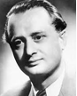Édesapja Ortutay István katolikus újságíró, a  *Szegedi Napló *szerkesztője volt. 1934-ben a szegedi Ferenc József Tudomány-egyetem magyar-latin-görög tanári szakán szerzett oklevelet. Legszívesebben a bencés rendi szerzetes tanár Várkonyi Hildebrand Dezső peda-gógiai-lélektani, valamint Solymossy Sándor néprajzi kurzusait látogatta.

Magyarországon a szegedi volt az első néprajzi intézet, az intézetében volt gyakornok [Bálint Sándor](https://hu.wikipedia.org/wiki/B%C3%A1lint_S%C3%A1ndor_(n%C3%A9prajzkutat%C3%B3)), a [20. századi](https://hu.wikipedia.org/wiki/20._sz%C3%A1zad) [magyar néprajz](https://hu.wikipedia.org/wiki/N%C3%A9prajz) és folklorisztika talán legkitűnőbb alakja. Az intézetben hozták létre a grafikus Buday György vezette [Szegedi Fiatalok Művészeti Kollégiumá](https://hu.wikipedia.org/wiki/Szegedi_Fiatalok_M%C5%B1v%C3%A9szeti_Koll%C3%A9giuma)t (SZFMK). Még ez évben magyar néprajzlélektan szaktárgyakból bölcsész-doktori oklevelet szerzett.

Ortutay érdeklődése hamar a folklór felé fordult, mely témáról néprajzi tár-gyú írásokat jelentetett meg. Diplomamunkáját is a néplélektani *(A magyar lélek alapvonásai népi kultúránkban)* témában írta. 1935-ben az Állástalan Diplomások Országos Bizottsága gyakornoka a *Magyar Nemzeti Múzeum-ban*. 1935-től 1944-ig a *Magyar Rádió* munkatársa; az irodalmi osztály helyettes vehetője lett. Közben a harmincas évek második felében Kozma Miklós belügyminiszter gyermekének házitanítója. 1935-1937 és 1942-1943 között szerkesztette a régi SZFMK-sokkal a [*Magyarságtudomány*](https://hu.wikipedia.org/wiki/Magyars%C3%A1gtudom%C3%A1ny_(foly%C3%B3irat)) című folyóiratot, majd a Délvidék visszatérte után publikált a [*Délvidéki Szemle*](https://hu.wikipedia.org/wiki/D%C3%A9lvid%C3%A9ki_Szemle) című folyóiratban.

1936-ban és 1942-ben [Baumgarten-](https://hu.wikipedia.org/wiki/Baumgarten-d%C3%ADj)díjjal jutalmazták. A fővárosban szo-ros baráti szálak fűzték Radnóti Miklóshoz. 1937-ben kapcsolódott be a munkásmozgalomba, itt került kapcsolatba kapcsolatba a baloldali, főleg kommunista érzelmű értelmiségiekkel. A [Szegedi Szabadtéri Játékok](https://hu.wikipedia.org/wiki/Szegedi_Szabadt%C3%A9ri_J%C3%A1t%C3%A9kok) első rendezőjével [Hont Ferenc](https://hu.wikipedia.org/wiki/Hont_Ferenc)el, és a [*Márciusi Front*](https://hu.wikipedia.org/wiki/M%C3%A1rciusi_Front) megszervezőjével a kom-munista [Kállai Gyul](https://hu.wikipedia.org/wiki/K%C3%A1llai_Gyula)ával tartott kapcsolatot. Ortutayra mégis a legnagyobb hatást a kisgazda [Bajcsy-Zsilinszky Endre](https://hu.wikipedia.org/wiki/Bajcsy-Zsilinszky_Endre) eszmeisége gyakorolta.

1942 tavaszán egyik szervezője a gyorsan betiltott *Magyar Történelmi Emlékbizottságnak*. A világháború sűrejében kezdett nyíltan politizálni, a Független Kisgazda-párthoz csatlakozva. Az 1944 márciusi német meg-szállás után a Magyar Rádiónál betöltött állásáról lemondott, és a Grill könyvesboltban helyezkedett el. Bekapcsolódva az ellenállási mozga-lomba, Bajcsy-Zsilinszky Endre kérésére elkészítette az FKgP művelődés- és oktatásügyi programját. 1944 őszén a [nyilaskeresztes](https://hu.wikipedia.org/wiki/Nyilaskeresztes_P%C3%A1rt_%E2%80%93_Hungarista_Mozgalom) puccsot követően, részt vállalt az ifjúsági ellenállás szervezésében.

Részt vett a *Görgey-zászlóalj* megalakításában. Az ostromot a *Magyar Nemzeti Múzeum* pincéjében vészelte át. A háborút követő koalíciós idők-ben tagja volt a *Budapesti Nemzeti Bizottságnak*, 1945 februárjától kis-gazda színekben az ideiglenes országos vezetőség kulturális bizottságának elnöke, a párt budapesti szervezete intézőbizottságának tagja, a fővárosi központ kulturális osztályának vezetője volt.

1945 augusztusától bekerült az FKGP Országos Intéző Bizottságába, majd az Ideiglenes Nemzetgyűlés képviselője, 1945-1953 között nemzetgyűlési, illetve országgyűlési képviselő. A párt balszárnyának egyik vezető (kripto-kommunista) személyisége, baráti körével együtt - „O” csoport- 1946. március 7-én megfogalmazták az un. FKGP balszárny nyilatkozatot, a-melyben követelték a Baloldali Blokkval való együttműködést. Baloldali magatartása miatt 1946 júliusában pártfegyelmit kapott, majd augusztus elején kizárták a párt politikai bizottságából.

1945 szeptemberétől a néprajz egyetemi tanára, egyben 1945-1947 között a *Magyar Központi Híradó* Rt. (a Rádió, az MTI és a Filmhíradó) elnöke, majd akadémiai levelező tag 1947 februárjától a kisgazdapárti népi kol-légiumokat tömörítő *Magyar Kollégiumi Egyesület* élén állt.

Mint a kommunisták beépített emberének jelentős része volt a Nagy Fe-renc miniszterelnök lemondatását (1947. június 2.) előkészítő pártközi tárgyalásokon. 1947-től 1950-ig vallás- és közoktatásügyi miniszter.

Miniszterként szorgalmazta az egyházi iskolák államosítását és részese volt a tudomány-oktatás valamint az akadémia bolsevizálásának. 1947 jú-niusától szeptember 12-ig ismét a politikai bizottság tagja, június 29-től a polgári tagozat tarselnöke. 1948. április 17-től a teljessen balratolódott FKGP Politikai Bizottság tagja, a párt társelnöke.

Számos társadalmi egyesület tagja illetve vezetője; a *Partizánbarátok Szö-vetsége*, a *Magyar-Szovjet Művelődési Társaság*, 1948. december 14-től az MTA-t átszervező magyar Tudományos Tanács társelnöke. 1948 júliusá-ban a „Dolgozók az iskoláért” mozgalom országos intézőbizottságának elnökévé választották. 1950-1952 között a Múzeumok Országos Központ-jának vezetőjeként a múzeumügyet és a műemlékvédelmet irányította.

1949 márciusától a *Magyar Függetlenségi Népfront* Országos tanácsának, 1954. október 24-től a *Hazafias Népfront* Országos Tanácsának tagja.

Több mint fél évtizedes mellőzöttség után, a Kádár-rendszer konszolidá-cióját támogatva 1957-ben kapcsolódott be ismét a politikai életbe, az újjászervezett *Hazafias Népfront* főtitkárává választották, majd 1958 novemberétől az Elnöki Tanács tagja lett. 1970 és 1978 között a parlament kulturális bizottságának elnöke, majd 1957-től 1963-ig az ELTE rektora volt.

1964-től a *Tudományos Ismeretterjesztő Társulat* elnöki posztját töltötte be. Közéleti szerepe mellett az 1930-as évektől kezdve jelentős tudomá-nyos tevékenységet fejtett ki. Kutatási területe a folklór, ezen belül a népmese és a népballada vizsgálata volt. Az Európaszerte ismert magyar folklorisztikai iskola megteremtője.

Vezető szerepet töltött be a magyar néprajztudományban. 1950-től haláláig szerkesztette az *Acta Ethnographicát*, 1949 és 1956 között főszerkesztője volt az *Ethnographia *című folyóiratnak. Főszerkesztőként irányította a *Magyar néprajzi lexikon *munkálatait.

“Új iskolát teremtett [Népmesegyűjtései](http://hu.wikipedia.org/wiki/N%C3%A9pmese)nek [1940](http://hu.wikipedia.org/wiki/1940)-es első kiadásával, az [*Új Magyar Népköltési Gyűjtemény*](http://hu.wikipedia.org/w/index.php?title=%C3%9Aj_Magyar_N%C3%A9pk%C3%B6lt%C3%A9si_Gy%C5%B1jtem%C3%A9ny&action=edit&redlink=1) című sorozat a magyar és külföldi szöveg-folkloristák részéről egyaránt egy új szakmai rendszert jelenttett ([magyar iskola](http://hu.wikipedia.org/w/index.php?title=Budapesti_iskola_%28n%C3%A9prajz%29&action=edit&redlink=1)). [1967](http://hu.wikipedia.org/wiki/1967)-ben szervezőmunkája eredményeképpen önállósult a nép-rajztudomány akadémiai kutatóbázisa.

Irányította az [*Új Magyar Népköltési Gyűjtemény*](http://hu.wikipedia.org/w/index.php?title=%C3%9Aj_Magyar_N%C3%A9pk%C3%B6lt%C3%A9si_Gy%C5%B1jtem%C3%A9ny&action=edit&redlink=1) című sorozat és az öt-kötetes [*Magyar néprajzi lexikon*](http://hu.wikipedia.org/w/index.php?title=Magyar_n%C3%A9prajzi_lexikon&action=edit&redlink=1) szervezési és szerkesztési, illetve a halálát követően megjelent *Magyar Néprajz* Nyolc Kötetben című sorozat elő-készítő munkálatait. 1970-1973 között elnökként ő vezette az MTA I. Osztályának, a Nyelv- és Irodalomtudományok Osztályának munkáját.

Tiszteletbeli tagja volt a [Finn Tudományos Akadémiának](https://hu.wikipedia.org/w/index.php?title=Finn_Tudom%C3%A1nyos_Akad%C3%A9mia&action=edit&redlink=1), egyben dísz-doktora a [Helsinki Egyetemnek](https://hu.wikipedia.org/wiki/Helsinki_Egyetem). A szocialista rendszer kitüntetéseikkel halmozta el, 1948-ban [Kossuth Érdemrend](https://hu.wikipedia.org/wiki/Kossuth-%C3%A9rdemrend)et, 1975-ben [Állami Díj](https://hu.wikipedia.org/wiki/A_Magyar_N%C3%A9pk%C3%B6zt%C3%A1rsas%C3%A1g_%C3%81llami_D%C3%ADja) I. fo-kozatát kapta” (a néprajztudomány terén kifejtett tevékenységéért, a 

Hungarian Folklore című összefoglaló művéért), 1978-ban [Akadémiai Aranyérem](https://hu.wikipedia.org/wiki/Akad%C3%A9miai_Arany%C3%A9rem) kitüntetést kapott”. 1970-ben [Tálasi Istvánnal](https://hu.wikipedia.org/wiki/T%C3%A1lasi_Istv%C3%A1n) együtt elsőként vehette át a *Magyar Néprajzi Társaság* akkor alapított [Györffy István-emlékérmét](https://hu.wikipedia.org/wiki/Gy%C3%B6rffy_Istv%C3%A1n-eml%C3%A9k%C3%A9rem). Tudományos munkássága elismeréséül megkapta a Pitrf-díjat (1962), a Herder-díjat (1972).

Főbb művei: *A magyar lélek alapvonásai népi kultúránkban (1933), Tö-mörkény István; (1934), A magyar parasztság szerelmi élete (1935), Parasztságunk élete  (1937), Rákóczi két népe (1939), Fedics Mihály meséi (1940), A magyar népművészet, I–II. köt. (1941), [Kálmány Lajos](https://hu.wikipedia.org/wiki/K%C3%A1lm%C3%A1ny_Lajos) és a mo-dern néprajzi gyűjtés  (1941/4.), A mai magyar belső vándorlás és a nép-rajzi kutatás (1947), A magyar népköltészet  (1952), Kis magyar néprajz (1958), Halhatatlan népköltészet: Néprajzi vázlatok (1966), Hungarian folklore. Essays; angolra ford. (Butykai István; 1972), Magyar néprajzi lexikon, 1-5.; főszerk. (Ortutay Gyula; 1977-1982), [Balassa Iván](https://hu.wikipedia.org/wiki/Balassa_Iv%C3%A1n)-Ortutay Gyula: Magyar néprajz (1979), A nép művészete (1981). *

Forrás: *[Magyar Életrajzi Lexikon 1000-1990](https://www.google.rs/url?sa=t&rct=j&q=&esrc=s&source=web&cd=4&cad=rja&uact=8&ved=0ahUKEwimxJratZzcAhUvsqQKHS-1DJsQFgguMAM&url=http%3A%2F%2Fmek.oszk.hu%2F00300%2F00355%2Fhtml%2FABC09732%2F10711.htm&usg=AOvVaw2qd7-KWKO4z_zhRxtGfjz7). [Magyar nagylexikon](https://hu.wikipedia.org/wiki/Magyar_nagylexikon) XIV.*

**Ortvay** *Orthmayr* **Tivadar** (Csiklovabánya, [1843](http://hu.wikipedia.org/wiki/1843). [november 19.](http://hu.wikipedia.org/wiki/November_19.) – [Bu-dapest](http://hu.wikipedia.org/wiki/Budapest), [1916](http://hu.wikipedia.org/wiki/1916). [július 8.](http://hu.wikipedia.org/wiki/J%C3%BAlius_8.)) történész, régész, földrajztudós, az MTA tagja.

Édesapja, Orthmayr Károly a csiklovai bányák igazga-tója, középiskolai tanulmányait a nagyváradi premontrei gimnáziumban végezte. 1862-től a temesvári papnevelő intézetben tanult teológiát. 1866-ban pappá szentelték, és a csanádi egyházmegyében segédlelkész. 1870-től a lu-gosi gimnázium tanára.

1873-tól a *Magyar Nemzeti Múzeum* régiségtárának se-gédőre. 1874-ben bölcsészdoktori oklevelet szerzett a budapesti egyetemen, majd a következő évben Ortvayra váltóztatta meg a nevét. 1875-1905 között a pozsonyi jogakadémián a magyar és egyetemes történelem rendes tanára. 1894-1900 között a pozsonyi Orsolya-rendi apácák tanítóképző intézetének igazgatója és tanára.

1895-1905 között Frigyes főherceg leányainak történelemtanára. 1892-től pápai kamarás, 1900-tól címzetes csanádi apát. Az 1900-as években Po-zsonyban napközi gyermekmenhelyet alapított. 1906-tól újra Budapesten élt, és történelmi és levéltári kutatásoknak szentelte magát. [Történészként](http://hu.wikipedia.org/wiki/T%C3%B6rt%C3%A9nettudom%C3%A1ny) behatóan vizsgálta a [Kárpát-medence](http://hu.wikipedia.org/wiki/K%C3%A1rp%C3%A1t-medence) [történeti vízrajzát](http://hu.wikipedia.org/wiki/T%C3%B6rt%C3%A9neti_f%C3%B6ldrajz) és középkori [egyházi földrajzát](http://hu.wikipedia.org/w/index.php?title=Egyh%C3%A1zi_f%C3%B6ldrajz&action=edit&redlink=1). Jelentős munkásságot fejtett ki [Pozsony](http://hu.wikipedia.org/wiki/Pozsony_v%C3%A1rmegye) és [Temes vár-megyék](http://hu.wikipedia.org/wiki/Temes_v%C3%A1rmegye) történeti és természetrajzi leírásában.

[Régészeti](http://hu.wikipedia.org/wiki/R%C3%A9g%C3%A9szet) kutatásai során tipologizálta az [őskori](http://hu.wikipedia.org/wiki/%C5%90skor) kőeszközöket, miközben feltérképezta az ókori [pannoniai](http://hu.wikipedia.org/wiki/Pannonia_%28provincia%29) úthálózatát. 1887-től részt vett a [*Szent István Társulat*](http://hu.wikipedia.org/wiki/Szent_Istv%C3%A1n_T%C3%A1rsulat) tudományos és irodalmi osztályának munkájában, ezzel együtt mintegy száz történelmi, régészeti és földrajzi szócikket írt az [*Egye-temes magyar encyclopaedia*](http://hu.wikipedia.org/w/index.php?title=Egyetemes_magyar_encyclopaedia&action=edit&redlink=1) számára.

Ortvay Tivadar történész-régészként foglalkozott Pozsony és Temes vár-megyék történetével. 1871-74-ben a Történelmi Adattár *Csanád egyház-megye hajdana és jelenéhez* című havi folyóirat szerkesztője; négy kö-tetben összesen 42 füzet jelent meg.

1875-76-ban az *Archaeologiai Értesítő* segédszerkesztője. Kéziratban fennmaradt művei közül a *Hazánk legrégibb művelődési viszonyai* címűt az Akadémián 1896. március 30-án felolvasta. Az MTA bízta meg Pesty Frigyes irodalmi hagyatéka egy részének feldolgozásával.

*Magyarország egyházi földleírása a XIV. század elején* című munkája két kötetben jelent meg. A hatalmas opus a pápai tizedjegyzékek helyneveinek magyarázatával, és a középkori magyar egyházmegyék beosztásával fog-lalkozott, feltüntetve az egyházmegyék akkori állapotát. A könyvvel régi elgondolás jutott a csúcspontjára.

Még Fraknói Vilmos kezdeményezésére külön bizottság alakult, amely Ortvayt bízta meg a mű elkészítésével. A külföldi példákat megelőző, új módszert dolgozott ki. A Bevezetésben a tizedlajstromok történeti értékét és hasznosíthatóságát vette górcső alá. Feldolgozta az esztergomi és kalo-csai érsekségek, a nyitrai, a váci, a győri, a csanádi, a váradi és a zágrábi püspökségek történeti, földrajzi adatait. Nagy gondot fordított a térképek szerkesztésére.

*Pozsony város történetének* megírásával az Első Pozsonyi Takarékpénztár félszázéves fennállását akarta emlékezetessé tenni. Célja egy kézikönyv elkészítése volt, az olvasó-közönséget a polgárságban látta. Éppen ezért tartózkodott a száraz és nehézkes előadástól, élvezetes, de mégis tudo-mányos alapokon álló munkát adott ki kezei közül. Teljesen kiaknázta a pozsonyi levéltárakat, az oklevelekből nyert információkat beépítette mű-vébe. Nem csupán a históriai adatokat vette számba, nem feledkezett meg Pozsony vármegye állatvilágáról sem.

Az Akadémia felhívására hozzáfogott a Temes megyét taglaló monográfia elkészítéséhez, amihez egy komoly oklevéltár is csatlakozott. Az őskort bemutató rész, amelyben kitért a teljes magyar anyagra, komoly szakmai elismerésben részesült. A mű végül a szerző halála miatt a honfoglalás ko-ránál torzó maradt.

Utolsó nagy művében *Habsburg Mária* személyét vázolta fel, számos for-rást a belga levéltárakban lelt fel. 1887-től a *Szent István Társulat* Tudo-mányos és Irodalmi Osztályának, 1916-tól a *Szent István Akadémia* tagja. 1911-től haláláig a *Magyar Heraldikai és Genealógiai Társaság* másod-elnöke. A pozsonyi régészeti és történelmi egyesület alelnöke és alapító tagja, a pozsonyi természettudományi társulat alelnöke, a békés-megyei régészeti és művelődéstörténeti egylet tiszteleti tagja. Egyúttal a magyar-országi vatikáni bizottság és a Pozsony-városi statisztikai hivatal tagja.

Az Akadémia javára mintegy 50 000 forint értékben tett alapítványokat. 1911-től 1916-ig a [*Magyar Heraldikai és Genealógiai Társaság*](http://hu.wikipedia.org/wiki/Magyar_Heraldikai_%C3%A9s_Geneal%C3%B3giai_T%C3%A1rsas%C3%A1g) másod-elnöki tisztét töltött be”.

Főbb művei: *Egy állítólagos római mediterrán-út Pannóniában (1873), Margum és Contra-Margum helyfekvése (1876), A magyarországi Duna-szigetek (1880), Magyarország régi vízrajza a XIII. század végéig. (I-II. 1882), A pécsi egyházmegye alapítása és első határai (1890), Magyar-ország egyházi földleírása a XIV. század elején (I-II. 1891-92), A mohácsi csata elvesztésének okai és következményei (19109, Mária, II. Lajos magyar király neje (1914) stb. *

Forrás: [Szinnyei József](https://hu.wikipedia.org/wiki/Szinnyei_J%C3%B3zsef_(bibliogr%C3%A1fus)) - [*Magyar írók élete és munkái IX.*](http://mek.oszk.hu/03600/03630/html/o/o18515.htm) 1903. *Magyar életrajzi lexikon* [*II.*](http://mek.oszk.hu/00300/00355/html/ABC11371/11517.htm) 1969.

**P**

**Palánkay** *Gausz* **Tibor**, SJ (Palánka, 1907. április 11. - München, NSZK, 1982. február 23.) a leánynevelés és a családpasztoráció apostola, lelki író. Édesapja kántortanító, míg édesanyja művelt, és vallá-sos asszony volt. Nyolcan voltak testvérek, rajta kí-vül egyik fivére  pap, egyik növére pedig apáca lett. 

Tibor 1925-ben kalocsai gimnazistaként hetedikes ko-rában jelentkezett a Jézus Társaságába. Az akkori pro-vinciális atya, Csávossy Elemér vette fel a rendbe. 

Az Érden végzett noviciátus végeztével 1927. Szep-tember 8-án örökfogadalmat tesz. A fogadalomtétel után visszatér Kalocsára, ahol 1928-ban kitűnően érettségizik.

A filozófiát Budapesten majd Szegeden, a teológiát 1934-ben Innsbruck-ban, valamint Szegeden végezte. 1937 júniusában szenteltelték pappá. [1939](https://hu.wikipedia.org/wiki/1939)-ben a budapesti Manrézában ([jezsuita](https://hu.wikipedia.org/wiki/J%C3%A9zus_T%C3%A1rsas%C3%A1ga) lelkigyakorlatos ház - melyet [1927](https://hu.wikipedia.org/wiki/1927)-ben a bánsági [Csávossy Elemér](https://hu.wikipedia.org/w/index.php?title=Cs%C3%A1vossy_Elem%C3%A9r&action=edit&redlink=1) vezetésével hozták létre a [Zugli-getben](https://hu.wikipedia.org/wiki/Zugliget)), [1940](https://hu.wikipedia.org/wiki/1940)-1942 között Szegeden, majd Szatmárnémetiben volt lelki-pásztor. [1943](https://hu.wikipedia.org/wiki/1943)-[1944](https://hu.wikipedia.org/wiki/1944) között tábori lelkész a fronton.

A második világháborút követően Szatmárnémetiből a kispesti jezsuita plébániára került, ahol megalapította a Családok Szeretetszövetségét, hol [1949](https://hu.wikipedia.org/wiki/1949)-ben házfőnök lett. [1950](https://hu.wikipedia.org/wiki/1950) szeptemberében, a rend feloszlatásakor a váci egyházmegyébe került, azonban onnét hamarosan elbocsátották, nem esett kétségbe hanem villanyszerelőként dolgozott tovább. [1955](https://hu.wikipedia.org/wiki/1955). [augusz-tus 23-án](https://hu.wikipedia.org/wiki/Augusztus_23.) letartóztatták, [1956](https://hu.wikipedia.org/wiki/1956) februárjában 8 évre elítélték, de az 56-os forradalom alatt kiszabadult. A fegyházban kötött szoros barátságot Vácz Jenő jezsuita atyával. Szabadulásuk után születtett meg Vácz Jenő atya előszavával, a *Szeretetből nőtt egyházközség* c. írása. 

[1957](https://hu.wikipedia.org/wiki/1957) októberében a büntetést kitöltöttnek vették. Ruhagyári munkás lett, majd [1959](https://hu.wikipedia.org/wiki/1959)-től a pestlőrinci plébánia adószedője is. [1967](https://hu.wikipedia.org/wiki/1967)-ben ment nyug-díjba, ezután Kispesten volt kisegítő lelkész. [1973](https://hu.wikipedia.org/wiki/1973)-ban megengedték, hogy kivándoroljon Magyarországról. Rómában, majd haláláig Münchenben élt, ahol [1979](https://hu.wikipedia.org/wiki/1979)-ig kórházlelkészi szolgálatot teljesített.

Főbb művei: *Ragyogó szemek* (1940), *A jegygyűrűért* (1941), *Énekeljen a szíved is!* (1942), *Boldogasszony édes*... (1943), *Szívet a családnak* 81945), *Családi szentóra* (1947), *A szeretet aszketikája és misztikája* (1970), *Veled beszélgetek* (1971), (Rendesi M. álnéven) - *Lelkivezetők kv-e.* I. *Verjetek benne gyökeret* (1972), (Zimonyi S. álnéven); *A szeretet forradalma* (1974). Forrás: *[Magyar Katolikus Lexikon](http://lexikon.katolikus.hu/P/Pal%C3%A1nkay.html). [Jezsuita névtár](https://www.google.rs/url?sa=t&rct=j&q=&esrc=s&source=web&cd=2&cad=rja&uact=8&ved=2ahUKEwit8Zi2lo3dAhXGL1AKHYNVDqgQFjABegQIBxAB&url=http%3A%2F%2Fjezsuita.hu%2Fnevtar%2Fpalankay-gausz-tibor%2F&usg=AOvVaw1Jg4wGLjd6NYJx4rt2eIt5)*

**Pálffy** *Oesterreicher* **György** ([Temesvár](http://hu.wikipedia.org/wiki/Temesv%C3%A1r), [1909](http://hu.wikipedia.org/wiki/1909). [szeptember 16.](http://hu.wikipedia.org/wiki/Szeptember_16.) – [Buda-pest](http://hu.wikipedia.org/wiki/Budapest), [1949](http://hu.wikipedia.org/wiki/1949). [szeptember 24.](http://hu.wikipedia.org/wiki/Szeptember_24.)) altábornagy.

A család Temesvárott élt, édesapja Oesterreicher György banktisztviselőként dolgozott. Az I. világháború előtt köl-töztek Budapestre. Ifj. Oesterreicher György az Óbudai Árpád Gimnáziumban érettségizett.

Tényleges katonai szolgálata közben a Ludovika Akadé-miára jelentkezett. 1932. augusztus 20-án tüzér hadnagy-gyá avatták, ezt követően Pécsett és Kecskeméten végzett csapatszolgálatot. 1936-ban egyéves olaszországi tanul-mányúton vett részt, majd megkezdte 30 hónapos felsőfokú tiszti képzését a Schweitzer István  vezette Hadiakadémián.

1939-ben felesége zsidó származása, illetve németellenessége miatt le-mondott rangjáról, és megvált a hadseregtől. Civilként az [Egyesült Izzóban](http://hu.wikipedia.org/w/index.php?title=Egyes%C3%BClt_Izz%C3%B3&action=edit&redlink=1) cégvezetői állást kapott. Itt került kapcsolatba a az illegális kommunista párttal. Hogy fedezze politikai tevékenységét, az utasításukra belépett a [Független Kisgazda Párt](http://hu.wikipedia.org/w/index.php?title=F%C3%BCggetlen_Kisgazda_P%C3%A1rt&action=edit&redlink=1) értelmiségi tagozatába.

A második világháború alatt háborúellenes agitációt fejtett ki, majd 1944 őszén megbízták a kommunista párt katonai bizottságának vezetésével. Az MKP Katonai Bizottságának vezetőjeként tevékenyen részt vett a buda-pesti ellenállási mozgalom megszervezésében és irányításában.

1944 végén és 1945 elején részese volt a Debrecenben létrejött Ideiglenes Nemzeti Kormány hadseregének felállításában (már amennyire a szovje-tek engedték). A magyar [Ideiglenes Nemzeti Kormány](https://hu.wikipedia.org/wiki/Ideiglenes_Nemzeti_Korm%C3%A1ny) küldöttségének ne-vében [Gyöngyösi János](https://hu.wikipedia.org/wiki/Gy%C3%B6ngy%C3%B6si_J%C3%A1nos_(politikus)) [külügyminiszter](https://hu.wikipedia.org/wiki/Magyarorsz%C3%A1g_k%C3%BCl%C3%BCgyminisztereinek_list%C3%A1ja) 1945. [január 20-án](https://hu.wikipedia.org/wiki/Janu%C3%A1r_20.) Moszkvában aláírta a [Szovjetunióval](https://hu.wikipedia.org/wiki/Szovjetuni%C3%B3) megkötött fegyverszüneti megállapodást. Ezek u-tán az ország szuverenitását korlátozva az egyezmény betartatását, a [Vo-rosilov](https://hu.wikipedia.org/wiki/Kliment_Jefremovics_Vorosilov)  [marsall](https://hu.wikipedia.org/wiki/Rendfokozat) vezette *Szövetséges Ellenőrző Bizottságra* (SZEB) bízta.

Pálffy Györgyöt Vörös János honvédelmi miniszter a minisztérium (HM KATPOL) katonapolitikai azaz, elhárító osztályának ve-zetésével bízta meg. Feladatuk kezdetben az ellenséges elemek és háborús bűnösök demokratikus hadseregbe való bekerülésének megakadályozása, valamint a hadifogság-ból hazatértek ellenőrzése volt. - *Vörös János -*

Pálffy György beosztottaival leginkább az MKP politikai ellenfelei közéletből való kiiktatására törekedtek.

1946-ban ezredesi rangban, a határőrség parancsnokává nevezték ki, majd

még ez év végén beválasztották a hadsereg fejlesztésével kapcsolatos fela-datok megoldására alakult öt fős bizottságba.

Pálffy a [Péter Gábor](http://hu.wikipedia.org/wiki/P%C3%A9ter_G%C3%A1bor) vezette politikai rendőrséggel vetélkedve, megkezdte a legnagyobb parlamenti párt, a kisgazdák elleni akciókat. Elvtársi segít-ségként Kovács Bélát, a kisgazda párt főtitkárát a kommunisták fő ellen-felét, a szovjet titkosszolgálat 1947. február 25-én este letartóztatta és elrabolta. Ezt azért kellett bevetni, mivel a hamis gyanúsítgatások okán a parlament a kommunisták követelése ellenére sem adta ki.

A [Svájcban](http://hu.wikipedia.org/wiki/Sv%C3%A1jc) gyógykezelés alatt álló kisgazda Nagy Ferencet miniszter-elnök helyett, [Rákosi Mátyás](http://hu.wikipedia.org/wiki/R%C3%A1kosi_M%C3%A1ty%C3%A1s) Kovács NKVD-s kihallgatási jegyzőköny-vére hivatkozva a kisgazda miniszterelnököt az állítólagos összeesküvés-ben való részvétellel vádolta meg. Nagy Ference ezek után már nem tért vissza Magyarországra, s néhány nappal később ugyancsak külföldre me-nekült [Varga Béla](http://hu.wikipedia.org/w/index.php?title=Varga_B%C3%A9la_%28politikus%29&action=edit&redlink=1), az országgyűlés (akkor nemzetgyűlés) kisgazda elnöke is. Pálffy Györgyöt az „ellenség” sikeres kiiktatását követően altábornagy-gyá léptették elő.

1948 februárjában részt vett a Moszkvában megtartott magyar-szovjet ba-rátsági és kölcsönös segítségnyújtási szerződést kidolgozó tárgyalásokon. A húsz évre szóló egyezmény elsősorban "az esetlegesen újjáéledő német agresszió esetén kölcsönös katonai segítségnyújtást ígért". Valós célja azonban az volt, hogy megakadályozza Magyarország bármiféle szovjet-ellenes szövetségi rendszerhez történő csatlakozását. 1948 tavaszára a Szovjetunió a nyugati határai mentén elterülő valamennyi állammal - ha-sonló szerződések alapján - szövetséges viszonyt teremtett.

Katonai pályfutása meredeken ívelt felfelé, tagja lett a hadsereg átszer-vezése céljából létrehozott új Katonai Bizottságnak. 1948 tavaszán Farkas Mihály - hivatásos forradalmár - a párt főtitkárhelyettese lett a honvédelmi miniszter, az [1948](https://hu.wikipedia.org/wiki/1948). [szeptember 9-étől](https://hu.wikipedia.org/wiki/Szeptember_9.) [1953](https://hu.wikipedia.org/wiki/1953). július 2-áig honvédelmi mi-niszterként tevékenykedő képzetlen „aparatcsik” igényt tartott a régi ká-derekre. 1948 végén Pálffy György a miniszter állandó helyettese, vala-mint a honvédségi kiképzés irányítója lett. Mind később kiderült Pálffynak kár volt egy moszkovitában bíznia, főnöke szervezte meg  a [tábornokok peré](https://hu.wikipedia.org/wiki/T%C3%A1bornokok_pere)t. - *Farkas Mihály és Péter Gábor -*

A két munkáspárt egyesülésével létrejött az (Magyar Dolgozók Pártja) állampárt, melynek Központi Vezetőségi tagja lett.

A Magyar kommunisták igazodtak a Szovjetunióban folyó koncepciós perekhez, párttisztogatás végül a teljes - közötte a hadsereg - államvezetés kirakatperévé alakult.

A jugoszlávok magyarországi felforgató szerepének bizonyítására poli-tikai pert indítottak [Rajk László](https://hu.wikipedia.org/wiki/Rajk_L%C3%A1szl%C3%B3_(politikus)) belügyminiszter ellen. Mivel összeeskü-vés nem lehetséges katonai résztvevők nélkül – Farkas javaslatára a Rajk-per körüli a nyomozást kiterjesztették a honvédség felügyelőjének szemé-lyére. Rajk László volt belügyminiszter bukását a belügyminisztérium alá tartozó ÁVO vezetője Péter Gábor okozta, aki nem kívánta eltűrni Rajk beavatkozásait, ebben támogatta a Rajk befolyására féltékeny Farkas Mi-hály honvédelmi miniszter is. [1949](https://hu.wikipedia.org/wiki/1949). május 30-án  Rajkot a kémkedés ko-holt vádja alapján (a [Magyar–Jugoszláv Társaság](https://hu.wikipedia.org/w/index.php?title=Magyar%E2%80%93Jugoszl%C3%A1v_T%C3%A1rsas%C3%A1g&action=edit&redlink=1) elnöke volt), letartóz-tatták. Még előtte [1949](https://hu.wikipedia.org/wiki/1949). március 25-én Vörös János nyugalmazott vezér-ezredest és volt honvédelémi minisztert is kémkedés vádjával letartótatták, majd életfogytiglani fegyházbüntetésre ítélték.

1949. május 1-jén még [Pálffy György](https://hu.wikipedia.org/wiki/P%C3%A1lffy_Gy%C3%B6rgy_(alt%C3%A1bornagy)) fogadta az első díszszemle parancs-nokának jelentését, majd május 5-én családi nyaralás közben, a balaton-lellei kertmoziban tartóztatta le két civil ruhás nyomozó. Július 5-én ügyét a Rajk-pertől elkülönítve, katonai bíróság tárgyalta. A katonapolitikai osz-tály élén hírhedtté vált, de a honvédség fejlesztésben érdemeket szerzett tábornoknak esélye sem volt a túlélésre. A [második világháborút](https://hu.wikipedia.org/wiki/M%C3%A1sodik_vil%C3%A1gh%C3%A1bor%C3%BA) követően Magyarország lassan, de biztosan kiépült a szovjet mintájú diktatúra. A korlátlan kommunista hatalom eszköze volt a demokratikus államrend és a köztársaság büntetőjogi védelméről szóló törvény. E törvény alapján 1946-1956 között több mint negyvenezer embert ítéltek börtönre, és közel félezret ki is végeztek.

A korszak legnagyobb koncepciós pere a [Rajk-per](https://hu.wikipedia.org/wiki/Rajk_L%C3%A1szl%C3%B3_(politikus)) volt, amelyben [Pálffy Györgyöt](https://hu.wikipedia.org/wiki/P%C3%A1lffy_Gy%C3%B6rgy_(alt%C3%A1bornagy))  is elítélték. dr. Jávor Iván vezette bíróság az ellene felhozott vádpontokban bűnösnek találta, és kötél általi halálra ítélte. Pálffynak nemcsak a peréről, de a kivégzéséről is készültek filmfelvételek (1949. október 24-i kivégzéséről film készült) amelyet propagandacéllal vetítet-tek *Vesszenek az árulók* címmel. Az elsőrendű vádlott Pálffy György mel-lett még négy főt vádoltak meg a koncepciós perben, társai (egy kivétellel) ugyancsak halálos ítéletet kaptak. Az elítélteket 1949. szeptmber 24- én, a Margit körúti katonai börtön udvarán, színpadias körülmények között akasztották fel. A kivégzést Révay Kálmán vezérőrnagy, Pálffy György iskoláskori barátja vezényelte.

Az 1955. évi részleges rehabilitációja után, 1956. október 6-án ünnepélyes keretek között, Rajk Lászlóval, Szőnyi Tiborral és Szalai Andrással együtt újratemették. Az eredeti periratokat 1957-ben bezúzták. Teljes rehabili-tációjára 1963. szeptember 27-én került sor”. 1990-ig a budapesti Balaton utca viselte a nevét.

Forrás: [*Magyar életrajzi lexikon*](http://www.mek.iif.hu/porta/szint/egyeb/lexikon/eletrajz/html/ABC11587/11642.htm)

Báró **Pap Géza** ([Nagybecskerek](https://hu.wikipedia.org/wiki/Nagybecskerek), 1864. június 11. – [Budapest](https://hu.wikipedia.org/wiki/Budapest), 1934. július 9.) ügyvéd, országgyűlési képviselő, pénzügyi szakember.

Édesapja Pap Simon, [Torontál vármegye](https://hu.wikipedia.org/wiki/Toront%C3%A1l_v%C3%A1rmegye)i földbirto-kos, anyja Simay Anna. Az édesanyja dédszülei te-legdi Jakabffy Miklós, táblabiró, földbirtokos és ele-méri és ittebei Kiss Anna voltak. Testvérei Ernő, Ilona, és Dezső voltak, akiknek a birtokaik a volt ele-méri és ittebei Kiss Ernő uradalmán helyezkedtek el.

A gimnáziumot [Nagybecskereken](https://hu.wikipedia.org/wiki/Nagybecskerek) végezte.

Jogi tanulmányokat folytatott Budapesten, Berlinben, Heidelbergben, Párizsban és Bécsben. Tanulmányait követően, 1887-től Torontál vármegye aljegyzője, 1890-től főjegyző, majd 1891-től ügyvéd volt Nagybecskereken. [1888](https://hu.wikipedia.org/wiki/1888)-ban a budapesti egyetemen jogi doktorrá avatták.

1892-ben a bégaszentgyörgyi kerület szabadelvű párti képviselőjévé vá-lasztották. Első ciklusában, 1892–1906 között volt országgyűlési képvi-selő. Az egyházpolitikai viták során az izraelita vallás recepciójáról szóló törvényjavaslat előadója volt. Papp Géza szerint a zsidók olyan „tiszták”, mint a katolikusok, nem kell hitelveket benyújtani.

A zsidó vallás egyenjogúsítása Magyarországon, amelyet az 1895. XLII. t.-c. biztosított, Vázsonyi Vilmos - a korszak legjelesebb zsidó származású politikusa - felfogása szerint a zsidó emancipációt a magyar nemzet érdeke kívánja.

Papp Géza 1896-tól az országos közoktatási tanács tagja volt. 1905-ben a koalíciós időszakban visszavonult a politikától. 1910-től 1918-ig újfent országgyűlési képviselő volt munkapárti programmal. 1911-től az úgyne-vezett „Überland” (a községek határában fekvő kincstári) földek szabá-lyozásának kormánybiztosaként tevékenykedett.

[1912](https://hu.wikipedia.org/wiki/1912) [december 26](https://hu.wikipedia.org/wiki/December_26.)-án [Ferenc József magyar király](https://hu.wikipedia.org/wiki/I._Ferenc_J%C3%B3zsef_magyar_kir%C3%A1ly) bárói címet adomá-nyozott Pap Géza országgyűlési képviselőnek. 1913 és 1934 között a Magyar Földhitelintézetek Országos Szövetségének (az Altruista Bank-nak) vezérigazgatói tisztét töltötte be.

1920-ban pénzügyileg támogatta a földbirtokreform végrehajtása során az elővásárlási jog gyakorlásánál és a megváltási eljárás során az Országos Földbirtokrendező Bíróság munkáját. Papp Géza a kormánynak a nagybir-tokosok érdekeit védő politikáját képviselte. Országgyűlési beszédei a Naplókban vannak. A birtokain kezdődött el 1919-ben az új délszláv állam földbirtokreformja.

Forrás: [*Magyar életrajzi lexikon*](http://www.mek.iif.hu/porta/szint/egyeb/lexikon/eletrajz/html/ABC11587/11642.htm)

**Pataki Ferenc** ([Herkulesfürdő](https://hu.wikipedia.org/wiki/Herkulesf%C3%BCrd%C5%91), [1892](https://hu.wikipedia.org/wiki/1892). [december 1.](https://hu.wikipedia.org/wiki/December_1.) –[Sopronkőhida](https://hu.wikipedia.org/wiki/Sopronk%C5%91hida), 1944. novem[ber 4.](https://hu.wikipedia.org/wiki/November_4.)) kommunista forradalmár.

Az árvaházból indulva végezte el a tanítóképzőt. Először [Budapesten](https://hu.wikipedia.org/wiki/Budapest) tiszt-viselő, utána tanítói állást vállalt, majd 1913-tól a lugosi [8. honvéd gyalog-ezred](https://hu.wikipedia.org/wiki/Magyar_Kir%C3%A1lyi_Honv%C3%A9ds%C3%A9g) tartalékos tiszti tanfolyamának a hallgatója. Az első világháború kitörésekor [zászlósként](https://hu.wikipedia.org/wiki/Z%C3%A1szl%C3%B3s)az orosz frontra került. 1915 márciusában, Prze-mysl elestekor  esett fogságba. A [krasznojarszki](https://hu.wikipedia.org/wiki/Krasznojarszk) hadifogolytáborban meg-tanult oroszul. 1918 áprilisában belépett a  [kommunista pártba](https://hu.wikipedia.org/wiki/Szovjetuni%C3%B3_Kommunista_P%C3%A1rtja), majd részt vett a hadifoglyok vörösgárdista egységeinek létrehozásában.

Az *Előre* és a *Fáklya* című magyar nyelvű, hadifoglyoknak szánt propa-ganda lapokat szerkesztette. 1918. május–júniusban vörösgárdisták élén vett részt a Krasznojarszkért vívott véres csatában, itt a fehérek fogságába került. 1919 novemberéig sínylődött a krasznojarszki börtönben, majd egy Kelet-Szibériába küldött fogolytranszportba irányították. A „halálvonat” foglyait a vörös partizánok szabadították ki, Patakit ezután kinevezték osztag parancsnoknak. Vezetésével 1920 januárjában ragadták el a szovjet-hatalom számára [Kolcsak](https://hu.wikipedia.org/wiki/Alekszandr_Vasziljevics_Kolcsak) és fehér „kormánya” kezében lévő „arany-vonatot”, a volt orosz birodalom teljes, mintegy 651 millió aranyrubel érté-kű aranytartalékát.

1920 februárjától Pataki a cseremhovói járás forradalmi bizottságának elnöke lett. 1920 őszén Moszkvába rendelték, ahol az [Összoroszországi Különleges Bizottságban](https://hu.wikipedia.org/wiki/%C3%81llami_Politikai_Igazgat%C3%B3s%C3%A1g) (VCSK, közismertebb nevén: Cseka-vörös titkos rendőrség) teljesített szolgálatot. 1921 októberétől [Feliksz Dzerzsinsz-kij](https://hu.wikipedia.org/wiki/Feliksz_Edmundovics_Dzerzsinszkij) közvetlen munkatársaként a kémelhárítási osztály helyettes vezetője. E minőségében dolgozta ki a szovjet határőrséget megszervező rendeletet.

1923-tól pártmegbízásból a Legfelsőbb Népgazdasági Tanács szerveiben tevékenykedett. Részt vett a szovjet filmipar irányításában is. Később a [Komintern](https://hu.wikipedia.org/wiki/Kommunista_Internacion%C3%A1l%C3%A9)  *Keleti Dolgozók Kommunista Egyetemének* rektorhelyette-sévé nevezték ki.

A második világháborúban, [1943 augusztus 18-án](https://hu.wikipedia.org/wiki/Augusztus_18.) hétfőnyi partizánosztag parancsnokaként hírszerzési feladattal ejtőernyővel ért földet az akkor Magyarországhoz tartozó Kár[pátalján](https://hu.wikipedia.org/wiki/K%C3%A1rp%C3%A1talja). 1943 októberében Budapestre uta-zott, hol igyekezett kapcsolatba lépni az állami és az antifasiszta körökkel. A politikai és katonai vezetés akkor nem élt a lehetőséggel. 1944. március végén Pataki Ferencet és segítőinek egy csoportját Budapesten letartóz-tatták.  [Augusztus 30-án](https://hu.wikipedia.org/wiki/Augusztus_30.) Ungváron halálra ítélték, és a nyilas hatalomát-vételt követően [Sopronkőhidán](https://hu.wikipedia.org/wiki/Sopronk%C5%91hidai_Fegyh%C3%A1z_%C3%A9s_B%C3%B6rt%C3%B6n) kivégezték.

1983-ban a [Szovjetunió](https://hu.wikipedia.org/wiki/Szovjetuni%C3%B3) [Legfelsőbb Tanácsa](https://hu.wikipedia.org/wiki/Legfels%C5%91bb_Tan%C3%A1cs_(egy%C3%A9rtelm%C5%B1s%C3%ADt%C5%91_lap)) Pataki Ferencet [posztumusz](https://hu.wikipedia.org/wiki/Posztumusz) 

kitüntette. A szibériai Cseremhovóban emlékét utcanév őrzi.

Forrás: *Falus György – Dohány Zoltán: A megbízott 1986. *

**Pesty Frigyes** (Temesvár, [1823](https://hu.wikipedia.org/wiki/1823). március 23. – [Budapest](https://hu.wikipedia.org/wiki/Budapest), [1889](https://hu.wikipedia.org/wiki/1889). november 23.) történész, országgyűlési képviselő.

1849 áprilisától a debreceni kormány hadügyminisz-tériumában dolgozott. A szabadságharc bukása után menekülnie kellett, majd miután hazatért, rövid fogságot szenvedett. 1850 és 1864 között a temesvári iparkamara titkára volt, s e munkája mellett 1857-től a helyi gaz-dasági egyesület titkári teendőit is ellátta.

1858-ban indította útjára a *Delejtű *című lapot, melyben elsősorban természettudományi és gazdasági cikkeknek adott helyet. Ezekben az években alapozta meg anyagilag is az életét, ami elengedhetetlen volt a későbbiekben a tudományos munkássága foly-tatásához. 1860-ban újabb osztrák fogságot szenvedett, 1861-ben pedig megtartotta akadémiai székfoglaló előadását (1859. december 16-án vá-lasztották levelező taggá) *A templeriusok Magyarországon* címmel.

Indult az [1861-es választásokon](https://hu.wikipedia.org/wiki/1861-es_v%C3%A1laszt%C3%A1sok) is az új-aradi körzetben, ahol országgyű-lési képviselői mandátumot nyert. Az [1875–1878-as parlamenti ciklus-ban](https://hu.wikipedia.org/wiki/1875-%C3%B6s_v%C3%A1laszt%C3%A1sok) ismét parlamenti mandátumot nyert, ezúttal Körmöcbánya képvisele-tében.

A következő években kezd hozzá ahhoz a nagy szervezési vállalkozáshoz, amely nevét igazán ismertté tette. 1863. február 2-án kelt levelében tárja a helytartótanács elé a földrajzi nevek összegyűjtésére irányuló tervét, majd kinyomtatja a kérdőíveket, rendezi a beérkezett anyagot, kiegészítéseket és új gyűjtéseket kér. A gyűjtés megszervezése mellett történeti tárgyú munkák írása töltötte be, de természetesen gondolt az óriási gyűjtött anyag felhasználására is. Történészként érdeklődése egyre inkább Magyarország középkori történelme felé fordult. Amikor 1877. május 24-én a [Magyar Tudományos Akadémia](https://hu.wikipedia.org/wiki/Magyar_Tudom%C3%A1nyos_Akad%C3%A9mia) rendes tagjává választották, székfoglaló előadását a helynevek történettudományban való felhasználásáról tartotta *A hely-nevek és a történelem* címmel. 1888-ban jelene meg a *Magyarország helynevei történeti, földrajzi és nyelvészeti tekintetben* című kötete.

Művei: *[A perdöntő bajvívások története Magyarországon](http://real-eod.mtak.hu/755/) (1868), [A Te-mesi bánság elnevezésének jogosultsága](http://real-eod.mtak.hu/760/) (1868), [A világtörténelem nap-jai](http://real-eod.mtak.hu/5612/) (1870), [A Szörény vármegyei hajdani oláh kerületek](http://real-eod.mtak.hu/805/) (1876), [Bran-kovics György rácz despota birtokviszonyai](http://real-eod.mtak.hu/817/) (1877), [A szörényi Bánság és Szörény vármegye története](http://real-eod.mtak.hu/1581/) I-III. kötet (1877-78), [Az eltűnt régi vár-megyék](http://real-eod.mtak.hu/5321/) (1880), [Magyarországi várispánságok története különösen a XIII. században](http://real-eod.mtak.hu/6249/) (1882), [Krassó vármegye története](http://real-eod.mtak.hu/5582/) (1882), Száz politikai és történeti levél Horvátországról (1885).*

Forrás: *Szinnyei József – Magyar írók élete és munkái...*

**Petrovics Szvetiszláv** *Ivan Petrovic* (Újvidék, 1894. január 1. - München, 1962. október 18.) filmszínész.

Az újvidéki születésú Ivan Petrovic már kétévesen Budapestre került. 1913-ban a Műegyetem gépészmér-nöki karán kezdte felsőbb tanulmányait. azokat azonban soha sem fejezte be, elcsábította a sport. A Műegyetemi Athlétikai és Football Clubban (MAFC) atletizált, ú-szott, nem is sikertelenül. Az első világháborúban front-szolgálatot telyesített.

1918-ban az első magyar “filmmogul” Janovics Jenő *Corvin-filmgyárá*ban kapta első filmszerepét, Kertész Mihály sorrendben 44-dik filmjében, a *Napraforgós hölgy* c. némafilmben szerepelt.

Hamarosan átszerződött a [*Star Filmgyár és Filmkereskedelmi R*t.](https://www.hangosfilm.hu/filmenciklopedia/star-filmgyar-es-filmkereskedelmi-rt)-hez, hol Lóth Ila és Dénes Oszkár partnereként főszerepet kapott a [Balogh Béla](https://www.hangosfilm.hu/filmenciklopedia/balogh-bela) rendezte *[Hegyek alján](https://www.hangosfilm.hu/filmografia/hegyek-aljan) *(1920) c. némafilmben.

Ezt követték a szintén [Balogh Béla](https://www.hangosfilm.hu/filmenciklopedia/balogh-bela) rendezte filmdrámák: [*A tizennegyedik I-II.* ](https://www.hangosfilm.hu/filmografia/a-tizennegyedik-i-ii)(1920), *a [Lengyelvér I-II.](https://www.hangosfilm.hu/filmografia/lengyelver-i-ii)* (1920) [Szentmihály](https://www.hangosfilm.hu/filmografia/szentmihaly) (1920), [*Galathea / Vita Nova*](https://www.hangosfilm.hu/filmografia/galathea) (1921),  *[Far-sangi mámor](https://www.hangosfilm.hu/filmografia/farsangi-mamor) * (1921), [*Veszélyben a pokol*](https://www.hangosfilm.hu/filmografia/veszelyben-a-pokol) (1921), mely filmben az amerikai némafilmek magyar sztárja [Bánky Vilma](https://www.hangosfilm.hu/filmenciklopedia/banky-vilma) volt a partnere. *- [Balogh](https://www.hangosfilm.hu/filmenciklopedia/banky-vilma) Béla -*

1921-ben át-vissza-szerződött a magyar filgyártást nemzetközi szintre emelő [Barna Károly](https://www.hangosfilm.hu/filmenciklopedia/barna-karoly) vezette [*Corvin Filmgyár és Filmkereskedelmi Rt*.](https://www.hangosfilm.hu/filmenciklopedia/corvin-filmgyar)-hez. Itt a külföldre távozó Korda Sándor rendező helyét Garas Márton foglalta el. Az amerikai filmek dömpingje miatt a magyar filmek egyre inkább háttérbe szorultak. 1922-ben átmenetileg a *Corvin* filmgyár be is szüntette a játékfilmkészítést.

Mint oly sok művésztársa ő is német nyelvterületre teszi át működésének színhelyét. 1920-1925 között Bécsben filmezett, majd rövid időre vissza-tért Budapestre, hol szerepeket kapott az újra talpra állt Corvin [*Az őrszem*](https://www.hangosfilm.hu/filmografia/az-orszem) 

(1924) és a [*A vén gazember* ](https://www.hangosfilm.hu/filmografia/a-ven-gazember)(1924) c. filmjeiben.

1927-ben Berlinbe hívták, igazi nemzetközi filmcsillaggá nőtte ki magát, rövid ideig Párizsban is forgatott. Ebből az időszakból jelentősebb filmjei közé tartoztak a; *Strauss-keringő, és a Tengeri szirén c. alkotások. *

Sőt ebben az esztendőben Hollywoodba csábították, Rex Ingram rendező – kit [Erich von Stroheim](https://en-m-wikipedia-org.translate.goog/wiki/Erich_von_Stroheim?_x_tr_sl=en&_x_tr_tl=hu&_x_tr_hl=hu&_x_tr_pto=sc) rendező csak "a világ legnagyobb rendezőjének" nevezette - vele próbálta helyettesíteni sztárját, a váratlanul meghalt Ru-dolph Valentinot. Az 1927-ben forgatott *Allah kertje* című filmben part-nere Ingram felesége,[ Alice Terry](https://en-m-wikipedia-org.translate.goog/wiki/Alice_Terry?_x_tr_sl=en&_x_tr_tl=hu&_x_tr_hl=hu&_x_tr_pto=sc) színésznő volt.

1931-1941 között újra Németországban forgatott, hol (*Az utolsó keringő, Királytigris, Erősebb, mint a szerelem*, stb.) c. filmek főszerepét játszhatta.

De szerepelt a *Denevér* (német–francia, 1931) és a *Hawaii rózsája* (német, 1933) c. produkciükban is.

1941-ben hazatért és filmszereplés mellett a *Vidám Színpadon* is fellépett. Ezekben az években készültek a *Magdolna (1941)* az *Európa nem válaszol (1941) a Életre ítéltek! (1941)* és az *Ópium-keringő (1942) c. filmjei.*

1943-ban újra Németországban filmezett, eljátszhatta a számára legna-gyobb sikert hozó szerepét a *Münchausen báró* című vígjátékban, hol egy női szerepet játszott, II. Katalin cárnőt személyesítette meg.

Magyarországon a háború éveiben sok filmben játszott, amolyan öregedő gavallérokat alakított, akik még nem lomtárba valók.

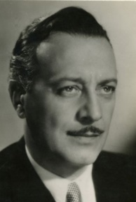Legismertebb magyar filmszerepe, az 1943-ban készült *Kalotaszegi Ma-donna* újvidéki bemutatóján személyesen is megjelen. A korabeli kritikák kiemelték Sárdy János magával ragadó énekhangját, Petrovics Szvetiszláv finom és mértéktartó férfifiguráját, s azt, hogy Adorján Éva elbűvölő volt a filmben, valamint a legigazibb, legeredetibb jeleneteket: a szabadtéri ké-peket, egy kalotaszegi vásárt és egy hamisítatlan, ősi szo-kásokat felújító körösfői lakodalmat – eredetileg ezt a két jelenetet forgatták színesben.

- *a Kalotaszegi Madonna Karsady Géza szerepében -*

A háborús borzalmak közelettévével még két filmet for-gatott, *Machita* (1943-44) és a befejezetlen *Második Ma-gyar Kívánsághangverseny* (1944).

A magyar hangosfilmen nyújtott alakításai közül kiemelkedik Radványi Géza kiemelkedő alkotásában, az *Európa nem válaszol* Vincent Gordon-ja, hol az akkori örökös rosszfiú Greguss Zoltán az ellenfele, és a szépség-királynő (Radványi Géza felesége) Tasnády Fekete Mária a megvédendő (kém)nő. A Rodriguez Endre *Machita* (a kémnőt ezúttal a csodálatos Karády Katalin alakította) c. filmjében, Szávody György gyárigazgatója-ként nyújtotta talán a legemlékezetesebb alakítását.

1945-ben aztán a Vörös Hadsereg megszállta Magyarországot, és sok mű-vész - félve a megtorlástól - Nyugatra menekült.

1945-tól Münchenben élt, ahol a filmezéssel nem hagyott föl, nyugatnémet és osztrák produkciókban játszott, többnyire epizódszerepeket *(pl. Sissi, egy fiatal császárné).* Az 1958-ban készült *Felvonó a vérpadig* című alko-tásban szerepelt utóljára a filmvásznon.

Évekig a *Szabad Európa Rádió* munkatársa, újságírója és bemondója volt. Forrás: *Magyar Hangosfilm Lexikon*

**Pikler Gyula** (Temesvár, 1864. május 21. - Budapest, 1937. november 28.) jogbölcsész, egyetemi tanár.

Az ungvári gimnáziumban érettségizett, majd a buda-pesti egyetem jogi karán végezte tanulmányait. 1886-ban jogbölcseletből magántanári képesítést szerzett. Közben 1884-1891 között a képviselőház segédkönyv-tárnokaként dolgozott.

1891-től a jogi kar címzetes tanáraként kezdődött egye-temi karrierje, 1896-tól a nagyhatású Pulszky Ágost jogfilozófus utódjaként nyilvános rendkívüli, 1903-tól rendes tanárrá nevezték ki. Egészen 1920-ig a jog- és állambölcselet rendes tanára volt a fővárosi egyetemnek. Pikler Gyula értékmentes jogszocioló-giáját a kritikai módszer segítségével az 1892-ben megjelent *Bevezetés a jogbölcseletbe* című munkájában fejti ki. Pikler elméletének alapjait David Ricardo *érték-és megoszlástaná*-ról szóló tanulmányából merítette.

Pikler Gyula tanításában, a pozitivizmus és szociológia fogalmai polarizál-ta a korabeli tudományos és politikai közvéleményt. A felfogás szerint a társadalomnak is lehetnek tudományos módszerekkel megismerhető ob-jektív törvényszerűségei, amelynek birtokában az emberiség – a természet korábban zabolázhatatlannak tűnő erőihez hasonlóan – a társadalmi folya-matokat is irányíthatja. A társadalom törvényeit vizsgáló új tudomány, a szociológia, e felfogásból következően több, mint egyszerű szaktudomány, általános világmagyarázó erővel bír!?

Pikler fő művében, az 1897-ben megjelent *A jog keletkezéséről* című mun-kájában jelenik meg a pozitivizmus fogalma. Szerinte a jogbölcsész fela-data, hogy a jogfejlődést összekapcsolja a társadalom tudományos magya-rázatával, Pikler híres fordulata szerint „a természetjogot a jog természet-rajzával helyettesítse”. A korszak uralkodó szociológiai irányzata az ún. evolúciós elmélet, amely a darwini „survival of the fittest” szelekciós alap-elvéhez hasonlóan egyetlen képletre kívánja visszavezetni a társadalom törvényszerűségeit. Pikler is kidolgozza „a maga végső elvét, a minden cselekvést közös nevezőre hozó *utilitárius motivációs* formulát, amelyre minden norma és intézmény visszavezethető: (…) ez az individuumból kiinduló, s az egyén ismeretei, ész- és célszerű belátása szerint változó, örömelvű szükséglet kielégítés.”

A magyarországi polgári radikalizmus egyidős az 1886-ban Pulszky Fe-renc - Pulszky Ágost édesapja - vezette magyarországi *Szimbolikus Nagy-páholy* megalakulásával. A páholyok kezdetben ugyan a liberális nemes-ség képviselőit tömörítették „filozofikus-filantrópikus" tevékenységük irá-nyítására.

De hamarosan a meggazdagodott és ezzel befolyást nyert - elsősorban zsi-dó - polgárság és az értelmiség progresszív irányba vitte el a szervezetet. Tagjainak jelentős része rokonszenvezett a *Társadalomtudományi Társa-sággal*, támogatta annak antiklerikális propagandáját és anyagilag is se-gélyezte kiadványaikat. Szabadkőműves támogatással alakult meg 1905 májusában *A Szabadgondolkodók Magyarországi Egyesülete*. A Fényes Samu ([Nietzsche](https://hu.wikipedia.org/wiki/Friedrich_Nietzsche)  imádó) vezette harcos ateista-antiklerikális egyesület fő-ként az egyház és az iskola szétválasztásának követelésében öltött testet.

Pikler Gyula „forradalmár” hírnevét az 1901. április 26-án az egyik napi-lapban megjelent cikk alapozta meg, *Anarkia az egyetemen* címmel. Az írás szerint Pikler Gyula, a jogbölcselet rendes tanára „a cinizmust hirdeti az élet vezérelvének”, előadásán egyenesen kijelentette: „Az én célom az, hogy az Önök szívéből az olyan kicsinyes fogalmakat, mint a haza, nemzet kiirtsam.” Az újságcikk hatására Pikler előadásának végén Köpösdy Dezső joghallgató, az *Egyetemi Kör* elnöke felhívta a professzort, hogy határo-lódjon el a lapban megjelent állításoktól. A megtámadott tanár mellett azonnal fölsorakoztak tanítványai, kik 211 aláírással ellátott nyilatkozatot állítottak össze, de azt átadni nem tudták, ugyanis az „antiszemita jelsza-vaktól sem mentes tolakodásban” - többen tettleg is bántalmazták egymást.

Az egyetemi tanács a verekedő táborok két-két tagját egy évre, Köpösdy Dezsőt örökre kizárta az egyetemről. A Pikler-ügyet folyamatos - és a progresszió oldaláról - figyelemmel kísérő újságíró, Ady Endre is beszá-mol az események részleteiről.

[1901](https://hu.wikipedia.org/wiki/1901)-ben Pulszky Ágost elnökletével megalakult a [*Társadalomtudományi Társaság*](https://hu.wikipedia.org/wiki/T%C3%A1rsadalomtudom%C3%A1nyi_T%C3%A1rsas%C3%A1g) a munkásrétegnek oktatását szerveztek, jgy jöttek létre a Társa-ság köré szerveződő csoportok. [Pulszky](https://hu.wikipedia.org/wiki/Pulszky_%C3%81gost) és Pikler Gyula körül alakult ki az a szellemi kör, amely a [szociológia](https://hu.wikipedia.org/wiki/Szociol%C3%B3gia) módszereit és szempontjait szembe fordította, a nemzeti historizmus történet- és társadalom szemléletével. 

A társaság fő szócsövének számított a [Gratz Gusztáv](https://hu.wikipedia.org/wiki/Gratz_Guszt%C3%A1v) szerkesztésében 1900-ban létrejött, *Huszadik Század* társadalomtudományi folyóirat. Gratz

a *[Huszadik Század](https://hu.wikipedia.org/wiki/Huszadik_Sz%C3%A1zad_(foly%C3%B3irat)) *szerkesztése mellett megindította a *Társadalomtu-dományi Könyvtár* című sorozatot. A Könyvtár a korabeli nemzetközi szo-ciológiai irodalom javát ültette át magyar nyelvre (Karl Kautsky, Emil Vandervelde, Achille Loria, Eduard David stb.).

1906 tavaszán a munkástanfolyamok önálló intézménnyé bővültek, meg-alakult a *Társadalomtudmányok Szabad Iskolája*. Elnöke Somló Bódog, igazgatója Jászi Oszkár lett, míg az előadók elismert tudósok, művészek, jólfelkészült szakemberek (Réti Lóránd, Somló Bódog, Lyka Károly, Madzsar József, Pikler Gyula stb.) voltak.

Az 1905-ös kormányválság következményeként 1906 tavaszán a konzer-vatív ellenzékiek kivonultak a Társaságból. 1906-tól a *Társadalomtudo-mányi Társaság* kettészakadása következtében helyet kaptak a mar[xis-ták](https://hu.wikipedia.org/wiki/Marxizmus), köztük Jászi [Oszkár](https://hu.wikipedia.org/wiki/J%C3%A1szi_Oszk%C3%A1r) és [Szabó Ervin](https://hu.wikipedia.org/wiki/Szab%C3%B3_Ervin_(k%C3%B6nyvt%C3%A1rigazgat%C3%B3)) írásai is. A társaság jelentős sze-repet játszott az 1918-as [őszirózsás forradalom](https://hu.wikipedia.org/wiki/%C5%90szir%C3%B3zs%C3%A1s_forradalom)  eszmei-politikai előkészí-tésében. A nemzeti-konzervatívok *Magyar Társadalomtudományi Egyesü-let* néven folytatták munkájukat.

A nyilvános összeütközésére a két tábor között Pécsett került sor. Ugyanis rögtön a kiválás után a *Társadalomtudományi Társaság* előkészítette a szabadtanítás 1907-es pécsi kongresszusát. Pikler Gyula a társaság újon-nan választott elnökeként a társaság programját így fogalmazta meg: „(….) Szociális politikánk kell hogy legyen ezentúl is: az elnyomottak és a kitagadottak felemelése, egy megelégedett, jólétben élő magyar nép meg-teremtése a tudomány, a műveltség és a felvilágosodás segítségével."

A kongresszusra készülve a *Huszadik Század*  folyóirat [1907](https://hu.wikipedia.org/wiki/1907). januári szá-mában Jászi írt programadó cikkében (*Az új Magyarország felé*) radikális függetlenségi politikát hírdetett. A kongresszus elnöke Beöthy Zsolt iro-dalomtörténész, egyetemi tanár lett. Az előadók között volt Harkányi Ede, Szabó Ervin, Jászi Oszkár, Marczali Henrik, Pikler Gyula stb., míg ellen-feleik Prohászka Ottokár és Giesswein Sándor „a teológus-metafizikai szemlélet képviselői" is bejelentették a részvételüket.

A kongresszus leghevesebb vitáit Pikler előadása váltotta ki: *A szabad tanítás tárgyai és módjai* címmel. Az előzőleg mozgósított „hallgatóság” természetesen a haladók mellett foglalt állást, így az együttes záróülésen a keresztényszocialisták legnagyobb része imár meg sem jelent. A kormány és az egyház sajtója éleshangú támadást indított, a *Budapesti Hírlap* arra hívta fel ,,a nemzeti közvélemény" figyelmét, hogy Pécs súlyos figyel-meztetés volt mindazok számára, akik nem akarják tétlenül nézni, hogy ,,a marxizmus megszállottjai". Pikler Gyulában az *Alkotmány* és a *Magyar Állam* a magyar ifjúság megrontóját látta.

Az, hogy Pikler került ismét a támadások kereszttüzébe, nyilván “előéle-tével” magyarázható, a budapesti egyetem nyilvános rendes tanára lévén, egyetemi katedráról hirdethette antifeudális, antiklerikális nézeteit, a radi-kális tábor vezetői jórészt az ő tanítványi voltak. Mégis Pikler Gyula hír-nevét a *Galilei Kör* - „a szabadgondolkodó, szociális és progresszív érzésű főiskolai hallgatók" - egyesület létrejötte alapozta meg. A *Galilei Kör* ateista-materialista diákegyesület 1908. november 22-én jött létre. A Kör a Pikler Gyulát támadó légkörben alakult meg, eredetileg Piklerről akarták elnevezni, ő azonban maga helyett a tudomány igazsága mellett kiálló Ga-lileo Galileit ajánlotta. 

A budapesti tudományegyetemen már a század első évei óta működő egye-temi klubok közül megemlíthetőek pl. a [katolikus](https://hu.wikipedia.org/wiki/Katolicizmus) *Szent Imre Kör*, a [pro-testáns](https://hu.wikipedia.org/wiki/Protestantizmus) *Bethlen Gábor Kör*, a [cionista](https://hu.wikipedia.org/wiki/Cionizmus)  *Makkabea* *Kör*. A magát minden-kitől kiválóbbnak tartó *radikális párt* és a *szociálista kör* vezetői a  "ha-ladó" baloldali diákok köréből kerültek ki, első elnöke Polányi Károly lett.

A *Galilei Kör* a *Szabadgondolkozás Magyarországi Egyesületének* fiók-jaként működött, hivatalos lapja a [Vámos Henrik](https://hu.wikipedia.org/w/index.php?title=V%C3%A1mos_Henrik&action=edit&redlink=1) álltal szerkesztett *Sza-badgondolat* c. időszaki lap volt. A *Galilei Kör* szoros kapcsolatban állt a *Társadalomtudományi Társasággal* és a *Martinovics-páhollyal*.

A *Galilei Kör* társadalomtudományi ismeretterjesztő füzeteket, a modern természettudomány legújabb eredményeit összefoglaló kiadványok soro-zatát is megjelentette. Ady Endre a *Galilei Kör* fiataljaiban a jövő, a demo-kratikus Magyarország megteremtésének zálogát üdvözölte, s több versé-ben köszöntötte őket. A Kör aktivistái közül számosan kerültek a radikális politikai mozgalom soraiba, fiataljai Szabó Ervin vezetésével megkezdték a harcot a háború és a militarizmus ellen. A kör titkára volt többek kö-zött [Rákosi Mátyás](https://hu.wikipedia.org/wiki/R%C3%A1kosi_M%C3%A1ty%C3%A1s), [Pogány József](https://hu.wikipedia.org/wiki/Pog%C3%A1ny_J%C3%B3zsef), [Korvin Ottó](https://hu.wikipedia.org/wiki/Korvin_Ott%C3%B3) és [Lukács György](https://hu.wikipedia.org/wiki/Luk%C3%A1cs_Gy%C3%B6rgy_(filoz%C3%B3fus)), a [ma-gyarországi Tanácsköztársaság](https://hu.wikipedia.org/wiki/Magyarorsz%C3%A1gi_Tan%C3%A1csk%C3%B6zt%C3%A1rsas%C3%A1g)  népbiztosai.

Pikler ezek után maga már ekkor csak kevéssé vett részt a mozgalomban. 1907-től fogva egyre inkább lélektani kísérletei kötötték le minden érdek-lődését, 1910 után visszavonult minden politikai tevékenységtől.

Az 1918-as „őszirózsás” forradalom eseményei még lelkesítették, de a proletárdiktatúra eszmeiségét nézeteivel nem tudta összeegyeztetni. 1919 tavaszán egészségi okokra hivatkozva szabadságot kért és Bécsbe távozott. 1920-tól már nem vett részt az oktatásban, 35 évi szolgálat után 1925-ben méltányossági okoból nyugdíjazták. Élete hátralévő éveiben visszavo-nultan, családja ecsédi birtokán élt, ahol látásfiziológiai megfigyelésekkel és kísérletekkel foglalkozott. Ezeket német nyelven publikálta 1936-ban. „A radikális szociológusok többsége elfogadta a történelmi materializ-must, nyilvánosan csupán Pikler Gyula helyezkedett szembe vele s „a materialista történelmi felfogás legnagyobb hiányaként " a lelkiállapotok társadalmi szerepének figyelmen kívül hagyásával vádolta követőit.Ta-nítványi köréből kerültek ki a 20. század eleji progresszív társadalom-tudomány legismertebb személyiségei; Jászi Oszkár, Somló Bódog, Vám-béry Rusztem. A pozitivista állam- és jogbölcselet legkiemelkedőbb és legnagyobb hatású, külföldön is ismert hazai képviselője volt”.

Források: *[A múlt magyar tudósai](https://www.arcanum.hu/hu/online-kiadvanyok/MuMaTu-a-mult-magyar-tudosai-1/). [Magyar zsidó lexikon](https://hu.wikipedia.org/wiki/Magyar_zsid%C3%B3_lexikon).* Mucsi Ferenc *A polgári radikalizmus Magyarországon 1900—1914*. Káich Katalin *A Magyarországi szabadaoktatás 1907-1 pécsi kongresszusa*

**Pióker Ignác** ([Temesrékas](http://hu.wikipedia.org/wiki/Temesr%C3%A9kas), [1907](http://hu.wikipedia.org/wiki/1907). [január 17.](http://hu.wikipedia.org/wiki/Janu%C3%A1r_17.) - [Budapest](http://hu.wikipedia.org/wiki/Budapest), [1988](http://hu.wikipedia.org/wiki/1988). [november 1.](http://hu.wikipedia.org/wiki/November_1.)) lakatos-gyalus, országgyűlési képviselő.

Édesapja napszámosként tartotta el 15 gyermekét, kik közül Ignác tize-dikként született. Géplakatosnak tanult, dolgozott dohánygyárban, bányá-ban. Valószínűleg a román katonai behívója elöl, 1928-ban települt (át-szökött) át Magyarországra. Újpesten, a nagy munkástelepülésen kapott állást, először egy textilgyárban. A híres Egyesült Izzóban dolgozott, itt szénlapátolással kezdte, majd anyagkiadó lett, 1933-ban került a gyalu-padhoz. A munka mellett sikeres sportoló is volt, az UTE sportegyesület színeiben országos bajnokságig vitte váltófutásban.

1929-től a vasas szakszervezet tagjaként mozgalmi tevékenységet folyta-tott, e miatt évekig rendőri felügyelet alatt állt. A *Szociáldemokrata Pártba* 1945-ben lépett be, a két munkáspárt egyesülése után átigazolták az állam-párt *Magyar Dolgozók Pártjába*.

1947-ben egy új, Schaerer SE 400 típusú gyorsgyalugéphez helyezték, és az esztergályo-soknál már bevált gyorsvágást alkalmazva 1949. December 21-én **1470%-os** országos csúcsot ért el!

Pióker Ignác az elsők között kapta meg a sztahanovista ok-levelet. “A sztahanovista mozgalom  [Alekszej (Andrej) Grigorjevics Sztahanov](https://hu.wikipedia.org/wiki/Alekszej_Grigorjevics_Sztahanov) szovjet-orosz bányász követőinek, az egész kommunista vi-lágra kiterjedő tömegmozgalma. A. G. Sztahanov 1935. augusztus 31-én 102 tonna szenet bányászott ki 5 óra 45 perc alatt - az előírt mennyiség 14-szerese -, majd szeptember 19-én 227 tonnát termelt egy műszak alatt. 

Ezzel névadója lett a munkásokat nagyobb termelékenységre ösztönző, a szocialista gazdasági rendszer fölényét hirdető sztahanovista mozgalom-nak. A képe újságokban és plakátokon jelent meg, még a [*Time* magazin](https://hu.wikipedia.org/wiki/Time_(magazin)) -címlapjára is kikerült.

A magyar sztahanovisták I. kongresszusát Harustyák József a Szakszer-vezetek Országos Tanácsának elnöke nyitotta meg 1950 márciusában. 

[Apró Antal](https://hu.wikipedia.org/wiki/Apr%C3%B3_Antal) főtitkár mondott beszédet: „Sztahanovistáink nem elégedhet-nek meg azzal, hogy egyénileg értek el jelentős eredményeket, és sokan közülük normájukat több száz vagy több ezer százalékra teljesítették. A sztahanovista mozgalom nem öncélú mozgalom. Célja nem az, hogy csak egyesek érjenek el nagy eredményeket, rekordokat, hanem az, hogy álta-lános emelkedés következzen be.

Számos budapesti és vidéki nagyüzem és bánya dolgozói országunk föl-szabadulásának ötödik évfordulójára, április negyedikének több és jobb munkával való megünneplésére a verseny kiszélesítését javasolja. A szta-hanovisták országos tanácskozásán résztvevők számára nincs megtisz-telőbb feladat, mint minden tudásukkal és erejükkel részt venni ebben a mozgalomban, hogy ezzel is kifejezzük hálánkat és szeretetünket a szovjet hősök iránt, akik vérüket hullatták szabadságunkért.”

Pióker Ignác hatalmas, és majdnem önpusztító teljesítményéért 1951. Már-cius 15-én megkapta a (munkás létére elsőként) Kossuth-díjat. A május 1-jei ünnepségeket Moszkvában a tribünről nézhette végig (közel Sztálin elv-társhoz). És ezzel még nem volt vége az elismerés özönnek, mivel az or-szágban elsőként teljesítette ötéves tervét, megkapta a *Szocialista Munka Hőse* kitüntetést. 1951-ben 290 százalékra teljesítette a normát és már nyárra befejezte az 1952-es tervét.

A mozgalom hősei közé tartozott még Muszka Imre esztergályos, az 1950-es években a legismertebb sztahanovista, a Rákosi Mátyás Vas- és Fém-művek dolgozója 1950-ben - [Horváth Edével](https://hu.wikipedia.org/wiki/Horv%C3%A1th_Ede) megosztva - megkapta a Kossuth-díj arany fokozatát, Bordás András  esztergályos, a Rákosi Má-tyás Vas- és Fémművek munkatársa, Albel Ferenc fúrómester dorogi bá-nyász, Deák János  esztergályos, a [Ganz-MÁVAG](https://hu.wikipedia.org/wiki/Ganz%E2%80%93M%C3%81VAG) művezetője, Bali Sán-dor a Beloiannisz Híradástechnikai Gyár szerszámkészítője stb.

Pióker Ignác 1953-tól 1985-ig országgyűlési képviselő volt, ugyancsak 1953-ban tagja lett a *Hazafias Népfront* Országos Tanácsának és az MDP Budapesti Pártbizottságának, 1975-től tagja volt az államfői testületnek, az Elnöki Tanácsnak. A *Szabad Nép* rendszeresen közölt cikkeket róla, arc-képét igazi munkási ikonként hordozták a május 1-jei felvonulásokon, olyan nagyságoktársaságában, mint Marx, Engels, Lenin, Sztálin na meg persze népünk nagy vezére, Rákosi Mátyás fotói között volt látható!

“Filmhíradók mutatták munka közben, az Országgyűlésben, családi kö-rben, nevét még versbe is foglalták: "nem érdekelnek engem a lányok, in-kább nézem Pióker Ignácot".

Maga Pióker mégis szerény, közszeretetnek örvendő ember maradt, holott a sztahanovisták nem örvendtek nagy népszerűségnek, mert a mozgalom megindítása mindenki számára normaemeléssel járt”.

Többszörös újító, egyik újításával egy munkadarab meg-munkálási idejét 200 percről 74 percre csökkentette, számos találmány fűződik a nevéhez, jelentős az 1956-ban Móréh Mihállyal benyújtott *„Másolóberendezés szerszámgépekhez”* címmel.

Forrás: *Magyar életrajzi lexicon*

Vitéz **Poltáry** *Praksz* **Vilmos** (Titel, 1889. szeptember 29. - Budapest, 1975. augusztus 19.) csendőr vezérőrnagy.

A kassai katonatiszti iskolában iskolában tanult 1904-1908-ig. 1908-ban zászlósként Trebinjébe vezényelték, hol a soproni 76-os ezred 2. határvadász zászlóaljában kezdte meg szolgálatát. 1914-ben részt vett azon a szara-jevói hadgyakorlaton, melyet a közben megölt Ferenc Ferdinánd trónörökös meg akart látogatni.

Az első világháborúban 43 hónapot szolgált a balkáni fronton, részt vett Bukarest elfoglalásában. Rövid ideg harcolt az olasz fronton is, a világháborút századosi rangban fejezi be.

A Tanácsköztársaság idején Pozsonyban letartóztatták, ugyani nem akart belépni a vörös hadseregbe. A konszolidáció idején, 1920 novemberében átkerült a csendőrséghez. Enyingen majd Balassagyarmaton szolgállt csendőr örnagyi rangban. Beosztottjai szigorúsága ellenére nagyon szeret-ték, mert embereiért ha kellett tűzbe ment. 1933-ban a Honvédelmi Mi-nisztériumban referensé előléptették, hol 1939-ig szolgállt.

A második világháború kitörésének évében Szombathelyre helyezték, hol 1939-1942 között a III. Csendőrkerület (Vas, Zala, Veszprém) parancs-noka volt ezredesi rangban. 1943 szeptember 1-ével saját kérésére nyugdí-jazták. 1943 novemberében reaktiválták, feladata lett a hadikórházak és a kibombázottak elhelyezésének felügyelete. Az 1945 márciusában kapott kitelepülési parancsot végrehajtva, Szombathelyről Bajorországba tele-pült. A harcok elültével az amerikai megszállási zónába került, az amerikai fogságból 1946 március 8-án tért haza.

A háborút követő hisztéria őt sen kímélt, az igazoló bizottságok által kiadott „igazolás” nélkül csak segédmunkát tudott vállalni. 1951-ben mint horthysta fasisztát kitelepítették a Tiszasűlyön létrehozott munkatáborba. Sztálin halála után Nagy Imre megszüntette a kitelepítéseket, a Poltáry család lakását persze nem kapta vissza, így Budakalászra költöztek, az ottani Kertészeti Főiskola telepén raktároslett a csendőr tábornok.

Amikor eljött az 56-os forradalom beválasztották a Munkástanácsba. Az ő befolyása védte meg a főiskola személyzeti vezetőnőjét, aki viszont a for-radalom bukása után azonnal megtámadta "fasiszta" múltjáért és fél évre börtönbe juttatta!

1957 július 17-én éjszaka letartóztatták és Kistarcsára vitték. 1958 január 17-én szabadult, de utána REF alatt állt (rendőri felügyelet) és este 8 után otthon kellett tartózkodjon, így élt Vitéz Poltáry Vilmos másodrangú polgárként haláláig.

Forrás: [*Magyar Királyi Csendőrség*](http://csendor.com/konyvtar/konyvek/Poltary-Korondi/Poltary%20Vilmos%20eletutja.pdf)

**Preisz Hugó** ([Ruma](http://hu.wikipedia.org/wiki/Ruma), [1860](http://hu.wikipedia.org/wiki/1860). [szeptember 21.](http://hu.wikipedia.org/wiki/Szeptember_21.) - [Budapest](http://hu.wikipedia.org/wiki/Budapest), [1940](http://hu.wikipedia.org/wiki/1940). [július 5.](http://hu.wikipedia.org/wiki/J%C3%BAlius_5.)) orvos, bakteriológus, az [MTA](http://hu.wikipedia.org/wiki/Magyar_Tudom%C3%A1nyos_Akad%C3%A9mia) tagja.

A [Budapesti Tudományegyetemen](http://hu.wikipedia.org/wiki/E%C3%B6tv%C3%B6s_Lor%C3%A1nd_Tudom%C3%A1nyegyetem) szerzett orvosi ok-levelet, hol 1885-től gyakornok, majd tanársegéd a kórbonctani, és végül a törvényszéki orvostani intézetbe került. 1889-1890-ben a II. számú sebészeti klinikán műtősebészi oklevelet szerzett. 1891-ben megbízást ka-pott a Földművelésügyi Minisztériumtól, az [Állatorvosi Főiskola](http://hu.wikipedia.org/wiki/Szent_Istv%C3%A1n_Egyetem) bakteriológiai intézetének vezetésére. Ezt a feladatot 1906-ig látta el, közben 1894-től az Állator-vosi Főiskolán rk. tanár.

A minisztérium magbízásából és a célból, hogy országos bakteriológiai in-tézet felállítását tervezte, 1890-1891 között külföldi tanulmányútra küld-ték Preiszet, aki [németországi](http://www.wikiwand.com/hu/N%C3%A9metorsz%C3%A1g), [belgiumi](http://www.wikiwand.com/hu/Belgium) és [franciaországi](http://www.wikiwand.com/hu/Franciaorsz%C3%A1g) kutatóintéze-teket és laboratóriumokat keresett fel tapasztalatszerzés céljából.

Az 1890-es évek elején a külföldi tanulmányútján tapasztaltak hatására megvetette Magyarországon a [bakteriológia](http://hu.wikipedia.org/w/index.php?title=Bakteriol%C3%B3gia&action=edit&redlink=1) tudományág elméleti alapjait és intézményi hátterét”. 1916-tól rendes, majd 1929-től tiszteleti tagja volt a [Szent István Akadémiának](https://hu.wikipedia.org/wiki/Szent_Istv%C3%A1n_Akad%C3%A9mia).

A [millenniumi (1896) kiállításon](https://hu.wikipedia.org/wiki/1896-os_millenniumi_%C3%BCnneps%C3%A9gek) nagy feltűnést keltett az általa készített mikroszkópos baktérium felvételekkel. 1906-ban visszatért a [Budapesti Tudományegyetem](http://hu.wikipedia.org/wiki/E%C3%B6tv%C3%B6s_Lor%C3%A1nd_Tudom%C3%A1nyegyetem) orvosi karára, és 1931-es nyugdíjazásáig nyilvános rendes tanára volt. Egyidejűleg 1906-1931 között az intézet igazgatója 1912-1914 között dékánja, az 1926/1927-es tanévben pedig a tudomány-egyetem rektori feladatait is ellátta. Az I. világháború alatt megszervezte a kolera és a hastífusz elleni oltóanyagtermelést.

„Pályája korai szakaszában [belgyógyászati](https://hu.wikipedia.org/w/index.php?title=Belgy%C3%B3gy%C3%A1szat&action=edit&redlink=1) [patológiával](https://hu.wikipedia.org/wiki/Patol%C3%B3gia), főként a [szív-működés](https://hu.wikipedia.org/wiki/Sz%C3%ADv) rendellenességeivel foglalkozott. Az 1890-es évek elején [Lie-bermann Leó](https://hu.wikipedia.org/w/index.php?title=Liebermann_Le%C3%B3&action=edit&redlink=1) ösztönzésére és a kötelezte el magát a [bakteriológia](https://hu.wikipedia.org/w/index.php?title=Bakteriol%C3%B3gia&action=edit&redlink=1) mellett. Érdeklődése először a háziállatok [fertőző betegségeire](https://hu.wikipedia.org/wiki/Fert%C5%91z%C5%91_betegs%C3%A9g) irányult, egyebek mellett tanulmányozta a szarvasmarha[gümőkór](https://hu.wikipedia.org/wiki/G%C3%BCm%C5%91k%C3%B3r), a [sertéspestis](https://hu.wikipedia.org/w/index.php?title=Sert%C3%A9spestis&action=edit&redlink=1) bakterio-lógiai [kóroktanát](https://hu.wikipedia.org/wiki/Etiol%C3%B3gia). A sertéspestist tanulmányozva felismerte a kór lefo-lyása és kimenetele, illetve a [vérsavó](https://hu.wikipedia.org/wiki/V%C3%A9r) [ellenanyag](https://hu.wikipedia.org/wiki/Ellenanyag)tartalma közötti össze-függéseket.

Évtizedekig irányította a diftéria elleni szérum termelését. Kutatásai a hu-mán- vagy általános bakteriológiára is kiterjedtek. Kísérleteket végzett és összehasonlító vizsgálat tárgyává tette az emberi és állati tuberkulózisok kórokozóit. A francia [Edmond Nocard](http://hu.wikipedia.org/w/index.php?title=Edmond_Nocard&action=edit&redlink=1)-tól függetlenül, leírta a [rágcsálók](http://hu.wikipedia.org/wiki/R%C3%A1gcs%C3%A1l%C3%B3k) [álgümőkórjának](http://hu.wikipedia.org/w/index.php?title=%C3%81lg%C3%BCm%C5%91k%C3%B3r&action=edit&redlink=1) [kórokozóját](http://hu.wikipedia.org/wiki/Bakt%C3%A9riumok) *(Preisz–Nocard-baktérium).*

Pályája utolsó szakaszában érdeklődése homlokterébe a fertőzések [immu-nológiai](https://hu.wikipedia.org/wiki/Immunol%C3%B3gia) vonatkozásai, az [immunitás](https://hu.wikipedia.org/wiki/Immunit%C3%A1s_(biol%C3%B3gia)) kérdései kerültek. 1915-től haláláig választmányi tagként, 1927-től 1931-ig az élettani, 1927-től 1938-ig a mikrobiológiai szakosztály elnökeként vett részt a [Magyar Természettu-dományi Társulat](https://hu.wikipedia.org/wiki/Magyar_Term%C3%A9szettudom%C3%A1nyi_T%C3%A1rsulat) munkájában. Emellett tiszteleti tagja volt a debreceni [*Tisza István Tudományos Társaságnak*](https://hu.wikipedia.org/w/index.php?title=Tisza_Istv%C3%A1n_Tudom%C3%A1nyos_T%C3%A1rsas%C3%A1g&action=edit&redlink=1), alelnöke a [Budapesti Orvosegye-sületnek](https://hu.wikipedia.org/w/index.php?title=Budapesti_Orvosegyes%C3%BClet&action=edit&redlink=1), a Bécsi Mikrobiológiai Társaság (Wiener Gesellschaft für Mikro-biologie) pedig levelező tagjai sorába választotta.

Tudományos érdemei elismeréseként 1918-ban magyar nemességet szer-zett, ekkor vette fel a *rumai* előnevet. 1937-ben a [Debreceni Tisza István Tudományegyetem](https://hu.wikipedia.org/wiki/Debreceni_Egyetem) díszdoktorává avatták. Főbb művei: *Bakteriológia (1899), Vizsgálatok a lépfenebacillus variálásáról és szelidülésének mibenlétéről (1911), Az infectio és immunitás tanának elemei (1936), Az általános kórtan vázlata (Went Istvánnal és Sántha Kálmánnal, 1939) stb.*

Forrás: *[Új magyar életrajzi lexikon](https://hu.wikipedia.org/wiki/%C3%9Aj_magyar_%C3%A9letrajzi_lexikon) Magyar tudóslexikon A-tól Zs-ig. A Magyar Tudományos Akadémia tagjai 1825-2002 II.*

**Priszter Szaniszló** ([Temesvár](https://hu.wikipedia.org/wiki/Temesv%C3%A1r), [1917](https://hu.wikipedia.org/wiki/1917). [szeptember 8.](https://hu.wikipedia.org/wiki/Szeptember_8.)–[Budapest](https://hu.wikipedia.org/wiki/Budapest), [2011](https://hu.wikipedia.org/wiki/2011). [ja-nuár 13.](https://hu.wikipedia.org/wiki/Janu%C3%A1r_13.)) botanikus, egyetemi docens, a budapesti [Füvészkert](https://hu.wikipedia.org/wiki/F%C3%BCv%C3%A9szkert_(Budapest))  igazgatója. 

Budapesten érettségizett, majd 1935-ben felvételizett a budapesti Pázmány Péter Tudományegyetem jogi ka-rára. A római és büntetőjogi előadások mellett gyakran látogatott növénytani előadásokat. 1938-tól a Magyar Biológiai Társaság Botanikai Szakosztályának tagja. 1940-ben szerezte meg a jogi diplomát.

A második világháborúban katona, később hadifogságba került. A háború alatt jelentek meg első botanikai közle-ményei Erdély flórájáról.

A háború után 1950-től tanársegéd lett a Kertészeti és Szőlészeti Főiskola (ma a Corvinus Egyetem Kertészettudományi Kara) Növénytani Tanszé-kén, ahol 1957-ben védte meg kandidátusi értekezését. Ettől az évtől a Keszthelyi Mezőgazdsági Akadémia (ma a [Pannon Egyetem](https://hu.wikipedia.org/wiki/Pannon_Egyetem) Georgikon Kara) Növénytani Tanszékén folytatódott pályája.

1964-ben a Füvészkertnek lett az igazgatóhelyettese, majd 1966-tól 1981-ig, nyugdíjba vonulásáig igazgatója. A Füvészkert igazgatójaként a Bota-nikus Kert irattárát rendezve, valamint a levéltárakban fellelhető doku-mentumokat feldolgozva [Gombocz Endre](https://hu.wikipedia.org/wiki/Gombocz_Endre) botanikatörténeti művei után számos új ismeretet közölt. 1992-ben szerezte meg az MTA biológiai tudományok doktora fokozatot.

“Őt tekintik az adventív növények és az őshonos gyomnövények magyar-országi kutatásának elindítójának. E tevékenységéből születtek meg az 

*Amaranthus*-vizsgálatok is 1949 és 1953 között. A spontán flóra magyar-országi kutatását elsősorban a Dél-Dunántúlon (Sopianicum) folytatta, de munkássága Erdély, a Balkán, valamint Kis- és Közép-Ázsia flóráját is számos adattal, új ismerettel gazdagította. Összesen 17 új taxont (alfaj, változat, hibrid) s további 50 infraspecifikus taxont (forma, lusus) írt le – ezeket az International Plant Names Index is számon tartja. 1951-ben az ő jegyzetei és szerkesztése alapján kerültek kiadásra a „Vácrátóti Termé-szetvédelmi Park és Botanikai Kutatóintézet”-ben 1950-ben megrendezett, a hazai botanikai kutatásoknak új irányt szabó, növényföldrajzi térképe-zéssel kapcsolatos előadások.”.

Miután az Akadémiai Nyomda raktárában ráakadt [Jávorka Sándor](https://hu.wikipedia.org/wiki/J%C3%A1vorka_S%C3%A1ndor) és Csa-pody Vera híressé vált, 1929–34-ben megjelent közös művére *(„A magyar flóra képekben, Iconographia Florae Hungariae*.”), az akkoriban már be-szerezhetetlen művet újra szerkesztve, új címen, 1975-ben kiadta. 1961-ben jelent meg először az a háromnyelvű szakszótár, amelyben a növény-szervtan területéről közel 1500 szakkifejezést állított össze és magyarázott meg, s amelyhez Csapody Vera 17 táblán közel 500 rajzot készített. A társ-szerzőkkel megírt, 1200 európai fa-, cserje- és félcserjefaj nyolcnyelvű nö-vénynévszótárát 1983-ban adták ki. 1966-ban Csapody Verával közösen állított össze egy 9000 növénynevet tartalmazó szótárat, amely a hivata-losan elfogadott növényneveken kívül népi növényneveket is tartalmaz.

1986-ban jelent meg egy 16 000 növénynevet tartalmazó magyar-latin szó-gyűjteménye. 1974-ben [Kovács Margittal](https://hu.wikipedia.org/w/index.php?title=Kov%C3%A1cs_Margit_(botanikus)&action=edit&redlink=1) írt munkájában elsőként adott egy listát Magyarország védelemre szoruló növényfajairól és növény-társulásairól. Az 1977-ben kiadott, Kovács Margittal,  [Csapody Istvánnal](https://hu.wikipedia.org/wiki/Csapody_Istv%C3%A1n_(botanikus)) 

és Szodfridt Istvánnal közösen írott munkában már mintegy 400 hazai növényfaj védetté nyilvánítását javasolták.

1954-től 1973-ig volt a *„Botanikai Közlemények*”, a Magyar Biológiai Társaság kiadványának technikai szerkesztője. 1959-től 2000-ig szerkesz-tette, illetve név- és tárgymutatókkal látta el a Magyar Tudományos Aka-démia Agrártudományi Osztálya által elindított *„Magyarország Kultúr-flórája”* sorozat köteteit. Többek között ő volt Christopher Brickell *„Dísz-növény enciklopédia. Az Angol Királyi Kertészeti Társaság Kézikönyve”* címen magyarul megjelent könyvének szakmai szerkesztője.

[Botanikai](https://hu.wikipedia.org/wiki/Botanika) szakmunkákban [nevének rövidítése](https://hu.wikipedia.org/wiki/Botanikusok_list%C3%A1ja_r%C3%B6vid_nev%C3%BCk_alapj%C3%A1n): „Priszter”.

Források: *Bárány Lászlóné főszerk.: Magyar Nagylexikon, 2002,  Kor-társaink életrajzi lexikona. 2001.* Szabó István – Szabó László Gyula: *Priszter Szaniszló (1917–2011)*

**R**

**Radisics Jenő** (Buziásfürdő, [1856](http://hu.wikipedia.org/wiki/1856). [augusztus 7.](http://hu.wikipedia.org/wiki/Augusztus_7.) - [Budapest](http://hu.wikipedia.org/wiki/Budapest), [1917](http://hu.wikipedia.org/wiki/1917). [január 4.](http://hu.wikipedia.org/wiki/Janu%C3%A1r_4.)) művészeti író, az Iparművészeti Múzeum igazgatója.

Középiskolai tanulmányait Budapesten végezte. 1875-től a Magyar Királyi József Nádor Műegyetem hallgatója, majd jogot tanult a Budapesti Tudományegyetemen.

1881-ben a Vallás- és Közoktatásügyi Minisztérium tiszt-viselője, majd a következő esztendőben az *Országos Ma-gyar Iparművészeti Múzeum* munkatársa lett. Az intéz-mény leltárának szerkesztésére és a gyűjtemények rende-zésére kapott megbízást. 1885-1894 között Pasteiner Gyu-lával együtt szerkesztette a *Művészi Ipar* című folyóiratot.

1882-1905 között Európa tizenegy országában tanulmányozta a kiállítások rendezésének módját. 1887-ben az Iparművészeti Múzeum igazgatójának nevezték ki, majd a műegyetemen a művészi ipar történetének magántaná-ra lett. Az 1896-os millenniumi ünnepségeken Radisich Jenő, a történelmi kiállítás egyik előadója és rendezője volt. A kor szellemének megfelelően a politikában is megmérette magát, az 1905-ös általános választások alkal-mával disszidens ellenjelöltel szemben szabadelvűpárti program alapján január 26-án elnyerte az orczyfalvai mandátumot.

Széleskörű kulturális tevékenységet fejtett ki: tagja volt a múzeumok és könyvtárak országos tanácsának, a [*Műemlékek Országos Bizottságának*](https://hu.wikipedia.org/w/index.php?title=M%C5%B1eml%C3%A9kek_Orsz%C3%A1gos_Bizotts%C3%A1ga&action=edit&redlink=1), a  *[Magyar Iparművészeti Társaság](https://hu.wikipedia.org/w/index.php?title=Magyar_Iparm%C5%B1v%C3%A9szeti_T%C3%A1rsas%C3%A1g&action=edit&redlink=1) választmányának*, a  *[Magyar Tudo-mányos Akadémia](https://hu.wikipedia.org/wiki/Magyar_Tudom%C3%A1nyos_Akad%C3%A9mia) Archeológiai Bizottságának*, Az *Országos Képzőművé-szeti Tanács* iparművészeti szakosztályának; a *Société littéraire française* c. társulat és *Műbarátok* köre alelnöke stb. az *Országos Monografia-Társaság* központi szerkesztőbizottságának előadója. Emléktábláját halála után egy évvel, 1921. január 9-én leplezték le a múzeum falán.

Főbb művei: *Országos Magyar Iparművészeti Múzeum. 1884. Jelentés a párisi Union Centrale des Arts-Decoratifs. Orsz. magyar iparművészeti múzeum. Képes kalauz a gyűjteményekben. 1885. Képes lajstroma az or-szágos magyar iparművészeti múzeum galvanoplasztikai másolatainak. [Magyar műkincsek](http://real-eod.mtak.hu/4012/). 1895-1901. Három kötet. Szendrei Jánossal együtt. Országos magyar iparművészeti múzeum. Az iparművészeti múzeum kiállí-tása. 1898.* *Magyarország történeti emlékei az 1896. évi ezredéves or-szágos kiállitáson. 1897-1901. Le Pavillon historique de Hongrie à l'Exposition universelle de Paris en 1900. stb.*

Forrás: *[Magyar életrajzi lexikon](https://www.arcanum.hu/hu/online-kiadvanyok/Lexikonok-magyar-eletrajzi-lexikon-7428D/). Szinnyei József: Magyar írók élete és munkái*

**Radocsay László**, dr. (Istvánfölde, 1878. november 18. - Budapest, 1968. november 14.) ügyvéd, főispán, igazságügyi miniszter.

Középiskolát a nagybecskereki piarista gimnáziumban végezte, egyetemi tanulmányait pedig a budapesti tudo-mányegyetemen, ahol jogtudományi oklevelet szerzett. Temesvárott kezdő ügyvédjelölt, miután Budapesten ügyvédi vizsgát tett, ügyvédi irodát nyitott Temesvá-rott. 1914-ben Temesvár főjegyzőjévé választották meg, a háború kitörésekor mint tartalékos tüzérhadnagy vett részt a harcokban.

Az összeomlás után 1918-1924 között beosztott főjegyző a Közélelmezési Minisztériumban. Miután felállították az *Országos Központi Hitelszövet-kezethez* tartozó körzeti hitelszövetkezeteket, Kecskeméten 1924-1934 között a Duna-Tiszaközi körzeti hitelszövetkezet vezetőjévé lett kinezve.

Az *Országos Központi Hitelszövetkezet* (OKH) feladat volt szervezni és felügyelni a hitelszövetkezeteket és általuk kielégíttette a vidéki mezőgaz-dasági és kisiparos tevékenységgel összefüggő hiteligényeket.

1934 júniusában Komárom-Esztergom közigazgatásilag egyelőre egyesí-tett (k.e.e.) vármegye főispánja lett, 1935 szeptemberében pedig régi fő-ispáni megbízatásának meghagyása mellett Győr, Moson, Pozsony k.e.e. vármegye, és Győr szabad királyi város főispánjává is kinevezték.

1936-tól Komárom-Esztergom vármegye főispánja volt. Ebben az állá-sában a Felvidék visszacsatolásáig, 1938. december 22-ig működött, a-mikor a Kormányzó Esztergom vármegye főispánjává nevezte ki. 1938-ban az [első bécsi döntés](https://hu.wikipedia.org/wiki/Els%C5%91_b%C3%A9csi_d%C3%B6nt%C3%A9s) folytán Esztergom megye az északi részével kie-gészülve ismét önállóan működött.

Radocsay Lászlót 1939-ben kiírt időközi választáson a [tapolcai](https://hu.wikipedia.org/wiki/Tapolca)-balaton-füredi választókerület képviselőjévé választották az akkor létrejött Teleki Pál vezette  [Magyar Élet Pártja](https://hu.wikipedia.org/wiki/Egys%C3%A9ges_P%C3%A1rt) (MÉP) színeiben. A  [Magyar Élet Pártja](https://hu.wikipedia.org/wiki/Magyar_%C3%89let_P%C3%A1rtja) a a két világháború közötti korszak az ún. Horthy-korszak legnagyobb ará-nyú választási győzelmét aratta. A teljesen titkos szavazást [1939](https://hu.wikipedia.org/wiki/1939). [május 25](https://hu.wikipedia.org/wiki/M%C3%A1jus_25.)-[26](https://hu.wikipedia.org/wiki/M%C3%A1jus_26.)-án, [pünkösdkor](https://hu.wikipedia.org/wiki/P%C3%BCnk%C3%B6sd) tartották meg, az új kormánypárt a mandátumok kö-zel 70 % szerezte meg, messze megelőzve a másodikként befutó [Szálasi Ferenc](https://hu.wikipedia.org/wiki/Sz%C3%A1lasi_Ferenc) vezette [Nyilaskeresztes Párt](https://hu.wikipedia.org/wiki/Nyilaskeresztes_P%C3%A1rt)ot (NYKP).

1939 novemberében a képviselőház elnökévé választott [Tasnádi Nagy An-drás](https://hu.wikipedia.org/wiki/Tasn%C3%A1di_Nagy_Andr%C3%A1s) utódaként 1939. november 8-ikán igazságügy-miniszterré nevezték ki. A tárca vezetését a [Teleki-,](https://hu.wikipedia.org/wiki/M%C3%A1sodik_Teleki-korm%C3%A1ny)  a [Bárdossy-](https://hu.wikipedia.org/wiki/B%C3%A1rdossy-korm%C3%A1ny), majd a [Kállay-kormány](https://hu.wikipedia.org/wiki/K%C3%A1llay-korm%C3%A1ny) alatt is megtartotta. Az igazságügyi tárca élén a légválságosabb és legellent-mondásosabb időszakban, 1939-1944 között állt.

A második Teleki-kormány [1939](https://hu.wikipedia.org/wiki/1939). [február 16.](https://hu.wikipedia.org/wiki/Febru%C3%A1r_16.) és [1941](https://hu.wikipedia.org/wiki/1941). [április 3.](https://hu.wikipedia.org/wiki/%C3%81prilis_3.) között állt Magyarország élén. A németektől való növekvő függést jelentette az ún. 

második zsidótörvény bevezetése ([1939](https://hu.wikipedia.org/wiki/1939) májusában), valamint a csatla-kozás az (német-japán olasz hármasszövetség) Antikomintern paktumhoz (1940 novembere).

Radocsay László igazságügyminiszter 1940. julius 5.-7.-iki belgrádi láto-gatása a déli szomszédjainkhoz való közeledés első lépése volt. Ezt köve-tően, 1940. december 12-én Belgrádban aláírják a magyar-jugoszláv örök barátsági szerződést. A Teleki-kormány az 1940. augusztus 30-i második bécsi döntéssel jelentős revíziós sikert ért el Románia ellen, Észak-Erdély visszaszerzésével. Németország támogatásáért azonban komoly árat kel-lett fizetnie, mert miután Románia elkötelezte magát a tengelyhatalmak mellett, Magyarország a Harmadik Birodalom támogatóinak gyűrűjébe ke-rült. Jugoszlávia jelentette volna a kitörési lehetőséget, a németbarát poli-tikát folytató állam, ezzel együtt alig titkolva Nagy-Britanniával is jó kap-csolatot ápolt. Teleki az ottani németellenes katonai [puccs](https://hu.wikipedia.org/wiki/%C3%81llamcs%C3%ADny) (1941. március 27.) után Nagy-Britannia hadüzenetére számítva [április 3](https://hu.wikipedia.org/wiki/%C3%81prilis_3.)-án éjjel öngyil-kosságot követett el.

A Teleki Pál halála után [április 7](https://hu.wikipedia.org/wiki/%C3%81prilis_7.)-én megalakult a korábbi külügyminisz-ter,  [Bárdossy László](https://hu.wikipedia.org/wiki/B%C3%A1rdossy_L%C3%A1szl%C3%B3) vezetésével az új kormány. Bárdossy-kormánya sza-kítva a semlegességi politikával részt vett Jugoszlávia megszállásában és nemsokára a szovjetekkel is háborúba keveredett.

A  kormány egyik első tetteként júniusban beterjesztette a „[harmadik zsi-dótörvény](https://hu.wikipedia.org/wiki/Harmadik_zsid%C3%B3t%C3%B6rv%C3%A9ny)” javaslatát, amelyet Radocsay László beterjesztésére a parla-ment az 1941. évi XV. törvénycikként fogadott el. Az 1941. augusztus 8-án életbe lépett törvény - nürnbergi típusú [faji törvény](http://www.holokausztmagyarorszagon.hu/index.php?section=1&type=content&chapter=13_2_1) - mindenkit zsidó-nak minősített, akinek két nagyszülője az izraelita hitfelekezet tagjaként született. Megtiltotta a vegyes házasságokat, és büntetni rendelte a zsidó és nem zsidó közötti nemi kapcsolatot stb.

Különös és váratalan eset lett az erdélyi szombatosság kérdése, ugyanis a zsidók emancipációja után (1867), Bözödújfalun több mint száz székely szombatos áttért az ortodox irányzatú zsidó vallásra, 1874-ben már a zsina-gógát is felépítettek. Az észak-erdélyi területek visszacsatolását kovetően akit lehetett, hatósági rábeszéléssel a zsidó hitről visszatérítettek vala-melyik keresztény vallásba. Radocsay László 1941. október 3-án kiadott rendeletében tanúsítványával lehetett igazolni, hogy az erdélyi szombatos vagy ivadéka a nem zsidókkal esik egy tekintet alá. Magyarország német megszállását követően, [a bözödújfalusi szombatosok egy része a zsidókkal együtt gettóba, majd Auschwitzba került.](https://transindex.ro/)

A Bárdossy-kormány idejére esik a galíciai [kamenyec-podolszkijba össze-gyüjtött zsidók lemészárlás](https://hu.wikipedia.org/w/index.php?title=Kamenyec-podolszkiji_m%C3%A9sz%C3%A1rl%C3%A1s&action=edit&redlink=1)a. 1939 és 1941 között körülbelül 10-20 ezer zsidó menekült Magyarországra Cseh- és Lengyelországból, Ausztriából, Németországból és Szlovákiából. 1941 júliusában a Szovjetunió elleni háború megkezdésével elkezdődött a magyar állampolgársággal nem ren-delkező zsidók összegyűjtése. Az összegyűjtött, körülbelül 18 ezer embert a magyar határtól 100 kilométerre lévő Kamenyec-Podolszkij környékére szállították, ahol az SS alakulatai a helyi zsidó lakosságg támogatásával augusztus 27-28-án lemészárolták őket.

Radocsay László teljes mértékben támogadta a kormányzó-helyettesi pozí-ció létrehozását, és Horthy István jelölését erre az addig nem létező kor-mányzati szerepkörre! Ugyanis 1941 novemberében a 73 esztendős kor-mányzó megbetegedett, így előtérbe került esetleges utódlása vagy he-lyettesítése. A szélsőjobboldali pártok a parlamenti vitában a javaslat ellen foglaltak állást. A kormányzó-helyettesi méltóságról szóló törvénycikkelyt 1942. február 15-én fogadták el, majd 19-én az  országgyűlés két házának (Felső-ház, Képviselőház) együttes ülésén Horthy Istvánt közfelkiáltással kormányzó-helyettessé választották.

A történelem kérlelhetelen kogikájának engedve, [Bárdossy László](https://hu.wikipedia.org/wiki/B%C3%A1rdossy_L%C3%A1szl%C3%B3) a né-metek követelésére [1941](https://hu.wikipedia.org/wiki/1941). [december 11](https://hu.wikipedia.org/wiki/December_11.)-én, a kormányzó távollétében és a Minisztertanács hozzájárulása nélkül bejelentette Magyarország hadiálla-potban lépését az Amerikai Egyesült Államokkal szemben. [1942](https://hu.wikipedia.org/wiki/1942) január-jában újra csak német követelésre hozzájárult a 2. magyar hadsereg fel-állításához és kiküldéséhez a keleti frontra, ezenkívül engedélyezte húsz-ezer magyarországi német besorozását a Waffen-SS-be. Ekkora elköte-leződés a kormányzónak és körének már sok volt, 1942. már[cius 7](https://hu.wikipedia.org/wiki/M%C3%A1rcius_7.)-én a miniszterelnök Horthy kívánságára lemondott. Helyére [Kállay Miklóst](https://hu.wikipedia.org/wiki/K%C3%A1llay_Mikl%C3%B3s_(politikus)) ne-

nevezte ki. *-A [Kállay-kormány](https://hu.wikipedia.org/wiki/K%C3%A1llay-korm%C3%A1ny); Az ülő sor közepén Kállay Mik-lós, az álló sorban balróla máso-dik [Radocsay László](https://hu.wikipedia.org/wiki/Radocsay_L%C3%A1szl%C3%B3) -*

1942. január 19/20-án zajlott le a véres ún. újvidéki razzia, mely-ben több mint 3 000 embert öltek meg a magyar katonai illetve csendőr egységek.

Miután a razzia eseménysora kitudódott, [Kállay Miklós](https://hu.wikipedia.org/wiki/K%C3%A1llay_Mikl%C3%B3s_(politikus)) miniszterelnök és mások közbenjárására a kor-mányzó vizsgálatot rendelt el. 

A Kállay-kormány kinevezésekor az új miniszterelnök azt a feladatot kapta a kormányzótól, hogy a már megígért 2. hadseregen felül több harcoló 

csapattestet ne küldjön a frontra, ellenben keresse meg a háborúból való óvatos kiválás lehetőségét. Az igazságügyi tárcát Radocsay László - a kor-mányzó egyik fő bizalmasaként - a Kállay-kormányban is megőrizte. Elő-készítette az ún. negyedik-zsidótörvényt (törvény a zsidó földtulajdonról): „a zsidók mező- és erdőgazdasági ingatlanairól” az 1942. szeptember 6-án elfogadott 1942:XV.tc. Az ún. negyedik-zsidótörvény  eltörölte a zsidók ingatlanszerzési és tulajdonlási jogát, tovább folytatva a zsidók gazdasági pozícióinak felszámolását. Kivételt száz hold alatti birtoknagyság esetében engedélyezett, több százezer hold mezőgazdasági és erdőingatlant (jobbára nagybirtokot) vettek el zsidó tulajdonosaiktól. E mellett a zsidónak mi-nősülők katonai szolgálat helyett [munkaszolgálatra](https://hu.wikipedia.org/wiki/Munkaszolg%C3%A1lat) lettek kötelezve.

Kállay Miklós, az angolbarát magyar politikusok csoportjának bizalmi embereként kerül a kormány élére. Miniszterei közül elsősorban Keresz-tes-Fischer Ferenc belügyminiszterben,  [Bánffy Dániel](https://hu.wikipedia.org/wiki/B%C3%A1nffy_D%C3%A1niel_(miniszter)) földművelésügyi miniszterben és  [Ghyczy Jenő](https://hu.wikipedia.org/wiki/Ghyczy_Jen%C5%91)ben (aki külügyminiszterként Kállayt vál-totta), valamint Radocsay László igazságügy-miniszterben bízott meg.

Viszont többségében németbarátok ültek a kabinetben, akik nem közül néhányan gyakorlatilag náci kémeknek bizonyultak. 

A sztálingrádi és doni katasztrófát követően a kormányzó és köre tisztában voltak azzal, hogy győzelem az angolszász szövetségeseké lesz. Ezért Tö-

[rökországban](https://hu.wikipedia.org/wiki/T%C3%B6r%C3%B6korsz%C3%A1g), majd máshol is béketapogatózásokkal próbálkozott a ma-gyar [diplomácia](https://hu.wikipedia.org/wiki/Diplom%C3%A1cia). A magyar kormány helyzetét nehezítette, hogy Hitler folyamatos követelésekkel lépett fel; a [Harmadik Birodalomba](https://hu.wikipedia.org/wiki/Harmadik_Birodalom) irányuló magyar szállítások növelését, valamint újabb magyar katonai alakulatok kért frontra. Mivel Kállay igyekezett ellenállni a nyomásnak, az 1943. április 16-17-i klessheimi tárgyalásokon a német vezetés követelte Kállay leváltását. Fokozta a németek elégedetlenségét, hogy Kállay nem volt hajlandó teljesíteni a hazai zsidósággal kapcsolatos követeléseiket. 

A Kállay által vitt külpolitikai irányvonal az ún. hintapolitika megkisérelte a lehetetlent, azaz mindként hadviselő szövetség számára megbízható part-nernek kívánt mutatkozni. A nyugat felé való orientációt megkönnyítette Magyarország legmegbízhatóbb szövetségesének Olaszországnak, a há-borúból való kilépése. A leendő kiugrás előkészítésében abban bízott, hogy az angolszász szövetségesek Itália vagy a Balkán felől elérik az ország ha-tárát. Túlértékelve azok antikommunizmusát javasolta, hogy addig is német(!) segítséggel feltartóztathatja a szovjet hadsereget a Kárpátokban.

A ”hintapolitika” taktika azonban nem számolt azzal, hogy a németek a megszerzett belső információk hatására, már előkészítették megszállást.

A német kormány tisztában volt a béketapogatózásokkal, így az egyre nyugatabbra szoruló haderőjének biztosítása miatt, hozzájuk hű kormányt akartak Magyarország élére. A német hadsereg egy része a *Margarethe hadművelet* keretében megszállta Magyarországot. Horthy ezek után a volt berlini nagykövet, [Sztójay Dömét](https://hu.wikipedia.org/wiki/Szt%C3%B3jay_D%C3%B6me) nevezte ki miniszterelnöknek, Radocsay László kormányzati szerepe véget ért.

A volt igazságügy-miniszter az 1942-1944 közötti kényes Kállay féle hintapolitika idején, teljes mértékben élvezte a kormányzóhoz hű politikai csoport (németellenes) nézeteit. Az ország további sorsát befolyásoló Klessheimben (Adolf Hitlerrel) történő tárgyalások résztvevőjekét kisérte el a Horthy Miklósa kormányzót a végzetes útra. A kormányzó és kísérete miután 1944. március 19-én visszaérkezett Budapestre, majd kinevezte a németbarát Sztójy-kormányt.

Radocsay kormányzati szerepe véget ért, 1944 április és decembere között újra, az *Országos Központi Hitelszövetkezet* igazgatóságának elnöke volt. A világháborút követő népbírósági perekben elítélték.

A *Szabad Nép* 1951. augusztus 7-iki számának 3. oldalán *A kitelepítések és az imperialisták* c. beszámol 21 horthysta miniszter - közöttük Radocsay László - , 25 volt államtitkár, 190 horthysta tábornok stb. kitelepítéséről.

Forrás: *[Magyar életrajzi lexikon](https://www.arcanum.hu/hu/online-kiadvanyok/Lexikonok-magyar-eletrajzi-lexikon-7428D/).* Németh László *Degré Alajos miniszteri biztosi tevékenysége a székely szombatosok ügyében, 1941–1944*

**Rajki Márton** *Klein Mór* ([Zenta](http://hu.wikipedia.org/wiki/Zenta), [1901](http://hu.wikipedia.org/wiki/1901). [szeptember 23.](http://hu.wikipedia.org/wiki/Szeptember_23.) - [Budapest](http://hu.wikipedia.org/wiki/Budapest), [1959](http://hu.wikipedia.org/wiki/1959). [július 30.](http://hu.wikipedia.org/wiki/J%C3%BAlius_30.)) ügyvéd.

[1919](http://hu.wikipedia.org/wiki/1919)-ben, a [szerb](http://hu.wikipedia.org/wiki/Szerbia) megszállás elleni tiltakozva szülő városában diákmozgalmat hozott létre. A helyi gimná-zium magyar anyanyelvű tanulói sem tanulhattak azon-túl magyarul az Sz.H.Sz. Királyságban.

[1920](http://hu.wikipedia.org/wiki/1920) nyarán kalandos úton átszökött Magyarországra, és [Budapesten](http://hu.wikipedia.org/wiki/Budapest) beiratkozott a [Pázmány Péter Tudo-mányegyetem](http://hu.wikipedia.org/wiki/E%C3%B6tv%C3%B6s_Lor%C3%A1nd_Tudom%C3%A1nyegyetem) Jogi Fakultására. Tanulmányai utolsó éveit [Nürnbergben](http://hu.wikipedia.org/wiki/N%C3%BCrnberg) végezte, [1924](http://hu.wikipedia.org/wiki/1924)-ben tért vissza Magyarországra, hogy befejezze felsőfokú tanulmányait. Jogászként vidéken is megfordult, de [1926](http://hu.wikipedia.org/wiki/1926)-ban [Újpestre](http://hu.wikipedia.org/wiki/%C3%9Ajpest_%28t%C3%B6rt%C3%A9nelmi_telep%C3%BCl%C3%A9s%29) érkezve kezdődik egy predesztináltan új életút. A nevét Rajkira változtatta, majd 1938-ban kikeresztelkedett. Dr. Csík József, az újpesti főplébánia apátja hatására belépett az újpesti [*Katolikus Körbe*](http://hu.wikipedia.org/w/index.php?title=Katolikus_K%C3%B6r&action=edit&redlink=1).

A második világháború alatt [1942](http://hu.wikipedia.org/wiki/1942)-ben behívták katonai szolgálatra, három hónapon keresztül karpaszományos honvédtiszt volt [Kecskeméten](http://hu.wikipedia.org/wiki/Kecskem%C3%A9t).

[1944](http://hu.wikipedia.org/wiki/1944) júniusában a [második zsidótörvény](http://hu.wikipedia.org/wiki/Zsid%C3%B3_holokauszt_Magyarorsz%C3%A1gon) alapján zsidó származása miatt munkaszolgálatra vitték [Pestszentlőrincre](http://hu.wikipedia.org/wiki/Pestszentl%C5%91rinc). A kemény fizikai munkát jól tűrte, hiszen fiatal korában sokat birkózott, vívott, egy rövid eltávozás al-kalmával megszökött a táborból, hazamenekült, és lakásában bujkált.

A [II. világháború](http://hu.wikipedia.org/wiki/M%C3%A1sodik_vil%C3%A1gh%C3%A1bor%C3%BA) után belépett a [Kisgazda Párt](https://hu.wikipedia.org/wiki/F%C3%BCggetlen_Kisgazda-,_F%C3%B6ldmunk%C3%A1s-_%C3%A9s_Polg%C3%A1ri_P%C3%A1rt)ba, és annak újpesti főtit-kára lett. [1945](http://hu.wikipedia.org/wiki/1945) áprilisában azonban már ki is lépett, hiszen kiderült a pa-rasztpárt inkább kooperál a kommunistákkal, mintsem képviseli a keresz-tényszocialista ideákat. Hithű katolikusként élte meg mindennapjait, jelen-tős szerepet vállalt az újpesti Katolikus Főplébánia életében, ugyanis ő lett a főplébánia egyházközösségének az ügyésze.

Ellátta több egyházi személyiség bírósági védelmét is a kommunista bosz-szúhadjáratok idején. Védte többek között lelki mentorát, Dr. Csík József újpesti apátplébánost is az úgynevezett Turul-perben. Az [1950-es évek](https://hu.wikipedia.org/wiki/1950-es_%C3%A9vek)ben az ügyvédi munkaközösségben dolgozott, amikor is eljött [1956](http://hu.wikipedia.org/wiki/1956). [októbere. A budapesti forradalmi megmozdulások](http://hu.wikipedia.org/wiki/Okt%C3%B3ber_24.) kezdetén, az újpesti Forradalmi Bizottság Rajki Mártont választotta elnökké. Rövid elnöki tevékenysége alatt senkit nem ért bántódás, arra törekedett, hogy a munka nyugodtan és zavartalanul folyon. Ezekben a napokban újjáéledt a többpárti rendszer is, ekkor a pártalakítás irányába fordult. Dr. Csík József plébánossal karöltve elhatározták, hogy egy keresztényszocialista pártot fognak létrtehozni.

A forradalmat végül 1956 novemberében vérbefolytották, a kommunista bosszú lassan de biztosan mindekit utolért. [1957](http://hu.wikipedia.org/wiki/1957) márciusában érte el a forradalmárokkal szemben folytatott eljárás.

1957. május 14-én éjjel a rendőrség letartóztatatták, a letartóztatás során provokatívan fegyvert próbáltak meg elrejteni a lakásban, amit azonban a szomszédok meghiusítottak. Az ítélet [1959](http://hu.wikipedia.org/wiki/1959). március 15-én született meg, az elsőfokú bíróság [halálbüntetést](http://hu.wikipedia.org/wiki/Hal%C3%A1lb%C3%BCntet%C3%A9s) szabott ki. A szervezkedés vezetése mellett gyilkosságra való felbújtásnak minősítették békére szólító beszé-deit. A tanácselnök, dr. Borbély János - akit a családtagok csak „vigyorgó halálnak” hívtak - nem kegyelmezett. 1959. július 28-án kihirdették a má-sodfokú ítéletet, melyben megerősítettékaz jtéletet. Dr. Rajki Mártonon a [halálos ítéletet](http://hu.wikipedia.org/wiki/Hal%C3%A1lb%C3%BCntet%C3%A9s) [1959](http://hu.wikipedia.org/wiki/1959). [július 30](http://hu.wikipedia.org/wiki/J%C3%BAlius_30.)-án hajtották végre. A 301-es parcellában földelték el hamvait, ezt követően lovas rendőrök túrták szét a sír helyét, hogy azt ne lehessen látogatni a hozzátartozóknak sem.

Dr. Rajki Márton volt az egyetlen kivégzett ügyvéd. Emlékére a Budapesti Ügyvédi Kamara dísztermében emléktáblát helyeztek el, s később Új-pesten az egyik teret is róla nevezték el. Nagysokára szülővárosában Zen-tán is, a városháza aulájában emléktáblát avattak dr. Rajki Márton emlé-kére. Forrás: Szentpáli Gábor: *Az újpesti forradalom mártírja: Rajki Már-ton ügyvéd*

**Rákosi** *Rosenfeld* **Mátyás** ([Ada](http://hu.wikipedia.org/wiki/Ada_%28Szerbia%29), [1892](http://hu.wikipedia.org/wiki/1892). [március 9.](http://hu.wikipedia.org/wiki/M%C3%A1rcius_9.) - [Gorkij](http://hu.wikipedia.org/wiki/Nyizsnyij_Novgorod), [Szovjetunió](http://hu.wikipedia.org/wiki/Szovjetuni%C3%B3), [1971](http://hu.wikipedia.org/wiki/1971). [február 5.](http://hu.wikipedia.org/wiki/Febru%C3%A1r_5.)) kommunista politikus.

Rákosi Mátyás magyar szellemiségű zsidó családban született, nagyap-ját "Kossuth-zsidó"-nak hívták, mivel a „Kossuth-párt” támogatója volt. A család 1903-ban Rákosira magyarosította a nevét.

Előbb a felekezet nélküli soproni, majd a szegedi fő-reáliskolában tanult, ahol Babits Mihály az iskola fiatal latin-magyar szakos tanára kicsit strébernek írta le.

1910-ben belépett az SZDP-be, majd a *Galilei Kör* tit-kára lett. A tudásra és új élményekre vágyó vidéki fiúként, Rákosi Mátyást elragadtatta a radikalizmus merészsége, egy életre eljegyezte magát a radikális baloldali ideológiákkal!

Rákosi Mátyás 1912-ben a pesti *Keleti Kereskedelmi Akadémián* (Buda-pesti Gazdasági Egyetem) szerzett oklevelet, ezután két esztendeig Ham-burgban és Londonban gyakornokoskodott. A külföldön eltöltött esz-tendők alatt nemcsak elsajátította a nemzetközi kereskedelmi cégek üzleti módszereit és betekintést kapott a világtőke mozgási rendszerébe, hanem kiváló német-angol nyelvtudásra is szert tett.

Hazatérését követően a világháború előestéjén önkéntes katonai szol-gálatra vonult be, 1915 elején hadapródjelöltként a keleti frontra vezé-nyelték, ahol orosz hadifogságba esett. Közel három esztendőt töltött Szi-bériában. A kitörő forradalom és polgárháború zűrzavarában Pétervárra szökött, ahol a bolsevik ideológia elkötelezett követőjévé vált. 1918 má-jusában tért vissza Magyarországra, mint tartalékos tisztet kiképzői fel-adattal bízták meg a szabadkai honvéd gyalogezred kaszárnyájában.

1918 novemberében érkezett Budapestre, mint régi „galileista” hamar kap-csolatot teremtett a forradalommal. Belép a világmeválltó Kommunisták Magyarországi Pártjába (KMP). A kommunisták [1919](https://hu.wikipedia.org/wiki/1919). [február 22-én](https://hu.wikipedia.org/wiki/Febru%C3%A1r_22.) fel-vonultak a szocdem *[Népszava](https://hu.wikipedia.org/wiki/N%C3%A9pszava)* budapesti szerkesztősége elé; hol lövöl-dözés alakult ki melyben a szerkesztőséget biztosító rendőrők közül többen életüket vesztették. Kun Bélát és másokat - közöttük Rákosit - letartóz-tattak, de a fogság nemsokára váratlalan fordulattal véget ért. A Kommu-nisták Magyarországi Pártja (KMP) egyesült a Magyarországi Szociál-demokrata Párttal (MSZDP), megnyílt az út a hatalomba.

Ugyanis az 1918 októberétől 1919 márciusig tartó időszakban a polgári radikálisokból és polgári demokratákból álló önjelölt kormány semmilyen eredményt nem tudott felmutatni. A tömegtámogatását vesztett álmodozók jobbnak látták ha átadják hatalmukat a még nagyobbat álmodni merő, még radikálisabb baloldali szövetségnek.

1919. [március](https://hu.wikipedia.org/wiki/M%C3%A1rcius_20.) [21-én](https://hu.wikipedia.org/wiki/M%C3%A1rcius_21.) [Garbai Sándor](https://hu.wikipedia.org/wiki/Garbai_S%C3%A1ndor) szociáldemokrata és Kun Béla kom-munista vezetők kikiáltották a [Tanácsköztársaságot](https://hu.wikipedia.org/wiki/Tan%C3%A1csk%C3%B6zt%C3%A1rsas%C3%A1g). A tanácsköztársaság kormánya a Forradalmi Kormányzótanács (FK) lett, a tanács miniszteri feladatokat ellátó tagjai a népbiztosok voltak. A 13 népbiztos közül többen már a Galilei-körben is együtt dolgoztak, mint pl. Rónai Zoltán igaz-ságügyi, [Varga Jenő](https://hu.wikipedia.org/wiki/Varga_Jen%C5%91_(politikus)) pénzügyi, [Seidler Ernő](https://hu.wikipedia.org/wiki/Seidler_Ern%C5%91) politikai népbiztos, és persze [Rákosi Mátyás](https://hu.wikipedia.org/wiki/R%C3%A1kosi_M%C3%A1ty%C3%A1s) kereskedelemügyi helyettes népbiztos.

[1919](https://hu.wikipedia.org/wiki/1919). [április](https://hu.wikipedia.org/wiki/%C3%81prilis_2.) [7-én](https://hu.wikipedia.org/wiki/%C3%81prilis_7.) tanácsválasztásokat tartottak az országban, mely válasz-táson csak a tanécshatalom indíthatott jelölteket, ugyanakkor nem választ-hattak a volt hatalom képviselői és a papság! A Tanácskormány 1919. március 21-i rendeletével bevezette a statáriumot, és a [forradalmi törvény-szék](https://hu.wikipedia.org/wiki/Forradalmi_t%C3%B6rv%C3%A9nysz%C3%A9kek_(1919))et, a rendőrséget és a csendőrséget a [Vörös Őrséggel](https://hu.wikipedia.org/wiki/V%C3%B6r%C3%B6s_%C5%90rs%C3%A9g) váltották fel, akik a diktatúra védelmére minden törvénytelen eszközt bevethettek. Rákosi Mátyás forradalmár pályája felfelé ívelt, a szociális termelés [népbiztosa](https://hu.wikipedia.org/wiki/N%C3%A9pbiztos) lett, majd beválasztották a Forradalmi Kormányzótanácsba is.

1919 tavaszán a Déli-fronton, majd a nyáron az Északi-fronton teljesített szolgálatot, mint politikai komisszárnak az volt a feladata, hogy felügyelje a volt hivatásás tiszteket és az ideológiai munkát a vörös katonák között. A tiszántúli ellentámadás összeomlásakor román csapatok megindultak a főváros felé, ez előrevetítette a Tanácsköztársaság bukását.

Rákosi Mátyás és a tanácskormány népbiztosai a bukás következményeit nem megvárva, 1919 augusztus első napjaiban Bécsbe menekültek. Auszt-riában is részt vett a kommunista propaganda terjesztésében, azonban egy lázító beszéde folytán kitoloncolták az országból. Rákosi Mátyás a nem-zetközi elvtársi hálózat segítségével Szovjet-Oroszországba került, ahol bekapcsolódott a Kommunista Internacionálé (komintern) munkájába.

1924-ben a komintern megbízásából illegálisan rövid időre, és állnév alatt visszatért Magyarországra. Mivel 1925-ben a bécsi illegalitásukat töltő KMP tagok újjászervezték a pártot, Rákosit a KB tagjává választották és megbízták a hazai titkárság vezetésével. Ez év őszén újra csak illegálisan beutazott Magyarországra, ahol igen gyorsan lebukott. Lázítással vádolták, és 8 és fél év börtönbüntetést kapott, majd újra perbe fogták a kommün alatti tevékenységéért, ezúttal életfogytiglanra ítélték. Büntetését a híres-hirhedt szegedi Csillag börtönben töltötte, ahol már 1930-tól raboskodott. Illusztris csapat vette körül; a szomszédos cellákban volt Demény Pál az egyik legerősebb szocdem-kommunista frakció vezetője, akit az elsők kö-zött csukat le 1945 után Rákosi, valamint Szűcs Ernő (később az [Állam-védelmi Hatóság](https://hu.wikipedia.org/wiki/%C3%81llamv%C3%A9delmi_Hat%C3%B3s%C3%A1g) katonai elhárításának vezetője volt), akit 1950-ben elv-társai vertek agyon a börtönben, Rákosi engerdélyével. De itt ismerekedett meg majdani utódjával, Kádár Jánossal is!

1940-ben, amikor a Szovjetunió visszaadta az Orosz Birodalom által 1849-ben zsákmá-nyolt magyar hadilobogókat, a kétoldalú egyezmény egyik feltételeként Rákosi Mátyás és kommunista elvtársa Vas Zoltán Moszk-vába távozhatott. A Szovjetunióban a hősként fogadták, és Sztálin mellett állhatott az 1940. májusi Vörös téri felvonulás alkalmával. Igen gyorsan megértette az sztálini hatalomgyakorlás lényegét, hamarosan az emigráns Magyar Kommunista Párt vezetője lett. Irányítása alá helyezték az emig-ráns *Kossuth Rádió* a párt és a nemzetközi kommunizmis szócsövét.

1945 január utolsó napján érkezett vissza Magyarországra, és hamar nagy befolyásra tett szert a politikai életben. Az [Ideiglenes Nemzetgyűlés](https://hu.wikipedia.org/wiki/Ideiglenes_Nemzetgy%C5%B1l%C3%A9s) tag-jaként taktikai okokból nem hangsúlyozta a kommunista hatalomátvétel szükségességét, amiben az is közrejátszott, hogy még (a gazda [Sztálin](https://hu.wikipedia.org/wiki/Joszif_Visszarionovics_Szt%C3%A1lin)  sem tudta mitévő legyen [Magyarországgal](https://hu.wikipedia.org/wiki/Magyarorsz%C3%A1g) kapcsolatosan). A Nemzeti Főta-nács tagjáként, a kormány és a miniszterelnök kinevezési jogkörét megha-ladó jogkörrel rendelkezett, kinevezhette és felmenthette a kormány tagjait és amnesztia kivételével kegyelmet gyakorolhatott.

A több nyelven beszélő Rákosi a Washingtonba utazó békeküldöttség tag-jaként, angolul tárgyalhatott Truman elnökkel, de tudott még, - természe-tesen- [oroszul](https://hu.wikipedia.org/wiki/Orosz_nyelv), [németül](https://hu.wikipedia.org/wiki/N%C3%A9met_nyelv), franciául és egyes források szerint, [olaszul](https://hu.wikipedia.org/wiki/Olasz_nyelv) is.

Az 1945-ös 57%-os kisgazda győzelemmel zárult, mégis a háború utáni első „szabad” parlamenti választások után, a kisgazdák a megszálló szov-jetek nyomására koalíciós kormányba kényszerültek, melyben a kom-munista párté lett (Kádár János) a belügyi tárca. Rákosi Mátyás állam-miniszter a hatalom megszerzését (ott, ahol 1919-ben abba hagyta) a szov-jet csapatok és a kommunista irányítás alatt álló politikai rendőrség segít-ségével kezdte meg. Voltak, akiket a szovjet hatóságok egyszerűen elra-boltak és a [Szovjetunióba](https://hu.wikipedia.org/wiki/Szovjetuni%C3%B3) hurcoltak, mint például [Bethlen Istvánt](https://hu.wikipedia.org/wiki/Bethlen_Istv%C3%A1n_(politikus)), a két háború közötti Magyarország legbefolyásosabb politikusát. A hazafias *Magyar Testvéri Közösség*  elleni hajsza ürügyén [1947](https://hu.wikipedia.org/wiki/1947)-ben a legnagyobb kormánypárt, a [Független Kisgazdapárt](https://hu.wikipedia.org/wiki/F%C3%BCggetlen_Kisgazda-,_F%C3%B6ldmunk%C3%A1s-_%C3%A9s_Polg%C3%A1ri_P%C3%A1rt) politikusait tették tönkre. [Kovács Bélát](https://hu.wikipedia.org/wiki/Kov%C3%A1cs_B%C3%A9la_(politikus,_1908%E2%80%931959)), az [1945-ös választásokon](https://hu.wikipedia.org/wiki/1945-%C3%B6s_magyarorsz%C3%A1gi_nemzetgy%C5%B1l%C3%A9si_v%C3%A1laszt%C3%A1s) győztes [Kisgazdapárt](https://hu.wikipedia.org/wiki/F%C3%BCggetlen_Kisgazda-,_F%C3%B6ldmunk%C3%A1s-_%C3%A9s_Polg%C3%A1ri_P%C3%A1rt) főtitkárát elrabol-tatták, ugyanekkor (1947 májusában), a Svájcban szabadságát töltő [Nagy Ferenc](https://hu.wikipedia.org/wiki/Nagy_Ferenc_(minisztereln%C3%B6k)) miniszterelnököt kisfiával megzsarolták és csak a kormányfő le-mondása fejében engedték szabadon. 

A csapás következő áldozata természetesen a katolikus egyház lett, a kato-likus iskola-hálózat és sajtó-iradalom felszámolásra került. Mindszenty József [esztergomi érseke](https://hu.wikipedia.org/wiki/Esztergomi_%C3%A9rsek)t, Magyarország utolsó hercegprímását életfogy-tig tartó [fegyházra](https://hu.wikipedia.org/wiki/Fegyh%C3%A1z), míg kicsit később [Grősz József](https://hu.wikipedia.org/wiki/Gr%C5%91sz_J%C3%B3zsef) kalocsai érseket 15 év börtönre ítélték.

Rákosi mintaszerűen alkamazta a „lenini-módszer”-t, kezébe ragadta a kommunikáció minden formáját; a sajtót, a radiót, sőt az iradalmat és az oktatást is! Nagy tömegeket megmozgató, harcias hangvételű gyűlése-keken szónokolt, kihasználva felkészültségét és ízes bácskai magyar kiej-tését, került közel a halgatóság szivéhez. - *Rákosi szónokol egy gyűlésen-*

Ellenfeleivel határozottan és kí-méletlenül le tudott számolni, ha erre elérkezettnek látta az időt. Kedvenc módszere az úgyne-vezett s*zalámi-taktika* alkalma-zásával felszámolták a demokra-tikus pártokat. A meggyengített és megfélemlített pártok több részre szakadtak, majd beszün-tették tevékenységüket. A bolsevikok kedvenc harci módszerével (ma is) az ellenfél vezetőit megzsarolták vagy megrágalmazták, a pártokat egyen-ként, egymástól elszigetelve tették tönkre. A szovjet tapasztalatok alapján Rákosi Mátyás a polgári pártokba beépített kommunista bomlasztók révén baloldali csoportokat hozott létre, mely a jobboldaliak elleni harc ürügyén azoktól rendszeresen „elhatárolódott”, ellenfelei csoportos kizárásával a pártokat fölmorzsolta. A még működő demokratikus pártokat 1949 elején a [*Magyar Függetlenségi Népfrontba*](https://hu.wikipedia.org/wiki/Magyar_F%C3%BCggetlens%C3%A9gi_N%C3%A9pfront) kényszerítették.

Miután felszámolták a kisgazdákat és a többi demokratikus pártot, a Ma-gyar Kommunista Párt egyesült a szociáldemokrata párttal (MSZDP), majd 1948-tól Rákosi Mátyás az egyesített *Magyar Dolgozók Pártja* főtit-kára lett.

A belső ellenzéktől kevésbé tartott, mint az őt hatalmon tartó moszkvai hatalmi viszonyoktól. Ha úgy ítélte meg, hogy a Moszkvában ellenségeket üldözik, ő azonnal reagált. A „Kominform” 1948 júniusában Bukarestben kiközösítette a Tito vezette Jugoszláviát. Rákosiék azonnal csatlakoztak a Jugoszláv ellenes hisztériához. A kijelölt belső ellenzékkel gyorsan és kegyetlenül leszámolt (koncepciós per), bajtársait is habozás nélkül kivé-geztette, közülük Rajk László esete a legismertebb.

A Sztálini mintára képült Rákosi-kultusz az 1950-es évek elejére érte el tetőpontját, ekkor kezdték a *„népek bölcs vezérének”,* valamint a *„Sztálin legjobb magyar tanítványának”*nevezni. A korlátlan személyi kultusz a 60. születésnapjára 1952-ben ért pályája csúcsára, amikor tanulmányi- és munkaversenyekkel, ajándékokkal és grandiózus rendezvényekkel ünne-peltette magát nyomorgó népével.

A nevével fémjelzett korszakban sokakat ért megtorlás, az úgynevezett osztályidegen személyek ellen rendszerszintűen történtek zaklatások, megalázások és listázások. A koncepciós perekben kivégzettek száma több száz főre tehető, rendőri őrizetben is legalább 40 ezren lehettek, míg közel 13 ezer főt internáltak vagy kitelepítettek és kitiltottak szülőhelyükről. 1950–53 között közel 1 millió embert vontak ügyészi eljárás alá, minden második ellen vádat is emeltek.

A gazdaság sztálini mintára történő államosítása után erőszakos szövet-kezetesítésbe és az ipar átgondolatlan fejlesztésébe kezdett. Miközben elhanyagolta az élelmiszertermelő mezőgazdaságot és túl eröltette a nehéz-ipar fejelesztését, Rákosi gazdaságpolitikája kudarcba fulladt. Az elhi-bázott intézkedések 1951-re a jegyrendszer visszaállításához és tömeges nyomorhoz vezettek, miközben Rákosi csoportja (Gerő Ernő, Farkas Mi-hály, Révai József-az úgynevezett négyesfogat,) és a Péter Gábor álltal vezetett „ÁVH” terrorja segítségével tertotta fenn hatalmát. 1952-53-ban a pártfőtitkári pozíció mellé megkonstruállták számára a legmagasabb közjogi funkciót, a Minisztertanács elnöke (azaz miniszterelnök) lett.

Ezután már a hanyatlás évei következtek, 1953 márciusában ugyanis Sztá-lin meghalt. A moszkvai változások „Sztálin legjobb magyar tanítványát” is érzékenyen érintették, azok következtében ugyanis önkritikára kénysze-rült, majd kénytelen volt lemondani kormányfői posztjáról.

Az utód Nagy Imre közelebb állt Rákositól (és ez döntött) az új moszkvai vezetőhőz, Ny. Sz. Hruscsovhoz. Az új budapesti vezetés megpróbálta orvosolni a korábbi téves döntéseket. Rákosit azonban nem hagyta el le-gendás szerencséje, ugyanis a Nagy Imrét támogató Beriját 1953 végén kivégezték, a hatalmat magához ragadó Hruscsov pedig korrigálta poli-tikája irányvonalát. Igy 1955-ben a Rákosi klikk visszaszerezte befolyását és nemcsak a végrehajtó hatalomból, de a pártból is sikerült kibuktatnia Nagy Imrét és körét.

Nagy Imre megbuktatása a reformkommunizmus álmát is szertefoszlatta, Hegedüs András, Rákosi hű embere került kormányfői pozícióba.

Miután Hruscsov a XX. Párt-kongresszuson nyíltan szembefordult a sztálini politikával, ezzel pedig *„Sztálin legjobb magyar tanítványának”*az ideje is léjárt. Rákosit 1956 nyarán valamennyi tisztségéről lemondatták, majd a Szovjetunióba küldték, onnét figyelte az októberben kirobbanó magyarországi forradalmat. A moszkvai pártvezetés lényegében száműzte, előbb Krasznodarból Kirgizisztánba, onnan pedig Gorkijba internálták, ott érte utol 78 évesen, érte utol a halál, temetőben helyezték végső nyuga-lomra. Forrás: *[Magyar Életrajzi Lexikon 1000-1990](https://www.google.hu/url?sa=t&rct=j&q=&esrc=s&source=web&cd=11&cad=rja&uact=8&ved=0ahUKEwil0b-EusjXAhUKLVAKHc-3DCk4ChAWCCQwAA&url=http%3A%2F%2Fmek.oszk.hu%2F00300%2F00355%2Fhtml%2FABC05727%2F06467.htm&usg=AOvVaw1tqz0a0T5yVK8jW9XrbSEb).* Pünkösti Árpád: *[Rákosi, Sztálin legjobb tanítványa](http://mek.oszk.hu/05300/05384/index.phtml) *

**Ranódy** *Raniszavjevits* **László** ([Zombor](http://hu.wikipedia.org/wiki/Zombor), [1919](http://hu.wikipedia.org/wiki/1919). [szeptember 14.](http://hu.wikipedia.org/wiki/Szeptember_14.) - [Budapest](http://hu.wikipedia.org/wiki/Budapest), [1983](http://hu.wikipedia.org/wiki/1983). [október 14.](http://hu.wikipedia.org/wiki/Okt%C3%B3ber_14.)) [filmrendező](http://hu.wikipedia.org/wiki/Filmrendez%C5%91), főiskolai tanár.

Budapesten a Pázmány Péter Tudományegyetem jogi karán tanult, ám doktori disszertációja *A közigazgatás és a magyar film*” már jelzi a filmművészet felé való tá-jékozódását. Kedves olvasmányai a nép-nemzeti írók pl; Veres Péter, Féja Géza, Erdei Ferenc és Darvas Jó-zsef, nagy hatással vot rá a műveikben megjelenő huma-nista szociográfiai szemlélet.

Még egyetemi hallgatóként a *Hunnia filmgyár* gyakor-nokaként tekint bele a filmgyártás kulisszatitkaiba, hol olyan képzett mesterek mellett lesi el a szakmai fogásokat, mint Balogh Béla, Ráthonyi Ákos és Hamza D. Ákos. Hamarosan különböző filmekben gyakornok, majd rendezőasszisztens a (*Karosszék* 1939), Fűszer és csemege (1939), *Gül Baba* (1940), *Mindenki mást szeret* (1940), *Tóparti látomás* (1940), Magdolna (1941), *Bűnös vagyok* (1941) c. filmekben.

[1942](http://hu.wikipedia.org/wiki/1942)-ben fejezte be tanulmányait, és [1943](http://hu.wikipedia.org/wiki/1943)-ban a [Hunnia Filmgyár](http://hu.wikipedia.org/w/index.php?title=Hunnia_Filmgy%C3%A1r&action=edit&redlink=1) rende-zőnek szerződtette. Forgatókönyvíróként is próbálkozott: Darvas Józseffel *Szakadék* (1943) c. drámájából írt forgatókönyve azonban egyenlőre nem valósulhatott meg. Önmaga szerint Nádasdy Kálmán az Operaház rende-zője mellett tanulta a legtöbbet a szakmai fogásokról.

A második világháborút követően (1945) a koalíciós időszak átiatták a magyar filmgyártást is. A koalíciós pártok (a Magyar Kommunista Párt, a Szociáldemokrata Párt, a Független Kisgazdapárt és a Nemzeti Paraszt-párt) mindegyike filmvállalatot alapított. Ranódy László a Nemzeti Pa-rasztpárt vállalatát, a *Sarlót* vezette, ebben a műhelyben született a Tamási Áron művéből Bán Frigyes rendezésében a *Mezei próféta* c. film, az alko-tás azonban dobozban maradt (a rendszerválltás után bemutatták).

A kommunista hatalom centralizálás nem sokáig tűrte a sokszínűséget, a *Sarló* filmvállalatot hamarosan államosították. [1948](http://hu.wikipedia.org/wiki/1948)-ban osztályvezetője lett *a Nemzeti Filmgyártó Vállalatnál*, nemsokára már a *Magyar Filmgyár-tó Vállalat* rendezőjeként működött közre az akkor elkészült filmalkotások többségénél. A filmforgatás mellett [1948](http://hu.wikipedia.org/wiki/1948) és [1954](http://hu.wikipedia.org/wiki/1954) között a [Színház- és Filmművészeti Főiskola](http://hu.wikipedia.org/wiki/Sz%C3%ADnh%C3%A1z-_%C3%A9s_Filmm%C5%B1v%C3%A9szeti_F%C5%91iskola) tanára volt. Társrendezőként, Nádasdy Kálmán irányítása alatt dolgozott a korszak első színes filmje a *Lúdas Matyi* (1949) forgatásán, itt már érződött az elvárás, miszerint a nép vasökle kérlelhetet-lenül lecsap a nép ellenségére. A folytatás átmenetileg elmaradt, a *Csilla-gosok* (1950) c. film forgatását leállították.

Az úgynevezett Rákosi-éra legnagyobb vállalkozásában, újra Nádasdy Kálmánnal dolgozott együtt.

A *Föltámadott a tenger* című monstre-produkció Petőfi Sándor forra-dalmi tevékenységének idealizállt, a párt népi-kommunisztikus felfogás-ban készűlt meséskönyve hatalmas sikert hozott számára. A következő film a *Hintónjáró szerelem* (1954) a korszak minden jellemzőjét magán-viselő szövetkezesítő vígjáték volt. Végül a korszakot lezáró *Szakadék* (1955-56) másodszori nekifutásra, kedvező pillanatban született meg. A diktatúra alappílérjeiben recsegett-ropogott. A filmnek *magyar a levegője* jegyezte meg egy felbátorodd filmkritikus, igen 1956 októbere közelgett. Kossuth-díja (1956) megteremtette számára a filmhérosz rangot.

A Kádári-konszolidáció a „gondolyunk másra” jegyében engedélyezte *A tettes ismeretlen* (1957) c. filmjét, melyet saját életrajzi élmények alapján készített. A tragikus történet a régi neorealista hagyományokból merített, és ezt nem vette jó néven a rendszer szócsöveként működő Komlós János: „*ezek a kapitalista világ nem magyar kisemberei*”, harsogta.

Pályájának egyik csúcspontja a Darvas József *Vízkereszttől szilveszterig* c. művéből forgatott, méltánytalanul elfeledett, a paraszttematikát folytató az *Akiket a pacsirta elkísér* (1959) című, 1934-ban íródott regényének film-változata. A külpolitikai erjedésnek köszönhetően a film megjárta a *kapita-lista filmfesztiválokat*, hol például egy francia kritikus szerint: „*A film szinte megragadhatatlan ereje költői hangulatában, visszafogottságában és a paraszti valóság ábrázolásában rejlik*.”

Ranódy László a hatvanas évektől a klasszikus magyar irodalom felé for-dult, egymásután filmesíti meg Móricz Zsigmond, Kosztolányi Dezső és Babits Mihály műveit. A *Légy jó mindhalálig* 1960-as és az *Árvácska* 1976-os filmrevitelével tiszteleg Móricz Zsigmond írói géniusza előtt. A bajai ifjúkor emlékei jelennek meg Kosztolányi „kisvárosi Magyaror-szág”- polgári nosztalgia élményét nyújtó *[Pacsirt](http://www.filmtett.ro/film/2965/pacsirta)a* és az [*Aranysárkány*](http://www.filmtett.ro/film/2966/aranysarkany) c. fileiben. A hatalmas siker a filmek nagyszerűsége melett, valószínűleg a Kádár-rendszer mindennapi sivárságától elvágyódó érzésben is kereshető.

A televízió térhódításának megfelelően készíti tévéfilmjeit; *Bajai mozaik* (1968), a televíziós játékok (*Elindult szeptemberben*, 1969, *A kulcs* (1973), a *Kínai kancsó* (1973), a *Fürdés* (1974), a *Zendül az osztály* (1975), a *Hat-holdas rózsakert* (1978).

Utolsó filmjei a három, Kosztolányi ihlette tévéjáték; a *Színes tintákról álmodom* (1980), mely muzeális értékű amatőr-felvételeket is tartalmaz. Munkássága-Forgatókönyvíróként: *Szakadék (1956) Egyiptomi történet (1962) Árvácska (1976) Hatholdas rózsakert (1978) Színes tintákról álmodom (1980)*

Forrás: *Magyar Hangosfilm Lexikon*. [*Magyar életrajzi lexikon*](https://www.arcanum.hu/en/online-kiadvanyok/Lexikonok-magyar-eletrajzi-lexikon-7428D/)

**Rassay** *Rasch* **Károly** (Orsova, 1886. március 21. - Pécel, 1958. augusztus 2.) politikus, lapszerkesztő.

Édesapja a Duna Gőzhajózási Társaság tisztviselője volt, a budapesti egyetemen szerzett jogi végzet-tséget. 1912-ben Zentán kezdte ügyvédi pályafutását. 1914-ben már Budapesten törvényszéki jegyző, majd kúriai tanács-jegyző. 1915- től az igazságügy-minisztériumban mi-niszteri titkár.

Elkötelezett polgári demokrata lévén - talán W. Chur-chill konzervatív-liberális szemlélete jellemezte legin-kább - nem fogadta el az [1918](https://hu.wikipedia.org/wiki/1918)-as [őszirózsás forradalom](https://hu.wikipedia.org/wiki/%C5%90szir%C3%B3zs%C3%A1s_forradalom) egyoldalúságát. Erélyessen szemben állt az [1919](https://hu.wikipedia.org/wiki/1919)-es [tanácshatalommal](https://hu.wikipedia.org/wiki/Magyarorsz%C3%A1gi_Tan%C3%A1csk%C3%B6zt%C3%A1rsas%C3%A1g) is, részt vett a pro-letárdiktatúra ellenes szervezkedésekben. A diktatúra bukását követően az ország területének nagy része szerb, cseh, illettve román megszállás alatt volt. A győztes hatalmak (békekonferencia) álltal megbízott sir George Clerk angol diplomata 1919. október 23-án a románoktól megszállt Buda-pestre érkezett azzal a céllal, hogy egy lehetőleg polgári liberális, tőbbpárti kormány létrehozásáról tárgyaljon. Az angol diplomata november 5-én a pártok vezetőivel megegyezett a legfőbb alapelvekben, ennek eredménye-ként a fővárosból kivonuló román csapatokat november 16-án felváltották Horthy Miklós nemzeti hadseregének katonái.

A koalíciós kormány november 24-én alakult meg Huszár Károly veze-tésével, az új kormány többek között feladatának tartotta az országgyűlési választás lebonyolítását, valamint a békeszerződés aláírása a feladata.

Rassay Károly a [Huszár-kormányban](https://hu.wikipedia.org/wiki/Husz%C3%A1r-korm%C3%A1ny) Bárczy István igazságügy-miniszter politikai államtitkára volt, az új választói törvényt az ő elképzeléseiket tükrözte. A választási készülődés kezdetén tapintható feszültség volt a nemzetközi támogatást élvező (és erre sokszor rájátszó) szocdem párt, és az őket hazaárulónak tartó tiszti különítményesek között. Ostenburg-Moravek Gyula csendőrörnagy bajtársai megtámadták a *Népszava* és az *Est* szerkesztőségeit. [1920](https://hu.wikipedia.org/wiki/1920). [február 17-én](https://hu.wikipedia.org/wiki/Febru%C3%A1r_17.) meggyilkolták [Somogyi Bélát](https://hu.wikipedia.org/wiki/Somogyi_B%C3%A9la) és

[Bacsó Bélát](https://hu.wikipedia.org/wiki/Bacs%C3%B3_B%C3%A9la_(%C3%BAjs%C3%A1g%C3%ADr%C3%B3)), a *[Népszava](https://hu.wikipedia.org/wiki/N%C3%A9pszava) *munkatársait. A szociáldemokraták tiltakozásul kiléptek a koalíciós kormányból és a választásokon sem vettek részt. Az [1920](https://hu.wikipedia.org/wiki/1920)-ban a nemzetgyűlési választásokat az [Országos Kisgazda- és Föld-míves Párt](https://hu.wikipedia.org/wiki/Orsz%C3%A1gos_Kisgazda-_%C3%A9s_F%C3%B6ldm%C5%B1ves_P%C3%A1rt)  (OKGP) nyerte meg, [Bethlen István](https://hu.wikipedia.org/wiki/Bethlen_Istv%C3%A1n_(politikus)) pártja (KNEP) előtt.

Rassay Károly 1920-tól többször élesen kikelt a “[fehérterror](https://hu.wikipedia.org/wiki/Feh%C3%A9rterror)”, valamint a [zsidók](https://hu.wikipedia.org/wiki/Zsid%C3%B3k) elleni atrocitások ellen, amelyek az 1918. novemberben fajvédő szervezetként létrejött [Ébredő Magyarok Egyesületéhez](https://hu.wikipedia.org/wiki/%C3%89bred%C5%91_Magyarok_Egyes%C3%BClete) (ÉME) kötődtek, mely félkatonai szervezet vezetői Eckhardt Tibor, [Gömbös Gyula](https://hu.wikipedia.org/wiki/G%C3%B6mb%C3%B6s_Gyula), Prónay Pál és Héjjas Iván voltak. 

Mivel Rassay [1921](https://hu.wikipedia.org/wiki/1921)-ben [Bethlen István](https://hu.wikipedia.org/wiki/Bethlen_Istv%C3%A1n_(politikus)) miniszterelnöktől az ÉME betiltá-sát követelte, erre azok őt utcai plakátokon (Hazaárulók címmel) akasztó-fával fenyegették meg,  majd ez év [április 4-én](https://hu.wikipedia.org/wiki/%C3%81prilis_4.) bombamerényletet követtek el ellene (a gyűlésről elkésve a robbanás őbenne nem okozott kárt, de nyolc ember meghalt). 1923. február 20-án Rassay lakására is pokolgépet küld-tek, ami nem robbant fel.

Rassay Károly 1920-tól 1926-ig Budapest nemzetggyűlési képviselőként kezdetben a [KNEP](https://hu.wikipedia.org/wiki/KNEP) színeiben politizált. 1920-ban megszavazta, az egyete-meken lévő magas zsidó hallgatói arányt korlátozó ún. *numerus clausus*t. 1921-ben amikor az egyesült a KNEP-el, akkor [Hegymegi](https://hu.wikipedia.org/wiki/Hegymeg) [Kiss Pál](https://hu.wikipedia.org/wiki/Kiss_P%C3%A1l_(politikus)) ügy-véddel közössen megalapította a Független Kisgazda, Földműves és Pol-gári Pártot. Az 1922-es szűkített választójogú választásokat  a kormány-pártok nyerték meg 64,34%-os fölénnyel, míg a kisgazdák csak 4,09%-ot kaptak. Rassay Károly a nemzetgyűlésen a szabadságjogok és jogrend védelmében elmondott beszédei támogató, illetve heves ellenérzéseket keltettek. Rassay a liberálisokra jellemző felelőtlen túlzásokkal úgy vélte, hogy a kormány politikája egyre „reakciósabb” irányba tolódik el, a sajtó-szabadsággal kapcsolatban pedig úgy fogalmazott: *„Meg vagyok róla győződve, hogy ilyen sötét reakció még a Bach-korszakban sem volt!”*  

Rassay Károly 1929-től 1944-ig Szeged országgyűlési képviselője volt. [1923](https://hu.wikipedia.org/wiki/1923)-ban megalapította és [1944](https://hu.wikipedia.org/wiki/1944)-ig szerkesztette az  [*Esti Kurir*](https://hu.wikipedia.org/w/index.php?title=Esti_Kurir&action=edit&redlink=1) c. napi-lapot, mely sajtótermék radikális, keresztényellenes, liberális lapnak szá-mított. 1923. szeptember 16. és 1944. március 21. között jelent meg Buda-pesten. Rassayról politikai ellenfelei azt tartották, hogy „életveszélyesen” ügyes vitázó , és korszakának meghatározó ellenzéki erejét látták benne. 1926-ban a legismertebb liberális politikus, Vázsonyi Vilmos halála után Rassay Károly létrehozta a Polgári Demokrata Párttal egyesülve a Függet-len Nemzeti Demokrata Pártot. A liberális pártban bekövetkező szaka-dáskor Nemzeti Szabadelvű Párt néven alakított saját pártot, amely 1935-ben a Polgári Szabadságpárt nevet vette fel.

A Rassay vezette párt programjában követelte az általános titkos választó-jog visszaállítását, sürgették a nagybirtokrendszer felszámolását, valamint szükségesnek látták a progresszív adózás (azaz a nagyobb jövedelműek nagyobb adósávjának) bevezetését.

Az  1935-ös [választásokra](https://hu.wikipedia.org/wiki/1935-%C3%B6s_v%C3%A1laszt%C3%A1sok)  a liberálisoknak sikerült felállítani egy válasz-tási szövetséget (Szabadelvű és Demokratikus Ellenzék néven), melynek tagjai a [Nemzeti Szabadelvű Párt](https://hu.wikipedia.org/wiki/Nemzeti_Szabadelv%C5%B1_P%C3%A1rt) (Rassay Károly) és a [Nemzeti Demok-rata Polgári Párt](https://hu.wikipedia.org/w/index.php?title=Nemzeti_Demokrata_Polg%C3%A1ri_P%C3%A1rt&action=edit&redlink=1) (Fábián Béla) voltak. A siker ezúttal nem maradt el; hét képviselőt delegálhattak a parlamentbe, amiből öten voltak szabadelvűek, ketten pedig demokratapártiak.

Az ezerkilencszázharmincas években mint a polgári demokrácia híve és mint mérsékelt, több esetben a kormányokkal szemben lojális, de a szélső-jobboldali és németbarát irányzatokkal szemben álló ellenzéki képviselő hallatta szavát a parlamentben. Rassay alkalmanként a  kormányzónak is szövetségese lett a nácik felé közeledő kormányokkal szemben.

Az [Imrédy Béla](https://hu.wikipedia.org/wiki/Imr%C3%A9dy_B%C3%A9la) miniszterelnök által beterjesztett  [második zsidótörvény](https://hu.wikipedia.org/wiki/M%C3%A1sodik_zsid%C3%B3t%C3%B6rv%C3%A9ny) 

vitájában, hogy a miniszterelnököt diszkreditálja: beszereztette  [Csehor-szágból](https://hu.wikipedia.org/wiki/Csehorsz%C3%A1g) Imrédy egykor ott élt dédanyjának zsidó származását bizonyító okiratokat, melyeket eljuttatott Horthyhoz, aki ezt követően a miniszter-elnököt a papírok felmutatásával lemondatta.

1939 májusában az első zsidótörvény megszavazásakor Rassay a zsidó-ságot felszólította, hogy továbbra is „követelje jogait”, keresztény társait pedig harcos szolidaritásra hívta fel cikkeiben. Rassayt 1944. márciusában a [megszálló németek](https://hu.wikipedia.org/wiki/Margarethe_hadm%C5%B1velet) letartóztatták és Mauthausenbe hurcolták. Az 59 éves, korábban korpulens politikus 1945 májusában csont és bőrre sová-nyodva került haza. Visszatérése után a politikai életben már nem vett részt, neve még felmerült mint aki alkalmas lehetne az első köztársasági elnöknek, de végül a kisgazda Tildy Zoltánra esett a választás. A klasszi-kus polgári kultúrájú politkusra az “új idők” már nem tartottak igényt.

1951-ben elvették lakását és [Füzesgyarmatra](https://hu.wikipedia.org/wiki/F%C3%BCzesgyarmat) telepítették ki feleségével együtt. Bár a kitelepítés Rákosi első menesztésekor 1953-ban megszűnt, Budapestre mégsem térhetett vissza. 

Forrás: *[Magyar életrajzi lexikon](https://www.arcanum.hu/hu/online-kiadvanyok/Lexikonok-magyar-eletrajzi-lexikon-7428D/). Holokauszt Emlékközpont*

Vitéz nagylaki **Rátz Jenő** ([Nagybecskerek](http://hu.wikipedia.org/wiki/Nagybecskerek), [1882](http://hu.wikipedia.org/wiki/1882). [szeptember 20.](http://hu.wikipedia.org/wiki/Szeptember_20.) – [Buda-pest](http://hu.wikipedia.org/wiki/Budapest), [1949](http://hu.wikipedia.org/wiki/1949)) katonatiszt, honvédelmi miniszter.

A nagybecskereki főgimnáziumban érettségizett, majd fél évet a csanádi papnöveldében tanult. A katonai pályát vá-lasztva, osztály- és évfolyamelsőként végezte el a Ludo-vika Akadémiát. 1908-11 között a bécsi Hadiiskolába járt, 1912-től vezérkari tiszt. Az [első világháborúban](http://hu.wikipedia.org/wiki/Els%C5%91_vil%C3%A1gh%C3%A1bor%C3%BA) a fronton harcolt, azonban a [Tanácsköztársaság](http://hu.wikipedia.org/wiki/Tan%C3%A1csk%C3%B6zt%C3%A1rsas%C3%A1g) idején visszavonult a szolgálattól.

[1920](http://hu.wikipedia.org/wiki/1920)-ban belépett a  [Gömbös Gyula](https://hu.wikipedia.org/wiki/G%C3%B6mb%C3%B6s_Gyula)  szervezte [Nemzeti Hadseregbe](http://hu.wikipedia.org/wiki/Nemzeti_Hadsereg), a következő évben publikálta; *„A marnei csata. Előzmények, a német balsiker okai, tanulságai”* című szakdolgozatát. [1922](http://hu.wikipedia.org/wiki/1922)-től a honvéd hadiiskolában (Magyar Királyi Honvéd Hadiakadémia) tanított, mely in-tézményt az önálló magyar hadsereg vezérkari tisztjeinek képzésére alapí-tották. A Hadiakadémia korszerűsítése Rátz Jenő tábornok parancsnok-sága alatt kezdődött meg.

A 20-as évek igénytelen és sok vonatkozásban kényelmetlen Hadiaka-démiájából a 30-as évek közepére egy minden tekintetben korszerű, íz-léses, a hallgatók kényelmét szolgáló intézmény lett. A két világháború között működő oktatási intézmény kilenc parancsnoka közül, hatan dél-vidékiek voltak, közülük a népbírósági perekben; Beregfy Károlyt, v. Rátz Jenőt, Werth Henriket  halálra ítélték, András Sándort életfogytiglanra, és csak vitéz Littay András menekült meg.

Rátz Jenőt [1923](http://hu.wikipedia.org/wiki/1923)-ban [ezredessé](http://hu.wikipedia.org/wiki/Rendfokozat), [1930](http://hu.wikipedia.org/wiki/1930)-ban tábornokká, [1936](http://hu.wikipedia.org/wiki/1936)-ban altábor-naggyá léptették elő. [1928](http://hu.wikipedia.org/wiki/1928) - [1930](http://hu.wikipedia.org/wiki/1930) között a vezérkar főnökségen teljesített szolgálatot. Gömbös pártfogoltjaként 1935-ben a vezérkar főnökének helyettese, 1936 őszétől a vezérkar főnöke. Jól képzett katona volt, hadse-regkorszerűsítési tervei ésszerűek és halaszthatatlanok; ezért a tisztikar politikailag elkötelezetlen része is támogatta. A magyar királyi honvéd vezérkar berkeiben a ’30-as évek közepén arra a megállapításra jutottak, hogy 1940 körül háború lesz Európában. Következésképpen a honvédséget fejleszteni kell. Ennek megvalósítására 1,7 milliárd pengőt tartottak szük-ségesnek. Fabinyi Tihamér pénzügyminiszter azt gyakorlatilag megva-lósíthatatlannak tartotta, mire Rátz 1938. január 2-án tiltakozásul benyúj-totta a lemondását. Ezt Horthy Miklós kormányzó nem fogadta el. 1938. március 5-én Darányi Kálmán miniszterelnök Győrben, egymilliárd pen-gős fegyverkezési programot jelentett be.

[1938](http://hu.wikipedia.org/wiki/1938)-ban gyalogsági tábornokká léptették elő, majd még ugyanebben az évben honvédelmi miniszter lett [Imrédy Béla első kormányában](http://hu.wikipedia.org/wiki/Imr%C3%A9dy-korm%C3%A1ny). Az Im-rédy-kormány fogadta el a [első zsidótörvényt](https://hu.wikipedia.org/wiki/Els%C5%91_zsid%C3%B3t%C3%B6rv%C3%A9ny), de a [szélsőjobboldali](https://hu.wikipedia.org/wiki/Sz%C3%A9ls%C5%91jobboldal) pár-tokkal szemben is fellépett. A kormányzó ebben az évben háromszor is meglátogatja a Harmadik Birodalmat, Horthy kormányzó társaságában Imrédy Béla frissen kinevezett miniszterelnök, Kánya Kálmán külügy-miniszter és Rátz Jenő honvédelmi miniszter is ott volt. A berlini tárgya-lásokon a német fél világossá tette: a magyar fél német támogatásra csak akkor számíthat, ha külpolitikai irányvonala a németekéhez simul.  

Ezt követte [1938](https://hu.wikipedia.org/wiki/1938).  [augusztus 29-én](https://hu.wikipedia.org/wiki/Augusztus_29.)  a [bledi konferencia](https://hu.wikipedia.org/wiki/Bledi_konferencia) a [Kisantanttal](https://hu.wikipedia.org/wiki/Kisantant), a-melyen a Kisantant államai elfogadták Magyarország fegyverkezési egyenjogúságát. 1938. november 15. Rátz Jenő lemondott a miniszteri rangról. Rátz Jenő vezérkari főnökként is szoros kapcsolatot tartott (habár ez lényegében tiltva volt a hivatásos tiszteknek) a szélsőjobboldali mozgal-makkal, Imrédy híveként mindvégig politizált. Imrédy Béla volt minisz-terelnökkel közösen, a [Magyar Élet Mozgalomban](https://hu.wikipedia.org/w/index.php?title=Magyar_%C3%89let_Mozgalom&action=edit&redlink=1) (MÉM) egyesült job-boldali radikális mozgalmat hoztak létre. A MÉM a nemzetegyesítő “cso-dás forradalom” jelképeként a [csodaszarvas](https://hu.wikipedia.org/wiki/Csodaszarvas)t választotta.

Az 1939. január 6-án a pesti Vigadóban elmondott programnyilatko-zatában kifejtette, hogy "forradalmat csinálunk, de csodás forradalmat."

"Ősi magyar földön új magyar életet" hirdetett. Imrédy élesen támadta a nyilasokat, “fantáziátlan fantasztáknak és magyartalan magyaroknak ne-vezve őket”. A MÉM a kormánypárton ([Magyar Élet Pártja](https://hu.wikipedia.org/wiki/Magyar_%C3%89let_P%C3%A1rtja)) belül mintegy 20-25 fős támogatóval rendelkezett, több kormánylap mint pl. a *Függet-lenség*, vagy az *Új Magyarság* a Magyar Élet Mozgalom érdekét képvi-selte. [1940](https://hu.wikipedia.org/wiki/1940) októberében Imrédy és Rátz létrehozták a [Magyar Megújulás Pártját](https://hu.wikipedia.org/wiki/Magyar_Meg%C3%BAjul%C3%A1s_P%C3%A1rtja) (MMP), köszöntésük a fasiszták által divatba hozott karlendítés és a "Jobb jövőt" - "Adjon Isten!" mondatok lettek. A mozgalom főbb jelsza-vai: *nemzeti egység, földreform, fajvédelem, katonai szellemű fegyelem.* Rátz Jenő a [Magyar Megújulás Pártjának](http://hu.wikipedia.org/w/index.php?title=Magyar_Meg%C3%BAjul%C3%A1s_P%C3%A1rtja&action=edit&redlink=1) pártvezér- helyettese és a Magyar Megújulás Nem-zetiszocialista Pártszövetség elnöke volt. vitéz Rátz Jenő a MÉM zászlóbontó gyülésén Kalocsán *1939 február 12.* mondott nagy beszédet. Itt ismertette a *Magyar Élet Mozgalmának* tizparancsolatát.

Rátz Jenő egyben a Keleti Arcvonal Bajtársi Szövetség (KABSZ) vezető-ségéhez is tartozott. Magyarország német megszállását (1944. március 19-én) követően a szervezet csatlakozott az Imrédy Béla vezette Magyar Megújulás Pártjához, a *Keleti Arcvonal Bajtársi Szövetség* képezte a párt „rohamosztagát”. Az október 15-i nyilas hatalomátvétel során a KABSZ-tagok többsége már, SS-egyenruhában működött közre a puccs katonai végrehajtásában. Rátz Jenő, tábornok létére (honvéd tiszteknek tilos volt politizálni) már 1940 őszén Imrédy Béla pártjának alelnöke lett, ily módon nyíltan szembeszállva a legfelsőbb hadúr tiltásával. Igy nem csodálható, hogy 1944-ben a honvédség tisztikara többségének esze ágában sem volt a kormányzónak engedelmeskedni. A német megszállást követően a Keleti Arcvonal Bajtársi Szövetségét és a befolyása alá vont közigazgatási gépe-zetet. [1944](http://hu.wikipedia.org/wiki/1944). [március 22-étől](http://hu.wikipedia.org/wiki/M%C3%A1rcius_22.) [július 19-éig](http://hu.wikipedia.org/wiki/J%C3%BAlius_19.) miniszterelnök-helyettesként, tárca nélküli miniszter volt a [Sztójay-kormányban](http://hu.wikipedia.org/wiki/Szt%C3%B3jay-korm%C3%A1ny). [1944. augusztus 7](https://hu.wikipedia.org/wiki/Augusztus_7.)-én Sztójay átalakította a kormányát az MMP tagjait leváltották. Ezzel gya-korlatilag kiiktatták a [Magyar Megújulás Pártját](https://hu.wikipedia.org/wiki/Magyar_Meg%C3%BAjul%C3%A1s_P%C3%A1rtja) a hatalomból.

1945 tavaszán Németországba távozott, itt azonban a szövetségesek letar-tóztatták, és kiadták a magyar hatóságoknak. 1945. június 19-én lefokoz-ták, majd a budapesti népbíróság 1946-ban háborús főbűnösként a [Sztójay Döme](http://hu.wikipedia.org/wiki/Szt%C3%B3jay_D%C3%B6me) nevével fémjelzett perben golyó általi halálra ítélte.

Az ítéletet köztársasági elnök kegyelemből életfogytiglani kényszermun-kára változtatta. Börtönbüntetése alatt súlyosan legyengült, 1949-ben halt meg a váci börtönben.  Műve: A *Felvidékünk- Honvédségünk* (Trianontól Kassáig) 1939. Forrás: [*Magyar életrajzi lexikon*](https://www.arcanum.hu/en/online-kiadvanyok/Lexikonok-magyar-eletrajzi-lexikon-7428D/)

**Révai Mátyás** ([Német-Nagyszentmiklós](http://hu.wikipedia.org/wiki/Nagyszentmikl%C3%B3s), [1750](http://hu.wikipedia.org/wiki/1750). [február 24.](http://hu.wikipedia.org/wiki/Febru%C3%A1r_24.) - [Pest](http://hu.wikipedia.org/wiki/Pest_%28t%C3%B6rt%C3%A9nelmi_telep%C3%BCl%C3%A9s%29), [1807](http://hu.wikipedia.org/wiki/1807). [április 1.](http://hu.wikipedia.org/wiki/%C3%81prilis_1.)) nyelvész, egyetemi tanár.

Jobbágy-iparos fia volt, de mindenáron tanulni akar, egyetlen lehetőséget az egyház adhatta. A gimnáziumot [Szegeden](http://hu.wikipedia.org/wiki/Szeged), a kegyesrendiek ([piaristák](http://hu.wikipedia.org/wiki/Piarist%C3%A1k)) iskolájában vé-gezte. [1769](http://hu.wikipedia.org/wiki/1769). [Kecskeméten](http://hu.wikipedia.org/wiki/Kecskem%C3%A9t) lépett be a rendbe. [1773](http://hu.wikipedia.org/wiki/1773)-[74](http://hu.wikipedia.org/wiki/1774)-ben [Nagykárolyban](http://hu.wikipedia.org/wiki/Nagyk%C3%A1roly) bölcseletet tanult, és [1775](http://hu.wikipedia.org/wiki/1775)-ben ugyanott a grammatikai osztályokban tanított. [1776](http://hu.wikipedia.org/wiki/1776)-ban [Nyitrán](http://hu.wikipedia.org/wiki/Nyitra_%28telep%C3%BCl%C3%A9s%29) [teológiát](http://hu.wikipedia.org/wiki/Teol%C3%B3gia) tanult.

[1777](http://hu.wikipedia.org/wiki/1777)-ben [Károlyi Antal](http://hu.wikipedia.org/wiki/K%C3%A1rolyi_Antal) gróf támogatásával [Bécsbe](http://hu.wikipedia.org/wiki/B%C3%A9cs)n rajzot és [műépítészetet](http://hu.wikipedia.org/wiki/%C3%89p%C3%ADt%C3%A9szet) tanult. [1778](http://hu.wikipedia.org/wiki/1778)-ban [Nagyváradon](http://hu.wikipedia.org/wiki/Nagyv%C3%A1rad) [pappá](http://hu.wikipedia.org/wiki/Pap_%28foglalkoz%C3%A1s%29) szentelték. [1778](http://hu.wikipedia.org/wiki/1778)-[1780](http://hu.wikipedia.org/wiki/1780) között váradi rajztanár, [1780](http://hu.wikipedia.org/wiki/1780)-ban ugyanott a királyi akadémián, a bölcselet rendkívüli tanára volt.

Az állásáról [1781](http://hu.wikipedia.org/wiki/1781) márciusában lemondott, [Pozsonyba](http://hu.wikipedia.org/wiki/Pozsony), majd Bécsbe s [Grazba](http://hu.wikipedia.org/wiki/Graz) vándorolt. [1782](http://hu.wikipedia.org/wiki/1782)-[83](http://hu.wikipedia.org/wiki/1783)-ban ideiglenes nevelő volt gróf Pálffy Jánosnál Loóson és [Hédervárott](http://hu.wikipedia.org/wiki/H%C3%A9derv%C3%A1r), majd [Grazban](http://hu.wikipedia.org/wiki/Graz) [Batthyányi Fülöp](http://hu.wikipedia.org/w/index.php?title=Batthy%C3%A1nyi_F%C3%BCl%C3%B6p&action=edit&redlink=1) grófnál. [1783](http://hu.wikipedia.org/wiki/1783)-[1784](http://hu.wikipedia.org/wiki/1784) között Pozsonyban az első magyar nyelvű lapot, a [*Magyar Hírmon-dót*](http://hu.wikipedia.org/wiki/Magyar_H%C3%ADrmond%C3%B3) szerkesztette, az egyház ezt azonban nem nézte jó szemmel (pap ne legyen újságíró). Az első magyar nyelvű hírlapként [1780](https://hu.wikipedia.org/wiki/1780). január 1-jén, szombaton jelent meg Pozsonyban. Alapítója Rát Mátyás evangélikus lel-kész volt. Ez volt az első magyarul szerkesztett újság, amelyben a napi eseményeken kívül tudományos, különösen statisztikai és gazdasági jel-legű cikkek is megjelentek.

1784-ben Győrbe költözött, itt új pártfogót talált Fengler József osztrák ke-gyesrendiből lett püspökben, aki Révait megszerette, segítette. Győrben először Rájnis Józsefnél lakott, majd 1785–1786-ban Bíró Farkas család-jánál nevelő. 1787-ben a győri nemzeti iskolában működő rajziskola meg-szervezője és 1787–1795 között tanára. Irodalomszervező munkája Győ-rött bontakozott ki. Elindította a *Magyar Költeményes Gyűjtemény* kia-dását. Az [1790](http://hu.wikipedia.org/wiki/1790). évi [országgyűlés](http://hu.wikipedia.org/wiki/Orsz%C3%A1ggy%C5%B1l%C3%A9s) alatt buzdító előszóval kiadta [Bessenyei György](http://hu.wikipedia.org/wiki/Bessenyei_Gy%C3%B6rgy) művét: *„Egy magyar tudós társaság iránt való Jámbor Szándék”* (Bécs, 1790.). A győri püspök segítségével [Budára](http://hu.wikipedia.org/wiki/Buda_%28t%C3%B6rt%C3%A9nelmi_telep%C3%BCl%C3%A9s%29) ment, ahol művét az országos rendek közt osztogatta, s egyengette a társaság útját a helytartó-tanácsnál, amely az ügyet november 10-én az országgyűlésnek adta át. A [József császárhoz](http://hu.wikipedia.org/wiki/I._J%C3%B3zsef_magyar_kir%C3%A1ly) benyújtott tervét kibővítve, latinul adta ki, ezt a fiatal [József nádornak](http://hu.wikipedia.org/wiki/J%C3%B3zsef_n%C3%A1dor) és a főrendűeknek is benyújtotta. Elkészítette az ajánlott tagok névsorát is.

Igyekezetének eredménye, hogy 1792-től magyar tanszék létesült a pesti egyetemen. 1794-ben kilépett a piarista rendből és győregyházmegyei világi pap lett.

[1796](http://hu.wikipedia.org/wiki/1796)-ban az [esztergomi gimnázium](http://hu.wikipedia.org/wiki/Szent_Istv%C3%A1n_Gimn%C3%A1zium_%28Esztergom%29) költői osztályának tanárává nevezték ki. Tisztségéről lemondva [1799](http://hu.wikipedia.org/wiki/1799)-ben, és [Komáromba](http://hu.wikipedia.org/wiki/Kom%C3%A1rom_%28Szlov%C3%A1kia%29) költözött. Itt meg-romlott egészsége miatt [1800](http://hu.wikipedia.org/wiki/1800) június végén nyugdíjazását kérte. Ezután [Sopronban](http://hu.wikipedia.org/wiki/Sopron) [kosztosokat](http://hu.wikipedia.org/w/index.php?title=Kosztos&action=edit&redlink=1) tartva tengődött, majd ismét Bécsbe ment, ahol a könyvtárak és jótevőinek házai nyitva álltak előtte. Hivatalt nem vállalt, előbb Grassalkovich herceg unokáját, majd Forgách gróf leányát oktatta a [magyar nyelvre](http://hu.wikipedia.org/wiki/Magyar_nyelv). (Gróf [Széchenyi Istvánt](http://hu.wikipedia.org/wiki/Sz%C3%A9chenyi_Istv%C3%A1n) is oktatta rajzra.) Élete nagy ré-szében anyagi gondokkal kellett küzdenie, nagy terveihez pártfogókat kellett keresnie, de szívósságával leküzdött minden akadályt.

1801 decemberében meghalt [Vályi András](http://hu.wikipedia.org/wiki/V%C3%A1lyi_Andr%C3%A1s), a pesti egyetemen a magyar nyelv és irodalom tanára, Révai ugyan nem pályázott, mégis kinevezték a megürült tanszékre. 1802-től a pesti egyetem magyar tanszékén tanár. Utolsó éveiben Pesten élt.

Révai nyelvtudományi rendszerét (a jottisták, látja forma hirdetője), a te-kintélyesebb magyar írók a legalaposabbnak ismerték el. A [Magyar Tudományos Akadémia](http://hu.wikipedia.org/wiki/Magyar_Tudom%C3%A1nyos_Akad%C3%A9mia) megalakulásakor Révai rendszerét fogadta el! 

“Nyelvismerete a; [magyar](http://hu.wikipedia.org/wiki/Magyar_nyelv), [német](http://hu.wikipedia.org/wiki/N%C3%A9met_nyelv), [francia](http://hu.wikipedia.org/wiki/Francia_nyelv), [olasz](http://hu.wikipedia.org/wiki/Olasz_nyelv), [latin](http://hu.wikipedia.org/wiki/Latin_nyelv), [görög](http://hu.wikipedia.org/wiki/G%C3%B6r%C3%B6g_nyelv) és [héber](http://hu.wikipedia.org/wiki/H%C3%A9ber_nyelv) nyelvekre terjedt ki. A *disztichonban* írt verseket ókori példára elégiáknak nevezi, verses szövegei példás gondossággal készültek. Tőle és Baróti Szabótól tanulta meg nemcsak Virág Benedek, de még Bacsányi és Cso-konai is, hogy hexameterekben és más ókori alakzatokban is lehet gondo-latokat, érzelmeket kifejezni. Új nyelvészeti szakszavakat is alkotott, így például a helyesírás (zs mai írásmódja) és a nyelvtudós szavunkat” [1803](http://hu.wikipedia.org/wiki/1803)-ban *Antiquitates* címmel latin nyelven kiadta már korábban elkészített művét a *[Halotti beszéd](http://hu.wikipedia.org/wiki/Halotti_besz%C3%A9d_%C3%A9s_k%C3%B6ny%C3%B6rg%C3%A9s)ről*.

A legfontosabb, és [nyelvtudományunkban](http://hu.wikipedia.org/wiki/Nyelvtudom%C3%A1ny) új korszakot alkotó munkája az *Elaboratior grammatica Hungarica*… ([1803](http://hu.wikipedia.org/wiki/1803)-[06](http://hu.wikipedia.org/wiki/1806)).

Győrött a Liszt Ferenc u. 6. sz. alatt emléktábla és 1927-től utca viseli nevét. 1921-től a győri főreáliskolát róla nevezték el.

Szobra a legmegfelelőbb helyen áll, a Magyar Tudományos Akadémia palotájának oromzatán.

Művei: *A hazakerült [magyar koronának](http://hu.wikipedia.org/wiki/Szent_Korona) örömünnepére írt versei az [Orpheusban](http://hu.wikipedia.org/wiki/Orpheus_%28foly%C3%B3irat%29) (1790), írt ezeken kívül több magyar és latin költeményt, többnyire alkalmiakat, melyek az akkori hirlapok ([Magyar Hírmondó](http://hu.wikipedia.org/wiki/Magyar_H%C3%ADrmond%C3%B3)) mellékletein jelentek meg. (1781.) Ürményi József beiktatása… 1782. A czímlap felsején. «Énekkel megtisztelte»); 1815. Homer Iliásának első könyve); a Szépliteraturai Ajándékkal (I. 1821.), az Aspasiaban (1824.); a Tudom. Gyűjteményben (1833. II. A magyar literatura, vagyis: a magyar deáki történet); Hebe (1824.).*

Forrás: *[Szinnyei József](https://hu.wikipedia.org/wiki/Szinnyei_J%C3%B3zsef_(bibliogr%C3%A1fus)): [Magyar írók élete és munkái XI.](http://mek.oszk.hu/03600/03630/html/r/r21585.htm)  1906.*

**Rudnai** *Reinhardt* **Ottó** (Lovrin, 1917. február 14. - Budapest, 1986. szep-tember 6.) orvos, egyetemi tanár.

Édesapja tisztiorvosként dolgozott, így adott volt szá-mára az orvosi pálya. Oklevelét 1943-ban szerezte a Budapesti Pázmány Péter Tudományegyetemen.

Ugyanabban az évben az OKI Járványügyi Osztályán kezdett dolgozni, Petrilla Aladár munkatársa lett.

1944-ben adjunktus, 1950-től tudományos főmunkatárs, 1960-tól osztályvezető, 1970-1975-ben a mikrobio-lógiai osztály főosztályvezetője, 1975-1985-ben főigaz-gatóhelyettes. 1948-ban tiszti-, 1959-ben közegészségügyi-, sportorvosi- szakorvosi oklevelet szerzett. A Tisztiorvosi tanfolyam előadója 1948-tól, míg a Közegészségügyi-járványügyi, ill. Higiénikus Orvosképző Tan-folyamnak nevezett továbbképzésnek 1955-től operatív vezetője, majd 1977-től a teljes szakágazatra kiterjedő szervezői, vezetői feladatát látta el.

Az Orvostovábbképző Egyetem Egészségügyi Főiskolai Karának Köze-gészségügyi-járványügyi Ellenőrképző Szakát az ő tervei alapján hozták létre és indították be főiskolai tanári és intézetvezetői kinevezése révén 1975-ben. Ezt a feladatkört átadta 1977-ben, mikor az OTE Közegész-ségtani és Járványtani Tanszékének megbízott vezetője lett, mely feladatot ezen Tanszék kinevezett egyetemi tanáraként 1978-tól haláláig ellátta.

„Az enterális fertőző betegségek közül a hastífuszon túl különösen a dy-senteriával, a salmonellosissal és a poliomyelitissel foglalkozott behatóan. Nevéhez fűződik a Nemzeti Salmonella Surveillance Program kidolgozása és bevezetése. A járványtan elméletének és gyakorlatának nemzetközi viszonylatban is kiemelkedő művelője. A járványügyi szakemberek felső- és középfokú képzésében, továbbképzésében és a szakmai közéletben mintegy negyedszázadon keresztül irányító szerepet töltött be”.

A *Magyar Hygienikusok Társaság* főtitkára, majd elnöke. A Magyar Hi-giénikusok Társasága 1971-ben Fodor József emlékéremmel, a *Magyar Infektológiai Társaság* 1984-ben Gerlóczy Zsigmond emlékéremmel mél-tatta munkásságát. Emlékét munkássága helyszínén az OKI/OEK épü-letében emléktábla őrzi, tiszteletére 2003-ban a kiemelkedő eredményt elért fiatal diplomásai elismerésére az OEK díjat alapított (Rudnai díj), amely azóta rendszeresen évenként ünnepélyesen átadásra kerül.

Főbb művei: *A fertőző betegségek elleni küzdelem gyakorlata* (1954), *Általános és részletes járványtan* (1954), *Dysentéria* (1955), *Járványtan* (1961), *A járványügy gyakorlati kérdései (1968). *

Forrás: [*Magyar életrajzi lexikon*](https://www.arcanum.hu/hu/online-kiadvanyok/Lexikonok-magyar-eletrajzi-lexikon-7428D/)

**Ruszkiczay-Rüdiger Imre** ([Vaskő](http://hu.wikipedia.org/wiki/Vask%C5%91), [1889](http://hu.wikipedia.org/wiki/1889). [november 20.](http://hu.wikipedia.org/wiki/November_20.) – [Budapest](http://hu.wikipedia.org/wiki/Budapest), [1957](http://hu.wikipedia.org/wiki/1957). [január 11.](http://hu.wikipedia.org/wiki/Janu%C3%A1r_11.)) honvéd vezérezredes.

[Temesváron](http://hu.wikipedia.org/wiki/Temesv%C3%A1r) érettségizett [1907](http://hu.wikipedia.org/wiki/1907)-ben. Elvégezte a [Mödlingi](http://hu.wikipedia.org/wiki/M%C3%B6dling) Katonai Műszaki Akadémiát, ahol tüzérhadnaggyá avat-ták. A szolgálatot a Lugosi Honvéd Tábori Tüzérezrednél kezdte meg.

Az I. világháború kitörésekor főhadnaggyá léptették elő, és az orosz fronton harcoló 5. számú Honvéd Tüzérezred-hez vezényelték. Három évi szolgálat után, [1917](http://hu.wikipedia.org/wiki/1917) tavaszán [Laibachba](http://hu.wikipedia.org/wiki/Ljubljana) (Ljubljana) vezényelték vezérkari tanfolyamra. Annak elvé-gzésével vezérkari tisztként az olasz hadszíntérre vezényelték.

[1918](http://hu.wikipedia.org/wiki/1918) novemberében, az összeomlást követően az olasz fogságba került, ahonnan csak kerek egy esztendő múlva tért haza Temesvárra.

Temesváron akkor a [polgári radikális](https://hu.wikipedia.org/wiki/Polg%C3%A1ri_Radik%C3%A1lis_P%C3%A1rt) politikus, [Róth Ottó](https://hu.wikipedia.org/w/index.php?title=R%C3%B3th_Ott%C3%B3&action=edit&redlink=1) próbálkozott a [Bánsági Köztársaság](https://hu.wikipedia.org/wiki/B%C3%A1n%C3%A1ti_K%C3%B6zt%C3%A1rsas%C3%A1g) megszervezésével. Végül [1919](https://hu.wikipedia.org/wiki/1919)-ben a Bánságot felosztották Románia és a későbbi Jugos[zlávia](https://hu.wikipedia.org/wiki/Jugoszl%C3%A1via) között. Rüdiger Imrét a ro-mán hatóságok hat hónapra internálták.

Szabadulását követően [Budapestre](http://hu.wikipedia.org/wiki/Budapest) költözött, ahol rövid kitérő után (vas-kereskedő segédként dolgozott) a Hadiakadémia előadója lett.

1925. május 1-el vezérkari őrnaggyá, majd 1933-tól osztályvezetőként ve-zérkari alezredessé léptették elő. [1937](http://hu.wikipedia.org/wiki/1937) tavaszán a Veszprém-vármegyei [hajmáskéri](http://hu.wikipedia.org/wiki/Hajm%C3%A1sk%C3%A9r) tüzérségi tábor parancsnokává nevezték ki.

[1938](http://hu.wikipedia.org/wiki/1938)-ban már a [Honvédelmi Minisztérium](http://hu.wikipedia.org/w/index.php?title=Honv%C3%A9delmi_Miniszt%C3%A9rium&action=edit&redlink=1) III. Anyagi Főcsoport élel-mezés, gazdászatközigazgatás, illetményügyek, ruházat és felszerelés, fegyverzet, lőszer- ellátás, lópótlás, állategészségügy, gépjármű és kerék-párellátás, lófelszerelés, üzemanyag, laktanyák, lőterek építése, egész-ségügy, költségvetés stb. főnökének helyettese volt, ekkor tabornokká lép-tették elő, vezérőrnagy lett. Ebben a minőségében kapta meg Werth Hen-riktől (tekintettel a magyar-román háborús helyzettre) a  [Magyar Királyi Honvédség](https://hu.wikipedia.org/wiki/Magyar_Kir%C3%A1lyi_Honv%C3%A9ds%C3%A9g) vezérkari főnökétől addigi legfontosabb megbízatását.

1940 tavaszától a magyar politika előterébe az erdélyi területi revízió állt, így a Román Királyság hadierejét figyelembe kellett venni a magyar hadi fejlesztéseknél. A magyar hadi eszközök gyártása és beszerzése nemrég még tiltó listán (trianon) szerepeltek. A románok viszont a “kisantant” részeként jelentős, és viszonylag korszerű haderővel rendelkeztek, külö-nösen a repülők és a páncélos járművek terén volt nyomasztó a fölényük! A modern csehszlovák és francia gyártmányú páncélosokból több mint 300-al rendelkeztek. És ezen felül, megrendeltek a harmadik birodalomtól még 287 R-3 (a magyar turán megfelelője), szintén a cseheknél gyártott harckocsit, de ezt már nem kapták meg.

Ruszkiczay-Rüdiger Imrének feladata volt, hogy bonyolítsa le a  Plzeň-ben (már német irányítás alatt) lévő [Škoda](https://hu.wikipedia.org/wiki/LT_35_(T%E2%80%9321)) művekkel, az eredetileg Škoda T–21 típusjelzésű harckocsi terveinek megvásárlását. A harckocsi gyártása 1940 októberben kezdődött el, több üzemben folyt, és a *40M Turán* nevet kapta.

Ezt követően vitéz Decleva Zoltánt (akit a [3. magyar hadsereg](https://hu.wikipedia.org/wiki/3._magyar_hadsereg) parancs-nokává nevezték ki)  váltva, a budapesti I. hadtest parancsnokaként szol-gált. [1942](http://hu.wikipedia.org/wiki/1942). [november 1-én](http://hu.wikipedia.org/wiki/November_1.) csapattiszti szolgálata után altábornagyként a honvédelmi miniszter állandó helyettesévé nevezték ki. [1943](http://hu.wikipedia.org/wiki/1943)-ban vezér-ezredesi rangra emelkedett.

[Magyarország német megszállása](http://hu.wikipedia.org/wiki/Margarethe_hadm%C5%B1velet) után (1944. március 19.) Ruszkiczay-Rüdiger Imre folyamatosan útját állta a német sarcoló követeléseknek. A közismerten németellenes (sic!) tábornok a második német megszállásig (1944. október 16.), megtartotta miniszterhelyettesi tisztét. A kiugrási kí-sérlet napján (1944. okt. 15-én) a nyilasokat támogató vitéz Hindy Iván vezérőrnagy az I. hadtest közigazgatási vezetőjeként saját parancsnokát, Aggteleky Béla altábornagyot, továbbá Csatay Lajos honvédelmi minisz-tert, Ruszkiczay-Rüdiger Imre honvédelmi miniszterhelyettest és Szom-bathelyi Ferenc tábornokot letartóztatta. Ez a nemvárt esemény jelentős szerepet játszott abban, hogy a budapesti helyőrség nem lépett fel a kor-mányzó mellett, sőt többségük átállt a nyilasok oldalára. 

A [nyilas hatalomátvétel](http://hu.wikipedia.org/wiki/Nyilas_hatalom%C3%A1tv%C3%A9tel)kor Weesenmayer parancsára, a [Gestapo](http://hu.wikipedia.org/wiki/Gestapo) egy másik "svábbal", [Csatay Lajos](http://hu.wikipedia.org/wiki/Csatay_Lajos) vezérezredessel együtt letartóztatta. A háború további idején a [sopronkőhidai börtönben](http://hu.wikipedia.org/wiki/Sopronk%C5%91hidai_Fegyh%C3%A1z_%C3%A9s_B%C3%B6rt%C3%B6n) raboskodott.

1945 [áprilisától](http://hu.wikipedia.org/wiki/%C3%81prilis_3.) [1948](http://hu.wikipedia.org/wiki/1948) [júniusáig](http://hu.wikipedia.org/wiki/J%C3%BAnius_7.) szovjet hadifogságban volt. Hazaszállítása után a súlyosan beteg embert Hazaszállítása után a súlyosan beteg embert letartóztatta a HM Katonapolitikai Osztályam majd a Katpol székhelyén a „Hadik” laktanya (XI. Bartók Béla út 24-26.) pincéjébe szállították, ahol vallatták és kínozták.

A [népbíróság](https://hu.wikipedia.org/wiki/N%C3%A9pb%C3%ADr%C3%B3s%C3%A1gok_Magyarorsz%C3%A1gon) [1949](https://hu.wikipedia.org/wiki/1949). [február 22-én](https://hu.wikipedia.org/wiki/Febru%C3%A1r_22.) háborús bűntett elkövetése miatt 8 évi fegyházra ítélte, majd a fellebbviteli bíróság [1949](https://hu.wikipedia.org/wiki/1949). [június 8-án](https://hu.wikipedia.org/wiki/J%C3%BAnius_8.) büntetését három évre csökkentette, amit a budapesti  [Gyűjtőfogházban](https://hu.wikipedia.org/wiki/Budapesti_Fegyh%C3%A1z_%C3%A9s_B%C3%B6rt%C3%B6n), a szegedi 

[Csillagbörtönben](https://hu.wikipedia.org/wiki/Szegedi_Fegyh%C3%A1z_%C3%A9s_B%C3%B6rt%C3%B6n) és a Márianosztrai Fegyház és Börtönben töltötte le.

[1952](http://hu.wikipedia.org/wiki/1952) júniusában szabadult, azonban még aznap az [Államvédelmi Hatóság](http://hu.wikipedia.org/wiki/%C3%81llamv%C3%A9delmi_Hat%C3%B3s%C3%A1g) a [Kis-tarcsai](http://hu.wikipedia.org/wiki/Kistarcsa) Internálótáborba szállította, innen csak [1953](http://hu.wikipedia.org/wiki/1953) [októberében](http://hu.wikipedia.org/wiki/Okt%C3%B3ber_28.) engedték szabadon.

A néphatalom a lakását és ingóságait elkobozta, hátralévő életét egy érdi albérleti mosókonyhában élte le. A helytállás szimbólumát a mai napig nem rehabilitálták.

Forrás: *Magyar Életrajzi Lexikon 1000–1990*

**S**

**Sántha Kálmán** ([Nagybecskerek](http://hu.wikipedia.org/wiki/Nagybecskerek), [1903](http://hu.wikipedia.org/wiki/1903). [július 12.](http://hu.wikipedia.org/wiki/J%C3%BAlius_12.) - [Budapest](http://hu.wikipedia.org/wiki/Budapest), [1956](http://hu.wikipedia.org/wiki/1956). [december 12.](http://hu.wikipedia.org/wiki/December_12.)) orvos, egyetemi tanár, az [MTA](http://hu.wikipedia.org/wiki/Magyar_Tudom%C3%A1nyos_Akad%C3%A9mia) tagja.

A budapesti tudományegyetemen szerzett orvosi dip-lomát, medikusként [Schaffer Károly](http://hu.wikipedia.org/wiki/Schaffer_K%C3%A1roly) professzor mellett dolgozott az [Elme](http://hu.wikipedia.org/w/index.php?title=Elme&action=edit&redlink=1)- és [Ideggyógyászati](http://hu.wikipedia.org/wiki/Ideggy%C3%B3gy%C3%A1szat) Klinikán. 1929-től az agyszövettani laboratórium, 1932-től pedig az agyszövettani osztály vezetésője.

Már első publikációival nemzetközi elismerést vívott ki, átfogó modern neurológiai szemlélete miatt. A szűkebb szakmán túli megbecsülés jele, hogy 1933-ban a Berg-mann-Staehelin-féle belgyógyászati kézikönyv új kiadásának szerkesz-tősége őt kérte fel a *congenitális* és az *öröklődő idegbetegségeket* tárgyaló rész jó néhány fejezetének a megírására.

1936 októberétől 1937 novemberéig Rockefeller-ösztöndíjasként W. G. Penfield intézetében dolgozhatott a montreali McGill Egyetemen. Itt A. Ciprianival, a véráramlás mérésén alapuló érzékeny termikus módszert dolgozott ki, a különböző agyterületek működési intenzitásának vizsgá-latára. Kísérletével párhuzamosan, Penfield aphasia-kutatásaihoz kapcso-lódva, elkezdte vizsgálni az ún. "keresztezett aphasia" jelenségét.

Montrealból való hazatérése után a [debreceni](http://hu.wikipedia.org/wiki/Debrecen) egyetemre nevezték ki tanár-segédnek; 1938-ban [Somogyi István](http://hu.wikipedia.org/wiki/Somogyi_Istv%C3%A1n) halála után pedig ő vette át a klinika vezetését. 1939-ben nevezték ki ny. rk. tanárrá. A gyógyításban megho-nosította a radikális modern idegsebészeti eljárásokat, önálló idegsebészeti osztályt rendezett be a klinikáján. A háború után az Orvosi Kar dékán-jaként 1944 decemberében az *Ideiglenes Magyar Nemzetgyűlés* alelnö-kévé választották, később az újjáalakuló Akadémia az elsők között hívta meg tagjai sorába. 1949-ben kapott [Kossuth-díjat](http://hu.wikipedia.org/wiki/Kossuth-d%C3%ADj), a pénzt teljes egészében az idegsebészeti műtő felszerelésére fordította. A "fordulat éve" után a rohamosan romló politikai légkörben nem rejtette véka alá rosszallását, 1951-ben megfosztották akadémiai tagságától, majd tanszékét is elvették, [1956](http://hu.wikipedia.org/wiki/1956)-ban visszanyerte akadémiai tagságát és tanszékét, de 1956. december 12-én meghalt. 1990-ben posztumusz [Széchenyi-díjat](http://hu.wikipedia.org/wiki/Sz%C3%A9chenyi-d%C3%ADj) kapott. Nevét viseli a Debreceni Egyetem Szakkollégiuma, valamint a Pszichiátriai Szakkór-ház – Nagykálló. Főbb művei: *Agyi véráramlás vizsgálatok kísérletileg előidézett görcsök alatt* (1938), *Az idegrendszer kórtana* (1940), *A beszéd-központ viszonya a jobb- és balkezességhez* (1941), *Az idegrendszer kór-tana* (1944), *A beszédközpont és a keresztezett aphasia öröklésbiológiai szempontból* (1955) *stb.* Forrás: *Orvoséletrajzi Lexikon*

**Schannen Ernő** (Perjámos 1853. október 27. - Budapest 1916. április 22.) műépítész.

Az alreáliskolát Szegeden, a főreált Budán, a műegyetemet 1873-ban Zü-richben végezte, ahol műépítészeti oklevelet nyert. Hazatérve Ybl Miklós irodájában helyezkedett el, aki a lipótvárosi Szent István-templom új terveinek, később pedig a várkert alatti bazárépítkezések első tervezésének kidolgozásával bízta meg. 1879-től különböző földmérő, gyorsmérő, tár-lati és rajzolóeszközöket, és egyéb gépeket és tárgyakat talált fel, szerkesz-tett és több szabadalomnak volt a tulajdonosa.

Visszatérve a fővárosba előbb Kallina Mór, később Hauszmann Alajos irodájába lépett, ahol nyolc évig önállóan dolgozott. Ezután saját irodát nyitott a fővárosban. Legtöbb épülete budapesti bérház, de tervezett szana-tóriumot (*Grünwald-szanatórium,* 1892-1894), szállót (*Rémi, majd Nem-zeti Szálló,* 1894-1896), a pesti *Szevera ház* 1896 körül épült Schannen Ernő tervei szerint.

Jelentősek vidéki kastélyai, többek között az 1898-1899-ben épült, a cukorgyáros *Hatvany-Deutsch* család nyári lakhelyéül szolgáló sárvári épülete, vagy az 1910 körül tervezett péceli *Fáy kastély*.

Legkorábbi épületei, az 1891-ben és 1892-ben tervezett *Gerlóczy utcai és Erzsébet körúti,* barokk és reneszánsz elemekkel díszített bérházak.

Későbbi, tisztán neobarokk alkotásai az 1892-ben tervezett Bródy Sándor utcai *Tauffer-palota,* vagy az 1895-ben készült *Liszt Ferenc tér 4. szám* alatt látható műve. 1900-1901-ben épült életművének egy különleges da-rabja, a gótikus-szecessziós elemekkel díszített *Károly körúti épület,* és ezzel egy időben nagyszabású, neoreneszánsz főműve, a *Szabadság tér 15.* számú háza.

1906-tól saját irodát nyitott a fővárosban és részt vett Budapest ujjá-alkotásában. Fiával, Schannen Artúrral közösen tervezte épületeit, többek között az 1910-1912 között készült *Attila úti, Fővám téri, Ráday utcai bérházakat* vagy a Bajcsy-Zsilinszky úti *Ulrich* házat, melyeken egyfajta modernebb, letisztultabb formaképzés jelenik meg.

1914-ben készült el Hermina úti impozáns palotája, a *Gyukits villa,* amely utolsó ismert épületének tekinthető.

Czikke a *Magyar Mérnök- és Építészegylet Közlönyében* 1877-ben jelent meg -Az ábrázoló mértan alkalmazásának egy esetéről az építészetben- címmel. Schannen Ernő sokoldalú személyiség volt, 1900-tól kezdve több német nyelvű verseskötete jelent meg. 1910-ben *Kinizsi Pál* címmel írt vígjátékot. Műfordítással is foglalkozott, több Schiller-verset ültetett át magyarra. Forrás: [*Magyar életrajzi lexikon*](https://www.arcanum.hu/hu/online-kiadvanyok/Lexikonok-magyar-eletrajzi-lexikon-7428D/)

**Schenk Jakab** (*Vönöczky-Schenk)* (Óverbász, [1876](http://hu.wikipedia.org/wiki/1876). [június 2.](http://hu.wikipedia.org/wiki/J%C3%BAnius_2.) - [Kőszeg](http://hu.wikipedia.org/wiki/K%C5%91szeg), [1945](http://hu.wikipedia.org/wiki/1945). [február 22.](http://hu.wikipedia.org/wiki/Febru%C3%A1r_22.)) zoológus, [ornitológus](http://hu.wikipedia.org/wiki/Ornitol%C3%B3gus), [természetvédő](http://hu.wikipedia.org/wiki/Term%C3%A9szetv%C3%A9delem).

Felsőbb tanulmányait a [kolozsvár](http://hu.wikipedia.org/wiki/Kolozsv%C3%A1r)i és a [budapesti e](http://hu.wikipedia.org/wiki/Budapest)gye-temen végezte. Eredetileg [matematikusnak](http://hu.wikipedia.org/wiki/Matematikus) készült, mé-gis a [madarak](https://hu.wikipedia.org/wiki/Madarak) atyjának is nevezett polihisztor, [Herman Ottó](http://hu.wikipedia.org/wiki/Herman_Ott%C3%B3) ösztönzésére fordult az [ornitológia felé. ](http://hu.wikipedia.org/wiki/Ornitol%C3%B3gia)

A *Magyar Madártani Intézetben* kapott állást, 1898-tól az intézetben asszisztens, majd 1903-ban mikor végle-gesítik az Ornitológiai Intézetbe került, hogy a kakukk-vonulás kutatásán dolgozhasson. A madárvonulásokkal kapcsolatos kutatásai szereztek számára általános elismerést.

1905-től szerkesztette az *Aquila* c. folyóiratot, hol cikkei mellett össze-állította a magyarországi madarak faunakatalógusát és az 1910-ig meg-jelent madártani irodalom jegyzékét.

[1908](http://hu.wikipedia.org/wiki/1908)-ban bevezette a költöző madarak gyűrűzését. Gólyák gyűrűzésével kezdődött a munka, majd kiterjesztették a nádasok madártelepeire, ahol vándormadarakat jelöltek meg.  Herman Ottó 1914-ben bekövetkezett ha-lála után ő vette át a *Madártani Intézet* tudományos életének irányítását.

Schenk rendszeresen részt vett nemzetközi konferenciákon, kongresszu-sokon különböző országokban. 1914-ben az angol madárgyűrűzés megin-dításához is tőle kértek tanácsot.

[1917](http://hu.wikipedia.org/wiki/1917)-től folytatott küzdelmével megmentette a [nagy kócsagot](http://hu.wikipedia.org/wiki/Nagy_k%C3%B3csag) a kipusz-tulástól ([Kis-Balaton](http://hu.wikipedia.org/wiki/Kis-Balaton)). 1929-ben a Természettudományi Társulat ülésén mutatta be a madarak vándorútjáról készített térképét, amely élete mun-káságának jelentős eredményét foglalta össze. Ez évben a Brehm-kiadás-ban összefoglalta az addigi magyar madárfaunisztikai ismereteket és ada-tokat. A *Madártani Intézetnek* 1927-ben helyettes igazgatója, majd 1936-tól főigazgatójává nevezték ki.

1941-ben nyugdíjazták, de megbízott igazgatóként folytatta munkáját. Életének kései időszakában érdeklődése a madártan kultúrtörténete felé fordult - megírta a magyar solymászat és sólyomnevek történetét.

Eredményei elismeréseképp több külföldi madártani és természetvédelmi társaság is beválasztotta tagjai közé. Emlékszobája van a Balaton-felvidéki Nemzeti Park Igazgatóságának Diás-szigeti emlékházában.

Művei: *A madárvonulás kérdése (1902),* *A kócsag hajdani és jelenlegi fészkelő telepei Magyarországon (1918), Az erdei szalonka vonulása és a meteorológia kapcsolatai (1924), A holdfogyatkozás hatása a madár-vonulásra (1938).*

Forrás: *[Magyar Életrajzi Lexikon 1000-1990](https://www.google.hu/url?sa=t&rct=j&q=&esrc=s&source=web&cd=11&cad=rja&uact=8&ved=0ahUKEwil0b-EusjXAhUKLVAKHc-3DCk4ChAWCCQwAA&url=http%3A%2F%2Fmek.oszk.hu%2F00300%2F00355%2Fhtml%2FABC05727%2F06467.htm&usg=AOvVaw1tqz0a0T5yVK8jW9XrbSEb).*

**Schmidt Eligius Róbert** (Karánsebes, 1902. március 23. - Budapest, 1973. július 23.) bányamérnök, geológus, hidrogeológus.

A soproni Bányamérnöki és Erdőmérnöki Főiskolán végzett, majd a szegedi egyetemen, a szegedi első ezer-méteres fúrásról szóló értekezésével nyert 1929-ben geo-lógus doktori oklevelet.

1930-tól állami alkalmazásba lépett, majd magántanári képesítést szerzett a József Nádor Műszaki és Gazdaság-tudományi Egyetemen. Egy évtizeden keresztül a *Föld-tani Intézet* geológusaként működött, a világháború alatt a stratégiailag létfontosságú Magyar-Olasz Ásványolaj Rt. ügyvezető igaz-gatója volt, ahol a hazai szénhidrogének kutatásával, valamint sókutatással is foglalkozot.

1947-ben egyetemi rk. tanárrá nevezték ki a budapesti műszaki egyetemen. Ezt követően ismét a *Földtani Intézethez* került, ahol ahol haláláig dolgo-zott, miközben 1966-ig a vízföldtani osztályt vezette.

„A mélyfúrások technikájának és kiértékelésének kiemelkedő szakembere. Foglalkozott a hazai szénhidrogének kutatásával, sókutatással, majd 1945 után a hazai energiabázis kérdéseivel is. Életművében jelentős helyet fog-lal el az Alföldön mélyült számos fúrás és kút. A talajtani térképek mellé kiadott magyarázó füzetekben a vízadó mélyfúrású kutak részletes ismer-tetését adta, bejárásai és helyszíni mérései alapján. Munkásságát a nagy medencék vízföldtanának és a geotektonika geomechanikai szempontú vizsgálatának szentelte, ezen a területen kimagasló tudományos eredmé-nyeket ért el”.

Életművének jelentős részét az Alföld mélyült számos fúrása és kútja fém-jelzi. A hajdúszoboszlói és a debreceni hévízkutak létesítésében is meg-határozó része volt. Elsőként foglalkozott magyarország hévizeinek össze-tételével, Budapesten, valamint a Balaton környékén és az alföldön külö-nösen jelentős eredményeket ért el a hévízkutak ásvány-, és gyógyvizek kutatásával, feltárásával.

Geomechanikai kutatásai során elsősorban tektonikai vizsgálatokat végzett (Thüringia, sőt Izland szerkezetével is foglalkozott). Tudományos eredmé-nyeit az űttörő jellegű művében, a *Magyarország vízföldtani atlasza* c. munkájában tette közzé, nevéhez fűződik az ország vízföldtani tájegy-séginek beosztása”.

Főbb művei: *Geomechanika (1957), Magyarország Vízföldtani Atlasza. Vázlatok és tanulmányok Magyarország Vízföldtani Atlaszához (1961 és 1962).* Forrás: *Magyar Életrajzi Lexikon 1000-1990*

**Schmidt Henrik** (Újverbász, 1877. október 14. - Szeged, 1953. december 18.) nyelvész, egyetemi tanár.

Egyetemi tanulmányait 1895-1899 között, az Eötvös-Kollégium tagjaként a budapesti tudományegyetemen végezte. 1899-ben középiskolai tanári, és egyben dok-tori oklevelet szerzett. Ezután Pozsonyban és Buda-pesten gimnáziumi tanárként oktatott. 1901-ben került Gesztre, mint a jövendő miniszterelnök gróf Tisza István fiának házi tanítója.

Hat évig élt együtt a Tisza családdal, a szemtanú hite-lességével rajzolta meg Tisza István alakját. Ezt követően évekig a lipcsei, berlini és heidelbergi egyetemeken végzett tanulmányokat.

1907-től a budapesti Kereskedelmi Akadémián, majd 1910-ben a debre-ceni református főiskolán a német nyelv és irodalom tanára. 1911-től egye-temi tanárrá nevezték ki a kolozsvári Ferenc József tudomány egyetemre, időközben két tanéven át segítette az akkor induló debreceni egyetem német tanszékének elindítását.

Az első világháború után a kolozsvári Ferenc József tudomány egye-temmel együtt Szegedre költözött. 1921-től 1946 decemberéig a szegedi tudományegyetem germán filológiai tanszékének volt vezetője, majd két tanévben a dékáni tisztséget is betöltötte.

Az 1932/1933-as tanévben az egyetem rektora volt. 1912-től 1932-ig szer-kesztette a német filológiai dolgozatokat, majd 1933-tól a germanisztikai füzeteket. 1941-1944 között a néprajzi, a régészeti tanszék és a klasszika-filológiai intézet irányítására kapott megbízást.

A Szegeden eltöltött évei alatt jelentős szerepet játszott új intézetek létre-hozásába és új szakok indításában. Nagy hatással volt a szegedi tanár-képzésre, amikor az egyetemmel kooperáló főiskolai képzést bevezette.

Főleg a magyarországi németek eredetét és művelődési viszonyait vizs-gálta szóföldrajzi és településtörténeti alapon.

*Tisza István boldog évei* c. műve, a gróf Tisza Istvánról megjelent szakmai kiadványok mellett hiánypótló szerepet tölt be.

Főbb művei: *A hangváltozás törvényszerűségéről a középfelnémet nyelv-járások alapján (1906), Die deutschen Mundarten (1928), Haus und Hof der Donauschwaben Deutsch-Ungarische Heimats-blätter, II. 1930), A verbászi német nyelvjárás (1899), 1907-ben kapta az Akadémiától a Sámuel-díjat.*

Forrás: [*Magyar Életrajzi Lexikon 1000-1990*](https://www.google.hu/url?sa=t&rct=j&q=&esrc=s&source=web&cd=11&cad=rja&uact=8&ved=0ahUKEwil0b-EusjXAhUKLVAKHc-3DCk4ChAWCCQwAA&url=http%3A%2F%2Fmek.oszk.hu%2F00300%2F00355%2Fhtml%2FABC05727%2F06467.htm&usg=AOvVaw1tqz0a0T5yVK8jW9XrbSEb)

**Schneider Antal** (Csákova 1817 április 4. - Budapest 1897 szeptember 1.) orvos.

1840-ben a bécsi egyetemen szerzett orvosi oklevelet. Temes vármegye főorvosaként 1848 tavaszán jelentkezett a nemzetőrségbe, ahonnan Dam-janich seregéhez rendelték. 1849 elejétől Bem seregében főtörzsorvosi beosztást kapott. Részt vett az erdélyi hadjáratban, a piski csata után ő kezelte Bem kézsérülését és ettől kezdve baráti kapcsolatban volt a lengyel tábornokkal. A szabadságharc bukása után Bemmel együtt Törökországba emigrált.

Aleppóban volt internálva, itt saját pénzéből fedezte a tábornok kísére-tének kiadásait. Miután felvette a mohamedán vallást, Husszein bég né-ven ezredorvosi beosztásban Damaszkuszban és Aleppóban szolgált. Az orosz-török háború alatt 1854-ben, az arab csapatok táborkari vezérorvo-sává neveztetett ki. Karsban különösen kitüntette magát vitézségével, ugyanis egy merész kirohanással az oroszok által elfoglalt erődítvényeket visszafoglalta és az orosz hadsereget hátrálásra kényszerítette.

[Kálazdy-Kaufmann Mór](https://hu.wikipedia.org/wiki/K%C3%A1lazdy_M%C3%B3r) és Hammerschmidt Károly volt honvéd törzs-orvosokkal együtt ő kezelte Bemet, aki nagyon rosszul bírta az ottani klí-mát. Mindhárman ott voltak a tábornok halálos ágyánál. Az orosz-török (krími háború) háború idején, 1854-ben vezérorvosává nevezték ki.

Bem halála után kilépett a hadseregből, és Konstantinápolyban a magyar emigráció törökországi irányítója lett. Egyik vezetője volt a nemzeti fel-kekést előkászítő Magyar Nemzeti igazgatóságnak. Kálazdy viszont Bem halála után Kossuth Lajoshoz csatlakozott, akinek nem csak orvosa, hanem török nyelvtanára is lett.

1859-től kapcsolatot tartott az olasz szabadságmozgalomban tavékeny-kedő Klapka Györgyel és Garibaldival is. Egész vagyonát a szabadság-mozgalomra áldozta, és mikor a török hatóságok 60 millió forintnyi [Olasz-országban](https://hu.wikipedia.org/wiki/Olaszorsz%C3%A1g) nyomtatott bankjegyet találtak nála, tizenöt év börtönre ítélték.

Két évi fogság után az angol követ közbenjárására kiszabadult és egy ideig Korfuban élt; később Olaszországba ment, hol ezredesi ranggal a magyar légióba lépett. Garibaldi oldalán számos ütközetben vett részt.

Az 1867-ben kihirdetett általános amnesztia alkalmával élső kérelmét elu-tasították. Andrássy Gyula közbenjárására sikerült nagy nehezen amnesz-tiát kapnia, oly feltétel alatt, hogy az olasz-osztrák határon hűséget kellett esküdnie a királynak.

Habár orvosi hívatását többé nem gyakorolhatta, a pénzügyminisztérium alkalmazottja lett, nyugdíjazásáig.

Forrás: *[Révai nagy lexikona](https://hu.wikipedia.org/wiki/R%C3%A9vai_nagy_lexikona), Lexikon :: - Kislexikon*

**Schütz Antal** ([Kistószeg](http://hu.wikipedia.org/wiki/Kist%C3%B3szeg), [1880](http://hu.wikipedia.org/wiki/1880). [október 26.](http://hu.wikipedia.org/wiki/Okt%C3%B3ber_26.) - [Budapest](http://hu.wikipedia.org/wiki/Budapest), [1953](http://hu.wikipedia.org/wiki/1953). [április 20.](http://hu.wikipedia.org/wiki/%C3%81prilis_20.)) [piarista](http://hu.wikipedia.org/wiki/Piarista) szerzetes, teológus az [MTA](http://hu.wikipedia.org/wiki/Magyar_Tudom%C3%A1nyos_Akad%C3%A9mia) tagja.

Testvére volt Schütz János a budapesti Ferenc József Kereskedelmi Kórház belgyógyászati osztályának főorvosa. Schütz Antal tanulmányait a [szegedi piarista gimnáziumban](http://hu.wikipedia.org/wiki/Dugonics_Andr%C3%A1s_Piarista_Gimn%C3%A1zium_%28Szeged%29) végezte. Érettségije után, 1899-ben belépett a [piarista](http://hu.wikipedia.org/wiki/Piarista) rendbe. A [Pázmány Péter Tudo-mányegyetemen](http://hu.wikipedia.org/wiki/P%C3%A1zm%C3%A1ny_P%C3%A9ter_Tudom%C3%A1nyegyetem) teológiát tanult, [1904](http://hu.wikipedia.org/wiki/1904). [július 2-án](http://hu.wikipedia.org/wiki/J%C3%BAlius_2.) szentelték pappá. Két doktorátussal is rendelkezett, az egyiket a pesti egyetemen szerezte teológiából, a má-sikat Würzburgban pszichológiából.

Ezután két évig a [szegedi](http://hu.wikipedia.org/wiki/Szeged) piarista gimnáziumban hittant, latint és magyar irodalmat, majd [1906](http://hu.wikipedia.org/wiki/1906)-tól [1916](http://hu.wikipedia.org/wiki/1916)-ig a [budapesti](http://hu.wikipedia.org/wiki/Budapest) piarista gimnáziumban hit-tant tanított. Ezzel egyidőben a *[Kalazantinum](http://hu.wikipedia.org/wiki/Kalazantinum)* hittudományi főiskolán fundamentális dogmatikát és néhány éven keresztül szentírástudományt is tanított. [1916](http://hu.wikipedia.org/wiki/1916)-[1944](http://hu.wikipedia.org/wiki/1944) között a [Pázmány Péter Tudományegyetemen](http://hu.wikipedia.org/wiki/P%C3%A1zm%C3%A1ny_P%C3%A9ter_Tudom%C3%A1nyegyetem) a Hittu-dományi Kar dogmatika-professzora. Két ízben a kari dékán, egy ízben az egyetemi rektor tisztét is betöltötte.

Emellett [1908](http://hu.wikipedia.org/wiki/1908) óta titkára, [1930](http://hu.wikipedia.org/wiki/1930)-tól [1947](http://hu.wikipedia.org/wiki/1947)-ig elnöke volt az [*Aquinói Szent Tamás Társaságnak*](http://hu.wikipedia.org/w/index.php?title=Aquin%C3%B3i_Szent_Tam%C3%A1s_T%C3%A1rsas%C3%A1g&action=edit&redlink=1). [1927](http://hu.wikipedia.org/wiki/1927)-ben ő mondta a gyászbeszédet [Prohászka Otto-kár](http://hu.wikipedia.org/wiki/Proh%C3%A1szka_Ottok%C3%A1r) székesfehérvári temetésén, majd [1928](http://hu.wikipedia.org/wiki/1928)-[1929](http://hu.wikipedia.org/wiki/1929) között ő rendezte sajtó alá Prohászka össze műveit.

[1930](http://hu.wikipedia.org/wiki/1930)-ban [Corvin-koszorúval](http://hu.wikipedia.org/wiki/Corvin-koszor%C3%BA), majd [1942](http://hu.wikipedia.org/wiki/1942)-ben [Corvin-lánccal](http://hu.wikipedia.org/wiki/Corvin-l%C3%A1nc) tüntették ki. [1941](http://hu.wikipedia.org/wiki/1941). februárjában agyvérzés és bal oldali bénulás érte. Betegsége idején írta meg az *Életem* című önéletrajzát ([1942](http://hu.wikipedia.org/wiki/1942)). [1944](http://hu.wikipedia.org/wiki/1944) novemberében [Moson-magyaróvárra](http://hu.wikipedia.org/wiki/Mosonmagyar%C3%B3v%C3%A1r), majd [1945](http://hu.wikipedia.org/wiki/1945) elején a tiroli [Umhausenbe](http://hu.wikipedia.org/w/index.php?title=Umhausen&action=edit&redlink=1) menekült. [1946](http://hu.wikipedia.org/wiki/1946) márciusában tért haza, ismét tanított a [Kalazantinumban](http://hu.wikipedia.org/wiki/Kalazantinum). Latin és magyar nyelvű dogmatikai tankönyvei kiemlkedő értékűek.

“A második világháború előtti műveiben rendszeresen törekedett arra, hogy ne csak a katolikus egyház tanításának rendszerezett kifejtését adja meg, hanem arra is, hogy megrajzolja kora Magyarországának és világá-nak kulturális képét. Sok kortársánál korábban látta meg a modern kultúra néhány olyan jellegzetességét, melyet ma már közhelynek tekintenek, ak-kor azonban éleslátásról tett bizonyságot. 

*A vallás* című műve 1938-ban jelent meg. Meghatározó hittankönyveket írt a középiskola négy felső osztálya számára. Tanulmányozta a teológia mellett a nemzetközi filozófiai, pedagógiai és pszichológiai-karakteroló-giai irodalmat.

Forrás: *Magyar katolikus lexikon* 

**Schweidel József** (Zombor, [1796](http://hu.wikipedia.org/wiki/1796). május 18. - [Arad](http://hu.wikipedia.org/wiki/Arad), [1849](http://hu.wikipedia.org/wiki/1849). október 6.) honvéd vezérőrnagy, az aradi vértanúk egyike.

Édesapja hivatalnoki pályára szánta, ezért tanulmányait 1811-től 1814-ig Pozsonyban folytatja a királyi jog-akadémián, a pesti egyetemen is megpróbálkozott, de nem sok sikerrel. 1815-ben hadapródként huszárnak állt be, a 4. huszárezredben - a 4-es huszárok Sándor nagy-herceg, orosz trónörökös nevét viselték -.

A legendás Simonyi József óbester "a legvitézebb hu-szár" parancsnoksága alatt, az ezred részt vett a napó-leoni háborúk záró csatáiban. 1815-ben a [Franciaországban](https://hu.wikipedia.org/wiki/Franciaorsz%C3%A1g) harcoló hadse-regbe volt beosztva és csak kisebb csatái voltak a fellázadt lakossággal szemben, az úgynevezett franctireurökkel, Dannemanenél és Belfortnál. Schweidel József  huszárhadnagyként ott volt Párizs megszállásakor is.

A nagy idők múltval beköszöntöttek a hosszú háborúk nélküli évtizedek, melyeket a Sándor-huszárokat a galíciai Tarnopolban töltöttek. 1847 tava-szán már mint örnagyot, ezredével Bécsbe vezényelték.

Az 1848-as márciusi eseményeket mint hivatásos katona, ki politikával nem foglalkozhatott, tétlenül szemlélte. 1848 áprilisában miután a császár kinevezte ez első felelős magyar kormányt, a birodalmi reakció azonnal megkezdte a határőrvidékek mozgósítását a magyarok ellen. Jelačić horvát bán támadást indított, mire a magyar kormány a magyar ezredek haza-rendelését követelte. A Sándor-huszárok parancsnoka gróf Apponyi Ká-roly ezredes nem akart elköteleződni, mire Schweidel József őrnagy vezet-te haza a [Nagyvárad](https://hu.wikipedia.org/wiki/Nagyv%C3%A1rad) és [Temesvár](https://hu.wikipedia.org/wiki/Temesv%C3%A1r) körzetéből verbuvált huszárjait.

1848 augusztus végére a Dráva mentén átkelő Jelačić bán seregét tartották szemmel. A horvát bán átlépte a Drávát és Pest ellen vonult, azonban a magyar sereg parancsnoka Móga János altábornagy 1848. szeptember 29-én a Velencei-tótól északra megütközött Jelašić bán császári csapataival, és a magyar csapatok sikeresen visszaverték a támadásokat. Jelašić erre tűzszünetet kért, majd Bécs irányában elhagyjta az ország területét.

Schweidelt a csata után ezredessé léptették elő, és egy dandár parancsnok-ságát bízták rá. 1848. október 6-án Bécsben újabb forradalom tört ki: a magyar képviselőház a bécsi forradalmárok megsegítése mellett döntött.

A császári haderő azonban Windisch-Grätz tábornagy vezetése alatt a Bécs malletti Schwechat falunál visszavonulásra kényszerítette a magyar had-erőt. Schweidel dandárja a vesztes csata alatt végig tartalékban maradt. A visszavonulást sikeressen biztosító Schweidelt tábornokká léptették elő.

Miután Windisch-Grätz 1849. január 5-én bevonult a kiürített Pestre, a kormánynól és a hadseregből is igen sokan távoztak.

Schweidel családjánál Baján pihent, majd innen, a császári csapatok köze-ledése miatt, Nagyváradra költöztek, hol szolgálatra jelentkezett. A győze-delmes tavaszi hadjárat után kinevezték Pest városparancsnokává, majd a kormány mindenkori székhelyének (Debrecen, Szeged, Arad) lett a pa-rancsnoki tisztje.

Az orosz-osztrák nagyhatalmak együttes támadása véget vetett a magyar szabadságharcnak, Schweidel 1849. augusztus 13-án tette le a fegyvert az orosz cári csapatok előtt. Az oroszok igéretük ellenére kiadták a császá-riaknak a fogságukba esett honvédtábornokokat.

Az osztrákok Aradra szállíttották őket, a vád ellenük esküszegés és felség-sértés volt. Ő volt az egyetlen, akit az aradi vészbíróság kegyelemre java-solt  [Haynaunak](http://hu.wikipedia.org/wiki/Haynau), aki ezt elutasította, és [kötél általi halálra](http://hu.wikipedia.org/wiki/K%C3%B6t%C3%A9l_%C3%A1ltali_hal%C3%A1l) ítélte. A gyalá-zatos bosszú által ihletet ítéletet, felesége könyörgésére "kegyelemből" golyó általi halálra változtatták. A kivégzés előtti utolsó mondata: "A mai világ a sátán világa, ahol a becsületért bitó, az árulásért hatalom jár. Csak egy igazi forradalom, a világ új forradalmi embersége söpörheti el ezt az átkozott, meghasonlott világot."

Újbuda kerületben található, a mártír nevéről elnevezett utca. Szülőváro-sában tiszteletére 1905-ben emlékszobrot emeltek, de mivel azt a szerbek megsemmísítették, a zombori magyarok 2017-ben újra szobrot állítottak Schweidel József honvédtábornok tiszteletére.

Forrás: *Katona Tamás. [Az aradi vértanúk](http://mek.oszk.hu/06100/06162/html/index.htm). (1983)*

**Schweitzer István** (Németszentpéter, [1887](https://hu.wikipedia.org/wiki/1887). [december 25.](https://hu.wikipedia.org/wiki/December_25.) – [Budapest](https://hu.wikipedia.org/wiki/Budapest), 

[1981](https://hu.wikipedia.org/wiki/1981). [november 19.](https://hu.wikipedia.org/wiki/November_19.)) honvéd vezérezredes.

Római katolikus sváb családban született, [Orosházán](https://hu.wikipedia.org/wiki/Orosh%C3%A1za) ne-velkedett, majd 1902-től a [nagyváradi](https://hu.wikipedia.org/wiki/Nagyv%C3%A1rad) m. kir. honvéd hadapródiskola diákja volt. 1906-tól a m. kir. 5. honvéd gyalogezred­ hadpród-tiszthelyettese volt, majd 1907-ben hadnagy lett. 1910-11-ben a budapesti honvéd felsőbb tiszti tanfolyam, ezt követően 1914-ig a bécsi Hadiiskola hallgatója volt. 1912-ben főhadnaggyá léptették elő.

Az [első világháború](https://hu.wikipedia.org/wiki/Els%C5%91_vil%C3%A1gh%C3%A1bor%C3%BA) idején vezérkari tisztként részt vett 

[Przemyśl ostromaiban](https://hu.wikipedia.org/wiki/Przemy%C5%9Bl_ostromai). 1915-től 1918 elejéig orosz hadi-fogságban volt, hazatérését követően vezérkari tisztként az [olasz front-ra](https://hu.wikipedia.org/wiki/Olasz_front_(els%C5%91_vil%C3%A1gh%C3%A1bor%C3%BA)) helyezték. Ekkor főhadnagyi rangban a m. kir. szegedi 5. honvéd gya-logezred állományába tartozott. 1918 decemberétől az önálló magyar Hadügyminisztérium munkatársa lett. Miután Szegeden megkezdték a Nemzeti Hadsereg toborzását és a tiszti századok szervezését, Schweitzer István csatlakozik a nemzeti erőkhöz.

1919 őszétől a [Nemzeti Hadsereg](https://hu.wikipedia.org/wiki/Nemzeti_Hadsereg) Fővezérségének szervezési osztályán szolgált. Ezt követően a [szegedi](https://hu.wikipedia.org/wiki/Szeged) katonai körlet parancsnokságán, majd 1920-től ismét a Hadügyminisztériumban dolgozott, 1922-től vezérkari őrnagyi rangban.

1924 és 1926 között a Hadiakadémia tanára volt, majd újra a Hadügy-minisztérium munkatársa lett. 1925-ben vezérkari alezredessé, majd 1929-ben vezérkari ezredessé nevezték ki. 1929-től minisztériumi osztályvezető, majd 1933-tól a m. kir. Hadilevéltár dolgozója volt, ahol részt vett *„A világháború 1914-1918”* című kötet szerkesztésében.

Ezután a 4. vegyesdandár 1. gyalogsági parancsnoka, a 7. vegyesdandár 1. gyalogsági parancsnoka, majd 1936-ban a Hadiakadémia parancsnoka lett. 1937-ben tábornokká léptették elő. 1939-ben a [székesfehérvári](https://hu.wikipedia.org/wiki/Sz%C3%A9kesfeh%C3%A9rv%C3%A1r) II. hadtest parancsnoka lett, még ugyanebben az évben altábornaggyá nevezték ki. 1941. február 1-én  [Nagy Vilmos](https://hu.wikipedia.org/wiki/Nagy_Vilmos_(katonatiszt)) altábornagyot váltva átvette az 1. hadse-reg parancsnoki posztját, mely sereg a Huba-hadrenddel, [1940](https://hu.wikipedia.org/wiki/1940). [március 1-jén](https://hu.wikipedia.org/wiki/M%C3%A1rcius_1.)  alakult meg. Az 1. magyar hadsereg elsősorban a keleti határ védelmé-nek feladatát kapta, állományát a VII.  (Debrecen), VIII. (Kassa) és a IX. (Kolozsvár) hadtestek képezték.

[Faragho Gáborral](https://hu.wikipedia.org/wiki/Faragho_G%C3%A1bor) együtt Schweitzer vezette azt a küldöttséget, amely az 1848-49-es hadilobogókat vette át a szovjetektől Rákosi Mátyásért és [Vas Zoltánért](https://hu.wikipedia.org/wiki/Vas_Zolt%C3%A1n_(politikus)) cserébe. [Horthy Miklós](https://hu.wikipedia.org/wiki/Horthy_Mikl%C3%B3s_(korm%C3%A1nyz%C3%B3)) kormányzó vezérezredessé, majd 1942-ben magyar királyi titkos tanácsossá nevezte ki. Tanácsára kérte nyug-állományba helyezését egészégügyi okokra hivatkozva az alatta szolgá-ló Sólyom László százados (az eredeti ok Sólyom zsidó származása volt).

Schweitzer 1942-ben egészségügyi okokra hivatkozva felmentését kérte, ekkor a kormányzó kérelmének helyt adott és a Magyar Érdemrend Nagy-keresztjével tüntette ki. Novemberben nyugállományba helyezték.

1945-ben a szovjetek letartóztatták, Kunszentmiklósra került, ahol [Beth-len István](https://hu.wikipedia.org/wiki/Bethlen_Istv%C3%A1n_(politikus)) és [Werth Henrik](https://hu.wikipedia.org/wiki/Werth_Henrik) társaságában raboskodott, majd mindhármukat a Szovjetunióba vitték. Schweitzer ismét orosz hadifogságba került, ahon-nan 1948-ban tért haza. Rendfokozatát meghagyták és 50 százalékos nyug-díjat kapott, de ezt rövidesen megvonták. 1951 júniusában Budapestről 

[Polgárra](https://hu.wikipedia.org/wiki/Polg%C3%A1r_(telep%C3%BCl%C3%A9s)) telepítették ki családjával együtt. [Tiszapalkonyán](https://hu.wikipedia.org/wiki/Tiszapalkonya) dolgozott kubi-kusként az erőmű építésénél. 

Végső elkeseredésében levélben megkereste távoli rokonát, a [Nobel-dí-jas](https://hu.wikipedia.org/wiki/Nobel-d%C3%ADj) [Albert Schweitzert](https://hu.wikipedia.org/wiki/Albert_Schweitzer), aki közbenjárt érte Rákosinál (más forrás sze-rint  [Kádár Jánosnál](https://hu.wikipedia.org/wiki/K%C3%A1d%C3%A1r_J%C3%A1nos_(politikus))), és a nyugalmazott vezérezredes visszakapta budai házát. Forrás: Dr. Szakály Sándor (1996). *„[A magyar királyi honvéd Hadiaka-démia parancsnokai (1919-1944)](https://adt.arcanum.com/hu/view/HonvedsegiSzemle_1996_fuzetek/?pg=199&layout=s)*, Nónay: *A szegedi 5. honvéd gyalogezred*

**Cs. Sebestyén Károly** (Karánsebes, [1876](http://hu.wikipedia.org/wiki/1876). [május 13.](http://hu.wikipedia.org/wiki/M%C3%A1jus_13.) - [Budapest](http://hu.wikipedia.org/wiki/Budapest), [1956](http://hu.wikipedia.org/wiki/1956). [december 22.](http://hu.wikipedia.org/wiki/December_22.)) etnográfus.

Korán kitűnt rajztehetsége, melyet Budapesten a Mintarajztanodában fejlesztett tovább, majd [Schulek Frigyes](http://hu.wikipedia.org/wiki/Schulek_Frigyes) építőművésznél vállalt rajzolói állást.

[1898](http://hu.wikipedia.org/wiki/1898) nyarán rajztanári oklevelet szerzett, ezután [Pancsovára](http://hu.wikipedia.org/wiki/Pancsova), majd [Szegedre](http://hu.wikipedia.org/wiki/Szeged) került. Néprajzi kutatá-sokra rokona, [Horger Antal](http://hu.wikipedia.org/wiki/Horger_Antal) is ösztönözte. [1907](http://hu.wikipedia.org/wiki/1907)-ben [Ausztriában](http://hu.wikipedia.org/wiki/Ausztria) és [Németországban](http://hu.wikipedia.org/wiki/N%C3%A9metorsz%C3%A1g) is járt állami ösztön-díjjal.

[1920](http://hu.wikipedia.org/wiki/1920)-ban helyezték át a [szegedi](http://hu.wikipedia.org/wiki/Szeged) Városi Múzeumba. Amikor a múzeum-hoz került, [Móra Ferenc](http://hu.wikipedia.org/wiki/M%C3%B3ra_Ferenc) ásatásai nyomán az ország legtöbb feltárását vég-ző intézménye volt. Az egyre gyarapodó régészeti gyűjtemény rendezése rá hárult, melyet pontos nyilvántartás vezetésével és fényképkatalógussal tett használhatóvá és könnyebben feldolgozhatóvá. Az így általa is meg-ismert anyag vált kiinduló pontjává a régészet és a néprajz határán lévő problémák vizsgálatához. Ilyen témák voltak az avar és a honfoglalás kori íjak és tegezek rekonstrukciója, melyeket néprajzi párhuzamok alapján végzett. Móra több ásatásán részt vett, melyek közül a kundombi temető feldolgozását is elvégezte. [1926](http://hu.wikipedia.org/wiki/1926)-ban a [Ferenc József Tudományegyetem](http://hu.wikipedia.org/wiki/Szegedi_Tudom%C3%A1nyegyetem) Bölcsészettudományi Kara doktorrá avatta.

[1931](http://hu.wikipedia.org/wiki/1931). [december 12-én](http://hu.wikipedia.org/wiki/December_12.) [Solymossy Sándor](http://hu.wikipedia.org/wiki/Solymossy_S%C3%A1ndor) a magyar tárgyi néprajz téma-körből egyetemi magántanárrá habilitálta. Solymossy nyugdíjba vonu-lásával a néprajzi tanszék intézményi kereteit fenntartva a szakot [Sík Sándor](http://hu.wikipedia.org/wiki/S%C3%ADk_S%C3%A1ndor) adminisztratív vezetésével Cs. Sebestyén Károly és [Bálint Sándor](http://hu.wikipedia.org/wiki/B%C3%A1lint_S%C3%A1ndor) egyetemi magántanárok vitték tovább.

Móra halála után ([1934](http://hu.wikipedia.org/wiki/1934)) két évig a Somogyi könyvtár és a Városi Múzeum megbízott igazgatója lett. [1938](http://hu.wikipedia.org/wiki/1938)-ban nyugdíjba vonult, [1939](http://hu.wikipedia.org/wiki/1939)-ben pedig feleségével [Budapestre](http://hu.wikipedia.org/wiki/Budapest) költözött.

[1947](http://hu.wikipedia.org/wiki/1947) [januárjától](http://hu.wikipedia.org/wiki/Janu%C3%A1r) a [Néprajzi Múzeum](http://hu.wikipedia.org/wiki/N%C3%A9prajzi_M%C3%BAzeum) Etnológiai Adattárában a rajz- és a festménygyűjtemény gondozása let a feladata. Néprajzi témakörökben a lakáskultúrával a népi bútorokkal, valamint szülőföldje és a [Székelyföld](http://hu.wikipedia.org/wiki/Sz%C3%A9kelyf%C3%B6ld) népviseletével foglalkozott a legtöbbet. Ezen kívül [Szeged](http://hu.wikipedia.org/wiki/Szeged) építészettörté-neti kutatásában is kiemelkedő szerepet játszott. Elsősorban neki kö-szönhető hogy a [Szent Demeter-templom](http://hu.wikipedia.org/w/index.php?title=Szent_Demeter-templom&action=edit&redlink=1) bontása nem maradt tudomá-nyos figyelem nélkül. Ezen kívül a [szegedi vár](http://hu.wikipedia.org/w/index.php?title=Szegedi_v%C3%A1r&action=edit&redlink=1) vizsgálatának is szentelt néhány tanulmányt.

Munkásságában több tudomány módszereit és eredményeit használta fel. Egyik első néprajzi tárgyú írása a a jellegzetes [szegedi napsugárdíszes házvégekre](http://hu.wikipedia.org/wiki/Szegedi_napsugaras_h%C3%A1zd%C3%ADsz%C3%ADt%C3%A9s) hívta föl a figyelmet.

A [*Dömötör-tornyot*](http://hu.wikipedia.org/wiki/D%C3%B6m%C3%B6t%C3%B6r-torony), Szeged legrégibb, Árpád-kori műemlékét az Alföld ritka múltú, épen maradt, történelmi nevezetességű építményét Cs. Sebes-tyén Károlynak köszönheti az utókor. [Szegedi múzeumi](http://hu.wikipedia.org/wiki/M%C3%B3ra_Ferenc_M%C3%BAzeum) szolgálata alatt tervszerűen tanulmányozta a muzeológia legkorszerűbb eredményeit, s eb-ben messze megelőzte kortársait. Ausztria, Olaszország, Németország, Svájc, Hollandia, Belgium, Franciaország és Anglia műemlékeinek és mú-zeumainak tanulmányozására utakat tett, s tanulságaikat kamatoztatta a szegedi múzeum életében. Szegedről eltávozva, nyugdíjasként is tovább folytatta tudományos tevékenységét.

A Néprajzi Múzeumban dolgozott haláláig, [1956](http://hu.wikipedia.org/wiki/1956)-ig. A [szegedi múzeum-ban](http://hu.wikipedia.org/wiki/Szegedi_m%C3%BAzeum) [Móra Ferencnek](http://hu.wikipedia.org/wiki/M%C3%B3ra_Ferenc) 20 éven keresztül bizalmas munkatársa, [1934](http://hu.wikipedia.org/wiki/1934)-[1936](http://hu.wikipedia.org/wiki/1936) között a [Somogyi Könyvtár](http://hu.wikipedia.org/wiki/Somogyi_K%C3%B6nyvt%C3%A1r) és Városi Múzeum megbízott igazgatója, a Műemlékek Országos Bizottságának levelező tagja, a [szegedi egyetem](http://hu.wikipedia.org/wiki/Szegedi_egyetem) tanára. Saját tudományterületén kívül a régészet módszereiben is jártas volt. Főbb művei: *Rejtélyes csontok népvádorláskori sírokban (1931), A magyarok íjja és nyila (1933), Szeged középkori templomai (1938), A székelyház eredete (1941), Krassó- Szörény vármegye parasztháza (1944).*

Forrás: [*Magyar életrajzi lexikon*](https://www.arcanum.hu/en/online-kiadvanyok/Lexikonok-magyar-eletrajzi-lexikon-7428D/)

**Sipos Vilmos**, Vilim Šipoš, Willy Sipos, (Wilhelmsburg, [1914](https://hu.wikipedia.org/wiki/1914). [január 24.](https://hu.wikipedia.org/wiki/Janu%C3%A1r_24.)  [Párizs](https://hu.wikipedia.org/wiki/P%C3%A1rizs), [1978](https://hu.wikipedia.org/wiki/1978).) válogatott labdarúgó, csatár.

A szülői lakhely szerint Szávaszentdemeteren anya-könyvezték, egy ött élő rokona szerint édesanyja valahol a Dunán, az ausztriai Wilhelmsburg közelében (innét a keresztneve) szülte, egy dereglyén, hol szakácsnőként dolgozott. A Sipos család (a családfő is dunai hajós volt) időnként haza tért a Száva meletti négy nemzet lakta (um. szerbek, németek, horvátok és magyarok) városká-ba. A foci hamar elvarázsolta, kisfiúként a helyi Gra-đanski csapatában kezdte kibontakoztatni nem mindennapi képességeit. Innét hamar kiemelték a fővárosi klubok (akkor még a magyar származás garanciát képzett), 17 évesen az SK Jugoslavija vörös mezes csapatának (ma Crvena Zvezda) tagjaként, hat bajnoki mérközésen 1 gólig jutott.

A kiemelkedő tehettséget azonnal ellopta a sokkal gazdagabb horvát rivális a zágrábi HŠK Građanski (ma Dinamo). A hajdani MTK-ás kiválóság (a nnagy orth összekötője), Molnár György edzette csapatban először, 1932 - 1935 között szerepelt. Klasszikus szélsőcsatár teljesjtményével elkápráz-tatta a helyi közönséget, így hamarosan bemutatkozhatott a Jugoszláv vá-logatotban is.

1934. március 18-án a bolgárok ellen Szófiában hózta magára először a „kétfejűsasos” kék mezt, ezt követően még 13 alkalommal válogatták be a délszláv „birodalmi tizenegybe”. Egyetlen válogatottbeli gólját a világklasszis csehszlovákok (Planicska) hálójába lőtte, az 1938. augusztus 28-án, Zágrábi mérközésen. A

horvát főváros népszerű csapatával az 1934/35-ös bajnok-ságban a 3. helyet szerezte meg. *-Sipos Građanski mezben-*

A nagyobb pénz és a kaland mindig is fontosak voltak számára, már 1935-ben elszerződött a svájci Young Boys-hoz. A sárga feketék csapatában egy esztendőn keresztül kápráztatta el a berni drukkereket elfutásaival-cseleivel, végül a közepes képességű „mannschaft” a 6. helyen végzett az 1935/36-os bajnokságban. „Kürschner Dóri, a berni Young Boys világhírű edzője meglátott egy túramérkőzésen játszani és addig nem nyugodott, amíg klubja részére meg nem szerzett” - mesélte egy 1940-es pesti interjújában.

Híre bejárta az öreg kontnenst, máris jelentkezett érte a korszak francia nagysága, a dúsgazdag, és világklasszisokkal (idegenlégiósok) feláló FC Sète (a nagy Bukovi Márton ekkor távozott a csapatból). A profi [Ligue 1](https://en.wikipedia.org/wiki/Ligue_1) -ben az 1936/37-es szezonban 15 mérközésen lépett pályára és 2 gólt szer-zett, ekkor a csapat legnagyobb sztárja a Szegedről elszármazott közép-csatár Désiré Koranyi (Korányi III. Dezső) volt.

Azonban búcsút intett a mediterrán partnak, hiszen volt csapata (illetve an-nak úgyszint dúsgazdag tulajdonosa) zágrábi HŠK Građanski, az akkor hihetetlen nagy összeget, 100.000 frankot fizetett érte (csakhogy megtör-jék a belgrádi riválisok fölényét)! Az 1938/39-es idényben a tulajdonos számítása nem jött be, csapata Sipossal a job szélen és Bukovival a kispa-don, csak a 2. helyet szerezte meg a nagy rivális belgrádi BSK mögött, „vilikát” nyomban nagy pénzért eladták.

Az új csapat a nagy ambíciókkal megszervezett bukaresti Rapid volt. Hogy ez a “román” csapat milyen játékosokból állt össze, nos figyelem; Sza-dowszky László, Lengyel József, Wetzer János, Raffinsky László, Avar István és Barátky Gyula és természetesen a mi Vilikánk! A népszerű vasu-tasokkal az egymást követő három kupagyőzelem fő részesének bizonyult. A kupadöntők közül híressé vált 1940-es finálé is, amelyben 4 (!) mér-kőzésre volt szüksége a Rapidnak arra, hogy legyőzze a fővárosi baj-nokccsapatot, a fekete-fehér a Venust. A fővárosi csapatot olyan játékosok képviselték mint; az aradi Weisz (Albu) Gyuri, a nagyváradi Bodola Gyula és [Juhász Gusztáv](https://hu.wikipedia.org/wiki/Juh%C3%A1sz_Guszt%C3%A1v), utóbbi kettő hamarosan a magyar válogatottat erősíti!

A Közép-európai Kupa (KK), más néven Mitropa kupa 1940-es kiírásában három-három magyar és jugoszláv, valamint két román csapat alkotta a kupát. A Rapid 5:2-es összesítéssel (Sipos 1+2 góljáva) kiverte a nemzet-közi mérközéseken mindig is gyengélkedő - és a megszűnés küszöbén lévő - Hungáriát. A döntőt a [Ferencváros](https://hu.wikipedia.org/wiki/Ferencv%C3%A1rosi_TC_(labdar%C3%BAg%C3%A1s)) és a [Rapid](https://hu.wikipedia.org/wiki/FC_Rapid_Bucure%C8%99ti) játszotta volna, ám nem került sor az összecsapásra a feszült magyar-román (Észak-[Erdély](https://hu.wikipedia.org/wiki/Erd%C3%A9ly)) helyzet miatt. Az 1939-1941 között a visszatért területek kiváló csapataival (és magyar játékosokkal), a magyar bajnokság virágkorát érte. 1942 január-jában Sipos Vilmos (gyalogszerrel átjutva a határon) a legnépszerűbb pesti csapat, a fradi játékosa lett. A Ferencváros tárt karokkal várta a klasszis csatárt, a további háborús éveket a zöld-fehér színekben játszotta végig.

1942 és 1946 között két bajnoki ezüstérmet és magyar kupa győzelmet szerzett a csapattal. A bajnoki cím a zaklatott háborús körülmények kö-zött, meglepetésre elmaradt. A csapat nagyságai; Polgár, Lázár és minde-nek előtt a nagy Sárosi már kicsit megöregedtek, a kihívók viszont (Cse-pel, Nagyvárad) ragyogóan erősítve, sorra nyerték a bajnokságokat.

A Fradiban 121 mérkőzésen 32 gólt szerzett, a m[agyar bajnokság](https://hu.wikipedia.org/wiki/Magyar_labdar%C3%BAg%C3%B3-bajnoks%C3%A1g_(els%C5%91_oszt%C3%A1ly))ban. 1945 és 1946 között két alkalommal a magyar válogatottban is pályára lépett.

„Káprázatos csatárjátékkal fölényesen győztük le a román válogatottat”, írta a *Képes Sport*, 1945. szeptember 30-án a Magyarország - Románia 7:2 (5:2)-es mérközés után. A két csapat összeállítása: Magyarország: Csikós - Rudas, Bíró - Sárosi III, Szűcs, Lakat - Sipos, Hidegkuti, Zsengellér, Puskás, Nyers (Szabadkáról). Románia: Boros - Gluritanu, Ritter - Bakuc, Ion Wasile, Simatoc - Fábián, Marian, Sárvári, Perényi, Reuter. Cserék; Incze II., Farkas. A mérközés után felvetődött, hogy a magyar származású “román” játékosok nem küzdenek teljes szívvel „kapott” hazájukért!

Sipos második válogatott mérközése az 1946. április 14-én, Bécsben meg-tartott; Ausztria-Magyarország 3:2 (1:2). A csatársor: Sipos (FTC), Szusza (Újpest), Zsengellér (Újpest), Puskás (Kispest), Nyers (Újpest).

Az éhező-szétlőtt Budapest nem volt a végállomás számára. 1946-ban Itáliába ment, hol 1946/47-ben a Bolognában (edző: Lelovich, csapattárs: Sárosi Béla) játszott összesen 9 bajnokit (5. hely). Innen már csak lefelé vezetett az útja: játékos-edzősködött a C-ligában Correggio, újra játszott a B-ben Livorno, majd újra a C-ben Grossetto, majd itáliai pályáját a D-ligás messinai Arsenaléban fejezte be.

1957 tavaszán “Vilika” 43 évesen a párizsi IRO Hungaria magyar emig-ráns csapatában játszott. A legutolsó híradások szerint a 70-es évek elején a Fény városában élt, meglehetősen betegen, elhagyatva.

Forrás: *Dénes Tamás - Peterdi Pál - Rochy Zoltán - Selmeci József: Kalandozó magyar labdarúgók.* 

**Spelletich Bódog** (Szabadka 1815 - Tata-Tóváros, 1890. augusztus 25.) kormánybiztos és országgyűlési képviselő.

Pesten végezte jogi tanulmányait, és már fiatalon a kiemelkedő jogászok sorába tartozott. Bizalmas vi-szony kötötte a kor reformereihez (Szechényi, Kos-suth, Teleki L. Deák…). Az 1848-as országgyűlésben Kossuth Lajos pártjához tartozott. A június 19-én tar-tott képviselőválasztáson Spelletich Bódog a szabad-kai kerületben nyert mandátumot, így [Bács-Bodrog vármegye](https://hu.wikipedia.org/wiki/B%C3%A1cs-Bodrog_v%C3%A1rmegye) [országgyűlési képviselője](https://hu.wikipedia.org/wiki/Orsz%C3%A1ggy%C5%B1l%C3%A9si_k%C3%A9pvisel%C5%91) lett.

A délvidéki véres csatákban harcolt a szerbek ellen. 1848 nyarán a szabad-kai nemzetőrség egyik szervezője, mellyel júniustól részt vesz Zenta és Óbecs védelmében. Ez év szeptemberétől Bács megye újoncozási biztosa, majd novemberben hadfelszerelési biztos Szabadkán. (A város iparosait a honvédsereg felszerelésének szolgálatába állítja.) Decembertől ismét az országgyűlésen tartózkodik.

1849. február 12-étől segédkormánybiztos gróf Batthyány Kázmér telj-hatalmu délvidéki kormánybiztos oldalán, közreműködik a Bács megyei Védsereg (6 zászlóalj és 2 lovas osztály) szervezésében. Nemzetőr őrnagyi címet kapott. 1849 február közepétől [bácskai](https://hu.wikipedia.org/wiki/B%C3%A1cska) kormánybiztos, a gyorsan mozgó alakulatokkal viszonylagos rendet tudott teremteni a [Délvidéken](https://hu.wikipedia.org/wiki/D%C3%A9lvid%C3%A9k).

Kormánybiztosként és nemzetőr parancsnokként is egyaránt megállta he-lyét. 1849 március 5-én gyorsan szervezett nemzetőri csapatokkal meg-támadta a bécsi kezdeményezésre Szabadka feldúlására készülő [szerbeket](https://hu.wikipedia.org/wiki/Szerbek).

- A szegény zentaiaknak már kevesebb szerencséje volt, mintegy három-ezer védtelen férfit, nőt és gyermeket öltek meg a szerviánusok -.

„Az 1849-ik év márczius 5-ikén fényes győzelmet arattak a magyarok Gaál alezredes vezénylete alatt, a Szabadka közelében elterülő «Kaponya» nevű térségen fényes győzelmet arattak a túlerőben lévő szerbeken”. Az ezen csatában elesett honvédek emlékére díszes emlékoszlopot emelt Szabadka szab. kir. város Törvényhatósága és közönsége. 1899. deczember hó 3-ikán. A szabadkai Nemzeti Kaszinó előtti téren elhelyezett emlékoszlop mintegy 15 méter magas, hatalmas talapzaton álló gúla volt. Tetején cser-koszorúzott ágyún turulmadár állt kiterjesztett szárnyakkal, csőrében kar-dot tartva”. Az emlékművet 1919 után megrongálták, majd később le-bontották.

Spelletich Bódog 1849 áprilisában helyettes kormánybiztosi megbízatásá-ról leköszönt, majd visszatér az országgyűlésre. A [világosi fegyverle-tétel](https://hu.wikipedia.org/wiki/Vil%C3%A1gosi_fegyverlet%C3%A9tel) után menekülnie kellett, Bem Józsefhez csatlakozva hagyta el az or-szágot.

Rövid ideig egy [lengyel](https://hu.wikipedia.org/wiki/Lengyelek) grófnő rejtegette [Galíciában,](https://hu.wikipedia.org/wiki/Gal%C3%ADcia) onnét kalandos úton került Hamburgba, hol gyári munkásként kereste a kenyerét. Itthon vagyo-nát elkobozták, csak 1850-ben utazhatott ki hozzá felesége gyermekeikkel.

1850-ben Észak-Amerikába vándoroltak és Dawenporthban (Iowa) tele-pedtek le. Három fiával és leányaival alkalmazkodott a helyi viszonyok-hoz, István részt vet a polgárháborúban, míg Mihály gazdálkodásba fogott a családi birtokon. 1866-ban két leányával visszatért Magyarországba. A nagypolitikába nem tért vissza, de tapasztalatával, kapcsoltaival, cikkeivel jelentős befolyást gyakorolt a korabeli jogi-politikai viszonyokra. Kos-suthtal folyamatosan levelezett. Forrás: [Szinnyei József](https://hu.wikipedia.org/wiki/Szinnyei_J%C3%B3zsef_(bibliogr%C3%A1fus)): *Magyar írók élete és munkái*, [Bona Gábor: *Az 1848/49-es szabadságharc tisztikara*](https://www.arcanum.com/hu/online-kiadvanyok/Bona-bona-tabornokok-torzstisztek-1/)

**Stoczek József** ([Szabadka](http://hu.wikipedia.org/wiki/Szabadka), [1819](http://hu.wikipedia.org/wiki/1819). [január 19.](http://hu.wikipedia.org/wiki/Janu%C3%A1r_19.) - [Budapest](http://hu.wikipedia.org/wiki/Budapest), [1890](http://hu.wikipedia.org/wiki/1890). [május 11.](http://hu.wikipedia.org/wiki/M%C3%A1jus_11.)) fizikusmérnök, egyetemi tanár, az [MTA](http://hu.wikipedia.org/wiki/Magyar_Tudom%C3%A1nyos_Akad%C3%A9mia) alelnöke.

1840-ben íratkozott be az *Institutum Geometricumba*. A II. József által 1782-ben alapított intézet az első európai polgári mérnökképző intézet volt. Az intézményben tanított Petzval Ottó, Jedlik Ányos és Petzelt József is. Stoczek József kitűnő eredménnyel végezte el a mérnö-ki kurzust, és 1844-ben Petzelt mellett fizetés nélküli asszisztensként két évig dolgozott. Ezután 1847-ben az előző évben létrejött József Ipartanoda tanára lett.

1857-ben az újonnan alakult [József Műegyetem](https://hu.wikipedia.org/wiki/Budapesti_M%C5%B1szaki_%C3%A9s_Gazdas%C3%A1gtudom%C3%A1nyi_Egyetem) általános és technikai természettan tanszékére nevezték ki rendes tanárnak, 1862-1871 között az intézet igazgatója volt. A tanintézményt Királyi József Műegyetem néven 1871-ben Eötvös József kezdeményezésére újjászervezték, első rektornak Stoczeket választották meg. 1872-ben a közoktatási tanács alelnöke, 1874-től a tanárképző intézet igazgatója és a tanárvizsgáló bizottság elnöke volt. A Műegyetem rektori tisztségét két alkalommal, 1875-76-ban és 1878-79-ben töltötte be. A Műegyetem fejlesztésében kiemelkedő érdemeket szer-zett, többek között elérte, hogy műegyetemi hallgatók külföldi tanulmány-utakra ösztöndíjat nyerjenek. 1865-1872 között a *Természettudományi Társulat* elnökeként tevékenykedett, 1886-1889 között az MTA másodel-nökeként munkálkodott. Részt vett a *Magyar Mérnök és Építész Egylet* megalapításában. Szobra a Műegyetem aulájában áll, nevét utca viseli a főváros XI. kerületében.

Főbb Művei: *A kis catoptricai cathetometer és használata megismertetése. 1845. Két jegyű közönséges logarai az 1-től 108 000-ig terjedő számoknak valamint 10-től 10 m.-percre, 1860. *

Forrás: *Magyar életrajzi lexikon* [*II*](http://mek.oszk.hu/00300/00355/html/ABC13280/14153.htm)

**Sz**

**Szabó János** (Zaguzsen, [1897](http://hu.wikipedia.org/wiki/1897). [november 17.](http://hu.wikipedia.org/wiki/November_17.) - [Budapest](http://hu.wikipedia.org/wiki/Budapest), [1957](http://hu.wikipedia.org/wiki/1957). [január 19.](http://hu.wikipedia.org/wiki/Janu%C3%A1r_19.)) gépkocsivezető, forradalmár.

Árva gyerek volt, így 15 éves koráig családokhoz ad-ták ki. Temesvárott kitanult a géplakatosi szakmát. 1915 januárjában vonult be, és az I. világháború szinte vala-mennyi frontját megjárta. Bátorságáért tizedessé lép-tették elő, megkapta a nagyezüst vitézségi érmet is egy sikeres felderítéséért, amikor elfogtak hét orosz katonát.

1919-ben a tanácshatalom idején három hónapig a ma-gyar Vörös Hadseregben szolgállt, mint századfőbi-zalmi. A Tanácsköztársaság bukását követően belépett a francia légióba, de már Bulgáriában megszökött. Két évig ebben az országban élt mint villanyszerelő, majd hazatért és immáron a világháborúk közötti időszakot Romániában tőltőtte, ahol gépészként, később fuvarosként dolgozott.

1942-ben a román behívó elöl Budapestre költözött, ahol orgazdaságért másfél évre ítélték. A világháború után a börtöviselt életrajza miatt a volt vörös katonát B-listára tették. Mivel listázása miatt sehol sem alkalmazták, 1949 elején Jugoszlávián keresztül Nyugatra akart szökni. A jugoszláv határőrök elfokták, majd visszaadták a magyar hatóságoknak. Újra börtön-be került, három hónapot töltött a kalocsi műintézetben.

A rákosi korszakot tehergépkocsi-vezetőként vészelte volna át, azonban feljelentették, hogy keresztet hord, így a kor nemes szokásai szerint a rend-őrségen megverték. 1953. márciusában az ÁVH kémkedés gyanújával letartúztatta, azzal vádolták, hogy Jugoszlávia szolgálatába állt. A kilenc hónapig kínozták, de miután nem tudtak rábizonyítani semmit, szabadlábra helyezték. 1956. október 23-án Pesten kitört a forradalom, *Szabó bácsi* ahogy hívták őt a pesti srácok, a *Széna téren* harcolt. A szovjet támadáskor (november 4-én) nem fogadta el a fegyverletételt, a Széna térnél próbálta feltartóztatni a vörös harckocsikat, ez természetesen nem is sikerülhetett.

A harcot folytató embereivel kitört a városból, majd feloszlatta a csoportot. Az ellenállás szimbuluma visszatért a fővárosba, hol felesége a Műszaki Egyetem pincéjében bújtatta. Az egyetem besúgó portása azonban elárulta, és 1956. novemberében letartóztatták és rögtönítélő bíróság elé állították. 1957. januárjában halálra ítélték, nem mentette meg az sem, hogy ember-ségesen bánt az ÁVH-s és pártfunkcionárius foglyaival, 1957. január 19-én végrehajtották az ítéletet. A műegyetemisták „‘56 Bem apójának” nevezték Szabó bácsit. Forrás: *1956-os Intézet, Magyar életrajzi lexikon[ I–IV.](http://mek.oszk.hu/00300/00355/html/ABC14240/14320.htm)  1967–1994.*

**Szentgyörgyi** *Schreiner * **István** (Bégaszentgyörgy, [1881](https://hu.wikipedia.org/wiki/1881). [június 20.](https://hu.wikipedia.org/wiki/J%C3%BAnius_20.) – [Budapest](https://hu.wikipedia.org/wiki/Budapest),  [1938](https://hu.wikipedia.org/wiki/1938). [szeptember 28.](https://hu.wikipedia.org/wiki/Szeptember_28.))  szobrász.

Középiskola tanulmányait a nagybecskereki és a szege-di piaristáknál végezte. Érettségije mellett a szegedi fa és fémipari szakiskolában tanulta a fa faragását, majd tudását kibővítve kőfaragóként dolgozott Zürichben.

A budapesti Iparművészeti Iskolában  [Mátrai Lajos György](https://hu.wikipedia.org/wiki/M%C3%A1trai_Lajos_Gy%C3%B6rgy) volt a mestere, a főiskolát befejezve évekig iparművészeti tárgyak készítéséből élt.

1905–1910 között magánösztöndíjjal a brüsszeli akadé-mián van der Stappennél képezte magát. Ott mintázta első sikert hozó *Panasz* című művét, az akadémia díját elnyerve műtermet nyithatott. Mű-vét 1908-ban a budapesti téli tárlaton mutatta be, Rökk Szilárd-díjjal jutal-mazták, sőt az állam megvásárolta tőle.  Brüsszeli műtermében készült a *Teniszező,* valamint az életnagyságú *Kígyóbűvölő* című szobra. Utóbbival az 1910-es brüsszeli nemzetközi kiállításon bronzérmet kapott.

Hazatérése után számos portrét készített. 1912-ben a nagyváradi *Tisza Kál-mán szoborpályázatot* nyerte meg, majd 1913-ban ennek a kivitelezési munkáit is. 1913-ban második díjat kapott az *Erzsébet királyné szobor-pályázaton*.  Részt vett az I. világháború harcaiban, a híres 32-es gyalog-ezredben tisztként harcolt (később ő készítette a gyalogezred fővárosi hősi emlékművét). Végül szobrászi tehetségére való tekintettel 1916 végén leszerelhetett, és újból dolgozni kezdett. 1917-ben a *Műcsarnok*ban kiállí-tott *Portré*ját megvásárolta az állam. 1918-ban egy másik portréjával álla-mi aranyérmet nyert. A *Műcsarnok* tárlatán kiállított *Díszkút*-kompo-zícióját megvásárolták a [*Gellért Szálló*](https://hu.wikipedia.org/wiki/Gell%C3%A9rt_Sz%C3%A1ll%C3%B3) számára. Az *Anya* szobra elnyerte a céhbeliek szakmai kitüntetésének ezüst fokozatát.

Nevezetesebb művein kívül *(Herczeg Ferenc portréja, 1920; Mécses, 1923; Szilády Áron, Kiskunhalas, 1927; Fiam kutyával, 1927; Réti István portréja* stb.) több emlékművet, hősi emléket (Soroksár, Kiskunhalas), síremléket készített. 1921-ben gyűjteményes kiállítást rendezett műveiből az *Ernst Múzeum*. A *Magyar Nemzeti Galéria* tizennégy szobrát őrzi. Ugyanebben az évben avatták a Szabadság téren lévő *Irredenta szoborcso-por*tot, melynek Dél részletét ő készítette. *Bigéző fiújának* (1920) egy példánya a *római modern múzeumban* van. A Szabó Ervin Könyvtár előtti téren áll a* Magyar Igazság kútja* elnevezésű emlékmű, amit 1928-ban alkotott. 1931-ben Corvin-koszorúval jutalmazták. Legutolsó és egyben legnagyobb alkotása az otrantoi tengeri csata emlékműve volt. 1925-től a Képzőművészeti Főiskola tanára volt. A neoklasszicista stílus jellegzetes képviselője volt. Forrás: [*Magyar Életrajzi Lexikon *](https://www.google.hu/url?sa=t&rct=j&q=&esrc=s&source=web&cd=11&cad=rja&uact=8&ved=0ahUKEwil0b-EusjXAhUKLVAKHc-3DCk4ChAWCCQwAA&url=http%3A%2F%2Fmek.oszk.hu%2F00300%2F00355%2Fhtml%2FABC05727%2F06467.htm&usg=AOvVaw1tqz0a0T5yVK8jW9XrbSEb)

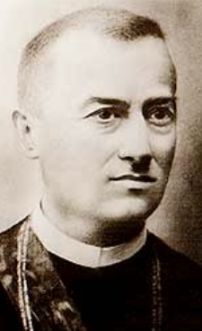**Szentkláray Jenő** (Törökbecse-Aracs, 1843. jan. 21. – 1925. okt. 12. Temesvár.) régész, irodalom- és műtörténész.

A szegedi piaristáknál tanult, 1860-ban Temesvárra kerül papnövendéknek, itt növendéktársaival magyar gyakorló-iskolát alapítanak. Tanulmányait a budapesti tudomány-egyetemen folytatja, ahol 1866-ban bölcsésztudori okle-velet és teológiai doktori címet szerez.

Miután pappá szentelik, a dél-bánsági bányatelepeken, előbb Stájerlak-Aninán volt káplán ahol német, szlovák és cseh nyelven hirdeti az evangéliumot. 1868-tól a nagy-kikindai német főelemi iskola igazgatója, egyúttal a reáliskolában a ma-gyar nyelv és irodalom tanára. 1869-től Temesvárott a főgimnáziumban a bölcselet és a latin nyelv tanára.

A város magyarosodó művelődési életének tevékeny résztvevője. 1871-ben Ormós Zsigmond főispánnal együtt megalapítója és első titkára a *Délmagyarországi Történelmi és Régészeti Társulatnak,* 1871-1874 között Ortvay Tivadarral szerkesztője a *Csanád megye hajdana és jelene* címmel kiadott történeti adattársorozatnak. 1871-1873 között szerkeszti a *Törté-nelmi Adattár* című havi közlönyt, melyben Dél-Magyarországra vonat-kozó okmányokat közöl. 1903-ban egyik alapítója és 1909-ig elnöke volt a temesvári *[Arany János Társaságnak](http://lexikon.kriterion.ro/szavak/111/),* szerkesztője időszaki kiadvány-sorozatának, a *Szépirodalmi és Szépműtani Közleményeknek*, valamint Sza­bolcska Mihállyal karöltve az *[Arany János Társaság](http://lexikon.kriterion.ro/szavak/111/) Könyvei* c. soro-zatnak.

1873-ban a Sissányi család által Törökbecsére hívják lelkésznek, 20 évig itt plébános. Közben munkatársa, majd főszerkesztője a nagybecskereki *Torontál* c. lapnak, hol a Délvidéki magyarosító kormánypolitikát támo-gató cikkek sorát írta. 1883-ban egyetemi magántanár Budapesten, Ma-gyarország legújabb történetének előadója. 1893-ban csanádi kanonokká nevezik ki, 1895-ben pedig apáttá.

Főképp a történelmi Magyarország déli vármegyéinek múltját tárta fel: levéltári kutatásokat végzett, régészeti ásatásokat vezetett, s egymás után jelentette meg forrásértékű munkáit. A pozitivista történelemszemlélet alapján állva műveiben tekintélyes mennyiségű dokumentumanyagot vo-nultatott fel, így nélkülözhetetlen forrásmunkák a Bánság és a Bácska múltját kutatók számára.

Legjelentősebb munkája a *Száz év Délmagyarország történetéből című*, 520 oldalas tanulmány, mely Dél-Magyarország történetének az 1779-tól 1879-ig terjedő időszakát dolgozza fel.

A Borovszky Samu által szerkesztett *Magyarország vármegyéi és városai* című monográfia-sorozatban megjelent Temes vármegye és Temesvár, valamint a Torontál vármegye kötetek történelmi részeinek ő a szerzője. Az MTA (1882) és a Magyar Heraldikai és Genealógiai Társulat (1883), a szerb Királyi Tudós Társaság kültagja (1885), az újvidéki Matica Srpska tagja (1910). Tagja volt a Szent István Akadémiának.

Az I. világháború után a Temesváron indult *Egyházi [Szemle](http://lexikon.kriterion.ro/szavak/4392/)* munkatársa; tervet dolgozott ki a Bánság műkincseinek összegyűjtésére és megőrzé-sére. Munkái: *A csanádi püspökség és káptalan rövid története, Szent Gellért dicsősége, A szerb monostoregyházak történeti emlékei Dél-magyarországon, Történelmi Adattár Csanád-egyházmegye történetéhez, Műemlékek és régi épületmaradványok a csanádi egyházmegye területén; A dunai hajóhadak története, A becskereki vár, Gr. Niczky Kristóf élete, A társadalom nemzeti feladatai Délmagyarországon, Mercy Klaudius Fl. kormányzata a Temesi Bánságban. stb.*

Forrás: [*Magyar Katolikus Lexikon*](http://lexikon.katolikus.hu/)

Székelyföldvári **Szilágyi Virgil** (Écska, [1824](https://hu.wikipedia.org/wiki/1824). [november 28.](https://hu.wikipedia.org/wiki/November_28.) - [Budapest](https://hu.wikipedia.org/wiki/Budapest), -[1892](https://hu.wikipedia.org/wiki/1892). [december 30.](https://hu.wikipedia.org/wiki/December_30.)) ügyvéd, országgyűlési képviselő, lapszerkesztő.

Édesapja Szilágyi Endre gazdatiszt volt az écskai urada-lomban, ki nagy hansúlyt fektetett gyermekei taníttatá-sára. Középiskoláját [Hódmezővásárhelyen végezte, majd](https://hu.wikipedia.org/wiki/H%C3%B3dmez%C5%91v%C3%A1s%C3%A1rhely) 1839 őszén az egész család Pestre költözött, itt bölcseletet hallgatott. 1840 őszén apját elvesztette édesapját, így ma-gántanításból tartotta el magát és hat testvérét.

1841 végén végül is megkezdhette jogi tanulmányait, de betegsége miatt félbeszakította azokat.

Hózmezővásárhelyen a család barátjánál, az ottani az uradalmi ügyésznél lett gyakornok. A jogtudományokból ezt követően magánvizsgákat tett. Miután az 1844. évi pozsonyi országgyűlés idején királyi táblai jegyzővé esküdött és 1846. januárában ügyvédi oklevelet nyert, Csongrád megye jegyzőjévé nevezték ki. Az 1848-49-es szabadságharc alatt tagja volt a megyei vészbizottságnak. 1850. februárban a Csongrád megyei császári biztos megyei törvényszéki főjegyzőnek nevezte ki, amit azonban hazafias megyőződése miatt nem fogadott el.

Pestre költözve 1851-től a *Pesti Napló* belmunkatársa, a külföldi rovat kezelője, *Az angol arisztokraczia* c. cikke nagy feltűnést keltett.

1853-1854 között, Gönczy Pál nevelőintézetében a magyar nyelv és a történelem tanára.

1854 nyarán ügyvédi vizsgát tett, azután törvényszéki védőügyvéd. Tán-csics Mihály polgári perében mondott hazafias és bátor védőbeszédével („Felségárulásról nem lehet szó oly országban, hol nincs törvényes fel-ség”) országos hírű lett. Az [1859](https://hu.wikipedia.org/wiki/1859)-es [Piemont](https://hu.wikipedia.org/wiki/Piemont) elleni vereség után [Ferenc József](https://hu.wikipedia.org/wiki/I._Ferenc_J%C3%B3zsef_magyar_kir%C3%A1ly)  [Bach](https://hu.wikipedia.org/wiki/Alexander_von_Bach) birodalmi belügyminisztert menesztette és [1860](https://hu.wikipedia.org/wiki/1860) októberében az uralkodó kiadta az ún. [Októberi Diplomát](https://hu.wikipedia.org/wiki/Okt%C3%B3beri_Diploma), mely rendelet visszaállította Magyarországon az alkotmányt. A császár 1861. április 6-ára Budára ösz-szehívta az országgyűlést.

Szilágyi Virgil  Pest-Józsefváros országgyűlési követe lett, Jókay Mórt legyőzve. Mivel a magyar országgyűlés visszautasította az összbirodalmi alkotmányt, Ferenc József feloszlatta az országgyűlést.  Az országgyülés föloszlatása után 1862. elfogták, felségárulás vádjával halálra ítélték, amit kegyelemből 14 évi várfogságra változtattak, Péterváradon raboskodott. Neje, felsőszopori Kovács Fanny kieszközölte a kegyelmet, azonban 1866-ban a [porosz-osztrák háború](http://lexikon.katolikus.hu/P/porosz-osztr%C3%A1k%20h%C3%A1bor%C3%BA.html) alatt a Klapka-betörés éjjelén elfogták.

A háborút lezáró nikolsburgi fegyverszünet utáni napon az eljárást meg-szüntették, ezt követően családjával együtt külföldön töltött 2 évet. Milá-nóban kapcsolatot tartott Kossuthtal, 1867-ben Párizsban részt vett az emigráció tárgyalásaiban, majd Berlinben telepedett le, ahonnan a *Magyar Újság*nak küldött tudósításokat.

Hazatérve 1869-től Hódmezővásárhelyt, 1881. és 1884. Székelyudvarhely országgyűlési képviselője. Ezen országgyülés vége előtt mandátumáról lemondott, visszavonult birtokára. 1870-ben az országos katolikus kong-resszuson vezérszerepe volt. 1871-ben dolgozta ki a márciusban elfogadott *[katolikus autonómia](http://lexikon.katolikus.hu/K/katolikus%20auton%C3%B3mia.html)* szervezeti tervét és a kormánynak benyújtott emléki-ratot. Különösen a publicisztika és jogi irodalom terén fejtett ki nagy munkásságot és cikkeinek száma majdnem a kétezret eléri.

„Szerkesztette az *Értesítő* című szépirodalmi és vegyes tartalmú hetilapot 1852. február 1-től április 26-ig (ebben: *Hazánk és Fiume* c. hosszabb cikke jelent meg) és ennek folytatását a *Budapesti Viszhang* c. szépirodal-mi divatlapot 1852. május 2-tól 1853 tavaszáig. Amikor a szépirodalmi és divatlap  1853-ban a *Délibábba* olvadt, a segédszerkesztőséget vállaló kitűnő szerkesztő, színműíró és hazafi [Vahot Imrével](https://hu.wikipedia.org/wiki/Vahot_Imre) szövetkezve, 1854. május 7-én a *Budapesti Viszhangot* újra megindította.

Mely lap 1857. február 4-iki megszűntekor a *Törvénykezési Lapokat* ideig-lenesen szerkesztette és a kitűnő  jogász, költő és hazafi [Császár Fe-renc](https://hu.wikipedia.org/wiki/Cs%C3%A1sz%C3%A1r_Ferenc) halála után kiadta azt”.

Forrás: [*Magyar Katolikus Lexikon*](http://lexikon.katolikus.hu/). [*Magyar Életrajzi Lexikon *](https://www.google.hu/url?sa=t&rct=j&q=&esrc=s&source=web&cd=11&cad=rja&uact=8&ved=0ahUKEwil0b-EusjXAhUKLVAKHc-3DCk4ChAWCCQwAA&url=http%3A%2F%2Fmek.oszk.hu%2F00300%2F00355%2Fhtml%2FABC05727%2F06467.htm&usg=AOvVaw1tqz0a0T5yVK8jW9XrbSEb)

**Szirtes Artúr** (Pancsova,  [1884](https://hu.wikipedia.org/wiki/1884). [szeptember 15.](https://hu.wikipedia.org/wiki/Szeptember_15.) – Budapest,  1927. ápri-lis 14.) ügyvéd, jogszociológus, jogi szakíró, író, költő.

1902-ben Budapesten a VI. kerületi Kemény Zsigmond Gimnáziumban jeles eredménnyel tett érettségi vizsgát. Ezt követően a jogra íratkozva a  [budapesti tudománye-gyetemen,](https://hu.wikipedia.org/wiki/E%C3%B6tv%C3%B6s_Lor%C3%A1nd_Tudom%C3%A1nyegyetem) [Pikler Gyula](https://hu.wikipedia.org/wiki/Pikler_Gyula) és [Vámbéry Rusztem](https://hu.wikipedia.org/wiki/V%C3%A1mb%C3%A9ry_Rusztem) előadá-sait látogatta. 1910-ben tett jogtudományi doktorátust, majd ügyvédi oklevelet szerzett, egyben az ügyvédi kamara is felvette lajstromába. 

1909-ben felvették a *Reform* szabadkőműves páholy-ba, amelynek később helyettes főmestere is lett. 1910 és 1912 folyamán előadást tartott a [*Galilei Kör*ben](https://hu.wikipedia.org/wiki/Galilei_K%C3%B6r), *Új-Zéland szocialisztikus államszerve-zete*, és a *A szerződésekről* címmel. 

Elsősorban iparjoggal foglalkozott, ám irodalmi tevékenységet is folyatott, több verseskötete is megjelent. Elkötelezett híve volt a szociális jogalko-tási mozgalomnak, szociológiai kutatások céljából több alkalommal járt külföldön, egy ízben [Új-Zélandon](https://hu.wikipedia.org/wiki/%C3%9Aj-Z%C3%A9land). Itteni élményei nyomán írta meg az Új-Zéland mint *"korunk legfejlettebb szocialisztikus szervezete"* című tanul-mányát, és ugyanezen címmel könyvet is írt az ország demokráciájáról (1910).  Tanulmányai, könyvismertetői a Jászi Oszkár szerkesztette társa-dalomtudományi folyóirat, a [*Huszadik Század*](https://hu.wikipedia.org/wiki/Huszadik_Sz%C3%A1zad_(foly%C3%B3irat)) hasábjain jelentek meg. A szociális tartalmú jog megteremtésére irányuló törekvéseit németországi kollégái rokonszenvvel követték.

1914-ben a *Magyar Iparosok Országos Szervezete* főtitkára lett, tagja volt a *Magyar Müvelődés Társaságának*, az *Iparművészeti Társulatnak*.

[Károlyi Mihály kormánya](https://hu.wikipedia.org/wiki/K%C3%A1rolyi_Mih%C3%A1ly-korm%C3%A1ny) idején visszautasította a miniszteri tanácsosi pozícióit, 1919-ben sikkasztással vádolták meg. A forradalmak után mun-kakedve és munka iránti lelkesedése is alábbhagyott. 1927-re idegi álla-pota megromlott, a neurózis jelei mutatkoztak. 1927. április 14-én megírta végrendeletét, majd öngyilkosságot követett el a terézvárosi Szív utca 18. alatti ház második emeletén lévő lakásban. 

Magyar nyelvű művei: *Szerelem (versek, 1904), Az élet útja (1907), Világ-harmónia (1908.) Mária dalok (versek, 1909), Szociális jogtudomány és szociográfiai módszer (1912.) [A szociális jog elmélete](http://mtdaportal.extra.hu/books/szirtes_artur_a_szocialis_jog_elmelete.pdf) (1913), [Társadalmi szervezkedés](http://mtdaportal.extra.hu/books/szirtes_artur_tarsadalmi_szervezkedes.pdf) (1914), [A gazdaságpolitikai pártok fejlődése](http://mtdaportal.extra.hu/books/szirtes_artur_gazdasagpolitikai_partok_fejlodese.pdf) (1917) Termelő exisztenciák szervezése (1917) Társadalom és jogalkotás (1917–1918), [Közvélemény és társadalmi fejlődés](http://mtdaportal.extra.hu/books/szirtes_artur_kozvelemeny_es_tarsadalomfejlodes.pdf) (1921), Évek és énekek (versek, 1922), Szociálindividualizmus (1924), A kollektív munkaszerződés (1925)stb.*

Források: *A magyar szociológiai irodalom bibliográfiája. 1970–1981. Ma-gyar életrajzi lexikon II. 1969. [Magyar zsidó lexikon](https://hu.wikipedia.org/wiki/Magyar_zsid%C3%B3_lexikon). 1929.  *

**Szöllősi** *Naszluhácz* **Jenő** ([Antalfalva](https://hu.wikipedia.org/wiki/Antalfalva), [1893](https://hu.wikipedia.org/wiki/1893). [január 18.](https://hu.wikipedia.org/wiki/Janu%C3%A1r_18.) - [Budapest](https://hu.wikipedia.org/wiki/Budapest), [1946](https://hu.wikipedia.org/wiki/1946). [március 19.](https://hu.wikipedia.org/wiki/M%C3%A1rcius_19.)) [nyilaskeresztes](https://hu.wikipedia.org/wiki/Nyilaskeresztes) politikus.

Középiskolai tanulmányait Makón, Pancsován és Nagy-kikindán végezte. Egyetemi tanulmányait Budapesten kezdte, majd 1913-ban [Németországban](https://hu.wikipedia.org/wiki/N%C3%A9metorsz%C3%A1g), a Karlsruhei Egyetemen szerzett vegyészmérnöki oklevelet.

Hazatérve, Budapesten gyógyszerészi oklevelet, vala-mint a budapesti jogi karon abszolutóriumot szerzett.

Az [első világháborúban](https://hu.wikipedia.org/wiki/Els%C5%91_vil%C3%A1gh%C3%A1bor%C3%BA) az 51. tüzérezred kötelékében tartalékos tisztként harcolt az orosz, a román és az olasz fronton. Századosként szerelt le, a [*Signum Laudis*](https://hu.wikipedia.org/wiki/Signum_Laudis) bronz és ezüst fokoza-tának, továbbá a bronz [vitézségi éremnek](https://hu.wikipedia.org/w/index.php?title=Vit%C3%A9zs%C3%A9gi_%C3%A9rem&action=edit&redlink=1) birtokosaként.

[1923](https://hu.wikipedia.org/wiki/1923)-ban vásárolt gyógyszertárat ”Remény” [Makón](https://hu.wikipedia.org/wiki/Mak%C3%B3) - 1944-ben feldúlják -, a mai Sárga üzletház helyén. Vállalkozása mellett az akkori [Csanád, Arad és Torontál k.e.e. vármegyei](https://hu.wikipedia.org/wiki/Csan%C3%A1d,_Arad_%C3%A9s_Toront%C3%A1l_k.e.e._v%C3%A1rmegye) közigazgatásban töltött be törvény-hatósági tisztséget, és tagja volt a város képviselőtestületének is.

[1939](https://hu.wikipedia.org/wiki/1939)-ben függetlenként - mikor jelölték a *Nyilaskeresztes Párt* éppen csak alakulóban volt - Makó országgyűlési képviselőjévé választották, a parla-mentben elsősorban az agrárproblémákkal foglalkozott.

A parlamentben belépett a [jobboldali](https://hu.wikipedia.org/wiki/Jobboldal) képviselőkből és felsőházi tagokból alakult [*Nemzeti Szövetségbe*](https://hu.wikipedia.org/w/index.php?title=Nemzeti_Sz%C3%B6vets%C3%A9g&action=edit&redlink=1), majd [1941](https://hu.wikipedia.org/wiki/1941)-től a [Nyilaskeresztes Párt](https://hu.wikipedia.org/wiki/Nyilaskeresztes_P%C3%A1rt) par-lamenti frakcióját vezette. [1943](https://hu.wikipedia.org/wiki/1943)-tól Fiala Ferencet váltva, szerkesztője az *Összetartás* című nyilas napilapnak.

A [nyilas hatalomátvétel](https://hu.wikipedia.org/wiki/Nyilas_hatalom%C3%A1tv%C3%A9tel) után a [*Szálasi-kormányban*](https://hu.wikipedia.org/wiki/Sz%C3%A1lasi-korm%C3%A1ny) [tárca nélküli miniszter](https://hu.wikipedia.org/wiki/T%C3%A1rca_n%C3%A9lk%C3%BCli_miniszter), a [minisz-terelnök](https://hu.wikipedia.org/wiki/Minisztereln%C3%B6k) helyettese. *- Álló sor, balról az utolsó Szöllősi Jenő, az ülő sor közepén Szá-lasi Ferenc -* Tisztségében [1944](https://hu.wikipedia.org/wiki/1944). [október 16](https://hu.wikipedia.org/wiki/Okt%C3%B3ber_16.)-a és [1945](https://hu.wikipedia.org/wiki/1945). [március 27](https://hu.wikipedia.org/wiki/M%C3%A1rcius_27.)-e között Szálasi jobbkeze volt. Az ő nevéhez fűződik Szálasi államfői ki-nevezéséről szóló törvény előterjesztése. [1944](https://hu.wikipedia.org/wiki/1944) őszén a kormány többi tagjával Németországba menekült a háború végén, ahol megadta magát az amerikaiaknak. Ők átadták az oroszoknak és [1945](https://hu.wikipedia.org/wiki/1945). [október 3](https://hu.wikipedia.org/wiki/Okt%C3%B3ber_3.)-án hozták vissza [Magyarországra](https://hu.wikipedia.org/wiki/Magyarorsz%C3%A1g). A [népbíróság](https://hu.wikipedia.org/wiki/N%C3%A9pb%C3%ADr%C3%B3s%C3%A1gok_Magyarorsz%C3%A1gon) a háborús bűnösök perében a kö-vetkező évben [kötél általi halálra](https://hu.wikipedia.org/wiki/Akaszt%C3%A1s) ítélte, [1946](https://hu.wikipedia.org/wiki/1946). [március 19](https://hu.wikipedia.org/wiki/M%C3%A1rcius_19.)-én végezték ki [Budapesten](https://hu.wikipedia.org/wiki/Budapest). Forrás: [*Magyar Életrajzi Lexikon *](https://www.google.hu/url?sa=t&rct=j&q=&esrc=s&source=web&cd=11&cad=rja&uact=8&ved=0ahUKEwil0b-EusjXAhUKLVAKHc-3DCk4ChAWCCQwAA&url=http%3A%2F%2Fmek.oszk.hu%2F00300%2F00355%2Fhtml%2FABC05727%2F06467.htm&usg=AOvVaw1tqz0a0T5yVK8jW9XrbSEb)

**Szörényi** *Kreider* **József** (Boksánbánya, [1909](http://hu.wikipedia.org/wiki/1909). [augusztus 10.](http://hu.wikipedia.org/wiki/Augusztus_10.) – [Szeged](http://hu.wikipedia.org/wiki/Szeged), [2010](http://hu.wikipedia.org/wiki/2010). [augusztus 22.](http://hu.wikipedia.org/wiki/Augusztus_22.)) pedagógus, főiskolai tanár.

Egyszerű munkás szülők gyermekeke, édesapja  [1916](https://hu.wikipedia.org/wiki/1916)-ban az olasz harctéren, Piavénél hősi halált halt.

Ezek után édesanyja nagynénjénél [Orosházán](http://hu.wikipedia.org/wiki/Orosh%C3%A1za) végezte elemi, majd polgári iskoláit. [1928](http://hu.wikipedia.org/wiki/1928)-ban jeles előmenetelű hadiárvaként mint ingyenes bentlakó, a [Szegedi Királyi Katholikus Tanítóképző Intézetben](http://hu.wikipedia.org/w/index.php?title=Szegedi_Kir%C3%A1lyi_Katholikus_Tan%C3%ADt%C3%B3k%C3%A9pz%C5%91_Int%C3%A9zet&action=edit&redlink=1) megkapta tanítói oklevelét, Kreider családi nevét - szülőföldjére emlé-kezve - Szörényire magyarosította.

[1932](http://hu.wikipedia.org/wiki/1932)-ben a [Szegedi Polgári Iskolai Tanárképző Főiskolán](http://hu.wikipedia.org/w/index.php?title=Szegedi_Polg%C3%A1ri_Iskolai_Tan%C3%A1rk%C3%A9pz%C5%91_F%C5%91iskola&action=edit&redlink=1) kapott polgári iskolai tanári oklevelet magyar-német-testnevelés szakokból, miközben a [müncheni](http://hu.wikipedia.org/wiki/M%C3%BCnchen) és a [lipcsei](http://hu.wikipedia.org/wiki/Lipcse) egyetemen képezte magát tovább.

[1933](http://hu.wikipedia.org/wiki/1933)-[1935](http://hu.wikipedia.org/wiki/1935) között az [Apponyi Kollégiumba](http://hu.wikipedia.org/w/index.php?title=Apponyi_Koll%C3%A9gium&action=edit&redlink=1) járt, mely intézmény a Tanító- és tanítónőképző intézeti tanárok speciális képzőintézménye volt és 1928-tól Szegeden működött, itt [1935](http://hu.wikipedia.org/wiki/1935)-ben tanítóképző intézeti tanári szakvizsgát tett. Tanulmányai mellett óraadó tanár a szegedi tanítóképzőben.

[1935](http://hu.wikipedia.org/wiki/1935)-ben egy tanévet a [Jászberényi](http://hu.wikipedia.org/wiki/J%C3%A1szber%C3%A9ny) [Állami Tanítóképző Intézet](http://hu.wikipedia.org/w/index.php?title=Magyar_Kir%C3%A1lyi_%C3%81llami_Tan%C3%ADt%C3%B3k%C3%A9pz%C5%91_Int%C3%A9zet&action=edit&redlink=1)ben taní-tott, majd [1936](http://hu.wikipedia.org/wiki/1936) szeptemberétől a [Szegedi Királyi Katholikus Tanítóképző Intézet](http://hu.wikipedia.org/w/index.php?title=Szegedi_Kir%C3%A1lyi_Katholikus_Tan%C3%ADt%C3%B3k%C3%A9pz%C5%91_Int%C3%A9zet&action=edit&redlink=1) tanára lett. [1940](http://hu.wikipedia.org/wiki/1940). [június 21-én](http://hu.wikipedia.org/wiki/J%C3%BAnius_21.) doktorált a [szegedi Tudomány-egyetemen](http://hu.wikipedia.org/wiki/SZTE). A [második világháború](http://hu.wikipedia.org/wiki/M%C3%A1sodik_vil%C3%A1gh%C3%A1bor%C3%BA) idején [1943](http://hu.wikipedia.org/wiki/1943)-[1945](http://hu.wikipedia.org/wiki/1945) között a harctéren előbb hadnagyi, majd századparancsnoki beosztásban szolgált.

A háborúból szerencsésen hazatérve a szegedi tanítóképzőben tanított, majd 1958-ig a szegedi [Radnóti Miklós Gyakorló Gimnázium](http://hu.wikipedia.org/w/index.php?title=Radn%C3%B3ti_Mikl%C3%B3s_Gyakorl%C3%B3_Gimn%C3%A1zium&action=edit&redlink=1) magyar tanára volt. Ezt követően [Szegedi Tudományegyetem](http://hu.wikipedia.org/wiki/Szegedi_Tudom%C3%A1nyegyetem) [Ságvári Endre Gya-korló Általános Gimnázium](http://hu.wikipedia.org/w/index.php?title=S%C3%A1gv%C3%A1ri_Endre_Gyakorl%C3%B3_%C3%81ltal%C3%A1nos_Gimn%C3%A1zium&action=edit&redlink=1) tanára, miközben az egyetemen a magyar nyelvtan tanítása módszertanát adta elő. - A két iskolát az 56-os forradalom alatt vissza- ill. átkeresztelik Klauzálra illetve Hunyadira -.

Szörényi József [1959](http://hu.wikipedia.org/wiki/1959)-től a [Szegedi Felsőfokú Tanítóképző Intézet](http://hu.wikipedia.org/w/index.php?title=Szegedi_Fels%C5%91fok%C3%BA_Tan%C3%ADt%C3%B3k%C3%A9pz%C5%91_Int%C3%A9zet&action=edit&redlink=1) tanára. [1963](http://hu.wikipedia.org/wiki/1963)-tól nyugdíjazásáig a [Szegedi Tanárképző Főiskola](http://hu.wikipedia.org/w/index.php?title=Szegedi_Tan%C3%A1rk%C3%A9pz%C5%91_F%C5%91iskola&action=edit&redlink=1) Neveléstudo-mányi Tanszékének docense.

A pedagógus-nevelés kiemelkedő egyénisége volt. Századik születés-napjára kimagasló és példamutató pedagógiai életpályája elismeréseként a Szegedi Tudományegyetem Ezüst Emlékérmét adományozta számára, ez év augusztus 20-án [a Magyar Érdemrend lovagkeresztje](https://hu.wikipedia.org/wiki/A_Magyar_%C3%89rdemrend_lovagkeresztje) kitütetést kapta meg. Műve: *Garamszegi Lubrich Ágost neveléstudományi rendszere. (Doktori értekezés) 1940.*

Forrás: *Szegedi Tanárképző Főiskola 1873-1998*. *(1998). Magyar kato-likus lexicon*

**Sztójay Döme** (születési nevén *Dimitrije Sztojakovich*, [Versec](http://hu.wikipedia.org/wiki/Versec), [1883](http://hu.wikipedia.org/wiki/1883). [ja-nuár 5.](http://hu.wikipedia.org/wiki/Janu%C3%A1r_5.) - [Budapest](http://hu.wikipedia.org/wiki/Budapest), [1946](http://hu.wikipedia.org/wiki/1946). [augusztus 22.](http://hu.wikipedia.org/wiki/Augusztus_22.)) politikus, diplomata, honvéd altábornagy, miniszterelnök és külügyminiszter.

1902-ben, a pécsi hadapródiskola elvégzése után hadap-ród tiszthelyettessé avatták. Budapesten folytatta a kato-nai tanulmányokat, majd 1907-1910 között a bécsi hadi-iskolán tanult. 1910-től vezérkari beosztásokba vezé-nyelték.

Az első világháborúban 1917-ig boszniai és hercego-vinai, valamint dalmáciai csapatokat irányító tabornoki törzshöz tartozott. Ezután a 21. hegyi dandár vezérkari főnöke, majd a had-sereg főparancsnokság hírszerző osztályán a Balkán-csoport vezetője volt. Az őszirózsás forradalom győzelme után a Hadügyminisztérium hírszerző, kémelhárító és nyilvántartó osztálya élére került.

A kommün bukása után újra osztályvezető a Hadügyminisztériumban, majd novembertől, a fővezérség hírszerző csoportja vezetője. Horthy Mik-lós kormányzóvá választása után, 1920. júliustól 1925-ig a minisztérium hírszerzési és kémelhárítási osztályának vezetője.

1925-től vezérkari ezredesi rangban a berlini magyar követség katonai attaséja. 1933-ban elérte a tábornoki rendfokozatot. 1933-tól Budapesten a Honvédelmi Minisztérium elnöki osztályát vezette. 1935 decemberétől szolgálaton kívüli altábornagyként berlini magyar nagykövet lett.

Magyarország német megszállása után, 1944. március 22-én a németek követelésére miniszterelnök, egyben külügyminiszter lett. A Sztójay-kormányt az “önállóság ameddig lehet”, azaz lényegében az időhúzás cél-jából hozták létre, mégis intézkedéseivel lehetővé tette a hamarosan bekö-vetkező törvénytelenségek sokaságát, és betetőzte a “zsidó-törvényekkel” megkezdődött tévútat.

Horthy Miklós kormányzó aki államfői jogaival (a nyilas puccsig) élve kinevezte a Sztójay-kormányt, mely koalíció a kormányzó (MÉP) [Magyar Élet Pártja](https://hu.wikipedia.org/wiki/Magyar_%C3%89let_P%C3%A1rtja) (egykori Egységes Párt), illetve az  [Imrédy Béla](https://hu.wikipedia.org/wiki/Imr%C3%A9dy_B%C3%A9la) vezette (MMP) [Magyar Megújulás Pártja](https://hu.wikipedia.org/wiki/Magyar_Meg%C3%BAjul%C3%A1s_P%C3%A1rtja) alkották. Az MMP-t augusztus 7-én eltávolí-tották a hatalomból, onnantól egypárti kabinetként működött leváltásáig.

A Sztójay-kormány élén a pártonkívüli miniszerelnök, egyben külügy-miniszter Sztójay Döme altábornagy ált. A németek követelése ellenére a kormányba nem kerültek be szélsőjobboldali (nyilas) politikusok, de en-nek ellenére mégis kiszolgálták a német zsidópolitikát. A Sztójay-kormány feloszlatta az ellenzéki pártokat, bevezette a teljes sajtócenzúrát, a zsidókat gettókba kényszerítették, megkezdte koncentrációs táborokba szállításu-kat, és háromszázezerre emelte a fronton harcoló katonák számát.

Igen hamar, már március 31-én rendeletet hoztak arról, hogy minden zsi-dónak minősülő és 6 évesnél idősebb személynek sárga színű, hatágú csillagot kötelező viselnie ruhája bal mellrészére varrva. Ezzel egyetem-ben az MMP által delegált [Jaross Andor](https://hu.wikipedia.org/wiki/Jaross_Andor), valamint annak  államtitkárai, a szintén “megújhodó” [Baky László](https://hu.wikipedia.org/wiki/Baky_L%C3%A1szl%C3%B3), valamint a “fajvédő”  Endre László, a csendőr-parancsnok [Ferenczy László](https://hu.wikipedia.org/wiki/Ferenczy_L%C3%A1szl%C3%B3_(csend%C5%91rtiszt)) alezredessel megszervezték a vidéki zsidóság deportálását. A budapestit zsidóság átmenetileg megmenekült, őket “csak “ gettóba záratták. 1944. május 15. és július 9. között pedig a holokauszt legnagyobb deportálási akciójának keretében mintegy 430 ezer embert deportáltak a birodalom haláltáboraiba.

A hivatalos magyarázat szerint a zsidókat „munkaerőkölcsönzés” indo-kával vitték Németországba. Számos ellenzéki személyiséget letartóztat-tak, közülük sokan *koncentrációs tábor*ba kerültek. Bajcsy-Zsilinszky Endrét a [*Szabad Szó*](https://hu.wikipedia.org/wiki/Szabad_Sz%C3%B3_(foly%C3%B3irat,_1889%E2%80%931952)) című nemzetiszocializmus ellenes lap szerkesztőjét, [1944](https://hu.wikipedia.org/wiki/1944). március 19-én budai lakásán, a  [Gestapo](https://hu.wikipedia.org/wiki/Gestapo) emberei tűzharcban megse-besítették, majd elhurcolták. A kormány a fentiekkel párhuzamban betil-totta többek között a *Magyarországi Szociáldemokrata Pártot, a Függet-len Kisgazdapártot, a [Magyar Parasztszövetséget](https://hu.wikipedia.org/wiki/Magyar_Parasztsz%C3%B6vets%C3%A9g)*, valamint mintegy 150 folyóiratot és 18 napilapot (köztük a *Népszavát,* az *Ellenzéket* és a [*Magyar Nemzetet*](https://hu.wikipedia.org/wiki/Magyar_Nemzet_(napilap,_1938%E2%80%932018))) is. Betiltottak több mint 100 egyéb társulatot és kulturális egye-sületet (pl. a Keresztény Női Tábort).

Nem maradtak ki az „őrségváltásból” az állami intézmények sem, így a 

*Magyar Nemzeti Bank*, a *Nemzeti Színház*, vagy a *Magyar Rádió* sem. Az ily módon „megtisztított” államgépezet engedelmes eszközévé vált a né-met megszálló hatóságoknak, az ország valamennyi erőforrását a német érdekekért folytatott hadviselés szolgálatába állította. Külön listák alapján a zsidó származású szerzők könyveit bezúzták.

A kormányzó az 1944. augusztus 23-i román kiugrás után elszánta magát a Sztójay-kormány menesztésére, már a következő napon augusztus 24-én, azt lemondatta. Sztójay Döme leváltása után visszavonult a közélettől, a nyilas uralom alatt sem vállalt hivatalt.

1945 elején a nyilas államgépezettel együtt Németországba menekült, má-jusban az amerikai hatóságok tartóztatták le, és októberben már kiadták Magyarországnak. A népbíróság a miniszterelnöksége idején hozott intéz-kedéseiért 1946. március 22-én háborús bűnösként golyó általi halálra ítél-te. Egykori kormánya tagjaival Rátz Jenővel, Reményi-Schneller Lajos-sal és [Szász Lajossal](https://hu.wikipedia.org/wiki/Sz%C3%A1sz_Lajos) együtt augusztus 22-én kivégezték.

Forrás: *Magyarország a második világháborúban. Lexikon A-Zs. 1997.* 

[*Magyar Katolikus Lexikon*](http://lexikon.katolikus.hu/)

**Sztrilich Pál** (Pancsova, [1900](https://hu.wikipedia.org/wiki/1900). [június 14.](https://hu.wikipedia.org/wiki/J%C3%BAnius_14.) - [Budapest](https://hu.wikipedia.org/wiki/Budapest), [1960](https://hu.wikipedia.org/wiki/1960). [november 7.](https://hu.wikipedia.org/wiki/November_7.)) [cserkészvezető](https://hu.wikipedia.org/wiki/Cserk%C3%A9szet).

A budapesti [Piarista Gimnáziumban](http://hu.wikipedia.org/wiki/Piarista_Gimn%C3%A1zium_%28Budapest%29) érettségizett. Egyetemi tanulmányait [1923](http://hu.wikipedia.org/wiki/1923)-ban fejezte be, [1930](http://hu.wikipedia.org/wiki/1930)-ban avatták orvosdoktorrá. A [budapesti](http://hu.wikipedia.org/wiki/Budapest) Fogászati Klinikán [1939](http://hu.wikipedia.org/wiki/1939)-től gyakornok, [1947](http://hu.wikipedia.org/wiki/1947)-től tanársegéd. Majd a [Központi Stomatológiai Intézet](http://hu.wikipedia.org/w/index.php?title=K%C3%B6zponti_Stomatol%C3%B3giai_Int%C3%A9zet&action=edit&redlink=1) főorvosaként dolgozott.

[1913](http://hu.wikipedia.org/wiki/1913)-ban lett [cserkész](http://hu.wikipedia.org/wiki/Cserk%C3%A9szet) a Piarista Gimnáziumban, amikor 1914-ben a piarista csapat Magas-Tátra-i mozgótáboron vett részt, a csapat parancsnoka, Sík Sándor katonapap mint “legkedvesebb fiát” tartotta számon. 1918-ban behívták katonának, útban az olasz harctéren küzdött, majd vöröskatonaként is részt vett a Felvidék visszafoglalásában. [1921](http://hu.wikipedia.org/wiki/1921)-ben cserkésztiszti tábort végzett [Fehérvár-csurgón](http://hu.wikipedia.org/wiki/Feh%C3%A9rv%C3%A1rcsurg%C3%B3), majd [1922](http://hu.wikipedia.org/wiki/1922)-ben megszervezte az első cserkész [sítábort](http://hu.wikipedia.org/wiki/S%C3%ADel%C3%A9s) a [Bükkben](http://hu.wikipedia.org/wiki/B%C3%BCkk_%28hegys%C3%A9g%29). [1924](http://hu.wikipedia.org/wiki/1924)-ben megszervezte az első síversenyt a [Normafán](http://hu.wikipedia.org/wiki/Normafa). 1927-ben megvaló-sult nagy műve, a Hárshegyi Cserkészpark.

Nemzetközi cserkész síversenyén is részt vett Kanderstegben 1928-ban, amelyen magyar cserkészek először nyerték meg a versenyt. A külföldi tapasztalatokat felhasználta az itthoni kiképzési munkában. Központi tisz-titáborokat szervezett, 1930-ban részt vett az angliai Gilwell-park tiszt-képző táborán, majd megszerezte a nemzetközi cserkésztiszti képesítést.

A külföldi utak költségeinek egyébként nagyobb részét mindig maga fi-zette, a hazai táborokét pedig teljes egészében. A kiképzés céljaira meg-szerezte és lefordíttatta az angol cserkészkiképzési falitáblákat (Scout-charts).

Nagy eseménye volt a magyar cserkészetnek a *gödöllői Világjamboree 1933-ban.* A nagy gazdasági világválság ellenére 15000 magyar cserkész, 8000 külföldi cserkész, és 3000 közszolgálatos öregcserkész vett részt a táborozáson, Sztrilich Pál a szórakoztatási csoportot vezette.

Főmunkatársa a Temessy Győző szerkesztette *Cserkészkönyvnek,* hasonló-képpen a Sík Sándor szerkesztette *Cserkészvezetők Könyvének*. Ez a könyv jelenti a cserkészet magyarrá tételének elvi megalapozását. Cserkész-vezetőként hamar felismerte a fiúkban élő romantikus indítást, így fogé-konyságukat az indián-romantikára. Később ezek könyv alakban is meg-jelentek: *Indiániskola* 1926-ban, *Indián önvédelem* 1927-ben.

A legnagyobb hatású, a *Vad vízeken* 1939-ben, melyben a vízből mentéssel foglalkozik. Ismertető füzetet állitott össze a vizitelepről *Tengerre magyar, a Hárshegyi Cserkészparkról Szabadba fiúk* címmel 1929-ben.

Forrás: [*Magyar katolikus lexikon*](https://hu.wikipedia.org/wiki/Magyar_katolikus_lexikon)

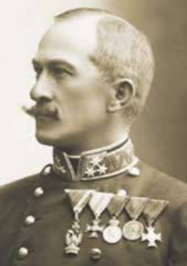Vitéz **Szurmay Sándor** (Boksánbánya, [1860](http://hu.wikipedia.org/wiki/1860). [december 19.](http://hu.wikipedia.org/wiki/December_19.) – [Budapest](http://hu.wikipedia.org/wiki/Budapest), [1945](http://hu.wikipedia.org/wiki/1945). [február 26.](http://hu.wikipedia.org/wiki/Febru%C3%A1r_26.)) magyar királyi gyalogsági tábornok, honvédelmi mi-niszter.

Édesapja Szurmay Mihály evangélikus, édesanyja Burg-hardt Borbála Jozefina pedig római katolikus hitű volt, utódaikat ez utóbbi vallásra keresztelték. Szurmay Sán-dor a szegedi főreáltanodában diákoskodott. Édesapja betegsége, majd rövidesen bekövetkezett halála miatt a 15. évében járó fiatalembernek kereső foglalkozás után kellett néznie. Ekkor lett az Osztrák‒Magyar Államvasút

-társaság resicabányai gyárának hivatalnoka.

22 éves korában 8 heti honvédségi kiképzés után a Ludovika Akadémia 2 évig tartó tisztképző tanfolyamára vezényeltek. A Lugoson töltött kétévi csapatszolgálat után, saját kérésére került a Ludovika felsőbb tiszti tan-folyamára. [1887](http://hu.wikipedia.org/wiki/1887)–18[89](http://hu.wikipedia.org/wiki/1889) között előbb a bécsi császári és királyi vezérkari tiszti akadémiát végezte el, majd kétéves vezérkari tiszti képzésre a bécsi Hadiiskolába küldték. Szurmayt 1892 májuában főhadnagyi rangban a bu-dapesti 1. honvéd gyalogezred állományában nették, majd II. osztályú szá-zadossá nevezték ki, egyúttal a „honvédelmi minisztérium I-ső ügyosz-tályába rendelteték. 1892-től több-kevesebb megszakítással a honvédelmi minisztériumban kapott feladatot, [1900](http://hu.wikipedia.org/wiki/1900)-tól őrnagyi rangban a honvéd ve-zérkarban osztályvezető lett.

1905–1907 között ezredesi rangban a nagykanizsai 20. honvéd gyalogez-red parancsnoka. 1907-től a minisztérium II. ügycsoportjának, majd 1910-től az I. ügycsoportjának főnöke lett. 1914. augusztus 17-én Szurmay Sán-dort altábornagyi rangban államtitkárrá nevezte ki. Ebben a beosztásban érte az [I. világháború](http://hu.wikipedia.org/wiki/Els%C5%91_vil%C3%A1gh%C3%A1bor%C3%BA) kitörése. Előmenetelében döntő szerepe volt kima-gasló szakmai tudásának, ugyanis a Ludovika Akadémia tisztképző tanfo-lyamán első helyre sorolták be. [1914](http://hu.wikipedia.org/wiki/1914) októberében a honvédelmi államtit-kár 54 évesen inkább harctéri szolgálatra jelentkezett.

1914 októberére a [Monarchia](https://hu.wikipedia.org/wiki/Osztr%C3%A1k%E2%80%93Magyar_Monarchia) hadereje a német segítség elmaradása miatt aránytalanul sok katonát vesztett az orosz hadsereg feltartóztatásával, és főként a csehek tömegesen adták meg magukat az oroszoknak. Már a há-ború kezdetén, 1914 szeptemberében az a veszély fenyegetett, hogy az oro-szok a Kárpátokon keresztül a Magyarország szíve felé nyomulnak előre. Emiatt [*Hazai Samu*](https://hu.wikipedia.org/wiki/Hazai_Samu) honvédelmi miniszter és [Tisza István](https://hu.wikipedia.org/wiki/Tisza_Istv%C3%A1n) [miniszterelnök](https://hu.wikipedia.org/wiki/Magyarorsz%C3%A1g_korm%C3%A1nyf%C5%91inek_list%C3%A1ja), mintegy 70 000 katonát csoportosított a [Kárpátokba](https://hu.wikipedia.org/wiki/K%C3%A1rp%C3%A1tok) [Szurmay Sándor](https://hu.wikipedia.org/wiki/Szurmay_S%C3%A1ndor) al-tábornagy parancsnoksága alatt. A harctéri helyzet akkor fordult válsá-gosra, amikor a oroszok behatoltak a Magyar Királyság területére, az Uzsoki-hágóba és a "Homonnai-zsákba".

Szurmay új hadteste a válságba került 3. hadsereg jobbszárnyán 1914/15 telén nehéz védelmi harcokat vívott [Zboró](http://hu.wikipedia.org/wiki/Zbor%C3%B3) és [Bártfa](http://hu.wikipedia.org/wiki/B%C3%A1rtfa) vidékén, ahol a Szur-may hadteste az Uzsoki-hágónál megállította az [orosz](http://hu.wikipedia.org/wiki/Orosz_Birodalom) betörést. 1914 no-vember végén Szurmay Sándorról nevezték el *(Korps Szurmay)* a honvéd hadtestet. A katonák kegyetlen fagyban, hóviharban, elkeseredett küzde-lemben verték vissza az orosz tömegtámadásokat. Majd 1914. november 27-én a csapatok ellentámadást indítva, ez év decemberére az orosz erőket visszaverték, akik csak jelentős hadianyagot hátrahagyva menekültek a bekerítés elől. Az Uzsoki-hágó felszabadult! Szurmay Sándor csoportja két és fél hét alatt kiűzte az oroszokat Homonna és Bártfa környékéről, és útta-lan utakon harcolva elérte, és visszafoglalta az orosz kézre került Uzsoki-hágót, amivel kivívta az "Uzsok hőse" címet.

1915 januárjában Szurmay hadcsoportja a Svetozar Borojević gyalogsági tábornok parancsnoksága alatt álló 3. hadsereg jobbszárnyának szélét alkotta a galíciai fronton. Március elején Bruszilov lovassági tábornok 8. hadserege vonult fel. Kisebb-nagyobb támadásokban próbálták elfoglalni az Uzsoki-hágót, de Szurmay katonái mindenütt kitartottak.  E győzelmek hatására kapta kitüntetésül a "vitéz uzsoki Szurmay Sándor" nevet.

Ezt követően a Szurmay-csoportot átvezénylték Bártfához, ahol Szurmay Sándor a sikerek után megindult a kibontakozó limanovai csata körzetébe, és ott döntően avatkozott be az első jelentős győzelem kivívásába. 1915 májusában Szurmay harccsoportja részt vett a gorlicei áttörésben, Tarnów-nál győzött a nagy túlerőben lévő orosz haderő felett. A Limanovánál szü-letett győzelem fordulópontot jelentett az oroszok elleni háborúban. Az orosz "gőzhengert" megállították, és ennek köszönhetően a Monarchia hadserege elegendő időt és teret nyert a további harcokhoz. 

1915-ben a Kárpátokban harcolva védte Magyarországot egy újabb orosz betöréstől. 1916 tavaszán Szurmay hadcsoportja Volhíniában ásta be ma-gát, maj djúnius 4-én megindult a Bruszilov-offenzíva, az osztrák-magyar lövészárkokra és erődített állásokra ezer tüzérségi löveg tüze zúdult.  Jú-nius 5-én reggel az orosz XL. hadtest támadásba lendült, június 7-én a lucki áttörésben Szurmay balszárnya fedezetlenül maradt, vissza kellett vonul-nia.  Június végén német csapaterősítések érkeztek a veszélyeztetett front-szakaszra, amelyek tehermentesítették Szurmay hadtestének maradékait. 

1916. szeptember 15-én a 8. orosz hadsereg VIII. hadteste újra támadást indított Szurmay hadteste ellen. Hadteste a támadó oroszok folyamatos nyomása alatt maradt egészen októberig, amikor a németek erősítést hoz-tak a hadtest mindkét szárnyára. A német csapatokkal megerősített cs. és kir. 4. hadsereg novembertől (benne a feltöltött Szurmay-hadtesttel) meg-szilárdította állásait.

Szurmay hadtestparancsnoki tisztségében 1917 februárjáig maradt, ekkor *IV. Károly* király 1917. február 17-én Szurmay Sándort magyar királyi honvédelmi miniszterré nevezte ki. Hazai Samutól átvette a honvédelmi miniszteri tisztséget [Tisza István](http://hu.wikipedia.org/wiki/Tisza_Istv%C3%A1n) kormányában. Szurmayt 1917. augusztus 21-én gyalogsági tabornokká léptették elő.  Miniszteri tárcáját a következő kormányokban (Esterházy Móric, majd Wekerle Sándor cabinetjeiben) is megtartotta, egészen az összeomlásig, 1918. október 31-éig. Miniszteri munkája alatt Szurmay egy jótékonysági alapot hozott létre a honvédség, a népfelkelés és a csendőrség hadirokkantjai és az elesettek özvegyei, árvái javára. Mindvégig a keleti fronton harcolva megkapta mind a németek, mind a Monarchia elismerését. A II. osztályú német vaskereszt, I. osztályú Lipót-rend, a Katonai Mária Terézia Rend lovagkeresztjével tüntették ki. IV. [Károly királytól](http://hu.wikipedia.org/wiki/IV._K%C3%A1roly_magyar_kir%C3%A1ly) megkapta az Uzsoki bárói rangot.

1918. október 31-én, az Osztrák–Magyar Monarchia politikai összeom-lásakor lemondott honvédelmi miniszteri beosztásáról, mivel nem kívánt részt venni Magyarország "szétzüllesztésében". Az antantbarát hazai ellen-zék már jó ideje kikezdte az ő és Tisza személyét, semmi jó nem várt egyi-kőjükre sem. Az [őszirózsás forradalom](http://hu.wikipedia.org/wiki/%C5%90szir%C3%B3zs%C3%A1s_forradalom) után, [1919](http://hu.wikipedia.org/wiki/1919). [február 24-én](http://hu.wikipedia.org/wiki/Febru%C3%A1r_24.) [Károlyi Mihály](http://hu.wikipedia.org/wiki/K%C3%A1rolyi_Mih%C3%A1ly) [miniszterelnök](http://hu.wikipedia.org/wiki/Magyarorsz%C3%A1g_korm%C3%A1nyf%C5%91inek_list%C3%A1ja) utasítására letartóztatták, és internálták, mert a pol-gári forradalom vívmányaira veszélyes egyénnek tekintették. Tisza István rosszabbul járt, őt a lakása előtt lőtték le a Károlyi aktivisták. Tehát az or-szágot megvédeni akaró és képes két legfontosabb magyart eliminálták, a haladó nyugati demokrácia elkötelezett hazai képviselői. Szurmayt a bu-dapesti gyűjtőfogházba vitték, felelőssé tették (!) az 1914/15-ös kárpáti harcokban való szerepéért, Károlyi Mihály szerint Szurmay Sándor volt az egyik okozója a háború elhúzódásának. "… jobb lett volna, ha az oroszok legyőznek bennünket a Kárpátokban, mert ez esetben hamarább szaba-dultunk volna a háborús keserűségtől …" 1921-ben visszavonult az aktív szolgálattól, ezt követően 1929-ben az elsők kozött vették fel a [Vitézi Rend](http://hu.wikipedia.org/wiki/Vit%C3%A9zi_Rend) tagjainak sorába. Az I. világháborús élményeit legfontosabb művében, az 1940-ben kiadott *"A Magyar katona a Kárpátokban"* című könyvében foglalta össze. Szurmay Sándor tábornok még megérte szovjet orosz megszállását. 1[945](https://hu.wikipedia.org/wiki/1945). [február 26-án](https://hu.wikipedia.org/wiki/Febru%C3%A1r_26.) Budapesten, 85 éves korában hunyt el. A szocializmus időszakában *Az orosz vörös veszedelem és Magyarország szerepe* című könyve (1921) miatt ő is feketelistára került. Személye csak 1990-at követően kerülhetett be a nemzeti katonai panteonba. 2012-től a budapesti helyőrség dandár is nevét viseli.

Források: Losonczi Szakall Kálmán: *Uzsok hősei 1914* (1940), M. Tóth György: *A katonabáró,* Galántai József: *Magyarország az első világ-háborúban* (2001).

**T**

**Tamkó Sirató Károly** ([Újvidék](http://hu.wikipedia.org/wiki/%C3%9Ajvid%C3%A9k), [1905](http://hu.wikipedia.org/wiki/1905). [január 26.](http://hu.wikipedia.org/wiki/Janu%C3%A1r_26.) - [Budapest](http://hu.wikipedia.org/wiki/Budapest), [1980](http://hu.wikipedia.org/wiki/1980). [január 1.](http://hu.wikipedia.org/wiki/Janu%C3%A1r_1.)) költő, művészetfilozófus, műfordító.

Az Újvidéken élő fiatalember már tizenkét éves korától verselt. Az [1921](http://hu.wikipedia.org/wiki/1921)-ben megjelentetett első verseskönyve, *„Az Élet tavaszán”* [Ady Endre](http://hu.wikipedia.org/wiki/Ady_Endre) hatását mutatja*.* 1926-ban jogi doktorátust szerzett a budapesti egyetetemen, majd [Debrecenbe](http://hu.wikipedia.org/wiki/Debrecen) költözött. A magyar avantgárd fo-lyóirata, a *"Magyar Írás"* és a köré csoportosuló fiatal költők Tamkóban látták az expresszionizmus nagy ígé-retét. 1928-ban jelent meg a *„Papírember”* című máso-dik verseskönyve, ebben a műben jelentek meg első vizuális versei.

A vágyakozás az elérhetelenhez 1930-ban Párizsba vitte, hol francia nyelvű szürrealista verseivel, kiáltványaival hamarosan ismert jelenség lett a párizsi kávéházak művészköreiben. Tamkó stílusát *"dimenzionistá"-nak* nevezte el. [1936](http://hu.wikipedia.org/wiki/1936)-ban kiadta a *„Dimenzionista Manifesztum”-*ot, a kiált-ványban foglalta össze elvielméleti gondolatait az [avantgárd](https://hu.wikipedia.org/wiki/Avantg%C3%A1rd) feladatairól és céljairól. A kiáltványt híres szürrealista olyan költők, absztrakt festők írták alá mint pl. [Vaszilij Kandinszkij](https://hu.wikipedia.org/wiki/Vaszilij_Vasziljevics_Kandinszkij), [Marcel Duchamp](https://hu.wikipedia.org/wiki/Marcel_Duchamp), Hans Arp vagy [Joan Miró](https://hu.wikipedia.org/wiki/Joan_Mir%C3%B3).

1936-ban súlyosan megbetegedett, a részlegesen megbénult fiatal ember hazatért, a budai gyógyfürdőktől remélte gyógyulását. A fájdalmak hatá-sára [1942](http://hu.wikipedia.org/wiki/1942)-ben a halálközelséget sugalló verseit *„Kiáltás”* címmel foglalta kötetbe. Betegségéből egy keleti gyógyfilozófya menti ki, a jóga mozgási és lélekzési gyakorlatai, meghozták számára a gyógyulást, most már az indiai irodalom felé fordúlt, akár szanszkritül is idézni tudott a *Maháb-hárátából*. A sok nyelven tudó, és ráadásul jogászmúltú fiatalember felé-pülése után sikeresen elhelyezkedik a modernséget sugalló az Orion cég-nél.

A második világháború utáni évtizedekben szinte csak légzőrendszere alakításával foglalkozott. Rendszerét a *„Ne légy többé beteg!”* című kéz-iratban foglalta össze. A költészetet azonban nem hagyta abba, bízott abban, hogy rövid időn belül belül az avantgárdot újra felfedezik.

Egészen egyéni a hangja az 1969-ben megjelent , *"A Vízöntő kor hajnalán"* című válogatott költeményes kötetének. Ugyanebben az évben jelent meg *"A három űrsziget"* című tudományos-fantasztikus regénye is, ahol a jövő társadalmát, a győzedelmes és emberboldogító technika küzdelmért, vala-mint humánum diadalmáról ábrándozik.

Látomásos költeménygyűjteménye *"Cosmogrammok"-*címmel, a gyerme-keknek írta a leglíraibb vallomását magáról, akit *Ecki-Becki-Tengerecki Pál-nak* nevezett. Így lettek együtt a tudományos-fantasztikus történetek és a gyermekversek mindennek ötvözetei. Habár népszerűségét gyermek-versei alapozták meg, foglalkozott a modern francia, orosz és szerb költők verseinek magyarra ültetésével is.

Egyéb művei: *Az Élet tavaszán* (1921), *Leplanisme* (1936), *A Vízöntő-kor hajnalán* (versek, 1969), *Tengerecki Pál* (1970), *A hegedű vőlegénye* (1971), *Pinty és Ponty* (1972), *Szélkiáltó* (gyermekversek, 1977), *Jövő-búvárok* (1980) *Medirám királylány mesélő kertje* (1982), *Összes művei I.* (1993), Műfordításai: I*. Evald: A Rogozin-ügy (dráma, 1956). E. Roblès: Villa-negyed (regény, 1962)*

Forrás: *Magyar életrajzi lexicon 1994. [A magyar irodalom arckép-csarnoka](http://mek.oszk.hu/01100/01149/html/tamko.htm). [Kortárs magyar írók](http://mek.oszk.hu/00000/00019/html/t/i013200.htm)*

**Tass Antal** (Temesrékás, 1876 április 14. - Budapest, 1937. június 17.) csillagász.

Matematika-fizika szakos tanárjelöltként, a budapesti Tudomány egyetem természettudományi karán tanult. A Műegyetemen végezte a csillagászati tanulmányait.

1899-ben kinevezték az ógyallai *Asztrofizikai Obszerva-tórium* adjunktusává, 1904-ben pedig obszervátorává. Az észlelő és feldolgozó munka mellett, főként 1903-tól az intézet adminisztrációjával is foglalkozott.

1913-tól az obszervatórium címzetes aligazgatója, majd 1916-ban (az ala-pító és igazgató Konkoly-Thege Miklós halála után) megbízott vezető.

Miután 1918-ban Ógyallát megszállták a cseh csapatok, 1920-ban pedig a helységet Cseh-szlovákiához csatolták, megszervezte az értékes műszer-állomány és a könyvtár a budapesti Sváb-hegyre való menekítését. A Sváb-hegyi (mai Szabadság-hegy) új csillagvizsgáló, a Konkoly Alapítványú Asztrofizikai Obszervatóriumának 1921-től 1934-ig igazgatója volt.

Eleinte napfolt- és meteorészleléseket végzett, később változó csillagokat észlelt, és a csillagok fényességének meghatározásával, valamint a hulló-csillagok megfigyelésével és az adatok feldolgozásával foglalkozott. Szá-mos változó fényű csillag fényességének megfigyelése mellett - ezeket a méréseit a német *Astronomische Nachrichtenben* közölte - elsősorban az ő munkásságához fűződik az égi egyenlítőtől délre fekvő, 10 fok szélességű égi övezet 7,5 fényrendnél erősebb csillagainak fényességkatalógusa. “A déli csillagos ég photometrikus katalógusa”. 1916.; német nyelven is.

Már ekkor is szívesen foglalkozott csillagászattörténeti kérdésekkel, meg-írta a csillagászati fénymérés történetét; majd a változócsillagok megfi-gyelésének történetét is. Ugyanakkor ismertette a csillagászati fényké-pezés fejlődését is. Az 1920-as, 30-as években több részletes tanulmányt közölt a magyarországi csillagászat történetéről.

Számos szakcikke és önálló műve jelent meg az országban és külföldön is. 1924-ben a csillagászat kedvelői számára Wodetzky Józseffel létrehozta a *Stella Csillagászati Egyesületet*. 1925-ben megindította a *Stella Év-könyvek* sorozatát, 1927-ben a *Stella folyóiratot*. A német (de nemzetközi jellegű) *Astronomische Gesellschaft* tagjává választotta, a debreceni egye-temen pedig 1934-ben díszdoktorrá avatták.

Az egykori budapest-svábhegyi Konkoly-alapítványú csillagvizsgáló ma az *MTA Csillagászati Kutató Intézete*. Főbb művei: *A Déli csillagos ég fotometriája (Terkán Lajossal, 1916), Adatok a csillagászat történetéhez (1920).* Forrás: *Magyar Életrajzi Lexikon 1000-1990*

**Tamás Lajos ** (Temesvár, [1904](https://hu.wikipedia.org/wiki/1904). március 23. - [Budapest](https://hu.wikipedia.org/wiki/Budapest), [1984](https://hu.wikipedia.org/wiki/1984). szeptem-ber 19.) nyelvész, egyetemi tanár, az [MTA](https://hu.wikipedia.org/wiki/Magyar_Tudom%C3%A1nyos_Akad%C3%A9mia) tagja.

Háromnyelvű környezetben nőtt fel, édesapja Treml János, bánsági születésű sváb fodrászmester, édesanyja Tamás Julianna, székely kovácsmester lánya volt.

Középiskoláit Aradon végezte, 1922-ben lett a buda-pesti *Eötvös Kollégium* tagja. 1922-24 között mate-matika-fizika szakra járt a budapesti egyetemen, majd német, francia és román szakcsoportból szerzett diplo-mát.

Ösztöndíjasként a bécsi, a berlini és a párizsi egyetemen is több évig tanult. 1930-tól 1936-ig a Széchényi Könyvtár munkatársa volt. 1933-tól a buda-pesti egyetem magántanára, 1936-ban pedig véglegesen az általános roma-nisztika és román filológiai tanszékre került. 1933-ig a Treml Lajos nevet viselte, ekkor a *Volksbundba* hívták, tiltakozásul felvette anyja családne-vét. 1940-től 1944 nyaráig a kolozsvári *Erdélyi Tudományos Intézet* igaz-gatója, és a Kolozsvárra visszaköltözött [I. Ferenc József Tudomány-egyetem](http://hu.wikipedia.org/wiki/Kolozsv%C3%A1ri_Magyar_Kir%C3%A1lyi_Ferenc_J%C3%B3zsef_Tudom%C3%A1nyegyetem) tanára volt. [1944](http://hu.wikipedia.org/wiki/1944) őszétől Kolozsvár már orosz és román meg-szállás alatt volt, ezért visszatért Budapestre. Tamás Lajos tanszékvezetői munkája mellett más vezetői állásokat is vállalt: 1949-51 között az ELTE (Eötvös Loránd Tudományegyetem) Bölcsészettudományi Karának dé-kánja, 1951-61 között az *ELTE rektora*.

1963-66 között az MTA I. Osztályának titkára, 1966-73 között az MTA Nyelvtudományi Intézetének igazgatója volt.

1927-től kezdődő tudományos tevékenységének középpontjában a ma-gyar-román nyelvi, történeti és művelődéstörténeti kapcsolatok vizsgálata állt. Az MTA számos tudományos bizottságának munkájában vett részt, továbbá több folyóirat szerkesztő bizottságában tevékenykedett.

Több hazai és külföldi tudós társaság megbecsült tagja volt. Kitüntetései: *Sámuel Kölber-díj (1934), Corvin-koszorú (1941), Állami Díj II. fokozata (1973), Révai Miklós-emlékérem (1979).*

Főbb Magyar nyelvű művei: *Rómaiak, románok és oláhok Dácia Tra-jánában (1935, franciául, 1936), Fogarasi István kátéja, Fejezet a bánsági és hunyadmegyei ruménség művelődéstörténetéből (1942), A magyar eredetű rumén kölcsönszavak művelődés-történeti értékelése (1942), Ugocsai magyar-rutén kapcsolatok (1944), Albán-magyar szótár (1953), Bevezetés az összehasonlító neolatin nyelvtudományba (1969).*

Forrás: [*Magyar életrajzi lexikon*](https://www.arcanum.hu/hu/online-kiadvanyok/Lexikonok-magyar-eletrajzi-lexikon-7428D/)

**Than Károly** (Óbecse, 1834. december 20. - Budapest, 1908. július 5.) kémikus, egyetemi tanár, az MTA tagja.

Édesapja, apáti Than János, jómódú királyi pénztarnok volt Becsén, édesanyja Setény Ottilia, ki tizenegy gyer-meknek adott életet. Közöttük voltak Károly és a tőle idősebb Mór.

Tizenöt éves korában beállt honvédnek, végigküzdve az 1848/49-es szabadságharcot. Bem József erdélyi seregé-ben harcolt, a vízaknai véres csatában megsebesült.

A fegyverletétel után gyógyszerész gyakornokként dol-gozott és tanult, végül 1853-ban gyógyszerészvizsgát tett.

1855/56-ban a bécsi egyetem orvostanhallgatója volt. A következő tan-évben átíratkozott a bölcsészkarra hol kémiát tanult. 1858-ban Josef Redtenbacher professzornál tanársegéd lett, és még ebben az évben kémiai doktorrá avatták. A professzornál tanult annak idején Görgey Artúr is, igaz Prágában. Ezután a heidelbergi egyetemen ösztöndíjasként egy évet Robert Bunsen professzornál töltött. Hamarosan Párizs következett, hol az elzászi születésű (német anyanyelvű) Charles-Adolphe Wurtz laboratóriumában dolgozott, ott figyelme a fizikai kémia és gazometria irányába terelődött. 1859-ben visszatért a bécsi egyetem kémiai tanszékére mint tanársegéd, majd magántanár.

Amikor 1860-ban a pesti egyetemen magyar oktatási nyelvre tértek át, akkor még csak 25 éves Thant hívták meg a kémiai tanszékre, előbb he-lyettes, majd 1862-től ny. r. tanárnak. Ettől kezdve közel fél évszázadon keresztül vezető egyénisége volt a magyar kémiai életnek.

Tanítványaiból lettek a későbbi professzorok, a magyar vegyipar irányítói. 1872-ben meg-tervezte a [ma is működ](https://www.kfki.hu/~cheminfo/hun/olvaso/histchem/legenda/lengyel/m5.html)ő kémiai intézetet, amely a maga korában Európa-szerte mintaképül szolgált.

1875-1876 között a pesti egyetem rektora volt. Bekapcsolódott a Balassa János és Markusovszky Lajos vezetése alatt kezdődő orvosképzési refor-mok kialakításába. „Tudományos munkássága kezdetén szerves kémiai kérdésekkel, majd az általános és a szervetlen kémia problémáival, kémiai és fizikai állandók mérésével, egyensúlyi állapotok meghatározásával, módszerek és eszközök tökéletesítésével foglalkozott. A harkányi gyógy-forrás gázaiban 1867-ben elsőként fedezte fel a szénoxiszulfidot, majd később elő is állította. Gázelemzési módszerei szabatosak voltak, a térfo-gatos analízis általa kidolgozott módszereit nemzetközileg elfogadták. Az elektromos sugárzást tanulmányozva az elektromosság atomos szerkezetét bizonyította.

Az [analitikai kémiába](http://hu.wikipedia.org/wiki/Analitikai_k%C3%A9mia) bevezette a mérőoldatok hatóértékének beállítására (faktorozására) a [kálium-hidrogénkarbonátot](http://hu.wikipedia.org/wiki/K%C3%A1lium-hidrog%C3%A9nkarbon%C3%A1t) és a [kálium-hidrogénjodátot](http://hu.wikipedia.org/w/index.php?title=K%C3%A1lium-hidrog%C3%A9njod%C3%A1t&action=edit&redlink=1).

[Arrhenius](http://hu.wikipedia.org/wiki/Svante_August_Arrhenius) előtt javasolta, hogy az elemzések eredményét ne [vegyüle-tekben](http://hu.wikipedia.org/wiki/Vegy%C3%BClet), hanem ionok szerint adják meg. Később róla nevezték el a Than-féle egyenérték fogalmat. [1885](https://hu.wikipedia.org/wiki/1885)-ben [Fodor Józseffel](https://hu.wikipedia.org/wiki/Fodor_J%C3%B3zsef_(orvos)) és Balló Mátyással együtt hatékony módszert dolgozott ki a [fertőtlenítésre](https://hu.wikipedia.org/w/index.php?title=Fert%C5%91tlen%C3%ADt%C3%A9s&action=edit&redlink=1), amelyet a bécsi birodalmi járványbizottság is elfogadott.” A korszerű magyar tudományos kémiaoktatás megalapítójaként iskolát teremtett.

A *Királyi Magyar Természettudományi Társulat* kémiai-ásványtani szak-osztályának [1891](http://hu.wikipedia.org/wiki/1891)-től haláláig elnöke volt. Kezdeményezte és 1000 Ft-os adományával is segítette a *"Magyar Chemiai Folyóirat"-*nak [1895](http://hu.wikipedia.org/wiki/1895)-ben megjelent az első számát. [A *Pallas nagy lexikona*](http://hu.wikipedia.org/wiki/A_Pallas_nagy_lexikona) kémiai részének szak-szerkesztője. Tankönyveinek jelentős szerepük volt a magyar kémiai mű-nyelv megteremtésében is. A *Természettudományi Társaságnak* 1862-től, az Akadémia matematikai és természettudományi osztályának [1887](http://hu.wikipedia.org/wiki/1887)-től elnöki, [1907](http://hu.wikipedia.org/wiki/1907)-től haláláig pedig az Akadémia másodelnöki (alelnöki) tisztét viselte. Az *1. és 2. kiadású magyar gyógyszerkönyv kémiai részének*, valamint a kétkötetes *"A kisérleti chemia elemei"* első kötetének (Általános kémia) ő a szerzője. A *Magyar Kémikusok Egyesülete* 1955-ben tisztele-tére évenként kiosztásra kerülő Than Károly-emlékérmet alapított.

Nevét iskola is őrzi, a Than Károly Ökoiskola Gimnázium, Szakközép-iskola és Szakiskola - Budapest, II. ker. Az iskola halljában a kémikus mellszobrót helyezték el.

Forrás: Beck Mihály-*Than Károly.* Szabadváry Ferenc *- A magyar kémia művelődés-történet*

**Than Mór** ([Óbecse](http://hu.wikipedia.org/wiki/%C3%93becse), [1828](http://hu.wikipedia.org/wiki/1828). [június 19.](http://hu.wikipedia.org/wiki/J%C3%BAnius_19.) - [Trieszt](http://hu.wikipedia.org/wiki/Trieszt), [1899](http://hu.wikipedia.org/wiki/1899). [március 11.](http://hu.wikipedia.org/wiki/M%C3%A1rcius_11.)) [festő-művész](http://hu.wikipedia.org/wiki/Fest%C5%91m%C5%B1v%C3%A9szet), a [19. századi](http://hu.wikipedia.org/wiki/19._sz%C3%A1zad) magyar festészet jelentős alakja, [Than Károly](http://hu.wikipedia.org/wiki/Than_K%C3%A1roly) ve-gyész bátyja.

[Kalocsán](https://hu.wikipedia.org/wiki/Kalocsa) járt gimnáziumba, majd [Pesten](http://hu.wikipedia.org/wiki/Pest) filozófiát és jogot tanult. Már jogász halgatóként Barabás Miklós növendékeke, egész albumot rajzolt tele a magyar történelemből merített tárgyakkal. Az 1846-ban festett *Mohácsi csata* című képén (ma az MNG-ben azaz a *Magyar Nemzeti Galériában* található) a téma más festők feldolgozásaival szemben a magyar seregek hő-sies harcát emelte ki. Az új magyar felelős kormány pénzügyminiszteré-nek, Kossuth Lajosnak a megrendelérésére megtervezte az első magyar bélyeget. A bélyeg a magyar címert ábrázolya, *Magyar Állami Posta* fel-irattal. Az [1848–49-es szabadságharc alatt](http://hu.wikipedia.org/wiki/1848%E2%80%9349-es_forradalom_%C3%A9s_szabads%C3%A1gharc) félbeszakította tanulmányait, [Görgey](http://hu.wikipedia.org/wiki/G%C3%B6rgey_Art%C3%BAr) Artúr vezérlő tábornok mellett lett hadifestő. Vízfestménysoro-zatán számos csatát megörökített mint pl; *Az isaszegi csata,* illetve *A komá-romi csata,* mindkét mű a *Magyar Nemzeti Múzeumban* látható.

A szabadságharc bukása után betegsége miatt nem sorozták be a császári seregbe, így elhatározta, hogy művészi pályára. 1851-től a bécsi akadé-mián Karl Rahlnál tantványa volt, majd tanulmány útjait Németországban, és Itáliaiban folytatta, hol 1857-től három évet Rómában töltött.

Egy rövid ideig Párizsban is megfordult. Külföldi tartózkodása alatt fes-tette első jelentős történeti festményét, a *Nyáry és Pekry elfogatását* (MNG), amely a romantikus történeti festészet legkorábbi alkotásai közé sorolható. Ezen korszkában történeti festményeket készített mint pl; *Ónodi országgyűlés; Imre király elfogja pártütő öccsét*, mellett arcképeket, élet-képeket mint pl; *Pihenő rablók, 1856; Újoncozás az 1848 előtti időkből, 1861*, (MNG), ill. mitológiai mint pl; *A Nap szerelme a Délibábbal, 1866,* (MNG) és bibliai témájú kompozíciókat is festett mint pl; ***Mária mennybe-menetele**, 1855,* e festménye szülővárosa Óbecse belvárosi plébániatemp-lomban látható.

[1860-ban](http://hu.wikipedia.org/wiki/1860-as_%C3%A9vek) hazatért, és műtermet nyitott, a szintén Rahl-tanítvány Lotz Károlylyal, kivel több reprezentatív, monumentális falfestészeti megbízást kapott. Európa egyik legelismertebb freskófestőjévé vált, *Fata Morgana* c. képe 1867-ben sikert aratott a Párizsban. A két nagy festő dolgozott a *[Pesti Vigadó](http://hu.wikipedia.org/wiki/Pesti_Vigad%C3%B3) falképein*, majd 1870-től vele együtt készítette a *[Magyar Nemzeti Múzeum](http://hu.wikipedia.org/wiki/Magyar_Nemzeti_M%C3%BAzeum) lépcsőházának falfestményeit*.

A *Vigadó* díszlépcsőházának *Argyrius királyfi Tündérországba érkezik* című falképe Raffaello hatását mutatja. A nagyterem mennyezetére az ország négy nagy folyójának allegóriáját festette.

*Attila lakomája* című falképe a Vigadó Csemegetárát díszítette. A *Nemzeti Múzeum* lépcsőházában Lotz Károllyal együtt festették a *Kun László és Habsburg Rudolf találkozása* c. művet.

Egyik alapítója volt az 1869-ben létrehozott *Magyar Képzőművészeti Tár-sulat*nak. A szigorú, monumentális művészete egyre inkább háttérbe szo-rult Lotz Károly könnyedebb ábrázolásmódjával szemben. 1890-1896 között a *Nemzeti Múzeum* képtárának őreként tevékenykedett, majd rövid ideig ideig az *Országos Képtár* igazgatója volt.

Történeti képein kívül portrékat pl; *Liszt Ferenc, Deák Ferenc; Hampelné Pulszky Polyxena* c. festményei. Mitológiai képe: *Jelenet Az Ember Tragé-diájából;* (az MNG-ben), egyházi témájú festménye: *Mater dolorosa, Szent Cecilia,* 1868, (MNG).

Forrás: *[Magyar életrajzi lexikon.](https://www.google.hu/url?sa=t&rct=j&q=&esrc=s&source=web&cd=1&cad=rja&uact=8&ved=0ahUKEwiR0M3Uv-vXAhWRLVAKHa37DXQQFggmMAA&url=https%3A%2F%2Fwww.arcanum.hu%2Fen%2Fonline-kiadvanyok%2FLexikonok-magyar-eletrajzi-lexikon-7428D%2Fp-77238%2Fprandt-adam-ignac-7757E%2F&usg=AOvVaw2DdQ4s74dYU0Gi4EQdxxrN) Magyar művészeti kislexikon kezdetektől napjainkig. *

**Tomcsányi Móric** (Temesvár, 1878. március 21. - Budapest, 1951. június 12.) jogász, egyetemi tanár, az MTA tagja.

Híres-neves Turóc vármegyei családbúl származott, édesapja alispán, őccse [Tomcsányi Vilmos Pál](https://hu.wikipedia.org/wiki/Tomcs%C3%A1nyi_Vilmos_P%C3%A1l) jogász, igazságügyminiszter volt.

Középiskoláit szülővárosában végezte, majd a buda-pesti és a párizsi egyetemen tanult, jogtudományi és államtudományi diplomát kapott, ügyvédi vizsgát tett.

Ezt követően másfél évig tanulmányutat tett Ausztriá-ban, Német- és Franciaországban, valamint Nagy-Britanniában. Hazatérése után 1917-ig a *Budapesti Kincstári Jogügyigaz-gatóság*, majd a Pénzügyminisztérium tisztviselője, végül 1918-ig Turóc vármegye főispánja.

1906-tól a Budapesti Tudományegyetemen, a magyar közigazgatási jog magántanára. 1922-től 1945-ig ugyanott a közjog és a közigazgatási jog tanára, 1929–30-ban, és 1941–42-ben a jogi kar dékánja. 1939-ig a felső-ház ülésein és többféle bizottságában is élénk tevékenységet fejtett ki: a közigazgatás reformjával, rendezésével foglalkozó, a kormányzói jogkör kiterjesztéséről, a kormányzóválasztás, az országgyűlési képviselőjelölés stb. törvényjavaslatok előadója. 1945-ig fontos szerepet töltött be a tudo-mányban, a tudományos közéletben, az egyetemi oktatásban.

A klasszikus közigazgatási jogdogmatika legkövetkezetesebb hazai műve-lője, a közjogban a történeti-jogi iskola képviselője. Tudományos művei-ben a magyar közjoggal, a közigazgatási jog alapintézményeivel, az önkor-mányzat és decentralizáció kérdésével foglalkozott.

Első jelentősebb munkája 1905-ben *A vagyoni felelősség elve a közigaz-gatásban* címmel jelent meg. Alkotmányjogi kézikönyve (*Magyar közjog, alkotmányjog,)* öt kiadást ért meg 1943-ig.

Számos társadalmi funkcióra kérték fel: a *Felső Oktatásügyi Egyesület alelnöke*, a *Magyar Jogászegyle*t közjogi szakosztályának elnöke, a *Comi-té Juridique International de l’Aviation* magyar csoportjának elnöke, a *Magyar-Jugoszláv Vegyes Döntőbíróság* magyar bírája. 1939-44-ben a *Magyar-Német Társaság* igazgatótanácsi tagja.

1945-ben megvált az egyetemi katedrától, visszavonult mind a közélettől, mind a tudományos tevékenységtől. 1949-ben rendes tagságát megszün-tették, és visszaminősítették tanácskozó taggá. 1989-ben állították helyre rendes tagságát.

Főbb művei: *Magyar Közjog, Alkotmányjog (1926), A magyar közjog 1926 Magyarország Közjoga (1932), A magyar közigazgatási és pénzügyi jog (1933).* Forrás: *Magyar életrajzi lexicon. 1969. [Új magyar életrajzi lexi-kon](https://hu.wikipedia.org/wiki/%C3%9Aj_magyar_%C3%A9letrajzi_lexikon) VI. 2007.*

**Tóth István** (Zenta, 1912. november 1. - Los Angeles, 2002. október 18.) szobrász.

1937-ben a pesti Képzőművészeti Főiskolán kezdetben Szentgyörgyi István szobrászművész mellett tanult, később Sidló Ferenchez került, majd végül a főiskola rektora mellett volt tanársegéd. Az 1942-es Budapesti kiállításon nagydíjat, majd ezt követően Ferenc István és Szinyei Merse Pál Tavaszi szalon díjat nyert pálya-műveivel.

Az Akadémiát 1943-ban kitüntetéssel fejezte be, és tanárának, Pátzay Pálnak asszisztense lett. Ebben az évben több műve is elkészült: *Szent Borbála, Munkácsy Mihály és Horthy István kormány-zóhelyettes szobra*. Ez utóbbi 1944-ben eltűnt, állítólag a Tiszába vetették.

A negyvenes években ösztöndíjasként képezte tovább magát a római Collegium Hungaricumban. A világháború végén 1944-ben a *Törölköző nő* című szobrával elnyerte a Munkácsy-érmet, miközben az epreskerti műtermében Munkácsy Mihály monumentális szobrán dolgozott.

1948-ban három évi mellőzés után emigrált. Bejárta Európa több országát, majd 1949-ben Dél-Amerikába hajózott, s bebarangolta az Antillákat, Mexikót, Perut, Bolíviát, 1951-ben Venezuelában telepedett le. Csak-hamar Venezuela egyik legfoglalkoztatottabb szobrásza lett, Esteban Toth művei egyaránt megtalálhatóak voltak a főváros közterein illetve középü-letein.

1964-ben hazalátogatott szülővárosában hol rajongással vették körül a helyi értelmiségiek. Szülővárosát később sem felejtette el, 1972-ben a városi műzeumnak adományozta a *Tavasz* c. bronzszobrát. Összesen há-romszor látogatott el szülővárosába, hol 2009-ben szobrát avatták. A helyi múzeum nyolc munkáját őrzi, a budapesti Nemzeti Galériában kettő talál-ható.

1968-ban Los Angelesben telepedett le, tanári állást vállalt az egyik kali-forniai főiskolán. A Hollywoodi Walt Disney-studiónak dolgozva, a helyi Magyar emigráció egyik központi figurájává vált. A holdutazás emlékére 1975-ben, Los Angelesben, leleplezték hét méter magas, alakos, *Asztro-nauta* című szobrát, amelyet a konzervatív-nemzeti érzelmű magyar emig-ráció 1965-ben létrehozott Árpád Akadémiája aranyéremmel tüntetett ki. Néhány más, fontosabb munkája: *Próféta, Anya gyermekével, Szerelem, Madonna, Torzó, Bagoly.* Ezek zömmel már realista jegyeket is őrző abszt-rakt alkotások. Kaliforniában öt gyűjteményes kiállítása volt.

2009. május 25-ikén  szülővárosában felavatták, Dudás Sándor szobrász-művész Tóth Istvánról készült alkotását.

Forrás: *Magyar művészeti kislexikon kezdetektől napjainkig*. [Domány Katalin](https://www.libri.hu/szerzok/domany_katalin.html): - *Zentától Hollywoodig - Tóth István szobrászművész életútja *

inokai **Tóth Zoltán** (Versec, 1911. augusztus 11. - Budapest, 1956. ok-tóber 25.) történész, az MTA tagja.

Temesvárott a piarista gimnáziumban érettségizett - az érettségi vizsgát [román nyelven](https://hu.wikipedia.org/wiki/Rom%C3%A1n_nyelv) kellett letennie -. A Királyhágó melléki református egyházkerület ösztön-díjasaként a Kolozsvári I. Ferdinand Egyetem bölcsé-szeti karán, történelmet és földrajzot hallgatott.

Az egyetemmel párhuzamosan elvégezte a református teológiát is. Első segédtanári kinevezése a szatmárné-meti Református Főgimnáziumba szólt. Itt már gyak-ran publikált is a kisnépek egymásra utaltságát hirdető keresztény ideálok és a transzszilvanizmus eszméinek jegyében.

1937 végén egy ösztöndíj elnyerésével párizsi tanulmányútra indult. A Sorbonne-on érte a második világháború kitörése, a védés előtt álló doktori disszertációját hátrahagyva, hazautazott. Ezt követően írta meg első na-gyobb lélegzetű, a későbbi tanulmányainak részben tudományos prog-ramját is előrevetítő cikkét *az erdélyi románok a XIX. században* címmel.

A [második bécsi döntést](https://hu.wikipedia.org/wiki/M%C3%A1sodik_b%C3%A9csi_d%C3%B6nt%C3%A9s) követően 1941-ben a kolozsvári egyetem könyv-táránák segédőreként teljes idejét a kutatásnak szentelhette.

1942-ben meghívták az *Erdélyi Tudományos Intézetbe* a tervezett nemze-tiségi bibliográfia megszervezésének feladatával.

A bibliográfia gyorsan készült, ez egyben doktori értekezése is volt (*Az erdélyi román nacionalizmus első százada,* 1697-1792). Munkája a fővá-rosi *Teleki Pál Tudományos Intézethez* kötötte, ezért Budapestre költözött.

A román nacionalizmussal párhuzamosan folytatta székelységkutatását is, ennek koronája *A parasztmozgalmak az erdélyi Érchegységben 1848-ig*, amelyet 1952-ben Kossuth-díjjal tüntettek ki.

Az *Inotai* nevet írói névként használta. A nemzetiségi bibliográfia munká-lataiból kinőtt *Magyar Történeti Bibliográfia, 1825-1867* címmel három kötetben jelent meg 1950–52-ben.

A magyar történelemtudomány egyik legtehetségesebb kutatójaként tartot-ták számon, akadémikus is lett, s a *Magyar Történelmi Társulat* alelnöke. 1949-től az Eötvös Loránd Tudományegyetemen újkori egyetemes törté-netet adott elő, 1953-tól megtették a Történelemtudományi Kar dékánjává is, ezt a tisztséget haláláig viselte. 1956 nyarától kiállt az egyetemi auto-nómiáért. 1956. október 25-én délelőtt a Pártközpont kapuja előtt, tisztá-zatlan körülmények között érte a halálos lövés.

Az 1956-os forradalom alatt 1956. okt. 25-én egy delegációt vezetett az Akadémia utca-i pártközpontba. A Parlamentnél folyó vérengzés során egy golyója oltotta ki életét a központ kapuja közelében.

Tudományos munkásságával a Duna-völgyi népek megbékélését, kölcsö-nös egymásrautaltságuk felismerését kívánta szolgálni.

Szerkesztette a Bãlcescu válogatott írásai (1950), Magyar Történeti Biblio-gráfia 1825 - 1867 (I - III., 1950 - 52), Emlékkönyv Kossuth Lajos szüle-tésének százötvenedik évfordulájára (1952) c. kiadványokat. 

2006 októberében a Magyar Tudományos Akadémia főhomlokzata előtt állították fel  I. Tóth Zoltán történész szobrát.

Főbb művei: *Magyar utazók Nyugat-Európában a XIX. sz. első felében (1939), Tuhutum és Gelou. Hagyomány és történeti hitelesség Anonymus mimében (1945 - 46), Az erdélyi román nacionalizmus első százada 1697 - 1792 (1946), Klein Sámuel és az erdélyi román felvilágosodás (1947); Varga Katalin (1951), Parasztmozgalmak az Erdélyi Érc-hegységben 1848-ig (1951, románul 1955), A Szemere-kormány nemzetiségi politikája (1952), Kossuth és a nemzetiségi kérdés 1848 - 49-ben (1952), Bãlcescu Miklós élete (1958); Magyarok és románok (Tanulmányok. Csatári Dániel életrajzi bevezetőjével és I. T. Z. műveinek bibliográfiájával. 1966) stb.*

Forrás: *Magyar Tudományos Akadémia- Életrajzi lexikon*

**Törley József** ([Szabadka](http://hu.wikipedia.org/wiki/Szabadka), [1858](http://hu.wikipedia.org/wiki/1858). [január 10.](http://hu.wikipedia.org/wiki/Janu%C3%A1r_10.) - [Oostende](http://hu.wikipedia.org/w/index.php?title=Oostende&action=edit&redlink=1), [Belgium](http://hu.wikipedia.org/wiki/Belgium), [1907](http://hu.wikipedia.org/wiki/1907). [július 28.](http://hu.wikipedia.org/wiki/J%C3%BAlius_28.)) pezsgőgyáros.

Édesapja Schmierl Valentin miután részt vett az [1848–49-es forradalom és szabadságharc](https://hu.wikipedia.org/wiki/1848%E2%80%9349-es_forradalom_%C3%A9s_szabads%C3%A1gharc) küzdelmeiben, nevét Törley Bálintra magyarosította.

A magyar név kiválasztásában szerepet játszott, hogy eredeti német neve, Schmierl jelentése kihúzni, törölni (Törlei). A honvédhadnagy harmadik fia József a [grazi](https://hu.wikipedia.org/wiki/Graz) kereskedelmi akadémián tanult, itt ismerkedett meg a francia pezsgőgyárossal [Teophil Roederer](https://hu.wikipedia.org/w/index.php?title=Teophil_Roederer&action=edit&redlink=1)rel.

A francia nagytőkés bizalmába fogadta a magyar tehetséget (elsősorban Törley nyelvismerete), és őt titkárként alkalmazta, aki lebonyolította fran-cia-német nyelvű levelezését. Törley franciaországba is követte alkalma-zóját, ott [Reims](https://hu.wikipedia.org/wiki/Reims) városában (a pezsgőgyártás világfővárosa) megismer-kedett a [pezsgőgyártás](https://hu.wikipedia.org/w/index.php?title=Pezsg%C5%91gy%C3%A1rt%C3%A1s&action=edit&redlink=1) titkaival. Hamarosan a pezsgőgyártás gyakorlatát is elsa-játította, ugyanis egy másik neves pezsgőgyártónál, a D*elbeck & Cie* cég-nél kapott alkalmazást.

Törley József nemsokára önállósította magát, és [Reimsben](https://hu.wikipedia.org/wiki/Reims) gyárat alapított. 1880-ban Magyarországi körútján, (alapbor-beszerző út) jutott el a [német](https://hu.wikipedia.org/wiki/N%C3%A9metek) szőlősgazdák álltal lakott mai Budafokra (akkor Promontor), amely község már a rómaiak idejében is bortermő vidék volt.

Itt járva és a szőlőtt vásárolva felfedezte, hogy az ottani sörgyár vájt pincéi pezsgőgyártásra alkalmas adottságokkal rendelkezik. Az állandó hőmér-sékletű (12–14°C) és magas páratartalmú vájatokon túl a régió további előnyei közé tartoztak a vízi és a vasúti szállítás adottságai. 1882-ben Tör-ley szőlőt, házhelyet és présházat vásárolt Promontoron, hamarosan ide telepítette reimsi gyárát is, és a [cégbíróság](https://hu.wikipedia.org/w/index.php?title=C%C3%A9gb%C3%ADr%C3%B3s%C3%A1g&action=edit&redlink=1)on bejegyezték a *Törley József és Társa* céget.

A termelést francia gépekkel és francia szakemberekkel kezdték meg, a gyártás felelőse Törley közeli reimsi barátjai, a kiváló pezsgőmesterek, a [Louis](https://hu.wikipedia.org/w/index.php?title=Louis_Fran%C3%A7ois&action=edit&redlink=1) és [César François](https://hu.wikipedia.org/w/index.php?title=C%C3%A9sar_Fran%C3%A7ois&action=edit&redlink=1) testvérek irányították. Az üzemet a legmodernebb gépekkel szerelték fel, hol az országban elsőként vezették be a fagyasz-tásos seprőtelenítést.

Törley hamar felismerte a jó reklám fontosságát is. Az [1890-es évek](https://hu.wikipedia.org/wiki/1890-es_%C3%A9vek) ele-jére a Törley pezsgő a felső tízezer közkedvelt italává, az arisztokrácia ünnepi alkalmainak elmaradhatatlan kellékévé vált. A lehető legjobb mi-nőség az alapborok kiválasztásánál is elsődleges szempont volt, a cég többnyire a [Fejér megyében](https://hu.wikipedia.org/wiki/Fej%C3%A9r_megye) lévő, [Zsámbéki-medence](https://hu.wikipedia.org/wiki/Zs%C3%A1mb%C3%A9ki-medence) szélén fekvő [Etyek](https://hu.wikipedia.org/wiki/Etyek) pincészeteiből vásárolta a pezsgőnek valót.

1885-ben elnyerte a budapesti Országos Általános Kiállítás aranyérmét, majd 1893-ban az [Országos Iparegyesület](https://hu.wikipedia.org/wiki/Orsz%C3%A1gos_Iparegyes%C3%BClet) aranyérmét is. Az 1896. évi [mil-lenniumi](https://hu.wikipedia.org/wiki/Millennium) kiállítás egyik leglátogatottabb pavilonja a Törley cég pavilonja volt. 1898-1899-ben az Osztrák-Magyar Monarchia legnagyobb pezsgő-gyára lett, és már évi 1 millió palack pezsgőt tudott állítani. A gyár a szá-zadfordulóra egyeduralkodóvá vált a magyar piacon, a minél gyorsabb és biztosabb áruszállításhoz elsőként vásárolt teherautókat, Törley József alapító tagja lett a [Királyi Magyar Automobil Clubnak](https://hu.wikipedia.org/wiki/Magyar_Aut%C3%B3klub) is.

A hazai piac mellett a Törley pezsgők célba vették a nemzetközi piacokat is, először [Franciaországban](https://hu.wikipedia.org/wiki/Franciaorsz%C3%A1g) kezdte meg a pezsgő szállítást, hol a pezsgő-gyártás birodalmában áraival és minőségével versenyképes tudott lenni. Ez kiváló ajánlólavélnek bizonyult a többi piacokra való betöréshez is, később a tengerentúli országokba is exportált.

Sikereit társadalmi téren is előrelépés követte, 1896. április 1-jén *csanta-véri* előnévvel, magyar nemességet kapott az uralkodótól. A [Millenniumtól](https://hu.wikipedia.org/wiki/Millennium) *Császári és Királyi Udvari Szállító* cím birtokosa is volt. 1907-ben a gyár megalapításának 25. évfordulóját nagy pompával ünnepelték meg, de az eseményt az alapító nem sokkal élte túl, vakbélgyulladás-perforáció miatt váratlanul meghalt. A gyárat 1944-ben bombatalálat, a háború után 1949-ben pedig államosították. A *Törley-mauzóleum*ot 1957-ben feldúlták és a kriptában található szarkofágokat egy pesti köztemetőbe vitték, ámhogy melyikbe az máig titok.

Forrás: [*Magyar életrajzi lexikon*](https://www.google.hu/url?sa=t&rct=j&q=&esrc=s&source=web&cd=1&cad=rja&uact=8&ved=0ahUKEwiR0M3Uv-vXAhWRLVAKHa37DXQQFggmMAA&url=https%3A%2F%2Fwww.arcanum.hu%2Fen%2Fonline-kiadvanyok%2FLexikonok-magyar-eletrajzi-lexikon-7428D%2Fp-77238%2Fprandt-adam-ignac-7757E%2F&usg=AOvVaw2DdQ4s74dYU0Gi4EQdxxrN)

**U **

**Uitz Béla** (Temesvár, 1887. március 8. - Budapest, 1972. január 26.) festő, grafikus.

A ma Temesvár részévé vált Mehalában született, egy sokgyermekes paraszt családban. Miután érettségije előtt kicsapták a gimnáziumból, három évig eszter-gályosként dolgozott. [1907](https://hu.wikipedia.org/wiki/1907)-ben bátyja anyagi támoga-tásával beiratkozott az [Iparművészeti Iskolába](https://hu.wikipedia.org/wiki/Iparm%C5%B1v%C3%A9szeti_F%C5%91iskola).

A díszítő festő szakon Feichtinger J. György volt mes-tere, tőle tanulta meg a [freskótechnikát](https://hu.wikipedia.org/wiki/Fresk%C3%B3). Itt vállt barát-jává Nemes Lampérth József, akinek hatására alakí-totta ki (expresszív, monumentális tusrajzainak) az azóta iskolát teremtő *konstruktív-expresszív* szellemű stílusát. 1908-ban ösztöndíjat nyert, így beíratkozhatott a Képzőművészeti Főiskolára (Művészeti Akadémia), hol mesterei: Balló Ede, Ferenczy Károly és Olgyai Viktor voltak. Az [1912](https://hu.wikipedia.org/wiki/1912)-[1913](https://hu.wikipedia.org/wiki/1913). évet már kihagyta, inkább csatlakozott a világmegváltó avangardok-hoz, ezt nem kis mértékben szerelmének Kassák Teréznek köszönheti, aki művészi világképének is ösztönzőjévé vált.

1914-ben az *Ifjú Művészek Egyesületének* a budapesti *Nemzeti Szalonban* rendezett kiállításán nagy sikert aratva, az állami bizottság és a világszerte ismert műgyűjtő, műkereskedő, mecénás Nemes Marcell megvásárolták a kiállított összes (24) képét. 1915-től a *Tett* című kéthetente megjelenő irodalmi, képzőművészeti és társadalmi folyóirat szerkesztőségében dol-gozott, a *Tettben* jelentek meg expresszív tusrajzai. A *magyar [avantgárd](https://hu.wikipedia.org/wiki/Avantg%C3%A1rd)* folyóirat kiadója és szerkesztője [Kassák Lajos](https://hu.wikipedia.org/wiki/Kass%C3%A1k_Lajos)a volt, programadó cik-két [Szabó Dezső](https://hu.wikipedia.org/wiki/Szab%C3%B3_Dezs%C5%91_(%C3%ADr%C3%B3)) írta, a [*Die Aktion*](https://hu.wikipedia.org/wiki/Die_Aktion) [német](https://hu.wikipedia.org/wiki/N%C3%A9metorsz%C3%A1g) [aktivista](https://hu.wikipedia.org/wiki/Aktivizmus_(m%C5%B1v%C3%A9szet)) folyóirat mintájára in-dult. A folyóiratot a rendőrség az első világháború idején antimilitarista propaganda miatt a 17. számmal bezáróan betiltott.

A folyóirat betiltása után Kassák és köre a *[Ma](https://hu.wikipedia.org/wiki/Ma_(foly%C3%B3irat)) * hasábjain folytatta mun-káját, Uitz Béla az új folyóiratnak egy ideig társszerkesztője volt. E lapban jelentek meg rajzai, kiállítási kritikái, ekkortájt Cézanne, Goya, Picasso és a *Nyolcak* hatottak művészetére. A  *Nyolcak*  festő csoportjának, kik [1909](https://hu.wikipedia.org/wiki/1909)-[1919](https://hu.wikipedia.org/wiki/1919) között működtek tagjai voltak: [Berény Róbert](https://hu.wikipedia.org/wiki/Ber%C3%A9ny_R%C3%B3bert),  [Czigány Dezső](https://hu.wikipedia.org/wiki/Czig%C3%A1ny_Dezs%C5%91),  [Czó-bel Béla](https://hu.wikipedia.org/wiki/Cz%C3%B3bel_B%C3%A9la),  [Kernstok Károly](https://hu.wikipedia.org/wiki/Kernstok_K%C3%A1roly_(fest%C5%91,_1873%E2%80%931940)),  [Pór Bertalan](https://hu.wikipedia.org/wiki/P%C3%B3r_Bertalan), [Tihanyi Lajos](https://hu.wikipedia.org/wiki/Tihanyi_Lajos) stb. festők.

- A *Nyolcak* művészetére a századelő avantgárd képzőművészeti irányza-tai: elsősorban a *fauves* és a  *[posztimpresszionizmus](https://hu.wikipedia.org/wiki/Posztimpresszionizmus)* hatottak, a képzőmű-vészek közül [Paul Cézanne](https://hu.wikipedia.org/wiki/Paul_C%C3%A9zanne) festészete, kisebb mértékben az *expresszioniz-mus* és *a [kubizmus](https://hu.wikipedia.org/wiki/Kubizmus)* valamint a [*szecesszió*](https://hu.wikipedia.org/wiki/Szecesszi%C3%B3).

1916-ban grafikáit kiállították a San Francisco-i nemzetközi kiállításon (aranyérmet nyertek), eközben a *Hetek* (más néven Fiatalok: Schönberger Armand, Kmetty János, Uitz Béla, Nemes Lampérth József stb..) csoport-jának tagja. Tusrajzai mellett 1916-ban rézkarcokat is készített, a Kassák által*“ új akadémizmusnak nevezett plasztikus, realisztikus, monumentális traktálással.“*1916 nyarán a *Kecskeméti Művésztelepen* dolgozott, ez év nyarát a kecskeméti művésztelepen kiállításon, női portréja aranyérmet nyert. Itt festett *Almaszedők* c. festménye a *Magyar Nemzeti Galériában* van. Az első világháború végére a magyar aktivisták legjelentősebb kép-zőművész egyéniségévé vált.

1919 tavaszán a Tanácsköztársaság idején a *Művészeti Direktórium* tagja-ként teljes odaadással képviselte az *elkötelezett művészetet*. Monumentális falképtervekbe kezdett a parlament részére: *Építők, Halászok, Emberiség* (ezek most a *Magyar Nemzeti Galériában* vannak), toborzó plakátot ké-szített: (*Vörös katonák, előre,* szintén az MNG-ben). Új típusú művész-képző iskolát szervezett, a *Proletár Képzőművészeti Tanműhelyt*, majd a monumentális Május 1. ünnepségre dekorációs pannókat festett a Hősök terére. A Tanácsköztársaság bukása után letartóztatták, de nem bántották, 1920-ban a magyar baloldal gyűjtőhelyére, Bécsbe emigrálhatott.

Az újjáalakult *Ma *körében (Kassákhoz kötődve) folytatta művészetét, „ a *kubista formaeredmények, a hideg-meleg színek problémája még foko-zottabban foglalkoztatta, témáit leginkább környezetéből merítette.“*

Műveiből rendezték a *Ma *X. kiállítását Bécsben. Megjelent 8 lapból álló rézkarcalbuma *Versuche* címmel. Komját Aladár  [forradalmi szocialista](https://hu.wikipedia.org/wiki/Forradalmi_szocialist%C3%A1k), [Hevesi Gyulával](https://hu.wikipedia.org/wiki/Hevesi_Gyula) kiadta az Internacionálé című folyóiratot. Tagja volt az írói direktóriumnak, nyugatra emigrált. [Bécsben](https://hu.wikipedia.org/wiki/B%C3%A9cs) [Uitz Bélával](https://hu.wikipedia.org/wiki/Uitz_B%C3%A9la) az Egység című kommunista folyóiratot szerkesztette. 1921-ben az emigrációban lé-vő MKP Központi Bizottsága a Kommunista Internacionálé III. Kong-resszusára küldte ki, így teljesült végre vágya, Moszkvába utazhatott. Itt ez év júniusában részt vett a *Komintern* III. kongresszusán. Rendkívül szo-ros lelki kapcsolatba került a *szovjet-orosz konstruktivista* művészettel, döntő hatással volt művészetére Alekszandr Mihajlovics Rodcsenko linea-rizmusa, a régi orosz ikonfestészet, az ortodox templomépítészet, melynek látványa erőteljes, alapszínekre épülő akvarell-sorozatra inspirálta.

Visszatérve a polgáribb és kényelmesebb Bécsbe, hol Rodcsenko hatására forma-analízisekbe kezdett (*Analízis sorozat, 1922, Skót Nemzeti Galéria*). 1922-ben szakított Kassákkal (a *Ma* anarchista és antimaterialista szem-lélete miatt), majd az elkötelezett művészet jegyében Komját Aladárral megindította az  *Egység * c. folyóiratot, ebben közreadta magyarul az orosz konstruktivista manifesztumokat.

1923-tól Bécsben részt vett a kommunista emigráció munkájában, itt al-kotta a magyar proletárművészet első jelentős grafikai sorozatát a *General Ludd* (Ned Ludd a 19. századi angol gépromboló nyomán) 14 részből álló rézkarcsorozatot, melyet a bécsi *Albertina* vásárolt meg (ma az *MNG*-ben). 1925-ben kiállításai voltak [Münchenben](https://hu.wikipedia.org/wiki/M%C3%BCnchen) és [Párizsban](https://hu.wikipedia.org/wiki/P%C3%A1rizs), majd az elkötelezett aktivista világháló hagyományos helyszínei után (Bécs, Berlin, Moszkva és természetesen Párizs), Londonban próbálkozott nagyméretű freskóhoz megrendelést szerezni, de hiába.

1924 és 1926 között Párizsban dolgozott, miután 1923-ban a *"Clarté"* c. folyóirat két kiállítást rendezett műveiből. 1925-ben nagy sikere volt Párizsban a Makszim Gorkij regényébál álltala rendezett az  *Anya* című színdarabnak. Szintén a Francia Kommunista Párt megbízásából politikai rajzsorozatot készített az imperializmus és a háború ellen (*Contre la guerre impérialiste*) című albuma 14 kompozícióval. Párizsban igazi kultusz vet-te körül, fiatal kommunista festőművészekkel ünnepi felvonulásokat szer-vezett és tanulmányi kirándulásokat rendezett. 1926-ban Párizsban beu-tazási engedélyt kért a Szovjetúnió, Anatolij Vasziljevics Lunacsarszkij közoktatásügyi népbiztos, Fritz Heckert német párt egyik alapítója, vala-mint Kun Béla pártolták szándékát. Igy Uitz megkapta a beutazási enge-délyt és még Párizsban felvehette az Sz.Sz.Sz.K. állampolgárságát. 1926 őszén Moszkvába költözött, belépett a bolsevik pártba, és a *Művészeti Aka-démián* a kompozíció tanszékének vezetője lett.

1927-ben első valódi munkahelyén a moszkvai *Gorkij Szórakoztató és Üdülő Parkban* a Park művészi kialakítását tervezte. 1928-ban gyűjtemé-nyes kiállítást rendezhetett, melyről az *Izvesztyijá*-ban Lunacsarszkij azt írta, “*hogy a bolsevizmus táborának nemzetközi viszonylatban is leg-nagyobb művészei: Käthe Kollwitz, George Grosz és Uitz Béla.” *

1926-1930 között az *Összövetségi Iparművészeti Intézet* (Vhutein) festé-szeti fakultásának dékánja, a kompozíció tanára volt. 1930-ban megkapta első állami díját, az *"Érdemes Művész"* címével tüntették ki.

1931-ben a *Harkovi Nemzetközi Művészkonferencián,* megszervezte a *Forradalmi Művészek Nemzetközi Irodáját*. A Komintern mellett működő forradalmi festők csoportjának titkárává választották.

1932-1933-ban újságpapírra festette monumentális fejtanulmányainak e-gész sorát. Merev színelméleti rendszere nyomán dolgozott, 1933-ban krími szanatóriumi tartózkodása során készítette utolsó *expresszív tájso-rozatát*, itatóspapírra, színes tintával. Majd végre méltó feladatot kapva, a harkovi *Krasznozavodszkij Színház* színpadának homlokzati falait *Marx-Lenin* - című két falfestményével díszítette ki (ezeket a német megszállás idején megsemmisítették).

1935-ben a *Szovjetek Palotája* építésekor, *A szocializmus építése a Szov-jetunióban* címmel egy kompozíció-sorozatot készített.1936-ban Kirgí-ziába a Frunzei Városi Tanács üléstermében  *Marx-Engels-Lenin-Sztálin *

falfestményeket és dekoratív díszítéseket (mural) festett. Itt az első kir-gíziai színház mennyezetét, falait és függönyét is ő alakította ki.

A nagy sztálini koncepciós perek idején 1938-1939-ben börtönbe került. Nagy szerencséje volt, hogy 1940-ben visszatérhetett Moszkvába, hol a Szovjetek Palotája üléstermének teljes dekorációján dolgozott.

A kor szellemének megfelelően mindinkább foglalkoztatták a monumen-talista freskófestés problémái. A *Sztálingrádi eposzon* (3x8 méteres fal-festmény) kezdtett dolgozni. A második világháború fordulatát jelentő moszkvai csata után, 1943-ban az evakuációban kiköltöztetett műtermével visszaköltözöt Moszkvába. 1948-ban Moszkva 800 éves fennállására elké-szítette a *Kropotkin tér* nagy pannóját.

1940 után, a börtönben megtörve behódolt a *szocreál* doktrínák szorításá-nak. Művészete egyre inkább megmerevedett, mezőgazdasági témájú fres-kói, melyeket a moszkvai kiállítás két pavilonjának homlokzatára festett, már tipikus szocreál művek, melyeket a 70-es években eltakartak.

[1968](https://hu.wikipedia.org/wiki/1968)-ban a [Magyar Nemzeti Galéria](https://hu.wikipedia.org/wiki/Magyar_Nemzeti_Gal%C3%A9ria) nagy gyűjteményes kiállítást rende-zett műveiből. Uitz [1970](https://hu.wikipedia.org/wiki/1970)-ben tért haza végleg Budapestre. Munkái megta-lálhatók a *Magyar Nemzeti Galériában*, magyar vidéki múzeumokban, a bécsi *Albertinában*, a [firenzei](https://hu.wikipedia.org/wiki/Firenze) *Pitti-palota* galériájában, több moszkvai múzeumban és a [szentpétervári](https://hu.wikipedia.org/wiki/Szentp%C3%A9terv%C3%A1r) [*Ermitázsban*](https://hu.wikipedia.org/wiki/Ermit%C3%A1zs) is. 1969-ben a MAFILM portréfilmet készített róla, 1978-ban múzeuma nyílt Pécsett.

A magyar aktivizmus egyik legnagyobb tehetségű monumentális ihletésű művésze volt. Forrás: [*Magyar életrajzi lexikon*](https://www.arcanum.hu/en/online-kiadvanyok/Lexikonok-magyar-eletrajzi-lexikon-7428D/). *Uitz Béla-Születtem... Magyar képzőművészek önéletrajzai 2002*

**Unkelhäusser Károly** ([Vukovár](https://hu.wikipedia.org/wiki/Vukov%C3%A1r), [1866](https://hu.wikipedia.org/wiki/1866). [január 15.](https://hu.wikipedia.org/wiki/Janu%C3%A1r_15.) - [Budapest](https://hu.wikipedia.org/wiki/Budapest), [1938](https://hu.wikipedia.org/wiki/1938). [feb-ruár 20.](https://hu.wikipedia.org/wiki/Febru%C3%A1r_20.)) politikus, [horvát-szlavón-dalmát tárca nélküli miniszter](https://hu.wikipedia.org/wiki/Horv%C3%A1t-szlav%C3%B3n-dalm%C3%A1t_t%C3%A1rca_n%C3%A9lk%C3%BCli_miniszter).

Egyetemi tanulmányait a kolozsvári tudományegyetem jog- és államtudományi karán végezte, itt is diplomázott [1888](https://hu.wikipedia.org/wiki/1888)-ban. A közigazgatásban helyezkedett el, [1892](https://hu.wikipedia.org/wiki/1892)-[1895](https://hu.wikipedia.org/wiki/1895) között tisztviselő volt a [vukovári járásban](https://hu.wikipedia.org/w/index.php?title=Vukov%C3%A1ri_j%C3%A1r%C3%A1s&action=edit&redlink=1). 1895-ben rövid időre miniszteri fogalmazó lett a [Kereske-delemügyi Minisztériumban](https://hu.wikipedia.org/wiki/Magyarorsz%C3%A1g_kereskedelem%C3%BCgyi_minisztereinek_list%C3%A1ja), de még abban az évben a vukovári járás főszolgabírójává nevezték ki.

[1896](https://hu.wikipedia.org/wiki/1896)-ban a [Horvát-Szlavón-Dalmát Minisztériumban](https://hu.wikipedia.org/wiki/Horv%C3%A1t-szlav%C3%B3n-dalm%C3%A1t_t%C3%A1rca_n%C3%A9lk%C3%BCli_miniszter) lett titkár. 1901-1904 között [Szerém vármegye](https://hu.wikipedia.org/wiki/Szer%C3%A9m_v%C3%A1rmegye) alispánjává nevezték ki, ezután visszatért a Horvát-Szlavón-Dalmát Minisztériumba.

[1912](https://hu.wikipedia.org/wiki/1912). [decemberétől](https://hu.wikipedia.org/wiki/December_20.) idiglenesen Slavko Cuvaj [horvát bánt](https://hu.wikipedia.org/wiki/Horv%C3%A1t_b%C3%A1n) helyettesítette, a bánra ugyanis a jugoszlávizmustól elvakult merénylők rálőtek.

Unkelhäusser Károlyt [1915](https://hu.wikipedia.org/wiki/1915) [áprilisában](https://hu.wikipedia.org/wiki/%C3%81prilis_2.) [Bosznia-Hercegovina](https://hu.wikipedia.org/wiki/Bosznia-Hercegovina) tartományi főnökhelyettesévé nevezték ki. Ez a birodalmi tartomány az első világ-háború alatt alig volt kormányozható, ugyanis a többségi szerbek a monar-chiával szemben harcoló szerb királysággal szimpatizált-érthetően! A tartományban folyamatosan rendkívüli állapot volt, és nem csak a határon átcsapó szerb-montenegrói reguláris csapatok miatt. A teljes szerbek álttal laktott terület meg volt fertözve a „fekete-kéz” nagyszerb titkos szervezet ügynökeitől, a gyilkosmerénylő Gavrilo Principet hősként tisztelőktől.

Az újdonság az volt, hogy a helyi horvát és bosnyák értelmiség és tanuló ifjúság, már egy új közös délszláv államról álmodoztak.

A harmadik Wekerle-kormány (1917. [augusztus 23.](https://hu.wikipedia.org/wiki/Augusztus_23.) ) 1917-es megala-kulását követően Wekerle Sándor miniszterelnök kinevezte a pártokon kívüli dr. Unkelhaussert [Horvát-szlavón-dalmát tárca nélküli](https://hu.wikipedia.org/wiki/Horv%C3%A1t-szlav%C3%B3n-dalm%C3%A1t_t%C3%A1rca_n%C3%A9lk%C3%BCli_miniszter) miniszterré. [Wekerle Sándor](https://hu.wikipedia.org/wiki/Wekerle_S%C3%A1ndor_(minisztereln%C3%B6k)) vezetésével nagy kolíció alakult, a minszterelnök álltal létrehozott *48-as Alkotmánypárthoz* csatlakozott a *[Keresztényszociális Néppárt](https://hu.wikipedia.org/wiki/Kereszt%C3%A9nyszoci%C3%A1lis_N%C3%A9pp%C3%A1rt_(Magyarorsz%C3%A1g)), az  Országos Alkotmánypárt egy része és az Egyesült Független-ségi és Negyvennyolcas Párt*. A kabinet kisérletet tett, hogy a *„[Magyar Szent Korona Országainak](https://hu.wikipedia.org/wiki/Magyar_Szent_Korona_Orsz%C3%A1gai) függetlenségéről”* szóló határozattal megsze-rezze a nemzetiségek bizalmát, de ez a háborús vereség küszöbén már csak katonai “argumentációval” lett volna lehettséges.

[1918](https://hu.wikipedia.org/wiki/1918). október 29-én, a pesti forradalmi hangulatban, az uralkodó szemé-lyében homo régiusként rendelkező [Habsburg József főherceg](https://hu.wikipedia.org/wiki/Habsburg_J%C3%B3zsef_magyar_korm%C3%A1nyz%C3%B3)  [Hadik Já-nost](https://hu.wikipedia.org/wiki/Hadik_J%C3%A1nos), az [*Országos Alkotmánypárt*](https://hu.wikipedia.org/wiki/Orsz%C3%A1gos_Alkotm%C3%A1nyp%C3%A1rt)  alelnökét  nevezte ki miniszterelnökké. Az új miniszterelnők noha esküjét letette, az őszirózsás forradalom hatásá-ra lemondani kényszerült.

Az [őszirózsás forradalom](https://hu.wikipedia.org/wiki/%C5%90szir%C3%B3zs%C3%A1s_forradalom) kitörésekor Unkelhäusser Károly mint kijelölt [horvát bán](https://hu.wikipedia.org/wiki/Horv%C3%A1t_b%C3%A1n) tevékenykedett azzal a megbízással, hogy [Dalmácia](https://hu.wikipedia.org/wiki/Dalm%C3%A1cia), [Bosznia-Hercegovina](https://hu.wikipedia.org/wiki/Bosznia-Hercegovina) és [Horvát-szlavónország](https://hu.wikipedia.org/wiki/Horv%C3%A1t-Szlav%C3%B3norsz%C3%A1g) a [Magyar Királyság](https://hu.wikipedia.org/wiki/Magyar_Kir%C3%A1lys%C3%A1g) keretein belül maradjanak. A kísérlet azonban reménytelennek bizonyult, a horvát-szlavón és dalmát területek az újonnan létrehozott [Szerb-Horvát-Szlovén Királyság](https://hu.wikipedia.org/wiki/Szerb-Horv%C3%A1t-Szlov%C3%A9n_Kir%C3%A1lys%C3%A1g) keretein belül egyesültek. Unkelhausser Károly báni kinevezé-sére így tehát már nem kerülhetett sor.

A háború végén ugyanis Antun Mihalović az aktuális horvát-szlavón bán már az új délszláv állam létrehozásáért dolgozott, hiszen báró Stjepan Sarkotić tábornokkal közösen az uralkodó engedélyét bírták, miszerint az addig a dualista monarchiához tartozó délszláv tartományok felbonthatják a hűség esküjüket. Forrás: *Magyar életrajzi lexikon*

**V**

**Váli Béla** ([Szabadka](https://hu.wikipedia.org/wiki/Szabadka), [1858](https://hu.wikipedia.org/wiki/1858). [június 3.](https://hu.wikipedia.org/wiki/J%C3%BAnius_3.) - [Budapest](https://hu.wikipedia.org/wiki/Budapest), [1896](https://hu.wikipedia.org/wiki/1896). [június 7.](https://hu.wikipedia.org/wiki/J%C3%BAnius_7.)) bölcseleti doktor, színháztörténész, lapszerkesztő.

A budapesti egyetemen szerzett bölcsészdiplomát és doktorátust. Pályáját 1880-ban gróf [Szapáry Gyula](https://hu.wikipedia.org/wiki/Szap%C3%A1ry_Gyula) ak-kori pénzügyminiszter és későbbi miniszterelnök, fiai-nak magasabb képzésével kezdte.

1886-tól lépett a közszolgálatba, a Vallás- és Közokta-tási Minisztériumnak let fogalmazója, utóbb titkára. Igen korán elköteleződött a sziházi élet irányába, 1888-tól az *Országos Színészegyesület* tanácsosaként kisérte figyelemmel a Magyar szinházi élettel. A kultúra más területein is jelentős aktivitást mutatott, 1892-ben megszervezte a bécsi zene- és színművészeti kiállítás magyar osztályát. A milléniumi ünnepségek keretében 1896-ban az ezredévi kiállítás zene- és színművészeti osztályát vezette, a *történelmi társulat* választmányi tagja volt.

Már 1877-től foglalkozott színháztörténettel, 1881-től szülővárosában Szabadkán kezdte szinház kritikusi pályáját. Elsőként a *Kisfaludy Társa-ság* 1882-ben kiírt színháztörténeti monográfiapályázatán szerepelt siker-rel, majd az 1885. évi pályázaton is eredménnyel járt. 1887-ben pedig Ba-yer József mögött második díjat nyert *A magyar színészet történeté*vel.

Később Bayer Józseffel együtt írta meg sokkal nagyobb terjedelemben *a magyar nemzeti színészettörténetét*. 1888-tól az *Országos Színészegyesület* tanácsosaként szerkesztette az *«Uj Nemzedék»* c. középiskolai tanulók közlönyét. Sziklay Jánossal pedig 1884-ben és a *Színművészeti Lapokat*. Halála előtt néhány nappal választotta meg a firenzei akadémia tiszteleti tagjává. A magyar színházi muzeológia úttörőjének tekinthető, mert kez-deményezte egy színháztörténeti múzeum felállítását (*Magyar Salon,* 1886). Könyvterjedelmű bírálatot írt a centenáris kiállításról (*A magyar színészet műkincseiből*, 1890). A *Pallas Lexikon* színészéletrajzainak meg-írását is elvállalta. Haza hozta *Vas Gereben műveit* Bécsből és adta ki életrajzzal együtt. Kiadta Szuper Károly színigazgató naplóját, Sziklay Jánossal *Vas Gereben műveit* (életrajzi bevezetéssel, 1886-1900).

Könyvei: *Görgei Albert, Argyrus a magyar költészetben (1882), Kelemen László, az első magyar színigazgató életrajza (1888), Az aradi színészet története 1774-1889 (1889), A haldokló vidéki színészetről (1889), A ma-gyar színészet műkincseiből (1889), Magyar vagy német színház? (1891) stb.* Források: *[Szinnyei József](https://hu.wikipedia.org/wiki/Szinnyei_J%C3%B3zsef_(bibliogr%C3%A1fus)): Magyar írók élete és munkái. [Magyar zsidó lexikon](https://hu.wikipedia.org/wiki/Magyar_zsid%C3%B3_lexikon) *

**Várady Imre** (Nagybecskerek, 1892. július 3. - Róma, 1974. augusztus 24.) nyelvész, egyetemi tanár.

A nagybecskereki piarista gimnáziumban érettségizett, majd 1914-ben a budapesti tudományegyetem magyar-német szakán végzett. Az első világháború idején a tartalékos főhadnagyként szolgált, miközben 1917-ben doktorált és tanári oklevelet szerzett.

Pedagógusi pályáját a szombathelyi főreáliskolában kezdte, hol közel egy évtizedet (1919-27) töltött el. Szombathelyen a Vas vármegyei Múzeum- és Kultúr-egyesület főtitkára. Mivel az olasz-magyar politikai és kulturális kapcsolatok az első világháborút követően dinamikusan fejlődtek, [Ma-gyarország](https://hu.wikipedia.org/wiki/Magyarorsz%C3%A1g) 1927-ben létrehozta a római Magyar Akadémiát (Collegium Hungaricum).

Várady Imre 1924-25 között olaszországi tanulmányúton tartózkodott, visszatérte után a magyar-olasz irodalmi és művelődéstörténeti kapcsola-tokkal foglalkozott. 1927-től 1936-ig a római *Magyar Akadémia* főtitkára volt. Ezen időszakban 1928-36 között a római *Istituto per l'Europa Orientale* magyar nyelvtanáraként működött, és 1930-tól az *Arcadia Roma*na irodalmi társaság elnöke.

Miután 1934-ben a budapesti egyetemen magántari képesítészt szerzett a magyar-olasz kulturális kapcsolatok tárgyából, 1936-1940 között a szegedi egyetemen az olasz filológiai tanszéken tanszékvezető tanára lett.

A szegedi *Dugonics Társaság* elnökének választották, míg az egyetem az 1939/40-es tanévben a bölcsészeti kar dékánja.

A második világháború idején oly annyira megromlott a magyar-román viszony, hogy háborúval fenyegetett. Ezt a Harmadik Birodalom és Olasz-ország nem engedhette meg, így került sor a második bécsi döntésre, mely döntés alapján (1940. augusztus 30-án) újra megnyílhatott a kolozsvári egyetem, hol Várady Imre két tanéven keresztül (1940-1942), a kolozsvári egyetem tanszékvezető tanáraként oktatott. A háborút követően Olaszor-szágban telepedett le, itt 1944-1967 között a bolognai egyetemen tanított. A Bolognai Tudományos Akadémia rendes tagja, a Nyelv- és Történet-tudományi Osztály titkára. Nyugdíjazásától Rómában élt, a római *Kato-likus Szemle* munkatársa volt, hol az újjáalakított *Korvin Mátyás Társaság* alelnöke volt. Főbb művei: *A legújabb olasz irodalom (1925), Grammatica della lingua ungherese (1930, 1949), Az olasz irodalom kis tükre (1931), L' Ungheria nella letteraturn italiana (1931), La letteratura italiana e la sua influenza in Ungheria (I–II., 1933-1934), Docenti e scolari ungheresi nell'antico studio bolognese (1951), Teatro ungherese (1956), I drammi storici di László Németh (1960).*

Forrás: [*Magyar életrajzi lexikon*](https://www.arcanum.hu/hu/online-kiadvanyok/Lexikonok-magyar-eletrajzi-lexikon-7428D/)

**Várady Lipót Árpád** (Temesvár, 1865. június 18. - Kalocsa, 1923. feb-ruár 18.) római katolikus püspök, kalocsai érsek.

A temesvári piarista főgimnáziumban érettségizett, teo-lógiai tanulmányait 1882-1886 között Budapesten a Köz-ponti Szemináriumban folytatta, itt kapta meg a vég-bizonyítványt (abszolutóriumot). 1886-1888 között a bé-csi Augustineum felsőbb papnevelde növendéke lett.

Közben a temesvári egyházmegye keretében szentelték először diakónussá, majd pappá. Bécsi tanulmányait 1890-ra fejezte be teljesen, ez év július 19-én kapta meg teológiai doktori oklevelét. Az 1888-as tanévtől tanulmányi felügyelő és teológia tanár a temesvári szemináriumban (papnevelőben), a következő évtől zsinati vizsgáló és a hittanárokat képesítő bizottság tagja. 1890-1897 között püspöki szertartó és szentszéki jegyző, püspöki titkár és a *Szent István Társulat* tudományos osztályának tagja, valamint pápai kamarás. 1897-től báró Wlassics Gyula vallás- és közoktatásügyi miniszter osztály-tanácsossá nevezte ki, 14 éven keresztül állt a katolikus ügyosztály élén.

1899. október 2-án megkapta a csanádi székeskáptalanban levő Bonnaz-féle idősebb kanonokságot (Bonnaz Sándor  csanádi püspök 100 000 fo-rinttal két kanonoki széket alapított).

1902-ben szebenikói (ma Šibenik) címzetes-választott püspök, apátkano-nok és 1905. októberétől miniszteri tanácsos lett. 1906-tól a gróf [Ká-rolyi](http://lexikon.katolikus.hu/K/K%C3%A1rolyi.html) István álltal alapított szervezetnek, a *Szent László társulat* egyik al-elnökekeként a külföldi magyarok hitéletének és nemzettudatának ápolása volt a fő feleladata. A társulat alelnökeként bejárta Bukovinát, munkájának köszönhetően magyar kikötői lelkészségek szerveződtek Fiuméban, Ham-burgban és New Yorkban. A *Szent László Társulat* jótéteményeként Buda-pesten munkásházat és szükségtemplomot létesített.

A *Katholikus Háziasszonyok Országos Szövetségének* közreműködésével sorra nyíltak a nagyvárosokban a cselédképzők és cselédotthonok, melyek a munkát vállaló szegény nők kiszolgáltatottságát igyekeztek csökkenteni. Várady Lipót Árpád volt a *Katholikus Ifjakat Pártoló Egyesület* egyházi elnöke, segítségével jött létre a budai érseki főgimnázium keretében *Rá-kóczi-kollégium*, ahol 120 növendék nyert ellátást és gondos nevelést.

Megszervezte a délvidéki keresztényszociális mozgalmat.

1911. március 8-án nevezték ki győri püspöknek, püspökszentelésére és székfoglalására ez év június 18-án került sor. Püspökként az *eucharisztikus* (oltáriszentség) gyűléseken is szívesen vett részt. 1913-ban mint megyés-püspök kötelező, *ad limina* látogatást tett az apostolok küszöbénél, azaz Szt Péter és Pál sírjánál Rómában. 

A győri székesegyházban található az általa vásárolt, az ún. Németjárfalu gótikus *monstrancia* (szentségmutató), emellett *Egyházmegyei Múzeumot* alapított. A mindössze három éves győri püspökségének idején tíz temp-lom teljes felújítását végezték el, négyet újonnan építettek, magában a vá-rosban két új katolikus iskolát adott át. A katolikus egyesületek működését anyagilag és szellemileg is segítette, *tápintézetet* (diák konyha) működte-tett, ahol 200 tanuló kapott étkezést csekély havidíj ellenében.

1914. április 22-én kinevezték Kalocsa érsekévé, majd ez év június 29-én sic! tartotta ünnepélyes székfoglalóját. Az ünnepet beárnyékolta Ferenc Ferdinánd trónörökös szarajevói meggyilkolásának híre. Kalocsán a nehéz háborús körülmények között az érsekuradalmi földekből 1100 kat. hold termőföldet adott el új plébániák létesítésére, míg a Pest megyei szegény plébániák javára 825 hold földet adományozott.

Súlyosbodó szívbetegsége és a háború miatt viszonylag keveset mozgott egyházmegyéjében, csak a nagyobb városokban járt. Az uradalmi birtokok kezelésében az állatállomány növelésére, a gazdasági fölszerelések és épü-letek javításáratörekedett. 1916-ban kalocsai érsekként ő koronázta Ma-gyarország utolsó királynéját, Zita királynét. Az őszirózsás és kommu-nista forradalmak lélekben megviselték, a vörös rémuralom idején Sza-muely Tibor különítményei Kalocsán kivégzéseket hajtottak végre.

Az érseket is Budapestre hurcolták, de a megpróbáltatásokat alázattal és méltósággal viselte. A háborút követően Kalocsa híres tanintézeteinek, a jezsuiták, iskolanővérek, szemináriumok intézményeinek működését biz-tosító alapok és alapítványi pénzösszegek elértéktelenedtek. Az érsek az érsekség bevételeiből finanszírozta az intézmények működését.

A szívbetegségeét csak fokozta a hír, hogy a szentszék főpásztori jogköré-ből kivette egyházmegyéje nagy részét, a Bácska megszállt területét, s az újonnan kinevezett apostoli adminisztrátor, Budanovich Lajos szabadkai plébános joghatósága alá rendelte. Az érsek korábban a pápai nunciusnak úgy nyilatkozott, hogy egyházmegyéje szétszakítását nem fogja túlélni.

A háború után elvégezte a székesegyház legfontosabb javításait, a háborús célokból elvitt fémek pótlásával: a tornyokat új harangokkal szerelte fel, és az orgonát is kijavíttatta. Székvárosában egyik legmaradandóbb alko-tása a Rokkanttelep létesítése, mely a frontról visszatért, hadirokkant kato-nák foglalkoztatását és lakáshoz jutását segítette. Egyházmegyei nyomdát és könyvkereskedést létesített (Árpád Rt.) A főszékesegyházi ének- és zenekar fejlesztésére is gondot fordított, mely így rangot vívott ki a magyar egyházzenei életben.

Forrás: *Szinnyei József, Magyar írók élete és munkái 1914.* *[Magyar Katolikus Lexikon](http://lexikon.katolikus.hu/).*

**Várdai** *Weismann* **Béla** (Németszentmihály, 1879. július 1. - Budapest, 1953. februrár 23.) irodalomtörténész, esztéta.

A budapesti egyetemen magyar-latin szakos tanári és bölcsészdoktori diplomát szerzett. 1900-04 között az egyetemen gyakornok az esztétika rendes tanára, Beöthy Zsolt - ki konzervatív szellemű irodalom és irodalom-tudomány egyik vezető alakja a századfordulón - mellett.

1904-től gimnáziumi tanár, előbb a főváros III. kerüle-tében (Óbuda - Árpád Gimnázium), majd 1939-es nyug-díjazásáig, a X. kerületi tisztviselőtelepi gimnázium ta-nára majd igazgatója. Eközben 1911-12-ben fél éves ösztöndíjas Francia-országban, ahol megismerte a francia katolikus irodalmat.

1923-tól a *Katholikus Szemle* társszerkesztője, tág teret adott a vidéken fel-tűnt, fiatal katolikus íróknak. A folyóiratokban számos, konzervatív és ka-tolikus szemléletű tanulmánya és kritikája jelent meg. Latin klasszikusok munkáiból fordított magyarra, és sajtó alá rendezte Salamon Ferenc dra-maturgiai dolgozatait. A SZIT tudományos és irodalmi osztályának tagja, majd 1936-53 között annak elnöke.

Megvédte Madách: *Az ember tragédiáját* a túlzó katolikusok borúlátó vád-jával szemben, megmentette a feledéstől Gárdonyi Géza hátrahagyott mű-veit, katolikus erkölcsi szempontból elemezte Herczeg Ferenc regényeit. A *Katolikus Szemlében* teret adott a vidéken föltűnt, fiatal katolikus írók-nak, a Kisfaludy Társaság (Beöthy Zsolt) megbízásából máig mértékadó Mikszáth-életrajzot írt.

Művei: *Vida Jeromos poetikája.*  1900. Bevezette és jegyzetelte: *Tallérosy Zebulon Mindenváró Ádámhoz.* Írta Jókai Mór. 1900. *Petőfi Sándorról.* 

Írta Jókai Mór. 1902. Latinból fordította és bevezette; *A Jugurtha háború*. Írta C. Salustius Crispus. 1903. *Hannibal útja az Alpeseken át.* A rómaiak történetének XXI. könyve. Írta Titus Livius. *Ritkaságok régi boltja.* Re-gény Írta Ch. Dickens. *1906.* Salamon Ferenc aesthetikai munkássága. *1907.* Egressy Gábor mint Shakespeare színész.*  1909.* Mikszáth Kálmán. *1910.* Benedetto Croce aesthetikája és legújabb irodalmunk.*  1911.* Katho-licizmus és irodalom*. 1921.* A 100 év Manzoni-regény.*  1927.* Benedetto Croce újabb esztétikai művei. *1928.* Dürer Albert*. 1928.*  Magyarorsági Szt. Erzsébet.* Írta Horn Emil. Rada István fordítását átdolgozta. 1931.* Masolini.* Regény. Írta Tárczai György. Bevezette 1933.* Szatmári képek.*  *

*1936.* Rab magyar tájakon.*  1941.* II. Rákóczi Ferenc elmélkedései és fo-hászai.* A latin és francia szövegekből válogatta és fordította 1946 stb. *

Forrás: [*Magyar Katolikus Lexikon*](http://lexikon.katolikus.hu/)

**Városy Gyula** (Zombor, 1846. augusztus 13. - Kalocsa, 1910. október 28.) Kalocsai érsek.

Tisztviselői családban született, a zombori alreáliskolában, majd ezt követően elnyerve a Katona István ösztöndíjat Ka-locsán, az érseki gimnáziumban tanult. Városy Gyula mind-végig osztályelső diák volt, nagy hatással volt rá a történelem és az irodalom tanára, a jezsuita pedagógus Rosty Kálmán S.J. - az 1848-49-es szabadságharc tüzértisztje - . Rosty fel-nőtt korában katolizált és lett szerzetes, ő hazaszeretetre és szép magyar beszédre nevelte Városy Gyulát.

Kitűnő érettségeijét követően folytatta iskoláit, teológiai tanulmányait 1866-1870 között a budapesti *Központi Szemináriumban* végezte. 1870-ben szentelték pappá Kalocsán, majd a háromnemzetiségű (német-magyar-bunyevác) bácskai Csonoplyára helyezték káplánnak, hol mindhárom nyelven misézett.

Haynald Lajos kalocsai érsek kívánságára 1873-1875 között a bécsi *Au-gustineum* növendékeke volt. Posztgraduális tanulmányai után, teológiai doktorátussal tért haza. 1875-től 1880-ig különböző megbízatásokat telje-sített: volt érseki levéltáros, a *Kalocsai Jótékony Nőegylet* titkára, valamint a főszékesegyházi könyvtár könyvtárosa. 1880. júniusától hét éven keresz-tül az újonnan nyílt papi kisszeminárium első aligazgatója, a nagysze-mináriumban az egyházjog és egyháztörténet óraadó tanára, majd rendes (kinevezett) teológia tanára, ugyanott szentszéki ülnök, a középiskolai hit-tanárok vizsgálóbizottságának tagja, zsinati vizsgáló. 1887. augugusztától öt éven kersztül a nagyszeminárium rektora, tiszteletbeli kanonok, a ka-locsai főszékeskáptalan rendes tagja és Haynald érsek oldalkanonokja.

1889-ben megkapta a Somogy megyei *babócsai Szt Miklós* bencés apátság *címzetes apát* (időközben elpusztult-javadalom nélküli) címét, 1892-ben Császka György érsek oldalkanonokja, pápai prelátus. [1893](https://hu.wikipedia.org/wiki/1893)-ban tiszai, [1895](https://hu.wikipedia.org/wiki/1895)-ben bácsi, [1897](https://hu.wikipedia.org/wiki/1897)-től pedig székesegyházi főesperes.

Az 1890-es évek közepén kerül Budapestre, itt 1895. decemberétől a *Szent László Társulat* alelnöke, majd 1898-tól felmentették kalocsai egyházme-gyés megbízatásai alól, miután kinevezték a budapesti *Központi Szeminá-rium* igazgatójának (rector). Közben 1888-ban megkapta ifjabb mesterka-nonoki kinevezést, a címet általában a kalocsa-belvárosi plébánosok visel-ték. 1898-1901 között a *Budapesti Katholikus Kör* igazgató választmá-nyának tagja, a *Szent István Társulat* igazgatóválasztmányának tagja, az *Aquinói Szent Tamás társaság* elnöke.

1901. november 1-től székesfehérvári püspökké nevezték ki, 1902. már-cius 9-én tartotta püspöki székfoglalóját Székesfehérváron.

Gyakran elnökölt a püspöki konferenciákon, ha a prímás akadályoztatva volt, egyben a konferencia elé kerülő ügyek előzetes, részletes tárgyalá-sára kiküldött bizottság elnöke volt. 1905. október 17-én kalocsai érsekké nevezték ki, székfoglalását 1906. január 14-én tartotta.

Irodaigazgatója kíséretében 1906. novemberében zarándokúton járt *Lour-des*-ban és Rómában.

Öt éves érseksége idején iskolákat építtetett a Bácska hét községében. A Bácskában kifejezetten támogatta a sajkás kerület magyarságát, különös-sen az újonan telepített Tiszakálmánfalva-Budiszava volt szívügye, hol templomot építtetett, és telkeket vásárolt a szükséges egyházi épületekhez. Szabadkán saját költségén újságot és nyomdát létesített, anyagilag rend-szeresen támogatta. Kalocsán *munkásegylet* létesült több mint 500 taggal. Olcsó bérleteket biztosított, havonta 2-3 ezer koronából segélyezett, az *ifjúsági egylet* székházára 5 ezer koronát adott.

A *serdülő leányok patronázs egyesületét* is támogatta, az iskolanővérek közreműködésével működési költségeiket lényegében ő fedezte. A kalo-csai *legényegyletnél* internátust létesített, a helyi jezsuita gimnáziumi ifjú-ságot is segélyezte, ösztöndíjakra évente 3 ezer koronát, míg a tanítók há-zának 1.500 koronát adott. Budapesten a *Szent Imre Kollégiumot* 75 ezer koronával támogatta, a katolikus egyetemi ifjúság számára az otthon kulcs-szerepet játszott a fővárosban.

Zomborban 40 ezer korona költséggel szintén *legényegyleti házat és inter-nátust* épített, Szabadkán pedig 20 ezer koronával támogatta a *legény-egyletet*. A papok, a tanítók és a tanítónők számára elrendelte a három éves kötelező lelkigyakorlatot. A lelkipásztori lelkület elmélyítése érdekében papjait [jezsuita](https://hu.wikipedia.org/wiki/J%C3%A9zus_T%C3%A1rsas%C3%A1ga) [lelkigyakorlatokra](https://hu.wikipedia.org/wiki/Lelkigyakorlat) küldte, és [*Vianney Szent Jánost*](https://hu.wikipedia.org/wiki/Vianney_Szent_J%C3%A1nos) állította eléjük példának. Előírta papságának a misék előtti rendszeresen gyónta-tást, jámbor társulatok alapítását, szinte valamennyi plébániáján elterjedt az *oltáregylet*, a *rózsafűzér társulat* és *Jézus Szíve* társulata. Útjára indítot-ta az egyházmegyében az *örökimádás mozgalmat*, az oltáriszentség folya-matos, állandó és ünnepélyes imádását, a Jézus iránti hódolat kifejezésé-re személyesen vett részt a szervezésében.

Támogatta a vallásos egyesületeket; ennek érdekében [1903](https://hu.wikipedia.org/wiki/1903)-tól nyomdát működtetett *Páduai Szent Antalról nevezett egyházmegyei nyomdaintézet* néven. A cselédségnek egészséges bérlakásokat építtetett Kalocsán, vezető tisztségviselőit külföldi tanulmányutakra küldte. Szívügye volt Kalocsán a főszékesegyház felújítása is. Egyik alapvető kérése-kívánsága volt, hogy minden katolikus férfi és nő legalább egy katolikus egyesületnek tagja le-gyen és abban aktívan tevékenykedjen. Szociális téren az ifjúsági egyesü-letek, legényegyletek, katolikus körök elkötelezett támogatója volt.

Fontosnak tartotta aktivitásukat, szervezésüket, melynek kapcsán figyelme kiterjedt az olvasmányokra, megfelelő sajtótermékek beszerzésére, jó könyvek biztosítására is. Kalocsán támogadta a *Kalocsai Néplap* c. heti-lapot, a sajtó céljaira rövid kormányzása idején 170 ezer koronát költött.

Városy Gyula tudományos, történetírói tevékenysége az 1880-as évekre esett, publikációi a *Történelmi Tárban*, a *Századokban*, az *Új Magyar Sion-ban*, a *Katholikus Hetilapban*, a *Religióban*, a *Magyar Államban* és a kalocsai *Schematismusokban* jelentek meg.

Haynald érsek kérésére, a középiskolai törvényjavaslat vitája kapcsán írta meg két kötetes, monografikus történeti-jogi összefoglalóját A *katholikus iskolaügy Magyarországban* címmel. 1887. Januárjában a *Magyarországi Vatikáni Okirattár* szerkesztőbizottságának tagjává választották, 1887. júliusától a *Szent István Társulat* tudományos és irodalmi osztályának tagja. Zombor város díszpolgárává választotta.

Források: *[Szinnyei József](https://hu.wikipedia.org/wiki/Szinnyei_J%C3%B3zsef_(bibliogr%C3%A1fus)): Magyar írók élete és munkái. [Magyar katolikus lexikon](https://hu.wikipedia.org/wiki/Magyar_zsid%C3%B3_lexikon)*

**Vásárhelyi Miklós** ([Fiume](http://hu.wikipedia.org/wiki/Fiume), [1917](http://hu.wikipedia.org/wiki/1917). [október 9.](http://hu.wikipedia.org/wiki/Okt%C3%B3ber_9.) - [Budapest](http://hu.wikipedia.org/wiki/Budapest), [2001](http://hu.wikipedia.org/wiki/2001). [július 31.](http://hu.wikipedia.org/wiki/J%C3%BAlius_31.)) politikus, újságíró.

Fiumei magyar-zsidó polgári családban született, szü-lővárosa ekkor egy olasz kultúrájú közösség volt, mely Magyarország részeként prosperált. A kiemelkedő fejlődés az [1905](https://hu.wikipedia.org/wiki/1905)-ben létrejött [Ganz-Danubius Hajógyár Rt.](https://hu.wikipedia.org/wiki/Ganz_%C3%A9s_T%C3%A1rsa-Danubius_Villamoss%C3%A1gi-,_G%C3%A9p-,_Waggon-_%C3%A9s_Haj%C3%B3gy%C3%A1r_Rt.)-nek volt köszönhető. A magyar állam a [kiegye-zés](https://hu.wikipedia.org/wiki/Kiegyez%C3%A9s) után célul tűzte ki Fiume tengeri kikötőjének fej-lesztését, az osztrák Trieszttel szemben.

A várost magyar kormányzó irányította, magyar hiva-talok, képviseletek, gimnázium és sok-sok szak- és egyéb munkás műkö-dött benne. [1914](https://hu.wikipedia.org/wiki/1914)-ben itt készült a tragikus sorsú *Szent István,* az Osztrák Magyar Monarchia egyik legnagyobb csatahajója. 1914 nyarán beállt a hadiállapot, az *antant* blokád jóvoltából megszűnt a tengeri kereskedelem, a feszültséget fokozta, hogy az addigi szövetséges Olaszország 1915-be átállt az ellenséghez. A dualista monarchia szétesésekor 1918. október 23-án a horvátok lakta Susak városrészben a Jellasics-ezred katonái fellá-zadtak, az olasz lakósság viszont az Olaszországgal való egyesítésben re-ménykedett. 1918. október 28-án az utolsó magyar fiumei kormányzó, 

[Jekelfalussy Zoltán](https://hu.wikipedia.org/w/index.php?title=Jekelfalussy_Zolt%C3%A1n&action=edit&redlink=1) és a magyar állami szervek elhagyták a várost.

Fiumét [1918](https://hu.wikipedia.org/wiki/1918). október 27-én az új [délszláv](https://hu.wikipedia.org/wiki/D%C3%A9lszl%C3%A1vok) állam kapta ugyan meg, de [1919](https://hu.wikipedia.org/wiki/1919) szeptemberében olasz szabadcsapatok megszállták Fiumet.

A lényegében olasz városban létrehozták, a [Gabriele D’Annunzio](https://hu.wikipedia.org/wiki/Gabriele_D%E2%80%99Annunzio) futurista költő és forradalmár vezette rövid életű Fiumei Szabad Államot. A Fiumei Szabad Államban egy ideig működött a kommunista párt, melynek tagsága és vezetői zömmel az ittélő magyar nyelvű kozmopolita polgárság közül került ki. A főtitkár Árpád Simon ( [Simon](https://en.wikipedia.org/w/index.php?title=%C3%81rp%C3%A1d_Simon&action=edit&redlink=1) Árpád) volt. Vásárhelyi Miklós a fiumei polgár olasz nyelven éretségizett, majd ezt követően az [1936](http://hu.wikipedia.org/wiki/1936)-[1937](http://hu.wikipedia.org/wiki/1937)-es tanévben [Rómában](http://hu.wikipedia.org/wiki/R%C3%B3ma) a jog-tudományi egyetemen tanult. Ekkor még az olasz fasizmussal is kacér-kodott, de nem sokáig, hamarosan megtalálta „helyes irányvonalat”, hiszen már 1938-tól Magyarországon tartózkodott.

1939-ben költözött végleg [Magyarországra](https://www.wikiwand.com/hu/Magyarorsz%C3%A1g), 1939-tól 1942-ig a Debreceni Tudományegyetem jog- és államtudományi karán tanult. 1941-ig az óbu-dai szociáldemokrata ifjúsági szervezet titkára volt, 1938-ban?, vagy ké-sőbb, belépett az illegális kommunista pártba. Miután Magyarország belé-pett a háborúba ([1941](https://www.wikiwand.com/hu/1941). [június 26.](https://www.wikiwand.com/hu/J%C3%BAnius_26.)), zsidó származása miatt munkaszol-gálatra hívták be, egy fegyvergyárban dolgozott. 1944-ben, a kettős német megszállás után csatlakozott a fegyveres ellenálláshoz.

Az ifjú Vásárhelyi Miklós 1945-ben aktívan bekapcsolódott az MKP mun-kájába, miközben az első napoktól tevékenyen részt vett a kommunista diktatúra kiépítésében. 1945-től a *Szabadság c.*, - Darvas József és Zilahy Lajos!? szerkesztésében megjelenő - napilap mukatársa lett. A lap szemlé-letéről árulkodik az 1945 januári beköszönő szövegük: *„Hálával és szere-tettel köszöntjük fővárosunkban a felszabadító Vörös Hadsereget, mely a náci horda leverésével megszabadított bennünket az elnyomás és rabság minden borzalmától”…*Rövid hezitálás után a *Szabad Nép* munkatársa lett.

A *Szabad Nép* az illegalitás évei után [1945](https://hu.wikipedia.org/wiki/1945). [március 25-én](https://hu.wikipedia.org/wiki/M%C3%A1rcius_25.) jelent meg újra, kiszolgálva a kommunista állampártok ([MKP](https://hu.wikipedia.org/wiki/Magyar_Kommunista_P%C3%A1rt), [MDP](https://hu.wikipedia.org/wiki/Magyar_Dolgoz%C3%B3k_P%C3%A1rtja)), hivatalos irányvo-nalát. A *Szabad Nép* Rózsa Ferenc szerkesztésében a Magyar Kommunista Párt “*vasöklének”* nevezték. Vásárhelyi Miklós minden tudását beleadva fanatikusan harcolt a párt minden valós, vagy mondvacsinált ellenfelével a nagy cél, a teljes hatalomátvétel érdekében.

A párt vezérével bizalmi kapcsolatopt ápolt, erről így nyilatkozott:*“Én egy ideig egyik kedvence voltam, mert több nyelven is beszéltem, és gyakran megesett, hogy ha visszatértem külföldről, értem küldetett és megkérdezte, hogy milyen volt.”* Vásárhelyit testreszabot feladatot kapva, lapja külön-tudósítója volt az 1946-os párizsi béketárgyalásokon. A Magyarországot képviselő huszonkét fős delegációt a szovjetek bizalmát élvező kisgazda politikus, Gyöngyösi János külügyminiszter vezette. A magyar békeszer-ződés rendelkezéseiből: visszaálltak a [trianoni](https://hu.wikipedia.org/wiki/Trianoni_b%C3%A9keszerz%C5%91d%C3%A9s)  határok, a lakosságcsere a [magyarországi szlovákok](https://hu.wikipedia.org/wiki/Magyarorsz%C3%A1gi_szlov%C3%A1kok) számára önkéntes, a [szlovákiai magyarok](https://hu.wikipedia.org/wiki/Szlov%C3%A1kiai_magyarok) szá-mára azonban kötelező jellegű….". 

Közben a hatalmi pozíciókért folyó versengés során az MKP a *„demok-rácia nevében és védelmében”* sajtókampányt indított koalíciós partnere, a FKgP ellehetetlenítésére. A kisgazdák „felszalámlizása” után a katolikus egyház immáron a fő ellenfél, tehát jöhet az újabb dörgedelem: *“Az Eszter-gomi Érseki Tanítóképző falai között a Horthy-katonaság, a gyűlölet, osto-baság, népárulás szelleme uralkodott.”* Hogy mit vártak el Vásárhelyi Miklóstól mint a *Szabad Nép* vezető publicistájától a párt? 1948 júniusa a Pócspetri ügy - Vásárhelyi Miklós “helyszíni riportja” címe: *Vér tapad a fekete reakció kezéhez*: *A plébános uszít, sikkaszt, feketézik….Felelniök kell bűneikért és a büntetésnek példamutatónak kell lennie…”.*

1948 júliusában a kommunista rendőrség “veszedelmes összeesküvést” leplezett le a földművelésügyi minisztériumban. Vásárhelyi írja a *Szabad Nép* vezércikkében: „*a reakciós erők összeesküvése miatt* *a népi demokrá-cia biztonsága érdekében az államvédelmi szervek erősítésére, a nép, a munkásosztály, a Párt állandó éberségére és harci készenlétére van szük-ség…”* Azután megkezdődik Mindszenty hercegprímás kálváriája, Vá-sárhelyi vezércikke a *Szabad Nép* címoldalán: *“A mindszentizmus csőd-je”*… *Esztergom politikáját a nemzet érdekeivel szembenálló gyűlöletes szempontok irányítják.”* Vásárhelyi nagy napja 1949. február 6-a, amikor a *Szabad Nép* szinte teljes címoldalát betöltő vezércikkben ünnepli a Mind-szenty tárgyalást *Egy legenda vége* címen: *“És amikor a magyar ható-ságok, a tárgyi bizonyítékok birtokában, végre ártalmatlanná tették a de-mokrácia első számú ellenségét, akkor a Vatikán hozzálátott, hogy a lelep-lezett bűnösből hőst és mártírt próbáljon faragni… Egy szánalmas féreg, riadt gonosztevő, egy leleplezett Tartuffe áll a bíróság előtt… Nem hőst - legfeljebb nyomorult bűnözőt látnak benne…Ellenük és a legkülönbözőbb formákban felbukkanó magyarországi ügynökeik ellen fokoznunk kell a harcot.”* Vásárhelyi vezércikke a legjobb elvtársak, így Rákosi, Gerő és Révai tetszését is elnyerte. Azután a nagy váltás, 1950-ben rövid ideig az osztályharc másik zászlóshajójának, a rádiónak lesz az igazgatója.

1951-től a Népművelési Minisztérium álltal létrehozott kulturális tömeg-mozgalmi folyóiratnak a *Művelt Nép* című lap felelős szerkesztője, hol célult tűzték ki *a szociálista kultúra megalapozását*, *a szovjet példa nyomán népünk kulturális felemelkedését*. Majd újabb stratégiai pozíció az állampárt ré-széről; 1952-től 1954-ig a *Hungary-Vengrija* című orosz nyelvű havilap lap főszerkesztője.

Közben Sztálin meghalt, Rákosi háttérbe szorult, Nagy Imre reformokkal kisérletezik, ekkor Vásárhelyi is felismeri magában az elkötelezett refor-mert! Nagy Imre politikájának legszűkebb támogatói között van, a „*párt-ellenzék egyik legaktívabb irányítója”* volt.

1954 májusától kinevezik a *Minisztertanács Tájékoztatási Hivatalának* elnökhelyettesévé, hiszen a propaganda a fő erőssége. 1955 áprilisában az aktuális szovjet fordulatnak köszönhetően Nagy Imrével együtt őt is levál-tották. Szigorú pártmegrovásban részesült.

1955 októberében részt vett az írók és művészek MDP KV-hez intézett memorandumának a megfogalmazásában, amely a kulturális élet ellenőr-zésének megszüntetését követelte. December 24-én kizárták a pártból, de a korábbi érdemeit nem feledve *csak* a *Művelt Nép Könyvkiadó* könyv-tárosa lett. Azután eljött 1956 októbere, Nagy Imre újra pozícióba került, Vásárhelyi Miklóst 1956. november 1-jén a kormány sajtófőnökévé nevez-ték ki. November 4-én a szovjet tűmadás napján a jugoszláv követség katonai attaséjának a lakásán kapott menedéket.

November 23-án, az addig a jugoszláv követségen tartózkodó Nagy Imre-csoporttal Romániába deportálták, 1957. április 10-én Snagovban letar-tóztatták, és Magyarországra szállították. 1958. június 15-én a Nagy Imre és társai-perben a Legelsőbb Bíróság öt év börtönbüntetésre ítélte, újabb enyhe ítélet! Sokkal kevesebbért is akasztottak Kádárék!

1960 áprilisában amnesztiával szabadult, és a *Képzőművészeti Kiadó* lek-toraként dolgozott. Nyelvi tehettsége kisegítette, 1965-től az *Élet és Tudo-mány*, majd 1972-től 1990-ig az *MTA Irodalomtudományi Intézetének* munkatársa, majd 1973-tól a *Mafilm* dramaturgja.

1979-ben aláírta a *Charta '77* csehszlovákiai polgárjogi mozgalom bebör-tönzött tagjaival szolidaritást vállaló nyilatkozatot, ezzel a nyugati *antibol-sevisták* érdeklődésének fokuszába került. 1983-84-ben fél évet a *Colum-bia* egyetemen töltött (!?), 1984-től a *Soros-alapítvány* bizottságában Soros György személyes képviselője volt, 1994-2001 között az alapítvány elnöki tisztét is betöltötte.

Az úgynevezett puha Kádár-korban már merész előadást tartott az 1985-ös Monori Találkozón. 1986 decemberében Eörsi István lakásán rendezett illegális '56-os konferencia egyik szervezője és előadója. 1988-ban az *ÚJ Márciusi Front* és a [*Történelmi Igazságtétel Bizottság*](https://www.wikiwand.com/hu/T%C3%B6rt%C3%A9nelmi_Igazs%C3%A1gt%C3%A9tel_Bizotts%C3%A1g) alapító tagjaként mondott beszédet 1989. június 16-án Nagy Imre és mártírtársainak temeté-sén. 1988-1989-ben részt vett a *Szabad Kezdeményezések Hálózata*, majd az SZDSZ megalakításában. 1990-től a pártja Országos Tanácsának tagja, 1990-től 1994-ig országgyűlési képviselő. Érdekes életút; aranyifjú-anti-fasiszta ellenálló - vadproletár - szocialista reformer-szocialista értelmisé-gi - polgári értelmiségi - újabb megváltó hit?

Történeti munkái: *Közjáték Algírban. 1942-43 (1976), A lord és a korona (1977),* *Így élt Garibaldi (1983), Magyarország 1956. A forradalom, előz-ményei és utóélete (1986).* Forrás: *'56-os Intézet, Korabeli sajtó.*

**Vértesy** *Vrábel* **József** ([Zombor](http://hu.wikipedia.org/wiki/Zombor), [1901](http://hu.wikipedia.org/wiki/1901). [február 19.](http://hu.wikipedia.org/wiki/Febru%C3%A1r_19.) - [Budapest](http://hu.wikipedia.org/wiki/Budapest), [1983](http://hu.wikipedia.org/wiki/1983). [de-cember 21.](http://hu.wikipedia.org/wiki/December_21.)) olimpiai bajnok, 70 szeres válogatott [vízilabdázó](http://hu.wikipedia.org/wiki/V%C3%ADzilabda), edző.

Mikor családja a Délvidékről a fővárosba költözött a vesemedence-gyulladása miatt orvosi tanácsra tanul meg úszni. 1916-ban Komjádi Béla a *Magyar Test-gyakorlók Köre* sportolója a [háború](https://hu.wikipedia.org/wiki/H%C3%A1bor%C3%BA)ban szerzett sérü-lésének rehabilitációja alatt az Erzsébet-híd pesti híd-főjéhez úszni járó gyerekekből létrehozta az MTK gyer-mek csapatát. Itt figyel fel Vértesy Józsefre és nyomban leigazolta. Csapatában úszóként aratta első sikereit.

1917-ben Komjádi összekülönbözött az MTK vezetésével a Császár u-szodába vitte fiait, és velük alakította ki a III. kerületi Torna és Vívó Egylet vízipóló-csapatát. Vértesy a húszas évek elején kezdett pólózni, de rövi-desen más csapatokba igazolt.

A *Ferencvárosi Torna Club* öt, 1921-ben, '22-ben, '25-ben, '26-ban és '27-be, 1929-ben a *Magyar Athletikai Club*, míg 1940-ben a *Budapest Sport Egyesület* szineiben egy-egy bajnokságot nyert.

Emellett 1921-ben a 4x200 méteres gyorsváltóban, míg 1923-ban a folyamúszó-csapatban magyar bajnok.

1923 és 1934 között hetvenszer játszott a pólóválogatottban. Két olimpián és négy Európa-bajnokságon erősítette Komjádi Béla szövetségi kapitány híres csapatát, 1926-ban Budapesten, 1927-ben Bolognában, 1931-ben Párizsban és 1934-ben Magdeburgban lett Európa-bajnok. Az 1924-es párizsi olimpián ötödik, 1928-ban Amszterdamban második, de 1932-ben tagja a Los Angelesben újra első helyezett vízilabda-válogatottnak.

Könyvtárosként dolgozott és visszavonulása után a *Budapesti Egyetemi Atlétikai Club* úszó- és vízilabdaedzője lett. 1936 előtt ő készíti föl Csík Ferencet, a 100 méteres gyorsúszás berlini olimpiai bajnokát. 1943-ban és 1944-ben szövetségi kapitány.

A világháború után rövid ideig vezette a válogatott edzéseit, majd az öt-venes évek elején a prágai testnevelési főiskolán tanított. 1953-tól 1960-ig a *Szolnoki Vízügyi Dózsa* vízilabda-szakosztályának edző-jeként 1954-ben, 1957-ben, 1958-ban és 1959-ben magyar bajnok, majd végül a Csepel Autó edzője lett. Nyugdíjazása után is oktatta fiataljait, a Központi Sport-iskola (a KSI) és az Orvosegyetemi Sport Club trénereként. A magyar vizipóló hőskorának egyik legendás alakja volt.

Sporteredményei: *olimpiai bajnok (1932) olimpiai 2. helyezett (1928) olimpiai 5. helyezett (1924) négyszeres Európa-bajnok (1926, 1927, 1931, 1934) hétszeres magyar bajnok*.

Forrás: *[Magyar életrajzi lexikon](https://www.google.hu/url?sa=t&rct=j&q=&esrc=s&source=web&cd=1&cad=rja&uact=8&ved=0ahUKEwiR0M3Uv-vXAhWRLVAKHa37DXQQFggmMAA&url=https%3A%2F%2Fwww.arcanum.hu%2Fen%2Fonline-kiadvanyok%2FLexikonok-magyar-eletrajzi-lexikon-7428D%2Fp-77238%2Fprandt-adam-ignac-7757E%2F&usg=AOvVaw2DdQ4s74dYU0Gi4EQdxxrN). A MOB honlapja*

**Vidats János**, Vidacs János ([Bánátkomlós](https://hu.wikipedia.org/wiki/Nagykoml%C3%B3s), [1826](https://hu.wikipedia.org/wiki/1826) - [Budapest](https://hu.wikipedia.org/wiki/Budapest), [1873](https://hu.wikipedia.org/wiki/1873). [no-vember 10.](https://hu.wikipedia.org/wiki/November_10.)) mezőgazdasági gépgyáros, a [márciusi ifjak](https://hu.wikipedia.org/wiki/M%C3%A1rciusi_ifjak) egyike.

Vagyonos családba született, édesapja a nagykomlósi Nákó-uradalom gépésze volt. Vidats János a középfokú tanulmányait a [temesvári](https://hu.wikipedia.org/wiki/Temesv%C3%A1r) gimnáziumban kezdte, majd az ország minden sarkában megfordulva ([Szegeden](https://hu.wikipedia.org/wiki/Szeged), [Pécsett](https://hu.wikipedia.org/wiki/P%C3%A9cs), [Esztergomban](https://hu.wikipedia.org/wiki/Esztergom), [Kassán](https://hu.wikipedia.org/wiki/Kassa)) [Budán](https://hu.wikipedia.org/wiki/Buda_(t%C3%B6rt%C3%A9nelmi_telep%C3%BCl%C3%A9s)) fejezte be.

A pesti egyetem bölcseleti és jogi karának hallgatója-ként részt vett az 1848. március 15-i forradalom ese-ményeiben. Nagy pillanata a Landerer nyomda lefogla-lása volt ([Jókai](https://hu.wikipedia.org/wiki/J%C3%B3kai_M%C3%B3r), [Petőfi](https://hu.wikipedia.org/wiki/Pet%C5%91fi_S%C3%A1ndor) és [Vasvári társaságában).](https://hu.wikipedia.org/wiki/Vasv%C3%A1ri_P%C3%A1l_(t%C3%B6rt%C3%A9n%C3%A9sz))

1848 augusztusában a Délvidéken a lázadó szerbek ellen küzdött báró [Földváry Lajos](https://hu.wikipedia.org/w/index.php?title=F%C3%B6ldv%C3%A1ry_Lajos&action=edit&redlink=1) szabadcsapatában. Az ősz folyamán belépett az önkéntes nemzetőrökből alakult 14. honvéd zászlóaljba. Honvéd őrmesteri rangban harcolt [Josip Jelačić](https://hu.wikipedia.org/wiki/Josip_Jela%C4%8Di%C4%87) császári csapatai ellen. Miután zászlóalja  Görgei Artúr vezérőrnagy  [feldunai](https://hu.wikipedia.org/w/index.php?title=Feldunai_hadtest&action=edit&redlink=1), VII. hadtestéhez lett beosztva, hadnagyi rang-ban harcolta végig a téli hadjáratot. A nyári hadjáratban főhadnagyi rang-ban rövid ideig [Görgei Ármin](https://hu.wikipedia.org/w/index.php?title=G%C3%B6rgei_%C3%81rmin&action=edit&redlink=1) különítményében a tábori hadbíróság ülnöke volt.

A fegyverletétel után [Horvátországban](https://hu.wikipedia.org/wiki/Horv%C3%A1torsz%C3%A1g) és Itáliában napszámosként buj-dosott, végül mégis elfogták, ekkor kötél általi halálra ítélték. 1852-ben kegyelemből várfogságra módosították büntetését, a csehországi Josefs-tadt várából 1853-ban szabadult. Édesapja Vidats István az első Magyar mezőgazdasági gépgyár tulajdonosa támogatásával [Abonyban](https://hu.wikipedia.org/wiki/Abony) gazdálko-dott, majd 1858-ban átvette az apja által alapított gyár, a Pesten lévő *Első Magyar Mezőgazdasági Gépgyár* vezetését.

A nyugtalan radikál forradalmár vére azonban nem hagyta, radikális [48-as](https://hu.wikipedia.org/wiki/48-as) nézeteit továbbra is vallotta. Az első szabad [1861-es választásokon](https://hu.wikipedia.org/wiki/1861-es_v%C3%A1laszt%C3%A1sok) szü-lőhelyén a román-német lakósságú bánátkomlósi kerület is országgyűlési képviselőjének választotta. Része volt a pesti honvédsegélyező egylet lét-rehozásában, az egylet pénztárosává választották.

Miután “titokban” megkezdték a még hadra fogható honvédek összeírását, a hatóságok gyanúját felkeltve kutattak utánuk. Vidats János azonban már tapasztalt konspirátorként eltüntette a bizonyítékokat.

1862-ben azomban mégis letartóztatták. Úgy látszik a jogállam műkö-désével nem volt probléma, hiszen bizonyítékok hiányában felmentették a vád alól. 1864-ben a volt honvéd egyletekre támaszkodva összesküvést szőttek, újra nyomoztak utána, de bizonyítékok hiányában a büntetést ismét sikerült elkerülnie. Az [1865-ben újra kiírt választásokkor](https://hu.wikipedia.org/wiki/1865-%C3%B6s_v%C3%A1laszt%C3%A1sok) a [szélső-balhoz](https://hu.wikipedia.org/wiki/Sz%C3%A9ls%C5%91bal) csatlakozott.

A [Tisza Kálmán](https://hu.wikipedia.org/wiki/Tisza_K%C3%A1lm%C3%A1n) vezette [Balközép Párthoz](https://hu.wikipedia.org/wiki/Balk%C3%B6z%C3%A9p_P%C3%A1rt) csatlakozva a második helyet szerezték meg a [Deák-párt](https://hu.wikipedia.org/wiki/De%C3%A1k-p%C3%A1rt) mögött. Vidats Jánost hűséges választókerülete újfent megválasztotta országgyűlési képviselőnek. A [kiegyezés](https://hu.wikipedia.org/wiki/Kiegyez%C3%A9s) utáni első választáson, amely [1869](https://hu.wikipedia.org/wiki/1869) [márciusában](https://hu.wikipedia.org/wiki/M%C3%A1rcius_9.) zajlott le, Vidats a *Szélsőbal* -[Kos-suth Lajos](https://hu.wikipedia.org/wiki/Kossuth_Lajos) hívei- (1870-től [Országos 1848-as Párt](https://hu.wikipedia.org/wiki/Orsz%C3%A1gos_1848-as_P%C3%A1rt)) jelöltjeként ismét a bánátkomlósi kerület országgyűlési képviselője lett. Az [1872-es választá-sokon](https://hu.wikipedia.org/wiki/1872-es_v%C3%A1laszt%C3%A1sok) Vidats János immáron harmadszor is parlamenti képviselő lett.

Időközben gazdasági szaktudása és pénzügyi megbízhatósága folytán, mind később kiderül vesztére [1869](https://hu.wikipedia.org/wiki/1869)-ben a [*Ferenc József Takarékpénztár*](https://hu.wikipedia.org/w/index.php?title=Ferenc_J%C3%B3zsef_Takar%C3%A9kp%C3%A9nzt%C3%A1r&action=edit&redlink=1) elnökévé választották. Azután beköszöntött az 1873-as a „három k” éven-ként emlegetett esztendő (kiállítás-Bécsben, kolera, krach), a bécsi tőzsde összeomlását követték a honi pénzintézmények is.

Vidats János a hitelintézet csődbe menetelekor „önkezével vetett véget életének; Budapesten a Rottenbiller-ház negyedik emeletéről a halálba vetette magát.” Források: *[Új magyar életrajzi lexikon](https://hu.wikipedia.org/wiki/%C3%9Aj_magyar_%C3%A9letrajzi_lexikon) VI. Magyar életrajzi lexikon*

**Vincze Jenő** (Versec, [1908](https://hu.wikipedia.org/wiki/1908). [november 20.](https://hu.wikipedia.org/wiki/November_20.) - [1988](https://hu.wikipedia.org/wiki/1988).) világbajnoki ezüs-térmes labdarúgó.

A Debrecenbe költözött család gyermekeként a neves vasutas-csapatban a [Debreceni VSC](https://hu.wikipedia.org/wiki/Debreceni_VSC)-ben nevelkedett. A profi bajnokság beköszöntével a klub legjobb játéko-saiból és más erősítésekből (pl. Semler Gusztáv Temes-várról, a csapat gólzsákja, vagy az aradi kiválló center Teleki Pál, évtizedig a csapat legjobbja, román és magyar válogatott csatár..) Debrecenben is megalakult a helyi profi csapat, a Bocskai FC.

Miután a csapat 1927-ben profi második osztály második hellyét (a mis-kolci [Attila FC](https://hu.wikipedia.org/wiki/Attila_FC) mögött) megszerezte, egy sikeres osztályozóval felkerült a 10 csapatos hivatásos elitbe. Profi pályafutását az akkor virágkorát élő debreceni Bocskai csatársor ötösfogatában kezdte, melynek jobbszélről az első négy tagja (Markos, Vincze, Teleky és Eöry) a válogatottságig vitte.

Az első szezon még a benmaradásról szólt, de azután a Bocskai FC a há-rom nagy fővárosi klub: a Ferencváros, a Hungária  illetve az  [Újpest](https://hu.wikipedia.org/wiki/%C3%9Ajpest_FC)  mö-gött, a negyedik legjobb magyar focicsapatnak számított. A legnagyobb sikerét az [1929/30](https://hu.wikipedia.org/wiki/1929%E2%80%931930-as_magyar_labdar%C3%BAg%C3%B3-bajnoks%C3%A1g_(els%C5%91_oszt%C3%A1ly))-as év hozta meg a sárga-kékeknek, a csapat a bajnok-ságban ugyan csak 5. lett, de a [Magyar Kupa](https://hu.wikipedia.org/wiki/Magyar_labdar%C3%BAg%C3%B3kupa) döntőjében (Bocskai FC - Szegedi Bástya 5-1) legyőzték, az addigi vidéki sikercsapatnak számító szegedi piros-feketéket.

A csapat legjobbjai Vincze mellett, aki ekkor kerül be a válogatottba, a kiváló jobbszélső Markos Imre aki 1929 és 1935 között 20 alkalommal szerepelt a válogatottban és 5 gólt szerzett, és tagja volt az 1934-es olasz-országi világbajnokságon részt vevő csapatnak. A tőzsgyökeres lokis (DVSC) jobbhátvéd Vágó József,  aki 1934 és 1937 között 13 alkalommal szerepelt a válogatottban, és szintén tagja volt az [1934-es V.B.](https://hu.wikipedia.org/wiki/1934-es_labdar%C3%BAg%C3%B3-vil%C3%A1gbajnoks%C3%A1g) csapatnak.

A kiemelkedő szereplésüknek köszönve 1931-ben indulhattak az akkor igen népszerű Közép-európai kupában (KK), de ott a későbbi győztes a szintén kék-sárga szerelésben játszó, és akkoriban a legerősebb osztrák csapatnak tartott (1931-ben és 1933-ban bajnokok voltak) [First Vienna](https://hu.wikipedia.org/w/index.php?title=First_Vienna&action=edit&redlink=1) túl erősnek bizonyúlt számukra.

A bajnokságban az [1933-34](https://hu.wikipedia.org/wiki/1933%E2%80%931934-es_magyar_labdar%C3%BAg%C3%B3-bajnoks%C3%A1g_(els%C5%91_oszt%C3%A1ly)) bajnoki idényben érték el a legjobb helyezé-süket a 3. hely megszerzésével. Ebben az idényben már a csapatot erő-sítette a Békéscsabáról induló kiváló Eőry Engelhardt Mihály,  aki 1933-ban egy alkalommal szerepelt a magyar labdarúgó válogatottban, a fedezet Palotás István, aki 1933 és 1937 között 8 alkalommal szerepelt a váloga-tottban, valamint a szintén debreceni születésű középfedezet (akkoriban a legfontosabb hely a csapatban) Móré János, 1933 és 1934 között három alkalommal szerepelt a válogatottban.

Az 1934-es a KK sorozatában a későbbi győztes [Bologna](https://hu.wikipedia.org/wiki/Bologna_FC_1909) (tele aktuális vilábajnokkal) ellen búcsúztak. A [Bologna](https://hu.wikipedia.org/wiki/Bologna_FC_1909) elleni debreceni visszavágó érdekessége volt, hogy ekkor adták át a Nagyerdei Stadiont. Az [1934-es VB](https://hu.wikipedia.org/wiki/1934-es_labdar%C3%BAg%C3%B3-vil%C3%A1gbajnoks%C3%A1g)-re öt játékost adtak a magyar válogatottnak, de ezután a csapat leg-jobbjai elszerződtek.

Vincze Jenő zömök termetű, technikás pályán sokat mozgó, nagyszerűen időzített, pontos, lapos passzoló csatár volt. A labdát fáradhatatlanul vezet-te fel, kitűnően osztogatott, jól cselezett és távolról is veszélyesen lőtt. Sokat segített a védelemnek, egy mai szemmel is korszerűen játszó job-összekötő volt. Mozgása miatt társaitól a „Guriga" becenevet kapta.

A Nemzeti Bajnokság I osztályában 1934-35-ben 12 csapat küzdött a bajnoki címért. A csapatok fiatalítottak, a nehéz anyagi helyzetben lévők pedig kénytelek voltak eladni legjobb játékosaikat. Vincze Jenő az 1934. évi világbajnokság után rekordösszegű pénzért került az Újpestbe, ahol feledhetetlen párost alkotott a zseniális Zsengellér Gyulával. Az Újpest az 1934-1935-ös magyar labdarúgó-bajnokságbam már azősztöl biztosan vezett a tabellát.

Tavasszal már döntetlen is elég volt a Ferencváros ellen hogy az élen is maradjon. Az idény gólokban leggazdagabb találkozója volt mikor az Újpest 10-0 ra nyert a kieső Somogy FC ellen.

Az Újpest FC bajnokcsapata 22 mérközésből 15-megnyert, és csak a Szeged FC-től vesztett 2-1-re. A csapat és az idény legjobbja a válogatott fedezete [Szalay Antal](https://hu.wikipedia.org/wiki/Szalay_Antal_(labdar%C3%BAg%C3%B3)) volt, míg a legeredményesebb újpesti az Aradról induló legendás Avar *ricsi* volt 19 góllal. A rákövetkező 1935-36-os idény-ben Vincze Jenő csapata a 2. Az 1936-37-es idényben 3. míg az 1937-38-as idényben újra 3. hely. Végre az 1938-39-es idényt megnyerte az újpesti lila-fehér együttes, sőt a bajnoki aranyhoz hozzáadta a híres neves Közép-európai Kupa (KK) döntőjében aratott diadalát.

Az 1939. július 30. megtartott házidöntőn: Ferencváros - Újpest 1:4, Újpest - Ferencváros 2:2. Az elődöntőben az Újpest a milánói 2-1 vereséget kö-vetően, a visszavágón 3-1-re legyőzte a világbajnokok sorával felálló Ambrosianat (mai Inter). Ui. Hasonló hatitettet követett el a fradi is, miután a bolognai 3-1-es vereség visszavágóján 4-1-re kiütötte az olasz bajnokot (Toldi Gézát a vállukon vitték ki a szurkolók!).

A debreceni Bocskai FC, majd az Újpest FC jobbösszekötője, 1930-1939 között 25 ször öltötte magára a címeres mezt és 8 gólt ért el. Első osztályú bajnokin a Bocskai és az Újpest színeiben összesen 289-szer lépett pályára, ezeken 71 gólt szerzett. Tagja volt az 1934. évi világbajnokságon szerepelt és az 1938-as világbajnokságon ezüstérmet szerzett magyar csapatnak.

A döntőben a világbajnoki címvédő Olaszország és Magyarország talál-kozott, a világbajnoki címet Olaszország hódította el, miután 4–2-re meg-nyerte a mérkőzést. A magyar csapatot a kiválóan sikerült elödöntős mér-közés után (Svédországot 5-1-re verték a magyar fiúk) Dietz Károly szö-vetségi kapitány megválltóztatta, a nagyszerű Toldi helyett a gyorsabb és kombinatívabb Vinczét tette be a kezdő csapatba. Akkor ez nemzeti felhá-borodást keltett, hiszen Todi Géza volt az olaszok mumusa.

Miután befejezte pályafutását, sikeres edző lett, az Újpestet dirigálta a há-ború utáni sikeres korszakában (3 bajnoki cím). Az 1945-ös “hosszú bajnokságban” 1., a rákövetkező 1945-46-os bajnokságban újra 1. 14 pont fölénnyel, míg az 1946-47-es bajnoki aranyat 8 pontos előnnyel szereszték meg a lila-fehérek. A korszak legjobbja akkor már a felejtehetetlen gólzsák Szusza Ferenc volt. Vince Jenő az aranykorszakban szövetségi ifi edző lett, ő készítette fel és vezette az 1955-ös és 1956-os UEFA-torna győztes ma-gyar ifiket.

Az 1956-os forradalmi zürzavarban az edző és néhány játékosa Svájcban kért menedékjogot, majd kapott játék illetve edzői lehetőséget. A válta-kozó sikerű svájkci évek után a nagymultú Fürth együttesében vállalt edzői munkát, majd az ugyancsak patinás multú Nürnberget dirigálta.

Forrás: Antal Zoltán, [Hoffer József](https://hu.wikipedia.org/wiki/Hoffer_J%C3%B3zsef_(labdar%C3%BAg%C3%B3)):* Alberttől Zsákig (1968).* Rejtő Lász-ló -Lukács László -Szepesi György: *Felejthetetlen 90 percek. (1977).*

**Visky Károly** (1908. május 3. Temesvár - 1984. január 26. Budapest) jogász, ítélőtáblai bíró.

Jogász családból származott, édesapja Visky Sándor ítélőtáblai bíró volt. Trianont követően Szatmárnémetiben éltek, innét került a debreceni refor-mátus gimnáziumba, hol 1926-ban érettségizett. Ezt követően a debreceni *Tisza István Tudományegyetemen* 1930-ban előbb jog- (1930), majd 1933-ban államtudományi doktori oklevelet szerzett.

Első munkahelye a debreceni törvényszéken volt, 1930-1932 között Marton Géza ajánlatára, ki a debreceni egyetem római jog professzora volt, a római *Collegium Hungaricum* ösztöndíjasa lett. Itt elvégezte a római egyetem jogi kara mellett szervezett *Scuola di Perfezionamento in Diritto Romano* kurzusát végezte el. Itt nemzetközi viszonylatban is kiemelkedő eredményt dokumentáló diplomát szerzett.

Tanulmányai befejezte után 1932-ben római jogból is doktori oklevelet szerzett, majd 1936-ban az egységes bírói és ügyvédi vizsgát tett. Közben az igazságügyi minisztériumba került, itt a minisztérium bírósági fogalma-zója (1936-1937), miniszteri titkára (1937-1940), majd hosszabban dol-gozott (1940-1948) a belügyminisztérium *Törvényelőkészítő Osztályán* mint miniszteri osztálytanácsos.

1939-ben fél évig Párizsban volt a francia kormány ösztöndíjasa, ezt kö-vetően 1944-ben a budapesti tudományegyetem jogi karán, a római jog tárgykörében magántanári képesítést kapott.

1945 után az *Országos Földhivatalban*, 1948-ban a *Gazdasági Főtanács* jogi és törvényelőkészítő osztályán, 1952-től az *Országos Árhivatalban*, az *Országos Tervhivatalban*, a *Földművelésügyi Minisztériumban* dolgo-zott. Eközben 1944-1950 között az ELTE ÁJTK magántanára. 1963-ban a *Központi Döntőbizottság* döntőbírája. 1973. január 1-től nyugdíjba vonu-lásáig a *Legfelsőbb Bíróság* bírája, illetve tanácselnöke.

1980-ban cimzetes egyetemi tanár az ELTE római jogi tanszékén. Az MTA Ókortudományi Társasága alapító, majd választmányi tagja (1960-tól). Aktív résztvevője volt a nemzetközi római jogi és antik jogtörténeti kongresszusoknak, tagja a Société Internationale *„Fernand de Visscher pour l'Histoire des Droits de l'Antiqité*.”

Jogtörténettel, összehasonlító joggal, elsősorban római joggal és kötelmi joggal foglalkozott. Nemzetközileg is alapvetően új eredményeket ért el a szellemi munka jogi minősítésének vizsgálata, a szerzői jog történetének komplex (filozófiai, jogtörténeti stb.) feltárása terén.

Főbb magyar nyelvű műveibena római jog magyarországi forrásait kutatta.

Forrás: [*Magyar életrajzi lexikon*](http://mek.oszk.hu/00300/00355/html/ABC16241/16844.htm)

**Vízkelety Béla** (Újarad, [1825](https://hu.wikipedia.org/wiki/1825). [november 25.](https://hu.wikipedia.org/wiki/November_25.) -  [Pest](https://hu.wikipedia.org/wiki/Pest_(t%C3%B6rt%C3%A9nelmi_telep%C3%BCl%C3%A9s)), [1864](https://hu.wikipedia.org/wiki/1864). [július 22.](https://hu.wikipedia.org/wiki/J%C3%BAlius_22.)) festő. 

Az előkelő vízkeleti Vízkelety-Tahy családban született, bátyja Vizkelety Imre szintén festő lett. A családi ha-gyománynak megfelelően jogásznak tanult,  Bécsben kezdte tanulmányait, majd 1841-től rövid ideig a bécsi festő akadémián tökéletesítette rajztudását, ugyanis már középiskolás korában kitűnt rajzoló tehettségével.

Olvasmányai között szerepeltek báró Jósika Miklós nem-zeti romantikus regényei, melyek később művei ihletőivé váltak. 

Az [1848-as szabadságharcban](https://hu.wikipedia.org/wiki/1848%E2%80%9349-es_forradalom_%C3%A9s_szabads%C3%A1gharc)  nemzetőrként vett részt. A szabadságharc bukásakor, a [világosi fegyverletétel](https://hu.wikipedia.org/wiki/Vil%C3%A1gosi_fegyverlet%C3%A9tel)  után bátyjánál húzta meg magát. A kényszerű bújtatás idején magyar várakat kezdet rajzolni.

A szigor enyhülésével az 1850-es években előbb Aradon, majd Lugoson lakott, hol arcképeket festett.

1856-ban végre Bécsben az akadémián folytathatta tanulmányait, ahol mű-vészeti tanulmányok mellett a helyi könyvtárakban és képtárakban a régi magyar kosztüm- és fegyvertörténeti ismereteit gyarapíthatta. Az ilyen tárgyban végzett tanulmányairól cikkei a pesti képes, ismeretterjesztő heti-lapban a nemzeti szellemmű *Vasárnapi Ujságban* jelentek meg. A kézira-tait és rajzait *a Képzőművészeti Társulatnak* hagyományozta.

1857-1862 között [Vahot Imre](https://hu.wikipedia.org/wiki/Vahot_Imre) - kit Mikszáth úgy jellemzett mint a nem-zetiségünk érdekében kifejtett lankadatlan buzgalom megtestesítője - folyóiratában a  *[Napkelet](https://hu.wikipedia.org/wiki/Napkelet_(foly%C3%B3irat,_1857%E2%80%931862))ben* jelenetek meg a Bécsben készített nagymé-retű [*litografált*](https://hu.wikipedia.org/wiki/Litogr%C3%A1fia) (dombornyomású) lapjai, melyek többsége a magyar múlt-hoz, Mátyás király és az erdélyi fejedelmek korszakához kötődik. A jó mi-nőségű, sokszorosított műveknek köszönhetően, a *Napkelet* „*Magyar vezérek és királyok arcképcsarnoka*” kompozíciói országosan ismertté tették a festő nevét. A képek népszerűségének jeleként némelyik órakép-ként is forgalomba került.

Néhány évi bécsi tartózkodás után Pestre tette át lakását, itt lett igazán népszerű. Idejének nagy részét a magyar történelmi festészettel összefüggő tanulmányokra fordította s a hazai kosztüm-tudomány felkutatásában nagy érdemei vannak. Történeti kompozíciói -*Egervár hősi megvédése-* az alakok korhű viseletében tűnik ki. Egy sor történelmi képet festett. Ilyenek: *A Hunyady-ház diadalünnepe, A pusztaszeri nemzetgyűlés* stb.

Halála évében 1864-ben Vizkelety egyike volt az ország legismertebb tör-téneti festőinek. Egyetlen festménye sem maradt az utókorra, munkái csak grafikai sokszorosításban maradtak fenn.

Forrás: *Művészeti Lexikon* *1965-1968.* [*Magyar festők*](https://hu.wikipedia.org/wiki/Kateg%C3%B3ria:Magyar_fest%C5%91k)

**Vukovics Sebő** ([Fiume](http://hu.wikipedia.org/wiki/Fiume), [1811](http://hu.wikipedia.org/wiki/1811). [július 20.](http://hu.wikipedia.org/wiki/J%C3%BAlius_20.) - [London](http://hu.wikipedia.org/wiki/London), [1872](http://hu.wikipedia.org/wiki/1872). [november 19.](http://hu.wikipedia.org/wiki/November_19.)) politikus, a [Szemere-kormány](http://hu.wikipedia.org/wiki/Szemere-korm%C3%A1ny) [igazságügyminisztere](http://hu.wikipedia.org/wiki/Magyarorsz%C3%A1g_igazs%C3%A1g%C3%BCgy-minisztereinek_list%C3%A1ja).

A Fiuméban élő kisszámú, de annál gazdagabb szerb csa-ládok egyikében született Sava Vuković néven. Édesapja beregszói nemesi előnévvel kapott kutyabőrt és birtokot a Temesben. Jogi tanulmányai alatt már kiválóan beszélte a magyar nyelvet, sőt elkötelezett hazafivá vált a híres-hirhedt jurátusok között. Tanulmányai végeztével köz-pályáját Temes vármegyében kezdte, 1848-ban a megye első alispánja lett.

Fiatalabb korában mint kiskövetet küldték fel az 1843. pozsonyi ország-gyűlésre s ott az ifjúság körében jó nevet vívott ki magának alapos készült-ségével és szónoki tehetségével. 1848. június 14-én  kezdődtek meg az első népképviseleti országgyűlési választások Magyarországon, ezen az áprilisi törvényeknek köszönhetően csaknem 800 ezren adhatták le voksukat.

A liberális elveket tükröző, cenzusos választási törvény alapján széles kö-rűvé tett választásokon 200 ezer nemes mellett 600 ezer új szavazó adhatta le voksát. A 377 (az erdélyi küldöttek nélkül) mandátumok többségét az ellenzéki nemesség negyedét a városi polgárság szerezte meg. 

Vukovics Sebő a [nagybecskereki](http://hu.wikipedia.org/wiki/Nagybecskerek) kerületben indult, ahol meg is válasz-tották képviselőnek. Az [1848-as](http://hu.wikipedia.org/wiki/1848-as_v%C3%A1laszt%C3%A1sok) nyári temesi események, mint a nemzeti-ségi-elsősorban szerb- zavargások hatására megalakult a temesvári köz-biztonsági választmány, melynek Vukovics Sebő is tagja lett.

A magyar kormány az erőskezű Vukovics Sebőre bízta a Délvidéki me-gyékben elmérgesedő nemzetiségi zavargások elsímítását, ismerve erélyét és terepismeretét, kinevezte temesközi királyi kormánybiztosnak. A szerb felkelőkkel közösen harcoltak a császári német és román ezredek, valamint szerbiai önkéntesek egységei is. A bánsági német ezredek és a német la-kosság egy része viszont a magyarokat támogatta, mivel a szerbek rablása és gyilkolása nemcsak magyar, hanem német falvakat is érintette.

A szerbek kegyetlenségeire válaszul, Vukovics Sebő a lehető legszigo-rúbb megtorlást alkalmazta. 1848 őszén megkezdődött a háború, [Kiss Ernő](https://hu.wikipedia.org/wiki/Kiss_Ern%C5%91_(alt%C3%A1bornagy)) és Vetter Antal csapatai elfoglalták a szerbek perlaszi táborát. Dam-janich honvédei ez év novemberében [szuronyrohammal](https://hu.wikipedia.org/wiki/Szurony) kiverték a straté-gialag fontos [Strázsát](https://hu.wikipedia.org/wiki/Temes%C5%91r) védő szerbeket állásaikból.

Damjanich [Jankovácig](https://hu.wikipedia.org/wiki/Jankov%C3%A1c) nyomult előre, itt azonban [Knićanin](https://hu.wikipedia.org/wiki/Stevan_Petrovi%C4%87_Kni%C4%87anin) szerb parancs-nok a december 14-ről 15-re virradó éjjel rajtaütött a pihenő magyar csapatokon, de a soraikat rendező magyarok végül visszaverték a támadást, és bosszúból felgyújtották a falut. Knićanin erre feladta a legerősebb tá-maszpontjának kiépült Tomasovácot.

A teljes győzelem karnyújtásnyira volt, az egyetlen szerb-császári kézen maradt város Pancsova támadható lett volna, azonban Kiss a temesvári csá-szári helyőrség ellen fordult, ezek ugyanis folyamatosan megakadályozták Arad sikeres ostromát.A délvidéki hadtestek kivonására 1849. [január 16-án](https://hu.wikipedia.org/wiki/Janu%C3%A1r_16.) érkezett meg a parancs, mindössze a Szegede[t](https://hu.wikipedia.org/wiki/Szeged) védő  „Hadik-hadosz-tály”, a p[étervárad](https://hu.wikipedia.org/wiki/P%C3%A9terv%C3%A1rad)i vár és környéke, valamint az Aradot körülzáró csapa-tok maradtak a Délvidéken. A Délvidéken a [szerbek felkelését](https://hu.wikipedia.org/wiki/D%C3%A9lvid%C3%A9ki_szerb_felkel%C3%A9s_(1848)) nem sike-rült elfojtani, a [Bánság](https://hu.wikipedia.org/wiki/B%C3%A1ns%C3%A1g) legfontosabb erődjei, [Arad](https://hu.wikipedia.org/wiki/Arad_(Rom%C3%A1nia)) és [Temesvár](https://hu.wikipedia.org/wiki/Temesv%C3%A1r) pedig csá-szári kézen maradt, a szerbek számát növelték a [Szerbiából](https://hu.wikipedia.org/wiki/Szerbia) a belgrádi osztrák megbizott álltal felbérelt önkéntesek.

Az 1849 tavaszán Debrecenbe települt magyar államhatlom, a honvéd-sereg győzedelmes tavaszi hadjáratán felbuzdulva Kossuth Lajost kor-mányzóvá, a Habsburgokat pedig trónfosztottá nyílvánította. Az Országos Honvédelmi Bizottmány megszűnt, helyette megalakult a köztérsasági Szemere-kormány. Vukovics Sebő a Szemere Bertalan elnöklete alatt lét-rejött kormányban az igazságügyi tárcát kapta, itt a törvényszékek rende-zése körül szerzett érdemeket. A kormány megszüntette a statáriumot, visszarendelte a kormánybiztosokat, kiszélesítette a jobbágyfelszabadí-tást, elfogadta a nemzetiségi törvényt, amely szabad nyelvhasználatot en-gedélyezett a nemzetiségeknek a helyi közigazgatásban és az oktatásban. A Szemere-kormány a temesvári vereség után, 1849. augusztus 14-én mondott le.

Vukovics Sebőt a  [világosi fegyverletétel](https://hu.wikipedia.org/wiki/Vil%C3%A1gosi_fegyverlet%C3%A9tel) után a Haynaui törvényszék ha-lálra ítélte, szerencsére a [Lónyay](https://hu.wikipedia.org/wiki/L%C3%B3nyay_csal%C3%A1d), majd a Vladár-család menedéket nyúj-tott számára. Végül sikerült emigrálnia és kisebb kalandozás után Lon-donba került. A [kiegyezést](https://hu.wikipedia.org/wiki/Kiegyez%C3%A9s) követően hazatért, Temesvár díszpolgárrá vá-lasztotta, az [1869-es választásokon](https://hu.wikipedia.org/wiki/1869-es_v%C3%A1laszt%C3%A1sok) képviselő lett. Ezúttal Bács vármegye képviselőjeként (Balközép programmal) foglalta el, 1869-72 között a képviselői széket.

Volt emigráns barátainak és ismerőseinek látogatására utazott  Londonba, ahol váratlanl meghalt. Utolsó óhaja az volt, hogy magyar földben temes-sék el, mint volt beregszói birtokost és kegyurat a beregszói görög keleti temetőben helyezték végső nyugalomba. Felesége volt  gyülvészi Dadányi Erzsébet, bennük egyesült a Bánság két idegen vérű, de magyar szívű dinasztiája. Emlékiratait a Vladár-családnál kezdte írni és az emigráció-ban, Londonban fejezte be, [1858](https://hu.wikipedia.org/wiki/1858)-ban. Ezeket [Besenyei Ferenc](https://hu.wikipedia.org/w/index.php?title=Besenyei_Ferenc&action=edit&redlink=1) országgyű-lési képviselő [1894](https://hu.wikipedia.org/wiki/1894)-ben [Budapesten](https://hu.wikipedia.org/wiki/Budapest) kiadatta.

Forrás: *Magyar életrajzi lexikon: 1000-1990*

**W**

**Wallisch Kálmán** (Lugos, 1889. február 28. - Leoben, Ausztria, 1934. február 19.) Kőműves, kommunista forradalmár.

Fiatal korában bejárta a monarchia fejlettebb iparvi-dékeit, majd hazatérve 1905-ben belépett a szocdem pártba (SZDP), hol a kőművesek szakegyletének er-délyi körzeti titkára volt.

Az I. világháborúban szegedi honvédként megjárta a frontot, azonban az 1918. novemberi kapituláció zűrza-varűban egységét elhagyva, visszatért a közben francia megszállás alá került Bánságba.

Hamarosan Szegedre került, ahol az őszirózsás forradalom idején az SZDP szegedi titkára lett. Szeged ezekben a hetekben a megszállók elöl menekü-lők gyűjtőhelye lett, de a harcterekről Szegeden át hazatérő katonák (kö-zöttük az akkor 18 éves id. Basa Mihály, az öregapám is) közül is sokan a városban rekedtek. Az ország déli részének szerb-francia majd román ka-tonai megszállása miatt, e területekről a magyar közigazgatási tisztviselők, csendőrök, rendőrök és családjaik tömegesen húzódtak a biztonságot nyúj-tó Szegedre. A városban és környékén állandósult a lakás- és élelemhiány, az addig kényelmes polgári élethez szokott menekülők jobb híján vago-nokban húzták meg magukat.

Az [őszirózsás forradalom](https://hu.wikipedia.org/wiki/%C5%90szir%C3%B3zs%C3%A1s_forradalom) győzelmével az [országgyűlési képviselő](https://hu.wikipedia.org/wiki/Orsz%C3%A1ggy%C5%B1l%C3%A9si_k%C3%A9pvisel%C5%91)k zöme lemondott a mandátumáról, mivel [Károlyi Mihály](https://hu.wikipedia.org/wiki/K%C3%A1rolyi_Mih%C3%A1ly_(minisztereln%C3%B6k)) és köre tartva a válasz-tási vereségtől nem írtak ki választásokat, az Országgyűlés sem működött, feladatait a *Magyar Nemzeti Tanács* látta el. A polgári ellenzék és a szo-ciáldemokrata párt képviselőiből létesített Szegedi *Nemzeti Tanács* tagjai voltak pl. Juhász Gyula és Móra Ferenc is.

1918. november 24-én az előnyomuló szerb katonaság elfoglalta Újsze-gedet, majd 1919. február 6-án Horgost, Röszkét. A Szabadkát megszálló szerbek átjártak a szegedi határba, raboltak, fosztogattak. A rendet vala-melyest az 1918. december 31-től 1920. március 1-jéig tartó francia meg-szállás állította helyre. A városban egyre meghatározóbb befolyásra tett szert a *Katonatanács*, melynek Shvoy Kálmán vezérkari őrnagy lett az el-nöke, a laktanyák fegyelmének helyreállítására azonban nem volt képes. Wallisch Kálmán a közellátás javítása érdekében javasolta az ellátatlanok hússal és zsírral való ellátását, maximált áron.

[1919](https://hu.wikipedia.org/wiki/1919). [március 21-én](https://hu.wikipedia.org/wiki/M%C3%A1rcius_21.) [Kunfi Zsigmond](https://hu.wikipedia.org/wiki/Kunfi_Zsigmond) magyar-német szakos tanár, a [Be-rinkey kormány](https://hu.wikipedia.org/wiki/Berinkey-korm%C3%A1ny)  közoktatásügyi minisztere  és  az orosz forradalomból visszatért [Kun Béla](https://hu.wikipedia.org/wiki/Kun_B%C3%A9la_(n%C3%A9pbiztos)) [újságíró](https://hu.wikipedia.org/wiki/%C3%9Ajs%C3%A1g%C3%ADr%C3%A1s), eltávolították Károlyi Mihályt a hatalomból.

A *Nemzeti Tanács* helyére a *[Forradalmi Kormányzótanác](https://hu.wikipedia.org/wiki/Forradalmi_Korm%C3%A1nyz%C3%B3tan%C3%A1cs)s* került. 1919. április 7-8-a körül helyi tanácsi választásokat tartottak, amikről az osz-tályharcos ideológia alapján a választható és a választópolgárok közül ki-zártak mindenkit, aki tőkésnek, vagy általában a régi rendszer hívének szá-míthatott.

Wallisch Kálmán irányította szociáldemokraták szegedi pártszervezetének agitációját. Az üzemi és a földmunkások tömegesen léptek a pártba, de az állami alkalmazottak, értelmiségi pályán dolgozók közül is sokan beléptek a szociál-demokrata pártba. A szegedi szociáldemokrata pártszervezetnek 1919 elején kb. 20 000, 1919. február 9-én Wallisch szerint már 32 154 tagja volt.

A kommunista eszmék már december első felében megjelentek Szegeden, a szegedi kommunisták első vezetője a Torontálvásárhelyről jött Andorka Sándor volt. Az erős szociáldemokrata befolyás alatt álló városban Rákosi Mátyás tartott agitációs gyűlést, ezt azonban a szociáldemokraták megza-varták, majd ellengyűlést szerveztek. A szegedi kommunista pártszervezet 1919. január 12-én alakult meg. A polgári polgári radikális vezetők (Móra Ferenc, dr. Hollós József) elsőként ismerték fel a kommunizmusnak a polgári viszonyokra jelentő veszélyét. A szegedi kommunisták megszer-vezésére a központi vezetőség Udvardi János délvidéki születésű, de már régóta a budapesti Ganz gyárban dolgozó üvegesmunkást küldte a városba. A jó szervezőképességű, de elméletileg képzetlen pártaktivista a pártveze-tőségtől kapott rengeteg pénzzel (!) látott a kommün megszervezéséhez.

Az 1918/19 telén Szegeden újjonan megjelenő az *Igazság *c. lap a prole-tárforradalmat elősegítő írást közölt, pl. jelentős visszhangra talált a lesze-relt katonáknak 5400 korona leszerelési segélyt és a rászorulóknak lakást követelő írása.

Az MSZDP február 9-i pesti rendkívüli kongresszusán határozatot hozott a kommunistákkal egüttműködők kizárásáról. Wallisch szocdem párttitkár a 13-i ülésen igyekezett a pártegységet megóvni, azt hangsúlyozva, hogy *„ő maga is és minden igazi szocialista munkás szintén kommunista is".*

A kommunista befolyás ellensúlyozására a szociáldemokraták március 11-én általános sztrájkot, nagygyűlést hirdettek. Wallisch Kálmán kizárólagos munkástanács-hatalmat követelt, mindezt demokratikus parlamenti eszkö-zökkel és a kommunisták nélkül kívánta elérni. A kommunisták ellen rendezett március 11-i tüntetés, a nagygyűlés a Klauzál téren, amelyen Wallisch, a kommunizmus mint végcél mellett tettek hitet, de ugyanakkor elítélték a kommunisták egységbontó törekvését. Egyidejűleg a KMP szervezet is gyűlést tartott a Kossuth Lajos sugárúton.

A gyűlésen nagy számban jelentek még leszerelt katonák, akik előtt Ud-vardi párttitkár a hatalomnak a munkásosztály álltali kezébe vételét sür-gette. A gyűlés végén az odaérkező szociáldemokraták és kommunisták között dulakodás kezdődött, és lövések is eldördültek. Az események hatá-sára a városba érkezett a Wallisch Kálmán álltal igényelt rendfenntartó különítmény (mintegy 1000 fős), a belügyminiszter erősítésül még 250 csendőrt is Szegedre rendelt. Neuberger Frigyes parancsnok március 11-i dátummal kihirdette a statáriumot, megkezdte a kommunista szervezet ve-zetőinek elfogását, leszerelte a kaszárnyákban a megbízhatatlan katonákat.

Az elfogott kommunista vezetőket azonban a statáriális bíróság felmen-tette, mert a kommunista agitációt nem tekinették büntethetőnek. A Mun-kástanács március 13-án úgy döntött, hogy kézbe veszi a városi közigaz-gatását, főispánnak Wallisch Kálmánt delegálta.

A két munkáspárt március 21-i egyesülésének hírére a proletárdiktatúra március 22-én győzött Szegeden. A direktórium azonnal átvette a végre-hajtó hatalom irányítását és megkezdte a *Forradalmi Kormányzótanács* rendeleteinek végrehajtását, a Vörös Hadsereg alakulatainak szervezését. Udvardi János kommunista párttitkár kezdeményezésére 3 tagú direktó-riumot választottak, tagjai: a kommunista Udvardi János, a szociáldemok-rata dr. Czibula Antal és Wallisch Kálmán azonnal átvették a városházán az ügyek intézését.

A franciák március 22-én megszállták a középületeket, erre a szegedi mun-kásság és katonaság megrohanta a Csillagbörtönt, hogy a kommunista katonákat és az ott lévő 15 forradalmár orosz hadifoglyot kiszabadítsák. Miután a franciák visszaverték a támadókat, a forradalom szegedi szervei április 16-ig Kiskunfélegyházára települtek, a mintegy 600 katona pedig Kecskemétre vonult.

Miután Szegeden a kommün csak ötnapig tartott, Wallisch Kálmán áttette működésének szinhelyét Budapestre hol a népbiztosokkal tanácskozott a teendőkről. A forradalmi fővárosban a forradalmi törvényszék tagja lett, és beválasztották a központi forradalmi tanács elnökségébe!?

A tanácshatalom bukását követően Jugoszláviába emigrált, azonban ezt az országot is el kellett hagynia, a vörös Bécs őt is befogadta. 1930-1934 között osztrák szocdem szinekben nemzettgyűlési képviselő. Aktívan részt vett az 1934-es ausztriai polgárháborúban. Miután az osztrák kormány bevetette a hadsereget és a hozzá hű félkatonai egységeket, a szociálde-mokrata politikusok menekülni kezdtek. Wallisch Kálmán feleségével a Jugoszláv határ felé menekült, de elfogták és kivégezték. Újszegeden ma is utca viseli a nevét!

Forrás: *Magyar Életrajzi Lexikon 1000-1990*

**Wartha Vince** ([Fiume](http://hu.wikipedia.org/wiki/Fiume), [1844](http://hu.wikipedia.org/wiki/1844). [július 17.](http://hu.wikipedia.org/wiki/J%C3%BAlius_17.) - [Budapest](http://hu.wikipedia.org/wiki/Budapest), [1914](http://hu.wikipedia.org/wiki/1914). [július 20.](http://hu.wikipedia.org/wiki/J%C3%BAlius_20.)) ké-mikus, műegyetemi tanár, az [MTA](http://hu.wikipedia.org/wiki/Magyar_Tudom%C3%A1nyos_Akad%C3%A9mia) tagja.

Tanulmányait 1861-ben a [budai](http://hu.wikipedia.org/wiki/Buda_%28t%C3%B6rt%C3%A9nelmi_telep%C3%BCl%C3%A9s%29) József Polytechnikum-ban kezdte, majd 1864-ben a Zürichi műegyetemen vegyészi oklevelet szerzett. Még ebben az esztendőben a budai műegyetem kémia tanára, Nendtvich Károlynak lett tanársegédje. 1865-ben Heidelbergben a világhírű német kémikus [Robert Bunsen](https://en.wikipedia.org/wiki/Robert_Bunsen)  mellett dolgozott, itt kapta bölcsész-doktori oklevelét. 1865-1867 között Zürichben tanársegéd, majd egyetemi magántanár.

1867 őszétől került hajdani egyetemére, hol az ásvány és földtan helyettes tanárává nevezték ki, az 1868-1869-es tanévtől pedig a budai műegytetem rendkívüli tanára. Az említett műintézményben nevéhez kötődik az általa létrehozott vegyiparműtani (kémiai technológiai) tanszék, melynek 1870-ben első nyilvános rendes tanára let. Az 1896-1897-es és az 1909-1910-es tanévekben Wartha Vincét a műegyetem rektorává nevezték ki. Fontosnak tartotta az egyetemi szakkönyvtár fejlesztését, annak 1870-től 1897-ig vezetője volt. 1882-ben megszervezte a műegyetem vegyi szakosztályát, melynek épülete rektorsága idején épült.

[1908](http://hu.wikipedia.org/wiki/1908)-[1910](http://hu.wikipedia.org/wiki/1910) között ő volt az MTA másodelnöke. Az MTA érdeklődését folyamatosan felhívta, hogy a műszaki [tudományok](http://hu.wikipedia.org/wiki/Tudom%C3%A1ny) támogatását ne hanya-golják el. Nagyszámú tudománynépszerűsítő írása főként annak a [*Termé-szettudományi Társulatnak*](http://hu.wikipedia.org/w/index.php?title=Term%C3%A9szettudom%C3%A1nyi_T%C3%A1rsulat&action=edit&redlink=1) a kiadványaiban jelent meg, amelynek [1899](http://hu.wikipedia.org/wiki/1899)-1910 között az elnöke volt. A neves társulat vezetésében több mint 40 évig vett részt. Wartha gazdag tudományos munkásságot folytatott, így számos hazai ásványt és más természeti kincset megelemzett. A víz lúgosságára, továbbá tanítványával Pfeifer Ignáccal a víz állandó és változó kemény-ségének meghatározására kidolgozott módszerét, a közelmúltig világszerte alkalmazták. Tevékeny szerepe volt a budapesti vízmű létrehozásában, ő javasolta Káposztás-megyert a vízmű helyéül. [1904](http://hu.wikipedia.org/wiki/1904)-ben állami megbízás-ból újjászervezte Zsolnay vetélytársát, a [herendi](http://hu.wikipedia.org/wiki/Herend) porcelángyárat.

“Számos területen alkotott maradandót. A hazai szeneket elemezte, első-nek határozta meg a gázgyártásban hasznosítható [szénfajtákat](http://hu.wikipedia.org/wiki/Sz%C3%A9n). Ipari- és ivóvízelemzéssel is foglalkozott; [vízvizsgálati](http://hu.wikipedia.org/wiki/V%C3%ADz) módszere ma is használatos. Nagy érdemeket szerzett a [borászati](http://hu.wikipedia.org/wiki/Bor_%28ital%29) [kémia](http://hu.wikipedia.org/wiki/K%C3%A9mia) népszerűsítésében. A mikor a [filoxéra](http://hu.wikipedia.org/wiki/Filox%C3%A9ra) hazánk hagyományos [szőlőtermelő](http://hu.wikipedia.org/wiki/Sz%C5%91l%C5%91) vidékein pusztított, Wartha kimutatta, hogy a homokos [talaj](http://hu.wikipedia.org/wiki/Talaj) is kiválóan alkalmas lehet szőlőterme-lésre. Fontosak a hazai koksz- és gázgyártás körüli érdemei.

Wartha legkedvesebb munkaterülete kétségkívül a kerámiai ipar volt.

E téren olyan eozin alapú mázkészítési eljárásokat fedezett fel, amelyek a pécsi Zsolnay-féle majolika páratlan csillogását és ennek révén sikerét meghozták. A legjelentősebb felfedezése az [agyagiparban](http://hu.wikipedia.org/wiki/Agyag) a gubbiói fém-lüsztermáz (más néven bíborlüszter) évszázadokon át keresett gyártási titkának megfejtése. Ezzel az általa [eozinnak](http://hu.wikipedia.org/wiki/Eozin_%28m%C3%A1z%29) elnevezett mázzal a pécsi [Zsolnay porcelángyárat](http://hu.wikipedia.org/wiki/Zsolnay_porcel%C3%A1ngy%C3%A1r) tette nagy hírűvé.” A kerámiai ipar nagy hírű szak-értőjeként részt a faenzai *Museo Internazionale delle Ceramiche* alapí-tásában. A [*Magyar Kémikusok Egyesülete*](http://hu.wikipedia.org/w/index.php?title=Magyar_K%C3%A9mikusok_Egyes%C3%BClete&action=edit&redlink=1) évenként kiosztott *Wartha Vince-emlékérmet* alapított [1955](http://hu.wikipedia.org/wiki/1955)-ben. [Veszprémben](http://hu.wikipedia.org/wiki/Veszpr%C3%A9m) utcát neveztek el róla.

Főbb művei: *A technikai vízvizsgálat (1879); Belföldi kőszénfajok vizs-gálata (1879), A magyar borról (1880), Az agyagipar technológiája (1892), Chemiai technológia (Wartha Vince előadásai nyomán össze-állította Pfeiffer Ignác, I., 1900) A régiek bíbora és az indigó (1901), Az agyagművesség (I – II.; 1905), A levegő meghódítása kémiai célokra (1911).* Forrás: *Magyar életrajzi lexikon I-II. Szinnyei József: Magyar írók élete és munkái.*

**Werth Henrik** ([Rezsőháza](http://hu.wikipedia.org/wiki/Rezs%C5%91h%C3%A1za), [1881](http://hu.wikipedia.org/wiki/1881). [december 26.](http://hu.wikipedia.org/wiki/December_26.) - [Szovjetunió](http://hu.wikipedia.org/wiki/Szovjetuni%C3%B3), [1952](http://hu.wikipedia.org/wiki/1952). [má-jus 28.](http://hu.wikipedia.org/wiki/M%C3%A1jus_28.)) katonatiszt, a [Magyar Királyi Honvédség](http://hu.wikipedia.org/wiki/Magyar_Kir%C3%A1lyi_Honv%C3%A9ds%C3%A9g) vezérkari főnöke, vezér-ezredes.

Werth Henrik a [Torontál vármegyei](http://mek.oszk.hu/09500/09536/html/0024/0.html)  sváb községbe [Re-zsőházán](http://hu.wikipedia.org/wiki/Rezs%C5%91h%C3%A1za) született. Öccse Werth Lőrinc is katona volt, a második világháborúban ezredesi rendfokozatban szol-gált. A nagybecskereki polgári iskolában tanulta meg a magyar nyelvet. 1897-1901 között a közös hadsereg bécsi gyalogsági hadapródiskolájának hallgatója.

Ezután négy évig a bécsi cs. és kir. 60. gyalogezred Eger-ben állomásozó 3. zászlóaljánál végzett csaptaszolgálatot. 1905-ben a bé-csi Hadiiskolán folytatta tanulmányait. 1908-1911 között a székesfehérvári 81. honvéd gyalogdandár parancsnokság vezérkari tisztjeként szolgált.

1911-ben vezérkari századosként a Honvédelmi Minisztériumba nyert beosztást, ekkor tagja lett a budapesti katonai tudományos egyletnek. Pub-likációiban Napóleon berezinai átkeléséről, majd az 1913. évi francia had-gyakorlatról értekezett.

A szarajevói merénylet után a részleges mozgósításkor a pozsonyi 37. hon-véd gyaloghadosztály törzsének vezérkari tisztje. 1915 májusáig részt vett a galíciai, majd januártól a Kárpátokban vívott harcokban. 1915 júniusától júliusáig a 73. dandár vezérkari főnöke lett, utána visszakerült a 37. had-osztály törzsébe. A m. kir. honvéd gyaloghadosztályok az 1914. augusztus 4-i általános mozgósításkor alakultak meg.

A pozsonyi seregtest az 1. hadsereg V. hadtestének kötelékébe került a keleti hadszíntérre. A galiciai harctéren részt vett mind a védekező, mind pedig a támadó hadműveletekben. 1915 januárjában a 3. hadsereg köte-lékében részt vett a január végi előrenyomulásban, majd március végén az Északkeleti-Kárpátok gerincére rendelték vissza. 1915 szeptemberétől a 7. hadsereg, majd 1915 októberétől a 4. hadsereg X. hadteste kötelékében tartós védelemre rendezkedett be. 

1916 tavaszán Werth Henriket a Nagy Pál altábornagy vezette m. kir. bu-dapesti 40. honvéd gyaloghadosztály vezérkari főnökévé nevezték ki.

1916. január elején átkerült a 2. hadsereg XI. hadtestének kötelékébe, és az orosz Bruszilov-offenzíváig állásharcot folytatott. 1916. július 6-án tá-madásba ment át, majd az offenzíva után a hadosztály 1917-ig a Kárpátok előterének védelmét kapta feladatul. Werth Henriket 1916 augusztusában őrnaggyá léptették elő, és megkapta a 3. osztályú vaskorona rendet a hadi-díszítményekkel és a kardokkal.

1917 februárjában Badenbe rendelték, a Vezérkar hadműveleti osztályára. 1918 áprilisában a Honvédelmi Minisztérium 1. szervezési osztály osztály-vezetőhelyettese lett, majd az év folyamán a hadsereg-főparancsnokság hadműveleti osztályára osztották be.

A Károlyi-kormány idején, 1918. december 14-én alezredessé léptették elő. A Tanácsköztársaság kikiáltása után ([1919](https://hu.wikipedia.org/wiki/1919). március 21-én) is helyén maradt, és mint sok más hivatásos kötelességének tartotta a haza fegyveres szolgálatát. A hivatásos tisztek minden sérelmen és gyalázkodáson felül-emelkedve, szolgálatra jelentkeztek a mindenkori kormánynál.

1919. május 2-án Werth Henrik a magyar Vörös Hadsereg főparancsnok-ságának megbízottja a román okkupációs erőkkel való fegyverszüneti tár-gyaláson. Miután a sikertelen magyar támadást visszaverték, a románok elérték a Tiszát. És miközben a főváros vörös lepelbe burkolózva ünnepelt, a Kun-kormány [Werth Henrik](https://hu.wikipedia.org/wiki/Werth_Henrik) ezredest békeajánlattal (időnyerés céljából) a románokhoz küldte.

A harc újra indulásakor az újjonan létrehozott 7. hadosztály parancsnoka-ként részt vett a Vörös Hadsereg tiszai támadásában. A július 19-ről 20-ra virradó éjjel megindított támadás során az I. hadtest - benne a 7. hadosztály - egységei Szolnoknál és Szentes-Csongrád között átkeltek a Tiszán és visszaszorították a román csapatokat. A további sikeres előrenyomulást megállította a román hadsereg nagy erőket felvonultató ellentámadása. Július 26-án a parancsnokság visszavonulást rendelt el. Augusztus 1-jén az I. hadtest ellentámadása Szolnoknál visszavonulásra kényszerítette a ro-mánokat, ekkorra azonban eljutott a csapatokhoz a tanácskormány lemon-dásának híre.

Ekkor számtalan tiszt megtagadta a parancsok végrehajtását vagy elhagyta csapattestét, a Vörös Hadsereg felbomlott. Az újonnan alakult Peidl-kor-mány is az ellenállás beszüntetésére szólított fel, így a románok lénye-gében akadálytalanul bevonulhattak Budapestre.

1919 októberében Werth Henrik már a Nemzeti Hadsereg Fővezérségén vállalt szerepet. 1920. szeptember 1-én vezérkari ezredessé léptették elő, egyben a Ludovika Akadémia oktatója lett. 1920-ban a hadseregben a fő-vezérségen teljesített szolgálatot, majd a honvédelmi minisztérium had-műveleti osztályának vezetője lett.

1920-ban Werth Henriket Ferjentsik Ottó vk. ezredes felkérte, hogy az áll-tala megszervezett Hadiakadémián a hadászatot és a hadtörténetet oktassa. 1921-1924 között négy részletben publikálta az I. világháborút értékelő *„Elmélkedés a világháborúról”* című tanulmányát, amelyben a háborúban elszenvedett vereség okát elemzi.

[1926](http://hu.wikipedia.org/wiki/1926)-tól tábornok rangban a Hadiakadémia és a Magyar Királyi Budapesti Szabályzat-ismertető Tanfolyam parancsnoka. Werth az 1930-ban „*A hadvezetés elmélete”* című publikációjában ismertette elképzeléseit a jö-vőbeli, új technikával megvívott, „brutális” háborúról. Felismerte, hogy az eljővendő háborúban az új technikák a támadás fölényét fogják jelenteni a védelemmel szemben, így mozgóháborúval kell számolni. A kor szellemé-nek megfelelően egy nagyrészt gépesített elit hadsereget képzelt el. 

[1931](http://hu.wikipedia.org/wiki/1931)-ben altábornagyi rangban a pécsi 4. vegyesdandár parancsnoka, majd 1936-ban nyugállományba helyezik. Az újjab háborús fenyegetés köze-ledtével 1938. szeptember 29-i hatállyal reaktiválják, és a kormányzó Horthy Miklós, a Honvéd Vezérkar főnökévé nevezte ki. A reaktivált és gyalogsági tábornokká előléptetett, nagy vezérkari tapasztalattal rendel-kező, a pártpolitikától következetesen elhatárolodó Werthtől a kormányzó a hadsereg megerősítését, a katonai felső vezetésben is teret nyert szél-sőjobb erők és nézetek háttérbe szorítását várta.

Miközben Werth mindent elkövetett a tisztikar átpolitizálása ellen, egyre határozottabban szólt bele a kormány politikájába, aminek következtében rövid időn belül konfliktusba került Teleki Pál, majd az őt követő Bárdossy László miniszterelnökkel. Werth Henrik hatásköre és kötelessége erede-tileg a honvédség háborús felkészítésére terjedt ki. Mivel közvetlenül a kormányzó rendelkezett felette abban bízott, hogy Horthyt megnyerheti törekvéseinek. Az első nézetkülönbség Kárpátalja birtokbavétele (Cseh-szlovákia 1939-es szétesése) kapcsán adódott. Teleki miniszterelnök úgy vélte, hogy csak a németek hozzájárulásával történhet meg a Kárpátalja megszállása. Werth viszont sürgette (a németektől független) az egyoldalú birtokbavételhez szükséges katonai előkészületeket.

[Bartha Károly](https://hu.wikipedia.org/wiki/Bartha_K%C3%A1roly_(katona)) honvédelmi miniszter és Werth Henrik a Honvéd Vezérkar főnöke egy tényleges tisztekből és legénységből álló illegális alakulat (ron-gyosgárda) felállítását szervezte, amely mozgósítás nélkük is készen állhat egy meglepetésszerű bevetésre. Végül is a magyar politika arra kénysze-rült, hogy gyorsan lépjen, [március 15-én](https://hu.wikipedia.org/wiki/M%C3%A1rcius_15.) hajnalban a honvédalakulatok megkezdték a Kárpátalja elleni offenzívát. 

Ugyanis [1939](https://hu.wikipedia.org/wiki/1939). március 14-én a Jozef Tiso vezette szlovák kormány kiki-áltotta Szlovákia függetlenségét, mire az ukránok is kikiáltották a függet-len Kárpát-Ukrán Köztársaságot.  Néhány napos, az egyesült cseh-ukrán (Szics-gárda) csapatokkal vívott harc után a magyar csapatok elfoglalták Kárpátalja teljes területét.  A Vereckei-hágónnál újra létrejött az ezeréves közös határ Lengyelországgal.

Teleki Pál miniszterelnök óvatoskodó, fegyveres semlegességi politikája a Honvéd Vezérkar főnöke számára nem volt elfogadható. Werth úgy vélte, hogy a bekövetkezendő háborúban a németek támogatásával részt kell vennünk, ugyanis a honvédség a trianoni döntéseknek köszönhetően, még hosszú ideig önálló cselekvésre nem lesz képes.

1939 őszétől (közben kitört II. világháború) napirendre került a romániai magyarlakta területek visszaszerzésére. Mivel a honvédség ereje elégtelen volt Erdély birtokbavételéhez, az csak - mint azt Werth több ízben kinyil-vánította - Németország melletti határozott kiállással és cselekvéssel vihető sikerre. Nagyon valószínű, hogy az 1940. augusztus 30-iki [második bécsi döntés](https://hu.wikipedia.org/wiki/M%C3%A1sodik_b%C3%A9csi_d%C3%B6nt%C3%A9s) relatív magyar sikere, mindkét álláspontnak köszönhető.  

[Teleki Pál](https://hu.wikipedia.org/wiki/Teleki_P%C3%A1l_(politikus)) miniszterelnök joggal tartott a hadbanálló Brit Birodalom ne-heztelésétől, ezért azok kedvencével a Jugoszlávia királysággal, [1940](https://hu.wikipedia.org/wiki/1940). [de-cember 12-én](https://hu.wikipedia.org/wiki/December_12.)  “[örökbarátsági egyezményt](https://hu.wikipedia.org/wiki/Magyar%E2%80%93jugoszl%C3%A1v_%C3%B6r%C3%B6k_bar%C3%A1ts%C3%A1gi_egyezm%C3%A9ny)” kötött.

1941 elején a “[Barbarossa hadművelet](https://hu.wikipedia.org/wiki/Barbarossa_hadm%C5%B1velet)re” (Szovjetúnió megtámadása) ké-szülve  [Adolf Hitler](https://hu.wikipedia.org/wiki/Adolf_Hitler) német birodalmi kancellár, március 25-én Jugosz-láviát is a háromhatalmi egyezményhez való csatlakozásra kényszerítette. Azonban másnap az angolbarát tábornoki kar, katonai puccsal megdöntöt-te a jugoszláv kormányt. Hitler erre már március 27-én parancsot adott Jugoszlávia megtámadására. Hitler [kancellár](https://hu.wikipedia.org/wiki/Kancell%C3%A1r) felszólította a kormányzót, hogy a magyar hadsereg vegyen részt a [Jugoszlávia](https://hu.wikipedia.org/wiki/Jugoszl%C3%A1via) elleni háborúban, cse-rébe újabb területeket ígért. Mivel Jugoszlávia megszálláshoz a [magyar](https://hu.wikipedia.org/wiki/Magyarorsz%C3%A1g) terület nélkülözhetetlen volt, a vezérkari főnök saját elhatározásából en-gedélyezte a német csapatok áthaladását. [Werth Henrik](https://hu.wikipedia.org/wiki/Werth_Henrik)  mint délvidéki származású és meggyőződéses revizionista a Délvidék visszatérését teljes egészében képzelte el, egyaltalán nem elégítette ki a németek álltal fela-jánlott bácskai rész, ő magától érthetőnek tekintette a torontáli (maga is ide tartozott) terület visszacsatolását is.

Teleki számára megszűnt a mozgástér, a brit diplomáciai fenyegetések hatására 1941. április 3-án hajnalban öngyilkosságot követett el.

Időközben Teleki Pál utódja Bárdossy László lett, ekkor [Werth Henrik](https://hu.wikipedia.org/wiki/Werth_Henrik) sza-bad kezet kapva, kidolgozta [Jugoszlávia](http://hu.wikipedia.org/wiki/Jugoszl%C3%A1via) megtámadásának tervét. A német vezérkar képviselőjével, von Paulus tábornokkal (az OKW főszállás-mestere azaz logisztikai főnöke) folytatott tárgyalások március 30-án sike-resen zárultak. A németek a megállapodás szerint, használhatták a magyar repülőtereket, valamint a német XLI. és a XLVI. gépesített hadtestek vasú-ti, illetve közúti felvonulását is leheetővé tették a román Bánátba.

A magyar csapatok támadásának időpontját a délszláv állam hivatalos megszűnéséhez kötötték, így az a Független Horvát Állam 1941. április 10-ei létrejöttével nyert törvényes keretet.

A magyar 3. hadsereg csapatai már 11-én átlépték a jugoszláv határt, és a következő napon a határerődöket leküzdve megkezdhették a Bácska visz-szafoglalását. 1941. április 13-ára a gyorshadtest csapatai már be is vonul-tak Újvidékre. A rövid és sikeres hadjáratot követően a délvidéki területek közigazgatásának feje.

[1941](http://hu.wikipedia.org/wiki/1941)-ben ő volt az egyik legnagyobb szószólója Magyarország hadba lé-pésének, úgy hitte [Hitler](http://hu.wikipedia.org/wiki/Adolf_Hitler) olyan könnyűszerrel legyőzi a [Vörös Hadsereget](http://hu.wikipedia.org/wiki/V%C3%B6r%C3%B6s_Hadsereg) mint a francia és brit haderőkkel tette. Ezért a Szovjetunió elleni háborúhoz való csatlakozást és a magyar csapatok frontra küldését elengedhetetlenül fontosnak tartotta. A háborús részvétel fokozása érdekében tett lépései miatt, a kormányzó 1941 szeptemberében felmentette.

Honvéd Vezérkar főnöki tisztségébe nem barátját, és a rangsorban követ-kező Jány Gusztávot, hanem a fiatalabb (Horthyhoz hűbb) [Szombathelyi Ferenc](https://hu.wikipedia.org/wiki/Szombathelyi_Ferenc) vezérezredest nevezték ki.

Werth őszinte ember volt, hűséges a kormányzóhoz, Horthy Miklóshoz, sem pénzügyileg, sem erkölcsileg nem volt korrupt. Ő abban hitt, hogy Magyarország revízióját csakis Németországgal együttműködésben lehet véghezvinni. Nyugállományban maradt amikor 1945 februárjában Buda-pesten az NKVD letartóztatja, a Szovjetunióba szállították.

A világháborús vereséget követően Magyarországon őt tették első számú felelőssé az események alakulásáért: az 1945 nyarán ellene indult népbí-rósági eljárásban halálra ítélték, az ítéletet azonban távollétében nem tud-ták végrehajtani, mert Werth akkor már a Moszkvához közeli kraszno-gorszki tábor foglya volt. [Szovjet](http://hu.wikipedia.org/wiki/Szovjetuni%C3%B3) fogságban hunyt el [1952](http://hu.wikipedia.org/wiki/1952)-ben.

Forrás: *[Magyarország a második világháborúban - Lexikon A-ZS](https://www.arcanum.hu/hu/online-kiadvanyok/Lexikonok-magyarorszag-a-masodik-vilaghaboruban-lexikon-a-zs-F062E/). Magyar életrajzi lexikon* *Dombrády Lóránd: Akiről nem beszélünk: Werth Henrik. Hadtörténeti Közlemények. 2004.*

**Wodetzky József** ([Versec](http://hu.wikipedia.org/wiki/Versec), [1872](http://hu.wikipedia.org/wiki/1872). [március 15.](http://hu.wikipedia.org/wiki/M%C3%A1rcius_15.) - [Budapest](http://hu.wikipedia.org/wiki/Budapest), [1956](http://hu.wikipedia.org/wiki/1956). [március 17.](http://hu.wikipedia.org/wiki/M%C3%A1rcius_17.)) csillagász, egyetemi tanár.

Édesapja Wodetzky Lajos matematika-fizika szakos tanár, főreál-iskolaigazgató, ezermester, katonai, vasúti és egyéb műszaki berendezések feltalálója.

A pesti Tudományegyetemen, a Sorbonne-on és a Collége de France-on tanult, majd Pesten tanársegéd és magántanár. 1923-tól Debrecenben fizikatanár, egyete-mi tanár, majd 1928-1930 között a Debreceni Magyar Királyi Tisza István Tudományegyetem Orvostudomá-nyi Karának dékánja és a Fizikai Intézet igazgatója.

[1934](http://hu.wikipedia.org/wiki/1934)-[1943](http://hu.wikipedia.org/wiki/1943) között a [Pázmány Péter Tudományegyetemen](http://hu.wikipedia.org/wiki/E%C3%B6tv%C3%B6s_Lor%C3%A1nd_Tudom%C3%A1nyegyetem) a Csillagászati Tanszék vezetője. 1942-ben vonult nyugalomba mint a *Csillagászati Inté-zet* igazgatója. A *Szent István Akadémia* Matematikai Osztályának elnöke. Debrecenben kezdeményezte a csillagvizsgáló létrehozását.

1910-ben földközelbe került Halley-üstökös a Naprendszer ilyen égitestei-nek tanulmányozására vezette. De foglalkozott a csillagok fényességének és hőmérsékletének mérési módszereivel. Főleg elméleti csillagászattal (égi mechanikával, a relativitás elméletének kritikájával és kozmogóniá-val) foglalkozott. Kutatásait a klasszikus csillagászat területén végezte (többtest-probléma, a [Hold](http://hu.wikipedia.org/wiki/Hold) mozgása), valamint az égi mechanika, az égi-testek pályája volt. A matematika területén is jelentőset alkotott, a Laplace-féle invariábilis síkról, a különféle sűrűségű égitestek potenciáljairól, a Friedmann-egyenletek kozmológiai jelentőségéről, a háromtest-probléma ballisztikus trajektóriáiról írt tanulmányai tükrözik.

A [kisbolygóövben](http://hu.wikipedia.org/wiki/Kisbolyg%C3%B3%C3%B6v) keringő kisbolygó - 53029 Wodetzky (1998 WY6) - róla kapta a nevét. Számos könyv és publikáció írójaként tartják számon, tanulmányai főként az Astronomische Nachrichtenben (AN) jelentek meg.

Művei: *A 3 test problémája és a zéta caucri rendszere* (1909), *Üstökösök* (1910), *Kettős és többszörös csillagok* (1910), *A hold mozgás variációja* (1-2. rész, 1911), *Népszerű asztrofizika* (1916), *Megjegyzések a Newton fék törvény érvényességi határához* (1922), *A relativitástan csillagászati bizonyítékainak kritikája* (1923), *Relativitáselmélet és csillagászat* (1925), *A világegyetem szerkezete* (1926), *Az éterről* (1927), *A világegyetem szerkezete* (1927), *Tájékozódás a csillagos égen* (1936), *A csillagos ég* (1938), *A világegyetem bölcselete* (1938), *Az égitestek mozgása, kozmolo-gia és kozmogonia* (1939), *Csillagos esték* (Tájékoztató a csillagos égen ... 1940), *A csillagok és a mindenség* (1947), *A csillagok világából* (1947) stb.

Forrás: [Szinnyei József](https://hu.wikipedia.org/wiki/Szinnyei_J%C3%B3zsef_(bibliogr%C3%A1fus)): *Magyar írók élete és munkái I–XIV.*

**Wolafka Nándor** (Temesvár, 1852. okt. 2. - Budapest, 1906. máj. 22.) teológiai doktor, címzetes püspök.

Középiskoláit Temesvárt, a teológiai tanulmányait csaná-di kispapapként a *Pázmáneumban* végezte. A bécsi *Au-gustineumban* 1876-ban teológiai doktorrá avatták.

Pappá szenteltetése után a Temesváron székelő csanádi papnevelő intézetben (szemináriumban) hit- és bölcselet-tanár, székesegyházi hitszónok lett. 1882-ben a budapesti központi papnevelőintézetben tanulmányi felügyelő lett. 1889-ben miniszteri tanácsos, röviddel utána címzetes apát, és közben pápai udvari káplán lett.

1890-ben megkapta a nagyváradi *litterarium stallumot* (íróknak szánt ka-nonokság). 1892 elején makáriai (ma Makarska) címzetes püspök és a vá-radi káptalan kisprépostja  (a [káptalan](https://hu.wikipedia.org/wiki/K%C3%A1ptalan) vezetőjének helyettese). A 18. szá-zad közepétől a mindenkori magyar uralkodók előszeretettel jutalmazták a tudományos vagy irodalmi életben jeleskedő egyházi személyeket a váradi kanonoki székek egyikével.

Ez év november 17-én debreceni városplébános lett, a *Kálvinista Róma* igazi kihívást jelentett számára. Wolafka Nándor nagy elánnal vetette bele magát a város életébe, gyűjtést indított a debreceni piarista gimnázium iskolaépítése javára. 1899-ben első lépésben 8 osztályos főgimnáziummá fejlesztetették az intézményt, és 1903-ban végre méltó épületbe költöz-hettek a *kegyestanítórendiek.* Wolafka Nándor az iskolaépítés javára jelentős összeget szerzett; 300.000 koronát a váradi püspökségtől. És még 40.000 koronát a tanügyi tárcától és 10.000 forintot és jelentős mennyiségű építőanyagot Debrecen városától.

Az épületek tervezője, egyben kivitelező-fővállalkozója Stegmüller Árpád építész volt, ugyanúgy mint a korábban megépült (1896) *Svetits Intézetnek* is. Wolafka Nándor Debrecenben nőzárdát is létesített, melyet az intézetbe telepített le. Temesvárról öt a Miasszonyunkról nevezett iskolanővér. A város szegényebb lakóinak szociális helyzetének megjavítása érdekében létrehozta a róla elnevezett *Wolafka-telepet* (ma jellemzően József Attila-telep). Wolafka Nándor a helyi Szent Anna-templom plébánosa és a váradi káptalan „kanoksorának” tudós papja volt, haláláig.

A váradi kanonoksor az 1750 és 1875 között épített tíz kanonoki lakásá-nak, azaz a Kanonok-sornak számos híres lakója volt: Pray György, a ma-gyar történeti kutatás atyja, Schönvizner István és Rómer Flóris, a magyar régészet megteremtői, Fejér György, a magyar oklevéltan jeles művelője, vagy Fraknói Vilmos, a római magyar történeti intézet és művészház ala-pítójaés persze maga Wolafka Nándor is.

Nagyhatású, térítő egyházfiként, igazi szálka volt az akkori haladó sajtóge-rillák szemében. Neve felmerült az ún. Ady-perben. Valószínűleg az újság tulajdonosokat bosszantotta a kálvinista és zsidó honfitársak nagyszámú, katolikus hitvallásra (conversio) való áttérése. Nem sajnálták a papírt és a festéket, hogy személyét bemocskolják (karakter gyilkosság). Hogy miért éppen Nagyváradon ütött ki gyalázat? Nos a Pece-parti Párizs a századfor-dulón, igencsak túllihegte a főváros nyugatimádatát.

A belvárosi vigéceknek minden hagyomány (leginkább a konzervatív-keresztény) avittnak és legyőzendőnek számított. A Nagyváradi *Friss Újság* 1901. április 22-i számában jelent meg *Egy kis séta* címmel a cikk, amelynek névtelen írója Ady Endre hírlapírója volt.

„*Az előkelő, feszengő jómódról valló paloták… Lakosai a legmihasznább, legingyenélőbb emberek. Aki dolgozik közülük, az nincs is itt. Wolafka például dolgozik. De hogy? Felekezeti harcot, forradalmat szít a kálvinista Rómában. Az a nagyváradi hájú, kövér pap, aki csupa erő és vér és fanatizmus, többet árt a magyar társadalomnak s a magyarságnak, mint kilencven szocialista agitátor… A többi is egytől egyig, mert hasztalanul vonják el ezer és ezer éhezőtől a kenyeret.*

Az egyház ezt követően őt beperelte. Persze illuzórikus lett volna elvárni a későbbi költőzsenitől hogy felfogja, miszerint a külvárosi nyomorne-gyedek prolijainak nehézségeit nem a szerényen élő kanonokban, hanem a páholytársak kapitalista kapzsiságában találja meg. Hja modern magyar költő sors! Ady Bandinak nem kellett túlságosan megijednie a pertől, az ügy több mint két évig elhúzódott míg végrehajtható ítélet született.

A progresszívek álltal felkarolt és országos ismertséget biztosító kampány, Ady számára meghozta a belépőjegyet a felsőbb szabadkőműves körökbe.

Wolafka Nándort irodalmi munkásságának elismeréséül a *Szent István-társulat* tudományos és irodalmi osztálya megalakulásakor tagjául válasz-totta. Titkára volt a *Szent László-társulatnak*, tagja a római *Arcadiai-kör-nek* stb. Budapesten a kéthetenkénti *Család és Iskola* képes folyóiratot szerkesztette.   Rendes és állandó munkatársa volt évekig szakközlönyök-nek és folyóiratoknak, melyekben több százra menő dogmatikai, bölcse-leti, egyházjogi és történelmi értekezéseket és könyvismertetéseket írt.

Az általa alapított telepen ma utca viseli a nevét, Wolaffka (így két FF-el).

Munkái: *Reflexiók XIII. Leo pápa ő szentsége 1879. augusztus 4. kibo-csátott «Aeterni patris» apostoli körlevelére (1882), A hazafiság erénye a katholikus egyházban, kiváló tekintettel Aqunoi Szent Tamásra (1883), Két Szent Istvánnapi Beszéde Bécsben (1886, 1887).*

Forrás: [*Magyar Katolikus Lexikon*](http://lexikon.katolikus.hu/)

**Z, Zs**

**Zádor** *Weisz ***István** ([Nagykikinda](http://hu.wikipedia.org/wiki/Nagykikinda), [1882](http://hu.wikipedia.org/wiki/1882). [január 15.](http://hu.wikipedia.org/wiki/Janu%C3%A1r_15.) - [Budapest](http://hu.wikipedia.org/wiki/Budapest), [1963](http://hu.wikipedia.org/wiki/1963). [május 24.](http://hu.wikipedia.org/wiki/M%C3%A1jus_24.)) grafikus, festő, portréfestő.

A középiskola elvégzése után évekig banktisztviselőként dolgozott. 1901-től részt vett a budapesti Mintarajziskola tanfolyamain. 1906-1909 között Párizsban élt, hol fel-vételt nyert a klasszikus képzőművészet szentélyének számító *École des Beaux-Arts*-ba. Portréfestőnek készült, de közben krokikat is rajzolt, a grafikus T. A. Steinlen volt a mestere. 1909-10-ben a firenzei akadémián tanult.

Az I. világháborúban hadirajzoló volt Vadász Miklóssal és Vaszary Jánossal. 1916-ban és 1918-ban a *Nemzeti Szalonban* és az *Ernst Múzeumban* állított ki műveiből, hol az *Ebédlő* című művéért kis aranyérmet kapott.

1918-19-ben forradalmi riportrajzokat készített; a Tanácsköztársaság meg-döntése után egy ideig Weimarban, majd Münchenben élt.

Utóbb visszatért Magyarországra, 1921-22-ben az *Ernst Múzeumban* rendezett kiállítást. A *Szinyei Társaság* egyik alapító tagja. Sikeres volt mint portréfestő és mint grafikus is. Többször járt a [*Szolnoki Művésztele-pen*](http://hu.wikipedia.org/wiki/Szolnoki_M%C5%B1v%C3%A9sztelep) az [1930-as években](http://hu.wikipedia.org/wiki/1930-as_%C3%A9vek). [1934](http://hu.wikipedia.org/wiki/1934)-ben az *Ernst Múzeum*ban újfent kiállítása volt. 1938 őszétől Hollandiában dolgozott. Számos kiállítása volt külföl-dön is. Egész pályája során, de kivált az [1950-es években](http://hu.wikipedia.org/wiki/1950-es_%C3%A9vek) sokat foglal-kozott könyvek illusztrálásával. Például: [Mikszáth Kálmán](http://hu.wikipedia.org/wiki/Miksz%C3%A1th_K%C3%A1lm%C3%A1n): *A két koldus-diák* c. művét, s számos [orosz](http://hu.wikipedia.org/wiki/Oroszok) klasszikus író, köztük [Puskin](http://hu.wikipedia.org/wiki/Alekszandr_Szergejevics_Puskin), [Lev Nyiko-lajevics Tolsztoj](http://hu.wikipedia.org/wiki/Lev_Nyikolajevics_Tolsztoj) magyar fordításait illusztrálta. 1958-ban [Gartner Jenő](http://hu.wikipedia.org/w/index.php?title=Gartner_Jen%C5%91&action=edit&redlink=1) *szobrászművésszel közös* (gyűjteményes) kiállítást rendezett a fővárosi *Ernst Múzeum*ban, és ebben az esztendőben lett Kossuth-díjas.

Művészetére hatással volt a [nagybányai művésztelep](http://hu.wikipedia.org/wiki/Nagyb%C3%A1nyai_m%C5%B1v%C3%A9sztelep) *[plein air](http://hu.wikipedia.org/wiki/Plein_air)* stílusa, az art deco, valamint a [szecesszió](http://hu.wikipedia.org/wiki/Szecesszi%C3%B3), és [Fényes Adolf](http://hu.wikipedia.org/wiki/F%C3%A9nyes_Adolf) sötét tónusú [szimbolikus](http://hu.wikipedia.org/wiki/Szimb%C3%B3lum) világa. Sikeres volt mint portréfestő és mint grafikus is, egyik legismertebb portréja [*Bajor Giziről*](http://hu.wikipedia.org/wiki/Bajor_Gizi) készült. Portré-festészetére a [realizmus](http://hu.wikipedia.org/wiki/Realizmus_%28m%C5%B1v%C3%A9szet%29) jellemző. Csendéleteket, tájképeket, arcképeket és interiuröket festett, ezekből szá-mos megtalálható a *Magyar Zsidó Múzeum* gyűjteményében, pl. a Ribáry Ernő, Székely Ferenc, illetve egy önarcképe is.

A Múzeum gyűjteményében található egy általa illusztrált *Haggada* - az egyiptomi kivonulástörténet elbeszélése - amelyet 1924-ben adtak ki és ajándékként került a múzeumba 1955-ben. Izraelről több színezett ceruza-rajzot készített, a képein Jeruzsálem, Sáfed, és a Holt tenger látható

Forrás: *Kortárs magyar művészeti lexikon. 1999.*

Gróf **Zselénszky Róbert** (Újarad, [1850](http://hu.wikipedia.org/wiki/1850). [július 30.](http://hu.wikipedia.org/wiki/J%C3%BAlius_30.) - [Budapest](http://hu.wikipedia.org/wiki/Budapest), [1939](http://hu.wikipedia.org/wiki/1939). [november 20.](http://hu.wikipedia.org/wiki/November_20.)) nagybirtokos, közgazdasági író.

A lengyel grófi család a Zselénszkyek (Zelenka) Len-gyelország felosztása után jöttek Aradmegyében, hol jelentékeny birtokbirodalmat „házasodtak” össze.

Róbert születetésekor atyja éppen az aradi várbörtön foglya volt, előtte viszont gr. Batthyány Lajossal gr. Károlyi Istvánnal együtt raboskodott a magyarok ügyé-ért a laibachi várban.

A vész elmúltával a Zselénszkyek a gazdálkodásnak szentelték magukat, mivel ezt tudámányosan űzték, az ifjú László gróf a legjobb európai iskolákban tökéletesíthette tudását. Tanult Firenzében, Párizsban és Pesten is, sőt a híres hohenheimi gazdasági intézetben, így készülve a családi birodalom átvételére. Földbirtokos volt Temes-, Arad-, Békés stb, valamint Galiciában is.

A rendkívül művelt, több nyelvet beszélő, kitűnő közgazdász, valamint ki-emelkedő íráskészséggel rendelkező fiatal arisztokrata gazdálkodási mód-szerét birodalom szerte eliszmerték. Számos gazdasági cikke, munkája jelent meg. A *szocializmus ellen* című írása nagy vitát gerjesztett. Magyar grófságot 1899-ben kapott.

Politikusként is aktív volt, az 1880-1890-es években Lippa, Szentanna, majd Újarad ellenzéki országgyűlési képviselője volt. Később mint kor-mánypárti képviselő a világosi és a lippai kerületben lett megválasztva.

1901-ben igazgatóelnöke lett a nemzeti kaszinónak, 1903-ban pedig titkos tanácsosi címet kapott az uralkodótol. 1906 után a képviselőséget felvál-totta a főrendiház tagságával.

Zselénszky Róbert gróf a szívén viselte a közép és kisbirtokosok érdekeit is, elnöke volt a *gazdák biztosító szövetkezetének*, a *magyar szőlőgazdák országos egyesületének*, *az aradmegyei gazdasági egyesületnek*, tisztelet-beli elnöke az *arad-csanádi gazdasági takarékpénztárnak*, valamint a *mezőgazdasági szesztermelők országos egyesületének* alelnökeként tevé-kenykedett.

Közgazdasági kérdésekben rendszeresen felszólalalt a képvisélő-, később a főrendiházban egyaránt. A *vámügyi tanács* és az *országos filloxera-bizottság* tagja. Egyik alapítója volt az *arad-kőrös-völgyi*, majd *arad-csanádi* vasutaknak. A *Gazdák Biztosító Szövetkezetét* 1899-ben hozták létre, alapítása az agrárius mozgalomhoz kötődik, az *Országos Magyar Gazdasági Egyesület* (OMGE) és a magyar állam politikai és anyagi támo-gatását is élvezte.

Az OMGE több fontos tagja is részt vett az alapításban, így gr. Károlyi Sándor, a magyar szövetkezeti mozgalom atyja, gr. Zselénszky Róbert, az OMGE alelnöke és az Gazdák alapító elnöke, aki 40 évig töltötte be az utóbbi szerepet, vagy a gazdasági író-politikus Rubinek Gyula, aki az egyesület titkára lett. A felügyelő bizottságot pedig az OMGE igazgatója, Forster Gyula (a *[Magyar Földhitelintézet](https://hu.wikipedia.org/w/index.php?title=Magyar_F%C3%B6ldhitelint%C3%A9zet&action=edit&redlink=1)* igazgatója) irányította.

Az alapító igazgatóságban a vezető magyar arisztokrata családok neveit is látjuk (Széchenyi, Csáky, Eszterházy, Pallavicini, Teleki). Az igazgatóság 16 tagja közül egy herceget, egy őrgrófot, öt grófot és egy bárót találunk.

A magyar állam mint alapító az alaptőke 25 százalékát birtokolta. Később ez a részesedés tovább nőtt, az állami tulajdon aránya az államosítás előtt elérte a 71 százalékot.

Főbb művei: *Spekulation und Preisgestaltung (1897), Spekuláció és árképződés (1897), Szerződésünk Ausztriával (1898), A budapesti Búza-ring (1899), Az adóreformról (1902), Agrárpolitikai észrevételek (1907), Tizenkétévi küzdelem a tőzsdéken űzött fedezetlen határidőüzleti szeren-csejáték ellen (1908), Emlékeim (1928). *

Források: *[Magyar életrajzi lexikon 1900-1990.](http://mek.oszk.hu/00300/00355/html/ABC17155/17380.htm) [Szinnyei József](https://hu.wikipedia.org/wiki/Szinnyei_J%C3%B3zsef_(bibliogr%C3%A1fus)): Magyar írók élete és munkái.*

**Zsigmondy** *Zsivánovits* **László** (Mohol, [1901](http://hu.wikipedia.org/wiki/1901). [február 4.](http://hu.wikipedia.org/wiki/Febru%C3%A1r_4.) - Aachen, 1992. február 3.) honvéd katonatiszt, m. kir. vezérkari ezredes.

A moholi vasútállomás állomásfőnökének árvájakét került 1912-ben a marosvásárhelyi katonai alreálisko-lába. Katonai tanulmányait a közös hadsereg kismar-toni főreáliskolájában folytatta, miközben lényegében lezajlott az I. világháború.

Az iskola magyar diákjai váratlanul egy másik ország-ban (Osztrák köztársaság) találták magukat. Zsigmon-dy László végül Budapesten érettségizett.

A négy világnyelven beszélő (németül, franciául, angolul és oroszul) ifjú katonatiszt 1920-1924 között a [Ludovika Akadémia](http://hu.wikipedia.org/wiki/Ludovika_Akad%C3%A9mia) hallgatója lett. Tiszté avatását követően előbb a győri 4. honvéd gyalogezredben teljesített szol-gálatot, majd 1929-1932 között vezérkari képzést kapott a Hadiakadémián. A harmincas években került a Honvéd vezérkar állományába.

A II. világháború kitörését követően a *Don-kanyarban* harcoló [2. magyar hadsereg](http://hu.wikipedia.org/wiki/2._magyar_hadsereg) részét képező kaposvári 10. könnyű hadosztály vezérkari főnö-keként, 1942. november közepétől örnagyi rangba vett részt a ma már mí-tosszá válló küzdelmekben.

A Csatay Lajos altábornagy álltal vezetett pécsi IV. hadtest keretébe tartozó kaposvári magyar királyi 10. könnyű hadosztály, - melynek részét képezte a 6-ik Nagy Lajos király gyalogezred, valamint a [36. gyalogezred](https://hu.wikipedia.org/w/index.php?title=MK_36._Gyalogezred&action=edit&redlink=1) - 1942 májusában-júniusában vonult ki a keleti frontra. A honvédek rész-ben harcolva, részben fárísztó gyalogmenetben jutott ki a Donhoz, ahol védelmi állást foglaltak.

A IV. hadtest 10. könnyű hadosztálya 1942. július 26-án váltotta le a német csapatokat, Korotojaknál a kaposvári hadosztály katonái mintegy ötven kilométer széles arcvonalszakaszt tartottak. A szovjet csapatok álltal tartott hídfő felszámolása érdekében több hétig tartó veszteség teljes harcok bon-takoztak ki, a teljesen szétrombolt város birtoklásáért.

1942. augusztus 6-án a támadó szovjetek áttörtték a hadosztály arcvonalát, a súlyos helyzetben a IV. hadtestet megerősítették a dálnoki [Veress La-jos](https://hu.wikipedia.org/wiki/Veress_Lajos) altábornagy vezette 1. magyar páncéloshadosztállyal, így visszaverték a betörő szovjet csapatokat. Az augusztus 7-én meginduló a magyar ellent-ámadásban részt vett, az éppen beérkezett Illésházy Gábor vezérőrnagy vezette szekszárdi 12. könnyű hadosztály, amely 1000 km-es gyalogmenet után augusztus 7-én ért a térségbe. A tolnai honvédek támadása kiszorította a szovjeteket az égő faluból, de a teljes hídfőt itt sem sikerült elfoglalni. A szekszárdi 12. könnyű hadosztály két nap alatt több mint 30%-os veszte-séget szenvedett, a további harcokból ki kellett vonni.  A [kaposvári had-osztály gyalogezredeit](https://hu.wikipedia.org/w/index.php?title=MK_36._Gyalogezred&action=edit&redlink=1) augusztus 8-án kivonták a Korotojaki-hídfőállás-ból, és ezzel Zsigmondy László számára a harcok lezárultak.

Zsigmondyt 1942. november 11-én váltotta a kaposvári seregtest vezérkari főnőkének helyén Molnár László ezredes. A doni katasztrófából szeren-csésen megmenekülve, vezérkari ezredesként szolgállt. 1943. márciusától az újjászerveződő 2. magyar hadsereg hadműveleti osztályának vezetőjévé nevezték ki. Végül Dálnoki Veress Lajos vezérezredes parancsnokságával [1944](https://hu.wikipedia.org/wiki/1944). [augusztus 28-án](https://hu.wikipedia.org/wiki/Augusztus_28.) újra létrehozták a 2. magyar hadsereget, amelynek kötelékébe az [Erdélyben](https://hu.wikipedia.org/wiki/Erd%C3%A9ly) állomásozó honvéd erők tartoztak. A sereghez tartozott a II. és a IX. hadtest, valamint a Székely Határőrség.

A sereg első feladata a dél-erdélyi szorosok birtokba vétele volt, amely ér-dekében szeptember 5-én támadást indítottak az időközben átállt románok ellen (Dél-erdélyi hadjárat). A szovjet csapatok Erdélybe érkezése miatt az akció kudarcba fulladt, a 2. magyar hadsereget pedig visszarendelték a Ara[nyos](https://hu.wikipedia.org/wiki/Aranyos) és [Maros](https://hu.wikipedia.org/wiki/Maros) folyók vonalára. A szovjet [2. Ukrán Front](https://hu.wikipedia.org/wiki/2._Ukr%C3%A1n_Front) támadása idején a [tordai csatában](https://hu.wikipedia.org/wiki/Tordai_csata)  egy hónapon keresztül feltartóztatták a túlerőben lévő támadókat. Végül a szovjetek alföldi előretörése miatt [október 11-én](https://hu.wikipedia.org/wiki/Okt%C3%B3ber_11.) kénytelenek voltak feladni [Kolozsvárt](https://hu.wikipedia.org/wiki/Kolozsv%C3%A1r) is, majd [Nagyvárad](https://hu.wikipedia.org/wiki/Nagyv%C3%A1rad)  eleste után a [Nyírségbe](https://hu.wikipedia.org/wiki/Ny%C3%ADrs%C3%A9g) vonult vissza a sereg, majd átkeltek a  [Tiszán](https://hu.wikipedia.org/wiki/Tisza).

Időközben, [október 16-án](https://hu.wikipedia.org/wiki/Okt%C3%B3ber_16.) lezajlott a [nyilas hatalomátvétel](https://hu.wikipedia.org/wiki/Nyilas_hatalom%C3%A1tv%C3%A9tel), a kormányzó-hoz hű Veress altábornagy helyére vitéz [Major Jenő](https://hu.wikipedia.org/w/index.php?title=Major_Jen%C5%91_(vez%C3%A9rezredes)&action=edit&redlink=1) altábornagyot [(ké-sőbb a magyar királyi honvédség németországi főfelügyelője](https://mek.oszk.hu/04900/04975/html/#d1e933)) nevezték ki.

A német vezetés a legerősebb ellenállási vonalat a Duna mentén, a kiépített budapesti hídfőben rendezte be. Eközben a Duna–Tisza közén lévő szovjet erők mindjobban kezdtek felzárkózni egyrészt a Dunára, másrészt Kecs-kemét térségéből egyre közeledett az előretörő ék a főváros felé.

Időszerűvé vált a dunaföldvári hídfő teljes megszállása. A dunaföldvári hídfő megállta a helyét, a kezdeti szovjet támadásokat visszaverték. Ezek után a szovjetek a hídfőt kikerülve Budapest külvárosaira zárkózott fel. Mégis a szovjetek támadása az előre látott eredménnyel: a német védőknek a Dunától való elszorításával és a Dunántúlra vezető út megnyitásával vég-ződött. A beállott események következtében a Dráva-arcvonal német veze-tés alá került, ezzel a 2. magyar hadsereg megszűnt.

[November 13-án](https://hu.wikipedia.org/wiki/November_13.) a seregparancsnokságot kivonták az arcvonalból, hogy a  [Németországban](https://hu.wikipedia.org/wiki/N%C3%A9metorsz%C3%A1g) kiképzés alatt levő magyar alakulatok felett (a német összeomláskor 300 000 magyar katona tartózkodott német területen) átve-gye a vezetést. [December 1-jén](https://hu.wikipedia.org/wiki/December_1.) a hadseregparancsnokságot hivatalosan is megszüntették. Zsigmondy László 1945. április 10-én szovjet hadifog-ságba került, ahonnan csak három év múlva, 1948-ban szabadult. Miután visszatért Magyarországra hosszú 9 hónapos igazolási eljárás várt rá.

Az újjászerveződő kommunista állam szakember hiányának köszönhető-en, a Honvédelmi Minisztérium hadtápfőnökségén kiképző tisztje lett.

Nem sokáig élvezhette pozícióját, ugyanis a párt fejének, Rákosinak ötle-te alapján (Sztálin nyomán), miszerint egy nagy perben kellene kiiktatni a vezérkarban és a Honvédelmi Minisztériumban szolgáló tábornokokat.

Mint volt “horthysta-fasiszta” tisztet azután az amerikaiaknak és jugosz-lávoknak való kémkedés vádjával letartóztatták, és a köznyelvben "Rajk-Solyom-Szőnyi"-nek nevezet perben 15 évig tartó kényszermunkára ítél-ték. Zsigmondy László a váci börtönben raboskodott, majd Nagy Imre ha-talomrajutása után, 1954 októberétől felülvizsgálták az előző korszak íté-leteit, ennek köszönhetően 1955 májusában amnesztiával szabadult.

1956. novemberében kihasználta a forradalom alatti határnyitást elhagyta az országot. 1957-ben a németországi Aachenben biztosítási fordítóként, majd ügyintézőként dolgozott.

Főbb művei: *A magyar 2. hadsereg mint a nemzetszocialista Német Biro-dalom segélyhada (1981), A 2. magyar hadsereg a Szovjetunió elleni há-borúban 1942-1943 (1989), A 2. magyar hadsereg vereségének előzményei és körülményei (1993).* Forrás: [Dr. Szabó Péter](https://bookline.hu/szerzo/dr--szabo-peter/237359?page=1) *Don-kanyar* *[(1994](https://bookline.hu/publisher/publisherProducts.action?id=10855&page=1),* Ötvös István: *A katonai főperek Magyarországon*

**ÉS MÉG**

**Nem érdem, hanem kizárólag forráshiány okozta terjedelem nyomán!**

**A, Á**……………………………………………………………..421-438

Adler Illés, [rabbi](http://hu.wikipedia.org/wiki/Rabbi).

Aigner Sándor, építész.

Alföldy Dezső, jogi író, kúriai bíró.

Allaga Géza, csellóművész, zeneszerző.

Ambrozovits Béla, közgazdasági és műszaki író.

Báró Ambrózy Béla, katona, nemzetközileg elismert méhész.

Andreich János, bányamérnök.

Aradi Zsolt**,** szerkesztő.

Arató *Grünberger* Emil, sportorvos.

Árkosi Gyula, erdőmérnök.

Asbóth Emil, gépészmérnök, műegyetemi tanár.

Asbóth János, író, újságíró, néprajzkutató, politikus, akadémikus.

Asbóth Oszkár, nyelvész, egyetemi tanár, az MTA tagja.

Auer István, újságíró, író.

**B**………………………………………………………..…………439-455

Baja Benedek, grafikus, festő, díszlet- és jelmeztervező.

Balás P. Elemér, jogász, egyetemi tanár, az MTA tagja.

Balla Aladár, ügyvéd, politikus.

ireghi Balla Borisz, történész, író, lapszerkesztő, egyetemi tanár.

Balla *Blau* Sándor, gyógyszerész, gyógyszergyáros.

Bálint Alajos, régész, múzeum-igazgató.

Bánáti *Fischer* Árpád, fogorvos, író, költő.

Bandl Gyula, vendéglátóipari szakember, tolmács.

Barankay Lajos, tanár, pedagógiai szakíró.

Baransky Emil László, akvarell festő, grafikus.

Baranyai Aurél, gyógyszerész, tudománytörténész.

Bárczi Géza, nyelvész, az MTA tagja.

Barát Béla, építész, művészeti író.

Barát Irén, tüdőgyógyász.

Id. Bartók Béla, mezőgazdász, szakíró.

Batizfalvy *Batisweiler * János, nőgyógyász, egyetemi tanár.

Beck Salamon, dr. jogtudós, egyetemi tanár.

Benko Károly, építész.

Benkő *Kracsinger* Jenő, vegyész, közgazda, újságíró, szerkesztő.

Berecz János, nőgyógyász, egyetemi tanár.

Beregfy *Berger* Károly, honvédelmi miniszter.

Berényi Dénes, meteorológus, egyetemi tanár.

Berkes *Bittenbinder* József, sportoló olimpikon, jogász.

Berzsenyi *Beusterien* Ralph, olimpiai ezüstérmes sportlövő, orvos.

Birly Ede Flórián**,** orvos, egyetemi tanár.

Bogner Mária Margit, vizitációs nővér

Bolgár László, újságíró, műfordító.

Bordás Ferenc, festő.

Bordás Sándor, toxikológus, egyetemi tanár.

Boros Sándor, fogorvos, patológus.

Borovszky Samu, történész.

Böckl József, katonatiszt, a magyar katonai hírszerzés vezetője.

Brummer József, szobrász, műkereskedő.

Breuer György, ornitológus, szakíró.

Buchner Antal, zeneszerző, karnagy.

Budanovits Mária, opera-énekesnő.

Bugárszky István, kémikus, egyetemi tanár.

Burghardt Rezső, festőművész.

**C, Cs, Cz**………………………………………………………….456-460

Csajághy István, orvos.

Csajághy Károly, plébános, jogtudós.

Csajághy Sándor, püspök, egyházi író.

Báró Csávossy Béla országgyűlési képviselő, a képviselőház háznagya.

Gróf Csekonics János Nepomuk, politikus.

Csillag *Stern* Károly, újságíró, műfordító.

Csősz Gyula, állatorvos.

Czekelius Aurél, hídépítő mérnök.

Czorda Bódog, kúriai másodelnök, államtitkár.

Czövek Erna, zenetanár.

Czeyda-Pommersheim Ferenc Károly, sebészfőorvos.

**D**…………………………………………………………………461-462

Szamosújvári és némethi Dániel Béla, honvéd huszártiszt.

Degré György, honvéd haddbiztos.

Demény *Dürr* Károly, postavezérigazgató, sportvezető.

Déri Kálmán, festő.

Donogán István, atléta, diszkoszvető.

**E, É**……………………………………………………………….463-464

Enyedi *Eisenstädter* Lukács, politikus, nemzetgazdasági író.

Erdélyi *Ehling* Károly, piarista tanár.

Erdős József, tanítóképzői igazgató, plébános.

Érdujhelyi *Ellinger* Menyhért, plébános, történetíró.

**F**…………………………………………………………………..465-469

Falta Marcell, orvos, szemész.

Farkas André, grafikusművész, plakáttervező, illusztrátor.

Farkas Károly, vasmunkás, szocialista politikus.

Fasching Antal, földmérő mérnök.

Báró Feilitzsch Berthold, jogász, politikus.

Fekete *Schwarcz* Mihály, matematikus, egyetemi tanár.

Fenyő Fried Aladár, színész.

Fenyvessy Éva, színésznő.

Fiala János, honvédtiszt, magyar emigráns.

Flatt Gastonné, Győrffy Gizella, opreaénekesnő-mezoszoprán.

Flórián Endre, bőrgyógyász, miko­lógus.

Frint János, az Osztrák-Magyar Monarchia ászpilótája.

Fülepp Lipót, ügyvéd, politikus.

Füssy *Fuchs* Alajos Tamás, történész, Benedek rendi apátsági perjel.

**G-GY**……………………………………………………………470-473

Gál Benő, szociáldemokrata funkcionárius.

Gáspár Gusztáv*,* hittanár.

Gáspárdy Sándor, festő, rajztanár.

Geréb *Geiger* József, irodalomtörténész, tanár.

Gombos Károly*,* irodaigazgató.

Gombos Sándor, kardvívó, orvos.

Görgényi *Göttche* Oszkár, orvos, egyetemi tanár.

Graenzenstein Béla, bánya- és kohómérnök.

Grand Miklós, méhész.

Grandpierre K. Endre, történész, magyarságkutató.

Gruby Dávid, orvos.

Gyelmis-Lukács János, festőművész.

Flattné Győrffy Gizella, opera-énekesnő, mezoszoprán.

**H**………………………………………………………………….474-485

Hajdu Elemér, gépészmérnök.

Halaváts Gyula, geológus, geográfus.

Hámori Artúr, orvos, egyetemi tanár, az MTA tagja.

Hankó Géza, mérnök, egyetemi tanár.

Harsányi *Hesser* Tibor, zeneszerző.

Hazay Ernő, újságíró.

Hegedűs Ferenc, operaénekes.

Hegyi Aranka, színművész, operett- és dalénekesnő.

Vitéz báró Heim Géza, honvéd katonatiszt.

Heim Péter, postafőigazgató.

Heitzmann Márton, főállatorvos.

Heltai *Huszer* Jenő, színész, színházigazgató.

Hermann Emil Gusztáv, bánya- és kohómérnök, akadémiai tanár.

Herman Lipót, festő, grafikus.

Hertelendy József, Torontál vármegye főispánja.

Herzog József, villamosmérnök.

Hetzel Henrik, állatorvos-doktor, egyetemi tanár.

Hevesi *Handler* Ferenc, főrabbi.

Héya Zoltán, festőművész, rajztanár.

Hidvégi János, fogorvos, néprajzi kutató.

Hoffmann Károly, teológiai doktor, kanonok, főesperes.

Holló Herzl Gyula, orvos, belgyógyász, egyetemi tanár.

Holló Mária, orvos, bőrgyógyász.

Gertenyesi Hollóssy József, 48-as honvédtiszt, takarékpénztári igazgató.

Horger Antal, nyelvész, egyetemi tanár, akadémikus.

Horn Béla, orvos, nőgyógyász, egyetemi tanár.

Horváth Béla, vegyészmérnök.

Hubay *Huber* Károly, karmester, zeneszerző, hegedűművész, pedagógus.

Huber Lipót, katolikus pap, teológus.

Huszár Géza, matematikus, egyetemi tanár.

**I-J**…………………………………………………………………486-489

Illy Ferenc *Francesco Illy*, üzletember, könyvelő, feltaláló.

Iván Szilárd, festő, grafikus, főiskolai tanár.

Iványi *Ivanovszky* István, tanár, történész.

Jakobey Károly, festőművész.

Jeszenszky Dezső, színész, igazgató.

Id. kisjeszeni Jeszenszky Károly, [evangélikus](https://hu.wikipedia.org/wiki/Evang%C3%A9likus_kereszt%C3%A9nys%C3%A9g) [lelkész](https://hu.wikipedia.org/wiki/Lelkip%C3%A1sztor), helytörténész.

Juhász Kálmán, teológiai tanár, egyháztörténész, pápai prelátus.

Id. Juvancz Iréneusz, matematikus.

**K**………………………………………………………………….490-507

Pukánszkyné Kádár Jolán, színháztörténész.

Kalapsza János, *John Kalapsza*, 1848-49-es honvédhuszár százados.

Kallós *Klein* János, újságíró, szerkesztő.

Kalmár Antal, a magyar királyi posta- és távirda felügyelő.

Kalmár Antal, újságíró.

Kalmár Endre*, Piar* költő, tanár.

Kalmár Rózsa, szinésznő, nőegyleti vezető.

Kanyurszky György dr. orientalista, egyetemi tanár, egyházi író.

Kapussy György, festőművész.

Karch Kristóf, üzemgazdász, egyetemi tanár, könyvszakértő.

Károli *Karl* János, ichthiológus, herpetológus, muzeológus, sebészorvos.

Vitéz Kasza Sándor, az Osztrák–Magyar Monarchia vadászpilótája.

Kaufmann Ernő dr. bányaorvos.

Kazinczy László, gépészmérnök, a műszaki tudományok kandidátusa.

Kékessy Imre, SJ orvos, misszionárius.

Keményfy *Hartmann* János, irodalomtörténész, kritikus.

ifjabb Kerpely Antal, kohómérnök.

Király György, irodalomtörténész, műfordító, egyetemi tanár.

Király János (királyfalvi), hírlapíró.

Kiss Árpád, színész.

Kiss József, tanító.

Kiss Lajos, népzenekutató, karnagy.

Klein Gyula, rabbi, bölcseleti doktor.

Kleiner Lajos, választott püspök.

Knoll István, gépészmérnök.

Koch Ferenc, kémikus, egyetemi tanár.

Kocsis Árpád, grafikusművész.

Komlós Juci, színésznő.

Komlóssy Ede, festőművész.

Koren István, szobrászművész.

Koszó János, irodalomtörténetíró.

Kovács Ferenc, plébános, botanikus, kollégiumi igazgató.

Kovács Pál, gépészmérnök.

Kövér Lajos, ügyvéd, színműíró.

Krausz Mihály, zeneszerző.

Kramolin Viktor, Nyitra vármegye főispánja, ügyész.

Kutasi *Kusinszki* György, vizilabdázó olimpokon.

Küffer Béla, bölcseleti doktor, képviselőházi könyvtárnok.

**L**…………………………………………………………………..508-518

Láner Kornél, gépészmérnök, a MÁV elnöke.

Lányi Zsigmond, újságíró.

Lasi János, az Osztrák-Magyar Monarchia hadirepülője.

László Mór, cs. és kir. sorhajó-orvos.

Latabár Kálmán Árpád, színész, rendező.

Lázár Mária, színésznő, érdemes és kiváló művész.

Lengyel *Lőwy * Ernő, publicista.

Lengyel Pál Hugó, nyomdász, az eszperantó nyelvű lapkiadás úttörője.

Lénárd Imre, festő.

Levitzky Károly dr., evezős, rendőrfőorvos.

Libényi János, szabósegéd, a bécsi merénylet elkövetője.

Ligeti Viktor, gyógyszerész.

Linder György, országgyűlési képviselő.

Báró Lo Presti Árpád, 1848/49-es honvédőrnagy.

Báró Lo Presti Lajos Álmos, nagybirtokos, feltaláló.

Lovász Pál, költő.

ifj. Lovászy Márton, író, újságíró.

Lovrekovich István, orvos, mikrobiológus, bakteriológus.

Luchich Géza kémikus.

vizmai Lukács Antal, a földhitelintézet igazgatója.

Lukinich Imre, történész, egyetemi tanár, az MTA tagja.

Luncz Géza, magyar erdőmérnök, egyetemei tanár.

**M**………………………………………………………………….519-531

Madarász Emil, költő, író, újságíró.

Madarász Endre, diszkoszvető, sportvezető.

Maderspach Ferenc, 1848-as honvédtiszt.

Maderspach Károly, kohómérnök.

Maderspach Livius, bányamérnök, szakíró.

Makai *Braun* Endre, orvos, sebész.

Makay Miklós, vegyészmérnök, antifasiszta politikus.

Makay Miklós, lelkész, író.

Mály József, festőművész.

Mály Sándor, bányamérnök.

Mamusich Mihály, újságíró, sportvezető.

Mándy *Mandl* Károly, honvéd hadbíró hadnagy.

Mann Jakab dr. nőorvos.

Marányi Ignác, főispán.

Mátray Júlia, Szaplonczay, színésznő.

Matuska Szilveszter**,** kereskedő, a biatorbágyi merénylet elkövetője.

Mayer Béla dr., szatmári római katolikus püspök.

Mayer Miksa, pedagógus, író.

Melegh Gábor**,** festő és grafikus.

Mesterházy Kálmán, festő.

Mészáros Ede, klasszika-filológus, egyetemi tanár.

Mihalik Kálmán, orvos, zeneszerző. 

Miklósi László, a KALOT országos ügyvezető főtitkára.

Mihályi József, precíziós műszerész.

Milkó Vilmos, orvos, egyetemi tanár.

Mócs Zsigmond, hírlapíró.

Moholi *Karakasevics* Károly, földrajztudós, főiskolai főigazgató.

Mokry Endre, főmérnök.

Mokry Sámuel, tanár, búzanemesítő.

Molnár Imre, zenetudós, énekpedagógus.

Molnár *Müller* Jenő, újságíró.

Z. Molnár László, színész.

Munkácsy Mihály, szláv filológus.

**N**…………………………………………………………………..532-538

Nádas Ernő, textilmérnök.

Nádor Jenő, hírlapíró.

Nagy Ernő, olimpiai bajnok vívó.

Kisléghi Nagy Gyula, régész, uradalmi főintéző.

Nagy Kató, színésznő.

Alsó-szopori báró Nagy László, táborszernagy.

Nagyajtósi *Krcselics* István,  tanára, francia nyelvkönyvek szerzője.

Nedelkó Döme, fogorvosdoktor, egyetemi tanár.

Neményi Pál, matematikus, fizikus.

Németh Péter, a királyi Kuria bírája.

Neukomm Gyula, matematikatanár, sakkozó, sakkfeladványszerző.

Notter Antal, jogász, egyetemi tanár.

Novobátzky Károly, fizikus, egyetemi tanár, az MTA tagja.

**O**………………………………………………………………….539-540

Fonó Lászlóné, Oberson Renée, gyermekgyógyász.

Oblath Richárd, matematikus.

Oláh *Obláth* Ferenc, színész.

Orthmayr Alajos, ideg-elmegyógyász, az orvostudományok kandidátusa.

**P**…………………………………………………………………..541-549

Pacséry Imre, orvos, iparegészségügyi szakértő.

Padányi *Frank* Antal, tanítóképzői igazgató.

Palágyi Lajos, költő.

Palotás Imre, kőműves, író.

Pánczél Lajos, újságíró, író, filmtörténész.

Papp Dániel, hirlapíró.

Pártos Puntzman Gyula, [építész](http://hu.wikipedia.org/wiki/%C3%89p%C3%ADt%C3%A9sz).

Pujoni Pataky Arnold, római katolikus pap, teológus, egyetemi tanár.

Paulovits Sándor, rendőrparancsnok, a Szent-Sír lovagja.

Pechán József, festő.

Pelle László, orvos, sportorvos.

Petneházy Imre, vivó olimpikon.

hanusfalvi Petrich András, katonai térképész, festőművész.

alsópetőfalvi Pettkó Béla, történész, levéltárnok.

Pewny Irén, Futtaky Gyuláné, opera-énekesnő.

Pewny Olga, opera-énekesnő.

Piskovich Nepomuk János, sebészorvos, tanszékvezető egyetemi tanár.

Podharádszky Károly, jogász, ügyvéd, honvéd százados.

Poór Jakab, közgazdasági író.

**R**…………………………………………………………………..550-558

Rácz Ilona, népzenekutató, zenetanár.

F. Rácz Kálmán, író, műfordító.

Radó Sámuel, író.

Radó Teri, színésznő.

Raichle J. Ferenc, építész.

Rávnay Tamás, orvos, egyetemi tanár.

Reiner Imre  festő, fametsző, rézkarcoló, betűtervező, illusztrátor.

Reiner János, jogász, egyetemi tanár.

Reitter Ferenc, mérnök, az MTA levelező tagja.

Révai *Rothsching* József, [piarista](http://hu.wikipedia.org/wiki/Piarist%C3%A1k) tanár, talpas[cserkész](http://hu.wikipedia.org/wiki/Cserk%C3%A9szet).

Révfy Géza, tanítóképzői tanár, zeneszerző.

Requinyi Géza, vegyészmérnök, borász, egyetemi tanár.

Rieger György,  malomigazgató.

Rill József, m. kir. tanfelügyelő, pedagógiai író.

Ring Ármin, bölcseleti doktor, műegyetemi magántanár.

Rohonyi Gyula, igazságügyminiszteri államtitkár.

Rozinek Artúr, gépész- és elektromérnök.

Rőser János, felső kereskedelmi iskolai igazgató-tulajdonos.

Rudics József, jogász, politikus, költő.

Rupcsics György, vízépítő mérnök.

**S**…………………………………………………………………559-572

Safranek János, orvos.

Sághelyi Lajos tanár, tankönyv- és pedagógiai szakíró.

Sándor István, sebész-főorvos.

Sántha Antal, színész.

Sárffy Andor, jogász, egyetemi tanár.

Sávoly Ferenc, meteorológus.

Schannen Ernő, műépítész.

Schiffer Adolf, gordonka-művész, gordonkatanár.

Schlauch Lőrinc bíbornok, nagyváradi püspök.

Schmidt Ágoston, piarista rendi matematika-, fizika- és kémiatanár.

Schmidt Antal, entomológus.

Schmidt Ferenc, építész.

Schnitzl Gusztáv, gyógypedagógus, zenetanár, karnagy. 

Schwenszky Ármin, állatorvos.

Schwicker Alfréd, kémikus.

Schwicker Brunó, tanár, író.

Schwicker János Henrik, bölcseleti doktor, országgyűlési képviselő.

Schöntheil Richárd, építészmérnök.

Schwenszky Ármin, állatorvos.

Scossa Dezső, pedagógus és író.

Semsey *Burghoffer* Géza, állatorvos-doktor, egyetemi tanár.

Senn Irén, zongoraművész, zongora-pedagógus.

Serbán János, gazdasági író.

Simonovits István, orvos, hematológus, egyetem tanár.

Sitkey Irén, színésznő.

Solti Bertalan, színész.

Sombor-Schweinitzer József, rendőrtiszt, főkapitány-helyettes.

Sós Aladár, építész.

Speidl Bódog, mérnök, műegyetemi tanár.

Steécz György, teológiai és bölcseleti doktor, kanonok-plébános.

Steiner Ferenc, gyógyszerész, újságíró, politikus.

Sterio Károly, festő.

Sulyomi-Schulmann Adolf, gyógypedagógus.

Surján László, id. orvos, egyetemi tanár, cserkészvezető.

Suták József, matematikus, egyetemi tanár.

**Sz**…………………………………………………………………573-578

Szabó Ferenc, plébános, országgyűlési képviselő.

Szana Sándor, orvos, gyermekorvos.

Szarvady *Hirschl* Frigyes, hírlapíró.

Szatymazi Zsótér Bertalan, sportoló, katonatiszt.

Szarvas Gábor, nyelvész, az MTA tagja.

Szávay Gyula, költő, lapszerkesztő.

Szécsi Ferenc, színész, rendező.

Szegedy Rezső, irodalomtörténész.

Szekula Gyula, műfordító, szakíró.

Szende *Frummer* Béla, politikus, honvédelmi miniszter.

Szidon Simon, biztosítási matematikus.

Szilbereky Jenő  jogász, a Legfelsőbb Bíróság elnöke.

Szirmay antal, festő.

Szondy György, író, pedagógus.

**T**…………………………………………………………………..579-587

Tábori Emil, színész, színműíró, rendező.

Vizeki Tallián Emil, Torontál vármegye főszolgabírája, világutazó.

Tamás *Treml* Lajos, nyelvész, egyetemi tanár, az MTA tagja.

Telbisz János dr. bölcseleti doktor, vegyész.

Temesi Alfréd, pedagógus, iskolaigazgató, pedagógiai kutató.

Vitéz Temesy *Hermann* Győző, földrajztudós, cserkészvezető.

dr.Téry Ödön, orvos, a magyar turistamozgalom egyik megalapítója.

Thallmayer Viktor, tanár.

Thim József, orvosdoktor, történész.

Tihanyi *Till* András, válogatott labdarúgó.

Tímár Kálmán, egyetemi tanár, kódexkutató.

Tolnay József, vízilabdázó, minisztériumi előadó.

Tost Ferenc, kertész.

Tóth János, művészhegedűépítő.

Tóth Vilmos, a főrendiház elnöke, volt belügyminiszter.

Totth Róbert, hídépítő mérnök.

Török Irma, szinművésznő.

Török János, jogász, Budapest rendőrfőkapitánya.

Tötössy Béla, matematikus, műegyetemi tanár.

Trautmann Henrik, közgazdász, egyetemi tanár.

Treer József, orvos, egyetemi tanár.

**U,V**……………………………………………………………….588-595

Uhlyarik Albin, a soproni fegyház igazgatója.

Udvardi János, üveges-iparos, forradalmár.

Vándor József, vegyészmérnök.

vitéz Várady *Vrutnyák* Géza*,* tábori vezéresperes, c. apát, pápai prelátus.

Várdai *Weismann* Béla dr. irodalomtörténész, esztéta.

Varga Oszkár, vegyész, mikrobiológus, növényfiziológus.

Vasvári Ferenc, gépészmérnök, a műszaki tudományok kandidátusa.

Vaszkó Erzsébet, festő és alkalmazott grafikus.

Veredy Gyula, könyvtáros.

Vértesi Károly, jogász, útirajzíró.

Vidákovits Kamilló, sebész, egyetemi tanár.

Vitéz Vincze Lajos, honvéd vezérkari ezredes.

Vincze *Wiesz* Zsigmond, zeneszerző, karmester.

Vinkler László, festő, művészeti író.

Visky Károly, jogász, legfelsőbb bírósági tanácselnök.

Vízkelety Béla, festő, rajzoló.

Vizkelety Imre, festő.

Vojnich Oszkár, földrajzi író.

**W**…………………………………………………………………596-598

Wágner János, tanár, botanikus.

Wallisch Kálmán, kommunista forradalmár.

Wartha Vince, kémikus, műegyetemi tanár, az MTA tagja.

Wein János, bányamérnök, a budapesti vízművek első igazgatója.

Wekerle László, filozófiai író.

Werth Henrik, katonatiszt, a Magyar Királyi Honvédség vezérkari főnöke, vezérezredes.

Weisz Bernát Ferenc, nagykereskedő, bankár.

Winkler Pál, pap, könyvtáros, levéltáros.

Wodetzky József, csillagász, egyetemi tanár.

Wolafka Nándor, teológiai doktor, címzetes püspök.

Wolf Vilmos, ügyvéd, jogi szakíró, újságíró.

**Z, Zs**………………………………………………………………599-601

Zabik László Gyula, újságíró.

Zambra Alajos, irodalomtörténész, egyetemi tanár.

Zathureczky Gyula Albert, író, újságíró.

Zimándi *Zilich* Pius István, irodalomtörténész, pedagógiai szakíró.

Zsák Hugó, mérnök.

zsitvateői Zsitvay Leó, jogi író.

**És még - A, Á**

**Adler Illés** (Zenta, 1868 - Budapest, 1924. február 19.) rabbi.

Héber tanulmányait több helyen, közöttük Pozsonyban folytatta, a világi stu­diumokat magánúton végezte. 1891-ben [Kiskunfélegyháza](http://hu.wikipedia.org/wiki/Kiskunf%C3%A9legyh%C3%A1za), 1896-1907 között pedig [óbuda](http://hu.wikipedia.org/w/index.php?title=%C3%93buda_%28t%C3%B6rt%C3%A9nelmi_telep%C3%BCl%C3%A9s%29&action=edit&redlink=1) rabbija. Tizenegy év után [Pest](http://hu.wikipedia.org/wiki/Pest)re hívták, a [Rumbach utcai templom](http://hu.wikipedia.org/wiki/Rumbach_utcai_zsinag%C3%B3ga) rabbijának.

Kora ifjúságában már az *Egyenlőség* című neológ heti-lapban jelent meg sorozata a magyar rabbik szentföldi útjáról, tudósként a kabbalával foglalkozott, a *Status quo Ante* irányzathoz tartozott. Az első világháború alatt tábori lelkész volt őrnagyi rangfoko-zatban. Fontos személyiségnek számított, hiszen 1919. október közepén tárgyalt az angol külügyminisztérium kelet-közép-európai ügyekkel fog-lalkozó diplomatájával, Sir George Clerk-vel. Az antant célja volt, a ma-gyarországi viszonyok konszolidációja és a békeszerződés feltételeinek előkészítése. Adler Illésnek nem kis része volt abban, hogy a bolsevik dik-tatúra bukása után Horthy Miklós vezetésével egy törvénykövető-konzer-vatív rendszer jött létre. Korának egyik legismertebb, legnépszerűbb hit-szónoka volt. Forrás: *Magyar zsidó lexikon*

**Aigner Sándor** ([Temesvár](http://hu.wikipedia.org/wiki/Temesv%C3%A1r), [1854](http://hu.wikipedia.org/wiki/1854). [július 21.](http://hu.wikipedia.org/wiki/J%C3%BAlius_21.) - Budapest, 1912. január 30.) építész.

Eredetileg könyvkereskedőnek szánták. Végül is győzött az építészethez való erős vonzódása, így került Bécsbe, az építészeti akadémiára, ahol Schmidt tanítványa lett.

Stúdiumai végzése után is jó ideig még mellette működött. A hetvenes évek végén Zágrábba a *dómot* restaurálta. Innét került (1882) Budapestre Schulek Frigyes mellé, részt vett a *Mátyás-templom restaurálásának* munkájában. 1891-ben önállósította magát, első, és talán legszebb önálló munkája a *törökszentmiklósi plébá-niatemplom.* Restaurálásai közül felemlíthetjük a *veszprémi székesegy-házat,* a *szabadkai Szent Ferenc-templomot, a győri székesegyházat*.

Művei között megemlíthethető a *győri szeminárium, a szeged-rókusi temp-lom.* A millenniumi kiállítás idején alkotása volt az *erdészeti pavillon.*

Eklektikus stílusú épületei kihangsúlyozzák a középkori formaelemeket, ilyenek például a budapesti *Örökimádás-templom*, az egykori *Szent Imre-kollégium*, a zágrábi és besztercebányai *erdőigazgatósági épületek*, illetve a *nagybecskereki törvényszék háza*.

Forrás: *Magyar életrajzi lexicon*

**Alföldy Dezső** (Temesvár, 1875. augusztus 2. – Balatonalmádi, 1961. május 19.) bíró, jogi író.

A temesvári főreáliskolai érettségijét követően, 1897-ben budapesten szer-zett jogtudományi diplomat. 1899-1900-ban gyakorlati bírói vizsgát tett, a fővárosban törvényszéki aljegyző, majd Esztergomban albíró. 1902-től 1906-ig Győrött az ítélőtábla tanácsjegyzője, később törvényszéki bíró. 1923-tól kúriai bíró, 1935-1940 között a budapesti ítélőtábla alelnöke, majd 1946-ig az ítélőtábla elnökeként a Felsőház tagja. Az *Egységes Bírói és Ügyvédi Vizsgáló Bizottság* tagja. Az *Országos Bírói és Ügyészi Egye-sület* igazgatósági, a *Magyar Jogászegylet* választmányi tagja.

Jogi íróként főként a szellemi javak jogvédelmével foglalkozott, a magán- és perjogi kutatásokkal, illetve a bírósági szervezet kérdéseit kutatta.

Fő műve: *A magyar szerzői jog, különös tekintettel a Magyar Királyi Kúria joggyakorlatára* (1936)…stb. Forrás: *Magyar életrajzi lexikon*

**Allaga Géza** (Óbecse, [1841](http://hu.wikipedia.org/wiki/1841). [március 25.](http://hu.wikipedia.org/wiki/M%C3%A1rcius_25.) **-** [Baja](http://hu.wikipedia.org/wiki/Baja), [1913](http://hu.wikipedia.org/wiki/1913). [augusztus 19.](http://hu.wikipedia.org/wiki/Augusztus_19.)) [csel-lóművész](http://hu.wikipedia.org/wiki/Csell%C3%B3), [zeneszerző](http://hu.wikipedia.org/wiki/Zeneszerz%C5%91).

A bajai gimnáziumban kezdett gordonkázni, innen került a [bécsi](http://hu.wikipedia.org/wiki/B%C3%A9cs) konzervatóriumba. [1861](http://hu.wikipedia.org/wiki/1861)-ben a [*budai Népszín-házhoz*](http://hu.wikipedia.org/w/index.php?title=Budai_N%C3%A9psz%C3%ADnh%C3%A1z&action=edit&redlink=1) szerződött, ahol [Bényei István](http://hu.wikipedia.org/wiki/B%C3%A9nyei_Istv%C3%A1n) szövegére megírta *A szerelmes kántor* című [operettjét](http://hu.wikipedia.org/wiki/Operett), mely első ilyen dalmű volt ebben a zsánerben. [Kempelen Győző](http://hu.wikipedia.org/wiki/Kempelen_Gy%C5%91z%C5%91) *Szép Mara* és *A drótos tót* című [népszínműveihez](http://hu.wikipedia.org/wiki/N%C3%A9psz%C3%ADnm%C5%B1) is írt zenét.

Miután a [*Nemzeti Színházhoz*](http://hu.wikipedia.org/wiki/Nemzeti_Sz%C3%ADnh%C3%A1z) szerződött, ahol [Tóth Kál-mán](http://hu.wikipedia.org/wiki/T%C3%B3th_K%C3%A1lm%C3%A1n_%28k%C3%B6lt%C5%91%29) *Dobó Katica* című népszínművének is ő szerezte a zenét.

[1865](http://hu.wikipedia.org/wiki/1865)-ben [Pécsre](http://hu.wikipedia.org/wiki/P%C3%A9cs) szerződött színházi karnagynak, [Szigeti Imre](http://hu.wikipedia.org/w/index.php?title=Szigeti_Imre&action=edit&redlink=1) társulatánál a Bényei *Szakállas farkas* című operettszöveget zenésítette meg. Elvállalva a „zenede” tanári állását került Szabadkára, ott egyben a dalegyesület kar-mestere lett. [1871](http://hu.wikipedia.org/wiki/1871)-től visszatért Pestre, ahol évtizedig a *Nemzeti Színház*, majd az [1884](http://hu.wikipedia.org/wiki/1884) őszén megnyílt [magyar királyi operaház](http://hu.wikipedia.org/wiki/Magyar_%C3%81llami_Operah%C3%A1z) zenekari tagja.

A második pesti korszakában zenét írt [Szigligeti Ede](http://hu.wikipedia.org/wiki/Szigligeti_Ede) *Az amerikai*, Tóth Kálmán *Az ördög párnája* és [Rákosi Jenő](http://hu.wikipedia.org/wiki/R%C3%A1kosi_Jen%C5%91) *Nyomorúság a korsóban* című darabjaihoz. Az [1880](http://hu.wikipedia.org/wiki/1880)-as évektől foglalkozott a cimbalommal, főleg Cim-balom-iskolájának köszönhető a hangszer elterjedése.

[1890](http://hu.wikipedia.org/wiki/1890)-től szerkesztette a [*Cimbalom családi körben*](http://hu.wikipedia.org/w/index.php?title=Cimbalom_csal%C3%A1di_k%C3%B6rben&action=edit&redlink=1) című havi folyóiratot. A [*nemzeti zenedé*](http://hu.wikipedia.org/wiki/Nemzeti_Zenede)ben személyére indították be a cimbalomtanszéket, a szí-nésznő-óriás [Blaha Lujza](http://hu.wikipedia.org/wiki/Blaha_Lujza) állandó cimbalom-kísérője volt.

Forrás: *Magyar életrajzi lexikon*; *Magyar színházművészeti lexicon*

**Ambrozovits Béla** (Zombor, 1835. január 20. **-** Budapest, 1905. március 10.) közgazdasági és műszaki író.

A pesti egyetemen bölcsészkarán végzett, majd Bécs és Karlsruhe műegyetemein végezte tanulmányait. Már egye-temista korában a Strasbourg-Kiel közötti vasúti híd terve-zésénél segédkezett. Okleveles mérnökként 1857 őszétől a stájerországi vasút igazgatóságánál kezdte meg munkássá-gát.

Innen került haza a nagykanizsai Déli Vasúthoz, majd osz-tálymérnök lett Budán. 1867-ben lépett az állam szolgálatába, kezdetben a vasutak felügyelője, majd miniszteri tanácsos és a vasúti főfelügyelőség főnöke. A magyar kormányt képviselte az 1885-ös Brüsszelben tartott első nemzet-közi vasúti kongresszuson.

Ambrozovics Béla az 1867-ben megalakult magyar mérnök- és építész-egylet alelnöke lett. 1869-től 1878-ig szerkesztette társulat közlönyét, to-vábbá a *Magyar Mérnök- és Építészegylet* *Közlöny*ét is. Ezek egy részét német, francia és olasz nyelvre is lefordították.

Komoly szerepe volt a Baross Gábor-féle zónatarifa megteremtésében.

Forrás: Szinnyei József: *Magyar írók élete és munkái,* *Magyar életrajzi lexikon*

Báró **Ambrózy Béla** (Temesgyarmata, 1839 - Temesvár, 1911. január 18.) katona, gazdász, nemzetközileg elismert méhész.

A temesvári reáliskolát követően a bécsi polytechnikum-ra ment. 1855-ben a belépett a hadseregbeó, a 2. Schwar-zenberg dzsidás (ulánus) - ezredben hadnagyi rangban szolgált 8 éven kersztül. Az 1859-es hadjárat alatt Olasz-országban harcolt, ekkor nyílt alkalma az olasz méhé-szettel megismerkednie, melyet később idehaza is meg-honosított. 1862-ben a katonai pályától megvált, és Ho-henheimban a gazdászati tanfolyamot hallgatta.

1866-ban Temesgyarmatára költözött, és a méhészetnek szentelte idejét. Ebben oly eredményeket ért el, hogy külföldön is szaktekintélyként szere-pelt. 1880-ban tevékenyen részt vett és nagy érdemeket szerzett a *Vörös-kereszt Egyesület* alapításában és fejlesztésében is.

Az *"Ungarische Biene"-be (1875), valamint a Magyar Méh"-*be írt számos cikket. Emlékét 2014 januárjától a temesvári evangélikus templomban emléktábla őrzi.

Forrás: [*Magyar életrajzi lexikon*](http://mek.oszk.hu/00300/00355/html/ABC00003/00239.htm)

**Andreich János** (Galagonyás, 1858. szeptember 7. - Budapest, 1930. június 27.) bányamérnök.

1884-ben bányamérnöki oklevelet szerzett a selmecbányai bányászakad-émián. Később almamaterében lett tanár. Miután hírnevet szerzett ma-gának meghívta a Salgótarjáni kőszénbánya részvénytársaság, ahol a cég főmérnöke, valamint igazgatóhelyettes lett.

A millénium idején a zsilvölgyi szénbányák igazgatója lett, így a petro-zsényi szénbányászat fölfejlesztése az ő működésének eredménye volt. 1907-ben a Wekerle-kormány az állami szénbányák szervezésével bízta meg, egyúttal az állami szénbányák igazgatója lett. Kezdeményezőjévé vált az *Országos Magyar Bányászati és Kohászati Egyesület* megalakításá-nak, mely egyesületnek 1908-1912 között alelnöke volt.

Főbb művei: *A salgótarjáni szénbányászat rövid ismertetése* (1894), *A Salgótarjáni Kőszénbánya Rt. zsilvölgyi bányáinak monográfiája* (1906).

Forrás: [*Magyar Életrajzi Lexikon 1000-1990*](https://www.google.hu/url?sa=t&rct=j&q=&esrc=s&source=web&cd=2&cad=rja&uact=8&ved=0ahUKEwj1vaqXu9LXAhXPI1AKHYmWDgwQFggqMAE&url=http%3A%2F%2Fmek.oszk.hu%2F00300%2F00355%2Fhtml%2Ftoc%2F00004.html&usg=AOvVaw3vu_9_X4Um388niOlNKJCZ)

**Aradi Zsolt** ([Zombor](https://hu.wikipedia.org/wiki/Zombor), [1908](https://hu.wikipedia.org/wiki/1908). [április 29.](https://hu.wikipedia.org/wiki/%C3%81prilis_29.) - [New York](https://hu.wikipedia.org/wiki/New_York), [1963](https://hu.wikipedia.org/wiki/1963). [április 22.](https://hu.wikipedia.org/wiki/%C3%81prilis_22.)) író, műfordító.

Kikeresztelkedett zsidó családban született, szülei kato-likus szellemben nevelték. A budapesti [egyetem](https://hu.wikipedia.org/wiki/E%C3%B6tv%C3%B6s_Lor%C3%A1nd_Tudom%C3%A1nyegyetem) jogi ka-rán szerezte doktorátusát. Már egyetemistaként írt a [*Nemzeti Újság*](https://hu.wikipedia.org/wiki/Nemzeti_%C3%9Ajs%C3%A1g) című lapban, majd az 1930-as évek első felében a [*Korunk Szava*](https://hu.wikipedia.org/wiki/Korunk_Szava) katolikus folyóirat szerkesztője volt. Részt vett a katolikus reformmozgalom szellemét képviselő [*Vigilia*](https://hu.wikipedia.org/wiki/Vigilia) (ünnep) folyóirat létrehozásában.

Főszerkesztője volt az [1933](https://hu.wikipedia.org/wiki/1933). augusztus 2- és 15-e között Gödöllőn meg-rendezett [cserkész világtalálkozó](https://hu.wikipedia.org/wiki/Dzsembori) 5 nyelven megjelenő napilapjának. Mun-kája elismeréseként megbízták az 1938-as budapesti [Eucharisztikus világ-kongresszus](https://hu.wikipedia.org/wiki/Eucharisztikus_vil%C3%A1gkongresszus) nemzetközi sajtóosztályának vezetésével.

A második világháború kitörésekor, hogy elkerüljék a származásából ere-dő inzultusokat, a Kállay-kormány Olaszországba helyezte. A [milánói](https://hu.wikipedia.org/wiki/Mil%C3%A1n%C3%B3) magyar főkonzulátus sajtóattaséjaként eredményes munkát folytatott.

1943-tól a [vatikáni](https://hu.wikipedia.org/wiki/Vatik%C3%A1n) magyar nagykövetségre helyezték át hasonló szerep-ben. 1944 nyarán kapcsolatba lépett az amerikai hadsereg Közép-Európai Titkosszolgálatával (SICE), ami beszervezte. A háborút követően az [*Ame-rika Hangja*](https://hu.wikipedia.org/w/index.php?title=Amerika_Hangja&action=edit&redlink=1) rádióállomás munkatársa lett. Aktívan részt vett az emigráns sajtó működtetésében. Regényeit vallásos szellem jellemzi, nagysikerű angol nyelvű könyvei mellett megjelent magyar nyelvű művei: *Az európai forradalom. 1934. Öt éjszaka. 1936. Az ég a rács mögött. 1939. A játékos fia. 1940.* Forrás: *[Magyar Katolikus Lexikon;](http://lexikon.katolikus.hu/A/Aradi.html) Magyar életrajzi lexicon*

**Arató** *Grünberger* **Emil** (Lugos, [1885](http://hu.wikipedia.org/wiki/1885). [november 17.](http://hu.wikipedia.org/wiki/November_17.) - [Budapest](http://hu.wikipedia.org/wiki/Budapest), [1978](http://hu.wikipedia.org/wiki/1978). [április 30.](http://hu.wikipedia.org/wiki/%C3%81prilis_30.)) sportorvos.

1907-től [Krassó-Szörény vármegye](http://hu.wikipedia.org/wiki/Krass%C3%B3-Sz%C3%B6r%C3%A9ny_v%C3%A1rmegye) [MSZDP](http://hu.wikipedia.org/wiki/MSZDP) pártszer-vezeti titkára. 1910-ben megválasztották a szociálde-mokraták Budapest-ferencvárosi szervezete alelnöké-nek. A fővárosban tagja volt a [*Galilei Körn*ek](http://hu.wikipedia.org/wiki/Galilei_K%C3%B6r).

Orvosi diplomáját 1918-ban szerezte meg, a [Tanács-köztársaság](http://hu.wikipedia.org/wiki/Tan%C3%A1csk%C3%B6zt%C3%A1rsas%C3%A1g) idején munkatársa volt az orvosok szakszer-vezetének. Annak bukását követően a [Munkás Testedző Egylet](http://hu.wikipedia.org/w/index.php?title=Munk%C3%A1s_Testedz%C5%91_Egylet&action=edit&redlink=1) (MTE) orvosaként dolgozott. Az [*Alkohol Ellenes Munkás Szövet-ségnek*](http://hu.wikipedia.org/w/index.php?title=Alkohol_Ellenes_Munk%C3%A1s_Sz%C3%B6vets%C3%A9g&action=edit&redlink=1) volt az alapító elnöke. Az MTE Duna parti telepének a [*Gödi Fészek*](http://hu.wikipedia.org/w/index.php?title=G%C3%B6di_F%C3%A9szek&action=edit&redlink=1) létrehozásanak is kezdeményezője, egyben a [*Magyarországi Vörös Se-gélynek*](http://hu.wikipedia.org/w/index.php?title=Magyarorsz%C3%A1gi_V%C3%B6r%C3%B6s_Seg%C3%A9ly&action=edit&redlink=1) volt orvosa. 1945 után az MKP tagjaként igazgatta az [Országos Sportorvosi Intézetet](http://hu.wikipedia.org/w/index.php?title=Orsz%C3%A1gos_Sportorvosi_Int%C3%A9zet&action=edit&redlink=1), nyudíjazásáig a [Budapesti Testnevelés és Sport-egészségügyi Intézetbe](http://hu.wikipedia.org/w/index.php?title=Budapesti_Testnevel%C3%A9s_%C3%A9s_Sporteg%C3%A9szs%C3%A9g%C3%BCgyi_Int%C3%A9zet&action=edit&redlink=1)n igazgató főorvos. Budapest III. kerületében tér vi-seli a nevét. Forrás: *Magyar Életrajzi Lexikon 1000-1990;*

**Árkosi Gyula** (Versec, [1912](https://hu.wikipedia.org/wiki/1912). augusztus 21. – [Esztergom](https://hu.wikipedia.org/wiki/Esztergom) [2003](https://hu.wikipedia.org/wiki/2003).) erdőmér-nök.

Az első világháborút követő menekülthullámmal költö-zött családja a maradék hazába. 1930 őszétől a soproni Bánya- és Erdőmérnöki Főiskola hallgatója lett, ahol er-dőmérnöki oklevelet szerzett.

1939 márciusában a Miskolci Állami Erdőigazgatósághoz került. 1940 decemberétől a Gödöllői Állami Koronaura-dalmi Erdőgazdaság Galgamácsai Erdőhivatalánál erdészetvezető.

A második világháborút követően a császári, majd 1949-től a valkói erdő-gazdaság vezetésével bízták meg. 1950-től a Komárom megyei Erdőgaz-dasági Egyesülés igazgatóhelyettes tervelőadója lett. 1953-től nevezték ki az Esztergomi, majd névváltoztatás során a Pilisi Állami Erdőgazdaság (ma Pilisi Parkerdő Zrt.) főmérnökének.

Korának az első és egyetlen pártonkívüli főmérnöke volt, így 1972-ben “csak” a Munka Érdemrend ezüst fokozata kitüntetésben részesülhetett.

Főmérnöksége során olyan sikereket könyvelhetett el, mint a kötélpályás fakitermelés, a kíméletes kiközelítési rendszerek bevezetése, a lepencei fűrészüzem megépítése, vadászházak, szolgálati lakások létesítése, [Vise-grádon](https://hu.wikipedia.org/wiki/Visegr%C3%A1d) a központi épület építése. Az ő nevéhez is fűződik az első fakiter-melési verseny, a pilisi kopárfásítás sikere, a Pilisi Parkerdő Zrt. jelleg fel-tételeinek biztosítása.

Forrás: *Erdészeti Lapok*

**Asbóth Emil** (Újarad, 1854. május 23. - Budapest, 1935. április 08.) gé-pészmérnök, műegyetemi tanár.

A zürichi műegyetemen szerzett mérnöki oklevelet 1872-ben, mérnöki tevékenységét Augsburgban kezdte. 1873-tól 1878-ig a magyar királyi államvasutak alkalmazásában tevékenykedett. 1878-től életét teljesen a tanári hivatásnak szentelte. Első állása 1878-tól 1880-ig a rigai műegye-temen volt, 1880-tól 1882-ig segédtanár a zürichi műegye-temen. A budapesti királyi József műegyetem katedráján 1882-ben nevezték ki a gépszerkezettan tanszék helyettes vezetőjének.

1883-tól a gépszerkezettan nyilvános rendes tanárának. Az ő, valamint Bielek Miksa nevéhez fűződik a *Gépelemek* című tárgy bevezetése. 1890-ben a mértékhitelesítő bizottság igazgatójának, 1892-ben pedig a kézi lő-fegyver-próbaállomás vezetőjének nevezték ki.

1899-ben lemondott katedrájáról és a *Ganz és Társa Vasöntő és Gépgyár Rt. igazgatója, később vezérigazgatója* lett. Több ipari egyesületnek, mint az *Országos Ipartanácsnak* és a *Mérnök Tanácsnak* is tagja volt. Forrás: *Magyar Életrajzi Lexikon 1000-1990;*

**Asbóth Oszkár** (Újarad, 1852. augusztus 10. - Budapest, 1920. augusztus 24.) nyelvész, egyetemi tanár, az MTA tagja.

Tanulmányait Budapesten kívül Lipcsében, Berlinben és Göttingenben végezte, ott szerzett bölcsészdoktori okle-velet 1875-ben a szláv nyelvek és irodalmak tárgykörben. A budapesti egyetem bölcsészeti karán a szláv nyelvészet és irodalom helyettes, rendkívüli, végül nyilvános rendes tanára (1892-1919) volt. 

1907-től 1917-ig a *Nyelvtudomány* című folyóirat szer-kesztője volt. A Tanácsköztársaság után állásából elbocsátották.

Munkáiban a szlávság hatásával a magyar keresztény terminológiában, valamint a szláv jövevényszavainkkal foglalkozott. A magyarországi szla-visztika terén úttörő érdemeket szerzett. Levelező tagjává választotta a szentpétervári *orosz tudományos akadémia* is.

Az [ELTE Bölcsészettudományi Kar](https://hu.wikipedia.org/wiki/ELTE_B%C3%B6lcs%C3%A9szettudom%C3%A1nyi_Kar) dékánja volt.

Főbb magyar nyelvű művei: *Szlávság a magyar keresztény terminológiá-ban (1884), Gyakorlati orosz nyelvtan (1888), (1890), A hangsúly a szláv nyelvekben (1891), Szláv jövevényszavaink (1907). *

Forrás*: Magyar életrajzi lexikon *

**Auer István** (Bácsordas, 1872. december 31. **-** Magyarürög, 1938. február 6.) író, műfordító.

Kalocsán végezte a teológiát, majd ezt követően Budapesten jogot és fi-lozófiát hallgatott. Pályafutását újságíróként kezdte, 1894-1908 között a konzervatív szellemiségű *Alkotmány* című napilap belső mukatársa lett.

1894-1905 között szerkesztette a Budapesten megjelenő német nyelvű *Christliches Volksblatt* című hetilapot, ekkor novellákat és regényeket for-dított németből. 1908-tól a kassai királyi tanfelügyelőség tollnoka, majd a Vallás- és Közoktatásügyi Minisztérium (VKM) számvevőségén dolgo-zott. 1924–1930 között a VKM-ben a hitoktatói ügyek központi előadója.

1898-1908 között a katolikus írókat összefogó Országos Pázmány Egye-sület titkára volt. Az 1915-ben megalakult, a tudományok katolikus szelle-mű művelését kitűző *Szent István Akadémia* alapító tagjává választotta.

A SZIA keretében a III. szakosztály -Nyelv- és széptudományi osztály- tagjaként, az [irodalomtörténet](https://hu.wikipedia.org/wiki/Irodalomt%C3%B6rt%C3%A9net) és [nyelvészet](https://hu.wikipedia.org/wiki/Nyelv%C3%A9szet), [esztétika](https://hu.wikipedia.org/wiki/Eszt%C3%A9tika), [művelődéstörténet](https://hu.wikipedia.org/w/index.php?title=M%C5%B1vel%C5%91d%C3%A9st%C3%B6rt%C3%A9net&action=edit&redlink=1) 

és [szépirodalom](https://hu.wikipedia.org/wiki/Sz%C3%A9pirodalom) tárgyával foglalkozott.

Politikai cikkei németül, versei, elbszéléseiei és regényfordításai magyarul jelentek meg a katolikus lapokban.

Magyar nyelvű művei: *Vergődés* (versek, 1901), *Párbajkényszer a had-seregben*, *Amerre én járok* (1905), *Gólyafészek* (gyermekversek, 1929).

Műfordításai: *Handel-Marzetti, E.: Jesse és Mária. I–II. kötet (regény, Budapest, 1907), Handel-Marzetti, E.: Játszótársak. I–II. kötet (regény, Budapest, 1914), Keller, P.: Idegen tükörben (regény, Budapest, 1921),*

*Emonts, J.: A bahirok varázslója (Kalocsa, 1927), Schmidt Kristóf meséi. Az istenfélő nővér és más apró mesék (Budapest, 1927).*

Forrás: *Magyar Életrajzi Lexikon 1000-1990, Irodalmi lexikon. Szer-kesztette: Benedek Marcell. 1927.*

**B**

**Baja Benedek** (Temesvár, 1893. március 20. - Szaloniki, Görögország 1953. június 27.) grafikus, festő, díszlet- és jelmeztervező.

1913-1914 között az Országos Magyar Képzőművészeti Főiskolán tanult, azonban tanulmányait az első világháború megszakította. A keleti-fonton hadifogságba került, az irkutszki hadifogolytáborban operaházi díszletete-ket tervezett. Kínán és Indián keresztül tért vissza Magyarországra.

1922-ben a fővárosban 1922-ben az UNIO Rt. színházainak díszlet- és jelmeztervezője lett. Tervezett a *Vígszínháznak* és a *Városi Színháznak* is.

A III. Országos Kézművesipari Tárlaton *Az aranykoszorús mesterek csarnokát* tervezte (Bodon Károllyal, 1923). 1925-ben társrendezője volt az első magyar színpadművészeti kiállításnak. Színházi plakátokon kívül kereskedelmi és könyvplakátokat is tervezett, különösen jelentősek Ady-illusztrációi (Ady Endre: *Vér és arany*. Tizenkét vers B. B. eredeti kőraj-zaival. 1928). Kubista, szecessziós, népművészeti jellegű képszerűség jel-lemezte színpadképeit, jelmezeit. Filmdíszleteket is készített (*Sárga liliom*, 1928; *Göre Gábor*, 1939; *Erzsébet királyné*, 1940).

Főbb színpadi díszletei: *Móricz Zs.: Sári bíró; Madách I.: Az ember tragé-diája, Magyar szüret; Zilahy L.: Szibéria; Goethe: Faust; Goncsárov-Beczássy J.: Oblomov.* Társszerzője a *Hadifogoly magyarok története* c. kétkötetes műnek. Forrás: *Magyar Színházművészeti Lexikon*

**Balás P. Elemér** (Szabadka, 1883. január 28. - Budapest, 1947. december 17.) jogász, egyetemi tanár, az MTA tagja.

A kolozsvári egyetemen 1905-ben szerzett jogi diplo-mát. Előbb bíró, majd 1916–37 között az igazságügy-minisztérium törvényelőkészítő osztályán dolgozott, 1935-től kúriai bírói rangban.

1937-től a szegedi, 1940–44 között a kolozsvári egyete-men a törvénykezési jog tanára. 1945 után ismét a sze-gedi egyetemen működött. Több jogág területén tevé-kenykedett, részt vett a Szladits-féle *Magyar magánjog* c. gyűjteményes munka megírásában (szerzői jogi rész).

A Sajtójogi gyakorlat *(A Sajtó, A Sajtó Könyvtára)* c. füzetekben publikált. *Rassegna di legislazione ungherese és Rassegna di letteratura giuridica ungherese* c. tételesjogi, ill. irodalmi összefoglalásai (1928–35) az *An-nuario di Diritto Comparatoban* jelentek meg (részben Egyed Istvánnal).

Forrás: *Magyar Életrajzi Lexikon 1000-1990*

**Bálint Alajos** (Lugos, 1902. július 04. - Szeged, 1983. március 30.) régész, múzeumigazgató.

Az I. világháborút követően a szegedi egyetemen történe-lem-földrajz szakot hallgatott. Doktorálását követően 1926- tól az egyetem Régészeti Intézetében kapott állást.

A 30-as évek közepén kiülföldi tanulmányutakat tett a bécsi és a római *Collegium Hungaricum-*ban. 1939-től a Magyar-országhoz visszakerült [kassai](http://hu.wikipedia.org/wiki/Kassa) múzeumban dolgozott.

A [II. világháború](http://hu.wikipedia.org/wiki/M%C3%A1sodik_vil%C3%A1gh%C3%A1bor%C3%BA)t követően miniszteri biztosként részt vett a köz- és magángyűjtemények veszteségeinek felmérésében és újjászerve-zésében. 1949-1968 között *a* *szegedi* *Móra Ferenc Múzeum* *igazgatója* vol, egyben tanított a *Szegedi Tudományegyetemen*, ill. a JATE BTK-n is.

1964-től múzeológusként középkori régészettel, valamint temetőfeltárá-sokkal foglalkozott. Igazgatósága idején kibővítette a szegedi múzeumot és kiállítási célokra alkalmassá tette a szegedi vármaradványt. A topog-ráfiai munkák első képviselőjeként állította össze *„Csanád, Arad, Torontál megye régészeti katasztere"-*t. Főbb művei: *A* *mezőkovácsházi középkori település emlékei* (1939), *A kiskunfélegyháza-templomhalmi temető* (1956)

, *Muhi elpusztult középkori falu tárgyi emlékei* (1959), *stb. *

Forrás: *Magyar Életrajzi Lexikon 1000-1990*

**Balla Aladár** (Újvidék, 1867. április 4. - [Budapest](http://hu.wikipedia.org/wiki/Budapest), [1935](http://hu.wikipedia.org/wiki/1935). [március 28.](http://hu.wikipedia.org/wiki/M%C3%A1rcius_28.)) [ügyvéd](http://hu.wikipedia.org/wiki/%C3%9Cgyv%C3%A9d), politikus.

A jogot Budapesten végezte, majd Cambridge-ben nemzetközi jogot és közjogot hallgatott. A 20. század elején előbb Újvidék főügyésze, majd főispánja volt. Az első világháború éveiben Komáromot és a Negyven-nyolcas Függetlenségi Pártot képviselte a Parlamentben. Támogatta az általános választójog bevezetését, így az 1918-as októberi fordulat után a Károlyi-kormány államtitkára lett. Az összeomlás után elsősorban a dél-vidéki viszonyok ismeretei miatt kinevezték első zágrábi követté.

1918 novemberében elérte, hogy a magyar sorozású csapatok fegyverze-tüket megtartva térhessenek haza, összekülömbözve Károlyi Mihállyal le-mondott a pozíciójáról. A proletárdiktatúra alatt a francia megszállás alatt lévő Szegedre került, ahol Ábrahám Dezső harmadik nemzeti kormá-nyában a belügyminiszteri tárcát kapta. A konszolidációt követően kiírt új választásokon Békéscsabát képviselte a Nemzetgyűlésben.

1921-ben a Rassay Károly vezette Függetlenségi Kisgazda, Földműves és Polgári Párthoz csatlakozott, hol a király kérdés miatt a parlament egyik legharcosabb ellenzéki alakja lett. Forrás: *Magyar életrajzi lexikon*

ireghi **Balla Borisz** (Pétervárad, 1903. augusztus 19. - Bécs, 1992. február 16.) történész, író, lapszerkesztő, egyetemi tanár.

Katonai alreáliskolás majd a haditengerészeti akadémián keresztül a buda-pesti egyetem közgazdasági karat is elvégezte. Bölcsészdoktorként előbb a *Magyarság*, majd az *Új Magyarság* napilap munkatársa volt. A gazda-sági vállság éveiben a miniszterelnökség sajtóosztályán, majd 1936 áprilisában Gömbös Gyula egyik személyi titkáraként működött. 1935-ben az *Új Kor* szerkesztőjeként a *Vigilia* c. katolikus irodalmi és tudományos folyóirat egyik alapítója és szerkesztője volt.

A második világháború előestéjén a brüsszeli magyar követség sajtóatta-séjaként dolgozott. A világháborút követően kivándorolt az Amerikai Egyesült Államokba, hol évtizedig a syracuse-i *Le Moyne College*-ban ta-nított. Ezt követően 1973-ig a New York-i *St. John* Egyetemen a 19. századi európai művelődéstörténet nyilvános rendes tanára volt.

Egyik alapírója a *Korunk Szavának*, melyet szerkesztett is.

Forrás: *Magyar Katolikus Lexikon *

**Balla** *Blau* **Sándor** (Lugos, 1881. október 7. – Buenos Aires, 1954. febru-ár 9.) gyógyszerész, gyógyszergyáros, kormány-főtanácsos.

Egyetemi tanulmányait Kolozsváron végezte, ott 1903-ban szerzett gyógyszerészi oklevelet. Ezután hosszabb tanulmányi időt töltött Nyugat-Európában. Hazatérését követően gyógyszertárat nyitott Hódmezővásárhelyen, majd Budapesten. 1913-ban a svájci  Albert Wanderrel 

közösen megalapította a kőbányai *Dr. Wander Gyógyszer*

*- és Tápszergyár Részvénytársaságot* (Egis jogelődje), amelynek később alelnök-vezérigazgatója lett. Vezetése alatt a gyár euró-pai színvonalú vállalattá fejlődött.

Az 1920-as években a magyar gyógyszeripar meghatározó szereplőjévé vált. Az 1926-ban Budapesten rendezett „Embervédelmi Kiállítás”-on a Wander önálló pavilonnal vett részt, s elsősorban a kor népszerű erősítő tápszerét, az *Ovomaltine*-t reklámozták. A zsidótörvények okán 1942-ben lemondott gyárának vezérigazgatói posztjáról. 1945 decemberében fele-ségével Svájcba utazott, ahonnan nem tért haza. A gyárát fia, dr. Balla Imre irányította az államosításig, majd testvérével, Balla Györggyel együtt ő is elhagyta Magyarországot. 1948-ban Argentínában telepedtek le és foly-tatták gyógyszeripari tevékenységüket. 2012-ben felvételt nyert a Magyar Gyógyszerészet Pantheonjába.

Forrás: *Magyar életrajzi lexicon, MAGYOSZ*, *Gyógyszerészet *

**Bánáti ***Fischer* **Árpád** (Nagybecskerek, 1896.  május 22.  –  Budapest, 

1980. július 31.) fogorvos, író, költő.

Az egyetemet végeztével 1919-ben fogorvosként tért haza szülővárosába. Az 1920-as évek második felében felhagyott a költészettel, s térítéssel meg grafológiával kezdett foglalkozni. 1927-ben fogászként Budapesten tele-pedett le, ekkor a *Kiáltvány a zsidósághoz* címmel megjelenő irattal for-dult hittársaihoz, azzal a szándékkal, hogy megnyerje őket a Krisztus-hí-vésnek. Később a kézírás elemzésével foglalkozott és a *Magyar Írástanul-mányi Társaság* elnöki tisztségét is betöltötte. Családnevét 1945-ben Bá-nátira változtatta. Művei: *Máriadalok (1920), Lélek és írás: képes grafo-lógia  (1939), Magyar-zsidó vonatkozások (1940) stb. *

Források: *Magyar Zsidó Lexikon. 1929.  Gergely András: Jeles magyar zsidó orvosok lexikona. 2001.*

**Bandl Gyula** (Temesvár, 1908. október 09. - Budapest, 1980. január 13.), vendéglátóipari szakember, tolmács.

A Kereskedelmi Akadémia elvégzése után Budapesten, majd Bécsben járt szállo-dás és vendéglős tanfolyamokra. Több éves tanulmányútja során többek között londoni és genfi szállodákban dolgozott. Ezután az édesapja által bérelt budapesti *Carlton* szálloda igazgatója. 1945 után több vállalat-nál hasznosította szaktudását. Mint a *Hungar Hotels* szaktanácsadója öt idegen nyelven beszélt felsőfokon, nemzetközi szakmai összejöveteleken gyakran volt szinkrontolmács. A *Magyar Szakács és Cukrász Szövetség* aktív munkatársa, a *Magyar Szállodaszövetség* egyik alapítója volt.

Fő műve: *A vendéglátás (1969).* Forrás: *Magyar életrajzi lexikon*

**Barankay Lajos** (Temesvár, 1882. február 20. - Pécs, 1965. január 14.) tanár, pedagógiai szakíró.

1906-ban a budapesti egyetemen magyar-német szakos középiskolai tanári oklevelet szerzett. 1906-tól Pécsett a felsőkereskedelmi iskola tanára, 1930-tól címzetes igazgatója. 1936-1949 között a pécsi Erzsébet Tudo-mányegyetemen pedagógiát adott elő. 1926-ban megkapta az MTA Halmos-díját. Elsősorban neveléselméleti és neveléstörténeti munkássága jelentős. *A nemzeti közszellem pedagógiája* (1927) c. művében meghatá-rozta a nevelés elveit. Főbb művei: *Analógiai alakulások a határozók köré-ben (1907), Magyar megújhodás (versek, 1921), A nevelő hatás elmélete (1924), A gyakorlati tanárképzés megszervezése (1928), A nemzetetikai nevelés didaktikai súlypontja (1932), Magaviselet és személyiség az isko-lában (1936), Felsőoktatásunk kibontakozása az újkorban (1943) stb.*

Forrás: *Magyar életrajzi lexikon*

**Baransky Emil László** (Ópalánka, 1877. május 11. - Budapest, 1941. január 20.) festő, grafikus.

A budapesti rajztanárképzőn Székely Bertalan és Nádler Róbert növen-déke volt, majd Londonban folytatott tanulmányokat, hol 1908-ban arany-érmet kapott egy művéért. A századforduló kezdetén rajztanárként tanított több budapesti főgimnáziumban. Az első világháborút követően a budpesti tankerület rajztanítási szakfelügyelőjeként helyezkedett el.

Az 1899-től kiállító művész, elsősorban városképeket és falurészleteket ábrázoló akvarelleket, illetve rézkarcokat, valamint könyvillusztrációkat készített. Művészetfelfogását a kezdeti naturalizmus után a dekorativitás-sal párosuló realizmus jellemezte.  [1915](https://hu.wikipedia.org/wiki/1915)-től élete végéig betöltötte az Ak-varell- és Pasztellfestők Egyesületének titkári tisztét. 1920-tól 1941-ig a *Képzőművészeti Főiskolán* akvarell festést és rajzpedagógiát tanított.

Néhány grafikai alkotása a *Magyar Nemzeti Galéria* tulajdonában, illetve a bécsi *Albertína* gyűjteményeiben is van; több művét magángyűjtemé-nyek őrzik. Forrás: *Magyar életrajzi lexikon*

**Baranyai** *Wotroba* **Aurél** ([Eszék](https://hu.wikipedia.org/wiki/Esz%C3%A9k), [1903](https://hu.wikipedia.org/wiki/1903). [január 8.](https://hu.wikipedia.org/wiki/Janu%C3%A1r_8.) – [Pécs](https://hu.wikipedia.org/wiki/P%C3%A9cs), [1983](https://hu.wikipedia.org/wiki/1983). [március 23.](https://hu.wikipedia.org/wiki/M%C3%A1rcius_23.)) [gyógyszerész](https://hu.wikipedia.org/wiki/Gy%C3%B3gyszer%C3%A9sz), gyógynövénykutató, tudomány- és helytörténész.

Édesapja Votroba (Wotruba) József a baranyai Magyarmecse   gyógysze-része (felvette a Baranyai vezetéknevet).  Baranyai Aurél  [gyógyszerészi](https://hu.wikipedia.org/wiki/Gy%C3%B3gyszer%C3%A9sz) 

oklevelet  [Budapesten](https://hu.wikipedia.org/wiki/Budapest), a Pázmány Péter [Tudományegyetemen](https://hu.wikipedia.org/wiki/E%C3%B6tv%C3%B6s_Lor%C3%A1nd_Tudom%C3%A1nyegyetem)  szerezte.

[1926](https://hu.wikipedia.org/wiki/1926)-tól [1944](https://hu.wikipedia.org/wiki/1944)-ig Pécsett volt gyógyszerész. [1946](https://hu.wikipedia.org/wiki/1946)-tól [1950](https://hu.wikipedia.org/wiki/1950)-ig a Geiger-féle Mecseki Itóka pécsi likőrüzemének gyártásvezető italvegyésze. 

[1950](https://hu.wikipedia.org/wiki/1950)-től a pécsi Arany Sas patika alkalmazottja, államosítása után veze-tője. [1958](https://hu.wikipedia.org/wiki/1958)-tól nyugdíjba vonulásáig ([1977](https://hu.wikipedia.org/wiki/1977)-ig) a Széchenyi téri [gyógyszer-tárban](https://hu.wikipedia.org/wiki/Gy%C3%B3gyszert%C3%A1r)  gyógyszerész. Fő kutatási területei a gyógynövények felhaszná-lása [Baranya megye](https://hu.wikipedia.org/wiki/Baranya_megye) (Ormánság) [népi gyógyászatában](https://hu.wikipedia.org/wiki/N%C3%A9pi_gy%C3%B3gy%C3%A1szat), etnobotanikai, né-pi orvoslási ismereteket jegyzett le. [Magyarországon](https://hu.wikipedia.org/wiki/Magyarorsz%C3%A1g) elsőként kezdemé-nyezte a római kamilla és a homoktövis kultúrába vonását.

Természetjáróként évtizedeken át kutatta a Mecsek gyógynövényflóráját, és gyógyszerészet-történettel foglalkozott. Baranyai Aurél nevét a Szuadó-tető (Mecsek) alatti Négybarát-[forrás](https://hu.wikipedia.org/wiki/Forr%C3%A1s_(hidrol%C3%B3gia)) (1964, Csokonay Sándor), a Vörös-hegyen (Nyugat-[Mecsek](https://hu.wikipedia.org/wiki/Mecsek)) a Cinke tanya emlékkő (2004, Mecsek Egyes-ület), és a Széchenyi téren emléktábla őrzi. Több mint 50 szakcikk illetve ismeretterjesztő cikk írója, számos kisebb írás szerzője.

1977-ben [Augustin-emlékérem](https://hu.wikipedia.org/w/index.php?title=Augustin-eml%C3%A9k%C3%A9rem&action=edit&redlink=1)mel jutamazták. 

Források: *Magyar életrajzi lexikon. 1994.Szmodits László: Neves magyar gyógyszerészek kegyeleti adattára. 2003.*

**Barát Béla** (Temesvár, 1888. augusztus 27. - Budapest, 1945. január 20.) építész, művészeti író.

1910-ben a budapesti József műegyetemen építészi oklevelet, a tudomány-egyetemen pedig 1914-ben művészettörténetből bölcsészdoktori oklevelet szerzett. 1912-től 1944-ig Novák Edével társulva lakótelepeket, (Al-bertfalva), iskolákat, (Csongrád, Mohács, Kispest), bérházakat épített.

Az ő művük a budapesti posta anyagraktára is. A Rákóczi út 4. szám alatti ún. *Georgia épület-*e a cég legfőbb alkotása. Művészettörténészként is je-lentős munkásságot folytatott. A *Technikai Lexikonnak* (1928) és a Barát-Éber-Takács: *A művészet története* (1926) című műnek társszerkesztője. Fő műve: *Az ókor művészete (1926). *

Forrás: *Magyar életrajzi lexikon*

**Barát Irén** (Temesvár, 1890. július 15. - Budapest, 1972. január 18.) tüdő-gyógyász.

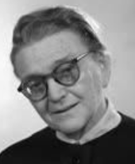Oklevelét a budapesti egyetemen szerezte (1914). Már orvoshallgatóként alkalmazták, az anatómiai, később az élettani, végül a kórbonctani intézetben dolgozott. 1914-től tanársegédként működött az intézetben.

1917-1924 között a Korányi Sándor vezette belgyógyá-szati klinikán előbb gyakornok, majd tanársegéd. 1924-1970 között nyugállományba vonulásáig közel öt évti-zeden keresztül a budakeszi *Erzsébet* *Szanatórium* (ma Országos Korányi TBC és Pulmonológiai Intézet) főorvosa volt.

A *Magyar Orvosok Tuberkulózis Egyesületének* titkára (1934-1971), a *TBC-szakcsoport* (1958-1964) elnöke. Később a belőle alakult *Korányi Frigyes TBC és Tüdőgyógyász Társaság* (1964-1969) elnöke, a tüdőgyó-gyász társadalom egyik vezető egyénisége volt. Alapelve volt a betegágy melletti orvosi tevékenység minőségének biztosítása. Tüdőgyógyászattal, a kóros tüdőfolyamatok vizsgálatával foglalkozott. Jelentős eredményeket ért el a tbc új, antibiotikumos gyógyításában.

Emlékét őrzi a Magyar Tüdőgyógyász Társaság Barát Irén-pályázata.

Főbb művei: *Az ascorbinsav a tuberkulózis kezelésében. (Orvosképzés, 1936), A felnőttkori primär és postprimär tuberkulózis (Budapest, 1950), Adatok a friss tüdőfolyamatok hármas antituberkulotikus kezeléséhez. Bárász Zoltánnal. (Tuberkulózis, 1960), Tüdőadenomatosisról egy eset kapcsán. Gyenei Ivánnal. (Tuberkulózis és Tüdőbetegségek, 1962) stb…*

Forrás: Magyar életrajzi lexikon

**Bárczi Géza** (Zombor, 1894. január 9. - Budapest, 1975. november 7.) Kossuth-díjas nyelvész, az MTA tagja.

A zombori főgimnáziumból német, török és eszperantó nyelvtudást hozott magával. A [Budapesti egyetem](http://hu.wikipedia.org/wiki/E%C3%B6tv%C3%B6s_Lor%C3%A1nd_Tudom%C3%A1nyegyetem) ma-gyar-latin-görög, majd francia szakán tanult. [1914](http://hu.wikipedia.org/wiki/1914)-ben az ösztöndíjjal tanulmányútra ment [Franciaországba](http://hu.wikipedia.org/wiki/Franciaorsz%C3%A1g), az út végül is egy internálótáborba (a hírhedt „Fekete Kolos-tor”-ba) vezetett.

Hazatérése után, [1920](http://hu.wikipedia.org/wiki/1920)-ban szerzett magyar-francia szakos tanári oklevelet. 1921-től 1931-ig budapesti középiskolákban tanított, majd [1932](http://hu.wikipedia.org/wiki/1932)-ben a [szegedi](http://hu.wikipedia.org/wiki/Szeged) [Tudományegyetemen](http://hu.wikipedia.org/wiki/Szegedi_Tudom%C3%A1nyegyetem) magántanára lett. [1941](http://hu.wikipedia.org/wiki/1941)-től a [Debreceni egyetemen](http://hu.wikipedia.org/wiki/Debreceni_Egyetem) a Magyar- és Finnugor Nyelvészeti Tanszék tan-székvezető egyetemi tanára, ebben a beosztásában indította útjára a *[Ma-gyar Nyelvjárások](http://hu.wikipedia.org/wiki/Magyar_Nyelvj%C3%A1r%C3%A1sok_%28%C3%A9vk%C3%B6nyv%29)* című periodikus kiadványt. [1952](http://hu.wikipedia.org/wiki/1952)-től a budapesti egye-temen tanszékvezető tanáraként működött. Segítette az eszperantó nyelv tanításának bevezetését, eszperantó nyelvű versei, szépprózai írásai, mű-fordításai a *La Verda Standardo* című lapban jelentek meg.

Főbb művei: *A magyar nyelv francia jövevényszavai ([1938](http://hu.metapedia.org/wiki/1938)), Magyar szófejtő szótár ([1941](http://hu.metapedia.org/wiki/1941)), Régi magyar nyelvjárások ([1947](http://hu.metapedia.org/wiki/1947)), Fonetika ([1951](http://hu.metapedia.org/wiki/1951)), A tihanyi apátság alapító levele mint nyelvi emlék. ([1951](http://hu.metapedia.org/wiki/1951)), A magyar szókincs eredete ([1951](http://hu.metapedia.org/wiki/1951)), Magyar hangtörténet ([1954](http://hu.metapedia.org/wiki/1954)), A magyar nyelv értelmező szótára ([1959](http://hu.metapedia.org/wiki/1959)-[1962](http://hu.metapedia.org/wiki/1962)), A magyar nyelv története ([1967](http://hu.metapedia.org/wiki/1967)),* stb.

Forrás: *Szathmári István: Bárczi Géza és a magyar nyelvtudomány 1978.*

Id. **Bartók Béla** (Újvár, 1855. november 19.) - Nagyszentmiklós, 1888. augusztus 4.) mezőgazdász, szakíró, ifj. [Bartók Béla](http://hu.wikipedia.org/wiki/Bart%C3%B3k_B%C3%A9la) zeneszerző és zene-tudós édesapja.

Középiskoláit a p[est](http://hu.wikipedia.org/wiki/Pest)i [Piarista rendi](http://hu.wikipedia.org/wiki/Piarista_rend) gimnáziumban kezdte, majd a [kolozsvári](http://hu.wikipedia.org/wiki/Kolozsv%C3%A1r) gazdasági tanintézetben vé-gezte. Felsőfokú tanulmányait állami ösztöndíjjal a [Magyaróvári Magyar Királyi Gazdasági Akadémián](http://hu.wikipedia.org/wiki/Magyar%C3%B3v%C3%A1ri_Magyar_Kir%C3%A1lyi_Gazdas%C3%A1gi_Akad%C3%A9mia) folytatta. Hazatérte után a 21 éves id. Bartók Bélát bízták meg a [nagyszentmiklósi](http://hu.wikipedia.org/wiki/Nagyszentmikl%C3%B3s) földműves iskola veze-tésével, amelyet előtte édesapja Bartók János látott el.

Időseb Bartók Béla kiváló szakmai, közéleti és szakírói munkásságot is folytatott. [1884](http://hu.wikipedia.org/wiki/1884). június 1-jén útjára indította a [*Gazdasági Tanügy*](http://hu.wikipedia.org/w/index.php?title=Gazdas%C3%A1gi_Tan%C3%BCgy&action=edit&redlink=1) c., a világ első mezőgazdasági szakoktatásügyi folyóiratát. Ennek szerkesztését, kia-dását Bartók egy személyben végezte. 1885-ben *Gazdasági Tanügy* cím-mel lapot indított meg, mely azonban 3/4 év múlva megszűnt.

Forrás: [Szinnyei József](https://hu.wikipedia.org/wiki/Szinnyei_J%C3%B3zsef_(bibliogr%C3%A1fus)): *[Magyar írók élete és munkái I.](http://mek.oszk.hu/03600/03630/html/toc/b.htm)  1891.*

**Batizfalvy** *Batisweiler * **János** (Fehértemplom, 1895. november 31. – Sze-ged, 1960. november 22.) nőgyógyász, egyetemi tanár.

1920-ban szerezte meg oklevelét a budapesti orvosi ka-ron. 1922-től a budapesti II. számú nőgyógyászati klinika tanársegédje, egyúttal vezetője a klinika mellett működő szövettani és bakteriológiai laboratóriumnak.

1926/27-ben ösztöndíjasként a hamburgi és a kieli klini-kán folytatta tanulmányait. 1930-tól a budapesti egyetem hematológiai laboratórium vezetője lett.

Az 1920-as évek elején költözött Kolozsvárról Szegedre az orvosképzés, ekkor Batizfalvy János a klinikán posztoperatív osztályt, izolált újszülött osztályt, valamint terhes ambulanciát létesített. A hallgatók oktatása terén bevezette a *szülészeti propedeutika*, a *házasélet hygienéje*, valamint a *szülészeti műtéttan* tantárgyakat. 1939-től a szegedi orvosi karon a szülé-szet és nőgyógyászat tanára, egyben a klinika igazgatója. Nőgyógyászati műtéttannal, a méhrák műtéti úton való gyógyításával, nőgyógyászati uro-lógiával foglalkozott. Főbb művei: *A terhességi anaemia pathológiája és therápiája* (1932), *Az uteroplacentaris apo­plexiával járó korai lepényle-válás patholó­giája és sebészi therápiája* (1936), *Megelőzés elve a szülé-szeti gyakorlatban* (1942), *A női genitalis tuberculosis pathológiája és therápiája* (1952) stb. Forrás: *Magyar életrajzi lexikon,* Kapronczay Károly-*Magyar Orvosélatrajzi Lexikon*

**Beck Salamon** ([Topolya](https://hu.wikipedia.org/wiki/Topolya), [1885](https://hu.wikipedia.org/wiki/1885). [március 25.](https://hu.wikipedia.org/wiki/M%C3%A1rcius_25.) – [Budapest](https://hu.wikipedia.org/wiki/Budapest), [1974](https://hu.wikipedia.org/wiki/1974). [június 7.](https://hu.wikipedia.org/wiki/J%C3%BAnius_7.)) jogtudós, ügyvéd, egyetemi tanár.

1903-ban Újvidéken érettségizett, majd jogi tanulmányait a budapesti tudományegyetemen végezte. 1907-ben avatták doktorrá. A diploma meg-szerzése után, 1910-ben [ügyvédi](https://hu.wikipedia.org/wiki/%C3%9Cgyv%C3%A9d) oklevelet szerzett. A két világháború között ügyvédi gyakorlatot folytatott és egyben jogi szakírói munkássága is jelentős. (pl. az 1934-ben megjelent *Magyar védjegyjog*). Beck Salamon 1925-ben Meszlény Artúr főszerkesztővel és Varannai István szerkesztő-társával indította meg a [*Polgári Jog*](https://hu.wikipedia.org/wiki/Polg%C3%A1ri_Jog_(foly%C3%B3irat)) című, havonta megjelenő szaklapot. A magánjog és a kereskedelmi jog kérdéseivel foglalkozott.

1929 és 1931 között az egységes bírói és ügyvédi vizsgabizottság ("vizsgá-lóbizottság") tagja volt. A [második világháború](https://hu.wikipedia.org/wiki/M%C3%A1sodik_vil%C3%A1gh%C3%A1bor%C3%BA) után a jogi felsőoktatásban tanított, az [ELTE](https://hu.wikipedia.org/wiki/E%C3%B6tv%C3%B6s_Lor%C3%A1nd_Tudom%C3%A1nyegyetem) tanszékvezető egyetemi tanáraként vonult nyugalomba. Az 1962-ben alapított [Magyar Iparjogvédelmi Egyesület](https://hu.wikipedia.org/wiki/Magyar_Iparjogv%C3%A9delmi_%C3%A9s_Szerz%C5%91i_Jogi_Egyes%C3%BClet) ügyvezető elnö-ke volt. Neves jogtudósként is foglalkozott a [védjegyjoggal](https://hu.wikipedia.org/wiki/V%C3%A9djegy) és [szabadalmi joggal](https://hu.wikipedia.org/wiki/Szabadalom). A [Budapesti Kereskedelmi Testület](https://hu.wikipedia.org/w/index.php?title=Budapesti_Kereskedelmi_Test%C3%BClet&action=edit&redlink=1) főtitkára, valamint a [Magyar Iparjogvédelmi Egyesület](https://hu.wikipedia.org/wiki/Magyar_Iparjogv%C3%A9delmi_%C3%A9s_Szerz%C5%91i_Jogi_Egyes%C3%BClet) ügyvezető elnöke volt.

Az utolsó magyar esetjogásznak tekinthető. Életének humoros történe-teit *Öreg jogász tövistermése* című kötetében adta ki 1969-ben. [A Magyar Tudományos Akadémia Miskolci Területi Bizottsága ( MTA-MAB) 2015. november 13-án Beck Salamon Emlékkonferenciát rendezett Miskolcon](http://tab.mta.hu/miskolci-teruleti-bizottsag/esemenyek/beck-salamon-emlekkonferencia). 2016-ban létrehozták a Beck Salamon Alapítványt.

Főbb művei: *A köteles rész jogállása (1913), Jellegtartó és jellegvesztő kötelmek (1938), A jogszabályok átvitt alkalmazása (1941), A keres-kedelmi és váltójog vázlata (1947), A békeszerződés és az eszmei javak (1948),Többszemélyes perjogi helyzetek (1952) stb.* Források: *Magyar életrajzi lexikon I–IV.  1967–1994. [Magyar zsidó lexikon](https://hu.wikipedia.org/wiki/Magyar_zsid%C3%B3_lexikon). 1929.*

**Benko Károly** (Nagyszentmiklós, 1837. - Rákospalota, 1893.) építész. Szülei a papi pályára szánták, de építész lett. 1883-ban a vallás-és közok-tatásügyi minisztérium az állami ipariskola téli tanfolyamán a szaktár-gyakból előadások tartásával bízta meg őt. 1892-ben a budapesti királyi törvényszék állandó bizottsági szakértőjévé nevezték ki. Ipariskolai tanár-ként megírta előadásaihoz a szaktárgyakat: az építőanyagok tanát, az épí-tészeti alaktant, kőszerkezeteket, költségvetéstant.

Számos középületet épített *(győri zsinagóga, eperjesi evangélikus kollé-gium, fóti református templom, dobsinai evangélikus templom).* Emellett sok nyilvános épületet épített: templomot, gimnáziumot, aztán megye-házat, városházat, és több bérpalotát, valamint magánházat.

Benkó Károly és építésztársa Kolbenheyer Ferenc megalapították a nyer-gesújfalusi cementgyárat. Műveiben a népi, elsősorban az erdélyi építészet elemeit használta fel, de hatott rá a Távol-Kelet építészete, és előfutára volt az *organikus építészetnek.* Forrás: *Magyar Életrajzi Lexikon*

**Benkő** *Kracsinger* **Jenő**  (Nagykikinda,  [1899](https://hu.wikipedia.org/wiki/1899).  [június 26.](https://hu.wikipedia.org/wiki/J%C3%BAnius_26.)  –  [Budapest](https://hu.wikipedia.org/wiki/Budapest), 

[1982](https://hu.wikipedia.org/wiki/1982). [december 15.](https://hu.wikipedia.org/wiki/December_15.)) vegyész, közgazda, újságíró, szerkesztő.

Egyetemi tanulmányait a József Műegyetem, Közgazdaságtudományi Ka-rán végezte. A már húszévesen megjelentetett *„az atommagmodellel kap-csolatos korai elméletéről“* c. munkája a Dániában élő [Hevesy György](https://hu.wikipedia.org/wiki/Hevesy_Gy%C3%B6rgy) is elismerően nyilatkozott. A harmincas években az *Ujság*, a *Magyar Lapok* és a *Hangya* újságírója, a *Harang* szerkesztője, később az MTI külpolitikai rovatának munkatársa. Az ötvenes években az [*Akadémiai Kiadó*](https://hu.wikipedia.org/wiki/Akad%C3%A9miai_Kiad%C3%B3) felelős szerkesztője. Eközben elméleti kémiai kutatásokat folytatott.

Tudományos publicisztájának nagyobb részét német nyelven tette közzé. Magyar nyelvű műve: Góczán Ferenc, Benkő Jenő: *A magyarországi pan-nonkori képződmények kutatásai,* 1971.

Forrás: *Náray-Szabó István: Kristálykémia, 1965.*

**Berecz János** (Detta, 1882. augusztus 23. - Budapest, 1938. október 05.) nőgyógyász, egyetemi tanár.

A középiskoláit a szegedi kegyesrendi főgimnáziumban (piaristák) vé-gezte (1892- 1901), ahol már diák korában a segélyző egylet tagja, és az intézet jutalmazott jeles osztályzatú tanulója volt. Az egyetemet Budapes-ten látogatta, ahol az orvosi fakultáson 1906-ban szerzett doktori diplomát. A Tudományegyetem nőgyógyászati klinikáján helyezkedett el.

1907 végén a budapesti II. sz. női klinikára került a neves Tauffer Vilmos professzor mellé. 1907-1926 között a budapesti II. sz. szülészeti klinika orvosa volt, 1912-től tanársegéd.

1914-1918 között katonaorvosként az első világháborúban teljesített szol-gálatot. Az I. világháborúból hazatérve újból a II. sz. női klinikán műkö-dött, a szülészeti műtéttan tárgyköréből egyetemi magántanárrá habilitál-ták. 1926-ban a szegedi egyetem nyilvános rendes tanára, majd ugyanott az 1929-ben megnyílt női klinika igazgatója lett. 1933-tól a felsőház tagja volt. 1938. október 6-án hunyt el, agyvérzés következtében.

Hozzállására jelemző volt, hogy nem gyűjtött vagyont. Kitűnően felszerelt intézetet, és nemes törekvést hagyott ötven évvel ezelőtt az utódaira.

Főbb művei: *Az intestina­lis terhességről* (1926), *A consti­tutio a nőgyó-gyászatban* (1934), *Az elmélet és gyakorlat a szülészetben és a nőgyó-gyászatban* (1937).

Forrás: *Magyar Orvosélatrajzi Lexikon*

**Berényi Dénes** (Karánsebes, 1900. szeptember 21. - Debrecen, 1971. november 30.) meteorológus, egyetemi tanár.

A debreceni tudományegyetem bölcsészkarán végzett (1926), doktorált (1927) és az egyetemi földrajzi intézetben lett tanársegéd. 1933-ban magántanárrá képesítették. 1934-ben megbízták a debreceni tudományegyetemen a Meteo-rológiai Intézet vezetésével. 1944 decemberében megindí-totta a meteorológiai megfigyeléseket. 1951-től az egyetem meteorológiai tanszékvezető egyetemi tanára. 1958-1962-ben az egyetem természettudományi karának dékánja.

Műveiben különös fontosságot kapott a magyarországi dohánytermelés, a burgonya termesztése és összefüggése az időjárással, valamint a talajmenti réteg éghajlatának kutatatása. Egyetemi tankönyveken kívül agrometeoro-lógiai és gazdasági fenológiai figyelőhálózatot szervezett. Munkásságáért Hegyfoky-emlékérmet kapott (1955).

Forrás: *Magyar életrajzi lexikon*

**Berkes** *(Bittenbinder, Szendrey)* **József** (Pancsova, 1890. december 31. - Budapest, 1963. november 25.) sportoló olimpikon, jogász.

1900 őszétől a budapesti I. kerületi magyar királyi állami főgimnáziumban tanult. Tornatanára Szaffka Manó, a Magyar Országos Tornatanító Egylet titkára, a Budai Athletikai Club alelnöke volt. A Budapesti (Budai) Torna Egylet tornásza volt. Egyesületével 1910-ben és 1911-ben országos tor-nász csapatbajnokságot nyert. Az 1912-es stockholmi olimpián az ezüstér-mes magyar tornászcsapat tagja. Az olimpia után felhagyta a versenyzést, és befejezte jogi tanulmányait. A Budapesti bíróságokon tevékenykedett, mint ítélőtáblai biró. Forrás: *Magyar életrajzi lexikon*

**Berzsenyi** *Beusterien* **Ralph** (Fiume, 1909. február 26. - Budapest, 1978. június 10.) olimpiai ezüstérmes sportlövő, orvos.

1935-ben szerzett orvosi oklevelet. Egyetemi hallgató-ként megalapította a *BEAC* sportlövő szakosztályát. 1949-től a *Budapesti Lokomotív*, majd 1950-től az *Északi Járműjavító* sportlövője volt. Valamennyi pisztolyos és puskás versenyszámban versenyzett. Pályafutása alatt összesen kilenc egyéni és tizenkilenc csapatbajnoki címet szerzett. 1935-től szerepelt a magyar válogatottban.

Az 1936. évi berlini olimpián kisöbű sportpuska, fekvő 296 körös lőered-ménnyel a második helyen végzett. 1953-ban felhagyott az aktív sporto-lással. Magánemberként szakmájában praktizált.

Forrás: *Sportlexikon I.* 1985. *Magyar Orvosélatrajzi Lexikon*

**Birly Ede Flórián** (Hódság, 1787. december 6. - [Pest](http://hu.wikipedia.org/wiki/Pest), [1854](http://hu.wikipedia.org/wiki/1854). [november 25.](http://hu.wikipedia.org/wiki/November_25.)) orvos, szülész, egyetemi tanár.

Pesten és négy évig Bécsben orvoslást tanult. Itt a híres L. J. Boër professzor asszisztense volt, kit évekig a nyári továbbképzések alkalmából helyettesített. 1817-ben ki-nevezték a pesti egyetem szülészeti tanszékére, hol 1824-ben eredményes munkája gyümölcseként magyar nemes-séget kapott. Intézetét anyagilag is támogatta, nagy szere-pe volt a „bábaorvosok” képzésében.

1836-tól az orvosi kar dékánja, majd 1842-ben egyetemi rektorává vá-lasztották. Több külföldi orvostársaságnak is tagja volt. Szakterületén is konzervatív elveket vallott, ő sem ismerte fel Semmelweis Ignác felfede-zésének jelentőségét. Birly szerint a gyermekágyi lázat a bélben felhalmo-zódó rossz anyagok okozzák.

[Forrás: *Magyar életrajzi lexikon.*](https://www.google.rs/url?sa=t&rct=j&q=&esrc=s&source=web&cd=19&ved=0ahUKEwiskd-CjbDcAhUD3qQKHXFYBjgQFghwMBI&url=https%3A%2F%2Fwww.arcanum.hu%2Fhu%2Fonline-kiadvanyok%2FLexikonok-magyar-eletrajzi-lexikon-7428D%2Fb-74700%2Fberegfy-karoly-berger-74B3D%2F&usg=AOvVaw3AHr7BTk6b4T2IGP1ALCI9) *Magyar Orvosélatrajzi Lexikon*

**Bogner Mária Margit** ([Melence](https://hu.wikipedia.org/wiki/Melence),  [1905](https://hu.wikipedia.org/wiki/1905). december 15. - Érd, 1933. május

- [13.](https://hu.wikipedia.org/wiki/M%C3%A1jus_13.)) vizitációs nővér.

A mélyen vallásos Bogner családban született, lelkiatyja, a jezsuita Csávossy Elemér bátorítására, valamint *Li-sieux-i Szent Teréz* önéletrajza késztetésére kötelezi ma-gát, hogy ,,*mindenben azt teszi, ami Jézusnak jobban tetszik''*. 1927 elején a spanyolnátha és a mellhártyagyul-ladás majdnem végez törékeny életével. A Baranya me-gyében lévő Zsidópuszta (Babarc melett) erdei levegője csodát tesz. Ekkor régi vágya is teljesült megkapja az értesítést, hogy beléphet (Adelhaid nővér néven) a vizitációs nővérek Tirolban lévő thurn-feldi kolostorába.

Bogner Etelka 1928 augusztusában visszatért Magyarországra, miután [Érden](https://hu.wikipedia.org/wiki/%C3%89rd) megnyílt és a *Szűz Mária látogatásáról* nevezett rend a *Vizitációs Rend*  kolostorában, hol elsőként tett örök fogadalmat. A beöltözéskor a *Mária Margit* nevet kapja *Alacoque Szent Margit Mária* tiszteletére, de nevét megfordították, mert a vele együtt Érdre készülő főnöknőnek is Mar-git Mária a neve. Hangyaszorgalommal és teljes odaadással szolgálta sze-retett Jézusát. Az egészsége hamarosan cserbenhagyta, mindkét tüdejét megtámadta a gyilkos kór.

Sírja valóságos zarándokhelyé vált az érd-óvárosi Szent Mihály-templom kertjében. A hívek mint a *magyar Kis Szent Terézt* szokták emlegetni.

[XVI. Benedek pápa](https://hu.wikipedia.org/wiki/XVI._Benedek_p%C3%A1pa)  2012 júniusi dekrétuma elismeri Bogner Mária Margit vizitációs nővér hősies erényeit. A nővért ettől fogva a *"tiszteletreméltó"* jelző illeti meg. Forrás: [*Magyar szentek és boldogok listá*j*a*](https://hu.wikipedia.org/wiki/Magyar_szentek_%C3%A9s_boldogok_list%C3%A1ja)

**Bolgár László** (Temesvár, 1911. szeptember 11. - Rion Les Montagnes, 1990. június 16.) újságíró, műfordító.

A budapesti tudományegyetem jogi karán végezte tanulmányait. Diplo-májának megszerzése után, 1935-ben a külügyi pályára lépett. 1945-47-ben rádiótudósító volt, majd 1948-ban Franciaországba költözött.

1948-1958 között Párizsban a francia rádió magyar adását irányította. 1958-tól 1969-ig a rádió Kelet-európai osztályának helyettes vezetője, majd vezetője volt 1975-ig. 1950-től elnöke volt a *Szabad Magyar Újság-írók Egyesületének*. Munkatársa volt a Párizsban 1953-ban megjelent *Valóság* c. időszaki folyóiratnak. Magyar irodalmi műveket fordított fran-cia nyelvre.

[Forrás: *Magyar életrajzi lexikon*](https://www.google.rs/url?sa=t&rct=j&q=&esrc=s&source=web&cd=19&ved=0ahUKEwiskd-CjbDcAhUD3qQKHXFYBjgQFghwMBI&url=https%3A%2F%2Fwww.arcanum.hu%2Fhu%2Fonline-kiadvanyok%2FLexikonok-magyar-eletrajzi-lexikon-7428D%2Fb-74700%2Fberegfy-karoly-berger-74B3D%2F&usg=AOvVaw3AHr7BTk6b4T2IGP1ALCI9)

**Bordás Ferenc** (Temesvár, 1911. január 22. - Budapest, 1982. december 28.) festő.

Orvosi tanulmányai mellett Aba Novák Vilmosnál tanulta a mesterséget. A rajzot Devich Sándornál, míg a fametsző-kultúrát és a grafikát Buday Györgytől tanulta. 1937-től rendszeresen állított ki Szegeden, de voltak kiállításai Budapesten (*Nemzeti Galéria*) is.

Jól ismerte és magas szinten művelte a grafikai tech-nikákat. Grafikusként elsősorban kisgrafikákat, ex libri-seket, valamint tájképeket készítet. A külföldi (Hamburg, Como …) *ex libris kongresszusok* állandó résztvevője volt. Első fametszetein elsősor-ban az expresszionizmus és a szürrealizmus hatása mutatható ki. 1965-ben a *Firenzei Képzőművészeti Akadémia* tagjává választották.

Forrás: *Magyar életrajzi lexikon*

**Bordás Sándor** (Temesvár, 1915. január 3. - Keszthely, 1988. február 3.) toxikológus, egyetemi tanár.

1939-ben általános orvosi képesítést szerzett a szegedi egyetemen. A helyi *Gyógyszertani és Gyógyszerismereti Intézetben* helyezkedett el (1939-től 1946-ig), hol a híres és még az eredeti Kolozsvári Egyetemmel együtt Szeged-re költöző, Jancsó Miklós tanásegéde volt.

Az intézetben dolgozva felismerte, hogy a technikai civil-izáció térhódításával romlik az életminőség, ezért élete nagy részét a növényvédelemnek szentelte. A második világháborút kö-vetően az *Országos Társadalombiztosítási Intézet* (OTI) szegedi *Mező-gazdasági és Ipari Vizsgálóállomásának*, és egyben az OTI *Iparegész-ségügyi Osztályának* vezetőjeként működött.

1950-től 1954-ig az általa létesített *Országos Munkaegészségügyi Intézet Toxikológiai Részlegének* alapító vezetője. A következő évtizedekben a Keszthelyi Mezőgazdasági Főiskola *Növényvédelmi Intézetének*, illetve a Keszthelyi Agrártudományi Egyetem *Higiéné Tanszékének* tanszékvezető egyetemi tanára. 1981-ben a veszprémi *Nehézvegyipari Kutató Intézet To-xikológiai Osztályát* vezette 1984-es nyugdíjba vonultáig.

Nagy gyakorlati jelentősége volt 1951-ben az általa elkészített vegyszeres növényvédelmi óvó rendszabálynak. Az 1967-ben utoljára kiadott *Veszé-lyes növényvédő szerek* című könyve máig hiánypótló mű.

Forrás: *Magyar életrajzi lexikon*

**Boros Sándor** (Karánsebes, 1907. augusztus 11. - Budapest, 1987. július 26.) fogorvos, patológus.

1931-ben a Pázmány Péter Tudományegyetem Orvosi karán általános orvosi oklevelet szerzett. 1931-től 1936-ig a szegedi egyetem *Anatómiai Intézetében* dolgozott, ezt követően a szegedi egyetem gyakornoka, majd a tanársegéde.

1938-ban került a budapesti *II. sz. Anatómiai Intézetbe*, majd a budapesti egyetem *Fogászati Klinikáján* tanárse-géd. 1947-1960-ban a szövettani laboratórium vezetőjeként dolgozott. 1950-től a budapesti Fogorvostudományi Karon és a Stomatológiai Klini-kán a *fogorvosi patológia* előadója. Elsősorban a fogbél nyirokkerin-gésével, majd pedig fogászati morfológiával valamint fogászati szövettan-nal foglalkozott.

Forrás: *Magyar Életrajzi Lexikon 1000-1990*

**Borovszky Samu** (Bácsordas, [1860](http://hu.wikipedia.org/wiki/1860). [október 25.](http://hu.wikipedia.org/wiki/Okt%C3%B3ber_25.) - [Budapest](http://hu.wikipedia.org/wiki/Budapest), [1912](http://hu.wikipedia.org/wiki/1912). [április 24.](http://hu.wikipedia.org/wiki/%C3%81prilis_24.)) történész.

[1879](http://hu.wikipedia.org/wiki/1879)-[1883](http://hu.wikipedia.org/wiki/1883) között ösztöndíjasként volt a budapesti egye-tem hallgatója. [1884](http://hu.wikipedia.org/wiki/1884)-ben akadémiai irattárnokká léptették elő. [1909](http://hu.wikipedia.org/wiki/1909)-[1912](http://hu.wikipedia.org/wiki/1912) között a [*Magyar Történelmi Társulat*](http://hu.wikipedia.org/wiki/Magyar_T%C3%B6rt%C3%A9nelmi_T%C3%A1rsulat) tit-kára és a társulat 1867-óta időlegesen megjelenő *[Száza-dok](http://hu.wikipedia.org/wiki/Sz%C3%A1zadok_%28foly%C3%B3irat%29)* c. szakfolyóirat szerkesztője volt.

Az ő szerkesztésében készült el a magyar történetírás egyik legnagyobb vállalkozása, a *Magyarország várme-gyéi és városai* c., 26 kötetből álló sorozat.

Művei: *1885. A [honfoglalás](http://hu.wikipedia.org/wiki/Honfoglal%C3%A1s) története, 1896-1897. Csanád vármegye története 1715-ig. 1900/1931. A [népvándorlás kora](http://hu.wikipedia.org/wiki/N%C3%A9pv%C3%A1ndorl%C3%A1skor). [Nagy Képes Világ-történet](http://hu.wikipedia.org/wiki/Nagy_K%C3%A9pes_Vil%C3%A1gt%C3%B6rt%C3%A9net). 1903. Borsod vármegye története. 1911. A nagy [francia forrada-lom](http://hu.wikipedia.org/wiki/Francia_forradalom). I–V. szerk.* Forrás: [Szinnyei József](https://hu.wikipedia.org/wiki/Szinnyei_J%C3%B3zsef_(bibliogr%C3%A1fus)): [*Magyar írók élete és munkái .*](http://mek.oszk.hu/03600/03630/html/b/b02283.htm)

**Böckl József** (Temeskalácsa, [1880](https://hu.wikipedia.org/wiki/1880). március 16. – [Budapest](https://hu.wikipedia.org/wiki/Budapest), [1941](https://hu.wikipedia.org/wiki/1941). már-cius 27.) honvéd altábornagy, a magyar katonai hírszerzés vezetője.

A temesvári Főreáliskolában érettségizett, majd 1900–1903 között elvé-gezte a [Ludovika Akadémiát](https://hu.wikipedia.org/wiki/Magyar_Kir%C3%A1lyi_Honv%C3%A9d_Ludovika_Akad%C3%A9mia). Felsőbb tiszti tanfolyamot végzett 1905–1906-ban Budapesten, majd a Császári és királyi Hadiiskola 1-3. Évfo-lyamát (1910-1913), Bécsben. Német, francia, horvát és román nyelveken felső fokon beszélt. 1913-ban már vezérkari századosi rendfokozatot ért el.

Az első világháborúban magasabb egységek vezérkarában tevékenykedett, 1915-ben a zágrábi horvát-szlavón VI. honvéd katonai kerület vezérkari főnöke lett.

Böckl József  a világháború után a Magyar Királyi Hon-védségben folytatta katonai pályáját, immár vezérkari ez-redesi rendfokozatban. A trianoni törést követően első-rendű feladat volt a magyar hadsereg felkészítése az or-szág területi integritásának visszaállítására. Ezért alapvető fontosságúnak tartották egy jól működő hírszerző szol-gálat felállítását.

Böckl Józsefet 1925-ben kinevezték a Honvédelmi Minisztérium VI-2 osztályának vezetőjévé, ami akkor a magyar katonai hírszerzés elnevezése volt. A főcsoportfőnökség alatt működő két osztály a hírszerzés és kémel-hárítás volt. 1928-ban tábornokká léptették elő és újra más parancsnoki beosztásokat töltött be a honvédségnél.

1935-ben altábornaggyá léptették elő, majd 1938. május 1-vel vonult nyugállományba, és Kecskemét melletti, szikrai birtokán szőlő- és gyü-mölcstermesztéssel foglalkozott, nevezetes volt almáinak minősége.

Számos kitüntetése közül kiemelkedett  a [Horthy Miklós](https://hu.wikipedia.org/wiki/Horthy_Mikl%C3%B3s_(korm%C3%A1nyz%C3%B3)) kormányzó álltal [1922](https://hu.wikipedia.org/wiki/1922). június 14-én alapított Magyar Érdemrend.

Források: *[Szakály Sándor](https://hu.wikipedia.org/wiki/Szak%C3%A1ly_S%C3%A1ndor): A 2. vkf. osztály: Tanulmányok a magyar katonai hírszerzés és elhárítás témaköréből 1918–1945.* [*Magyar életrajzi lexikon*](https://www.arcanum.hu/en/online-kiadvanyok/Lexikonok-magyar-eletrajzi-lexikon-7428D/)

**Buchner Antal** (Kistószeg, 1882. július 2. - Pápa, 1950. augusztus 9. ) ze-neszerző, karnagy.

A szegedi tanítóképzőben végzett, majd a budapesti Ze-neakadémián tanult tovább. Szepeshelyen, Szatmárban, majd 1911-től Esztergomban egyházi karnagy.

Megalapította az Esztergomi Zeneegyletet (1916), az esztergomi zeneiskolát (1928). Énekkari feldolgozásai a *Cantica sacra*, a *M. Cantuale* gyűjteményekben és a *Ko-rális füzetekben*; orgonára írt prelúdiumai a *Katholikus Kántor* mellékleteként jelentek meg. Az egri Katolikus Kántor egyház-zenei folyóirat felelős szerkesztője (1913-19).

Miséket, oratóriumokat komponált, ezen kívül zenekari műveket, dalokat, magyar nótákat s *Pilóta* címmel operát írt. Művei gyakran szerepeltek a Magyar Rádió műsorában.

Forrás: *Magyar Katolikus Lexikon*

**Budanovits Mária** ([Szabadka](http://hu.wikipedia.org/wiki/Szabadka), [1894](http://hu.wikipedia.org/wiki/1894). [augusztus 12.](http://hu.wikipedia.org/wiki/Augusztus_12.) - Budapest, 1976. má-jus 7.) opera-énekesnő.

Árván maradt, de a Brenner családnak köszönhetően énekesi tanulmányait Németországban folytathatta. Maleczky Bianka és Anthes György növendékeként ki-tüntetéssel végzett a Zeneakadémián, majd Mme *Cahier* tanítványa volt.

1914-ben nővendékként debütált az Operaházban Verdi *A trubadúr* c. művének *Azucena* szerepében. 1915-1954 között a dalszín-ház egyik vezető énekese volt, elsősorban *Verdi, Wagner, Bizet, Erkel* műveinek avatott tolmácsolója. Kiemelkedő sikert aratott *Az álarcosbál, A végzet hatalma* (Verdi), a *Gioconda* (Ponchielli) főszere-peiben. Respighi *Láng* c. operájának *Endoxia* szerepét sikerrel énekelte a mű magyarországi bemutatóján. Oratórium énekesnőként is hírnévre tett szert. Mezzoszoprán szerepekre szakosították, de altját is nagyra becsülték a szakemberek. Az Operaház örökös tagjaként kitűnő pedagógiával segí-tette a növendékeit.

Forrás: *Magyar Színművészeti Lexikon*

**Bugárszky István** *(Stefan Bugarski)* (Zenta, 1868. május 21. - Budapest, 1941. március 3.) kémikus, egyetemi tanár, az MTA levelező tagja.

Tanulmányait a budapesti egyetemen végezte fizika-kémia szakon, tudását állami ösztöndíjjal a világhírű német inté-zetekben tökéletesíthette. Tudományos munkásságát az állatorvosi főiskolán kezdte, hol tanársegédségből a vegy-tani tanszék vezetőjévé lett.

1894-től a budapesti tudomány egyetem magántanára, majd 1913-ban a II. kémiai intézet nyilvános rendes tanára.

Pályafutása dandárát a Magyar királyi Állatorvosi Főiskolán töltötte, mint a Vegytani Tanszék vezető tanára. Pályafutása dandárát a Magyar királyi Állatorvosi Főiskolán töltötte, mint a Vegytani Tanszék vezető tanára.

Főként reakciókinetikai kutatásai jelentősek. Bebizonyította a *kémiai affi-nitásra* vonatkozó Thomsen-Berthelot-elv fogyatékosságát. A fehérjék fizikokémiai sajátosságaival is foglalkozott, kimutatta amfoter jellegüket.

Három tankönyvet írt főiskolai használatra, az egyiket *Vezérfonal a vegy-tani gyakorlathoz,* a másikat *A kémia repetitoriuma és borkémiai prak-tikum címen. Chemia. (Tankönyv, 1900.)*

Forrás: *Pallas Nagylexikon. Magyar életrajzi lexikon*

**Burghardt Rezső** (Zsombolya, 1884. március 28. - Budapest, 1963. május 5.) festőművész.

1903-ban a *Magyar Királyi Mintarajztanoda és Rajz-tanárképezde* keretei között kezdte meg tanulmányait, Mestere a fiatalon elhúnyt Hegedűs László festőművész volt. 1903-tól a Mária Terézia királynő álltal alapított mi-lánói  *Accademia di Brera-*án tanult, hol a kiválló portré és akt festő Cesare Tallone volt a mester.

1905-től a híres párizsi festészeti és szobrászati magán-iskolán a *Julian Akadémia*-án Lucien Simonnál és René Ménard-nál a *fekete imresszionizmus* alkotóinál tanult. Ezután Madridban és Londonban is megfordult, itt mestere a virtuóz tehetségű amerikai festő és szobrász John Singer Sargent volt.

Hollandiát és Németországot érintve került haza Budapestre, hol 1913-tól 1919-ig az első magyar művészképzőben a *Benczúr-mesteriskolában*, ma-gánál a mesternél Benczúr Gyulánál képezte tovább magát.

A mester halála után társaival megalakította a [Benczúr Társaságot](https://hu.wikipedia.org/wiki/Bencz%C3%BAr_T%C3%A1rsas%C3%A1g). Ezen kívül tagja volt a *Magyar Arcképfestők Társaságának*, a *Szinyei Merse Pál Társaságnak*. Első díjazott műve az 1920-ban festett *Kísértés* című fest-ménye volt. 1937-től a *Képzőművészeti Főiskolán* tanított, 1938-tól a főiskola Miskolci művésztelepét vezette, itt elnöke volt a *Miskolci Festők Társaságának*.

Belföldön és külföldön egyaránt kiállított, a szakértők szerint “*stílusára a plein air és a nagybányai hagyományokra alapozott, sajátos foltszerű festés a jellemző”*. Legszivessebben tájképeket,  portrékat,  csendéleteket, 

aktkompozíciókat festett. Munkáit elsősorban a  miskolci *Herman Ottó Múzeum* és a budapesti  *Magyar Nemzeti Galéria *őrzi.

Forrás: *Magyar életrajzi lexikon*, *Miskolci életrajzi lexikon*

**C, Cs**

**Csajághy István** (Bács, 1813. augusztus 15. -,?) orvos.

Kalocsán és Baján végezte a gimnáziumot, míg az orvosi tanulmányait a pesti egyetemen hallgatta. Bácsbodrog vármegye főorvosa lett, és a forra-dalom alatt a kormány kórházi főorvossá Nagyváradra nevezte ki. A sza-badságharc után visszahelyezték Zentára főorvosi állásába, honnét báty-jával Csajághy Sándorral annak püspökké történt kinevezése után Temes-várra költözött. 1860-ban bátyja halála után fürdőorvos lett Buziáson. Előbb az európai nevezetesebb fürdőket és az egyetemi kórházakat láto-gatta meg. Forrás: Szinnyei József: *Magyar írók élete és munkái*

**Csajághy Károly** (Bács, 1815. október 29. -,?) egyházi jogtudós.

A gimnáziumot Baján járta, majd a pécsi papnevelőintézetbe bölcseletet és teologiát tanult. 1838-ban misés pappá szentelték föl, 1843-tól a pécsi pap-nevelőben a teológia tanára lett. 1854-1879 között több heljen plébanos-ként működött. Mint vidéki levelező cikkeket irt a *Nemzeti Ujságba*, majd később a *Jelenkorba* és a *Magyar Sionba* (1838). A szabadságharc leve-rését követően a *Religióba* és *Családi Lapokba* írt cikkeket. Munkái: *Egyházi gyászbeszéd,* 1840. *Adserta* e *jure naturae et ecclesiastico.* 1847. Forrás: Szinnyei József: *Magyar írók élete és munkái*

**Csajághy Sándor** (Bács, 1810. április 6. - Temesvár, 1860. február 7.) római katolikus püspök, egyházi író.

A gimnáziumot követően 1825-ben Kalocsán belépett a szemináriumba. A filozófiát Egerben, a teológiát, Ka-locsán és Pesten végezte. Irodalmi kisérleteit még mint pesti papnövendék kezdette, nehány költeménye a *Tudo-mányos Gyűjtemény* szépirodalmi mellékletekét megje-lenő *Koszorúban* és a katolikus társadalmi *Anastasiában* volt olvasható.

Miután a [pesti](http://hu.wikipedia.org/wiki/Pest) központi papnevelőben a szentírási tudományokból letette a szigorlatot, [1833](http://hu.wikipedia.org/wiki/1833) [szeptemberében](http://hu.wikipedia.org/wiki/Szeptember_21.) misés pappá szentelték. Az 1836-os pesti növendékpapság [magyar](http://hu.wikipedia.org/wiki/Magyarorsz%C3%A1g) egyház-irodalmi iskolájának létesítésében ő is közreműködött. Egy évet töltött a bécsi *Augustinum* nevelőintézetben, majd a pesti központi papnevelőbe tanulmányi felügyelőnek nevezték ki, ahol egyúttal az egyháztörténetet is előadta, ekkor nyerte doktori oklevelét is. Ezután visszarendelték Kalocsára, az egyháztörténeti tanszékre. [1851](http://hu.wikipedia.org/wiki/1851) [áprilisában](http://hu.wikipedia.org/wiki/%C3%81prilis_11.) Temesvár-csanádi megyéspüspökké szentelték.

Új székhlyére magával vitte az addig, az álltala Münchnenből meghivott és Kalocsán tanító *Szegény Iskolanővérek rendjét*, és azt ott lelepítette. Feladatának tekintette az addig erősen udvarhű német város magyar ha-zafias szellemben történő átnevelését, ebben segítettek a püspöknek a Ka-locsárol odatelepített tanító nővérek. Adományaival hozzájárult a [Tisza](http://hu.wikipedia.org/wiki/Tisza) szabályozásához, erre a célra 60 000 forintot adott.

Forrás: [Szinnyei József](https://hu.wikipedia.org/wiki/Szinnyei_J%C3%B3zsef_(bibliogr%C3%A1fus)): [*Magyar írók élete és munkái.*](http://mek.oszk.hu/03600/03630/html/index.htm) *Magyar katolikus lexikon *

Báró **Csávossy Béla** ( Temesvár, 1848. szeptember 12. – Budapest, 1915, április 3.) politikus, a képviselőház háznagya.

Gimnáziumi és jogi tanulmányait Budapesten végezte.

1870-ben Torontálmegye tiszteletbeli aljegyzője, 1871-ben belépett a belügyminisztériumba, mint tiszteletbeli fo-galmazó. 1875-ben Torontálmegye párdányi kerülete meg-választotta képviselőjévé, azután négy évtizeden keresztül (!), ezt a kerületet képviselte az országgyűlésen, mint a sza-badelvű párt tagja.

Csávossy Béla népszerű tagja volt a szabadelvű pártnak, az 1892-ki or-szággyűlés megnyílta után háznagya lett a képviselőháznak. Háznagysága alatt a viharos üléseket türelemmel szemlélte végig, joviális egyénisége folytán érvényesíteni tudta akaratát a béke megteremtése érdekében. Az ő tisztségének idején épült fel az Országház. Buzgó munkásságot fejtett ki a jótékony egyesületek terén. A *Vöröskereszt-egyletnek* jegyzője és igaz-gatósági tagja, az *Országos kisdedóvó egyesületnek* pedig pénztárnoka volt. Élénk részt vett megyéje politikai és gazdasági életében is.

Forrás: *Pallas Nagylexikon *

Gróf **Csekonics János** Nepomuk (Zsombolya, 1809. november 14. - Zsombolya, [1880](http://hu.wikipedia.org/wiki/1880). [augusztus 1.](http://hu.wikipedia.org/wiki/Augusztus_1.)) politikus, a [magyarországi](http://hu.wikipedia.org/wiki/Magyarorsz%C3%A1g) [reformmoz-galom](http://hu.wikipedia.org/wiki/Reformkor) egyik vezéralakja.

Jogi tanulmányokat folytatott [Budapesten](http://hu.wikipedia.org/wiki/Budapest), majd több nyugat-európai or-szágban sikerrel foganatosította gazdasági javaslatait, eközben beutazta [Olaszországot](http://hu.wikipedia.org/wiki/Olaszorsz%C3%A1g) és [Angliát](http://hu.wikipedia.org/wiki/Anglia). Szoros barátságot kötött gróf [Széchenyi István-nal](http://hu.wikipedia.org/wiki/Sz%C3%A9chenyi_Istv%C3%A1n), közös politikai nézeteiknek is köszönhetően válhatott Csekonics a reformmozgalom vezéralakjainak egyikévé. [1829](http://hu.wikipedia.org/wiki/1829)-től [Temes vármegye](http://hu.wikipedia.org/wiki/Temes_v%C3%A1rmegye) táblabírájaként működött, [1833](http://hu.wikipedia.org/wiki/1833)-ban édesanyjának köszönhetően meg-szerezte a janovai uradalmat és vele a zsombolyai mellé a janovai előnevet is. Kitartó munkája lényegesen átalakította a bánság agrárrendszerét.

A sikeres gazdasági átalakulás csak növelte családja tekintélyét, így kapha-tott [1864](http://hu.wikipedia.org/wiki/1864)-ben birodalmi grófi címet, melyet [1874](http://hu.wikipedia.org/wiki/1874)-ben Magyarországra is kiterjesztett az uralkodó. Grófi címével egyetemben a főrendiházi tagságot is megkapta, így nagyobb befolyással élhetett a politikában. [1879](http://hu.wikipedia.org/wiki/1879)-ben valóságos belső titkos tanácsossá is kinevezték. Csekonics János hozta lét-re Magyarcsernye községet.

Forrás: Kempelen Béla: *Magyar nemes családok* 

Cselkolehotai **Cselkó István** (Zsombolya, [1847](http://hu.wikipedia.org/wiki/1847). [április 20.](http://hu.wikipedia.org/wiki/%C3%81prilis_20.)- [Magyaróvár](http://hu.wikipedia.org/wiki/Mosonmagyar%C3%B3v%C3%A1r), [1930](http://hu.wikipedia.org/wiki/1930). [július 24.](http://hu.wikipedia.org/wiki/J%C3%BAlius_24.)) mezőgazdász, gazdasági akadémiai tanár.

Középfokú tanulmányait a keszthelyi magyar királyi gaz-dasági tanintézetben végezte. A [Magyaróvári Gazdasági Fe-lsőbb Tanintézethez](https://hu.wikipedia.org/wiki/Magyar%C3%B3v%C3%A1ri_Gazdas%C3%A1gi_Fels%C5%91bb_Tanint%C3%A9zet) 1869-ben került, egyenlőre segédta-nárként. Tehetsége és érdeklődése révén ösztöndíjat nyert, így egy tanévet tölthetett a müncheni állatorvosi főiskolán.

Esztendő múltán visszatért Magyaróvárra, hol a [Magyar Ki-rályi Gazdasági Akadémián](https://hu.wikipedia.org/wiki/Magyar%C3%B3v%C3%A1ri_Magyar_Kir%C3%A1lyi_Gazdas%C3%A1gi_Akad%C3%A9mia)ak rendes tanáraként az állat-tenyésztés és állatgyógyászat tantárgyát oktatta. Elsősorban a ló-, szarvas-marha-, juh- és sertéstenyésztés kérdése foglalkoztatta, és ezen belül is a takarmányozástan volt kedvence. Mint a tudományág hazai úttörője, beve-zette a *Kellner-féle keményítőérték*-et. Magyarországon ő honosította meg a gazdasági haszonállatok korszerű takarmányozását.

Cselkó előadásaiban már 1882-ben megemlítette azokat a jelhordozó molekulákat, amelyek más sejtek működésének befolyásolásával, szabá-lyozni tudják az élőlények életfolyamatait. A tudomány csak 30 év múlva „fedezte fel” újra az akkor hormonnak elnevezett kémiai hírvivőket. 

“Tagja volt az óvári akadémia „nagy tanári karának”, s a magyar mező-gazdasági szakirodalom egyik megteremtőjeként tartják számon, könyveit a tudományos igényesség jellemezte. A korszerű takarmányozástani ku-tatások egyik magyarországi elindítója, az első modern magyar szarvas-marha-tenyésztési szakkönyv szerzője. Új szarvasmarha-fajtabeosztási rendszert dolgozott ki. Jelentős eredményeket ért el továbbá a lótenyész-tés-, a patkolás- és a juhtenyésztéstan területén is.” A magyar mezőgazda-sági szakirodalom egyik megteremtője és az első magyar nyelven írt, tudományos igényű szarvasmarha-tenyésztési szakkönyv szerzője.

Főbb művei: *Az okszerű takarmányozás alapvonalai (1874), Takar-mányozástan (Kosutány Tamással, 1894), A melasse mint takarmány* (1901) stb.

Forrás: *Magyar agrártörténeti életrajzok I. [Új magyar életrajzi lexikon](https://hu.wikipedia.org/wiki/%C3%9Aj_magyar_%C3%A9letrajzi_lexikon)*

**Csillag** *Stern* **Károly** (Kishegyes, 1862. május 12. - [Edelény](https://hu.wikipedia.org/wiki/Edel%C3%A9ny), 1938. szep-tember 14.) ügyvéd, újságíró, költő, műfordító.

Kalandos gyermekkorát követően került a fővárosba, hol jogot hallgatott. Miután évtizedes joghallgatás után megszerezte jogi doktorátusát, Szabad-kára hívták szerkesztőnek. Humoros és szatirikus cikkei 1878-tól a *Bácska* c. lapban (Korzócikkek), a *Zombor és Vidéké*-ben stb. jelentek meg, mi-közben a *Szabadkai Hirlapnak* is szerkesztője volt. Alkalmi költeményeit a vidéki színpadokon is szavalták; megteremtette a *Bolond Istókban* Ver-bőczi Aladár alakját. Munkái: *Költemények. 1886. Verbőczi Aladár ügyvédjelölt különös jogesetei. I. kötet. 1891.*

Forrás: [Szinnyei József](https://hu.wikipedia.org/wiki/Szinnyei_J%C3%B3zsef_(bibliogr%C3%A1fus)): [*Magyar írók élete és munkái *](http://mek.oszk.hu/03600/03630/html/c/c03293.htm)

**Csősz** *Sterba* **Gyula** (Péterréve, 1878. december 17. - Budapest, 1959. április 20.) állatorvos. Az állatorvosi szaknyelv egyik alapítója.

A budapesti Állatorvosi Főiskolán szerezte meg állatorvosi oklevelét. A Dunántúlon kezdte szakmai pályafutását, 1910-1921 között a zirci járás állatorvosa, majd Győrött állatorvosi törvényhatósági ­főorvos. Az 1930-as évek közepétől állategészségügyi főtanácsosi pozíciót foglalt el nyug-díjazásáig, miközben sokat tett az állatorvosi szaknyelv megalapozásáért. Az állategészségügy közszolgálatában töltötte el munkásságának 43 évét. Mint műszótárszerkesztő munkáságának részét képezte a tájszavak feldol-gozása. Kéziratban maradt török-magyar olvasó- és nyelvkönyve.

Főbb munkái: *Állatorvosi műszótár* (1937), *Állatorvosi útitárs* (1939).

Forrás: *Magyar életrajzi lexikon*

**Czeyda-Pommersheim Ferenc  Károly** (Újarad,  [1891](https://hu.wikipedia.org/wiki/1891).  [július 8.](https://hu.wikipedia.org/wiki/J%C3%BAlius_8.) –  [Bu-dapest](https://hu.wikipedia.org/wiki/Budapest), [1974](https://hu.wikipedia.org/wiki/1974). [szeptember 24.](https://hu.wikipedia.org/wiki/Szeptember_24.)) sebészfőorvos.

1909-ben Temesváron tett érettségi vizsgát, majd beirat-kozott a budapesti egyetemre. 1914-ben orvosi oklevelet szerzett, a budapesti 1. számú Kórbonctani Intézetben lett gyakornok. 1914-ben, az első világháború idején Sátor-aljaújhelyen beosztott sebész, majd hadifogságba került.

1919-ben tért vissza Magyarországra, ahol Verebély Ti-bor mellett a III. sz. sebészeti klinikán gyakornok, majd 1923-tól az I. számú klinika tanársegéde. 1933-ban az általános sebészeti kórtan egyetemi magántanára lett. 1933-38 között a Szent László kórház sebésze, majd 1938-tól 1968-ig, majd 30 éven át nyugdíjazásáig a Rókus (ma Semmelweis) Kórház I. sebészeti osztályának főorvosa volt, c. rk. egyetemi tanár (1944). 1944-ben egyetemi címzetes rendkívüli tanár, 1952-ben az orvostudományok kandidátusa lett.

Élete során több, mint 14 ezer pajzsmirigyműtétet végzett el. 1954–58-ban a *Sebész Szakcsoport* elnöke, majd ezt követően szaktanácsadó. 1948-ban a [Szent István Akadémia](https://hu.wikipedia.org/wiki/Szent_Istv%C3%A1n_Akad%C3%A9mia) IV. osztályának (mennyiségtan és természet-tudományok) tagja. *1941.* Jelentős szakirodalmi tevékenységet folytatott.

Források: *[Magyar életrajzi lexikon](https://www.arcanum.com/hu/online-kiadvanyok/Lexikonok-magyar-eletrajzi-lexikon-7428D/), Magyar Katolikus Lexikon.*

**Czorda Bódog** (Szabadka, 1828. december 18. - Budapest, 1904. július 4.) kúriai másodelnök, államtitkár.

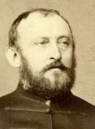A forradalom előestéjén tett ügyvédi vizsgát, majd 1848-ban a forradalmi Pesten kezdte ügyvédi pályafutását. Honvédként végig küzdötte a szabadságharcot. A fegy-verletétel után a császáriak kényszersorozták, egy év után szülővárosában magánügyvédként működött. 1860-ban mint politikailag gyanús magaviseletű egyént Josefstadt-ban elzárták, de 7 hét múlva az októberi diploma kibo-csátása után szabadon engedték.

1861-ben Szabadka város főügyészévé és országgyűlési képviselőjévé vá-lasztotta elérte, hogy a város főgimnáziumhoz jusson. A történelmi 1865-68-iki országgyűlésnek is tagja volt. 1869-ben a budapesti királyi ítélőtábla bírójává, majd 1876-ban kúriai bíróvá nevezték ki. 1889-ben az utolsó Tisza-kormányban igazságügyi államtitkár. 1892-től a budapesti királyi ítélőtábla elnökévé választották. 1893-1901 között a Kúria másodelnökévé választották. 1901-ben nyugdíjba vonult, ekkor a főrendiház tagjává ne-vezték ki. [Forrás: *Pallas Nagylexikon. Magyar életrajzi lexikon*](https://www.google.rs/url?sa=t&rct=j&q=&esrc=s&source=web&cd=19&ved=0ahUKEwiskd-CjbDcAhUD3qQKHXFYBjgQFghwMBI&url=https%3A%2F%2Fwww.arcanum.hu%2Fhu%2Fonline-kiadvanyok%2FLexikonok-magyar-eletrajzi-lexikon-7428D%2Fb-74700%2Fberegfy-karoly-berger-74B3D%2F&usg=AOvVaw3AHr7BTk6b4T2IGP1ALCI9)

**Czövek Erna** (Orsova, 1899. december 13. - Budapest, 1983. március 30.) zenetanár. Tanulmányait a *Fővárosi Felsőbb Zeneisko-lában* végezte, majd a két világháború közötti időszakban a *Fővárosi Zenetanfolyam* zongoratanára volt. A II. világháborút követően 1947-től 1950-ig mint elkötelezett baloldali, a Népművelési Minisztérium zenei előadója.

Részt vett a vidéki zeneiskolák államosításában. 1950-1952 között a *Bartók Béla Zenei Szakiskola* zongora- és szolfézs-tanára, majd 1956-1962 között igazgatója volt a *Fővárosi Zene-iskolák Szervezetének*. 1945 után a tömegzenei nevelés, valamint a bartóki életmű elhivatott híveként megalapozta a magyar zeneoktatás moder-nizálását. Nevét viseli a *Budakeszi Alapfokú Művészeti Iskola*.

Czövek Ernáról nevezték el a *Tóth Aladár Zeneiskola*, Szív utcai épülete legimpozánsabb zongoraoktatói termét.

Forrás: *Magyar életrajzi lexikon *

**D**

**Dániel László** (Versec, 1824. - Pettend-puszta, 1888. január. 21.) honvéd huszártiszt.

1848 októberében a Szepességben szerveződő 19. honvéd-zászlóaljhoz állt be önkéntesnek. Hadnagyi rangban részt vett a Galícia felől az országba törő császári hadtest elleni harcokban. 1849 februárjában főhadnagy a 17. Bocskai huszárezredben, júniusban Dembinski főparancsnok kapitánnyá léptette elő. A 23-án Lemesánnál (Somos) vívott ütközetben sebesülten o-rosz fogságba esett. A többi fogollyal együtt az oroszok átadták az oszt-rákoknak, akik közlegényként besorozták. Rátermettsége ott is érvénye-sült, előbb hadnagy, majd 1854-ben pedig főhadnagy a 7. huszárezredben. Századosi előléptetését már a francia-olasz-osztrák háborúban nyerte, 1859-ben. Ezt követően nyugalmaztatta magát és hazatért Versecre.

A város hazafias beállítottságát mutatja, hogy 1866-ban polgármesterévé választotta Dániel Lászlót. A kiegyezés után egy ideig országgyűlési képviselő volt, majd ügyvédként Fejér megyében telepedett le.

Forrás: [Bona Gábor: *Az 1848/49-es szabadságharc tisztikara*](https://www.arcanum.hu/hu/online-kiadvanyok/Bona-bona-tabornokok-torzstisztek-1/)

**Demény** *Dürr* **Károly** (Temesvár, 1859. május 28. - Budapest, 1932. szep-tember 5.) postavezérigazgató, sportvezető.

1882-ben lépett a posta szolgálatába, 1895-től 1919-ig volt a posta és távirdaigazgatóság vezetője. 1919-ben államtit-kári címmel vezérigazgató lett, a Magyar Királyi Postának, honnét 1928-ban vonult nyugalomba. A postaszolgálatba ő vezette be a kerékpárt és az autót. A híressé vált magyar posta egyik kiváló szervezője. 1925. december 1-én hivata-losan is felavatják a Magyar Rádiót, a rendszeres rádiós műsorsugárzás este 8 órakor indult, *Demény Károly államtitkár, a Magyar Királyi Posta vezérigazgatója beszédével.*

A testnevelés fejlesztése terén is érdemeket szerzett, 1895-ben megnyerte Magyarország teniszbajnokságát. A sportszerű sízés kezdete 1892. de-cember 4., ezen a napon a BBTE két tornásza Bély Mihály és Demény Károly a Krisztiániából (Oslo) hozatott sílécekkel a Kis-Svábhegyről, a Fogaskerekű felé eső lejtőn először Demény Károly csúszott le - bukás nél-kül. Számos társadalmi egyesületnek és sportszervezetnek szervezője, ve-zetője volt. A BBTE-nek (Budapesti Budai Torna Egylet) 1919-től 1935-ig elnöke, az Országos Testnevelési Tanács alelnöke és a Horthy-rendszer sportpolitikájának egyik irányítójaként működött. 1931-ben létrehozták a *Demény Károly Örökös Vándordíjat*. Forrás: [*Magyar életrajzi lexikon*](https://www.arcanum.hu/en/online-kiadvanyok/Lexikonok-magyar-eletrajzi-lexikon-7428D/)

**Déri Kálmán** (Bács, 1859-,?) festő.

Bécsben nyomdászinaskodott, hol beiratkozott a képzőművészeti aka-démiára. A Műcsarnok 1880-as tavaszi tárlatán állított ki először Buda-pesten, hol első díjat nyert egy egyházi festészeti pályázaton *Szent Ágoston* vázlatával. 1884-ben Münchenbe költözött, hol önállóan dolgozott, akt-tanulmányokat és csendéleteket festett. Budapesten utoljára az 1908-ban rendezett gyűjteményes kiállításon vett részt. Több metszete és rajza van a *Szépművészeti Múzeum* gyűjteményében.

Forrás: Újvári Péter: *Magyar Zsidó Lexikon *

**Donogán István** ([Zenta](https://hu.wikipedia.org/wiki/Zenta), [1897](https://hu.wikipedia.org/wiki/1897). [december 13.](https://hu.wikipedia.org/wiki/December_13.) - [Budapest](https://hu.wikipedia.org/wiki/Budapest), [1966](https://hu.wikipedia.org/wiki/1966). [november 25.](https://hu.wikipedia.org/wiki/November_25.)) [diszkoszvető](https://hu.wikipedia.org/wiki/Diszkoszvet%C3%A9s) atléta.

Erejének köszönve már 17 évesen sikeresen fellépett egy Zentán vedégszereplő cirkuszban. Az első világháború alatt a Keleti Fronton harcolt, hol súlyosan megsebesült. 1920-ban belépett a szegedi rendőrséghez.

1924-től a *Szegedi Testgyakorlók Köre*, 1929-től a *BTC* *(Budapesti Torna Club)*, 1929-től a *MAC* *(Magyar Atlé-tikai Club)* dobóatlétája volt. Diszkoszvetésben és súly-lökésben is versenyzett, de kiemelkedő eredményeket diszkoszvetésben ért el. 1926-tól 1937-ig összesen huszonhat alkalommal szerepelt a magyar válogatott-ban. Két nyári olimpián vett részt, 1928-ban, Amszterdamban nem jutott a döntőbe, 1932-ben Los Angelesben az ötödik helyen végzett. Az első atlétikai Európa- bajnokságon, Torinóban bronz-érmet szerzett, ezzel ő lett a szakág első magyar Európa-bajnoki érmese. Forrás: *Sportlexikon I. 1985.*

**E, É**

**Enyedi** *Eisenstädter* **Lukács** (Szabadka, 1845. március 17. - Budapest, 1906. június 21.) politikus, nemzetgazdasági író.

Tanulmányait Budapesten és Bécsben végezte. 1878-ban megalapította az ellenzéki *Függetlenségi Párt*  szócsö-vének tekintett *Szegedi Naplót*. Munkatársai közé tartozott Mikszáth Kálmán is, akihez haláláig barátság fűzte.

1884-ben függetlenségi programmal Tápét képviselve be-került az országgyűlésbe. Képviselőként szakszerű hozzá-szólásaival, valamint a közgazdasági és pénzügyi kérdé-sekben való jártasságával csakhamar tekintélyre tett szert.

1888-tól a a Kossuth-kultuszt ápoló ellenzéki *Egyetértés,* és a szintén ellenzéki   *Pesti Napló* vezércikkírója. Lefordította az MTA megbízásából de Sismondi *Új nemzetgazdászati elvek* című két kötetes művét és Adam Smith *A nemzetek vagyonosodása* című nagy munkájának egyik kötetét.

Forrás: *Magyar életrajzi lexikon.* *Magyar zsidó lexikon*

**Erdélyi** *Ehling* **Károly** ([Perjámos](https://hu.wikipedia.org/wiki/Perj%C3%A1mos_(telep%C3%BCl%C3%A9s)),  [1859](https://hu.wikipedia.org/wiki/1859). [október 19.](https://hu.wikipedia.org/wiki/Okt%C3%B3ber_19.) – [Kolozsvár](https://hu.wikipedia.org/wiki/Kolozsv%C3%A1r), [1908](https://hu.wikipedia.org/wiki/1908). 

[május 13.](https://hu.wikipedia.org/wiki/M%C3%A1jus_13.)) [piarista](https://hu.wikipedia.org/wiki/Piarist%C3%A1k) tanár, [műfordító](https://hu.wikipedia.org/wiki/M%C5%B1ford%C3%ADt%C3%B3), irodalomtörténész.

Gimnáziumi tanulmányait a szegedi piaristáknál végezte. 1876. augusztus 27-én lépett a rendbe és a próbaévet [Vácon](https://hu.wikipedia.org/wiki/V%C3%A1c) töltötte, majd Nyitrán tanult teológiát. 1881/82-ben magyar és [német nyelvet](https://hu.wikipedia.org/wiki/N%C3%A9met_nyelv) és irodalmat, valamint bölcseletet és neveléstudományt hallgatott a budapesti tudományegye-temen. A tanári alapvizsgák letétele után 2 évig a tatai gimnáziumban lett tanár. 1883-ban tanári vizsgáit letéve [Vácon](https://hu.wikipedia.org/wiki/V%C3%A1c) pappá szentelték.

1896-ban Kolozsvárra került piarista gimnáziumi tanárnak, melynek 1897-1908-ban az igazgatója is lett. A németen kívül latinul, görögül, franciául, olaszul, svédül, hollandul és dánul tudott, több nyelvből fordított.

Forráskutatásokat, és magyar-idegennyelvi összehasonlításokat végzett. Az *Egyetemes irodalom története* (Szerk. Heinrich Gusztáv, Bp., 1907) számára írt összefoglalót a skandináv irodalmakról.

Főbb művei: *Vázlatok a magyar nyelvészet köréből. (1886), Az állat-eposról. 1887 (1887), A franczia epos eredetei. (1889), Igazházi egy ke-gyes jó atya, mulatságos játék 5 felv. (1888), Boldog Pirotti Pompilius Mária élete. (1891), Calasanzi szent József, a piaristarend alapítójának élet- és jellemrajza. (1893), A magyar nemzeti irodalom története; középiskolai használatra írta és olvasókönyvvel ellátta Erdélyi Károly. (1897), Hans Christian Andersen. Születésének 100 éves fordulójára. (1905) stb.*

Fordításai: *Börtöneim. Silvio Pellico után olaszból fordította (1886), Potemkin a Duna mellett. Danilevszkij után oroszból fordította dr. Willer Józseffel (1888).*

Források: *Magyar Katolikus Lexikon, Szinnyei József: Magyar írók élete és munkái. 2. Magyar piaristák a XIX. és XX. században. Életrajzi vázlatok*

**Erdős József** (Péterréve, 1900. március 9. - Székesfehérvár, 1971. au-gusztus 1.) tanítóképzői igazgató, plébános.

A gimnáziumot, és a teológiátt Kalocsán végezte. Az1920-as években plébános és hitoktató, majd 1930-tól Kalocsán hitoktató és szentgyházi hitszónok. 1934-ben Szegeden a Ferenc József Tudományegyetemen föld-rajz-természetrajz tanári diplomat szerzett. Ezek után a kalocsai érseki tanítóképző hittantanára, 1938-tól pedig a hittudományi főiskola vicerek-tora. 1939-1948 között az érseki tanítóképző és óvónőképző igazgatója. Számos tanulmányt írt a rovarokról.

Forrás: *Magyar Katolikus Lexikon*

**Érdujhelyi** *Ellinger* **Menyhért** (Zenta, 1860. január 4. - Allentown (USA), 1925. október ?) katolikus plébános, történetíró.

Egyházi tevékenységét 1887-től az újvidéki ipariskolában kezdte segédlelkészként és hitoktatóként. A *Katolikus Hit-oktatás* című folyóirat szerkesztője volt. 1897-ben került szülővárosában, hol állandóan lázadó, politizáló egyénisé-ge, papi pályájának megszakadását és 1908-ban Európából Amerikába való távozását idézték elő.

Az általa megírt monográfiát még ma is, Újvidék „hivata-los” történeteként tartják számon.

Fő műve: *Ujvidék története (1894*), *A titeli káptalan története (1895.)* *A kalocsai érsekség a renaissance-korban (1899) stb.*

Forrás: *Magyar életrajzi lexikon.*

**F**

**Falta** **Marcell** (Zenta, 1867. március 4. - Szeged, 1951. november 28.) orvos, szemész.

1891-ben szerzett orvosi oklevelet a budapesti orvosi karon. Szegedre költözve 1892-1911 között a saját maga alapította szem- és fülbetegek magánkórházat igazgatta. A szegedi kerület *Munkás­betegbiztosító Pénztár* és a *Siketek Intézetének* főorvosa volt. 1932-től a szegedi szemészeti kli-nika magántanáraként előadásait a *trachoma* (szemcsés kötőhártyagyul-ladás) *kór- és gyógytana* című tárgykörből tartotta. A második világhá-borút követően a Szegedi Városi Kórház főorvosaként a szem betegségei-vel, valamint annak kóros elváltozásaival foglalkozott, a trachoma ma-gyarországi leküzdője volt. Forrás: *Magyar Orvoséletrajzi Lexikon*

**Farkas Vince** (Nagybecskerek, 1919. január 11. - Zebegény, 2007. április 9.) tengerésztiszt, múzeumalapító.

1941-ben tisztjelöltté avatták, ezt követően kereskedelmi hajókon szolgált. A második világháborúban az elit Szent László hadosztályban harcolva 1944-ben hadifogságba ke-rült. 1947-ben térhetett haza, vontatóhajókon szolgált, majd sikeres hajóskapitányi vizsgát tett.

Az 1956-os forradalom idején a győri forradalmárok szá-mára szállított Bécsből gyógyszereket, mely miatt 1959-ben letartóztatták. Bár elítélni nem sikerült, kapitányi állásából elbocsá-tották és visszaminősítették matróznak. A hatvanas évektől hajómodellek építéséből és szobrok faragásából próbálta családját eltartani, miközben hajózással, tengerészettel kapcsolatos tárgyakat gyűjtött. Gyűjteményéből végül, saját Zebegényi házában 1984. július 12-én nyílt meg az első Magyar Hajózástörténeti Múzeum. Forrás: *Hajósnép blog*

Báró **Feilitzsch Berthold** (Törökkanizsa 1867. július 15. - Unterhart-mannsrenth (NSZK), 1949. november 1.) jogász, politikus.

Feilitzsch Berthold Pozsonyban tett államtudományi vizs-gát. Torontál vármegye alispáni hivatalának főjegyzője lett. 1897-ben Szabolcs vármegye főispánjává nevezték ki. 1906-ban a Magyar Királyi Közigazgatási Bíróság ítélő-bírája. 1912–1914 között a *Magyar Vöröskereszt Egylet* főgondnoka volt, majd az országvesztést követően 1924-től a *Johannita Lovagrend* magyarországi csoportjának kom-mendátora lett.

A 20-as években a szabadkőművesség ellenében alakult *Etelközi Szövetség* (rövidítve EX) vezetője, valamint a (MOVE) *Magyar Országos Véderő Egylet* társelnöke. Véleményére, nézeteire az akkori Magyarországon min-den mérvadó politikai, politikai jellegű ideológiai szervezet adott.

Forrás: *Magyar életrajzi lexikon*

**Fekete** *Schwarcz* **Mihály** ([Zenta](http://hu.wikipedia.org/wiki/Zenta), [1886](http://hu.wikipedia.org/wiki/1886). [július 19.](http://hu.wikipedia.org/wiki/J%C3%BAlius_19.) - [Jeruzsálem](http://hu.wikipedia.org/wiki/Jeruzs%C3%A1lem), [1957](http://hu.wikipedia.org/wiki/1957). [má-jus 13.](http://hu.wikipedia.org/wiki/M%C3%A1jus_13.)) matematikus, egyetemi tanár.

Egyetemi tanulmányait Budapesten végezte, majd egy évet töltött Göttingenben, hol Edmund Landaut hallgat-hatta. Hazatérése után, 1912-ben Beke Manó tanárse-géde a Tudományegyetem Matematikai Tanszékén. Itt ismerkedett meg Fejér Lipóttal, aki körül kialakult az analízissel foglalkozó tudós kör. 1914-1920 között a budapesti egyetemen az analízis magántanára.

A tanácshatalom idején együttműködő magatartást tanúsított, ezért ál-lásától megfosztották. Hogy fenttartsa magát, iskolán kívül oktatott, míg végül a Pesti Izraelita Hitközség Reálgimnáziumában kapott tanári állást. E. Landautól 1928-ban meghívást kapott a jeruzsálemi héber egyetemre. Itt az egyetem *Albert Einstein Matematikai Intézetének* igazgatójává ne-vezték ki. Legfontosabb eredménye a *transzfinitátmérő* fogalmának meg-alkotása.

Forrás: *Magyar tudóslexikon. Magyar zsidó lexikon *

**Fenyő** *Fried* **Aladár** (Magyarkanizsa, 1881. július 11. - Budapest, 1981. augusztus 3.) színész.

A Színművészeti Akadémia elvégzését követően Szabadkán, majd Székes-fehérvárott játszott. A magyar némafilmgyártás úttöröjeként 1916-ban szerződött Budapestre, hol évtizedig előbb a *Víg*, később 1927-1929 között a *Fővárosi Operettszínház* tagja volt. Ezutána a harmincas években sza-badúszóként, alkalmi fellépései voltak.

Az ötvenes évektől újra szinpadra lépett, 1952-1954 között a *Madách*, 1954-56-ban a *Petőfi*, 1956-tól 1963-ig a *Jókai*, 1964-től a *Thália Szín-házban* szerepelt. Elegáns színpadi jelenség volt, nagy drámai szerepeket és jellemszerepeket alakított.

Főbb szerepei: *Harpagon (Molière: A fösvény); Mercutio (Sh.: Hamlet); Jágó (Sh.: Othello).* Filmszerepei: *Nővérek (1912),* *Tavaszi vihar (1918),* *A kőszívű ember fiai (1966).*

Forrás: *Magyar színházművészeti lexikon*

**Fenyvessy Éva** ([Zombor](http://hu.wikipedia.org/wiki/Zombor), [1911](http://hu.wikipedia.org/wiki/1911). [október 31.](http://hu.wikipedia.org/wiki/Okt%C3%B3ber_31.) - Budapest, 2009. július 22.) színésznő.

Színésznői pályáját gyermekszínészként kezdte, 1930-ban elvégezte Rákosi Szidi színiiskoláját. Felnőtt díva-ként a *Király Színházba* szerződöt, majd szabadúszóként szerepekre szerződött a *Magyar*, illetve az *Andrássy úti Színházba.* Főként zenés vígjátékokban és operettek pri-madonna szerepeiben tűnt fel.

1930-ban szerepelt először hangosfilmben, hamarosan megkapta első film-főszerepét a *Hyppolit, a lakáj* c. vígjátékban. Ezután még egy főszerepet kapott, majd csupán epizódszerepeket.

Következő emlékezetes alakítása a legendás *Köszönöm, hogy imádott*! című film slágerének előadása volt.

1950-től nyugdíjazásáig, 1969-ig a *Fővárosi Operettszínház* művésznője volt. Filmjei: *Hyppolit, a lakáj (1931), Ida regénye (1934), Rotschild leá-nya (1934), Barátságos arcot kérek (1936), Családi pótlék (1937), Erzsébet királyné (1940), Magyar sasok (1944). *

Forrás: *Magyar Hangosfilm Lexikon*. *Magyar színházművészeti lexikon*

**Flórián Ede** (Temerin, 1916. március 17. - Budapest, 1984. augusztus 8.) orvos, bőrgyógyász, miko­lógus, az orvostudományok kandidátusa.

A második világháborúba való belépéskor (1941.) szerezte meg orvosi oklevelét a budapesti Pázmány Péter Tudományegyetem orvosi karán. Igy hamarosan a háború forgatagában találta magát. A háború első három évében katonaorvosként szolgállt, majd 1943-tól a budapesti orvosi karon a *Bőr és Nemikórtani Klinika* mykológiai laboratóriumában munkatárs.

A világháborút követően 1951-től a mykológiai laboratorium vezetője.

1953-tól az osztály főorvosa, 1956-1962 között önálló kutató és tudomá-nyos munkatárs, 1962-1969 között tudományos osztályvezető. Ezt kö-vetően hét évig 1971-1977 között, a bőrgyógyklinika igazgatóhelyettese volt egészen nyugdíjba vonulásáig.

Aktív szolgálata alatt megszervezte az országos mikológiai laboratóriumi szolgálatot, több mint száz közleménye jelent meg e tárgykörből. Egy év-tizeden át társszerkesztője volt a *Dermatovenerológia Haladása* c. lapnak, valamint tagja volt a *Magyar Dermatológiai Társaságnak. *

Főbb művei: *Mély gombás folyamatok* (1952), *Gombás betegségek felis-merése és kezelése* (1969).

Forrás: *Magyar Orvoséletrajzi Lexikon.* *Magyar életrajzi lexikon*

**Frint János** ([Ferenchalom](https://hu.wikipedia.org/wiki/Ferenchalom), [1885](https://hu.wikipedia.org/wiki/1885). [szeptember 16.](https://hu.wikipedia.org/wiki/Szeptember_16.) - [Ora](https://hu.wikipedia.org/wiki/Ora), Bolzano köze-lében, [1918](https://hu.wikipedia.org/wiki/1918). [február 27.](https://hu.wikipedia.org/wiki/Febru%C3%A1r_27.)) az [Osztrák-Magyar Monarchia](https://hu.wikipedia.org/wiki/Osztr%C3%A1k%E2%80%93Magyar_Monarchia) ászpilótája.

A reáliskola után a temesvári hadapródiskolában tanult tovább. 1906-tól a Marosvásárhelyen állomásozó 51. gya-logezred állományához tartozott. 1909-ben zászlósként szolgált a miskolci 65. közös gyalogezredben.

A világháború kitörésekor előléptették hivatásos főhad-naggyá, majd századparancsnokként ezredével az orosz fronton harcolt, hol 1914. november 14.-én súlyosan meg-sebesült. Teljesen felépülni sohasem sikerült, ezért önként jelentkezett Bécsújhelyre a *Légjáró Csapatokhoz. *

Frint Jánost a megfigyelőtisztként az olasz fronton 1916 tavaszán meg-alakuló [23. repülőszázadhoz](https://hu.wikipedia.org/wiki/Flik_23) vezényeltékték. Sorsa itt összefonódott a kalandos életű Heinrich *Jindrich* Kostrba repülőszázadossal, a monarchia első 8 légi győzelmet elérő pilótájával. 1916. szeptembertől pilóta kikép-zést kapott, 1917. május 1-én már századparancsnok kerülhetett újra vissza a harctérre. 1918 januárjában a századot áthelyezték az olasz frontra, hol február 25-én repülőgép berepülése során vesztette életét.

Számos kitüntetése között szerepel a [*Vaskoronarend*](https://hu.wikipedia.org/wiki/Osztr%C3%A1k_Cs%C3%A1sz%C3%A1ri_Vaskorona-rend) III. osztálya és az [Ezüst Katonai Érdemérem](https://hu.wikipedia.org/wiki/Signum_Laudis) hadiszalagon, kardokkal vagy *Signum Laudis*.

Forrás: Gondos László: *Repülőászok 1914-1918.*

**Fülepp Lipót** (Oravicabánya, [1809](https://hu.wikipedia.org/wiki/1809) ? - [Budapest](https://hu.wikipedia.org/wiki/Budapest), 1875. július 1.) ügyvéd, politikus, [Fülepp Kálmán](https://hu.wikipedia.org/wiki/F%C3%BClepp_K%C3%A1lm%C3%A1n) Budapest főpolgármesterének apja.

Jogvégzett emberként Temesvár országgyűlési képvise-lőjeként tagja lett az első 1848–49-es népképviseleti or-szággyűlésnek.

A szabadságharc alatt [Madarász László](https://hu.wikipedia.org/wiki/Madar%C3%A1sz_L%C3%A1szl%C3%B3_%28politikus%29) délvidéki posta-kormánybiztossá nevezte ki, míg a [Szemere-kormány](https://hu.wikipedia.org/wiki/Szemere-korm%C3%A1ny) ide-jén Krassó vármegye és a végvidék kormánybiztosa volt. Kossuth kormányzó-elnöki irodájában [államtanácsos](https://hu.wikipedia.org/w/index.php?title=%C3%81llamtan%C3%A1cso&action=edit&redlink=1), a minisztertanácsi ülések egyik előadó jegyzője volt.

A [világosi fegyverletétel](https://hu.wikipedia.org/wiki/Vil%C3%A1gosi_fegyverlet%C3%A9tel) után [Szemere Bertalan](https://hu.wikipedia.org/wiki/Szemere_Bertalan) miniszterelnökkel és Hoffmann Zakariás oravicai bányatulajdonossal (Fülepp apósa) együtt részt vett, a [*Szent Korona*](https://hu.wikipedia.org/wiki/Szent_Korona) és a [koronázási jelvények](https://hu.wikipedia.org/wiki/Koron%C3%A1z%C3%A1si_jelv%C3%A9nyek) orsovai elrejtésében.

A rejtek helyén később a Magyar hazafiak kápolnát emeltettek, a Magya-rok Védőasszonyának Szűz Máriának tiszteletére. A kápolna a román vaskapui vízierőmű építése során víz alá került, és elpusztult.

Fülepp Lipót az emigrációban is kitartott Szemere Bertalan mellett, együtt az emigrációban megjárták Törökországot, majd Franciaországot és Nagy-Britanniát is. Habár távollétében halálra ítélték, felesége kieszközölte számára a kegyelmet, s így 1858-ban visszatérhetett Magyarországra. Újra képviselővé választották, 1869-ben pedig a Pesti [Királyi Ítélőtábla](https://hu.wikipedia.org/wiki/Kir%C3%A1lyi_%C3%8Dt%C3%A9l%C5%91t%C3%A1bla) tanács-elnökévé nevezték ki.

Forrás: *Magyar Életrajzi Lexikon *

**Füssy** (*Fuchs Alajos*) **Tamás** (Zimony, 1825. április 11. - Zalaapáti, 1903. április 14.) történész, Benedek rendi apátsági perjel.

Miután az újvidéki és a bajai gimnáziumokban befejezte középfokú tanulmányait, a pannonhalmi bencések közé lépett. A győri rendi kollégiumban bölcseletet hallgatott.

Olyan kiváló tanárai voltak mint a nyelvtudós Czuczor Gergely, a régész, művészettörténész Rómer Flóris … és a bencés *darwinista*! Rónay Jácint akadémikus.

Miután elvégezte a teologiát, a szabadságharc bukásának napjaiban szentellték föl misés papp. Ezt követően a Pápán gimnáziumi tanárnak alkalmazták, mely tanintézménynek 1855-től igazgatója volt.

1889-ben lemondott igazgatói állásáról és mint apátsági perjel és levéltári őr dolgozott tovább Zalaapátiban. 1864-ben a *Szent-István irodalmi tár-sulat* igazgatójává választatott. A *Szent István Társulat* tudományos és irodalmi osztályának tagjaként, történeti és régészeti kérdésekkel foglalko-zott, és több tankönyvet is írt. Fő műve: *A zalavári apátság története.*

Forrás: *Magyar Katolikus Lexikon*. *Magyar életrajzi lexikon *

**G**

**Gál Benő** (Bácskertes, 1879. szeptember 16. - Mauthausen, 1945) szociál-demokrata funkcionárius.

Nyomdai korrektorként dolgozott, majd 1900-tól tagja lett a nyomdászok szakszervezetének. 1919-től 1944-ig titkára volt a jelentős és befolyásos szakszervezettnek. A szociáldemokrata *Népszava* c. napilapban, valamint az MSZDP elméleti, politikai, közgazdasági és társadalmi témákkal fog-lalkozó, *Szocializmus* c. folyóiratában jelenetek meg a munkásság életszín-vonalával, az árak alakulásával foglalkozó írásai. Ez utóbbi sajtótermék, 1938 decemberében az Imrédy Béla  sajtótörvénye következtében meg-szűnt. A német megszállást követően a mauthauseni haláltáborba deportál-ták. Forrás: *Magyar zsidó lexikon*. *Magyar életrajzi lexikon *

**Gáspárdy Sándor** (Orsova, 1909. március 19. - Kapuvár, 1986. március 20.) festő, rajztanár.

A Képzőművészeti Főiskolán szerezte meg rajztanári diplomáját, majd ezt követően oklevelet szerzett a Pázmány Péter Tudományegyetem jogi ka-rán is. Erdély visszatértekor Marosvásárhelyen a tankerületi főigazgató-ságon dolgozott, majd a fővárosi szakminisztérium művészeti osztályán helyezkedett el. A háborút követően csak három és fél évi hadifogság után vergődött haza, Sopronba került mint megyei tanulmányi felügyelő.

Csak az ötvenes évak közepén kezdett újra festeni. Táj- és városábrázolásai módja új színfolt volt az olajképek festésében. A nagybányai hagyományo-kat követte, csendéletei város- és tájképei a természet színességét fokozták. Rendszeres résztvevője volt a megyei, illetve az észak-dunántúli képző-művészek tárlatainak. 1960-ban Székely Bertalan-díjat nyert. Sopron 1971-ben Lackner Kristóf Emlékéremmel tüntették ki.

Forrás: *Magyar Életrajzi Lexikon *

**Geréb** *Geiger* **József** (Szabadka, 1861. május 1. - Budapest, 1930. június 6.) bölcseleti doktor, irodalomtörténész és főgimnáziumi tanár.

A budapesti egyetemen tanult, állami ösztöndíjasként Berlinben, Mün-chenben és Parizsban tanulmányozta tovább az ókori irodalmakat és művé-szeteket. Több ízben beutazta Olaszországot, majd pedig Görögországot és az Ioni szigeteket. Előbb Losoncon, majd 1896-tól a fővárosi gyakorló főgimnáziumban tanított és igazgatott. 1920-ban nyugalomba vonulta u-tán, a zsidó leánygimnáziumban még tanított.

Irt több latin és görög nyelvű tankönyvet, valamint egyik főmunkatársa volt az *Ókori Lexikonnak*.

Lefordította Epiktetos *Eucheiriduszá*t*, az erkölcsi élet kis tükre* címen*.*

Főbb művei: *Aristoteles Poétkája (1891), Herodotos történeti könyvei (1892-94), Olympos. Görög-római mythologia (1893), A római kultúra legjelentősebb vonásai (1907), A görög szellem Európa kultúrájában (1921) stb.* Forrás: *Szinnyei József: Magyar írók élete és munkái *

**Görgényi** *Göttche* **Oszkár** (Kula, 1895. július 4. - Budapest, 1972. április 13.) gyermek- tüdőgyógyász, egyetemi tanár.

A budapesti orvosi karon szerezte orvosi oklevelét, és ezt követően a pécsi gyermekklinikán helyezkedett el. 1932-ben került Budapestre, hol a Fehér-kereszt Kórház főorvosa volt. A háború múltával átkerült a Szent János Kórházba, hol a gyermekosztály vezetését vette át. A kommunista hata-lomátvétel idején 1946-1950 között kényszernyugdíjba került. 1950-től a *Szabadsághegyi Gyermekszanatórium* főorvosává, majd 1957-től igazga-tójává nevezték ki. Számos hazai és külföldi társaság tagjaként nemzetközi hírű gyermek-tbc-gyógyász volt, aki a radiológiával is foglalkozott.

Főbb művei: *Csecsemő- és gyermekgyógyászati repetitorium* (1924), *Cse-csemő és gyermekgyógyá­szat a gyakorló orvos számára* (1936), *A belső mellkasi nyirokcsomók gümőkórja* (1958, németül: 1962) stb.

Forrás: *Magyar Életrajzi Lexikon.* *Magyar Orvoséletrajzi Lexikon *

**Graenzenstein Béla** (Oravicabánya, 1847. augusztus 5. - Budapest, 1913. január 9.) bánya- és kohómérnök.

A középiskola befejezését követően előbb Ausztriában, majd a belgiumi Liege-i egyetemen vaskohászatot és szénbányászatot tanult. Miután hazatért, 1870-ben a Selmecbányai Bányászati Akadémián bánya- és kohó-mérnöki oklevelet szerzett.

1881-től az állami vasgyárak újra szervezésében vett részt és a vas- és acélbehozatal korlátozása, újabb gyár-tási ágak meghonosítása körül szerzett érdemeket. 1886-ban megoldotta a veszteséges *dohányjövedék átszervezését*, majd annak igazgatásával a dohánygyártás hatalmas fejlesztésen ment keresztül. Új dohánygyárak létesültek, valamint a talajvizsgálatok bevezetésével több vármegyében is megoldódott az új ipari kultúra elterjesztése.

Nevéhez fűződik a honi mezőgazdasági akadémiáknál, valamint földmű-ves iskoláknál a dohány kísérletezések megkezdése. 1896 után visszatért az államigazgatás karába, ahol 1905-ig a pénzügyminisztérium államtit-káraként működött.

Forrás: *Magyar Életrajzi Lexikon 1000-1990*

**Grand Miklós** (Temesrékas 1837. - Buziás, 1893 szeptember 16.) méhész.

1854-ben a verseci tanítóképző főelemi képesítésével mint tanító Buziásra költözött, hol állásán kívűl teljes idejét a méhészetnek szentelte. Már falusi tanítóként 100-nál több méhcsaládja volt. A részvételével megtartott kiállí-tásokon kitüntetéseketé érmeket, díszokleveleveleket és pénzbeli jutal-makat szerzett.

1873-ban megalakította a *Délmagyarországi Méhészegyesület*et. Az 1882-ben megszervezett méhészeti felügyelőségek élére állítottak. Páratlan be-rendezésű méhesét sokan tekintik meg, hogy ott tapasztalatokat gyűjtse-nek.  Az általa szerkesztett kaptárt a kormány hivatalos jellegű kaptárnak ismerte el; ez a kaptártípus, az ú. n. “Grand kaptár”, ma is igen elterjedt.

Munkája: *A méhészetről. bőv. kiadás. 1890.*

Kovács Antallal és Ambrózy Béla báróval megalapította és szerkesztette az *Ungarische Biene*-t és a *Magyar Méh* c. havi szakfolyóiratot.

Forrás: Szinnyei József *-* *Magyar írók élete és munkái *

**Grandpierre K.** *Kolozsvári* **Endre** (Hódság, 1916. október 6. - Budapest, 2003. július 17.) író, költő, történész, magyarságkutató.

Történelem szakon szerzett oklevelet az ELTE bölcsész-karán. Irodalmi pályáját költőként kezdte. 1944 őszén az ország németek álltali megszállásakor a németek ellen harcolt Budapesten. A marxista történelemtanítás kor-szakában gyakran ütközött falakba, ugyanis szenvedé-lyes kutatója lett a történelmi titkoknak.

Az ötvenes évek végén leginkább csak gyermekköny-veit, ifjúsági regényeit (*Jégtündér*, *Szegénylegény és levélmenyasszony*.) adták ki. A Zrínyi Miklós ifjúságáról szóló *Az ördög apostolai* (1960), valamint a Zrínyi meggyilkoltatását bizonyító *Fekete hóesés* (1970) című művei miatt tiltólistára került.

László Gyula nagy tisztelőjeként, kinek az 1978-as *„[kettős honfoglalás](http://hu.wikipedia.org/wiki/Kett%C5%91s_honfoglal%C3%A1s)”* elmélete után közzétette az Árpád-kori ősgesztát a [*Tarih-i Üngürüsz*](http://hu.wikipedia.org/wiki/Tarih-i_%C3%9Cng%C3%BCr%C3%BCsz)-t. Az ősgeszta neki köszönhetően újraolvashatóvá vált. Ifjúsági és verseskötetei nélkül hivatalosan 24 nagyobb horderejű művet (könyvet) hozott létre.

A rendszerválltás neki is meghozta a szabad publikáció lehetőségét, sorra jelentek meg könyvei. Munkássága a magyarság Kárpát-medencei ősho-nos mivoltának bizonyítására irányult.

Forrás: *Kortárs magyar írók kislexikona *

**Gruby Dávid** (Kiskér, [1810](http://hu.wikipedia.org/wiki/1810). [augusztus 20.](http://hu.wikipedia.org/wiki/Augusztus_20.) - Párizs, 1898. november 14.) orvos szemészmester.

A pesti Tudományegyetemen, majd a bécsi egyetem orvoskarán tanult, hol szemészmesterré avatták. 1840-ben jelent meg első tudományos műve latin nyelven, *A kóros elváltozások mikroszkópos megfigyelése* címen.

Elhagyva Bécset Franciaországban, az alforti állatorvo-si főiskolán folytatta kísérleteit. Saját szerkesztésű mik-roszkópjával neki sikerült először mikrofotográfiákat készíteni. Vizsgálataival a véglények elismert szakértője lett, fölfdezte a bőrbetegséget okozó gombát, valamint az álomkórt okozó mikroorganiz-must. Gyakorló orvosként olyan világhírességek háziorvosa és barátja volt, mint *Heinrich Heine,* *Frédéric Chopin, Georg Sand,* *Charles Gounod,* *Honoré de Balzac, a két* *Dumas,* valamint honfitársai közül *Liszt Ferenc,* *Munkácsy Mihály,* *Zichy Mihály stb*. Forrás: *Magyar tudóslexikon  *

**Gyelmis-Lukács János** (Szabadka, 1899. szeptember 28. - Budapest, 1979. április 24.) festőművész.

A budapesti Képzőművészeti Főiskolán tanult, ahol Rudnay Gyula korri-gálta. 1928-1938-ig Firenzében az *Accademia di Belle Artin*-ban képezte magát. Hazatérését követően a bükki művésztelepen dolgozott. A második világháború alatt Újvidéken alkotott, hol 1942-ben elnyerte a város nagy ezüstérmét. 1945 után Budapesten élt, műveiben plasztikus hatású, a fény és árnyék ellentétére épülő tájképeket, figurális kompozíciókatábrázolt. 1963-ban nemzetközi díjat nyert az olaszországi Palesztrinában. Alkotásait - a magángyűjtemények mellett- a pécsi *Janus Pannonius Múzeum,* a *Mo-dern Magyar Képtár*, és a *szabadkai Városi Múzeum* őrzi.

Forrás: *Magyar művész életrajza*

Flattné **Győrffy Gizella** (Csernye, 1870. május 14. – [Budapest](https://hu.wikipedia.org/wiki/Budapest), 1943. március 24.) operaénekesnő, mezoszoprán.

1901-ben végezte el a [Zeneakadémiát](https://hu.wikipedia.org/wiki/Liszt_Ferenc_Zenem%C5%B1v%C3%A9szeti_Egyetem). Eleinte csak kis sze-repeket énekelt, később rábízták Orlovszkyt a »Denevér«-ben, Gertrudot a »Bánk bán«-ban és »Hamlet«-ben a ki-rálynét. Első nagy sikerét Ortrud szerepében aratta a »Lo-hengrin«-ben, majd a »Tannhäuser«-ben, Erzsébet szere-pében is elismerést vívott ki. Szép terjedelmű és jól iskolá-zott, átható erejű mezzoszopránja, zenei intelligenciája és színészi tehet-sége a legszebb reményeket váltotta be. 1903 és 1912 között volt az Ope-raház tagja.  Forrás: [*Magyar Színművészeti Lexikon*](https://mek.oszk.hu/08700/08756/html/II/szin_II.0044.pdf)

**H**

**Hajdu Elemér** (Saroltavár-Charlottenburg, 1902. január 5. - Budapest, 1988. június 1.) gépészmérnök.

A József Műegyetemen szerzett oklevelet 1925-ben. Először a Ganz-gyár tervezőmérnöke (1925-1928), majd 1928-1945 között a Székesfővárosi Elektromos Művek műszaki főtanácsadója volt. 1946-[1947](http://hu.wikipedia.org/wiki/1947)-ben az Újjáépítési Minisztérium energiaügyi főosztályvezetője, majd a szén kormánybiztos helyettese.

[1947](http://hu.wikipedia.org/wiki/1947)-[1948](http://hu.wikipedia.org/wiki/1948) között a Magyar Dunántúli Villamossági Rt. ügyvezető igazgatója, utána három évig az Erőmű Ipari Központ vezér-igazgatóhelyettese volt. Később az Erőmű Beruházási Vállalatnál, az Erő-mű Trösztnél dolgozott, és nyugdíjba vonulásáig ([1969](http://hu.wikipedia.org/wiki/1969)) a Magyar Vil-lamos Művek Tröszt termelési igazgatója volt. Az országos villamosener-giarendszer bevezetésének egyik irányítója volt. Fő műve: *Gépek üzem-képességének üzemi és gazdasági jelentősége (1941).*

Forrás: *[Magyar életrajzi lexikon](https://www.arcanum.hu/en/online-kiadvanyok/Lexikonok-magyar-eletrajzi-lexikon-7428D/), [Magyar gépészmérnökök](https://hu.wikipedia.org/wiki/Kateg%C3%B3ria:Magyar_g%C3%A9p%C3%A9szm%C3%A9rn%C3%B6k%C3%B6k)*

**Halaváts Gyula** (Zséna, 1853. július 07. - Budapest, 1926. július 29.) geo-lógus, geográfus.

A selmecbányai bányászati-erdészeti akadémián 1874-ben diplomált. 1874 őszétől a budapesti földtani intézet-hez került, hol [1918](http://hu.wikipedia.org/wiki/1918)-ig főgeológus és főbányatanácsos. Munkája során Magyarország részletes földtani fölvéte-lével, és tanulmányozásával foglalkozott.

Tudományos munkáját Somogy és Baranya megyében kezdte, a munkáját a délvidéken folytatta, előbb 1879-től Krassó-Szörény megye közép-hegységét, majd 1893-ban a Dunának pan-csova-moldovai szakaszát dolgozta fel. 1913-ban az Erdélyi-medence tek-tonikáját kutattva és ezzel a munkával fejezte be kutatásait. Az Alföld geo-lógiájával, főleg annak Duna-Tisza közötti részével foglalkozott.

Munkássága egyik legfontosabb eredménye az Alföld földtani viszonyai-nak összefoglaló ismertetése volt. Értékes szerzeményekkel gyarapította a *Magyar Királyi Földtani Intézet Múzeumát*. Nagy jelentőségűek a magyar pontusi (pannoniai) rétegekkel foglalkozó tanulmányai. Az MTA *Rózsay-díját* két alkalommal nyerte el (1895 és 1906), mellyel kétévenként orvosi vagy egyéb természettudományi munkát jutalmaztak.

Forrás: *Magyar életrajzi lexikon.* *Szinnyei József: Magyar írók élete és munkái*

**Hámori Artúr** (Újvidék, 1909. március 18. - Pécs, 1983. március 22.) or-vos, belgyógyász, egyetemi tanár, az MTA tagja.

A szegedi orvosi karon előbb az Anatómiai Intézetben, majd a belgyógyászati klinikán dolgozott. 1937-től került a pécsi belklinikára 1945-től adjunktusként a beldiag-nosztikai gyakorlat előadója volt.

1950-ben megbízták a pécsi II. sz. belklinika megszer-vezésével, hol a volt Irgalmasrendi Kórház épületében kiemelkedően működő klinikát szervezett. Az intézmény-nek 1951-1979 között igaz­gatója, egyben tanszékvezető tanára a *Pécsi Orvostudományi Egyetemnek*. Nemzetközi elismerést aratott a *vesebetegek gondozása* terén alkalmazott módszereivel.

Tudományos érdeklődése az allergiás vesebetegségek klinikopatológiájára és kezelésére irányult. 1966-ban megalapította a *Magyar Immunológiai Társaság*ot, amelynek haláláig elnöke volt. Az MTA Immunológiai és Allergológiai Kutatásokkal Foglalkozó Bizottságának tagja. A *Nemzetközi Belgyógyász Társaság* tagja (1968-tól), tiszteletére a Pécsi Tudománye-gyetem (PTE) *Hámori Artur Belgyógyásza-ti Napoka*t rendez (2007-től), illetve emlékét őrzi a PTE által alapított *Hámori Artur Szakorvosi Díj*. Főbb művei: *Magas hőmérséklet hatása a légzés központi szabályozására* (1941), *Az empyema chemotherapiája ultraseptyllel* (1943), *Belgyógyá-szati diagnosztika* (1950, 1951.) A *pyelonephritis gyógyítása és megelő-zése* (1962) stb. Forrás: *Magyar Orvoséletrajzi Lexikon*

**Harsányi** *Hesser* **Tibor** (Magyarkanizsa, 1898. - Párizs, 1954.) zeneszer-ző.

Tanulmányait a budapesti Zeneakadémián végezte, zon-gorázni Bartók Bélától, zeneszerzést Kodály Zoltántól tanult. Fiatal korában nagysikerű koncerteket adott Euró-pa szerte és a tengerentúlon. 1924-ben Párizsban tele-pedett le, hol zeneszerzői munkássága mellett a kortárs-zenei élet szervezőjeként is jelentős ismertségre tett szert.

Tagja volt a Párizsban élő külföldi szerzőket tömörítő *Groupe de Quatre*-nak. Harsányi Tibor a színpadi zenék és balettek mellett a zenekari művek, zongoradarabok és kamarazenei műveket is komponált.

Zenéjében felismerhető volt a magyar zenei hagyomány, valamint a mo-dern amerikai jazz is nagy hatással volt rá. A kor szellemének mergfele-lően film- és rajzfilm-zenét is írt. Első és egyben egyetlen opera művét, a *Les invités* (A vendégek) címmel 1937-ben nagy sikerrel mutatták be Pá-rizsban. Forrás: *Magyar életrajzi lexikon*

**Hazay** *Heim*  **Ernő **(Temesvár, 1819. április 7. – Bátorkeszi, [1889](https://hu.wikipedia.org/wiki/1889). [de-cember 17.](https://hu.wikipedia.org/wiki/December_17.)) hírlapíró, országgyűlési képviselő.

Miután középiskoláit szülővárosában elvégezte, a hohenheimi gazdasági akadémián tanult. Honvédtisztként, két öccsével együtt vett részt a szabad-ságharcban. A debreceni trónfosztó nyilatkozat után megalapította és szer-kesztette a Pesten megjelenő *Am 14 Ap*ril c. német nyelvű, erősen repub-likánus szellemű lapot.

A szabadságharc leverése után, az őt halálra ítélő osztrák haditörvényszék elöl sikerült török földre menekülnie. Vidinben bujdosott, majd sok sors-társához hasonlóan Bem József mellett volt [Aleppóban](https://hu.wikipedia.org/wiki/Alepp%C3%B3). Később [Boszniá-ba](https://hu.wikipedia.org/wiki/Bosznia-Hercegovina)n és [Konstantinápolyba](https://hu.wikipedia.org/wiki/Konstantin%C3%A1poly)n tartózkodott. Miután  kegyelmet kapott, visz-szatért Pestre, hol részt vett a *Pester Lloyd* alapításában.

Több napilapba írt bel- és külpolitikai és gazdasági cikkeket, tanulmányo-kat. A Pester Lloydon kívül írásai a *Magyarország*ban, a *Századunk*ban, a  *Pesti Napló*ban  és a  *Budapesti Hírlap*ban jelentek meg. Az 1850-es é-vek végén visszavonult a ujságírástól. Ezután az 1860-as évektől fogva  az országgyűlésen három ízben képviselte a köbölkúti kerületet.

Fő műve: *Nyílt szó a szesz megadóztatása tárgyában (1867).*

Forrás: *Szinnyei József: Magyar írók élete és munkái.* *Magyar életrajzi lexikon*

**Hegedűs Ferenc** ([Szabadka](http://hu.wikipedia.org/wiki/Szabadka), [1856](http://hu.wikipedia.org/wiki/1856). [május 16.](http://hu.wikipedia.org/wiki/M%C3%A1jus_16.) - [Budapest](http://hu.wikipedia.org/wiki/Budapest), [1929](http://hu.wikipedia.org/wiki/1929). [augusztus 3.](http://hu.wikipedia.org/wiki/Augusztus_3.)) [opera-énekes](http://hu.wikipedia.org/wiki/Opera_%28sz%C3%ADnm%C5%B1%29) (basszus).

Vidéki szinházakban, [Várnay Fábián](https://hu.wikipedia.org/wiki/V%C3%A1rnay_F%C3%A1bi%C3%A1n)nál, kit a színész-színigazgató legen-da [Deréki Antal](https://hu.wikipedia.org/wiki/Der%C3%A9ki_Antal)   "A hatvanas évek legnagyobb ripacsanak" nevezett, a szatmár-bihari részeken társulatában működő kezdte pályafutását.

Később a kedvelt és népszerű igazgató [Csóka Sándor](https://hu.wikipedia.org/wiki/Cs%C3%B3ka_S%C3%A1ndor)  társulatában lépett föl, megfordult Pécsett, Baján, Kassán; 1885 és 1889 között Kolozsváron, később Szabadkát, majd Miskolcot és Győrt is megjárta.

A fővárosi Operaházban 1886. szeptember 9-én mutatkozott be Bartolo doktor szerepében  Rossini  *A sevillai borbély* című operájában. A követ-kező évben kapott állandó szerződést.

Sikereit kiváló hangja mellett, különleges színészi képességeivel alapozta meg. Csaknem négy évtizedes pályafutás után, 1924-ben vonult nyuga-lomba, a következő évben az Operaház örökös tagja lett.

Repertoárja gerincét komikus alakok alkották. Főbb szerepei: Erkel Fe-renc: *Névtelen hősök*-Csipkés. Mozart: [*A varázsfuvola*](https://hu.wikipedia.org/wiki/A_var%C3%A1zsfuvola_(opera))-Papageno. [Johann Strauss:](https://hu.wikipedia.org/wiki/Johann_Strauss_(zeneszerz%C5%91,_1825%E2%80%931899)) [*A denevér*](https://hu.wikipedia.org/wiki/A_denev%C3%A9r)-Frosch. [Wagner](https://hu.wikipedia.org/wiki/Richard_Wagner_(zeneszerz%C5%91)): [*A nürnbergi mesterdalnokok*](https://hu.wikipedia.org/wiki/A_n%C3%BCrnbergi_mesterdalnokok) -Sixtus Beckmesser stb.

Forrás: *Magyar színházművészeti lexikon*

**Hegyi Aranka** (Szabadka, 1855. május 25. - Budapest, 1906. június 9.) operett- és dalénekesnő.

Tehetséges cigányprímások között nőtt föl, tehetséges gyer-mekként a *Nemzeti Színház* balettiskolájába került. Ezután Fehérvári Marinál fejlesztette énekhangját. Első sikerét 1878-ban szülővárosában Szabadkán aratta. 1880-tól Ráko-si Jenő *Népszínházához* szerződött, ahol haláláig szerepelt. Tehetsége folytán a korszak nagyságainak *Blaha* Lujzának és *Pálmay* Ilkának egyenrangú partnere volt.

Pályafutása elején kezdődött az operett korszaka a fővárosi színházi élet-ben, a nagy egyéniségek rengeteget tettek a székesfőváros megmagyaro-sításában. Operettprimadonnaként és a népszínművek szerepeiben egya-ránt rendkívüli sikereket ért el. Főként a francia operettekben tűnt ki, de számos magyar operettet is sikerre vitt.

*A cigánybáró*ban nyújtott alakítása után ifj. J. Strauss -ki maga is tisztelői közé tartozott- őt tartotta az ideális *Szaffi* megtestesítőjének. Stróbl Alajos róla mintázta a *Táncosnő* szobrát. *Főbb szerepei: Beatrix (Lecocq: Nap és Hold); Lili (Hervé); Laura (Millöcker: A koldusdiák); Nanki Poo (Sulli-van: A mikádó); Rosalinda, Adél (ifj. J. Strauss: A denevér); Sélim (Verő Gy.: A szultán).* Forrás: *Magyar színházművészeti lexikon*

**Heitzmann Márton** (Szabadka, 1804. - Budapest, 1894.) sebészmester, országos főállatorvos, tanár.

Felsőbb tanulmányait Bécsben, a Josephinumban végezte. 1824 áprilisá-ban, tábori alorvosi (unterfeldartz) rangban besorozták a bécsi székhelyű 1. sz. császár-huszárezredbe. Ezt követően két évtizedig 20 szolgálta a had-seregei. A bródi 7. sz. ezrednél 8 évig állomásozott, hol gyakorló állator-vosként, jelentős érdemeket szerzett az éppen aktuális marhavész megfé-kezésébe.

1844 augusztusában megkapta, a Zlamal Vilmos távozásával (aki a pesti egyetem orvosi karán az állatorvostan ny. r. tanára és a pesti állatorvosi tanintézet igazgatója lett) megüresedett országos főállatorvosi állást.

Heitzmann Vilmos három esztendőn keresztül; 1853-1856 között töltötte be az ország első állatorvosának feladatát. Egyben hoszabb ideig tanított (német és magyar nyelven) a pesti cs. és kir. Állagyógyintézetben.

1861-ben Galambos Márton honvéd állatorvos javaslatára támaszkodva tett javaslatot, hogy a juhok szelídített marhavészragály anyagával oltsák be azontúl a szarvasmarhákat.

Német nyelvű szakmai irodalma igen jelentős.

Forrás: *Állatorvosi kézi könyvtár*

**Heltai** *Huszer* **Jenő** (Lugos, 1879. augusztus 16. - ?), színész, színház-igazgató.

1899. szeptemberben Kunhegyi Miklós társaságában lépett színpadra. 1899-1900-ban Havy Lajos társaságában, 1900-01-ben Lőcsén, 1901-02-ben Érsekújváron, 1903-ban pedig Nagyváradon lépett föl.

1903-1905 között a *Magyar Színházban*, 1905-től 1908-ig Kecskeméten, 1908-09-ben Pozsonyban, 1910-11-ben Aradon, 1911-től 1916-ig Szege-den működött. 1916-ban Debrecenbe szerződött, ahol 1917-1920 között a színház élén állt. 1920. május-augusztus között társaságával a *Fővárosi Orfeumban* játszott, perettek buffószerepeit formálta meg.

1920-ban az *Astra Filmgyár* Rt. vezérigazgatója lett, de a vállalat 1921-ben csődbe ment. Heltai hátat fordított a színészetnek: 1944-ig jelmez-kölcsönzésből élt, a vészkorszakban nyoma veszett. Több műben foglal-kozott a vidéki színészet helyzetével. Főbb szerepei: *Mujkó cigány (Husz-ka J.: Gül Baba); Bagó (Kacsoh P.: János vitéz); Bazil (Lehár F.: Luxem-burg grófja).* Főbb munkái: *Debrecen színészete. Beszámoló az 1917-18-as évről (1918), A magyar színészet reformtervezete különös tekintettel a debreceni színészetre (Debrecen, 1919), A magyar színészet válságai Felvinczy Györgytől (1696), A válság megoldásának tervezete (1933).* Forrás: *Magyar színházművészeti lexikon*

**Hermann Emil Gusztáv** (Dognácskabánya, 1840. november 13. – Buda-pest, 1925. április 22.) bánya- és kohómérnök, akadémiai tanár.

Hermann Miksa apja és Hermann Ottó unokatestvére. Nagykőrösön tanult meg magyarul. Tanulmányait a bécsi műegyetemen és a selmecbányai bányászati Akadémián végezte. Gyakorlati működését a szélaknai gépészeti felü-gyelőségen kezdte 1863-ban. Rövid ideig a híres ausztriai bányászati akadémián, Leoben-ben volt tanársegéd.

1868-tól 1892-ig a selmecbányai akadémián az ábrázoló geometria, az elemző erőműtan és szilárdságtan r. tanára, az elsők között tartott magyar nyelvű előadásokat. Tökéletesítette a vízoszlopos gépek, a hengersorok, a gőzgépek, valamint az aknakötelek méretezési módszereit. Megalkotta a *Herrmann-féle ellenállás elvet,* amely a telített vízgőzök elmélete terén a gőznyomást a hőmérséklet függvényében fejezte ki. Jelentős irodalmi munkásság fűződik nevéhez a gázok termodinamikája, a mechanika és szilárdságtan területén.

Forrás: *Magyar Életrajzi Lexikon 1000-1990, Tudósnaptár*

**Hertelendy József** (Bocsár, 1833. május 23. - Marillavölgy, 1891. au-gusztus 31.) Torontál vármegye főispánja.

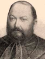Hertelendy József jogot végzett, és ügyvédi vizsgát tett Budapesten. Németország legrégibb gazdasági taninté-zetében, a hohenheimi mezőgazdasági akadémián is ok-levelet szezett.

1861-ben kinevezték nagykikindai szolgabírónak, de még az évben lemondott, mert nem akart a provizórium idején (1861-67) állást vállalni. A kiegyezés után tüne-ményesen haladt előre a közigazgatási pályán. Előbb bánátkomlósi főszol-gabíró (1867), majd a nagykikindai törvényszék elnöke (1871), és végül Torontál megye főispánja lett (1874).

Csaknem tizennyolc éven át sziklaszilárdan állt a vármegye élén, mivel a miniszterelnök és a miniszterek teljes bizalmát élvezte. Tisza István min-den kérésének és megbízatásának készségesen eleget tett, (Lauka Gusztáv így került Nagybecskerekre). Hertelendy korában lett egységes a várme-gye, miután sor került mind a kikindai kiváltságos kerület, mind a határőr-vidék bekebelezésére. Rendezte a magánkézbe került, egykor megműve-letlen kincstári "überland" földek tulajdonjogát. Kormánybiztosként Dél-Magyarország védelmét irányította az 1876-1877. évi nagy árvizek idején, a *Felső-torontáli Ármentesítő és Belvízszabályozó Társulat* vezetőeként pedig nagyszabású árvédelmi munkákat kezdeményezett.

A nemzeti eszme térhódítását teljes erejével támogatta, különösen az is-kolákban. Az ő idejében építették fel az új megyeházat is, Lechner Ödön és Pártos Gyula tervei alapján (1885-1887). Ez időtájt (1883) telepítették a bukovinai csángókat, és ekkor vette fel Marienfeld a Hertelendyfalva ne-vet. Forrás: *Pallas Nagylexikon*

**Herzog József** (Zimony, 1859. február 19. - Lugos, 1915. május 26.) villamosmérnök.

A bécsi műegyetemen folytatott tanulmányai után 1883-tól a Ganz-gyár elektrotechnikai osztályának munkatársa volt. Zipernowsky Károly veze-tésével részt vett a transzformátorrendszer kidolgozásában és különböző váltakozó áramú villamos gépek tervezésében. Stark Lipóttal együtt alap-vető módszert *(ún. metszési módszert)* dolgozott ki a villamos vezetékek és a zárt vezetékhálózatok számítására. 1903-ban vált meg a Ganz-gyártól. Oklevelének megszerzése (Delft, 1907) után magánmérnöki irodát nyitott s elsősorban röntgentechnikai kutatásokkal foglalkozott. Fő magyar nyel-vű műve: *Az elektromos vezetékek számítása (Stark Lipóttal, 1890), *

Forrás: *Magyar életrajzi lexikon*

**Hetzel Henrik** (Ujsóvé 1875. augusztus 25. - Budapest, 1949. május 31.) állatorvos-doktor, egyetemi tanár.

Tanítóképzőt, majd állatorvosi tanfolyamot végzett, 1916-ban avatták állatorvos-doktorrá. Rövid ideig tanársegéd volt a budapesti állatorvosi főiskolán. 1907-1923 között Gödöllőn az ottani uralkodói uradalom állatorvosaként működött. Ezzel egyidőben járási állatorvos, vezette az állatorvos-tanhallgatók gyakorlati tanfolyamát is.

1912-ben Dániába utazhatott, hol megismerkedett a híres Jacob Albrechtsen prevenciós módszerével. Hazatérte után ennek eredmé-nyeként megindult az egészséges állományok rendszeres szűrővizsgálata és a meddőség elleni szervezett védekezés.

1918-ban megbízták a szülészetnek, mint önálló szakágnak az előadásával, tanszékvezetői és klinikaigazgatói tisztét is betöltötte, egészen az 1946-ban történt nyugalomba vonulásáig. Hetzel nevéhez fűződik az új szülé-szeti klinika létrehozása. Működése alatt az állatorvosi szülészet önálló tudománnyá vált, kutatómunkájának célpontja az ivari működést irányító neurohormonális viszonyok vizsgálata volt, a meddőség kór- és gyógyta-nának elismert kutatója. Forrás: *Magyar életrajzi lexikon*

**Hevesi** *Handler* **Ferenc** (Lugos, [1898](https://hu.wikipedia.org/wiki/1898).  [július 15.](https://hu.wikipedia.org/wiki/J%C3%BAlius_15.)  –  [Honolulu](https://hu.wikipedia.org/wiki/Honolulu),  1952. [már-cius 29.](https://hu.wikipedia.org/wiki/M%C3%A1rcius_29.)) főrabbi.

1912 és 1921 között az [Országos Rabbiképző Intézet](https://hu.wikipedia.org/wiki/Orsz%C3%A1gos_Rabbik%C3%A9pz%C5%91_%E2%80%93_Zsid%C3%B3_Egyetem) növendéke volt. 1921-ben írta doktori disszertációját, melynek címe a *Philosophiai elemek Száadja gáon arab bibliafordításaiban és kommentárjaiban* volt. 1922-ben rabbivá avatták, majd ugyanebben az évben megválasztották a székesfe-hérvári neológ hitközség főrabbijának.

1930-ban a [Dohány utcai zsinagóga](https://hu.wikipedia.org/wiki/Doh%C3%A1ny_utcai_zsinag%C3%B3ga) rabbijává, majd 1943-ban főrabbivá választották, az Országos Rabbiképző Intézetben is tanított. A háború alatt bujkált, majd a háborút követően a *Joint Distribution Committee* meghívá-sára körutat tett Angliában és Amerikában, hogy a magyar zsidóság szá-mára támogatást és segítséget szerezzen. Egy magyarországi barátja fi-gyelmeztetésére nem tért vissza Budapestre. Az USA-ban telepedett le, majd hamarosan Hawaiire költözött, ahol elvállalta a [honolului](https://hu.wikipedia.org/wiki/Honolulu) hitközség vezetését. Kiváló szónokként tartották számon.

Hittudományi munkái magyarul és héberül is megjelentek. Művei: *Phi-losophiai elemek Száadja gáon arab bibliafordításaiban és kommen-tárjaiban (1921), A Jelenések könyvéből (1924), A peszach hagáda fordítása (1924), Az ókor zsidó bölcselete.stb.* Források: *[Magyar zsidó lexikon](https://hu.wikipedia.org/wiki/Magyar_zsid%C3%B3_lexikon). 1929.*

Kézdisárfalvai és petőfalvai **Héya Zoltán **(Kevevára, 1895. február 2. -

Erie, 1979. június 6.) festőművész, rajztanár.

A középiskoláit Lugoson és Szegeden végezte, a Képzőművészeti Főis-kolán Révész Imre tanítványa volt. Az első világháború alatt, 1915-ben be-hívták katonának, hol 1916 júniusában a Bruszilov-offenzíva idején hadi-fogságba esett. Közel hat évet töltött a Távol-Keleten, Habarovszkban és Vlagyivosztokban az ott állomásozó antant-előkelőségek és családtagjaik arcképeit festette. 1921-ben szabadult meg, majd a következő esztendőben Münchenben tanulhatott tovább.

Hazatérve a budapesti iparrajziskola tanárává nevezték ki. Miután önálló műtermet nyitott a Százados úti művésztelepen, neves arcképfestővé vált. Arcképei a korszak jeles személyiségeiről készültek, ezek közül kiemel-kednek; Horthy Miklós, Csernoch János, Serédi Jusztinián, József főher-ceg stb. arcképei. Műveit a *Keresztény Múzeum*, valamint a *Hadtörténeti Múzeum* őrzi.

A háború végén nyugatra távozott, majd az 1950-es évektől Erie-ben (Pa. USA) a Villa Maria főiskola tanára és a művészeti kar dékánja. Az USA-ban főként egyházi szónokokról készített arcképeket; John Mark Gan-non püspök portréja Mary Doloretta Thorn portréja, 1967.

Forrás: *Magyar Katolikus Lexikon*

**Hidvégi János** (Csonoplya, 1895. november 22. - Budapest, 1969. de-cember 22.) orvos, fogorvos.

1921-ben szerezte meg orvosi oklevelét a budapesti orvosi karon, majd fogorvosi és tisztiorvosi vizsgát tett (1922). 1921-1939 között körorvos volt a Baranya megyei Vajszlón. Népesedéspolitikával foglalkozott, baráti kapcsolatban állt Bajcsy-Zsilinszky Endrével és Kodolányi Jánossal is. Jelentős falukutató tevékenységet folytatott, a *Hulló Magyarság* c. köny-véért 1938-ban állásvesztésre ítélték. Az 1920-as-1930-as évekre már az *Ormánságban* kialakult egy sajátos egykés felfogás is: ha meddő marad az asszony, akkor sajnálják, ha viszont kettőnél több gyermeke születik, ak-kor már „erkölcstelennek” tartják.  A mű nagy politikai vihart kavart, könyve megjelenése után rövid ideig munkanélküli volt, majd két eszten-deig a *Magyar Nemzetbiológiai Intézet Népszaporodási Osztályának* előa-dója lett, három évig pedig Komáromban tiszti főorvosként dolgozott.

A második világháborút követően külömböző minisztériumi állásokat töl-tött be, majd a hatvanas években a *Fővárosi Közegészségügyi és Járvány-ügyi Állomás* (KÖJÁL) osztályvezető főorvosa volt.

Forrás: *Magyar életrajzi lexikon*. *Magyar orvoséletrajzi lexikon*

**Holló** *Herzl* **Gyula** (Temesvár, 1890. július 3. - New York, 1973. július 20.) orvos, belgyógyász, egyetemi tanár.

1913-ban szerezte meg orvosi oklevelét a budapesti orvosi karon. 1914-1918-ban katonaorvos volt, 1918-1939 között a budapesti belgyógyászati klinika tanársegédje. 1939-ben az USA-ban telepedett le, a Goldwater Memo­rial Hospital belgyógyász főorvosa lett, egyetemi tanár (1954).

A Holló-próba diagnosztikai segédeszköz megszerkesztője, a szervezet savbázis egyensúlyának vizsgálatára, és az alveolaris CO2 meghatáro-zására kidolgozott módszerét széles körben használták. A tbc-megbetege-dések diagnosztikájával és kórtanával foglalkozott.

Számos neves személyiség (Bartók Béla, Kosztolányi Dezső, Füst Milán, Karinthy Frigyes, Neumann János, Szigeti József stb.) orvosa.

Főbb művei: *Hogyan kezdődik a tüdővész (1927), A tüdő és mellhártya betegségei (1928), A gümőkór (1930), Therapie der Tubercu­lose (1937).*

Forrás: *Magyar életrajzi lexikon*

**Holló Mária** (Temeskutas, 1919. július 6. - Szeged, 1969. december 29.) orvos, bőrgyógyász.

1943-ban szerzett orvosi oklevelet a szegedi orvosi karon, majd mindvégig a szegedi bőr- és nemikórtani intézet munkatársa: gyakornok (1943-1947), tanársegéd (1947-1950), adjunktus (1950-1963), egyetemi docens (1963-1969). Kísérletes bőrgyógyászattal, bőrgyógyászati diagnosztikával, tri-chológiával (hajgyógyászat) foglalkozott. Jelentős megállapításokat tett az enzimek és a szexuálhormonok dermatológiai hatásának vizsgálata és a carci­nogenezis kutatása vonatkozásában. Forrás: *Névpont 2020*

Gertenyesi **Hollóssy József** (Gertenyes, 1825. Szeptember 17- Buziás, 1892, január 2.) 48-as honvéd tiszt.

Tüzérségi iskolát végezvén, 1843-ban tisztjelöltként a 2. Hannover huszár-ezredbe lépett. Ezredével 1848 júniusában a Délvidéken kitört szerb fel-kelés leverésére vezényelték. A tavaszi hadjáratot századkapitányként küz-dötte végig. 1849 nyarán gróf Vécsey Károly tábornoknak, a bánsági had-test parancsnokának a segédtisztje lett.

A világosi fegyverletételt követően az aradi hadbíróság golyó általi halálra ítélte, melyet azonban Haynau 16 év várfogságra változtatott. (A hagyo-mány szerint a bresciai hóhér szívét Lonovicsné, Hollóssy Kornélia kö-nyörgése indította meg.) Végül a 16 évből is csak három lett, 1852-ben ke-gyelmet kapott, majd a kiegyezés után Temes megye szolgabírájává vá-lasztották, majd a temesvári takarékpénztár igazgatója lett.

Forrás: *Bona Gábor: Az 1848/49-es szabadságharc tisztikara*

**Horger Antal** (Lugos, [1872](http://hu.wikipedia.org/wiki/1872). [május 28.](http://hu.wikipedia.org/wiki/M%C3%A1jus_28.) - Budapest, 1946. április 14.) nyel-vész, egyetemi tanár, az MTA tagja.

A középiskolát Lugoson végezte, majd Budapesten böl-csészetet tanult. Mint magyar-német szakos középiskolai tanár doktori oklevelet is szerzett. A brassói állami főreál-iskolában kezdte tanári pályafutását, 1922-től a szegedi egyetemen a magyar nyelv tanszékvezető tanára, idővel a bölcsészeti kar dékánja lett. Tagja volt a *Magyar Nyelv-tudományi Társaságnak,* valamint a *Helsingforsi Finn-ugor Társaságnak*. Erdély visszatértekor 1940-től a szegedi testvéregye-tem a kolozsvári egyetemen a magyar nyelvészet nyilvános rendes tanára. Kutatási területévé vált a magyar hangtörténet, a szófejtések és a székely nyelvjárás vizsgálata.

Nevéhez fűződik az első magyar nyelvjárási térkép is. Ma is a nyelvtu-domány alapműveinek számítanak, *A* *magyar igeragozás története,* illetve *A magyar szavak története* vagy *Az általános fonetika* című munkái. Neve egy 1925-ben történt incidens miatt ismert leginkább, amikor is a Szegedi Tudományegyetem professzoraként a Szegedi *Új Nemzedék* című lap vasárnapi számában megjelent kritikák hatására, magához hívatta József Attilát és a *Tiszta szívvel* című verse miatt kizárta az egyetem hallgatói közül. Forrás: *Magyar Életrajzi Lexikon 1000-1990;*

**Horn Béla** (Apatin, 1902. május 24. - Budapest, 1983. május 10.) szülész-nőgyógyász, egyetemi tanár.

A zombori állami főgimnáziumban érettségizett. A budapesti egyetemen orvosi karán, 1928-ban általános orvosi oklevelet szerzett.

1930-ban szülész-nőgyógyász szakképesítéssel a *Rókus kórház* szülő és nőbeteg osztályán segédorvos. 1933 áprilisától az *I. sz. Női Klinika* orvosa, ott gyógyított élete végéig. 1936-38 között a *Magyar Iparművészeti Fő-iskolán* az egészségtan előadó tanára. 1936-1946 között a Pázmány Péter Tudományegyetem, illetve a (BOTE) Budapesti Orvostudományi Egye-tem tanársegéde. 1946-1950 között az egyetem adjunktusa, és a 1951-től nyugdíba vonulásáig a Klinika igazgatója.

“ Nevéhez fűződik a szülés utáni méhszájvarrás magyarországi bevezeté-se. Új, nemzetközileg is elismert módszert dolgozott ki (Horn-féle műtét) a méhnyakrák és a szeméremtest bőrelváltozásai műtéti megoldására.

Az első magyarországi szülészeti toxikózis-kutató laboratórium és med-dőség-vizsgáló osztály megszervezője.” *A Société Française Gynécologie* tagja (1957).

Forrás: *Magyar Életrajzi Lexikon. História –Tudósnaptár*

**Horváth Béla** (Zsablya, 1879 - Budapest, 1923. június 22.) vegyész-mérnök.

Főiskolai tanulmányait a bécsi, zürichi és a karlsruhei egyetemeken vé-gezte. 1904-ben az állatorvosi főiskolán nyert magántanári ké-pesítést. A budapesti egyetem *Élet- és Kórvegytani Intézete* tanársegéde (1903-1904), az elemző kémia tárgykörben magántanári képesítést szerzett (1915). A budapesti *Állatorvosi Főiskola Vegytani Intézete* tanársegéde (1904-1923) és magántanára (1915-1923).

1909-1918 között a *Földtani Intézet* kőzettani laboratóriumában geológus vegyész, utóbb a talajkémiai laboratóriumot vezette. A magyar talajgeo-kémiai kutatások egyik elindítójaként alapvetően új eredményeket ért el a Balaton vidéki kőzetek kémiai elemzése terén, az elsők között sikerült meghatároznia a talaj mangán- és szilícium-tartalmát.

Forrás: *Magyar életrajzi lexikon *

**Hubay** *Huber* **Károly** (Varjas, 1828. július 1. - [Budapest](https://hu.wikipedia.org/wiki/Budapest), [1885](https://hu.wikipedia.org/wiki/1885). decem-ber 20.) karmester, zeneszerző, hegedűművész. Hubay Károly  zenetör-ténész édesapja.

Mivel tízéves korában megtanult hegedülni, a szülőfalu-jához közeli [Arad](http://hu.wikipedia.org/wiki/Arad) konzervatóriumban járatták.

1844-től a [*Nemzeti Színház*](http://hu.wikipedia.org/wiki/Nemzeti_Sz%C3%ADnh%C3%A1z) zenekarának hegedűse, majd 1851/52-ben a *bécsi Opera* zenekarának concertmestere.

Visszatérve a *Nemzeti Színházba*, a zenekar vezetője, majd 1862-től 1871-ig [Erkel Ferenc](http://hu.wikipedia.org/wiki/Erkel_Ferenc) mellett annak másod-karmestere.

Házában a Kerepesi (ma Rákóczi) út 13. alatti bérház 2. emeletén (itt lakott Erkel Ferenc) számos híres muzsikus megfordult, többek között Liszt Ferenc, Richard Wagner, Camille Saint-Saëns és Goldmark Károly. A ház-ban - hol komoly sakk csaták is lezajlottak - ismerkedett meg Hubay, Wag-ner zenéjével. Hubay atyja úgy beszélt róla, mint a zene megváltójáróll”. Ennek hatására 1866-ban betanította a *Lohengrint* és a *Tannhäusert*, mely-lyel meghonosította [Richard Wagner](http://hu.wikipedia.org/wiki/Richard_Wagner) operáit.

1856-ban hegedűművészként adott koncerteket, majd 1857-ben létrehozott egy vonósnégyestársaságot. A [*Nemzeti Dalkörnek*](http://hu.wikipedia.org/w/index.php?title=Nemzeti_Dalk%C3%B6r&action=edit&redlink=1), illetve az országos *Magyar Daláregyesületnek* volt a karnagya. 1852-től 1885-ig volt hegedű-tanár a *Nemzeti Zenedében* és a *Zeneakadémián*. Többnyire hangszeres és vokális zeneműveket írt. Fontosabb művei: *Hegedűtan a budapesti zene-dében való tanításra (1853), Székely leány (1858), A víg cimborák (1863), A király csókja (1875), Udvari bál (1882). *

Forrás: *[Magyar színházművészeti lexikon.](http://mek.oszk.hu/02100/02139/html/sz10/352.html)  1994. *

**Huber Lipót** ([Zombor](http://hu.wikipedia.org/wiki/Zombor), [1861](http://hu.wikipedia.org/wiki/1861). [október 23.](http://hu.wikipedia.org/wiki/Okt%C3%B3ber_23.) - [Kalocsa](http://hu.wikipedia.org/wiki/Kalocsa), [1946](http://hu.wikipedia.org/wiki/1946). [március 7.](http://hu.wikipedia.org/wiki/M%C3%A1rcius_7.)) katolikus pap, teológus.

Teológiát Kalocsán és a bécsi Pázmáneumban hallgatott.

1885. július 18-án Bécsben szentelték pappá.

1887. szeptember 14-étől került Kalocsára, mint érseki iktató és levéltáros. 1898-től főszentszéki ülnök, 1888-1917 között a nagyszeminárium Ó- és Újszövetség és ta-nulmányi felügyelője.

1903-tól zsinati vizsgáló, egyben a kalocsai tanítóképző német tanára, 1907-től 1912-ig pedig az intézmény igazgatója. A század-fordulón a [*Budapesti Filológiai Társaság*](http://hu.wikipedia.org/w/index.php?title=Budapesti_Filol%C3%B3giai_T%C3%A1rsas%C3%A1g&action=edit&redlink=1) és a [*Szent István Társulat*](http://hu.wikipedia.org/wiki/Szent_Istv%C3%A1n_T%C3%A1rsulat) tudo-mányos és irodalmi osztályának tagja. 1921-ben Szent Gergelyről nevezett címzetes kalocsai apát, 1927-ben a nagyszeminárium igazgatója.

1941-től provicarius (érseki helynök), azaz az érsek állandó helyettese, a nagyszeminárium prodirektora, kánonjogi teológus. Főleg a bibliai kor-szak utáni zsidóság, a rabbinizmus történetével, vallási, vallásjogi, kultur-történeti kérdéseivel foglalkozott.

Forrás: *Magyar Katolikus Lexikon,* [*Révai nagy lexikona*](https://hu.wikipedia.org/wiki/R%C3%A9vai_nagy_lexikona)

**Huszár Géza** (Stájerlakanina, 1895. július 25. - Budapest, 1965. február 21.) matematikus, egyetemi tanár.

1913-ban a lugosi gimnáziumban érettségizett. A buda-pesti Pázmány Péter Tudományegyetemen szerzett mate-matika-fizika szakos középiskolai tanári oklevelet.

1920-26 között a budapesti Bocskai István Katonai Reál-iskola nevelőintézetének tanára. 1926-tól 1930-ig tanár-segéd, később adjunktus (1926-1939) a tudományegye-tem Közgazdaságtudományi Karán. 1935-ben szerzett magántanári képesítést a határozott lejáratú és a biztosítási járadékok mate-matikája tárgykörből.

1935-1939 között a Műszaki és Gazdaságtudományi Egyetem Kereskedel-mi és Politikai Számtan és Biztosítási Matematika Tanszékének magán-tanára. 1940-1948 között a biztosítási matematika ny. rk. majd ny. r. taná-ra. 1948-1961 között a Közgazdaságtudományi Egyetem gazdaságmate-matikai tanszékének tanszékvezető tanára. 1959-től haláláig az Állami Biztosítónál, biztosításmatematikai kérdésekkel foglalkozott.

A járadékszámítás, a biztosítási számítások és az interpoláció-számítás problémáinak kutatója és a biztosítási matematika európai hírű tudósának számított. A  *Magyar Biztosítástudományi Szemle* főszerkesztője volt.

Forrás: *Magyar életrajzi lexikon.* *História - Tudósnaptár*

**I, J**

**Illy Ferenc** *Francesco Illy* (Temesvár, [1892](https://hu.wikipedia.org/wiki/1892). október 7. – Trieszt, [1956](https://hu.wikipedia.org/wiki/1956). 

[október 22.](https://hu.wikipedia.org/wiki/Okt%C3%B3ber_22.)) üzletember, az olasz presszókávé atyja.

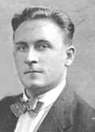A Temesvári Piarista Gimnáziumban tanult. 1914-ben be-sorozták az osztrák-magyar hadseregbe, részt vett [Galí-ciában](https://hu.wikipedia.org/wiki/Gal%C3%ADcia) kezdődő [kraśniki](https://hu.wikipedia.org/wiki/Kra%C5%9Bniki_csata) csatában.  A háború további idejét az olasz fronton töltötte, itt részt vett az [isonzói csatákban](https://hu.wikipedia.org/wiki/Isonz%C3%B3i_csat%C3%A1k).

A háború után Triesztben maradt, megnősült. Itt kakaó -, valamint ká[vékereskedéssel](https://hu.wikipedia.org/wiki/K%C3%A1v%C3%A9)- és pörköléssel foglalkozó cé-geknél dolgozott. Feltalálta a frissen pörkölt kávé illatát és aromáját megőrző vákuum (légmentes) csomagolást, amire speciális dobo-zokat használt. Illy Ferenc módszerének titka az volt, hogy nagy nyomás alatt a kávéban levő oxigént nitrogénnel helyettesítette, így a frissen pör-költ kávé eredeti állapotában konzerválódott.

1933-ban Illy megalapította az *Illycaffè*t, majd 1935-ben *Illetta* névvel levédte találmányát, a világ első automata eszpresszó kávégépét, ami egy forró gőzzel működő kávéautomata volt. Az Illetta a mai korszerű presszó-gépek elődjének tekinthető, mellyel az olasz presszókávét készítik. [2013](https://hu.wikipedia.org/wiki/2013)-ban posztumusz Temesvár díszpolgára lett. Forrás: *Temesváriak  *

**Iván Szilárd** (Újarad, [1912](http://hu.wikipedia.org/wiki/1912). [május 8.](http://hu.wikipedia.org/wiki/M%C3%A1jus_8.) - [Budapest](http://hu.wikipedia.org/wiki/Budapest), [1988](http://hu.wikipedia.org/wiki/1988). [augusztus 7.](http://hu.wikipedia.org/wiki/Augusztus_7.)) festő, grafikus, főiskolai tanár.

Az [Iparművészeti Főiskola](http://hu.wikipedia.org/wiki/Iparm%C5%B1v%C3%A9szeti_F%C5%91iskola) grafikaszakos hallgatója volt egy éven át, majd szabadiskolákban képezte magát [Aba-Novák Vilmos](http://hu.wikipedia.org/wiki/Aba-Nov%C3%A1k_Vilmos), [Iványi-Grünwald Béla](http://hu.wikipedia.org/wiki/Iv%C3%A1nyi-Gr%C3%BCnwald_B%C3%A9la) és [Szőnyi István](http://hu.wikipedia.org/wiki/Sz%C5%91nyi_Istv%C3%A1n) irányításával. 1930-ban a Képzőművészeti Főisko-lára került, ahol [Réti István](http://hu.wikipedia.org/wiki/R%C3%A9ti_Istv%C3%A1n_%28fest%C5%91m%C5%B1v%C3%A9sz%29) volt a mestere. 1937-ben szerzett diplomát. Ösztöndíjasként 1935 - 1936-ban Rómában, majd 1940-1944 között Nagy-bányán dolgozott.

A második világháború után több nagyszabású állami megrendelést kapott muráliákra. (pl. [csepeli](http://hu.wikipedia.org/wiki/Budapest_XXI._ker%C3%BClete) rendelőintézet, secco, 1949; békéscsabai rendelő-intézet, [sgraffito](http://hu.wikipedia.org/wiki/Sgraffito), 1959; budapesti Kerepesi úti lakótelep, mozaikok, 1960; [Országház](http://hu.wikipedia.org/wiki/Orsz%C3%A1gh%C3%A1z): az [Elnöki Tanács](http://hu.wikipedia.org/wiki/Eln%C3%B6ki_Tan%C3%A1cs) fogadóterme, secco, 1964, - ez utóbbi meg-semmisült). Az 1960-as években tagja volt a [Kilencek](http://hu.wikipedia.org/wiki/Kilencek) nevű képzőművész csoportnak. 1969 és 1980 között a [Képzőművűvészeti Főiskola](http://hu.wikipedia.org/w/index.php?title=K%C3%A9pz%C5%91m%C5%B1v%C5%B1v%C3%A9szeti_F%C5%91iskola&action=edit&redlink=1) tanára volt. [Munkácsy-díjas](http://hu.wikipedia.org/wiki/Munk%C3%A1csy-d%C3%ADj) (1953). Képei vannak az *MNG*, a [*Kiscelli Múzeum*](http://hu.wikipedia.org/wiki/Kiscelli_M%C3%BAzeum), az [*Irodalmi Múzeum*](http://hu.wikipedia.org/w/index.php?title=Irodalmi_M%C3%BAzeum&action=edit&redlink=1) a [*Hadtörténeti Múzeum*](http://hu.wikipedia.org/wiki/Hadt%C3%B6rt%C3%A9neti_M%C3%BAzeum), a [*Pécsi Képtá*r](http://hu.wikipedia.org/w/index.php?title=P%C3%A9csi_K%C3%A9pt%C3%A1r&action=edit&redlink=1), a [*Székesfehér-vári Képtár*](http://hu.wikipedia.org/w/index.php?title=Sz%C3%A9kesfeh%C3%A9rv%C3%A1ri_K%C3%A9pt%C3%A1r&action=edit&redlink=1) tulajdonában, valamint külföldi magángyűjteményekben.

Forrás: *[Modern magyar festészet 1900-1945](http://www.piktura.eoldal.hu/). Magyar művészeti kislexikon kezdetektől napjainkig*

**Iványi** *Ivanovszky* **István** (Lugos, [1845](https://hu.wikipedia.org/wiki/1845). [december 17.](https://hu.wikipedia.org/wiki/December_17.) – [Szabadka](https://hu.wikipedia.org/wiki/Szabadka), [1917](https://hu.wikipedia.org/wiki/1917). 

[július 7.](https://hu.wikipedia.org/wiki/J%C3%BAlius_7.)) tanár, történész.

A gimnáziumot Lugoson, [Temesvárt](https://hu.wikipedia.org/wiki/Temesv%C3%A1r), [Kecskeméten](https://hu.wikipedia.org/wiki/Kecskem%C3%A9t) és [Szegeden](https://hu.wikipedia.org/wiki/Szeged) végezte. 1862-ben belépett a piarista rendbe, 1866-tól tanított Szegeden,  [Nagyka-nizsán](https://hu.wikipedia.org/wiki/Nagykanizsa),  Pes[ten](https://hu.wikipedia.org/wiki/Pest_(t%C3%B6rt%C3%A9nelmi_telep%C3%BCl%C3%A9s)) és [Nyitrán](https://hu.wikipedia.org/wiki/Nyitrai_Piarista_Gimn%C3%A1zium). 1875-ben kilépett a rendből, ekkor Szabadkán választották meg gimnáziumi tanárnak. 1881-től a szabadkai evangélikus egyház ügyeit intézte, 1883–95 között felügyelője volt. A szabadkai *Nem-zeti Kaszinó* könyvtárosa volt 1895-ig. 1883-ban a [*Bács-Bodrog Várme-gyei Történelmi Társulat*](https://hu.wikipedia.org/wiki/B%C3%A1cs-Bodrog_V%C3%A1rmegyei_T%C3%B6rt%C3%A9nelmi_T%C3%A1rsulat) egyik alapítója, illetve 1883–1896 között alelnö-ke. A *városi közkönyvtár* alapítója és első könyvtárosa 1892-től.

Főbb művei: *Magyar olvasókönyv a középtanodák 1-2. o. számára (1876), Bács-Bodrogh vármegyének történeti irodalma (1881), [A tiszai határőr-vidék (1686–1750](http://real-eod.mtak.hu/6471/).), (1885), Szabadka és vidéke 1848-49-ben (1886), [Szabadka szabad királyi város története, I.-II.](http://real-eod.mtak.hu/8397/), (1886, 1892), Az uj Bodrog vármegye (1686–1806), (1887), [Futak](https://hu.wikipedia.org/wiki/Futak) és futaki uradalom történelmi helyrajza (1895), Bírálatok Szabadka város történetéről és Bács-vármegye helynévtáráról (1904), [Lugos rendezett tanácsú város története](http://real-eod.mtak.hu/6437/) (1907)…*

Források: *Iványi István: Visszaemlékezéseim életem folyására, (önéletrajz)* 1974.

**Jakobey Károly** (Kula, [1826](http://hu.wikipedia.org/wiki/1826). [augusztus 17.](http://hu.wikipedia.org/wiki/Augusztus_17.) - Budapest, 1891. július 14.) festő. Mint tehetséges fiatal a pesten működő Első Magyar Festészeti Akadémián tanult, hol a velencei származású Marastoni Jakab keze alatt tökélete-síthette technikáját. 1845-ben a bécsi akadémián tanult, majd Ferdinand Georg Waldmüller szabadiskolájába járt. A szabadságharc leverését kö-vető esztendőben költözött Pestre, ahol alkotásaival a *Pesti Műegylet* tárla-tain rendszeresen szerepelt. Munkái között megtalálhatóak történelmi arc-képek, megrendelésre készített portrék, állatábrázolások, allegorikus- és tájképek, csendéletek, valamint népies művek. Számtalan oltár- és falképet készített, így tovább öregbítette hírnevét.

Egyik alapítója, valamint egyben tagja is volt az 1861-ben létrehozott *Or-szágos Magyar Képzőművészeti Társulatnak*. Jakobey Károly talán leghí-resebb képe a *Táncsics a börtönben* (1848) c festménye. Jelentősebb port-réi: a szabadságharcban részt vett *Muraközy J.* honvéd (1850), *Liszt Ferenc* (1859), *gróf* *Széchenyi István* (1860) és *gróf Károlyi Lajos* (1864) stb. arcképe. *Romantikus táj híddal, Tájkép romokkal* című képeit, valamint felesége arcképét a Magyar Nemzeti Galéria őrzi.

Forrás: *Modern magyar festészet 1900-1945. Magyar művészeti kislexikon kezdetektől napjainkig*

**Jeszenszky Dezső** (Nagyszentmiklós, 1864. március 19. – Igló, 1917. de-cember 2.) színész, igazgató.

Apja ügyvéd volt, szüleit korán elvesztette. Szarvason járt gimnáziumba megszakításokkal, mert közben a pozsonyi hadapródiskolában is tanult há-rom hónapig. Dolgozott a chemnitzi gazdasági gépgyárban is, majd 1882-ben leérettségizett. Három napra rá  [Orosházán](https://hu.wikipedia.org/wiki/Orosh%C3%A1za), a minden vagyonát színi-gazgatói munkájára fordítottaó [Szegedi Mihálynál](https://hu.wikipedia.org/wiki/Szegedi_Mih%C3%A1ly_(sz%C3%ADnigazgat%C3%B3)) lett színész (ki elborult elmével a lipótmezei tébolydában hunyt el).

Társulatával az 1880-as években megfordult a [Szepességben](https://hu.wikipedia.org/wiki/Szepes_v%C3%A1rmegye), Iglón és [Lő-csén](https://hu.wikipedia.org/wiki/L%C5%91cse). Volt súgó és színházi titkár is. 1888-ban lett a [besztercebányai](https://hu.wikipedia.org/wiki/Beszterceb%C3%A1nya) szín-ház igazgatója, majd [Magyaróváron](https://hu.wikipedia.org/wiki/Mosonmagyar%C3%B3v%C3%A1r), [1898](https://hu.wikipedia.org/wiki/1898)–[1900](https://hu.wikipedia.org/wiki/1900) [Selmecbányán](https://hu.wikipedia.org/wiki/Selmecb%C3%A1nya) és Gyön-gyösön is társulatot vezetett. 1909. július 15-én ünnepelte Gölnicbányán a

*Rang és módban* színészi működésének 25 éves jubileumát. 1913. július 1-jén vonult nyugdíjba.

Rendszeresen írt a helyi lapokba tárcákat, verseket, elbeszéléseket. A *Vidéki Hírlapírók Országos Szövetségének* tagja volt. Könyve:*Vándoruta-mon,* Szepesi Lapok, Igló, [1912](https://hu.wikipedia.org/wiki/1912).

Források: *[Magyar színházművészeti lexikon.](http://mek.oszk.hu/02100/02139/html/sz12/85.html)  [Magyar Színművészeti Lexi-kon.](http://mek.oszk.hu/08700/08756/html/II/szin_II.0433.pdf) 1929.*

Id. kisjeszeni **Jeszenszky Károly** ([Liliomos](https://hu.wikipedia.org/wiki/Liliomos), [1815](https://hu.wikipedia.org/wiki/1815). [október 10.](https://hu.wikipedia.org/wiki/Okt%C3%B3ber_10.) – [Mező-berény](https://hu.wikipedia.org/wiki/Mez%C5%91ber%C3%A9ny) [1898](https://hu.wikipedia.org/wiki/1898). [szeptember 5.](https://hu.wikipedia.org/wiki/Szeptember_5.)) [evangélikus](https://hu.wikipedia.org/wiki/Evang%C3%A9likus_kereszt%C3%A9nys%C3%A9g) [lelkész](https://hu.wikipedia.org/wiki/Lelkip%C3%A1sztor), helytörténész.

Kisjeszeni [Jeszenszky Sámuel](https://hu.wikipedia.org/w/index.php?title=Jeszenszky_S%C3%A1muel&action=edit&redlink=1) liliomosi evangélikus lel-kész és nagyjeszeni [Jeszenszky Katalin](https://hu.wikipedia.org/w/index.php?title=Jeszenszky_Katalin&action=edit&redlink=1)  fia. Iskoláit Li-

[liomoson](https://hu.wikipedia.org/wiki/Liliomos), [Újverbászon](https://hu.wikipedia.org/wiki/Verb%C3%A1sz),  [Mezőberényben](https://hu.wikipedia.org/wiki/Mez%C5%91ber%C3%A9ny) (esperességi la-tin gimnázium),  [Selmecbányán](https://hu.wikipedia.org/wiki/Selmecb%C3%A1nya), végül [Pozsonyban](https://hu.wikipedia.org/wiki/Pozsony) vé-gezte. [1838](https://hu.wikipedia.org/wiki/1838)-ban iratkozott be a jénai egyetemre, de egy év múlva hazatért [Aszódon](https://hu.wikipedia.org/wiki/Asz%C3%B3d) lett segédlelkész. [1839](https://hu.wikipedia.org/wiki/1839)-ben [Sel-mecbányán](https://hu.wikipedia.org/wiki/Selmecb%C3%A1nya) avatták lelkésszé. 

[1840](https://hu.wikipedia.org/wiki/1840) augusztusában került  segédlelkésznek a mezőberényi szlovák evan-gélikus gyülekezetbe. [1841](https://hu.wikipedia.org/wiki/1841)-től [1875](https://hu.wikipedia.org/wiki/1875)-ig egyedül, [187](https://hu.wikipedia.org/wiki/1875)[5-től](https://hu.wikipedia.org/wiki/Augusztus_15.)  [1890](https://hu.wikipedia.org/wiki/1890)-[ig](https://hu.wikipedia.org/wiki/Okt%C3%B3ber_26.) fiával, 

[ifj. Jeszenszky Károllyal](https://hu.wikipedia.org/wiki/Jeszenszky_K%C3%A1roly_(lelk%C3%A9sz,_1851%E2%80%931927)) együtt szolgált [1890](https://hu.wikipedia.org/wiki/1890)-es nyugdíjba vonulásáig.

Megírta (szlovákul) a mezőberényi község és evangélikus egyház története (Arad, 1861.) Az 50 évi lelkészi szolgálat elismerésére, [1959](https://hu.wikipedia.org/wiki/1959)-ben a hívek emléktáblát helyeztek el a templom sekrestyéjében.

Utcát neveztek el róla Mezőberényben utcát neveztek el róla, valamint a templom előtti parkban, [1997](https://hu.wikipedia.org/wiki/1997)-ben avatták fel bronz mellszobrát.

Forrás: [Zoványi Jenő: *Magyarországi protestáns egyháztörténeti lexikon*](http://digit.drk.hu/?m=lib&c=7&book=3)

**Juhász Árpád** ([Zombor](http://hu.wikipedia.org/wiki/Zombor), [1863](http://hu.wikipedia.org/wiki/1863). [június 29.](http://hu.wikipedia.org/wiki/J%C3%BAnius_29.) - Budapest, 1914. május 30.) festő, iparművész.

Biztos hivatalnoki pályáját áldozta fel a képzőművészek bizonytalan kenyerével. 1890-ben elvégezte a budapesti Mintarajziskolát, ahol Lotz Károly volt a mestere.

1905-ben Gödöllőre költözött, és az ott megalakult *gö-döllői művésztelep* tagja lett. 1909-ben a gödöllői művé-szekkel közösen állított ki a *Nemzeti Szalonban*.

Munkásságában kiemelkednek a *matyó és az* *erdélyi* nép-viseletekről, népi díszítőművészeti motívumokról készített, néprajzi vonat-kozású tusrajzai és akvarelljei. Ilyen szellemiségű falképeket készített, a budapesti és soproni iskolák számára.

Ő illusztrálta többek között Malonyay Dezső többkötetes népművészeti vállalkozását, de Kőrösi László egyiptomi művészettörténeti könyvét is. Jelentősek tájképei és szecessziós meseillusztrációi is, műveiben rengeteg formát, motivumot mentett meg az utókornak. Munkáinak egy részét a gö-döllői *Helytörténeti Gyűjteményben* és a *Magyar Nemzeti Galériában* őr-zik, de művei budapesti és soproni iskolák falfestményein is fennmaradtak. Forrás: *Modern magyar festészet 1900-1945. Magyar művészeti kislexikon kezdetektől napjainkig*

Id. **Juvancz Iréneusz** (Pancsova, 1882. április18. – [Budapest, 1950.](https://hu.wikipedia.org/wiki/Budapest) no-vember 11.) matematikus.

Középfokú tanulmányai idején, az országos középiskolai matematikai versenyen (1900. Eötvös-verseny) első díjat nyert. 1904-ben szerzett mate-matika–fizika szakos középiskolai tanári oklevelet. 1904–1919 között több budapesti mnázium r. tanára, tanított ábrázoló geometriát, fizikai földrajzot és természettant. A *Galilei Kör* vezetőségi tagja volt, így a proletárdik-tatúra bukása után fegyelmivel eltávolították és állásvesztésre ítélték.

A két világháború között biztosítási matematikával foglalkozott, a nyug-díjbiztosítási statisztika elismert magyarországi tekintélye volt. A vesztett világháborút követően rehabilitálták, a Közgazdaságtudományi Egyete-men a biztosítási statisztika oktatója (1945–1950).

A 20. sz. elejének egyik jelentős matematikatanáraként alapvető munkás-ságot fejtett ki a matematikai oktatási módszerek fejlesztése terén. Mate-matika mellett ábrázoló geometriát, fizikai földrajzot és természettant is tanított, különösen híresek voltak természettani tanulmányi kirándulásai. Tanítványai között volt több világhírű fizikus-vegyész-irodalmár.

Források: *Magyar életrajzi lexicon, 1967. História – Tudósnaptár, név-pont.hu.*

**K**

Pukánszkyné **Kádár Jolán** (Temesvár, 1892. október 21. - Budapest, 1989. augusztus 11.) színháztörténész.

A Pázmány Péter Tudományegyetemen szerzett dokto-rátusa után, 1914-től a Nemzeti Múzeum könyvtárosa, majd az Országos Levéltár levéltárnoka volt, nyugdíjba vonulásáig (1944). 1914-ben jelent meg első munkája, a hazai színháztörténet egyik alapműve: *A budai és pesti német színház története 1812-ig* c. könyve.

Többéves levéltári kutatás eredménye *A Nemzeti Színház százéves törté-nete* c. kétkötetes munkája, olyan anyagot tartalmaz, amelynek eredetije az Országos Levéltár 1945-ös és 1956-os égésekor elpusztult. Könyvet írt a drámaíró Csokonai Vitéz Mihályról. Túl kilencvenedik évén lektorálta a Csokonai kritikai kiadás drámai kötetét. Számos szakcikke jelent meg hazai és külföldi folyóiratokban, évkönyvekben és lexikonokban. Férje Pukánszky Béla irodalomtörténész, egyetemi tanár, akadémikus volt.

Főbb művei: *A magyar népszínmű bécsi gyökerei (1930), A drámaíró Cso-konai Vitéz Mihály (1956), A színfalak között (Hegedüs Gézával és Staud Gézával, 1967), A Budai Népszínház története (1978) stb… *

Forrás: *Magyar életrajzi lexikon*

**Kalapsza János** (Óbecse, 1823. május 16. - USA, 1860 után) 1848-49-es honvédhuszár százados.

Honvédhuszárként szolgállta végig a szabadságharcot. A világosi fegyver-letételt követően (1849. augusztus 23-án) nem adta meg magát, hanem sokezer társához hasonlóan az emigrációt vállasztotta. Orsován keresztül a török birodalomba érkezett előbb [Viddinbe](https://hu.wikipedia.org/wiki/Vidin)n, majd [Sumlába](https://hu.wikipedia.org/wiki/Sumen)n internál-lták. Kezdetban Perczel Mór tábornokkal tartott, de miután az összekülöm-bözött Kossuth Lajossal, Kalapsza a kormányzó oldalára állt és követte azt a kisázsiai Kütahyába.

1851-ben Kossuthal Amerika utaztak, hogy ott találjanak segítségre a ma-gyar ügyhöz. A segítség csak elvi lehetett, így Kossuth visszatért Európá-ba, míg a szakmájához híven női lovagló iskolát nyitott Bostonban.

Miután letöltötte katonai szolgálatát, a vadnyugatra költözött, Utahban be-lépett Bringham Young mormon szektájába. 1860 októberében még látták Salt Lake City-ben, azonban ovábbi sorsa ismeretlen.

Önéletrajzi jegyzetei vannak a *Magyar Nemzeti Múzeum* levéltárában ta-lálhatók. Forrás: Szinnyei József: *Magyar írók élete és munkái*

**Kallós** *Klein* **János** ([Zsombolya](https://hu.wikipedia.org/wiki/Zsombolya), [1891](https://hu.wikipedia.org/wiki/1891). [október 24.](https://hu.wikipedia.org/wiki/Okt%C3%B3ber_24.) – [Budapest](https://hu.wikipedia.org/wiki/Budapest), [1970](https://hu.wikipedia.org/wiki/1970). jú-nius 16.) újságíró, szerkesztő.

1909-ben Budapesten érettségizett, majd 1916-ig az akkor meghatározó napilap, a Surányi József álltal vezetett [*Pesti Napló*](https://hu.wikipedia.org/wiki/Pesti_Napl%C3%B3) munkatársa volt.

1917 és 1921 között [*Az Újságnál*](https://hu.wikipedia.org/wiki/Az_%C3%9Ajs%C3%A1g) alkalmazták, hol egy szerkesztőségben dolgozhatott pl. a földijével Kenedi Gézával, valamint  a különc író, pub-licist [Kóbor Tamás](https://hu.wikipedia.org/wiki/K%C3%B3bor_Tam%C3%A1s_(%C3%ADr%C3%B3))sal, az írófejedelem [Herczeg Ferenc](https://hu.wikipedia.org/wiki/Herczeg_Ferenc_(%C3%ADr%C3%B3))cel és a kiváló köl-tő, műfordító [Kozma Andor](https://hu.wikipedia.org/wiki/Kozma_Andor)ral is.

1919-ben a kalandos életű Békessy Imre *A Munka* című kőnyomatos lapjá-ba írt cikkeket. A [Tanácsköztársaság](https://hu.wikipedia.org/wiki/Magyarorsz%C3%A1gi_Tan%C3%A1csk%C3%B6zt%C3%A1rsas%C3%A1g) kormányának megbízásából röpirato-kat szerkesztett, emiatt később támadások érték. 1921-ben megalapította a *Pesti Tőzsde* című lapot, és 1943-ig főszerkesztője volt. 1925-től a *Pénz-ügyi és Tőzsdei Kompasz*-t szerkesztette a lap megszűnéséig, 1943-ig.

1945 után részt vett az *Újságíró Szövetség* újjászervezésében. 1947–49-ben az újra megindult *Kompasz *szerkesztésében működött közre. 1948-ban a kisemberek érdekeit védő *Kis Újság *szerkesztője, 1949–50-ben a lovas újság a *Magyar* *Turf *felelős szerkesztője volt, majd újságíró a Napi- és Hetilapkiadó Nemzeti Vállalatnál. Írt zenei, színházi és képzőművészeti rovatok számára is cikkeket.

Művei: *Tudnivalók a gabonahatáridő-üzletről (1926), Nagybudapest ipa-ri, kereskedelmi és teljes szakmai címtára (1948).*

Források: *[Gulyás Pál](https://hu.wikipedia.org/wiki/Guly%C3%A1s_P%C3%A1l_(k%C3%B6nyvt%C3%A1ros)): [Magyar írók élete és munkái – új sorozat I–XIX](https://hu.wikipedia.org/wiki/Magyar_%C3%ADr%C3%B3k_%C3%A9lete_%C3%A9s_munk%C3%A1i_%E2%80%93_%C3%BAj_sorozat_(Guly%C3%A1s)).  1939–1944. Magyar életrajzi lexicon. 1981. [Magyar zsidó lexikon](https://hu.wikipedia.org/wiki/Magyar_zsid%C3%B3_lexikon). 1929.*

**Kalmár Antal** (Temesliget, 1853, augusztus 27. - ?) a magyar királyi posta- és távirda felügyelő.

A reáliskolákat Szegeden, Pesten és Budán végezte. 1873-ban Szegeden mint távíró-gyakornok lépett állami szolgálatba. A távírónál minden szak-vizsgát és a távírónak a postával történt egyesítése után a postatiszti vizsgát is letette. 1890-ben a posta- és távírótanfolyam gyakorlati távíró tanszé-kének segédtanárává neveztetett ki. 1892-ben posta-távírói főtiszt, 1895-ben felügyelő lett.

Szolgálati idejének nagy részét Budapesten a távíróműszaki osztálynál mint távíró-építésvezető töltötte, a postaés távirdatiszt-képző tanfolyam tanára volt. 1896-ban mint távíró-építési osztályvezető Kassára helyezték át. Cikkei a villamosság alkalmazásáról (névtelenül, álnévvel és neve alatt) 1880–1891-ig a Vasúti és Közlekedési Közlönyben jelentek meg.

Munkája: *A villamosság (1894)*. Forrás: *Szinnyei József: Magyar írók élete és munkái.* *Magyar Katolikus Lexikon*

**Kalmár Antal** (Zenta, 1857. június 6. -  Budapest, 1920. március 9.) új-

ságíró.

Jogi tanulmányai után szülővárosában igazgatási tisztviselő, árvaszéki ül-nök, majd polgármester. Később ügyvédi irodát nyitott. 1902-ben kiadta *Beksics Gusztáv történet- és közjogírása* c. tanulmányát, amelyért Kalmár Antalt királysértés címen 6 hónapi államfogházra ítélték. 1903-tól újság-író, a meginduló *A Nap* (!?) szerkesztőségébe lépett. Több közjogi tárgyú könyve jelent meg. *Ukrajna és Magyarország* c. tanulmányával 1920-ban, már halála után nyerte el a *Szemere-díjat*. Főmunkatársa volt a Nagy György által alapított köztársasági párti *Magyar Köztársaság* havi folyói-ratnak. Forrás: *Magyar életrajzi lexikon*

**Kalmár** **Endre***, Piar* (Szabadka, 1823. november 29. - Budapest, 1910. április 13.) költő, piarista tanár, tartományfőnök.

[Szegeden](https://hu.wikipedia.org/wiki/Szeged) a piaristáknál tanult, 184-ben lépett be a kegyestanítórendbe. Nyitrán majd Szentgyörgyön teológiát tanult. 1848-ban tett ünnepélyes fogadalmat, 1849-től tanított. 1862-ben Pestre helyezték a piarista főgim-náziumba, 1879-ben lett tartományfőnök és 1892-es lemondása után halá-láig rendfőnök. Rendfőnöksége alatt a kegyesrend több tanintézete lett nyolcosztályú főgimnáziummá kibővítve. Díszes új iskolaépületek emel-kedtek; Szegeden, Nagykárolyban, valamint a rózsahegyi főgimnázium új épülete. Forrás: *Szinnyei József: Magyar írók élete és munkái.* *Magyar Katolikus Lexikon*

**Kalmár Rózsa** (1887 Zenta, - 1979 Pécs) szinésznő, nőegyleti vezető.

Rákosi Szidi színésziskolájában sajátította el, a drámai hősnő karakter megformálásához szükséges tudnivalókat. 1915-ös vizsgaelőadásán nagy sikerrel Júliát alakította.

A színésziskola elvégzése után a kolozsvári, majd a buda-pesti *Nemzeti Színházban* szerződtették. Faluhelyi Ferenc jogásszal kötött házassága után, ki 1922-től a pécsi egye-tem professzora lett, Pécsre szerződött a Kürthy György vezette *Pécsi Nemzeti Színházba*. Csupán néhány éven keresztül élvezhette a pécsi közönség színészi játékát, a jómódú polgárasszonyok korabeli szokásának megfelelően aktív részesévé vált a város közéletének és a kari-tatív egyesületek munkájának. 1943-tól alelnöke volt a *Magyar Asszonyok Nemzeti Szövetsége* tanügyi szakosztályának. A római katolikus fiatalok lelki, vallási és erkölcsi hitéleti nevelésében, továbbá a rászorultak szociá-lis megsegítésében elért sikerei elismeréseként alapították Pécsett a *Kal-már Rózsa-díjat*. Forrás: *Magyar színházművészeti lexikon*

**Kanyurszky György** dr. (Nemesmilitics, 1853. március 10. - Visegrád, 1920. május 23.) orientalista, egyetemi tanár, egyházi író.

Kanyurszky György a teológiát a bécsi *Pázmáneumban* hallgata, pappá 1875-ben Kalocsán szentelték. A bécsi *Augustineum* intézetben 1877-ben avatták teológiai dok-torrá. A Mária Terézia álltal alapított keleti akadémián újarab és perzsa nyelvet tanult. Rövid ideig segédlelkész Szántón, 1878-ban Kalocsán segédtanár a *Férfitanító-Képezdében*, majd teológiai tanár a papnevelőben és vé-gül tanulmányi vezető a *Nagyszemináriumban*.

1882-től a budapesti egyetem teológiai karának rendkívüli, 1886 óta ren-des tanára, ahol a szír, káld és arab nyelveket tanította. A *Religióban* 1883-ban a külföldi egyházpolitikai és társadalmi rovatot vezette s egyéb cik-keket is írt a lapba; több folyóiratba és napilapba cikkeket és tanulmá-nyokat is írt. Megírta a klasszikus arab nyelv kézikönyvét (1882).

Költeményei a *Katholikus Hetilapban* és a *Kalocsai Néplapban* jelentek meg. Többekkel együtt 1883-1884-ben szerkesztette a budapesti *Katho-likus Theologiai Folyóiratot*. Forrás: *Szinnyei József: Magyar írók élete és munkái.* *Magyar Katolikus Lexikon*

**Karch Kristóf** (Beresztóc, 1877. november 24. - Mezőberény, 1955. áp-rilis 2.) üzemgazdász, egyetemi tanár, könyvszakértő.

A budapesti egyetem bölcsészettudományi karán tanári oklevelet, majd 1903-ban felsőkereskedelmi iskolai ta-nári oklevelet szerzett. 1917-ig a budapesti kereskedelmi főiskola (akadémia) tanára, majd 1920-ig a *Pénzintézeti Központ* főrevizora volt. 1920 után az egyetem köz-gazdaságtudományi karának tanáraként tevékenykedett. 1927-1928 között a budapesti egyetemen az általa meg-szervezett *Magángazdaságtani Intézet* igazgatója és a kar dékánja. Elnöke volt a *Törvényszéki Hites Könyvszakértők Orszá-gos Egyesületének.*

A kommunista hatalomátvétel után 1951-ben kitelepítették Mezőberény-be, és itt tölthette hátralevő életét. A vállalati gazdaságtan, mérlegtan és revízió szakirodalmának művelője volt. Számos szakmunkát írt.

Főbb művei: *Bankok üzemtana és számvitele. K. K. előadásai alapján (1923), Mérlegvizsgálat és bírálat (1924), Aranymérleg (1925), A rész-vénytársaságok kötelező revíziója (1928), A mérleg magángazdasági és köz-gazdasági vonatkozásai (1929), Magángazdasági tanszék és intézet (1931), A vásárpénztár. Monográfia. Ereky Istvánnal. (1934) stb*…

Forrás: *Magyar életrajzi lexikon*

**Károli** *Karl* **János** (Cservenka, 1842. június 13. - [Budapest](http://hu.wikipedia.org/wiki/Budapest), [1882](http://hu.wikipedia.org/wiki/1882). [január 25.](http://hu.wikipedia.org/wiki/Janu%C3%A1r_25.)) [ichthiológus](http://hu.wikipedia.org/wiki/Ichthiol%C3%B3gia), [herpetológus](http://hu.wikipedia.org/wiki/Herpetol%C3%B3gia), muzeológus.

A bécsi egyetem természettudományi karán ismerkedett meg az ichthiológia fogalmával. 1870-től a *Nemzeti Mú-zeum* természetrajzi osztályának segédőre. Ezzel egyidő-ben a budapesti evangélikus főgimnáziumban oktatott. 1876-tól a pesti egyetemen az ichthyológia és herpeto-lógia magántanára lett. 

A *Magyar Természettudományi Múzeum* állattárának halgyűjteményében, megtalálhatók gyűjtései. Főbb művei: *Triest és Fiume környékén tett állattani gyűjtésről (1873), A rovarok tanulmányozására szolgáló munkák (1877), A Duna halóriásai, A magyar halfauna egy új faja, Magyarország kigyóinak átnézete (1878), Magyarország amphibiái (1879), Magyarország kigyói (1882)…*Forrás: *A Pallas nagy lexikona *

Vitéz **Kasza Sándor** (Bácskossuthfalva, 1896. ? - Budapest, 1945. február 3.?) vadászpilóta.

A világháború kitörését követően 1915-ben önként jelent-kezett a légierőhöz és Németországban elvégezte a pilóta-tanfolyamot. Hazatérve pilótaoktatóként szolgált a bécs-újhelyi repülős alakulatnál.

1917 augusztusában az olasz fronton harcoló 55. vadász-repülőszázadhoz vezényelték. Ebben a században aratott légi győzelmeiért kapta meg a magyar Kiss József, a „Levegő lovagja” megtisztelő címet. A 2. Isonzó-hadsereg keretében vett részt a caporettói áttörésben, 1918 nyarán pedig harcolt a Piave-offenzívában.

Már novemberben megszerezte első három légi győzelmét, 1918. május-júniusában két angol gép lelövésével megkapta az ászpilótai rangot.

*-* *55. vadászrepülőszázad pilótái az* *Albatros D.III típust repülték -*

1918. júniusában repülőgépe mű-szaki hiba miatt lezuhant, de Ka-szának ejtőernyő híjján sikerült 6-7 méteres magasságból kiugrania. A Tanécsköztársaság harcaiban Kasza Sándor a Vörös Légierő 8. repülőszázadában szolgált. A két világháború között a Légügyi Hivatal állományában volt pilótaoktató.

Valószínűleg a második világháború végén, Budapest ostromakor esett el.

Forrás*: Gondos László: Repülőászok 1914-1918.*

**Kaufmann Ernő dr.** (Padé, 1849. -? 1928) bányaorvos. Kenedi Géza testvérbátyja.

Az orvosi tanfolyamot Budapesten végezte, 1875-76-ban Hajós város tiszti orvosa volt. 1877-tól a dunagőzhajózási társaság bányaorvosa, és Baranya vármegye tiszteletbeli járásorvosa. Egész életében előszeretettel tanulmá-nyozta a kertészetet, de különösen behatóan foglalkozott a rózsatermesz-téssel. A kertészeti irodalom terén szerzett hírneve alapján 1889-ben a hiezingi rózsakiállítás, és az 1897. évi hamburgi általános kertészeti kiál-lítás elbíráló bizottságába választották. Szerkesztette, és kiadta a *Rovará-szati Lapokat*, a *Rózsa-Ujságot*, és az *Ungarische Rosen-Zeitungot* (a ma-gyarnak német kiadása). Cikkei a *Természettudományi Közlönyben* jelen-tek meg: *A lepkék vándorlásáról (1878), Légykukaczok az emberi testben. (1879), Szivós életű bogarak (1881), A lábas kigyóról, Tejelő bakkecske (1882).* Forrás: *Szinnyei József -Magyar írók élete és munkái *

**Kazinczy László** (Szakálháza, 1892. május 06. - Budapest, 1978. január 04.) gépészmérnök, a műszaki tudományok kandidátusa.

A budapesti József műegyetemen 1920-ban szerzett gépészmérnöki okle-velet. Első munkahelyén a budapesti Magyar Állami Vas-, Acél- és Gép-gyáraknál (MÁVAG) 1920-1928 között rövid ideig gyakornok, majd az óriásüzem kutatómérnöke. 1939-ben szerzett egyetemi doktori címet.

1928-ban a MÁVAG diósgyőri gyárában üzemvezető mérnök, a gazdasági világválság  idején a gyárat tovább fejlesztették, hogy a válság elmúltára gyorsan tudjanak reagálni. 1933-tól fellendült a vállalat Indiába, Afriká-ba és a Szovjetunióba szállított termékek mennyisége. A 30-as évek végén a külpolitikai helyzet fokozatos kiéleződése következtében a kohászati megrendeléseket a fegyverkezés irányította.

A világháborút követően 1946-48-ban a fővárosi Gamma művekhez ke-rült. 1948-1951 között az *Állami Ipari Tervező Iroda* osztályvezetője.

1951-től 1957-ig a *Gamma Optikai Műveknél* főkonstruktőr, 1957-1962 között ugyanott műszaki tanácsadó. 1963-ban c. egyetemi tanár lett.

Szerszámgépek, forgácsoló gépek vizsgálatával foglalkozott, a forgácso-láselmélet nemzetközileg is elismert kutatója, a szakterület első műegye-temi előadója volt.  Számos közleménye jelent meg külföldi és magyar szakfolyóiratokban, egyetemi jegyzeteket, tankönyveket és szakkönyveket is írt. Főbb művei: *Az acél forgácsolása közben a forgácstőben létesülő alakváltozások vizsgálata (1939), Szerszámgépek (I-II. egyetemi tankönyv, 1955), Fémforgácsoló szerszámgépek (1967).*

Forrás: *[Magyar életrajzi lexikon](http://mek.niif.hu/00300/00355/html/ABC07165/07573.htm). [Tudósnaptá](http://www.kfki.hu/physics/historia/historia/egyen.php?namenev=kazinczy&nev5=Kazinczy+L%E1szl%F3)r*

**Kékessy** **Imre**, SJ (Melence, 1905. szeptember 9. - Medellin, Kolumbia, 1986. június 29.) orvos, misszionárius.

Győrött a bencés gimnáziumban érettségizett, majd Pesten orvostanhall-gató. 1928 augusztusában gyakorló orvosként belépett a *Jézus Társasága*-ba. A budapesti Manrézában végezte a noviciá-tust és a retorikát, majd 1932-33-ban Szegeden filozófiát hallgatott. A szegedi évet követően Kínába küldték misszionáriusnak.

Shanghajban végezte a teológiát, és a kínai nyel-vet tanulta, 1935-ben lett magiszter. 1936-39-ig teológiát tanult Zika-vejben, ahol pappá szen-telték. *- Dr. Kékessy munkában -*

A terciát Vuhuban végezte 1940-ben, majd 1941-44-ig a tamingi misz-szióban orvos, valamint a kollégiumban generális prefektus volt. A ke-resztény missziók soha meg nem köszönt munkát végeztek az un. harmad-ik világ országaiban, úgy az egészségügy, mint az oktatás terén egyaránt! Miután a kínai kommunisták elfogták és bebörtönözték, az Egyesült Álla-mok védelme alatt Amerikába mehetett. 1965-ben Leavenworth-ben (Kan-sas, USA) az irgalmas nővérek anyaházában a St. Mary College-ban az élő nyelvek tanára. Később Nicaraguába ment, majd Kolumbiában a tunjai egyházmegyébe fogadták be, ahol a klarisszák gyóntatója volt. 1980-ban, a kolumbiai Medelinben ismét jezsuita kollégiumban lelkészkedett.

Művei: *Kína „sárga veszedelme”.* 1936. - *Termrajzi kirándulás a kínai írásjelek birodalmában.* 1937. Forrás: *Magyar Katolikus Lexikon*

**Keményfy** *Hartmann* **János ** (Újsóvé, [1875](https://hu.wikipedia.org/wiki/1875). [október 23.](https://hu.wikipedia.org/wiki/Okt%C3%B3ber_23.) – [Budapest](https://hu.wikipedia.org/wiki/Budapest), 

1943. [december 27.](https://hu.wikipedia.org/wiki/December_27.)) irodalomtörténész, kritikus.

Felsőfokú tanulmányait a [kolozsvári](https://hu.wikipedia.org/wiki/Kolozsv%C3%A1ri_Magyar_Kir%C3%A1lyi_Ferenc_J%C3%B3zsef_Tudom%C3%A1nyegyetem)  és a [berlini tudományegyetemeken](https://hu.wikipedia.org/wiki/Humboldt_Egyetem) 

végezte, bölcsészdoktori és középiskolai tanári oklevelét [Kolozsváron](https://hu.wikipedia.org/wiki/Kolozsv%C3%A1r) sze-rezte meg. 1901-től [Déván](https://hu.wikipedia.org/wiki/D%C3%A9va), 1906-tól [Nagyváradon](https://hu.wikipedia.org/wiki/Nagyv%C3%A1rad), 1908-tól 1914-ig Szé-kelyudvarhelyen volt középiskolai tanár. 1918-tól [Budapesten](https://hu.wikipedia.org/wiki/Budapest) élt, és előbb a [X. kerületi tisztviselőtelepi](https://hu.wikipedia.org/w/index.php?title=Tisztvisel%C5%91telepi_gimn%C3%A1zium&action=edit&redlink=1), illetve a [III. kerületi állami gimnázium](https://hu.wikipedia.org/wiki/%C3%81rp%C3%A1d_Gimn%C3%A1zium_(%C3%93buda)), később a Kőrösi Csoma Gimnázium tanára volt. 1923-tól 1939. évi nyugdíjazásáig az [V. Kerületi Állami Bolyai János Reáliskola](https://hu.wikipedia.org/wiki/Berzsenyi_D%C3%A1niel_Gimn%C3%A1zium_(Budapest)) tanára volt.

Irodalomtörténészi munkássága elsősorban [Petőfi Sándor](https://hu.wikipedia.org/wiki/Pet%C5%91fi_S%C3%A1ndor) életművének alkotás-lélektani elemzésére irányult, de foglalkozott  [id. Ábrányi Emil](https://hu.wikipedia.org/wiki/%C3%81br%C3%A1nyi_Emil_(politikus)), 

[Vajda János](https://hu.wikipedia.org/wiki/Vajda_J%C3%A1nos_(k%C3%B6lt%C5%91)) és [Mikszáth Kálmán](https://hu.wikipedia.org/wiki/Miksz%C3%A1th_K%C3%A1lm%C3%A1n_(%C3%ADr%C3%B3)) irodalomtörténeti jelentőségével is.

Konzervatív szellemiségű irodalmi kritikái főként a *[Budapesti Szemle](https://hu.wikipedia.org/wiki/Budapesti_Szemle) *és a *[Napkelet](https://hu.wikipedia.org/wiki/Napkelet_(foly%C3%B3irat,_1923%E2%80%931940)) *című folyóiratokban jelentek meg, ez utóbbinak 1927-től 1933-ig szerkesztője volt.

A [Magyar Tudományos Akadémia](https://hu.wikipedia.org/wiki/Magyar_Tudom%C3%A1nyos_Akad%C3%A9mia) levelező tagja (1938). A 19–20. század fordulójának legjelesebb Petőfi-szakértői közé tartozott.

Főbb művei: Élet: *Keményfy dalai.  1897. Petőfi Sándor.  1908. Egy fejezet Petőfi költészetéről.  1910. [Petőfi-tanulmányok.](http://mek.oszk.hu/09000/09032/index.phtml) 1910. A „Nyugat” iro-dalomtörténete. 1937. [Mikszáth világa.](http://real-j.mtak.hu/2549/1/BudapestiSzemle_1942_262.pdf#page=133)  1942. 500 év humora: Magyar szerzők vidám írásai.  1942. *

Források: *Magyar életrajzi lexikon I. (A–K).  1967. [Új magyar életrajzi lexikon](https://hu.wikipedia.org/wiki/%C3%9Aj_magyar_%C3%A9letrajzi_lexikon) III. (H–K). 2002.*

**Kende Géza** ([Nagybecskerek](https://hu.wikipedia.org/wiki/Nagybecskerek), [1889](https://hu.wikipedia.org/wiki/1889). [január 5.](https://hu.wikipedia.org/wiki/Janu%C3%A1r_5.) – [Los Angeles](https://hu.wikipedia.org/wiki/Los_Angeles), [Kalifornia](https://hu.wikipedia.org/wiki/Kalifornia), 

[1952](https://hu.wikipedia.org/wiki/1952). ?) festő- és képzőművész.

Festőművészeti tanulmányait 1904/05-ben [Budapesten](https://hu.wikipedia.org/wiki/Budapest) az [Iparművészeti](https://hu.wikipedia.org/wiki/Moholy-Nagy_M%C5%B1v%C3%A9szeti_Egyetem)-, majd a  [Képzőművészeti Főiskolán](https://hu.wikipedia.org/wiki/Magyar_K%C3%A9pz%C5%91m%C5%B1v%C3%A9szeti_Egyetem) folytatta. [Bécsben](https://hu.wikipedia.org/wiki/B%C3%A9cs), [Münchenben](https://hu.wikipedia.org/wiki/M%C3%BCnchen), [Ró-mában](https://hu.wikipedia.org/wiki/R%C3%B3ma) és [Párizsban](https://hu.wikipedia.org/wiki/P%C3%A1rizs) képezte tovább magát. Fő erénye a [portréfestészet](https://hu.wikipedia.org/wiki/Arck%C3%A9p) 

és az alakos kompozíció, de festett [csendéleteket](https://hu.wikipedia.org/wiki/Csend%C3%A9let) is. Festményeivel 1908-tól szerepelt a [*Műcsarnok*](https://hu.wikipedia.org/wiki/M%C5%B1csarnok) és a *[Nemzeti Szalon](https://hu.wikipedia.org/wiki/Nemzeti_Szalon) *kiállításain.

Az [I. világháború](https://hu.wikipedia.org/wiki/Els%C5%91_vil%C3%A1gh%C3%A1bor%C3%BA) után, 1921-ben az [Amerikai Egyesült Államokba](https://hu.wikipedia.org/wiki/Amerikai_Egyes%C3%BClt_%C3%81llamok) vándo-rolt ki.  [Buffalóban](https://hu.wikipedia.org/wiki/Buffalo_(New_York)) ([New York](https://hu.wikipedia.org/wiki/New_York_(%C3%A1llam))) telepedett le. A helyi magyar egyházi közösség megrendelésére elkészítette  [Petőfi Sándor](https://hu.wikipedia.org/wiki/Pet%C5%91fi_S%C3%A1ndor) mellszobrát, amit 1929-ben avattak fel.

A buffalói magyar templomban Petőfi arcképe látható. A Los Angeles-i *Szent István templom* számára *Szent István a pogányok között* című falké-pet festette meg. A [*Magyar Nemzeti Galéria*](https://hu.wikipedia.org/wiki/Magyar_Nemzeti_Gal%C3%A9ria) két csendéletét őrzi.

Források: [*Magyar Katolikus Lexikon*,](http://lexikon.katolikus.hu/K/Kende.html) *Művészeti Lexikon* (1966)

ifjabb **Kerpely Antal** (Ruszkabánya, 1886. szeptember 27. - Bécs 1917. július 23) kohómérnök.

Selmecbányán kohómérnöki diplomát szerzett (Kerpely Antal fiaként). Mérnöki gyakorlati éveit Cseh-Morva-országban Trzinetzben és Witkovitzba kezdte, majd meg-hívták a kladnói ágyú- és fegyvergyárba. Négy eredmé-nyes esztendő után, mint műszaki igazgató a Donawitzban vasgyárába, melynek később vezérigazgatója lett haláláig. Vezetése alatt a donawitzi vas- és acélművek a Monarchia legnagyobb vasgyárává fejlődött. Világhírű találmánya, a róla elnevezett forgórostéllyal ellátott gázfejlesztő készülék *(gázgenerátor)*, ez volt az el-ső készülék, amely a kohóipar követelményeinek mindenben megfelelt.

1914-ben a német kohómérnökök egyesülete kitüntette a *Carl Lueg Arany-éremmel*, amely *„csak a szakma legkiválóbbjainak járt”*.

Forrás: - *História - Tudósnaptár *

**Király György** (Oravicabánya, [1887](https://hu.wikipedia.org/wiki/1887). [december 1.](https://hu.wikipedia.org/wiki/December_1.) – [Budapest](https://hu.wikipedia.org/wiki/Budapest), [1922](https://hu.wikipedia.org/wiki/1922). [ápri-lis 25.](https://hu.wikipedia.org/wiki/%C3%81prilis_25.)) irodalomtörténész, műfordító, egyetemi tanár.

A Budapesti Egyetemen tanult magyar–német–latin sza-kon, 1909-ben avatták bölcsészdoktorrá. Nagy hatással volt rá a századelőn kibontakozott szellemtörténet, elsősorban Heinrich Wölfflin [svájci](https://hu.wikipedia.org/wiki/Sv%C3%A1jc) [művészettörténész](https://hu.wikipedia.org/wiki/M%C5%B1v%C3%A9szett%C3%B6rt%C3%A9net) munkássága.

Több tanulmánya foglalkozik a középkori és reneszánsz kori magyar irodalom motívumainak eredetével, összefüg-géseivel (pl.* A trójai háború régi irodalmunkban,* 1917).

Egy évtizedig [reáltanodai](https://hu.wikipedia.org/wiki/E%C3%B6tv%C3%B6s_J%C3%B3zsef_Gimn%C3%A1zium_%28Budapest%29) tanár volt. 1919-ben a [Tanácsköztársaság](https://hu.wikipedia.org/wiki/Tan%C3%A1csk%C3%B6zt%C3%A1rsas%C3%A1g) idején néhány hónap erejéig a Budapesti Egyetemen adott elő, emiatt hamarosan elvesztette állását. A viharos 1919 után a [*Független Szemle*](https://hu.wikipedia.org/wiki/F%C3%BCggetlen_Szemle_%28foly%C3%B3irat,_1921%E2%80%931923%29) irodalomkri-tikusa, és a *[Nyugat](https://hu.wikipedia.org/wiki/Nyugat_%28foly%C3%B3irat%29)* főmunkatársa volt.

Legnagyobb igényű művében,* A magyar ősköltészet*ben (1921) éles kri-tikával rombolja a tudományos legendákat, hiperkriticizmusa azonban a megtartható eredményeket sem kíméli. Irodalomtörténeti munkássága egé-szében a magyar pozitivizmus kimagasló teljesítménye. Nem sokkal halála előtt indította meg a Kner Kiadónál a *Monumenta Hungarica *című soroza-tot. Fordított francia, angol és amerikai írók műveiből, pl. [Mau-passant](https://hu.wikipedia.org/wiki/Guy_de_Maupassant), [Zola](https://hu.wikipedia.org/wiki/%C3%89mile_Zola), [Anatole France](https://hu.wikipedia.org/wiki/Anatole_France), [Romain Rolland](https://hu.wikipedia.org/wiki/Romain_Rolland) és [Edgar Allan Poe](https://hu.wikipedia.org/wiki/Edgar_Allan_Poe). Emléktáblája a budapesti Eötvös József Gimnázium falán látható.

Főbb művei: *A kuruc balladák hitelességének kérdése* (1915), *[Világbíró Sándor](https://hu.wikipedia.org/w/index.php?title=Vil%C3%A1gb%C3%ADr%C3%B3_S%C3%A1ndor&action=edit&redlink=1) mondája régi irodalmunkban* (1918).

Forrás: *Ki kicsoda a magyar irodalomban? *

királyfalvi **Király János** (Újvidék 1825. - Budapest, 1906. április 29.) hírlapíró.

1848-ban Perczel Mór hadseregének önkéntes kapitánya, majd 1849-ben Kiss Pál parancsnoksága alatt a péterváradi helyőrségben honvédszázados.

A Délvidék kulcsfontosságú erődje, a Duna jobb partján álló Pétervárad a szabadságharc teljes idején féken tudta tartani az Újvidéken garázdálkodó szerbeket. A vár  kapitulálációja után a legénység elvonulhatott, Kiss Pált és a tisztek egy részét (180 fő) november 7-éig fogva tartották.

Király János a szabadságharc leverése után hosszabb ideig bujdosott; majd Pestre került és itt nyelvtanítással foglalkozott. 1860-ban megalapította a *Pesti Hölgy*-Divatlapot, 1873-ban átalakította *Budapesti Bazárrá*, 1873-75. kiadta a *Magyar Regény-csarnokot*, 1889-90. pedig a *Divat-Tükör* c. nőidivatlapot.

Forrás: *Szinnyei József -* *Magyar írók élete és munkái *

**Kiss Árpád** (Németbogsa, 1878. december 26. - Budapest, 1934. január 02.) színész.

A Ludovika Akadémia elvégzése után öt évig katonatiszt volt. A katona-tiszti pályát otthagyta a színészetért, előbb Hegyi Arankánál tanult, majd 1903-04-ben Mezei Kálmánnál volt gyakorlaton.

A pályát Újpesten kezdte, 1909-től kisebb helyeken tartott társulatával előadásokat, vidéki működése alatt színigazgatásba kezdett. *Direktorként* 1914-től nagyobb városokban nyerte el a színház bérletjogát. 1914-1918 között Szatmáron 1914-15-ben, majd 1922-től 1930-ig Békéscsabán, 1918-1920 között Nyíregyházán, 1918-1922 között Ungváron és Munká-cson, 1923-1928 között, ill. 1930-31-ben Makón, 1928-tól 1932-ig Sop-ronban, 1930-1932 között Székesfehérvárott és Veszprémben, 1931-32-ben Szombathelyen játszott együttesével,

Az Országos Színészegyesület tanácsosa volt, ennek ellenére 1932-ben csődbe jutott.

Forrás: *Magyar színházművészeti lexikon*

**Kiss** **József** *Lavotta* (Kishegyes, 1890. február 25. - NSZK, 1970. au-gusztus 22) tanító.

1909-ben a temesvári állami tanítóképzőben szerzett oklevelet. A Bánság-ban kezdte oktatói pályafutását, az első világháborúban részt vett az isonzói csatákban, hol meg is sebesült. Felépülése után az orosz harctérre vezényelték, ott fogsába esett, és éveket töltött Szibériában. Az orosz forra-dalom befejtével módja nyílt haza térnie, a Vlagyivosztok-Panama csator-na-USA útvonalon tette meg az utat. A huszas évektől a második világ-háború végéig (1944) Jászberényben az Állami Népiskolák Tanítóképző Gyakorló iskolájájának tanítójaként dolgozott.

A világháború befejeztével hasznosíthatta nyelvtudását, orosz tolmács lett. Ennek ellenére politikai okokból a tanítástól eltiltották, és végül bebör-tönözték. A szegedi Csillag-börtönben töltötte rabságának éveit. 1956 után szabadult, újra meghurcolták, és csak évek múltán kapott állást Békés me-gyében. 1969-ben elhagyta az országot és a Nyugat-Németországban élő gyermekéhez telepedett.

Főbb művei: *Falusi és tanyasi iskolások olvasó-könyve. Falusi és tanyasi iskolások olvasó- és tankvönyve. A jászkunok földje. Szülőföldismertetés a 3. 4. osztály számára 1-2. köt. stb…*

Forrás: *Magyar Katolikus Lexikon*

**Kiss Lajos** (Zombor, 1900. március 14,- Budapest, 1982. május 8.) nép-zenekutató, karnagy.

Budapesten a Bölcsészettudományi Karon doktorált 1923-ban, majd 1925-ben a Zeneművészeti, Főiskola zeneszerzésből szerzett oklevelet. A két háború között a zombori zeneiskola igazgatója, majd a „magyar időkben” (1941-1944) Újvidéken a Délvidéki Konzervatórium-igazgatója. A háború után Győrött, majd 1950-től Budapesten tevékenykedett. Az MTA Nép-zenekutató Csoportjának főmunkatársa 1960-1969 között.

Népdalgyűjtőként a magyar népdalok mellett szerb-horvát, szlovák, bolgár és török dallamokat is gyűjtött. Bejárta a Murántúl falvait, a horvátországi magyar szórványokat, Szlavóniát és Drávaszöget, a bácskai Duna mente falvait, Bácska jó részét, és felkereste Bánátban az Al-Duna mellékére tele-pített székelyeket. Ezen felül rádióelőadásokat tartott, cikkeket és tanul-mányokat írt a népzene köréből. Az 1990-ben alakult szabadkai székhelyű néprajzi társaság az ő nevét vette fel.

Kiadványai: *108 magyar népdal (1943). Szlavóniai magyar népdalok (1943), Kétszólamú kórusgyűjtemény (1954), Magyar Népzene Tára III/a és III/b kötet (Lakodalmas), V. kötet (Siratók) (1955-56), Horgosi népda-lok. Gombos és Doroszló népzenéje (1982), a Jugoszláviai Magyar Népzene Tára 1. Az al-dunai székelyek népdalai (1984) stb.*

Forrás: *Zenei Lexikon. Magyar néprajzi lexikon*

**Klein Gyula** ([Zichyfalva](https://hu.wikipedia.org/wiki/Zichyfalva), [1850](https://hu.wikipedia.org/wiki/1850). [január 21.](https://hu.wikipedia.org/wiki/Janu%C3%A1r_21.) – Budapest, 1895. július 22.) rabbi, bölcseleti doktor.

A gimnáziumi tanulmányait; Kecskeméten és Nagy-Ká-rolyban végezte, öt év alatt a nyolc osztályt. A bécsi és tü-bingemi egyetemet is látogatta, hol akkor különös gondot fordítottak a héber szakra. A szigetvári hitközség 22 éves korában hívta meg őt főrabbijának, hol 14 évet töltött.

1887 áprilisától az ó-budai hitközség főrabbija lett, hol ha-láláig szolgált. Az első rabbi volt, ki Ó-Budán magyar hit-szónoklatokat tartott. Az *Egyenlőség* munkatársa volt.

Munkái: *A babyloni talmud első könyve. (Az áldás mondatokról.) Ford. és magyarázta. 1878. és 1882. Két székfoglaló beszéd. 1887.Ünnepi beszéd ő felsége I. Ferencz József születésnapjána évfordulóján 1883. aug. 18. a vigasz szombatján.*

Forrás: *[Magyar zsidó lexikon](https://hu.wikipedia.org/wiki/Magyar_zsid%C3%B3_lexikon). [Szinnyei József](https://hu.wikipedia.org/wiki/Szinnyei_J%C3%B3zsef_(bibliogr%C3%A1fus)): [Magyar írók élete és munkái ](http://mek.oszk.hu/03600/03630/html/k/k11378.htm)*

**Kleiner** **Lajos **(Doroszló, 1846. október 9. - Kalocsa, 1922. január 10.) választott püspök.

Középiskolai tanulmányait a bajai s kalocsai főgimnáziumban végezte; a teologiát Kalocsán hallgatta. 1869 júliusában szentelteték föl miséspap-nak; azután segédlelkész volt a Bácskában, míg 1873-ban az újonnan szer-vezett egyházmegyei tanfelügyelőséghez Kubinszky Mihály mellé segéd-tanfelügyelőnek nevezték ki.

1878-tól a kalocsai férfitanítóképzőben tanár, ugyanott 1883-tól a nagyobb papnevelő aligazgatója, valamint a középiskolai hittanárvizsgáló bizottság tagja. 1886-tól főszentszéki ülnök és az ájtatos célú alapítványok segéd-kezelője (1893-tól főnöke). 1888-1897 között zsinati vizsgáló, a kisebb papnevelő kormányzója, pápai kamarás, tiszteletbeli, majd valóságos ka-nonok, sármonostori címzetes apát, és végül tiszai főesperes.

1902-1907 között bácsi kisprépost, éneklő majd olvasókanonok. 1914-ben kalocsai nagyprépostnak és dulmi választott püspöknek nevezték ki.

1869-től cikkeket, tudósításokat, könyvismertetéseket és kritikákat írt a *Magyar Államban* valamint a *Népiskolába*. A *Kalocsai Néplapnak* (1878-tól 1883-ig főmunkatársa, a politikai rovatot írta, de ismeretterjesztő cikke-ket is fordított, elbeszéléseket is közölt. Munkája: *Emléksorok*. 1886.

Forrás: *[Magyar Katolikus Lexikon](http://lexikon.katolikus.hu/). Szinnyei József-[Magyar írók élete és munkái ](https://www.arcanum.hu/hu/online-kiadvanyok/Lexikonok-magyar-irok-elete-es-munkai-szinnyei-jozsef-7891B/)*

**Knoll István** (Oraviczabánya, 1917. április 20. – Budapest, 1970. novem-ber 12.) gépészmérnök.

Oklevelet a budapesti műszaki egyetemen szerzett (1941). A Székesfővárosi Vízművekben kezdte mérnöki pálya-futását.1943-tól a ferihegyen létrohozott EMESE Kísér-leti Repülőgépgyár  tervezőmérnöke volt. 1944 végén a front gyors közeledése miatt a gyárat nem sikerült lesze-relni és nyugatra menekíteni, így a háborúban teljesen megsemmisült.

1945-ben az Országos Tábori Húsfeldolgozó Üzemben !? üzemmérnök. 1949-től haláláig a fővárosi BARNEVÁL mérnöke, illetve osztályveze-tője. Az Békés-megyei baromfitermelők államosítását követően, 1948-tól nevezték a vállalatot BARNEVÁL-ként, azaz Baromfiértékesítő Nemzeti Vállalatként vált közismertté. Munkássága hozzájárult a baromfifeldol-gozás világviszonylatban is jelentős hazai eredményeihez, a baromfiipar-ban használt gépek exportálásához. Kossuth-díját 1960-ban kapta.

Közreműködött a *Baromfiipari ismeretek* c. mű megírásában. Munkája: *Gépesített utókopasztás (1956).* [Forrás: *Magyar életrajzi lexikon*](https://www.arcanum.com/hu/online-kiadvanyok/Lexikonok-magyar-eletrajzi-lexikon-7428D/)

**Koch Ferenc** (Zombor, 1853. október 28. - Budapest, 1942. március 9.) kémikus, egyetemi tanár.

1873-ban a kolozsvári egyetemre iratkozott be kémia-fizika szakos tanár-jelöltnek. Itt doktorált, majd tanársegéd lett a Kémia Tanszéken. 1878-84-ig a kolozsvári egyetem főleg az analitikai kémiát művelte. 1884-86-ig állami ösztöndíjjal két esztendőn keresztül a német egyetemek laboratoriu-mait látogatta, hol az organikus kémiával foglalkozott.

A kolozsvári egyetemen tanítóképző intézetben is tanított. A század-fordulón a fővárosba költözött és 1898-1927-ig a budapesti Polgári Iskolai Tanítóképző Vegytani-ásványtani Intézet tanára volt.

Színvonalas előadásain számos kísérletet mutatott be és órái anyagáról litografált jegyzetet készített, így segítette hallgatóinak felkészülését a vizsgára. Számos dolgozata jelent meg hazai és külföldi folyóiratokban, az analitikai és a szerves kémia köréből, ezenkívül több *ásványtani és kémiai tankönyvet* írt. Forrás: *História – Tudósnaptár*

**Komlós Juci** ([Szabadka](http://hu.wikipedia.org/wiki/Szabadka), [1919](http://hu.wikipedia.org/wiki/1919). [február 10.](http://hu.wikipedia.org/wiki/Febru%C3%A1r_10.) - Budapest, 2011. április 5.) színésznő.

Édespja Komlós Vilmos volt, aki a Hacsek és Sajó komikus-párosból Sajót alakította. 1935-ben végezte el Rózsahegyi Kálmán színészképző iskoláját, pályáját a *Király Színházban* kezdte, szubrett- és naivaszerepeket alakított. Sorra járta a neves vidéki szinházakat, játszott; Szegeden majd Miskolcon is.

Budapesten fellépett az *Operett-színházban*. 1947 után fellépett a *Művész Színházban*, a *Magyar Színházban*, és a *Vidám Szín-padon*. Az ötvenhatos forradalmat követ kádári konszolidácós kor-szakban 1957-től a *József Attila*, 1965-től a *Thália Színházban* szerepelt.

Pályája során minden szerepkörben fellépett. Játékát természetesség és érzelmi gazdagság jellemezte. Kedvenc szerepei közé tartozott: *Cyrano de Bergerac Roxaneje, a Hamlet Ophéliája, A szókimondó asszonyság Katá-ja, a Kaméliás hölgy Margitja…*Számos mozi- és tévéfilmben szerepelt, *Az aranyember*-ben *Teréza mamát* alakította, a *Semmelweis*-ben Sem-melweis Ignác feleségét játszotta. Szerepelt az 1954-es *Rokonok*-ban, az *Esős vasárnap*-ban, a *Különös házasság*-ban...

Jászai Mari-díjjal 1957-ben tüntették ki, három évvel később érdemes mű-vész címet kapott. 1987-ben lett az ország Lenke nénije a *Szomszédok* című teleregényben. 1998-ban beválasztották a Halhatatlanok Társulatának Örökös Tagjai közé.

Forrás: *Magyar színházművészeti lexikon*

**Komlóssy Ede** (Törökkanizsa, 1862. február 4. - Bécs, 1941. májusa ?) festőművész.

Egy vándorfestő, Komlóssy Ferenc gyermekeként szüle-tett. Ede, először apja bécsi festőiskolájában ismerkedett a szakmával, majd két évet töltött a bécsi akadémián.

1884-től 1892-ig a Magyar Képzőművészeti Egyetemen Benczúr Gyula tanítványa lett. Budapesten *Ferenc Jó-zsefről,* mint magyar királyról festményt készített, ez a mű a *Hadtörténeti Múzeumban* megtalálható.

A kilencvenes évek derekán már az egyik legkeresettebb portréfestők egyi-ke. Fénykép után dolgozott, a trencséni vármegyeháza tanácskozótermét főispánok arcképei díszítették. Ezek közül *Baross Gáborét* Komlóssy Ede festette. 1887-ben az *Országos Magyar Képzéművészeti Társulat* 400 forintos második díját kapta meg *"Genre"* (Életkép) című festményéért. 1892-es müncheni üvegpalota kiállításra 8 portrét küldött. 1893-tól Bécs-ben *Karolin főhercegnőt,* majd a *pármai herceget,* (későbbi bulgár király) festette le. 1902 május 18-án a "Pretoria" hajóval utazott Ham-burgból New Yorkba, azzal a céllal hogy megfesse *John D. Rockefeller* portréját. Amerikában portrét festett *Theodore Roosevelt* amerikai elnökről is.

Forrás: *Magyar életrajzi lexikon*

**Koren István** ([Törökbecse](https://hu.wikipedia.org/wiki/T%C3%B6r%C3%B6kbecse), [1911](https://hu.wikipedia.org/wiki/1911). [május 6.](https://hu.wikipedia.org/wiki/M%C3%A1jus_6.) – [Budapest](https://hu.wikipedia.org/wiki/Budapest), [1994](https://hu.wikipedia.org/wiki/1994). [október 8.](https://hu.wikipedia.org/wiki/Okt%C3%B3ber_8.)) szobrászművész.

Evangélikus pap dédapja, Koren István [aszódi](https://hu.wikipedia.org/wiki/Asz%C3%B3d) tanító leghíresebb tanítvá-nya [Petőfi Sándor](https://hu.wikipedia.org/wiki/Pet%C5%91fi_S%C3%A1ndor) volt. A [budapesti](https://hu.wikipedia.org/wiki/Budapest) Tavaszmező utcai realgimnáziumban tanult. [1933](https://hu.wikipedia.org/wiki/1933)–[1939](https://hu.wikipedia.org/wiki/1939) között a Magyar Képzőművészeti Főiskola szobrász szakára járt, mestere Bory Jenő volt. [1935](https://hu.wikipedia.org/wiki/1935)–[1938](https://hu.wikipedia.org/wiki/1938) között anatómiai tanul-mányokat folytatott, majd [1950](https://hu.wikipedia.org/wiki/1950)-ig az Anatómiai Intézetben demonstratív művészeti anatómiát tanított. [1952](https://hu.wikipedia.org/wiki/1952)-[1964](https://hu.wikipedia.org/wiki/1964) között a Népművelési Intézet megbízásából anatómiát tanított.

Készített portrészobrokat, portrédomborműveket, plaketteket, kisplaszti-kákat és közel 1500 anatómiai modellt, a honvédségnek és katasztrófa-védelemnek viasz szemléltető eszközöket. Idős korában agykamra modellt készített műgyantából, ami ekkor nemzetközi újdonságnak számított.

Egyéni kiállítások: *Az ember származása* (kiállítás Balogh Jánossal, a plasztikai anyagot ő készítette), [*Magyar Nemzeti Múzeum*](https://hu.wikipedia.org/wiki/Magyar_Nemzeti_M%C3%BAzeum),  ([1949](https://hu.wikipedia.org/wiki/1949)).

Köztéri művei: *Szent István* (kőszobor, [Vác](https://hu.wikipedia.org/wiki/V%C3%A1c)), *Hősi emlékmű* ([Nógrád megye](https://hu.wikipedia.org/wiki/N%C3%B3gr%C3%A1d_megye)). Születésének 100. Évfordulóján avatták fel emléktábláját egykori lakóházának ([Budapest](https://hu.wikipedia.org/wiki/Budapest), VI. kerület, Hajós utca 19.) falán.

Forrás: *Artportal.hu*

**Koszó János** (Lippa, 1892. április 25. - Budapest, 1952. október 10.) irodalom és történetíró.

A budapesti egyetemen magyar-német-francia szakon végzett 1915-ben. Utána ösztöndíjasként külföldön képezte magát tovább. Többször tanul-mányúton járt Párizsban, Londonban, és főleg Németországban. 1918-tól 1922-ig a berlini egyetem magyar lektora volt. Innen hazatérve a budai polgári iskolai tanárképző német nyelvi és irodalmi tanszékére nevezték ki. 1923-tól a budapesti egyetem bölcsészettudományi karán az irodalom-történet magántanára. Kerényi Károllyal együtt átvette az *Egyetemes Philologiai Közlöny* szerkesztésétét (1934-ig). 1929-1934 között az Eötvös József Kollégiumban (1929-1934), 1935-től pedig a pécsi egyetem német tanszékének nyilvános rendkívüli tanára lett.

Pécsett Kerényi Károllyal együtt szerkesztette az *Ergaszterion* (Műhely-tanulmányok és bírálatok a szellemtörténeti kutatás köréből) című folyó-iratot. 1940-től 1946-ig a kolozsvári tudományegyetem nyilvános rendes tanára volt. 1947-től haláláig Budapesten a Testnevelési Főiskola idegen-nyelvi tanszékét vezette. Behatóan foglalkozott a gyakorlati nyelvoktatás kérdéseivel is.

Forrás: *Magyar életrajzi lexikon I. (A–K).  *

**Kovács** *Huszka* **Ferenc** (Óbecse, 1869. január 28. - Kalocsa, 1954. április 17.) botanikus, kollégiumi igazgató.

Kalocsán a jezsuiták kollégiumában tanult, majd a teoló-giát a bécsi Pázmáneumban végezte. A budapesti egyete-men ásvány-, állat-, vegy- és növénytant hallgatott.

1894 őszétől került Óbecsére, hol alsóvárosi plébánosként a hívő közösséggel templomot épített. A parókián világ-hírű gyűjteményt szorgoskodott össze.

1920. áprilisában repatriált, 1923-tól a Kamaraerdőn lel-készként, majd 1930-tól a budapesti *Horthy Kollégium* lelki igazgató-jaként működött.

Előszeretettel foglalkozott botanikával, az övé volt az akkori Magyaror-szág legszebb és leggazdagabb magántulajdonban lévő herbáriuma.

Döntő szerepe volt a *Magyar Nemzeti Múzeum növénytani gyűjteményének* létrehozásában.

Források: Szinnyei József: *Magyar életrajzi lexikon I. (A–K).* *Magyar Katolikus Lexikon.*

**Kovács Pál** (Bácsföldvár, 1848. január 25. - Budapest, 1920. március 11.) gépészmérnök, MÁV-főmérnök.

Oklevelét a zürichi technikai főiskolán szerezte, hazatérve a Tisza-vidéki vasút alkalmazta. Később minisztériumi főtisztviselőként a vasutak villa-mosításával foglalkozott. Részben az ő nevéhez fűződött Budapesten *a föld alatti vasút* építése az 1896-os a milléniumi ünnepségek egyik látvá-nyosságaként. Műszaki íróként is jeleskedett, ő írta meg az *első elektro-technikai kézikönyvet*. Kovács Pál az Amerikai Egyesült Államokban ta-nulmányozta a legújabb műszaki eljárásokat. Élményeit az 1894-ben kiadott, *Amerikai tanulmányúton* című kötetében írta meg.

Forrás: Szinnyei József: *Magyar írók élete és munkái. *

**Kövér Lajos** ([Réthát](https://hu.wikipedia.org/wiki/R%C3%A9th%C3%A1t), [1825](https://hu.wikipedia.org/wiki/1825). [március 11.](https://hu.wikipedia.org/wiki/M%C3%A1rcius_11.) - Pest, 1863. április 11.) ügyvéd, színműíró. 

1841-42-ben jogot hallgatott Nagyváradon és Pesten. Jog-gyakorlaton néhány hónapot az 1843-1844-es pozsonyi országgyűlésen is töltött, azután ügyvédi vizsgát tett.

1845-ben Temes megyében tiszteletbeli alügyész lett és ellenzéki szónokként is szerepelt. Az 1848-1849-es sza-badságharc idején beállt honvédnek, 1849 májusában had-naggyá léptették elő.

A szabadságharc után besorozták a császári hadba. Az 1849-1850 éve-ket Itáliában, katonáskodással töltötte, 1851-ben tért haza, s ettől kezdve irodalmi tanulmányoknak szentelte ideje nagy részét.

1853-ban *Este és reggel* című vígjátékával sikert aratott. Szerkesztette a 

*Trombitá*t és a *Jövő*t, de a két lap fölemésztette életerejét és vagyona jó részét is, a színműírástól pedig elvette kedvét a kritika. Színdarabjait gyak-ran játszották a vidámnak egyáltalán nem nevezhető 1850-es évek idején. A *Nemzeti Színház-ban* 1852-től 1863-ig tizenhárom vígjátékát és öt tragé-diáját adták elő. Színműveiben a francia iskolát, különösen Eugène Scri-be nyomdokait követte.

Legjobb színművei a *Hűség hűtlenségből* és a *Hódítás falun*, a legnagyobb sikert azonban *A szép marquisnő* című darabjával érte el. Ez Balzac egyik művének hatásos színpadra alkalmazása, mely sokáig kedvelt darabja maradt a hazai színháznak. Drámai munkáinak gyűjteménye még életében megjelent: *Kövér Lajos színművei* 

címmel, négy kötetben (1860).

Forrás: Szinnyei József: *Magyar írók élete és munkái VII.*  1900.

**Kramolin Viktor** ([Nagybecskerek](https://hu.wikipedia.org/wiki/Nagybecskerek), [1855](https://hu.wikipedia.org/wiki/1855). [október 22.](https://hu.wikipedia.org/wiki/Okt%C3%B3ber_22.) – [Győr](https://hu.wikipedia.org/wiki/Gy%C5%91r), [1918](https://hu.wikipedia.org/wiki/1918). – [áp-rilis 12.](https://hu.wikipedia.org/wiki/%C3%81prilis_12.)) Nyitra vármegye főispánja, ügyész.

Budapesten a [Királyi Magyar Tudományegyetemen](https://hu.wikipedia.org/wiki/Kir%C3%A1lyi_Magyar_Tudom%C3%A1nyegyetem) szerzett jogi diplomát. 1883-ban alügyész lett [Kecskeméten](https://hu.wikipedia.org/wiki/Kecskem%C3%A9t), majd  1901 novemberében pozsonyi királyi helyettes főügyész volt, amikor az 1874-ben meg alakult konzer-vatív keresztény szemléletű [pozsonyi](https://hu.wikipedia.org/wiki/Pozsony) magyar kulturális egyesület a [*Toldy Kör*](https://hu.wikipedia.org/wiki/Toldy_K%C3%B6r) elnökévé választotta. A szervezett jelentős szerepet játszott a város szellemi és magyar kulturális életében (szobor emelés, egyetem alapítás stb.). Szakmai elismertségét mutatja, hogy 1901. évi decemberében nyit-rai főispánná nevezték ki. 1904-ben nyugalmazott főispánként a Győri Királyi Főügyészségen lett ismét helyettes főügyész. Részt vett a helyi [*Kisfaludy Irodalmi Kör*](https://hu.wikipedia.org/w/index.php?title=Kisfaludy_Irodalmi_K%C3%B6r&action=edit&redlink=1) szervezésében, 1908-tól első elnöke.

Forrás: *[Nagybecskerekiek](https://hu.wikipedia.org/wiki/Kateg%C3%B3ria:Nagybecskerekiek), Győri Életrajzi Lexikon, [Borovszky Samu: Magyarország vármegyéi és városai](https://www.arcanum.com/hu/online-kiadvanyok/Borovszky-borovszky-samu-magyarorszag-varmegyei-es-varosai-1/)*

**Krausz** *Krasznai* **Mihály**, *Michael Krasznay-Krausz*) (Pancsova, 1897. április 11. - Budapest, 1940. november 3.) zeneszerző.

Tizenhárom évesen kezdett komponálni. A Zeneakadé-mián Herzfeld Viktor és Kodály Zoltán tanítványa volt. Komolyzeneszerzőként indult pályája. 1916-ban díjat nyert egy miséjével. Írt nonettet (kilenc  [zenész](https://hu.frwiki.wiki/wiki/Instrumentiste)) vonós- és fúvós-hangszerekre.

1919. május 22-én a budapesti *Operaházban* volt a pre-mierje egyetlen komoly műfajú színpadi művének, az egyfelvonásos *Mariká*nak. Ez volt az egyetlen operaősbemutató a [Tanács-köztársaság](https://hu.wikipedia.org/wiki/Magyarorsz%C3%A1gi_Tan%C3%A1csk%C3%B6zt%C3%A1rsas%C3%A1g) alatt. A Kálmán Oszkár, Sámson Mária és Gábor József fő-szereplésével bemutatott népies tragédiájában, a magyaros stílust a [ve-rizmussal](https://hu.wikipedia.org/wiki/Verizmus) (romantikus naturalizmus) ötvözte. A mű hét előadást ért meg.

1923-tól [Bécsben](https://hu.wikipedia.org/wiki/B%C3%A9cs), majd [Berlinben](https://hu.wikipedia.org/wiki/Berlin) élt, kizárólag operett-, filmzene- és slá-gerszerzéssel foglalkozott. Legnagyobb sikerét 1927-ben bemutatott *Eine Frau von Format* c. operettjével aratta.

Az 1930-as években Budapesten a Bíró Lajos drámája nyomán készült *Sárga liliom* c. háromfelvonásos „magyar rapszódiáját” a *Fővárosi Ope-rettszínház* játszotta először 1934-ben, de ennek is elkészítette német ver-zióját (*Die gelbe Lilie. Ungarische Rhapsodie*).

A két világháború közötti korszakban főként német nyelvterületen nép-szerű operett- és slágerszerző.

Forrás: *Magyar Színművészeti Lexikon.* *Magyar zsidó lexikon*

**Kutasi** *Kusinszki* **György** (Fiume 1910. szeptember 16. - Melbourne, 1977. Június 29.) vizilabdázó, olimpokon.

1932-től 1947-ig az UTE (Újpesti Torna Egylet) vízilab-dázójaként és úszójaként sportolt. Jelentős eredményeit vízilabdában érte el. 1934-től 1947-ig ötször szerepelt a magyar válogatottban. Kilencszeres magyar bajnok (1932-1938, 1945, 1946). Az 1936. évi nyári játékokon, az olim-piai bajnoki címet nyert magyar csapat kapusa volt. Málta ellen kapott lehetőséget, a 12:0-ra megnyert mérkőzésen.

Két Európabajnokságon is szerepelt, Magdeburgban (1934) a győztes és Monte-Carlóban (1947) a negyedik helyezett csapatban. 1947-ben szülő-városán, Fiumén át távozott külföldre, és haláláig Ausztráliában élt.

Források: *Sportlexikon. 1985.* *Magyar Olimpiai Bizottság*

**Küffer Béla** (Szárcsa, 1856. február 23. - Budapest, 1928. május 19.) bölcseleti doktor, képviselőházi könyvtárnok.

A gimnázium I. osztályát Szegeden a kegyesrendieknél, a többi hét osz-tályt Szarvason végezte. Közben öt hónapot Párizsban  töltött; a Lycée Henry IV. rétori osztályába járt. 1876-ban a budapesti egyetemen a jogi szakra iratkozott be. 1880-ban államtudományi államvizsgát tett és még egy évig bölcseleti előadásokat hallgatott; 1884. június 15-én nyert bölcse-letdoktori oklevelet. Néhány hónapig az országos levéltárban szolgált. 1881-ben segédkönyvtárnok lett a képviselőházi könyvtárban, 1885-ben pedig könyvtárnok.

Forrás: *Borovszky Samu: Magyarország vármegyéi és városai*

**L **

**Láner Kornél** (Orsova, 1883. október 07. – Budapest, 1963. november 24.) gépészmérnök, a MÁV elnöke.

Oklevelét a budapesti Műegyetemen szerezte, és még eb-ben az évben a MÁV szolgálatába lépett. Kezdetben a MÁV mozdonyszerkesztési osztályán, majd a Vasúti és Hajózási Főfelügyelőségnél tevékenykedett.

Hamarosan a MÁV vezetői közé verekedte magát, 1931-ben igazgató, majd a ranglétrán gyorsan emelkedve 1938-tól nyugdíjazásáig a MÁV elnökeként dolgozott. Jelentős műszaki újító volt, korszerűsítette az államvasutak mozdony- és kocsiparkját, irányította a Budapest–Hegyeshalom fővonal villamosítását (1928–1934) és a bán-hidai villamos erőmű bővítési munkálatait (1941–1943).

Mozdonyszerkesztőként a MÁV 424. számú univerzális gyorsvonati gőz-mozdonyával külföldön is nevet szerzett, ami jelentős exportcikk volt. A 424-est 1924-től kezdve három és fél évtizeden át gyártott típusból még a koreai vasúthálózatra és Tito különvonatainak élére is jutott néhány pél-dány, a legelsőt és a legutolsót pedig a Vasúttörténeti Parkban őrzik. 

Fő műve: *A mozdonyokról* (Petz Kornéllal, 1908).

Forrás: *Magyar Életrajzi Lexikon*

**Lányi Zsigmond** (Temesvár, 1878 - Budapest, 1950. december 24.) újságíró.

A budapesti kereskedelmi akadémián tanult, majd a *Temesvarer Zeitung* és a *Temesvári Napló*, később Bécsben a *Fremdenblatt* munkatársa. Buda-pestre visszatérve a *Neues Pester Journal* rendőri riportere, fővárosi és törvényszéki tudósítója. 1908-tól a félhivatalos *Budapesti Tudósító* c. kő-nyomatos főszerkesztője, később kiadótulajdonosa. Az I. világháború alatt Tisza István megbízásából magántávirati irodát hozott létre. Ugyanekkor a Magyar-Osztrák-Német Gazdasági Szövetség ügyvezetője.

A háború után a berni követségen dolgozó Ottlik Györggyel együtt a *Nép-szövetség* francia nyelvű évkönyvét szerkesztette. 1924-től a bulvárkhíreket megalapozó *Friss Újság*, 1929-től pedig a főváros német nyelvű *Neues Politisches Volksblatt* lap főszerkesztője volt. Ugyanebben az időben ve-zette a *Neues Wiener Abendblatt* budapesti szerkesztőségét.

1908-ban alapította meg a külföldi tudósítók szindikátusát, s ennek előbb főtitkára, 1917-től 1932-ig elnöke. Több konzervatív szemléletű német nyelvű, politikai tárgyú munkája jelent meg.

Forrás: *Magyar Életrajzi Lexikon *

**Lasi János** (Káty, 1890. - ,?) az Osztrák-Magyar Monarchia hadirepülője. Az első világháború kitörésekor önkéntkéntesként vonult be. 1916 elején jelentkezett a Császári és Királyi Légi-erőhöz, és az alapkiképzés elvégzését követően az olasz frontra került. A 6. tábori repülőszázadban Hansa-Bran-denburg C.I-es gépével aratta első győzelmét.

1916 augusztusában Julius Arigi géppuskásakét aratta az albániai Shkumbin folyó torkolatánál, hol öt olasz Farman típusú gépet lőtt le. ettéért megkapta a Vitézségi Érmet.

Lasi 1917 júniusában pilóta tanfolyamra jelentkezett, majd az 1. repülőpótszázadhoz he-lyezték, ahol oktatóként szol-gált a háború végéig. *-* *Hansa-Brandenburg C.I -* A világ-háborút követően, helybéli szlovén feleségével a Jugoszláv Királyságban maradt, további sorsa nem ismert. Forrás: Gondos László: *Repülőászok 1914-1918. Az Osztrák-Magyar Monarchia katonái az első világháborúban.*

**László Mór** (Őrszállás, 1862. -?) cs. és kir. sorhajó-orvos.

A cs. és kir. Haditengerészetbe lépve a *Saida* nevű corvett orvosaként szolgált. Másfél év alatt behajózta a Földközi tengert, Afrika északnyugati és Amerika keleti partjait. Ezen utazásai alatt, az érintett kikötővárosok kórházairól részletes jelentéseket írt. Küldetésének része volt, hogy a nyílt tengeren, a cs. és kir. udvari múzeum részére, a tengerfenék faunájából, nyolc nagy ládára való anyagot gyűjtött.

Azután az *"Erzherzogin Stefanie"* páncéloson szolgálva megírta tanúl-mányát "Szellőzés és sebesültszállítás pánczélos hajóinkon" (*Über Venti-lation und Verwundeten-Transport auf unseren Panzerschiffen*) cím alatt.

1890-ben Bécsbe vezényelték a fogászatban való kiképzése céljából. Pólába az ottani haditengerészeti kórházban részt vett a legelső fogászati intézet megalapításában és berendezésében, melyet éveken át vezetett. 1896-ban, 10 évi szolgálat után, mint cs. és. kir. sorhajóorvos, nyugalomba vonult és cs. és kir. kamarai fogorvosként Budapesten telepedett meg.

Egyebek között írt az ipari higany- és phosphormérgezésekről és az orszá-gos népfürdők, tanulmányt írt a cocaínról, illetőleg egy országos népfür-dőegyesület alakításáról.

Forrás: Borovszky Samu: *Magyarország vármegyéi és városai*

**Latabár Kálmán Árpád** (Szabadka, 1855. február 16. - Budapest, 1924. augusztus 6.) színész, rendező.

Gyermekszínészként apja Latabár Endre társulatában játszott, együtt járták az országot. 1874-1883 között Mannsberger Jakab miskolci, Várnai Fábián szegedi, Aradi Gerő szolnoki majd Mándoky Béla Debrecen-nagyváradi és Győri társulataiban játszott.

*- Latabár Kálmán Árpád - Jókai Mór: Az arany ember című művében -*

1883 őszén következett a nagy kiugrás, ugyanis Paulay Ede a *Nemzeti Színházhoz* szerződtette. Latabár Kálmán született komédiásként szórakoztatta étizedeken ke-resztül a nagyérdemű közönségét.

Paulay időszakában a *Nemzeti Színház* Európa szerte elismerést szerzett a színpadara állított művek magas művészi színvona-láért. Az idősödő Latabár papa 1905-től a *Várszínház* (a *Nemzeti Színház* és az Operaház „kamaraszínháza”) felügyelője lett, így családjával beköltöz-hetett a színházba, és ott is élt haláláig.

Főbb szerepei: *Liliomfi (Szigligeti Ede), Keszeg András (Shakespeare:* *Vízkereszt, vagy amit akartok), Csempész (Jókai Mór:* *Aranyember) stb…*

Forrás: *Magyar színházművészeti lexikon*

**Lázár Mária** (eredetileg *Czartoryski Mária*, Herkulesfürdő, 1895. április 18. - [Budapest](http://hu.wikipedia.org/wiki/Budapest), [1983](http://hu.wikipedia.org/wiki/1983). [október 1.](http://hu.wikipedia.org/wiki/Okt%C3%B3ber_1.)) színésznő, [érdemes](http://hu.wikipedia.org/wiki/%C3%89rdemes_m%C5%B1v%C3%A9sz) és [kiváló művész](http://hu.wikipedia.org/wiki/Kiv%C3%A1l%C3%B3_m%C5%B1v%C3%A9sz).

1915-ben végezte az Országos Színészegyesület színi-iskoláját. Első filmjeiben 1920-tól, még eredeti néven szerepelt. Lajthay Károly, Garas Márton és Balogh Béla hét némafilmjében játszott kissebb nagyobb szerepeket.

Szegeden kezdte színpadi pályáját, majd 1921-ben a *Vígszínház* szerződtette, ahol 1944-ig rendszeresen sze-repelt. A világháborút követően a *Madách Színházban* kapott szerepeket, később a *Magyar Néphadsereg* (Vígszínház), és végül a *Fővárosi Operettszínházban* lépett színpadra.

Rendkívül dekoratív megjelenésével és jellegzetes hangjával a „végzet asszonya” szerepkörére predesztinálta.

Legjobb filmszerepeit háború előtt játszotta pl. *Három sárkány (1936), Férfi mind őrült (1937), Magdolna (1942).* 1962-ben lett érdemes művész, 1973-ban pedig kiváló művész címet kapott.

Forrás: *Magyar Életrajzi Lexikon 1000-1990 [Magyar színház-művészeti lexikon.](http://mek.oszk.hu/02100/02139/html/sz14/116.html)* 1994.

**Lénárd Imre** (Zombor, 1889. március 29. - Budapest, 1918. december18.) festő.

A fővárosi Magyar Képzőművészeti Főiskolának volt növendéke, mesterei Ferenczy Károly és Olgyai Viktor voltak. Tanulmányúton járt Párizsban és Olaszországban. Egyik alapítója és első elnöke lett az Ifjú Művészek (KÉVE) csoportjának. A KÉVE művészcsoport 1907-ben évben alakult meg Budapesten egy kevésbé egységes szecessziós művésztársaságként. Festményeiből és grafikai műveiből 1918-ban gyűjteményes kiállítást ren-dezett a *Nemzeti Szalonban*. Művei közül a *Reggel a Balatonon* és a *Zita-kórház* címűek a székesfőváros tulajdonába kerültek.

Forrás: *Magyar művészeti kislexikon kezdetektől napjainkig*

**Lengyel** *Lőwy * **Ernő** ([Temesvár](https://hu.wikipedia.org/wiki/Temesv%C3%A1r), [1885](https://hu.wikipedia.org/wiki/1885). [június 29.](https://hu.wikipedia.org/wiki/J%C3%BAnius_29.) – ? , 1944. november) publicista.

[Lőwy Mór](https://hu.wikipedia.org/wiki/L%C5%91wy_M%C3%B3r_(f%C5%91rabbi)) temesvári főrabbi fia. Középiskoláit a temes-vári reáliskolában, egyetemi tanulmányait  [Kolozsvárott](https://hu.wikipedia.org/wiki/Kolozsv%C3%A1r) 

és [Budapesten](https://hu.wikipedia.org/wiki/Budapest) végezte. Újságírói pályáját a *Kolozsvári Hírlapnál* kezdte.

A jogi doktorátus megszerzése után, 1911-től Kiss József haladó szellemiségű polgári vezető irodalmi (a *[Nyugat](https://hu.wikipedia.org/wiki/Nyugat_(foly%C3%B3irat))* megjelenéséig) folyóiratjának, a budapesti* A Hét* c. fő-munkatárs lett. Majd ezt követően a *Pesti Napló* belső munkatársaként dolgozott. Hatvany Lajos miután [Osvát Ernővel](https://hu.wikipedia.org/wiki/Osv%C3%A1t_Ern%C5%91) való összetűzése miatt megvált a *Nyugat*tól, [1917](https://hu.wikipedia.org/wiki/1917)-ben átvette a *Pesti Napló*, lap szerkesztését.

Eközben az  első igazi bulvárlap (körutakon-boulvard árulták) *Az Est* belső munkatársa, de írt a zsidó politikai hetilapba az *Egyenlőségbe* és a délu-tánonként megjelenő  Kenedi Géza és [Kóbor Tamás](https://hu.wikipedia.org/wiki/K%C3%B3bor_Tam%C3%A1s_(%C3%ADr%C3%B3)) politikai napilapjá-ba  *Az Újság*ba (1925-től névelő nélkül ) is.

Vezércikkei és tanulmányai magas színvonalon mozogtak és az intran-zigens liberalizmus  (kompromisszumra való képtelenség!) álláspontjából foglalkoztak a napi politika eseményeivel. 1939-ig volt az *Est-lapok* pub-licistája, akkor ugyanis a vállalatot az állam elvette, és a *Pesti Naplót* az év végén megszüntették. Az *Est *ezen a címen 1939. november 17-én jelent meg utoljára.

Lengyel Ernő ezután a *Magyar Zsidók Lapja* munkatársaként múködött, egészen 1944. november 25-ikéig, mikor a nyilasok elhurcolták.

Fontosabb művei: *A vidéki sajtó szociológiájához* (1910), *A koalíció tör-ténete* (évszám nélkül), *Császárparádé* (történelmi dráma, Nemzeti Szín-ház, 1935)

Források: *Magyar életrajzi lexikon[ II. ](http://mek.oszk.hu/00300/00355/html/ABC09006/09394.htm) [Magyar zsidó lexikon](https://web.archive.org/web/20190306043727/http:/mek-oszk.uz.ua/04000/04093/html/0538.html)*

**Lengyel Pál Hugó** ([Szabadka](http://hu.wikipedia.org/wiki/Szabadka), [1868](http://hu.wikipedia.org/wiki/1868). [április 1.](http://hu.wikipedia.org/wiki/%C3%81prilis_1.) - Budapest, 1932. október 4.) nyomdász, újságíró, az eszperantó nyelvű lapkiadás úttörője.

Korán árvaságra jutott, a gimnázium első éveit Pécsett vé-gezte. 1883-ban került [Szekszárdra](http://hu.wikipedia.org/wiki/Szeksz%C3%A1rd) nyomdásztanoncnak. Tanulóévei után, 1895. szeptember 10-én nyomdát nyitott Szekszárdon.

[1897](http://hu.wikipedia.org/wiki/1897)-ben Lengyel kezébe került a [Barabás Ábel](http://hu.wikipedia.org/wiki/Barab%C3%A1s_%C3%81bel) által készített első, a magyarok számára megjelent [eszperantó](http://hu.wikipedia.org/wiki/Eszperant%C3%B3_nyelv) nyelvkönyv reklámja. Rögtön rendelt belőle, és elkezdte tanulni az akkor csupán 10 éve létező műnyelvet.

[1900](http://hu.wikipedia.org/wiki/1900)-ban a folyóirat már [Szekszárdon](http://hu.wikipedia.org/wiki/Szeksz%C3%A1rd) jelent meg, szerkesztője és kiadója is Lengyel lett. [1904](http://hu.wikipedia.org/wiki/1904)-ben Lengyelt és családját [Párizsba](http://hu.wikipedia.org/wiki/P%C3%A1rizs) hívták, és ott igaz-gatói állást kínáltak neki egy nyomdában. Itt, [1905](http://hu.wikipedia.org/wiki/1905)-ben találkozott a nyelv megalkotójával [Zamenhoffal](http://hu.wikipedia.org/wiki/Lazar_Markovics_Zamenhof). Első magyarként a nyelv fejlődéséért felelős legmagasabb fórumának, az *[Eszperantó Akadémia](http://hu.wikipedia.org/wiki/Eszperant%C3%B3_Akad%C3%A9mia)-*nak (Akademio de Esperanto) tagja. Az [első világháború](http://hu.wikipedia.org/wiki/Els%C5%91_vil%C3%A1gh%C3%A1bor%C3%BA) idején a magyarokat a németekkel együtt [internálták](http://hu.wikipedia.org/wiki/Intern%C3%A1l%C3%A1s). [*Literatura Mondo*](http://hu.wikipedia.org/wiki/Literatura_Mondo) című eszperantó folyóirat 1922-1949-ig - három periódusban - Budapesten jelent meg. Hamarosan a világ eszperantista íróinak fóruma lett. Kiadó és főszerkesztő [Theodor Schwarz](http://hu.wikipedia.org/w/index.php?title=Theodor_Schwarz&action=edit&redlink=1) (Soros Tivadar) jó nevű pesti ügyvéd, [Soros György](http://hu.wikipedia.org/wiki/Soros_Gy%C3%B6rgy) édesapja, aki a hadif-ogságban lett eszperantista, és a lapot anyagilag is támogatta.

[Szekszárdon](https://hu.wikipedia.org/wiki/Szeksz%C3%A1rd) az egykori nyomda falán kétnyelvű emléktábla őrzi emlékét. [2010](https://hu.wikipedia.org/wiki/2010). május 24-én a pécsi Eszperantó Parkban emléktáblát avattak tiszte-letére. Forrás: [*Magyarországi Eszperantó Szövetség*](https://hu.wikipedia.org/wiki/Magyarorsz%C3%A1gi_Eszperant%C3%B3_Sz%C3%B6vets%C3%A9g)

**Levitzky Károly** (Dorgos 1885. május 1. Budapest 1978 augusztus 23.) evezős olimpikon, a bőr és nemi bajok szakorvosa.

1909-ben szerzett diplomát a Pázmány Péter Tudo-mányegyetem Orvosi Karán. 1903-ban kezdett el versenyszerűen evezni a *Nemzeti Hajós Egyletben*, amelynek színeiben egypárevezősben ötször nyert országos bajnokságot. Számos nemzetközi ver-senyen lett első, így győzött az osztrák bajnoksá-gon és a Duna-bajnokságon. Az evezés mellett 1907-ben Kolozsváron 1000 méteren ő nyerte az első magyar főiskolai bajnokságot. Az 1908-ban megtartott az olimpián Levitzky bejutott az elődöntőbe, ahol a brit  Alexander McCulloch-tól ve-reséget szenvedett és így nem került a döntőbe. Az olimpia hivatalos kiadványában, az elődöntők vesztesei – Levitzky és a német von Gaza – nincsenek harmadik helyezettként feltüntetve.

Azóta a kimutatásokban ő is harmadikként, azaz „bronzérmes”-ként sze-repel, habár az 1908-ban az olimpián nem kapott érmet.

Az első világháború alatt a boszniai Bjelinán zászlóaljorvos volt, később a karintiai Trientben ezredorvosként a tartalékkórház bőrgyógyászati osz-tályát vezette. Utolsó, ötvenedik győzelmét 1926-ban aratta. Visszavo-nulása után 1927/29 között az NHE igazgatója, majd választmányi tag volt, illetve edzőként dolgozott.

1916-ban lépett a budapesti magyar királyi államrendőrség szolgálatába. A VIII. kerületi állomány rendőrségi fogalmazója, majd a VI. kerületben rendőrorvos-tanácsos, később a Mosonyi utcai rendőrségi fogház- és to-loncügyosztály orvos főtanácsosa, végül 1942-től rendőrorvosként az Or-szágos Társadalombiztosítási Intézet osztályvezető főorvosa volt.

Forrás: *Magyar Olimpiai Bizottság, Kahlich Endre - Gy. Papp László - Subert Zoltán: Olimpiai játékok 1896-1972.*

**Libényi János** ([Csák](https://hu.wikipedia.org/wiki/Cs%C3%A1kv%C3%A1r), [1831](https://hu.wikipedia.org/wiki/1831). [december 8.](https://hu.wikipedia.org/wiki/December_8.) - Bécs, 1853. február 26.) szabó-segéd, aki merényletet kísérelt meg Ferenc József császár ellen.

Libényi János  ki korábban szabó segédként dolgozott Aradon. 1851-ben

már Bécsben élt. Libényi szándékában a hagyomány szerint az is közre-játszott, hogy Ferenc József 1853-ban megrontotta húgát. Ez volt az utolsó csepp a pohárban, és elhatározta: megöli a császárt.

1853. [február 18-án](https://hu.wikipedia.org/wiki/Febru%C3%A1r_18.) hajtotta végre a gyilkos-sági kísérletet, amikor a császár szokásos sé-tájának útvonalán a Kärtner-tor bástyasétá-nyon kihajolt a mellvéden, hogy a lent gya-korló katonákat megfigyelje. Ekkor lépett elő Libényi és késével hátulról nyakon szúrta. O'Donnel Miksa szárnysegéd és Joseph Et-tenreich bécsi mészáros közbelépése miatt a császár kisebb sérülésekkel megúszta a táma-dást. - *Libényi tőrrel támad Ferenc Józsefre -* Libényit elfogták és kihallgatásán elmondta, hogy 1849-ben az aradi vár katonai szabóműhelyében dolgozott és tanúja volt a vértanúk kivégzésének, ekkor határozta el, hogy bosszút áll az ural-kodón. Libényit haditörvényszék elé állították és kötél általi halálra ítélték; az ítéletet még februárban végre is hajtották. Azon a helyen, ahol a merény-letet elkövette, épült a bécsi Votivkirche (fogadalmi templom).

Forrás: *Magyar életrajzi lexikon. Új magyar életrajzi lexikon. Dobai András: Merénylet a császár ellen (1853. február 18.)*

**Ligeti Viktor** (Bezdán, 1912. december 15. - Budapest, 1986. május 5.) gyógyszerész.

1935-ben a zágrábi egyetemen szerzett gyógyszerészi oklevelet. A második világháború alatt Zomborban, majd más városokban gyógyszertári vezető lett.

A háborút követően Magyarországra menekült, ahol az ötvenes évektől az Egészségügyi Dolgozók Gyógyszerész Szakcsoportjának első elnöke lett.

A Fővárosi Tanács Gyógyszertári Központja galenusi la-boratóriumának vezetőjévé nevezték ki.

25 évig a gyógyszertári asszisztensképzőn a kémia, drogismeret előadó tanára volt. Az *V. Magyar Gyógyszerkönyv* és a *Formulae Normales* szer-kesztői bizottsági tagjaként figyelembe vette a gyógyszeripar igényeit is, így a Gyógyszerkönyvbe felvették az iparban alkalmazott korszerű műsze-res analitikai eljárásokat. Fő műve: *Növénytani alapismeretek és drogis-meret* *(1959)*. Forrás: *Magyar orvoséletrajzi lexikon*

**Linder György** (Pincéd-Parabuty, 1850. - ?) községi jegyző, ország-gyűlési képviselő. Fia Linder Ernő  újságíró, a Janus Pannonius Társaság egyik alapító tagja.

A jogot Budapesten végezte, majd 1870-től gyorsíró volt a képviselőházban. 1876-ban megvált a képviselőházi gyors-irodától, ugyanis községi jegyzővé választották meg Majs községben (Baranya vármegye). Itt tevékeny részt vett a közéletben; többek közt megalapította a kisbirtokosok hi-telintézetét.

1887-ben mérsékelt ellenzéki programmal Mohács (Bara-nya vármegye) kerületben képviselővé választatott; A *Mérsékelt Ellenzék* - vezérei [Apponyi Albert](https://hu.wikipedia.org/wiki/Apponyi_Albert) gróf és [Szilágyi Dezső](https://hu.wikipedia.org/wiki/Szil%C3%A1gyi_Dezs%C5%91_(politikus,_1840%E2%80%931901)) voltak - nevét onnan kap-ta, hogy a 48-as alapokon álló [Függetlenségi Párttal](https://hu.wikipedia.org/wiki/F%C3%BCggetlens%C3%A9gi_P%C3%A1rt_(1874)) szemben a [67-es köz-jogi alapokon](https://hu.wikipedia.org/wiki/Kiegyez%C3%A9s) álló, tehát a korban mérsékeltnek számító ellenzéki csopor-tosulás volt.

Linder tagja volt a parlament könyvtári bizottságának. 1892-ben a pótvá-lasztások alkalmával újra tagja lett a képviselőháznak, mint a csornai (Sopron vármegye) kerület képviselője. A *Magyar Állam* munkatársa.

Munkája: *Őszinte szó az agrárkérdéshez, illetőleg a kisbirtok hitelügyei-nek rendezéséhez. 1883.* Országgyűlési beszédei a Naplókban (1887–96) vannak. Forrás: Szinnyei József - *Magyar írók élete és munkái *

Báró **Lo Presti Árpád** (Mercyfalva, 1828. - Budapest, 1879.) 1848-49-iki honvédőrnagy.

Atyja L. P. Alajos eredetileg Spanyolországból származott, a 18. század végén telepedtek meg Temes vármegyében. A közben magyar nemességet kapott édesapa fiait végrende-letében tökéletesen magyar szellemben neveltette. Lo Presti Árpád a szabadságharcban Görgey rettenhetetlen bátorságú futárjaként nagy és fontos szolgálatokat teljesített a magyar ügynek. A szabadságharcot Görgey hadseregéban küzdötte végig, örnagyi rangban. A világosi fegyverletétel után külföldre emigrált.

Az amnesztiát követően birtokán visszavonultan élt és az irodalomnak és tudománynak lett bőkezű támogatója. Az ötvenes években a Magyar Tudo-mányos Akadémiának egyik mecenása volt, 47.585 frtot adományozott.

Árpád különc modorú ember volt, aki a Bach-korszakban évekig parlagon hagyta földjeit, mert a rendőrállamnak nem volt hajlandó adót fizetni. báró Lopresti Árpád nagy patrióta és adakozó volt, ugyanakkor valószínűleg Kossuth-hoz fűződő barátsága, valamint osztrák ellenessége miatt tagadta meg az adófizetést. Az 1861-es választásokon a temes vármegyei végvári központú választókerületben indult, amit meg is nyert.

Forrás: *Pallas nagy lexikona*

Báró **Lo Presti Lajos Álmos** (Mercyfalva, 1823. október 25. - 1878. április 10. Hosszú-Pályi) nagybirtokos, öccse L. Árpád.

Kiváló tehetségű, de már a Theresianumban is különc ember mutatkozott. Az 1848-49. szabadságharcban saját költségén huszár csapatot toborzott. Világos után nejével Eszerházy Szerafinnal, Nápolyban élt két évig, hon-nét visszatérve temesi uradalmait teljesen eladósodott állapotban találta. Ekkor öccse Árpád és két huga ellen összesen 14 pört indított, melyeket ugyan megnyert, de aradmegyei birtokai rámentek a perköltségekre, öcs-csével pedig teljesen meghasonlott.

Az 1860-as években a család Pozsonyba költözött, ahol Lo Presti Lajos technikai tanulmányokra adta magát. A többi között merészen szerkesztett egyvágányú hegyi vasutat tervezett, melyet azután Diósgyőrött, iltyói bir-tokán és Albrecht főherceg tescheni uradalmában tényleg meg is épített. Halálával a Lo Presti család férfiágban kihalt.

1860-ban 2100 forintot adományozott az MTA számára. Német nyelvű gazdasági és műszaki munkái nagy szakmai tudásról árulkodnak.

Forrás: *Szinnyei József-Magyar írók élete és munkái *

**Lovász Pál** (Bácsföldvár, 1896. május 28. - Pécs, 1975. november 16.) költő.

1923-ban a szegedi tudományegyetemen szerzett jogi doktorátust. Budapesten kezdetben a Népjóléti Minisz-térium tisztviselője volt, majd 1928-tól 1951-ig az Or-szágos Társadalombiztosító Intézet (OTI) igazgatója lett Pécsett. Sokat tett Pécs irodalmi életének fellendítéséért. 1931-től 1944-ig a *Janus Pannonius Társaság* alapító tagja, majd részt vett a *Sorsunk* című folyóirat kiadását.

Első verseskötete 1922-ben jelent meg, Kosztolányi a fiatal költőt „finom, rezzenékeny léleknek” - jellemezte. Lírája a kor konzervatív költészetével tartott rokonságot. A kommunista hatalomátvétel után irodalomszervezői munkáját gátolták, állását is megszüntették. A sok sérelem eltávolította az irodalomtól, biztosítási ügynökként próbált megélni.

1956 őszén versciklust írt a forradalomról, amelyet a költő fia találta meg 2006 nyarán. Művei: *A Tisza mentén (1922), A Janus Pannonius Társaság tíz esztendeje, 1931-1941 (1941), Vándorút (1942), Arckép (válogatott versek, 1975).* Forrás: *Magyar életrajzi lexikon*

ifj. **Lovászy Márton** (Zombor, 1891. április 27. - Budapest, 1975. március 5.) író, újságíró, szerkesztő. Id. Lovászy Márton fia.

A budapesti egyetemen állam- és jogtudományi karán tanult. 1912-től 1919-ig édesapja lapjának az ellenzéki *Magyarország* című esti napilapnak lett munkatársa. 1920-ban követte apját a bécsi emigrációba, ahol a *Jövő* c. lap nyomdai szerkesztőjeként dolgozott. Mellettük létezet a *Bécsi Ma-gyar Újság* napilap is, melynek a szellemi irányítója a polgári radikális Jászi Oszkár volt. 1923-ban hazatért, az *Esti Kurír* munkatársa, 1939-től felelős szerkesztője volt. 1928-ban jelent meg *Írisz* c. kisregénye. 1930-ig ifjabb Lovászy Márton néven publikált.

1945 után a *Reggeli Újság* szerkesztője, majd a *Friss Újság* egyik vezető munkatársa. Több rádiójáték és dokumentumműsor írója, illetve összeállí-tója volt. Publikálta Károlyi Mihályra és környezetére vonatkozó vissza-emlékezéseinek nagy részét. Utolsó alkotó éveiben a *Ludas Matyi* közölte bölcs humorú verseit és egyéb szatirikus írásait.

Főbb művei: *Nehéz titok (elbeszélések. 1932), Éjfély kisasszony (regény. 1943), A nagy kísérlet (regény. 1947), Az áruló pénz (folytatásos regény. 1949), Robin Hood (színmű, Róna Tiborral, 1958).*

Forrás: *Magyar életrajzi lexikon*

**Lovrekovich István** (Újvidék, 1895. augusztus 19. - Budapest, 1960. au-gusztus 6.) orvos, mikrobiológus, bakteriológus.

Orvosi oklevelét 1922-ben a budapesti orvosi karon szerezte meg. Johan Béla meghívására az Országos Közegészségügyi Intézet bakteriológiai osztályát vezette. 1939-ben a fővárosi Bakterológiai Intézet igazgatója lett, 1942-1946 között az Országos Közegészségügyi Intézet igazgatója volt, ahonnan politikai döntés alapján távolították el.

A második világháború után, a Phylaxia Állami Oltóanyagtermelő Intézet-ben, majd a Gyógyszeripari Kutató Intézetben az antibiotikumok ipari gyártásának kérdésével foglalkozott. 1954-től a fővárosi Közegészségügyi és Járványügyi Állomás laboratóriumának helyettes igazgatója, később a *Chinoin* kutatója. Rausch Károllyal együtt kidolgozta a tífusz elleni csapa-dékos oltóanyag technológiáját.

Fő műve: *Bakteriológia, immunitástan, parazitológia* (1935).

Forrás: *Magyar Életrajzi Lexikon 1000-1990*

**Luchich Géza** (Zsebely-Széphely, 1835. Pozsony, 1895 február 25.) kémikus.

1857-ben gyógyszerészi okleveletszerzett a budapesti egyetemen. Bécs-ben Josef Redtenbacher laboratoriumában dolgozott. 1862-ben kémiai tanársegédi kinevezést nyert a budapesti egyetemre. Ezt követően 1867-től Pozsony-ban gyógyszerész, majd a helyi főreáliskolában a kémia tanára lett. 1877-től iparhatósági felügyelője a pozsonyi dinamitgyárnak. 1863 óta tagja volt a természettudományi társulatnak, továbbá a berlini kémikus és a boroszlói mérnöktársulatnak. Számos kémiai értekezése jelent meg a magyar és külföldi szaklapokban.

Forrás: *Lexikon - Kislexikon*

Vizmai **Lukács Antal** (Temesvár, 1842. október 21. - Csömör, 1909. au-gusztus 5.) közgazdász, pénzügyi szakember.

Édesapja Lukács Ignác kúriai tanácselnök és édesanyja Koronghy Her-mina is erdélyi örmény erdetű volt. Kereskedelmi ta-nulmányait követően először a Stametz & Comp. ban-kárcégnél, majd az osztrák földhitelintézetben dolgo-zott. *- Arcképe Telcs Ede ezüstözött bronz emlékérmén -* A magyar földhitelintézet megalakulásakor (1863) hazatért, itt nyerve alkalmazást. Lukács Antal  ezután fokonként emelkedett és az intézet pénzügyi igazgatója lett. Tagja volt a pénzügyi és az aranykészlet ellenőrzésére kiküldött országos bizottságnak és a delegációnak. Forrás: *Szinnyei József: Magyar írók élete és munkái  *

**Lukinich Imre** (Varjas, 1880. április 4. - Budapest, 1950. május 16.) tör-ténész, egyetemi tanár, az MTA tagja.

A kolozsvári egyetemen szerzett (1902-ben) tanári okle-velet, hol 1909-ben magántanárrá képesítették, Erdély története tárgyköréből. 1912-től Budapesten, majd 1918-1923 között a pozsonyi egyetemen tanított. 1923-24-ben az *Magyar Országos Levéltár,* 1924-29 között az *Orszá-gos Széchényi Könyvtár* igazgatója.

1929-49 között a budapesti egyetemen a kelet-európai történelem tanára, 1916-18 és 1920-43 közöt a *Magyar Történelmi Tár-sulat* főtitkára, 1943-46-ban alelnöke volt. 1921-től a Szent István Aka-démia tagja volt. Nagy forrásanyagot feltáró, pozitivista jellegű műveiben elsősorban a 17-18. századi Erdély, a Rákóczi-szabadságharc és a Rákó-cziak történetével, a magyar-lengyel történeti kapcsolatokkal foglalkozott. Tudományszervezői és tudományos közéleti tevékenysége is jelentős, a két világháború között vezető szerepet játszott a Magyar Történeti Társulat és az MTA vezetésében. 1943-ban Corvin-koszorút kapott. Szerkesztette az *Archivum Europae Centro Orientalis* című folyóiratot (1935-1944).

Főbb művei: *I. Rákóczi György és a lengyel királyság (1907), Erdély területi változásai a tőrök hódoltság kordban 1541 – 1711 (1918), A szat-mári béke története és okirattára (1925), A gróf bethleni Bethlen család története (1927), Magyar történelem életrajzokban (1930), II. Rákóczi Ferenc felségárulási perének története és irattála (1935).*

Forrás: *Magyar életrajzi lexikon. Magyar katolikus lexikon.*

**Luncz Géza** (Csebze, [1892](https://hu.wikipedia.org/wiki/1892). [július 8.](https://hu.wikipedia.org/wiki/J%C3%BAlius_8.) - Budapest, 1957. július 5.) erdő-mérnök, egyetemei tanár.

1911-ben a makói gimnáziumban érettségizett. A selmecbányai akadémia elvégzése után 1918-ban Ungvárott kezdte szolgálatát. 1919-ben Makóra került; itt az erdőtelepítési kirendeltség, majd mint az erdőhivatal vezetője, 1925-től pedig Csanád vármegye erdőfelügyelője volt. 1923-ban a Szegedi Tudományegyetemen államtudományi doktori oklevelet szerzett. 1927-ben a Földművelésügyi Minisztériumba rendelték.1928-ban Nancyban bölcsész képesítést kapott. 1930-tól a római Nemzetközi Mezőgazdasági Intézetben, majd 1939-től a Berlinben megalakult Nemzetközi Erdészeti Központban hazánkat képviselte. 1942-ben a József Nádor Műszaki és Gazdaságtudományi Egyetem soproni kara magántanárrá képesítette.

1947-ben visszatért Budapestre, az Erdészeti Tudományos Intézetbe.

Forrás: *Gulyás Pál: Magyar írók élete és munkái I-XIX. 1939-2002.* *Új magyar életrajzi lexikon IV. 2002.*

**M**

**Madarász Endre** (Felsőittebe, 1909. november 8. - Budapest, 1976. május 5.) diszkoszvető, sportvezető.

A Budapest Székesfővárosi Közlekedési Rt.-nél állt alkalmazásban, a közlekedésiek BSZKRT versenyzőjeként 1936-ban és 1937-ben országos diszkoszvető bajnokságot nyert. A X., Los Angeles-i olimpián (1932) 46,52 m eredménnyel 6. helyezett volt (18 induló közül). 16-szor volt ma-gyar válogatott (1930-39). A II. világháborúban szovjet fogságba esett, hol partizánnak jelentkezett. Edzői képesítést szerezve bekapcsolódott a sport-vezetésbe, a budapesti *Testnevelési és Sport Bizottság*, és a budapesti Hon-véd Sport Egyesület elnöke volt. Forrás: *Magyar életrajzi lexikon*

**Maderspach Ferenc** (Oravicabánya, 1793. február 07. - Zsombolya, 1849. január 20.), 1848-as honvéd tiszt.

1848-ban azok közé a hazafias érzelmű császári tisztek közé tartozott, akik a magyar szabadságharc ügye mellé álltak. Elhatározását erősítette, hogy szemtanúja volt annak, hogy hogyan játszanak össze a császári tisztek a szerbekkel. 1848 nyarán Fehértemplom védelmét szervezte. A város hős védelmének a nagy író Herczeg Ferenc állított emléket *"A két sváb"* című regényében. 1849 elején a hadsereg a *Bánát* kiürítésére kapott parancsot, Maderspach sebesülten utazott Szeged irányába. Útközben, a farkasordító hidegben tüdőgyulladást kapott, és Zsombolyán halt meg.

Forrás: *Bona Gábor: Tábornokok és törzstisztek a szabadságharcban 1848-1849.*

**Maderspach Livius** (Ruszkabánya, 1840. február 01. - Rákospalota, 1921. szeptember 29.) bányamérnök, szakíró, Maderspach Károly és Buchwald Franciska fia.

Felsőbb tanulmányait a gráci és a karlsruhei műegyeteme-ken, illetve Selmecbányán a bányász- és erdészakadémián végezte. 1871-től a gömörvármegyei Berzétén bánya- és kohógondnok, majd a Hernádvölgyi vasipar részvénytársa-ság bányaigazgatója lett. 1901-ben az Unio részvénytársa-ság szolgálatába lépett. Cikkeket írt a Rozsnyó-vidéki vas-ércbányászatról, a szepességi antimon, és a Garamvölgyi cinkérc előfordu-lásokról, valamint a dinamit felhasználásáról.

Legismertebb műve *Magyarország vasércfek-helyei* (1880) címen, a ma-gyar Természettudományi Társulat kiadásában jelent meg. Forrás: Sziny-nyei József - *Magyar írók élete és munkái. Magyar bányamérnökök*

**Makai** *Braun* **Endre** (Temesvár, 1884. január 03. - Budapest, 1972. január 30.) orvos, sebész.

Orvosi tanulmányait Budapesten végezte, 1906-ban avatták doktorrá. 1908-tól 1910-ig a Dollinger Gyula vezette Sebészeti Klinikán műtőnö-vendék. 1910-1917 között a Rókus (ma Semmelweis) Kórházban Herczel professzor osztályán alorvos. 1912-ben Kraljevóban, majd Belgrádban kórházat szervezett. Az I. világháborúban hadi sebész, 1917-ben a Buda-pesti Állami Gyermekmen­hely sebész főorvosa volt 1944-ig, amikor politikai okokból nyugdíjazták. 1948-tól 1961-ig a budapesti Fehér Ke-reszt Kórház sebész főorvosa volt. 1948-ban c. rk. egyetemi tanár; az Igaz-ságügyi Orvosi Tanács tagja. 1948-1961 között a Budapesti II. sz. Gyer-mekklinika sebészeti osztályát vezette.

Fő kutatási területe volt a heveny hashártyagyulladás gyógyítása, és az idegvarratok problémái. Elsőként ajánlotta fagyás esetében a szimpatikus idegrostok kiiktatását (1923). ugyancsak elsőként írta le a *lipogranulo-matosis subcutanea* kórképét, melyet külföldön róla neveztek el.

Forrás: *Magyar életrajzi lexikon*

**Makay Miklós** (Lugos, 1900. augusztus 30. - Los Altos, 1978. február 6.) vegyészmérnök, antifasiszta politikus.

A Nitrokémia vállalat részvénytársaság igazgatója. A II. világháború elő-estéjén kezdett politizálni, részt vett a *Márciusi Front* makói találkozóján és aláírta a zsidótörvény elleni tiltakozást. Az antifasiszta ellenállási moz-galom jelentős alakjaként robbanóanyaghoz juttatta a felkelő csoportokat. A nyilas hatalomátvélkor Bajcsy-Zsilinszky Endrét bújtatta, így az ellen-állás vezérkarával együtt letartóztatták, először halálra, majd tízévi bör-tönre ítélték. Sopronkőhidáról 1945 tavaszán megszökött és a megalakuló Nemzeti Parasztpártban Kovács Imre híveként a párt jobbszárnyához tar-tozott. 1946-ban elhagyta az országot, Brazíliában telepedett le, ahol a Nitrokémia leányvállalatának igazgatója lett, miközben saját gyárat is alapított. 1974-ben Kaliforniába költözött és ott is halt meg.

Forrás : *Magyar szabadságharcosok a fasizmus ellen. 1969. *

**Makay Miklós** (Orsova, 1905. október 08. - Budapest, 1977. február 17.), református lelkész, író.

Tanulmányait a Budapesti Református Teológián végezte, majd ösztön-díjasként külföldi egyetemeken tanult tovább. Hazatérése után vidéken segédlelkész. 1931-ben Genfben a *Gyakorlati Keresztyénség Nemzetközi Intézetében* társadalomtudományi kérdésekkel foglalkozott. 1935-39-ben a magyarországii ökumenikus ifjúsági bizottság vezetője volt.

Megszervezte Budapesten a Duna-völgyi ökumenikus ifjúsági konfe-renciát. 1944-ben Debrecenben doktori címet nyert. 1951-52-ben a Refor-mátus Egyház Zsinati Irodájának sajtóosztályán dolgozott; 1966-ig, nyug-díjba vonulásáig egyházközségi lelkész volt. Számos tanulmányban foglal-kozott az ökumenikus mozgalommal, amelynek hazánkban első képviselői közé tartozott. Forrás: *Magyar életrajzi lexikon*

**Mály József** (Zombor, 1860. szeptember 14. - Zombor, 1901, március 13.) festőművész.

1893 tavaszán Münchenbe költözött, és ott Hollósy Simon festőiskolá-jában tanult, két évig a müncheni akadémiát látogatta. Később hazajött, és három évig a Budapesti országos magyar királyi mintarajztanoda és rajz-tanárképző gyakorló osztályának volt látogatója, Lotz Károly alatt. 1895-ben Nagybányára költözött, és itt a nagybányai festőiskolában festette leg-színdúsabb képeit. Később Zomborban tisztviselőként dolgozott, hol a nagybányai iskola stílusában tájképeket festett.

1898-ban Budapesten a *Millenniumi díszfelvonulás* című nagy képen dol-gozott. Az országos magyar képzőművészeti társulat tavaszi tárlatán *A téli tájkép* című festménye feltűnést keltett. 1898 őszén ismét részt vett a kiállításon, ahol a *Gombosi tájrészlet, Szállás a zombori határban, Ke-reszttűz között* és *Esti hangulat* című képeivel szintén nagy sikert aratott. A *Magyar Nemzeti Galériában* található egy tájképe.

Forrás: *Modern magyar festészet 1900-1945. Magyar művészeti kislexikon kezdetektől napjainkig*

Kissármási **Mály Sándor** (Zsombolya, 1849. december 09. - Budapest, 1929. november 13.) bányamérnök.

1873-ban szerzett bányamérnöki oklevelet. 1892-1894 között a selmecbányai Bányászati és Erdészeti Akadémia tanára, majd 1905-től a pénzügyminisztérium bányászati főosztályának vezetője, itt közreműködött az állami szén-bányászat fejlesztésében. Mály Sándornak nagy szerepe volt a kissármási gázkitörés elzárásában, ekkor kapta nemesi címét. Irányította az állami bányászati kutatóosz-tály bányageológiai kutatásait. *- arcképe ReisnerJózsef éremművész bronz-plakettjén -* Cikkei a *Bányászati és Kohászati Lapokban* jelentek meg. Főbb művei*: Tanulmány a zalatnai kénsavgyártás üzeméről (1884), Elegy-összeállítás és kiszámítás a selmecbányai központi kohónál követett közön-séges ólmosító ércolvasztásnál (1894) stb. *

Forrás: *Magyar életrajzi lexikon*

**Mamusich Mihály** (Szabadka, 1888. szeptember 28. - Budapest, 1956. november 26.) újságíró, sportvezető.

1920-ban ügyvédi vizsgát tett, 1945 után vállalati jogtanácsos. Újságíró-ként 1909-től 1911-ig a *Bácskai Napló,* 1919-től 1944-ig a *Nemzeti Sport* munkatársa. A sportlap főmunkatársaként, illetve a labdarúgórovat veze-tőjeként tudósított az 1924. évi párizsi, az 1928. évi amszterdami és az 1936. évi berlini olimpiáról. 1930-ban az egyik első rádiótudósítóként a genfi Bajnokok Tornájáról, a győztes Újpest mérkőzéseiről tudósított.

A Magyar Labdarúgó Szövetség (MLSZ) válogató bizottságának tagja és alelnöke. A Nemzetközi Sportújságíró Szövetség (AIPS) 1936-1939 kö-zötti alelnöke. A Magyar Atlétikai Club (MAC) ún. Régi Gárdájának tagja.

Művei: *Hogyan futballozzunk? A modern futball elmélete és gyakorlata (Holits Ödönnel, 1936). Kéziratban maradt műve: A magyar labdarúgás útja a pesti grundtól Wembley-ig.*

Forrás: *Nádori László: Sportlexikon*

**Mándy** *Mandl* **Károly** (Charles Mundee-Mándy; Nagybecskerek, 1817 - New York, 1871. június 4.) honvéd hadbíró hadnagy, az amerikai polgárháború tábornoka.

Torontáli zsidó családban született, kezdetben kereskedő volt. A magyar szabadságharc alatt tüzér- majd hadbíró hadnagy. A bukás után emigrációba kényszerült, kiván-dorolt Amerikába. 1850-ben Kansas államban, Leaven-worth városkában telepedett le, bekapcsolódott a város közéletébe, ő lett a jegyző.

Kansasban állt be az unionisták zászlaja alá, 1861 augusztusában kapitány, majd 1862 augusztusában őrnagyi rangot kapott. A Winchester ([Virginia](https://hu.wikipedia.org/wiki/Virginia)), Fischer's Hill és Cedar Creek melletti ütközetekben hősiességével tüntette ki magát és ezért 1864 október 19-én ezredessé léptették elő. Petersburg (Virginia) mellett ismét bátran harcolt, ezért 1865 tavaszán címzetes dan-dártábornoki rendfokozatot kapott. A heves csatákban többször is megse-besült.

A polgárháború befejeztével, 1866 szeptemberében leszerelt és visszatért a polgári életbe. Családjával együtt a [Florida](https://hu.wikipedia.org/wiki/Florida) állambeli [Tallahassee](https://hu.wikipedia.org/wiki/Tallahassee)-be költözött. A polgárháborús veterán szervezetek összejövetelein rendsze-resen részt vett. Később New York-ban letartóztatták azzal a váddal, hogy becsapott egy ügyfelet. New York központi börtönében 1871 június 4-én ismeretlen okból meghalt.

Forrás: [*Zsidó származású magyarok*](https://hu.wikipedia.org/wiki/Kateg%C3%B3ria:Zsid%C3%B3_sz%C3%A1rmaz%C3%A1s%C3%BA_magyarok)

**Mann Jakab** (Csonoplya, 1848. - Budapest 1923.) nőgyógyász.

Egyetemi tanulmányait Budapesten végezte, hol orvos-sebészdoktori és szülészmesteri oklevelet nyert. Az 1880 nyarán állami ösztöndíjjal Né-metország, Dánia és Svédország szülészeti és nőgyógyászati klinikáit láto-gatta. 1881-1883 között tanársegédként működött a budapesti egyetem szülészeti és nőgyógyászati klinikáján. 1882-ben a szülészeti műtéttanból magántanári képesítést nyert és mint ilyet Trefort Ágoston közoktatási miniszter megbízta a szegedi bábaképző szervezésére. Az intézményben melynek 1884-től igazgató-tanára lett, magyar és némat nyelven folyt az oktatás. 1906-ban magyar nemességet kapott, csonoplyai előnévvel.

Munkái: *Szülészeti műtéttan, orvosok és orvostanhallgatók számára (1884), Felső oktatásügy Magyarországon (1896) stb.*

Forrás: *Magyar orvoséletrajzi lexikon*

**Marányi** *Kultherer* **Ignác** (Temesvár, 1818. április 04. - Marienbad, 1869. június 22.) főispán.

Jogi tanulmányai után Temes vármegye tisztviselője, 1848-49-ben alis-pánja. Mivel támogatta a szabadságharcot, a világosi fegyverletétel után a temesvári várba zárták. Halálos ítéletét Haynau 16 évi várfogságra eny-hítette, amelyből öt évet kitöltött. 1860-ban újból elfogták, és a csehországi Theresienstadtba hurcolták. 1861-ben szabadult, és 1865-től Temes vár-megye főispánja lett. Jelentős összegeket hagyományozott a *Magyar Tu-dományos Akadémiára*, a *Magyar Nemzeti Múzeumra*, a *Nemzeti Szín-házra*, és a bukovinai székelyek hazatelepítésének költségeire.

Fő művei: *Széchenyi István gróf és a magyar középosztály* (1909), *A falu gondozása* (1921), *Szociális gondolat és valóságszemlélet* (1942).

Forrás: *Magyar Katolikus Lexikon, Magyar életrajzi lexikon*

**Mátray Júlia,** Szaplonczay *Mátray Laura* (Nagyszentmiklós, 1841. – Bu-dapest, 1904. április 13.) színésznő.

Mostohaapja, Mátrai István igazgatása során már 7 évesen színpadra lé-pett. A *kolozsvári színház* kötelékében kezdte pályafutását. Nővére Mátray Mari színésznő, akivel 1854. január 23-án együtt vendégszerepeltek a *Nemzeti Színházban*. Szép Józsefné néven nyaranta több ízben vendég-szerepelt a *budai Népszínházban*. 1866-ban Kolozsvárra szerződött.

1871-ben a Buda-szabadkai együttes tagja volt. A korabeli kritika sokol-dalú színésznőként emlegette, 1877-ben férjhez ment és visszavonult a színpadtól. Főbb szerepei: *Júlia* (Shakespeare: Rómeó és Júlia), *Esme-ralda* (Victor Hugo: *A Notre Dame-i toronyőr*), *Margit* (Alexandar Du-mas: *Kaméliás hölgy*) stb. Forrás: *Magyar színházművészeti lexikon*

**Mayer Béla** dr., (Zombor, 1838. július 19. - Zombor, 1913. május 24.) szatmári püspök.

A teológiát a bécsi Pázmáneum növendékeként végezte. 1862-ben Kalocsán szentelték áldozópappá. Kápláni évei alatt szerzett doktori oklevelet. A kalocsai érseki udvarnál előbb szentszéki jegyző, később levéltáros, és 1870-ben érseki titkár lett. A tanítóképzőintézetben is tanított né-hány évig. 1875-ben szentszéki tanácsos, 1878-ban zsinati vizs-gáló, 1880-ban pápai kamarás lett.

1881-ben egyházmegyei főtanfelügyelőnek, és zsinati előadónak is kine-vezték. 1883-ban apáttá, 1888-ban választott basoni püspökké nevezték ki. 1891-ben káptalani helynök, 1892-ben a szentszéki tanács elnöke lett. Császka György kalocsai érsek halála után másodszor lett káptalani hely-nök, és ezt a méltóságot viselte szatmári püspökké történt kinevezéséig, vagyis 1905. október 27-ig.

Kanonok korában a kalocsa-főegyházmegyei tanítók özvegyeinek és ár-váinak gyámolítására 80 000 koronás alapítványt tett, és 25 000 koronát adott a kalocsai tanítók házainak kibővítésére. Egészségi állapota miatt nem foglalhatta el a szatmári püspöki széket. Betegsége miatt visszavo-nultan élt Zomborban. Forrás: *Magyar Katolikus Lexikon*

**Mayer Miksa** (Lugos, 1842. május 6. – Budapest, 1886. március 19.) pe-

dagógus és író.

Versecen tanítóképzőt végzett, a bécsi a műegyetemet látogatva pedagó-giai tárgyú cikkeket írt. Hamarosan lemondott tanulmányairól és Resicára ment, hol magánoktatást vállalt. 1862-ben a magyar nyelv megtanulása végett Szegeden öt évig mint házi tanító működött; ekkor a „hazafias és szabadelvű” *Szegedi Hiradó* politikai napilapnak volt munkatársa.

1867-től élt a fővárosban, hol kezdetben a *Pesti Napló* munkatársa volt. Majd az [Eötvös József](https://hu.wikipedia.org/wiki/E%C3%B6tv%C3%B6s_J%C3%B3zsef_(%C3%ADr%C3%B3)) [kultusz- és közoktatási miniszter](https://hu.wikipedia.org/wiki/Magyarorsz%C3%A1g_oktat%C3%A1s%C3%BCgyi_minisztereinek_list%C3%A1ja) [1868](https://hu.wikipedia.org/wiki/1868)-ban alapítot-ta  *Néptanítók Lapja* munkatársa, melynek helyettes szerkesztője, majd Környei János halála után, 1870 áprilisától felelős szerkesztője volt 1873 végéig.

1873-tól a m. kir. vallás- és közoktatási miniszteriumban lett miniszteri tit-kár. Trefort Ágoston miniszter Mayert bízta meg az ország első elemi- és polgáriskolai tanítóképző vezetésével, sőt a budapesti paedagógiai inté-zethez igazgatósági tagnak is kinevezte.

Amikor 1877-ben az *Országos Tanszermúzeumot* megalapították, őt bízták meg annak a vezetésével. Különösen az 1885. évi országos tanszerkiállítás alkalmával fejtett ki jelentős tevékenységet.

Főbb művei: *Vezérkönyv az alkotmánytan oktatásában (1877), Magyarok története nép- és polgári iskolák számára (1877-1886), Aranybánya (1878), Családi kör (1880), Kincses szekrény (1880), Vezérkönyv a népis-kolai történettanításhoz (Kis Áronnal, 1882), Az életmentő (1886)* stb.

Forrás: [Magyar életrajzi lexikon](https://www.arcanum.com/hu/online-kiadvanyok/Lexikonok-magyar-eletrajzi-lexikon-7428D/), [Magyar írók élete és munkái – Szinnyei József](https://www.arcanum.com/hu/online-kiadvanyok/Lexikonok-magyar-irok-elete-es-munkai-szinnyei-jozsef-7891B/)

**Melegh Gábor** (Versec, 1801. május 14. - Trieszt, 1835. április 4.) festő, grafikus és litográfus.

Már az 1820-as évek elején műterme volt szülővárosában, ahol egyebek közt ő volt első oktatója a később híressé vált Brocky Károlynak. 1817-1829 között a bécsi képzőművészeti akadémiát látogatta. Bécsben, Ver-secen és Temesvárott arcképeket festett (olaj és akvarellben), biedermaier stílusban. Az akadémiai évek alatt megfestette *Franz Schubert* arcképét. A *Vadászat* (1829), *Károlyi Gabriella grófnő* portréja (1829), *Zrínyi Ilona* képmása (1829) stb. műalkotasások követték egymást. Akvarellek, minia-türök, krétarajzok, kőnyomatok és rézkarcok kerültek ki kezei alól. Ezek közül néhány a temesvári *Délmagyarországi Múzeumba* került.

A *Szépművészeti Múzeumban* őrzik vallásos tárgyú képeit, mint pl. *Mária a gyermek Jézussal és* *keresztelő Szent Jánossal* és néhány rézkarcát és kőrajzát is (*Utcasöpröfiú,* arcképek). 1835 tavaszán nagy külföldi tanul-mányútra indult volt tanítványával, Brockyval. Triesztben fürdés közben a tengerbe fulladt. Forrás: *Magyar életrajzi lexicon IV.  1994.*

**Mesterházy Kálmán** (Szabadka, 1857. május 3. - Budapest, 1898. január 24.) festő.

Budapesten zenészi pályára készült, de kéztörése okán 1871-től már festéssel foglalkozott. Rövid ideig külföldön képezte magát, majd 1874-től a *Műcsarnokban* állította ki *naturalista irányzatú* műveit.

Budapesten festőiskolát nyitott, miközben a *Nemzeti Szalon* egyik alapítója volt.

Leginkább a vízpartok hangulatát szerette festeni. Kedvelt motívuma a leáldozó nap, és az alkony szürkeségében már derengő hold képe. Emberi alakokat viszont csak ritkán festett képeire. Különösen a Balaton foglal-koztatta, a nagy víz, a nagy levegő felhős és napos egével.

Két képét őrzi a *Magyar Nemzeti Galéria*.

Forrás: *Magyar művészeti kislexikon kezdetektől napjainkig*

**Mészáros Ede** (Fehértemplom, 1889. március 18. - Debrecen, 1964. július 22.) egyetemi tanár.

1909-1913 között a budapesti egyetemen tanult, de az I. világháború miatt csak 1920-ban szerzett középiskolai tanári oklevelet. 1919-től több fő-gimnáziumban tanított. 1930-tól a pécsi Tanárképző Intézet Gyakorló Gimnáziumában, majd az ottani egyetem Tanárképző Intézetében oktatott. 1932-től a pécsi egyetem latin filológia tárgykörének magántanára volt. 1940-től a debreceni egyetemen a klasszika-filológia nyilvános rendes ta-nára. Görög és latin filológiával, és a középkori latinság problémáival fog-lalkozott. Főbb művei: *A kétezeréves Quintus Horatius Flaccushoz (1935), Vergilius eschatológiájához (1936), Decimus Iunius Iuvenalis életéhez (1937), A magyarországi középkori latinság főbb sajátságai (1937-39), Horatius rusticus (1955) stb.* Forrás: *Magyar életrajzi lexikon*

**Mihalik Kálmán** (Oravicabánya, 1896 - Szeged, 1922. szeptember 06.) orvos, zeneszerző.

A kolozsvári egyetem orvosi karára járt, de csakhamar a harctérre vonult. Az 1918-as összeomláskor a kolozsvári egyetemmel előbb Budapestre, majd Szegedre menekült, ahol tanulmányait befejezte, és az egyetemen maradt Reinbold Béla professzor mellett mint tanársegéd. 1919-ben meg-zenésítette Csanádi György *székely himnusz* szövegét. A szegedi Erdélyi Kör 1991-ben *Mihalik Kálmán Alapítványt* hozott létre tehetséges erdélyi fiatalok támogatására. Forrás: *Magyar Életrajzi Lexikon 1000-1990;*

**Mihályi József** (Apatin, 1889. január 27. - Rochester, 1978. szeptember 11.) mérnök, precíziós műszerész.

Precíziós műszerésznek tanult Bécsben, majd 1907-ben kivándorolt az Egyesült Államokba. St. Louisban a *Wis-sler Műszergyárban* kidolgozta egy újfajta forgatógomb terveit. Rochesterbe költözve optikai műszerek fejlesz-tésén dolgozott. Hadi célokra 1917-ben egy távcső gyúj-tótávolságnövelő toldalékát dolgozta ki.

1920-ban a haditengerészet megbízásából a fényképfelvételek élesre állí-tását segítő toldalékot fejlesztett. 1923-ban került a *Kodak* céghez, hol több, általa alkotott fényképezőgép közül fototechnikai mérföldkőnek szá-mít a *Kodak Super Six-20*, és az *Ektra*. Az 1940-es évek végére, az 50-es évek elején az Egyesült Államokban gyártott fényképezőgépek szerkeze-tében és külső megjelenésében érvényesült a róla elnevezett jellegzetes Mihályi-stílus.

Forrás: *Magyar Életrajzi Lexikon 1000-1990. História -Tudósnaptár*

**Miklósi** **László** (Teregova, 1912. június 22.- ?) a KALOT országos ügyvezető főtitkára.

A szegedi tudományegyetemen jogot végzett, ahol az *Emericanának* veze-tője lett. 1933-től cserkésztisztként a *Délvidéki Ifjúság* főszerkesztője és kiadója. Lelkesen támogadta a népi-keresztény mozgalmakat, Kerkai Je-nőnek a KALOT megalapítójának munkatársaként. Szerkesztette a moz-galom kiadásait*,* a *Forrás*t és a *Dolgozó Fiatalság*ot. Megszervezte a KALOT Műsorközpontot és a KALOT Boltot, lényegében a mozgalom egészére döntő befolyássak bírt.

1946. nyarán a KALOT feloszlatást követően fizikai munkásként élt, a rákosi diktatúra alatt egészen az 56-os forradalomig segédmunkából keres-te meg kenyerét. 1957-től hírlapkihordóként dolgozott. Azonban még ez év decemberében a fővárosi népbíróság a forradalomban való részvétele miatt börtönbüntetésre ítélte. Az amnesztia után mint szakmunkás dolgo-zott. A 70-es években a R.K. Hittudományi Akadémián szerzett oklevelet, 1988. őszén a KALOT jogutódjaként megalakult *II. Rákóczi Ferenc Katolikus Népfőiskolai Szövetség, melynek* ügyvezető főtitkára lett.

A demokrácia újjászületésekor 1989-ben a KDNP alapító tagja, majd 1993-tól a *Magyar Katolikus Újságíró Szövetség* alapító és elnökségi tagja lett. A *Hazáért* és az *1956-os emlékérem* birtokosa.

Forrás: *Magyar Katolikus Lexikon*

**Milleker Rezső** ([Versec](https://hu.wikipedia.org/wiki/Versec), [1887](https://hu.wikipedia.org/wiki/1887). [április 17.](https://hu.wikipedia.org/wiki/%C3%81prilis_17.) - Budapest, 1945. május 8.) földrajztudós, egyetemi tanár.

Budapesten szerzett középiskolai tanári oklevelet, 1910-ben avatták bölcsészdoktorrá. Közben 1909-ben a buda-pesti egyetem földrajzi tanszékének tanársegédeként tanulmányutat tett Grönlandon, majd 1911-1913 között Kis-Ázsiában. 1914-től lett a debreceni egyetem földrajz-tanára.

Létrehozta az egyetem meteorológiai szolgálatát, az egyetemi nyomdát, valamint az ország első nyári egyetemét. A *Magyar* *Földrajzi* Társaság alelnökeként szerkesztette a *Földrajzi Közleményeket*, megindította, majd átadta a társaságnak *A Földgömb* című népszerű folyóiratot. Hankiss Jánossal együtt indította meg a *Debreceni Szemlét*, kezdeményezte a *Gea*, majd az *Ismeretlen világok* című könyvsorozatot.

Főbb művei: *A politikai földrajz alapvonalai (1917), A meteorológiai kutatás gyakorlati jelentősége (1934), Néprajzi térkép és nemzetiségi kataszter (1939), Idegenforgalom és kultúra (1942)stb.*

Forrás: *Magyar életrajzi lexikon*

**Milkó Vilmos** (Óbecse, 1878. április 6. - Budapest, 1956. október 5.) or-vos, egyetemi tanár.

1900-ban szerzett orvosi oklevelet a budapesti egyetemen. 1902-től se-bészorvos az I. sz. sebészeti klinikán, majd a Rókus Kórház, és a Park Szanatóriumban gyógyított. 1904-ben került az Országos Munkásbiztosító Pénztárhoz sebész szakorvosnak. 1920-az években az Állami Tüdőbeteg-gyógyinté­zetben, majd a Madarász utcai Gyermekkórházban gyógyított.

1925-től a budapesti egyetemen a sérülések sebészetének magántanára, 1938-tól c. ny. rk. tanár. 1933-1943-ban a Maglódi úti Kórház sebész főor-vosa. 1928-1944 között az *Orvosi Hetiap* társszerkesztője, 1930-tól az Országos Közegészségügyi Tanács tagja. Évekig a *Magyar Sebésztársa-ság* elnöke, 1955-től a *Magyar Sebészet* főszerkesztője. Rehabilitáló és gyermeksebészettel foglalkozott, a baleseti kártalanítás szakértője volt.

Forrás: *Magyar Életrajzi Lexikon 1000-1990. *

**Mócs Zsigmond** (Kis-Sztapár, 1853. január 10. - Újvidék, 1892. október 8.) újságíró, lapszerkesztő.

A budapesti egyetemen klasszika-filológiát és Rómer Flóris régészeti előadását hallgatta.

Az 1800-as évek végén a *Borsszem Jankóba, Üstökösbe, a Fővárosi Lapokba* írt. 1876-ban a Somogyi Ede által szerekesztett 15 kötetes *Magyar Lexikon* belmunkatársa.

1877-ben a *Pesti Napló* az orosz-török háború színterére küldte; harctéri tudósításait német, francia és angol lapok is közölték. 1880-ban a *Pester Lloyd* kiküldte Montenegróba; ő volt az első magyar hírlapíró, aki interjút készített Nikita (Miklós) fejedelemmel.

Baross-ösztöndíjjal tanulmányozta a külföldi kikötőket, megtanult olaszul, és így 1882-ben beindította a *Fiume* című magyar-olasz; 1883-ban pedig a kizárólag magyar nyelvű tengeri-kereskedelmi lapot. Élénk tevékenységet fejtett ki a magyar tengerészet érdekében, törekvéseit Kossuth Lajos is méltányolta egy hozzá intézett levélben.

1889-1891 között szerkesztette a *Szegedi Híradó* című a kormánypárti napilapot, hol Gárdonyi Géza volt a munkatársa. Sok elbeszélést írt és olaszból fordított a lapok számára.

Főbb munkái, fordításai: *A kártyahősök. Regény. Olaszból Scalvini Anto-nio után ford. 1879. Három kötet. Olasz beszélyek. Irták Barilli, Ghizlan-zoni és Sara. Ford. 1880.*

Források: Szinnyei József: *Magyar írók élete és munkái.*

**Moholi** *Karakasevich* **Károly** (Szabadka, 1916. augusztus 10. - Szeged, 1995. március 14.) geográfus.

1933-ban Budapesten mezőgazdasági technikusi bizo-nyítványt és érettségit szerzett. Magyarországon a gazda-sági világválság miatt nem talált állást, ezért visszatért a Délvidékre. Szabadka környékén három évig gazdasági gyakornokként tevékenykedett.

1936-ban visszatért Magyarországra és beiratkozott a szegedi tanárképző főiskolára, ahol 1940-ben földrajz-biológia-kémia és mezőgazdaságtani tanári oklevelet szerzett. Kiváló tanulmányi eredménye miatt a főiskola Mezőgazdasági Tanszéke gyakor-nokként alkalmazta.

1942-ben doktori védése után néhány nappal behívták katonának. 1944. augusztusában frontszolgálatra hívták be, hol fogságba esett. Két év hadi-fogság után a gyulai tanítóképzőben, majd a 1947-es tanévtől a Szegedi Főiskola Gyakorló Iskolájában kapott állást.

1949-ben áthelyezték a *Szegedi Pedagógiai Főiskolára*, ahol rövid időre a Mezőgazdasági Tanszék vezetője lett. 1960-tól lett a Földrajz Tanszék vezető helyettese, hol a tanszék oktatójaként elsősorban gazdasági föld-rajzzal foglalkozott. 1967-ben főiskolai tanárrá nevezték ki, majd 1967-ben megkapta a tanszékvezetői tisztséget.

Az 1970-es években főként az alföldi megyék településállományának vál-tozása, illetve a régió társadalmi-gazdasági átalakulásának településháló-zatra gyakorolt hatásának kérdései érdekelték. 1975-től 1981-ig *főigaz-gatója* volt a *főiskolának*. Főbb Munkái: *Általános Természeti Földrajz. -Főiskolai tankönyv- 1974. A talaj Földrajza. 1988. Térképészeti ismeretek és gyakorlat…*Forrás: *A Juhász Gyula Tanárképző Főiskola Tudományos Közleményei*

**Mokry Endre** ([Monostorszeg](https://hu.wikipedia.org/wiki/Monostorszeg), [1827](https://hu.wikipedia.org/wiki/1827). [április 26.](https://hu.wikipedia.org/wiki/%C3%81prilis_26.) - Budapest, 1889. január 15.) főmérnök.

Pozsonyban végezte a bölcseletet; mind két helyen zon-goratanítással tartotta fenn magát. 1845-48 között műsza-ki tanulmányokat folytatott Bécsben.

A forradalom napjaiban, 1848 májusában érkezett Pestre, hol mérnöki oklevelet szerzett. Ezek után Verbászon a Ferenc-csatornánál alkalmazták. 1848. szeptemberében az I. utászzászlóaljban főhadnagyként, Pöltenberg Ernő tábornok hadosz-tályában részt vett a tavaszi hadjárat csatáiban. Kényszersorozva mint közkatona részt vett az 1850-ben a Schleswig-Holstein elleni háborúban.

A kényszer szolgálat után 1851. májusában a Ferenc-csatornához került; majd a módosi (Torontál vármegye) kirendeltségének vezetésével bízták meg, hol a Berzava-csatorna körüli műszakifeladatokat látta el. 1854. már-ciusban a Béga-csatorna mérnöki hivatalába osztották be Temesvárra.

Ettől fogva minden idejét a Béga-völgy vízrendszerének tanulmányozá-sára szentelte. 1873 szeptemberétől a közmunka és közlekedésügyi mi-nisztérium műszaki tanácsában osztályveztő. 1888-ban a dunai osztály mű-szaki vezetését vette át. Forrás: *Magyar Életrajzi Lexikon 1000-1990*

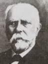**Mokry Sámuel** ([Monostorszeg](https://hu.wikipedia.org/wiki/Monostorszeg), [1832](https://hu.wikipedia.org/wiki/1832). [május 8.](https://hu.wikipedia.org/wiki/M%C3%A1jus_8.) - Budapest, 1909. június 10.) tanár.

Halléban evangélikus teológiát végzett, majd Keszthe-lyen a gazdasági tanintézetben tanult. 1854-1858 között Orosházán volt lelkész. 1858-tól a békéscsabai Andrássy Gyula Gimnázium és Kollégium vezetője, 1860-tól ta-nára, majd igazgatója. 1860-1864 között a békéscsabai evangélikus egyház hitszónoka volt.

Az 1863. évi nagy aszály után a szárazságnak jobban ellenálló, jól bok-rosodó és nagy kalászt fejlesztő búzát igyekezett előállítani. Nemesítési munkájának eredményeit előbb szaklapokban közölte, majd az első ma-gyar búzanemesítési szakkönyvben foglalta össze. A búzanemesítés egyik úttörőjéről 1911-ben Békéscsabán utcát, majd később lakótelepet neveztek el. Művei: *Beszélgetések a búzatúltermelés káros volta felett (1871), Búza-nemesítés (1875), Mezei gazdaságunk reformjáról (1881)*.

Forrás: Szinnyei József: *Magyar írók élete és munkái.*

**Molnár** *Müller* **Jenő** (Szabadka, 1880. - Budapest, 1933.) újságíró.

A jogi szigorlatot 1901-ben a kolozsvári egyetemen tette le. Tanulmányaival párhuzamosan hírlapíróként a *Bors-szem Jankó* állandó munkatársa, 1897-től a *Magyar Uj-ság* című esti lapnál működött. 1899-től pedig a *Szegedi Hiradó* belső munkatársa lett. Első költeménye 1898-ban a *Hét*ben jelent meg, melyet számos lírai, hazafias, alkalmi és tréfás vers követte.

Munkatársa volt az *Egyenlőség* c. zsidó politikai hetilapnak is, és tevékeny részt vesz a zsidó publicisztikában. Németül is publikált, humoreszkjeivel a németországi lapok állandó munkatársa volt, egy színdarabját a bécsi *Residenz-Theaterben* mutatták be. *A legszebb dal* c. egyfelvonásos verses vígjátékával a szegedi Dugonics Társaság pályázatát nyerte el.

Forrás. *Magyar zsidó lexikon*

**Z. Molnár** *Müller* **László** (Zombor, 1883. június 23. - Budapest, 1956. no-vember 17.) színész.

A Színiakadémia elvégzése után 1904-ben a *Király Szín-ház* tagja lett, majd a *Magyar Színházhoz* szerződött, a-melynek 1935-ig tagja maradt. A belváros népszerű mű-faját a kabarét is művelte. 1907-1910 között a *Bonbonnière Kabaréban* lépett színpadra, ott hol Nagy Endre megte-remtette a jellegzetes pesti kabarét.

A huszas években leginkább Bárdos Artúr *Belvárosi Szín-házában* játszott, hol Bánky Vilmával az amerikai némafilmek egyik sztár-jával, és a hallatlanul népszerő Turay Idával játszott. Alkalmanként néhány évadot eltöltött a *Renaissance, a Víg-, a Fővárosi Operett- stb.* végül pedig a *Magyar Színházban* szerepelt. A harmadik zsidótörvény után már nem léphetett színpadra. 1945 után gyorsan váltogatta társulatait, végül 1949-től 1956-ig a *Nemzeti Színház* tagja volt. Korának egyik legjelesebb karakter-színésze volt, habár leginkább epizódszerepeket játszott.

Főbb szerepei: *Lakáj (Molnár F.: Játék a kastélyban); Krehl (Molnár F.: Olympia); Georg Corell (Steinbeck: Lement a hold). *

*Jelentősebb filmszerepei: Sárga liliom (1914). Twist Olivér (1919) - Fagin. Az új rokon (1934) - Muki, a család rokona. Lila akác (1934) - Körmendy, vezérigazgató. Az iglói diákok (1934) - Tirtsák tanár úr. Méltóságos kisasszony (1936) - főkomornyik.* *Lovagias ügy (1937) - Milkó Sándor vezérigazgató. A tanítónő (1945) - ügyvéd.*

Forrás: *Magyar színházművészeti lexikon*

**Munkácsy Mihály** (Bácskeresztúr 1875.- ?) szláv filológus.

Tanulmányait az innsbrucki és budapesti egyetemeken végezte, ezután a Magyar Tudományos Akadémia Könyvtárában az Országos Magyar Gyüjtemény egyetem tisztviselője lett. A budapesti egyetem közgazdaság-tudományi karán a szlovák nyelv előadója, a műegyetemen pedig az orosz, szerb-horvát és szlovák nyelv lektora.

Több orosz regényt fordított, így Dosztojevszkij: *Ostoba eset, A szende, Nevetséges ember álma, Bobok, A koldus fiúcska; Okulov: Gujatani; Tolsztoj: A kaukázusi fogoly; Turgenyev: Első szerelem.*

Forrás: *Magyar Életrajzi Lexikon 1000-1990.* *Magyar zsidó lexikon*

**N**

**Nádas Ernő** (Orsova, 1892. október 6. - Budapest, 1942. április 11.) textilmérnök.

1910-ben Lugoson érettségizett, majd a közgazdaságtani diplomáját Bécs-ben, a textiltechnikait Brünnben szerezte. Az első világháborúban a fron-ton szolgállt, a háborút követően a Győri Lenfonó és Szövőgyár Rt.-ben a gyár helyettes vezetőjeként és irodafőnökként dolgozott. Miután belépett a szocdem pártba, a brit titkosszolgálattal került kapcsolatba, amely a II. világháború kezdetén rávette, hogy a hadiüzemben robbantásos merény-letet kövessen el. Az akció meghiúsult, sőt a rendőrség lakásán robbanó-anyagot talállt. Segítőivel együtt letartóztatták, majd kivégezték. Győrben utcát neveztek el róla! Forrás: *Győri életrajzi lexikon*

**Nádor** *Naschitz* **Jenő** (Temesvár, 1892. december 13. - Budapest, 1970. február 23.) hírlapíró.

A gimnáziumot Temesvárott végezte, érettségije után a *Neue Temesvarer Zei*tung munkatársa. A fővárosba hívták a *Nap* c. bulvárlaphoz. A háború alatt a *Nap* és a *Berliner Tageblatt* haditudósítójaként működött. 1917. feb-ruár 10-én betiltották a lapot a benne megjelentetett, a hadviselés érdekeit veszélyeztető közlemény miatt. A két világháború között a *Nap* és a *Világ* belpolitikai rovatvezetőjének szerződtették, később a *Magyar Hírlap*, és az *Újság* munkatársa volt. Parlamenti tudósításai, valamint riportjai, in-formációi és leleplezései gyakran keltettek feltűnést.

A háború alatt a Zsidó Hitközség kulturális ügyeivel foglalkozott. 1945 után a *Fővárosi Napló* főszerkesztője és a *Népszava* munkatársa volt.  

A lengyel-magyar kapcsolatok ápolását célul tűző *Magyar Mickiewicz Társaság* dolgait is a szívén viselte. Forrás: [*Magyar zsidó lexikon*](https://web.archive.org/web/20151008034347/http:/mek.niif.hu/04000/04093/html/szocikk/13482.htm)

**Nagy Ernő** (Facsád, [1898](http://hu.wikipedia.org/wiki/1898). [augusztus 2.](http://hu.wikipedia.org/wiki/Augusztus_2.) - Budapest, 1977. december 8.) olimpiai bajnok vívó.

A fiumei Haditengerészeti Akadémián végzett. Az I. vi-lágháborúban zászlós rangban a Helgoland kiscirkálón az otrantói ütközetetben is részt vett. A világháború után fo-lyamőrtisztként, és sporttanárként a MAC-ban (Magyar Atlétikai Club) vívott. Nagy Ernő két fegyvernemben, kard-ban és tőrben is egyaránt kiváló volt. Első bajnoki címét az MAC színeiben szerezte 1932-ben a kardvívás csapatbajnokságán, és még ebben az évben Los Angelesben a minden idők legjobb kardvívó csapa-tának itélt együttes nyerte meg az olimpiai bajnokságot. 

1932-ben részt vett a budapesti Európa-bajnokságon, itt kard egyé-niben az előkelő 6. helyet szerezte meg. A magyar bajnokságban hatszoros baj-nok. 1938-ban visszavonult az aktív sportolásból, és az MAC vívósza-kosztályának vezetője lett. Tagja volt a Magyar Vívó­szö­vetség válogató- bizottságának. Forrás: *Magyar Olimpiai Bizottság. *

Kisléghi **Nagy Gyula** (Vukovár, 1861 – Csanád, 1918. március 9.) magyar régész, uradalmi főintéző.

Jogi tanulmányokat Budapesten  agrár tanulmányokat pedig  Magyaróvá-ron folytatott. Utána főintézőként dolgozott M. San Marco hercegasz-szonynál, miközben szabadidejében régészettel foglalkozott. Tagja volt a *Dél-Magyarország Történelmi és Régészeti Társaságának*, kitűnő kapcso-latokat ápolt a kor budapesti tudósaival. Amivel megelőzte a korát az a tény, hogy koordináta adatokkal határozta meg a lelőhelyek földrajzi hely-zetét. Az 1893 és 1911 közötti feltárások során 14 lelőhely tárt fel.

A honfoglalás kori lelőhelyek feltárását Nagyőszőn kezdte, ahol 1898-ban két sírt tárt fel. A teljes leletanyag a *Magyar Nemzeti Múzeumba* került, egy érem kivételével. Munkásságának legnagyobb eredménye az a két *Archaeológiai Napló*, amely az ásatásainak nagyon pontos leírását, sok esetben jegyzetrajzokat tartalmaz. Halála után 1985-ben került csak a te-mesvári *Bánsági Múzeum*ba az általa feltárt leletanyag egy része, vala-mint az *Archaeológiai Napló* I. része. Forrás: *Petőfi Irodalmi Múzeum*

**Nagy Kató** (Käthe von Nagy) (Szabadka, 1904. április 4. - Los Angeles, 1973. december 20.) színésznő.

Vívóbajnoknő akart lenni, később Gaál Béla szinitano-dájába és Deésy Alfrédnek a filmiskolájában is járt. A *Király Színházban,* Beöthy Lászlónál is fellépett.

A huszas évek közepén tizennyolc évesen Európa legiz-galmasabb művész városába Berlinbe költözött. 1927-ben megkapta első filmszerepét, későbbi férje C. J. Davis a *Férfiak a házasság* előtt című vígjátékában. Első főszerepét a *Durch-gängerin* című vígjátékban kapta. 1930-ban szerepelt *A másik férfi* című első hangosfilmjében, majd 1931-től UFA-val kötött szerződést, így már a legnagyobb filmcsillagok közé emelkedett. Az *Őfelsége, a szerelem* című filmben a világhírű honfitárs Szőke Szakáll partnereként játszik.

1935-tól Franciaországban élt és dolgozott, de forgatott még osztrák és olasz filmekben is. Férjével a világháború előestéjén az újvilágba tette át székhelyét. Összesen 58 néma és hangos filmben szerepelt, többnyire fő-szerepet játszva. Forrás: *Magyar filmművészeti lexikon*

Alsószopori báró **Nagy László** (Vukovár, 1803. június 23. - Graz, 1872. szeptember 13.) táborszernagy.

A bécsújhelyi katonai nevelőintézetbe tanult. A forradalmak évében 1848. augusztusában ezredesi rangban a vezérkarnál szolgállt. Az itáliai harcok-ban ő készítette a haditerveket, melyek előfeltételei voltak a császári csapa-tok győzelmeinek. Több ütközetben is részt vett, a Santa Lucianál kivívott győzelemmel nyerte el a Lipót-rend lovagkeresztjét. Bologna és [Ancona](https://hu.wikipedia.org/wiki/Ancona) ostroma után pedig a II. osztályú vaskoronarendet kapta.

1854 decemberében bárói rangra emelkedve az újonnan alapított törzstiszti iskola igazgatójának nevezték ki. Altábornagyi rangban az 1859-ös olasz háború idején Dalmácia helytartóhelyettese volt. A háborút követően leg-inkább katonai és történelmi tudományoknak szentelte idejét.

Kéziratban hívta föl a birodalmi tanács figyelmét a vasutaknak stratégiai fontosságára, valamint a hadiflotta fejlesztését javasolta.

Forrás: Szinnyei József: *Magyar írók élete és munkái*

**Nagyajtósi** *Krcselics* **István** ([Nagybecskerek](https://hu.wikipedia.org/wiki/Nagybecskerek), [1908](https://hu.wikipedia.org/wiki/1908).  augusztus 1. –

Cson[grád](https://hu.wikipedia.org/wiki/Csongr%C3%A1d_(telep%C3%BCl%C3%A9s)),  1989. no[vember 21.](https://hu.wikipedia.org/wiki/November_21.)) magyar-francia szakos középiskolai ta-nár, francia nyelvkönyvek szerzője.

A család az [első világháború](https://hu.wikipedia.org/wiki/Els%C5%91_vil%C3%A1gh%C3%A1bor%C3%BA) idején költözött [Budapestre](https://hu.wikipedia.org/wiki/Budapest). A [Werbőczy István Gimnáziumban](https://hu.wikipedia.org/wiki/Pet%C5%91fi_S%C3%A1ndor_Gimn%C3%A1zium_(Budapest)) (I. kerület Petőfi Sándor Gimnázium) érettségizett [1926](https://hu.wikipedia.org/wiki/1926)-ban. Ezt követően a [Pázmány Péter Tudományegyetem](https://hu.wikipedia.org/wiki/P%C3%A1zm%C3%A1ny_P%C3%A9ter_Tudom%C3%A1nyegyetem) magyar-francia sza-kos hallgatója lett. [1931](https://hu.wikipedia.org/wiki/1931)-ben szerzett oklevelet.

A [nagy gazdasági válság](https://hu.wikipedia.org/wiki/Nagy_gazdas%C3%A1gi_vil%C3%A1gv%C3%A1ls%C3%A1g)  idején alkalmi munkákból élt, 

míg [1933](https://hu.wikipedia.org/wiki/1933)-ban a szentesi reálgimnázium elfogadta pályá-zatát, itt magyarosította meg a nevét. 1938-tól lett „rendes tanár”, majd 1942-ben  néhány évig olasz nyelvet is oktatott.  Nagyajtósi Istvánt a hu-manitás, a kellő szigor, a rendkívüli tárgyi tudás és a kivaló előadói készség jellemezte. A francia oktatásban végzett munkája révén vált híressé: sok kiadást megért francia nyelvkönyvek szerzője volt.

A franciatanárok, egyetemi oktatók egész sorát indította el pályájukon. Mint a [Magyar Irodalomtörténeti Társaság](https://hu.wikipedia.org/wiki/Magyar_Irodalomt%C3%B6rt%C3%A9neti_T%C3%A1rsas%C3%A1g) tagja publikációit közölte a *Szentesi Élet* c. helyi lap, a *Csongrád megyei Hírlap*, valamint a gimná-zium évkönyvei. Néhány versét az [*Új Ember*](https://hu.wikipedia.org/wiki/%C3%9Aj_Ember_(katolikus_hetilap)) c. katolikus hetilap közölte *Márk István* névvel. 1955-ben az Oktatásügy Kiváló Dolgozója kitünte-tésében részesült. 2004-ben az 1949-ben érettségizett diákjai emkéktáblát helyeztek el tiszteletére a Horváth Mihály Gimnázium folyosóján. 

Források: *Nagyajtósi István.  Bácskai Mihályné: Nyolcvan éves a „Nagy Monsieur”. *

**Nedelkó Döme** (Lugos, [1812](https://hu.wikipedia.org/wiki/1812). [október 11.](https://hu.wikipedia.org/wiki/Okt%C3%B3ber_11.) - Budapest, 1882. április 27.) orvosdoktor, egyetemi tanár.

A cincár (makedoromán) eredetű Damaszkin rézműves családból származó Döme (Dimitrije), jogi pályára ké-szült, mégis pesti orvostanhallgató lett. Az általános or-vosi praxis nem hozott megfelelő jövedelmet számára, így Bécsben folytatta tanulmányait. Ezúttal fogászatot tanult, és kor neves professzorai keze alatt (Carabelli és Sterne), sajátította el a fogászat művelésének tudományos alapjait. 1842- ben fogorvosi oklevéllel a zsebében visszatért Pestre.

A következő évben a pesti egyetem orvosi karához kérelmet nyújtott be, engedélyt kérve a fogászat ingyenes oktatására. Ezt a jogott esztendő mul-tán megkapta, így Nedelkó Döme révén 1844-ben a pesti egyetemen is felállították a fogászati rendkívüli tanszéket. Elsősorban a fogak sebésze-tére illetve extractiójára (eltávolítás) szorítkozott megbízatása.

Előadásait heti két órás bontásban adta elő a fogászatot, leginkább a Hat-vani utcában levő orvosegyetemi épület bonctani tantermében.

Magángyakorlatában az akkori viszonyokhoz mérten a fogtömést, vala-mint a műfogászatot azaz a fogpótlást is művelte. Egyetemi előadásaival párhuzamosan száj- és fogbetegek részére járóbetegrendelést tartott fenn, ez tekinthető a későbbi *Fogászati Intézet* elődjének.

1878-ban megalapította a *Budapesti Fogorvosok Egyletét*, a fogorvosi egyetemi oktatás és szakirodalom úttörője volt.

Forrás: Szinnyei József: *Magyar írók élete és munkái.* *Magyar Életrajzi Lexikon 1000-1990;*

**Neményi Pál** ([Fiume](https://hu.wikipedia.org/wiki/Fiume), [1895](https://hu.wikipedia.org/wiki/1895). [június 6.](https://hu.wikipedia.org/wiki/J%C3%BAnius_6.) - Washington, 1952. március 1.) matematikus, fizikus, mérnök.

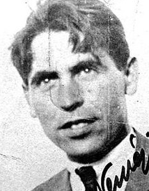Édesapja a magát magyarnak tartó, Fiumeban élő zsidó Neményi Dezső a fiumei olajfinomító igazgatója volt. A ifjú Neményi Pál Budapesten 17 évesen megnyerte a magyar országos matematikaversenyt.

Az első világháború forgatagában tette le érettségi vizs-gáját. A világháború után Berlinbe került, hol közeli ba-rátságot kötött a *Kaiser Wilhelm Institutban* kémikusként dolgozó Polányi Mihálylyal. Szilárd Leó, [Gábor Dénes](https://hu.wikipedia.org/wiki/G%C3%A1bor_D%C3%A9nes_(fizikus)), Wiegner Jenő és Neumann János tartoztak még a kicsi de tehetséges magyar kolóniához.

Berlinben ekkor Fritz Habern kémiát, Albert Einstein statisztikus mecha-nikát és Erhardt Schmidt matematikát tanított.

Neményi Pál 1922-ben tett matematikai doktorátust, majd a berlini egye-temen előadásokat tartott a folyadékdinamika tárgyában. Az 1930-as évek elején matematikai mechanikával kapcsolatos jegyzetkönyvet állított össze, melyet aztán kötelező jelleggel használtak a német egyetemeken.

Hitler hatalomra jutását követően állásából elbocsátották. Koppenhágában teledett meg, így Dánia szineiben vett részt az 1936-os osloi nemzetközi matematikai kongresszuson. Neményi Pál a 6. szekciót vezette, német nyelven tartotta előadásait.

A második világháború kitörésekor nem várta meg a nácik Dániai meg-szállását, az Egyesült Államokba utazott. Az új világban tanári állást vál-lalt, immáron *Nemenyi Paul Felix* néven. Az iowai állami egyetem helyez-kedett el, hol részt vett az egyetem kutatásaiban.

1941-ben a coloradói egyetemen, majd 1944-ben Washingtonban kapott instruktori állást, hol haláláig tanított. Magyarországon 1928-ban az Athe-naeum gondozásában jelent meg *Vasbetonszerkezetek* c. munkája.

Kutatási területe többek közt a kvantummechanikát, hidrosztatikát, statisz-tikus mechanikát foglalta magába.

Forrás: Gulyás Pál: *Magyar írók élete és munkái*.

**Németh Péter** (Temesvár, 1851. július 20. - Budapest, 1915. május 14.) a királyi Kuria bírája.

A jogot Budapesten hallgatta. 1872-ben a budapesti királyi táblánál joggyakornok, 1875-től az igazságügyminisztériumban segédfogalmazó, 1881-től budapesti királyi táblai pótbíró, 1887-től ugyanott rendes bíró lett. 1892-tól kuriai bíró, előadó a büntető szakosztályban, és szavazásra külön feljogosítva a polgári szakosztályban is.

Főleg a polgári eljárás és büntető jogról írt tanulmányokat a szaklapokba. Hozzászólt igazságügypolitikai kérdésekhez a fővárosi napi lapokban, különösen egyes igazságügyi törvények megalkotása alkalmával. 1877-ben a *Pester Lloyd*ban a külfölddel ismertette a büntető törvénykönyv javaslatát 15 cikkben.

1880-ban megalapította a *Büntető Jog Tára* című folyóiratot, amelynek 1912-ig volt a felelős, később főszerkesztője. Szerkesztette továbbá *A Curia teljes ülései* című hivatalos kiadványt (1887- 1890).

Önálló művei: *A váltóeljárás* (1876), *A gyámság és gondnokság* (1877), *Magyarország Szt. László király idejében* (1895).

Forrás: *Magyar életrajzi lexikon*

**Neukomm Gyula** (Versec, 1892. április 22. - Budapest, 1957. október 9.) matematika-tanár, sakkozó, sakkfeladványszerző.

1909-től a budapesti egyetem matematika-ábrázoló geo-metria szakán folytatta tanulmányait. 1914-ben szerezte meg tanári oklevelét.

1922-től 1932-ig a *Magyar Sakkvilág* kétlépéses rovatát vezette. 1934-1935-ben a *Budapesti Sakkújság*, 1933-tól a *Tükör* című folyóirat feladvány-rovatának vezetője volt. 1919-1951 között a budapesti Kemény Zsigmond (Rudas László), majd Kölcsey Ferenc Gimnázium tanára volt.

1949-től Surányi János és Soós Paula újraindították a *Középiskolai Mate-matikai Lapokat*, Neukomm 1952-től haláláig felelős szerkesztője volt a lapnak. Ő vezette be a pontversenyt a Lapokban. Egészen különleges tehet-sége révén a sakkszerzés valamennyi műfajában világszínvonalú remek-műveket alkotott. A matematikus Neukomm Gyula kitűnően értett a ver-senyfeladatok létrehozásához, a feladatok szebbnél-szebb megoldásainak kitalálásához, megszövegezéséhez.

Nemzetközi versenyeket nyert feladványaival, illetőleg feladvány meg-fejtéseivel. A *Nemzetközi Sakkfeladványszerző Bizottság* elnökévé válasz-totta. Ő érte el legelőször, hogy ez a bizottság olyan nemzetközi konfe-renciát szervezzen, amelyen Kelet és Nyugat egyaránt részt vett.

Forrás. *História - Tudósnaptár*

**Notter Antal** (Temesvár, 1871. február 05. - Dunaharaszti, 1948 március 07.) jogász, egyetemi tanár.

A gimnáziumot Temesvárt, az egyetemet Budapesten végezte 1895-ben. 1900-ban a Szent István-társulat titkárának választották. (*SZIT*: katolikus szellemű nyomdatermékeket előállító és terjesztő vállalat, a legrégibb magyarországi könyvkiadó.) 1907-ben az egyházjog, a magyar alkotmány- és jogtörténet nyilvános rendkívüli tanára lett a nagyváradi katolikus jog-akadémián.

1909 októberétől a budapesti egyetemen az egyházjog nyilvános rend-kívüli, majd 1912-1941 között nyilvános rendes tanára (egyházjog, római jog és jogtörténet jogosított tanára) volt. 1922-24 között *a jogi kar dékánja,* 1924/25-ben prodékánja.

Számos egyházjogi, valamint filozófiai értekezést írt folyóiratokba. Meg-írta a Szent István-társulat történetét. Önállóan megjelent nagyobb művei: *A szabad akarat* (1908), *A szerzetesi professzió egyházi és világi jog szerint* (1908), *Eljegyzés és házasságkötés a Ne temere dekrétum szerint* (1909). Forrás: *Magyar Katolikus Lexikon*

**Novobátzky Károly** (Temesvár, 1884. március 3. - [Budapest](http://hu.wikipedia.org/wiki/Budapest), [1967](http://hu.wikipedia.org/wiki/1967). [de-cember 20.](http://hu.wikipedia.org/wiki/December_20.)) fizikus, egyetemi tanár, az [MTA](http://hu.wikipedia.org/wiki/Magyar_Tudom%C3%A1nyos_Akad%C3%A9mia) tagja.

A temesvári reáliskolában érettségizett, majd a budapesti tudományegyetemen tanult. 1908-ban matematika-fizika szakos középiskolai tanári oklevelet szerzett. 1908-tól a máramarosszigeti gimnáziumban tanított.

1918-ig frontszolgálatot teljesített. 1919-től 1945-ig a budapesti Kölcsey Gimnázium tanára volt. 1945 után a budapesti tudományegyetem Elméleti Fizikai Intézetének vezetője lett, itt dolgozott haláláig.

1947-től 1949-ig a *Magyar Természettudományi Társulat* elnöke volt. Fő kutatási területei a relativitáselmélet és az elektromágneses tér elmélete. Vizsgálatai az affin térelméletre, egy olyan geometriai elméletet dolgozott ki, mely lehetővé teszi az elektromágnesség geometriai értelmezését nem-lineáris vektortranszformáció bevezetésével.

Az elektromágneses értelmezés alapján a fényelhajlás Kirchhoff-féle el-méletét fejlesztette tovább. Jelentős szerepe volt a hazai fizikusképzésben, nevéhez fűződik a korszerű, világszínvonalon álló elméleti fizikaoktatás megszervezése. Az *Eötvös Loránd Fizikai Társulat* tagja volt, kutatómun-kájának elismeréseként a Társulat örökös tiszteletbeli elnökévé választotta. Tiszteletére megalapították a *Novobátzky Károly-díjat*, amelyet 1969 óta azok kapnak, akik az elméleti fizika területén jelentős eredményeket értek el. Forrás: *Magyar fizikusok *

**O**

Fonó Lászlóné, **Oberson Renée** (Vukovár, 1908. december 19. – Buda-pest, 1975. október 18.) gyermekgyógyász.

A pécsi egyetemen szerezte orvosi oklevelét, ezt követően a fővárosba került. Itt két eszdendeig az Állami Gyermek-menhelyen dolgozott, majd a László és a Madarász utcai Kórházban dolgozott. Miután gyermekgyógyászati szak-képesítést szerzett, a II. számú gyermekklinikán volt ta-nársegéd és adjunktus.

A második világháborút követően 1945-től, a Fehérke-reszt Kórházból létrejött Gyermekgyógyászati Klinikán gyógyított. A forradalom évében, 1956-ban érte el a kandidátusi fokozatot, 1966-ban pedig röntgenológia szakképesítést nyert. Élete utolsó éveiben a klinikán volt szaktanácsadó.

Tudományos érdeklődésének fontos részét képviselte a ritka tüdőelválto-zások problematikája. A gümősagyalapi agyhártyagyulladással és a csont-fejlődési rendellenességekkel foglalkozott. Később főleg a vele született szívhibák klinikai diagnosztikájának kérdése foglalkoztatta, ezek műtéti indikációjának (gyógyszert vagy műtétet alkalmazzanak) kérdését kisérel-te meg megoldani. Az elsők között végzett (extrakorporális keringéssel) gyermekeken szívműtéteket. 1974-től tagja az *Európai Gyermekkardio-lógiai Társaságnak*, ezenkívül több hazai és külföldi tudományos társaság tagja volt. Forrás: *Magyar Életrajzi Lexikon.* *Magyar Orvoséletrajzi Lexi-kon*

**Oblath Richárd** (Versec, 1882. június 11. - Budapest, 1959. június 18.) matematikus, a matematikai tudományok kandidátusa.

Matematika-fizika szakos tanári oklevelét 1905-ben a budapesti egyete-men szerezte meg. Még egyetemista volt, amikor megjelent tanulmánya az alkoholizmus élettani és etikai hatásairól. A Markó utcai főreálban Prónai Jenőt tanította. A Tanácsköztársaság idején tanúsított magatartása miatt megfosztották állásától. 1922-től 1946-ig a Magyar Általános Kőszénbá-nya Rt. biztosítási matematikusa volt.

1946-ban történt nyugdíjaztatása után a budapesti tudományegyetemen adott elő. Kutatási területe geometriai szerkesztések és elemi számelmélet. Nyugdíjazása után a matematika történetébe ásta bele magát.

A magyar matematikusokról írt tudományos életrajzai ma már doku-mentum értékűek. Fő műve: *Analízis és geometriai alkalmazásai (1920). *

Forrás: *Magyar életrajzi lexikon*

**Oláh** *Obláth* **Ferenc** (Óbecse, 1887. április 12. - Szeged, 1939. április 24.) színész.

A biztos egzisztenciának igérkező kereskedelmet fel-cserélte a színi pályával és beiratkozott Országos Színész-egyesület színésziskolájába. 1908 szeptemberében Sze-gedre Makó Lajos társulatához szerződött, itt lépett elő-ször színpadra, a „Szókimondó asszonyság”-ban Neiperg grófot játszotta. 1911-12-ben Palágyi La­joshoz ment Mis-kolcra, majd 1912-13-ban Mezei Kálmánnál Sátoraljaújhelyen és Eper-jesen szerepelt. Az első világháborúban tartalékos főhadnagyként harcol. 1918-19-ben Debrecenben, 1919 és 1924 között Kolozsváron Janovics Jenőnél szerepelt, hol egy ideig titkára volt a *Haladás* írói szövetkezetnek, majd 1924-től 1936-ig Szegeden játszott.

Jellemszerepeket formált meg. Újságcikkeket is írt. Könyve a *Petőfi és a színpad* Kolozsvárott jelent meg 1918-ban. Főbb szerepei: *A tanító* (Bródy S: A tanítónő); *Tybalt* (Shakespeare: Rómeó és Júlia); *Tiszteletes* (Zilahy L.: Süt a nap); *Warwick gróf* (Shaw: Szent Johanna).

Források: *Magyar színházművészeti lexikon*

**Orthmayr Alajos** (Facsád, 1917. szeptember 24. - Eger, 1971. február 19.) ideg-elmegyógyász.

Oklevelét a kolozsvári egyetemen szerezte, ahol a II. világ-háború alatt az egyetemi kórbonctani intézet tanársegédje volt. A világháborút követően a fővárosi Szent János Kór-ház orvosa lett. 1947-1954 között a pécsi egyetem ideg- és elmegyógyászati klinikájának adjunktusa.

1954-től haláláig az *Országos Ideg- és Elmegyógyintézet főorvosa, egyben* 1962-től az Egészségügyi Minisztérium elmegyógyász szaktanácsadója is volt. Kkezdeményezője volt az alkoho-lizmus elleni küzdelem szakszerű megindításának.

Főbb művei: *Elme- és idegápolás 1956. január.* *Idegrendszer vérkeringé-sének élettana és klinikuma 1962. [Tanulmányok az alkoholizmus pszi-chiátriai következményeiről](http://www.antikvarium.hu/konyv/szabo-pal-sos-jozsef-tanulmanyok-az-alkoholizmus-pszichiatriai-kovetkezmenyeirol-362687) 1968.*

Forrás: *Magyar Életrajzi Lexikon 1000-1990*

**P**

**Pacséry Imre** (Őrszállás, 1900. december 10. - Budapest, 1980. január 25.) orvos, iparegészségügyi szakértő.

Orvosi oklevelét 1924-ben szerezte a budapesti egyetemen. Ezt követően évekig az OTI (Országos Társadalombiztosítási Intézet) orvosa. 1928-ban két esztendőn keresztül a Harvard Egyetemen folytatott kutatásokat, hol végül iparegészségügyi oklevelet szerzett. Hazatérését követően 1930-34-ben az OTI orvos-titkára, itt megszervezte és vezette az Ólomvizsgáló Ál-lomást. A második világháború után a szegedi tudományegyetemen, egye-temi magántanári képesítést szerzett. 1950-től nyugalomba vonulásáig az Országos Munkaegészségügyi Intézet osztályvezetője volt.

Fő kutatási területi a foglalkozási ártalmak, különösen az ólom, az aromás nitro- és aminovegyületek, mint foglalkozási eredetű rákmegbetegedések okozói voltak. Félszáznál is több tudományos közleménye jelent meg kü-lönböző szakfolyóiratokban. Főbb művei: *Az iparegészségügyi vizsgálat methodikája. Magos Lászlóval (1960), Foglalkozási ártalmak a műanyag-iparban. Vincze Erzsébettel (1961). *

Forrás: *[Magyar Életrajzi Lexikon 1000-1990](https://www.google.rs/url?sa=t&rct=j&q=&esrc=s&source=web&cd=4&cad=rja&uact=8&ved=0ahUKEwimxJratZzcAhUvsqQKHS-1DJsQFgguMAM&url=http%3A%2F%2Fmek.oszk.hu%2F00300%2F00355%2Fhtml%2FABC09732%2F10711.htm&usg=AOvVaw2qd7-KWKO4z_zhRxtGfjz7). [História - Tudósnaptár](https://www.google.rs/url?sa=t&rct=j&q=&esrc=s&source=web&cd=8&cad=rja&uact=8&ved=2ahUKEwj3rsrhnovdAhULL1AKHeC7DwsQFjAHegQIAxAB&url=http%3A%2F%2Ftudosnaptar.kfki.hu%2Flocalhost%2Fhonap.php%3Fev%3D2010%26ho%3D1&usg=AOvVaw27P_ncqxEqSby3goSV0tSf)*

**Padányi** *Frank* **Antal** (Őscsanád, 1884. június 15. - Budapest, 1973. no-vember 6.) tanítóképzői igazgató.

1919-ig a lévai, az államfordulat után a budapesti tanító-képzőben igazgató. 1923-ban a budapesti egyetemen ne-veléstudományból doktorált, majd a Tanítóképző Intézet Tanárjelöltek Apponyi Kollégiuma budapesti tagozatának igazgatója. Elnöke volt a Tanítóképző Intézeti Tanárok Országos Egyesületének. Éveken át vezetője és előadója az országos tanítói továbbképző tanfolyamokknak.

A Budapesti I. ker. Állami Líceum és Tanítóképző-Intézet igazgatója volt évtizedekig. Ma az ELTE TÓK utolsó éves hallgatói számára létrehozták a Dr. Padányi-Frank Antal díjat. Művei: *A testi nevelés a filantropistáknál* (1922), *Lelki megújhodás* (1924), *Jó gyermekek - rossz gyermekek* (1929), *Hogyan tanítsunk a népiskolákban?* Drozdy Gyulával (1930), *Nevelés-történelem* Németh Imrével. 1930), *Neveléstan, tanítástan, módszertan*. Drozdy Gyulával (1931), *A munkaiskola gyakorlati értéke* (1933), (s.v. Padányi Frank A.) - *A pedagógia válsága és a jövő útja*. (1938), (s.v. Padányi-Frank A.) *A nevelés módszere* (1939) *stb.*

Forrás: *Magyar Katolikus Lexikon *

**Palágyi** *Silberstein* **Lajos** (Óbecse, 1866 április 15. - Budapest, 1933. március 7.) költő.

1878-ban Budapestre költözött, hol tanulmányait ma-gánúton végezte. Óraadással, majd 1884-től újság-írással tartotta fenn magát. Első névvel vállalt versét Ábrányi Kornél *Magyarországa* jelentette meg.

Urváry Lajos fölvette belmunkatársnak a [*Pesti Napló*](http://hu.wikipedia.org/wiki/Pesti_Napl%C3%B3) szerkesztőségébe. Időközben szerkesztette a *Magyar Háziasszonyt*, tárcákat és költeményeket írt a *[Magyar Szalon](http://hu.wikipedia.org/wiki/Magyar_Salon), [Magyar Szemle](http://hu.wikipedia.org/wiki/Magyar_Szemle_%28foly%C3%B3irat,_1888%E2%80%931906%29)*, stb., lapok részére.

Rokonszenvezett a szociáldemokrata mozgalommal, több versét közölte a *Népszava*. Antikapitalista műve *a Robbanás a gyárban* a munkások ki-szolgálltatottságát mutatta be*.* Palágyi így ráragadt "az első magyar szocia-lista költő" címkéje. Bátyjával együtt szerkesztette a *Jelenkor* c. hetilapot.

1890-ben elnyerte a *Petőfi Társaság* 100 arany forintos pályadíját az aradi vértanúk szobránál elszavalt költeményéért. 1898-ban biztos polgári állás-hoz jutott, ugyanis kinevezték Hódmezővásárhelyre polgári iskolai tanár-nak. Később a sárospataki, majd a budapesti tanítóképző tanára.

A *Magányos úton* című verseskönyvében a sehová nem tartozást vallja ma-gáénak. *Az ifjú szerzetes* drámai költeményét a *Nemzeti Színház* bemutatta, irodalmi körökben sikere volt. A szatirikus kritikát sokszor alkalmazta, számos verse csattanóra végződött. A tanácshatalom bukását követően el-bocsájtották állásából, teljesen egzisztencia nélkül maradt. 1926-ban meg-jelenhettek válogatott költeményei, mégis magányosan, nyomorúságban halt meg. 1909-ben németből lefordította Goethe *Faust*ját.

Forrás: *Szinnyei József: Magyar írók élete és munkái.* *Magyar életrajzi lexikon. [Magyar zsidó lexikon](https://hu.wikipedia.org/wiki/Magyar_zsid%C3%B3_lexikon).*

**Palotás Imre** (Magyarkanizsa, 1894. október 12. - Budapest, 1968. októ-ber 15.) munkás, író.

Az I. világháborúban tengerészként szolgált Pólában, majd a Tanácsköz-társaság idején vöröskatona lett. 1921-ben belépett az MSZDP-be, a párt-lap (*Népszava)* hasábjain jelentek meg munkás tárgyú elbeszélései és ver-sei*.* Kommunista elhajlás miatt emiatt 1923-ban kizárták az MSZDP-ből. 1925-ben csatlakozott Vági István *Magyarországi Szocialista Munkás-pártjához,* innét egyenes út vezetett a kommunista mozgalomhoz.

1930-ban felvették a KMP-ba, hol szerkesztette a legális és illegális mun-káslapoknak. Az 1931. évi országgyűlési választásokon a Szocialista Mun-kásegység Blokk listavezetője lett. 1933-ban jelent meg az *Állványok alatt* című kisregénye is, amelyet a hatóság betiltott, példányait elkobozta.

1937-ben a *népfrontos* Fraciaországba emigrált, hol a párizsi *Szabad Szó* s az *Üzenet* (1939) c. emigráns lap szerkesztőségében működött. 1940-1945-ben a Petőfi magyar katonai alakulat tagjaként (politikai biztos) részt vett, a francia ellenállási mozgalom harcaiban. Hazatérése után 1945-1948-ban szakszervezeti, később tervezőintézeti vezető volt.

Forrás: *Magyar életrajzi lexikon*

**Pánczél Lajos** (Temesvár, 1897. január 10. - Budapet, 1971. március 16.), újságíró, író, filmtörténész.

Gimnáziumi tanulmányai után újságírói pályára lépett. Első cikke 1915 júniusában a Temesvári Hírlapban jelent meg. 1917-20-ban a *Színház és Divat* munkatársa lett. 1918-ban Károlyi Mihály hívei közé tartozott. 1920-24-ben a Magyar Távirati Iroda, 1924-től 17 éven át az *Újság* c. lap munkatársa, majd szerkesztője, közben több filmlapot is szerkesztette.

1941-44-ben a *Körmendy Kiadó* vezető lektora volt. 1945 után a *Szabad-ság* c. napilap nyomdai olvasószerkesztője. Később megindította és 1948-ig szerkesztette a *Mozi Élet* c. filmlapot. 1951-től a Magyar Távirati Iroda főmunkatársa és az újságíróiskola előadója. Főbb művei: *Délibáb* c. ope-rett*, 2:1. Regény a futball világából (1922), Pereg a film (1923), Ágról szakadt úrilány (1943), Az 50 éves mozi (1946), A hír útja (1957), A film világtörténete (1960) stb.* Forrás: *Magyar életrajzi lexikon*

**Papp Dániel** (Ó-Moravica, 1868. február 1. - Budapest, 1900 augusztus 14.) hirlapíró. A budapesti egyetemen jogot tanult.

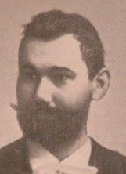1891-től mint joggyakorlatos sokáig közjegyzői irodában dolgozott. Az egyházpolitikai küzdelmek alatt *Dániel pap* és *Monachus* álnév alatt írt tárcái figyelmet keltettek és a *Pesti Naplóhoz* való szerződtetését hozta magával.

Munkatársa és segédszerkesztője a *Magyar Geniusznak*, 1897-től pedig a Mikszáth Kálmán lapjánál az *Országos Hirlapnál* tárcarovat vezető lett. A társadalmi és művészi kérdésekről száznál több tárcát írt az *Uj Időknek és* az *Uj Magyar Szemlé-nek*. Kiss József lapjának, a nyugatias *Hétnek* állandó belmunkatársa volt.

1898-ban képviselőházi naplószerkesztősegéddé nevezték ki. A szépiro-dalomban is otthonosan mozgott, művei közül a vidám bácskai történetei tetszettek leginkább a közönségnek. Önálló kötetei: *Marcellus (1898), Utolsó szerelem (1899), Tündérlak Magyarhonban (1899), A rátótiak, (1901*). Forrás: *Magyar életrajzi lexikon*

**Pártos** *Puntzman* **Gyula** (Apatin, [1845](http://hu.wikipedia.org/wiki/1845). [augusztus 17.](http://hu.wikipedia.org/wiki/Augusztus_17.) - [Budapest](http://hu.wikipedia.org/wiki/Budapest), [1916](http://hu.wikipedia.org/wiki/1916). [december 22.](http://hu.wikipedia.org/wiki/December_22.)) [építész](http://hu.wikipedia.org/wiki/%C3%89p%C3%ADt%C3%A9sz).

A Királyi József Műegyetemen a volt József Ipartano-dában tanult, hol Skalnitzky Antal volt a mestere. Mestere tanácsára, a *berlini Bau-Akademie-n* folytatta tovább ta-nulmányait. Később híressé vállt társaival Lechner Ödön-nel és Hauszmann Alajossal, képezték a német egyetem kis magyar különítményét. Miután 1870-ben Berlinben épí-tészi oklevelet szerzett, hazatérve Pesten társult Lechner Ödönnel. Közös irodájukban a szervezői feladatokat Pártos látta el, míg a pályázatok és megvalósult művek Lechner művészetét tükrözik.

A két építész követőikkel együtt alakították ki az új szecessziós magyar nemzeti stílust. Pártos részt vett Lechner csaknem valamennyi megvalósult tervének (pl. a nagybecskereki vármegyeháza) kivitelezésében. Társult viszonyuk csak az Magyar Iparművészeti Múzeum befejezése után, 1896-ban szűnt meg. Őnálló tervén alapult a kiskunfélegyházi Szent István-templom, és Kalmár-kápolna, valamint a kecskeméti református bazár lét-rehozása. Az 1900-as évek elején több önálló megbízást kapott Budapes-ten, Győrött, Cegléden, és Pozsonyban. Önállóan tervezte a bajai taka-rékpénztárat és a zombori színházat is. Pártos Gyula a szecessziós magyar nemzeti stílus egyik kialakítója. Forrás: *Magyar Életrajzi Lexikon *

Pujoni **Pataky Arnold** (Temesvár, 1882. június 16. – Alacskapuszta, 

1950. március 18.) római katolikus pap, teológus, egyetemi tanár.

Teológiai tanulmányait a budapesti egyetemen és Lővenben folytatta. 1905-ös pappá szentelése után a váradi püspöki irodában szolgált. Rövid káplánkodás után 1907-től a váradi papnevelde prefektusa és teológia ta-nára. 1915-ben a *Szent István Akadémia* alapító tagja 1915 és 1926-ig a budapesti egyetemen az ószövetségi szentírástudomány tanára. 1926-1950 között az ÚjSzövetség és a görög nyelv tanára. 1922 - 1932 között a hit-tudományi kar dékánja majd prodékánja, 1936/37-ben az egyetem rektora, 1937/38-ban prorektora.

1923-tól szerepi c. apát, 1931-től pápai prelatus, 1944-ben felsőházi tag. Az *Unio Eucharistica Nővérek Társasága* alapítója. 1944. márciusa után (német megszállás) lakásában zsidókat bújtatott. A Szálasi-rendszer egyet-len felsőházi ülésén fölszólalt a rendszer embertelenségei ellen.

Főbb művei: *Az újszövetségi kánon története az I. niceai zsinat koráig (1906), A Herodes-dinasztia története (1908), A bibliai Jeruzsálem az ásatások megvilágításában (1924), Az Apokalipszis történelembölcselete (1937).* Forrás: *Magyar Katolikus Lexikon*

**Paulovits Sándor** (Németpalánka, 1881- ?) miniszteri titkár.

A szegedi piarista gimnáziumban érettségizett. Ezt követően a Ludovika Akadémián végezve, a cs. és kir. 85. gyalogezred hadnagyaként kezdte katonai pályafutását. E közben 1909-ben Kolozsvárt jogot végzett, így a rendőrségben folytatta pályafutását. 1912-ben Tolna vármegye szolgá-latába lépett, mind Szekszárd rendőrkapitánya. Szolgálati idejében időt szakított a városi tűzoltóság újjászervezésére is. Az első világháború kitö-résekor önkéntesként a budapesti 30. honvéd gyalogezredben százados. A háború alatt zászlóaljparancsnokká léptették elő.

1918-ban előbb a budapesti katonai rendőrségnél, majd a belügyminisz-térium keretébe, a határőrségnél szolgált. Az önálló magyar külügyminisz-térium megszervezésekor miniszteri titkár. 1927-ben megszervezte a vi-lágháború utáni első nagy szentföldi zarándoklatot; XI. Pius pápa ennek elismeréséül a Szent Sír- lovagjává ütötte, kommendátorrá, majd római pa-lotagróffá emelte. Művei: *Raguza és környéke tájékoztatója (*1909), *Szent-évi Magyar zarándoklatok*. Visszaemlékezések a jubileumi év esemé-nyeire (1926),* Magyarország kegyhelyei és azok csodái* (1930). 1920-1928 között a *Magyar Helikon* szerkesztője, 1927-től a *Tanulmányutak, Társas-utazások és Zarándoklatok* alapító-szerkesztője és kiadója.

Forrás: *Magyar Katolikus Lexikon*

**Pechán József** (Dunacséb, 1875. február 21. - Verbász, 1922. március 6.) festőművész és fényképész.

1890-ben Eisenhut Ferenc ajánlatával jutott be a mün-cheni művészeti akadémiára. 1892-től állami ösztöndíj-ban részesült. 16 évesen félbehagyta tanulmányait és 1899-ben *Utolsó gyufaszál* c. művével benevezett a *Kép-zőművészek Egyesületének* budapesti tavaszi tárlatára.

1904-ben visszatért Münchenbe és Hollósy Simon ma-gániskolájában tanult. Itt ismerkedett meg a modern fes-tői irányzatokkal. Később mesterét követte a nagybányai művésztelepre is. 1909-ben egyik megalapítója és elnökségi tagja volt a *Művészháznak*.

1910-ben [Buda-pestre](https://hu.wikipedia.org/wiki/Budapest) költözött, ahol műtermet nyitott. A nagybányai fia-talok, az ún. *Neósok csoportjához* tartozott. A szecesszió jegyében festett, az 1911-ben készített *Bácskai szüret*et tarják legsikeresebb művének.

1913-ben gyűjteményes kiállítása volt. Fényképészként is jeleskedett, különössen érdekesek az első világháborúban elfoglalt Belgrában készült felvételék.

Forrás: *Magyar művészeti kislexikon kezdetektől napjainkig *

**Pelle László** (Szabadka, 1902. szeptember 6. - Budapest, 1967. október 23.) orvos, sportorvos.

A budapesti orvosi egyetemen szerezte meg orvosi oklevelét. A Margit Kórházban belgyógyászként kezdte gyógyító pályafutását. A második világháboró után lett sportorvos. Közel három évtizedik a Testnevelési és Sportegészségügyi Intézet főorvosa és a sportorvosi Szakcsoportnak főtit-kára volt. A Fédération Internatio­nale de Médicine Sportive (FIMS) első magyar képviselője. A kajak-kenuzás sportegészségügyi kérdéseivel és a magyar sportorvosok nemzetközi kapcsolatainak a szervezésével foglal-kozott. Fő műve: *Ízületi betegségek kezelése pontosan adagolható lázkeltő szerrel* (1957). Forrás: [*Magyar Életrajzi Lexikon *](https://www.google.hu/url?sa=t&rct=j&q=&esrc=s&source=web&cd=11&cad=rja&uact=8&ved=0ahUKEwil0b-EusjXAhUKLVAKHc-3DCk4ChAWCCQwAA&url=http%3A%2F%2Fmek.oszk.hu%2F00300%2F00355%2Fhtml%2FABC05727%2F06467.htm&usg=AOvVaw1tqz0a0T5yVK8jW9XrbSEb)

**Petneházy Imre** (Újvidék, 1905. április 13. - Budapest, 1972. szeptember 23.) katonatiszt, vivó olimpikon.

Hivatásos katonaként a Ludovika Akadémia Sport Egye-sület öttusázója és a Magyar Atlétikai Club vívója volt.

1927-1939 között versenyzett, tagja volt az első öttusa válogatott keretnek. Az Los Angeles-i 1932-es olimpián a 19. helyen végzett öttusa egyéniben, a lovas ugrató ver-senyben lova az akadályban megbotlott, a rémísztő bale-setről való kép az egész világot bejárta. Ezek után indult a párbajtőr egyéni versenyeken is.

1934 augusztusában a Stockholmban rendezett versenyen csapatban a magyarok a svédek és a németek mögött a harmadik helyet szerezték meg. Öttusában válogató versenyeket nyert, kétszer volt hadseregbajnok, pár-bajtőrvívásban négyszeres magyar és egyszeres Európa-bajnok.

1944-ben és 1945-ben honvéd őrnagyként Galíciában és a Kárpátokban teljesített szolgálatot, 1945-ben amerikai majd szovjet hadifogságba ke-rült. További sorsa ismeretlen. Forrás: *Az öttusa története*

hanusfalvi **Petrich András** (Szávaszentdemeter, 1765. november 5. - Buda, 1842. november 4.) katonai térképész, festőművész.

A napoleoni háborúk alatt katonai térképeket készített. Az 1805-ös francia hadjárat után rábízták a salzburgi hercegség topográfiai felvételezését, utóbb Galícia nyugati részét felvételezte. 1809-től a váci [Ludoviceum](http://hu.wikipedia.org/wiki/Ludoviceum) igazgatója. 1842-től a Budai Műszaki és Erődítési Igazgatóság igazgatója, majd a [Veronai](http://hu.wikipedia.org/wiki/Verona) Műszaki és Erődítési Igazgatóság igazgatója. Katonai pályája mellett illusztrátori alkotásai is kiemelkedőek, megfestette Pest-Buda 1840 körüli látképét a hajóhíddal, Rajzai, a [*Magyar Nemzeti Galé-riá*ban](http://hu.wikipedia.org/wiki/Magyar_Nemzeti_Gal%C3%A9ria) találhatók. Forrás: *Művészeti lexicon*

alsópetőfalvi **Pettkó Béla** (Lugos, 1863. június 09. - Budapest, 1942. február 23.) történész, levéltárnok.

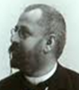Budapesten kezdte egyetemi tanulmányait, majd Bécs-ben fejezte be a bölcsészkaron. A magyar állam ösztön-díjasaként két évig az Osztrák Történeti Kutatóinté-zetben végzett kutatásokat. Ugyancsak két esztendőn keresztül végzett történeti kutatásokat Rómában a Vatikáni Levéltárban és Capestranóban is. Eközben az Országos Levéltár munkatársa lett.

Másfél évtizedig oklevélmásolóként segítette nagybátyját Szilágyi Sán-dort, miközben Komáromy Andrással a *Nagy Iván családtörténeti értesítő* tíz füzetének társszerkesztője volt. Egy oklevélhamisítási ügy miatt, 1913-ban elbocsátották az *Országos Levéltárból*. Hányatott sorsa ellenére jelen-tős szakmai tevékenységet fejtett ki. Levéltárosként fő kutatási területe a Magyarország történetére vonatkozó hazai és külföldi források kiadása, valamint, hivatali munkájából fakadóan is, a magyarországi nemesi csalá-dok történetének feltárása volt. Főbb művei: *A királyi könyvek* jegyzéke *1527-1867 (Összeállította Illésy Jánossal, 1895),* *Kapisztrán János levele-zése a magyarokkal 1444-1456, 1900. Nemes családok (Szerkesztette Rei-szig Edével, 1905. A nagykárolyi gróf Károlyi-család összes jószágainak birtoklási története, 1911.* stb.

Forrás: *Magyar Katolikus Lexikon*

Futtaky Gyuláné **Pewny Irén** (Zimony, 1866. április 17. - Budapest, 1916. december 29.) opera-énekesnő. Pewny Olga nővére.

Tanulmányait a Bécsi konzervaróriumban végezte. 1890-1895 között a legnagyobb német operaszínpadokon aratott sikereket. Hírneve az óceánon túlra is átterjedt, New York-ba szerződtették, hol jelentős sikereket aratott. Budapestre Gustav Mahler hívta az Operaházhoz, 1896-1902 között már a magyar főváros társulatának a tagja. *Szilágyi Erzsé-bet* (Erkel Ferenc: *Hunyadi László*) szerepében mutatkozott be, ezt a szerepet tagsága idején csak ő énekelt.

Széles repertoárral rendelkező, nagy hangterjedelmű énekesnő volt, aki több mint 80 szerepben lépett fel. A neves hírlpíró Futtaky Gyula fele-ségeként, Futtakyné Pewny Irén néven is színpadra lépett.

Főbb szerepei: *Oscar (Verdi: Az álarcosbál), Nedda (Leoncavallo: Bajazzók), Mimi (Puccini: Bohémélet), Leonora (Verdi: A trubadúr),* stb*.* Forrás: [*Magyar Életrajzi Lexikon *](https://www.google.hu/url?sa=t&rct=j&q=&esrc=s&source=web&cd=11&cad=rja&uact=8&ved=0ahUKEwil0b-EusjXAhUKLVAKHc-3DCk4ChAWCCQwAA&url=http%3A%2F%2Fmek.oszk.hu%2F00300%2F00355%2Fhtml%2FABC05727%2F06467.htm&usg=AOvVaw1tqz0a0T5yVK8jW9XrbSEb)

**Pewny Olga** (Pancsova, 1872 - ? ) opera-énekesnő. Pewny Irén húga.

A bécsi konzervatóriumban tanult, majd 1895-1898 kö-zött tagja volt több nagyobb német operaháznak.

Az 1898-as évadot a New York-i Metropolitan Operánál töltötte. 1902-ben és 1904-ben a *Bayreuthi Wagner-szin-házban* is fellépett. 1905-ben a színpadtól viszavonult, miután Schäefer J. boroszlói ügyvéd és zenei író felesége lett. Nagy hangterjedelmű és átütő erejű drámai orgá-numa mellett a korabeli kritikák kiváló színpadi játékát is dicsérték.

Hangverseny-énekesnőként is nagy sikereket aratott. Kedvenc szerepei: *Pamina (Mozart: Varázsfuvola), Elsa (Wagner: Lohengrin), Erzsébet (Wagner: Tannhäuser), Senta (Wagner: Bolygó hollandi), Agatha (Weber: Bűvös vadász),* stb. Forrás: *Magyar Életrajzi Lexikon *

**Piskovich Nepomuk János** (Lugos, [1805](https://hu.wikipedia.org/wiki/1805) – [Pest](https://hu.wikipedia.org/wiki/Pest_(t%C3%B6rt%C3%A9nelmi_telep%C3%BCl%C3%A9s)), [1847](https://hu.wikipedia.org/wiki/1847). [április 7.](https://hu.wikipedia.org/wiki/%C3%81prilis_7.)) sebész-orvos, tanszékvezető egyetemi tanár.

A középiskolát szülővárosában, az egyetemet Pesten végezte. A főváro-si [Szent Rókus Kórház](https://hu.wikipedia.org/wiki/Szent_R%C3%B3kus_K%C3%B3rh%C3%A1z) igazgató főorvosaként, előbb a *Budapesti Sebész-egylet*, 1837. december 2-ától pedig a *Budapesti Orvosegyesület* tagja volt. Pest városának első főorvosaként működött. [Stáhly Ignác](https://hu.wikipedia.org/wiki/St%C3%A1hly_Ign%C3%A1c) protomedikussá (országos főorvos) történt kinevezése után, 1841–1843 között mint helyet-tes egyetemi tanár a [Pesti Egyetem](https://hu.wikipedia.org/wiki/E%C3%B6tv%C3%B6s_Lor%C3%A1nd_Tudom%C3%A1nyegyetem) sebészeti tanszékét vezette, gyakorlati sebészetet tanított. A [gerontológia](https://hu.wikipedia.org/w/index.php?title=Gerontol%C3%B3gia&action=edit&redlink=1) első hazai megfogalmazója volt. 1847-ben fiatalon, negyvenkét éves korában érte utól a halál.

Munkái: *Dissertatio inaug. medicochirurgica sistens herniam inguinalem et cruralem incarceratam. Budae, 1832. Az 1841–42. katonai évben sz. kir. Pest városa sz. Rochus polgári kórházban orvosi segélyt nyert betegek, elmekórosok, szülők s ebben létező aggápoló intézete állapotjának summás áttekintése.* Forrás: Simon Katalin: *Mesterségből hivatás.*

**Podharádszky Károly** (Lugos, [1824](https://hu.wikipedia.org/wiki/1824). [január 23.](https://hu.wikipedia.org/wiki/Janu%C3%A1r_23.) – Lugos, [1912](https://hu.wikipedia.org/wiki/1912). [május 5.](https://hu.wikipedia.org/wiki/M%C3%A1jus_5.)) jogász, ügyvéd, honvéd százados.

Id. Podharádszky Károly [Krassó megye](https://hu.wikipedia.org/wiki/Krass%C3%B3-Sz%C3%B6r%C3%A9ny_megye) főügyésze volt. A fiú követte édesapja pályáját, már ügyvéd volt, amikor beállt a honvédseregbe. A 25. honvédzászlóaljban, majd 1849 februárjától a Központi Mozgó Seregnél, végül a II. hadtestben harcolt. [Világos](https://hu.wikipedia.org/wiki/Vil%C3%A1gosi_fegyverlet%C3%A9tel) után a [komáromi vár](https://hu.wikipedia.org/wiki/Kom%C3%A1romi_er%C5%91drendszer) őrségé-vel tette le a fegyvert, így a komáromi menlevelesekkel hagyta el az országot és jutott ki 1851-ben Ameri[kába](https://hu.wikipedia.org/wiki/Amerikai_Egyes%C3%BClt_%C3%81llamok). [Bostonban](https://hu.wikipedia.org/wiki/Boston_(Massachusetts)) fametszéssel,  New Yorkban fényképészettel foglalkozott.

Amerikában igen szerény anyagi körülmények közt élt, de még így is igyekezett segíteni még szegényebb sorsú magyar emigráns társainak.

Podharádszky New York-i fényképész műtermében a református honvéd tábori lelkészt Ács Gedeont és az [1848–49-es szabadságharcban](https://hu.wikipedia.org/wiki/1848%E2%80%9349-es_forradalom_%C3%A9s_szabads%C3%A1gharc) kormány-biztos, utazó, őshazakutató [Berzenczey László](https://hu.wikipedia.org/wiki/Berzenczey_L%C3%A1szl%C3%B3)t is foglalkoztatta. 1865-ben tért haza Lugosra, ügyvédi praxist folytatott, később törvényszéki bíró lett. 1867/68-tól a Krassó megyei honvédegylet tagjaként működött.

Forrás: Bona Gábor: *Kossuth Lajos kapitányai* (1988).

**Poór Jakab** (Detta, 1861. október 20. - Budapest, 1919 augusztus 13.) közgazdasági író.

Tanulmányait Budapesten végezte. 1878-ban a Triesti általános biztosító-társulatnál helyezkedett el. Nagyban hozzájárult a biztosítás magyarosí-tásához és annak tudományos alapra való fektetéséhez. Kezdeményezte a biztosítótársulatok és pénzintézetek között azt az újszerű érdekközösséget, melyből az ország gazdasági előnyöket nyert. A “*Borovszky Lexikonnak*” is munkatársa volt. Hazai és külföldi lapokban írt számos tanulmányt.

Forrás: Borovszky Samu: *Magyarország vármegyéi* és *városai* 

**R**

**Rácz Ilona** (Zombor, 1897. szeptember 3.  Budapest, 1985. május 6.) nép-zenekutató, zenetanár.

Zenei tanulmányait 1916-1919 között, a budapesti Zeneművészeti Főis-kolán végezte. 1921-ben kitüntetéses zongoratanári diplomát kapott.

Évekig tanított a Székesfővárosi Felsőbb Zeneiskolában. 1938-tól 1945-ig Bartók Béla közvetlen munkatársa volt a magyar népdalok rendszere-zésében az MTA-n. 1948-ban a Magyar Népzene Tára szerkesztésében végzett hasonló munkát Kodály Zoltán mellett. 1953-tól a Zenetudományi Intézet tudományos munkatársa volt. A magyar népzene rendszerezésében a Bartók-Kodály (korábbi tanárai) örökség folytatói közé tartozott. Művei: *Bartók Béla utolsó évei az MTA-n (1961), Bartók Béla csíkmegyei penta-tongyűjtése 1907-ben (1972).* Forrás: *Magyar Életrajzi Lexikon*

**F. Rácz Kálmán** (Lugos, [1910](http://hu.wikipedia.org/wiki/1910). [szeptember 1.](http://hu.wikipedia.org/wiki/Szeptember_1.) - Budapest, 1980. február 12.) író, műfordító.

Debrecenben végezte középiskoláit. Bécsben és a párizsi Sorbonne egyetemen nyelvészetből és irodalomtör-ténetből szerzett diplomát. F. Rácz Kálmánt a harmincas évek Párizsának hangulata ihlette írásra. Fiatalember-ként került a franciaországi emigránsok közé, az ott bol-dogulni próbáló magyarok kalandjai ragadták meg.

Miután Budapestre költözött, újságíróként a szocdem *Népszavában* jelentek meg első írásai. 1938-[1944](https://hu.wikipedia.org/wiki/1944) között a nemzeti-liberá-lis *Újság* c. lapban közölt cikkeket.

[1945](http://hu.wikipedia.org/wiki/1945) után a kommunista *Szabadság* c. lap munkatársa, [1949](http://hu.wikipedia.org/wiki/1949)-[1950](http://hu.wikipedia.org/wiki/1950)-ben pe-dig az *Írószövetség* titkára lett.  Írásait a a József Attlia kultuszt ápoló *Csil-lag*, valamint a *Kortárs* folyóiratok is közölték. 1952-1957 között  a *Nép-művelési Intézeten* osztályvezetője volt. A *Színjátszók Könyvtára* című sorozatban Mándy Ivánnal  közösen színvonalas dolgokat jelentettek meg.

1964-től a Központi Sajtószolgálat irodalmi szerkesztője volt. Műfordító-ként elsősorban a francia irodalomra fókuszált, Zola, Sartre és mások mű-veit fordította magyarra. Hazai tárgyú köteteiben a kispolgárságnak csak vegetálásra képes rétegéről festett naturalista komorságú képet.

Tizenkét kötetes életművéből kiemelkedik *Időhúzás* című regénye (1976) és az *Eszter mosolya* (1979) című elbeszéléskötete. Írásai a *Híd* c. ju-goszláviai magyar irodalmi folyóiratban is megjelentek.

Forrás: *Magyar Életrajzi Lexikon 1000-1990;* *Szinnyei József: Magyar írók élete és munkái.*

**Radó Sámuel** (Bácspetrőc, 1857. február 7. - Budapest, 1919 július 18.) író.

Jogi tanulmányait a bécsi egyetemen végezte, azután a bécsi törvény-széken gyakornok; a *Neues Wiener Tageblatt* lap párizsi tudósítója volt. Hazatérve belépett a *Budapester Tageblatt* szerkesztőségébe; később a *Neues Politisches Volksblatt* szerkesztője lett. Megalapította a *Honvéd* c. napilapot. Ezután a *Pester Lloyd* vezércikkírója, valamint a bécsi *Politi-sche Correspondenznek*, a francia *Havas* és az angol *Reuter* hírügynök-ségek budapesti tudósítója. Bánffy Dezső miniszterelnök 1898 júliusában magbízta a *Magyar Távirati Iroda* vezetésével. Több mint 20 évig vezette az MTI-t, melynek 1918-ig igazgatója volt. Az MIT-ben közvetlen össze-köttetést létesített a külföldi nagy hírszolgáltató ügynökségekkel.

Magyar és német nyelven számos politikai műve jelent meg. 1914-ben *Újságírók* címen drámát írt.

Forrás: *Magyar Zsidó Lexikon. 1929.* *Szinnyei József: Magyar írók élete és munkái XI. 1906.*

**Radó Teri** (Temesvár, 1904 - ?), színésznő.

Az Országos Színészegyesület színiiskoláját végezett. Pályáját 1918-19-ben a résztulajdonos Medgyasszay Vil-máról elnevezett gyönyörű szecessziós stílusú kamara-színházban, a *Medgyaszay Színházban* kezdte.  

A zenés vígjátékokra és bohózatokra specializálódott szín-házban, a művészi produkciókért Szomory  Dezső,  Szép 

Ernő és Molnár Ferenc feleltek, míg a zenekar karmestere 

a szintén temesvári, Nádor Mihály volt. A színház csak az őszirózsás for-radalomtól a Tanácsköztársaság bukásáig működött. Radó Teri szerepei-ben fiatal leányszerepeket formált meg.

1921-ben rövid ideig a Gresham-palota pincéjében működő „a magyar ka-

baré atyja” Nagy Endre *Pódium Kabaré*jában lépet fel, majd az 1921-22-es szezonra a *Renaissance-színházhoz* szerződött. Ezek után gyors egy-másutánban tagja volt; 1922-23-ban a *Víg*, 1924-25-ben a *Blaha Lujza*, 1928-29-ben az *Andrássy úti*, 1931-32-ben a *Magyar Színház*.

1935-ben férjhez ment visszavonult a színpadtól és Pécsre költözött.

Filmszerepei: *Újraélők (1920) Naftalin (1928) Mit mond az Ali baba? (1928)* *Tavaszi zápor (1932) - kávéházi hölgy. *

Főbb színpadi szerepei:  *Nadja  (Lengyel M.: A Néva-parti estély); Elza *

*(Harsányi Zs.: Őrgróf); Manci (Heltai J.: Kis cukrászda); Elza (Vaszary J.: Becsületes megtaláló).* Forrás: *Magyar Színházművészeti Lexikon *

**Raichle J. Ferenc** (Apatin, [1869](http://hu.wikipedia.org/wiki/1869). [február 23.](http://hu.wikipedia.org/wiki/Febru%C3%A1r_23.) - Budapest, 1960. április 12.) építész.

Budapesten végezte egyetemi tanulmányait, a friss épí-tész Szabadkán talál munkát. Első szabadkai alkotása a *Nemzeti Szálloda* homlokzatának felújítása, ezt követően 1896-ban első díjat nyer a *Szabadkai Főgimnázium* ter-veinek elkészítésére hirdetett pályázaton, majd megter-vezte a *Conen féle* *palicsi villanyaralót.* 1896-ban meg-tervezte és felépíttette a *szegényházat,* majd befejezte a városközpontban lévő barokk kúria felújítását, ezek után kialakította a *Nemzeti Kaszinót.* 1897-ben megbízást kapott a honvéd laktanya felépítésére. Legjelentősebb épülete saját szabadkai háza a ***Raichle-palota**.*

Az építész 1905 őszén Szegedre szerződött, feladata lett a *Rókusi templom* kivitelezése. Szecessziós stílusával paloták sorával gazdagította Szeged építészeti örökségét, mint pl. *Schäffer Vilmos* bérháza (1907), a *Móricz-ház* (1910). A *dr. Gróf Árpád* a részére tervezett palota (1912-13) egye-sítette a modern vívmányokat (beépített lift, fürdő) a magyaros motívu-mokkal. Az első világháború után Budapestre költözött, ezt követően nem épített egyetlen jelentősebb épületet sem, és hosszú életének végén elfele-dve halt meg. A szecesszió magyaros motívumokkal való megújítója volt. Forrás: *Tóth Ferenc: Csongrád megye építészeti emlékei. Bela Duranci: A szecesszió szabadkai építésze Raichle J. Ferenc.*

**Rávnay** *Preininger* **Tamás** (Regőce, 1893. május 7. - Szeged, 1963. július 14.) orvos, egyetemi tanár*.*

Kalocsán, a jezsuita gimnáziumban éretségizett, majd a fővárosi orvosi egyetemre íratkozott. Az I. világháború alatt katonai orvoskéntszolgált a harctéren. A háború után 1920-ban elvégezte az orvosi egyetemet, Nékám Lajos egyetemi tanár bőrgyógyászati klinika vezetőjénél dolgo-zott. 1921-ben a frissen létrejött debreceni Tisza István Tu-dományegyetem bőr- és nemikórtani klinikáján lett tanár-segéd. 1928-ban a debreceni egyetemen magántanári habilitációt szerzett, majd 1932-ben kinevezték a debreceni bőrgyógyászati klinika címzetes rendkívüli tanárává. 1938-tól pedig a Tudományegyetem megbízott tan-székvezetője.

A második világháború alatt került a szegedi klinikára, hol 1940-1963-ig a bőr- és nemikórtani klinika tanszékvezető professzora volt. 1940-től alelnöke, majd társelnöke volt a Magyar Dermatológiai Társaságnak.

A *Magyar Dermatológiai Társaság* elnöke (1956–1960), kutatási területei elsősorban a fajlagos terápia a bőrgyógyászatban, foglalkozási megbete-gedések a mezőgazdaságban stb., valamint a kemoterapeutikai kutatások voltak, Közel száz publikációja jelent meg. Munkássága külföldön is nagy elismerést váltott ki. Forrás: *Magyar Életrajzi Lexikon 1000-1990 *

**Reiner Imre** ([Versec](https://hu.wikipedia.org/wiki/Versec), [1900](https://hu.wikipedia.org/wiki/1900). [augusztus 18.](https://hu.wikipedia.org/wiki/Augusztus_18.) - Lugano, 1987. augusztus 21.) festő, fametsző, rézkarcoló, betűtervező, illusztrátor.

Temesvárt szobrászatot (édesapja szobrász és kőfaragó volt) tanult, a román megszállás elől költözött Budapestre.

A  Magyar Képzőművészeti Főiskolára szeretett volna bei-ratkozni, de a proletárdiktatúra bukását követő zűrzavarban Nyugatra távozott. Ernst Schneidler tanítványaként a stutt-garti Állami Akadémián tanult könyvművészetet.

A *Bauhaus *művészek közül kapcsolatba került Moholy-Nagy Lászlóval is. 1922-ben állított ki először Olaszország több városá-ban, végül két évig az USA-ban élt.

1925-ben tért vissza Stuttgartba, hol elkészült a reklámbetűnek különösen alkalmas talpnélküli antikvája, a ***Meridian***.

Ezt követően Párizsban, majd 1931-től Svájcban élt és alkotott, hol a Lugano melletti Ruviglianában telepedett le. 1945 után absztrakt festmé-nyeket és grafikákat is készített. A grafika szinte valamennyi műfajában alkotott, betűtervezésen kívül festményeket és különösen sok fametsze-tet, rézkarcot készített. Legjelentősebb alkotása a klasszikus antikvák csa-ládjába tartozó Corvinus. Forrás: *Magyar Katolikus Lexikon. Új magyar életrajzi lexikon*

**Reiner János** (Nagybecskerek, 1865. június 22. - Budapest, 1938. au-gusztus 27.) jogász, egyetemi tanár.

A budapesti egyetemen jogi, majd államtudományi doktorátust szerzett. 1893-ban budapesti egyetemi magántanár (egyházjog), 1915-1935 között az egyházjog nyilvános rendes tanára. A *Szent István Akadémia főtitkára.*

Teljesen átdolgozta és új részekkel kiegészítette Zlinszky Imre *A magyar magánjog* c. munkáját (1897); a Fodor Ármin által szerkesztett *Magyar magánjog* c. gyűjteményes munka III. kötetében megírta *A szerződésen kí-vüli kártérítési kötelmek* c. részt.

Főbb művei: Az egyházjog fogalma. *1899. Az egyház és állam szétvá-lasztása. 1910. A mai államjogi alakulatok jogalapja. 1931.*

Forrás: *Szinnyei József: Magyar írók élete és munkái XI. 1906. Magyar életrajzi lexikon II.  1969.* *Magyar Katolikus Lexikon*

**Reitter Ferenc** (Temesvár, 1813. március 1. - Budapest, 1874. december 9.) mérnök.

A Mérnöki Intézetben végezte tanulmányait 1833-ban. 1833-tól 1844-ig részt vett a Tisza és Maros térképezési es vízműtani munkálataiban. 1850-ben a helytartósági osztály építészeti igazgatóságához került, ahol középítési munkákkal bízták meg. Részt vett Duna-térképezés és az Al-Duna-szabályozás munkájában. Nagy szerepe volt a Fővárosi Közmunkák Tanácsa szakosztály főnökeként Buda, Pest, majd az egyesített főváros városrendezésében. 1861-ben kidolgozta a főváros épí-tési ügyrendjét és szabályait, a budai vár és a város rendezésének és szépí-tésének tervét. A dunai rakpart építése, a pesti Duna-szakasz szabályozása, valamint Budapest csatornázási tervének kidolgozása fűződik a nevéhez. Munkássága hozzájárult Budapest nagyvárosi jellegének kialakításához. Nevét utca őrzi Budapest XIII. kerületében.

Forrás: *Magyar életrajzi lexikon *

**Reuter Camillo** (Resicabánya, 1874. február 11. - Pécs, 1954. december 5.) orvos, egyetemi tanár.

A gimnáziumot [Temesváron](http://hu.wikipedia.org/wiki/Temesv%C3%A1r) és Budapesten végeztete.

A budapesti Orvostudományi Egyetemen végezve 1901-től 1914 augusztusáig a Moravcsik Ernő vezette ideg- és elmekórtani klinika [tanársegéd](http://hu.wikipedia.org/wiki/Tan%C3%A1rseg%C3%A9d)jeként, elsősorban az idegrendszer betegségeinek talánya foglalkoztatta.

Az I. világháború kitörésekor kinevezték a [zágrábi](http://hu.wikipedia.org/wiki/Z%C3%A1gr%C3%A1b) hely-őrségi kórház vezető orvosává. Itt írta meg 1916-ban *A háború szerepe az elmebajok kóroktanában* című tanulmányát. A háború utolsó esztendejében ideg- és elmekórtanból szerzett magántanári képesí-tetést. 1918 áprilisától a [pozsonyi](http://hu.wikipedia.org/wiki/Pozsony) Erzsébet Tudományegyetem orvosi karán az elmegyógy- és kórtan tanszékén nyilvános rendes tanár.

Miután az egyetemet kiutasították Pozsonyból, a tanárok és hallgatók [Pécsre](https://hu.wikipedia.org/wiki/P%C3%A9cs) kerültek. Pécsett Reuter Camillo az egyetem dékáni illetve prodé-káni tisztjét töltötte be, és a pécsi [Ideg- és Elmeklinika](http://hu.wikipedia.org/w/index.php?title=Ideg-_%C3%A9s_Elmeklinika&action=edit&redlink=1) igazgatójaként nyugdíjazták. Részt vett a *Gyengetehetségű gyermekek* iskolájának mega-lapításában.

A két világháború között a helyi Természetvédelmi osztály elnöke Reuter Camillo volt. Munkájuk nyomán a *[szársomlyói](http://hu.wikipedia.org/wiki/Sz%C3%A1rsomly%C3%B3) Colchicum hungaricum* ([magyar kikerics](http://hu.wikipedia.org/wiki/Magyar_kikerics)) megkapta az első védett növény státusát. Nagy herbá-riuma a budapesti [Természettudományi Múzeumba](http://hu.wikipedia.org/wiki/Term%C3%A9szettudom%C3%A1nyi_M%C3%BAzeum) került.

Forrás: *Magyar Életrajzi Lexikon 1000-1990;*

**Révai** *Rothsching* **József** (Csene, 1887. február 17. - [Kecskemét](http://hu.wikipedia.org/wiki/Kecskem%C3%A9t), [1967](http://hu.wikipedia.org/wiki/1967). [január 30.](http://hu.wikipedia.org/wiki/Janu%C3%A1r_30.)) [piarista](http://hu.wikipedia.org/wiki/Piarist%C3%A1k) tanár, talpascserkész.

[Szeged](http://hu.wikipedia.org/wiki/Szeged) [piarista gimnáziumába](http://hu.wikipedia.org/wiki/Dugonics_Andr%C3%A1s_Piarista_Gimn%C3%A1zium_%28Szeged%29) érettségizett. 1905-ben jelentkezett a [pia-rista](http://hu.wikipedia.org/wiki/Piarista) rendbe, ahol a budapesti [Kalazantinum](http://hu.wikipedia.org/wiki/Kalazantinum) növendékeként latin, német -görög szakos diplomát szerzett. 1910-től a szegedi piarista gimnáziumban tanított, majd 1914-ben [tábori lelkészi](http://hu.wikipedia.org/wiki/T%C3%A1bori_lelk%C3%A9sz) szolgálatra hívták be. 1918-ban leszerelt, két évig budapesti gimnáziumban tanított, majd 1920-ban Vácott lett házfőnök és gimnáziumi igazgató. Tisztségeiről 1925-ben lemondott, és ismét [Szegedre](http://hu.wikipedia.org/wiki/Szeged) került, gimnáziumi tanárnak.

A tanítás mellett legfőbb vállalkozása a külvárosi szegény fiúk fölkarolása volt. 1933-tól [cserkészcsapatot](http://hu.wikipedia.org/w/index.php?title=Cserk%C3%A9szcsapat&action=edit&redlink=1) szervezett számukra. A „talpasoknak” saját [cserkészotthonuk](http://hu.wikipedia.org/w/index.php?title=Cserk%C3%A9szotthon&action=edit&redlink=1) volt, ahol minden délután ingyenkonyha várta őket, nya-ranta pedig táborba vonultak. Mindennek anyagi alapjait Révai atya te-remtette elő. 1945-től a [kommunista](http://hu.wikipedia.org/wiki/Kommunizmus) diktatúra erősödésével, az utolsó tal-pastábor 1948-ban volt, ebben az évben államosították a szegedi gimná-ziumot is. 1950. június 10-én éjszaka a szegedi piarista rendház tagjaival együtt három hónapra a váci püspöki palotába deportálták.

Ez év szeptemberében, az állam és egyház „megegyezését” követően Kecskemétre (a két meghagyott piarista rendház egyikébe) került. Kise-gített a templomi gyóntatásban, a konviktus felügyeletében, a kerti mun-kákban, az érdeklődő diákokat pedig görögre tanította.

Forrás: *Magyar piarista szerzetesek.* *Magyar életrajzi lexikon*

**Révfy** **Géza** (Ada, 1868. augusztus 5. - Cinkota, 1941.) tanítóképzői tanár, zeneszerző.

A kalocsai tanítóképzőben szerzett zenetanári, majd pedig polgári iskolai tanári oklevelet. 1900-től a lipcsei zeneakadémián képezte tovább magát. Pályáját az óbe-csei népiskolában kezdte, eközben a bácskai-tiszavidéki városokban ő rendezte Káldy Gyulának a magyar királyi operaház igazgatójána zenetörténeti hangversenyeit.

1919-ben az impériumválltáskor Temesvárról a románok kiutasították. A Cinkotán elhelyezett volt pozsonyi tanítóképzőbe került, eközben zongora-művészként hangversenyezett. Kalocsán a katolikus leányegyesületi dalárdát vezényelte, egyben előadója volt karnagy tovább-képző tanfolyamnak. Részt vett Siklós Albert *Zenei lexikon*ának anyag-gyűjtésében. A *Magyar Dalosszövetség* igazgatósági tagja, egyben a *Ma-gyar Dal* szerkesztője. Zeneszerzeményeiben elsősorban Arany János bal-ladáiból dolgozott. Forrás: *Magyar katolikus lexikon.* Szinnyei József: *Magyar írók élete és munkái*

**Requinyi Géza** (Pancsova, [1881](https://hu.wikipedia.org/wiki/1881). [július 14.](https://hu.wikipedia.org/wiki/J%C3%BAlius_14.) - [Budapest](https://hu.wikipedia.org/wiki/Budapest), [1954](https://hu.wikipedia.org/wiki/1954). december 30.) vegyészmérnök, borász, egyetemi tanár.

A budapesti műegyetemen szerzett vegyészmérnöki oklevelet 1903-ban. Ez évben kezdte munkásságát a Szőlő- és Borgazdasági Kísérleti Inté-zetben, majd 1943-tól 1952-ig a Kertészeti és Szőlészeti Főiskola bor-gazdasági tanszékének tanára. Ezután a Szőlészeti Kutató Intézetben tevé-kenykedett haláláig. Borkémiai és borbakteriológiai kutatásaival nemzet-közi elismerést szerzett. Kísérleti beszámolói és szakközleményei a hazai és külföldi szaklapokban jelentek meg.

Forrás: *Magyar életrajzi lexikon*

**Rieger György** (Lippa, [1838](https://hu.wikipedia.org/wiki/1838). február 22. – [Budapest](https://hu.wikipedia.org/wiki/Budapest), [1913](https://hu.wikipedia.org/wiki/1913). július 15.) malomigazgató.

1858-ban került az óbudai Bacher Emil malom birodalom-hoz. Előbb gyakornok, majd 1861-ben az *Árpád-malom-ban* üzletvezető lett. 1867-től a *Pesti Victoria Gőzmalom* - amely egyike volt a nagy budapesti kereskedelmi malmok-nak - igazgatójaként dolgozott. 1885-ben az országos kiál-lításkor a malomipar bíráló bizottságának szakelőadójaként szerepelt. A hazai gépi nagyipar fejlődését is leginkább a malmoknak köszönhetők. A magyar malomipar problémáit szakcikkekben tárgyalta. Műve: *A magyar malomipar az országos kiállitás idejében (1885).*

Forrás: *Magyar életrajzi lexikon IV*

**Rill József** (Módos, 1839. január 11. - Ipolyság, 1909. április 5.) tanfelü-gyelő, pedagógiai író.

báró Eötvös József közoktatásügyi miniszter megbízásából egy évet Né-metországban töltött, hol a képzőintézeteket tanulmányozta. Innen vissza-térve, a budai tanárképző intézetben tanítva, létrehozta az *Ungarischer Schulbote* c. tanügyi lapot, mely lap jelentős mértékben járult hozzá a hazai pedagógiai törekvések külföldi ismertetéséhez. Diesterweg követőjeként sokat tett az állami népiskolák korszerűsítéséért, a tanítók magasabb szintű képzéséért. Pestalozzi eszméit igyekezett minden ponton keresztülvinni, mely a tanítványt érzékeinek szabad, öntudatos használatára képesíti.

Különösen a magyar tanítóság erkölcsi tekintélyének, emelése és anyagi helyzetének javítása érdekében tett sokat. Nevéhez fűződik a *Magyarhoni Tanítóegyletek Országos Szövetségének megalapítása* (1872).

Főképen az általa 1880-88-ig szerkesztett *Magyar Paedagógiai Szemlével* gyakorolt nagy hatást a tanítóságra.

Forrás: Szinnyei József: *Magyar írók élete és munkái*

**Ring Ármin** (Németbogsán, [1850](https://hu.wikipedia.org/wiki/1850). [március 31.](https://hu.wikipedia.org/wiki/M%C3%A1rcius_31.) –[Budapest](https://hu.wikipedia.org/wiki/Budapest), 1888. [március 3.](https://hu.wikipedia.org/wiki/M%C3%A1rcius_3.)) bölcseleti doktor, vegyész.

Gimnáziumi tanulmányait Lugoson és [Szegeden](https://hu.wikipedia.org/wiki/Szeged) végezte. A [bécsi](https://hu.wikipedia.org/wiki/B%C3%A9cs) egye-temen kezdte, majd 1873-ban a budapesti egyetem vegytani intézetében fejezte be tanulmányait. 1875-től 1877-ig az egyetem vegytani tanszékén tanársegéd volt. [1877](https://hu.wikipedia.org/wiki/1877). [június](https://hu.wikipedia.org/wiki/J%C3%BAnius_28.)ában a budapesti VIII. kerületi községi fő-reáliskolához vegytan- és természetrajzrendes tanárnak. 1879-től a József-műegyetem magántanára volt. Munkái: *A methylaether vízre vonatkozó elnyelési tényezői. 1875. A fotografozásról. 1884. stb.*

Források: *[Szinnyei József](https://hu.wikipedia.org/wiki/Szinnyei_J%C3%B3zsef_(bibliogr%C3%A1fus)): Magyar írók élete és munkái. Szily Kálmán, A kir. József-műegyetem tanárai és hallgatói. 1883.*

**Rohonyi Gyula** (Dunagálos, 1852. július 28. - 1920. november 29.) igaz-ságügyi államtitkár.

A budapesti egyetemen jog- és államtudományt hallgatott. 1881-ben Bács vármegye tiszteletbeli főügyésze. 1887-1910 között több izben a képviselőház tagja volt.

1910-ben igazságügyminiszteri államtitkárnak nevezték ki, két ízben volt a karlócai szerb egyházi kongresszus királyi biztosa. 1912-ben pedig Bosznia és Hercegovina tartomá-nyi főnökhelyettese lett. A világháborút megelőző utolsó előtti országgyűlésen ő szerkesztette az új összeférhetetlenségi javaslatot, valamint a főrendiház összeférhetetlenségi javaslatát. A *Szerb költőkből* c. műfordításait a *Kisfaludy társaság* adta ki, e fordításokért a szerb *Matica* tiszteleti tagjául választotta. Munkatársa volt a *Révai Lexikonnak*.

Forrás: Szinnyei József: *Magyar írók élete és munkái*

**Rozinek Artúr** (Ruma, 1884. március 20. - Budapest, 1965. áprils 4.) gé-pész- és elektromérnök.

Tanulmányait a bécsi műegyetemen végezte. Pályája kezdetén külföldi cégeknél elsősorban gőzturbinák szerkesztésével foglalkozott. A gőztur-binák ún. megszaladás elleni automatikus védelmére vonatkozó találmá-nya, nemzetközi feltűnést keltett. A Tatabányán megépülő alumíniumkohó létrehozása és annak kétszeresére bővítettése az ő nevéhez fűződik.

Munkásságának központi témája a tüzeléstechnika fejlesztése, Szikla Gé-ával közösen megalkotta a *Szikla-Rozinek-féle lebegtető rendszerű tüzelő-berendezés* találmányát, amellyel gyenge minőségű, őröletlen porszenek is gazdaságosan elégethetők. 1945-ben a prágai műegyetem műszaki dok-torává avatta. Forrás*:* *Magyar Életrajzi Lexikon 1000-1990. Tudósnaptár.*

**Rőser János** (Gyertyámos, 1844. augusztus 19. – ?) felső kereskedelmi iskolai igazgató és intézettulajdonos.

Tizenhét éves korában már a felnőtt iparosok tanítójaként szerepelt. A kereskedelmi szaktanári pályára magánúton készült, közben gyakorlati szakismeretekre is szert tett.

A tanári képesítést megszerezve, ikertestvérénél Miklós-nál a Rőser-tanintézetben a könyvvitel és számtan tanára volt. 1883-ban amikor az intézet igazgatója lett, és inté-zetét az ország egyik legjobb hírű kereskedelmi iskolájává emelte. Saját intézetén kívül alapított szakképző mintairodát, a külföldiek számára egy kereskedelmi szaktanfolyamot. Sok barátot szerzett Magyar-országnak, különösen az akkori szomszédos balkáni államokban, a szerb kormány a Szent-Száva-rendjellel tüntette ki. Íróként is nagy érdemeket szerzett magának, művei a kereskedelmi szakirodalomban úttörő munká-nak számítanak. Forrás: [Szinnyei József](https://hu.wikipedia.org/wiki/Szinnyei_J%C3%B3zsef_(bibliogr%C3%A1fus)): [*Magyar írók élete és munkái*](http://mek.oszk.hu/03600/03630/html/r/r21598.htm)

Báró **Rudics József** *Josip Rudić Aljmaški* (Szabadka, 1792. február 22. - Bácsalmás, 1879. augusztus 21.) jogász, politikus, költő.

1809-ben bölcsész, 1816-ban pedig jogi doktorrá avatták. Kisfaludy Károly közeli barátjaként anyagilag támogatta a Kisfaludy által indított [*Auróra* zsebkönyveket](https://hu.wikipedia.org/w/index.php?title=Aur%C3%B3ra_%28zsebk%C3%B6nyv%29&action=edit&redlink=1). [1837](https://hu.wikipedia.org/wiki/1837)-ben [ének](https://hu.wikipedia.org/wiki/B%C3%A1cs-Bodrog_v%C3%A1rmegye) az udvar álltal kinevezett adminisztrátor lett.

Az 1848-as szabadságharc alatt lemondott. Újra csak a kiegyezés után, 1867-ben lett Bács-Bodrog vármegye fő-ispánja. Elkötelezett támogatója volt az irodalomnak, könyvkiadásnak. Végrendeletében jelentős összeget hagyott a Magyar Tudományos Akadémiára. A rácalmási könyvtárban őrzött és egyházi be-szédeket tartalmazó kódexet a Rudics iránti tiszteletből nevezték el *Rudics-kódexnek*. Forrás*: [Magyar Életrajzi Lexikon 1000-1990](https://www.google.hu/url?sa=t&rct=j&q=&esrc=s&source=web&cd=11&cad=rja&uact=8&ved=0ahUKEwil0b-EusjXAhUKLVAKHc-3DCk4ChAWCCQwAA&url=http%3A%2F%2Fmek.oszk.hu%2F00300%2F00355%2Fhtml%2FABC05727%2F06467.htm&usg=AOvVaw1tqz0a0T5yVK8jW9XrbSEb).*

**Rupcsics György** (Módos, 1854. március 30. - Budapest, 1924. március 20.) vízépítő mérnök.

Mérnöki oklevelét a budapesti műegyetemen szerezte 1881-ben. Az 1879. évi árvíz-katasztrófa után újjászervezett vízügyi szolgálat egyik vezetője. Ezzel lehetővé vált a Tiszaszabályozás gyors és sikeres befejezése. 1890-1898-ig az Al-Duna ­szabályozási munkálatok közvetlen vezetője. Az 1898-as év legjelen­tősebb műszaki tanulmányát "Hollán-­pályadíjjal" jutal-mazták. A század első évtizedeiben a *Magyar Mérnök- és Építész-Egylet* vízépítési szakosztályának elnöke.

Forrás: *Magyar életrajzi lexikon*

**S**

**Safranek János** (Temesvár, 1876 jún. 1.- ?) orvos.

Egyetemi tanulmányait Budapesten és Németországban végezte. 1905-ben a budapesti egyetemen magántanárrá habilitálták. 1919-ben a székesfő-városi közkórházi főorvossá nevezték ki. A gégészeti osztály ebben az időben főleg a gégetuberkulózis kezelésével tett szert nemzetközi elismert-ségre. 1925-1941 között vezette a gégészeti osztályt. 1928-ban egyetemi címzetes renkivüli tanár, 1930-tól egészségügyi főtanácsos, a Magyar Fül- és Gégeorvosok Egyesületének elnöke. Forrás: *Magyar életrajzi lexikon*

**Sághelyi Lajos** (Temesvár, 1893. október 11. - Budapest, 1975. december 29.) tanár, tankönyv- és pedagógiai szakíró. A budapesti Tanárképző Fő-iskolán nyert tanári oklevelet. 1934-47 között a polgári iskolák általános tanulmányi felügyelője a tankerületi főigazgatóságon. 1927-1933 között szerkesztette az *Országos Polgári Iskolai Tanáregyesületi Közlöny*ét. 1945 után a dolgozók általános iskolájában és technikumában tanár-igazgató. Polgári iskolai tankönyvek, didaktikai, módszertani tanulmányok és cik-kek szerzője. Forrás: *Magyar életrajzi lexikon*

**Sándor István** (Temesvár, 1881. ? - Budapest, 1962. október 15.) sebész-főorvos. Tanulmányait Lipcsében, és a budapesti egyetemen végezte.

Előbb kórházi orvos, majd a kolozsvári sebészeti klinikán Dollinger Gyula mellett tanársegéd, 1907-től a budapesti István kórházban dolgozott.

Ezután az újpesti *Károlyi Sándor Kórházba* került, ahol 1911-1954 között igazgató, sebészfőorvos. Az *Orvos Szövetség* egyik alapítója és hosszú ideig elnöke, Pest megye tiszteletbeli tisztifőorvosa, emellett számos tanul-mánya jelent meg a sebészet tárgyköréből. Nevét márványtábla őrzi a kór-ház falán. Forrás: *Magyar életrajzi lexikon*

**Sántha Antal** (Zombor, 1836. szeptember 6. - Budapest, 1908. szeptember 27.) színész.

1856 májusában Sümegen lépett először szinpadra, Szuper Károly Petőfi Sándor egykori színigazgatójának társula-tánál, Berényi Antal *Vak Bélá c. szinművé*ben. A vidéki szinpadok csakhamar megismerhették komikusi tehetsé-gét. Szigligeti Ede népszínművében *a Csikós-*ban annyira kitűnt játékával, hogy a Debrecenben fellépő, és a *Nemzeti Színház-*ban hősszerelmes szerepeket játszó Feleky Miklósnak megtetszett és az ő közbenjárása szerződtették.

1859 szeptemberében mutatkozott be a Csikós szerepében. Miután meg-halt a kiválló parasztkaraktreket játszó Réthy Mihály, kinek az alakjára írta Tóth Ede *A falu rossza* c. népszínművének Gonosz Pistáját, Sántha Antal átvett annak szerepkörét. 1895-ben a színpadról távozott, de a színházat nem hagyta el, pénztárosa lett. Fontosabb szerepei: *Ösztövér (Shakespea-re: Szentivánéji álom), Dubois (Molière: A mizantróp), Csepü (Abonyi L.: A betyár kendője) stb.* Forrás: *Magyar Színházművészeti Lexikon*

**Sárffy Andor** (Újvidék, 1889. március 13. - Budapest, 1951. március 3.) jogász, egyetemi tanár.

1910-től bírósági joggyakornok, majd bírósági jegyző, vé-gül a kúria tanácsjegyzőjévé lett kinevezve. 1918-tól tör-vényszéki bíró, 1920-tól pedig az igazságügyminisztérium-ba kapott megbízatást. 1936 -1944 között a magánjogi ügy-osztály vezetője volt. 1936-ban kúriai bíróvá nevezték ki.

1935-től a debreceni, 1940-től, pedig a budapesti egyetem magántanára. 1944-1949 között az egyetem polgári törvénykezési jog ta-nára és tanácselnöke. Részt vett a Polgári *Jogesetlexikon* c. összefoglaló rendszeres gyűjte-mény szerkesztésében.

Főbb művei: *Magánjogi alapismeretek (1933), A végrehajtás megszűn-tetési per (1934), A végrehajtási eljárás jogszabályainak magyarázata (1935), Telekkönyvi rendtartás (1941), Magyar polgári perjog (1946) stb.* Forrás: *Magyar Életrajzi Lexikon 1000-1990.*

**Sávoly Ferenc** ([Alsóelemér](http://hu.wikipedia.org/wiki/Als%C3%B3elem%C3%A9r), [1870](http://hu.wikipedia.org/wiki/1870). [április 29.](http://hu.wikipedia.org/wiki/%C3%81prilis_29.) - Budapest, 1938. május 16.) meteorológus. 1906-ig katolikus hittan tanár a verseci reáliskolában. 1906-tól a [*Meteorológiai Intézet*ben](http://hu.wikipedia.org/w/index.php?title=Meteorol%C3%B3giai_Int%C3%A9zet&action=edit&redlink=1) munkálkodott, hol [1919](http://hu.wikipedia.org/wiki/1919)-ben kezdeményez-te az intézet agrometeorológiai osztályának létrehozását. [1925](http://hu.wikipedia.org/wiki/1925)-től kezdő-dően az éghajlat tanát adta elő a [József Műegyetemen](http://hu.wikipedia.org/wiki/J%C3%B3zsef_M%C5%B1egyetem). [1927](http://hu.wikipedia.org/wiki/1927)-től a [*Mezőgaz-dasági Múzeum*](http://hu.wikipedia.org/wiki/Mez%C5%91gazdas%C3%A1gi_M%C3%BAzeum) igazgatóhelyettese, majd [1936](http://hu.wikipedia.org/wiki/1936)-tól igazgatója.

A magyarországi agrometeorológia megalapozója vot. Főképpen a növé-nyek betegségei és a meteorológia közötti összefüggések tanulmányo-zásáért és kutatásáért szerzett érdemeket és kitüntetéseket.

Tanulmányozta a fásítás problémáit, az Alföld és környékének szélviszo-nyaival is foglalkozott. [1910](http://hu.wikipedia.org/wiki/1910) és [1927](http://hu.wikipedia.org/wiki/1927) között *Az Időjárás* című folyóiratban ő készítette el a havonta megjelenő meteorológiai jelentést.

Főbb művei: *A levegőnedvesség higienikus jelentősége* *(1906),* *Az Alföld fásításától és öntözésétől a mezőgazdaság terén várható bioklimatikus értéknövelésről* *(1920), A magyar Alföld szélviszonyai* *(1921). *

Forrás: [*Magyar életrajzi lexikon 1000-1990*](http://mek.oszk.hu/00300/00355/html/ABC13280/13476.htm)

**Schannen Ernő** (Perjámos 1853. október 27. - Budapest 1916. április 22.) műépítész.

A műegyetemet 1873-ban Zürichben végezte. Hazatérve Ybl Miklós iro-dájában helyezkedett el, aki a lipótvárosi *Szent István-templom* új tervei-nek, később pedig a *várkert alatti bazárépítkezések* első tervezésének kidolgozásával bízta meg. Előbb Kallina Mór, később Hauszmann Alajos irodájába lépett, majd saját irodát nyitott a fővárosban.

Legtöbb épülete budapesti bérház, de tervezett szanatóriumot (*Grünwald-szanatórium,* 1892-1894), szállót (*Rémi, majd Nemzeti Szálló,* 1894-1896), a pesti *Szevera ház* 1896 körül épült. Jelentősek vidéki kastélyai, többek között az 1898-1899-ben épült, a cukorgyáros *Hatvany-Deutsch* család nyári lakhelyéül szolgáló sárvári épülete, vagy az 1910 körül tervezett péceli *Fáy kastély*.

1892-ben tervezett *Gerlóczy utcai és Erzsébet körúti,* barokk és reneszánsz elemekkel díszített bérházak. Későbbi, tisztán neobarokk alkotásai az 1892-ben tervezett Bródy Sándor utcai *Tauffer-palota,* vagy az 1895-ben készült *Liszt Ferenc tér 4. szám* alatt látható műve. 1900-1901-ben épült életművének egy különleges darabja, a gótikus-szecessziós elemekkel dí-szített *Károly körúti épület,* és ezzel egy időben nagyszabású, neorene-szánsz főműve, a *Szabadság tér 15.* számú háza.

1906-tól saját irodát nyitott a fővárosban és részt vett Budapest ujjáalko-tásában. Fiával, Schannen Artúrral közösen tervezett épületei, az 1910-1912 között készült *Attila úti, Fővám téri, Ráday utcai bérházakat* vagy a Bajcsy-Zsilinszky úti *Ulrich* házat, melyeken modernebb, letisztultabb formaképzés jelenik meg. 1914-ben készült el Hermina úti impozáns palo-tája, a *Gyukits villa,* amely utolsó ismert épületének tekinthető.

Különböző földmérő, gyorsmérő, tárlati és rajzolóeszközöket, és egyéb gépeket és tárgyakat talált fel, több szabadalomnak volt a tulajdonosa. Forrás: [*Magyar életrajzi lexikon*](https://www.arcanum.hu/hu/online-kiadvanyok/Lexikonok-magyar-eletrajzi-lexikon-7428D/)

**Schiffer Adolf** (Apatin, [1873](http://hu.wikipedia.org/wiki/1873). [augusztus 14.](http://hu.wikipedia.org/wiki/Augusztus_14.) - Budapest, 1950. május 13.) gordonka-művész, gordonkatanár.

Könyvelőként pénzt gyűjtött, hogy beiratkozhasson a Liszt Ferenc Zenea-démiára. A zeneakadémián a kiváló gordonkaművész és tanár Popper Dá-vid tanította. Később Popper asszisztenseként működött, és a mester visz-szavonulása után ő vette át oktatói helyét, amit 1939-ig töltött be.

A Schiffer tanítványok egész sorából lett kiválló gordonkaművész. Alapí-tója volt az 1900-1910 között fellépő Kemény-Schiffer vonósnégyesnek. Fő műve: *A gordonkajáték metodikája*.

Forrás: *Magyar zsidó lexikon *

**Schlauch Lőrinc** (Új-Arad, 1824. március 27. -Nagyvárad, 1902. július 10.) nagyváradi püspök.

A gimnáziumot [Szegeden](http://hu.wikipedia.org/wiki/Szeged) végezte, a teológiát a pesti egye-temen hallgatta. 1846 őszétől Temesváron volt levéltárnok Lonovics József csanádi püspök udvarában. 1847-ben szen-telték pappá, 1851-ben az egyházjog és egyháztörténet tanárává és szentszéki ülnökké nevezték ki. 1867-ben egy-házjogi doktori címet nyert, doktori értekezése: *Az egyház-javak jogczíméről hazánkban* címet viseli. 1872-ben kano-nokká, 1873. március 17-én pedig szatmári püspökké nevezték ki.

Egyik alapítója volt a moldvai csángók magyar nyelvű kultúrájának ápo-lására létesített *Szent László Társulatnak*, melynek 1877-től elnöki tisztét is betöltötte. Ez időtől fogva a magyar püspöki karnak vezéralakjai közé tartozott. A kötelező polgári házasság javaslatra a király felszólítására ké-szített memoranduma a küzdelmeknek tengelyévé vált.

1886-ban Török János publicista több ezer kötetes könyvgyűjteményét megvette és püspöki könyvtárat alapított Szatmárnémetiben *Bibliotheca Laurentiana* név alatt. 1887. április 8-án nagyváradi latin szertartású püs-pökké nevezték ki, a nagyváradi tanítóképzőnek saját házat szerzett, 1901-ben kisdedóvónőképzőt alapított. 1896-ban Debrecen városának 30 000 forintot adományozott apácazárda létesítésére, a nagyváradi egyházmegye szükségleteinek fedezésére kétszer 100 000 forintos alapítványt tett.

Megépíttette a biharpüspöki  római katolikus  Szent Lőrinc templomot. 

Szent László halálának 700. évfordulóján hermával ajándékozta meg egy-házát. Ugyanolyan szép kertet valósít meg, mint a vatikáni Castelgandolfo. Forrás: *Magyar Katolikus Lexikon*

**Schmidt Ágoston** ([Ferencfalva](http://hu.wikipedia.org/wiki/Ferencfalva), [1845](http://hu.wikipedia.org/wiki/1845). [február 3.](http://hu.wikipedia.org/wiki/Febru%C3%A1r_3.) - Budapest, 1902. decem-ber 31.) piarista matematika-, fizika- és kémiatanár.

A gimnáziumot a Temesvári piaristáknál kezdte, majd Vá-con 15 évesen beállt a piarista rendbe. Kecskeméten noví-ciusként végezte a gimnázium felsőbb osztályát.

Tanári pályáját az 1864/5-ös tanévben Magyaróváron kezdte meg, majd egy esztendőt Selmecbányán, hármat pedig Temesvárott töltött. Temesváron 1868. július 3-án áldozópappá szentelték, ezt követően elvégezte a buda-pesti tanárképzőt, ahol Jedlik Ányos volt a mestere.

A rendje kiküldetésében szerzett matematikai doktorátust a németországi Rostockban. Tanári tevékenységét előbb a kolozsvári Piarista Főgimná-ziumnál, majd a frissen megalakult Tudományegyetemen folytatta.

1879-ben áthelyezték a Budapesti Piarista Főgimnáziumba, ahol haláláig mate-matikát és fizikát tanított. Tankönyveket írt, szerkesztett és fordított, a *Matematikai és Fizikai Társulat* egyik alelnöke volt.

Főbb művei: *Számtan, Algebra, Geometria és Geometria elemei című könyvek (Franz Mocznik munkájának átdolgozása). Elemi mennyiségtan.* Forrás: *[Pallas Nagylexikon](https://web.archive.org/web/20120516215607/http:/www.banaterra.eu/magyar/S/schmidta/schmidt_a.htm). Magyar katolikus lexikon* 

**Schmidt Antal** (Lugos, 1880. február 9. - Budapest, 1966. szeptember 17.) entomológus, zoológus, lepkegyűjtő.

Egyetemi tanulmányait pedig a budapesten végezte, hol kö-zépiskolai tanári és bölcsészdoktori oklevelet szerzett.

1904-től a *Nemzeti Múzeum* szolgálatában állt, 1936-tól az intézmény igazgatója lett*.* Kurátorsága alatt számos törté-neti anyag, köztük sok ritka típuspéldány került vásárlások és cserék útján a *Nemzeti Múzeum* tulajdonába.

Jó kapcsolatot alakított ki a külföldi szaktekintélyekkel, részben ennek nyomán virágozhatott fel a magyar éjencezők „baglyászok” iskolája. Főként a Mikrolepidopterák (molylepkék) rendszertanával fog-lalkozott*.* Forrás: *Magyar Életrajzi Lexikon 1000-1990*

**Schmidt Ferenc** (Temesvár, 1827. február 14. - Budapest 1901 március 7.) építész.

Édesapja, Schmidt Antal, személyesen ismerte Bolyai Jánost. Schmidt Ferenc a bécsi és a müncheni  műegyetemeken tanulva szerzett építész-mérnöki oklevelet. Előbb Temesváron majd Pesten dolgozott mérnökként. Tagja volt az 1870-es években alakult *Bolyai Bizottság-*nak, amelynek fő feladata volt a Bolyai-hagyaték feldolgozása.

Nagy érdemei voltak a két nagy magyar matematikus: Bólyai Farkas és János jelentőségének ismertetése körül a külföld előtt.

Életrajzukat a Grunert-féle *Archiv für Math. und Physik* című folyóirat 48-ik kötetében 1868. írta meg *Aus dem Leben zweier ungar. Mathematiker Johann und Wolfgang Bólyai de Bólya* címen.

Ez az értekezés csakhamar felkeltette a külföldi tudósok figyelmét a híres Gauss ifjukori barátjára: Stöckel Pállal szerkesztette, jegyzetekkel és élet-rajzzal ellátta a *Bólyai Farkas és Gauss Frigyes Károly levelezése* c. művet (kiadta az MTA.) Neki köszönhetjük, hogy 1894-ben a *Matematikai és Fizikai Társaság* sírkővel jelöltette meg Bolyai János marosvásárhe-lyi elfelejtett sírját.

Forrás: *Magyar Tudóslexikon A-tól Zs-ig, 1997.* *Magyar életrajzi lexikon*

**Schmidt Henrik** (Újverbász, 1877. október 14. - Szeged, 1953. december 18.) nyelvész, egyetemi tanár.

Egyetemi tanulmányait a budapesti egyetemen végezte, 1899-ben középiskolai tanári oklevelet szerzett. Ezután Pozsonyban és Budapesten gimnáziumi tanárként okta-tott. 1901-ben került Gesztre, mint gróf Tisza István fiának házi tanítója. Ezt követően évekig a lipcsei, berlini és heidelbergi egyetemeken végzett tanulmányokat.

1907-től a budapesti Kereskedelmi Akadémián, majd 1910-ben a debreceni református főiskolán a német nyelv és irodalom ta-nára. 1911-től egyetemi tanárrá nevezték ki a kolozsvári Ferenc József tu-domány egyetemre. Időközben két tanéven át segítette az akkor induló debreceni egyetem német tanszékének elindítását.

1921-től 1946 decemberéig a szegedi tudományegyetem germán filológiai tanszékének volt vezetője, majd két tanévben a dékáni és rektori tisztséget is betöltötte. Nagy hatással volt a szegedi tanárképzésre, amikor az egye-temmel kooperáló főiskolai képzést bevezette. Főleg a magyarországi né-metek eredetét és művelődési viszonyait vizsgálta szóföldrajzi és tele-püléstörténeti alapon. *Tisza István boldog évei* c. műve, a gróf Tisza Ist-vánról megjelent szakmai kiadványok mellett hiánypótló szerepet tölt be. Forrás: *Magyar Életrajzi Lexikon 1000-1990*

**Schnitzl Gusztáv** (Nagytószeg, 1885. április 22.  Budapest, 1977. novem-ber 29.) gyógypedagógus, zenetanár, karnagy.

1908-ban Budapesten szerzett gyógypedagógiai tanári ok-levelet. 1908-tól a szegedi Siketnémák Állami Segélye-zett Intézetében volt tanár. 1923-ban a fővárosi Vakok József Nádor Országos Intézetéhez került, hol zenei ok-tatást végzett. 1927-ben Huszka Jenő megbízta a Vakokat Gyámolító Országos Egyesület énekkarának vezetésével; itt szervezte meg 1928-ban a Vakok *Homérosz* Kórusát. Velük aratta sikereit, repertoárjában a zenetörténet és a kortárs zene kiváló alkotásai (Bartók-, Kodály-művek) mellett szerepeltek a vak zeneszerzők (Horváth A., Greizinger J. stb.) művei is.

1933–40-ben a *Vakokat Gyámolító Országos Egyesület* helyettes igazga-tója, 1940–45-ben igazgatója, egyidejűleg a budapesti vakok intézetének igazgatója és a vakok intézeteinek országos tanulmányi felügyelője volt. Mihó-díjjal (1932), intendáns címmel (1933) tüntették ki, a Dalosszövet-ség országos társkarnagyává választották (1935). Részt vett a tankönyveik szerkesztésében. Forrás: *Magyar életrajzi lexikon*

**Schöntheil Richárd** ([Csóka](https://hu.wikipedia.org/wiki/Cs%C3%B3ka_(Szerbia)), [1874](https://hu.wikipedia.org/wiki/1874). [július30.](https://hu.wikipedia.org/wiki/J%C3%BAlius_30.) – [Budapest](https://hu.wikipedia.org/wiki/Budapest), [1944](https://hu.wikipedia.org/wiki/1944). december 22.) építészmérnök.

1893-tól folytatott építészeti tanulmányokat a Magyar Királyi József Mű-egyetemen, diplomáját 1896-ban szerezte meg. Steindl Imre vezetésével részt vett a gyulafehérvári székesegyház műemléki felmérésében. A hely-színen készített tollrajzait az Ezredéves Kiállítás alkalmából bemutatták. Közel hét évig Láng Adolfnak dolgozott. Művezető főnöke volt a fővárosi és vidéki építkezéseinél, például a tordai Vigadónál, valamint a Posta és Pénzügyi Palotánál. Harcolt az I. világháborúban. A magyar királyi buda-pesti 1. népfölkelő ezred főhadnagya volt. A háború után Kőbányán több épületet tervezett, a zsinagóga is az ő műve.

Forrás: *Kőbányai Egyesült Építőiparosok - Schöntheil és Társai.* 

**Schwenszky Ármin** (Nagykomlós, 1846. április 7. - Budapest, 1927. ja-nuár 20.) állatorvos.

1877-ben szerzett állatorvosi oklevelet, 1878-ban tanársegéd lett az állatorvosi intézet belkórodáján, hol 1880-ig működött, a mikor a kőbányai magyar királyi sertésveszteglő hivatal főnökének nevezték ki. 1882-1914 között az Állatorvosi Tanintézetben, majd Főiskolán a patkolástan tanára. Számos cikket írt különösen a lovak és szarvasmarhák patabetegségeiről és patkolásáról a magyar és német szaklapokban. Irodalmi téren is tevé-kenyen működött. Forrás: *Magyar életrajzi lexikon *

**Schwicker Alfréd** (Nagybecskerek, 1864. március 22. - Budapest, 1950. március 28.) kémikus.

Budapesten végezte egyetemi tanulmányait és 1887-89 között tanársegéd volt az egyetem kémiai intézetében. 1889-ben tanár a pozsonyi főreálisko-lán, 1895-től vezetője a pozsonyi állami vegykisérleti állomásnak. 1916-tól az Országos kémiai intézet és a Központi vegykisérleti állomás főigaz-gatója. 1918-ban kísérletügyi főigazgató lett. 1926-1931 között a törvény-hatósági vegyvizsgáló állomások szakfelügyelője.

Forrás: *Magyar életrajzi lexikon *

**Schwicker Brunó** (Nagybecskereken 1860 szept. 22. - ?) tanár, író.

Budapesten nyert bölcseletdoktori oklevelet, majd 1884-től több külföldi egyetemen folytatott tanulmányokat. 1886-ban a budapesti V. ker. főreál-iskola tanára lett. Irodalmi működést főleg a földrajzi és történelmi szak-ban fejtett ki, több földrajzi tankönyvet írt. Önálló művei: *Az utolsó Cillei grófok (1881); A szent korona története (1896); Abesszinia v. Habes (1906) stb.* Forrás: *Szinnyei József:* *Magyar írók élete és munkái *

**Schwicker János Henrik** (Újbesenyő, 1839. április 28. - Budapest, 1902. július 7.) bölcseleti doktor, országgyűlési képviselő.

A verseci tanítóképzőben nyert tanítói képesítést. 1857-től tanítóként működött, majd 1869-ben báró Eötvös Jó-zsef közoktatásügyi miniszter a budai magyar királyi taní-tóképző igazgatójának nevezte ki. 1873-tól magántanár a József-műegyetemen. 1887-ben a Segesvári kerület, majd a Keresztényszigeti kerület szabadelvű programmal or-szággyűlési képviselővé választatott. Az országgyűlésben az erdélyi szászok nemzetiségi törekvéseiben vett részt.

Működése során főleg történelmi, földrajzi, néprajzi valamint statisztikai témákkal foglalkozott, főleg német nyelven jelentek meg művei. Népis-kolák és középiskolák számára írt tankönyvei, a maguk idejében hézag-pótló munkák voltak. A prágai, belgrádi, berlini és bécsi akadémia levelező tagja. Forrás: *Szinnyei József: Magyar írók élete és munkái.*

**Scossa Dezső** (Zenta, 1860. január 30. - ?) tanfelügyelő, pedagógus író.

Budapesten a bölcseleti és jogi fakultáson végezett 1883-ban. Ez év végén, Trefort Ágoston közoktatási és vallásügyi miniszter gyakornoknak nevezte ki a középiskolai ügyosztályba és a szegedi középiskolai főigazgatósághoz osztatott be. 1884 után több tanfelügyelőségen működött. 1903-tól Csong-rád vármegyében rendezte a tanyai népoktatás ügyét.1897-1901. hosszabb tanulmányutat tett kormánymegbízásból a német államokban, a külföldön szerzett tapasztalatairól *Tanulmányuton* c. művében számolt be (1901).

Tárcákat, elbeszéléseket, regényeket, irodalomtörténeti és pedagógiai ta-nulmányokat írt. Forrás: [*Szinnyei József*](https://www.arcanum.hu/hu/online-kiadvanyok/Lexikonok-magyar-irok-elete-es-munkai-szinnyei-jozsef-7891B/)-*Magyar írók élete és munkái*

**Semsey** *Burghoffer* **Géza** (Versec, 1894. május 22. - Budapest, 1947. ok-tóber 1.) állatorvos, egyetemi tanár.

Állatorvosi oklevelét 1921-ben szerezte meg, azonnal az állatorvosi tisztivizsga bizottság tagjává nevezték ki. Az Állatorvosi Főiskolánán 1929-től a hússzemle előadója (1929-1946), a tejhigiénia előadója (1934-1946), a tejhi-giéniai laboratórium vezetője, egyetemi nyilvános rend-kívüli tanárként (1941-1946).

Magántanári képesítését 1933-ban a bakteriológiai hús-vizsgálat témaköréből szerezte. A Budapest székesfővárosi állatvásárok és közvágóhidak igazgatója (1934-1945). A bakteriológiai húsvizsgálat hazai megalapítója. Fő műve: *A piaci és laboratóriumi húsvizsgálat* (1940).

Forrás: *Magyar életrajzi lexikon *

**Senn Irén** (Ruszkabánya, [1883](https://hu.wikipedia.org/wiki/1883). [június 7.](https://hu.wikipedia.org/wiki/J%C3%BAnius_7.) - Budapest, 1957. január 20.) zongoraművész, zongora-pedagógus.

A kolozsvári konzervatóriumban Farkas Ödönnél zeneelméletet, míg a budapesti zeneakadémián Szendy Árpád zongorapedagógusnál tanult. 1903-tól 1921-ig a  magyar zeneoktatás bölcsőjében, Fodor Ernő zeneisko-lájában tanított. 1920 és 1937 között a Zeneművészeti Főiskolán volt tanár, egyúttal a tanárképző tanfolyam gyakorló iskolájának zenei vezetője volt. 1951-től zeneiskolai munkaközösségben volt tanár, 1952-től a Zenemű-vészeti Főiskolán két nyolc hónapos tanfolyamot adott Pedagógiai problé-mák címmel a zenepedagógusok számára. Műve: *Zongora-iskola (Molnár Antallal és Kálmán Györggyel, 1929).* Forrás: *Magyar életrajzi lexikon *

**Serbán János** (vojlai) (Nagykomlós, 1858. - Budapest, 1922. június 15.) gazdasági író.

A magyaróvári gazdasági akadémia elvégzése után gr. Csekonics Endre zsombolyai uradalmában működött. Bevezette az ú. n. zsombolyai zöld-takarmány-konzerválást *(Zsombolyázás, Besavanyítás),* miért az Akadé-mia *Forster-díját* kapta. 1896-ban a földművelésügyi miniszter állatte-nyésztési, majd országos tejgazdasági felügyelővé, később királyi jószág-igazgatóvá nevezte ki. Önálló művei: *A kendertermelés és áztatás (1900), A tejgazdaság (1905, Hoerfer Istvánnal); A szarvasmarha tenyésztése és hasznosítása (1907), Gyakorlati tejgazdaság (1907). *

Forrás: *Magyar életrajzi lexikon *

**Simonovits István** (Bácskeresztúr, 1907. december 24. - Budapest, 1985. május 12.) orvos, hematológus, egyetemi tanár.

A budapesti Tudományegy orvosi karán szerezte meg oklevelét. Ezt követően egy évtizeden keresztül, az egye-tem Biokémiai Intézetében dolgozott.

A második világháború utáni években 1963-ig, a Népjó-léti-, majd az Egészségügyi Minisztériumban dolgozott.

1954-től miniszterhelyettes, majd az első miniszterhelyet-tesi pozíciót töltötte be. 1959-ben lett az orvostudomá-nyok kandidátusa, 1976-ban pedig elnyerte az orvostudományok doktora címet. 1960-tól közel húsz esztendeig a SOTE szervezési tanszékén tan-székvezető egyetemi tanára volt, miközben az *Országos Hemato­lógiai Intézet* főigazgatói állast is betöltötte. Nevéhez fűződik az *Orvosképzés* c. lap elindításának, a Semmelweis Orvosegyetem Tanácsától a *Senátor ho-noris cause universitatis* stb.). Tiszteletbeli tagja lett több nemzetközi tu-dományos testületnek. Forrás: *Magyar Életrajzi Lexikon 1000-1990.*

**Sitkey Irén** (Temesvár, 1902. január 5. - Budapest, 1972. szeptember 16.) színésznő.

Miután befejezte színiakadémiai tanulmányait, 1929-ig a *Vígszínházban* szerepelt. Ezt követően az *Andrássy úti Színházban,* a *Magyar Színházban*, végül a *Belvárosi Színházban* játszott, 1945-ig *a Vígszínházban* töltötte szezonjait. 1945-től nyugdíjazásáig (1960) a *Nemzeti Színház* tagja volt.

Szellemes, könnyed karakterfigurákat és kisebb drámai szerepeket egya-ránt sikeresen alakított. A magyar filmek gyakori epizódszereplője volt. Főbb filmszerepei: *Az iglói diákok (1934), A nagymama (1935), Marika (1937), Péntek Rézi (1938) Magyar feltámadás (1938-39) Fűszer és cse-mege (1939), Göre Gábor visszatér (1940), Ne kérdezd, ki voltam (1941), Halálos csók (1942),* *Kölcsönadott élet (1943), Menekülő ember (1943), Madách - Egy ember tragédiája (1944), Szabóné (1949),* *Ház a sziklák alatt (1958), Mama (1958, TV film).* *Édes Anna (1958), Megöltek egy lányt (1961), A szélhámosnő (1963). [Az aranyfej](https://hu.wikipedia.org/wiki/Az_aranyfej) (1964) stb.*

Forrás: *Magyar színházművészeti lexikon*

**Solti Bertalan** (Temesvár, 1913. március 15. - Budapest, 1984. április 08.) színész, Kossuth-díjas, érdemes művész.

Színész szülők gyermekeként 15 éves korában Mis-kolcon kezdte pályáját Sebestyén Mihály társulatánál, ahol 1929-től 1934-ig játszott. Sihederszerepekkel kezdte, majd táncoskomikus, buffó, férfikorában pedig eljátszotta a világirodalom nagy drámai szerepeit.

Egy pesti évet leszámítva (1962-63) mindig vidéken játszott. Volt színigazgató Debrecenben (1946-56), Egerben (1956-58), Békéscsabán (1958-62), játszott Kaposvárott, és hosz-szú ideig (1963-73) Győrött működött. Ízes, szép beszéde, mesterségbeli tudása kitűnő jellemábrázoló készséggel párosult. Egyszerűsége és termé-szetessége különösen az 1946 után játszott paraszt- és munkásszerepeiben tűnt ki. Fő szerepei: *Bánk bán, Tiborc, Biberach* (Katona J.: Bánk bán); *Lucifer, Péter apostol* (Madách I.: Az ember tragédiája); *Tudós* (Vörös-marty M*.: Csongor és Tünde);stb.* Játékfilmjei: *Simon Menyhért születése (1954), 2x2 néha 5 (1954), Bakaruhában (1957), Csempészek (1958), Tegnap (1959), Pár lépés a határ (1959), Merénylet (1960), Hosszú az út hazáig (1960), Két félidő a pokolban (1962), Párbeszéd (1963), Húsz óra (1965), Szentjános fejevétele (1966),* *Egri csillagok I-II. (1968) stb.*

Forrás: *Magyar színházművészeti lexikon*

**Sombor-Schweinitzer József** (Fehértemplom, 1895. március 13. – Phila-delphia, Egyesült Államok, 1950) rendőrtiszt, főkapitányhelyettes.

1919-től a politikai rendőrség egyik vezetőjeként, egyforma keményen fel-lépett a szélsőjobboldali és a szélsőbaloldali mozgalmakkal szemben.

1938-tól 1944 márciusáig a budapesti rendőrfőkapitányság politikai ren-dészeti osztályának vezetője. Nevéhez kötődnek az ún. politikai nyomo-zások, amelyekben legális vagy illegális pártok és politikusok megfigye-lése, adott esetben bíróság elé állítása volt a cél. 1943-ban összefoglalót készített *A magyar nemzetiszocialista mozgalmak története *címmel.

1944. március 19. után az SD fogságába került az egész, Magyarország biztonságáért felelős vezető. Sombor-Schweinitzer Józsefet a flossenburgi koncentrációs tárborba hurcolták. A háború után Himler Márton amerikai ezredes segítőtársa a magyar háborús bűnösök felkutatásában.

Forrás: *Holokauszt Emlékközpont*

**Sós Aladár** (Temesvár, 1887. július 04. - Budapest, 1975. június 11.) épí-tész.

1910-ben végzett a budapesti műegyetemen. Már egyetemi hallgató korában részt vett a Ritz Szálló és a Gerbeaud-palota tervezésében. Építészi oklevelével azonnal jelentős projektekben vehetett rész, a *palicsi fürdőtelep, a maros-vásárhelyi kultúrpalota,* a *dévai színház*, valamint a *pozso-nyi kultúrpalota* tervezésében és kivitelezésében kapott szerepet. Az 1920-as évek folyamán tervei alapján készültek a *Vidámpark* (volt Angolpark) épületei és főkapuja. Magántervezői tevékenységét Jakab Dezsővel folytatta, vele és Komor Marcellel közösen tervezték az *Orszá-gos Társadalombiztosító Intézet* (OTI) Fiumei úti központját, amelyért Lechner Ödön-emlékéremmel tüntették ki (1934).

Jelentősebb alkotásai még az *Izraelita Hitközösség óbudai bérháza* (1932–33), a *Melinda Társasüdülő* a Sváb-hegyen, Vajda Andorral közösen (1940), *bérházépülete a Kandó Kálmán utcában* (1936), valamint néhány *villaépület a Rózsadombon* (1935). Sikerrel vett részt építészeti tárlatokon, a *Belgrádi központi pályaudvar* és *Templomudvar* c. terveivel szerepelt, 1928-ban részt vett a genfi *Népszövetségi Palota* tervpályázatán.

Közéleti tevékenységet is folytatott. 1918-tól aktív tagja volt a *Galilei Körnek*, 1917-től 1949-ig a Magyar Radikális Párt képviselője volt. 1946-ban a Közlekedésügyi Minisztériumban művészeti tanácsnoknak nevezték ki. Állami beruházások kivitelezését irányította Salgótarjánban, Tata-bányán, Sztálinvárosban, majd a BUVÁTI városrendező irodájának veze-tője lett. Forrás: *Magyar életrajzi lexikon*

**Speidl Bódog** (Temessziklás, 1847. május 20. - Budapest, 1906. május 5.) mérnök, műegyetemi tanár.

Oklevelét 1869-ben a budapesti műegyetemen szerezte. 1873-tól az állam-vasutak szolgálatában állt, a József-műegyetemen az út- és vasutépítéstani tanszék tanársegédjévé nevezték ki. 1878-ban hadmérnökként a boszna-völgyi vasút építésénél vett részt. 1882-ben a budapesti keleti pályaudvar összes terveit kidolgozta. 1887-ben a vasúti tisztképző tanfolyam tanárá-nak nevezték ki. 1901 májusától a műegyetem rendkívüli tanára, a MÁV igazgatóság felépítményi felépítményi ügyosztályának főnöke.

1891-ben a műegyetemhez a vasútépítéstan enciklopaediájának előadására hívták meg. Számos pályaudvar épült vagy bővült az ő terve szerint: így a *temesvári józsefvárosi állomás,* *a rákosi állomás, az aradi, debreceni, ka-posvári stb., pályaudvarok*…A *Geschichte der Eisenbahnen der österr.-ungar. Monarchie* c. a magyar vasutakra vonatkozó részét ő dolgozta ki.

Forrás: *Magyar életrajzi lexikon *

**Steécz György** (Csonoplya, 1853. április 2. - Kalocsa, 1921. augusztus 5.) teológiai és bölcseleti doktor, kanonok-plébános.

Haynald Lajos kalocsai bíboros érsek a római Collegium Germanico-Hun-garicumba küldte, hol a hittudományokból és bölcseletből doktori okle-velet szerzett. Hazatérve a kalocsai kisebb papnevelőintézet tanulmányi felügyelőjévé és a teológia tanárává nevezték ki.

1887-ben bízták rá a nagyobb papnevelőintézet lelki vezetését, kinevezték zsinati vizsgálóvá, majd szentszéki ülnökké. 1892-ben Császka érsek a papnevelőintézet ideiglenes igazgatójává tette. 1902-től szászvári apát, majd 1906-ban kalocsai kanonok és tiszai főesperes. A *Szent István Társu-lat* tudományos és irodalmi osztályának, valamint a magyar *Aquinói Szent Tamás* társaságnak tagja. Forrás: *Magyar Katolikus Lexikon*

**Steiner Ferenc** ([Temesvár](https://hu.wikipedia.org/wiki/Temesv%C3%A1r), [1856](https://hu.wikipedia.org/wiki/1856). [március 6.](https://hu.wikipedia.org/wiki/M%C3%A1rcius_6.) – [Budapest](https://hu.wikipedia.org/wiki/Budapest), [1936](https://hu.wikipedia.org/wiki/1936). szeptem-ber 21.) gyógyszerész, újságíró, politikus.

Gyógyszerészi oklevelet 1877-ben [Grazban](https://hu.wikipedia.org/wiki/Graz) szerzett, ahol honfitársaival Magyar Kört alapított. Részt vett az 1877–78-as [boszniai](https://hu.wikipedia.org/wiki/Bosznia-Hercegovina) okkupációban. 1879-től a Temesvár-belvárosi Fekete Sas Városi Gyógyszertár tulajdono-sa. Alapítója a temesvári Magyar Színügy­gyámolító Egyletnek, elnöke a Magyar Nyelvterjesztő Egyletnek, a [Temesvár-gyárvárosi](https://hu.wikipedia.org/w/index.php?title=Gy%C3%A1rv%C3%A1ros_(v%C3%A1rosr%C3%A9sz,_Temesv%C3%A1r)&action=edit&redlink=1) Társaskörnek, valamint a Honvédemlékmű Bizottságnak. Tevékeny szerepet vállalt a 

[szabadfalui](https://hu.wikipedia.org/wiki/Szabadfalu_(Rom%C3%A1nia)) [Petőfi](https://hu.wikipedia.org/wiki/Pet%C5%91fi_S%C3%A1ndor)-emlékmű felállításában. 1893-tól 1896-ig a *Délvidéki Ellenőr* c. lap kiadója.

1907 és 1916 között a *Südungarische Reform* c. [német nyelvű](https://hu.wikipedia.org/wiki/N%C3%A9met_nyelv) újság fe-lelős szerkesztője és főmunkatársa. Tulajdonosként vezette a temesvári *Union Nyomdát*. Politikusként [Apponyi Albert](https://hu.wikipedia.org/wiki/Apponyi_Albert) konzervatív pártjának kép-viselője volt az 1901-es, 1905-ös, 1906-os és 1910-es választásokon a kis-becskereki kerületben. 1920-ban a hírhedt „levente-per” egyik vádlottja-ként a román hatóságok kiutasították az országból. Ezt követően [Magyar-országon](https://hu.wikipedia.org/wiki/Magyarorsz%C3%A1g) telepedett le. Forrás: [*Magyar gyógyszerészek*](https://hu.wikipedia.org/wiki/Kateg%C3%B3ria:Magyar_gy%C3%B3gyszer%C3%A9szek)

**Sterio Károly** (Stájerlak-Szászkabánya, 1820-1821? -  Pest, 1862. június 04.) festő.

A görög családból származó tehetséget 1840-től a bécsi Képzőművészeti Akadémián kezdte tanulmányait, tanárai sokat ígérő tehetségnek tartották. Bejárta Bajorországot, Franciaországot, Olaszországot és Angliát is.

Hazatérve előbb Pozsonyba költözött, itt dolgozva festette meg a *Művészek lakomája* *a Vaskutacská*-nál és *Pozsony mellett 1848-ban* című képét. Végül Pesten, az akkori Váci úton műtermet rendezett be, keresett arckép - (Széchenyi István, Andrássy Manó) és élet-képfestő (Papagájos hölgy) volt. 1857-ben a pesti szerb templom számára 48 képet készített.

“Műveit gondos kivitel, biztos rajztudás, anyagszerű festésmód jellemzi. Sok aquarellt készített a magyar népéletből”. A romantika korának egyik jelentős magyar festőművésze volt. Miniatűrjei Sümegen, képei a *Nemzeti Múzeum* képtárában, illetve a *Magyar Nemzeti Galériában* találhatók.

Forrás: [*Magyar életrajzi lexikon*](https://www.arcanum.hu/en/online-kiadvanyok/Lexikonok-magyar-eletrajzi-lexikon-7428D/)

**Sulyomi-Schulmann Adolf** (Oravicabánya, [1883](http://hu.wikipedia.org/wiki/1883). [december 22.](http://hu.wikipedia.org/wiki/December_22.) – Buda-pest, 1942. október 26.) gyógypedagógus.

Temesvárott tanítói, Budapesten gyógypedagógus képesítést szerzett.

Pályakezdőként a siketek ungvári intézetében dolgozott, hol 1915-től igaz-gató lett. Trianont követően a siketek budapesti intézetében helyezkedett el. 1925-től 1942-ig a *Hibás Beszédűek Állami Intézetének* igazgatója lett. Alapító tagja volt *Magyar Gyógypedagógiai Társaság és a Magyar Írás-tanulmányi Társaság*nak.

A Gyógypedagógiai Tanárképző Főiskolán is tanított. Szerkesztette a *Siketnémák és Vakok Oktatásügye* című folyóiratot. Felhívta a figyelmet a beszédet kísérő „akció” és „mimika” tudatosabb felhasználására a be-szédtanításban. A logopédiai folyamatban elengedhetetlennek tartotta a „pedagógiai pszichoterápia” alkalmazását.

Főbb művei: *A siketnémák beszédtanításának élet- és lélektani megala-pozásáról 1924. A beszédhibák elhárítása, különös tekintettel a dadogásra 1935 stb.* Forrás: *Pedagógiai Lexikon. 3. köt.*

**Surján** **László*,*** id. (Fiume, 1914. április 22. - Budapest, 1997. január 4.) orvos, egyetemi tanár, cserkészvezető.

Pécsett a ciszterci Nagy Lajos Gimnáziumban tanult, majd az Erzsébet Tu-dományegyetmen orvostanhallgató. 1939-től Budapesten az Új Szt János Kórház gyakornoka, 1940 őszétől Kolozsvárt a gyetemen gyakornok, hol 1944 őszéig a fül-orr-gége osztályon tanársegéd. 1946-tól a Pázmány Péter Tudegyetemen tanársegéd. 1956-ban a kórház Orvostovábbképző Intézetté fejlesztése után a fül-orr-gége ágazat tanára.

1957-től a Szabolcs utcai kórház főorvosa, a *Magyar Fül-Orr-Gégész Társaság* elnöke. 1989-1994 között visszavonulásáig a Magyar Cserkész-szövetség országos elnöke.

Forrás: *Magyar Katolikus Lexikon*

**Suták József** ([Szabadka](http://hu.wikipedia.org/wiki/Szabadka), [1865](http://hu.wikipedia.org/wiki/1865). [november 5.](http://hu.wikipedia.org/wiki/November_5.) - Budapest, 1954. július 19.) piarista szerzetes, matematikus, egyetemi tanár.

Két évig Nyitrán tanult teológiát, 1889-ben szentelték föl miséspappá. 1890-ben a kolozsvári Ferenc József Tudo-mányegyetemen mennyiség- és természettanból szerzett tanári oklevelet. Az egyetem után előbb a rend szegedi, majd budapesti főgimnáziumban tanított.

1896-tól a budapesti egyetemen a matematika magánta-nára, 1912-től a felsőbb geometriai tanszék vezetője, az *Eötvös Collegiumban* vezető szaktanár. 1897-ben lefordította és kiadta Bolyai János *Appendix*ét, *A fény elektromágneses elmélete* c. tanulmá-nyával (1895) elnyerte az MTA pályadíját.

„Kutatásának tárgya a szintetikus és projektív geometria, a determináns elmélet; foglalkozott függvénytannal és differenciál egyenletekkel is.

Elméleti matematikai munkásságán túl középiskolai matematikai, geomet-riai és algebra könyvek írásával is foglalkozott”.

Főbb művei: *A másodosztályú felületek általános elmélete (1895), A fény eletromágneses elmélete (1895), A differencziál- és integrálszámítás elmé-lete (1900),  A differenciálegyenletek elmélete (1906), A görbék abszolut elmélete (1918), Az n m dimenziós euklidesi tér n dimenziós* *felületei (1928) stb.*

Forrás: *Magyar Katolikus Lexikon*

**Sz**

**Szabó Ferenc** (Nagybecskerek, 1843. november 12. - Nagybecskerek, 1905. április 19.) plébános, országgyűlési képviselő.

A teológiát Temesvárt végezte, 1866-ban szentelték pappá, 1897-től Nagy-becskereken plébános. 1898-ban az Arad vármegyei „Bold. Szűz Máriáról nev. bizerei c. apát”-tá nevezték ki. 1901-től szabadelvű programmal Nagybecskerek országyűlési képviselője volt. Ő volt a kiadója a *Történeti, nép- és földrajzi könyvtár* sorozat 1-70. kötetének, amelyből Szinnyei sze-rint kb. 110 000 példányt osztatott szét ingyen az ország minden felekezetű és nemzetiségű tanintézetében. Munkái: *A legújabb kor története. I. Napoleon bukásától III. Napoleon bukásáig 1815-1871. Európa története a franczia forradalom kezdetétől a bécsi congressusig (1789-1815.) stb*.

Források: Szinnyei József: *Magyar írók élete és munkái*

**Szana**  *Silbermann* **Sándor** (Temesvár, 1868. augusztus 18. - Budapest, 1926. május 3.) gyermek-orvos.

1895-ben szerezte meg orvosi oklevelét a kolozsvári orvosi karon. Előbb Temesváron volt gyakorló orvos, 1899-ben megalapította a Fehérkereszt lelencházat. 1900-ban szülőintézetet és gyermekpoliklinikát hozott létre, ugyanitt 1902-ben megszervezte az első gyermekgondozó tanfolyamot védőnők részére. 1898-ban *Unsere Gesundheit* címen havi egészségügyi felvilágosító folyóiratot indított Temesvárt. 1909-1921 között a budapesti Állami Gyermekmenhely igazgatója volt. Számos magyar- és németnyel-vű munkája jelent meg a gyermekgyógyászat tárgyköréből.

Főbb művei: *A vér hatása a fertőző anyagokra* (1892), *Dajkaságba adott gyer­mek ellenőrzésének rendezései* (1901), *Vizsgálat a csecsemők közellá-tásáról* (1906) stb. Forrás: *[Magyar életrajzi lexikon](https://www.arcanum.hu/en/online-kiadvanyok/Lexikonok-magyar-eletrajzi-lexikon-7428D/). Magyar zsidó lexikon*

 **Szarvady** *Hirschl* **Frigyes** (Szabadka, 1822. - Párizs, 1882. február 2.) hírlapíró, forradalmi agitátor.

A bécsi, prágai és a pesti egyetemeken tanulta a jogot. 1847-ben Pozsonyban nyitott ügyvédi irodát, hol közeli kapcsolatba került az országgyűlés reform ellenzékével. Már ekkor a magyarországi ügyek érdekében tudósította a párisi *Constitutionel* hírlapot és ebbe számos cikket írt állnéven, így a bécsi rendőrségnek nem sikerült nyomá-ra jutnia. Az 1948-as szabadságharc alatt a magyar kormány diplomáciai ügynöke volt először Pest és Párizs, majd Pest és Bécs között.

A szabadságharc ideje alatt gróf Teleki Lászlót Párizsba küldték, hogy ott kisérelje megnyerni a francia nagyhatalmat a magyar ügy számára. Szarva-dy a sajtó útján igyekezett a francia közvélemény figyelmét felkelteni, ezt a feladatot a *National c. lapban* harcolt a magyar ügyért. A magyar emig-rációval (Türr, Teleki) szoros kapcsolayban állt és annak kiemelkedő szol-gálatokat tett. Munkáját a magyar ügy mellett Kossuth Lajos is elismerte, egyben ő rendezte sajtó alá Kossuth Lajos Iratainak francia kiadását.

Miután letelepedett a fény városában, a *Havas* hírügynökség munkatársa lett. Forrás: *Magyar írók élete és munkái*

**Szarvas Gábor** (Ada, 1832. március 22. - Budapest, 1895. október 12.) nyelvész.

A szabadságharcban nemzetőrként vett részt, majd an-nak bukását követően jogot tanult. Miután letette a tanári vizsgát. 1869-től 1881-ig Pesten gimnáziumi tanár. 1858-tól kezdve tárcákat, majd humoros írásokat közölt *Pap Rika* álnéven. *A magyar igeidők* című munkájával (1872) akadémiai jutalmat nyert.

Hírnevét nyelvészeti munkásságával alapozta meg, az MTA a magyar nyelv kutatását szolgáló folyóirat létesítésével bízta meg. Így indult meg 1872-ben a *Magyar Nyelvőr*, amelyben küzdött a magyartalan szóalkotá-sok ellen. Ellenezte az erőszakos nyelvújítást, Budenz Józseffel és Szilády Áronnal szerkesztette a *Nyelvemléktár I - III. kötetét*. Simonyi Zsigmond-dal együtt szerkesztette a *Magyar Nyelvtörténeti Szótárat.* Tagja volt a hel-singforsi *finnugor társaságnak*. Budapest XII. kerületében utat, [Egerben](https://hu.wikipedia.org/wiki/Eger), [Baján](https://hu.wikipedia.org/wiki/Baja) utcát neveztek el róla. Egyik szobra az MTA székháza előtt áll, másik szobra szülővárosát díszíti. A *Szarvas Gábor Nyelvművelő Egye-sület* 1993-ban alakult meg Adán.

Forrás: *Magyar Életrajzi Lexikon 1000-1990*

**Szatymazi Zsótér Bertalan** (Óbecse 1906. július 6. - Budapest, 1980. de-cember 20.) spotlövő, motorversenyző katonatiszt. 1928. augusztus 20-án avatták hadnaggyá a magyar királyi honvéd Ludovika Akadémián. Emellett gépészmérnöki oklevelet szerzett a műegyetemen. 1938-tól a Haditech-nikai Intézetben dolgozott. Az 1936-os berlini olimpián a sportlövészet, sportpisztoly 50 m-es számában 525 kö-rös teljesítménnyel a 10. helyen végzett.

1935-ben tagja volt a világbajnok hadipuska összetett csapatnak, egyé-niben a 4. helyen végzett.

Az 1937-es világbajnokságon a 4. helyezett hadipuska fekvőcsapat tagja. 1935-ben és 1937-ben négyszeres világbajnoki 6. helyezett. 1932-től 1934-ig kilencszeres magyar egyéni és 1931-1938 között 19-szeres ma-gyar csapatbajnok. 1935-től 1938-ig volt a válogatott tagja.

A motorkerékpár sportban 1930-ban a 250 cmł-es kategóriában, a Magyar Nagydíj győztese. Klubjai: Budai Honvédtiszti Sport Egyesület (HOTIS, 1931-1944). 1931-ig a Királyi Magyar Automobil Club (KMAC) motor-kerékpár-versenyzője. Forrás: *Magyar Életrajzi Lexikon 1000-1990*

**Szávay Gyula** (Zenta, 1861. augusztus 29. - Budapest, 1935. május 1.) költő, lapszerkesztő.

Miután elvégezte a jogot, 1883-ban Győr város szolgá-latába lépett. Megindította a *Garabonciás* című képes élclapot, melyet 1887-ig szerkesztett. 1899 őszén a városi kamara küldötteként részt vett az Amerikában megtartott philadelphiai nemzetközi kereskedelmi kongresszuson és kiállításon. 1920-tól a budapesti kereskedelmi és ipar-kamara titkárként dolgozott.

Több verseskötete és verses drámája jelent meg. A hagyományos verselés híve volt, műveiben a mélyebb, drámai érzelmeket kerülte. 1924-ben a *Petőfi Társaság* nagydíjával tüntették ki. Drámai munkáit a színházak folyamatossan játszották, a *Dózsa György*ről szóló, valamint a *Martino-vicsok* című tragédiája akadémiai pályadíjat nyert. Negyedévszázadon át képviselte a *Vidéki Hírlapírók Szövetségét*, szervezet elnöki tisztségét is betöltötte. Főbb művei: *Költemények (1892), Az első lépés (1897), Vitézi ének és más újabb versek (1905), Szép Ilonka (1906), stb.*

Forrás: *Szinnyei József: Magyar írók élete és munkái.* *A magyar irodalom története.*

**Szécsi Ferenc** (Herkulesfürdő, 1913. július 11. - Budapest, 1974. március 1.) színész, rendező, érdemes művész.

Gyermekszínészként tűnt fel, Budapest 1917-ben Balogh Béla *Koldusgróf* c. filmjében játszott először. 1917-1924 között Kertész Mihály, Korda Sándor, Garas Márton stb. filmjeiben aratott sikert. 1938-ban elvégezte a színiaka-démiát. 1938-39-ben a *Belvárosi Színházban*, majd rövid ideig Kassán, 1939-40-ben Erdélyi Mihály társulatában játszott. 1941-1944 között a *Kolozsvári Nemzeti Színház* tagja. Bolváry Géza filmjeiben is szerepet kapott. 1944-45-ben részt vett a marosvásár-helyi magyar színház megszervezésében.

A II. világháború után Budapesten a *Vígopera* és a *Magyar Rádió* fő-rendezője volt. 1950-1953 között a Színház- és Filmművészeti Főiskolán beszédművészetet tanított.  Ő rendezte a televízió első stúdiójátékát, 1966-tól a *Déryné Színház* vezető rendezője lett.

Forrás: *Magyar Életrajzi Lexikon 1000-1990* *Magyar színházművészeti lexikon. 1994.*

**Szegedy Rezső** (Sid, 1873. április 13. - Budapest, 1922. május 9.) iroda-lomtörténész, bölcseleti doktor, irodalomtörténész, egyetemi tanár.

1893-tól a budapesti egyetem bölcseleti fakultatásán magyar- és német nyelv és irodalommal foglalkozott. 1895. április 28-án tanári alapvizsgát, 1897-ben doktoratust tett. 1898-tól a pécsi főreáliskolában volt tanár. 1915-től a horvát nyelv és irodalom tanára volt a budapesti egyetemen.

A magyar-horvát irodalmi kapcsolatokkal, a magyar-szerb népköltészet és mondaanyag fölkutatásával és földolgozásával foglalkozott, részterülete-ken úttörő munkát végzett. A szakfolyóiratokban számos, a szláv filológia és a magyar irodalomtörténet körébe vágó tanulmánya jelent meg. 1920-ról a SZIA III. o. (Nyelv- és széptudományi) tagja. Munkái: *Kölcsey aes-thetikai dolgozatai (1897), Sylvester nyelvtana (1898), Az illirizmus és Gaj Lajos levelezése (1912),* *Adalékok a horvát kaj-nyelvjárás hungariz-musainak történetéhez (1915) stb.* Források: *Szinnyei József: Magyar írók élete és munkái XII.  Magyar életrajzi lexikon II. *

**Szekula Gyula** (Cservenka, 1850. március 18. - Budapest, 1920. szep-tember 2.) műfordító, szakíró.

Pesten végezte el a főreáliskolát, majd Budán a József Műegyetemen a mérnöki tanulmányait. 1875 márciusá-ban a Kassa-Oderbergi Vasút szolgálatába lépett. 1883-ban ő alapította meg az első magyar vasutas szaklapot, a *Vasúti Hírlapot*. Az 1880-as évektől kezdve vasúti szak-cikkei jelentek meg a szaklapokban és forgalmi politikai vezércikkei a napilapokban. 1896-ban az *Abauj-Torna vármegye és Kassa* c. monográfiában (Borovszky: Magyarország vármegyéi) az oderbergi vasútra vonatkozó részt írta.

Magyar költők (Arany, Petőfi, Tompa…) műveit fordította németre a fővá-rosi lapokba sőt, műfordításokat is közölt német és francia költőkből, pél-dául Gautier: *Lélekcsere* (1877) c. regényét. Munkái: *A vasúti díjszabások és a tarifa politika alapelemei (1908).*

Forrás: *Magyar Életrajzi Lexikon 1000-1990;* Szinnyei József: *Magyar írók élete és munkái XIII.*

**Szende** *Frummer* **Béla** (Lugos, 1823. április 4. - Gavosdia, 1882. au-gusztus 18.) politikus, honvédelmi miniszter.

Pesten szerzett ügyvédi oklevelet, Krassó vármegye főügyészeként tevé-kenykedett. Végigharcolva az 1848-49-es szabadságharcot, részt vett a kápolnai, isaszegi, és a Nagysallói csatákban. A Budai vár ostrománál is kitün-tette magát. A világosi fegyverletételt követően vissza-vonult gavosdiai birtokára, ahol gazdálkodással foglal-kozott. Az enyhülés éveiben Krassó vármegye alispánja, míg az 1865-ös országgyűlési választásokon képviselőnek választották.

A kiegyezés után Arad vármegye főispánja, majd évekig tanácsos volt a honvédelmi minisztériumban. 1872-től haláláig pedig a honvédelmi miniszter tárcáját kapta az egymást gyorsan követő kormányokban.

Forrás: *Magyar Életrajzi Lexikon 1000-1990;* [Szinnyei József](https://hu.wikipedia.org/wiki/Szinnyei_J%C3%B3zsef_(bibliogr%C3%A1fus)): *Magyar írók élete és munkái.*

**Szentiványi Lajos** (Tamásd, 1883. február 25. - Budapest, 1956. au-gusztus 29.) politikus.

Budapesten szerzett jogi diplomát. 1918-ban a Károlyi-kormány idején Hunyad vármegye utolsó magyar kormánybiztosa volt. 1921-ben áttelepült Magyarországra, a Nagyatádi-féle kisgazdapárt Abaúj-Torna vármegyét képviselte. A II. világháború kitörésekor, Bajcsy-Zsilinszky Endrével együtt a náci Németországgal való szakításért küzdött. Az első német meg-szálláskor a Gestapo letartóztatta, Mauthausenbe hurcolták, ahonnan csak a háború befejeztével 1945 augusztusában tért haza.

Távollétében választották be az Ideiglenes Nemzetgyűlésbe. 1945-1948 között az FKGP társelnökévé választották, miközben a képviselőházban a kisgazdapárti képviselőcsoport elnöke volt. A kommunista hatalomátvétel idején 1949-től a *Magyar Függetlenségi Népfront* országos listáján, halá-láig tagja a törvényhozásnak. 1948 őszétől haláláig az Országos Vízgaz-dálkodási Hivatalt vezette. Forrás: *Magyar életrajzi lexikon*

**Szidon Simon** (Versec, 1892 - Budapest, 1941. április 25.) biztosítási matematikus, a Sidon-sorozat létrehozója és névadója.

Régi tudós rabbi-családból származott. A budapesti egyetemen matema-tika-fizika szakos tanári oklevelet nyert. Rövid ideig helyettes tanár, majd néhány évig a Generali Biztosító Rt. matematikusaként működött. Több jelentős dolgozata jelent meg trigonometrikus és hatványsorokról.

Műve: *A függvény ugrásának meghatározása Fourier sorából (1918).* Forrás: *Magyar életrajzi lexikon*

**Szilbereky Jenő** (Lugos, [1917](https://hu.wikipedia.org/wiki/1917). [július 7.](https://hu.wikipedia.org/wiki/J%C3%BAlius_7.) – [Budapest](https://hu.wikipedia.org/wiki/Budapest), [2012](https://hu.wikipedia.org/wiki/2012). [december 27.](https://hu.wikipedia.org/wiki/December_27.)) jogász, a [Legfelsőbb Bíróság](https://hu.wikipedia.org/wiki/Legfels%C5%91bb_B%C3%ADr%C3%B3s%C3%A1g) elnöke, [címzetes](https://hu.wikipedia.org/wiki/C%C3%ADmzetes) egyetemi tanár. 

1939-ben Szegeden a [Ferenc József Tudományegyetem](https://hu.wikipedia.org/wiki/Ferenc_J%C3%B3zsef_Tudom%C3%A1nyegyetem) 

jogtudományi karán szerzett doktori oklevelet. 1947-ben tett bírói-ügyvédi szakvizsgát. 1950-től az Igazságügyi Minisztérium főelőadója, 1953-tól a  [Legfőbb Ügyészség](https://hu.wikipedia.org/w/index.php?title=Legf%C5%91bb_%C3%9Cgy%C3%A9szs%C3%A9g&action=edit&redlink=1) 

főosztályvezető-helyettes ügyésze volt.

1962-től igazságügyi miniszterhelyettesként, majd 1978 és 1980 között igazságügyi államtitkárként dolgozott. 1980. július 1-jén lett a Legfelsőbb Bíróság elnöke.

1952-től tanított a József Attila Tudományegyetem Állam- és Jogtudomá-nyi Karán Szegeden; 1969–1977 között egyetemi tanár volt. 1969 és 1980 között a [Magyar Iparjogvédelmi Egyesület](https://hu.wikipedia.org/wiki/Magyar_Iparjogv%C3%A9delmi_Egyes%C3%BClet) elnöke. Elsősorban a polgári eljárásjoggal foglalkozott. Forrás: *Új magyar lexikon. A-Z.*

**Szirmay Antal** (Szabadka, 1860 - Kiskundorozsma, 1927) festő.

Tanulmányait Budapesten, Münchenben és Párizsban vé-gezte. Miután hazatért, három évig Benczúr Gyula mes-teriskolájának volt a tagja. Rajztanárként részt vett Lotz Károlyt segítve, az Operaház freskóinak elkészítésében. Életképeket, tájképeket és templomi freskókat festett, tanított az Iparművészeti Főiskolán*.  *

Az újjáépített veszprémi székesegyház képei közül meg-festette *Jézus, Szűz Mária, Szt Ágoston, Nagy Szt Gergely valamint a 4 magyar szent (Szt, István, Imre, László, Margit*) alakjait.

Forrás: *Magyar Katolikus Lexikon*

**Szondy György** (Temesrékás, 1889. július 24. - Budapest, 1961. novem-ber 7.) író, pedagógus.

Az aradi főgimnázium után a budapesti és a müncheni egyetemen végzett tanulmányokat. 1912-ben a budapesti tudegyetemen természetrajz-földrajz szakos tanári oklevelet szerzett. 1912/13 között a nagyenyedi Bethlen Kollégium tanára. 1919-től a győri állami főreáliskola, 1920-tól a debrece-ni református leánygimnázium, 1938-40 között a középiskolai tanárképző intézet gyakorló gimnáziumának tanára. A második világháború után a közoktatásügyi minisztériumban, később az *Akadémiai Kiadó*nál dolgo-zott. Mint ifjúsági író nagy népszerűségre tett szert.

Főbb művei: *A ragyogószemek. 1922. Barlanghy Balambér. 1928. A bő-rmedália lovagjai. 1943. stb.*

Forrás: *Magyar életrajzi lexikon.* *Magyar Katolikus Lexikon*

**T**

**Tábori Emil** (Detta, 1874. márcus 5. - Budapest, 1936. április 30.) színész, színműíró, rendező.

Rákosi Szidi színiiskolájának növendéke, 1896-ban Egri Kálmán szerződ-

tette Selmecbányára. 1897-ben fél évig a *Népszínházban* szerepelt, majd onnan Leszkay András meghívta Aradra. 1904-1914 között Krecsányi Ignác buda-temesvári társulatának komikus-színésze és rendezője volt.

1919-ben a tanácshatalom álltal, állástalan színészekből szervezett *Kol-lektív Színtársulat* rendezőjeként működött. 1924-ben Ausztriában játszott. 1929-től 1933-ig a *Komédia Orfeum* főrendezője és háziszerzője volt. 1895-től írt operetteket, drámákat, paródiákat. Jelentős fordítói tevékeny-sége is. Kabaréjeleneteit külföldön is játszották. Vígjátéki zsánereket, pa-rasztfigurákat, karakterszerepeket játszott. Főbb szerepei: *Wermelskirch (Hauptmann: Henschel fuvaros), Miller (Schiller: Ármány és szerelem), Bailly (Panquette: A corneville-i harangok). Drámái: Négy a kislány (1916), Lőcsei ítélet (1924), Tánczos Tar Veronika (1924). *

Forrás: *Magyar Színházművészeti Lexikon *

Vizeki **Tallián Emil (**Törökkanizsa,  1859. május 22. – [Szeged](https://hu.wikipedia.org/wiki/Szeged), [1911](https://hu.wikipedia.org/wiki/1911). [de-cember 3.](https://hu.wikipedia.org/wiki/December_3.))  főszolgabíró, világutazó.

A dunántúli nemesi származású vizeki Tallián család sar-ja. Édesapja Tallián Andor az 1848—49-es forradalom honvéd ezredese Törökkanizsa környékén portyázott, és itt ismerkedett meg későbbi feleségével. Tallián Emil** ** jogi tanulmányait Pozsonyban végezte. Az egyetemi évek után Torontál vármegye közigazgatásában dolgozott. A szegedi árvíz idején (1879) aktívan részt vett a rendezésben. 1882-ben Torontál vármegye szolgabírójaként tevékenykedett, majd 1889-ben a törökkani-zsai járás főszolgabírójává választották.

Tallián Emil a megrögzött agglegény, híres utazó és vadász volt. 1890-től kezdve bebarangolta Palesztina és Jeruzsálem szent földjét, sőt eljutott Szíriába is! Ezt követően Brazíliai, indiai, ceyloni és brit kelet-afrikai uta-zásait és vadászatait nagysikerű naplójában örökítette meg. 1906-ban adta ki utazásai emlékiratai az *Útinaplómból* cím alatt. Tallián Emil nagy szol-gálatot tett a [Törökkanizsa](https://hu.wikipedia.org/wiki/T%C3%B6r%C3%B6kkanizsa) városának; nevéhez fűződik a helyi vasút-állomás, a városháza építése, a botanikus kert létrehozására, a szegényház és a kórház alapítására, valamint az artézi kút fúrására is. Gyűjteményének jelentős rész ma a Szabadkai Múzeumban tekinthető meg.

Forrás: Szinnyei József-[*Magyar írók élete és munkái *](https://www.arcanum.hu/hu/online-kiadvanyok/Lexikonok-magyar-irok-elete-es-munkai-szinnyei-jozsef-7891B/)

**Telbisz János** (Nagyősz, 1862 -?) bölcseleti doktor, vegyész.

A híres bánsági bolgár származású családból származótt. 1879-től 1883-ig az aacheni, berlini és stuttgarti műegyetemen a műszaki kémiai szakosz-tálynak volt hallgatója. 1884-ben a berni egyetem bölcseleti doktorrá avat-ta. Tanulmányai befejezte után 1884-88-ig iparvegyészként főleg a német-országi cukoriparban működött. 1888-tól a nagysurányi cukorgyár vegyé-sze volt. 1889-ben meghonosította a királyi kereskedelmi törvényszéki hites vegyészi intézményt, és 1890-ben Budapesten saját költségén létre-hozta az *első mintaszerűen berendezett vegykísérleti állomást.*

Sokat fáradozott a hazai cukoripar és cukortermelés fejlesztése és fellen-dítése érdekében. Az ő kezdeményezésére jött létre a magyar cukorgyá-rosok országos egyesülete. 1892-től szerkesztette a *Magyar Cukoripar* című szaklapot. 1895-től megindította az *Ungarische Weinzeitungot* és melléklapját, a *Budapester Landwirth-schaftliche Presset*.

Forrás: Szinnyei József-*Magyar írók élete és munkái *

**Temesi Alfréd** (Temesvár, 1911. február 11. - Budapest, 1978. január 01.) pedagógus, iskolaigazgató, pedagógiai kutató.

A pécsi tudományegyetemen doktorált, közben ösztön-díjasként Strasbourgban és Párizsban tanult. 1933-tól tanár-segéd lett a pécsi egyetem francia tanszékén, 1936-tól a győri, majd a pápai bencés gimnázium tanára volt.

1945 után a pedagógusok szakszervezetében különböző he-lyi feladatokat látott el, tankerületi szakfelügyelő (1946).

A Fővárosi Tanács oktatási osztályát vezette (1952-56), a Rákóczi Gimnázium (1956-59), az ELTE Apáczai Csere János Gyakorló Iskola Igazgatója volt (1960-66). Ezekben az években került az Apáczai élére, aki olyan tanárokat alkalmazott, akik a következő évtizedek során szaérktelmükkel országos tekintélyt szereztek a tanintézménynek.

Temesi Alfréd e mellett az Egyesült Nemzetek Szervezete nevelési prog-ramjának keretében, az UNESCO megbízásából a az 1960-as évek máso-dik felétől a madagaszkári Tanárképző Főiskola tanulmányi igazgatója (1966-68), valamint a malgas kormány főtanácsadója.

Francia irodalomtörténettel, utóbb elsősorban oktatáspolitikai problémák-kal foglalkozott. 20 éven át tagja volt a Pedagógusok Szakszervezete Köz-ponti Vezetőségének, és hosszú ideig tagja volt a Magyar UNESCO Nem-zeti Bizottságának. Főbb művei: *A politechnikai képzés tapasztalatai a Rákóczi Gimnáziumban (1960), UNESCO-konferencia a felnőttek nevelé-sének és oktatásának világproblémáiról (1960), Közoktatási reform és közoktatási tervezés (1962).* Forrás: [*Magyar életrajzi lexikon*](https://www.arcanum.hu/en/online-kiadvanyok/Lexikonok-magyar-eletrajzi-lexikon-7428D/)

Vitéz **Temesy** *Hermann* **Győző** ([Temesvár](http://hu.wikipedia.org/wiki/Temesv%C3%A1r), [1887](http://hu.wikipedia.org/wiki/1887). [november 2.](http://hu.wikipedia.org/wiki/November_2.) - [Budapest](http://hu.wikipedia.org/wiki/Budapest), [1977](http://hu.wikipedia.org/wiki/1977). [április 20.](http://hu.wikipedia.org/wiki/%C3%81prilis_20.)) [földrajztudós](http://hu.wikipedia.org/wiki/F%C3%B6ldrajztudom%C3%A1ny), [cserkészvezető](http://hu.wikipedia.org/wiki/Cserk%C3%A9szet).

Középiskolai tanulmányait a [temesvári főgimnáziumban](http://hu.wikipedia.org/wiki/Temesv%C3%A1ri_Piarista_Gimn%C3%A1zium) végezte. A [Buda-pesti Tudományegyetemen](http://hu.wikipedia.org/wiki/E%C3%B6tv%C3%B6s_Lor%C3%A1nd_Tudom%C3%A1nyegyetem) [1911](http://hu.wikipedia.org/wiki/1911)-ben földrajz-történelem szakos közép-iskolai tanári oklevelet szerzett.

[1918](http://hu.wikipedia.org/wiki/1918)-[1922](http://hu.wikipedia.org/wiki/1922) között történelem-földrajz szakos tanárként dolgozott a [IX. Kerületi Magyar Királyi Állami Főgimnáziumban](http://hu.wikipedia.org/w/index.php?title=IX._Ker%C3%BCleti_Magyar_Kir%C3%A1lyi_%C3%81llami_F%C5%91gimn%C3%A1zium&action=edit&redlink=1). 1912-től a *Regnum* cserkész csapat szervezője, és a *Cserkészőrszem Szövetség* első pénztárosa volt. [1920](http://hu.wikipedia.org/wiki/1920)-ban a [*Magyar Cserkész*](http://hu.wikipedia.org/w/index.php?title=Magyar_Cserk%C3%A9sz&action=edit&redlink=1) című lap első főszerkesztője lett. Ő vezette a magyar kontingenst az [1924-es koppenhágai](http://hu.wikipedia.org/wiki/2._Cserk%C3%A9sz_Vil%C3%A1gdzsembori), és az [1929-es bir-kenheadi](http://hu.wikipedia.org/wiki/3._Cserk%C3%A9sz_Vil%C3%A1gdzsembori) [dzsemborin](http://hu.wikipedia.org/wiki/Dzsembori). Tagja volt az [1933-as gödöllői dzsembori](http://hu.wikipedia.org/wiki/4._Cserk%C3%A9sz_Vil%C3%A1gdzsembori) táborpa-rancsnokságának is.

1925-től az I. kerületi Verbőczy István Reálgimnázium, 1937-45 között a budapesti Tanárképző Intüzet Gyakorló Gimnázium tanára. A Keresztény Közösségi Párt programjával az I. választókerület képviselője volt. [1934](http://hu.wikipedia.org/wiki/1934)-[1940](http://hu.wikipedia.org/wiki/1940), illetve [1941](http://hu.wikipedia.org/wiki/1941)-[1944](http://hu.wikipedia.org/wiki/1944) között ő szerkesztette a [*Földrajzi Közleményeket*](http://hu.wikipedia.org/wiki/F%C3%B6ldrajzi_K%C3%B6zlem%C3%A9nyek).

1945 májusában a budapesti „nagy tisztogatáskor” a politikai rendőrség a Toloncházba hurcolta, 3 évre internálták.

Temesy három könyve (*Élni, Győzni, Országgyarapító Horthy Miklós*) szerepelt a [Szovjetunióval](http://hu.wikipedia.org/wiki/Szovjetuni%C3%B3) kötött fegyverszünet nyomán betiltott „fasiszta szellemű és szovjetellenes sajtótermékek” listáján.

A *[Magyar Földrajzi Társaság](http://hu.wikipedia.org/wiki/Magyar_F%C3%B6ldrajzi_T%C3%A1rsas%C3%A1g)* főtitkára, a [*Katolikus Tanáregyesület*](http://hu.wikipedia.org/w/index.php?title=Katolikus_Tan%C3%A1regyes%C3%BClet&action=edit&redlink=1) igaz-gatósági tagja, valamint a *[Magyar Cserkésszövetség](http://hu.wikipedia.org/wiki/Magyar_Cserk%C3%A9szsz%C3%B6vets%C3%A9g)* országos társelnöke volt. Forrás: *Magyar Katolikus Lexikon*

dr. **Téry Ödön** (Óbéba, [1856](http://hu.wikipedia.org/wiki/1856). [július 4.](http://hu.wikipedia.org/wiki/J%C3%BAlius_4.) - [Budapest](http://hu.wikipedia.org/wiki/Budapest), [1917](http://hu.wikipedia.org/wiki/1917). [szeptember 11.](http://hu.wikipedia.org/wiki/Szeptember_11.)) orvos, a magyar turistamozgalom egyik megalapítója.

Édesapja Josephus Rikker, az óbébai uradalomban volt tiszttartó. Nevét [1862](https://hu.wikipedia.org/wiki/1862)-ben magyarosíttatta Téryre. [1865](http://hu.wikipedia.org/wiki/1865)-ben a család [Budapestre](http://hu.wikipedia.org/wiki/Budapest) költözött, az 1873/74-es tanévben rendkívüli hallgatóként beíratkozott az egyetem orvosi ka-rára. Orvosi diplomáját 1879-ben szerezte meg.

Kezdetben ösztöndíjas műtősebész, majd bányászorvos, a Selmecbánya melletti Stefulton. Ott megalapította a [*Ma-gyarországi Kárpátegyesület*](http://hu.wikipedia.org/wiki/Magyarorsz%C3%A1gi_K%C3%A1rp%C3%A1t-egyes%C3%BClet) *Szittya-Osztályát*. 1884-elején a főváros köz-egészségügyi igazgatásban helyezkedett el.

Kiváló Tátra-járó, több Tátra-csúcs (Középorom, Fecsketorony, Jordán-csúcs) első megmászója. Menedékházat is neveztek el róla. Élete során intenzíven foglalatoskodott a magyarországi turistamozgalom szervezé-sével. Az ő nevéhez fűződik az első [dobogókői](http://hu.wikipedia.org/wiki/Dobog%C3%B3-k%C5%91) menedékház alapítása.

Számos turisztikai hely őrzi a nevét, például a Tátrában a [Téry-menedék-ház](http://hu.wikipedia.org/wiki/T%C3%A9ry-mened%C3%A9kh%C3%A1z), a [Téry-csúcs](http://hu.wikipedia.org/wiki/T%C3%A9ry-cs%C3%BAcs), a Téry-horhos vagy a Téry-kuloár, a [Visegrádi-hegység-ben](http://hu.wikipedia.org/wiki/Visegr%C3%A1di-hegys%C3%A9g) pedig a Téry út. [Dobogókőn](http://hu.wikipedia.org/wiki/Dobog%C3%B3k%C5%91) tiszteletére emlékművet állítottak. Szülő-falujában, Óbébán [2006](http://hu.wikipedia.org/wiki/2006)-ban avatták fel mellszobrát.

Forrás: [*Magyar életrajzi lexikon*](https://www.arcanum.hu/hu/online-kiadvanyok/Lexikonok-magyar-eletrajzi-lexikon-7428D/)

**Thallmayer Viktor** (Pétervárad, [1847](http://hu.wikipedia.org/wiki/1847). [február 7.](http://hu.wikipedia.org/wiki/Febru%C3%A1r_7.) - [Pusztabelecska](http://hu.wikipedia.org/w/index.php?title=Pusztabelecska&action=edit&redlink=1), [1921](http://hu.wikipedia.org/wiki/1921). [november 11.](http://hu.wikipedia.org/wiki/November_11.)) gazdasági akadémiai tanár.

1867-ben a József Műegyetemen végzett gépészmérnöki és geodéziai szakon. Előbb a felsőbb matematika és az ábrá-zoló mértan tanszékén lett tanársegéd, majd 1869-ben a császári és királyi haditengerészet trieszti hajóépítészeti tan-folyamán hajóépítő mérnöki oklevelet szerzett.

1873-ban került a [Magyaróvári Magyar Királyi Gazdasági Felsőbb Tanintézethez](http://hu.wikipedia.org/wiki/Magyar%C3%B3v%C3%A1ri_Magyar_Kir%C3%A1lyi_Gazdas%C3%A1gi_Fels%C5%91bb_Tanint%C3%A9zet), hol a technikai szakok tanszékének és Gépkísérleti Állomásának vezetője. Az akadémiai rangra emelt tannin-tézményében Thallmayer magyar és német nyelven tanította az erőműtant, földmértant, gazdasági építészettant, és a gazdasági gép- és eszköztant. Az 1897-1898-as tanévben ő volt a gazdasági akadémia igazgatója. 

1908-ban történt nyugalomba vonulása után a bécsi Hofherr-Schranz Me-zőgazdasági Gépgyár tanácsadója. Thallmayer Viktor írta az első Magyar-országi mezőgazdasági gépészeti szakkönyveket. 1900-ban a Párizsi világ-kiállításon géptervezéseit aranyéremmel tüntették ki. Emlékét a magyar-óvári vár udvarán dombormű őrzi. Forrás: [*Magyar életrajzi lexikon *](https://www.google.hu/url?sa=t&rct=j&q=&esrc=s&source=web&cd=1&cad=rja&uact=8&ved=0ahUKEwiR0M3Uv-vXAhWRLVAKHa37DXQQFggmMAA&url=https%3A%2F%2Fwww.arcanum.hu%2Fen%2Fonline-kiadvanyok%2FLexikonok-magyar-eletrajzi-lexikon-7428D%2Fp-77238%2Fprandt-adam-ignac-7757E%2F&usg=AOvVaw2DdQ4s74dYU0Gi4EQdxxrN)

**Thim József** ([Zombor](https://hu.wikipedia.org/wiki/Zombor), [1864](https://hu.wikipedia.org/wiki/1864). [augusztus 6.](https://hu.wikipedia.org/wiki/Augusztus_6.) - Budapest, 1959. október 4.) orvos, történész.

Az orvosi egyetemet Budapesen, Bécsben, Berlinben és Grazban végezte. Miután 1889-ben orvosi oklevelet nyert, Titelen négy évig volt körorvos. 1893-ban kinevezték központi járásorvosnak, így visszatért szülővárosába, Zomborba. 1895-ben nyert tiszti orvosi oklevelet. 1917-től Bécsben lett orvos, hol 1921 és 1936 között a *Collegium Hungaricum* orvosként műkö-dött. Bécsi tartózkodása alatt nagyobb levéltári anyagot gyűjtött össze.

Egy 1000 kötetes, szláv témájú könyvtára is volt, ennek túlnyomó része a második világháború forgatagában elveszett. Több mint 500 kötet később az Országgyűlési Könyvtárba (Thim-gyűjtemény) került, ahol 1948-ban vették állományba, majd feldolgozták. 1896-ben Sándor szerb király a *Szent-Száva* renddel tüntette ki. A *Pallas Nagy Lexikonába* a szerb törté-neti cikkeket írta. Források: Szinnyei József: *Magyar írók élete és munkái. Magyar életrajzi lexikon*

**Tihanyi** *Till* **András,** a sportsajtóban Tihanyi II ([Szabadka](http://hu.wikipedia.org/wiki/Szabadka), [1917](http://hu.wikipedia.org/wiki/1917). [október 27.](http://hu.wikipedia.org/wiki/Okt%C3%B3ber_27.) - [Budapest](http://hu.wikipedia.org/wiki/Budapest), [1991](http://hu.wikipedia.org/wiki/1991). [március 18.](http://hu.wikipedia.org/wiki/M%C3%A1rcius_18.)) válogatott labdarúgó, csatár.

A [Szegedi TK](http://hu.wikipedia.org/w/index.php?title=Szegedi_TK&action=edit&redlink=1)-ban kezdte pályafutását, azután követ-keztek az egyetemisták, a [KEAC](http://hu.wikipedia.org/w/index.php?title=KEAC&action=edit&redlink=1) [1937](http://hu.wikipedia.org/wiki/1937)-1940 között.

[1940](http://hu.wikipedia.org/wiki/1940)-ben mutatkozott be élmezőnyben, a nagyremé-nyű és nagyon gazdag csepeli WMFC-ben játszott, egy szezon erejéig. Szegedre hazatérve a [Szegedi VSE](http://hu.wikipedia.org/w/index.php?title=Szegedi_VSE&action=edit&redlink=1) csapatában lett elismert játékos.

[1942. április. 12-én a vasutas pálya 3500 nézője gyö-nyörködhetett két góljában, Szegedi VSE – Ferenc-város 2:1](http://www.tempofradi.hu/1942-iv-12-szegedi-vse-ferencvaros-21), *a csaknem végig 10 emberrel küzdő SzVSE Tihanyi pompás játékával verte meg a Fradit*, szól a *Nemzeti Sport* tudósítása.

1942-ben a búzavirágkék-borvörösök csatáraként 1 alkalommal szerepelt a válogatottban és az első fellépése alkalmából 1 gólt szerzett a németek ellen. 1944-ben a *Tisza Vasutas* kiesett az első osztályból, a válogatott csa-tár a legnépszerűbb magyar csapatba, a fradiba igazolt. 1944 őszén a fél-beszakadt bajnokságban négy mérközéssen játszott, ezeken a mérközé-seken három gólt lőtt. Sok labdarugó társához hasonlóan szovjet fogságba esett, és csak 1947 nyarán tért haza a hadifogságból. A Ferencváros játé-kosaként zőmmel a kispadon, vagy barátságos mérközéseken lépett pályá-ra. A Ferencvárosban [1944](http://hu.wikipedia.org/wiki/1944)-[1950](http://hu.wikipedia.org/wiki/1950) között összesen 29 mérkőzésen játszott (14 bajnoki, 10 nemzetközi, 5 hazai díjmérkőzés) és 9 gólt szerzett (3 baj-noki, 6 egyéb). Gyors, robbanékony csatár volt. Pompásan kezelte a labdát, ügyesen cselezett, ötletesen ésszerűen osztogatott, korszerűen játszott. Fejjátéka is megfelelő volt, a kapura állandó veszélyt jelentett.

Forrás: [*Tempó, Fradi!*](https://www.google.rs/url?sa=t&rct=j&q=&esrc=s&source=web&cd=2&cad=rja&uact=8&ved=2ahUKEwiH9-aZpJ_dAhULPVAKHUnBDBQQFjABegQIAhAB&url=http%3A%2F%2Fwww.tempofradi.hu%2Ftihanyi-andras&usg=AOvVaw0ZAdsk_DWTABLCXWy-S2t-) Nagy Béla: *Fradisták.*

**Tímár Kálmán** (Gádor, 1884. január 31. - Kalocsa, 1960. december 3.) egyetemi tanár, kódexkutató.

A kalocsai jezsuita gimnáziuban érettségizett, majd a budapesti egyetemen magyar-német szakos tanári oklevelet szerzett. 1907/08 között München-ben képezte tovább magát. Az első világháborúban a kettős monarchia összes harcterén szolgált. Három éven keresztül a szerb, majd az orosz és végül olasz harctereken is harcolt, miközben 1915-ben megsebesült.

Közel három évtizedig tanított a kalocsai érseki tanítóképzőben. 1938-44 között a szegedi Ferenc József Tudegyetemen *„A magyar irodalom törté-nete 1606-ig”* tárgykör magántanárává képesítette magát. 5 félévben a magyar kódexirodalomról, illetve a 15. és 16. század bibliafordításairól tartott előadásokat.

1934-tól az MTA irodalomtörténeti Társaság választmányi tagja volt. Tudományos munkássága a magyar kódexek feltárására fókuszált, főként középkori kódexirodalmmal foglalkozott.

Első kutatói sikerét 1924-ben érte el, mikor bebizonyította, hogy a *Huszita Bibliát*, az első magyar bibliafordítást nem a Szerémségből-Moldvába menekült Tamás és Bálint papok készítették. A Münchenben örzött kódex-ben fönnmaradt öröknaptár a Szent Ágoston reguláját követő premont-reiekek számára készült, ezért azt prementrei szerzetesek, valószinüleg 1416-1435 között a Duna partján a Háros szigetén lévő csúti monostorban készítették. Forrás: *Magyar Katolikus Lexikon*

**Tolnay József** (Temesvár, 1915. április 26. - Budapest, 1945. január 31.) vízilabdázó, minisztériumi előadó.

Az 1926 és 1938 között megrendezett mind az öt vízilabda EB-n Magyar-ország csapata végzett az első helyen.** **Az 1938. évben Londonban 6 mérközésből-6 győzelemmel Európa-bajnokságot nyert magyar válogatott vízilabdacsapat tagja. A Magyar Athlétikai Club (MAC) színeiben 1937 - 42-ben 20 alkalommal volt válogatott és 1943-ban országos vízilabdabaj-nokságot nyert. Budapest ostroma alatt aknaszedésnél szerzett sebesülésé-be halt bele. Forrás: *Magyar életrajzi lexikon*

**Tost Ferenc** (Temesvár, 1875. - Budapest, 1933. október 26.) kertész.

Temesvárott az építőipari iskola elvégzése után kertészetet tanult Buda-pesten, majd Triesztben es Bécsben. 1897-ben visszatérve Budapestre a budai udvari kertészetben, majd 1900-ban a Mauthner-magkereskedésben helyezkedett el. 1905-ben sógorával önállósította magát. 1912-ben mega-lapította a *Magyar Kereskedő Kertészek Országos Szövetségét,* majd 1913 - 24-ben kiadta A *Magyar Kereskedő Kertész* e. szaklapot. Megindította a *Tost Kertészeti Hirdetője* c. lapját (1920 - 1949).

Forrás: *Magyar életrajzi lexikon*

**Tóth János** (Magyarkanizsa, 1875. május 26. - Budapest, 1944. december 14.) művészhegedűépítő. A magyar hegedűkészítés úttörője.

A fa megmunkálásának biztos családi hátterével érkezett Szegedre, hol Braun János hegedűkészítő mesternél elsajátította a hazai fogásokat, tech-nikákat. Felszabadulását követően külföldön folytatta a mesterképzést. Párizsban, Londonban és Bécsben is tanult. 1910-ben haztérve Budapesten nyitott önálló műtermet, és korábbi neves hegedűépítő mesterek mint pl. Johan Sweitzer, Nemessányi Sámuel - hagyományait követve, egymás után építette meg kitűnő hegedűit.

1912 januárjában a világhírű lengyel-zsidó virtuóz Bronislaw Huberman, a saját tulajdonú Stradivari-hegedűn illetve a részére készített Tóth János-hegedűn versenyzett. Az összehasonlítást végző zsűritagok egyöntetűen a Tóth János álltal készített hangszert nevezték meg jobbnak. Az első világ-háborút követő évtizedekben hegedűi első díjakat nyertek pl. 1922-ben Budapesten, 1931-ben Rómában, Párizsban és Velencében is. Hegedűi felülmúlták a régi olasz, német, francia hegedűket.Több mint 180 opuszos hangversenyhegedűt készített, melyek közül a legtöbb elpusztult a máso-dik világháború folyamán. Műtermében gyakran megfordultak a Buda-pesten hangversenyező világjáró művészek.

Forrás: *Magyar életrajzi lexikon.* *Magyar Katolikus Lexi-kon*

**Tóth Vilmos** (Temesszécsény1832. május 28. - Nyitraivánka, 1898. jú-nius 14.) a főrendiház elnöke, belügyminiszter.

A jogot a pozsonyi akadémián végezte el. 1848-ban Nyit-ra vármegye tb. aljegyzője lett. 1861-ban Nyitra várme-gye központi kerülete országgyűlési képviselőjének vá-lasztotta. Az 1865-os országgyűlésnek jegyzője és  Deák 

politikájának egyik legerősebb híve és szószólója volt. 

A kiegyezéskor belügyminiszteri tanácsos, majd államtit-kár, 1871-ben belügyminiszter lett. Az ő nevéhez fűződ-nek a megyék és községek rendezésére, Pestnek Budával való egyesítésére hozott törvények. 1879-ben a közös államszámvevőszék elnöke lett, mely hivataláról 16 év múlva nyugalomba vonult, amely alkalommal, a főren-diház tagjává, majd annak elnökévé nevezték ki. Nyitra vármegye dísz-polgárrá választotta és Nyitra városa főutcáját Tóth Vilmos-utcának nevez-te el. Forrás: *Pallas Nagy Lexikona*

**Totth Róbert** (Resicabánya, 1857 - Budapest, 1913. május 30.) hídépítő mérnök.

Tanulmányait a zürichi műegyetemen végezte. Mint a resicai vasmű híd-osztályának vezetője számos hidat tervezett és épített (a volt tokaji Tisza-híd, a temesvári Ferenc József-híd, az aradi Maros-hidak). Hídterveivel több nemzetközi pályázaton díjat nyert (Eskü téri és Fővám téri Duna-hidak, szentpétervári Néva-híd). Értékes volt elméleti munkássága a geo-metria, a szilárdságtan és a statika terén. Jelentős szerepe volt abban, hogy a vasszerkezetekhcz építési anyagként az addig általánosan alkalmazott nem homogén „réteges” vas helyett a folyt vas használatára tértek át.

Forrás: *A Magyar Mérnök- és Építész-Egylet Közlönye. Magyar életrajzi lexikon*

**Török Irma** (Temesvár, 1875. március 15. - Budapest, 1945 november 6.) szinművésznő.

A színiakadémiát elvégezve, 1893-ban-ban Paulay Ede sz erződtette a *Nemzeti Színházhoz*. A *Proletárok* című Csiky-darabban olyan sikert aratott, hogy azonnal az élvonalba került. 1893-1914-ig volt tagja a *Nemzeti Színháznak*, a klasszikus darabokban és francia társadalmi színművekben aratta legnagyobb sikereit. Művészetére nagy hatása volt Duse-nak, a nagy olasz művésznőnek. Az új iskola híve volt: természetes játékmodorral.

A párizsi világkiállítás idején színházi tanulmányutat tett külföldön. A-nulmányútja során 1900-ban Londonban járt, ahol nagy sikert aratott egy szavalóesten. 1910-ben férjhez ment Berényi János grófhoz, majd 1914-ben visszavonult a színpadtól. 1924-ben a *Nemzeti Szinház* örökös tagjának nevezték ki. Az új iskola híve volt: természetes játékmodorral.

Főbb szerepei: *Jób Vilm - (Herczeg Ferenc: A dolovai nábob leánya Ofélia (Shakespeare: Hamlet), Cordelia (Shakespeare: Lear király), Claire (Ohnet: Vasgyáros), Elektra (Hofmanstnal).*

Forrás: *Magyar életrajzi lexikon *

**Török János** (Vinga, 1843. december 27. - Budapest, 1892. szeptember 4.) jogász, Budapest rendőrfőkapitánya.

Földbirtokos családban született, tanulmányainak befejezé-se után aljegyző lett Temesváron. 1867-től pedig ügyvéd-bojtár Rieger Nándor irodájában. Később fogalmazó és tiszteletbeli jegyző. 1872-1876 között Temesvár főjegy-zője, majd 1876-ban a polgármesteri tisztségre emelték.

Nagy szerepet vállalt a Temesvári Királyi Állami Főreál-iskola felépítésében, valamint a neves ipariskolák és az állandó színtársulat létrehozásában. Védgátakat és vasszerkezetű hidakat emelt, népkonyhákat, árvaházat és nyugdíjalapot létesített, mind a lakó-házak egy részébe, mind az utcákra bevezettette a villanyvilágítást, első-ként Európában.

A szegedi árvíz idején jelentős támogatásban részesítette a Tisza-parti települést, amelynek újjáépítésében kiemelkedő szerepet vállalt.

Kitűnő szervező volt s ezért 1885-ben 1885-ben királyi miniszteri taná-csossá, majd a budapesti államrendőrség főkapitányává léptették elő.

Forrás: *Szinnyei József: Magyar írók élete és munkái*

**Tötössy Béla** (Billéd, [1854](http://hu.wikipedia.org/wiki/1854). [augusztus 5.](http://hu.wikipedia.org/wiki/Augusztus_5.) - [Budapest](http://hu.wikipedia.org/wiki/Budapest), [1923](http://hu.wikipedia.org/wiki/1923). [szeptember 2.](http://hu.wikipedia.org/wiki/Szeptember_2.)) matematikus, műegyetemi tanár, az [MTA](http://hu.wikipedia.org/wiki/Magyar_Tudom%C3%A1nyos_Akad%C3%A9mia) tagja.

A zürichi műegyetemen végezte tanulmányait. Tanári karrierjét a helyi egyetemen kezdte. 1882-től a buda-pesti műegyetemen a matematika repetítora (kisegítő ta-nár). A műegyetemen a magántanári képesítés megszer-zése után 1889-ben, az ábrázoló geometria nyílvános rendkívüli, 1893-ban nyílvános rendes tanárává nevez-ték ki. Sajtó alá rendezte Bolyai Farkas *Tentamenjét* és az *Appendix* második kiadását. 1899-től az MTA tagja.

Forrás: *[Magyar életrajzi lexikon](https://www.google.hu/url?sa=t&rct=j&q=&esrc=s&source=web&cd=1&cad=rja&uact=8&ved=0ahUKEwiR0M3Uv-vXAhWRLVAKHa37DXQQFggmMAA&url=https%3A%2F%2Fwww.arcanum.hu%2Fen%2Fonline-kiadvanyok%2FLexikonok-magyar-eletrajzi-lexikon-7428D%2Fp-77238%2Fprandt-adam-ignac-7757E%2F&usg=AOvVaw2DdQ4s74dYU0Gi4EQdxxrN) - Tudósnaptár*

**Trautmann Henrik** (Stájerlakanina, 1863. július 08. - Budapest, 1932. december 16.) közgazdász, egyetemi tanár.

Egyetemi tanulmányainak befejezése után Budapesten, a felsőkereske-delmi iskolában tanított. A millenium évében a Kereskedelmi Akadémia és a felsőkereskedelmi iskola tanárképző intézet tanára. 1921-ben az Aka-démia igazgatója lett. Az 1920-as években előbb a felsőkereskedelmi is-kolák főigazgatója, később a budapesti egyetem közgazdaságtudományi karának az üzemgazdaságtan tanára lett. Hosszabb időn át szerkesztette a *Kereskedelmi Szakoktatás* c. folyóiratot.

Főbb művei: *A könyvvitelrendszer újabb alakzatai a fizetések nagy folya-matában (1890), Kereskedelmi könyvvitel. (I - II., 1891 - 1893), Keres-kedelmi ismeretek (1896), Magyar kettős könyvvitel (1897), A könyvvitel tankönyve (1901), Ipari könyvviteltan (1905), Kereskedelmi alapismeretek (Kuntner Róberttel, 1925) stb.* Forrás: *Magyar életrajzi lexikon*

**Treer József** (Pétervárad, 1889. november 4. - Szeged, 1978. március 21.) orvos, egyetemi tanár, a szegedi sebészeti klinika főorvosa.

Orvosi oklevelét 1913-ban szerezte meg a kolozsvári orvosi karon. 1913-1914 között a sebészeti klinikán műtőnövendék. Az első világháború alatt katonaorvosként szolgált, majd azt követően előbb a kolozsvári, később a szegedi sebészeti klinikán lett tanársegéd.

1923-1945 között a szegedi rendelőintézet fül-orr-gégész főorvosa. 1929-ben magántanár, 1941-ben c. ny. rk. tanár, 1927-1945 között a fül-orr-gé-gészet előadója volt a szegedi orvosi karon. 1938-1945 között a *Magyar Fül-Orr-Gégészeti Társaság* elnöke volt.

Műtéttannal, arcüregbetegségekkel, a nyelőcsőroncsolás gyógykezelésé-vel, a kalóriás egyensúlyreakcióval fog­lalkozott.

Forrás: *Magyar életrajzi lexikon*

**U, V**

**Udvardi János** (Zenta, 1890. december 12. - Szovjetúnió, 1943. március 6.) munkás, forradalmár.

1918. őszén üveges iparosként dolgozott Szabadkán. Ezt kö-vetően csatlakozott a Kommunisták Magyarországi Párt-jához (KMP). 1918. december 31-én Szeged francia katonai megszállás alá került, a helyi munkástanács március 13-án átvette a város vezetését. Udvardi János az egyesült munkás-párt vezetőségének teljhatalmú politikai biztosaként a *Forra-dalmi Végrehajtó Bizottság* nevében (Udvardi, Wallisch és Czibula, a há-rom tagú *közigazgatási direktórium),* Szegeden átvette a hatalmat.

A közigazgatás mellett a tantestületek is esküt tettek a Tanácsköztársaság-ra, a konzervatív igazgatókat *haladó gondolkodású* személyekkel váltották fel. A franciák március 27-én Szegedet semleges városnak nyilvánították, és helyreállították a polgári közigazgatást. Udvardi János valószínűleg elvtársaihoz hasonlóan a Szeged környéki településeken bujkált.

1920-ban azonban sikerült elfognia és bírtóság elé állítania az újjászerve-ződő nemzeti közigazgatásnak. A *Csillag-börtönből* sikeresen megszökve a szerb megszállás alatt álló Pécsig jutott, majd 1921 nyarán Jugoszláviá-ba, Ausztriába, és végül 1924-ben a Szovjetúnióba ment, és ott dolgozott haláláig. Szegeden a Kecskés telepen még máig létezik az Udvardi János nevét viselő utca! Forrás: *Magyar életrajzi lexikon. A Tanácsköztársaság Csongrád megyében 1959.*

**Uhlyarik Albin** (Topolya, 1858. - ? 1919.) fegyház igazgató.

Bosznia megszállásában hadapródként vett részt. A váci, nagyenyedi, szegedi, soproni és szamosújvári börtönügyi állások különféle fokozatai-ban szolgált. A pétervári, valamint az 1900-as brüsszeli nemzetközi bör-tönügyi kongresszusokon részt vett. Munkája: *Elzárásnélküli kényszer-munka (1893).* Forrás: Szinnyei József - *Magyar írók élete és munkái *

**Vándor József** (Temesvár, 1897. szeptember 19. - Budapest, 1955. szep-tember 10.) vegyészmérnök, a kémiai tudományok doktora.

Oklevelét 1919-ben a budapesti műegyetemen nyerte. Pályáját a kőbányai magyar-svájci *Wander Gyógyszer- és Tápszergyárban* (ma Egis Gyógy-szergyár Zrt.) kezdte. 1925-től Németországban a *Vilmos Császár Fizikai Kémiai és Elektrokémiai Intézetben*, a  Nóbel-díjas Fritz Haber intézeté-ben  végzett kutatómunkát. Olyan honfitársak társaságában dolgozhatott mint, Polányi Mihály, Wigner Jenő és Farkas László.

Német kapcsolatainak hála 1932-től a Szovjet Tudományos Akadémia szerves kémiai intézetében dolgozott osztályvezetői pozícióban!

1938-ban szerencsésen hazatérve, munkája nem lévén (gyanús lehetett) fordításokból kényszerült fenntartani magát. 1945-ben felkérték az MTA előkészítő testületéhez, tagja lett a *Magyar Tudományos Tanácsnak*. 1948-49-ben újra külföldön folytatta szakmai munkáját, a belgrádi egyetem meghívott vendégtanára. Ismét hazatért, és 1950-52-ben megszervezte és vezette a *Műanyagipari Kutató Intézetet.* 1953 őszétől haláláig az *Építő-anyagipari Kutató Intézet szilikát-kémiai osztályának* élén állt*.*

„Gyakorlati munkássága a tápszerekkel és növényvédő szerekkel kapcso-latos vizsgálatokra és szabadalmakra. Nevéhez fűződik az első hazai nylon előállítása.” Forrás: *Magyar életrajzi lexicon. História - Tudósnaptár*

Vitéz **Várady** *Vrutnyák* **Géza** (Bezdán, 1860. március 7. - Tamási, 1952. április 5.) tábori vezér-esperes, c. apát, pápai prelátus.

A pécsi egyházmegyében 1883-ban szentelték pappá. 1884-től vált katonai plébánossá, ilyen minőségében 12 évet szolgált Bosznia helyőrségeiben. Később külömböző helyörségében szolgált, így Temesvárott majd Buda-pesten, Nagyszebenben és azután ismét a fővárosba vezényelték. 1906-tól visegrádi c. apáttá nevezték ki, 1914-től pápai prelátus. 1929-től léptették elő tábori vezéresperessé, azaz tábori püspöki rangora emelték.

Művei: *Novibazár. Szandzsák-Plevlie,* *Emlékeim Boszniából* (1912), *Úti élmények, rajzok* (1914), *Feljegyzések a világháború vérzivataros nap-jaiból* (1914-*1925*), *Egy tábori pap visszaemlékezései.* (1933) stb.

Forrás: *Magyar Katolikus Lexikon*

**Várdai** *Weismann* **Béla** (Németszentmihály, 1879. július 1. - Budapest, 1953. februrár 23.) irodalomtörténész, esztéta.

A budapesti egyetemen magyar-latin szakos tanári és bölcsészdoktori diplomát szerzett. 1904-től gimnáziumi tanár, előbb a főváros III. kerületében (Óbuda - Árpád Gimnázium), majd a X. kerületi tisztviselőtelepi gimná-zium tanára-igazgatója. 1911-12-ben fél éves ösztöndíjas Franciaországban, ahol megismerte a francia katolikus iro-dalmat. 1923-tól a *Katholikus Szemle* társszerkesztője, tág teret adott a vidéken föltűnt, fiatal katolikus íróknak.

Latin klasszikusok munkáiból fordított magyarra. Megvédte Madách: *Az ember tragédiáját* a túlzó katolikusok borúlátó vádjával szemben, meg-mentette a feledéstől Gárdonyi Géza hátrahagyott műveit, katolikus er-kölcsi szempontból elemezte Herczeg Ferenc regényeit.

A *Katolikus Szemlében* teret adott a vidéken föltűnt, fiatal katolikus írók-nak, a Kisfaludy Társaság (Beöthy Zsolt) megbízásából máig mértékadó Mikszáth-életrajzot írt. Művei: *Vida Jeromos poetikája.*  1900. Latinból fordította és bevezette; *A Jugurtha háború*. Írta C. Salustius Crispus. 1903. *Hannibal útja az Alpeseken át.* *A rómaiak történetének XXI. könyve.* Írta Titus Livius. *Benedetto Croce aesthetikája és legújabb irodalmunk.  1911. Rab magyar tájakon.  1941.*  *Kincs István írói félszázada.  1942. II. Rá-kóczi Ferenc elmélkedései és fohászai. A latin és francia szövegekből válogatta és fordította 1946 stb.*

Forrás: *Magyar Katolikus Lexikon*

**Varga Oszkár** (Temesvár, 1873. szeptember 08. - Budapest, 1947. november 27.) vegyész, mikrobiológus, növényfiziológus.

A budapesti, grazi és bécsi egyetemen tanult. 1898-ban a Chemiai Intézet-hez került, utóbb ennek főigazgatója lett. 1933-ban ment nyugalomba.

Az Állatorvosi Főiskolán a növénytan és a műegyetemen a mikrobiológia meghívott előadója volt. Növényélettani, mikrobiológiai és élelmiszer vizsgálatokkal foglalkozott, e tárgykörben több tanulmányt tett közzé.

Fő műve: *Új módszerek az alkalmazott mikroszkópia köréből (1902).*

Forrás: *Magyar Életrajzi Lexikon*

**Vasvári Ferenc** (Orsova, 1904. szeptember 24. - Budapest, 1985. január 20.) gépészmérnök.

Fizikai munkás létére tanult, és így végete el a közép és felső iskoláit is. Munkásként dolgozva végül 1939-ben megszerezte a műegyetemi diplomáját. A II. világháború alatt az egyetem *Mechanikai Technológiai Intézetében* műszaki főtiszt, majd ugyanott intézeti tanár.

1948-50-ben az *Alumíniumkutató Intézetben* osztályveze-tőként dolgozott. 1950-től a BME *Villamosmérnöki Karán* a szerkezeti anyagok tantárgyát adta elő, 1952-től tanszékvezető docens. 1956-59-ben a Villamosmérnöki Kar dékánhelyettese, illetve megbízott dékánja. 1963-tól 1969-es nyugdíjba vonulásáig tanszékvezető egyetemi tanár. Jelentős szerepe volt a munkavédelem megszervezésében.

1959-től a SZOT felsőfokú munkavédelmi tanfolyamának igazgatója, 1964-től a *Felsőoktatási Munkavédelmi Bizottság* elnöke. Mint a *SZOT* (szakszervezetek országos tanácsa) felsőfokú munkavédelmi tanfolyama igazgatójának érdemei voltak a munkavédelem megszervezésében.

Forrás: *Magyar Életrajzi Lexikon 1000-1990;*

**Vaszkó Erzsébet** (Nagykikinda, 1902. április 27. - [Budapest](http://hu.wikipedia.org/wiki/Budapest), [1986](http://hu.wikipedia.org/wiki/1986). [április 1.](http://hu.wikipedia.org/wiki/%C3%81prilis_1.)) festő és alkalmazott grafikus.

[1925](http://hu.wikipedia.org/wiki/1925)-től [1929](http://hu.wikipedia.org/wiki/1929)-ig járt a [Képzőművészeti Főiskolára](http://hu.wikipedia.org/wiki/Magyar_K%C3%A9pz%C5%91m%C5%B1v%C3%A9szeti_Egyetem), mes-tere [Vaszary János](http://hu.wikipedia.org/wiki/Vaszary_J%C3%A1nos_%28fest%C5%91%29) volt. [1931](http://hu.wikipedia.org/wiki/1931)-től már kiállító művészként tevékenykedett. A 40-es években erősen kontúrozott, sö-tét tónusú máramarosi tájképekkel hívta fel magára a figyelmet. Két világháború közötti művészetét önmaga "látványfestészet"-ként határozta meg, Bene, Gadányi, Egry konstruktív 40-es évekbeli tájfestészetéhez kapcso-lódott. Máramaroson festett romantikus, expresszív tájai Nagy István hat-ását mutatják. [1940](http://hu.wikipedia.org/wiki/1940)-ben szerepelt a [Velencei Biennálén.](http://hu.wikipedia.org/wiki/Velencei_bienn%C3%A1le)

[1944](http://hu.wikipedia.org/wiki/1944)-ben az Alkotás Művészházban volt gyűjteményes kiállítása. A hábo-rú után közvetlenül tájfestészete zárt geometrikus formákon keresztül je-lent meg. [1947](http://hu.wikipedia.org/wiki/1947)-ben az [*Ernst Múzeum*ban](http://hu.wikipedia.org/wiki/Ernst_M%C3%BAzeum) mutatta be újabb alkotásait.

Az [1950-es években](http://hu.wikipedia.org/wiki/1950-es_%C3%A9vek) alkalmazott grafikusként dolgozott az [Iparterv](http://hu.wikipedia.org/wiki/IPARTERV_%28%C3%A9p%C3%ADt%C3%A9szet%29) válla-latnál, nem alkotott. Alkotói energiái az [1960-as években](http://hu.wikipedia.org/wiki/1960-as_%C3%A9vek) szabadultak fel ismét, főleg [Fónyi Géza](http://hu.wikipedia.org/wiki/F%C3%B3nyi_G%C3%A9za) [szentendrei](http://hu.wikipedia.org/wiki/Szentendrei_m%C5%B1v%C3%A9sztelep) műtermében dolgozott.

[1964](http://hu.wikipedia.org/wiki/1964)-ben a *Csók Galériában* önálló kiállítás keretében mutatkozott be konstruktív szellemű, lírai hangvételű képeivel. Tagja lett az [1980](http://hu.wikipedia.org/wiki/1980)-ban ala-pított Szentendrei Grafikai Műhelynek. Festészetének korai szakasza [Paul Klee](http://hu.wikipedia.org/wiki/Paul_Klee) hatását sejteti, legjelentősebb alkotásai a szentendrei festészet [konst-ruktív](http://hu.wikipedia.org/wiki/Konstruktivista_m%C5%B1v%C3%A9szet) személetű áramlatához kötődnek. "Fekete képeknek" is nevezett korszakánál festményei belső átélés eredményei. Weöres Sándor versére készült *Zöldbéka* című festménye (1969), "lecsupaszított jel"-ként fogható fel. Forrás: *Művészeti lexicon 1968.*

**Veredy Gyula** (Kúla, 1897. május 5. - Budapest, 1976. szeptember 7.) könyvtáros.

Jogi diplomával a zsebében a könyvtárosi pályát választotta. 1922-ben lépett a *Fővárosi Könyvtár* kötelékébe, hol irányí-tásával nyolckötetnyi terjedelemben elkészültek a *Fővárosi* *Könyvtár* osztályozási táblázatai. A *Széchényi Könyvtár* is e táblázatok alapján vezette be 1936-ban a tizedes osztályo-zást. 1937-ben tagja volt az első párizsi dokumentációs vi-lágkongresszuson résztvevő magyar küldöttségnek.

1926-1948 között a *Városi Szemle* állandó szakbibliográfiai rovatát, a *Városügyi bibliográfiát* szerkesztette. 1939-1945 között főtitkára volt *a Magyar Könyvtárosok és Levéltárosok Egyesületének*. 1947-től az *Orszá-gos Széchényi Könyvtár* munkatársa lett.

1959-től annak *Bibliográfiai Osztályát* vezette. 1952-1967 között az *Or-szágos Osztályozó Bizottság* elnökeként a tizedes osztályozás hazai elter-jesztése melett állt. Szerkesztésében jelent meg 1950-1955 között az Egyetemes Tizedes Osztályozás, rövidített táblázatok köteteinek négy kia-dása. Főbb művei: *Egyetemes Tizedes Osztályozás. A nemzetközi táblá-zatok hivatalos magyar kivonata (1958), A könyvtári osztályozás újabb kérdései, különös tekintettel a tizedes rendszer fejlődésére (1959, 1961).* Forrás: *Magyar életrajzi lexikon*

**Vértesi** *Virter* **Ferenc** (Hódság, 1875. február 19. - Budapest, 1924. már-cius 6.) újságíró. Virter Károly unokaöccse.

Budapesten hallgatott jogot, de tanulmányait nem fejezte be, hanem ki-ment az USA-ba és újságíró lett. Számos cikket és elbeszélést írt amerikai élményeiről a hazai lapoknak. Nem volt elveszett ember, hiszen sikerült neki a hatalmas Carnegie-cégnél, Andrew Carnegie (aki a világ második leggazdagabb emere volt akkor) a nagyfőnök magántitkárának bizalmas állását megszereznie. Mikor 1898-ban a kubai Santiago kikötőjében fel-robbant a *USS. Maine* amerikai páncélos, és emiatt kitört a spanyol-amerikai háború, az amerikai tengerészet szolgálatába lépett. Igy első kéz-ből tudott tudósitani az eseményekről.

A század elején hazatért és különböző lapoknak dolgozott, majd a buda-pesti *Uránia Színház* igazgatója lett. 1902-ben a munkatársa volt a *Pesti Hirlapnak*, mely lapnak 1903-ban az akkori királygyilkosságtól felbojdult Belgrádból tudósított. 1906-tól a *Magyarország Vármegyéi és Városai* szerkesztője lett, a Borovszky Samu vezette *Monográfia Társaság* szer-kesztőségében egyike volt azoknak, akik szorgos munkájától fügött a kor-szak legnagyobb tudományos vállalkozása.

Forrás: Herczeg Ferenc*-Régi dolgainkról.* [Kalapis Zoltán: *Életrajzi kalauz I-III. *](https://www.antikvarium.hu/konyv/kalapis-zoltan-eletrajzi-kalauz-i-iii-611454)

**Vértesi** *Virter* **Károly** (Zombor, 1843. október 22. - Budapest, 1917. február 22.) jogász, útirajzíró.

1863-ban Kalocsán a három évi theologiai tanfolyamot végezte, itt megtanulta az olasz, francia és a dalmát nyel-vet. A budapesti egyetemen jogot végzett, majd 1872-ben ügyvédi oklevelével Zomborban fügyvédi ügyvédi irodát nyitott. Közben beutazta Európa nagy részét, Észak-Afrika és Kis-Azsia egy részét, később pedig nagy utat tett az Amerikai Egyesült Államokban. Ezekről az utakról rendszeresen könyv alakjában számolt be.

A közéletben is jelentős szerepet vállalt magára; szülővárosában az ő kez-deményezésére és alakításával létesült a *Bács-Bodrog Vármegyei Irodalmi Társaság,* mely egyesületnek megalakulása után elnöke volt.

Ugyancsak az ő búzgóságának köszönhető Schweidel József 48-as vér-tanú-tábornok szobra, lelkes agitátor és szónok volt. Alapító elnöke volt a *Bácsbodrog megyei Irodalmi Társaságnak* (1905). Első irodalmi próbál-kozása *"Az Alpesek között"* címmel 1878-ban jelent meg, később kissebb könyvtárra menntek a kötetei.

Forrás: Szinnyei József - *Magyar írók élete és munkái.*

**Vidákovits Kamilló** (Újmoldva, 1879. január 18. - Szeged, 1967. au-gusztus 06.) sebész, egyetemi tanár.

Budapesten szerzett orvosi oklevelet. Ezt követően 1903-1909 között a haditengerészetnél volt hajóorvos. 1909-1920 között a kolozsvári egyetem Sebészeti Klinikáján dolgozott tanársegédként, majd ny. r. tanárként. 1921-től nyugdíjazásáig a szegedi egyetem Sebészeti Klinikáját ve-zette, mint egyetemi ny. r. tanár.

Elsősorban hasi és mellkasi sebészettel és műtéttannal fog-lalkozott, jelentős érdemeket szerzett a klinika megszervezésében és a mo-dern sebészeti ágak, főleg a mellkasi sebészet bevezetésével és művelé-sével. Művei: *A végbél gyulladásos sebészeti bántalmai (1914), Az epe-kövek korai műtétjéről (1926). *

Forrás: *Magyar Életrajzi Lexikon 1000-1990;*

vitéz **Vincze Lajos** (Lugos, 1898. július 22. - ?) honvéd vezérkari ezredes. Katonai pályafutása az I. világháború alatt kezdődött. Csapatszolgálatai és fontos egyébb megbizatásai (az 1933-as Gödöllői Cserkész Világtalálkozó helyettes parancsnoka) után a negyvenes évek elején mint vezérkari alez-redes, a Debreceni Gazdasági Akadémia katonai szakelőadója volt.

1942. tavaszától már vezérkari ezredesként a Honvédelmi Minisztérium Legénységi ügyosztályának vezetője lett. Katonai szakértelme sokrétű ta-nulmányaiban nyilvánult meg.

Főbb művei: *Az országrendezés mérnöki megvilágításban a nemzeti mun-katerv alapján.* (1933). *A m. kir. honvédség szolgálati ágai, A m. kir. hon-védség teljesítményei 1938-tól, kül. tek. a II. vh-ra)* stb.

Forrás: *Magyar Katolikus Lexikon 1993.*

**Vincze** *Wei*sz **Zsigmond** (Zombor, 1874. július 1. - Budapest, 1935. június 30.) zeneszerző, karmester.

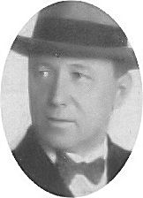Budapesten Aggházy Károlynál a Nemzeti Zenedében ta-nult. Tehetségével azonnal kitünt, az 1894-95-ös évadra Nikisch Artúr a budapesti Operaház zenekarába hegedűs-nek szerződtette. Ezt követően Ney Dávid operaénekes (basszbariton) zongorakísérőjeként járta az országot.

1898-tól Komjáthy Jánosnál Győrött, 1901-től pedig a *Bu-dai Színkörben* Krecsányi Ignác társulatában volt karmes-ter. 1903-ban a Beöthy László alapította *Király Színházhoz* szerződött. Vincze Zsigmond élete végéig itt volt dirigens. Hangszerelésében került színpadra Kacsóh Pongrác *János vitéze*, amit legalább háromszázszor ve-zényelt. 1928-ban ugyan két szezonra Szegedre szerződött, de utána visz-szatért a *Király Színházba*.

1922. január 31-én mutatták be a *Városi Színházban* (ma Erkel Színház) *A hamburgi menyasszony* c. operettjét, amiben az I. felvonás fináléjában fel-hangzott a *„Szép vagy, gyönyörű vagy, Magyarország”* c. dal. 1924. már-cius 29-én bemutatották egyetlen operáját, *Az erősebb* c. egyfelvonásos zenedráma(!) nem lett maradandó alkotás. Életében néhány darabja eljutott külföldi színpadokra is. Számos gramofonfelvétel őrzi játékát, amin külön-böző műfajokban zongorakísérőként működik közre.

Művei: *Tilos a csók (operett 1909.) Limonádé ezredes (énekes vígjáték 1912.) A cigány grófné (operett 1920.) A gárdista (regényes operett 1923.) Az erősebb (zenedráma 1924.) Annabál (1925.) Aranyhattyú (operett 1927.) Az aranyszőrű bárány (1929.) Huszárfogás (operett 1930.) Jobb mint otthon (1930.) stb.* Forrás: [*Magyar Színművészeti Lexikon*](http://mek.oszk.hu/08700/08756/html/IVa/szin_IV.0564.htm)

**Vinkler László** (Szabadka, [1912](http://hu.wikipedia.org/wiki/1912). [október 1.](http://hu.wikipedia.org/wiki/Okt%C3%B3ber_1.) - [Szeged](http://hu.wikipedia.org/wiki/Szeged), [1980](http://hu.wikipedia.org/wiki/1980). [december 2.](http://hu.wikipedia.org/wiki/December_2.)) festő, grafikus, művészeti író.

Felsőfokú tanulmányokat a [budapesti](http://hu.wikipedia.org/wiki/Budapest) [Magyar Képző-művészeti Főiskolán](http://hu.wikipedia.org/wiki/K%C3%A9pz%C5%91m%C5%B1v%C3%A9szeti_F%C5%91iskola) folytatott. Első elismerése az 1932-33-ban elnyert *Balló Ede* festőművészről elnevett díj volt. 1935-ben [Rómába](http://hu.wikipedia.org/wiki/R%C3%B3ma) a [*Collegium Hungaricumban*](http://hu.wikipedia.org/wiki/Collegium_Hungaricum_%28R%C3%B3ma%29) al-kotott nyolc hónapon keresztül. 1937-ben *Jellinek Gida*-féle 1000 pengős emlék díjjal jutalmazták.

A második világháborút követően az újonnan létrejövő szegedi Tanárképző Főiskolán a Rajz- és Művészettörténeti Tanszéket ő hozta létre, ezt 1957-ig vezette. 1957-től 1972-ig politikai okokból állásá-tól megfosztották, majd rehabilitálták és megkapta *Fényes Adolf*-díjat.

„Vinkler László szellemi rokona az Európai Iskolának és a Szentendrei Művésztelepen alkotóknak. Szakmai sikereit pályája kezdetén bravúros portréművészetével vívta ki, a műfaj szeretete egész munkásságát végigkí-sérte. Kísérletező hajlamú művészként folyamatosan megközelítette a XX. századi avantgárd festészeti és grafikai törekvéseket. Írásaiban saját maga ideológusaként sajátos terminológia-alkotással is megpróbálkozott (Szür-raffaellista kiáltvány, Szürcézanneizmus)”.

Műveinek jelentős részét a szegedi *Móra Ferenc Múzeum* őrzi. *„Vinkler László mindent tudott, amit manuálisan egy festőnek tudnia kell, és min-dent ismert, amit egy modern embernek és gondolkodónak ismernie kell.”* - jellemezte a művészt az író Németh László.

Forrás: *Kortárs magyar képzőművészeti lexikon 2001.*

**Vizkelety Imre** (Újarad, 1819 január 21. - Pécs, 1895. április 25.) pénz-ügyi titkár, festő.

A jogot Temesvárt, Nagyváradon és Pesten végezte. Már jogász korában arcképeket festett, 1840-ben a bécsi akadémiára ment, ahol főkép Kupel-wieser útmutatása mellett tanult. 1852-ben hivatalt vállalt amelyet csak 1884-ben hagyott el mint pénzügyi titkár. Hivatala mellett Temesvárott, Lugoson, Újvidéken oltárképeket, biedermeier hangvételű arcképeket és számos akvarell tájképet festett. *Aradi honvédek* 1848-ban, *Herkulesfürdő* 1844-ben és *Zrinyi Miklós, A szigetvári hős* c. vízfestményeit a *Délma-gyarországi Muzeum* őrzi Temesvárt. Más műveit a *Magyar Nemzeti Galé-ria* őrzi. Forrás: Szinnyei József: *Magyar írók élete és munkái*

báró **Vojnich Oszkár** (Bajsa, 1864. május 18. - Port Said, Egyiptom, 1914. május 18.) földbirtokos, utazó, földrajzi író.

A régi Bácska egyik leggazdagabb családjának sarjaként több Föld körüli utat tett. Első nagyobb útján, 1893-ban az USA-ba utazott. A következő években Közép- és Nyugat-Európát, majd eljutott a sarkvidéki Spitzbergákig. A tűz-hányok is lázba hozták, így 1903-ban a Vezuv kitörését fi-gyelte meg 1903-ban, míg öt évvel később pedig az óceá-niai szigetvilágban járt, hol a szigetek tűzhányóit tanulmányozta.

Kortársai elsősorban vadászként tartották számon, leveleiben izgalmas vadásztörténeteket írt le. A századelőn a Távol-Keletet és Afrika vadász-területeit járta. Könyvei: *A Spitzbergákig (1899), Oroszországban (1904). A Vesuvion (1906), A Csendes-óceán szigetvilága (1908), Hogyan vadász-szunk veszélyes vadra? (1914) stb.*

Forrás: *Magyar életrajzi lexikon*

**W**

**Wágner János** (Temeskeresztes, 1870. április 20. - Budapest, 1955. május 23.) tanár, botanikus.

1893-ban tanítóképző intézeti tanári képesítést nyerve Csáktornyán, Kiskunfélegyházán, majd Aradon tanítóképző intézeti tanár volt. 1911-ben a budapesti tanítóképző igazgatója, majd főigazgatója. Magyarország és a Balkán flóráját kutatta, ott főleg a bulgáriai Rila-, Rodope- és a Balkán hegységben gyűjtött. Magyarországon különösen Arad és Versec környé-két, valamint az Esterházyak fertődi botanikus kertjét látogatta. Nagy munkát végzett a budai hegyekben, sőt a pesti temetőket is átkutatta egy-egy ritka növény megleléséért. Írt népszerűsítő ifjúsági műveket a botani-káról. Növényeket neveztek el róla, pl., *Tilia* (hárs) *magyarica Wagner*.

Főbb művei: *Magyarország virágos növényei (1903), Magyarország gyógynövényei (saját színes festményeivel 1908), A magyarországi Cen-taureák ismertetése (1910), Magyarország hársai (1941 - 1945) stb.*

Forrás: *Magyar életrajzi lexikon II. 1969. História - Tudósnaptár*

**Wein János** (Boksánbánya, 1829. január 10. - Budapest, 1908. április 2.) bányamérnök, a budapesti vízművek első igazgatója.

1848-ban beállt a nemzetőrségbe, így tanulmányai a bécsi politechnikumba megszakadtak. Részt vett a Krassó-me-gyei bányavárosok védelmében a szerbek és románok el-len. 1848 őszén már a [selmecbányai](http://hu.wikipedia.org/wiki/Selmecb%C3%A1nya) [bányászati akadé-mián](http://hu.wikipedia.org/wiki/Selmeci_Akad%C3%A9mia) tanult, itt [Görgey](http://hu.wikipedia.org/wiki/G%C3%B6rgey_Art%C3%BAr)nél tüzérként harcolt.

A [világosi fegyverletétel](http://hu.wikipedia.org/wiki/Vil%C3%A1gosi_fegyverlet%C3%A9tel) után, visszatért Selmecbányára, hogy befejezze tanulmányait. Selmecen barátkozott össze diáktársával [Maderspach Viktorral](http://hu.wikipedia.org/wiki/Maderspach_Viktor), [1853](http://hu.wikipedia.org/wiki/1853)-ban került bánymérnöknek [Ruszkabányára](http://hu.wikipedia.org/wiki/Ruszkab%C3%A1nya), a Maderspach vállalathoz. Ott feleségül vette Viktor húgát Maderspach An-tóniát, a 48-as forradalom vértanúinak [Maderspach Károly](http://hu.wikipedia.org/wiki/Maderspach_K%C3%A1roly)nak és Buch-wald Franciskának a lányát.

[1866](http://hu.wikipedia.org/wiki/1866)-ban Budára költözött, hol William Lindley angol mérnöknek munka-társa lett, ekkor tervezték és építették Pest városa részére az első korszerű vízművet. Budapest megalakulásakor 1873-ban létrejött a város Vízve-zetéki irodája, melynek első vezetője lett. A főváros vízellátására a Duna kavicságyának felhasználásával a természetes szűrést javasolta, 1880-ban megtervezte, és megépítette a budai vízművet. A XIII. kerület parkot neve-zett el Wein Jánosról, ahol felállították mellszobrát is.

Művei: *Budapest főváros nyilvános vízművei (1883), A főváros vízzel való ellátása (1889)*stb. Forrás: *Révai nagy lexikona. XIX. 1926. *

**Weisz Bernát Ferenc** (Lugos, 1800. augusztus 1. - Budapest, 1888. már-cius 31.) nagykereskedő, bankár, a magyar biztosításügy úttörője.

1820-as években a Szegeden működő *Trieszti Biztosító* kép-viselője volt. 1838-ban Pesten üzletet nyitott, majd bank-házat alapított. Támogadta a hazai iparosítás és hitelezés politikáját.  A Batthány-kormányban, Kossuth mellett a pénzügyminisztérium osztályfőnöke. Közreműködött a bankjegyek (Kossuth-bankó) kibocsájtásában.

A szabadságharc leverését követően börtönbüntetést szen-vedett. A Bach-korszakban Apponyi György kancellár felkérésére ki-dolgozta az állami tűzkár-biztosítás tervezetét. 1861-ben a fővárosi bizott-mány tagja, számos közintézmény (leányárvaház, ingyen Dunafürdők, közraktárak, vízvezeték stb.) létesítését kezdeményezte.

Egyik alapítója és haláláig elnöke a *Kereskedelmi Akadémiának*, a «Pester Lloyd»- társaságnak. Főbb művei: *Az ingatlanok tűzkártérítésének állami szervezetéről (1869), Az ingatlan állami tűzkártérítés keletkezése és fej-lődése Magyarországon (1888). *

Forrás: *Magyar Életrajzi Lexikon.* *Magyar zsidó lexikon*

**Wekerle László** (Módos, 1840. – Budapest, 1918.) filozófiai író.

Édesapja Módos polgármestere volt, kozépfokú tanulmá-nyait Temesvárt, az egyetemet Budapesten végezte. A jog és államtudomány doktori oklevele elnyerése után, mint magánzó főleg irodalommal foglalkozott.

Márki József és Rill József társaságában az 1862-ben megindított *Népnevelők Lapja* szerkesztésénél működött. 1889-ben Máramaros megye tanfelügyelőjének nevezték ki. Cikkei a *Pesti Hirlapban* és a *Corvinában* jelentek meg. A *Corvina *a Magyar Könyvkereskedők Egyletének hetente megjelenő közlönye volt. A jeles lap szerkesztője, földije [Aigner Lajos](https://hu.wikipedia.org/wiki/Abafi_Lajos), a *Corvin Mátyás* szabadkőmű-ves páholy tagja - Wekerle a *Magyarország Nagy-Oriense* páholy mestere volt -. Önálló filozófiai és művelődéstörténeti kutatásokat folytatott. Szer-kesztette a *Magyar Lexikont* és a *Kis Lexikont*. A világháború végén bur-jánzó spanyolnátha járvány áldozata volt.

Művei: *Isten az ő teljes valóságában megismertetve* (1894), *A szükségkép-peniség bölcsészete* (1897), *Isten és a vallásosság új korszaka* (1904), *Népiskoláink gyorsabb fejlesztése* (1892), *Alba Mária mint Árpád sírja* (1895), *Nagyezerév Árpád fejedelem sírja felett* (1907) stb.

Forrás: *[Magyar Katolikus Lexikon](http://lexikon.katolikus.hu/),* Szinnyei József: *[Magyar írók élete és munkái](https://www.arcanum.hu/hu/online-kiadvanyok/Lexikonok-magyar-irok-elete-es-munkai-szinnyei-jozsef-7891B/) *

**Winkler Pál** (Palánka, 1859. január 25. - Kalocsa, 1938. augusztus 27.) pap, könyvtáros, levéltáros.

Pappá szentelését követően a bácskai községek sorában volt káplán. 1897-től a Kalocsai Főszékesegyházi Könyvtárban alkönyvtárosnak nevezték ki. Képességei hamarosan kiemelték, és az érseki könyvtár könyvtárosa és levéltárosa lett, miközben az érseki hivatal iktatójvá tették. Az egyházi pályán folyamatosan emelkedett, 1902-től pápai kápláni rangra emelték, míg végül 1915-től a Főegyházmegye Levéltárának igazgatójává emelték. Cikkei a *Kalocsai Néplapban* (1901-1909), valamint a *kalocsai egyház-megye sematizmusaiban* (1904-1909) jelentek meg. Az 1920-as és 30-as években számos helytörténeti témájú műve jelent meg.

Az *Árpád-könyvek* sorozatban Kalocsán 1926-1935 között a következő munkái jelentek meg. Forrás: *Magyar életrajzi lexikon*. *Magyar Katolikus Lexikon.*

**Wolf Vilmos** (Törökkanizsa, 1853 – Budapest, 1925. október 3.) ügyvéd, jogi szakíró, újságíró.

Jogi tanulmányai közben újságíróként működött a *Pesti Hírlap*nál, majd a *Budapesti Hírlap*nál is. 1880-ban, tanulmányai befejezése után ügyvéd lett. Elismert kiváló kriminalista volt, aki főleg a kilencvenes években több nagy bűnperben szerepelt védőként. 1880 óta főmunkatársa volt az *Ügy-védi Közlöny*nek, megalapította, és szerkesztette az *Ügyvédek Lapja* című szakfolyóiratot. Számos gyakorlati jellegű kommentárt, döntvénygyűjte-ményeket szerkesztett.

Írásai: *A magyar ügyvédi rendtartás* (1886), *A magyar csődtörvény* (1886), *Az ügyvédi rendtartás tervezetiről* (1906) *A m. kir. kúria ügyvédi taná-csának elvi jelentőségű határozatai* (1 – 12. füzet, 1909–1910).

Források: *Magyar életrajzi lexikon*, *Magyar zsidó lexikon*

**Z, Zs**

**Zabik László Gyula** (Óverbász, 1896. december 5. - Budapest, 1967. október 8.) újságíró.

Szigorló orvosként az I. világháborúban 1917-től katona. 1920-tól Rassay Károly  liberális pártlapjának az *Esti Kurírnak* szerkestőségi munkatársa. A 1924-1945 között a fővárosi *Budapesti Közlöny* szerkesztőségében dol-gozott. A [*Budapesti Közlöny*](https://dtt.ogyk.hu/hu/gyujtemenyismertetok/jogforrasok/hivatalos-kozlonyok/item/416-budapesti-kozlony-1867-1944) 1945-ben megszűnt, helyette a *Magyar Köz-löny* lett a hivatalos lap, melynek első száma 1945. január 4-én jelent meg Debrecenben. Zabik László 1948-ig a lap munkatársaként dolgozott. Az első tizenöt számot követően a továbbiakban a kormány hivatalos lapja-ként jelent meg.

A koalíciós korszakban az MTI formailag kisgazda (Ortutay Gyula) poli-tikusok irányítása alatt állt, valójában azonban a kommunista párt kor-látlanul érvényesítette befolyását a hírügynökség munkájában. Zabik Lász-ló ezt követően két esztendeig az országgyűlés gyorsírója volt, majd a „legendás időkben” 1953-tól 1957-ig, nyugdíjazásáig volt a kiemelten megbízhatóságot követelő magyar [állami](https://hu.wikipedia.org/wiki/%C3%81llam) [hírügynökség](https://hu.wikipedia.org/wiki/H%C3%ADr%C3%BCgyn%C3%B6ks%C3%A9g), az Magyar Távi-rati Iroda (MTI) munkatársa. Forrás: *Magyar életrajzi lexikon*

**Zambra Alajos** (Fiume, 1886. február 7. - Budapest, 1947. december 29.) irodalomtörténész, egyetemi tanár.

Pietro Zambra (Zambra Péter)  irodalomtörténésznek, a budapesti egyetem olasz nyelv és irodalom tanárának a fia. Középiskolai tanulmányait Fiuméban a magyar tan-nyelvű királyi állami főgimnáziumban végezte.

A budapesti egyetemen jogi karán 1909-ben avatták jogi doktorrá. A *Szövetkezett Ellenzék* kormányzása alatt Ap-ponyi Albert közoktatási miniszter kinevezte az *Iparmű-vészeti Múzeum* segédőrének. 1920-1924 között a budapesti olasz követség sajtóreferense. 1920-tól a budapesti egyetemen az olasz nyelv és irodalom rendkívüli, nyílvános rendes tanára. 1921-ben Dante halálának hatszázadik évforduló-jára, létrejött *Corvin Mátyás Társaság* tagja.

Tanulmányaiban a magyar-olasz kulturális kapcsolatokkal foglalkozott, melyek magyar és olasz folyóiratokban jelentek meg. A Budapesti Tudo-mányegyetem *Olasz Intézetének kiadványai* c. sorozatát szerkesztette, ezen intézet vezetőjeként működött haláláig. Bevezetőt írt Pellico Silvio *Börtöneim* c. műve magyar kiadásához.

Forrás: *Magyar életrajzi lexikon I–IV.* Szinnyei: *Magyar írók élete és munkái.*

**Zathureczky Gyula Albert** (Őszény, 1907. július 5. - München, 1987. június 6.) író, újságíró.

Egyetemi tanulmányait a Debreceni Egyetem jogi karán végezte. Karrierje [budapesti](http://hu.wikipedia.org/wiki/Budapest) újságoknál indult. 1928-ban a [Magyar Távirati Iroda](http://hu.wikipedia.org/wiki/Magyar_T%C3%A1virati_Iroda) munkatársa lett. 1938-ban a fővárosi *Függetleséghez* került. 1940-től riporter [Ber-linben](http://hu.wikipedia.org/wiki/Berlin) és a [*Pester Lloyd*](http://hu.wikipedia.org/wiki/Pester_Lloyd) munkatársa volt. 1941-1944 között az *[Ellenzék](http://hu.wikipedia.org/wiki/Ellenz%C3%A9k_%28napilap%29)* című lap szerkesztője volt. 1944 nyarán az *Esti Magyarország* című lap munkatársa volt. Rövid ideig az Erdélyi Magyar Újságírószövetség tagja volt. A második világháború alatti "fasiszta" tevékenységére hivatkozva [1946](http://hu.wikipedia.org/wiki/1946). április 15-én a [kolozsvári népbíróság](http://hu.wikipedia.org/w/index.php?title=Kolozsv%C3%A1ri_n%C3%A9pb%C3%ADr%C3%B3s%C3%A1g&action=edit&redlink=1) távollétében 20 év börtönre ítélte. 1948-ban szabadult ki a hadifogságból, ekkor Ausztriában, majd [Nyugat-Németországban](http://hu.wikipedia.org/wiki/Nyugat-N%C3%A9metorsz%C3%A1g) élt, ahol Dél-Európa irodalmával foglalkozott.

1979-től haláláig a *Hadak útján* című lap szerkesztője volt.

Művei: *Erdély, amióta másként hívják. 1939. Az úton végig kell menni (1954. németül: 1963), Elszakított magyarság (társszerző, 1956), Mit den Augen eines Protestanten (esszé, 1962) Die siebenbürgische Frage (Ko-vách Aladárral, 1965), Transylvania, Citadel of the West (1965) stb*.

Forrás: *Magyar életrajzi lexikon*

**Zimándi** *Zilich* **Pius** **István** (Bezdán, 1909. augusztus 27. - Budapest, 1973. december 20.) irodalomtörténész, pedagógiai szakíró.

A trianoni döntésnek „köszönhetően” került Kis-Ma-gyarországra a gödöllői premontrei gimnáziumba. Itt be-lépett a [Szent Ágoston reguláját](https://hu.wikipedia.org/wiki/Szent_%C3%81goston_regul%C3%A1ja) követő [premontrei](https://hu.wikipedia.org/wiki/Premontrei_rend) - a rend szintén menekült volt, a felvidéki Jászóról települt Gödöllőre - rendbe. Zimándi István a budapesti egyete-men magyar-latin szakos tanári diplomát szerzett.

A második világháború alatt a Pázmány Péter Katolikus Egyetem tanárképző intézetében tartott előadásokat. Tanulmányaiban fő-leg a tragikus sorsú katolikus irodalmár, Péterfy Jenő életével és munkás-ságával foglalkozott.

A világháborút követően a kommunista hatalomépítés koszakában újjé-ledő keresztényüldözése idején, barátja Rónay György költő és keresztény politikus lakásán rejtőzött. A diktatúrának is szüksége van szakemberekre, különössen akik világnyelveket beszéltek, így 1956-tól az MTA Nyelvtu-dományi Intézetének külső munkatársa lett.

A forradalom idején Zimándi Pius naplót vezetett az 1956-os budapesti eseményeiről. A kézirat elsőrendű forrásként jelent meg a későbbi kutatók számára, *A ​forradalom éve Krónika 1956-ból* címmel.

Forrás: *Magyar életrajzi lexikon*

**Zsák Hugó**, (Temesvár, 1844 február 11. - Budapest, 1915 november 12.) mérnök.

A műegyetemet Budán végezte. Tanulmányai befejeztével 1867-től a közlekedésügyi (mostani kereskedelemügyi) minisztérium szolgállatában kezdte meg működését. 1871-ben a budapesti Dunaszabályozó Felügyelő-ségnél tevékeny részt vett a budapesti és budapest alatti Dunaszakasz sza-bályozási és rendezési munkálatainál. Vezetése alatt épült a soroksári Dunaágat elzáró gubacsi gát. 1875-ben a budapesti magyar királyi folyam-mérnöki hivatalvezetője lett.

1879-ben főmérnökké, 1886-ban középítészeti felügyelővé és a műszaki tanács tagjává nevezték ki. 1887-ben műszaki tanácsos, 1890-ben a föld-művelésügyi minisztériumban a budapesti Duna-szakasz kerületi felü-gyelője lett. Az ő nevéhez fűződik a Margit-híd feletti baloldali és az Er-zsébet-híd alatti jobboldali rakodópartok kiépítése.

1894-ben osztálytanácsos lett, végül 1908-ban 40 évi állami szolgálat után, mint miniszteri tanácsos vonult nyugalomba. Budapest XXI. Kerületében (Csepel) utca viseli a nevét.

Forrás: *Révai nagy lexikona. XX. kötet.*

zsitvateői **Zsitvay Leó** (Vukovár, 1841. február 16. - Budapest, 1915. má-jus 26.) kúriai tanácselnök, jogi író.

1858-ban Bécsben jogot halgatott, tanulmányait 1861-62-ben Pesten fejezte be. Több ügyvédnél volt gyakor-laton, majd maga is ügyvédi irodát nyitott. Főügyészi karrierjét a 1867-ben Moson vármegyében kezdte, hol a magyaróvári törvényszékhez nevezték ki.

1876-ban Pozsonyba, később a szombathelyi törvény-székhez helyezték át, ahol a törvényszék elnökeként mű-ködött. 1891-től a budapesti törvényszék büntetőosztályának vezetője lett. 1895-ben kinevezték az önállósított büntetőtörvényszék elnökévé.

1909-1913 között a Magyar Királyi Kúria kúriai tanácselnökeként műkö-dött, innét vonult nyugalomba. Mint törvényszéki elnökként elsősorban esküdtszéki (sajtó) tárgyalásokat vezette, ottani tekintélyét a korabeli fel-jegyzések tanúsága szerint igazságosságával és kíméletlenségig menő szi-gorával érdemelte ki. Kortársai és kollégái illeték őt a „nagy bíró” jelzővel. Hajdan az V. kerületben utca (ma Bihari János utca) viselte a nevét.

Művei: *A magyar sajtójog mai érvényében (1900), Hatásköri kérdések (1901), A büntetőtörvénykönyv novellája (1909).*

Forrás: *Magyar életrajzi lexikon.* *Szinnyei József: Magyar írók élete és munkái XIV.*

**Fogalmak - rövidítések:**

**Abszolutórium**  – a felsőoktatási tanulmányi kötelezettségek teljesítését igazoló végbizonyítvány

**Augustineum** – [I. Ferenc magyar király](https://hu.wikipedia.org/wiki/Ferenc_magyar_kir%C3%A1ly) által [Bécsben](https://hu.wikipedia.org/wiki/B%C3%A9cs) Hippói Szent Ágos-ton címére alapított felsőbb papnevelde

**Pázmáneum **– (Collegium Pazmanianum) a [Pázmány Péter](https://hu.wikipedia.org/wiki/P%C3%A1zm%C3%A1ny_P%C3%A9ter) bíboros, esz-tergomi érsek által [1623](https://hu.wikipedia.org/wiki/1623)-ban [Bécsben](https://hu.wikipedia.org/wiki/B%C3%A9cs) alapított [papnevelő intézet](https://hu.wikipedia.org/wiki/Szemin%C3%A1rium_(papnevel%C5%91_int%C3%A9zet)) neve

[**Entomológia**](http://hu.wikipedia.org/wiki/Entomol%C3%B3gia) – azaz *rovartan*, a hatlábú ízeltlábúakkal foglalkozó bioló-giai tudomány

**Herpetológia** – [kétéltűek](http://hu.wikipedia.org/wiki/K%C3%A9t%C3%A9lt%C5%B1ek) és [hüllő](http://hu.wikipedia.org/wiki/H%C3%BCll%C5%91k)k tudományága

**Magyarországi Symbolikus Nagypáholy** – Magyarországon 1886-ban -a világon egyedülállóan- két különböző orientációjú nagypáholy egyesült.

**Fotogrammetriai térképezés** (a terepről készített fényképek alapján a képeken végzett mérések)

**c. ny. rk.** - címzetes nyilvános rendkívüli tanár

**Status quo Ante** – (hagyományokhoz hű) irányzathoz tartozott

**sic!** – [latinul](https://hu.wikipedia.org/wiki/Latin), jelentése: így

**Kommendátor** (lat. pártfogó';) az egyházi [lovagrend](http://lexikon.katolikus.hu/L/lovagrend.html)ben a legkisebb igaz-gatási egység (rendház, hozzátartozó birtok, esetleg vár) elöljárója

**Homo regius -** a királynak bonyolult ügyek megoldásával megbízott bizalmas embere

**MOVE** (Magyar Országos Véderő Egylet) katonatisztekből álló parami-

[litáris](https://hu.wikipedia.org/wiki/Paramilit%C3%A1ris) [civilszervezet](https://hu.wikipedia.org/wiki/Civilszervezet), melynek célja a [trianoni békefeltételek](https://hu.wikipedia.org/wiki/Trianoni_b%C3%A9ke)kek lecsök-kentett haderő támogatása volt

**Magyarországi Symbolikus Nagypáholy** – Magyarországon 1886-ban - a világon egyedülállóan - két különböző orientációjú nagypáholy egyesült

**Fotogrammetriai térképezés** – a terepről készített fényképek alapján a képeken végzett mérések

**MTA** – A Magyar Tudományos Akadémia (MTA) [magyarországi](https://hu.wikipedia.org/wiki/Magyarorsz%C3%A1g) tudo-mányos [köztestület](https://hu.wikipedia.org/wiki/K%C3%B6ztest%C3%BClet)

**MTA–TMB** – Akadémia Tudományos Minősítő Bizottságának

**MTI** - Magyar Távirati Iroda, magyar [állami](https://hu.wikipedia.org/wiki/%C3%81llam) [hírügynökség](https://hu.wikipedia.org/wiki/H%C3%ADr%C3%BCgyn%C3%B6ks%C3%A9g) 1880 és 2015 között. Fő fő feladata a sajtó friss hírekkel való ellátása volt.

**SZIA** – A Szent István Akadémia (1915–1951) a tudományok katolikus szellemű művelését tűzte ki célul. [Kánonjogilag](https://hu.wikipedia.org/w/index.php?title=K%C3%A1nonjog&action=edit&redlink=1) tudományos testület, melynek fővédnöke Magyarország mindenkori [prímása](https://hu.wikipedia.org/wiki/Pr%C3%ADm%C3%A1s)

**JATE BTK** – [Szegedi Tudományegyetem | Bölcsészettudományi Kar](https://www.google.hu/url?sa=t&rct=j&q=&esrc=s&source=web&cd=1&cad=rja&uact=8&ved=0ahUKEwiisrvAzsvOAhWGthQKHf9PDtoQFggaMAA&url=http%3A%2F%2Fwww.arts.u-szeged.hu%2F&usg=AFQjCNF2i1gcVcTLX1TsGEDMNO7KpS5HKg&sig2=a7JPEG-UObgKwFqerNcAhw). [1962](https://hu.wikipedia.org/wiki/1962)-ben az egyetemet [József Attila](https://hu.wikipedia.org/wiki/J%C3%B3zsef_Attila) után nevezték el (JATE)

**JNMGE** – Magyar királyi József nádor Műszaki és Gazdaságtudományi Egyetem

**Jurátus** – joggyakornok; képzett, de még önállóan nem tevékenykedő jo-gász

**ELTE** – A [budapesti](https://hu.wikipedia.org/wiki/Budapest) Eötvös Loránd Tudományegyetem (ELTE) [Magyar-ország](https://hu.wikipedia.org/wiki/Magyarorsz%C3%A1g) legrégebbi folyamatosan működő és az egyik legnagyobb [egyete-me](https://hu.wikipedia.org/wiki/Egyetem)

**OFM** – A ferences rend, más néven ferencesek, [római katolikus](https://hu.wikipedia.org/wiki/Latin_r%C3%ADtus%C3%BA_katolikus_egyh%C3%A1z) [szerze-tesrend](https://hu.wikipedia.org/wiki/Szerzetesrend), melyet [Assisi Szent Ferenc](https://hu.wikipedia.org/wiki/Assisi_Szent_Ferenc) alapított [1209](https://hu.wikipedia.org/wiki/1209)-ben. Neve latinul: *Ordo Fratrum Minorum* (Kisebb Testvérek Rendje), kolduló rend

**OSB** – rövidítve: *Ordo Sancti Benedicti*, a [Római katolikus egyház](https://hu.wikipedia.org/wiki/R%C3%B3mai_katolikus_egyh%C3%A1z) és a [kereszténység](https://hu.wikipedia.org/wiki/Kereszt%C3%A9nys%C3%A9g) első [szerzetesrendje](https://hu.wikipedia.org/wiki/Szerzetesrend), amelyben [Szent Benedek reguláját](https://hu.wikipedia.org/w/index.php?title=Szent_Benedek_regul%C3%A1ja&action=edit&redlink=1) követik

**OPraem** – A premontrei kanonokrend (vagy *norbertrend*) a [katolikus egyház](https://hu.wikipedia.org/wiki/R%C3%B3mai_katolikus_egyh%C3%A1z) egyik [szerzetesrendje](https://hu.wikipedia.org/wiki/Szerzetesrend), amely [Szent Ágoston reguláját](https://hu.wikipedia.org/wiki/Szent_%C3%81goston_regul%C3%A1ja) követi

**OCist** – Ordo Cisterciensium, Ciszterci Rend ciszterciek, ciszterci apácák.

**Piar** – A piarista rend [katolikus](https://hu.wikipedia.org/wiki/R%C3%B3mai_katolikus_egyh%C3%A1z) tanító [szerzetesrend](https://hu.wikipedia.org/wiki/Szerzetesrend). Teljes neve: *Ordo Clericorum Regularium Pauperum Matris Dei Scholarum Piarum*, régebbi magyar elnevezése: *kegyestanítórend* vagy *kegyesrend*

**SJ** – A jezsuiták (latinul: *Societas Jesu*) a *Jézus Társasága* [katolikus](https://hu.wikipedia.org/wiki/R%C3%B3mai_katolikus_egyh%C3%A1z) [szerzetesrend](https://hu.wikipedia.org/wiki/Szerzetesrend) tagjai. A társaság [magyarul](https://hu.wikipedia.org/wiki/Magyar_nyelv) főként jezsuita rend néven ismert

**RSCJ** – A Jézus Szent Szíve dicsőségéért a nevelés apostoli szolgálatát végző pápai jogú kongregáció. Rendi rövidítés: RSCJ (Religieuses du Sacré Coeur de Jesu)

**SJC** – Societas Jesu Cordis Jézus Szive Társaság-népleányok

**Manréza** - A Manréza [jezsuita](https://hu.wikipedia.org/wiki/J%C3%A9zus_T%C3%A1rsas%C3%A1ga) lelkigyakorlatos ház

**KN** – Szent Keresztről Nevezett Irgalmas Nővérek – Keresztes Nővérek

**CSA** – Canonici Regulares Sancti Augustini, Szent Ágoston Szabályozott Kanonok, ágostonos kanonokok, ágostonos kanonisszák

**IML** – Isteni Megváltó Leányainak Soproni Kongregációja

**MSZI** – Miasszonyunkról nevezett Szegény Iskolanővérek

**MKSZI** – Miasszonyunkról nevezett KALOCSAI Szegény Iskolanővérek

**címzetes püspök** – (lat. episcopus titularis): minden olyan fölszentelt püs-pök, aki nem a szó szoros értelmében vett [megyéspüspök](http://lexikon.katolikus.hu/M/megy%C3%A9sp%C3%BCsp%C3%B6k.html).

**adminisztrátor** – a reformkor idején a hatalomnak nem tetsző ispánok helyett, a feladatukat végző királyi biztosok elnevezése

**c. apát** – címzetes apát, címzetes prépost

**KALOT** – Katolikus Agrárifjúsági Legényegyesületek Országos Testülete

**m. kir.** – magyar királyi

**v. m.** – vármegye

**sz. kir.** – szabad királyi

**A szent rendek fölvétele** – (a püspök általi felszentelés, a hatodik, a *pap-ság szentsége*)

**Csanád, Arad és Torontál k.e.e.** – *K. E. E.* (*Közigazgatásilag Egyenlőre* *Egyesített*) vármegye

**c. ny. rk.** – címzetes, nyilvános, rendkívüli

**r.-t.** – részvénytársaság

**v. b. t. t.** – valóságos belső titkos tanácsos

**cs. és kir.** – császári és királyi

**MÁV** – A MÁV [Magyarország](https://hu.wikipedia.org/wiki/Magyarorsz%C3%A1g) állami vasúttársasága

**KMP** – A Kommunisták Magyarországi Pártja

**MKP** – A Magyar Kommunista Párt (MKP) [1944](https://hu.wikipedia.org/wiki/1944) [októberében](https://hu.wikipedia.org/wiki/Okt%C3%B3ber), a szovjet csapatok bevonulását követően újjáalakult kommunista párt volt.

**MSZDP** – A Magyarországi Szociáldemokrata Párt (röviden: MSZDP) egy [1890](https://hu.wikipedia.org/wiki/1890). [december 7-én](https://hu.wikipedia.org/wiki/December_7.) alakult magyar [szociáldemokrata](https://hu.wikipedia.org/wiki/Szoci%C3%A1ldemokr%C3%A1cia) párt

**MÉMOSZ** – A Magyarországi Építőmunkások Országos Szövetsége

**KV** – Központi Vezetősége

**PB** – Politikai Bizottsága

**KB** – Központi Bizottsága

**KIMSZ** – A Kommunista Ifjúmunkások Magyarországi Szövetsége (KIMSZ) a [Kommunisták Magyarországi Pártja](https://hu.wikipedia.org/wiki/Kommunist%C3%A1k_Magyarorsz%C3%A1gi_P%C3%A1rtja) ifjúsági szervezete

**MDP** – A Magyar Dolgozók Pártja (MDP) [sztálinista](https://hu.wikipedia.org/wiki/Szt%C3%A1linizmus) irányvonalat követő [kom-munista](https://hu.wikipedia.org/wiki/Kommunizmus) párt volt Magyarországon [1948](https://hu.wikipedia.org/wiki/1948) és [1956](https://hu.wikipedia.org/wiki/1956) között

**SzU** – A Szovjet Szocialista Köztársaságok Szövetsége

**MSZMP** – A Magyar Szocialista Munkáspárt (MSZMP)

**OTI** – [Országos Társadalombiztosítási Intézet](https://hu.wikipedia.org/w/index.php?title=Orsz%C3%A1gos_T%C3%A1rsadalombiztos%C3%ADt%C3%A1si_Int%C3%A9zet&action=edit&redlink=1)

**SZTK** – Szakszervezetek Társadalombiztosítási Központja

**SZOT** – A Szakszervezetek Országos Tanácsa volt

**SzB** – Szakszervezeti Bizottság

**SD** – Sicherheitsdienst - a náci Németország Biztonsági Szolgálata

**Gestapo** – Geheime Staatspolizeiamt,  a Porosz Államrendőrségi Hivatala

**OMGE** – Az *Országos Magyar Gazdasági Egyesület* (OMGE) a magyar mezőgazdaság ügyét szolgáló országos egyesület volt 1827 és 1945 között

**GYOSZ** – A Gyáriparosok Országos Szövetsége

**A plein air festésmód** – (természetes szórt fény) szerepük volt a [realiz-mus](https://hu.wikipedia.org/wiki/Realizmus_(m%C5%B1v%C3%A9szet)) és az [impresszionizmus](https://hu.wikipedia.org/wiki/Impresszionizmus) kialakításában.

**VAOSZ** - Városi, vármegyei és községi alkalmazottak országos szövet-sége.

**Tachyméter** - [gyorsmérő műszer](https://dictzone.com/magyar-angol-szotar/gyorsm%C3%A9r%C5%91%20m%C5%B1szer) - [optikai távolságmérés lőelemek meg-állapítására](https://dictzone.com/magyar-angol-szotar/optikai%20t%C3%A1vols%C3%A1gm%C3%A9r%C3%A9s%20l%C5%91elemek%20meg%C3%A1llap%C3%ADt%C3%A1s%C3%A1ra)

**Források: **

Borovszky Samu: *Magyarország vármegyéi és városai,* Budapest, Apolló Irodalmi és Nyomdai Részvénytársaság, 1909

*Révai Új Lexikona* (Szekszárd, 2006) (ISBN-10 963 9556 41 6)

*A Pallas Nagy Lexikona*, Budapest, Pallas Irodalmi és Nyomdai Rt., 1893-1897

*Magyar tudóslexikon* *A-tól Zs-ig* (Főszerkesztő Nagy Ferenc), Budapest, Better, MTESZ OMIKK, 1997  (ISBN 963-85433-5-3)

*Magyar katolikus lexikon.* (Főszerkesztő [Diós István](https://hu.wikipedia.org/w/index.php?title=Di%C3%B3s_Istv%C3%A1n&action=edit&redlink=1), szerkesztő [Viczián János](https://hu.wikipedia.org/w/index.php?title=Viczi%C3%A1n_J%C3%A1nos&action=edit&redlink=1)), Budapest, Szent István Társulat, 1993-2010

[Szinnyei József](https://hu.wikipedia.org/wiki/Szinnyei_J%C3%B3zsef_(bibliogr%C3%A1fus)): [*Magyar írók élete és munkái*,](http://mek.oszk.hu/03600/03630/html/k/k11551.htm) Budapest, Hornyánszky, 1899

Gulyás Pál: *Magyar írók élete és munkái*, Budapest, Argumentum, 2002

*Magyar életrajzi lexikon I-II.* (Főszerkesztő Kenyeres Ágnes), Budapest Akadémiai Kiadó, 1967-1969

[*Új magyar életrajzi lexikon*](https://hu.wikipedia.org/wiki/%C3%9Aj_magyar_%C3%A9letrajzi_lexikon) (Főszerk. Markó László), Budapest, Magyar Könyvklub, 2002 ([ISBN 963-547-414-8](https://hu.wikipedia.org/wiki/Speci%C3%A1lis:K%C3%B6nyvforr%C3%A1sok/9635474148))

*Új magyar irodalmi lexikon* (Főszerkesztő Péter László), Budapest, Akadémiai Kiadó, 1994

Fazekas István-Ács Margit-Agócs Sándor-Bognár Antal: *Kortárs magyar írók kislexikona 1959-1988*, Magvető Könyvkiadó, 1989 ([ISBN 963-141-604-6](https://hu.wikipedia.org/wiki/Speci%C3%A1lis:K%C3%B6nyvforr%C3%A1sok/9631416046))

*[Magyar nagylexikon](https://hu.wikipedia.org/wiki/Magyar_nagylexikon)* (Főszerkesztő Bárány Lászlóné), Budapest, 2000 ([ISBN 963-9257-04-4](https://hu.wikipedia.org/wiki/Speci%C3%A1lis:K%C3%B6nyvforr%C3%A1sok/9639257044))

*Magyar agrártörténeti életrajzok* (Szerkesztők Für Lajos, Pintér János), Budapest, Magyar Mezőgazdasági Múzeum, 1988 ([ISBN 963-7092-05-6](https://hu.wikipedia.org/wiki/Speci%C3%A1lis:K%C3%B6nyvforr%C3%A1sok/9637092056))

*A Magyar Tudományos Akadémia tagjai 1825-2002* (Főszerkesz-tő Glatz Ferenc), Budapest, MTA Társadalomkutató Központ, 2003 

Sitkei Gyula: *A magyar elektrotechnika nagy alakjai*, Budapest, Ener-getikai Kiadó Kht., 2005

[*Magyar orvoséletrajzi lexikon* (](http://www.tankonyvtar.hu/hu/tartalom/tkt/magyar-orvoseletrajzi/adatok.html)Összeállította Kapronczay Károly, közre-működött Tóth Magda), Budapest, Mundus Magyar Egyetemi Kiadó, 2004 (ISBN 963-950-132-8)

[*Magyar zsidó lexikon*](https://hu.wikipedia.org/wiki/Magyar_zsid%C3%B3_lexikon) (Szerkesztette Ujvári Péter), Budapest, 1929

*Magyar színházművészeti lexikon* (Főszerkesztő Székely György) Buda-pest, Akadémiai kiadó, 1994 ([ISBN 963-05-6635-4](https://hu.wikipedia.org/wiki/Speci%C3%A1lis:K%C3%B6nyvforr%C3%A1sok/9630566354))

*Magyar művészeti kislexikon kezdetektől napjainkig* (főszerkesztő Körber Ágnes), Budapest, Enciklopédia Kiadó, 2002 ([ISBN 9638477660](https://hu.wikipedia.org/wiki/Speci%C3%A1lis:K%C3%B6nyvforr%C3%A1sok/9638477660))

*Művészeti lexikon* (Főszerkesztők Zádor Anna, Genthon István), 3. kiadás, Budapest, Akadémiai kiadó, 1983

Kapronczay Károly: *Zenei Lexikon* (Főszerkesztő dr. Bartha Dénes), Budapest, Zeneműkiadó Vállalat, 1965

Rátonyi Róbert: *Az operett csillagai I-II.,* Színháztudományi Intézet, Bu-dapest, 1967

*A magyar muzsika könyve* (Szerkesztette Molnár Imre) Budapest, Mer-kantil-nyomda (Havas Ödön), 1936

Hóman-Szekfű: *Magyar történet*, Budapest, 1928

Bánlaky József: *A magyar nemzet hadtörténelme* *I-XXII*, Budapest, 1928-1942

[Györffy György](https://hu.wikipedia.org/wiki/Gy%C3%B6rffy_Gy%C3%B6rgy) *István király és műve*, Gondolat, Budapest, 1983 ([ISBN 963-281-221-2](https://hu.wikipedia.org/wiki/Speci%C3%A1lis:K%C3%B6nyvforr%C3%A1sok/963-281-221-2))

Gondos László: *Repülőászok 1914-1918*, Budapest, Zrínyi Kiadó, 2015 ([ISBN 978 963 327 634 1](https://hu.wikipedia.org/wiki/Speci%C3%A1lis:K%C3%B6nyvforr%C3%A1sok/978_963_327_634_1))

Pünkösti Árpád: [*Rákosi, Sztálin legjobb tanítványa*](http://mek.oszk.hu/05300/05384/index.phtml), Budapest, Európa Kiadó, 2004 [ISBN 9630776634](https://hu.wikipedia.org/wiki/Speci%C3%A1lis:K%C3%B6nyvforr%C3%A1sok/9630776634)

Rózsaligeti László: *Magyar olimpiai lexikon*, Budapest, Datus, 2000 ([ISBN 963 00 5577 5](https://hu.wikipedia.org/wiki/Speci%C3%A1lis:K%C3%B6nyvforr%C3%A1sok/9630055775))

Slobodan Ćurčić: *Broj stanovnika Vojvodine*, Novi Sad, 1996

*A Vajdasági Magyarok Néprajzi Atlasza*, Szabadka, Kiss Lajos Néprajzi Társaság, 2003

Iványi István: *Bács Bodrog vármegye földrajzi és történelmi helynévtára* *I-V.*, Szabadka, 1991

Kalapis Zoltán: Életrajzi kalauz I-III., Újvidék, Fórum, 2002/2003

[Nádori László](https://hu.wikipedia.org/wiki/N%C3%A1dori_L%C3%A1szl%C3%B3): *Sportlexikon I-II.kötet*, Sport Kiadó, 1986 ([ISBN 963 253 442 5](https://hu.wikipedia.org/wiki/Speci%C3%A1lis:K%C3%B6nyvforr%C3%A1sok/9632534425))

**Önéletrajz**

1957. július 7-én születettem a zentai kórházban.

Gyermekkoromat a Csókához tartozó Réti-major-ban töltöttem, ott, ahol a könyvben szereplő Bor-bély Lajos is.

Édesapám - aki élmunkás és munkavezető volt az állami birtokban -, védőszárnyai alatt (édesanyám ugyanott a munkáskonyhán főzött), valamint kiter-jedt rokonságom körében, mintegy „védett rezervá-tumban” nőttem fel.

Az általános iskolát Csókán fejeztem be, és a hely-beli könyvtár egyik legelszántabb olvasói közé tar-toztam.

A Zentai Gimnáziumban érettségiztem, mindezidáig anyanyelven tanulva.

Ezt követően Újvidéken a Bölcsészettudományi Tanszék történelem szakán tanultam, zömmel szerb nyelven vizsgázva.

A kötelező katonai szolgálat és a diplomaszerzés után (egy rövid csókai és palicsi kitérő után) Magyarkanizsán kezdtem el dolgozni, ott találtam rá életem párjára, a szintén pedagógusként tevékenykedő, Basa, szül. Kovács Rózsára.

A 80-as végén kitörő háborúk elől Magyarországra települtünk át, ahol négy évig a mezőkovácsházi Hunyadi János Gimnáziumban dolgoztunk.

A háborús hisztéria csökkenésével újra hazatelepedtünk, az Óbecsei Gim-náziumban tanítottunk.

Rövid időre újra Magyarország következett, míg jelenleg a zentai Bolyai Tehetséggondozó Gimnázium és Kollégium tanáraiként tevékenykedünk.

Szabadidőmet kutatómunkával töltöm, e kiadvány is a több évtizedes kuta-kodás eredménye.

*A borítón szereplők balról jobbra:*

*Kosztolányi Dezső, Bartók Béla, Kerpely Kálmán,*

*Preisz Hugó és Herczeg Ferenc*
